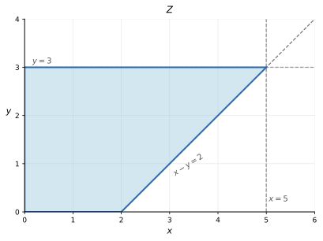
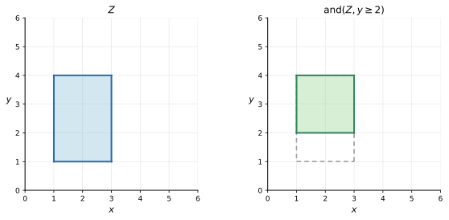
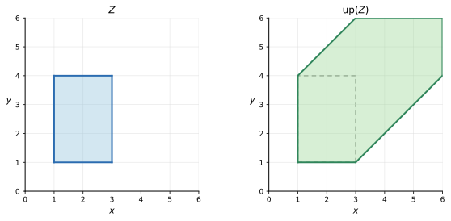
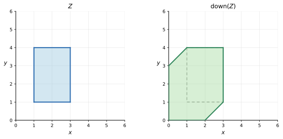
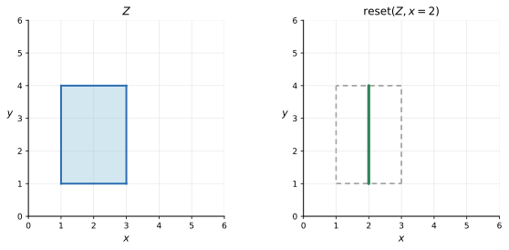
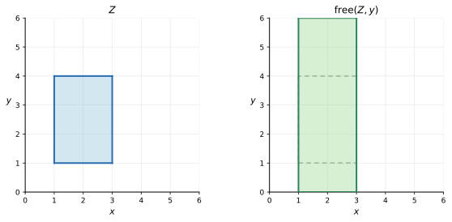

DBM Basics
==========

This page answers the next question after
:doc:`../symbolic-states/index`: **if a zone is a set of valuations, why can a
matrix represent it at all?**

For UPPAAL-style symbolic verification, the answer is a very specific one:
a **difference bound matrix (DBM)** stores upper bounds on pairwise clock
differences. That is exactly expressive enough for the guard and invariant
language used in timed automata, and it supports the core symbolic operations
that UDBM exposes in practice [UPP_VER_DBM]_ [BY04_DBM]_ [BENG02_DBM]_ [UDBM_REPO]_.

Representation, Encoding, And Design Intuition
----------------------------------------------

The Running Zone
~~~~~~~~~~~~~~~~

Start from one concrete convex zone over clocks ``x`` and ``y``:

.. math::

   0 \leq y \leq 3,\qquad
   0 \leq x \leq 5,\qquad
   x - y \leq 2

This is still a geometric object: it is a set of valuations satisfying several
constraints simultaneously.

The key DBM move is to add the **zero clock** :math:`x_0`, which is always
equal to `0`. Then ordinary lower and upper bounds become difference
constraints too:

* :math:`x \leq 5` becomes :math:`x - x_0 \leq 5`
* :math:`x \geq 0` becomes :math:`x_0 - x \leq 0`
* :math:`y \leq 3` becomes :math:`y - x_0 \leq 3`
* :math:`y \geq 0` becomes :math:`x_0 - y \leq 0`
* :math:`x - y \leq 2` already has the right shape

Once everything has the shape "clock minus clock is bounded above", a matrix is
exactly the natural container.

On the plane, the same zone is visually straightforward. The figure below is
deliberately language-neutral: it only shows the :math:`x` / :math:`y` axes,
the relevant boundary lines, and the filled feasible region for
:math:`0 \leq y \leq 3,\; 0 \leq x \leq 5,\; x - y \leq 2`:

If we fix the clock order as :math:`(x_0, x, y)`, the running example can be
written directly as the DBM

.. math::

   D_{\text{zone}} =
   \left[
   \begin{array}{c|ccc}
        & x_0 & x & y \\
      \hline
      x_0 & (\leq, 0) & (\leq, 0) & (\leq, 0) \\
      x   & (\leq, 5) & (\leq, 0) & (\leq, 2) \\
      y   & (\leq, 3) & (\leq, 3) & (\leq, 0)
   \end{array}
   \right]

Each cell still uses the same pair notation. For example:

* the entry :math:`(\leq, 2)` in row ``x`` and column ``y`` means :math:`x - y \leq 2`
* the entry :math:`(\leq, 3)` in row ``y`` and column ``x`` means :math:`y - x \leq 3`
* the entry :math:`(\leq, 5)` in row ``x`` and column ``x_0`` means :math:`x - x_0 \leq 5`

The Core Encoding Idea
~~~~~~~~~~~~~~~~~~~~~~

For clocks :math:`x_0, x_1, \ldots, x_n`, a DBM stores entries

.. math::

   D_{ij} = (\triangleleft_{ij}, c_{ij})

meaning that the represented zone requires

.. math::

   x_i - x_j \triangleleft_{ij} c_{ij}

Here:

* :math:`\triangleleft_{ij}` is either :math:`<` or :math:`\leq`
* :math:`c_{ij}` is an integer bound
* the pair therefore remembers both the number and whether the bound is strict

In tutorial prose, it is often enough to read :math:`D_{ij}` simply as
"the current upper bound on :math:`x_i - x_j`."

Three entries from the running example are worth reading explicitly:

* :math:`D_{x,x_0} = (\leq, 5)` means :math:`x - x_0 \leq 5`, hence :math:`x \leq 5`
* :math:`D_{x_0,y} = (\leq, 0)` means :math:`x_0 - y \leq 0`, hence :math:`y \geq 0`
* :math:`D_{x,y} = (\leq, 2)` means :math:`x - y \leq 2`

So a DBM is not "just any square table". Its rows and columns are indexed by
clocks, and each cell talks about one clock difference.

Using the same running example, the full matrix is

.. math::

   D_{\text{zone}} =
   \left[
   \begin{array}{c|ccc}
        & x_0 & x & y \\
      \hline
      x_0 & (\leq, 0) & (\leq, 0) & (\leq, 0) \\
      x   & (\leq, 5) & (\leq, 0) & (\leq, 2) \\
      y   & (\leq, 3) & (\leq, 3) & (\leq, 0)
   \end{array}
   \right]

So what you are looking at is not "a table of numbers", but a clock-indexed
family of difference constraints.

What One Cell Stores In UDBM Code
~~~~~~~~~~~~~~~~~~~~~~~~~~~~~~~~~

At the mathematical level it is convenient to describe :math:`D_{ij}` as the
pair :math:`(\triangleleft_{ij}, c_{ij})`. In the actual UDBM code, however,
one DBM cell is stored as a single integer of type ``raw_t`` [UDBM_CONSTRAINTS]_.

The packing rule in ``constraints.h`` is:

.. math::

   \mathrm{raw} = 2 \cdot \mathrm{bound} \;|\; \mathrm{strictness}

with:

* ``dbm_STRICT = 0`` for :math:`<`
* ``dbm_WEAK = 1`` for :math:`\leq`

So the low bit stores the comparator, and the remaining bits store the integer
bound. Two small examples make this concrete:

* ``dbm_bound2raw(5, dbm_STRICT) = 10`` encodes :math:`< 5`
* ``dbm_bound2raw(5, dbm_WEAK) = 11`` encodes :math:`\leq 5`

Decoding then uses the matching helpers:

* ``dbm_raw2bound(raw)`` removes the low-bit strictness flag
* ``dbm_rawIsStrict(raw)`` checks whether the encoded comparator is :math:`<`
* ``dbm_rawIsWeak(raw)`` checks whether it is :math:`\leq`

This is why UDBM can do most DBM work with integer arithmetic directly instead
of carrying an explicit struct pair in every cell. The thin C++ wrapper in
``dbm_raw.hpp`` exposes exactly this view through helpers such as ``at``,
``bound``, ``is_strict``, and ``is_weak`` [UDBM_RAW_HPP]_.

Infinity Is Part Of Real DBMs
~~~~~~~~~~~~~~~~~~~~~~~~~~~~~

Real DBMs do not consist only of small finite numbers. In actual symbolic
exploration, many entries mean "there is no finite upper bound currently
known."

UDBM therefore treats infinity as a first-class encoded case:

* ``dbm_INFINITY`` is the decoded integer-side sentinel
* ``dbm_LS_INFINITY`` is the raw encoded value for :math:`< \infty`

This detail matters. UDBM does **not** use :math:`\leq \infty` as a normal DBM
cell. In fact, ``dbm_weakRaw`` explicitly refuses to weaken infinity, because
``<= infinity`` is not the canonical representation used by the library
[UDBM_CONSTRAINTS]_.

That means a real DBM often looks more like this than like the fully finite
example in the first figure:

.. math::

   D_{\text{init}} =
   \left[
   \begin{array}{c|ccc}
        & x_0 & x & y \\
      \hline
      x_0 & (\leq, 0) & (\leq, 0) & (\leq, 0) \\
      x   & (<, \infty) & (\leq, 0) & (<, \infty) \\
      y   & (<, \infty) & (<, \infty) & (\leq, 0)
   \end{array}
   \right]

This is essentially the shape created by ``dbm_init`` when ``CLOCKS_POSITIVE``
is enabled: the first row and diagonal are ``<= 0``, while the remaining cells
start as ``<INF`` [UDBM_DBM_H_CODE]_ [UDBM_DBM_C_CODE]_.

The same special value keeps appearing in ordinary operations too:

* ``dbm_up`` removes upper bounds by setting ``DBM(i, 0) = dbm_LS_INFINITY``
* ``dbm_freeClock`` erases a clock's informative row by filling it with infinity-like entries
* dimension-changing and extrapolation code paths also use the same sentinel repeatedly

So any explanation of DBMs that pretends every entry is always a small finite
number is leaving out an essential part of how the library really behaves.

Why The Zero Clock Matters
~~~~~~~~~~~~~~~~~~~~~~~~~~

The zero clock is the trick that makes the representation uniform.

Without :math:`x_0 = 0`, there would be two different syntactic worlds:

* ordinary bounds such as :math:`x \leq 5`
* difference bounds such as :math:`x - y \leq 2`

With the zero clock, both become entries of the same matrix:

.. math::

   x \leq 5
   \iff
   x - x_0 \leq 5
   \qquad\qquad
   x \geq 1
   \iff
   x_0 - x \leq -1

This uniformity is the whole reason DBMs are such a good fit:

* one storage format covers lower bounds, upper bounds, and clock differences
* one family of algorithms can update them
* one graph interpretation can explain closure, emptiness, and relation checks

Graph View And Canonical Closure
--------------------------------

Every DBM can also be read as a weighted directed graph:

* vertices are clocks
* edge :math:`i \to j` stores the current upper bound on :math:`x_i - x_j`

Under this reading, the canonical DBM is the one where every entry is already
the tightest bound implied by all paths through the graph. That is exactly the
triangle-inequality condition

.. math::

   D_{ij} \leq D_{ik} + D_{kj}
   \qquad
   \text{for all } i,j,k

interpreted with strictness handled in the obvious paired way [BY04_DBM]_ [BENG02_DBM]_.

.. graphviz:: dbm_closure_graph.dot

The dashed edges in the picture are not new user-written constraints. They are
constraints that become explicit once closure computes the shortest implied
paths.

This is why canonical closure is a core invariant rather than an optional
cleanup step:

* it makes different but equivalent DBMs collapse to the same normal form
* it makes relation checks and updates much easier to reason about
* it lets the library treat each entry as a genuine tight summary, not just a raw hint

How To Read Canonical Closure In UDBM Source
~~~~~~~~~~~~~~~~~~~~~~~~~~~~~~~~~~~~~~~~~~~~

If you only look at the graph picture, canonical closure can sound like
"cleanup after the real work." The UDBM source makes the intent much sharper:
it is a Floyd-style shortest-path propagation over the DBM graph.

The comment on ``dbm_close`` in ``dbm.h`` is explicit about this: for each
intermediate clock :math:`k`, it checks whether

.. math::

   D_{ij} > D_{ik} + D_{kj}

and, if so, tightens :math:`D_{ij}` to the better value
[UDBM_DBM_H_CODE]_.

The implementation in ``dbm.c`` follows that shape directly:

* the outer loop iterates over the intermediate clock ``k``
* the inner loops walk rows ``i`` and columns ``j``
* no update is attempted when either side of the path is ``dbm_LS_INFINITY``
* the diagonal is checked during the process, not only afterwards

That last point matters. If the code discovers ``dbm[i,i] < dbm_LE_ZERO``, it
returns empty immediately. Intuitively, the shortest-path propagation has just
derived a contradiction of the form

.. math::

   x_i - x_i < 0

So the main thing to remember is simple:
**canonical closure is the shortest-path step that systematically pulls every
indirectly implied tighter bound back into the matrix** [UDBM_DBM_C_CODE]_.

Canonical Is Not The Same As Minimal
~~~~~~~~~~~~~~~~~~~~~~~~~~~~~~~~~~~~

This point is easy to miss:

* **canonical** means all implied shortest-path bounds are explicit
* **minimal** means redundant constraints have been removed for storage or compact representation

So canonical closure often makes the matrix *denser*, not smaller. That is not
a contradiction. Canonical form is the convenient form for symbolic
manipulation; compact storage is a later, separate concern [BY04_DBM]_ [BENG02_DBM]_.

A concrete example makes the distinction much easier to see. Consider two
ordinary clocks :math:`x,y` plus the reference clock :math:`x_0 = 0`. Suppose
the intended zone is just the rectangle

.. math::

   0 \leq x \leq 5,
   \qquad
   0 \leq y \leq 3

Now start from a **non-canonical** description that explicitly stores

* :math:`x - x_0 \leq 5`
* :math:`x_0 - x \leq 0`
* :math:`y - x_0 \leq 3`
* :math:`x_0 - y \leq 0`
* and even an extra loose constraint :math:`x - y \leq 10`

This already describes the right set of valuations, but it is not canonical:

* from :math:`x \leq 5` and :math:`y \geq 0`, we can derive the tighter bound
  :math:`x - y \leq 5`
* the stored entry :math:`x - y \leq 10` is therefore too weak
* from :math:`y \leq 3` and :math:`x \geq 0`, we can also derive
  :math:`y - x \leq 3`
* even if that :math:`y - x` entry was missing before, canonical closure will
  make it explicit

If we fix the clock order as :math:`(x_0, x, y)` and write each matrix entry as
:math:`(\triangleleft, c)` to mean
:math:`x_i - x_j \triangleleft c`, then one possible **non-canonical starting
matrix** is

.. math::

   D_{\text{start}} =
   \left[
   \begin{array}{c|ccc}
        & x_0 & x & y \\
      \hline
      x_0 & (\leq, 0) & (\leq, 0) & (\leq, 0) \\
      x   & (\leq, 5) & (\leq, 0) & (\leq, 10) \\
      y   & (\leq, 3) & (<, \infty) & (\leq, 0)
   \end{array}
   \right]

Here the entry :math:`(<, \infty)` in the last row and second column says that
we initially stored no finite upper bound for :math:`y - x`; the entry
:math:`(\leq, 10)` in the second row and third column is the deliberately loose
constraint :math:`x - y \leq 10`.

After **canonical closure**, the DBM becomes the form where every implied
tightest bound is written into the matrix. In this example, the key changes are:

* :math:`x - y \leq 10` is tightened to :math:`x - y \leq 5`
* the previously implicit :math:`y - x \leq 3` becomes explicit
* diagonal and other path-implied entries are uniformly tightened as well

After **canonical closure**, the explicit canonical form becomes

.. math::

   D_{\text{canon}} =
   \left[
   \begin{array}{c|ccc}
        & x_0 & x & y \\
      \hline
      x_0 & (\leq, 0) & (\leq, 0) & (\leq, 0) \\
      x   & (\leq, 5) & (\leq, 0) & (\leq, 5) \\
      y   & (\leq, 3) & (\leq, 3) & (\leq, 0)
   \end{array}
   \right]

Every entry now matches the tightest implied upper bound:

* :math:`D_{10} = (\leq, 5)` means :math:`x - x_0 \leq 5`
* :math:`D_{01} = (\leq, 0)` means :math:`x_0 - x \leq 0`, i.e. :math:`x \geq 0`
* :math:`D_{12} = (\leq, 5)` means :math:`x - y \leq 5`
* :math:`D_{21} = (\leq, 3)` means :math:`y - x \leq 3`

In this example all tight bounds are non-strict, so every finite canonical
entry uses ``\leq``. If the zone had included a strict constraint such as
:math:`x < 5` or :math:`x - y < 2`, the corresponding entry would instead be
:math:`(<, 5)` or :math:`(<, 2)`.

But if we instead ask, "**what is the smallest constraint set that still
defines the same zone?**", the answer is different. A **minimal constraint
set** here can keep only

* :math:`0 \leq x \leq 5`
* :math:`0 \leq y \leq 3`

because

* :math:`x - y \leq 5` is explicit in canonical form, but still derivable from
  those box constraints
* :math:`y - x \leq 3` is derivable for the same reason
* the original loose bound :math:`x - y \leq 10` belongs to neither the
  canonical tight form nor the minimal representation

So the relationship is:

* the **original representation** may omit some implied constraints or store
  some entries too loosely
* the **canonical form** makes all tight implied constraints explicit, so it is
  usually more complete and denser
* the **minimal constraint set** removes constraints that are semantically
  derivable and therefore unnecessary to store, so it is usually sparser

That is why "canonicalization" and "minimization" move in opposite directions:
the former completes the tight semantic information, while the latter removes
representational redundancy.

Core Operations On DBMs
-----------------------

The real value of DBMs is not only that they store zones. It is that they
support the exact symbolic operations a verifier repeatedly needs.

Intersection And Constraining
~~~~~~~~~~~~~~~~~~~~~~~~~~~~~

Adding a new guard means intersecting the current zone with another constraint.

For example, if the current zone additionally requires :math:`y \geq 1`, then
we add

.. math::

   x_0 - y \leq -1

to the matrix, tighten the corresponding entry, and close again.

Operationally, this means:

* every old valuation that still satisfies the new guard stays
* every valuation violating the guard disappears
* closure propagates the consequences to all other pairwise bounds

The before/after picture below makes that intersection concrete: the left panel
is the input zone :math:`Z`, the right panel is the result after adding
:math:`y \geq 2`, and the dashed outline keeps the original region visible for
comparison:

In UDBM's C API, this shows up as functions such as ``dbm_constrain`` and
``dbm_constrain1`` in ``dbm.h`` / ``dbm.c``: they take a raw encoded
constraint, tighten the touched entries, and then rely on closure to finish the
propagation [UDBM_DBM_H_CODE]_ [UDBM_DBM_C_CODE]_.

Emptiness
~~~~~~~~~

Contradictions show up as impossible self-bounds after closure.

For example, combining :math:`x \leq 1` with :math:`x \geq 3` is equivalent to

.. math::

   x - x_0 \leq 1,
   \qquad
   x_0 - x \leq -3

and together they imply a negative loop on the diagonal. Intuitively, the graph
would claim that :math:`x - x < 0`, which is impossible. That is how DBM
emptiness checks become cheap and structural [BY04_DBM]_.

Delay: ``up``
~~~~~~~~~~~~~

The future operation lets time pass while preserving the relative constraints
that survive uniform clock growth.

Geometrically:

.. math::

   \mathrm{up}(Z) = \{\, v + d \mid v \in Z,\; d \geq 0 \,\}

For DBMs this has a very characteristic effect:

* absolute upper bounds such as :math:`x \leq 5` may disappear
* lower bounds and clock differences such as :math:`x - y \leq 2` can remain relevant

So ``up`` does not mean "forget everything". It means "keep exactly what still
matters after all clocks may advance together."

The figure below shows that geometric expansion directly: the left panel is the
original region, while the right panel shows the result of ``up`` inside the
same viewing window. You can see the absolute upper bounds disappear while the
surviving difference constraints still shape the zone:

In the actual UDBM implementation, ``dbm_up`` is strikingly literal: for each
non-reference clock it sets the cell ``DBM(i, 0)`` to ``dbm_LS_INFINITY``.
That is precisely the code-level meaning of "remove the upper bound
:math:`x_i - x_0 \leq c`" [UDBM_DBM_C_CODE]_.

Past: ``down``
~~~~~~~~~~~~~~

The past operation asks for valuations that can reach the current zone by
letting time pass.

Geometrically:

.. math::

   \mathrm{down}(Z) = \{\, v \mid \exists d \geq 0:\; v + d \in Z \,\}

If ``up`` grows the zone into the future, ``down`` expands it backward toward
earlier valuations. In verification algorithms this is the natural dual used by
backward reasoning and predecessor-style operations.

The corresponding geometric effect is shown below: the left panel is the input
zone, and the right panel shows how ``down`` expands it toward earlier
valuations in the same fixed viewing window:

Reset And Update
~~~~~~~~~~~~~~~~

Timed-automata edges reset clocks. DBM operations handle that by rewriting one
clock's row and column relative to the zero clock and the remaining clocks.

For the common reset :math:`x := 0`, the new zone should satisfy

.. math::

   x - x_0 \leq 0
   \qquad\text{and}\qquad
   x_0 - x \leq 0

while all mixed constraints involving :math:`x` are recomputed consistently.

More general updates such as :math:`x := c` or value-copy style operations are
variations on the same pattern: replace one clock's relations, then re-close.

Geometrically, reset is easiest to read as "collapse the region onto a fixed
clock value." In the figure below, the green vertical segment in the right
panel is the result after :math:`x := 2`, while the dashed outline still shows
the old region:

Again, the implementation is very direct. ``dbm_updateValue`` in ``dbm.c`` sets
``DBM(k, 0)`` and ``DBM(0, k)`` to the weak encoded bounds for
:math:`x_k = c`, then rebuilds the rest of row ``k`` and column ``k`` using
raw-bound addition helpers such as ``dbm_addFiniteRaw`` and
``dbm_addRawFinite`` [UDBM_DBM_C_CODE]_ [UDBM_CONSTRAINTS]_.

Freeing A Clock
~~~~~~~~~~~~~~~

Sometimes the algorithm wants to forget one clock almost entirely.

That is what ``free`` or ``freeClock`` style operations do:

* remove the informative bounds involving that clock
* keep only the trivial consistency requirements that every clock has with itself and with the zero clock

Semantically, this is a controlled abstraction: the resulting zone says
"whatever the forgotten clock is, as long as the remaining constraints still
make sense."

That widening is visible geometrically too. In the figure below, the right
panel shows the slice obtained after freeing one clock: the remaining
constraints still shape the region, but the forgotten direction becomes much
less constrained:

The code follows that idea closely. In ``dbm_freeClock``, UDBM sets most cells
in the freed clock's row to ``dbm_LS_INFINITY`` and rebuilds the column from
the reference-clock information, with a branch on ``CLOCKS_POSITIVE`` to decide
how much lower-bound information should survive [UDBM_DBM_C_CODE]_.

Containment And Equality
~~~~~~~~~~~~~~~~~~~~~~~~

Once DBMs are canonical, relation checks become meaningful at the matrix level.

If one canonical DBM has bounds that are everywhere tighter than another, then
it represents a smaller zone. This supports:

* zone inclusion checks
* equality checks up to semantic equivalence
* hashing and sharing based on canonical content rather than on accidental syntax

Point Containment
~~~~~~~~~~~~~~~~~

A concrete valuation belongs to a DBM zone exactly when it satisfies every
stored bound.

That makes point containment conceptually straightforward:

* plug the valuation into each difference constraint
* check whether all bounds hold

At the API level, this is the idea underneath valuation membership tests.

Positioning And Takeaways
-------------------------

Important Properties To Keep Straight
~~~~~~~~~~~~~~~~~~~~~~~~~~~~~~~~~~~~~

Several distinctions matter a lot in practice:

* **One DBM represents one convex zone.** If the symbolic set is non-convex,
  the discussion should move to :doc:`../federations/index`, where exact unions
  of multiple DBMs are the actual topic.
* **Strictness is part of the data.** :math:`x < 5` and :math:`x \leq 5` are different DBM entries.
* **Canonical closure is not optional bookkeeping.** It is what makes the matrix semantically trustworthy.
* **Canonical does not mean storage-optimal.** Compact storage is a separate later topic.
* **Normalization / extrapolation is not the same as ordinary closure.** Closure preserves the exact zone; extrapolation deliberately over-approximates for termination.

Why UDBM Is The Direct Implementation Layer
~~~~~~~~~~~~~~~~~~~~~~~~~~~~~~~~~~~~~~~~~~~

This is exactly the level where UDBM lives most naturally.

The upstream UDBM project describes DBMs as the core data structure for clock
constraints and explicitly lists operations such as ``up``, ``down``, updates,
extrapolation, and relation checks [UDBM_REPO]_. How exact unions of multiple
DBMs form the next layer of representation is left to
:doc:`../federations/index`.

That is why the layering in this repository makes sense:

* timed-automata semantics motivates zones
* DBMs give zones an efficient exact representation
* UDBM implements the primitive operations on that representation
* `pyudbm` rebuilds a more natural Python-facing surface above it

What To Remember
~~~~~~~~~~~~~~~~

If you keep five ideas from this page, keep these:

* a DBM stores upper bounds on clock differences :math:`x_i - x_j`
* the zero clock lets ordinary lower and upper bounds fit into the same scheme
* canonical closure means every entry is already the tightest implied bound
* DBMs are useful because they support the core symbolic operations, not only because they store zones
* one DBM still represents only one convex zone; once the result is non-convex,
  continue with :doc:`../federations/index`

Next
~~~~

The next page is :doc:`../federations/index`: once one convex zone can be
stored exactly, the next question is how multiple DBMs can represent a
non-convex symbolic set without losing exactness.

.. [UPP_VER_DBM] UPPAAL official GUI documentation, ``Verifier``.
   Public link: `<https://docs.uppaal.org/gui-reference/verifier/>`_.
.. [UDBM_REPO] UPPAALModelChecker.
   ``UDBM: UPPAAL DBM Library``.
   Public link: `<https://github.com/UPPAALModelChecker/UDBM>`_.
.. [UDBM_CONSTRAINTS] UPPAALModelChecker.
   ``UDBM/include/dbm/constraints.h``.
   Public link: `<https://github.com/UPPAALModelChecker/UDBM/blob/d83b703126fb88b3565c71cca68e360227dfb192/include/dbm/constraints.h>`_.
.. [UDBM_RAW_HPP] UPPAALModelChecker.
   ``UDBM/include/dbm/dbm_raw.hpp``.
   Public link: `<https://github.com/UPPAALModelChecker/UDBM/blob/d83b703126fb88b3565c71cca68e360227dfb192/include/dbm/dbm_raw.hpp>`_.
.. [UDBM_DBM_H_CODE] UPPAALModelChecker.
   ``UDBM/include/dbm/dbm.h``.
   Public link: `<https://github.com/UPPAALModelChecker/UDBM/blob/d83b703126fb88b3565c71cca68e360227dfb192/include/dbm/dbm.h>`_.
.. [UDBM_DBM_C_CODE] UPPAALModelChecker.
   ``UDBM/src/dbm.c``.
   Public link: `<https://github.com/UPPAALModelChecker/UDBM/blob/d83b703126fb88b3565c71cca68e360227dfb192/src/dbm.c>`_.
.. [BY04_DBM] Johan Bengtsson and Wang Yi.
   ``Timed Automata: Semantics, Algorithms and Tools``.
   Public link: `<https://uppaal.org/texts/by-lncs04.pdf>`_.
   Repository guide: `<https://github.com/HansBug/pyudbm/blob/main/papers/by04/README.md>`_.
.. [BENG02_DBM] Johan Bengtsson.
   ``Clocks, DBMs and States in Timed Systems``.
   Public link: `<https://www.cmi.ac.in/~madhavan/courses/acts2010/bengtsson-thesis-full.pdf>`_.
   Repository guide: `<https://github.com/HansBug/pyudbm/blob/main/papers/bengtsson02/README.md>`_.
   Embedded-paper guide: `<https://github.com/HansBug/pyudbm/blob/main/papers/bengtsson02/paper-a/README.md>`_.
