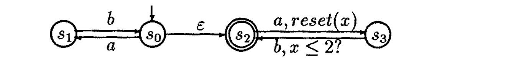
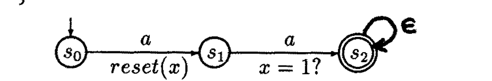
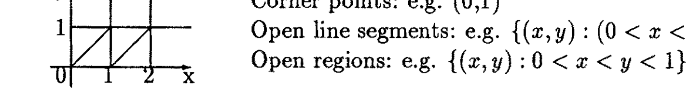
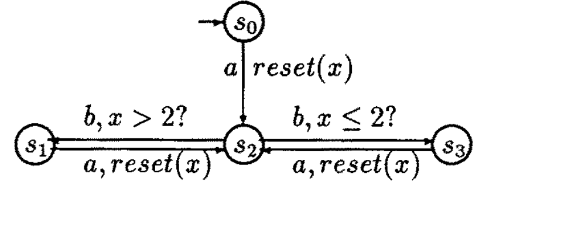

# Automata For Modeling Real-Time Systems

Rajeev Alur[^1]  
David Dill[^2]  
Department of Computer Science  
Stanford University, U.S.A.

> Note: the local `paper.pdf` is a 14-page scanned copy of the full ICALP 1990 chapter. The Markdown below is a manually refined transcription against that scan. The automata and region illustrations are kept as cropped image assets from the scan.

[^1]: Supported by the NSF grant CCR-8812595, the DARPA contract N00039-84-C-0211, and the USAF Office of Scientific Research under contracts 88-0281 and 90-0057.
[^2]: Supported by the NSF grant MIP-8858807.

## Abstract

To model the behavior of finite-state asynchronous real-time systems we propose the notion of timed Buchi automata (TBA). TBAs are Buchi automata coupled with a mechanism to express constant bounds on the timing delays between system events. These automata accept languages of timed traces, traces in which each event has an associated real-valued time of occurrence.

We show that the class of languages accepted by TBAs is closed under the operations of union, intersection and projections, and the trace language obtained by projecting the language accepted by a TBA is `\omega`-regular. It turns out that TBAs are not closed under complement, and it is undecidable whether the language of one automaton is a subset of the language of another. This result is an obstruction to automatic verification. However, we show that a significant (proper) subclass represented by deterministic timed Muller automata (DTMA) is closed under all the boolean operations. Consequently, a system modeled by a TBA can be automatically verified with respect to a specification given as a DTMA.

## 1 Introduction

Modal logics and `\omega`-automata for qualitative temporal reasoning about concurrent systems have been studied in great detail (selected references: [Ch74, WVS83, CES86, Pn86, Di88, CDK89]). These formalisms abstract away from time, retaining only the sequencing of events in a system. In the automata-theoretic approach, a system is modeled as a finite-state non-deterministic automaton on infinite strings (e.g. a Buchi automaton); the language accepted by the automaton corresponds to the set of possible behaviors of the system. The operations useful for describing complex systems can then be viewed as language-theoretic operations. For example, parallel composition can be modeled using projection and intersection. Furthermore, the verification problem -- whether every possible behavior of an implementation is a member of the set of behaviors allowed by the specification -- becomes the language inclusion problem. For Buchi automata there are known effective constructions for intersection and complementation. Also, the language inclusion problem is decidable.

For a large class of systems -- real-time systems -- the system has to meet certain hard real-time constraints (e.g. "the system should respond within 2 seconds"), and the correctness of the system depends on the actual values of the delays. For the analysis of such systems we need to develop formalisms for quantitative temporal reasoning. System designers have realized the need for such models, and several ways to extend the existing formalisms have been suggested. Most of these attempts are tailored to specific applications and do not handle concurrency in a general way. Also, this work is generally somewhat ad hoc: questions such as formal semantics, soundness, expressiveness, and closure properties have not been addressed. This problem has received relatively little attention from theoreticians, though recently researchers have studied quantitative temporal logics ([JM86, Ko89, AH90, ACD90, Le90]).

The first question to address is how to incorporate time explicitly in the underlying formal semantics for processes. Most of the previous work on modeling real-time systems has used two basic approaches. Discrete-time models use the domain of integers to model time. This approach requires that continuous time be approximated by choosing some fixed quantum *a priori*, which limits the accuracy with which the system can be modeled. The fictitious clock approach introduces a special `tick` transition in the model. Here time is viewed as a global state variable that ranges over the domain of natural numbers, and is incremented by one with every `tick` transition (e.g. [AK83, AH90]). This model allows arbitrarily many transitions of any process between two successive `tick` transitions. The timing delay between two events is measured by counting the number of `tick`s between them. Consequently, it is impossible to state precisely certain simple requirements on the delays such as "the delay between two transitions equals 2 seconds." Both these models are used, despite their apparent inaccuracy, because they are straightforward extensions of existing temporal models.

In this paper we use a different model. We choose a dense domain to model time, and extend the trace semantics by associating with each event its time of occurrence. This allows an unbounded number of environment events between any two events of a system, and also allows a more accurate modeling of the timing delays in asynchronous systems.

To model finite-state real-time systems we define timed automata. A timed automaton is an `\omega`-automaton with an auxiliary finite set of clocks which record the passage of time. The clocks can be reset with any state-transition of the automaton. The timing constraints are expressed by associating with the transitions enabling conditions which compare clock values with time constants. When coupled with acceptance criteria, such as Buchi acceptance, timed automata accept timed traces, sequences in which every element has an associated real-valued time.

Our work is based on the recent proposals by Dill ([Di89]) and Lewis ([Le89]) for extending state-graphs with timing constraints based on a continuous model of time. These papers provide a way of using timing assumptions to verify qualitative temporal requirements. Later works use these models as interpretations for the formulas of branching-time real-time logics, and give model-checking algorithms ([ACD90, Le90]).

In this paper we use timed automata to define languages of (linear) timed traces, and study their language-theoretic properties. We show that the class of languages accepted by timed Buchi automata (TBA) is closed under intersection and projections. Consequently, there are effective constructions for operations such as parallel composition, hiding, and renaming for processes modeled as sets of timed traces in this class.

Given a TBA we show how to construct a Buchi automaton which accepts exactly those traces to which times can be attached consistently with the timing constraints of the given automaton. This gives an algorithm for deciding emptiness of its language, and allows using the information about the timing delays to verify qualitative temporal requirements. However, the language inclusion problem is undecidable, which poses problems for automatic verification of real-time requirements. We define the notion of determinism for timed automata, and show that deterministic timed automata can be complemented. In particular, we show that deterministic timed Muller automata (DTMA) are closed under all the boolean operations (but not under projections). Consequently, automatic verification is possible when a specification is expressed as a DTMA and an implementation is modeled using TBAs.

Outline: In section 2 we develop the essential aspects of semantics of timed traces for concurrent systems. In section 3 we define timed automata and discuss their closure properties and decision problems. In section 4 we present the complementable subclass of DTMAs, and show how it can be used for verification.

## 2 Timed trace semantics

To define the semantics of real-time processes, we first define a simple trace semantics for concurrent processes, and then introduce explicit time in the model.

### 2.1 Trace semantics for untimed processes

In trace semantics, we associate a set of observable events with each process (an example event might be an assignment of a value to a variable, or arrival of a message), and model the process by the set of all its traces. A trace is a (linear) sequence of events that may be observed when the process runs. All events are assumed to occur instantaneously. Hoare originally proposed such a model for CSP ([Ho85]). In our model we allow several events to happen simultaneously, and consider both finite and infinite traces.

Formally, given a set `A` of events, a trace is a finite or infinite word over `\mathcal{P}^+(A)`, the set of all nonempty subsets of `A`. An untimed process is a pair `(A, X)`, where `A` is the set of its observable events and `X \subseteq \mathcal{P}^+(A)^\infty` is the set of its possible traces. For any alphabet `\Sigma`, `\Sigma^\infty` denotes the set of all finite and infinite strings over it.

The projection of `\rho \in \mathcal{P}^+(A)^\infty` onto `A_1 \subseteq A` (written `\rho|_{A_1}`) is formed by intersecting each event set in `\rho` with `A_1` and deleting all the empty sets from the sequence. Note that the projection can be finite even if the original trace is infinite.

The following operations are helpful for constructing complex systems from simpler ones:

- **Parallel composition.** Given `P_1 = (A_1, X_1)` and `P_2 = (A_2, X_2)`, their composition `P_1 \| P_2` is a process with event set `A_1 \cup A_2` and trace set

  $$
  \left\{\rho \in \mathcal{P}^+(A_1 \cup A_2)^\infty : \rho|_{A_1} \in X_1 \land \rho|_{A_2} \in X_2 \right\}.
  $$

- **Hiding.** Given a process `P = (A, X)` and an event `a \in A`, `P \setminus a` is the process

  $$
  \left(A - \{a\}, \left\{\rho|_{A - \{a\}} : \rho \in X \right\}\right).
  $$

- **Event renaming.** Given event sets `A` and `A'`, a process `P = (A, X)`, and a bijective renaming map `\mu : A \to A'`, `\mu(P)` is

  $$
  \left(A', \left\{\mu(\rho) : \rho \in X \right\}\right),
  $$

  where `\mu` is naturally extended to event sets, and then extended pointwise to finite and infinite sequences.

### 2.2 Timed traces

An untimed process models the sequencing of events but not the actual times at which the events occur. Timing can be added to a trace by coupling it with a sequence of real-valued times. We are interested only in the delays between the successive events, but, for convenience, we adopt the convention of assigning time `0` to the first event of a trace. We will use `R` to denote the set of nonnegative real numbers. The results of this paper still apply if we choose any other dense linear order, instead of `R`, to model time.

A time sequence `\tau` is a finite or infinite sequence over `R` satisfying the following constraints:

- **Initiality:** `\tau` begins at time `0`; that is, `\tau(0) = 0`.
- **Monotonicity:** `\tau` increases strictly monotonically; that is, for all `i > 0`, `\tau(i) < \tau(i + 1)`.
- **Progress:** For every `t \in R`, there is some `i` such that `\tau(i) > t`.

The progress condition implies that only a finite number of events can happen in a bounded interval of time.

A timed trace over an alphabet `\Sigma` is a pair `(\rho, \tau)` where `\rho \in \Sigma^\infty`, `\tau` is a time sequence, and `\rho` and `\tau` are of equal length (infinite sequences are considered to have length `\omega`). A timed language over `\Sigma` is a set of timed traces over `\Sigma`. A timed process is a pair `P = (A, L)` where `L` is a timed language over `\mathcal{P}^+(A)`.

The operations on untimed processes are extended in the obvious way to timed processes: the projection of a timed trace deletes events from `\rho` and leaves `\tau` unchanged, unless the element in `\rho` becomes empty, in which case that element and the corresponding time are deleted. The definitions of parallel composition, hiding, and renaming are as before, except that they use the projection for timed traces. The times associated with events can be discarded by the `Untime` operation:

$$
Untime[(A, L)] =
\left(
  A,
  \left\{
    \rho \in \mathcal{P}^+(A)^\infty :
    \exists \text{ time sequence } \tau \text{ such that } (\rho, \tau) \in L
  \right\}
\right).
$$

Note that, in general,

$$
Untime(P_1 \| P_2) \subseteq Untime(P_1) \| Untime(P_2),
$$

and the two sides are not necessarily equal. In other words, the timing information retained with the traces constrains the set of possible traces when two processes are composed.

## 3 Timed automata

Processes whose behaviors are regular are especially interesting because they can be represented using finite automata. The operations on processes can be implemented using standard constructions on the automata, and the inclusion problem is decidable. This forms a basis for automatic verification of finite-state concurrent systems, such as certain hardware devices and communication protocols.

### 3.1 `\omega`-automata and untimed processes

An `\omega`-automaton is essentially the same as a non-deterministic finite-state automaton, but with the accepting condition modified suitably so as to handle infinite input words also. These automata provide a finite representation for regular trace sets. Various types of `\omega`-automata have been studied in the literature ([Bii62, Mc66, Ch74]). In this paper we will consider two types of `\omega`-automata: Buchi automata and Muller automata.

We consider `\omega`-automata with `\epsilon`-transitions, which accept both finite and infinite traces; this is non-standard, but all of the basic results for these automata continue to hold (as do the constructions, with small modifications).

An `\omega`-automaton `M` is a tuple `( \Sigma, S, S_0, E )`, where `\Sigma` is the input alphabet, `S` is a finite set of automaton states, `S_0 \subseteq S` is a set of start states, and `E \subseteq S \times S \times [\Sigma \cup \{\epsilon\}]` is a set of edges. If `(s, s', \sigma) \in E` then the automaton can change its state from `s` to `s'` reading the input symbol `\sigma`.

Given `\rho \in \Sigma^\infty`, we say that

$$
r : s_0 \xrightarrow{\rho'_0} s_1 \xrightarrow{\rho'_1} s_2 \xrightarrow{\rho'_2} \cdots
$$

is a run of `M` over `\rho`, provided:

- the input word read is `\rho`: `\rho'` is an infinite sequence over `[\Sigma \cup \{\epsilon\}]` such that `\rho` is `\rho'` with all `\epsilon`'s removed; and
- the run satisfies proper consecution requirements: for each `i \ge 0`, there is an edge in `E` from state `s_i` to `s_{i+1}` with label `\rho'_i`.

Furthermore, `r` is called an initialized run if `s_0` is a start state.

A Buchi automaton `M` is an `\omega`-automaton with an additional set `F \subseteq S` of accepting states. A run `r` of `M` over a word `\rho \in \Sigma^\infty` is an accepting run if for infinitely many `i`'s, `s_i \in F`. The language `L(M)` accepted by `M` consists of the traces `\rho \in \Sigma^\infty` such that `M` has an initialized accepting run over `\rho`.

A finite-state (untimed) process with event set `A` is modeled using a Buchi automaton over `\mathcal{P}^+(A)`; it is convenient to identify the empty event set with `\epsilon`. `S` corresponds to the states of the system, and `E` gives its transitions. The purpose of the accepting set `F` is to restrict attention to only fair runs. For example, in a system with two processes we consider only those computation sequences in which each process executes infinitely often.

The class `\mathcal{C}` of finite-state processes comprises all processes of the form `(A, X)` where `X = L(M)` for some Buchi automaton `M` over `\mathcal{P}^+(A)`.

Given a Buchi automaton `M` we can construct a finite automaton which accepts precisely the finite words accepted by `M`, and an `\epsilon`-free Buchi automaton accepting precisely the infinite words accepted by `M`. From the known results it follows that Buchi automata are effectively closed under union, intersection, projections and complementation ([Ch74, WVS83]). As a consequence we have the following useful results.

**Fact.** The class `\mathcal{C}` of processes is closed under parallel composition, hiding, and renaming.

**Proof.** First we consider parallel composition of two processes `P_i` (`i = 1, 2`) with event sets `A_i` and represented as Buchi automata `M_i`. First expand the event set of each automaton to the union of the two event sets. This can be done by replacing each edge `(s, s', a)` of `M_i` by a set of edges of the form `(s, s', a')` such that `a' \cap A_i = a`. Now that the alphabet of both automata is `\mathcal{P}^+(A_1 \cup A_2)`, parallel composition reduces to language intersection, and can be implemented by a product construction for Buchi automata ([WVS83]).

Hiding of an event corresponds to removing it from every edge label in which it appears. Since our automata have `\epsilon`-edges this poses no problem. Renaming can be done by renaming events in all the edge labels.

**Fact.** The inclusion problem for the class `\mathcal{C}` is decidable.

**Proof.** To test whether the language of one automaton is contained in the other, we check for emptiness of the intersection of the first automaton with the complement of the second, using known constructions for complementing Buchi automata ([SVW87, Sa88]). To test emptiness, we search for a cycle that is reachable from a start state and includes at least one final state.

Complementing a Buchi automaton involves an exponential blow-up in the number of states, and hence the complexity of checking inclusion is exponential. However, checking whether the language of one automaton is contained in the language of a deterministic automaton can be done in polynomial time ([CDK89]).

An `\omega`-automaton `M` is deterministic iff there is a single start state, and for every state `s` and every symbol `a`, the number of edges starting at `s` and labeled with either `a` or `\epsilon` is at most `1`. Thus, a deterministic automaton has at most one run over any word. It turns out that, unlike automata on finite strings, the class of languages accepted by deterministic Buchi automata is strictly smaller than that accepted by their non-deterministic counterparts. Muller automata defined below avoid this problem at the cost of a more complicated acceptance condition.

A Muller automaton `M` is an `\omega`-automaton with an acceptance family `\mathcal{F} \subseteq 2^S`. A run `r` of `M` over a word `\rho` is an accepting run iff the set of states repeating infinitely often along `r` equals some set in `\mathcal{F}`. The language accepted by `M` is defined as in the case of Buchi automata.

The class of languages accepted by Muller automata is the same as that accepted by Buchi automata, and also equals that accepted by deterministic Muller automata. Algorithms for constructing the intersection of two Muller automata and for checking language inclusion are known ([CDK89]). Hence, one can possibly use deterministic Muller automata as a representation for the processes in `\mathcal{C}`.

### 3.2 Timed automata

In this section we extend `\omega`-automata to timed automata accepting timed languages.

With each `\omega`-automaton we associate a finite set of (real-valued) clocks. A clock can be set to zero simultaneously with any transition of the automaton. At any instant, the reading of a clock equals the time elapsed since the last time it was set. With each transition we associate an enabling condition which compares the current values of the clocks with time constants. Before we define timed automata formally, let us consider some examples of timed Buchi automata.

**Example 1.** The following automaton over the alphabet `{a, b}` accepts the timed language

$$
\left\{ ((ab)^\omega, \tau) : \exists i.\ \forall j \ge i.\ \tau_{2j+1} \le \tau_{2j} + 2 \right\}.
$$

*Example 1. A timed Buchi automaton over `{a, b}` for eventual bounded response time.*

The start state is `s_0`, `s_2` is the accepting state, and there is a single clock `x`. The clock is set on the transition from `s_2` to `s_3`, and the transition from `s_3` to `s_2` is enabled only if the time elapsed since then is not greater than `2`. Interpreting `b` as the response to a request `a`, the automaton models a system in which the response time is eventually always less than `2` seconds.

**Example 2.** The language accepted by the following automaton over `{a}` is

$$
\left\{ (a^\omega, \tau) : \exists i, j : \tau_j = \tau_i + 1 \right\}.
$$

*Example 2. A timed Buchi automaton over `{a}` accepting traces where some two `a` events are exactly one time unit apart.*

The start state is `s_0`, and `s_2` is the accepting state.

Thus the mechanism of resetting a clock with one transition, and associating with another transition an enabling condition which compares the value of this clock with some time constant, expresses a bound on the delay between the two transitions. Note that clocks can be set asynchronously of each other. Also, arbitrarily many events can occur in a finite interval of time. The finiteness of the number of clocks corresponds to the assumption that the future behavior of a process depends on only a finite number of delays.

Before we give the definition of timed automata, we need to develop some notation. Let `N = \{0, 1, 2, \ldots\}` be the set of time constants. For a set `X` of clocks, `\Phi(X)` denotes the set of formulas constructed from the atomic formulas of the form `x < c` or `c \le x`, where `x \in X` and `c \in N`, using the logical connectives. A time assignment for `X` assigns a real value to each clock. The formulas in `\Phi(X)` can be interpreted over the time assignments for `X` in the obvious way. For a time assignment `\nu` for `X`, and `t \in R`, `\nu + t` denotes another time assignment which maps a clock `x` in `X` to the value `\nu(x) + t`. For `X' \subseteq X`, `[X' \mapsto t]\nu` denotes an assignment for `X` which assigns `t` to each `x \in X'`, and agrees with `\nu` over the rest of the clocks.

A timed automaton is a tuple `( \Sigma, S, S_0, C, E )`, where `\Sigma`, `S`, and `S_0` are the same as in an `\omega`-automaton, `C` is a finite set of clocks, and

$$
E \subseteq S \times S \times [\Sigma \cup \{\epsilon\}] \times 2^C \times \Phi(C)
$$

gives the set of transitions. An edge `(s, s', \sigma, \lambda, \delta)` represents a transition from state `s` to state `s'` on input symbol `\sigma`. `\lambda` gives the set of clocks to be reset with this transition, and `\delta` gives the enabling condition. An `\omega`-automaton is a special case of a timed automaton with an empty set of clocks.

The automaton starts in one of the start states with all the clocks initialized to `0`. As time advances the values of all the clocks change, reflecting the elapsed time. At any point in time, the automaton can change state through a transition `(s, s', \sigma, \lambda, \delta)` reading the input `\sigma`, provided the current values of the clocks satisfy `\delta`. With this transition the clocks in `\lambda` get reset to `0`, and thus start counting time with respect to it.

Given a timed trace `(\rho, \tau)` over `\Sigma`, we say that

$$
r :
\langle s_0, \nu_0, 0 \rangle
\xrightarrow{\rho'_0}
\langle s_1, \nu_1, t_1 \rangle
\xrightarrow{\rho'_1}
\langle s_2, \nu_2, t_2 \rangle
\cdots
$$

is a run of `M` over `(\rho, \tau)`, provided:

- the input word read is `\rho`: `\rho'` is an infinite word over `[\Sigma \cup \{\epsilon\}]` such that `\rho` is `\rho'` with all `\epsilon`'s removed;
- `r` satisfies proper consecution requirements: for each `i`, there is an edge in `E` of the form `(s_i, s_{i+1}, \rho'_i, \lambda_i, \delta_i)` such that the time assignment `\nu_i + t_{i+1} - t_i` satisfies `\delta_i` and `\nu_{i+1}` equals `[\lambda_i \mapsto 0](\nu_i + t_{i+1} - t_i)`; and
- time progresses along `r`: for every `t \in R`, for some `i \ge 0`, `t_i > t`.

Furthermore, `r` is called an initialized run if it is properly initialized: `s_0` is a start state, and for each `x \in C`, `\nu_0(x) = 0`.

We can couple acceptance criteria with timed automata, and use them to define timed languages. A timed Buchi automaton (TBA for short) is a timed automaton with a set `F \subseteq S` of accepting states. A run `r` of a TBA over a timed trace is called an accepting run iff for infinitely many `i`'s, `s_i \in F`. For a TBA `M`, the language `L(M)` of timed traces it accepts is defined to be the set of all timed traces `( \rho, \tau )` such that `M` has an initialized accepting run over `( \rho, \tau )`.

We model finite-state real-time processes using TBAs. We consider the class `\mathcal{D}` of timed finite-state processes, those of the form `(A, L)`, where `L` is the language accepted by some TBA over `\mathcal{P}^+(A)`.

The next theorem considers some closure properties of TBAs.

**Theorem.** The class of timed languages accepted by TBAs is closed under union, intersection, and projections.

**Proof.** First consider the boolean operations over two TBAs `M_i`, `i = 1, 2`. Assume without loss of generality that the sets `C_1` and `C_2` are disjoint. In each case, the resulting set of clocks is `C_1 \cup C_2`. Union corresponds to the disjoint union of the two automata. Intersection can be implemented by modifying the product construction for Buchi automata. For a joint transition of the resulting automaton corresponding to the `M_1` transition `(s_1, s_1', a, \lambda_1, \delta_1)` and the `M_2` transition `(s_2, s_2', a, \lambda_2, \delta_2)`, the set of clocks to be reset is `\lambda_1 \cup \lambda_2`, and the enabling condition is `\delta_1 \land \delta_2`.

Projections are modeled by changing the labels of all the edges appropriately.

It follows that `\mathcal{D}` is closed under operations of parallel composition, hiding, and renaming. As in the untimed case, for parallel composition, we first make the event sets of the two automata the same using the same technique, and then take language intersection.

We can define timed automata with Muller acceptance condition also. A timed Muller automaton (TMA for short) is a timed automaton with acceptance family `\mathcal{F} \subseteq 2^S` specified as in the case of Muller automata. The language accepted by a TMA is defined in the obvious way.

A TBA given by `( \Sigma, S, S_0, C, E, F )` can be viewed as a TMA `( \Sigma, S, S_0, C, E, \mathcal{F} )`, where the acceptance family is given by

$$
\mathcal{F} = \{ S' \subseteq S : S' \cap F \ne \emptyset \}.
$$

On the other hand, given a TMA, we can construct a TBA accepting the same language using the simulation of Muller acceptance by Buchi automata. It follows that the class of timed languages accepted by TMAs is the same as that accepted by TBAs.

### 3.3 Emptiness

The information about the timing constraints provided by a timed automaton can be used to rule out certain behaviors, and to prove that some qualitative temporal specification is met. We will show that a Buchi automaton can be constructed that accepts exactly the set of untimed traces that are consistent with the timed traces accepted by a timed automaton.

Let `M = ( \Sigma, S, S_0, C, E, F )` be a TBA. A snapshot of `M` is a pair consisting of the state of the automaton and a time assignment giving the current values of all its clocks. A snapshot has enough information to determine which transitions will be enabled. Since the number of such snapshots is infinite, we cannot possibly build an automaton whose states are snapshots of `M`. But if two snapshots with the same `M`-state agree on the integral parts of all the clock values, and also on the ordering of the fractional parts of all the clocks, then the future behaviors starting from the two snapshots are very similar. The integral parts of the clock values are needed to determine whether or not a particular enabling condition is met, whereas the ordering of the fractional parts is needed to decide which clock will change its integral part first. For example, if two clocks `x` and `y` are between `0` and `1` in a snapshot, then a transition with enabling condition `x = 1` can be followed by a transition with enabling condition `y = 1`, depending on whether or not the snapshot satisfies `x < y`.

The integral readings of the clocks can get arbitrarily large. But if a clock `x` is never compared with a constant greater than `c`, then its actual value, once it exceeds `c`, is of no consequence in deciding the allowed paths.

Now we formalize this notion. For each `x \in C`, let `c_x` be the largest constant that `x` is compared with in any enabling condition. For any `t \in R`, `fract(t)` denotes the fractional part of `t`, and `[t]` denotes the integral part of `t`.

Given time assignments `\nu, \nu' \in [C \to R]`, let us say `\nu \cong \nu'` iff the following hold:

- For each `x \in C`, either `[ \nu(x) ]` and `[ \nu'(x) ]` are the same, or both `\nu(x)` and `\nu'(x)` are greater than `c_x`.
- For every `x, y \in C` such that `\nu(x) \le c_x` and `\nu(y) \le c_y`,

  $$
  fract(\nu(x)) \le fract(\nu(y))
  \quad \text{iff} \quad
  fract(\nu'(x)) \le fract(\nu'(y)).
  $$

**Lemma.** Let `s` be any state, and `\nu, \nu'` be time assignments such that `\nu \cong \nu'`. There is an accepting run starting at `(s, \nu, 0)` iff there is an accepting run starting at `(s, \nu', 0)`.

A stronger version of the above lemma is proved in [ACD90].

We will use `[ \nu ]` to denote the equivalence class of `\nu` with respect to `\cong`. A region is a pair `(s, [\nu])` where `s` is a state and `\nu` is a time assignment. Note that there are only a finite number of regions. We will define an edge relation over the regions such that the paths in the resulting `\omega`-automaton mimic the runs of `M` in a certain way. The edge relation captures two different types of events: `(1)` transitions in `M`, and `(2)` moving into a new equivalence class of snapshots because of the passage of time. We define a successor function over equivalence classes of time assignments to capture the second type of transitions.

Let `\alpha, \beta` be distinct equivalence classes of `[C \to R]`. `succ(\alpha) = \beta` iff for each `\nu \in \alpha`, there exists a positive `t \in R` such that `\nu + t \in \beta`, and for all `t' < t`, `\nu + t' \in \alpha \cup \beta`.

Let us consider an example with two clocks `x` and `y` with `c_x = 2` and `c_y = 1`. The equivalence classes are shown in the following figure.

*Equivalence classes for two clocks `x` and `y` with `c_x = 2` and `c_y = 1`: corner points, open line segments, and open regions.*

The successor of any class `\alpha` is the class to be hit first by a line drawn from some point in `\alpha` in the diagonally upwards direction. For example, the successor of the class `\{(1, 0)\}` is the class

$$
\{ (x, y) : (1 < x < 2) \land (y = x - 1) \},
$$

and the successor of

$$
\{ (x, y) : 0 < y < x < 1 \}
$$

is the class

$$
\{ (1, y) : 0 < y < 1 \}.
$$

Let us call an equivalence class `\alpha` a boundary class, if for each `\nu \in \alpha` and for any positive `t`, `\nu` and `\nu + t` are not equivalent. In the above example, the classes which lie on either horizontal or vertical lines are boundary classes.

Now we can construct the desired automaton.

**Theorem.** Given a TBA `M = ( \Sigma, S, S_0, C, E, F )`, there exists a Buchi automaton `M'` over `\Sigma` such that

$$
L(M') = Untime[L(M)].
$$

**Proof.** First we construct an `\omega`-automaton `M''`. States of `M''` are the regions of `M`. The start states of `M''` are of the form `(s_0, [\nu_0])` where `s_0` is a start state of `M`, and for each `x \in C`, `\nu_0(x) = 0`. The edge set consists of two types of edges:

- **Edges representing the passage of time.** Each state `(s, \alpha)` has an `\epsilon`-labeled edge to `(s, succ(\alpha))`.
- **Edges representing the transitions of `M`.** For each edge `(s, s', \sigma, \lambda, \delta)` of `M`, there is a `\sigma`-labeled edge from `(s, \alpha)` to `(s', [[\lambda \mapsto 0]\nu])`, provided `\nu` satisfies the enabling condition `\delta`, and either `succ(\alpha) = [\nu]`, or `\nu \in \alpha` and `\alpha` is not a boundary class.

There is a simple correspondence between the runs of `M` and runs of `M''`. Let

$$
r = \{ (s_i, \nu_i, t_i) : i \ge 1 \}
$$

be any run of `M`. For each `i \ge 1`, we can find a finite path `r_i` in `M''` joining `(s_i, [\nu_i])` to `(s_{i+1}, [\nu_{i+1}])` by taking successor classes of `[ \nu_i ]` as time increases from `t_i` to `t_{i+1}`. Thus the run `r'` obtained by concatenating the segments `r_i` corresponds to the run `r` in a natural way. Similarly, given a run of `M''` we can construct a corresponding run of `M`.

If `r` is an accepting run of `M`, that is, some state `s` from `F` repeats infinitely often, then for some equivalence class `\alpha`, the state `(s, \alpha)` repeats infinitely often along `r'`. Let

$$
F' = \{ (s, \alpha) : s \in F \}.
$$

Since time progresses without bound along `r`, every clock `y \in C` is either reset infinitely often or eventually it always increases. Hence, for each `y \in C`, along `r'`, infinitely many regions satisfy either `y = 0`, or `y > c_y`. Let us denote the set

$$
F_y = \{ (s, [\nu]) : s \in S \land (\nu(y) = 0 \vee \nu(y) > c_y) \}.
$$

Let us call a run of `M''` accepting iff it visits some state from `F'`, and some state from each `F_y`, infinitely often. It follows that `L(M'') = Untime[L(M)]`.

The acceptance condition of `M''` is not a Buchi acceptance condition, but it is straightforward to construct a Buchi automaton `M'` accepting the same trace language.

From the theorem it follows that for all processes `P \in \mathcal{D}`, `Untime(P) \in \mathcal{C}`. Furthermore, given a TBA, to check whether its language is empty, we can check for the emptiness of the language of the corresponding Buchi automaton constructed by the theorem. The next corollary follows.

**Corollary.** Given a timed Buchi automaton `M` there is a decision procedure to check for the emptiness of `L(M)`.

The size of `M'` constructed by the above proof is

$$
O\left((|C|! \cdot (|S| + |E|) \cdot 2^{|\delta|})\right),
$$

where `|\delta|` is the total number of bits used in the binary encoding of the constants in the enabling conditions. Thus the complexity of deciding emptiness of a TBA is exponential in the number of clocks and the length of its timing constraints. This blow-up in complexity seems unavoidable; we can reduce the acceptance problem for linear bounded automata to the emptiness question for TBAs to prove that the problem of deciding whether or not the language of a TBA is empty is PSPACE-complete. Note that the source of this complexity is not the choice of `R` to model time. The same result can be proved if we leave the syntax of timed automata unchanged, but use the discrete integer domain to model time.

The above methods can be used even if we change the acceptance condition for timed automata. In particular, given a TMA `M` we can effectively construct a Buchi automaton which accepts `Untime[L(M)]`, and use it to check for the emptiness of `L(M)`.

### 3.4 Inclusion

For verification, one may describe the implementation as a TBA, `I`, and the specification as another TBA, `S`. Then one way to define verification is:

$$
I \text{ satisfies } S \text{ iff } L(I) \subseteq L(S).
$$

However, there is a stumbling block to automatic verification by this approach.

**Theorem.** Given timed Buchi automata `M` and `M'`, the problem of deciding whether

$$
L(M) \subseteq L(M')
$$

is undecidable -- in fact, `\Sigma_1^1`-hard.

**Proof.** We reduce the question of deciding whether a non-deterministic `2`-counter machine has a recurring computation, that is, a computation in which its start state appears infinitely often, to the language inclusion problem of timed automata.

Consider a machine with counters `\alpha` and `\beta`, and a program with `m` labeled instructions that can increment or decrement the counters, jump based on testing for a counter being zero, and choose nondeterministically between two instructions. A configuration of the machine is represented by the triple `(i, c, d)`, where `i` gives the value of the location counter, and `c` and `d` give the values of the counters `\alpha` and `\beta`, respectively. We encode the computations of the machine using timed traces over the alphabet `\{ b_1, \ldots, b_m, a_1, a_2 \}`. A configuration `(i, c, d)` is represented by the event sequence `b_i a_1^c a_2^d`. We say that a timed trace encodes a computation of the machine if the sequence of events happening in the time interval `[j, j + 1)` encodes the `j`th configuration of the computation, for each `j \ge 0`. Note that denseness of the underlying time domain allows the counter values to get arbitrarily large.

We construct a boolean expression `S` of TBAs which accepts precisely the computations of the machine. Using a TBA we can express the nature of the initial configuration. We need to express that the successive configurations are related as required by the program instructions. The question reduces to whether timed automata can be used to express that the number of `a_1` events, or of `a_2` events, in two intervals encoding successive configurations is the same, or one less, or one greater. This can be done by requiring that every `a_1` in the first interval has a matching `a_1` at distance `1` and vice versa. This requirement can be specified as the complement of the TBA requiring some `a_1` in the first interval with no matching `a_1` at distance `1`, or vice versa.

The language of the conjunction of `S` with a TBA expressing the recurrence requirement is non-empty iff the machine has a recurring computation. Since TBAs are closed under union and intersection, the emptiness question of a boolean expression over timed automata can be phrased as a language inclusion question of two automata. The result follows.

This result is not unusual for systems for reasoning about dense real-time. It is similar to the undecidability of logics interpreted over timed traces ([AH89, AD90]). Obviously, the language inclusion problem for TMAs is also undecidable. The undecidability of the inclusion problem has another implication.

**Corollary.** Timed Buchi automata are not closed under complement.

**Proof.** Given TBAs `M` and `M'`,

$$
L(M) \subseteq L(M')
\quad \text{iff} \quad
L(M) \cap L(M'^c) = \emptyset,
$$

where `M'^c` accepts the complement of `L(M')`. Assume that TBAs are closed under complement. Then it follows that

$$
L(M) \nsubseteq L(M')
$$

iff there is a TBA `N` such that `L(M) \cap L(N)` is non-empty, but `L(M') \cap L(N)` is empty. Since one can effectively enumerate TBAs, construct a TBA accepting the intersection of the languages of two TBAs, and check for emptiness, the complement of the inclusion problem is recursively enumerable. This contradicts the `\Sigma_1^1`-hardness result.

By similar reasoning, TMAs also are not closed under complement. To get some insight regarding the non-closure under complementation, consider the automaton of Example 2. The complement needs to make sure that no pair of `a`'s is separated by distance `1`. Since there is no bound on the number of `a`'s that can happen in a time period of length `1`, this requires an unbounded number of clocks. It can be proved that the complement language cannot be specified by a timed automaton.

## 4 Deterministic Timed Automata

The results of the previous section imply that we can build a composite timed automaton representing the behavior of a system, using parallel composition, renaming, and hiding. However, we cannot automatically compare it with a specification presented as a TBA. In this section we define deterministic timed automata, and show that deterministic timed Muller automata (DTMA) are closed under the boolean operations. The ability to complement makes it possible to test whether a timed automaton representing an implementation meets a specification expressed by a DTMA.

A timed automaton `( \Sigma, S, S_0, C, E )` is called deterministic, provided:

- it has only one start state; and
- for each state `s`, for each input symbol `\sigma`, for every pair of edges of the form `(s, -, \sigma', -, \delta_1)` and `(s, -, \sigma'', -, \delta_2)` such that both the labels `\sigma'` and `\sigma''` are in `\{\sigma, \epsilon\}`, the enabling conditions `\delta_1` and `\delta_2` are mutually exclusive, that is, `\delta_1 \land \delta_2` is unsatisfiable.

Thus, a deterministic timed automaton may have two transitions starting at the same state labeled with the same symbol, but given an assignment for the clocks only one of the outgoing transitions can be taken. Consequently, a deterministic timed automaton has at most one initialized run over any given timed trace. This property allows complementing them. Note that in absence of clocks the above definition matches the definition of determinism for `\omega`-automata.

Since deterministic Buchi automata are strictly less expressive than deterministic Muller automata, deterministic timed Buchi automata (DTBA) are strictly less expressive than deterministic timed Muller automata (DTMA). Furthermore, we will show that DTMAs are closed under complement. Hence, we propose that DTMAs be used as a specification formalism.

Apart from the usual qualitative requirements, and simple timing properties such as bounded response time and periodicity, DTMAs can specify interesting properties involving liveness and timing. One such example property is the convergent response-time property of Example 1: "The events `a` and `b` alternate, and eventually every `a` is followed by `b` within time `2`." The following DTMA accepts the language

$$
\left\{ ((ab)^\omega, \tau) : \exists i.\ \forall j \ge i.\ \tau_{2j+2} \le \tau_{2j+1} + 2 \right\}.
$$

*A deterministic timed Muller automaton for the convergent response-time property of Example 1.*

The start state is `s_0`. The Muller acceptance family is given by `\{\{s_2, s_3\}\}`. The state `s_2` has two mutually exclusive outgoing transitions on `b`. The acceptance condition requires that the transition with the enabling condition `x > 2` is taken only finitely often. We believe that no DTBA can specify this property.

A timed automaton `( \Sigma, S, S_0, C, E )` is called complete iff for each state `s` and each input symbol `a`, the disjunction of the enabling conditions of the edges starting at `s` and labeled with `a` or `\epsilon` is a valid formula. Thus some edge is always enabled in a complete automaton. Consequently, a deterministic complete timed automaton has precisely one run over any timed trace.

Given a DTMA we can construct an equivalent complete DTMA easily. First we add a dummy dead state `q` to the automaton. From each state `s`, for each symbol `a`, we add an `\epsilon`-labeled edge from `s` to `q` with the enabling condition equal to the negation of the disjunction of the enabling conditions of all the edges starting at `s` and labeled with `a` or `\epsilon`. We leave the acceptance condition unchanged. This construction preserves determinism as well as the set of accepted timed traces.

The next theorem states the closure of DTMAs under the boolean operations.

**Theorem.** The class of timed languages accepted by DTMAs is closed under union, intersection, and complementation.

**Proof.** Let `M_i`, for `i = 1, 2`, be two complete DTMAs with disjoint sets of clocks. First we construct a timed automaton `M` using a product construction. The set of states of `M` is `S_1 \times S_2`. Its start state is `\langle s_{01}, s_{02} \rangle`. The set of clocks is `C_1 \cup C_2`. For each input symbol `\sigma`, corresponding to an `M_1` transition `(s_1, t_1, \sigma_1, \lambda_1, \delta_1)` and an `M_2` transition `(s_2, t_2, \sigma_2, \lambda_2, \delta_2)` such that each label `\sigma_i` is either `\sigma` or `\epsilon`, `M` has a transition

$$
(\langle s_1, s_2 \rangle, \langle t_1, t_2 \rangle, \sigma, \lambda_1 \cup \lambda_2, \delta_1 \land \delta_2).
$$

It is easy to see that `M` is also deterministic.

Let `\mathcal{F}^1` consist of the sets `\alpha \subseteq S_1 \times S_2` such that

$$
\{ s : \exists s' \in S_2.\ (s, s') \in \alpha \} \in \mathcal{F}_1,
$$

and `\mathcal{F}^2` consist of the sets `\alpha` such that

$$
\{ s' : \exists s \in S_1.\ (s, s') \in \alpha \} \in \mathcal{F}_2.
$$

Now coupling `M` with the Muller acceptance family `\mathcal{F}^1 \cup \mathcal{F}^2` gives an automaton accepting `L(M_1) \cup L(M_2)`, whereas using the acceptance family `\mathcal{F}^1 \cap \mathcal{F}^2` gives a DTMA accepting `L(M_1) \cap L(M_2)`.

Finally consider complementation. Let `M` be a complete DTMA. `M` has exactly one run over any timed trace. Hence, `( \rho, \tau )` is in the complement of `L(M)` iff the run of `M` over it does not meet the acceptance criterion of `M`. The complement language is therefore accepted by a DTMA which has the same underlying timed automaton as `M`, but its acceptance condition is given by `2^S - \mathcal{F}`.

Since DTMAs are closed under complement, whereas TMAs are not, it follows that the class of languages accepted by DTMAs is strictly smaller than that accepted by TMAs. In particular, the language of Example 2, "some two `a`'s are distance `1` apart", is not representable as a DTMA. Furthermore, DTMAs are not closed under projection operations.

In this paper we have considered only Buchi and Muller acceptance conditions. Other types of acceptance criteria such as Rabin acceptance and Streett acceptance have been studied in the context of `\omega`-automata. Deterministic timed Rabin, or Streett, automata form another complementable subclass of TBAs, possibly different from DTMAs.

## Acknowledgements

We thank Tom Henzinger, Harry Lewis, Zohar Manna, and Moshe Vardi for useful discussions.

## References

[AK83] S. Aggarwal and R.P. Kurshan, "Modeling elapsed time in protocol specification," *Protocol Specification, Testing and Verification III*, 1983.

[ACD90] R. Alur, C. Courcoubetis, and D.L. Dill, "Model-checking for real-time systems," *5th IEEE LICS*, 1990.

[AH90] R. Alur and T.A. Henzinger, "Real-time logics: complexity and expressiveness," *5th IEEE LICS*, 1990.

[Bii62] J.R. Buchi, "On a decision method in restricted second-order arithmetic," *Proceedings of the International Congress on Logic, Methodology, and Philosophy of Science 1960*, Stanford University Press, 1962.

[Ch74] Y. Choueka, "Theories of automata on `\omega`-tapes: a simplified approach," *JCSS* 8, 1974.

[CDK89] E.M. Clarke, I.A. Draghicescu, and R.P. Kurshan, "A unified approach for showing language containment and equivalence between various types of `\omega`-automata," Technical Report CMU-CS-89-192, Carnegie Mellon University, 1989.

[CES86] E.M. Clarke, E.A. Emerson, and A.P. Sistla, "Automatic verification of finite-state concurrent systems using temporal logic specifications," *ACM TOPLAS* 8(2), 1986.

[Di88] D.L. Dill, *Trace Theory for Automatic Hierarchical Verification of Speed Independent Circuits*, Ph.D. Thesis, Carnegie Mellon University, 1988.

[Di89] D.L. Dill, "Timing assumptions and verification of finite-state concurrent systems," *Automatic Verification Methods for Finite State Systems*, LNCS 407, 1989.

[Ho85] C.A.R. Hoare, *Communicating Sequential Processes*, Prentice-Hall, 1985.

[HU79] J.E. Hopcroft and J.D. Ullman, *Introduction to Automata Theory, Languages and Computation*, Addison-Wesley, 1979.

[JM86] F. Jahanian and A.K. Mok, "Safety analysis of timing properties in real-time systems," *IEEE Transactions on Software Engineering* 12(9), 1986.

[Ko89] R. Koymans, "Specifying message passing and time-critical systems with temporal logic," Ph.D. Thesis, Eindhoven University of Technology, 1989.

[Le89] H.R. Lewis, "Finite-state analysis of asynchronous circuits with bounded temporal uncertainty," Technical Report TR-15-89, Harvard University, 1989.

[Le90] H.R. Lewis, "A logic of concrete time intervals," *5th IEEE LICS*, 1990.

[Mc66] R. McNaughton, "Testing and generating infinite sequences by a finite automaton," *Information and Control* 9, 1966.

[Pn86] A. Pnueli, "Applications of temporal logic to the specification and verification of reactive systems: a survey of current trends," *Current Trends in Concurrency*, LNCS 244, Springer-Verlag, 1986.

[RR86] G.M. Reed and A.W. Roscoe, "A timed model for communicating sequential processes," *13th ICALP*, LNCS 226, Springer-Verlag, 1986.

[Sa88] S. Safra, "On the complexity of `\omega`-automata," *29th IEEE FOCS*, 1988.

[SVW87] A.P. Sistla, M.Y. Vardi, and P. Wolper, "The complementation problem for Buchi automata with applications to temporal logic," *Theoretical Computer Science* 49, 1987.

[WVS83] P. Wolper, M.Y. Vardi, and A.P. Sistla, "Reasoning about infinite computation paths," *24th IEEE FOCS*, 1983.
