## **Lower and Upper Bounds in Zone Based Abstractions of Timed Automata**

Gerd Behrmann[1] , Patricia Bouyer[2] _[⋆]_ , Kim G. Larsen[1] , and Radek Pel´anek[3] _[⋆⋆]_

> 1 BRICS, Aalborg University, Denmark

_{_ behrmann,kgl _}_ @cs.auc.dk 2 LSV, CNRS & ENS de Cachan, UMR 8643, France bouyer@lsv.ens-cachan.fr 3 Masaryk University Brno, Czech Republic xpelanek@informatics.muni.cz

**Abstract.** Timed automata have an infinite semantics. For verification purposes, one usually uses zone based abstractions w.r.t. the maximal constants to which clocks of the timed automaton are compared. We show that by distinguishing maximal lower and upper bounds, significantly coarser abstractions can be obtained. We show soundness and completeness of the new abstractions w.r.t. reachability. We demonstrate how information about lower and upper bounds can be used to optimise the algorithm for bringing a difference bound matrix into normal form. Finally, we experimentally demonstrate that the new techniques dramatically increases the scalability of the real-time model checker Uppaal.

## **1 Introduction**

Since their introduction by Alur and Dill [AD90,AD94], timed automata (TA) have become one of the most well-established models for real-time systems with well-studied underlying theory and development of mature model-checking tools, _e.g._ Uppaal [LPY97] and Kronos [BDM[+] 98]. By their very definition TA describe (uncountable) infinite state-spaces. Thus, algorithmic verification relies on the existence of exact finite abstractions. In the original work by Alur and Dill, the so-called region-graph construction provided a “universal” such abstraction. However, whereas well-suited for establishing decidability of problems related to TA, the region-graph construction is highly impractical from a toolimplementation point of view. Instead, most real-time verification tools apply abstractions based on so-called zones, which in practise provide much coarser (and hence smaller) abstractions.

To ensure finiteness, it is essential that the given abstraction (region as well as zone based) takes into account the actual constants with which clocks are compared. In particular, the abstraction could identify states which are identical except for the clock values which exceed the _maximum_ such constants.

- _⋆_ Partially supported by ACI Cortos. Work partly done while visiting CISS, Aalborg University.

- _⋆⋆_ Partially supported by GA ˇCR grant no. 201/03/0509.

> K. Jensen and A. Podelski (Eds.): TACAS 2004, LNCS 2988, pp. 312–326, 2004.

_⃝_ c Springer-Verlag Berlin Heidelberg 2004

--- end of page.page_number=1 ---

Lower and Upper Bounds in Zone Based Abstractions 313

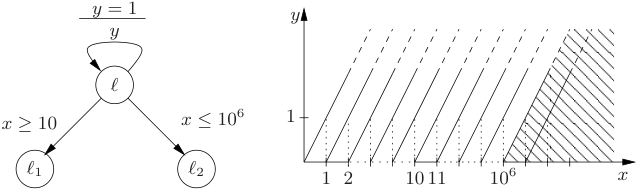

**Fig. 1.** A small timed automaton. The state space of the automaton when in location _ℓ_ is shown. The area to the right is the abstraction of the last zone.

Obviously, the smaller we may choose these maximum constants, the coarser the resulting abstraction will be. Allowing clocks to be assigned different (maximum) constants is an obvious first step in this direction, and in [BBFL03] this idea has been (successfully) taken further by allowing the maximum constants not only to depend of the particular clock but also of the particular location of the TA. In all cases the _exactness_ is established by proving that the abstraction respects _bisimilarity_ , _i.e._ states identified by the abstraction are bisimilar.

Consider now the timed automaton of Fig. 1. Clearly 10[6] is the maximum constant for _x_ and 1 is the maximum constant for _y_ . Thus, abstractions based on maximum constants will distinguish all states where _x ≤_ 10[6] and _y ≤_ 1. In particular, a forward computation of the full state space will – regardless of the search-order – create an excessive number of abstract (symbolic) states including all abstract states of the form ( _ℓ, x − y_ = _k_ ) where 0 _≤ k ≤_ 10[6] as well as ( _ℓ, x − y >_ 10[6] ). However, assuming that we are only interested in _reachability_ properties (as is often the case in Uppaal), the application of downwards closure with respect to _simulation_ will lead to an exact abstraction which could potentially be substantially coarser than closure under bisimilarity. Observing that 10[6] is an _upper_ bound on the edge from _ℓ_ to _ℓ_ 2 in Fig. 1, it is clear that for any state where _x ≥_ 10, increasing _x_ will only lead to “smaller” states with respect to simulation preorder. In particular, applying this downward closure results in the radically smaller collection of abstract states, namely ( _ℓ, x − y_ = _k_ ) where 0 _≤ k ≤_ 10 and ( _ℓ, x − y >_ 10).

The fact that 10[6] is an _upper_ bound in the example of Fig. 1 is crucial for the reduction we obtained above. In this paper we present new, substantially coarser yet still exact abstractions which are based on _two_ maximum constants obtained by distinguishing lower and upper bounds. In all cases the exactness (w.r.t. reachability) is established by proving that the abstraction respects downwards closure w.r.t. simulation, _i.e._ for each state in the abstraction there is an original state simulating it. The variety of abstractions comes from the additional requirements to _effective_ representation and _efficient_ computation and manipulation. In particular we insist that zones can form the basis of our abstractions; in fact the suggested abstractions are defined in terms of low-complexity transformations of the difference bound matrix (DBM) representation of zones.

--- end of page.page_number=2 ---

314 G. Behrmann et al.

Furthermore, we demonstrate how information about lower and upper bounds can be used to optimise the algorithm for bringing a DBM into normal form. Finally, we experimentally demonstrate the significant speedups obtained by our new abstractions, to be comparable with the convex hull over-approximation supported by Uppaal. Here, the distinction between lower and upper bounds is combined with the orthogonal idea of location-dependency of [BBFL03].

## **2 Preliminaries**

Although we perform our experiments in Uppaal, we describe the theory on the basic TA model. Variables, committed locations, networks, and other things supported by Uppaal are not important with respect to presented ideas and the technique can easily be extended for these ”richer” models. Let _X_ be a set of nonnegative real-valued variables called _clocks_ . The set of guards _G_ ( _X_ ) is defined by the grammar _g_ := _x ▷◁c | g ∧ g_ , where _x ∈ X, c ∈_ N and _▷◁ ∈{<, ≤, ≥, >}_ .

**Definition 1 (TA Syntax).** _A_ timed automaton _is a tuple A_ = ( _L, X, ℓ_ 0 _, E, I_ ) _, where L is a finite set of locations, X is a finite set of clocks, ℓ_ 0 _∈ L is an initial location, E ⊆ L × G_ ( _X_ ) _×_ 2 _[X] × L is a set of edges labelled by guards and a set of clocks to be reset, and I_ : _L → G_ ( _X_ ) _assigns invariants to clocks._

A _clock valuation_ is a function _ν_ : _X →_ R _≥_ 0. If _δ ∈_ R _≥_ 0 then _ν_ + _δ_ denotes the valuation such that for each clock _x ∈ X_ , ( _ν_ + _δ_ )( _x_ ) = _ν_ ( _x_ ) + _δ_ . If _Y ⊆ X_ then _ν_ [ _Y_ := 0] denotes the valuation such that for each clock _x ∈ X_ ∖ _Y_ , _ν_ [ _Y_ := 0]( _x_ ) = _ν_ ( _x_ ) and for each clock _x ∈ Y_ , _ν_ [ _Y_ := 0]( _x_ ) = 0. The satisfaction relation _ν |_ = _g_ for _g ∈ G_ ( _X_ ) is defined in the natural way.

**Definition 2 (TA Semantics).** _The semantics of a timed automaton A_ = ( _L, X, ℓ_ 0 _, E, I_ ) _is defined by a transition system SA_ = ( _S, s_ 0 _, −→_ ) _, where S_ = _L ×_ R _[X] ≥_ 0 _[is][the][set][of][states,][s]_[0][=][(] _[ℓ]_[0] _[, ν]_[0][)] _[is][the][initial][state,][ν]_[0][(] _[x]_[)][=][0] _[for][all] x ∈ X, and −→⊆ S × S is the set of transitions defined by:_

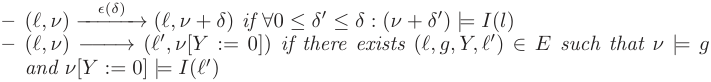

The _reachability problem_ for an automaton _A_ and a location _ℓ_ is to decide whether there is a state ( _ℓ, ν_ ) reachable from ( _ℓ_ 0 _, ν_ 0) in the transition system _SA_ . As usual, for verification purposes, we define a symbolic semantics for TA. For universality, the definition uses arbitrary sets of clock valuations.

**Definition 3 (Symbolic Semantics).** _Let A_ = ( _L, X, ℓ_[0] _, E, I_ ) _be a timed automaton. The symbolic semantics of A is based on the abstract transition system_ ( _S, s_ 0 _,_ = _⇒_ ) _, where S_ = _L ×_ 2[R] _≥[X]_ 0 _, and ’_ = _⇒’ is defined by the following two rules:_

_**Delay:**_ ( _ℓ, W_ ) = _⇒_ ( _ℓ, W[′]_ ) _, where W[′]_ = � _ν_ + _d | ν ∈ W ∧ d ≥_ 0 _∧∀_ 0 _≤ d[′] ≤ d_ : ( _ν_ + _d[′]_ ) _|_ = _I_ ( _ℓ_ )� _**Action:**_ ( _ℓ, W_ ) = _⇒_ ( _ℓ[′] , W[′]_ ) _if there exists a transition ℓ −−−→g,Y ℓ[′] in A, such that W[′]_ = � _ν[′] | ∃ν ∈ W_ : _ν |_ = _g ∧ ν[′]_ = _ν_ [ _Y_ := 0] _∧ ν[′] |_ = _I_ ( _ℓ[′]_ )� _._

--- end of page.page_number=3 ---

Lower and Upper Bounds in Zone Based Abstractions 315

The symbolic semantics of a timed automaton may induce an infinite transition system. To obtain a finite graph one may, as suggested in [BBFL03], apply some abstraction a : _P_ (R _[X] ≥_ 0[)] _[�][→P]_[(][R] _[X] ≥_ 0[),][such][that] _[W][⊆]_[a][(] _[W]_[).][The][abstract] transition system ’= _⇒_ a’ is then given by the following inference rule:

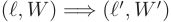

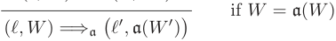

A simple way to ensure that the reachability graph induced by ’= _⇒_ a’ is finite is to establish that there is only a finite number of abstractions of sets of valuations; that is, the set _{_ a( _W_ ) _|_ a defined on _W }_ is finite. In this case a is said to be a _finite abstraction_ . Moreover, ’= _⇒_ a’ is said to be _sound_ and _complete_ (w.r.t. reachability) whenever:

_**Sound:**_ ( _ℓ_ 0 _, {ν_ 0 _}_ ) = _⇒[∗]_ a[(] _[ℓ, W]_[)][implies] _[∃][ν][∈][W]_[s.t.][(] _[ℓ]_[0] _[, ν]_[0][)] _[ −→][∗]_[(] _[l, ν]_[)] _**Complete:**_ ( _ℓ_ 0 _, ν_ 0) _−→[∗]_ ( _ℓ, ν_ ) implies _∃W_ : _ν ∈ W_ and ( _ℓ_ 0 _, {ν_ 0 _}_ ) = _⇒[∗]_ a[(] _[ℓ, W]_[)]

By language misuse, we say that an abstraction a is _sound_ (resp. _complete_ ) whenever ’= _⇒_ a’ is sound (resp. complete). Completeness follows trivially from the definition of abstraction. Of course, if a and b are two abstractions such that for any set of valuations _W_ , a( _W_ ) _⊆_ b( _W_ ), we prefer to use abstraction b because the graph induced by it is _a priori_ smaller than the one induced by a. Our aim is thus to propose an abstraction which is finite, as coarse as possible, and which induces a sound abstract transition system. We also require that abstractions are _effectively_ representable and may be _efficiently_ computed and manipulated.

A first step in finding an effective abstraction is realising that _W_ will always be a zone whenever ( _ℓ_[0] _, {ν_ 0 _}_ ) = _⇒[∗]_ ( _ℓ, W_ ). A _zone_ is a conjunction of constraints of the form _x ▷◁c_ or _x − y ▷◁c_ , where _x_ and _y_ are clocks, _c ∈_ Z, and _▷◁_ is one of _{≤, ≤,_ = _, ≥, >}_ . Zones can be represented using _Difference Bound Matrices_ (DBM). We will briefly recall the definition of DBMs, and refer to [Dil89,CGP99,Ben02,Bou02] for more details. A DBM is a square matrix _D_ = _⟨ci,j, ≺i,j⟩_ 0 _≤i,j≤n_ such that _ci,j ∈_ Z and _≺i,j∈{<, ≤}_ or _ci,j_ = _∞_ and _≺i,j_ = _<_ . The DBM _D_ represents the zone � _D_ � which is defined by � _D_ � = _{ν | ∀_ 0 _≤ i, j ≤ n, ν_ ( _xi_ ) _− ν_ ( _xj_ ) _≺i,j ci,j}_ , where _{xi |_ 1 _≤ i ≤ n}_ is the set of clocks, and _x_ 0 is a clock which is always 0, ( _i.e._ for each valuation _ν_ , _ν_ ( _x_ 0) = 0). DBMs are not a canonical representation of zones, but a normal form can be computed by considering the DBM as an adjacency matrix of a weighted directed graph and computing all shortest paths. In particular, if _D_ = _⟨ci,j, ≺i,j⟩_ 0 _≤i,j≤n_ is a DBM in normal form, then it satisfies the _triangular inequality_ , that is, for every 0 _≤ i, j, k ≤ n_ , we have that ( _ci,j, ≺i,j_ ) _≤_ ( _ci,k, ≺i,k_ ) + ( _ck,j, ≺k,j_ ), where comparisons and additions are defined in a natural way (see [Bou02]). All operations needed to compute ’= _⇒_ ’ can be implemented by manipulating the DBMs.

## **3 Maximum Bound Abstractions**

The abstraction used in real-time model-checkers such as Uppaal [LPY97] and Kronos [BDM[+] 98], is based on the idea that the behaviour of an automaton

--- end of page.page_number=4 ---

316 G. Behrmann et al.

is only sensitive to changes of a clock if its value is below a certain constant. That is, for each clock there is a maximum constant such that once the value of a clock has passed this constant, its exact value is no longer relevant — only the fact that it is larger than the maximum constant matters. Transforming a DBM to reflect this idea is often referred to as _extrapolation_ [Bou03,BBFL03] or _normalisation_ [DT98]. In the following we will choose the term _extrapolation_ .

**Simulation & Bisimulation.** The notion of bisimulation has so far been the semantic tool for establishing soundness of suggested abstractions. In this paper we shall exploit the more liberal notion of simulation to allow for even coarser abstractions. Let us fix a timed automaton _A_ = ( _L, X, ℓ_ 0 _, E, I_ ). We consider a relation on _L ×_ R _[X] ≥_ 0[satisfying][the][following][transfer][properties:]

1. if ( _ℓ_ 1 _, ν_ 1) ≼ ( _ℓ_ 2 _, ν_ 2) then _ℓ_ 1 = _ℓ_ 2

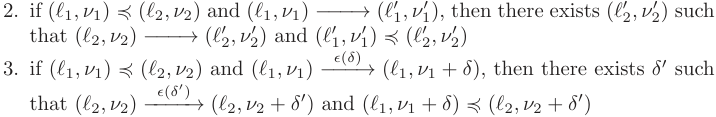

We call such a relation a ( _location-based_ ) _simulation_ relation or simply a _simulation_ relation. A simulation relation ≼ such that ≼ _[−]_[1] is also a simulation relation, is called a (location-based) _bisimulation relation_ .

**Proposition 1.** _Let_ ≼ _be a simulation relation, as defined above. If_ ( _ℓ, ν_ 1) ≼ ( _ℓ, ν_ 2) _and if a discrete state ℓ[′] is reachable from_ ( _ℓ, ν_ 1) _, then it is also reachable from_ ( _ℓ, ν_ 2) _._

Reachability is thus preserved by simulation as well as by bisimulation. However, in general the weaker notion of simulation preserves fewer properties than that of bisimulation. For example, deadlock properties as expressed in Uppaal[1] are not preserved by simulation whereas it is preserved by bisimulation. In Fig. 1, ( _ℓ, x_ = 15 _, y_ = _._ 5) is bisimilar to ( _ℓ, x_ = 115 _, y_ = _._ 5), but not to ( _ℓ, x_ = 10[6] + 1 _, y_ = _._ 5). However, ( _ℓ, x_ = 15 _, y_ = _._ 5) simulates ( _ℓ, x_ = 115 _, y_ = _._ 5) as well as ( _ℓ, x_ = 10[6] + 1 _, y_ = _._ 5).

**Classical Maximal Bounds.** The classical abstraction for timed automata is based on maximal bounds, one for each clock of the automaton. Let _A_ = ( _L, X, ℓ_ 0 _, E, I_ ) be a timed automaton. The _maximal bound_ of a clock _x ∈ X_ , denoted _M_ ( _x_ ), is the maximal constant _k_ such that there exists a guard or invariant containing _x ▷◁k_ in _A_ . Let _ν_ and _ν[′]_ be two valuations. We define the following relation:

def _ν ≡M ν[′] ⇐⇒∀x ∈ X_ : either _ν_ ( _x_ ) = _ν[′]_ ( _x_ ) or ( _ν_ ( _x_ ) _> M_ ( _x_ ) and _ν[′]_ ( _x_ ) _> M_ ( _x_ )) **Lemma 1.** _The relation R_ = _{_ (( _ℓ, ν_ ) _,_ ( _ℓ, ν[′]_ )) _| ν ≡M ν[′] } is a bisimulation relation._

- 1 There is a deadlock whenever there exists a state ( _ℓ, ν_ ) such that no further discrete transition can be taken.

--- end of page.page_number=5 ---

Lower and Upper Bounds in Zone Based Abstractions 317

We can now define the abstraction a _≡M_ w.r.t. _≡M_ . Let _W_ be a set of valuations, then a _≡M_ ( _W_ ) = _{ν | ∃ν[′] ∈ W, ν[′] ≡M ν}_ .

**Lemma 2.** _The abstraction_ a _≡M is sound and complete._

These two lemmas come from [BBFL03]. They will moreover be consequences of our main result.

**Lower & Upper Maximal Bounds.** The new abstractions introduced in the following will be substantially coarser than a _≡M_ . It is no longer based on a single maximal bound per clock but rather on two maximal bounds per clock allowing lower and upper bounds to be distinguished.

**Definition 4.** _Let A_ = ( _L, X, ℓ_ 0 _, E, I_ ) _be a timed automaton. The_ maximal lower bound _denoted L_ ( _x_ ) _, (resp._ maximal upper bound _U_ ( _x_ ) _) of clock x ∈ X is the maximal constant k such that there exists a constraint x > k or x ≥ k (resp. x < k or x ≤ k) in a guard of some transition or in an invariant of some location of A. If such a constant does not exist, we set L_ ( _x_ ) _(resp. U_ ( _x_ ) _) to −∞._

Let us fix for the rest of this section a timed automaton _A_ and bounds _L_ ( _x_ ), _U_ ( _x_ ) for each clock _x ∈ X_ as above. The idea of distinguishing lower and upper bounds is the following: if we know that the clock _x_ is between 2 and 4, and if we want to check that the constraint _x ≤_ 5 can be satisfied, the only relevant information is that the value of _x_ is greater than 2, and not that _x ≤_ 4. In other terms, checking the emptiness of the intersection between a non-empty interval [ _c, d_ ] and ] _−∞,_ 5] is equivalent to checking whether _c >_ 5; the value of _d_ is not useful. Formally, we define the LU-preorder as follows.

**Definition 5 (LU-preorder** _≺LU_ **).** _Let ν and ν[′] be two valuations. Then, we say that_

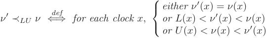

**Lemma 3.** _The relation R_ = _{_ (( _ℓ, ν_ ) _,_ ( _ℓ, ν[′]_ )) _| ν[′] ≺LU ν} is a simulation relation._

_Proof._ The only non-trivial part in proving that _R_ indeed satisfies the three transfer properties of a simulation relation is to establish that if _g_ is a clock constraint, then “ _ν |_ = _g_ implies _ν[′] |_ = _g_ ”. Consider the constraint _x ≤ c_ . If _ν_ ( _x_ ) = _ν[′]_ ( _x_ ), then we are done. If _L_ ( _x_ ) _< ν[′]_ ( _x_ ) _< ν_ ( _x_ ), then _ν_ ( _x_ ) _≤ c_ implies _ν[′]_ ( _x_ ) _≤ c_ . If _U_ ( _x_ ) _< ν_ ( _x_ ) _< ν[′]_ ( _x_ ), then it is not possible that _ν |_ = _x ≤ c_ (because _c ≤ U_ ( _x_ )). Consider now the constraint _x ≥ c_ . If _ν_ ( _x_ ) = _ν[′]_ ( _x_ ), then we are done. If _U_ ( _x_ ) _< ν_ ( _x_ ) _< ν[′]_ ( _x_ ), then _ν_ ( _x_ ) _≥ c_ implies _ν[′]_ ( _x_ ) _≥ c_ . If _L_ ( _x_ ) _< ν[′]_ ( _x_ ) _< ν_ ( _x_ ), then it is not possible that _ν_ satisfies the constraint _x ≥ c_ because _c ≤ L_ ( _x_ ).

Using the above LU-preorder, we can now define a first abstraction based on the lower and upper bounds.

--- end of page.page_number=6 ---

318 G. Behrmann et al.

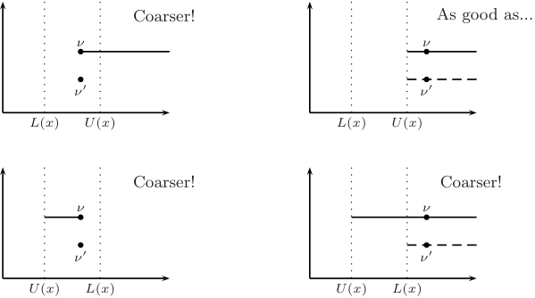

**Fig. 2.** Quality of a _≺LU_ compared with a _≡M_ for _M_ = max( _L, U_ ).

**Definition 6 (** a _≺LU_ **, abstraction w.r.t.** _≺LU_ **).** _Let W be a set of valuations. We define the abstraction w.r.t. ≺LU as_ a _≺LU_ ( _W_ ) = _{ν | ∃ν[′] ∈ W, ν[′] ≺LU ν}._

Before going further, we illustrate this abstraction in Fig. 2. There are several cases, depending on the relative positions of the two values _L_ ( _x_ ) and _U_ ( _x_ ) and of the valuation _ν_ we are looking at. We represent with a plain line the value of a _≺LU_ ( _{ν}_ ) and with a dashed line the value of a _≡M_ ( _{ν[′] }_ ), where the maximal bound _M_ ( _x_ ) corresponds to the maximum of _L_ ( _x_ ) and _U_ ( _x_ ). In each case, we indicate the “quality” of the new abstraction compared with the “old” one. We notice that the new abstraction is coarser in three cases and matches the old abstraction in the fourth case.

**Lemma 4.** _Let A be a timed automaton. Define the constants M_ ( _x_ ) _, L_ ( _x_ ) _and U_ ( _x_ ) _for each clock x as described before. The abstraction_ a _≺LU is sound, complete, and coarser or equal to_ a _≡M ._

_Proof._ Completeness is obvious, and soundness comes from lemma 3. Definitions of a _≺LU_ and a _≡M_ give the last result because for each clock _x_ , _M_ ( _x_ ) = max ( _L_ ( _x_ ) _, U_ ( _x_ )). ■

This result could suggest to use a _≺LU_ in real time model-checkers. However, we do not yet have an efficient method for computing the transition relation ’= _⇒_ a _≺LU_ ’. Indeed, even if _W_ is a zone, it might be the case that a _≺LU_ ( _W_ ) is not even convex (we urge the reader to construct such an example for herself). For effectiveness and efficiency reasons we prefer abstractions which transform zones into zones because we can then use the DBM data structure. In the next section we present DBM-based extrapolation operators that will give abstractions which are sound, complete, finite and also effective.

--- end of page.page_number=7 ---

Lower and Upper Bounds in Zone Based Abstractions 319

## **4 Extrapolation Using Zones**

The (sound and complete) symbolic transition relations induced by abstractions considered so far unfortunately do not preserve convexity of sets of valuations. In order to allow for sets of valuations to be represented _efficiently_ as zones, we consider slightly finer abstractions a _Extra_ such that for every zone _Z_ , _Z ⊆_ a _Extra_ ( _Z_ ) _⊆_ a _≺LU_ ( _Z_ ) (resp. _Z ⊆_ a _Extra_ ( _Z_ ) _⊆_ a _≡M_ ( _Z_ )) (this ensures correctness) and a _Extra_ ( _Z_ ) is a zone (this gives an effective representation). These abstractions are defined in terms of _extrapolation_ operators on DBMs. If _Extra_ is an extrapolation operator, it defines an abstraction, a _Extra_ , on zones such that for every zone _Z_ , a _Extra_ ( _Z_ ) = � _Extra_ ( _DZ_ )�, where _DZ_ is the DBM in normal form which represents the zone _Z_ .

In the remainder, we consider a timed automaton _A_ over a set of clocks _X_ = _{x_ 1 _, .., xn}_ and we suppose we are given another clock _x_ 0 which is always zero. For all these clocks, we define the constants _M_ ( _xi_ ), _L_ ( _xi_ ), _U_ ( _xi_ ) for _i_ = 1 _, ..., n_ . For _x_ 0, we set _M_ ( _x_ 0) = _U_ ( _x_ 0) = _L_ ( _x_ 0) = 0 ( _x_ 0 is always equal to zero, so we assume we are able to check whether _x_ 0 is really zero). In our framework, a zone will be represented by DBMs of the form _⟨ci,j, ≺i,j⟩i,j_ =0 _,... ,n_ .

We now present several extrapolations starting from the classical one and improving it step by step. Each extrapolation will be illustrated by a small picture representing a zone (in black) and its corresponding extrapolation (dashed).

**Classical extrapolation based on maximal bounds** _M_ ( _x_ ) **.** Let _D_ be a DBM _⟨ci,j, ≺i,j⟩i,j_ =0 _...n_ . Then _ExtraM_ ( _D_ ) is given by the DBM _⟨c[′] i,j[,][ ≺][′] i,j[⟩][i,j]_[=0] _[...n]_ and illustrated below:

This is the extrapolation operator used in the real-time model-checkers Uppaal and Kronos. This extrapolation removes bounds that are larger than the maximal constants. The correctness is based on the fact that a _ExtraM_ ( _Z_ ) _⊆_ a _≡M_ ( _Z_ ) and is proved in [Bou03] and for the location-based version in [BBFL03].

In the remainder, we will propose several other extrapolations that will improve the classical one, in the sense that the zones obtained with the new extrapolations will be larger than the zones obtained with the classical extrapolation.

**Diagonal extrapolation based on maximal constants** _M_ ( _x_ ) **.** The first improvement consists in noticing that if the whole zone is above the maximal bound of some clock, then we can remove some of the diagonal constraints of the zones, even if they are not themselves above the maximal bound. More formally,

--- end of page.page_number=8 ---

320 G. Behrmann et al.

if _D_ = _⟨ci,j, ≺i,j⟩i,j_ =0 _,...,n_ is a DBM, _Extra_[+] _M_[(] _[D]_[)][is][given][by] _[⟨][c][′] i,j[,][ ≺][′] i,j[⟩][i,j]_[=0] _[,...,n]_ as:

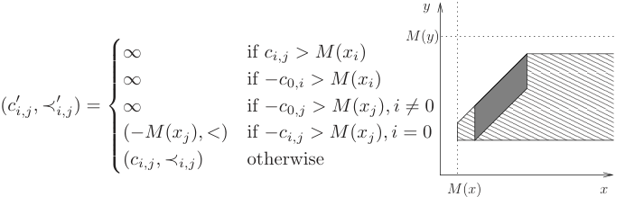

For every zone _Z_ it then holds that _Z ⊆_ a _ExtraM_ ( _Z_ ) _⊆_ a _Extra_ + _M_[(] _[Z]_[).]

**Extrapolation based on LU-bounds** _L_ ( _x_ ) **and** _U_ ( _x_ ) **.** The second improvement uses the two bounds _L_ ( _x_ ) and _U_ ( _x_ ). If _D_ = _⟨ci,j, ≺i,j⟩i,j_ =0 _,...,n_ is a DBM, _ExtraLU_ ( _D_ ) is given by _⟨c[′] i,j[,][ ≺][′] i,j[⟩][i,j]_[=0] _[,...,n]_[defined][as:]

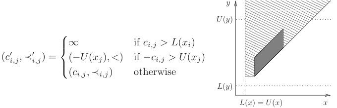

This extrapolation benefits from the properties of the two different maximal bounds. It does generalise the operator a _ExtraM_ . For every zone _Z_ , it holds that _Z ⊆_ a _ExtraM_ ( _Z_ ) _⊆_ a _ExtraLU_ ( _Z_ ).

**Diagonal extrapolation based on LU-bounds** _L_ ( _x_ ) **and** _U_ ( _x_ ) **.** This last extrapolation is a combination of both the extrapolation based on LU-bounds and the improved extrapolation based on maximal constants. It is the most general one. If _D_ = _⟨ci,j, ≺i,j⟩i,j_ =0 _,...,n_ is a DBM, _Extra_[+] _LU_[(] _[D]_[)][is][given][by][the] DBM _⟨c[′] i,j[,][ ≺][′] i,j[⟩][i,j]_[=0] _[,...,n]_[defined][as:]

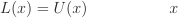

**Correctness of these Abstractions.** We know that all the above extrapolations are complete abstractions as they transform a zone into a clearly larger one. Finiteness also comes immediately, because we can do all the computations with

--- end of page.page_number=9 ---

Lower and Upper Bounds in Zone Based Abstractions 321

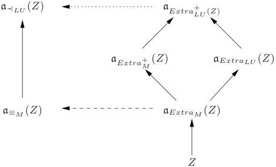

**Fig. 3.** For any zone _Z_ , we have the inclusions indicated by the arrows. The sets a _Extra_ + _M_[(] _[Z]_[)][and][a] _[Extra][LU]_[ (] _[Z]_[)][are][incomparable.][The][a] _[Extra]_[operators][are][DBM][based] abstractions whereas the other two are semantic abstractions. The dashed arrow was proved in [BBFL03] whereas the dotted arrow is the main result of this paper.

DBMs and the coefficients after extrapolation can only take a finite number of values. Effectiveness of the abstraction is obvious as extrapolation operators are directly defined on the DBM data structure. The only difficult point is to prove that the extrapolations we have presented are correct. To prove the correctness of all these abstractions, due to the inclusions shown in Fig. 3, it is sufficient to prove the correctness of the largest abstraction, _viz_ a _Extra_ + _LU_[.]

**Proposition 2.** _Let Z be a zone. Then_ a _Extra_ + _LU_[(] _[Z]_[)] _[ ⊆]_[a] _[≺][LU]_[ (] _[Z]_[)] _[.]_

The proof of this proposition is quite technical, and is omitted here due to the page limit. Notice however that it is a key-result. Using all what precedes we are able to claim the following theorem which states that a _Extra_ + _LU_[is][an][abstraction] which can be used in the implementation of TA.

**Theorem 1.** a _Extra_ + _LU[is][sound,][complete,][finite][and][effectively][computable.]_

## **5 Acceleration of Successor Computation**

In the preceding section it was shown that the abstraction based on the new extrapolation operator is coarser than the one currently used in TA modelcheckers. This can result in a smaller symbolic representation of the state space of a timed automaton, but this is not the only consequence: Sometimes clocks might only have lower bounds or only have upper bounds. We say that a clock _x_ is _lower-bounded_ (resp. _upper-bounded_ ) if _L_ ( _x_ ) _> −∞_ (resp. _U_ ( _x_ ) _> −∞_ ). Let _D_ be a DBM and _D[′]_ = _Extra_[+] _LU_[(] _[D]_[).][It][follows][directly][from][the][definition][of] the extrapolation operator that for all _xi_ , _U_ ( _xi_ ) = _−∞_ implies _c[′] j,i_[=][+] _[∞]_[and] _L_ ( _xi_ ) = _−∞_ implies _c[′] i,j_[=][+] _[∞]_[.][If][we][let] _[Low]_[=] _[{][i][|][x][i]_[is][lower][bounded] _[}]_[and] _Up_ = _{i | xi_ is upper bounded _}_ , then it follows that _D[′]_ can be represented with

--- end of page.page_number=10 ---

322 G. Behrmann et al.

_O_ ( _|Low| · |Up|_ ) constraints (compared to _O_ ( _n_[2] )), since all remaining entries in the DBM will be + _∞_ . As we will see in this section, besides reducing the size of the zone representation, identifying lower and upper bounded clocks can be used to speed up the successor computation.

We will first summarise how the DBM based successor computation is performed. Let _D_ be a DBM **in normal form** . We want to compute the successor of _D g,Y_ w.r.t. an edge _ℓ −−−→ ℓ[′]_ . In Uppaal, this is broken down into a number of elementary DBM operations, quite similar to the symbolic semantics of TA. After applying the guard and the target invariant, the result must be checked for consistency and after applying the extrapolation operator, the DBM must be brought back into normal form. Checking the consistency of a DBM is done by computing the normal form and checking the diagonal for negative entries. In general, the normal form can be computed using the _O_ ( _n_[3] )-time Floyd-Warshall all-pairs-shortest-path algorithm, but when applying a guard or invariant, resetting clocks, or computing the delay successors, the normal form can be recomputed much more efficiently, see [Rok93]. The following shows the operations involved and their complexity (all DBMs except _D_ 5 are in normal form). The last step is clearly the most expensive.

1. _D_ 1 = Intersection( _g, D_ ) + detection of emptiness _O_ ( _n_[2] _· |g|_ ) 2. _D_ 2 = Reset _Y_ ( _D_ 1) _O_ ( _n · |Y |_ ) 3. _D_ 3 = Elapse( _D_ 2) _O_ ( _n_ ) 4. _D_ 4 = Intersection( _I_ ( _ℓ_ ) _, D_ 3) + detection of emptiness _O_ ( _n_[2] _· |I_ ( _l_ ) _|_ ) 5. _D_ 5 = Extrapolation( _D_ 4) _O_ ( _n_[2] ) 6. _D_ 6 = Canonize( _D_ 5) _O_ ( _n_[3] )

We say that a DBM _D_ is in _LU-form_ whenever all coefficients _ci,j_ = _∞_ , except when _xi_ is lower bounded _and xj_ is upper bounded. As a first step we will use the fact that _D_ 5 is in LU-form to improve the computation of _D_ 6. Canonize is the Floyd-Warshall algorithm for computing the all-pairs-shortest-path closure, consisting of three nested loops over the indexes of the DBM, hence the cubic runtime. We propose to replace it with the following LU-Canonize operator.

**proc** LU-Canonize( _D_ )

**for** _k ∈ Low ∩ Up_ **do**

**for** _i ∈ Low_ **do**

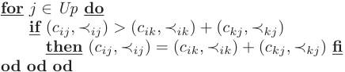

## **end**

This procedure runs in _O_ ( _|Low |·|Up|·|Low ∩ Up|_ ) time which in practise can be much smaller than _O_ ( _n_[3] ). Correctness of this change is ensured by the following lemma.

**Lemma 5.** _Let D be a DBM in LU-form. Then we have the following syntactic equality:_ Canonize( _D_ ) = LU-Canonize( _D_ ) _._

--- end of page.page_number=11 ---

Lower and Upper Bounds in Zone Based Abstractions 323

As an added benefit, it follows directly from the definition of LU-Canonize that _D_ 6 is also in LU-form and so is _D_ when computing the next successor. Hence we can replace the other DBM operations (intersection, elapse, reset, etc.) by versions which work on DBMs in LU-form. The main interest would be to introduce an asymmetric DBM which only stores _O_ ( _|Low| · |Up|_ ) entries, thus speeding up the successor computation further and reducing the memory requirements. At the moment we have implemented the LU-Canonize operation, but rely on the _minimal constraint form_ representation of a zone described in [LLPY97], which does not store + _∞_ entries.

## **6 Implementation and Experiments**

We have implemented a prototype of a location based variant of the _Extra_[+] _LU_[op-] erator in Uppaal 3.4.2. Maximum lower and upper bounds for clocks are found for each automaton using a simple fixed point iteration. Given a location vector, the maximum lower and upper bounds are simply found by taking the maximum of the bounds in each location, similar to the approach taken in [BBFL03]. In addition, we have implemented the LU-Canonize operator.

As expected, experiments with the model in Fig. 1 show that the using the LU extrapolation the computation time for building the complete reachable state space does not depend on the value of the constants, whereas the computation time grows with the constant when using the classical extrapolation approach. We have also performed experiments with models of various instances of Fischer’s protocol for mutual exclusion and the CSMA/CD protocol. Finally, experiments using a number of industrial case studies were made. For each model, Uppaal was run with four different options: (-n1) classic non-location based extrapolation (without active clock reduction), (-n2) classic location based extrapolation (which gives active clock reduction as a side-effect), (-n3) LU location based extrapolation, and (-A) classic location based extrapolation with convex-hull approximation. In all experiments the minimal constraint form for zone representation was used [LLPY97] and the complete state space was generated. All experiments were performed on a 1.8GHz Pentium 4 running Linux 2.4.22, and experiments were limited to 15 minutes of CPU time and 470MB of memory. The results can be seen in Table 1.

Looking at the table, we see that for both Fischer’s protocol for mutual exclusion and the CSMA/CD protocol, Uppaal scales considerably better with the LU extrapolation operator. Comparing it with the convex hull approximation (which is an over-approximation), we see that for these models, the LU extrapolation operator comes close to the same speed, although it still generates more states. Also notice that the runs with the LU extrapolation operator use less memory than convex hull approximation, due to the fact that in the latter case DBMs are used to represent the convex hull of the zones involved (in contrast to using the minimal constraint form of [LLPY97]). For the three industrial examples, the speedup is less dramatic: These models have a more complex control structure and thus little can be gained from changing the extrapolation operator. This is supported by the fact that also the convex hull technique fails to

--- end of page.page_number=12 ---

324 G. Behrmann et al.

|**Table 1.** Results for Fischer protocol (f), CSMA/CD (c), a model of a buscoupler, the Philips Audio protocol, and a model of a 5 task fxed-priority preemptive scheduler. -n0 is with classical maximum bounds extrapolation, -n1 is with location based maximum bounds extrapolation, -n2 is with location based LU extrapolation, and -A is with convex hull over-approximation. Times are in seconds, states are the number of generated states and memory usage is in MB.||||||
|---|---|---|---|---|---|
||-A|Time States Mem|0.03 3,650 3 0.10 14,658 3 0.45 56,252 5 2.08 208,744 12 9.11 754,974 39 39.13 2,676,150 143|0.03 1,651 3 0.06 4,986 3 0.22 14,101 4 0.66 38,060 7 1.89 99,215 17 5.48 251,758 49 15.66 625,225 138 43.10 1,525,536 394|45.08 3,826,742 324 0.07 5,992 3 55.41 3,636,576 427|
||-n3|Time States Mem|0.03 2,870 3 0.11 11,484 3 0.47 44,142 3 2.11 164,528 6 8.76 598,662 19 37.26 2,136,980 68 152.44 7,510,382 268|0.02 2,027 3 0.10 6,296 3 0.28 18,205 3 0.98 50,058 5 2.90 132,623 12 8.42 341,452 29 24.13 859,265 76 68.20 2,122,286 202|62.01 4,317,920 246 0.09 6,599 3 12.85 619,351 52|
||-n2|Time States Mem|0.24 16,980 3 6.67 158,220 7 352.67 1,620,542 46|0.14 10,569 3 3.63 87,977 5 195.35 813,924 29|66.54 4,620,666 254 0.09 6,763 3 15.09 700,917 58|
||-n1|Time States Mem|4.02 82,685 5 597.04 1,489,230 49|0.55 27,174 3 19.39 287,109 11|102.28 6,727,443 303 0.16 12,823 3 17.01 929,726 76|
||Model||f5 f6 f7 f8 f9 f10 f11|c5 c6 c7 c8 c9 c10 c11 c12|bus philips sched|
|||||||

--- end of page.page_number=13 ---

Lower and Upper Bounds in Zone Based Abstractions 325

give any significant speedup (in the last example it even degrades performance). During our experiments we also encountered examples where the LU extrapolation operator does not make any difference: the token ring FDDI protocol and the B&O protocols found on the Uppaal website[2] are among these. Finally, we made a few experiments on Fischer’s protocol with the LU extrapolation, but without the LU-Canonize operator. This showed that LU-Canonize gives a speedup in the order of 20% compared to Canonize.

## **7 Remarks and Conclusions**

In this paper we extend the _status quo_ of timed automata abstractions by contributing several new abstractions. In particular, we proposed a new extrapolation operator distinguishing between guards giving an upper bound to a clock and guards giving a lower bound to a clock. The improvement of the usual extrapolation is orthogonal to the location-based one proposed in [BBFL03] in the sense that they can be easily combined. We prove that the new abstraction is sound and complete w.r.t. reachability, and is finite and effectively computable. We implemented the new extrapolation in Uppaal and a new operator for computing the normal form of a DBM. The prototype showed significant improvements in verification speed, memory consumption and scalability for a number of models.

For further work, we suggest implementing an asymmetric DBM based on the fact that an _n × m_ matrix, where _n_ is the number of lower bounded clocks and _m_ is the number of upper bounded clocks, suffices to represent the zones of the timed automaton when using the LU extrapolation. We expect this to significantly improve the successor computation for some models. We notice that when using the encoding of job shop scheduling problems given in [AM01], all clocks of the automaton are without upper bounds, with the exception of one clock (the clock measuring global time), which lacks lower bounds. Therefore an asymmetric DBM representation for this system will have a size linear in the number of clocks. This observation was already made in [AM01], but we get it as a side effect of using LU extrapolation. We also notice that when using LU extrapolation, the inclusion checking done on zones in Uppaal turns out to be more general than the dominating point check in [AM01]. We need to investigate to what extent a generic timed automaton reachability checker using LU extrapolation can compete with the problem specific implementation in [AM01].

## **References**

> [AD90] Rajeev Alur and David Dill. Automata for modeling real-time systems. In _Proc. 17th International Colloquium on Automata, Languages and Programming (ICALP’90)_ , volume 443 of _Lecture Notes in Computer Science_ , pages 322–335. Springer, 1990.

> 2 http://www.uppaal.com

--- end of page.page_number=14 ---

326 G. Behrmann et al.

- [AD94] Rajeev Alur and David Dill. A theory of timed automata. _Theoretical Computer Science (TCS)_ , 126(2):183–235, 1994.

- [AM01] Yasmina Abdeddaim and Oded Maler. Job-shop scheduling using timed automata. In _Proc. 13th International Conference on Computer Aided Verification (CAV’01)_ , volume 2102 of _Lecture Notes in Computer Science_ , pages 478–492. Springer, 2001.

- [BBFL03] Gerd Behrmann, Patricia Bouyer, Emmanuel Fleury, and Kim G. Larsen. Static guard analysis in timed automata verification. In _Proc. 9th International Conference on Tools and Algorithms for the Construction and Analysis of Systems (TACAS’2003)_ , volume 2619 of _Lecture Notes in Computer Science_ , pages 254–277. Springer, 2003.

|[BBFL03]|Gerd Behrmann, Patricia Bouyer, Emmanuel Fleury, and Kim G. Larsen. Static guard analysis in timed automata verifcation. In _Proc. 9th Interna-_ _tional Conference on Tools and Algorithms for the Construction and Anal-_ _ysis of Systems (TACAS’2003)_, volume 2619 of _Lecture Notes in Computer_ _Science_, pages 254–277. Springer, 2003.|
|---|---|
|[BDM+98]|Marius Bozga, Conrado Daws, Oded Maler, Alfredo Olivero, Stavros Tri-|
||pakis, and Sergio Yovine. Kronos: a model-checking tool for real-time|
||systems. In_Proc. 10th International Conference on Computer Aided Verif-_|
||_cation (CAV’98)_, volume 1427 of_Lecture Notes in Computer Science_, pages|
||546–550. Springer, 1998.|
|[Ben02]|Johan Bengtsson. _Clocks, DBMs ans States in Timed Systems_. PhD the-|
||sis, Department of Information Technology, Uppsala University, Uppsala,|
||Sweden, 2002.|
|[Bou02]|Patricia Bouyer. Timed automata may cause some troubles. Research Re-|
||port LSV–02–9, Laboratoire Sp´ecifcation et V´erifcation, ENS de Cachan,|
||France, 2002. Also Available as_BRICS Research Report RS-02-35_, Aalborg|
||University, Denmark, 2002.|
|[Bou03]|Patricia Bouyer. Untameable timed automata! In _Proc. 20th Annual Sym-_|
||_posium on Theoretical Aspects of Computer Science (STACS’03)_, volume|
||2607 of _Lecture Notes in Computer Science_, pages 620–631. Springer, 2003.|
|[CGP99]|Edmund Clarke, Orna Grumberg, and Doron Peled. _Model-Checking_. The|
||MIT Press, Cambridge, Massachusetts, 1999.|
|[Dil89]|David Dill. Timing assumptions and verifcation of fnite-state concurrent|
||systems. In _Proc. of the Workshop on Automatic Verifcation Methods for_|
||_Finite State Systems_, volume 407 of _Lecture Notes in Computer Science_,|
||pages 197–212. Springer, 1989.|
|[DT98]|Conrado Daws and Stavros Tripakis. Model-checking of real-time reach-|
||ability properties using abstractions. In _Proc. 4th International Confer-_|
||_ence on Tools and Algorithms for the Construction and Analysis of Systems_|
||_(TACAS’98)_, volume 1384 of _Lecture Notes in Computer Science_, pages|
||313–329. Springer, 1998.|
|[LLPY97]|Kim G. Larsen, Fredrik Larsson, Paul Pettersson, and Wang Yi. Efcient|
||verifcation of real-time systems: Compact data structure and state-space|
||reduction. In _Proc. 18th IEEE Real-Time Systems Symposium (RTSS’97)_,|
||pages 14–24. IEEE Computer Society Press, 1997.|
|[LPY97]|Kim G. Larsen, Paul Pettersson, and Wang Yi. Uppaal in a nutshell.|
||_Journal of Software Tools for Technology Transfer (STTT)_, 1(1–2):134–152,|
||1997.|
|[Rok93]|Tomas G. Rokicki. _Representing and Modeling Digital Circuits_. PhD thesis,|
||Stanford University, Stanford, USA, 1993.|

--- end of page.page_number=15 ---
