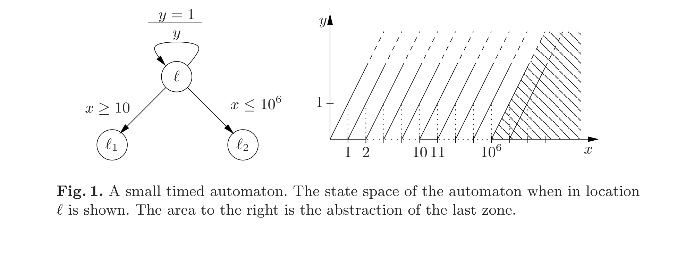
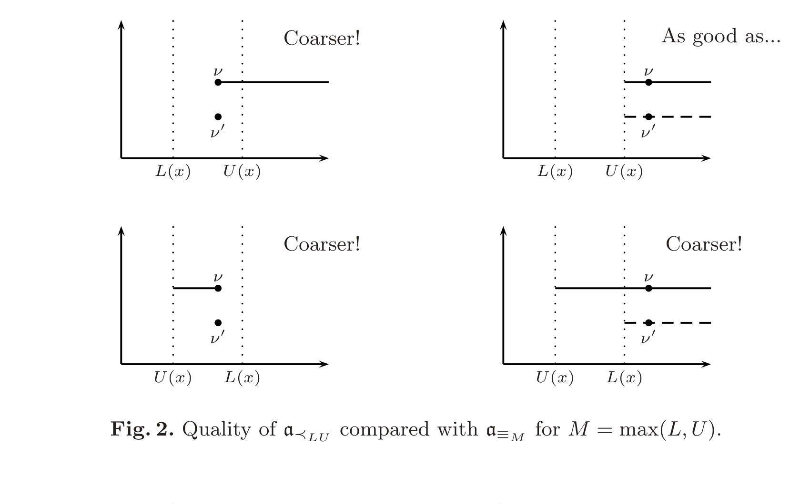
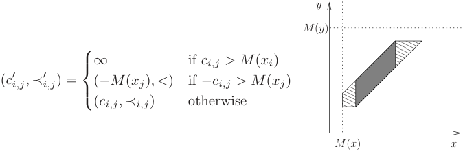
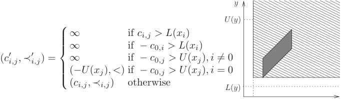
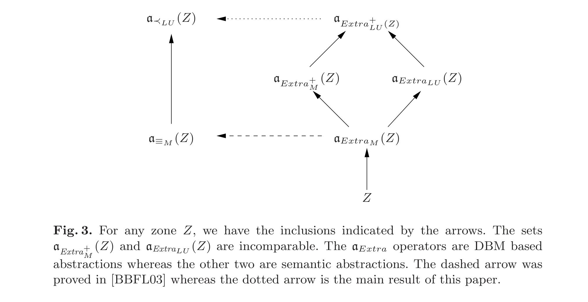
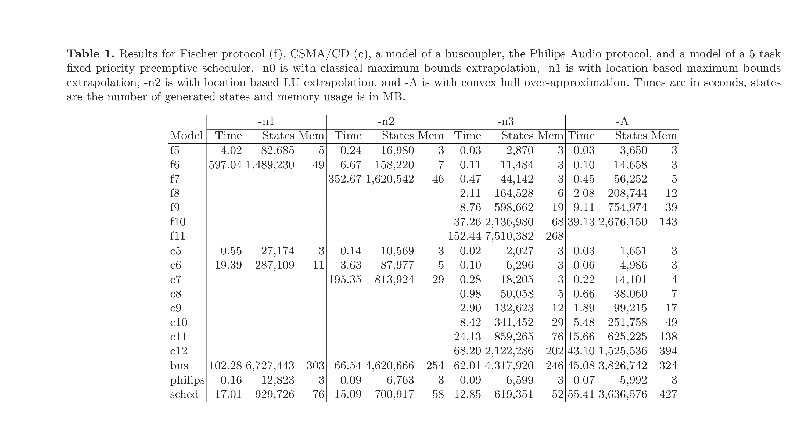

# Lower and Upper Bounds in Zone Based Abstractions of Timed Automata

Gerd Behrmann, Patricia Bouyer[^author-star], Kim G. Larsen, and Radek Pelánek[^author-starstar]

1. BRICS, Aalborg University, Denmark  
   `{behrmann,kgl}@cs.auc.dk`
2. LSV, CNRS & ENS de Cachan, UMR 8643, France  
   `bouyer@lsv.ens-cachan.fr`
3. Masaryk University Brno, Czech Republic  
   `xpelanek@informatics.muni.cz`

## Abstract

Timed automata have an infinite semantics. For verification purposes, one usually uses zone based abstractions w.r.t. the maximal constants to which clocks of the timed automaton are compared. We show that by distinguishing maximal lower and upper bounds, significantly coarser abstractions can be obtained. We show soundness and completeness of the new abstractions w.r.t. reachability. We demonstrate how information about lower and upper bounds can be used to optimise the algorithm for bringing a difference bound matrix into normal form. Finally, we experimentally demonstrate that the new techniques dramatically increase the scalability of the real-time model checker UPPAAL.

## 1 Introduction

Since their introduction by Alur and Dill [AD90, AD94], timed automata (TA) have become one of the most well-established models for real-time systems with well-studied underlying theory and development of mature model-checking tools, e.g. UPPAAL [LPY97] and Kronos [BDM+98]. By their very definition TA describe (uncountable) infinite state spaces. Thus, algorithmic verification relies on the existence of exact finite abstractions. In the original work by Alur and Dill, the so-called region-graph construction provided a "universal" such abstraction. However, whereas well suited for establishing decidability of problems related to TA, the region-graph construction is highly impractical from a tool-implementation point of view. Instead, most real-time verification tools apply abstractions based on so-called zones, which in practice provide much coarser (and hence smaller) abstractions.

To ensure finiteness, it is essential that the given abstraction (region as well as zone based) takes into account the actual constants with which clocks are compared. In particular, the abstraction could identify states which are identical except for the clock values which exceed the maximum such constants.



*Figure 1. A small timed automaton. The state space of the automaton when in location $\ell$ is shown. The area to the right is the abstraction of the last zone.*

Obviously, the smaller we may choose these maximum constants, the coarser the resulting abstraction will be. Allowing clocks to be assigned different (maximum) constants is an obvious first step in this direction, and in [BBFL03] this idea has been (successfully) taken further by allowing the maximum constants not only to depend on the particular clock but also on the particular location of the TA. In all cases the exactness is established by proving that the abstraction respects bisimilarity, i.e. states identified by the abstraction are bisimilar.

Consider now the timed automaton of Fig. 1. Clearly $10^6$ is the maximum constant for $x$ and $1$ is the maximum constant for $y$. Thus, abstractions based on maximum constants will distinguish all states where $x \le 10^6$ and $y \le 1$. In particular, a forward computation of the full state space will, regardless of the search order, create an excessive number of abstract (symbolic) states including all abstract states of the form $(\ell, x - y = k)$ where $0 \le k \le 10^6$ as well as $(\ell, x - y > 10^6)$. However, assuming that we are only interested in reachability properties (as is often the case in UPPAAL), the application of downwards closure with respect to simulation will lead to an exact abstraction which could potentially be substantially coarser than closure under bisimilarity. Observing that $10^6$ is an upper bound on the edge from $\ell$ to $\ell_2$ in Fig. 1, it is clear that for any state where $x \ge 10$, increasing $x$ will only lead to "smaller" states with respect to simulation preorder. In particular, applying this downward closure results in the radically smaller collection of abstract states, namely $(\ell, x - y = k)$ where $0 \le k \le 10$ and $(\ell, x - y > 10)$.

The fact that $10^6$ is an upper bound in the example of Fig. 1 is crucial for the reduction we obtained above. In this paper we present new, substantially coarser yet still exact abstractions which are based on two maximum constants obtained by distinguishing lower and upper bounds. In all cases the exactness (w.r.t. reachability) is established by proving that the abstraction respects downwards closure w.r.t. simulation, i.e. for each state in the abstraction there is an original state simulating it. The variety of abstractions comes from the additional requirements to effective representation and efficient computation and manipulation. In particular we insist that zones can form the basis of our abstractions; in fact the suggested abstractions are defined in terms of low-complexity transformations of the difference bound matrix (DBM) representation of zones.

Furthermore, we demonstrate how information about lower and upper bounds can be used to optimise the algorithm for bringing a DBM into normal form. Finally, we experimentally demonstrate the significant speedups obtained by our new abstractions, comparable with the convex hull over-approximation supported by UPPAAL. Here, the distinction between lower and upper bounds is combined with the orthogonal idea of location dependency of [BBFL03].

## 2 Preliminaries

Although we perform our experiments in UPPAAL, we describe the theory on the basic TA model. Variables, committed locations, networks, and other things supported by UPPAAL are not important with respect to the presented ideas, and the technique can easily be extended for these "richer" models. Let $X$ be a set of non-negative real-valued variables called clocks. The set of guards $G(X)$ is defined by the grammar

$$
g := x \bowtie c \mid g \land g,
$$

where $x \in X$, $c \in \mathbb{N}$, and $\bowtie \in \{<, \le, \ge, >\}$.

**Definition 1 (TA Syntax).** A timed automaton is a tuple $A = (L, X, \ell_0, E, I)$, where $L$ is a finite set of locations, $X$ is a finite set of clocks, $\ell_0 \in L$ is an initial location, $E \subseteq L \times G(X) \times 2^X \times L$ is a set of edges labelled by guards and a set of clocks to be reset, and $I : L \to G(X)$ assigns invariants to clocks.

A clock valuation is a function $\nu : X \to \mathbb{R}_{\ge 0}$. If $\delta \in \mathbb{R}_{\ge 0}$ then $\nu + \delta$ denotes the valuation such that for each clock $x \in X$, $(\nu + \delta)(x) = \nu(x) + \delta$. If $Y \subseteq X$ then $\nu[Y := 0]$ denotes the valuation such that for each clock $x \in X \setminus Y$, $\nu[Y := 0](x) = \nu(x)$ and for each clock $x \in Y$, $\nu[Y := 0](x) = 0$. The satisfaction relation $\nu \models g$ for $g \in G(X)$ is defined in the natural way.

**Definition 2 (TA Semantics).** The semantics of a timed automaton $A = (L, X, \ell_0, E, I)$ is defined by a transition system $S_A = (S, s_0, \to)$, where $S = L \times \mathbb{R}_{\ge 0}^X$ is the set of states, $s_0 = (\ell_0, \nu_0)$ is the initial state, $\nu_0(x) = 0$ for all $x \in X$, and $\to \subseteq S \times S$ is the set of transitions defined by

$$
(\ell, \nu) \xrightarrow{\epsilon(\delta)} (\ell, \nu + \delta)
\quad \text{if } \forall 0 \le \delta' \le \delta : (\nu + \delta') \models I(\ell),
$$

and

$$
(\ell, \nu) \to (\ell', \nu[Y := 0])
\quad \text{if there exists } (\ell, g, Y, \ell') \in E \text{ such that }
\nu \models g \text{ and } \nu[Y := 0] \models I(\ell').
$$

The reachability problem for an automaton $A$ and a location $\ell$ is to decide whether there is a state $(\ell, \nu)$ reachable from $(\ell_0, \nu_0)$ in the transition system $S_A$. As usual, for verification purposes, we define a symbolic semantics for TA. For universality, the definition uses arbitrary sets of clock valuations.

**Definition 3 (Symbolic Semantics).** Let $A = (L, X, \ell_0, E, I)$ be a timed automaton. The symbolic semantics of $A$ is based on the abstract transition system $(S, s_0, \Rightarrow)$, where $S = L \times 2^{\mathbb{R}_{\ge 0}^X}$, and `$\Rightarrow$` is defined by the following two rules:

**Delay**

$$
(\ell, W) \Rightarrow (\ell, W')
$$

where

$$
W' = \left\{ \nu + d \mid \nu \in W \land d \ge 0 \land \forall 0 \le d' \le d : (\nu + d') \models I(\ell) \right\}.
$$

**Action**

$$
(\ell, W) \Rightarrow (\ell', W')
$$

if there exists a transition $\ell \xrightarrow{g,Y} \ell'$ in $A$, such that

$$
W' = \left\{ \nu' \mid \exists \nu \in W : \nu \models g \land \nu' = \nu[Y := 0] \land \nu' \models I(\ell') \right\}.
$$

The symbolic semantics of a timed automaton may induce an infinite transition system. To obtain a finite graph one may, as suggested in [BBFL03], apply some abstraction $a : \mathcal{P}(\mathbb{R}_{\ge 0}^X) \to \mathcal{P}(\mathbb{R}_{\ge 0}^X)$ such that $W \subseteq a(W)$. The abstract transition system `$\Rightarrow_a$` is then given by the following inference rule:

$$
\frac{(\ell, W) \Rightarrow (\ell', W')}{(\ell, W) \Rightarrow_a (\ell', a(W'))}
\qquad \text{if } W = a(W).
$$

A simple way to ensure that the reachability graph induced by `$\Rightarrow_a$` is finite is to establish that there is only a finite number of abstractions of sets of valuations; that is, the set $\{a(W) \mid a \text{ defined on } W\}$ is finite. In this case $a$ is said to be a finite abstraction. Moreover, `$\Rightarrow_a$` is said to be sound and complete (w.r.t. reachability) whenever:

- **Sound:** $(\ell_0, \{\nu_0\}) \Rightarrow_a^\ast (\ell, W)$ implies $\exists \nu \in W$ such that $(\ell_0, \nu_0) \to^\ast (\ell, \nu)$.
- **Complete:** $(\ell_0, \nu_0) \to^\ast (\ell, \nu)$ implies $\exists W : \nu \in W$ and $(\ell_0, \{\nu_0\}) \Rightarrow_a^\ast (\ell, W)$.

By language misuse, we say that an abstraction $a$ is sound (resp. complete) whenever `$\Rightarrow_a$` is sound (resp. complete). Completeness follows trivially from the definition of abstraction. Of course, if $a$ and $b$ are two abstractions such that for any set of valuations $W$, $a(W) \subseteq b(W)$, we prefer to use abstraction $b$ because the graph induced by it is a priori smaller than the one induced by $a$. Our aim is thus to propose an abstraction which is finite, as coarse as possible, and which induces a sound abstract transition system. We also require that abstractions are effectively representable and may be efficiently computed and manipulated.

A first step in finding an effective abstraction is realising that $W$ will always be a zone whenever $(\ell_0, \{\nu_0\}) \Rightarrow^\ast (\ell, W)$. A zone is a conjunction of constraints of the form $x \bowtie c$ or $x - y \bowtie c$, where $x$ and $y$ are clocks, $c \in \mathbb{Z}$, and $\bowtie$ is one of $\{\le, <, =, \ge, >\}$. Zones can be represented using Difference Bound Matrices (DBM). We will briefly recall the definition of DBMs, and refer to [Dil89, CGP99, Ben02, Bou02] for more details. A DBM is a square matrix $D = \langle c_{i,j}, \prec_{i,j} \rangle_{0 \le i,j \le n}$ such that $c_{i,j} \in \mathbb{Z}$ and $\prec_{i,j} \in \{<, \le\}$, or $c_{i,j} = \infty$ and $\prec_{i,j} = <$. The DBM $D$ represents the zone $\llbracket D \rrbracket$, which is defined by

$$
\llbracket D \rrbracket =
\left\{ \nu \mid \forall 0 \le i,j \le n,\; \nu(x_i) - \nu(x_j) \prec_{i,j} c_{i,j} \right\},
$$

where $\{x_i \mid 1 \le i \le n\}$ is the set of clocks, and $x_0$ is a clock which is always $0$, i.e. for each valuation $\nu$, $\nu(x_0) = 0$. DBMs are not a canonical representation of zones, but a normal form can be computed by considering the DBM as an adjacency matrix of a weighted directed graph and computing all shortest paths. In particular, if $D = \langle c_{i,j}, \prec_{i,j} \rangle_{0 \le i,j \le n}$ is a DBM in normal form, then it satisfies the triangular inequality, that is, for every $0 \le i,j,k \le n$, we have $(c_{i,j}, \prec_{i,j}) \le (c_{i,k}, \prec_{i,k}) + (c_{k,j}, \prec_{k,j})$, where comparisons and additions are defined in a natural way (see [Bou02]). All operations needed to compute `$\Rightarrow$` can be implemented by manipulating the DBMs.

## 3 Maximum Bound Abstractions

The abstraction used in real-time model checkers such as UPPAAL [LPY97] and Kronos [BDM+98] is based on the idea that the behaviour of an automaton is only sensitive to changes of a clock if its value is below a certain constant. That is, for each clock there is a maximum constant such that once the value of a clock has passed this constant, its exact value is no longer relevant; only the fact that it is larger than the maximum constant matters. Transforming a DBM to reflect this idea is often referred to as extrapolation [Bou03, BBFL03] or normalisation [DT98]. In the following we choose the term extrapolation.

**Simulation & Bisimulation.** The notion of bisimulation has so far been the semantic tool for establishing soundness of suggested abstractions. In this paper we shall exploit the more liberal notion of simulation to allow for even coarser abstractions. Let us fix a timed automaton $A = (L, X, \ell_0, E, I)$. We consider a relation on $L \times \mathbb{R}_{\ge 0}^X$ satisfying the following transfer properties:

1. if $(\ell_1, \nu_1) \preceq (\ell_2, \nu_2)$ then $\ell_1 = \ell_2$;
2. if $(\ell_1, \nu_1) \preceq (\ell_2, \nu_2)$ and $(\ell_1, \nu_1) \to (\ell_1', \nu_1')$, then there exists $(\ell_2', \nu_2')$ such that $(\ell_2, \nu_2) \to (\ell_2', \nu_2')$ and $(\ell_1', \nu_1') \preceq (\ell_2', \nu_2')$;
3. if $(\ell_1, \nu_1) \preceq (\ell_2, \nu_2)$ and $(\ell_1, \nu_1) \xrightarrow{\epsilon(\delta)} (\ell_1, \nu_1 + \delta)$, then there exists $\delta'$ such that $(\ell_2, \nu_2) \xrightarrow{\epsilon(\delta')} (\ell_2, \nu_2 + \delta')$ and $(\ell_1, \nu_1 + \delta) \preceq (\ell_2, \nu_2 + \delta')$.

We call such a relation a (location-based) simulation relation or simply a simulation relation. A simulation relation $\preceq$ such that $\preceq^{-1}$ is also a simulation relation is called a (location-based) bisimulation relation.

**Proposition 1.** Let $\preceq$ be a simulation relation, as defined above. If $(\ell, \nu_1) \preceq (\ell, \nu_2)$ and if a discrete state $\ell'$ is reachable from $(\ell, \nu_1)$, then it is also reachable from $(\ell, \nu_2)$.

Reachability is thus preserved by simulation as well as by bisimulation. However, in general the weaker notion of simulation preserves fewer properties than that of bisimulation. For example, deadlock properties as expressed in UPPAAL[^deadlock] are not preserved by simulation whereas they are preserved by bisimulation. In Fig. 1, $(\ell, x = 15, y = .5)$ is bisimilar to $(\ell, x = 115, y = .5)$, but not to $(\ell, x = 10^6 + 1, y = .5)$. However, $(\ell, x = 15, y = .5)$ simulates $(\ell, x = 115, y = .5)$ as well as $(\ell, x = 10^6 + 1, y = .5)$.

**Classical Maximal Bounds.** The classical abstraction for timed automata is based on maximal bounds, one for each clock of the automaton. Let $A = (L, X, \ell_0, E, I)$ be a timed automaton. The maximal bound of a clock $x \in X$, denoted $M(x)$, is the maximal constant $k$ such that there exists a guard or invariant containing $x \bowtie k$ in $A$. Let $\nu$ and $\nu'$ be two valuations. We define the following relation:

$$
\nu \equiv_M \nu'
\overset{\text{def}}{\Longleftrightarrow}
\forall x \in X:\;
\nu(x) = \nu'(x)
\;\text{or}\;
\bigl(\nu(x) > M(x) \land \nu'(x) > M(x)\bigr).
$$

**Lemma 1.** The relation $R = \{((\ell, \nu), (\ell, \nu')) \mid \nu \equiv_M \nu'\}$ is a bisimulation relation.

We can now define the abstraction $a_{\equiv_M}$ w.r.t. $\equiv_M$. Let $W$ be a set of valuations. Then

$$
a_{\equiv_M}(W) = \{\nu \mid \exists \nu' \in W,\; \nu' \equiv_M \nu\}.
$$

**Lemma 2.** The abstraction $a_{\equiv_M}$ is sound and complete.

These two lemmas come from [BBFL03]. They will moreover be consequences of our main result.

**Lower & Upper Maximal Bounds.** The new abstractions introduced in the following will be substantially coarser than $a_{\equiv_M}$. They are no longer based on a single maximal bound per clock but rather on two maximal bounds per clock allowing lower and upper bounds to be distinguished.

**Definition 4.** Let $A = (L, X, \ell_0, E, I)$ be a timed automaton. The maximal lower bound denoted $L(x)$, resp. maximal upper bound $U(x)$, of clock $x \in X$ is the maximal constant $k$ such that there exists a constraint $x > k$ or $x \ge k$, resp. $x < k$ or $x \le k$, in a guard of some transition or in an invariant of some location of $A$. If such a constant does not exist, we set $L(x)$, resp. $U(x)$, to $-\infty$.

Let us fix for the rest of this section a timed automaton $A$ and bounds $L(x)$, $U(x)$ for each clock $x \in X$ as above. The idea of distinguishing lower and upper bounds is the following: if we know that the clock $x$ is between $2$ and $4$, and if we want to check that the constraint $x \le 5$ can be satisfied, the only relevant information is that the value of $x$ is greater than $2$, and not that $x \le 4$. In other terms, checking the emptiness of the intersection between a non-empty interval $[c, d]$ and $]-\infty, 5]$ is equivalent to checking whether $c > 5$; the value of $d$ is not useful. Formally, we define the LU-preorder as follows.

**Definition 5 (LU-preorder $\preceq_{LU}$).** Let $\nu$ and $\nu'$ be two valuations. Then we say that

$$
\nu' \preceq_{LU} \nu
\overset{\text{def}}{\Longleftrightarrow}
\text{for each clock } x,\;
\begin{cases}
\nu'(x) = \nu(x), \\
\text{or } L(x) < \nu'(x) < \nu(x), \\
\text{or } U(x) < \nu(x) < \nu'(x).
\end{cases}
$$

**Lemma 3.** The relation $R = \{((\ell, \nu), (\ell, \nu')) \mid \nu' \preceq_{LU} \nu\}$ is a simulation relation.

*Proof.* The only non-trivial part in proving that $R$ indeed satisfies the three transfer properties of a simulation relation is to establish that if $g$ is a clock constraint, then "$\nu \models g$ implies $\nu' \models g$". Consider the constraint $x \le c$. If $\nu(x) = \nu'(x)$, then we are done. If $L(x) < \nu'(x) < \nu(x)$, then $\nu(x) \le c$ implies $\nu'(x) \le c$. If $U(x) < \nu(x) < \nu'(x)$, then it is not possible that $\nu \models x \le c$ because $c \le U(x)$. Consider now the constraint $x \ge c$. If $\nu(x) = \nu'(x)$, then we are done. If $U(x) < \nu(x) < \nu'(x)$, then $\nu(x) \ge c$ implies $\nu'(x) \ge c$. If $L(x) < \nu'(x) < \nu(x)$, then it is not possible that $\nu$ satisfies the constraint $x \ge c$ because $c \le L(x)$.

Using the above LU-preorder, we can now define a first abstraction based on the lower and upper bounds.



*Figure 2. Quality of $a_{\preceq_{LU}}$ compared with $a_{\equiv_M}$ for $M = \max(L, U)$.*

**Definition 6 ($a_{\preceq_{LU}}$, abstraction w.r.t. $\preceq_{LU}$).** Let $W$ be a set of valuations. We define the abstraction w.r.t. $\preceq_{LU}$ as

$$
a_{\preceq_{LU}}(W) = \{\nu \mid \exists \nu' \in W,\; \nu' \preceq_{LU} \nu\}.
$$

Before going further, we illustrate this abstraction in Fig. 2. There are several cases, depending on the relative positions of the two values $L(x)$ and $U(x)$ and of the valuation $\nu$ we are looking at. We represent with a plain line the value of $a_{\preceq_{LU}}(\{\nu\})$ and with a dashed line the value of $a_{\equiv_M}(\{\nu'\})$, where the maximal bound $M(x)$ corresponds to the maximum of $L(x)$ and $U(x)$. In each case, we indicate the "quality" of the new abstraction compared with the "old" one. We notice that the new abstraction is coarser in three cases and matches the old abstraction in the fourth case.

**Lemma 4.** Let $A$ be a timed automaton. Define the constants $M(x)$, $L(x)$, and $U(x)$ for each clock $x$ as described before. The abstraction $a_{\preceq_{LU}}$ is sound, complete, and coarser or equal to $a_{\equiv_M}$.

*Proof.* Completeness is obvious, and soundness comes from Lemma 3. Definitions of $a_{\preceq_{LU}}$ and $a_{\equiv_M}$ give the last result because for each clock $x$, $M(x) = \max(L(x), U(x))$.

This result could suggest using $a_{\preceq_{LU}}$ in real-time model checkers. However, we do not yet have an efficient method for computing the transition relation `$\Rightarrow_{a_{\preceq_{LU}}}$`. Indeed, even if $W$ is a zone, it might be the case that $a_{\preceq_{LU}}(W)$ is not even convex. For effectiveness and efficiency reasons we prefer abstractions which transform zones into zones because we can then use the DBM data structure. In the next section we present DBM-based extrapolation operators that will give abstractions which are sound, complete, finite, and also effective.

## 4 Extrapolation Using Zones

The sound and complete symbolic transition relations induced by abstractions considered so far unfortunately do not preserve convexity of sets of valuations. In order to allow sets of valuations to be represented efficiently as zones, we consider slightly finer abstractions $a_{Extra}$ such that for every zone $Z$,

$$
Z \subseteq a_{Extra}(Z) \subseteq a_{\preceq_{LU}}(Z)
\qquad
\text{resp.}
\qquad
Z \subseteq a_{Extra}(Z) \subseteq a_{\equiv_M}(Z),
$$

which ensures correctness, and $a_{Extra}(Z)$ is a zone, which gives an effective representation. These abstractions are defined in terms of extrapolation operators on DBMs. If $Extra$ is an extrapolation operator, it defines an abstraction $a_{Extra}$ on zones such that for every zone $Z$,

$$
a_{Extra}(Z) = \llbracket Extra(D_Z) \rrbracket,
$$

where $D_Z$ is the DBM in normal form which represents the zone $Z$.

In the remainder, we consider a timed automaton $A$ over a set of clocks $X = \{x_1, \ldots, x_n\}$ and we suppose we are given another clock $x_0$ which is always zero. For all these clocks, we define the constants $M(x_i)$, $L(x_i)$, $U(x_i)$ for $i = 1, \ldots, n$. For $x_0$, we set $M(x_0) = U(x_0) = L(x_0) = 0$; $x_0$ is always equal to zero, so we assume we are able to check whether $x_0$ is really zero. In our framework, a zone will be represented by DBMs of the form $\langle c_{i,j}, \prec_{i,j} \rangle_{i,j = 0,\ldots,n}$.

We now present several extrapolations starting from the classical one and improving it step by step. Each extrapolation is illustrated by a small picture representing a zone in black and its corresponding extrapolation in dashed form.

**Classical extrapolation based on maximal bounds $M(x)$.** Let $D$ be a DBM $\langle c_{i,j}, \prec_{i,j} \rangle_{i,j=0\ldots n}$. Then $Extra_M(D)$ is given by the DBM $\langle c'_{i,j}, \prec'_{i,j} \rangle_{i,j=0\ldots n}$ defined by

$$
(c'_{i,j}, \prec'_{i,j}) =
\begin{cases}
\infty & \text{if } c_{i,j} > M(x_i), \\
(-M(x_j), <) & \text{if } -c_{i,j} > M(x_j), \\
(c_{i,j}, \prec_{i,j}) & \text{otherwise.}
\end{cases}
$$



*Illustration of the classical extrapolation based on maximal bounds $M(x)$.*

This is the extrapolation operator used in the real-time model checkers UPPAAL and Kronos. This extrapolation removes bounds that are larger than the maximal constants. The correctness is based on the fact that $a_{Extra_M}(Z) \subseteq a_{\equiv_M}(Z)$ and is proved in [Bou03] and for the location-based version in [BBFL03].

In the remainder, we propose several other extrapolations that improve the classical one, in the sense that the zones obtained with the new extrapolations are larger than the zones obtained with the classical extrapolation.

**Diagonal extrapolation based on maximal constants $M(x)$.** The first improvement consists in noticing that if the whole zone is above the maximal bound of some clock, then we can remove some of the diagonal constraints of the zone, even if they are not themselves above the maximal bound. More formally, if $D = \langle c_{i,j}, \prec_{i,j} \rangle_{i,j=0,\ldots,n}$ is a DBM, $Extra_M^+(D)$ is given by $\langle c'_{i,j}, \prec'_{i,j} \rangle_{i,j=0,\ldots,n}$ defined as

$$
(c'_{i,j}, \prec'_{i,j}) =
\begin{cases}
\infty & \text{if } c_{i,j} > M(x_i), \\
\infty & \text{if } -c_{0,i} > M(x_i), \\
\infty & \text{if } -c_{0,j} > M(x_j),\; i \ne 0, \\
(-M(x_j), <) & \text{if } -c_{i,j} > M(x_j),\; i = 0, \\
(c_{i,j}, \prec_{i,j}) & \text{otherwise.}
\end{cases}
$$


*Illustration of the diagonal extrapolation based on maximal constants $M(x)$.*

For every zone $Z$ it then holds that

$$
Z \subseteq a_{Extra_M}(Z) \subseteq a_{Extra_M^+}(Z).
$$

**Extrapolation based on LU-bounds $L(x)$ and $U(x)$.** The second improvement uses the two bounds $L(x)$ and $U(x)$. If $D = \langle c_{i,j}, \prec_{i,j} \rangle_{i,j=0,\ldots,n}$ is a DBM, $Extra_{LU}(D)$ is given by $\langle c'_{i,j}, \prec'_{i,j} \rangle_{i,j=0,\ldots,n}$ defined as

$$
(c'_{i,j}, \prec'_{i,j}) =
\begin{cases}
\infty & \text{if } c_{i,j} > L(x_i), \\
(-U(x_j), <) & \text{if } -c_{i,j} > U(x_j), \\
(c_{i,j}, \prec_{i,j}) & \text{otherwise.}
\end{cases}
$$


*Illustration of the extrapolation based on LU-bounds $L(x)$ and $U(x)$.*

This extrapolation benefits from the properties of the two different maximal bounds. It does generalise the operator $a_{Extra_M}$. For every zone $Z$, it holds that

$$
Z \subseteq a_{Extra_M}(Z) \subseteq a_{Extra_{LU}}(Z).
$$

**Diagonal extrapolation based on LU-bounds $L(x)$ and $U(x)$.** This last extrapolation is a combination of both the extrapolation based on LU-bounds and the improved extrapolation based on maximal constants. It is the most general one. If $D = \langle c_{i,j}, \prec_{i,j} \rangle_{i,j=0,\ldots,n}$ is a DBM, $Extra_{LU}^+(D)$ is given by the DBM $\langle c'_{i,j}, \prec'_{i,j} \rangle_{i,j=0,\ldots,n}$ defined as

$$
(c'_{i,j}, \prec'_{i,j}) =
\begin{cases}
\infty & \text{if } c_{i,j} > L(x_i), \\
\infty & \text{if } -c_{0,i} > L(x_i), \\
\infty & \text{if } -c_{0,j} > U(x_j),\; i \ne 0, \\
(-U(x_j), <) & \text{if } -c_{0,j} > U(x_j),\; i = 0, \\
(c_{i,j}, \prec_{i,j}) & \text{otherwise.}
\end{cases}
$$



*Illustration of the diagonal extrapolation based on LU-bounds $L(x)$ and $U(x)$.*

**Correctness of these Abstractions.** We know that all the above extrapolations are complete abstractions as they transform a zone into a clearly larger one. Finiteness also comes immediately, because we can do all the computations with DBMs and the coefficients after extrapolation can only take a finite number of values.



*Figure 3. For any zone $Z$, we have the inclusions indicated by the arrows. The sets $a_{Extra_M^+}(Z)$ and $a_{Extra_{LU}}(Z)$ are incomparable. The $a_{Extra}$ operators are DBM based abstractions whereas the other two are semantic abstractions. The dashed arrow was proved in [BBFL03] whereas the dotted arrow is the main result of this paper.*

Effectiveness of the abstraction is obvious as extrapolation operators are directly defined on the DBM data structure. The only difficult point is to prove that the extrapolations we have presented are correct. To prove the correctness of all these abstractions, due to the inclusions shown in Fig. 3, it is sufficient to prove the correctness of the largest abstraction, viz. $a_{Extra_{LU}^+}$.

**Proposition 2.** Let $Z$ be a zone. Then $a_{Extra_{LU}^+}(Z) \subseteq a_{\preceq_{LU}}(Z)$.

The proof of this proposition is quite technical, and is omitted here due to the page limit. Notice however that it is a key result. Using all that precedes we are able to claim the following theorem which states that $a_{Extra_{LU}^+}$ is an abstraction which can be used in the implementation of TA.

**Theorem 1.** $a_{Extra_{LU}^+}$ is sound, complete, finite and effectively computable.

## 5 Acceleration of Successor Computation

In the preceding section it was shown that the abstraction based on the new extrapolation operator is coarser than the one currently used in TA model checkers. This can result in a smaller symbolic representation of the state space of a timed automaton, but this is not the only consequence: sometimes clocks might only have lower bounds or only have upper bounds. We say that a clock $x$ is lower-bounded, resp. upper-bounded, if $L(x) > -\infty$, resp. $U(x) > -\infty$. Let $D$ be a DBM and $D' = Extra_{LU}^+(D)$. It follows directly from the definition of the extrapolation operator that for all $x_i$, $U(x_i) = -\infty$ implies $c'_{j,i} = +\infty$ and $L(x_i) = -\infty$ implies $c'_{i,j} = +\infty$. If we let

$$
Low = \{i \mid x_i \text{ is lower bounded}\}
\qquad\text{and}\qquad
Up = \{i \mid x_i \text{ is upper bounded}\},
$$

then it follows that $D'$ can be represented with $O(|Low| \cdot |Up|)$ constraints, compared to $O(n^2)$, since all remaining entries in the DBM are $+\infty$. As we will see in this section, besides reducing the size of the zone representation, identifying lower- and upper-bounded clocks can be used to speed up the successor computation.

We first summarise how the DBM-based successor computation is performed. Let $D$ be a DBM in normal form. We want to compute the successor of $D$ w.r.t. an edge $\ell \xrightarrow{g,Y} \ell'$. In UPPAAL, this is broken down into a number of elementary DBM operations, quite similar to the symbolic semantics of TA. After applying the guard and the target invariant, the result must be checked for consistency, and after applying the extrapolation operator, the DBM must be brought back into normal form. Checking the consistency of a DBM is done by computing the normal form and checking the diagonal for negative entries. In general, the normal form can be computed using the $O(n^3)$-time Floyd-Warshall all-pairs shortest-path algorithm, but when applying a guard or invariant, resetting clocks, or computing the delay successors, the normal form can be recomputed much more efficiently, see [Rok93]. The following shows the operations involved and their complexity; all DBMs except $D_5$ are in normal form. The last step is clearly the most expensive.

1. $D_1 = Intersection(g, D)$ + detection of emptiness, $O(n^2 \cdot |g|)$
2. $D_2 = Reset_Y(D_1)$, $O(n \cdot |Y|)$
3. $D_3 = Elapse(D_2)$, $O(n)$
4. $D_4 = Intersection(I(\ell), D_3)$ + detection of emptiness, $O(n^2 \cdot |I(\ell)|)$
5. $D_5 = Extrapolation(D_4)$, $O(n^2)$
6. $D_6 = Canonize(D_5)$, $O(n^3)$

We say that a DBM $D$ is in LU-form whenever all coefficients $c_{i,j} = \infty$, except when $x_i$ is lower bounded and $x_j$ is upper bounded. As a first step we use the fact that $D_5$ is in LU-form to improve the computation of $D_6$. `Canonize` is the Floyd-Warshall algorithm for computing the all-pairs shortest-path closure, consisting of three nested loops over the indexes of the DBM, hence the cubic runtime. We propose to replace it with the following `LU-Canonize` operator.

```text
proc LU-Canonize(D)
  for k in Low ∩ Up do
      for i in Low do
          for j in Up do
              if (cij, ≺ij) > (cik, ≺ik) + (ckj, ≺kj)
                  then (cij, ≺ij) = (cik, ≺ik) + (ckj, ≺kj) fi
          od
      od
  od
end
```

This procedure runs in $O(|Low| \cdot |Up| \cdot |Low \cap Up|)$ time, which in practice can be much smaller than $O(n^3)$. Correctness of this change is ensured by the following lemma.

**Lemma 5.** Let $D$ be a DBM in LU-form. Then we have the following syntactic equality:

$$
Canonize(D) = LU\text{-}Canonize(D).
$$

As an added benefit, it follows directly from the definition of `LU-Canonize` that $D_6$ is also in LU-form and so is $D$ when computing the next successor. Hence we can replace the other DBM operations, intersection, elapse, reset, etc., by versions which work on DBMs in LU-form. The main interest would be to introduce an asymmetric DBM which only stores $O(|Low| \cdot |Up|)$ entries, thus speeding up the successor computation further and reducing the memory requirements. At the moment we have implemented the `LU-Canonize` operation, but rely on the minimal constraint form representation of a zone described in [LLPY97], which does not store $+\infty$ entries.

## 6 Implementation and Experiments

We have implemented a prototype of a location-based variant of the $Extra_{LU}^+$ operator in UPPAAL 3.4.2. Maximum lower and upper bounds for clocks are found for each automaton using a simple fixed-point iteration. Given a location vector, the maximum lower and upper bounds are simply found by taking the maximum of the bounds in each location, similar to the approach taken in [BBFL03]. In addition, we have implemented the `LU-Canonize` operator.

As expected, experiments with the model in Fig. 1 show that, using the LU extrapolation, the computation time for building the complete reachable state space does not depend on the value of the constants, whereas the computation time grows with the constant when using the classical extrapolation approach. We have also performed experiments with models of various instances of Fischer's protocol for mutual exclusion and the CSMA/CD protocol. Finally, experiments using a number of industrial case studies were made. For each model, UPPAAL was run with four different options: `-n1` classic non-location-based extrapolation without active clock reduction, `-n2` classic location-based extrapolation, which gives active clock reduction as a side effect, `-n3` LU location-based extrapolation, and `-A` classic location-based extrapolation with convex-hull approximation. In all experiments the minimal constraint form for zone representation was used [LLPY97] and the complete state space was generated. All experiments were performed on a 1.8GHz Pentium 4 running Linux 2.4.22, and experiments were limited to 15 minutes of CPU time and 470MB of memory. The results can be seen in Table 1.



*Table 1. Results for Fischer protocol (f), CSMA/CD (c), a model of a buscoupler, the Philips Audio protocol, and a model of a 5-task fixed-priority preemptive scheduler. Times are in seconds, states are the number of generated states, and memory usage is in MB.*

For readability, the table is also transcribed below.

| Model | -n1 Time | -n1 States | -n1 Mem | -n2 Time | -n2 States | -n2 Mem | -n3 Time | -n3 States | -n3 Mem | -A Time | -A States | -A Mem |
| --- | --- | --- | --- | --- | --- | --- | --- | --- | --- | --- | --- | --- |
| f5 | 4.02 | 82,685 | 5 | 0.24 | 16,980 | 3 | 0.03 | 2,870 | 3 | 0.03 | 3,650 | 3 |
| f6 | 597.04 | 1,489,230 | 49 | 6.67 | 158,220 | 7 | 0.11 | 11,484 | 3 | 0.10 | 14,658 | 3 |
| f7 |  |  |  | 352.67 | 1,620,542 | 46 | 0.47 | 44,142 | 3 | 0.45 | 56,252 | 5 |
| f8 |  |  |  |  |  |  | 2.11 | 164,528 | 6 | 2.08 | 208,744 | 12 |
| f9 |  |  |  |  |  |  | 8.76 | 598,662 | 19 | 9.11 | 754,974 | 39 |
| f10 |  |  |  |  |  |  | 37.26 | 2,136,980 | 68 | 39.13 | 2,676,150 | 143 |
| f11 |  |  |  |  |  |  | 152.44 | 7,510,382 | 268 |  |  |  |
| c5 | 0.55 | 27,174 | 3 | 0.14 | 10,569 | 3 | 0.02 | 2,027 | 3 | 0.03 | 1,651 | 3 |
| c6 | 19.39 | 287,109 | 11 | 3.63 | 87,977 | 5 | 0.10 | 6,296 | 3 | 0.06 | 4,986 | 3 |
| c7 |  |  |  | 195.35 | 813,924 | 29 | 0.28 | 18,205 | 3 | 0.22 | 14,101 | 4 |
| c8 |  |  |  |  |  |  | 0.98 | 50,058 | 5 | 0.66 | 38,060 | 7 |
| c9 |  |  |  |  |  |  | 2.90 | 132,623 | 12 | 1.89 | 99,215 | 17 |
| c10 |  |  |  |  |  |  | 8.42 | 341,452 | 29 | 5.48 | 251,758 | 49 |
| c11 |  |  |  |  |  |  | 24.13 | 859,265 | 76 | 15.66 | 625,225 | 138 |
| c12 |  |  |  |  |  |  | 68.20 | 2,122,286 | 202 | 43.10 | 1,525,536 | 394 |
| bus | 102.28 | 6,727,443 | 303 | 66.54 | 4,620,666 | 254 | 62.01 | 4,317,920 | 246 | 45.08 | 3,826,742 | 324 |
| philips | 0.16 | 12,823 | 3 | 0.09 | 6,763 | 3 | 0.09 | 6,599 | 3 | 0.07 | 5,992 | 3 |
| sched | 17.01 | 929,726 | 76 | 15.09 | 700,917 | 58 | 12.85 | 619,351 | 52 | 55.41 | 3,636,576 | 427 |

Looking at the table, we see that for both Fischer's protocol for mutual exclusion and the CSMA/CD protocol, UPPAAL scales considerably better with the LU extrapolation operator. Comparing it with the convex hull approximation, which is an over-approximation, we see that for these models the LU extrapolation operator comes close to the same speed, although it still generates more states. Also notice that the runs with the LU extrapolation operator use less memory than convex hull approximation, due to the fact that in the latter case DBMs are used to represent the convex hull of the zones involved, in contrast to using the minimal constraint form of [LLPY97]. For the three industrial examples, the speedup is less dramatic: these models have a more complex control structure and thus little can be gained from changing the extrapolation operator. This is supported by the fact that also the convex hull technique fails to give any significant speedup, and in the last example it even degrades performance.

During our experiments we also encountered examples where the LU extrapolation operator does not make any difference: the token ring FDDI protocol and the B&O protocols found on the UPPAAL website[^uppaal-url] are among these. Finally, we made a few experiments on Fischer's protocol with the LU extrapolation, but without the `LU-Canonize` operator. This showed that `LU-Canonize` gives a speedup in the order of 20% compared to `Canonize`.

## 7 Remarks and Conclusions

In this paper we extend the status quo of timed automata abstractions by contributing several new abstractions. In particular, we proposed a new extrapolation operator distinguishing between guards giving an upper bound to a clock and guards giving a lower bound to a clock. The improvement of the usual extrapolation is orthogonal to the location-based one proposed in [BBFL03] in the sense that they can be easily combined. We prove that the new abstraction is sound and complete w.r.t. reachability, and is finite and effectively computable. We implemented the new extrapolation in UPPAAL and a new operator for computing the normal form of a DBM. The prototype showed significant improvements in verification speed, memory consumption, and scalability for a number of models.

For further work, we suggest implementing an asymmetric DBM based on the fact that an $n \times m$ matrix, where $n$ is the number of lower-bounded clocks and $m$ is the number of upper-bounded clocks, suffices to represent the zones of the timed automaton when using the LU extrapolation. We expect this to significantly improve the successor computation for some models. We notice that when using the encoding of job-shop scheduling problems given in [AM01], all clocks of the automaton are without upper bounds, with the exception of one clock, the clock measuring global time, which lacks lower bounds. Therefore an asymmetric DBM representation for this system will have a size linear in the number of clocks. This observation was already made in [AM01], but we get it as a side effect of using LU extrapolation. We also notice that when using LU extrapolation, the inclusion checking done on zones in UPPAAL turns out to be more general than the dominating-point check in [AM01]. We need to investigate to what extent a generic timed automaton reachability checker using LU extrapolation can compete with the problem-specific implementation in [AM01].

## References

[AD90] Rajeev Alur and David Dill. *Automata for modeling real-time systems.* In *Proc. 17th International Colloquium on Automata, Languages and Programming (ICALP'90)*, volume 443 of *Lecture Notes in Computer Science*, pages 322-335. Springer, 1990.

[AD94] Rajeev Alur and David Dill. *A theory of timed automata.* *Theoretical Computer Science (TCS)*, 126(2):183-235, 1994.

[AM01] Yasmina Abdeddaim and Oded Maler. *Job-shop scheduling using timed automata.* In *Proc. 13th International Conference on Computer Aided Verification (CAV'01)*, volume 2102 of *Lecture Notes in Computer Science*, pages 478-492. Springer, 2001.

[BBFL03] Gerd Behrmann, Patricia Bouyer, Emmanuel Fleury, and Kim G. Larsen. *Static guard analysis in timed automata verification.* In *Proc. 9th International Conference on Tools and Algorithms for the Construction and Analysis of Systems (TACAS'2003)*, volume 2619 of *Lecture Notes in Computer Science*, pages 254-277. Springer, 2003.

[BDM+98] Marius Bozga, Conrado Daws, Oded Maler, Alfredo Olivero, Stavros Tripakis, and Sergio Yovine. *Kronos: a model-checking tool for real-time systems.* In *Proc. 10th International Conference on Computer Aided Verification (CAV'98)*, volume 1427 of *Lecture Notes in Computer Science*, pages 546-550. Springer, 1998.

[Ben02] Johan Bengtsson. *Clocks, DBMs and States in Timed Systems.* PhD thesis, Department of Information Technology, Uppsala University, Uppsala, Sweden, 2002.

[Bou02] Patricia Bouyer. *Timed automata may cause some troubles.* Research Report LSV-02-9, Laboratoire Specification et Verification, ENS de Cachan, France, 2002. Also available as BRICS Research Report RS-02-35, Aalborg University, Denmark, 2002.

[Bou03] Patricia Bouyer. *Untameable timed automata!* In *Proc. 20th Annual Symposium on Theoretical Aspects of Computer Science (STACS'03)*, volume 2607 of *Lecture Notes in Computer Science*, pages 620-631. Springer, 2003.

[CGP99] Edmund Clarke, Orna Grumberg, and Doron Peled. *Model-Checking.* The MIT Press, Cambridge, Massachusetts, 1999.

[Dil89] David Dill. *Timing assumptions and verification of finite-state concurrent systems.* In *Proc. of the Workshop on Automatic Verification Methods for Finite State Systems*, volume 407 of *Lecture Notes in Computer Science*, pages 197-212. Springer, 1989.

[DT98] Conrado Daws and Stavros Tripakis. *Model-checking of real-time reachability properties using abstractions.* In *Proc. 4th International Conference on Tools and Algorithms for the Construction and Analysis of Systems (TACAS'98)*, volume 1384 of *Lecture Notes in Computer Science*, pages 313-329. Springer, 1998.

[LLPY97] Kim G. Larsen, Fredrik Larsson, Paul Pettersson, and Wang Yi. *Efficient verification of real-time systems: Compact data structure and state-space reduction.* In *Proc. 18th IEEE Real-Time Systems Symposium (RTSS'97)*, pages 14-24. IEEE Computer Society Press, 1997.

[LPY97] Kim G. Larsen, Paul Pettersson, and Wang Yi. *UPPAAL in a nutshell.* *Journal of Software Tools for Technology Transfer (STTT)*, 1(1-2):134-152, 1997.

[Rok93] Tomas G. Rokicki. *Representing and Modeling Digital Circuits.* PhD thesis, Stanford University, Stanford, USA, 1993.

[^author-star]: Partially supported by ACI Cortos. Work partly done while visiting CISS, Aalborg University.
[^author-starstar]: Partially supported by GA ČR grant no. 201/03/0509.
[^deadlock]: There is a deadlock whenever there exists a state $(\ell, \nu)$ such that no further discrete transition can be taken.
[^uppaal-url]: `http://www.uppaal.com`
