## A Tutorial on Uppaal

Gerd Behrmann, Alexandre David, and Kim G. Larsen

Department of Computer Science, Aalborg University, Denmark {behrmann,adavid,kgl}@cs.auc.dk.

Abstract. This is a tutorial paper on the tool Uppaal. Its goal is to be a short introduction on the flavor of timed automata implemented in the tool, to present its interface, and to explain how to use the tool. The contribution of the paper is to provide reference examples and modeling patterns.

## 1 Introduction

Uppaal is a toolbox for verification of real-time systems jointly developed by Uppsala University and Aalborg University. It has been applied successfully in case studies ranging from communication protocols to multimedia applications [30, 48, 22, 21, 29, 37, 47, 38, 27]. The tool is designed to verify systems that can be modelled as networks of timed automata extended with integer variables, structured data types, and channel synchronisation.

The first version of Uppaal was released in 1995 [45]. Since then it has been in constant development [19, 5, 11, 10, 24, 25]. Experiments and improvements include data structures [46], partial order reduction [18], symmetry reduction [31], a distributed version of Uppaal [15, 9], guided and minimal cost reachability [13, 44, 14], work on UML Statecharts [26], acceleration techniques [32], and new data structures and memory reductions [16, 12]. Uppaal has also generated related Ph.D. theses [43, 50, 39, 49, 17, 23, 28, 8]. The tool is now mature with its current version 3.4.6. It features a Java user interface and a verification engine written in C++ . It is freely available at http://www.uppaal.com/.

This tutorial covers networks of timed automata and the flavor of timed automata used in Uppaal in section 2. The tool itself is described in section 3, and two extensive examples are covered in sections 4 and 5. Finally section 6 introduces 7 common modelling patterns often used with Uppaal.

## 2 Timed Automata in Uppaal

The model-checker Uppaal is based on the theory of timed automata [4, 36] and its modelling language offers additional features such as bounded integer variables and urgency. The query language of Uppaal, used to specify properties to be checked, is a subset of CTL (computation tree logic) [33, 3]. In this section we present the modelling and the query languages of Uppaal and we give an intuitive explanation of time in timed automata.

--- end of page.page_number=1 ---

## 2.1 The Modelling Language

Networks of Timed Automata A timed automaton is a finite-state machine extended with clock variables. It uses a dense-time model where a clock variable evaluates to a real number. All the clocks progress synchronously. In Uppaal, a system is modelled as a network of several such timed automata in parallel. The model is further extended with bounded discrete variables that are part of the state. These variables are used as in programming languages: they are read, written, and are subject to common arithmetic operations. A state of the system is defined by the locations of all automata, the clock constraints, and the values of the discrete variables. Every automaton may fire an edge (sometimes misleadingly called a transition) separately or synchronise with another automaton, which leads to a new state.

Figure 1(a) shows a timed automaton modelling a simple lamp. The lamp has three locations: off, low, and bright. If the user presses a button, i.e., synchronises with press?, then the lamp is turned on. If the user presses the button again, the lamp is turned off. However, if the user is fast and rapidly presses the button twice, the lamp is turned on and becomes bright. The user model is shown in Fig. 1(b). The user can press the button randomly at any time or even not press the button at all. The clock y of the lamp is used to detect if the user was fast (y < 5) or slow (y >= 5).

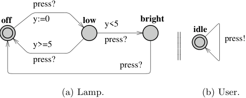

Fig. 1. The simple lamp example.

We give the basic definitions of the syntax and semantics for timed automata. We use the following notations: C is a set of clocks and B(C) is the set of conjunctions over simple conditions of the form x ▷◁c or x − y ▷◁c, where x, y ∈ C, c ∈ N and ▷◁∈{<, ≤, =, ≥, >}. A timed automaton is a finite directed graph annotated with conditions over and resets of non-negative real valued clocks.

Definition 1 (Timed Automaton (TA)). A timed automaton is a tuple (L, l0, C, A, E, I), where L is a set of locations, l0 ∈ L is the initial location, C is the set of clocks, A is a set of actions, co-actions and the internal τ -action, E ⊆ L × A × B(C) × 2[C] × L is a set of edges between locations with an action,

--- end of page.page_number=2 ---

a guard and a set of clocks to be reset, and I : L → B(C) assigns invariants to locations. □

We now define the semantics of a timed automaton. A clock valuation is a function u : C → R≥0 from the set of clocks to the non-negative reals. Let R[C] be the set of all clock valuations. Let u0(x) = 0 for all x ∈ C. We will abuse the notation by considering guards and invariants as sets of clock valuations, writing u ∈ I(l) to mean that u satisfies I(l).

Definition 2 (Semantics of TA). Let (L, l0, C, A, E, I) be a timed automaton. The semantics is defined as a labelled transition system ⟨S, s0, →⟩, where S ⊆ L× R[C] is the set of states, s0 = (l0, u0) is the initial state, and →⊆ S ×{R≥0∪A}×S is the transition relation such that:

- (l, u) −→d (l, u + d) if ∀d′ : 0 ≤ d′ ≤ d =⇒ u + d′ ∈ I(l), and

- (l, u) −→a (l′, u′) if there exists e = (l, a, g, r, l′) ∈ E s.t. u ∈ g, u[′] = [r �→ 0]u, and u[′] ∈ I(l),

where for d ∈ R≥0, u + d maps each clock x in C to the value u(x) + d, and [r �→ 0]u denotes the clock valuation which maps each clock in r to 0 and agrees with u over C \ r. □

Timed automata are often composed into a network of timed automata over a common set of clocks and actions, consisting of n timed automata Ai = (Li, li[0][, C, A, E][i][, I][i][),][1][≤][i][≤][n][.][A][location][vector][is][a][vector][¯][l][=][(][l][1][, . . . , l][n][).] We compose the invariant functions into a common function over location vectors I([¯] l) = ∧iIi(li). We write[¯] l[li[′][/l][i][]][to][denote][the][vector][where][the][i][th][element] li of[¯] l is replaced by li[′][.][In][the][following][we][define][the][semantics][of][a][network][of] timed automata.

Definition 3 (Semantics of a network of Timed Automata). Let Ai = (Li, li[0][, C, A, E][i][, I][i][)][be][a][network][of][n][timed][automata.][Let][¯][l][0][= (][l] 1[0][, . . . , l] n[0][)][be][the] initial location vector. The semantics is defined as a transition system ⟨S, s0, →⟩, where S = (L1 × · · · × Ln) × R[C] is the set of states, s0 = ([¯] l0, u0) is the initial state, and →⊆ S × S is the transition relation defined by:

- ([¯] l, u) → ([¯] l, u + d) if ∀d[′] : 0 ≤ d[′] ≤ d =⇒ u + d[′] ∈ I([¯] l).

- ([¯] l, u) → ([¯] l[li[′][/l][i][]][, u][′][)][if][there][exists][l][i] −−→τgr li[′][s.t.][u][ ∈][g][,] u[′] = [r �→ 0]u and u[′] ∈ I([¯] l).

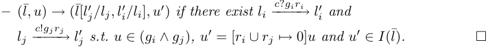

As an example of the semantics, the lamp in Fig. 1 may have the following states (we skip the user): (Lamp.off, y = 0) → (Lamp.off, y = 3) → (Lamp.low, y = 0) → (Lamp.low, y = 0.5) → (Lamp.bright, y = 0.5) → (Lamp.bright, y = 1000) . . .

--- end of page.page_number=3 ---

Timed Automata in Uppaal The Uppaal modelling language extends timed automata with the following additional features:

Templates automata are defined with a set of parameters that can be of any type (e.g., int, chan). These parameters are substituted for a given argument in the process declaration.

Constants are declared as const name value. Constants by definition cannot be modified and must have an integer value.

Bounded integer variables are declared as int[min,max] name, where min and max are the lower and upper bound, respectively. Guards, invariants, and assignments may contain expressions ranging over bounded integer variables. The bounds are checked upon verification and violating a bound leads to an invalid state that is discarded (at run-time). If the bounds are omitted, the default range of -32768 to 32768 is used.

Binary synchronisation channels are declared as chan c. An edge labelled with c! synchronises with another labelled c?. A synchronisation pair is chosen non-deterministically if several combinations are enabled.

Broadcast channels are declared as broadcast chan c. In a broadcast synchronisation one sender c! can synchronise with an arbitrary number of receivers c?. Any receiver than can synchronise in the current state must do so. If there are no receivers, then the sender can still execute the c! action, i.e. broadcast sending is never blocking.

Urgent synchronisation channels are decalred by prefixing the channel declaration with the keyword urgent. Delays must not occur if a synchronisation transition on an urgent channel is enabled. Edges using urgent channels for synchronisation cannot have time constraints, i.e., no clock guards.

Urgent locations are semantically equivalent to adding an extra clock x, that is reset on all incomming edges, and having an invariant x<=0 on the location. Hence, time is not allowed to pass when the system is in an urgent location. Committed locations are even more restrictive on the execution than urgent locations. A state is committed if any of the locations in the state is committed. A committed state cannot delay and the next transition must involve an outgoing edge of at least one of the committed locations.

Arrays are allowed for clocks, channels, constants and integer variables. They are defined by appending a size to the variable name, e.g. chan c[4]; clock a[2]; int[3,5] u[7];.

Initialisers are used to initialise integer variables and arrays of integer variables. For instance, int i := 2; or int i[3] := {1, 2, 3};.

Expressions in Uppaal Expressions in Uppaal range over clocks and integer variables. The BNF is given in Fig. 2. Expressions are used with the following labels:

Guard A guard is a particular expression satisfying the following conditions: it is side-effect free; it evaluates to a boolean; only clocks, integer variables, and constants are referenced (or arrays of these types); clocks and clock

--- end of page.page_number=4 ---

differences are only compared to integer expressions; guards over clocks are essentially conjunctions (disjunctions are allowed over integer conditions). Synchronisation A synchronisation label is either on the form Expression! or Expression? or is an empty label. The expression must be side-effect free, evaluate to a channel, and only refer to integers, constants and channels. Assignment An assignment label is a comma separated list of expressions with a side-effect; expressions must only refer to clocks, integer variables, and constants and only assign integer values to clocks.

Invariant An invariant is an expression that satisfies the following conditions: it is side-effect free; only clock, integer variables, and constants are referenced; it is a conjunction of conditions of the form x<e or x<=e where x is a clock reference and e evaluates to an integer.

Expression → ID | NAT | Expression ’[’ Expression ’]’ | ’(’ Expression ’)’ | Expression ’++’ | ’++’ Expression | Expression ’--’ | ’--’ Expression | Expression AssignOp Expression | UnaryOp Expression | Expression BinaryOp Expression | Expression ’?’ Expression ’:’ Expression | Expression ’.’ ID UnaryOp → ’-’ | ’!’ | ’not’ BinaryOp → ’<’ | ’<=’ | ’==’ | ’!=’ | ’>=’ | ’>’ | ’+’ | ’-’ | ’*’ | ’/’ | ’%’ | ’&’ | ’|’ | ’^’ | ’<<’ | ’>>’ | ’&&’ | ’||’ | ’<?’ | ’>?’ | ’and’ | ’or’ | ’imply’ AssignOp → ’:=’ | ’+=’ | ’-=’ | ’*=’ | ’/=’ | ’%=’ | ’|=’ | ’&=’ | ’^=’ | ’<<=’ | ’>>=’ Fig. 2. Syntax of expressions in BNF.

## 2.2 The Query Language

The main purpose of a model checker is verify the model w.r.t. a requirement specification. Like the model, the requirement specification must be expressed in a formally well-defined and machine readable language. Several such logics exist in the scientific literature, and Uppaal uses a simplified version of CTL. Like in CTL, the query language consists of path formulae and state formulae.[1] State formulae describe individual states, whereas path formulae quantify over paths or traces of the model. Path formulae can be classified into reachability, safety and liveness. Figure 3 illustrates the different path formulae supported by Uppaal. Each type is described below.

> 1 In contrast to CTL, Uppaal does not allow nesting of path formulae.

--- end of page.page_number=5 ---

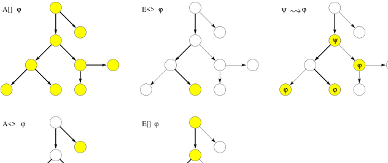

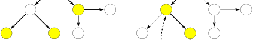

Fig. 3. Path formulae supported in Uppaal. The filled states are those for which a given state formulae φ holds. Bold edges are used to show the paths the formulae evaluate on.

State Formulae A state formula is an expression (see Fig. 2) that can be evaluated for a state without looking at the behaviour of the model. For instance, this could be a simple expression, like i == 7, that is true in a state whenever i equals 7. The syntax of state formulae is a superset of that of guards, i.e., a state formula is a side-effect free expression, but in contrast to guards, the use of disjunctions is not restricted. It is also possible to test whether a particular process is in a given location using an expression on the form P.l, where P is a process and l is a location.

In Uppaal, deadlock is expressed using a special state formula (although this is not strictly a state formula). The formula simply consists of the keyword deadlock and is satisfied for all deadlock states. A state is a deadlock state if there are no outgoing action transitions neither from the state itself or any of its delay successors. Due to current limitations in Uppaal, the deadlock state formula can only be used with reachability and invariantly path formulae (see below).

Reachability Properties Reachability properties are the simplest form of properties. They ask whether a given state formula, ϕ, possibly can be satisfied by any reachable state. Another way of stating this is: Does there exist a path starting at the initial state, such that ϕ is eventually satisfied along that path.

Reachability properties are often used while designing a model to perform sanity checks. For instance, when creating a model of a communication protocol involving a sender and a receiver, it makes sense to ask whether it is possible for the sender to send a message at all or whether a message can possibly be received. These properties do not by themselves guarantee the correctness of the

--- end of page.page_number=6 ---

protocol (i.e. that any message is eventually delivered), but they validate the basic behaviour of the model.

We express that some state satisfying ϕ should be reachable using the path formula E3 ϕ. In Uppaal, we write this property using the syntax E<> ϕ.

Safety Properties Safety properties are on the form: “something bad will never happen”. For instance, in a model of a nuclear power plant, a safety property might be, that the operating temperature is always (invariantly) under a certain threshold, or that a meltdown never occurs. A variation of this property is that “something will possibly never happen”. For instance when playing a game, a safe state is one in which we can still win the game, hence we will possibly not loose.

In Uppaal these properties are formulated positively, e.g., something good is invariantly true. Let ϕ be a state formulae. We express that ϕ should be true in all reachable states with the path formulae A□ ϕ,[2] whereas E□ ϕ says that there should exist a maximal path such that ϕ is always true.[3] In Uppaal we write A[] ϕ and E[] ϕ, respectively.

Liveness Properties Liveness properties are of the form: something will eventually happen, e.g. when pressing the on button of the remote control of the television, then eventually the television should turn on. Or in a model of a communication protocol, any message that has been sent should eventually be received.

In its simple form, liveness is expressed with the path formula A3 ϕ, meaning ϕ is eventually satisfied.[4] The more useful form is the leads to or response property, written ϕ ⇝ ψ which is read as whenever ϕ is satisfied, then eventually ψ will be satisfied, e.g. whenever a message is sent, then eventually it will be received.[5] In Uppaal these properties are written as A<> ϕ and ϕ --> ψ, respectively.

## 2.3 Understanding Time

Invariants and Guards Uppaal uses a continuous time model. We illustrate the concept of time with a simple example that makes use of an observer. Normally an observer is an add-on automaton in charge of detecting events without changing the observed system. In our case the clock reset (x:=0) is delegated to the observer for illustration purposes.

Figure 4 shows the first model with its observer. We have two automata in parallel. The first automaton has a self-loop guarded by x>=2, x being a

> 2 Notice that A□ ϕ = ¬E3 ¬ϕ

> 3 A maximal path is a path that is either infinite or where the last state has no outgoing transitions.

> 4 Notice that A3 ϕ = ¬E□ ¬ϕ.

> 5 Experts in CTL will recognise that ϕ ⇝ ψ is equivalent to A□ (ϕ =⇒ A3 ψ)

--- end of page.page_number=7 ---

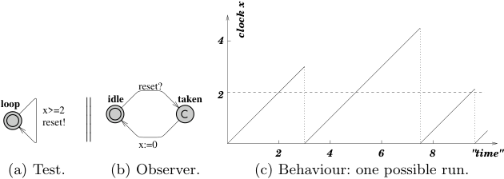

Fig. 4. First example with an observer.

clock, that synchronises on the channel reset with the second automaton. The second automaton, the observer, detects when the self loop edge is taken with the location taken and then has an edge going back to idle that resets the clock x. We moved the reset of x from the self loop to the observer only to test what happens on the transition before the reset. Notice that the location taken is committed (marked c) to avoid delay in that location.

The following properties can be verified in Uppaal (see section 3 for an overview of the interface). Assuming we name the observer automaton Obs, we have:

- A[] Obs.taken imply x>=2 : all resets off x will happen when x is above 2. This query means that for all reachable states, being in the location Obs.taken implies that x>=2.

- E<> Obs.idle and x>3 : this property requires, that it is possible to reacha state where Obs is in the location idle and x is bigger than 3. Essentially we check that we delay at least 3 time units between resets. The result would have been the same for larger values like 30000, since there are no invariants in this model.

We update the first model and add an invariant to the location loop, as shown in Fig. 5. The invariant is a progress condition: the system is not allowed to stay in the state more than 3 time units, so that the transition has to be taken and the clock reset in our example. Now the clock x has 3 as an upper bound. The following properties hold:

- A[] Obs.taken imply (x>=2 and x<=3) shows that the transition is taken when x is between 2 and 3, i.e., after a delay between 2 and 3.

- E<> Obs.idle and x>2 : it is possible to take the transition when x is between 2 and 3. The upper bound 3 is checked with the next property.

- A[] Obs.idle imply x<=3 : to show that the upper bound is respected.

The former property E<> Obs.idle and x>3 no longer holds.

Now, if we remove the invariant and change the guard to x>=2 and x<=3, you may think that it is the same as before, but it is not! The system has no progress condition, just a new condition on the guard. Figure 6 shows what

--- end of page.page_number=8 ---

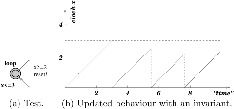

Fig. 5. Updated example with an invariant. The observer is the same as in Fig. 4 and is not shown here.

happens: the system may take the same transitions as before, but deadlock may also occur. The system may be stuck if it does not take the transition after 3 time units. In fact, the system fails the property A[] not deadlock. The property A[] Obs.idle imply x<=3 does not hold any longer and the deadlock can also be illustrated by the property A[] x>3 imply not Obs.taken, i.e., after 3 time units, the transition is not taken any more.

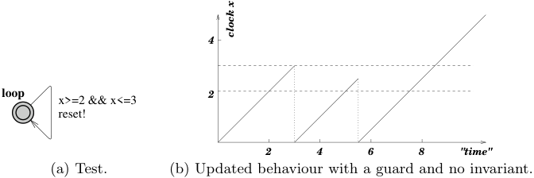

Fig. 6. Updated example with a guard and no invariant.

Committed and Urgent Locations There are three different types of locations in Uppaal: normal locations with or without invariants (e.g., x<=3 in the previous example), urgent locations, and committed locations. Figure 7 shows 3 automata to illustrate the difference. The location marked u is urgent and the one marked c is committed. The clocks are local to the automata, i.e., x in P0 is from x in P1.

To understand the difference between normal locations and urgent locations, we can observe that the following properties hold:

- E<> P0.S1 and P0.x>0 : it is possible to wait in S1 of P0.

- A[] P1.S1 imply P1.x==0 : it is not possible to wait in S1 of P1.

--- end of page.page_number=9 ---

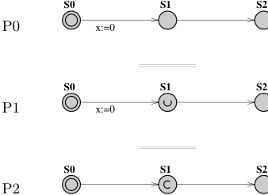

Fig. 7. Automata in parallel with normal, urgent and commit states. The clocks are local, i.e., P0.x and P1.x are two different clocks.

An urgent location is equivalent to a location with incoming edges reseting a designated clock y and labelled with the invariant y<=0. Time may not progress in an urgent state, but interleavings with normal states are allowed.

A committed location is more restrictive: in all the states where P2.S1 is active (in our example), the only possible transition is the one that fires the edge outgoing from P2.S1. A state having a committed location active is said to be committed: delay is not allowed and the committed location must be left in the successor state (or one of the committed locations if there are several ones).

## 3 Overview of the Uppaal Toolkit

Uppaal uses a client-server architecture, splitting the tool into a graphical user interface and a model checking engine. The user interface, or client, is implemented in Java and the engine, or server, is compiled for different platforms (Linux, Windows, Solaris).[6] As the names suggest, these two components may be run on different machines as they communicate with each other via TCP/IP. There is also a stand-alone version of the engine that can be used on the command line.

## 3.1 The Java Client

The idea behind the tool is to model a system with timed automata using a graphical editor, simulate it to validate that it behaves as intended, and finally to verify that it is correct with respect to a set of properties. The graphical interface (GUI) of the Java client reflects this idea and is divided into three main parts: the editor, the simulator, and the verifier, accessible via three “tabs”.

> 6 A version for Mac OS X is in preparation.

--- end of page.page_number=10 ---

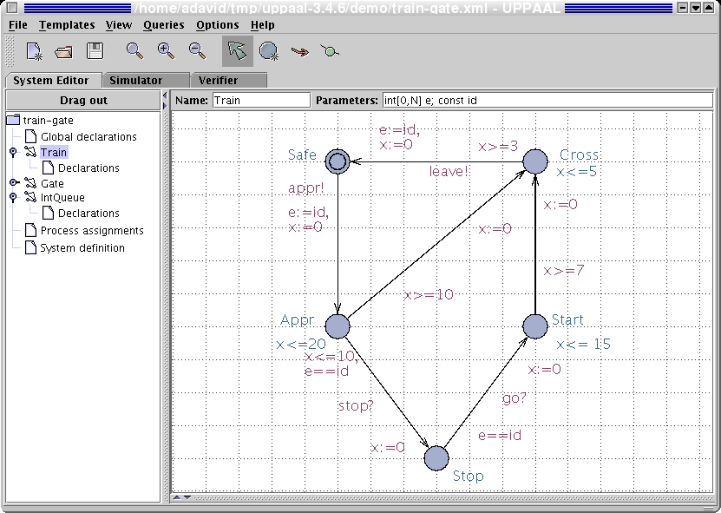

Fig. 8. The train automaton of the train gate example. The select button is activated in the tool-bar. In this mode the user can move locations and edges or edit labels. The other modes are for adding locations, edges, and vertexes on edges (called nails). A new location has no name by default. Two text fields allow the user to define the template name and its parameters. Useful trick: The middle mouse button is a shortcut for adding new elements, i.e. pressing it on the the canvas, a location, or edge adds a new location, edge, or nail, respectively.

The Editor A system is defined as a network of timed automata, called processes in the tool, put in parallel. A process is instantiated from a parameterized template. The editor is divided into two parts: a tree pane to access the different templates and declarations and a drawing canvas/text editor. Figure 8 shows the editor with the train gate example of section 4. Locations are labeled with names and invariants and edges are labeled with guard conditions (e.g., e==id), synchronizations (e.g., go?), and assignments (e.g., x:=0).

The tree on the left hand side gives access to different parts of the system description:

- Global declaration Contains global integer variables, clocks, synchronization channels, and constants.

- Templates Train, Gate, and IntQueue are different parameterized timed automata. A template may have local declarations of variables, channels, and constants.

--- end of page.page_number=11 ---

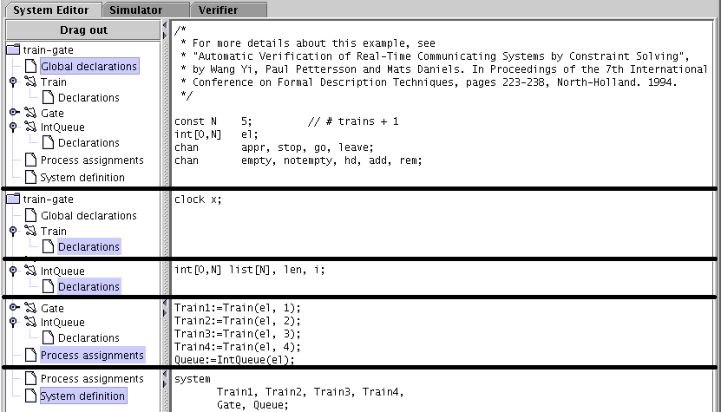

Fig. 9. The different local and global declarations of the train gate example. We superpose several screen-shots of the tool to show the declarations in a compact manner.

Process assignments Templates are instantiated into processes. The process assignment section contains declarations for these instances. System definition The list of processes in the system.

The syntax used in the labels and the declarations is described in the help system of the tool. The local and global declarations are shown in Fig. 9. The graphical syntax is directly inspired from the description of timed automata in section 2.

The Simulator The simulator can be used in three ways: the user can run the system manually and choose which transitions to take, the random mode can be toggled to let the system run on its own, or the user can go through a trace (saved or imported from the verifier) to see how certain states are reachable. Figure 10 shows the simulator. It is divided into four parts:

The control part is used to choose and fire enabled transitions, go through a trace, and toggle the random simulation.

The variable view shows the values of the integer variables and the clock constraints. Uppaal does not show concrete states with actual values for the clocks. Since there are infinitely many of such states, Uppaal instead shows sets of concrete states known as symbolic states. All concrete states in a symbolic state share the same location vector and the same values for discrete variables. The possible values of the clocks is described by a set of constraints. The clock validation in the symbolic state are exactly those that satisfy all constraints.

--- end of page.page_number=12 ---

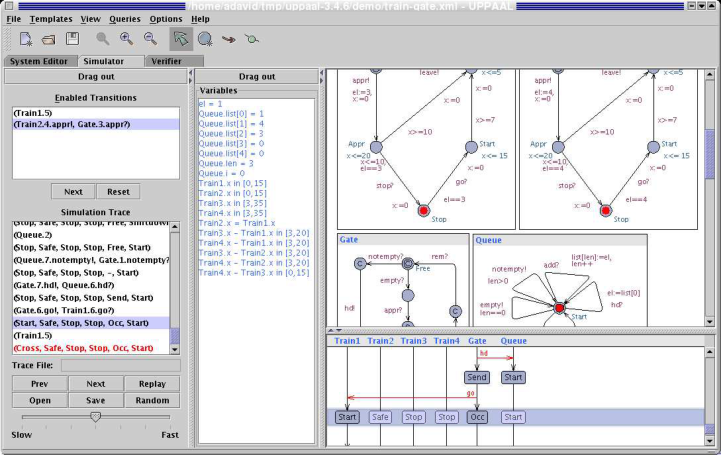

Fig. 10. View of the simulator tab for the train gate example. The interpretation of the constraint system in the variable panel depends on whether a transition in the transition panel is selected or not. If no transition is selected, then the constrain system shows all possible clock valuations that can be reached along the path. If a transition is selected, then only those clock valuations from which the transition can be taken are shown. Keyboard bindings for navigating the simulator without the mouse can be found in the integrated help system.

The system view shows all instantiated automata and active locations of the current state.

The message sequence chart shows the synchronizations between the different processes as well as the active locations at every step.

The Verifier The verifier “tab” is shown in Fig. 11. Properties are selectable in the Overview list. The user may model-check one or several properties,[7] insert or remove properties, and toggle the view to see the properties or the comments in the list. When a property is selected, it is possible to edit its definition (e.g., E<> Train1.Cross and Train2.Stop . . . ) or comments to document what the property means informally. The Status panel at the bottom shows the communication with the server.

When trace generation is enabled and the model-checker finds a trace, the user is asked if she wants to import it into the simulator. Satisfied properties are marked green and violated ones red. In case either an over approximation or an under approximation has been selected in the options menu, then it may happen

> 7 several properties only if no trace is to be generated.

--- end of page.page_number=13 ---

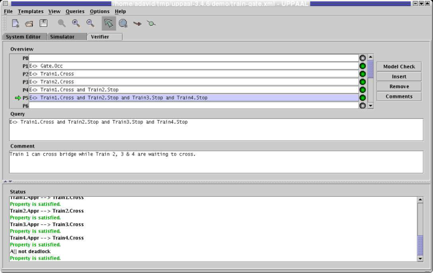

Fig. 11. View of the verification tab for the train gate example.

that the verification is inconclusive with the approximation used. In that case the properties are marked yellow.

## 3.2 The Stand-alone

When running large verification tasks, it is often cumbersome to execute these from inside the GUI. For such situations, the stand-alone command line verifier called verifyta is more appropriate. It also makes it easy to run the verification on a remote UNIX machine with memory to spare. It accepts command line arguments for all options available in the GUI, see Table 1.

## 4 Example 1: The Train Gate

## 4.1 Description

The train gate example is distributed with Uppaal. It is a railway control system which controls access to a bridge for several trains. The bridge is a critical shared resource that may be accessed only by one train at a time. The system is defined as a number of trains (assume 4 for this example) and a controller. A train can not be stopped instantly and restarting also takes time. Therefor, there are timing constraints on the trains before entering the bridge. When approaching, a train sends a appr! signal. Thereafter, it has 10 time units to receive a stop signal. This allows it to stop safely before the bridge. After these 10 time units,

--- end of page.page_number=14 ---

Table 1. Options of verifyta and the corresponding options in the GUI. Defaults of verifyta are shown in boldface.

## State Space Representation

- -C DBM

   - Use DBMs rather than a minimal constrain graph [46] in the state representation used to store reachable states. This increases the memory usage (more so in models with many clocks), but is often faster.

- -A Over approximation

   - Use convex hull over-approximation [7]. For timed systems, this can drastically increase verification speed. For untimed systems, this has no effect.

- -Z Under approximation Use bit-state hashing under-approximation. This reduces memory consumption to a more of less fixed amount. The precision of the approximation is controlled by changing the hash table size. Known as super-trace in [34, 35].

- -T Reuse Speed up verification by reusing the generated state-space when possible. For some combinations of properties this option can possibly lead to a larger statespace representation, thus nullifying the speedup.

- -U When representing states with minimal constraint graphs, this option changes how states are compared. It reduces the memory consumption at the expense of a more time consuming comparison operator. The reduced memory usage might cancel out the overhead. In the GUI, this is always on.

- -H Change the size of hash tables used during verification. Can give a speedup for large systems.

## State Space Reduction

- -S0 None

   - Store all reachable states. Uses most memory, but avoids that any state is explored more than once.

- -S1 Conservative

   - Store all non-committed states. Less memory when committed locations are used, and for most models states are only explored once.

- -S2 Aggressive Try hard to reduce the number of states stored. Uses much less memory, but might take much more time. Do not combine this option with depth first search, as the running time increases drastically.

## Search Order

- -b Breadth First

Search the state space using a breadth first strategy.

- -d Depth First

Search the state space using a depth first strategy.

## Trace Options

- -t0 Some Trace

Generate some diagnostic trace.

- -t1 Shortest Trace

Generate the shortest (in number of steps) trace.

- -t2 Fastest Trace

   - Generate the fastest (smallest time delay) trace.

- -f Write traces to XTR trace files (which can be read by the GUI).

- -y By default concrete traces (showing both delay and control transitions) are produced. This option produces symbolic traces like those shown in the GUI.

--- end of page.page_number=15 ---

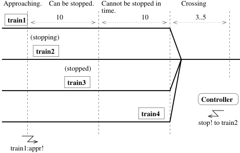

Fig. 12. Train gate example: train4 is about to cross the bridge, train3 is stopped, train2 was ordered to stop and is stopping. Train1 is approaching and sends an appr! signal to the controller that sends back a stop! signal. The different sections have timing constraints (10, 10, between 3 and 5).

it takes further 10 time units to reach the bridge if the train is not stopped. If a train is stopped, it resumes its course when the controller sends a go! signal to it after a previous train has left the bridge and sent a leave! signal. Figures 12 and 13 show two situations.

## 4.2 Modelling in Uppaal

The model of the train gate has three templates:

Train is the model of a train, shown in Fig. 8. Gate is the model of the gate controller, shown in Fig. 14. IntQueue is the model of the queue of the controller, shown in Fig. 15. It is

simpler to separate the queue from the controller, which makes it easier to get the model right.

The Template of the Train The template in Fig. 8 has five locations: Safe, Appr, Stop, Start, and Cross. The initial location is Safe, which corresponds to a train not approaching yet. The location has no invariant, which means that a train may stay in this location an unlimited amount of time. When a train is approaching, it synchronises with the controller. This is done by the channel synchronisation appr! on the transition to Appr. The controller has a corresponding appr?. The clock x is reset and the parameterised variable e is set to the identity of this train. This variable is used by the queue and the controller to know which train is allowed to continue or which trains must be stopped and later restarted.

The location Appr has the invariant x ≤ 20, which has the effect that the location must be left within 20 time units. The two outgoing transitions are

--- end of page.page_number=16 ---

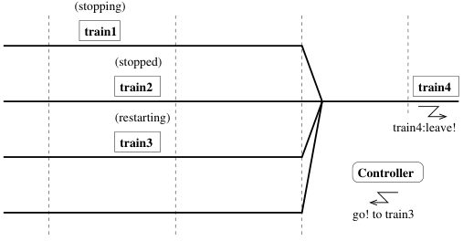

Fig. 13. Now train4 has crossed the bridge and sends a leave! signal. The controller can now let train3 cross the bridge with a go! signal. Train2 is now waiting and train1 is stopping.

guarded by the constraints x ≤ 10 and x ≥ 10, which corresponds to the two sections before the bridge: can be stopped and can not be stopped. At exactly 10, both transitions are enabled, which allows us to take into account any race conditions if there is one. If the train can be stopped (x ≤ 10) then the transition to the location Stop is taken, otherwise the train goes to location Cross. The transition to Stop is also guarded by the condition e == id and is synchronised with stop?. When the controller decides to stop a train, it decides which one (sets e) and synchronises with stop!.

The location Stop has no invariant: a train may be stopped for an unlimited amount of time. It waits for the synchronisation go?. The guard e == id ensures that the right train is restarted. The model is simplified here compared to the version described in [51], namely the slowdown phase is not modelled explicitly. We can assume that a train may receive a go? synchronisation even when it is not stopped completely, which will give a non-deterministic restarting time.

The location Start has the invariant x ≤ 15 and its outgoing transition has the constraint x ≥ 7. This means that a train is restarted and reaches the crossing section between 7 and 15 time units non-deterministically.

The location Cross is similar to Start in the sense that it is left between 3 and 5 time units after entering it.

The Template of the Gate The gate controller in Fig. 14 synchronises with the queue and the trains. Some of its locations do not have names. Typically, they are committed locations (marked with a c).

The controller starts in the Free location (i.e., the bridge is free), where it tests the queue to see if it is empty or not. If the queue is empty then the controller waits for approaching trains (next location) with the appr? synchronisation. When a train is approaching, it is added to the queue with the add! synchronisation. If the queue is not empty, then the first train on the queue (read by hd!) is restarted with the go! synchronisation.

--- end of page.page_number=17 ---

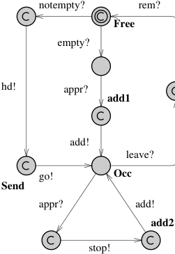

Fig. 14. Gate automaton of the train gate.

In the Occ location, the controller essentially waits for the running train to leave the bridge (leave?). If other trains are approaching (appr?), they are stopped (stop!) and added to the queue (add!). When a train leaves the bridge, the controller removes it from the queue with the rem? synchronisation.

The Template of the Queue The queue in Fig. 15 has essentially one location Start where it is waiting for commands from the controller. The Shiftdown location is used to compute a shift of the queue (necessary when the front element is removed). This template uses an array of integers and handles it as a FIFO queue.

## 4.3

We check simple reachability, safety, and liveness properties, and for absence of deadlock. The simple reachability properties check if a given location is reachable:

- E<> Gate.Occ: the gate can receive and store messages from approaching trains in the queue.

- E<> Train1.Cross: train 1 can cross the bridge. We check similar properties for the other trains.

- E<> Train1.Cross and Train2.Stop: train 1 can be crossing the bridge while train 2 is waiting to cross. We check for similar properties for the other trains.

- E<> Train1.Cross && Train2.Stop && Train3.Stop && Train4.Stop is similar to the previous property, with all the other trains waiting to cross the bridge. We have similar properties for the other trains.

--- end of page.page_number=18 ---

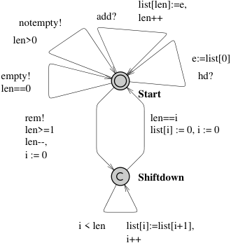

Fig. 15. Queue automaton of the train gate. The template is parameterised with int[0,n] e.

The following safety properties must hold for all reachable states:

- A[] Train1.Cross+Train2.Cross+Train3.Cross+Train4.Cross<=1. There is not more than one train crossing the bridge at any time. This expression uses the fact that Train1.Cross evaluates to true or false, i.e., 1 or 0.

- A[] Queue.list[N-1] == 0: there can never be N elements in the queue, i.e., the array will never overflow. Actually, the model defines N as the number of trains + 1 to check for this property. It is possible to use a queue length matching the number of trains and check for this property instead: A[] (Gate.add1 or Gate.add2) imply Queue.len < N-1 where the locations add1 and add2 are the only locations in the model from which add! is possible.

The liveness properties are of the form Train1.Appr --> Train1.Cross: whenever train 1 approaches the bridge, it will eventually cross, and similarly for the other trains. Finally, to check that the system is deadlock-free, we verify the property A[] not deadlock.

Suppose that we made a mistake in the queue, namely we wrote e:=list[1] in the template IntQueue instead of e:=list[0] when reading the head on the transition synchronised with hd?. We could have been confused when thinking in terms of indexes. It is interesting to note that the properties still hold, except the liveness ones. The verification gives a counter-example showing what may happen: a train may cross the bridge but the next trains will have to stop. When the queue is shifted the train that starts again is never the first one, thus the train at the head of the queue is stuck and can never cross the bridge.

--- end of page.page_number=19 ---

## 5 Example 2: Fischer’s Protocol

## 5.1 Description

Fischer’s protocol is a well-known mutual exclusion protocol designed for n processes. It is a timed protocol where the concurrent processes check for both a delay and their turn to enter the critical section using a shared variable id.

## 5.2 Modelling in Uppaal

The automaton of the protocol is given in Fig. 16. Starting from the initial location (marked with a double circle), processes go to a request location, req, if id==0, which checks that it is the turn for no process to enter the critical section. Processes stay non-deterministically between 0 and k time units in req, and then go to the wait location and set id to their process ID (pid). There it must wait at least k time units, x>k, k being a constant (2 here), before entering the critical section CS if it is its turn, id==pid. The protocol is based on the fact that after (strict) k time units with id different from 0, all the processes that want to enter the critical section are waiting to enter the critical section as well, but only one has the right ID. Upon exiting the critical section, processes reset id to allow other processes to enter CS. When processes are waiting, they may retry when another process exits CS by returning to req.

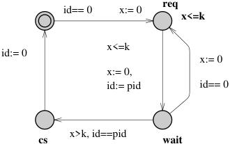

Fig. 16. Template of Fischer’s protocol. The parameter of the template is const pid. The template has the local declarations clock x; const k 2;.

## 5.3

The safety property of the protocol is to check for mutual exclusion of the location CS: A[] P1.cs + P2.cs + P3.cs + P4.cs <= 1. This property uses the trick that these tests evaluate to true or false, i.e., 0 or 1. We check that the system is deadlock-free with the property A[] not deadlock.

--- end of page.page_number=20 ---

The liveness properties are of the form P1.req --> P1.wait and similarly for the other processes. They check that whenever a process tries to enter the critical section, it will always eventually enter the waiting location. Intuitively, the reader would also expect the property P1.req --> P1.cs that similarly states that the critical section is eventually reachable. However, this property is violated. The interpretation is that the process is allowed to stay in wait for ever, thus there is a way to avoid the critical section.

Now, if we try to fix the model and add the invariant x <= 2*k to the wait location, the property P1.req --> P1.cs still does not hold because it is possible to reach a deadlock state where P1.wait is active, thus there is a path that does not lead to the critical section. The deadlock is as follows: P1.wait with 0 ≤ x ≤ 2 and P4.wait with 2 ≤ x ≤ 4. Delay is forbidden in this state, due to the invariant on P4.wait and P4.wait can not be left because id == 1.

## 6 Modelling Patterns

In this section we present a number of useful modelling patterns for Uppaal. A modelling pattern is a form of designing a model with a clearly stated intent, motivation and structure. We observe that most of our Uppaal models use one or more of the following patterns and we propose that these patterns are imitated when designing new models.

## 6.1 Variable Reduction

## Intent

To reduce the size of the state space by explicitly resetting variables when they are not used, thus speeding up the verification.

## Motivation

Although variables are persistent, it is sometimes clear from the way a model behaves, that the value of a variable does not matter in certain states, i.e., it is clear that two states that only differ in the values of such variables are in fact bisimilar. Resetting these variables to a known value will make these two states identical, thus reducing the state space.

## Structure

The pattern is most easily applied to local variables. Basically, a variable v is called inactive in a location l, if along all paths starting from l, v will be reset before it will be used. If a variable v is inactive in location v, one should reset v to the initial value on all incoming edges of l.

The exception to this rule is when v is inactive in all source locations of the incoming edges to l. In this case, v has already been reset, and there is no need to reset it again. The pattern is also applicable to shared variables, although it can be harder to recognise the locations in which the variable will be inactive.

--- end of page.page_number=21 ---

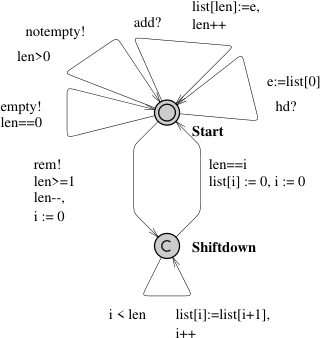

Fig. 17. The model of the queue in the train gate example uses active variable reduction twice. Both cases are on the edge from Shiftdown to Start: The freed element in the queue is reset to the initial value and so is the counter variable i.

For clocks, Uppaal automatically performs the analysis described above. This process is called active clock reduction. In some situations this analysis may fail, since Uppaal does not take the values of non-clock variables into account when analysing the activeness. In those situations, it might speed up the verification, if the clocks are reset to zero when it becomes inactive. A similar problem arises if you use arrays of clocks and use integer variables to index into those arrays. Then Uppaal will only be able to make a coarse approximation of when clocks in the array will be tested and reset, often causing the complete array to be marked active at all times. Manually resetting the clocks might speed up verification.

## Sample

The queue of the train gate example presented earlier in this tutorial uses the active variable pattern twice, see Fig. 17: When an element is removed, all the remaining elements of the list are shifted by one position. At the end of the loop in the Shiftdown location, the counter variable i is reset to 0, since its value is no longer of importance. Also the freed up element list[i] in the list is reset to zero, since its value will never be used again. For this example, the speedup in verification gained by using this pattern is approximately a factor of 5.

## Known Uses

The pattern is used in most models of some complexity.

--- end of page.page_number=22 ---

## 6.2 Synchronous Value Passing

## Intent

To synchronously pass data between processes.

## Motivation

Consider a model of a wireless network, where nodes in the network are modelled as processes. Neighbouring nodes must communicate to exchange, e.g., routing information. Assuming that the communication delay is insignificant, the handshake can be modelled as synchronisation via channels, but any data exchange must be modelled by other means.

The general idea is that a sender and a receiver synchronise over shared binary channels and exchange data via shared variables. Since Uppaal evaluates the assignment of the sending synchronisation first, the sender can assign a value to the shared variable which the receiver can then access directly.

## Structure

There are four variations of the value passing pattern, see Fig. 18. They differ in whether data is passed one-way or two-way and whether the synchronisation is unconditional or conditional. In one-way value passing a value is transfered from one process to another, whereas two-way value passing transfers a value in each direction. In unconditional value passing, the receiver does not block the communication, whereas conditional value passing allows the receiver to reject the synchronisation based on the data that was passed.

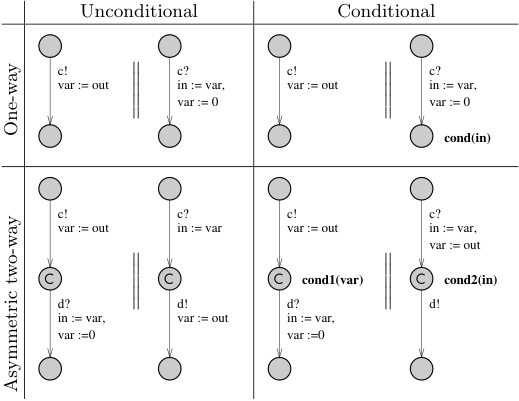

Fig. 18. The are essentially four combinations of conditional, uncoditional, one-way and two-way synchronous value passing.

--- end of page.page_number=23 ---

In all four cases, the data is passed via the globally declared shared variable var and synchronisation is achieved via the global channels c and d. Each process has local variables in and out. Although communication via channels is always synchronous, we refer to a c! as a send-action and c? as a receive-action. Notice that the variable reduction pattern is used to reset the shared variable when it is no longer needed.

In one-way value passing only a single channel c and a shared variable var is required. The sender writes the data to the shared variable and performs a send-action. The receiver performs the co-action, thereby synchronising with the sender. Since the update on the edge with send-action is always evaluated before the update of the edge with the receive-action, the receiver can access the data written by the sender in the same transition. In the conditional case, the receiver can block the synchronisation according to some predicate cond(in) involving the value passed by the sender. The intuitive placement of this predicate is on the guard of the receiving edge. Unfortunately, this will not work as expected, since the guards of the edges are evaluated before the updates are executed, i.e., before the receiver has access to the value. The solution is to place the predicate on the invariant of the target location.

Two-way value passing can be modelled with two one-way value passing pattern with intermediate committed locations. The committed locations enforce that the synchronisation is atomic. Notice the use of two channels: Although not strictly necessary in the two-process case, the two channel encoding scales to the case with many processes that non-deterministically choose to synchronise. In the conditional case each process has a predicate involving the value passed by the other process. The predicates are placed on the invariants of the committed locations and therefore assignment to the shared variable in the second process must be moved to the first edge. It might be tempting to encoding conditional two-way value passing directly with two one-way conditional value passing pattern, i.e., to place the predicate of the first process on the third location. Unfortunately, this will introduce spurious deadlocks into the model.

If the above asymmetric encoding of two-way value passing is undesirable, the symmetric encoding in Fig. 19 can be used instead. Basically, a process can nondeterministically choose to act as either the sender or the receiver. Like before, committed locations guarantee atomicity. If the synchronisation is conditional, the predicates are placed on the committed locations to avoid deadlocks. Notice that the symmetric encoding is more expensive: Even though the two paths lead to the same result, two extra successors will be generated.

## Sample

The train gate example of this tutorial uses synchronous one-way unconditional value passing between the trains and the gate, and between the gate and the queue. In fact, the value passing actually happens between the trains and the queue and the gate only act as a mediator to decouple the trains from the queue.

## Known Uses

Lamport’s Distributed Leader Election Protocol. Nodes in this leader election

--- end of page.page_number=24 ---

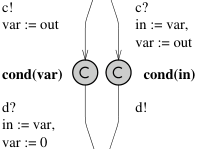

Fig. 19. In contast to the two-way encoding shown in Fig 18, this encoding is symmetric in the sense that both automata use the exact same encoding. The symmetry comes at the cost of a slightly larger state space.

protocol broadcast topology information to surrounding nodes. The communication is not instantaneous, so an intermediate process is used to model the message. The nodes and the message exchange data via synchronous one-way unconditional value passing.

Lynch’s Distributed Clock Synchronisation Protocol. This distributed protocol synchronises drifting clocks of nodes in a network. There is a fair amount of non-determinism on when exactly the clocks are synchronised, since the protocol only required this to happen within some time window. When two nodes synchronise non-deterministically, both need to know the other nodes identity. As an extra constraint, the synchronisation should only happen if it has not happened before in the current cycle. Here the asymmetric two-way conditional value passing pattern is used. The asymmetric pattern suffices since each node has been split into two processes, one of them being dedicated to synchronising with the neighbours.

## 6.3 Atomicity

## Intent

To reduce the size of the state space by reducing interleaving using committed locations, thus speeding up the verification.

## Motivation

Uppaal uses an asynchronous execution model, i.e., edges from different automata can interleave, and Uppaal will explore all possible interleavings. Partial order reduction is an automatic technique for eliminating unnecessary interleavings, but Uppaal does not support partial order reduction. In many situations, unnecessary interleavings can be identified and eliminated by making part of the model execute in atomic steps.

## Structure

Committed locations are the key to achieving atomicity. When any of the pro-

--- end of page.page_number=25 ---

Fig. 20. When removing the front element from the queue, all other elements must be shifted down. This is done in the loop in the Shiftdown location. To avoid unnecessary interleavings, the location is marked committed. Notice that the edge entering Shiftdown synchronises over the rem channel. It is important that target locations of edges synchronising over rem in other processes are not marked committed.

cesses is in a committed location, then time cannot pass and at least one of these processes must take part in the next transition. Notice that this does not rule out interleaving when several processes are in a committed location. On the other hand, if only one process is in a committed location, then that process must take part in the next transition. Therefore, several edges can be executed atomically by marking intermediate locations as committed and avoiding synchronisations with other processes in the part that must be executed atomically, thus guaranteeing that the process is the only one in a committed location.

## Sample

The pattern is used in the Queue process of the train gate example, see Fig. 20.

## Known Uses

Encoding of control structure A very common use is when encoding control structures (like the encoding of a for-loop used in the IntQueue process of the traingate example): In these cases the interleaving semantics is often undesirable.

Multi-casting Another common use is for complex synchronisation patterns. The standard synchronisation mechanism in Uppaal only supports binary or broadcast synchronisation, but by using committed locations it is possible to atomically synchronise with several processes. One example of this is in the train-gate example: Here the Gate process acts as a mediator between the trains and the queue, first synchronising with one and then the other – using an intermediate committed location to ensure atomicity.

--- end of page.page_number=26 ---

## 6.4 Urgent Edges

## Intent

To guarantee that an edge is taken without delay as soon as it becomes enabled.

## Motivation

Uppaal provides urgent locations as a means of saying that a location must be left without delay. Uppaal provides urgent channels as a means of saying that a synchronisation must be executed as soon as the guards of the edges involved are enabled. There is no way of directly expressing that an edge without synchronisation should be taken without delay. This pattern provides a way of encoding this behaviour.

## Structure

The encoding of urgent edges introduces an extra process with a single location and a self loop (see Fig. 21 left). The self loop synchronises on the urgent channel go. An edge can now be made urgent by performing the complimentary action (see Fig. 21 right). The edge can have discrete guards and arbitrary updates, but no guards over clocks.

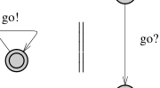

Fig. 21. Encoding of urgent edges. The go channel is declared urgent.

## Sample

This pattern is used in a model of a box sorting plant (see http://www.cs.auc. dk/~behrmann/esv03/exercises/index.html#sorter): Boxes are moved on a belt, registered at a sensor station and then sorted by a sorting station (a piston that can kick some of the boxes of the belt). Since it takes some time to move the boxes from the sensor station to the sorting station, a timer process is used to delay the sorting action. Figure 22 shows the timer (this is obviously not the only encoding of a timer – this particular encoding happens to match the one used in the control program of the plant). The timer is activated by setting a shared variable active to true. The timer should then move urgently from the passive location to the wait location. This is achieved by synchronising over the urgent channel go.

--- end of page.page_number=27 ---

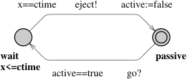

Fig. 22. Sample of a timer using an urgent edge during activation.

## 6.5 Timers

## Intent

To emulate a timer where, in principle, time decreases until it reaches zero, at which point the timer is said to time-out.

## Motivation

Although clocks are powerful enough to model timing mechanisms, some systems are more naturally modelled using timers, in particular event based models. In such models, a timer is started, may be restarted, and counts down until a time-out event is generated.

## Structure

The pattern gives an equivalent of a timer object mapped on a process in Uppaal. We define the following operations for a timer object t:

- void set(TO): this function starts or restarts the timer with a time-out value of TO. The timer will count down for TO time units. TO is an integer.

- bool expired(): this function returns true if the timer has expired, false otherwise. When the timer has not been started yet, it is said to have expired. This function may be called at any time to test the timer.

We map the above defined timer as a process in Uppaal. When a timer t is to be used in the model, its functions are mapped as follows:

- t.set(v) where v is an integer variable is mapped to the synchronisation set! and the assignment value := v, where the channel set and the integer value are the parameters of the timer template.

- t.expired() is mapped to the guard value == 0, where value is a parameter of the timer template.

As a variant of this basic timer model, it is possible to generate a time-out synchronisation, urgent or not depending on the needs, by using the pattern to encode urgent edges shown in Fig. 21. If the time-out value is a constant, we can optimise the coding to:

- t.set() (no argument since the time-out is a constant) is mapped to set!.

- t.expired() is mapped to active == false where active is a parameter of the template.

--- end of page.page_number=28 ---

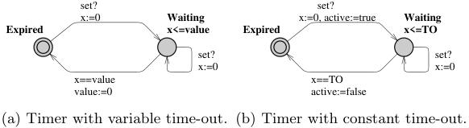

Fig. 23. Template of the timer pattern. Template (a) has int value; chan set as parameters and template (b) has bool active; chan set; const TO as parameters. Both templates have the local declaration clock x.

The templates are shown in Fig. 23. The two states correspond to the timer having expired (timer inactive) and waiting to time-out (timer active). The template (a) makes use of a feature of Uppaal to mix integers and clocks in clock constraints. The constraint is dynamic and depends on the value of the integer. When returning to the state Expired, the timer resets its value, which has the effect to (1) use variable reduction (see pattern 6.1) and (2) to provide a simple way to test for a time-out. The template (b) is simpler in the sense that a constant is used in the clock constraints. Testing for the time-out is equivalent to test on the boolean variable active.

## Known Uses

A variation of the timer pattern is used in the box sorting machine of the previous pattern (for educational purposes reconstructed in Lego): A timer is activated when a colored brick passes a light sensor. When the timer times out a piston kicks the brick from the transport belt.

## 6.6 Bounded Liveness Checking

## Intent

To check bounded liveness properties, i.e., properties that are guaranteed not only to hold eventually but within some specified upper time-bound. Timebounded liveness properties are essentially safety properties and hence often computationally easier to verify. Thus moving from (unconditional) liveness properties to a time-bounded versions will not only provide additional information — i.e., if one can provide a valid bound — but will also lead to more

## Motivation

For real-time systems general liveness properties are often not sufficiently expressive to ensure correctness: the fact that a particular property is guaranteed to hold eventually is inadequate in case hard real-time deadlines must be observed. What is really needed is to establish that the property in question will hold within a certain upper time-limit.

--- end of page.page_number=29 ---

## Structure

We consider two variations of the pattern for a time-bounded leads-to operator ϕ ;≤t ψ expressing that whenever the state property ϕ holds then the state property ψ must hold within at most t time-units thereafter.

In the first version of the pattern we use a simple reduction for unbounded leadsto. First the model under investigation is extended with an additional clock z which is reset whenever ϕ starts to hold. The time-bounded leads-to property ϕ ;≤t ψ is now simply obtained by verifying ϕ ; (ψ ∧ z ≤ t).

In the second — and more efficient version — of the pattern we use the method proposed in [47] in which time-bounded leads-to properties are reduced to simple safety properties. First the model under investigation is extended with a boolean variable b and an additional clock z. The boolean variable b must be initialised to false. Whenever ϕ starts to hold b is set to true and the clock z is reset. When ψ commences to hold b is set to false. Thus the truth-value of b indicates whether there is an obligation of ψ to hold in the future and z measures the accumulated time since this unfulfilled obligation started. The time-bounded leads-to property ϕ ;≤t ψ is simply obtained by verifying the safety property A2(b =⇒ z ≤ t).

A third method not reported is based on augmenting the model under investigation with a so-called test-automata, see [2, 1].

We have deliberately been somewhat vague about the exact nature of the required augmentation of the model. The most simple case is when the (state) properties ϕ and ψ are simple locations l and l[′] of component automata. In this simple case the settings of z and b are to be added as assignments of the edges entering l and l[′] .

## Sample

In the train gate example presented earlier in this tutorial a natural requirement is that a train is granted access to the crossing within a certain upper timebound (say 100) after having signalled that it is approaching. In fact, not only is the gate responsible for avoiding collisions on the crossing but also for ensuring a fair and timely handling of requests. In Fig. 24 the Train template has been augmented with a local boolean b and a local clock z. b (to be initialised to 0) is set to 1 on the transition to location Appr and set to 0 on the two transitions to Cross. The clock z is reset on the transition to Appr. On the augmented model we now check the safety property A which establishes that the bounded liveness property holds for Train1. In fact — due to obvious symmetries in the model — it suffices to establish the property for one train, Train1 say. In this case it would have been advantageous for Train1 to be singleton template in order to avoid augmenting all trains. In particular, the state-space will be substantially smaller in this way.

## Known Uses

Almost any real-time system will have a number of liveness properties where information as to the time-bounds is vital for the correctness of the systems. The

--- end of page.page_number=30 ---

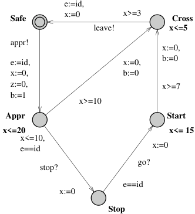

Fig. 24. The Train-Gate augmented to enable time-bounded liveness checking.

Gearbox Controller of [47] offers an excellent example where a long list of timebounded liveness properties are directly obtained from requirements specified by the company Mecel AB.

## 6.7 Abstraction and Simulation

## Intent

The goal of abstraction is to replace the problem of verifying a very large, infeasible concrete system with a smaller, and hopefully feasible abstract system. In particular, the method could be applied in a compositional manner to subsystems, i.e., various concrete subsystems are replaced by suitable abstractions, and the verification effort is conducted on the composition of these abstract subsystems.

## Motivation

Despite enormous improvement in the verification capabilities of Uppaal over the past years — and undoubtedly also for the years to come — state-space explosion is an ever existing problem that will be solved by algorithmic advances.[8] However, in verifying specific properties of a systems it is often only part of the behaviour of the various components which is relevant. Often the designer will have a good intuition about what these relevant parts are, in which case (s)he is able to provide abstractions for the various components, which are still concrete enough that the given property holds, yet are abstract (and small) enough that the verification effort becomes feasible. To give a sound methodology two requirements should be satisfied. Firstly, the notion of abstraction applied should

> 8 unless we succeed in showing P=PSPACE

--- end of page.page_number=31 ---

preserve the properties of interest, i.e., once a property has been shown to hold for the abstraction it should be guaranteed to also hold for the concrete system. Secondly, the abstraction relation should be preserved under composition of systems. In [40, 39] we have put forward the notion of (ready) timed simulation preserving safety properties while being a pre-congruence w.r.t. composition. Moreover, for (suggested) abstractions being deterministic and with no internal transitions, timed simulation may be established using simple reachability checking (and hence by using Uppaal).

## Structure

Let A be a timed automaton suggested as an abstraction for some (sub)system S (possibly a network of timed automata). We assume that A is deterministic (i.e., no location with outgoing edges having overlapping guards) and without any internal transitions. For simplicity we shall assume all channels to be nonurgent and no shared variables exist between S and the remaining system. The extension of the technique to allow for urgency and shared variables can be found in [40]. To show that A is indeed an abstraction of S in the sense that A (ready) timed simulates S a test-automata TA is constructed in the following manner: TA has A as a skeleton but with the direction of actions (input/output) reversed. A distinguished new location bad is added and from all locations l and all actions a an a-labelled edge from l to bad is inserted with guard ¬(g1 ∨ . . . ∨ gn) where g1 . . . gn is the full set of guards of a-labelled edges out of l in the skeleton. Now S is (ready) timed simulated by A — and hence A is a valid abstraction of S — precisely if the location bad is unreachable in the composite system S∥TA. Essentially, TA observes that all behaviour of S is matchable by A.

## Sample

Consider the Uppaal model in Fig. 25 consisting of a Sender a Receiver and four pipelining processes Pi. Each pipeline process Pi has the obligation of reacting to a stimulus from its predecessor on channel ai and pass it on to its successor on channel ai+1. A local clock is used to model that each pipeline process adds a minimum delay of 2. After having completed the passing on, the pipeline process engages in some internal computation (the small cycle S2, S3, S4). Now assume that we want to verify that the Receiver will have received its stimulus no sooner than after 8 time-units, or in general 2n in a system with n pipeline processes. Obviously, the system we are looking at is subject to an enormous state-space explosion when we increase the number of pipeline elements. However, for establishing the property in question we need only little information about the various subsystems. For P1∥P2 we essentially only need to know that the time from reacting to the initial stimulus from the Sender to passing this stimulus on to P3 is at least 4. We do not need to worry about the internal computation nor the precise moment in time when the stimulus was passed from P1 to P2. In particular we should be able to replace P1∥P2 with the much simpler automaton P1P2. To show that this is a valid substitution we simply show that the BAD location is unreachable for the system P1∥P2∥TestP1P2, where TestP1P2 is the test automaton for P1P2. A similar abstraction P3P4 may

--- end of page.page_number=32 ---

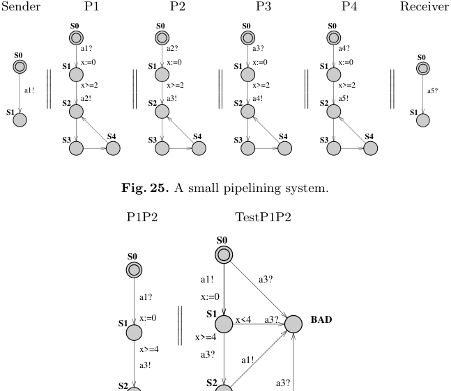

Fig. 26. A suggested abstraction and its test automaton.

obviously be given for the subsystem P3∥P4 and the desired property may now be established for the “much” simpler system P1P2∥P3P4, rather than the original system.

## Known Uses

The described technique can be found in full details in the Ph.D. thesis of Jensen [39]. In [40] the technique has been successfully applied to the verification of a protocol for controlling the switching between power on/off states in audio/video components described in [42].

## 7 Conclusion

Uppaal is a research tool available for free at http://www.uppaal.com/ that features an intuitive graphical interface. It has been ported to different platforms and it is in constant development. There are different development branches and tools that make use of Uppaal:

Cost–UPPAAL supports cost annotations of the model and can do minimal cost reachability analysis [44]. This version also has features for guiding

--- end of page.page_number=33 ---

the search. This version can be downloaded from http://www.cs.auc.dk/ ~behrmann/_guiding/.

Distributed–UPPAAL runs on multi-processors and clusters using the combined memory and CPU capacity of the system [15, 9].

T–UPPAAL test case generator for black-box conformance testing, see http: //www.cs.auc.dk/~marius/tuppaal/.

Times is a tool set for modelling, schedulability analysis, and synthesis of (optimal) schedules and executable code. The verification uses Uppaal [6].

On-going work on the model-checker includes support for hierarchical timed automata, symmetry reduction, UCode (Uppaal code, large subset of C), improved memory management, etc. The tool has been successfully applied to case studies ranging from communication protocols to multimedia applications:

Bang & Olufsen audio/video protocol. An error trace with more than 2000 transition steps was found [30]. TDMA Protocol Start-Up Mechanism was verified in [48].

Bounded retransmission protocol over a lossy channels was verified in [22]. Lip synchronization algorithm was verified in [21].

Power-down controller in an audio/video component was designed and verified in collaboration with Bang & Olufsen in [29].

Guided synthesis of control programs for a steel production plant was done in [37]. The final control programs were compiled to run on a lego model of the real plant.

Gearbox controller was formally designed and analysed in [47]. Lego Mindstorm programs written in “Not Quite C” have been verified in [38]. Field bus protocol was modelled and analysed in [27].

Uppaal is also used in a number of courses on real-time systems and formal

- http://user.it.uu.se/~paupet/#teaching

Real-time and formal method courses at Uppsala University.

- http://csd.informatik.uni-oldenburg.de/teaching/fp_realzeitsys_ ws0001/result/eindex.html

Practical course “Real-Time Systems” at the University of Oldenburg.

- http://fmt.cs.utwente.nl/courses/systemvalidation/

   - System Validation (using Model Checking) at the University of Twente.

- http://www.cs.auc.dk/~behrmann/esv03/ Embedded Systems Validation at Aalborg University.

- http://www.cs.auc.dk/~kgl/TOV04/Plan.html Test and Verification at Aalborg University.

- http://www.seas.upenn.edu/~pappasg/EE601/F03/ Hybrid Systems at the University of Pennsylvania.

- http://www.it.uu.se/edu/course/homepage/proalgebra Process Algebra at Uppsala University.

- http://www.cs.auc.dk/~luca/SV/ Semantics and

--- end of page.page_number=34 ---

- http://www.cs.depaul.edu/programs/courses.asp?subject=SE&courseid=533 Software Validation and Verification at DePaul University.

- http://www.cs.bham.ac.uk/~mzk/courses/SafetyCrit/ Safety Critical Systems and Software Reliability at the University of Birmingham.

- http://fmt.cs.utwente.nl/courses/sysontomg/ Systeem-ontwikkelomgevingen at the University of Twente.

Finally the following books have parts devoted to Uppaal:

- Concepts, Algorithms and Tools for Model-Checking [41]: Lecture notes in its current form. It treats both Spin and Uppaal.

- Systems and Software Verification: Model-checking Techniques and Tools [20]: This book identifies 6 important tools and has a chapter on Uppaal.

## References

1. Luca Aceto, Patricia Bouyer, Augusto Burgue˜no, and Kim Guldstrand Larsen. The power of reachability testing for timed automata. Theoretical Computer Science, 1–3(300):411–475, 2003.

2. Luca Aceto, Augusto Burgue˜no, and Kim G. Larsen. Model checking via reachability testing for timed automata. In Bernhard Steffen, editor, Tools and Algorithms for Construction and Analysis of Systems, 4th International Conference, TACAS ’98, volume 1384 of Lecture Notes in Computer Science, pages 263–280. Springer– Verlag, April 1998.

3. Rajeev Alur, Costas Courcoubetis, and David L. Dill. Model-checking for realtime systems. In 5th Symposium on Logic in Computer Science (LICS’90), pages 414–425, 1990.

4. Rajeev Alur and David L. Dill. Automata for modeling real-time systems. In Proc. of Int. Colloquium on Algorithms, Languages, and Programming, volume 443 of LNCS, pages 322–335, 1990.

5. Tobias Amnell, Gerd Behrmann, Johan Bengtsson, Pedro R. D’Argenio, Alexandre David, Ansgar Fehnker, Thomas Hune, Bertrand Jeannet, Kim G. Larsen, M. Oliver M¨oller, Paul Pettersson, Carsten Weise, and Wang Yi. Uppaal - Now, Next, and Future. In F. Cassez, C. Jard, B. Rozoy, and M. Ryan, editors, Modelling and Verification of Parallel Processes, number 2067 in Lecture Notes in Computer Science Tutorial, pages 100–125. Springer–Verlag, 2001.

6. Tobias Amnell, Elena Fersman, Leonid Mokrushin, Paul Pettersson, and Wang Yi. Times – a tool for modelling and implementation of embedded systems. In TACAS 2002, volume 2280 of Lecture Notes in Computer Science, pages 460–464. Springer–Verlag, April 2002.

7. Felice Balarin. Approximate reachability analysis of timed automata. In 17th IEEE Real-Time Systems Symposium. IEEE Computer Society Press, 1996.

8. Gerd Behrmann. Data Structures and Algorithms for the Analysis of Real Time Systems. PhD thesis, Aalborg University, 2003.

9. Gerd Behrmann. Distributed reachability analysis in timed automata. Software Tool For Technology Transfer (STTT), 2004. Currently available in the Online First edition of STTT.

--- end of page.page_number=35 ---

10. Gerd Behrmann, Johan Bengtsson, Alexandre David, Kim G. Larsen, Paul Pettersson, and Wang Yi. Uppaal implementation secrets. In Proc. of 7th International Symposium on Formal Techniques in Real-Time and Fault Tolerant Systems, 2002.

11. Gerd Behrmann, Alexandre David, Kim G. Larsen, M. Oliver M¨oller, Paul Pettersson, and Wang Yi. Uppaal - present and future. In Proc. of 40th IEEE Conference on Decision and Control. IEEE Computer Society Press, 2001.

12. Gerd Behrmann, Alexandre David, Kim G. Larsen, and Wang Yi. Unification & sharing in timed automata verification. In SPIN Workshop 03, volume 2648 of LNCS, pages 225–229, 2003.

13. Gerd Behrmann, Ansgar Fehnker, Thomas Hune, Kim G. Larsen, Paul Pettersson, and Judi Romijn. Efficient guiding towards cost-optimality in uppaal. In T. Margaria and W. Yi, editors, Proceedings of the 7th International Conference on Tools and Algorithms for the Construction and Analysis of Systems, number 2031 in Lecture Notes in Computer Science, pages 174–188. Springer–Verlag, 2001.

14. Gerd Behrmann, Ansgar Fehnker, Thomas Hune, Kim G. Larsen, Paul Pettersson, Judi Romijn, and Frits Vaandrager. Minimum-cost reachability for priced timed automata. In Maria Domenica Di Benedetto and Alberto Sangiovanni-Vincentelli, editors, Proceedings of the 4th International Workshop on Hybrid Systems: Computation and Control, number 2034 in Lecture Notes in Computer Sciences, pages 147–161. Springer–Verlag, 2001.

15. Gerd Behrmann, Thomas Hune, and Frits Vaandrager. Distributed timed model checking - How the search order matters. In Proc. of 12th International Conference on Computer Aided Verification, Lecture Notes in Computer Science, Chicago, Juli 2000. Springer–Verlag.

16. Gerd Behrmann, Kim G. Larsen, Justin Pearson, Carsten Weise, and Wang Yi. Efficient timed reachability analysis using clock difference diagrams. In Proceedings of the 12th Int. Conf. on Computer Aided Verification, volume 1633 of Lecture Notes in Computer Science. Springer–Verlag, 1999.

17. Johan Bengtsson. Clocks, DBMs and States in Timed Systems. PhD thesis, Uppsala University, 2002.

18. Johan Bengtsson, Bengt Jonsson, Johan Lilius, and Wang Yi. Partial order reductions for timed systems. In Proceedings of the 9th International Conference on Concurrency Theory, September 1998.

19. Johan Bengtsson, Kim G. Larsen, Fredrik Larsson, Paul Pettersson, Yi Wang, and Carsten Weise. New generation of uppaal. In Int. Workshop on Software Tools for Technology Transfer, June 1998.

20. Beatrice Berard, Michel Bidoit, Alain Finkel, Francois Laroussinie, Antoine Petit, Laure Petrucci, Philippe Schnoebelen, and Pierre McKenzie. Systems and Software Verification: Model-Checking Techniques and Tools. Springer–Verlag, 2001.

21. Howard Bowman, Giorgio P. Faconti, Joost-Pieter Katoen, Diego Latella, and Mieke Massink. Automatic verification of a lip synchronisation algorithm using uppaal. In Bas Luttik Jan Friso Groote and Jos van Wamel, editors, In Proceedings of the 3rd International Workshop on Formal Methods for Industrial Critical Systems. Amsterdam , The Netherlands, 1998.

22. Pedro .R. D’Argenio, Joost-Pieter. Katoen, Theo C. Ruys, and Jan Tretmans. The bounded retransmission protocol must be on time! In In Proceedings of the 3rd International Workshop on Tools and Algorithms for the Construction and Analysis of Systems, volume 1217 of LNCS, pages 416–431. Springer–Verlag, April 1997.

23. Alexandre David. Hierarchical Modeling and Analysis of Timed Systems. PhD thesis, Uppsala University, November 2003.

--- end of page.page_number=36 ---

24. Alexandre David, Gerd Behrmann, Kim G. Larsen, and Wang Yi. New uppaal architecture. In Paul Pettersson and Wang Yi, editors, Workshop on Real-Time Tools, Uppsala University Technical Report Series, 2002.

25. Alexandre David, Gerd Behrmann, Kim G. Larsen, and Wang Yi. A tool architecture for the next generation of uppaal. In 10th Anniversary Colloquium. Formal Methods at the Cross Roads: From Panacea to Foundational Support, LNCS, 2003.

26. Alexandre David, M. Oliver M¨oller, and Wang Yi. Formal verification of UML statecharts with real-time extensions. In Ralf-Detlef Kutsche and Herbert Weber, editors, Fundamental Approaches to Software Engineering, 5th International Conference, FASE 2002, volume 2306 of LNCS, pages 218–232. Springer–Verlag, 2002.

27. Alexandre David and Wang Yi. Modelling and analysis of a commercial field bus protocol. In Proceedings of the 12th Euromicro Conference on Real Time Systems, pages 165–172. IEEE Computer Society, 2000.

28. Elena Fersman. A Generic Approach to Schedulability Analysis of Real-Time Systems. PhD thesis, Uppsala University, November 2003.

29. Klaus Havelund, Kim G. Larsen, and Arne Skou. Formal verification of a power controller using the real-time model checker uppaal. 5th International AMAST Workshop on Real-Time and Probabilistic Systems, available at http://www.uppaal.co m, 1999.

30. Klaus Havelund, Arne Skou, Kim G. Larsen, and Kristian Lund. Formal modelling and analysis of an audio/video protocol: An industrial case study using uppaal. In Proceedings of the 18th IEEE Real-Time Systems Symposium, pages 2–13, December 1997.

31. M. Hendriks, G. Behrmann, K.G. Larsen, P. Niebert, and F.W. Vaandrager. Adding symmetry reduction to uppaal. In Proceedings First International Workshop on Formal Modeling and Analysis of Timed Systems (FORMATS 2003), volume 2791 of Lecture Notes in Computer Science, 2003.

32. Martijn Hendriks and Kim G. Larsen. Exact acceleration of real-time model checking. In E. Asarin, O. Maler, and S. Yovine, editors, Electronic Notes in Theoretical Computer Science, volume 65. Elsevier Science Publishers, April 2002.

33. Thomas A. Henzinger. Symbolic model checking for real-time systems. Information and Computation, 111:193–244, 1994.

34. Gerard J. Holzmann. Design and Validation of Computer Protocols. Prentice-Hall, 1991.

35. Gerard J. Holzmann. An analysis of bitstate hashing. Formal Methods in System Design, 13:289–307, 1998.

36. John E. Hopcroft and Jeffrey D. Ullman. Introduction of Automata Theory, Languages, and Computation. Addison Wesley, 2001.

37. Thomas Hune, Kim G. Larsen, and Paul Pettersson. Guided synthesis of control programs using uppaal. In Ten H. Lai, editor, Proc. of the IEEE ICDCS International Workshop on Distributed Systems Verification and Validation, pages E15–E22. IEEE Computer Society Press, April 2000.

38. Torsten K. Iversen, K˚are J. Kristoffersen, Kim G. Larsen, Morten Laursen, Rune G. Madsen, Steffen K. Mortensen, Paul Pettersson, and Chris B. Thomasen. Modelchecking real-time control programs — Verifying LEGO mindstorms systems using uppaal. In Proc. of 12th Euromicro Conference on Real-Time Systems, pages 147– 155. IEEE Computer Society Press, June 2000.

39. Henrik Ejersbo Jensen. Abstraction-Based Verification of Distributed Systems. PhD thesis, Aalborg University, June 1999.

--- end of page.page_number=37 ---

40. Henrik Ejersbo Jensen, Kim Guldstrand Larsen, and Arne Skou. Scaling up uppaal automatic verification of real-time systems using compositionality and abstraction. In Mathai Joseph, editor, Formal Techniques in Real-Time and Fault-Tolerant Systems, 6th International Symposium, FTRTFT 2000, volume 1926 of Lecture Notes in Computer Science, pages 19–20. Springer–Verlag, 2000.

41. Joost-Pieter Katoen. Concepts, Algorithms, and Tools for Model Checking. http://www.it-c.dk/people/hra/mcpa/katoen.ps, 1999.

42. Arne Skou Klaus Havelund, Kim Guldstrand Larsen. Formal verification of a power controller using the real-time model checker Uppaal. In 5th Int. AMAST Workshop on Real-Time and Probabilistic Systems, volume 1601 of Lecture Notes in Computer Science, pages 277–298. Springer–Verlag, 1999.

43. K˚are J. Kristoffersen. Compositional Verification of Concurrent Systems. PhD thesis, Aalborg University, August 1998. http://www.itu.dk/people/kjk/publications.html.

44. Kim G. Larsen, Gerd Behrmann, Ed Brinksma, Ansgar Fehnker, Thomas Hune, Paul Pettersson, and Judi Romijn. As cheap as possible: Efficient cost-optimal reachability for priced timed automata. In G. Berry, H. Comon, and A. Finkel, editors, Proceedings of CAV 2001, number 2102 in Lecture Notes in Computer Science, pages 493–505. Springer–Verlag, 2001.

45. Kim G. Larsen, Paul Pettersson, and Wang Yi. Uppaal in a nutshell. Int. Journal on Software Tools for Technology Transfer, 1(1–2):134–152, October 1997.

46. Fredrik Larsson, Kim G. Larsen, Paul Pettersson, and Wang Yi. Efficient verification of real-time systems: Compact data structures and state-space reduction. In Proc. of the 18th IEEE Real-Time Systems Symposium, pages 14–24. IEEE Computer Society Press, December 1997.

47. Magnus Lindahl, Paul Pettersson, and Wang Yi. Formal design and analysis of a gearbox controller. Springer International Journal of Software Tools for Technology Transfer (STTT), 3(3):353–368, 2001.

48. Henrik L¨onn and Paul Pettersson. Formal verification of a TDMA protocol startup mechanism. In Proc. of the Pacific Rim Int. Symp. on Fault-Tolerant Systems, pages 235–242, December 1997.

49. Brian Nielsen. Specification and Test of Real-Time Systems. PhD thesis, Aalborg University, 2000.

50. Paul Pettersson. Modelling and Verification of Real-time Systems Using Timed Automata: Theory and Practice. PhD thesis, Uppsala University, 1999.

51. Wang Yi, Paul Petterson, and Mats Daniels. Automatic verification of real-time communicating systems by constraint-solving. In Seventh International Conference on Formal Description Techniques, pages 223–238, 1994.

--- end of page.page_number=38 ---
