Data Structures and Algorithms for the Analysis of Real Time Systems

Gerd Behrmann

Aalborg University Department of Computer Science

--- end of page.page_number=1 ---

--- end of page.page_number=2 ---

Data Structures and Algorithms for the Analysis of Real Time Systems

--- end of page.page_number=3 ---

--- end of page.page_number=4 ---

## Data Structures and Algorithms for the Analysis of Real Time Systems

Gerd Behrmann

PhD Dissertation

November 28th, 2003

Aalborg University Department of Computer Science

--- end of page.page_number=5 ---

## ABSTRACT

This thesis presents data structures and algorithms for the analysis of real time systems in various modelling formalisms. Algorithms for reachability analysis (a special case of model checking) and static scheduling analysis are presented. The modeling formalisms range from traditional state/event systems as used in the commercial tool visualSTATE  over hierarchical state/event systems and timed automata to linear priced timed automata. Data structures used range from reduced ordered binary decision diagrams (ROBDD) used in symbolic model checking of state/event systems, over clock difference diagrams (CDD) – an ROBDD like data structures for real time systems, to priced zones used for representing the state space of cost annotated timed automata.

The thesis is a collection of six papers. The first two papers deal with model checking of visualSTATE  models – in fact, the current version of visualSTATE  uses the patented techniques proposed in the first paper. The third paper considers alternative data structures for representing the state space of a real time system (CDDs). The remaining three papers deal with how real time model checking techniques like those used for timed automata, can be used to answer static scheduling problems and in particular, how one can specify and find optimal schedules. The techniques presented in the thesis have been experimentally evaluated using either a prototype of the visualSTATE  model checker or the academic timed automata verification tool Uppaal.

Keywords: Finite state systems, state/event systems, real time systems, timed automata, priced timed automata, reachability analysis, optimal reachability, verification, model checking, static scheduling, state explosion problem, symbolic representations, compositional verification, hierarchical verification, dependency analysis, tool.

Information about copyright, print and ISBN will be inserted here.

--- end of page.page_number=6 ---

To Mette

--- end of page.page_number=7 ---

--- end of page.page_number=8 ---

## DANSK SAMMENFATNING

## Datastrukturer og algoritmer til analyse af realtidssystemer.

Denne afhandling præsenterer datastrukturer og algoritmer til analyse af realtidssystemer i forskellige modelleringsformaliser. Algoritmer for opn˚aelighedsanalyse (et specialtilfælde af model checking) og statisk skeduleringsanalyse præsenteres. De brugte modelleringsformalismer spænder fra traditionelle state/event systemer brugt i det kommercielle dansk udviklede værktøj visualSTATE  over hierarkiske tilstandssystemer og tidsautomater til prismærkede tidsautomater. Datastrukturerne spænder fra Reduced Ordered Binary Decision Diagrams (ROBDD), der bruges til symbolsk model checking af state/event systemer, over Clock Difference Diagrams (CDD), en ROBDD lignende datastruktur til realtidssystemer, til prismærkede zoner, der bruges til at repræsentere tilstandsrummet af prismærkede tidsautomater. Afhandlingen er en samling af 6 artikler, der er publiceret i internationale tidsskrifter eller ved internationale konferencer. De første to artikler omhandler model checking af visualSTATE  modeller – den præsenterede teknik er patenteret og anvendes for tiden i visualSTATE  værktøjet. Den tredje artikel omhandler alternative datastrukturer (CDDer) til at repræsentere tilstandsrummet af realtidssystemer. De resterende tre artikler beskriver hvordan model checking teknikker, som dem brugt for tidsautomater, kan bruges til at løse statiske skeduleringsproblemer, og specielt hvordan optimale skeduleringsproblemer specificeres og optimale løsninger findes. Teknikkerne i denne afhandling er eksperimentelt afprøvede i en prototype af visualSTATE  verifikationsmodulet eller i det akademiske værktøj Uppaal.

Nøgleord: Endelige tilstandssystemer, state/event systemer, sandtidssystemer, tidsautomater, prismærkede tidsautomater, opn˚aelighedsanalyse, optimal opn˚aelighedsanalyse, verifikation, model checking, statisk skedulering, eksploderende tilstandsrum, symbolske repræsentationer, kompositionel verifikation, hierarkisk verifikation, afhængighedsanalyse, verifikationsværktøjer.

--- end of page.page_number=9 ---

x

--- end of page.page_number=10 ---

## ACKNOWLEDGMENTS

This thesis is a collection of six selected papers. I would not have been able to write them without the support from my supervisor Kim G. Larsen. Thanks for believing in me and treating me like a colleague.

Also thanks to my colleagues here at the department. It wouldn’t have been fun without Luca, Josva, Arne, Brian and Thomas. Thanks to all my co-authors and colleagues in Aarhus, Uppsala, Copenhagen, Archen, Nijmegen and Twente: Thomas, Paul, Alexandre, Johan, Wang, Justin, Jørn, Henrik, Henrik, Kaare, Carsten, Judi, Ansgaar, Frits and Ed.

Also thanks to the secretaries at the department, especially Ulla, Lene and Helle, for all the help with the practical issues of pursuing a Ph.D.

Thanks to my family and friends, for all the barbecues and long evenings which helped me forget about work and papers and the thesis. And finally, thanks to Mette, my love, for not giving up on me.

--- end of page.page_number=11 ---

xii

--- end of page.page_number=12 ---

## CONTENTS

|Introduction . . . . . . . . . . . . . . . . . . . . . . . . . . . . . . . . . . .|Introduction . . . . . . . . . . . . . . . . . . . . . . . . . . . . . . . . . . .|1|
|---|---|---|
|1|Motivation . . . . . . . . . . . . . . . . . . . . . . . . . . . . . . . .|3|
|2|Reachability Analysis . . . . . . . . . . . . . . . . . . . . . . . . . .|8|
|3|Modeling Formalisms . . . . . . . . . . . . . . . . . . . . . . . . . . .|10|
|4|Data Structures . . . . . . . . . . . . . . . . . . . . . . . . . . . . . .|19|
|5|The Making of Uppaal . . . . . . . . . . . . . . . . . . . . . . . . .|26|
|6|Thesis Summary . . . . . . . . . . . . . . . . . . . . . . . . . . . . .|35|
|Paper|A: Verifcation of Large State/Event Systems using Compos. . . 41||
|1|Introduction . . . . . . . . . . . . . . . . . . . . . . . . . . . . . . . .|43|
|2|State/Event Systems . . . . . . . . . . . . . . . . . . . . . . . . . . .|45|
|3|Consistency Checks . . . . . . . . . . . . . . . . . . . . . . . . . . . .|47|
|4|ROBDD Representation . . . . . . . . . . . . . . . . . . . . . . . . .|48|
|5|Compositional Backwards Reachability . . . . . . . . . . . . . . . . .|50|
|6|Local Deadlock Detection . . . . . . . . . . . . . . . . . . . . . . . .|55|
|7|Experimental Results . . . . . . . . . . . . . . . . . . . . . . . . . . .|56|
|8|Conclusion . . . . . . . . . . . . . . . . . . . . . . . . . . . . . . . .|60|
|Paper|B: Verifcation of Hierarchical State/Event Systems using. . .|63|
|1|Introduction . . . . . . . . . . . . . . . . . . . . . . . . . . . . . . . .|65|
|2|Flattening and Reusability . . . . . . . . . . . . . . . . . . . . . . . .|67|
|3|The Hierarchical State/Event Model . . . . . . . . . . . . . . . . . .|69|
|4|Consistency Checks . . . . . . . . . . . . . . . . . . . . . . . . . . . .|72|
|5|Reusable Reachability Checking . . . . . . . . . . . . . . . . . . . . .|73|
|6|Compositional Reachability Checking . . . . . . . . . . . . . . . . . .|77|
|7|Approximation by Syntactic Analysis . . . . . . . . . . . . . . . . . .|78|
|8|Experimental Results . . . . . . . . . . . . . . . . . . . . . . . . . . .|80|
|9|Conclusion . . . . . . . . . . . . . . . . . . . . . . . . . . . . . . . .|84|
|Paper|C: Efcient Timed Reachability Analysis using Clock Dif. . . .|85|
|1|Motivation . . . . . . . . . . . . . . . . . . . . . . . . . . . . . . . .|87|
|2|Timed Automata . . . . . . . . . . . . . . . . . . . . . . . . . . . . .|89|
|3|Clock Diference Diagrams . . . . . . . . . . . . . . . . . . . . . . . .|91|
|4|Operation on CDDs . . . . . . . . . . . . . . . . . . . . . . . . . . .|93|
|5|Implementation and Experimental Results . . . . . . . . . . . . . . .|96|

--- end of page.page_number=13 ---

Contents

xiv

|6|Towards a Fully Symbolic Timed Reachability Analysis . . . . . . .|98|
|---|---|---|
|7|Conclusion . . . . . . . . . . . . . . . . . . . . . . . . . . . . . . . .|99|
|Paper|D: Minimum-Cost Reachability for Priced Timed Automata|101|
|1|Introduction . . . . . . . . . . . . . . . . . . . . . . . . . . . . . . . .|105|
|2|Linearly Priced Timed Automata . . . . . . . . . . . . . . . . . . . .|107|
|3|Priced Clock Regions . . . . . . . . . . . . . . . . . . . . . . . . . . .|109|
|4|Symbolic Semantics and Algorithm . . . . . . . . . . . . . . . . . . .|113|
|5|Conclusion . . . . . . . . . . . . . . . . . . . . . . . . . . . . . . . .|120|
|A|Example of Symbolic State-Space . . . . . . . . . . . . . . . . . . . .|122|
|Paper|E: Efcient Guiding Towards Cost-Optimality in Uppaal . . .|125|
|1|Introduction . . . . . . . . . . . . . . . . . . . . . . . . . . . . . . . .|129|
|2|Uniformly Priced Timed Automata . . . . . . . . . . . . . . . . . . .|131|
|3|Improving the State-Space Exploration . . . . . . . . . . . . . . . . .|138|
|4|Experiments . . . . . . . . . . . . . . . . . . . . . . . . . . . . . . . .|141|
|5|Conclusion . . . . . . . . . . . . . . . . . . . . . . . . . . . . . . . .|148|
|Paper|F: As Cheap as Possible: Efcient Cost-Optimal Reach. . . . .|149|
|1|Introduction . . . . . . . . . . . . . . . . . . . . . . . . . . . . . . . .|153|
|2|Symbolic Optimal Reachability . . . . . . . . . . . . . . . . . . . . .|154|
|3|Priced Timed Automata . . . . . . . . . . . . . . . . . . . . . . . . .|157|
|4|Priced Zones . . . . . . . . . . . . . . . . . . . . . . . . . . . . . . .|159|
|5|Facets & Operations on Priced Zones . . . . . . . . . . . . . . . . . .|161|
|6|Implementation & Experiments . . . . . . . . . . . . . . . . . . . . .|163|
|7|Conclusion . . . . . . . . . . . . . . . . . . . . . . . . . . . . . . . .|166|

--- end of page.page_number=14 ---

# INTRODUCTION

--- end of page.page_number=15 ---

--- end of page.page_number=16 ---

Motivation

3

## 1 Motivation

Software crashes. Software contains bugs. Software is complex. These statements are almost axioms – anybody with a PC can agree that this is how software behaves. These assertions are independent of the software type, e.g. your operating system, your typical office application, or special purpose software for managing the flow of goods in your company all crash from time to time. Platform does not matter either: Although some people might try to convince you otherwise, Linux and Mac software is just as buggy as software for Windows.

Not all software is as buggy as your typical PC application. Nowadays, most devices more complex than a light bulb actually contain software – this is what is called embedded software – and most of this software is working flawlessly. As does most software used in avionics and space exploration (or at least we hope so; in recent years a number of losses in space missions were caused by software failures). Think about it: Your car (engine, brakes, airbags, etc.), your microwave oven, your dishwasher, your washing machine, your phone, your cell phone, your house alarm, your HiFi equipment and much more all contain software. And if the vision about pervasive computing becomes true then your light bulbs, your shoes, your door, even the goods in the local grocery store will contain small computers containing software.

For software embedded in small devices, simplicity probably plays a major role in ensuring correctness, i.e., compared to your typical PC application, the functionality and complexity of embedded software is lower – at least this was the case some years ago. In recent years, the functionality and hence the complexity of embedded software has been going up. As a result the failure rate increases. Take a good look at a modern cell phone. It contains over one megabyte of RAM and has a more powerful processor than a PC 10 years ago. Consequently, software failures are quite common. Consumers are already getting used to the fact that a cell phone can crash, forcing them to remove the battery in order to reboot the phone.

There are many approaches towards fighting this problem. None of them are restricted to embedded software, although the higher cost of bugs in embedded software and mission-critical software has a tendency to make people in those areas more receptive to techniques for increasing software quality. The whole area of software process improvement tries to avoid the errors in the first place by avoiding the ad-hoc development style used in many software development projects. It boils down to better management, better documentation, better planning, and more discipline. On the other hand, techniques like triple modular redundancy are based on the assumption that faults do occur and that any system must be fault tolerant. In triple modular redundancy, all systems consist of three functionally equivalent modules which vote about each operation. Each module is developed from the same requirement specification by an independent team. Whenever one of the modules does not agree with the other two, the module is overruled assuming that the two agreeing modules have the correct result. This approach triples the development costs and thus is only used for life-critical missions, e.g., in avionics.

--- end of page.page_number=17 ---

Introduction

4

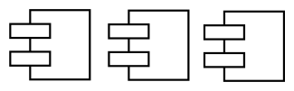

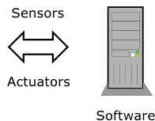

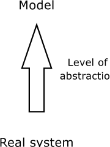

Fig. 1: A semantically well-defined model of the software under consideration and the environment it is interacting with is a prerequisite for use of a model checking tool. The model will always be an abstraction of the real system – this is especially true of the environment, since it often suffices to model those aspects of the environment which influence the software via sensors and which are influenced by the software via actuators.

Model checking is an orthogonal technique from the world of formal verification. Formal verification of software attempts to prove its correctness by proving a mathematical theorem. Thus, given a piece of software and its requirement specification, we attempt to prove that this piece of software adheres to the requirement specification. In model checking, the developer creates a semantically well-defined model of the system under consideration, e.g., the software together with the environment with which the software is interacting, see Fig. 1. To be of any use, the requirement specification also needs to be formalised. The model and the requirement specification are then fed to a tool called model checker, which verifies that the model is behaving according to specification, see Fig. 2. If not, some debugging information is produced which aids the developer in improving the software and/or the model.

Often the model is created by hand, which might look like extra work for the developer. This does not need to be the case. Models are becoming an integral part of modern software development methodologies – the widespread acceptance of the unified modeling language (UML) [BJR97] is proof of this trend. With a bit of planning, model checking techniques could be integrated into the development cycle and be used at the very first stages of the design phase. I.e., when the first models of the design are produced, so are simple models of the environment. These can then be fed into a model checker to verify that the early design satisfies the requirements. As the design is refined during development, the model checker can be used to continuously verify correctness. Once the model is sufficiently refined, one could in principle automatically generate the final source code.

It is an old result from the field of philosophy of science that we can never prove anything about the real world. Any axiom we state about the real world is

--- end of page.page_number=18 ---

Motivation

5

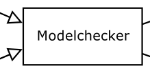

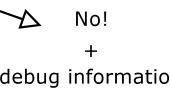

Fig. 2: A model checker is a tool, that checks whether a given model satisfies a set of requirements. If not, debugging information may be produced which can be used to fix the model (or the requirement specification). If the model does satisfy the requirements, the model checker might provide further insight into the behaviour of the model.

based on what we observe and there is no way of guaranteeing that the world is actually behaving as assumed or predicted. On the other hand, it is easy to disprove statements, since all we need is a counter example: An experiment which clearly demonstrates that the world is not behaving according to our prediction. When this line of thought is applied to formal verification of software, we must conclude that we can never prove the correctness of software. At most, we can prove the correctness of software as a mathematical object (the model), but never as a part of a real system. In model checking, the model of the software and the environment it is interacting with is always an abstraction of the software running on a real processor and interacting with the real environment. The more detailed the model, the more we can trust it in the sense that errors in the real system are preserved in the model. Therefore, in case we cannot find any errors, this might increase our confidence in the real system. However, the only thing we can do with certainty is to disprove the correctness, i.e. to find bugs.[1] Model checking should always be considered orthogonal to other techniques of fault prevention. It is just another addition to the arsenal of tools available to developers for fighting bugs.

Model checking is sometimes referred to as push-button verification, implying it is so easy that one can verify the correctness of programs by pressing a single button – nothing could be further from the truth. It is correct that once the model has been created and the requirement specification has been written, proving the correctness is done by the model checking tool. However, model checking tools suffer from the so called state space explosion problem: The complexity of the system under consideration grows exponentially in the number of concurrent components in the model. From a purely theoretical point of view, model checking seems futile: The worst-case complexity of the problem dooms the approach for anything but

> 1 There is no guarantee that an error in the model is actually an error in the real system, but if we can reproduce the error in the real system, then we can be certain.

--- end of page.page_number=19 ---

Introduction

6

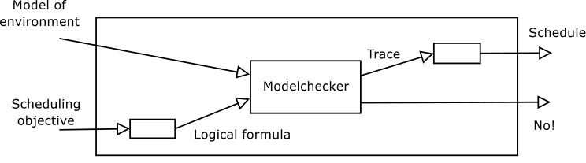

Fig. 3: Some scheduling problems can be reduced to model checking problems, by creating a model of the environment and rephrasing the scheduling objective as a formula expressing, e.g, that a certain goal situation must be reachable. The model checker can then produce a trace demonstrating that the property is satisfied which in turn can be translated to a schedule for the environment.

the simplest systems. In practise however, many realistic systems are of such a structured nature that model checking is of practical use. A good modeling language allows the developer to express the structure of the problem. Much research is invested in finding techniques that can utilise the structure to allow model checking of realistic systems despite the complexity of the general problem. For the moment, model checking tools still require a firm understanding of the modeling language and at least rudimentary knowledge about the techniques used in the tool. In time, modeling languages, model checking techniques and the ever increasing amount of computer power available will hopefully turn the approach into a viable complement to traditional quality assurance techniques.

Model checkers differentiate themselves from the competition by using different modeling languages and different languages for the requirement specification. Common to all model checkers is that the modeling language essentially describes a directed graph, which is exhaustively explored by the model checker. They might use more or less clever ways of representing and exploring this state space. For some modeling languages the state space can even be infinite. Nonetheless, state space exploration is a characteristic feature of a model checker.

Formal verification is not the only application of model checking tools. If the model is only a partial description of the problem, model checkers can be (mis)used to synthesize some of the remaining components. In particular, as illustrated in Fig. 3, if only a model of the uncontrolled environment is available, a model checker can be used to answer questions like “Is there a way to bring the system into this and that state?” or “Is there an infinite path such that something particularly bad never happens?”. Answering these questions by themselves does not give us any clue as to how to actually realise the behaviour, but most model checkers can produce traces which demonstrate that the properties actually do hold. These traces are in fact schedules. Hence, model checkers can be used as alternative scheduling tools. The two scheduling questions mentioned before are of a particularly simple nature, as they assume that we are in control of all transitions of the environment. However,

--- end of page.page_number=20 ---

Motivation

7

it is not unlikely that we can only control some transitions whereas the others are taken non-deterministically. For those familiar with game theory, this is like the difference between one player games (e.g. Solitair, where the player is in control of all moves) and two player games (e.g. Chess, where players move in turns).

This thesis is a collection of six selected papers. These six papers do not provide all answers to all remaining problems in model checking. Each paper advances the state-of-the-art in its own area. The papers deal with different modeling languages, different ways of representing and exploring the state space, and techniques that are used in different tools. The common theme for all papers is simply reachability analysis; maybe with a twist towards embedded software, although this is never explicitly stated in any of the papers.

The techniques presented in this thesis are evaluated using two tools: visualSTATE  and Uppaal. The former is a commercial tool by visualSTATE  A/S. The tool is used in development of embedded software and provides a graphical Statechart based language, supports code generation, simulation, and prototyping. Finally, the tool contains a verification component which can detect common mistakes like dead code and deadlocks. The first two papers of this thesis deal with model checking of visualSTATE  models – in fact, the current version of visualSTATE  uses the patented techniques proposed in the first paper. The latter tool – Uppaal – is an academic tool for model checking real time systems. The folklore definition of a real time system is:

“Any system whose correctness does not only depend on the correct order of events, but also the timing between events.”

For instance, the airbag release system in a car is a real time system: It does not suffice that the air bag will eventually be released after the car has crashed; to be of any use it must be released within a certain maximum amount of time after the impact. The third paper considers alternative data structures for representing the state space of a real time system. The remaining three papers deal with how real time model checking techniques like those used in Uppaal, can be used to answer static scheduling problems and in particular, how one can specify and find optimal schedules.

Outline Table 1 gives an overview of the various tools used in the thesis, the modeling formalisms they support, and the techniques and data structures used. There are two interesting axes in this table, namely the formalisms and the data structures, and the remainder of this introductory chapter gives an overview of these two dimensions.

Section 2 gives a short introduction to explicit state and symbolic reachability analysis. Section 3 gives an overview of the various formalisms, and section 4 discusses the data structures. Section 5 gives an overview of Uppaal, its architecture and various sub-projects. Finally, section 6 gives a summary of the six papers of this thesis.

--- end of page.page_number=21 ---

Introduction

8

Tab. 1: An overview of modeling formalisms, verification techniques and data structures. A letter A-F refers to the corresponding paper in this thesis. A reference means that this topic has been dealt with, but not by papers in this thesis. A ◦ means that it can be easily done, but no papers exploring this combination exist.

|Tool|visualSTATE|visualSTATE|Uppaal|Uppaal||
|---|---|---|---|---|---|
|Formalism|SEM|HSEM|TA|UPTA|LPTA|
|Composit. Backw. Reachability|A|B|[Lar02]|||
|Binary Decision Diagrams|A|B|[BLN03]|||
|Clock Diference Diagram|||C|◦||
|Diference Bounded Matrix|||[Dil89]|E||
|Minimal Constraint Form|||[LLPY97]|◦|◦|
|Priced regions|||||D|
|Prices zones|||||F|

## 2 Reachability Analysis

The reachability problem is in many ways fundamental in model checking. Although reachability analysis is not as powerful as, for instance, full CTL model checking, many interesting problems can be reduced to that of checking reachability of certain states. In this section we will look at various approaches to solving the reachability problem.

Let us first define the reachability problem. A transition system is a tuple M = (S, S0, R) where S is a set of states, S0 ⊆ S is a set of initial states, R ⊆ S × S is a set of transitions. Let G ⊆ S be a set of goal states. We say G is reachable from S0 iff there exists a sequence of states s0, s1, . . . , sn such that s0 ∈ S0, sn ∈ G and (si, si+1) ∈ T for all 0 ≤ i < n. This is illustrated in Fig. 4.

For finite transition systems, deciding the reachability problem is easy. Either perform a breadth first or depth first traversal of the transition system starting at the set of initial states and see if any of the states of G can be reached; alternatively reverse all transitions and start with the set of goal states and see if any states in S0 can reach a goal state. This is shown in Fig. 5. The problem is that most modeling languages use parallel composition and thus the size of S (the state-space) is exponential in the size of the input model. This is often referred to as the state explosion problem. Researches have attacked the state explosion problem from numerous angles; for instance, symmetry reduction [ES96] and partial order reduction [GW91] techniques take advantage of the regularity of the model.

An alternative (and to some extent orthogonal) approach is to use symbolic model checking techniques. Two approaches are predominant: Symbolic data structures (such as ROBDDs, see section 4.1) can be used to represent the transition relation and sets of states and perform a breadth first search of M [BCM[+] 90], see

--- end of page.page_number=22 ---

Reachability Analysis

9

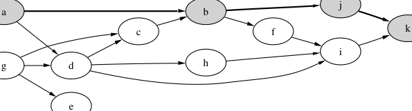

Fig. 4: Assuming that state a is an initial state, the highlighted states prove that state k is reachable.

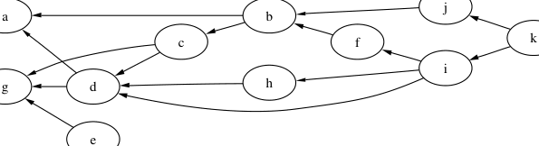

Fig. 5: It is easy to see that state e is unreachable when all edges are reversed and starting the reachability analysis at e. It only requires one step to realize that there is no path back to the initial state (state a). This is called backwards traversal of the state space.

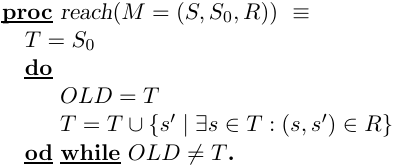

Fig. 6: Symbolic reachability techniques use data structures like ROBDDs to represent the set of states T and the transition relation R. In each iteration, the set of all successors of states in T is computed in one symbolic operation. Compared to explicitly computing the successors of each state, the symbolic approach is often several orders of magnitude faster.

--- end of page.page_number=23 ---

Introduction

10

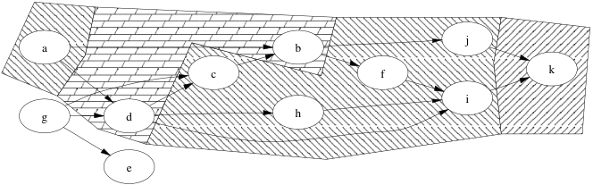

Fig. 7: Symbolic computation of the set of reachable states. In each iteration the current set of reachable states is extended with the set of new states reachable in one step from a state already in the set (the frontier of each iteration is shaded with a different pattern).

Fig. 6. The advantage compared to explicit state model checking is two-fold: First, the representation of the set of reachable states is not based on individual states and thus can potentially represent extremely large sets. Second, the algorithm illustrated in Fig. 7 computes the successors (the set of states reachable in one step) of a set of states in one symbolic operation, which often is orders of magnitudes faster than explicitly computing the successors of each state. The other approach to symbolic model checking is referred to as bounded model checking [BCCZ99] which reduces the reachability problem to a satisfiability problem. This is done by representing the transition relation R as a formula in propositional logic and then unfolding the transition relation n times in such a way that the resulting formula is satisfiable if and only if a goal state can be reached with n or less transitions. One can then use a SAT-solver to decide the resulting satisfiability problem. Bounded model checking is often very efficient at finding a path to a goal state if such a path exists; the drawback is that the model is only analysed up to depth n, which might be unknown. In [McM03] bounded and unbounded model checking has been successfully combined.

For general infinite transition systems, the reachability problem is undecidable, but for certain models finite abstractions preserving interesting properties do exist. We will return to such models in section 3.3.

## 3 Modeling Formalisms

## 3.1 State/Event Machines

The VVS project was a CIT[2] sponsored collaboration between Baan visualSTATE A/S (now IAR visualSTATE A/S), BRICS at Aalborg University and the computer systems section at the Technical University of Denmark. The problem under consideration was that of verifying large State/Event Machines (a.k.a. state/event models), the native modeling formalism of the commercial visualSTATE  tool.

> 2 Danish National Centre for IT Research

--- end of page.page_number=24 ---

Modeling Formalisms

11

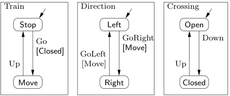

Fig. 8: A simple state/event model of a train. There are three concurrent state machines; Train models the movement, Direction the current direction of the movement, and Crossing a railway crossing. The events of this systems are Up, Down, Go, GoLeft, and GoRight. The expressions is square brackets are guards testing on the state of the other state machines.

A state/event model consists of a fixed number of concurrent finite state machines, annotated with guards, and input and output events on the transitions. Guards are boolean combinations of conditions on the state of other machines in the model. Each input is reacted upon by all machines in lock-step. If a machine has no enabled transitions for a particular input event, it does not perform any state change.

Figure 8 shows an example of a simple state/event model of a train. If the event Up is received in state (Move, Right, Closed), then the system goes to the state (Stop, Right, Open) since both components react synchronously to the same event. If on the other hand the event Up is received in state (Stop, Right, Closed), then the system goes to (Stop, Right, Open), since the right most component is the only one being able to react upon this event in the given state.

visualSTATE  is an integrated tool for developing embedded software and the state/event model is used to implement the control part of this software. As such, the state/event model was designed to be used in the context of a C runtime environment that provides input events and consumes output events, see Fig. 9. When verifying a state/event model, the runtime environment is ignored. It is assumed that any event can be generated at any time. This is clearly an over-approximation, but the relation between output events and input events is hidden in the C code, which was not considered in the VVS project.

The main contribution of the project was the Compositional Backwards Reachability analysis (CBR) technique described in Paper A of this thesis. In short, reachability of a set of goal states is determined by exploring the state space in a backwards fashion. Initially, only a few machines of the model are considered and only transitions which are independent of the state and behaviour of the other machines are taken. If the analysis fails to establish a path to the initial state, the set of machines under consideration is extended. One strength of the technique is that the analysis done so far can be reused as the starting point of the new analysis.

Using the CBR technique, it was possible to analyse extremely large models

--- end of page.page_number=25 ---

Introduction

12

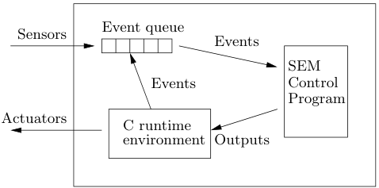

Fig. 9: State/event-machines consume events from an event queue. The state/event-machine language was designed to be used in the context of a C runtime environment. Outputs generated by the SEM control program are mapped to C function calls in the runtime environment. These C functions can in turn trigger actuators or add new events to the event queue.

within a short period of time. In one case, a model of the German ICE train with a declared state space of 10[476] was verified within 5 minutes.

## 3.2 Hierarchical State/Event Machines

Since the introduction of Statecharts by David Harel in 1987 [Har87], hierarchical state machines have become very popular. Most notably, hierarchical state machines have been included in the UML standard.

The hierarchical state/event model is an extension of the state/event model with concepts borrowed from Statecharts. A hierarchical state/event machine is a structure consisting of primitive states, super-states and transitions between those states. A super-state can itself contain a hierarchical state/event machine or a parallel composition of hierarchical state/event machines, but the submachine is only active when the super-state in which it is embedded is active. Transitions are labelled with guards, and input and output events similar to the state/event model. Figure 10 shows a hierarchical version of the train model from Fig. 8. The main difference between the two models is that the Direction state machine is now placed as a state (the Move state) inside the Train state machine.

A hierarchical state/event machine can be transformed to a state/event machine by a process known as flattening. Not surprisingly, the flattened model contains strong dependencies between nested state machines, and thus the CBR technique performs relatively poorly. Paper B of this thesis describes how this problem can be avoided by dividing the reachability problem into a number of smaller problems. Instead of establishing reachability to a set of goal states by backwards explorations all the way back to the initial state s0, we start by identifying potential initial states Is of each super-state s. Now, it is enough to establish reachability of the goal states from the Is and reachability of the Is from the s0. This leads to a recursive procedure. Each of these problems involves fewer components and is therefore better

--- end of page.page_number=26 ---

Modeling Formalisms

13

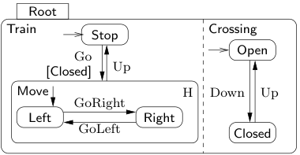

Fig. 10: A simple model of a train using the hierarchical state/event model.

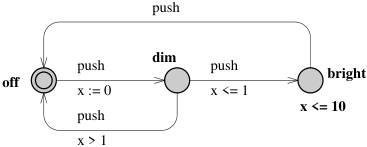

Fig. 11: A timed automaton modeling an intelligent light switch. Pushing the button twice quickly brings the switch into the bright location. The invariant in the bright location forces the transition back to the off location (an auto-off feature).

suited for the compositional backwards reachability technique. Paper B shows that whereas flattening leads to an exponential increase in verification time even when combined with the compositional backwards reachability technique, our technique is independent of the nesting depth.

## 3.3 Timed Automata

Timed automata were introduced by Alur and Dill in 1990 [AD90]. Since then, several tools supporting model checking of tool specific extensions of timed automata have appeared, e.g., Uppaal, Kronos [DOTY95], Rabbit [BLN03], RED [Wan00] and recently IF [BFG[+] 99] (the successor of Kronos). In section 5 we will take a closer look at Uppaal, since many of the techniques described in this thesis have been implemented in this particular tool.

In short, a timed automaton is a directed graph structure with a finite number of non-negative real valued auxiliary variables called clocks. Vertices of the graph, which are called locations, are annotated with invariants; edges are annotated with guards and resets of clocks. Invariants and guards are boolean combinations of simple conditions on clocks and differences between clocks. Figure 11 shows a simple timed automaton modeling an “intelligent” light switch. The switch has three locations: off, dim and bright, where off is the initial location. The idea is that when the button is pressed once, the switch moves to the dim location; If the button is pressed two times in quick succession, the switch moves to the bright location. A final press on the button will turn the light off.

--- end of page.page_number=27 ---

Introduction

14

Notice that the terms location and edge refer to the syntactic elements of a timed automaton. A concrete state of a timed automaton is a semantic element and is defined as a pair containing a location and a valuation of the clocks. The initial state of the timed automaton in the example is (off, x = 0).

There are two types of transitions between concrete states: Whenever allowed by the invariant of the current location, time can pass. The resulting delay transitions do not change the locations, but all clocks are incremented by the exact same delay. In the initial state of the example we have (off, x = 0) → (off, x = d) for any positive real d. Alternatively, if the guard of an edge is satisfied, we might trigger an edge transition. Edge transitions do not take time, i.e. the clock valuation is not changed except to reflect updates directly specified on the edge involved. Thus in the example we have (off, x = √2) → (dim, x = 0). For the sake of argument, we could introduce another clock y, which is not used by the automaton. In that case the following sequence of transitions would be valid (off, x = 0, y = 0) → (off, x = π, y = π) → (dim, x = 0, y = π).

Since clocks are continuous variables, it is not surprising that the state space of a timed automaton is uncountably infinite. It was proven in [ACD93] that model checking of TCTL, a timed extension of CTL, is decidable for timed automata. At the core of this result is the region construction for timed automata [AD90]. Since guards of a timed automaton are restricted to comparing clocks and differences of clocks to integers, it becomes impossible to distinguish certain clock valuations in a timed automaton. These clock valuations form equivalence classes called regions, see Fig. 12. It was proven that the resulting structure is bisimilar to the original timed automaton.

In practice, verification tools for timed automata use zones rather than regions for exploring the state space. A zone is a set of clock valuations definable by a conjunction of constraints on the form x ▷◁c or x − y ▷◁c, where x and y are clocks, c is a constant, and ▷◁ is one of the relational operators in {<, ≤, ≥, >}. A zone describes a union of several regions, and is thus a coarser representation of the state space. If we restrict the set of guards and invariants by disallowing negations, then we can easily restate the semantics of a timed automaton in terms of zones rather than clock valuations: A symbolic state is a pair (l, Z), where l is a location and Z is a zone. When computing the successor of a symbolic state we first compute the effect of an edge by applying the guard of the edge and then projecting the zone according to the updates on the edge. Second we compute the future of the zone, i.e., the set of states which can be reached by delaying, and apply the invariant of the target location. Figure 13 shows the first steps of a symbolic exploration of the example in Fig. 11.

Using zones, we obtain a countable representation of the state space. Here it becomes important to distinguish between diagonal-free and non-diagonal-free timed automata. The first class is the subset of timed automata where guards and invariants are limited to conjunctions of the form x ▷◁c, where ▷◁∈{<, ≤, ≥, >}, i.e. conditions on differences of clocks are not allowed. In [BBFL03, Bou03] it was proven that for diagonal-free timed automata, we can construct abstractions a, i.e.,

--- end of page.page_number=28 ---

Modeling Formalisms

15

Timed Automata: Let X be a set of clocks, and let G(X) be the set of expressions formed by the syntax

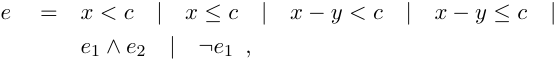

where x, y ∈ X, c is a constant, and e1 and e2 are expressions. A clock valuation is a function σ : X → R≥0. For e ∈ G(X) e |= σ is true if and only if e is satisfied by σ (defined in the natural way).

A timed automaton over a set of clocks X is a tuple (L, l0, E, I, g, u) where L is a finite set of locations, l0 ∈ L is the initial location, E ⊆ L × L is a set of edges, I : L → G(X) assigns invariants to locations, g : E → G(X) assigns guards to edges and u : E → 2[X] assigns sets of clocks to edges.

Concrete Semantics of Timed Automata: The semantics of a timed automaton (L, l0, E, I, g, u) over X can be given as a timed transition system (S, s0, −→). The set of states is S = L × R[X] , where R[X] is the set of all clock valuations over X. The initial state is (l0, σ0), where σ0(x) = 0 for all x ∈ X. The transition relation −→ is a subset of S × S such that (l, σ) −→ (l[′] , σ[′] ) if and only if ((l, σ), (l[′] , σ[′] )) is a delay transition or an edge transition. Delay transitions are on the form ((l, σ), (l, σ[′] )) such that:

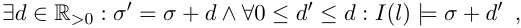

where (σ + d)(x) = σ(x) + d. Edge transitions are on the form ((l, σ), (l[′] , σ[′] )) such that:

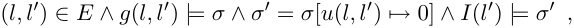

where

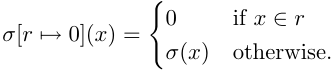

Symbolic Semantics of Timed Automata: For the symbolic semantics, we first define set of zones B(X) over a set of clocks X as the set of conjunctions of constraints on the form x ▷◁c or x − y ▷◁c, where x, y ∈ X, c is a constant, and ▷◁ is one of the relational operators in {<, ≤, ≥, >}. The symbolic state-space of a timed automaton is L × B(X). The initial symbolic state is (l0, Z0) where Z0 = {σ | σ ∈ I(l0) ∧∀x, y ∈ X : σ(x) = σ(y)}. The symbolic transition relation =⇒ is a relation between symbolic states s.t. (l, Z) =⇒ (l[′] , Z[′] ) if and only if (l, l[′] ) ∈ E and Z[′] = reset(u(l, l[′] ), Z ∧g(l, l[′] ))[↑] ∧I(l[′] ), where reset(r, Z) = {σ[r �→ 0] | σ ∈ Z} and Z[↑] = {σ + d | σ ∈ Z ∧ d ∈ R≥0}.

--- end of page.page_number=29 ---

Introduction

16

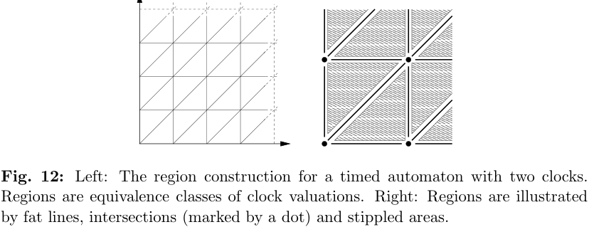

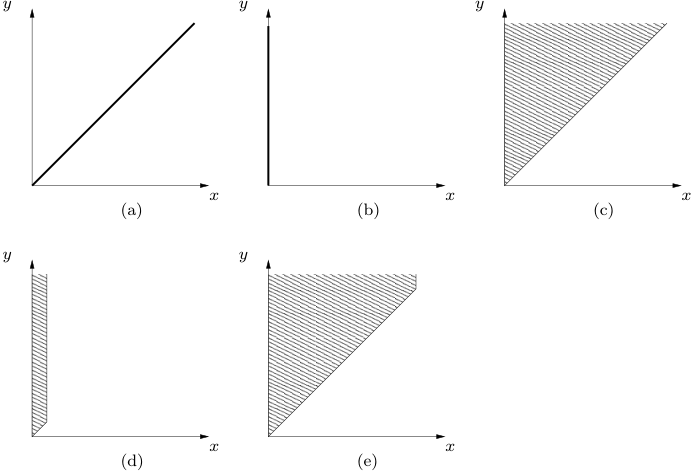

Fig. 13: The zones encountered during the first steps of a symbolic exploration of the light switch from Fig. 11 with the addition of an extra clock y: (a) Delaying in location off ; (b) resetting x to zero while following the edge to location dim; (c) delaying the zone; (d) applying the guard x ≤ 1 from the edge to location bright; (e) delaying and applying the invariant x ≤ 10 in location bright.

--- end of page.page_number=30 ---

Modeling Formalisms

17

functions from zones to zones, such that Z ⊆ a(Z) and the resulting abstract symbolic transition system is finite and bisimilar to the original timed automaton. Such abstractions exist and are inspired by a similar abstraction in the region representation: Intuitively, if a clock x is never compared to any constant bigger than cx in any guard or invariant of the timed automaton, then once x is bigger than cx, the exact value of x does not matter (it has no influence on the behaviour of the automaton); only the fact that it is bigger than cx is important.

It was shown in [Bou03] that for non-diagonal-free timed automata such an abstraction does not exist for zones, although it does at the region level. For most practical purposes the class of diagonal-free timed automata suffices and zones are the preferred representation of the state-space of timed automata.

Notice that in the worst case the region representation is actually better than the zone representation since the set of all zones is not a partitioning of the set of clock valuations and hence there are more zones than regions. In practice, however, zones are much more effective than regions. Also, the region representation is sensitive to the size of the constants used in the timed automaton, e.g. if all constants are multiplied by a factor, then this has a profound impact on the number of regions, whereas the zone representation has the same size.

Timed automata can be composed to form networks of concurrent and communicating timed automata. A state then consists of a location vector and a clock valuation. In this thesis, the difference between a network of timed automata and a timed automaton is often not that important. Whenever possible, the discussion is limited to a single timed automaton.

There is an alternative to the continuous time interpretation of timed automate, namely, discrete time interpretation. In this interpretation, clocks have the nonnegative integers as their domain and time passes in discrete steps causing all clocks to be incremented by one. If guards and invariants are restricted to non-strict bounds on clocks (so called closed timed automata), then the problem of location reachability is equivalent in the continuous time interpretation and the discrete time interpretation. The benefit of the discrete time interpretation is that symbolic model checking techniques like the use of ROBDDs are directly applicable. The downside is that direct application of these techniques suffers from the size of the maximum constants to which clocks are compared – the region construction suffers from the same effect, but the zone construction is (at least to some extent) immune to this problem.

## 3.4 Priced Timed Automata

During the Verification of Hybrid Systems[3] (VHS) project, a now concluded EU project with several partners from academia[4] and industry throughout Europe, it was discovered that most of the cases provided by the industrial partners were ac-

> 3 http://www-verimag.imag.fr/VHS/main.html

> 4 Many of the VHS partners now participate in the AMETIST project, see http://ametist.cs.utwente.nl/

--- end of page.page_number=31 ---

Introduction

18

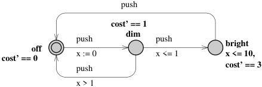

Fig. 14: A model of the light switch from Fig. 11 annotated with a cost function modeling power consumption. There is no cost associated with staying in location off. In location dim, the price is one cost unit per time unit whereas in location bright the cost rate is 3.

tually scheduling problems rather than verification problems. A static scheduling problem can be reduced to a verification problem by building a model of the tasks to be scheduled and formulating the schedulability of the tasks as a reachability property or in general a model checking problem. This can be done with any model checking tool. The result is typically a trace containing information about how the tasks should be scheduled. The downside of this approach is that the model checker will only find a schedule, and there is no guarantee that this is the best schedule or even a good schedule.

Before we can find optimal schedules, we must be able to express what optimality means. Papers D and E of this thesis address this problem by introducing Linearly Priced Timed Automata and Uniformly Priced Timed Automata, respectively. A Priced Timed Automaton is a timed automaton with the addition of a single continuous non-negative monotonously growing cost variable. The cost variable can be incremented by both continuous and discrete state changes in the timed automaton, but cannot be tested upon by guards or restricted by invariants. The cost variable is really a property of the path by which a given state has been reached, and the aim is to find the path to some goal state with the lowest possible cost. Figure 14 shows a priced timed automaton of the light switch example in Fig. 11, where the cost is intended to model power consumption.

In Uniformly Priced Timed Automata (UPTA) the rate of the cost variable (i.e. the cost of delaying one time unit) is fixed. UPTA have the nice property that existing data structures used for model checking timed automata can be reused, see paper E. Paper D shows that the optimal reachability problem for the class of Linearly Priced Timed Automata, where the rate of the cost is determined by the location, is in fact decidable. This is not at all obvious, since the reachability problem for constant slope timed automata, which are similar to timed automata except that the rate of the continuous variables is determined by the location, is not decidable. Paper F addresses the problem of efficiently representing and manipulating states of an LPTA.

In [ALP01], Alur et al. independently introduced the class of weighted timed automata which is essentially the same as our class of linearly priced timed automata,

--- end of page.page_number=32 ---

Data Structures

19

although the algorithm for finding optimal paths described in [ALP01] is different from ours.

## 4 Data Structures

Much research is invested in finding good data structures for representing individual states, sets of states or transition relations for various modeling formalisms. A good data structure must not only allow for compact representation of the state-space, but must also support the necessary operations for performing reachability analysis or model checking. In the following, we will take a brief look at the data structures used in the papers of this thesis.

## 4.1 Reduced Ordered Binary Decision Diagrams

A Reduced Ordered Binary Decision Diagram (ROBDD) (often referred to as simply Binary Decision Diagram (BDD)) is a data structure for representing Boolean functions, see Fig. 15 for an example. Given an ordering on the variables of the Boolean function, the representation is canonical. Most compositions of Boolean functions like conjunction and disjunction can be efficiently implemented using ROBDDs (linear runtime in the number of nodes of the ROBDDs involved). Even first order existential and universal quantification can be efficiently implemented on ROBDDs. See the boxed material for a precise definition of ROBDDs.

ROBDDs were discovered by Randal Bryant in 1986 [Bry86]. They quickly became the data structure of choice in hardware verification. The idea is to represent the relation between input and output signals by encoding the characteristic function of the relation as an ROBDD. Due to the canonicity property of ROBDDs, it is easy to see if two digital circuits have the same functional behaviour. One weakness of ROBDDs is the dependency on the variable ordering: The size of the ROBDD heavily depends on the variable ordering, and some functions do not have a compact ROBDD representation no matter which variable ordering is chosen: Multiplication is known not to have any polynomial size ROBDD representation.

In model checking, ROBDDs are used to represent transition relations and sets of states. Typical operations like computing the set of successors of a set of states are directly implementable using ROBDDs. Papers A and B use ROBDDs to implement the aforementioned CBR technique. The compositional nature of CBR fits well within the world of ROBDDs, since the small set of components which are included in the analysis at the beginning only depend on a subset of the ROBDD variables, thus resulting in a smaller ROBDD representation. Even in the case where we end up including all components into the analysis, we might still have gained something: Typically, the ROBDD representation of the set of states that can reach a goal state is small at the beginning (when it only contains the goal states), grows in size as more states are added, and becomes smaller again as we get closer to the fixed point. By not including all predecessors at once, we avoid the peak in the ROBDD size. This is a side effect of CBR, but there exists plenty of work trying to achieve this

--- end of page.page_number=33 ---

Introduction

20

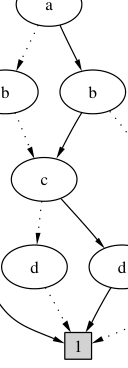

Figure 15: An ROBDD over four Boolean variables, a, b, c, and d representing the Boolean function (a = b) =⇒ (c = d). Each path from the root to a terminal node represents a truth-assignment. Dashed edges represent the Boolean value false and solid edges represent the Boolean value true. The terminal indicates whether the function maps the truth assignment to true or false. In this figure, only paths to the true-terminal are shown – all remaining paths go to the false-terminal.

Reduced Ordered Binary Decision Diagrams, ROBDDs for short, are collapsed binary decision trees, with an enforced ordering on the nodes and a number of reduction rules applied. A BDD over k Boolean variables can be viewed as representing a Boolean function B[k] → B.

More precisely, let V be a set of Boolean variables. A Binary Decision Diagram over V is a DAG with one or two terminals, true and false, one root, and nonterminals n = (var(n), left(n), right(n)) where var(n) ∈ V and there are two edges from n to left(n) and right(n) (representing the true and false interpretation of v). An Ordered Binary Decision Diagram (OBDD) over V and total order ≻⊂ V × V is a BDD over V where all paths from the root to a terminal respect ≻, i.e. for all non-terminals n and m, where m is a child of n, we have var(n) ≻ var(m). A Reduced Ordered Binary Decision Diagram over V and ≻ is an OBDD satisfying the following conditions:

1. The left and right child of a non-terminal are not the same, i.e. for all non-terminals n e have left(n) ̸= right(n).

2. No two nodes are equal, i.e. ∀n1, n2 : var(n1) = var(n2) ∧ left(n1) = left(n2) ∧ right(n1) = right(n2) =⇒ n1 = n2.

--- end of page.page_number=34 ---

Data Structures

21

effect with special image computation operators (this is often referred to as guided model checking, see e.g. [BRS00], and is not the same as the guiding techniques discussed in paper D, E and F).

## 4.2 Bound Matrices

Recall that a zone of a timed automaton is a set of clock valuations definable by a conjunction of constraints on the form x ▷◁c or x − y ▷◁c, where x and y are clocks, c is a constant, and ▷◁ is one of the relational operators in {<, ≤, ≥, >}.

There are several representations of zones. The best known is the difference bound matrix or DBM for short [Dil89, Bel58]. A DBM is a square matrix M = ⟨mi,j, ≺i,j⟩0≤i,j≤n such that mi,j ∈ Z and ≺i,j∈{<, ≤} or mi,j = ∞ and ≺i,j=<. M represents the zone [[M ]] which is defined by [[M ]] = {σ | ∀0 ≤ i, j ≤ n : σ(xi) − σ(xj) ≺i,j mi,j}, where {xi | 1 ≤ i ≤ n} is the set of clocks, and x0 is a clock which by definition is 0 for all valuations. DBMs are not a canonical representations of zones, but a normal form can be computed by considering the DBM as an adjacency matrix of a weighted directed graph (the constraint graph) and computing its all pairs shortest path closure. In particular, if M = ⟨mi,j, ≺i,j⟩0≤i,j≤n is a DBM in normal form, then it satisfies the triangular inequality, that is, for every 0 ≤ i, j, k ≤ n, we have that (mi,j, ≺i,j) ≤ (mi,k, ≺i,k) + (mk,j, ≺k,j) where comparisons and additions are as:

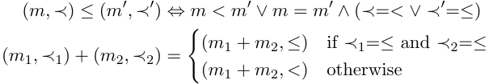

Any DBM can be brought into its normal form in O(n[3] ) time using the wellknown Floyd-Warshall algorithm for the all-pairs shortest path problem. Given a DBM in normal form, all operations needed to compute a successor according to the abstract symbolic transition relation of a timed automaton can be efficiently implemented, see Tab. 2. Instead of recomputing the normal form after each operation, it is often more efficient to use a specialised version of the various operations which maintain the normal form of the DBM [Rok93]. For instance, it is possible to compute the conjunction of a DBM in normal form and a guard in O(m · n[2] ) time for m ≤ n, where m is the number of clocks in the guard. This should be compared to the O(n[3] ) runtime of first applying the guard and then recomputing the normal form. Using DBMs and the symbolic semantics given in section 3.3, the reachability question for timed automata can be efficiently settled using the algorithm in Fig. 16.

## 4.3 Clock Difference Diagrams

In recent years, several approaches to fully symbolic model checking of timed automata have been investigated. Most of these try to apply ROBDDs or similar data structures and thus copy the approach which has proven to be so successful in

--- end of page.page_number=35 ---

Introduction

22

Tab. 2: The runtime of various operations on DBMs. Often the operations can be modified to keep the DBM in normal form, which is faster (third column) than to recompute the normal form using the all-pairs shortest path algorithm.

|Operation|Runtime|Normal form|
|---|---|---|
|Future|O(n)|O(n)|
|Reset|O(n)|O(n)|
|Inclusion|O(n2)|O(n2)|
|Conjunction with DBM|O(n2)|O(n3)|
|Conjunction with guard g|O(|g|)|O(|g| ·n2)|
|Extrapolation|O(n2)|O(n3)|
|Normal form|O(n3)|N/A|

proc reach(L, l0, E, I, g, u) ≡ wait = {(l0, Z0)} Z0 is the initial zone passed = ∅ while wait = ∅ do select and remove a state (l, Z) from wait if ¬∃(l[′] , Z[′] ) ∈ passed : l = l[′] ∧ Z ⊆ Z[′] then = passed passed ∪{(l, Z[′] )} wait = wait ∪{(l[′′] , Z[′′] ) : (l, Z) =⇒ (l[′′] , Z[′′] )} Where =⇒ is the symbolic transition relation .

Fig. 16: The reachability algorithm for timed automata. Two sets of states, wait and passed, are maintained during the exploration. The waiting set contains states that are reachable, but have not yet been explored. The passed set contains states which have been explored. When the algorithm terminates, the passed set will contain all reachable states of the timed automaton.

--- end of page.page_number=36 ---

Data Structures

23

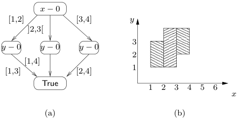

Fig. 17: The nodes on a CDD are labelled with clock differences, and the outgoing edges partition R (edges to the False terminal have been omitted). Each path from the root to a terminal corresponds to a zone. The CDD on the left corresponds to the set of clock valuations on the right.

the untimed case. Rabbit [BLN03] uses a discrete time interpretation of timed automata and can thus encode the transition relation directly using ROBDDs. NDDs [ABK[+] 97] are regular BDDs used to encode the region graph of a dense-time timed automaton. CDDs [BLP[+] 99], DDDs [MLAH99b] and CDRs [Wan01] are all variations of the same idea (discovered at roughly the same time by several research groups around the world). In paper C of this thesis the clock difference diagram, or CDD for short, is introduced.

Structurally, a CDD is very similar to a BDD, see Fig. 17. The two main differences are that:

- The nodes of the DAG are labelled with pairs of clocks which are interpreted as clock differences, rather than Boolean variables. I.e. elements in X × (X ∪ {x0}), where x0 is a clock which is zero in all valuations.

- Any intermediate node can have two or more out-edges, each labelled with a non-empty, convex, integer-bounded subset of the real line, which together form a partitioning of R.

Like for BDDs, we say that a CDD is ordered if there exist a total order of X × (X ∪{x0}) such that all paths from the root to a terminal respect this ordering. A CDD is reduced if:

- There are no duplicate nodes.

- There are no trivial edges, i.e. nodes with only one outgoing edge.

- The intervals on the edges are maximal, i.e. for two edges between the same two nodes, either the intervals are the same or the union is not an interval.

Semantically, we might view a CDD as a function f : R[X] → B, which could be the characteristic function of a set of clock valuations. Contrary to DBMs (which are limited to convex unions of regions), CDDs can represent arbitrary unions of

--- end of page.page_number=37 ---

Introduction

24

regions. Implementing common operations like negation, set union, set intersection, etc. is easy and can be achieved in time polynomial to the size of the argument CDDs. Contrary to ROBDDs, a reduced and ordered CDD is not a canonical representation. The literature contains a few conjectures of normal forms for CDDs and DDDs, but these are very expensive to compute and do not have practical value. A CDD can be brought into a semi-canonical form by eliminating infeasible paths (paths for which there are no clock valuations satisfying all constraints of the path) from the CDD. In this form, a tautology is uniquely represented by the true terminal and an unsatisfiable function by the false terminal. By combining CDDs and BDDs into one data structure, one can perform fully symbolic model checking of timed automata. Unfortunately, existential quantification takes exponential time in the size of the CDD (whereas it is polynomial for ROBDDs). Existential quantification is essential for computing the future of a CDD (i.e. the delay transitions).

In paper C of this thesis we focus on an alternative use of CDDs, namely as a replacement for DBMs when storing the set of visited symbolic states.

## 4.4 Priced Zones

In section 3.4 we introduced the class of Priced Timed Automata and the two subclasses Uniformly Priced Timed Automata and Linearly Priced Timed Automata. In this section we will take a brief look at data structures needed to represent symbolic states (sets of concrete states encountered during reachability analysis) of these two subclasses. What is needed is a way to represent and manipulate priced symbolic states (A, cost), where A ⊆ L × R[X] is a set of concrete states and cost : A → R is a function assigning costs to the concrete states of A. Remembering that the aim is to find the optimal or cheapest path to any goal state, the cost function should return the lowest cost of reaching any particular concrete state in A via the path at which end we found A. To exemplify, Fig. 18 shows cost for various symbolic states encountered during the analysis of the cost annotated version of the light switch in Fig. 14.

Uniformly Priced Timed Automata have the nice property that existing data structures can be reused to represent any priced symbolic state encountered during the analysis: Let the cost rate be r. If r = 0, then cost is simply an integer and a symbolic state is then a triple (l, c, Z) with location l, cost c and zone Z. If r = 1, then cost is just another clock u and a symbolic state is of the form (l, Z), where Z is a zone over X ∪{u}, i.e. A = {(l, σ) | ∃c : σ[u �→ c] ∈ Z} and cost(l, σ) = inf{c | σ[u �→ c] ∈ Z}. If r > 1, then the UPTA can be translated to an equivalent UPTA with cost rate 1 by increasing all constants with which clocks are compared by a factor of r (see paper E of this thesis for further details).

For Linearly Priced Timed Automata the cost cannot be represented using regular zones. Therefore we introduce priced zones being zones with the addition of a linear plan over the zone representing the cost. Unfortunately, priced zones are not closed under delay and reset operations and the zone must sometimes be split into several smaller zones. Figure 18(c) shows an example of a zone where a single linear plan is

--- end of page.page_number=38 ---

Data Structures

25

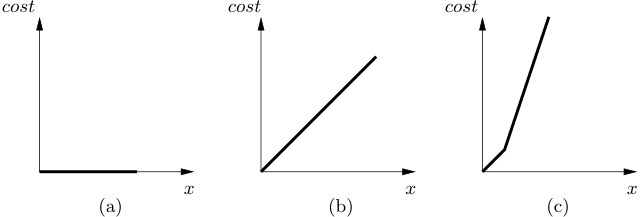

Fig. 18: Symbolic states encountered during exploration of the LPTA in Fig. 14: (a) the symbolic state while in location off ; (b) the symbolic state after resetting x and delaying with cost rate 1; (c) the symbolic state after applying the guard x ≤ 1 and delaying with cost rate 3.

not sufficient to represent the cost and thus we need to split the zone into two smaller zones (compare this to Fig. 13(e) which shows the unpriced zone in the presence of a second clock y). The main contribution of paper F of this thesis is the introduction of priced zones and operations on priced zones which are essential for an effective algorithm for finding cost optimal paths in linearly priced timed automata.

## 4.5 Minimal Constraint Form

For a model with n clocks, the size of DBMs representing zones in this model is (n + 1)[2] . In [LLPY97], an alternative representation of zones is given, which rather than storing constraints between any pair of clocks, only stores a provably minimal number of constraints such that the complete DBM can still be reconstructed by using the (all pairs shortest path) closure operation.

The idea is based on the triangular inequality of the closed form of DBMs, that is, for every 0 ≤ i, j, k ≤ n, we have that (mi,j, ≺i,j) ≤ (mi,k, ≺i,k) + (mk,j, ≺k,j). If for a particular DBM and particular values of i, j and k this is an equality rather than an inequality, then (mi,j, ≺i,j) follows from (mi,k, ≺i,k) and (mk,j, ≺k,j), and hence there is no need to store the former. In fact, this is only true as long as all cycles in the DBM have positive length, i.e., there is no sequence of indices i1, i2, . . . il s.t. (mi1,i2, ≺i1,i2) + (mi2,i3, ≺i2,i3) + · · · + (mil,i1, ≺il,i1) ≤ (0, ≤).

If there are zero-cycles in the DBM, then we can have a situation like the one depicted in Fig. 19. Let (mb,i, ≺b,i) = (mb,a, ≺b,a) + (ma,i, ≺a,i) and (ma,i, ≺a,i) = (ma,b, ≺a,b) + (mb,i, ≺b,i). Clearly, both the contraints on xb − xi and on xa − xi are redundant, but removing both will make it impossible to recompute either of them. Clearly, this particular situation requires that (ma,b, ≺a,b)+(mb,a, ≺b,a) = (0, ≤), i.e., we have a zero-cycle. The solution is to form classes of clocks which happen to be on a common zero-cycle (in this particular case we have two classes: {xa, xb} and {xi}). A zero-cycle free graph can be formed by removing all clocks from the graph except a single clock from each class (the representative). It is safe to remove redundant edges from the resulting graph. A minimal constraint form can be obtained for the original

--- end of page.page_number=39 ---

Introduction

26

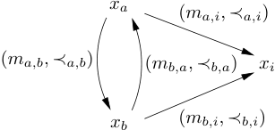

Fig. 19: A constraint graph illustrating a zone over three clocks xa, xb, and xi. An edge from a node v to a node u labelled with (c, ≺) corresponds to a constraints v − u ≺ c.

graph by adding the constraints from a single zero-cycle from each class. Given an ordering on the clocks, this representation is also a canonical representation of the zone.

In paper C, zones are first brought into the minimal constraint form before they are encoded as CDDs, thus reducing the size of the resulting CDD. In paper F, the problem of finding the infimum cost in a priced zone is reduced to an LP problem. In this translation, one wants to reduce the size of the LP problem by using the smallest number of constraints possible to describe the zone. This is exactly the minimal constraint form of the zone.

## 5 The Making of Uppaal

Uppaal is an integrated tool environment for modeling, validation and verification of real-time systems modeled as networks of timed automata, extended with data types (bounded integers, arrays, etc.). From the Uppaal web page.

Uppaal is jointly developed by the Department of Computer Science at Uppsala University and Basic Research in Computer Science at Aalborg University. Over time, many people have asked how Uppaal has been developed, what data structures are used, and how it works. Since the author of this thesis has been heavily involved in the development of this tool, the reader is hereby invited to take a short look behind the curtains.

Almost from the beginning in 1994/1995, the development of Uppaal has been case study driven. Many of the features of Uppaal have been implemented as a direct result of certain case studies, e.g., committed locations [BGK[+] 96], urgent locations [LPY97b], integer arrays, and broadcast synchronisation.[5]

A milestone in the history of Uppaal is the modeling and analysis of an audio/video protocol used by the company Bang & Olufsen [HSLL97]. This protocol was known to have a bug (messages were lost in the communication), but due to the complextity of the implementation the bug could not be located with traditional

> 5 http://ametist.cs.utwente.nl/RESEARCH/CS2-TERMA.html

--- end of page.page_number=40 ---

The Making of Uppaal

27

methods. Uppaal was used to analyse a model of the protocol, and an error trace of almost 2000 steps was found. With the error trace in hand, it was possible to consistently reproduce the error in the laboratory, thus making it much easier to fix the problem.

## 5.1 The Tool

## Goals

The goal of Uppaal has always been to serve as a platform for research in timed automata technology. As such, it is important for the tool to provide a flexible architecture that allows experimentation. It should allow orthogonal features to be integrated in an orthogonal manner to evaluate various techniques within a single framework and investigate how they influence each other.

At the same time we are committed to provide a useful and efficient tool to academia. A tool which can be used in education and for practical verification purposes. There are several tools (e.g TIMES [AFM[+] 03] and Moby/PLC [TD98]) which use the verification back-end of Uppaal, and provide alternative modeling languages or functionality to the user. In the future we hope to make it easier for third party developers to reuse the engine in their tools.

We neither claim nor expect Uppaal to support each and every technique in existence. For instance, the choice of supporting rich data types in the input language (e.g. bounded integer variables and arrays) makes explicit backwards reachability analysis difficult and ineffective, which is one of the reasons this technique is not supported.[6]

## Architecture

As can be seen in Fig. 20, Uppaal is based on a client-server architecture where the graphical user interface (GUI) is acting as the client. The GUI provides an easy to use editor to draw extended timed automata, a simulator, and an interface to interact with the model checker. The interesting parts of Uppaal are in the server which takes care of parsing the model, interpreting it, and provides model checking functionality. The client and the server might run on the same physical machine or on different machines in which case they communicate via a TCP/IP connection. Experienced users can also use a command line interface (CLI) to interact directly with the model checker. In the following we will take a closer look at the architecture of the server.

The seemingly simple zone based reachability algorithm for timed automata shown in Fig. 16 turns out to be rather complicated when implemented. It has been extended and optimised to reduce the runtime and memory usage of the tool.

> 6 In fact, the 1.x versions of Uppaal from 1995 did use backwards reachability analysis, but this approach was abandoned in the 2.x series in favor of more operations on the bounded integer variables.

--- end of page.page_number=41 ---

Introduction

28

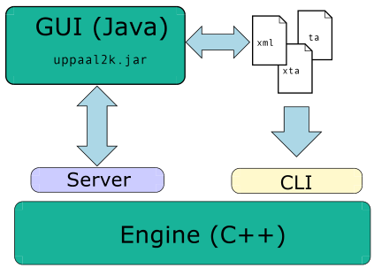

Fig. 20: There are two interfaces to the verification engine: A command line interface (CLI) and a graphical user interface (GUI). The GUI provides editing and simulation facilities and acts as a front-end to the verification engine. The interaction between the GUI and the verification engine is based on a client-server architecture, where the GUI is the client and the model checking engine is the server. The GUI and the CLI share a number of common formats.

Most of these optimisations are optional since they involve a tradeoff between speed and memory usage.

The architecture of the Uppaal engine has changed a lot over time. Some years ago Uppaal was a more or less straightforward implementation of the timed automaton reachability algorithm annotated with conditional tests on features or options. Although it was simple, it had several disadvantages:

- The core reachability algorithm became more and more complicated as new options were added.

- There was an overhead involved in checking if an option was enabled. This might not seem like much, but when this is done inside the exploration loop the overhead adds up.

- Some experimental designs and extensions required major changes due to new algorithms. Thus certain parts of the code were duplicated, which in turn complicated maintenance.

The internals of Uppaal are constantly refactored in order to facilitate new designs and algorithms, see Fig. 21 for the latest incarnation. The main goals of the design are speed and flexibility. The bottom layer providing the system and symbolic state representations has only seen minimal architectural changes over the years. In fact, the code where most options are implemented is in the state manipulation and state space representation components.

The state manipulation components implement fundamental operations on symbolic states such as evaluating a state property or computing the delay successors. All state manipulation components implement a common interface (called Filter )

--- end of page.page_number=42 ---

The Making of Uppaal

29

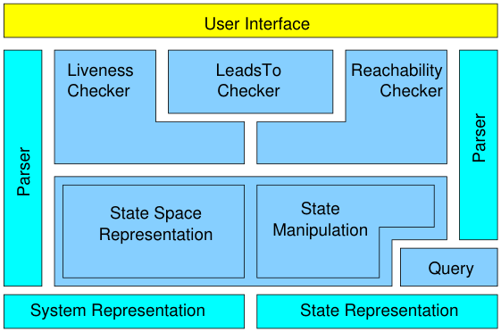

Fig. 21: The Uppaal engine uses a layered architecture. Components for representing the input model and a symbolic state are placed at the bottom. The state space representations are a set of symbolic states and together with the state operations they form the next layer. The various checkers combine these operations to provide the complex functionality needed. This functionality is made available via either a command line interface or a graphical user interface.

which allows them to be chained together to form more advanced operations. State space representation components are used to represent sets of symbolic states. Again, there is a common interface (called Buffer ) which all state space representation components implement. Figure 22 shows the UML class diagram for these interfaces.

The verification components, such as the reachability checker, are compound filters that take the initial state as input and generate counter examples. For instance, the reachability checker is implemented by composing a number of filters into a graph structure resembling a flow-chart, see Fig. 23. The compound filter implements the zone based reachability algorithm for timed automata. It consists of filters computing the edge successors (Transition and Successor), the delay successors (Delay and Normalisation), and the unified passed and waiting list buffer (PWList). Additional components include a filter for generating progress information (e.g. throughput and number of states explored), a filter implementing active clock reduction [CS96], and a filter storing information needed to generate diagnostic traces. Notice that some of the components are optional. If disabled, a filter can be bypassed completely and does not incur any overhead.

The details of the passed and waiting list interaction are abstracted by a single buffer component, the PWList. To summarise, the passed list keeps a list of explored reachable states whereas the waiting list contains unexplored reachable states. Both are hash tables to facilitate identification of duplicate states. Traditionally, successors were added to the waiting list as they were computed and then later removed from the waiting list compared to and – if not previously explored – added to the

--- end of page.page_number=43 ---

Introduction

30

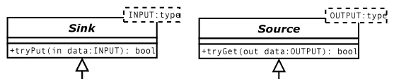

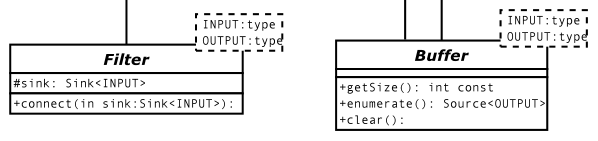

Fig. 22: Class diagram of parameterised interfaces for filters and buffers. The return value of tryPut and tryGet is used to indicate whether the operation succeeded, using whatever definition of success is appropriate for the operation.

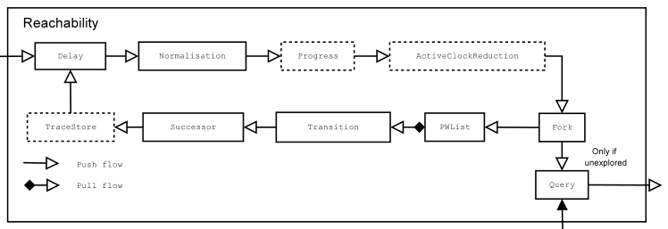

Fig. 23: The reachability checker is actually a compound object consisting of a pipeline of filters. Optional elements are dotted.

passed list and explored. In the presence of actual implementations of the waiting list and the passed list, an implementation of a PWList component could look something like this (the Boolean return value indicates whether the operation succeeded; tryGet succeeds if the buffer is not empty, whereas tryPut succeeds if the state was not already in the buffer):

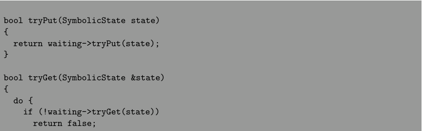

--- end of page.page_number=44 ---

The Making of Uppaal

31

} while (!passed->tryPut(state)); return true;

}

The downside of this implementation is that many of the states on the waiting list might have been explored already, but this is not discovered until they are removed from the waiting list and compared to the passed list, thus wasting memory and increasing the pressure on the waiting list hash table. On the other hand, adding them to the waiting list and the passed list at the same time also wastes memory. One of the recent changes is the introduction of a shared passed and waiting list implementation [DBLY03] merging the two hash tables and letting the passed list and the waiting list contain references to the entries in the hash table.

The number of unnecessary copy operations during exploration has been reduced as much as possible. In fact, a symbolic state is only copied twice during exploration. The first time is when it is inserted into the PWList, since the PWList might use alternative and more compact representations than the rest of the pipeline. The original state is then used for evaluating the state property using the Query filter. This is destructive as the zone is modified by this operation and the state is discarded after this step. The second is when constructing the successor. In fact, one does not retrieve a state from the PWList directly but rather a reference to a state. The state can then be copied directly from the internal representation used in the PWList to the memory reserved for the successor.

The benefits of using a common filter and buffer interface are flexibility, code reuse, and acceptable efficiency. Any component can be replaced at runtime with an alternate implementation providing different tradeoffs. Stages in the pipeline can be skipped completely with no overhead. The same components can be used and combined for different purposes. For instance, the Successor filter is used by both the reachability checker, the liveness checker, the deadlock checker, and the trace generator.

## 5.2 The Umbrella

Today, Uppaal is more than just a tool. Uppaal is an umbrella for various realtime related projects. Some of these projects are covered by this thesis, others are not. In the following we will briefly look at some of the projects which for one reason or another have not yet been included in the official version of Uppaal.

The main Uppaal code base is fairly stable. Most of the interesting work happens in branches with minimal coordination and often as joint work with visitors. Sometimes these branches bear fruit and sometimes they do not. If they do, they will be integrated when ready by refactoring the stable code base to facilitate the additions from the branch.

--- end of page.page_number=45 ---

Introduction

32

## Distributed Uppaal

Real time model checking is a time and memory consuming task, quite often reaching the limits of both computers and the patience of users. An increasingly common solution to this situation is to use the combined power of normal computers connected in a cluster. Good results were achieved for Uppaal by distributing both the reachability algorithm and the main data structures. Most of this work was done in the fall of 1999 when Thomas S. Hune, who was a Ph.D. student at Arhus University at that time, and Gerd Behrmann visited Frits Vaandrager’s group in Nijmegen, see [BHV00, Beh02, Beh03].

At the core of Uppaal we find the state-space exploration algorithm for timed automata. To summarise, we might think of this as a variation of searching the states (nodes) of an oriented graph. The waiting list contains the states that have been encountered by the algorithm, but have not been explored yet, i.e. the successors have not been determined. The passed list contains all states that have been explored. The algorithm takes a state from the waiting list, compares it with the passed list, and in case it has not been explored, the state itself is added to the passed list while the successors are added to the waiting list. The one data structure responsible for the potentially huge memory consumption is the hash table used to implement both the passed list and the waiting list.

The distributed version of this algorithm is similar. Each node (processing unit) in the cluster will hold fragments of both the waiting list and the passed list according to a distribution function mapping states to nodes. In the beginning, the distributed waiting list will only hold the initial state. Whichever node hosts the initial state will compare it to its empty passed list fragment and then explore it. Now, the successors are distributed according to the distribution function and put into the waiting list fragment on the respective nodes. This process will be repeated, but now several nodes contain states in their fragment of the waiting list and quickly all nodes become busy exploring their part of the state space. The algorithm terminates when all waiting list fragments are empty and no states are in the process of being transferred between nodes.

The distribution function is in fact a hash function. It distributes states uniformly over its range and hence implements what is called random load balancing. Since states are equally likely to be mapped to any node, all nodes will receive approximately the same number of states and hence the load will be equally distributed.

This approach is very similar to the one taken by [SD97]. The difference is that Uppaal uses symbolic states, each covering (infinitely) many concrete states. In order to achieve optimal performance, the lookup performed on the passed list is actually an inclusion check. An unexplored symbolic state taken from the waiting list is compared with all the explored symbolic states on the passed list, and only if none of those states cover (include) the unexplored symbolic state it is explored. For this to work in the distributed case, the distribution function needs to guarantee that potentially overlapping symbolic states are mapped to the same node in the cluster.

--- end of page.page_number=46 ---

The Making of Uppaal

33

A symbolic state can actually be divided into a discrete part and a continuous part. By only basing the distribution on the discrete part, the above is ensured.

Depending on the search order, building the complete reachable state-space can result in varying number of states being explored. For instance, let s and t be two symbolic states such that s includes t. Thus, if s is encountered before t, t will not be explored because s is already on the passed list and hence covers t. On the other hand, if we encounter t first, both states will be explored. Experiments have shown that breadth first order is close to optimal when building the complete reachable state-space. Unfortunately, ensuring strict breadth first order in a distributed setting requires synchronising the nodes, which is undesirable. Instead, we order the states in each waiting list fragment according to their distance from the initial state, exploring those with the smallest distance first. This results in an approximation of the breadth first order. Experiments have shown that this order drastically reduces the number of explored states compared to simply using a FIFO order.

This version of Uppaal has been used on a Sun Enterprise 10000 with 24 CPUs and on a Linux Beowulf cluster with 10 nodes. Good speedups have been observed on both platforms when verifying large systems (around 80% of optimal at 23 CPUs on the Enterprise 10000).

Although the approach taken is orthogonal to most of the existing techniques used in Uppaal, no official release has been made. The current implementation can be used for little more than benchmarking. The main obstacle in releasing a distributed version is the dependency on libraries. The implementation relies on the Message Passing Interface (MPI), a standard interface to message passing libraries. Although Uppaal can be used with any MPI library, it needs to be linked with the library at compile time. This makes it difficult to release, as Uppaal is only released in binary form.

## Stopwatches in Uppaal

Stopwatch automata are very similar to timed automata, except that the rate of each clock can be set to either 0 or 1, depending on the current state. In fact, the two models look so similar that one could be tempted to implement stopwatch automata in Uppaal. Unfortunately, the reachability problem for stopwatch automata is undecidable. In fact, in [CL00] it was shown that stopwatch automata have the same expressive power as linear hybrid automata. Of course, this did not stop us from implementing them.

The approach taken is to use a new delay operation on DBMs. The resulting DBM is an over-approximation of the actual set of delay successors, hence the computed reachable state-space is an over-approximation of the reachable state-space. Anyway, using this approach it was possible to show a number of interesting properties of linear hybrid systems previously checked using HyTech [HHWT97b], but at a fraction of the time.

Although stopwatch automata in principle could be integrated into the regular version of Uppaal, this version has been dormant for some time.

--- end of page.page_number=47 ---

Introduction

34

## Priced Timed Automata in Uppaal

The terms guided Uppaal and priced Uppaal have both been used to describe versions of Uppaal related to scheduling and optimal paths. In principle, the term guided refers to the use of branch and bound techniques to select which state to explore next, and priced refers to the fact that the input model is some version of priced timed automata. In practice, guided Uppaal is the UPTA version and priced Uppaal is the LPTA version.

UPTA support in Uppaal is relatively easy, since the zone of a state of an UPTA can be represented as a regular DBM with an extra clock, which keeps track of the time. The main contribution in the UPTA implementation is the use of branch and bound techniques to efficiently find the optimal path, and the use of various heuristics to speed up the process. It should be relatively easy to integrate this into the regular version of Uppaal.

LPTA support in Uppaal is based on priced zones. Although an extension of DBMs, the use of priced zones changes a fundamental data structure in Uppaal. At the moment it is unlikely that this feature will be integrated into the rest of Uppaal.

## Other Projects

There are many other Uppaal related projects, such as parameterised Uppaal [HRSV02], Lego Mindstorm integration, C in Uppaal, hierarchical TA [DM01], animation [ADY00], symmetries [HBL[+] 03], acceleration [HL02], etc. The tool has also been used in numerous case studies. The reader is referred to the Uppaal website at http://www.uppaal.com/ for a complete list of publications.

Of special interest to this thesis is the use of the compositional backwards reachability (CBR) technique in Uppaal [Lar02]. The main idea is to use a semi-symbolic representation of sets of location vectors of a network of timed automata. The set is represented by a vector with wildcards in some of the entries that might be substituted by any location of that component. When computing the set of predecessors, only transitions that can be taken regardless of the “unknown” components, i.e. the components for which the vector contains a wildcard, will be considered. The main obstacle in this approach is that time is a global phenomenon in a network of timed automata and any automaton might cause time-locks. Thus, it becomes difficult to reason about the behaviour of one component while not considering the behaviour of the other components.

CDDs are currently used to represent non-convex sets of regions of the timed automaton. This is the case during deadlock detection. An experimental version of a passed list implementation using CDDs exists, which might be integrated into the regular version. In principal, CDDs can represent the transition relation of the timed automaton and one could use all the existing symbolic model checking techniques based on ROBDDs to model check timed automata. The main obstacle is that existential quantification on CDDs is very expensive. Without this operation, most

--- end of page.page_number=48 ---

Thesis Summary

35

ROBDDs based algorithms cannot be applied.

## 6 Thesis Summary

## Paper A: Verification of Large State/Event Systems using Compositionality and Dependency Analysis

A state/event model is a concurrent version of Mealy machines used for describing embedded reactive systems. It is supported by the commercial tool visualSTATE  . A number of predefined properties such as deadlock freeness and absence of dead code can effectively be reduced to reachability checking. This paper introduces the compositional backwards reachability technique that uses compositionality and dependency analysis to significantly improve the efficiency of symbolic ROBDD based model checking of state/event models.

The compositionality is exploited to effectively compute an under approximation of the set of states which can reach a goal state by including a minimal number of components in the analysis. If necessary, the dependency analysis is exploited to include more components in the analysis, while a monotonicity result allows the previous analysis to be reused.

It makes possible automated verification of large industrial designs with the use of only modest resources (less than 5 minutes on a standard PC for a model with 1421 concurrent machines). The results of the paper have been patented and are now implemented in visualSTATE  .

## Contributions

- A formal definition of the state/event model used in visualSTATE 

- 

- A formal definition of the seven consistency checks supported by visualSTATE

- An ROBDD encoding of state/event models

- A symbolic and compositional technique based on dependency analysis and backwards reachability analysis

- Experimental results demonstrating the effectiveness of the technique compared to traditional ROBDD based model checking techniques.

Publication History An early version of the paper was presented at the fourth International Conference on Tools and Algorithms for the Construction and Analysis of Systems (TACAS’98) and published in the LNCS volume 1385, Springer-Verlag. The present version has been published in the internal journal Formal Methods in System Design (FMSD) volume 18, number 1, January 2001.

--- end of page.page_number=49 ---

Introduction

36

## Paper B: Verification of Hierarchical State/Event Systems using Reusability and Compositionality

The hierarchical state/event model – a hierarchical version of the state/event model used in paper A – is introduced, borrowing concepts from Statecharts and UML state machines. The straightforward way of analysing a hierarchical system is to first flatten it into an equivalent non-hierarchical system and then apply existing finite state system verification techniques such as the compositional backwards reachability technique presented in paper A. Though conceptually simple, flattening is severely punished by the hierarchical depth of a system.

To alleviate this problem, we develop a technique that exploits the hierarchical structure to reuse earlier reachability checks of superstates to conclude reachability of substates, thus decomposing the reachability problem into simpler problems.

The reusability technique is combined with the compositional technique of paper A and the combination is investigated experimentally on industrial systems and hierarchical systems generated according to our expectations to real systems. The experimental results are very encouraging: whereas a flattening approach degrades in performance with an increase in the hierarchical depth (even when applying the technique of paper A), the new approach proves not only insensitive to the hierarchical depth, but even leads to improved performance as the depth increases.

## Contributions

- A hierarchical extension of the state/event model.

- A technique for decomposing the system into superstates and substates and reducing the reachability problem to reachability problems in the components.

- A technique for reusing reachability of superstates to conclude upon the reachability of substates.

- Application of the compositional technique of paper A to a hierarchical model.

- Experimental results showing an exponential speedup compared to flattening the model and using the techniques of paper A.

Publication History The initial results presented in the paper are taken from my master’s thesis [ABPV98]. An early version of the paper was presented at the fifth International Conference on Tools and Algorithms for the Construction and Analysis of Systems (TACAS’99) and published in the LNCS volume 1579, Springer-Verlag. The present version has been published in the internal journal Formal Methods in System Design (FMSD) volume 21, number 2, September 2002. A less formal presentation of the topics of papers A and B was given in a paper ”Practical Verification of Embedded Software”, in IEEE Computer, volume 33, number 5, May 2000.

--- end of page.page_number=50 ---

Thesis Summary

37

## Paper C: Efficient Timed Reachability Analysis using Clock Difference Diagrams

A key element in the results of paper A and paper B was the symbolic representation of state sets and transition relations using ROBDDs. In the setting of dense time models representing state sets requires extra attention as information must be kept not only on the discrete control structure but also on the values of continuous clock variables.

Paper C is a step towards transferring the results of paper A and paper B to model checking of real-time systems. In this paper, we present Clock Difference Diagrams, CDDs, a ROBDD-like data-structure for representing and effectively manipulating certain non-convex subsets of the Euclidean space, notably those encountered during verification of timed automata.

A version of Uppaal using CDDs as a compact data-structure for storing explored symbolic states has been implemented. Our experimental results demonstrate significant space-savings: for 8 industrial examples, the savings are between 46% and 99% with moderate increase in runtime.

We further report on how the symbolic state-space exploration itself may be carried out using CDDs.

## Contributions

- Formal definition of the clock difference diagram data structure.

- Algorithms for computing the union and intersection of clock difference diagrams, encoding zones with clock difference diagrams, and checking whether a zone is included in a clock difference diagram.

- Experimental results on the use of clock difference diagrams to represent the passed set used during reachability analysis of timed automata.

Publication History The paper appears in the BRICS Report Series, RS-98-47, December 1998. In was presented at the 11th International Conference on Computer Aided Verification (CAV’99) and published in LNCS 1633, Springer-Verlag.

## Paper D: Minimum-Cost Reachability for Priced Timed Automata

This paper introduces the model of linearly priced timed automata as an extension of timed automata, with prices on both transitions and locations. For this model we consider the minimum-cost reachability problem: i.e. given a linearly priced timed automaton and a target state, determine the minimum cost of executions from the initial state to the target state. This problem generalises the minimumtime reachability problem for ordinary timed automata. We prove decidability of this problem by offering an algorithmic solution, which is based on a combination of branch-and-bound techniques and a new notion of priced regions. The latter allows

--- end of page.page_number=51 ---

Introduction

38

symbolic representation and manipulation of reachable states together with the cost of reaching them.

## Contributions

- A formal definition of linearly priced timed automata.

- A formal definition of priced regions.

- Operations on priced regions.

- A symbolic semantics based on priced regions for linearly priced timed automata.

- An algorithm based on priced regions for finding optimal paths in linearly priced timed automata.

Publication History A shorter version of this paper was presented at the Fourth International Workshop, HSCC ’01, and published in LNCS 2034, Springer-Verlag. The full version given here appears in the BRICS Report Series as RS-01-3.

## Paper E: Efficient Guiding Towards Cost-Optimality in Uppaal

In paper E an algorithm is presented for efficiently computing the minimum cost of reaching a goal state in the model of Uniformly Priced Timed Automata (UPTA). The algorithm is based on a symbolic semantics of UTPA, and an efficient representation and operations based on difference bound matrices. In analogy with Dijkstra’s shortest path algorithm, we show that the search order of the algorithm can be chosen such that the number of symbolic states explored by the algorithm is optimal, in the sense that the number of explored states can not be reduced by any other search order based on the cost of states. We also present a number of techniques inspired by branch-and-bound algorithms which can be used for limiting the search space and for quickly finding near-optimal solutions.

The algorithm has been implemented in Uppaal. When applied on a number of experiments the presented techniques reduced the explored state-space with up to 90%.

## Contributions

- A zone based representation of the priced symbolic states encountered during the exploration of a uniformly priced timed automaton, including necessary operations on these priced symbolic states.

- An algorithm similar to A[∗] for finding optimal paths to goal states in a uniformly priced time automaton.

--- end of page.page_number=52 ---

Thesis Summary

39

- An optimal search order of the symbolic state space of a uniformly priced timed automaton.

- Experimental results on the efficiency of the approach.

Publication History A short version of this paper was presented at the 7th International Conference on Tools and Algorithms for the Construction and Analysis of Systems (TACAS’01) and published in LNCS 2031, Springer-Verlag. The full version was published in the BRICS Report Series under RS-01-4.

## Paper F: As Cheap as Possible: Efficient Cost-Optimal Reachability for Priced Timed Automata

In paper F an algorithm is presented for efficiently computing optimal cost of reaching a goal state in the model of Linearly Priced Timed Automata (LPTA). The algorithm is based on priced zones. This, together with a notion of facets of a zone, allows the entire machinery for symbolic reachability for timed automata in terms of zones to be lifted to cost-optimal reachability using priced zones. We report on experiments with a cost-optimising extension of Uppaal on a number of examples.

## Contributions

- A formal definition of priced zones

- Formal definitions of operations on priced zones needed to implement a symbolic reachability algorithm for linearly priced timed automata. For this the notion of facets of a zone is introduced.

- Experimental results demonstrating the effectiveness of priced zones for finding optimal path in linearly priced timed automata.

Publication History A short version of the paper was presented at the 13th International Conference on Computer Aided Verification (CAV’01) and published in LNCS 2102, Springer-Verlag.

--- end of page.page_number=53 ---

Introduction

40

--- end of page.page_number=54 ---

## PAPER A

## VERIFICATION OF LARGE STATE/EVENT SYSTEMS USING COMPOSITIONALITY AND DEPENDENCY ANALYSIS

Jørn Lind-Nielsen, Henrik Reif Andersen, Henrik Hulgaard The IT University of Copenhagen

Gerd Behrmann, K˚are Kristoffersen, Kim G. Larsen

BRICS, Department of Computer Science, Aalborg University

## Abstract

A state/event model is a concurrent version of Mealy machines used for describing embedded reactive systems. This paper introduces a technique that uses compositionality and dependency analysis to significantly improve the efficiency of symbolic model checking of state/event models. It makes possible automated verification of large industrial designs with the use of only modest resources (less than 5 minutes on a standard PC for a model with 1421 concurrent machines). The results of the paper are being implemented in the next version of the commercial tool visualSTATE[tm] .

Keywords: Formal verification, symbolic model checking, backwards reachability, embedded software.

--- end of page.page_number=55 ---

--- end of page.page_number=56 ---

Introduction

43

## 1 Introduction

Symbolic model checking is a powerful technique for formal verification of finite-state concurrent systems. The technique has proven very efficient for verifying hardware systems: circuits with an extremely large number of reachable states have been verified. However, it is not clear whether model checking is effective for other kinds of concurrent systems as, for example, software systems. One reason that symbolic model checking may not be as efficient is that software systems tend to be both larger and less regularly structured than hardware. For example, many of the results reported for verifying large hardware systems have been for linear structures like stacks or pipelines (see, e.g., [BCL[+] 94]) for which it is known that the size of the transition relation (when represented as an ROBDD) grows linearly with the size of the system [McM93]. Only recently have the first experiments on larger realistic software systems been reported [ABB[+] 96, SA96].

This paper presents a technique that significantly improves the performance of symbolic model checking of large embedded reactive systems modeled using a state/event model. The model can be viewed as a simplified version of StateCharts [Har87] or RSML [LHHR94]. The state/event model is a concurrent version of Mealy machines. It consists of a fixed number of concurrent finite state machines that have pairs of input events and output actions associated with the transitions of the machines. The model is synchronous: each input event is reacted upon by all machines in lock-step; the total output is the multi-set union of the output actions of the individual machines. Further synchronization between the machines is achieved by associating a guard with the transitions. Guards are Boolean combinations of conditions on the local states of the other machines. In this way, the firing of transitions in one machine can be made conditional on the local state of other machines. If a machine has no enabled transition for a particular input event, it simply does not perform any state change.

The state/event model is capable of modeling both synchronous and asynchronous systems. If two guards in different machines share an input event, the transitions fire simultaneously, i.e., synchronously, on that event. If two enabled transitions in different machines have different input events, they can fire in either order, i.e., asynchronously.

The state/event model is convenient for describing the control portion of embedded reactive systems, including smaller systems as cellular phones, hi-fi equipment, and cruise controls for cars, and large systems as train simulators, flight control systems, telephone and communication protocols. The model is used in the commercial tool visualSTATE[tm] [vA96]. This tool assists in developing embedded reactive software by allowing the designer to construct and manipulate a state/event model. The tool is used to simulate the model, check the consistency of the model, and from the model automatically generate code for the hardware of an embedded system. The consistency checker is in fact a verification tool that checks for a range of properties that any state/event model should have. Some of the checks must be passed for the generated code to be correct, for instance, it is crucial that the model is deter-

--- end of page.page_number=57 ---

Paper A: Verification of Large State/Event Systems using Compos. . .

44

ministic. Other checks are issued as warnings that might be design errors such as transitions that can never

State/event models can be extremely large and, unlike in traditional model checking, the number of checks is at least linear in the size of the model. This paper reports results for models with up to 1421 concurrent state machines (10[476] states). For systems of this size, traditional symbolic model checking techniques fail, even when using a partitioned transition relation [BCL91] and backwards iteration. We present a compositional technique that initially considers only a few machines in determining satisfaction of the verification task and, if necessary, gradually increases the number of considered machines. The machines considered are determined using a dependency analysis of the structure of the system.

The results are encouraging. A number of large state/event models from industrial applications have been verified. Even the largest model with 1421 concurrent machines can be verified with modest resources (it takes less than 5 minutes on a standard PC). Compared with the current version of visualSTATE[tm] , the results improve on the efficiency of checking smaller instances and dramatically increase the size of systems that can be verified.

## Related Work

The use of ROBDDs [Bry86] in model checking was introduced by Burch et al. [BCM[+] 90] and Coudert et al. [CMB90]. Several improvements have been developed since, such as using a partitioned transition relation [BCL91, GB94] and simplifying the ROBDD representation during the fixed-point iteration [CBM89]. Many of these improvements are implemented in the tool SMV [McM93]. Other techniques like abstraction [CGL94] and compositional model checking [CLM89] further reduce the complexity of the verification task, but require human insight and interaction.

Our compositional technique is efficient because it only considers subsets of the model. Several other techniques attempt to improve the efficiency of the verification in this way. For example, [BSV93] presents a conservative technique for showing emptiness of L-processes based on including only a subset of the processes. The technique is based on analyzing an error trace from the verifier, and use this trace to modify the considered subset of L-processes. Pardo and Hachtel [PH97] utilizes the structure of a given formula in the propositional µ-calculus to find appropriate abstractions whereas our technique depends on the structure of the model.

Another technique, based on ROBDDs, that also exploits the structure of the system is presented in [LPJ[+] 96]. On the surface this technique is very close to the one presented here and thus we will discuss it in more detail. The technique in [LPJ[+] 96] uses a partitioned transition relation and a greedy heuristic is used to select subsets of the transition relation. For each chosen subset, a complete fixedpoint iteration is performed. If the formula cannot be proven after this iteration, a larger subset is chosen. In case of an invalid formula the algorithm only terminates when the full transition relation has been constructed (or memory or time has been exhausted). To compare this approach with the one presented here, we can consider

--- end of page.page_number=58 ---

State/Event Systems

45

a subset of the transition relation as being similar to a subset of the machines in the state/event model. The approach of [LPJ[+] 96] differs from ours in several central aspects:

- In selecting a new machine to include in the transition relation, [LPJ[+] 96] uses a greedy strategy involving a fixed-point iteration for each of the remaining machines. If the system only has a single initial state — as in state/event systems — the greedy strategy reduces to selecting an arbitrary machine. We chose a new machine based on an initial dependency analysis and thus avoid any extraneous fixed-point iterations.

- Due to a central monotonicity result (lemma 1), we can reuse the previously computed portion of the state space instead of having to start from scratch each time a new machine is added.

- In case the property to be verified is invalid, we only include those machines that are actually dependent on each other in the transition relation. In these cases, [LPJ[+] 96] may have to include all machines to disprove the property.

- Even when all machines are needed, experiments have shown that our technique of including machines one at a time (exploiting the monotonicity property) is faster than performing a traditional fixed-point iteration using a partitioned transition relation and early variable quantification. The technique of [LPJ[+] 96] does not have this property.

The compositional technique presented here shares ideas with partial model checking [ASM97, And95, KLL[+] 97], but explicitly analyzes the structure of the system. Finally, experiments by Anderson et al. [ABB[+] 96] and Sreemani and Atlee [SA96] verified large software systems using SMV. The technique presented here significantly improves on the results we have obtained using SMV and makes it possible to verify larger systems.

Outline The state/event model is formally described in section 2. Section 3 explains how the range of consistency checks performed by visualSTATE[tm] are reduced to two simple types of checks. Section 4 shows how state/event systems are encoded by ROBDDs. The compositional technique and the dependency analysis is introduced in section 5, and further developed in section 6. The technique is evaluated in section 7 and section 8 draws some conclusions.

## 2 State/Event Systems

A state/event system consists of n machines M1, . . . , Mn over an alphabet of input events E and an output alphabet O. Each machine Mi is a triple (Si, s[0] i[, T][i][)][of][local] states, an initial state, and a set of transitions. The set of transitions is a relation

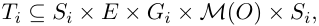

--- end of page.page_number=59 ---

Paper A: Verification of Large State/Event Systems using Compos. . .

46

where M(O) is a multi-set of outputs, and Gi is the set of guards not containing references to machine i. These guards are generated from the following simple grammar for Boolean expressions:

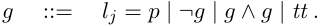

The atomic predicate lj = p is read as “machine j is at local state p” and tt denotes a true guard. The global state set of the state/event system is the product of the local state sets: S = S1 × S2 ×· · ·× Sn. The guards are interpreted straightforwardly over S: for any s ∈ S, s |= lj = p holds exactly when the j’th component of s is p, i.e., sj = p. The notation g[sj/lj] denotes that sj is substituted for lj, with occurrences of atomic propositions of the form sj = p replaced by tt or ¬tt depending on whether sj is identical to p.

Considering a global state s, all guards in the transition relation can be evaluated. We define a version of the transition relation in which the guards have been evalue o ated. This relation is denoted s −−→i s[′] i[expressing][that][machine][i][when][receiving] input event e makes a transition from si to s[′] i[and][generates][output][o][.][Formally,]

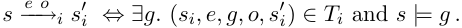

Two machines can be combined into one. More generally if MI and MJ are compositions of two disjoint sets of machines I and J, I, J ⊆{1, . . . , n}, we can combine them into one MIJ = MI × MJ = (SIJ , (s[0] IJ[)][, T][IJ][),][where][S][IJ][=][S][I][×][ S][J][and] s[0] IJ[= (][s][0] I[, s][0] J[).][The transition relation][ T][IJ][is a subset of][ S][IJ][ ×][E][×][G][IJ][ ×M][(][O][)][×][S][IJ][,] where GIJ are the guards in the composite machine. By construction of TIJ , the guards GIJ will not contain any references to machines in I ∪ J. To define TIJ , we introduce the predicate idle:

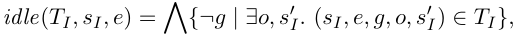

which holds for states in which no transitions in MI are enabled at state sI when receiving the input event e. The transition relation TIJ is defined by the following inference rules (the symbol ⊎ denotes multi-set union):

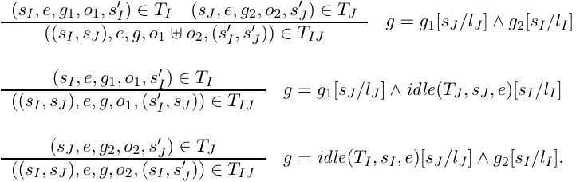

The rules show the synchronous behavior of state/event systems. The first rule represents the case where there exists an enabled transition with input event e in

--- end of page.page_number=60 ---

Consistency Checks

47

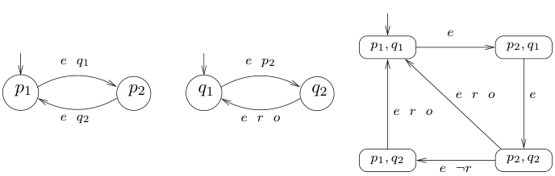

Fig. 1: Two state/event machines and the corresponding parallel combination. The guards, which formally should be of the form lj = p, are simply written as the state p since the location lj is derivable from the name of the state (the reference to r is a requirement to a state in a third machine not shown). The small arrows indicate the initial states.

both TI and TJ and the resulting transition in TIJ represents the synchronization on e. The other two cases occur if no enabled transition exists in either TI or TJ . Figure 1 shows two machines and the parallel composition of them. Notice how the two machines synchronize on the common input event e.

The full combination of all n machines, T =[�][n] i=1[T][i][,][yields][a][Mealy][machine.][o][o] We extend the transition relation of T to a total relation s −−→[e] s[′] as follows: s −−→[e] s[′] if there exists a true guard g such that (s, e, g, o, s[′] ) ∈ T . If no such guard exists,[∅] i.e., all machines idle on input event e, the relation contains an idling step, s −−→[e] s.

## 3 Consistency Checks

The consistency checker in visualSTATE[tm] performs seven predefined types of checks, each of which can be reduced to verifying one of two types of properties. The first type is a reachability property. For instance, visualSTATE[tm] performs a check for “conflicting transitions” i.e., it checks whether two or more transitions can become enabled in the same local state, leading to non-determinism. This can be reduced to questions of reachability by considering all pairs of guards g1 and g2 of transitions with the same local state si and input event e. A conflict can occur if a global state is reachable in which (lj = si) ∧ g1 ∧ g2 is satisfied.

In total, five of the seven types of checks reduce to reachability checks. Four of these, such as check for transitions that are never enabled and check for states that are never reached, generate a number of reachability checks which is linear in the number of transitions, t. In the worst-case the check for conflicting transitions gives rise to a number of reachability checks which is quadratic in the number of transitions. However, in practice very few transitions have the same starting local state and input event, thus in practice the number of checks generated is much smaller than t.

--- end of page.page_number=61 ---

Paper A: Verification of Large State/Event Systems using Compos. . .

48

The remaining two types of consistency checks reduce to a check for absence of local deadlocks. A local deadlock occurs if the system can reach a state in which one of the machines idles forever on all input events. This check is made for each of the n machines. In total at least t + n checks have to be performed making the verification of state/event systems quite different from traditional model checking where typically only a few key properties are verified.

We attempt to reduce the number of reachability checks by performing an implicational analysis between the guards of the checks. If a guard g1 implies another guard g2 then clearly, if g1 is reachable so is g2. To use this information we start by sorting all the guards in ascending order of the size of their satisfying state space. In this way the most specific guards are checked first and for each new guard to be checked we compare it to all the already checked (and reachable) guards. If the new guard includes one of them, then we know that it is satisfiable. In our experiments, between 40% and 94% of the reachability checks are eliminated in this manner.

## 4 ROBDD Representation

This section describes how Reduced Ordered Binary Decision Diagrams (ROBDDs) [Bry86] are used to represent sets of states and the transition relation. We also show how to perform a traditional forward iteration to construct the set of reachable states from which it is straightforward to check each of the reachability checks.

To construct the ROBDD T[�] for the transition relation T , we first construct the local transition relations T[�] i for each machine Mi. The variables of the ROBDD represents an encoding of the input events, the current states, and the next-states. The variables are ordered as follows: The first ∥E∥ variables encode the input events E (∥X∥ denotes ⌈log2 X⌉) and are denoted VE. Then follow 2∥Si∥ variables Vi,1, Vi,[′] 1[, . . . , V][i,][∥][S] i[∥][, V] i,[′] ∥Si∥[encoding the current- (unprimed variables) and the] next-states (primed variables) for machine i. The machines are ordered in the same order in which they occur in the input, although other orders may exist which might improve performance.

The transition relation T[�] i for machine i is constructed as an ROBDD predicate over these variables. The ROBDD for a transition

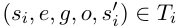

is constructed as the conjunction of the ROBDD encodings of si, e, g, and s[′] i[.][(The] outputs are not encoded as they have no influence on the reachable states of the system.) The encoding of si, e, and s[′] i[is][straightforward][and][the][encoding][of][the] guard g is done by converting all atomic predicates lj = p to ROBDD predicates over the current-state variables for machine Mj and then performing the Boolean operations in the guard. The encoding of all transitions of machine i is obtained from the disjunction of the encoding of the individual transitions:

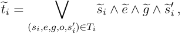

--- end of page.page_number=62 ---

ROBDD Representation

49

where e� is the ROBDD encoding of input event e and s�i and s�[′] i[are][the][ROBDD] encodings of the current-state si and next-state s[′] i[,][respectively.]

To properly encode the global transition relation T , we need to deal with situations where no transitions of Ti are enabled. In those cases we want the machine i to stay in its current state. We construct an ROBDD negi representing that no transition is enabled by negating all guards in machine i (including the input events):

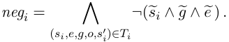

The ROBDD equi encodes that machine i does not change state by requiring that the next-state is identical to the current-state:

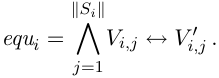

The local transition relation for machine i is then:

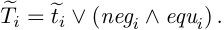

The ROBDD T[�] for the full transition relation is the conjunction of the local transition relations:

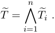

One way to check whether a state s is reachable is to construct the reachable state space R. The construction of R can be done by a standard forward iteration of the transition relation, starting with the initial state s[0] :

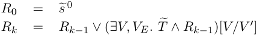

where V is the set of current-state variables, V[′] is the set of next-state variables, and (· · · )[V/V[′] ] denotes the result of replacing all the primed variables in V[′] by their unprimed versions.

The construction of the full transition relation T can be avoided by using a partitioned transition relation [BCL91] together with early variable quantification. This is done by identifying sets Ij of transition relations that, when applied in the correct order, allows for early quantification of the state variables that no other transition relations depend on. If VIj are these variables and we have m sets, then we get:

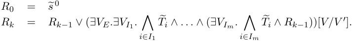

--- end of page.page_number=63 ---

Paper A: Verification of Large State/Event Systems using Compos. . .

50

Both approaches have been implemented and tested on our examples as shown in section 7. Here we see that the calculation of the reachable state space using the full transition relation is both fast and efficient for the small examples. However, for models with more than approximately 30 machines, both approaches fail to complete.

## 5 Compositional Backwards Reachability

Backwards reachability analysis is an alternative to forward reachability analysis: The verification task is to determine whether a guard g can be satisfied. Instead of computing the reachable state space and check that g is valid somewhere in this set, we start with the set of states in which g is valid and compute in a backwards iteration, states that can reach a state in which g is satisfied. The goal is to determine whether the initial state is among these states. Our novel idea is to perform the backwards iteration in a compositional manner considering only a minimal number of machines. Initially, only machines mentioned in g will be taken into account. Later also machines on which these depend will be included.

Notice that compared to the forwards iteration, this approach has an apparent drawback when performing a large number of reachability checks: instead of just one fixed-point iteration to construct the reachable state space R (and then trivially verify each of the properties), a new fixed-point iteration is necessary for each property that is checked. However, our experiments clearly demonstrate that when using a compositional backwards iteration, each of the fixed-point iterations can be completed even for very large models whereas the forwards iteration fails to complete the construction of R for even medium sized models.

To formalize the backwards compositional technique, we need a semantic version of the concept of dependency. For a subset of the machines I ⊆{1, . . . , n}, two states s, s[′] ∈ S are I-equivalent, written s =I s[′] , if for all i ∈ I, si = s[′] i[(the][primes] are here used to denote another state and is not related to the next-states). For example, the equivalence (p1, q2, r1) =I (p1, q2, r2) holds for I = {1, 2} but not for I = {2, 3}. If a subset P of the global states S only is constrained by components in some index set I we can think of P as having I as a sort. This leads to the following definition: a subset P of S is I-sorted if for all s, s[′] ∈ S,

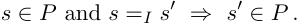

As an example, consider a guard g which mentions only machines 1 and 3. The set of states defined by g is I-sorted for any I containing 1 and 3.[1] Another understanding of the definition is that if a set P is I-sorted, it only depends on machines in I.

From an I-sorted set defined by g we perform a backwards reachability computation by including states which, irrespective of the states of the machines in I, can

> 1 If the guard is self-contradictory (always false), it will be I-sorted for any I. This reflects the fact that the semantic sortedness is more precise than syntactic occurrence.

--- end of page.page_number=64 ---

Compositional Backwards Reachability

51

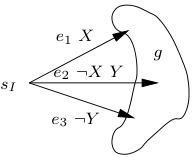

Fig. 2: An example showing the effect of BI(g). If X is the guard lj = p and Y the guard lk = q with j, k ̸∈ I then the transitions from sI seem to depend on machines Mj and Mk outside I. However, the guards X, ¬X Y , and ¬Y together span all possibilities and therefore, by selecting either e1, e2, or e3, the state sI can reach g irrespective of the states of the machines Mj and Mk.

reach g. One backward step is given by the function BI(g) defined by:

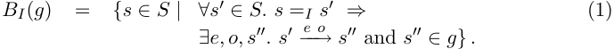

By definition BI(g) is I-sorted. The set BI(g) is the set of states which independently of machines in I, by some input event e, can reach a state in g. Observe that BI(g) is monotonic in both g and I. Figure 2 shows how a state sI of a machine is included in BI(g) although it syntactically seems to depend on machines outside I.

By iterating the application of BI, we can compute the minimum set of states containing g and closed under application of BI. This is the minimum fixed-point µX.g∪BI(X), which we refer to as BI[∗][(][g][).][Note that][ B] {[∗] 1,...,n}[(][g][) becomes the desired] set of states which can reach g.

A set of indices I is said to be dependency closed if none of the machines in I depend on machines outside I. Formally, I is dependency closed if for all i ∈ I, states s[′] , s, si, input events e, and outputs o, s −−→[e][o] i si and s[′] =I s implies s[′] −−→[e][o] i si. We say that one machine Mi is dependent on another Mj if Mi has a transition with a guard that refers to a state in machine Mj. We use this syntactic notion of dependency to determine whether a set of indices I is dependency closed. For example, from the dependency graph in Fig. 3 we observe that the set I = {1, 2, 3, 6} is dependency closed.

The basic properties of the sets BI[∗][(][g][)][are][captured][by][the][following][lemma:]

Lemma 1 (Compositional Reachability Lemma). Assume g is an I-sorted subset of S. For all subsets of machines I, J with I ⊆ J the following holds:

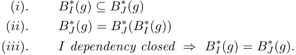

--- end of page.page_number=65 ---

Paper A: Verification of Large State/Event Systems using Compos. . .

52

Proof: We first observe directly from the definition that BI(g) is monotonic in both I and g, i.e., for any J with I ⊆ J and g[′] with g ⊆ g[′] we have:

The operation of taking minimum fixed points is also monotonic, therefore for any I and J with I ⊆ J we have from (2):

proving that BI[∗][(][g][)][is][monotonic][in][the][index][set][of][machines][I][,][which][is][(][i][)][of][the] lemma.

To prove (ii) of the lemma, first observe from the definition of BI[∗][(][g][)][that][g][⊆] BI[∗][(][g][),][hence][by][monotonicity][of][B] J[∗][(] ) and B[∗] (g) it follows that

The last equality follows from the fact that BJ[∗][(][g][)][is][a][fixed-point.][We][have][proved] (ii) of the lemma.

To prove (iii) we first observe that the inclusion ⊆ holds by (i). We therefore concentrate on the other inclusion ⊇. We employ the following fixed point induction principle (due to David Park):

Recalling that a set X for which F (X) ⊆ X is called a pre-fixed point of X we can phrase this as: “µY.F (Y ) is the minimum pre-fixed point of F , therefore if X is some other prefixed point of F , then it must include the minimum one.” We must therefore just argue that

in order to have proven (iii). A further simplification is obtained by observing that by definition g ⊆ BI[∗][(][g][)][and][we][therefore][only][need][to][prove][that]

(If the sets x and y are contained in a third set z then also their least upper bound x ∪ y is contained within z.) Assume now that s is some state in BJ (BI[∗][(][g][))][ \][ g][.] Then by definition of BJ ( ) the following holds:

To show that s is in B[∗][we][need][to][prove][that][the][following][holds:] I[(][g][)]

--- end of page.page_number=66 ---

Compositional Backwards Reachability

53

Fig. 3: This figure illustrates the dependencies between 9 state machines taken from a real example (the example “hi-fi” of section 7). An arrow from one machine Mi to another Mj indicates that Mi depends on Mj, i.e., that Mi has a transition with a guard that refers to a state in machine Mj.

From (4), taking s[′] = s, it follows that

Consider a state s[′] such that s =I s[′] . Let s[′′] be the state reached by firing e from[o][e][o][′] s, s −−→[e] s[′′] and similarly, let s[′′′] be the state reached from s[′] , s[′] −−→ s[′′′] (s[′′] and s[′′′] are well-defined since the transition relation is total). Then from the definition of dependency closure of I, it follows that for all i ∈ I, s[′′] i[=][s][′′′] i and thus s[′′] =I s[′′′] . From (6), s[′′] ∈ BI[∗][(][g][)][and][s][′′][=][I][s][′′′][,][it][follows][that][s][′′′][∈][B] I[∗][(][g][)][since][B] I[∗][(][g][)][is][I][-] sorted. We have proved (5) and thus also (iii) of the lemma. ■ The results of the lemma are applied in the following manner. To check whether a guard g is reachable, we first consider the set of machines I1 syntactically mentioned in g. Clearly, g is I1-sorted. We then compute BI[∗] 1[(][g][)][by][a][standard][fixed-point] iteration. If the initial state s[0] belongs to BI[∗] 1[(][g][),][then][by][(][i][)][s][0][∈][B] {[∗] 1,...,n}[(][g][)] and therefore g is reachable from s[0] and we are done. If not, we extend I1 to a larger set of machines I2. We then reuse BI[∗] 1[(][g][)][to][compute][B] I[∗] 2[(][g][)][as][B] I[∗] 2[(][B] I[∗] 1[(][g][))] which is correct by (ii). We continue like this until s[0] has been found in one of the sets or an index set Ik is dependency closed. In the latter case we have by (iii) B[∗][=][B][∗][and][g][is][unreachable][unless][s][0][∈][B][∗][The][algorithm][for] Ik[(][g][)] {1,...,n}[(][g][)] Ik[(][g][).] performing a compositional backwards analysis is shown in Fig. 4.

We extend I by adding machines that are syntactically mentioned on guards in transitions of machines in I, i.e., machines are included in I by traversing the dependency graph in a breadth-first manner. As an example, assume that we want to determine whether the guard g = (l1 = p ∧ l3 = q) is reachable in the example of Fig. 3. The initial index set is I1 = {1, 3}. If this is not enough to show g reachable, the second index set I2 = {1, 3, 6, 2} is used. Since this set is dependency closed, g is reachable if and only if the initial state belongs to BI[∗] 2[(][B] I[∗] 1[(][g][)).]

The above construction is based on a backwards iteration. A dual version of BI for a forwards iteration could be defined. However, such a definition would not make use of the dependency information since s[0] is only I-sorted for I = {1, . . . , n}. Therefore all machines would be considered in the first fixed-point iteration reducing

--- end of page.page_number=67 ---

54 Paper A: Verification of Large State/Event Systems using Compos. . .

Reachable(M1, M2, . . . , Mn, g) = I ←{i : g contains an atomic predicate li = p } R ← g repeat Rnew ← BI[∗][(][R][)] /∗ Check for property (i): early positive termination ∗/ if s[0] ∈ Rnew then return true /∗ Check for property (iii): early negative termination ∗/ if I is dependency closed then return false Extend I with at least one machine. /∗ Apply property (ii): reuse of previously computed states ∗/ R ← Rnew forever

Fig. 4: Algorithm performing a compositional backwards analysis for determining whether a set of states given by the predicate g is reachable.

it to the complete forwards iteration mentioned in the previous section.

Seemingly, the definition of BI(g) requires knowledge of the global transition relation and therefore does not seem to yield any computational advantage. However, as explained below, using ROBDDs this can be avoided leading to an efficient computation of BI(g). The ROBDD B[�] I(g�) representing one iteration backwards from the states represented by the ROBDD g� can be constructed immediately from the definition (1):

where �g[V[′] /V ] is equal to �g with all variables in V replaced by their primed versions. It is essential to avoid building the global transition relation T[�] . This is done by writing ∃V[′] as ∃VI[′][.][∃][V] I[¯][′][and][T][�][=][T][�][I][ ∧][T][�] I[¯][where][T][�][I][=][ �] i∈I[T][�][i][.][This allows][us to][push] the existential quantification of VI¯[′] to T[�] I¯ since g is I-sorted and thus independent of the variables in VI¯[′] . As ∃VI¯[′] .T[�] I¯ is a tautology (since the transition relation is total), equation (7) reduces to:

which only uses the local transition relations for machines in I. Each Ti refers only to primed variables in Vi[′][,][allowing][early][variable][quantification][for][each][machine] individually:

for I = {i1, i2, . . . , ik}. This equation efficiently computes one step in the fixed-point iteration constructing B[�] I[∗][(][g][�][).]

--- end of page.page_number=68 ---

Local Deadlock Detection

55

Notice, that the existential quantifications can be performed in any order. We have chosen the order in which the machines occur in the input, but other orders may exist which might improve performance.

## 6 Local Deadlock Detection

In checking for local deadlocks we use a construction similar to backwards reachability. To make the compositional backwards lemma applicable we work with the notion of a machine being live which is the exact dual of having a local deadlock. In words, a machine is live if it is always the case that there exists a way to make the machine move to a new local state. Formally, a global state s is live for machine e o i if there exists a sequence of states s[1] , s[2] , . . . , s[k] with s = s[1] and s[j] −−→ s[j][+1] (for some e and o) such that s[k] i[=][ s][1] i[.][Machine][i][is][live][if][all][reachable][states][are][live][for] machine i. A simple example of a state/event system with a machine that is not live, i.e., contains a local deadlock, is shown in Fig. 5.

Fig. 5: A state/event system with a local deadlock. The global state s = (p2, q1) is not live for the machine to the right since for all input events the guard p1 remains false. The state s is reachable (e.g., by initially receiving e1) and thus the machine to the right has a local deadlock.

The check is divided into two parts. First, the set of all live states L[∗] i[for] machine i is computed. Second, we check that all reachable states are in L[∗] i[.][A] straightforward but inefficient approach would be to compute the two sets and check for inclusion. However, we will take advantage of the compositional construction used in the backwards reachability in both parts of the check.

Similar to the definition of BI(g), we define LI,i(X) to be the set of states that are immediately live for machine i ∈ I (independently of the machines outside I) or which leads to states in X (i.e., states already assumed to be live for machine i):

Compared to definition (1) the only difference is the extra possibility that the state is immediately live, i.e., si = s[′′] i[.] The set of states that are live for machine i independently of machines outside I is then the set L[∗] I,i[(][∅][)][where][L][∗] I,i[(][Y][ )][is][the] minimum fixed point defined by L[∗] I,i[(][Y][ ) =][ µX.Y][∪][L][I,i][(][X][).]

The three properties of the lemma also hold for L[∗] I,i[(][Y][ )][when][ Y][is][I][-sorted.][If][I] is dependency closed it follows from property (iii) of the lemma that L[∗] I,i[(][∅][)][equals]

--- end of page.page_number=69 ---

Paper A: Verification of Large State/Event Systems using Compos. . .

56

L[∗] {1,...,n},i[(][∅][)][which][is][precisely][the][set][of][live][states][of][machine][i][.] This gives an efficient way to compute the sets L[∗] I,i[(][∅][)][for][different][choices][of][I][.][We][start][with][I][1] equal to {i} and continue with larger Ik’s exactly as for the backwards reachability. The only difference is the termination conditions. One possible termination case is if L[∗][becomes][equal][to][S][for][some][k][.] In that case the set of reachable Ik,i[(][∅][)] states is contained in L[∗][From][the][monotonicity][property][(][i][)][of][the][lemma][it] Ik,i[(][∅][).] follows that machine i is live and thus free of local deadlocks. The other termination case is when Ik becomes dependency closed. Then we have to check whether there exists reachable states not in L[∗][This][is][done][by][a][compositional][backwards] Ik,i[(][∅][).] reachability check with g = S \ L[∗] Ik,i[(][∅][).][The][algorithm][is][shown][in][Fig.][6.]

LocalDeadlock(M1, M2, . . . , Mn, i) = I ←{i} L ←∅ repeat Lnew ← L[∗] I,i[(][L][)] if S = Lnew then return false /∗ No local deadlock ∗/ if I is dependency closed then return Reachable(M1, M2, . . . , Mn, S \ Lnew) Extend I with at least one machine. L ← Lnew forever

Fig. 6: Algorithm determining whether machine i has a local deadlock.

## 7 Experimental Results

The technique presented above has been applied to a range of real industrial state/event systems and a set of systems constructed by students in a course on embedded systems. The examples are all constructed using visualSTATE[tm] [vA96]. They cover a large range of different applications and are structurally highly irregular.

The characteristics of the systems are shown in Tab. 1. The systems hi-fi, avs, flow, motor, intervm, dkvm, n8, train1 and train2 are industrial examples. hi-fi is the control part of an advanced compact hi-fi system, avs is the control part of an audio-video system, flow is the control part of a flow meter, motor is a motor control, intervm and dkvm are advanced vending machines, and train1 and train2 are both independent subsystems of a train simulator. The remaining examples are constructed by students. The vcr is a simulation of a video recorder, cyber is an alarm clock, jvc is the control of a hi-fi system, video is a video player, and volvo is a simulation of the functionality of the dashboard of a car.

The experiments were carried out on a 350 MHz Pentium II PC with 64 MB RAM running Linux. To implement the ROBDD operations, we use the BuDDy

--- end of page.page_number=70 ---

Experimental Results

57

Tab. 1: The state/event systems used in the experiments. The last two columns show the size of the declared and reachable state space. The size of the declared state space is the product of the number of local states of each machine. The reachable state space is only known for those systems where the forwards analysis completes.

|System|Machines|Local|states|Transitions|Declared|Reachable|
|---|---|---|---|---|---|---|
|intervm|6||182|745|106|15144|
|vcr|7||46|85|105|1279|
|cyber|8||19|98|103|240|
|jvc|8||25|106|104|352|
|dkvm|9||55|215|106|377568|
|hi-fi|9||59|373|107|1416384|
|flow|10||232|1146|105|17040|
|motor|12||41|295|106|34560|
|avs|12||66|1737|107|1438416|
|video|13||74|268|108|1219440|
|volvo|20||84|196|1011|9.2·109|
|n8|111||321|1419|1040|−|
|train1|373||931|2988|10136|−|
|train2|1421||3204|11166|10476|−|

package [LN99]. In all experiments we limit the total number of ROBDD nodes to three millions corresponding to 60 MB of memory. We check for each transition whether the guard is reachable and whether it is conflicting with other transitions. Furthermore, we check for each machine whether it has a local deadlock. The total runtime for these checks, including loadtime and the time to construct the dependency graphs, are shown in Tab. 2. The memory consumption is typically 3 MB and never more than 10 MB for the analyses that completes within the limits. The total number of checks is far from the quadratic worst-case, which supports the claim that in practice only very few checks are needed to check for conflicting rules (see section 3).

As expected, the forwards iteration with a full transition relation is efficient for smaller systems. It is remarkable that the ROBDD technique is superior to explicit state enumeration even for systems with a very small number of reachable states. Using the partitioned transition relation in the forwards iteration works poorly.

For the largest system, only the compositional backwards technique succeeds. In fact, for the three largest systems it is the most efficient and for the small examples it has performance comparable to the full forward technique. This is despite the fact that the number of checks is high and the backward iterations must be repeated

--- end of page.page_number=71 ---

Paper A: Verification of Large State/Event Systems using Compos. . .

58

Tab. 2: The runtime of the experiments in CPU seconds. The second column of the table shows the total number of guards that are checked for reachability after this number has been reduced by the implicational analysis. The forward columns show results using a forward iteration with a full and a partitioned transition relation. The backward columns show the results of a backwards iteration using the full transition relation, the full dependency closure and the compositional backwards reachability. The visualSTATE column shows the runtimes obtained using an explicit state enumeration as implemented in version 3.0 of visualSTATE[tm] . A “−” denotes that we ran out of BDD nodes.

||Guards|Forward|Forward||Backward|||
|---|---|---|---|---|---|---|---|
|System|checked|Full|Part.|Full|D.C.|Comp.|visualSTATE|
|intervm|185|0.4|1.9|6.0|5.3|4.3|4|
|vcr|50|0.1|0.2|0.4|0.3|0.2|<1|
|cyber|16|0.1|0.1|0.1|0.1|0.1|<1|
|jvc|22|0.1|0.1|0.1|0.1|0.1|<1|
|dkvm|63|0.2|4.5|1.2|1.1|0.8|82|
|hi-fi|120|0.4|7.2|2.6|2.1|1.3|240|
|flow|230|0.4|1.2|2.4|1.7|1.6|5|
|motor|123|0.3|3.3|3.2|3.1|0.7|6|
|avs|173|2.4|37.4|4.1|2.9|2.0|679|
|video|122|0.5|11.0|1.3|0.8|0.5|−|
|volvo|83|1.4|355.0|1.9|0.6|0.6|−|
|n8|710|−|−|673.5|207.1|37.8|−|
|train1|1335|−|−|471.2|11.1|10.8|−|
|train2|4708|−|−|−|−|273.0|−|

--- end of page.page_number=72 ---

Experimental Results

59

for each check. From the experiments it seems that the compositional backwards technique is better than full forwards from somewhere around 30 machines.

Fig. 7: The dependency graph for train2. Each vertex in the graph represents a state machine and an edge from vertex i to j indicates that machine Mi depends on machine Mj, i.e., that Mi has a transition with a guard that refers to a state in machine M . j

In order to understand why the compositional backwards technique is successful we have analyzed the largest system train2 in more detail. The dependency graph is shown in Fig. 7 to give an impression of the complexity and irregularity of the system. The largest dependency closed set contains 234 machines. For each guard we have computed the size of its smallest enclosing dependency closed set of machines, see Fig. 8. During the backwards iterations we have kept track of how many times the set of machines I (used in BI[∗][(][g][)) needed to be enlarged and how many machines] were contained in the set I when the iteration terminated. The dependency closed sets of cardinality 63, 66, 85, 86, 125, 127 all contain at least one machine with a guard that is unreachable. As is clearly seen from the figure, in these cases the iteration has to include the entire dependency closed set in order to prove that the initial state cannot reach the guard. But even then much is saved, as no more than 234 machines out of a possible 1421 are ever included. In fact, only in the case of unreachable guards are more than 32% of the machines in a dependency closed set ever needed (ignoring the small dependency closed sets with less than 12 machines). A reduction to 32% amounts to a potential reduction in runtime much larger than a third due to the potential exponential growth of the ROBDD representation in the number of transition relations T[�] i.

Our experience with the compositional backward technique is encouraging: It is

--- end of page.page_number=73 ---

Paper A: Verification of Large State/Event Systems using Compos. . .

60

Fig. 8: The fraction of machines actually used in the compositional backwards reachability analysis of the guards of the largest system train2. For each size of dependency closed set, a line between is drawn between the minimum and maximum fraction of machines used in verifying guards with dependency closed sets of that size. For instance, for the guards with dependency closed sets with 234 machines (the right-most line) only between 1% and 32% of the machines are needed to prove that the guard is reachable.

generally efficient on industrial applications. It is implemented in the newer versions of visualSTATE[tm] and has drastically increased the size of models that the customers can verify.

However, theory tells us to expect that there are examples where the execution time and memory requirement of any exhaustive verification algorithm will grow exponentially with the size of the design. Therefore, the quality of a verification technique must be judged on its ability to solve problems in real applications. As described above the compositional backwards technique has been very successful in this respect. However, we have encountered a problem with a state/event model of a compact zoom camera. Although it contains only 36 state machines, none of the techniques—including the use of dynamic variable ordering—are capable of fully verifying this application even using all the resources available to us. This points out that the exponentially growing examples can be encountered in practice and simply counting the number of machines is a bad measure of the complexity of the verification task. It is an active area of research to find better measures for predicting the difficulty of verifying a given design with a given technique.

## 8 Conclusion

We have presented a verification problem for state/event systems which is characterized by a large number of reachability checks. A compositional technique has been presented which significantly improves on the performance of symbolic model checking for large state/event systems. This has been demonstrated on a number

--- end of page.page_number=74 ---

Conclusion

61

of industrial systems of which the largest could not be verified using traditional symbolic model checking.

We have shown how the backward compositional technique is used to check for two types of properties, namely reachability and deadlocks. The check for local deadlock shows how some properties requiring nesting of fixed points can be checked efficiently with the compositional backwards analysis. Based on these ideas, we have recently shown how the compositional technique can be extended to handle full CTL [LNA99].

Other models of embedded control systems, such as StateCharts [Har87] and RSML [LHHR94], are often structured hierarchically, i.e., states may contain subcomponents. It is possible to extend the compositional backwards technique to not only handle hierarchical models but also to take advantage of the hierarchy to improve the efficiency of the verification [BLA[+] 99].

In general, we believe that the compositional backwards technique works well when the model can be decomposed into independent components. On the other hand, if all components of the model are mutually dependent, the dependency closure will include all components and the compositional technique reduces to the standard model checking approaches. For example, in some models the components can communicate by using signals (or internal events). The signals are placed in a queue and only when this queue becomes empty can the components react on external events. In such a model, all components become mutually dependent due to synchronization with the centralized queue, resulting in a severe degradation in performance. In current research, we attempt to avoid the queue by using a difference semantics which allows the signals to be statically eliminated by turning them into state synchronizations. The goal is to allow the use of signals in the model without degrading the efficientcy of the verification.

--- end of page.page_number=75 ---

62 Paper A: Verification of Large State/Event Systems using Compos. . .

--- end of page.page_number=76 ---

## PAPER B

## VERIFICATION OF HIERARCHICAL STATE/EVENT SYSTEMS USING REUSABILITY AND COMPOSITIONALITY

G.Behrmann, K. G. Larsen BRICS, Aalborg University, Denmark

H. R. Andersen, H. Hulgaard, J. Lind-Nielsen The IT University of Copenhagen, Denmark

## Abstract

We investigate techniques for verifying hierarchical systems, i.e., finite state systems with a nesting capability. The straightforward way of analysing a hierarchical system is to first flatten it into an equivalent non-hierarchical system and then apply existing finite state system verification techniques. Though conceptually simple, flattening is severely punished by the hierarchical depth of a system. To alleviate this problem, we develop a technique that exploits the hierarchical structure to reuse earlier reachability checks of superstates to conclude reachability of substates. We combine the reusability technique with the successful compositional technique of [LNAB[+] 98] and investigate the combination experimentally on industrial systems and hierarchical systems generated according to our expectations to real systems. The experimental results are very encouraging: whereas a flattening approach degrades in performance with an increase in the hierarchical depth (even when applying the technique of [LNAB[+] 98]), the new approach proves not only insensitive to the hierarchical depth, but even leads to improved performance as the depth increases.

Keywords: Verification, hierarchy, state charts, compositionality

--- end of page.page_number=77 ---

--- end of page.page_number=78 ---

Introduction

65

## 1 Introduction

Finite state machines provide a convenient model for describing the control-part (in contrast to the data-part) of embedded reactive systems including small systems such as cellular phones, HiFi equipment, cruise controls for cars, and large systems as train simulators, flight control systems, telephone and communication protocols. We consider a version of finite state machines called state/event machines (SEMs). The SEM model offers the designer a number of advantages including automatic generation of efficient and compact code and a platform for formal analysis such as model-checking. In this paper we focus and contribute to the latter.

In practice, to describe complex systems using SEMs, a number of extensions are often useful. In particular, rather than modeling a complex control as a single SEM, it is often more convenient to use a concurrent composition of several component SEMs each typically dealing with a specific aspect of the control. Here we focus on an additional hierarchical extension of SEMs, in which states of component SEMs are either primitive or superstates which are themselves (compositions of) SEMs. Figure 1(a) illustrates a hierarchical description of a system with two components, a Train and a Crossing. Inside the Train the state Move is a superstate with the two (primitive) states Left and Right. Transitions within one component may be guarded with conditions on the substates of other components. E.g., the ‘Go’-transition may only be fired when the superstate Crossing is in the substate Closed. The Move state is flagged as a history state indicated by the capital H. On deactivation history states remember the last active substate and may reenter it when reactivated.

Fig. 1: (a) A hierarchical model of a toy train. The system is composed of a number of serial, parallel and primitive states. (b) The model after it has been flattened. In case Move had not been a history state there would have been an extra transition in the flattened model from Right to Left on event GoRight and guard Stop ∧ Closed forcing mMove into Left whenever Move is activated.

The Statechart notation is the pioneer in hierarchical descriptions. Introduced in 1987 by David Harel [Har87] it has quickly been accepted as a compact

--- end of page.page_number=79 ---

Paper B: Verification of Hierarchical State/Event Systems using. . .

66

and practical notation for reactive systems, as witnessed by a number of hierarchical specification formalisms such as Modecharts [JM87] and Rsml [LHHR94]. Also, hierarchical descriptions play a central role in recent object-oriented software methodologies (e.g., Omt [RBP[+] 91] and Room [SGW94]) most clearly demonstrated by the emerging Uml-standard [BJR97]. Finally, hierarchical notations are supported by a number of CASE tools, such as Statemate [sta], ObjecTime [obj], RationalRose [rat], and visualSTATE  version 4.0 [vis].

Our work has been performed in a context focusing on the commercial product visualSTATE  and its hierarchical extension. This tool assists in developing embedded reactive software by allowing the designer to construct and manipulate SEM models. The tool is used to simulate the model, checking the consistency of the model, and from the model automatically generate code for the hardware of the embedded system. The consistency checker of visualSTATE  is in fact a verification tool performing a number of generic checks, which when violated indicate likely design errors. The checks include checking for absence of deadlocks, checking that all transitions may fire in some execution, and similarly checking that all states can be entered.

In the presence of concurrency, SEM models may describe extremely large statespaces[1] and, unlike in traditional model checking, the number of checks to be performed by visualSTATE  is at least linear in the size of the model. In this setting, our previous work [LNAB[+] 98] offers impressive results: a number of large SEM models from industrial applications have been verified. Even a model with 1421 concurrent SEMs (and 10[476] states) has been verified with modest resources (less than 20 minutes on a standard PC). The technique underlying these results utilises the ROBDD data structure [Bry86] in a compositional analysis which initially considers only a few component-machines in determining satisfaction of the verification task and, if necessary, gradually includes more component-machines.

Now facing hierarchical SEMs, one can obtain an equivalent concurrent composition of ordinary SEMs by flattening it, that is, by recursively introducing for each superstate its associated SEM as a concurrent component. Figure 1(b) shows the flattening of the hierarchical SEM in Fig. 1(a) where the superstate Move has given rise to a new component mMove. Thus, verification of hierarchical systems may be carried out using a flattening preprocessing. E.g., demonstrating that the primitive state Left is reachable in the hierarchical version (Figure 1(a)), amounts to showing that the flattened version (Figure 1(b)) may be brought into a system-state, where the mMove-component and the mTrain-component are simultaneously in the states Left and Move.

Though conceptually simple, verification of hierarchical systems via flattening is, as we will argue below (Section 2) and later experimentally demonstrate, severely punished by the hierarchical depth of a system; even when combined with our successful compositional technique of [LNAB[+] 98] for ordinary SEMs.

To alleviate this problem, we introduce in this paper a new verification tech-

- 1 The so-called state-explosion problem.

--- end of page.page_number=80 ---

Flattening and Reusability

67

nique that uses the hierarchical structure to reuse earlier reachability checks of superstates to conclude reachability of substates. We develop the reusability technique for a hierarchical SEM model inspired by Statechart and combine it with the compositionality technique of [LNAB[+] 98]. We investigate the combination experimentally on hierarchical systems generated according to our expectations from real systems.[2] The experimental results are very encouraging: whereas the flattening approach degrades in performance with an increase in the hierarchical depth, it is clearly demonstrated that our new approach is not only insensitive to the hierarchical depth, but even leads to improved performance as the depth increases. In addition, for non-hierarchical (flat) systems the new method is an instantiation of, and performs as well as, the compositional technique of [LNAB[+] 98].

## Related Work

R. Alur and M. Yannakakis’ work on hierarchical Kripke structures offers important worst case complexity results for both LTL and CTL model checking [AY98]. However, their results are restricted to sequential hierarchical machines and use the fact that abstract superstates may appear in several instantiations. In contrast we provide verification results for general hierarchical systems with both sequential and parallel superstates without depending on multiple instantiations of abstract superstates.

Park, Skakkebæk and Dill [PSD98] have found an algorithm for automatic generation of invariants for states in Rsml specifications. Using these invariants it is possible to perform some of the same checks that we provide for hierarchical SEMs. Their algorithm works on an approximation of the specification, and uses the fact that Rsml does allow internal events sent from one state to another.

## 2 Flattening and Reusability

To see why the simple flattening approach is vulnerable to the hierarchical depth, consider the (schematic) hierarchical system of Fig. 2(a). The flattened version of this system will contain (at least) a concurrent component mSi for each of the superstates Si for 0 ≤ i ≤ 100. Assume, that we want to check that the state u is reachable. As reachability of a state in a hierarchical system automatically implies reachability of all its superstates, we must demonstrate that the flattened system can reach a state satisfying the following condition:[3]

mS100@u ∧ mS99@S100 ∧ mS98@S99 ∧ . . . ∧ mS0@S1 .

Consequently, we are faced with a reachability question immediately involving a large number of component SEMs, which in turn means that poor performance

> 2 In short, we expect that transitions and dependencies between parts of a well-designed hierarchical system are more likely to occur between parts close to each other rather than far from each other in the hierarchy.

> 3 Here mS@T denotes that the component mS is in state T .

--- end of page.page_number=81 ---

Paper B: Verification of Hierarchical State/Event Systems using. . .

68

Fig. 2: Simple and complex substates.

of our compositional technique [LNAB[+] 98] is to be expected. Even worse, realizing all the checks of visualSTATE  means that we must in similarly costly manners demonstrate reachability of the states x, y, z and v. All these checks contain mS99@S100 ∧ mS98@S99 ∧ . . . ∧ mS0@S1 as common part. Hence, we are in fact repeatedly establishing reachability of S100 as part of checking reachability of x, y, z, u and v. As this situation may occur at all (100) levels, the consequence may be an exponential explosion of our verification effort.

Let us instead try to involve the hierarchical structure more actively and assume that we have already in some previous check demonstrated that S100 is reachable (maybe from an analysis of a more abstract version of the model in which S100 was in fact a primitive state).

How can we reuse this fact to simplify reachability-checking of, say, u? Assume first a simple setting (Figure 2(a)), where S100 is only activated by transitions to S100 itself (and not to substates within S100) and transitions in S100 are only dependent (indicated by the guard g) on substates within S100 itself. In this case we may settle the reachability question by simply analysing S100 as a system of its own. In more complex situations (Figure 2(b)), S100 may possibly be activated in several ways, including via transitions into some of its substates. Also, the transitions within S100 may refer to states outside S100 (indicated by the guard g[∗] ). In such cases—in analogy with our previous compositional technique [LNAB[+] 98]—we compute the set of states which regardless of behaviour outside S100 may reach u. If this set contains all potential initial states of S100 (in Fig. 2(b) the states x, y, u) we may infer from the known reachability of S100 that also u is reachable. Otherwise, we will simply extend the collection of superstates considered depending on the guards within S100 and the transitions to S100.

In the obvious way, transitions and their guards determine the pattern of dependencies between states in a hierarchical system. We believe that in good hierarchical designs, dependencies are more likely to exist between states close to each other in the hierarchy rather than states hierarchically far from each other. Thus, the simple

--- end of page.page_number=82 ---

The Hierarchical State/Event Model

69

scenario depicted in Fig. 2(a) should in many cases be encountered with only small extensions of the considered superstates. It is noteworthy, that exception handling does not follow this pattern. An exception may result in a transition from a state s deep within the hierarchy to an exception state far away. However, this does not affect reachability of s, only that of the exception state.

## 3 The Hierarchical State/Event Model

A hierarchical state/event machine (HSEM) is a hierarchical automaton consisting of a number of nested primitive, serial, and parallel states. Transitions can be performed between any two states regardless of their type and level, and are labeled with a mandatory event, a guard, and a possible empty multiset of outputs.

Definition 1. An HSEM is a 7-tuple

of states S, events E, outputs O, transitions T , a function Sub : S →P(S) associating states with their substates, a function type : S →{pr, se, sh, pa} mapping states to their type (indicating whether a state is primitive, serial, serial history, or parallel), and a partial function def : S �→ S mapping serial and history states to their default substate. The set of serial and history states in S is referred to as R. The set of transitions is

where M(O) is the set of all multisets of outputs, and G is the set of guards derived from the grammar

The atomic predicate s is a state synchronisation on the state s, having the intuitive interpretation that s is true whenever s is active (we will return to the formal semantics in a moment).

We use t = (st, et, gt, ot, s[′] t[)][to][range][over][syntactic][transitions][(with][source,] event, guard, outputs and target respectively).

Example 1. In Fig. 1a we have

type(Stop) = type(Left) = type(Right) = type(Open) = type(Closed) = pr

--- end of page.page_number=83 ---

Paper B: Verification of Hierarchical State/Event Systems using. . .

70

(Stop, Go, Closed, ∅, Move) is one of the six elements in T . The Sub relation defines the nesting structure of the states, e.g. we have Sub(Root) = {Train, Crossing}. The function def is only defined for serial and history states, e.g. def (Move) = Left, whereas def (Root) is undefined.

For notational convenience we write s ↘ s[′] whenever s[′] ∈ Sub(s). Furthermore we define ↘[+] to be the transitive closure, and ↘[∗] to be the transitive and reflexive closure of ↘. If s ↘[+] s[′] we say that s is above s[′] , and s[′] is below s. The graph (S, ↘) is required to be a tree, where the leaves and only the leaves are primitive states, i.e., ∀ s : type(s) = pr ⇔ Sub(s) = ∅.

For a set of states I, lca(I) denotes the least common ancestor of I with respect to ↘. For a state s, lsa(s) denotes the least serial ancestor of s. The scope of a transition t is denoted χ(t) and represents the least common serial ancestor of the states st and s[′] t[.][For][those][transitions][in][which][such][a][state][does][not][exist,][we][say] that χ(t) = $, where $ is a dummy state above all other states, i.e., ∀ s ∈ S : $ ↘[+] s.

Example 2. Let t1 be the transition from Open to Closed and t2 the transition from Left to Right. We then have χ(t1) = Crossing and χ(t2) = Move. If we had a transition from Move to Open (remember transitions between any two states are allowed), the scope would have been $.

A configuration of an HSEM is an |R|-tuple of states indexed by serial and history states. The configuration space Σ of an HSEM is the product of the set of substates of each serial state,

Example 3. Returning to the train example, we have that Σ = {Stop, Move} × {Left, Right} × {Open, Closed}, i.e. the product of the substates of serial and history states.

The projection πs : Σ → Sub(s) of a configuration σ onto a serial or history state s yields the value of s in σ. The projection of a configuration onto a parallel or primitive state is undefined. A state s is active in σ if either s is the root state, the parent of s is an active parallel state, or the parent is an active serial or history state and s is the projection of σ onto the parent. In order to formalise this we define the infix operator in as

We denote by Σs = {σ | s in σ} the set of configurations in which s is active.

Example 4. Let σ = (Stop, Left, Open), i.e. the initial configuration. We have that s in σ is true for s ∈{Root, Train, Stop, Crossing, Open}. We do not have Left in σ since this would require Move in σ.

--- end of page.page_number=84 ---

The Hierarchical State/Event Model

71

Definition 2. Let σ |= g whenever σ satisfies g. The operator is defined on the structure of g as:

A pair (e, σ) is said to enable a transition t, written (e, σ) |= t, iff e = et, st in σ, and σ |= gt.

Before introducing the formal semantics, we summarise the intuitive idea behind a computation step in HSEM. An HSEM is event driven, i.e., it only reacts when an event is received from the environment. When this happens, a maximal set of nonconflicting and enabled transitions is executed, where non-conflicting means that no transitions in the set have nested scope. This conforms to the idea that the scope defines the area affected by the transition. In fact, a transition is understood to leave the scope and immediately reactivate it. When a transition is executed, it forces a state change to the target. All implicitly activated serial states enter their default state and all history states the remembered last active substate. Notice that contrary to Statecharts, HSEMs do not include any notion of scope overriding. Scope overriding varies greatly between hierarchical specification languages (for instance between Statecharts and Uml). For this reason we decided not to include this mechanism in HSEM. In fact, it is easy to translate an HSEM with Statechart like scope overriding to an HSEM without (for any given transition add the conjunction of negated guards of potentially enabled transitions with higher scope to the guard), although this adds additional dependencies between states.

Formally, a set ∆ ⊆ T is enabled on (e, σ) if ∀ t ∈ ∆: (e, σ) |= t, ∆is compatible if ∀ t, t[′] ∈ ∆: (t = t[′] ⇒ χ(t) ̸↘[∗] χ(t[′] )), and ∆is maximal if ∀ ∆[′] ⊆ T : ∆ ⊂ ∆[′] ⇒ ∆[′] is incompatible or disabled on (e, σ).

Example 5. Let σ = (Stop, Left, Open) be the initial configuration, e = Down, and ∆= {t1}, where t1 is again the transition from Open to Closed. The set ∆ is compatible, enabled on (e, σ), and maximal.

The semantics of an HSEM is in terms of a transition relation.

e/o Definition 3. Let →⊆ Σ × E × M(O) × Σ be such that σ →σ[′] if and only if there exists a set ∆ ⊆ T , such that[4] :

1) ∆ is compatible, enabled on (e, σ), and maximal,

- 2) o = ⊎t∈∆ot,

- 3) ∀ t ∈ ∆: s[′] t[in][ σ][′][,]

> 4 The symbol ⊎ denotes multiset union

--- end of page.page_number=85 ---

Paper B: Verification of Hierarchical State/Event Systems using. . .

72

4) ∀ t ∈ ∆, s ∈ S : s in σ[′] ∧ type(s) = se ∧ (χ(t) ↘[+] s ̸↘[+] s[′] t[)][ ⇒][π][s][(][σ][′][) =][ def][ (][s][)][,] 5) ∀ t ∈ ∆, s ∈ S : type(s) = sh ∧ (χ(t) ↘[+] s ̸↘[+] s[′] t[)][ ⇒][π][s][(][σ][′][) =][ π][s][(][σ][)][,][and]

6) ∀ s ∈ R : (∀ t ∈ ∆: χ(t) ̸↘[∗] s) ⇒ πs(σ) = πs(σ[′] ).

The second constraint defines the output of the transition, the third that all targets and consequences are active after the transition, the fourth that all implicitly activated serial states (those not on the path between the scope and the target of any transition) are recursively set to their default state, the fifth that all history states not explicitly forced to a new state by 3) remain unchanged, and the last that all states not under the scope of any transition remain unchanged. Notice that in 5) it does not matter if the history state is active or not. This is important, since it ensures that the last activated substate is remembered.

Example 6. Let ∆ be the set from the previous example. It follows that

is a valid transition. Clearly the first two constraints are satisfied. Since t1 is the only transition in ∆ and χ(t1) = Crossing, we find that the third and fourth constraint do not matter it this example (both Open and Closed are primitive). The last constraint requires Train and Move to remain unchanged, which is the case. In fact the above transition is the only transition satisfying the constraints in the given configuration and event. Continuing from this new configuration we obtain

as a legal transition sequence.

## 4 Consistency Checks

The consistency checker of visualSTATE  performs seven predefined types of checks such as checking absence of dead code in the sense that all transitions must be possibly enabled and all states must be possibly entered, and checking absence of deadlocks. Each check can be reduced to verifying one of two types of properties. The first property type is reachability. For instance, checking whether a transition t will ever become enabled is equivalent to checking whether a configuration σ can be reached such that ∃ e : (e, σ) |= t. Similarly, checking whether a state s may be entered amounts to checking whether the system can reach a configuration within Σs.

The remaining types of consistency checks reduce to a check for absence of local deadlocks. A local deadlock occurs if the system can reach a configuration in which one of the superstates will never change value nor be deactivated no matter what sequence of events is offered.

--- end of page.page_number=86 ---

Reusable Reachability Checking

73

In the following two sections we present our novel technique exploiting reusability and compositionality through its application to reachability analysis. In [ABPV98] the applicability of the technique to local deadlock detection is demonstrated.

## 5 Reusable Reachability Checking

From a users perspective visualSTATE  detects dead code in the form of unused states and transitions, but the model checker will translate each such check to a set of goal configurations X ⊆ Σ. The question posed is really whether X is reachable in the sense that there exists a sequence of events such that the system starting at the initial configuration σ0 enters a configuration in X.

Example 7. Checking whether the transition from Stop to Move is not dead code reduces to checking whether some configuration in X1 = {σ | σ |= Stop ∧ Closed} = {(Stop, Left, Closed), (Stop, Right, Closed)} is reachable. Similarly, checking whether Right is not dead code reduces to checking whether some configuration in X2 = ΣRight = {(Move, Right, Open), (Move, Right, Closed)} is reachable.

One classic approach to reachability checking is backwards exploration of the transition system starting at the goal configurations. We can do this in a breadth first fashion using a simple backwards step function:[5]

i.e. given a set X we compute the configurations that in one step can reach a configuration in X. By repeating the step until we reach the fixed point B[∗] (X) = µY.X ∪ B(Y ), we compute the set of configurations that in a number of steps can reach X. Although this approach is very simple it is infeasible for large systems.

To explain the idea of reusability, let i be a state such that X ⊂ Σi, i.e., reachability of any configuration within X implies reachability of the state i (see Fig. 3(a)). Notice that such a state exists for all non-trivial reachability questions, e.g., the root will satisfy this condition for any X = Σ. The question we ask is how existing information about reachability of i may be reused to simplify reachability-checking of X. The simple case is clearly when i is unreachable. In this case there is no way that X can be reachable either, since X only contains configurations where i is active. Since we expect (or hope) most of the reachability questions issued by visualSTATE  to be true this only modestly reduces the number of computations. However, although it is more challenging, we can also make use of the information that i is reachable, as explained below.

Knowing i is reachable, still leaves open which of the configurations in Σi are in fact reachable (and in particular if any configuration in X is). However, any reachable configuration σ in Σi must necessarily be reachable through a sequence of

> 5 ′ e/o Here σ ; σ abbreviates ∃ e, o : σ −→ σ[′] .

--- end of page.page_number=87 ---

Paper B: Verification of Hierarchical State/Event Systems using. . .

74

Reachable(X) = i := lowest(X) if not Reachable(Σi) then return false Σ σ0 Y := X repeat Σi Y[′] := Bi[∗][(][Y][ )] Init(i) // Prop. i and iii if σ0 ∈ Y[′] or Init(i) ⊆ Y[′] then return true // Prop. iv if Init(i)∩Y[′] = ∅ then return false X // Prop. ii i := lsa(i) Y := Y[′] forever

(a) The initial configurations (b) Algorithm 1. of i.

Fig. 3: Reusable reachability check.

the following form:

Let the function Init : R → Σ be as

i.e., Init(s) is the set of configurations for which s is active and which are reachable in one step from a configuration in which s is inactive (clearly σn+1 in (1) is in Init(i), see also Fig. 3(a)). We call Init(i) the initial configurations of i. Notice that for a configuration to be an initial configuration, all we require is that there is a predecessor which is not in i. In the presence of history states, the set of initial configurations of i is larger than the set of configurations in i terminating paths which are otherwise not in i. A path leading to a initial configuration might have entered and left i several times.

## Example 8. In the example from the introduction we have that

Notice that the second state can only be reached via paths containing the first state. Consider then the following backwards step computation:

--- end of page.page_number=88 ---

Reusable Reachability Checking

75

that is, Bi(Y ) is the set of configurations with i active, which in one step may reach Y . The fixed point defined by

can easily be found by applying Bi iteratively. Notice that B = Bi for i being the root state. The following lemma states the crucial properties of this fixed point.

Lemma 1. Let σ0 be the initial state. For states j ↘[∗] i and a set X ⊂ Σi, the following holds:

iii) (σ0 ∈ B[∗] (Σi) ∧ Init(i) ⊆ Bi[∗][(][X][))][ ⇒][σ][0][∈][B][∗][(][X][)]

iv) Bi[∗][(][X][)][ ∩][Init][(][i][) =][ ∅⇒][σ][0][̸∈][B][∗][(][X][)][.]

In fact, any over-approximation of Init(i) contained in Σi will suffice for the lemma to hold. This is very useful since an approximation of Init may be obtained from a syntactic analysis of the system. We will comment further on this in Section 7.

Crucial to the efficiency of the approach is making a good choice of i. Although the root will satisfy the requirement of X ⊂ Σi for all non-trivial X, it is a nonoptimal choice since in this case Bi is equal to B. A state as deep in the hierarchy as possible is typically a good choice since it reduces the size of the fixed point Bi[∗][(][X][),] but there might be several such states. One such state is offered by lowest(X). Also, if X = Σs any serial ancestor of s will suffice. A good choice of i will become obvious when we combine reusability with compositionality in Section 6.

Example 9. Given the two reachability questions from Example 7 we have lowest(X1) ∈ {Stop, Closed} and lowest(X2) = Right.

To settle reachability of X, we iteratively apply Bi[∗][according][to][Algorithm][1] in Fig. 3(b) until either property i), iii), or iv) can be applied. Reachability of X may be confirmed if either the initial configuration is encountered (property i) or the backwards iteration reaches a stage with all initial configurations for i included (property iii). Dually, reachability of X can be rejected if no initial configuration for state i has been encountered (property iv ). If some but not all of the initial configurations for state i have been encountered, the analysis does not allow us to conclude on the reachability of X based on reachability of state i. Instead, the backwards iteration is continued with state i substituted with its directly enclosing, serial superstate. According to property ii) the previously obtained fixed point can be reused as the starting point of the new iteration.

As can be seen from the recursive call in the algorithm, reachability of X depends on a previous reachability check of the lowest state strictly containing X. Since this is itself a reachability check the above approach can be applied without the recursive

--- end of page.page_number=89 ---

Paper B: Verification of Hierarchical State/Event Systems using. . .

76

call if we perform a preorder traversal of the state tree determining reachability of each state as we encounter them, reusing the previous checks. If a state turns out to be unreachable we can immediately conclude that all substates are unreachable. The following lemmas will be useful in the proof of iii) and iv) of Lemma 1.

Lemma 2. Let σ0 be the initial configuration. For any superstate s:

Proof: ⇐ follows from monotonicity of B. For ⇒ assume σ0 ∈ B[∗] (Σs). Observe that there must be a path σ0 ; · · · ; σn, such that σn ∈ Σs and either n = 0 or σn−1 ̸∈ Σs. In either case σn ∈ Init(s) and σ0 ∈ B[∗] ({σn}). Now ⇒ follows from monotonicity of B. ■

Lemma 3. For any two superstates i and j s.t. j ↘[∗] i and for any set of configurations X ⊂ Σi the following holds.

Proof: The proof is by contradiction. Assume Bi[∗][(][X][)][∩][Init][(][i][)][=][∅][holds,][but] Bj[∗][(][X][)][=][B] i[∗][(][X][).][From][Lemma][1][we][know][that][B] i[∗][(][X][)][⊆][B] j[∗][(][X][),][hence][there][is][a] σ ∈ Bj[∗][(][X][)][such][that][σ][̸∈][B] i[∗][(][X][).][There][must][be][a][path][σ][=][σ][n][;][· · ·][ σ][m][ · · ·][;] σ[0] ∈ X, where σ[k] ∈ Bj[k][(][X][)][(the][k][th][iteration][of][B][j][),][such][that][for][all][k][≤][m][we] have σ[k] ∈ Σi and σ[m][+1] ̸∈ Σi. Obviously σ[m] ∈ Bi[m][(][X][)][⊆][B] i[∗][(][X][)][and][σ][m][∈][Init][(][i][),] but this contradicts Bi[∗][(][X][)][ ∩][Init][(][i][) =][ ∅][.] ■

## Lemma 1 (continued)

Proof: We first observe from the definition that Bi(X) is monotonic in both i (w.r.t. ↘[∗] ) and X (w.r.t. ⊆). Property i) of the lemma is a direct consequence.

For ii), observe X ⊆ Bi[∗][(][X][).][It][follows][that]

We have proven ii) of the lemma.

To prove iii), assume σ0 ∈ B[∗] (Σi) ∧ Init(i) ⊆ Bi[∗][(][X][)][holds.][Since][B][∗][is][mono-] tonic, it follows that B[∗] (Init(i)) ⊆ B[∗] (Bi[∗][(][X][))][=][ B][∗][(][X][)][(the][equality][follows][from] ii) of the lemma). Using Lemma 2 we conclude σ0 ∈ B[∗] (X).

Finally, for iv) assume the left hand side of the implication holds. Observe that σ0 ∈ Bi[∗][(][X][)][implies][σ][0][∈][Init][(][i][),][but][since][we][assume][the][intersection][is][empty] we conclude σ0 ̸∈ Bi[∗][(][X][).][It][follows][from][Lemma][3][that][B] i[∗][(][X][)][=][B][∗][(][X][),][hence] σ0 ̸∈ B[∗] (X). ■

--- end of page.page_number=90 ---

Compositional Reachability Checking

77

## 6 Compositional Reachability Checking

The reusable reachability analysis offered by the algorithm of Fig. 3(b) is based on the backward step function Bi. An obvious drawback is that computation of Bi requires access to the global transition relation →. In this section we show how to incorporate the compositional technique of [LNAB[+] 98] by replacing the use of Bi with a backwards step function, CBI, which only requires partial knowledge about the transition relation corresponding to a selected and minimal set of superstates. The selection is determined by a sort I identifying the set of superstates currently considered. Initially, the sort I only includes superstates directly relevant for the reachability question. Later, also superstates on which the initial sort behaviourally depends will be included.

A nonempty subset I of R defines a sort if it is convex in the sense that u ∈ I whenever lca(I) ↘[∗] u ↘[∗] y for some y ∈ I.[6] For any nonempty set A ⊆ R the set Convex(A) denotes the minimal convex superset of A. For notational convenience we write ΣI = Σlca(I) and Init(I) = Init(lca(I)).

Two configurations σ and σ[′] are said to be I-equivalent, written σ =I σ[′] , whenever they agree on all states in I. More formally

A set of configurations P ⊆ ΣI is I-sorted in case

Notice that we require P ⊆ ΣI for P to be I-sorted. This follows the idea that the reusable reachability check restricts the analysis to I. Hence, in the following the least common ancestor of I will play the role of state i used in the reusable reachability algorithm. P being I-sorted intuitively means that it only depends on states within I. Using ROBDDs allows for very compact representations of I-sorted sets as the parts of the configuration set outside the sort will be ignored.

Given a sort I, we define the behaviour of I in terms of a transition relation ;I⊆;. Intuitively, σ ;I σ[′] if the transition does not depend on superstates not in I. This is the case exactly when all configurations I-equivalent to σ can perform a similar transition to a configuration I-equivalent to σ[′] . Formally, ;I⊆ ΣI × ΣI such that

It is now easy to define a compositional backwards step function similar to (2) based on ;I:

Let CBI[∗][(][X][)][be][the][minimum fixed-point defined by][ µY.X][ ∪][CB][I][(][Y][ ).][Observe that] CBI is monotonic in both X and I. In an ROBDD based implementation, the global transition relation may be partitioned into conjunctive parts with contributions from

> 6 Only if lca(I) is a serial state does this imply that lca(I) ∈ I.

--- end of page.page_number=91 ---

Paper B: Verification of Hierarchical State/Event Systems using. . .

78

each superstate. Crucial for our approach is the fact that CBI may be computed without involving the global transition relation directly, but only the parts of the partitioning relevant for the considered sort I. We refer to [LNAB[+] 98] for a similar observation for SEMs.

If computing CBI[∗][(][X][)][does][not][resolve][the][reachability][question,][we][extend][the] sort I with states the behaviour of the sort I logically depends on. If I only depends on states in I, we say I is dependency closed. Formally, I is dependency closed if

For A ⊆ R let Dep(A) ⊆ R be the smallest dependency closed superset of A satisfying the properties of a sort.

The following lemma is similar to Lemma 1.

Lemma 4. Let X be an I-sorted subset of Σ. For all sorts I, J with I ⊆ J the following holds:

Proof: The proofs of i), ii), and iii) are identical to the proofs of Lemma 1 (substitute CB, I, and J for B, i, and j). For iv) the proof is by contradiction. Assume the left hand side of the implication holds, but σ0 ∈ B[∗] (X). There must be a path from σ0 = σ[n] ; · · · σ[m] · · · ; σ[0] ∈ X, where σ[k] ∈ B[k] (X), σ[m][+1] ̸∈ ΣI or m = n, and for all k ≤ m : σ[k] ∈ ΣI. Then σ[m] ∈ Init(I). Since I is dependency closed we have that σ[k] ∈ CBI[k][(][X][)][for][k][≤][m][which][contradicts][Init][(][I][)][ ∩][CB] I[∗][(][X][) =][ ∅][.] ■

As before, any over approximation of Init and Dep will suffice for the lemma to hold. We will return to this matter in Section 7. Lemma 4 is a generalisation of the Compositional Reachability Lemma in [LNAB[+] 98] to the hierarchical case.

Algorithm 2 in Fig. 4 is the result of using the compositional backward step CBI instead of Bi, with Minsort(X) offering a minimal sort for the set of configurations X. When the algorithm returns false, none of the configurations in X are reachable. If true is returned, it means that at least one goal configuration is reachable under the assumption that lca(I) is known to be reachable. The same optimisation as in Section 5 using a preorder traversal of the state tree can be applied.

## 7 Approximation by Syntactic Analysis

The previous sections used the two functions Init and Dep. Both are defined in terms of the global transition relation, and hence too expensive to compute directly. As stated, any over approximation of the functions will suffice. Fortunately, it is

--- end of page.page_number=92 ---

Approximation by Syntactic Analysis

79

Reachable(X) = Y := X I := Minsort(X) repeat Y[′] = CBI[∗][(][Y][ )] // Prop. i and iii if σ0 ∈ Y[′] or Init(I) ⊆ Y[′] then return true if Dep(I) ̸= I then I := Convex(I ∪ J), where J ⊆ Dep(I) else if Init(I) ∩ Y[′] = ∅ then I := I ∪{lsa(lca(I))} // Prop. iv else return false // Prop. ii Y := Y[′] forever

Fig. 4: Algorithm 2, reusable and compositional reachability.

possible to approximate the functions using an analysis of the syntactic transitions of the system in question.

For Init(s), we calculate the set of configurations where either s is recursively in its default state or that can be reached by an activating syntactic transition.

Definition 4. Let s be a super state. The set Init[′] (s) is the smallest set, such that σ ∈ Init[′] (s) whenever s in σ and either

For history states any substate can potentially be activated by a transition to the edge of the history state, and thus history states are not restricted by the definition of Init[′] . A history states reduces the chance of termination using property iii) and iv) of Lemma 4, but if used moderately, history states do not dramatically increase the size of the set of initial configurations. We now have the following lemma.

Lemma 5. For all super states s we have Init(s) ⊆ Init[′] (s).

Proof: Let σ ∈ Init(s). We prove that σ ∈ Init[′] (s). If σ = σ0, then s in σ0, and due to i), σ0 ∈ Init[′] (s). If on the other hand σ = σ0, then there is an activating transition σ[′] ; σ such that σ[′] ̸∈ Σs, hence there must exist a maximal, enabled, and compatible set of transitions ∆such that the conditions of Def. 3 are satisfied. Since the conditions of when when σ ∈ Init[′] (s) only restrict se-type states, all we need to proof is that the conditions of Def. 3 imply that the serial states have a value satisfying the conditions of Def. 4. From condition 6) and compatibility of ∆we can

--- end of page.page_number=93 ---

Paper B: Verification of Hierarchical State/Event Systems using. . .

80

conclude that there must exist exactly one transition with scope above s. Call this transition t. We now have two cases: If the target of t is below s, then condition 3) and 4) imply ii). If the target is not below s, s will be implicitly activated by condition 4 ) and 5 ) implying that i) holds. ■

For dependency analysis we need to look at transitions with scope in or above I. All other transitions will by definition of scope not influence the behaviour of I. For transitions with scope in I, we require that the parent of the source and all parents to states in the guard are in I for I to be dependency closed. For transitions with scope above I we basically require the same, but only if ΣI can potentially be active both before (defined by the pre-states) and after (defined by the post-states) the transition is executed.

Definition 5. Let states : G → R be a function from guards to states defined by

Definition 6. Let pre : T → Σ give the pre-configurations of a transition t defined by

Definition 7. Let post : T → Σ give the post-configurations of a transition t defined by

Lemma 6. A sort I is dependency closed if for all t ∈ T we have

ii) χ(t) ↘[+] lca(I)∧pre(t)∩ΣI = ∅∩post(t)∧ΣI = ∅⇒ lsa(st) ∈ I∧states(gt) ⊆ I .

Figure 5 shows an example of extracting dependencies from syntactic transitions.

## 8 Experimental Results

To evaluate our approach, the runtime and memory usage of an experimental implementation using our method is compared to an implementation for flat systems. We will refer to the first as the hierarchical checker and the second as the flat checker. Both checkers utilise the compositional backwards analysis and use ROBDDs to represent sets of states and transition relations, but only the hierarchical checker uses the reusable reachability check. Only dead code detection for transitions is performed, i.e., whether the system for each transition is unable to reach a configuration such that the transition is enabled. The hierarchical checker additionally

--- end of page.page_number=94 ---

Experimental Results

81

Fig. 5: State c depends on u, due to the transition from e to u and since u is the parent of v upon which the transition is guarded. Likewise does the transition from e to b create dependencies from state a (the scope of the transition) to state c (the parent of the source) and x (the parent of the state upon which the transition is guarded).

checks whether non-primitive states are reachable since this is necessary in order to apply the reusable reachability check.

The two implementations where first compared on a number of flat industrial SEM systems ranging from 4 to 1421 parallel components used in [LNAB[+] 98] (HiFi and video control software, and two train simulators to name a few). Without going into details, adding the reusable reachability check did not degrade performance.

The lack of adequate examples has forced us to develop a method to generate scalable hierarchical systems. The basic structure of the generated systems is the cell structure seen in Figure 6. A cell is a parallel state with a number of serial substates, each containing a number of either primitive states or cells. The size (p, q) of a cell is determined by the number of serial states p contained in the parallel state and the number of states q within each serial state. For instance, the cell in Figure 6 has size (3, 4). By varying the cell size and the maximum nesting depth, systems of any size can be generated. Notice, that the cells do not generate a complete tree, i.e., different branches will not necessarily have the same length. For instance, a system with nesting depth 12 does have some branches of length 12, but most branches are shorter. If the generated system is not deep enough to accommodate the number of wanted states, the width of the root cell is expanded. E.g., a system with 100 serial states and nesting depth 1 will have a parallel root with 100 substates.

As stated in the introduction, we believe that in good designs, dependencies are more likely to be local. The generated test cases reflect this by only including transitions between nearby states. The guards are created at random, but the probability that a guard synchronises with a given state is inverse exponential to the distance between the scope of the transition and the state. The number of transitions is proportional to the number of serial states. Transitions are arranged so that any state is potentially reachable, i.e., if the transitions were unguarded all states (but not necessarily all cofigurations) would be reachable. Events are distributed such that given a sequence of events the system is guaranteed to be deterministic (HSEMs do allow non-determinism, but the flattening algorithm generates quite complex guards that cannot be handled by the SEM model checker of [LNAB[+] 98] – in other words, this is a restriction of the implementation, not of our approach).

--- end of page.page_number=95 ---

Paper B: Verification of Hierarchical State/Event Systems using. . .

82

Fig. 6: A cell of size (p, q) is a parallel state with p serial substates, each containing q primitive states or cells. Cells are the basic building blocks used in the generated hierarchical systems.

Fig. 7: Comparison of the runtime of the flat and hierarchical checker. Left: The runtime of both checkers is plotted as a function of the nesting depth of the system and number of automata/serial states. Right: A slice of the mesh where the number of automata is 300. As can be seen, the runtime of the flat checker explodes as the depth increases, whereas the runtime of the hierarchical checker decreases slightly.

Figure 7 shows the runtime of both the hierarchical and the flat checker for a cell size of (4, 3), but with varying nesting depth and number of serial states (which corresponds to the number of automata in the equivalent flat system). It is interesting to notice that the runtime of the hierarchical checker is much more consistent than that of the flat checker, i.e., the runtime of the flat checker does vary greatly for different systems generated with the same parameters, as the depth is increased. Although each grid point of the figures shows the mean time of 20 measurements,[7] it is still hard to achieve a smooth mesh for the flat checker.

While the flat checker suffers under the introduction of a hierarchy, the hierarchical checker actually benefits from it. How can it be that the addition of a hierarchy decreases the runtime of the hierarchical checker? As stated earlier, we believe that

> 7 It took about two days to run the 1920 cases providing the basis of the 96 depicted grid points. The test was performed on a Sun UltraSparc 2 with two 300 MHz processors and 1 GB of RAM (although the enforced limit of 10[6] nodes assured a maximal memory consumption below 20 MB).

--- end of page.page_number=96 ---

Experimental Results

83

Tab. 1: Distribution of reachability questions. The vertical axis shows the initial distance between the root and the subsystem analysed, and the horizontal axis shows the final distance. From the diagonal it can be seen that most questions are answered without including additional states toward the root.

|||||||Final distance|Final distance|Final distance|||||||
|---|---|---|---|---|---|---|---|---|---|---|---|---|---|---|
|||1|2|3|4|5|6|7|8|9|10|11|12|Sum|
||1|114||||||||||||114|
||2|30|65|||||||||||95|
||3|20|5|83||||||||||108|
|Initial distance|4 5 6 7 8 9|25 12 0 0 8 0|5 0 0 0 0 0|10 2 6 6 0 0|70 8 8 7 7 0|59 10 12 1 0|77 16 1 11|70 12 10|66 3|89||||110 81 101 111 95 113|
||10|0|0|0|10|0|1|5|7|5|75|||103|
||11|0|0|0|0|0|0|2|1|8|9|91||111|
||12|0|0|0|6|0|0|0|2|2|9|14|90|123|
||Sum|209|75|107|116|82|106|99|79|104|93|105|90|1265|

a good hierarchical design is modular in its nature. If a particular system cannot be easily described using a hierarchy, this is probably due to too many interdependencies in the system. Our test cases incorporate this idea: In a system with depth one, the distance between any two states in two different superstates will be constant. Hence the probability with which a guard refers to a state in another superstate is constant, i.e., it is likely that many superstates depend on each other.

It is worth noticing, that our method allows us to drop reachability questions which result in an unreachable initial lca state (in this case the answer will be no). The number of questions dropped because of this is proportional to the number of unreachable states in the test case. This number varies, but is most of the time below 5-10% of the total number of checked states (primitive states are not checked), although 50% unreachable states have been observed. Testing whether the nonprimitive states are reachable is very fast compared to the time it takes to check the transitions. It is noteworthy that some test cases, even without any unreachable states, showed a difference in runtime with a factor of over 180 in favor of the hierarchical checker compared to the flat one.

Table 1 provides further information on the performance of the hierarchical checker on a single case with depth 12, 399 serial states and a cell size of (3, 4).[8] This results in a total of 1596 transitions, although optimisations did allow the checker to verify 331 transitions without performing a reachability analysis, leaving 1265 checks (not counting reachability checking of non-primitive states). The table shows

> 8 This corresponds to a state space of 10240 configurations

--- end of page.page_number=97 ---

Paper B: Verification of Hierarchical State/Event Systems using. . .

84

the number of questions distributed over the initial and final depth of the lca state of the questions. For instance we can see that 59 of the questions starting at depth 5 are verified without including additional states toward the root, but that 2 questions needed to expand the sort such that the final answer was found at depth 3. It is apparent that a large number of questions is verified in terms of a small subsystem. This illustrates why our method does scale as well as it does. This particular system is verified within 26 seconds using the hierarchical checker, whereas the flat checker uses 497 seconds.

## 9 Conclusion

In this paper we have presented a verification technique for hierarchical systems. The technique combines a new idea of reusability of reachability checks with a previously demonstrated successful compositional verification technique. The experimental results are encouraging: in contrast to a straightforward flattening approach the new technique proves not only insensitive to the hierarchical depth, but even leads to improved performance as the depth increases (given a fixed number of serial states). A topic for further research is how to extend the techniques to model-checking of more general temporal properties and how to combine it with utilisation of multiple instantiations of abstract superstates.

--- end of page.page_number=98 ---

## PAPER C

## EFFICIENT TIMED REACHABILITY ANALYSIS USING CLOCK DIFFERENCE DIAGRAMS

## Gerd Behrmann, Kim G. Larsen, Carsten Weise

BRICS, Aalborg University, Denmark,

## Justin Pearson, Wang Yi

Dept. of Computer Systems, Uppsala University, Sweden

## Abstract

One of the major problems in applying automatic verification tools to industrial-size systems is the excessive amount of memory required during the state-space exploration of a model. In the setting of real-time, this problem of state-explosion requires extra attention as information must be kept not only on the discrete control structure but also on the values of continuous clock variables.

In this paper, we present Clock Difference Diagrams, CDDs, a BDD-like data-structure for representing and effectively manipulating certain non-convex subsets of the Euclidean space, notably those encountered during verification of timed automata.

A version of the real-time verification tool Uppaal using CDDs as a compact datastructure for storing explored symbolic states has been implemented. Our experimental results demonstrate significant space-savings: for 8 industrial examples, the savings are between 46% and 99% with moderate increase in runtime.

We further report on how the symbolic state-space exploration itself may be carried out using CDDs.

--- end of page.page_number=99 ---

--- end of page.page_number=100 ---

Motivation

87

## 1 Motivation

In the last few years a number of verification tools have been developed for real-time systems (e.g., [HHWT95, DY95, BLL[+] 96]). The verification engines of most tools in this category are based on reachability analysis of timed automata following the pioneering work of Alur and Dill [AD90]. A timed automaton is an extension of a finite automaton with a finite set of real-valued clock-variables. Whereas the initial decidability results are based on a partitioning of the infinite state-space of a timed automaton into finitely many equivalence classes (so-called regions), tools such as Kronos and Uppaal are based on more efficient data structures and algorithms for representing and manipulating timing constraints over clock variables. The abstract reachability algorithm applied in these tools is shown in Fig. 1. The algorithm checks whether a timed automaton may reach a state satisfying a given state formula φ. It explores the state space of the automaton in terms of symbolic states of the form (l, D), where l is a control–node and D is a constraint system over clock variables {X1, . . . , Xn}. More precisely, D consists of a conjunction of simple clock constraints of the form Xi op c, −Xi op c and Xi − Xj op c, where c is an integer constant and op ∈{<, ≤}. The subsets of R[n] which may be described by clock constraint systems are called zones. Zones are convex polyhedra, where all edge-points are integer valued, and where border lines may or may not belong to the set (depending on a constraint being strict or not).

Fig. 1: An algorithm for symbolic reachability analysis.

We observe that several operations of the algorithm are critical for efficient implementation. In particular the algorithm depends heavily on operations for checking set inclusion and emptiness. In the computation of the set Next, operations for intersection, forward time projection (future) and projection in one dimension (clock reset) are required. A well-known data-structure for representing clock constraint

--- end of page.page_number=101 ---

Paper C: Efficient Timed Reachability Analysis using Clock Dif. . .

88

systems is that of Difference Bounded Matrices, DBM, [Dil89], giving for each pair of clocks[1] the upper bound on their difference. All operations required in the reachability analysis in Fig. 1 can be easily implemented on DBMs with satisfactory efficiency. In particular, the various operations may benefit from a canonical DBM representation with tightest bounds on all clock differences computed by solving a shortest path problem. However, computation of this canonical form should be postponed as much as possible, as it is the most costly operation on DBMs with time-complexity O(n[3] ) (n being the number of clocks).

DBMs obviously consume space of order O(n[2] ). Alternatively, one may represent a clock constraint system by choosing a minimal subset from the constraints of the DBM in canonical form. This minimal form [LLPY97] is preferable when adding a symbolic state to the main global data-structure Passed as in practice the spacerequirement is only linear in the number of clocks.

Considering once again the reachability algorithm in Fig.1, we see that a symbolic state (l, D) from the waiting-list Wait is exempted from being explored (the inner box) provided some symbolic state (l, D[′] ) already in Passed ’covers’ it (i.e. D ⊆ D[′] ). Though clearly a sound rule and provably sufficient for termination of the algorithm, exploration of (l, D) may be avoided under less strict conditions. In particular, it suffices for (l, D) to be ’covered’ collectively by the symbolic states in Passed with location l, i.e.:

However, this requires handling of unions of zones, which complicates things considerably. Using DBMs, finite unions of zones – which we will call federations in the following – may be represented by a list of all the DBMs of the union. However, the more “non-convex” the federation becomes, the more DBMs will be needed. In particular, this representation makes the inclusion-check of (1) computational expensive.

In this paper, we introduce a more efficient BDD-like data-structure for federations, Clock Difference Diagrams, CDDs. A CDD is a directed acyclic graph, where inner nodes are associated with a given pair of clocks and outgoing arcs state bounds on their difference. This data-structure contains DBMs as a special case and offers simple boolean set-operations and easy inclusion- and emptiness-checking. Using CDDs, the Passed-list may be implemented as a collection of symbolic states of the form (l, F ), where F is a CDD representing the union of all zones for which the location l has been explored.[2] Thus, the more liberal termination condition of (1) may be applied, potentially leading to faster termination of the reachability algorithm. As any BDD-like data-structure, CDDs eliminate redundancies via sharing of substructures. Thus, the CDD representation of F is likely to be much smaller

> 1 For uniformity, we assume a special clock X0 which is always zero. Thus Xi op c and −Xi op c can be rewritten as the differences Xi − X0 op c and X0 − Xi op c.

> 2 Thus D is simply unioned with F , when a new symbolic state (l, D) is added to the Passed-list (cf. Fig. 1, line (∗)).

--- end of page.page_number=102 ---

Timed Automata

89

than the explicit DBM-list representation. Furthermore, sharing of identical substructures between CDDs from different symbolic states may be obtained for free, opening for even more efficient usage of storage.

Having implemented a CDD-package and used it in modifying Uppaal, we report on some very encouraging experimental results. For 8 industrial examples found in the literature, significant space-savings are obtained: the savings are between 46% and 99% with moderate increase in run-time (in average an increase of 7%).

To make the reachability algorithm of Fig. 1 fully symbolic, it remains to show how to compute the successor set Next based on CDDs. In particular, algorithms are needed for computing forward projection in time and clock-reset for this datastructure. Similar to the canonical form for DBMs these operation are obtained via a canonical CDD form, where bounds on all arcs are as tight as possible.

## Related Work

The work in [Bal96] and [WTD95] represent early attempts of applying BDD-technology to the verification of continuous real-time systems. In [Bal96], DBMs themselves are coded as BDDs. However, unions of DBMs are avoided and replaced by convex hulls leading to an approximation algorithm. In [WTD95], BDDs are applied to a symbolic representation of the discrete control part, whereas the continuous part is dealt with using DBMs.

The Numerical Decision Diagrams of [ABK[+] 97, BMPY97] offer a canonical representation of unions of zones, essentially via a BDD-encoding of the collection of regions covered by the union. [CC95] offers a similar BDD-encoding in the simple case of one-clock automata. In both cases, the encodings are extremely sensitive to the size of the in-going constants. NDDs may be seen as degenerate CDDs requiring very fine granularity.

CDDs are in the spirit of Interval Decision Diagrams of [ST98]. In [Str98], IDDs are used for analysis in a discrete, one-clock setting. Whereas IDDs nodes are associated with independent real-valued variables, CDD-nodes – being associated with differences – are highly dependent. Thus, the subset- and emptiness checking algorithms for CDDs are substantially different. Also, the canonical form requires additional attention, as bounds on different arcs along a path may interact.

The CDD datastructure was first introduced in [LWYP98], where a thorough study of various possible normal forms is given.

## 2 Timed Automata

Timed automata were first introduced in [AD90] and have since then established themselves as a standard model for real–time systems. We assume familiarity with this model and only give a brief review in order to fix the terminology and notation used in this paper.

Consider the timed automaton of Fig. 2. It has two control nodes l0 and l1 and two real–valued clocks X and Y . A state of the automaton is of the form (l, s, t),

--- end of page.page_number=103 ---

Paper C: Efficient Timed Reachability Analysis using Clock Dif. . .

90

Fig. 2: A Timed Automaton.

where l is a control node, and s and t are non–negative reals giving the value of the two clocks X and Y . A control node is labelled with a condition (the invariant) on the clock values that must be satisfied for states involving this node. Assuming that the automaton starts to operate in the state (l0, 0, 0), it may stay in node l0 as long as the invariant X ≤ 4 of l0 is satisfied. During this time the values of the clocks increase synchronously. Thus from the initial state, all states of the form (l0, t, t), where t ≤ 4, are reachable. The edges of a timed automaton may be decorated with a condition (guard) on the clock values that must be satisfied in order to be enabled. Thus, only for the states (l0, t, t), where 1 ≤ t ≤ 4, is the edge from l0 to l1 enabled. Additionally, edges may be labelled with simple assignments reseting clocks. E.g. when following the edge from l0 to l1 the clock Y is reset to 0 leading to states of the form (l1, t, 0), where 1 ≤ t ≤ 4.

A timed automaton is a standard finite-state automaton extended with a finite collection of real-valued clocks C = {X1, . . . , Xn}. We use B(C) ranged over by g and D to denote the set of clock constraint systems over C.

Definition 1. A timed automaton A over clocks C is a tuple ⟨N, l0, E, Inv⟩ where N is a finite set of nodes (control-nodes), l0 is the initial node, E ⊆ N ×B(C) × 2[C] × N corresponds to the set of edges, and finally, Inv : N →B(C) assigns invariants to g,r nodes. In the case, ⟨l, g, r, l[′] ⟩∈ E, we write l −→ l[′] .

Formally, we represent the values of clocks as functions (called clock assignments) from C to the non–negative reals R≥. We denote by V the set of clock assignments for C. A semantical state of an automaton A is now a pair (l, u), where l is a node of A and u is a clock assignment for C, and the semantics of A is given by a transition system with the following two types of transitions (corresponding to delay–transitions and edge–transitions):

where for d ∈ R≥, u + d denotes the time assignment which maps each clock X in C to the value u(X) + d, and for r ⊆ C, [r �→ 0]u denotes the assignment for C which maps each clock in r to the value 0 and agrees with u over C\r. Given a clock constraint g and a valuation v, by g(v) we denote the application of g to v, i.e. the boolean value derived from replacing the clocks in g by the values given in v.

--- end of page.page_number=104 ---

Clock Difference Diagrams

91

Clearly, the semantics of a timed automaton yields an infinite transition system, and is thus not an appropriate basis for decision algorithms. However, efficient algorithms may be obtained using a finite–state symbolic semantics based on symbolic states of the form (l, D), where D ∈B(C) [HNSY94, YPD94]. The symbolic counterpart to the standard semantics is given by the following two (fairly obvious) types of symbolic transitions:

where time progress D[↑] = {u + d | u ∈ D ∧ d ∈ R≥} and clock reset r(D) = {[r �→ 0]u | u ∈ D}. It may be shown that B(C) (the set of constraint systems) is closed under these two operations ensuring the well–definedness of the semantics. Moreover, the symbolic semantics corresponds closely to the standard semantics in the sense that, whenever u ∈ D and (l, D) ; (l[′] , D[′] ) then (l, u) −→ (l[′] , u[′] ) for some u[′] ∈ D[′] .[3]

## 3 Clock Difference Diagrams

While in principle DBMs are an efficient implementation for clock constraint systems, especially when using the canonical form only when necessary and the minimal form when suitable, they are not very good at handling unions of zones. In this section we will introduce a more efficient data structure for federations: clock difference diagrams or in short CDDs. A CDD is a directed acyclic graph with two kinds of nodes: inner nodes and terminal nodes. Terminal nodes represent the constants true and false, while inner nodes are associated with a type (i.e., a clock pair) and arcs labeled with intervals giving bounds on the clock pair’s difference. Figure 3 shows examples of CDDs.

A CDD is a compact representation of a decision tree for federations: take a valuation, and follow the unique path along which the constraints given by type and interval are fulfilled by the valuation. If this process ends at a true node, the valuation belongs to the federation represented by this CDD, otherwise not. A CDD itself is not a tree, but a DAG due to sharing of isomorphic subtrees.

A type is a pair (i, j) of clock indexes, where 1 ≤ i < j ≤ n. The set of all types is written T , with typical element t. We assume that T is equipped with a linear ordering ⊑ and a special bottom element (0, 0) ∈T , in the same way as BDDs assume a given ordering on the boolean variables. By I we denote the set of all non-empty, convex, integer-bounded subsets of the real line. Note that the integer bound may or may not be within the interval. A typical element of I is denoted I. We write I∅ for the set I ∪{∅}.

3 In fact, ; is not finite – to make it finite an abstraction function is needed, see [BBFL03, Bou03].

--- end of page.page_number=105 ---

92 Paper C: Efficient Timed Reachability Analysis using Clock Dif. . .

Fig. 3: Three example CDDs. Intervals not shown lead implitely to False; e.g., in (a) there are arcs from the X-node to False for the three intervals ] −∞, 1[, ]3, 4[, and ]6, ∞[.

In order to relate intervals and types to constraint, we introduce the following notation: Given a type (i, j) and an interval I of the reals, by I(i, j) we denote the clock constraint having type (i, j) which restricts the value of Xi − Xj to the interval I. Note that typically we will apply the resulting clock contraint to a clock assignment, i.e., I(i, j)(v) expresses the fact that v fulfills the constraint given by the interval I and the type (i, j).

This allows us to give the definition of a CDD:

Definition 2 (Clock Difference Diagram). A Clock Difference Diagram (CDD) is a directed acyclic graph consisting of a set of nodes V and two functions type : V −→T and succ : V −→ 2[I×][V] such that:

- V has exactly two terminal nodes called True and False, where type(True) = type(False) = (0, 0) and succ(True) = succ(False) = ∅.

- all other nodes n ∈ V are inner nodes, which have attributed a type type(n) ∈ T and a finite set of successors succ(n) = {(I1, n1), . . . , (Ik, nK)}, where (Ii, ni) ∈ I × V .

We shall write n −→[I] m to indicate that (I, m) ∈ succ(n). For each inner node n, the following must hold:

- the successors are disjoint: for (I, m), (I[′] , m[′] ) ∈ succ(n) either (I, m) = (I[′] , m[′] ) or I ∩ I[′] = ∅,

- the successor set is an R-cover:[�] {I | ∃m.n −→[I] m} = R,

--- end of page.page_number=106 ---

Operation on CDDs

93

- the CDD is ordered: for all m, whenever n −→[I] m then type(m) ⊑ type(n)

Further, the CDD is assumed to be reduced, i.e.,

- it has maximal sharing: for all n, m ∈ V , type(n) = type(m) ∧ succ(n) = succ(m) implies n = m,

- it has no trivial edges: whenever n −→[I] m then I = R,

- all intervals are maximal: whenever n −→[I][1] m, n −→[I][2] m then I1 = I2 or I1 ∪ I2 ̸∈ I

Note that we do not require a special root node. Instead each node can be chosen as the root node, and the sub-DAG underneath this node is interpreted as describing a (possibly non-convex) set of clock valuations. This allows for sharing not only within a representation of one set of valuations, but between all representations. Figure 3 gives some examples of CDDs. The following definition makes precise how to interpret such a DAG:

Definition 3. Given a CDD (V, type, succ), each node n ∈ V is assigned a semantics [[n]] ⊆V, recursively defined by

- [[False]] := ∅, [[True]] := V,

- [[n]] := {v ∈V | ∃I, m : n −→[I] m ∧ I(type(n))(v) ∧ v ∈ [[m]]} for n being an inner node.

For BDDs and IDDs, testing for equality can be achieved easily due to their canonicity: the test is reduced to a pure syntactical comparison. However, in the case of CDDs canonicity is not achieved in the same straightforward manner.

To see this, we give an example of two reduced CDDs in Figure 4(a) describing the same set. The two CDDs are however not isomorphic. The problem with CDDs – in contrast to IDDs – is that the different types of constraints in the nodes are not independent, but influence each other. In the above example obviously 1 ≤ X ≤ 3 and X = Y already imply 1 ≤ Y ≤ 3. The constraint on Y in the CDD on the right hand side is simply too loose. Therefore a step towards an improved normal form is to require that on all paths, the constraints should be as tight as possible. We turn back to this issue in the section.

## 4 Operation on CDDs

Simple Operations Three important operations on CDDs, namely union, intersection and complement, can be defined analogously to IDDs. All use a function makenode which for a given type t and a successor set S = {(I1, n1), . . . , (Ik, nK)} will either return the unique node in the given CDD C = (V, type, succ) having these attributes or, in case no such exists, add a new node to the CDD with the

--- end of page.page_number=107 ---

Paper C: Efficient Timed Reachability Analysis using Clock Dif. . .

94

Fig. 4: (a) Two reduced CDDs for the same zone, (b) A tightened CDD.

given attributes. This operation – shown in Fig. 5 – is important in order to keep reducedness of the CDD. Note that using a hashtable to identify nodes already in V , makenode can be implemented to run in time linear in |S|. Then union can be defined as in Fig. 6. Intersection is computed by replacing “union” by “intersect” everywhere in Fig. 6, and additonally adjusting the base cases. The complement is computed by swapping True and False nodes.[4]

makenode(t, S): if (∃n ∈ V.type(n) = t ∧ succ(n) = S) return n else V := V ∪{n} // where n is a fresh node type := type ∪{n �→ t}; succ := succ ∪{n �→ S} return n endif

Fig. 5: Finding a node for a CDD.

## 4.1 From Constraint Systems to CDDs

The reachability algorithm of Uppaal currently works with constraint systems (represented either as canonical DBMs or in the minimal form). The desired reachability

> 4 As for the BDD apply-operator, using a hashed operation-cache is needed to avoid recomputation of the same operation for the same arguments.

--- end of page.page_number=108 ---

Operation on CDDs

95

Fig. 6: Union of two CDDs.

algorithm will need to combine and compare DBMs obtained from exploration of the timed automaton with CDDs used as a compact representation of the Passed-list.

For the following we assume that a constraint system D holds at most one simple constraint for each pair of clocks Xi, Xj (which is obviously true for DBMs and the minimal form). Let D(i, j) be the set of all simple constraints of type (i, j), i.e., those for Xi − Xj and Xj − Xi. The constraint system D(i, j) gives an upper and/or a lower bound for Xi − Xj. If not present, choose −∞ as lower and +∞ as upper bound. Denote the interval defined thus by ID(i,j).

Further, given an interval I ∈I, let lo(I) := {r ∈ R | ∀r[′] ∈ I.r < r[′] } be the set of lower bounds and hi(I) := {r ∈ R | ∀r[′] ∈ I.r > r[′] } the set of upper bounds. Note that always lo(I), hi(I) ∈I∅. Using this notation, a simple algorithm for constructing a CDD from a constraint system can be given as in Fig. 7. Using this, we can easily union zones to a CDD as required in the modified reachability algorithm of Uppaal (cf. footnote on page 88). Note that for this asymmetric union it is advisible to use the minimal form representation for the zone, as this will lead to a smaller CDD, and subsequently to a faster and less space-consuming union-operation.

## 4.2 Crucial Operations

Testing for equality and set-inclusion of CDDs is not easy without utilizing a normal form. Looking at the test given in (1) it is however evident that all we need is to test for inclusion between a zone and a CDD. Such an asymmetric test for a zone Z and a CDD n can be implemented as shown in Fig. 8 without need for canonicity.

Note that when testing for emptiness of a DBM as in the first if-statement, we need to compute its canonical form. If we know that the DBM is already in canonical form, the algorithm can be improved by passing D ∧ I(type(n)) in canonical form. As D ∧ I(type(n)) adds no more than two constraints to the zone, computation of the canonical form can be done faster than in the general case, which would be

--- end of page.page_number=109 ---

Paper C: Efficient Timed Reachability Analysis using Clock Dif. . .

96

makeCDD(D) n := True for t ∈T \ {(0, 0)} do // use ordering ⊑ I := ID(t) if I = R then if lo(I) = ∅ then n := makenode(t, {(I, n), (hi(I), False)}) elseif hi(I) = ∅ then n := makenode(t, {(I, n), (lo(I), False)}) else n := makenode(t, {(I, n), (hi(I), False), (lo(I), False)}) endif endif endfor return n

Fig. 7: Generating a CDD from a constraint system.

subset(D, n) if D = false or n = True then return true elseif n = False then return false else return[�] I n−→m[subset(][D][ ∧][I][(][type][(][n][))][, m][)] endif

Fig. 8: Deciding set inclusion for a zone D and a CDD n.

necessary in the test D = true.

The above algorithm can also be used to test for emptiness of a CDD using

empty(n) := subset(true, complement(n))

where true is the empty set of constraints, fullfilled by every valuation.

As testing for set inclusion C1 ⊆ C2 of two CDDs C1, C2 is equivalent to testing for emptiness of C1 ∩ C2, also this check can be done without needing canonicity.

## 5 Implementation and Experimental Results

This section presents the results of an experiment where both the current[5] and an experimental CDD-based version of Uppaal were used to verify 8 industrial examples[6] found in the literature as well as Fischer’s protocol for mutual exclusion.

> 5 More precisely Uppaal version 2.19.2, which is the most recent version of Uppaal currently used in-house.

> 6 The examples include a gearbox controller [LPY98], various communication protocols used in Philips audio equipment [BPV94, DKRT97, BGK[+] 96], and in B&O audio/video equipment [HSLL97, HLS99], and the start-up algorithm of the DACAPO protocol [LP97].

--- end of page.page_number=110 ---

Tab. 1: Performance statistics for a number of systems. P is the number of processes, V the number of discrete variables, and C the number of clocks in the system. All times are in seconds and space usage in kilobytes. Space usage only includes memory required to store the Passed-list.

|||||Current|Current|CDD|CDD|Reduced|Reduced|CDD+BDD|CDD+BDD|
|---|---|---|---|---|---|---|---|---|---|---|---|
|System|P|V|C|Time|Space|Time|Space|Time|Space|Time|Space|
|Philips|4|4|2|0.2|25|0.2|23|0.2|23|0.35|94|
|Philips Col|7|13|3|21.8|2,889|23.0|1,506|28.8|1,318|70.6|5,809|
|B&O|9|22|3|56.0|5,793|55.9|2,248|63.4|2,240|300.2|4,221|
|BRP|6|7|4|22.1|3,509|21.3|465|46.5|448|68.9|873|
|PowerDown1|10|20|2|81.3|4,129|79.2|1,539|82.6|1,467|164.7|4,553|
|PowerDown2|8|20|1|19.3|4,420|19.8|4,207|19.7|4,207|79.5|5,574|
|Dacapo|6|12|5|55.1|4,474|57.1|2,950|64.5|2,053|256.1|6,845|
|Gearbox|5|4|5|10.5|1,849|11.2|888|12.35|862|29.9|7,788|
|Fischer4|4|1|4|1.14|129|1.36|96|2.52|48|2.3|107|
|Fischer5|5|1|5|40.6|1,976|61.5|3,095|154.4|396|107.3|3,130|

--- end of page.page_number=111 ---

Paper C: Efficient Timed Reachability Analysis using Clock Dif. . .

98

In Table 1 we present the space requirements and runtime of the examples on a Sun UltraSPARC 2 equipped with 512 MB of primary memory and two 170 MHz processors. Each example was verified using the current purely DBM-based algorithm of Uppaal (Current), and three different CDD-based algorithms. The first (CDD) uses CDDs to represent the continuous part of the Passed-list, the second (Reduced) is identical to CDD except that all inconsistent paths are removed from the CDDs, and the third (CDD+BDD) extents CDDs with BDD nodes to achieve a fully symbolic representation of the passed list. As can be seen, our CDD-based modification of Uppaal leads to truly significant space-savings (in average 42%) with only moderate increase in run-time (in average 7%). When inconsistent paths are eliminated the average space-saving increases to 55% at the cost of an average increase in run-time of 54%. If we only consider the industrial examples the average space-savings of CDD are 49% while the average increase in run-time is below 0.5%.

## 6 Towards a Fully Symbolic Timed Reachability Analysis

The presented CDD-version of Uppaal uses CDDs to store the Passed-list, but zones (i.e., DBMs) in the exploration of the timed automata. The next goal is to use CDDs in the exploration as well, thus treating the continuous part fully symbolically. In combination with a BDD-based approach for the discrete part, this would result in a fully symbolic timed reachability analysis, saving even more space and time.

The central operations when exploring a timed automaton are time progress and clock reset. Using tightened CDDs, these operations can be defined along the same lines as for DBMs. A tightened CDD is one where along each path to True all constraints are the the tightest possible. In [LWYP98] we have shown how to effectively transform any given CDD into an equivalent tightened one.

Figure 4(b) shows the tightened CDD-representation for example (b) from Fig. 3. Given this tightened version, the time progress operation is obtained by simply removing all upper bounds on the individual clocks. In general, this gives a CDD with overlapping intervals, which however can easily be turned into a CDD obeying our definition. More details on these operations can be found in [LWYP98].

CDDs come equipped with an obvious notion of being equally fine partitioned. For equally fine partitioned CDDs we have the following normal form theorem [LWYP98]:

Theorem 1. Let C1, C2 be two CDDs which are tightened and equally fine partitioned. Then [[C1]] = [[C2]] iff C1 and C2 are graph-isomorphic.

A drastical way of achieving equally fine partitioned CDDs is to allow only atomic integer-bounded intervals, i.e., intervals of the form [n, n] or (n, n+1). This approach has been taken in [ABK[+] 97, BMPY97] demonstrating canonicity. However, this approach is extremely sensitive to the size of the constants in the analysed model.

--- end of page.page_number=112 ---

Conclusion

99

In contrast, for models with large constants our notion of CDD allows for coarser, and hence more space-efficient, representations.

## 7 Conclusion

In this paper, we have presented Clock Difference Diagrams, CDDs, a BDD-like data-structure for effective representation and manipulation of finite unions of zones. A version of the real-time verification tool Uppaal using CDDs to store explored symbolic states has been implemented. Our experimental results on 8 industrial examples found in the literature demonstrate significant space-savings (46%–99%) with a moderate increase in run-time (in average 7%). As future work, we want to experimentally pursue the fully symbolic state-space exploration of the last section and [LWYP98].

## Acknowledgement

The second author of this paper was introduced to the idea of developing a BDDlike structure with nodes labeled with bounds on clock-differences by Henrik Reif Andersen.

--- end of page.page_number=113 ---

--- end of page.page_number=114 ---

## PAPER D

## MINIMUM-COST REACHABILITY FOR PRICED TIMED AUTOMATA[∗]

Gerd Behrmann, Kim Larsen

BRICS, Aalborg University, Denmark

Ansgar Fehnker[†] , Judi Romijn, Frits Vaandrager Computing Science Institute University of Nijmegen, The Netherlands

Thomas Hune BRICS, Arhus[˚] University, Denmark

## Paul Pettersson[‡]

Department of Computer Systems, Information Technology, Uppsala University, Sweden

> ∗ This work is partially supported by the European Community Esprit-LTR Project 26270 VHS (Verification of Hybrid systems).

> † Research supported by Netherlands Organization for Scientific Research (NWO) under contract SION 612-14-004.

> ‡ Research partly sponsored by the AIT-WOODDES Project No IST-1999-10069.

--- end of page.page_number=115 ---

--- end of page.page_number=116 ---

## Abstract

This paper introduces the model of linearly priced timed automata as an extension of timed automata, with prices on both transitions and locations. For this model we consider the minimum-cost reachability problem: i.e. given a linearly priced timed automaton and a target state, determine the minimum cost of executions from the initial state to the target state. This problem generalizes the minimum-time reachability problem for ordinary timed automata. We prove decidability of this problem by offering an algorithmic solution, which is based on a combination of branch-and-bound techniques and a new notion of priced regions. The latter allows symbolic representation and manipulation of reachable states together with the cost of reaching them. Keywords: Timed Automata, Verification, Data Structures, Algorithms, Optimization.

--- end of page.page_number=117 ---

--- end of page.page_number=118 ---

Introduction

105

## 1 Introduction

Recently, real-time verification tools such as Uppaal [LPY97a], Kronos [BDM[+] 98] and HyTech [HHWT97a], have been applied to synthesize feasible solutions to static job-shop scheduling problems [Feh99b, HLP00, NY99]. The basic common idea of these works is to reformulate the static scheduling problem as a reachability problem that can be solved by the verification tools. In this approach, the timed automata [AD94] based modeling languages of the verification tools serve as the basic input language in which the scheduling problem is described. These modeling languages have proven particularly well-suited in this respect, as they allow for easy and flexible modeling of systems, consisting of several parallel components that interact in a time-critical manner and constrain each other’s behavior in a multitude of ways.

In this paper we introduce the model of linearly priced timed automata and offer an algorithmic solution to the problem of determining the minimum cost of reaching a designated set of target states. This result generalizes previous results on computation of minimum-time reachability and accumulated delays in timed automata, and should be viewed as laying a theoretical foundation for algorithmic treatments of more general optimization problems as encountered in static scheduling problems.

Fig. 1: Timed automata model of scheduling example.

As an example consider the very simple static scheduling problem represented by the timed automaton in Fig. 1 from [NTY00], which contains 5 ’tasks’ {A, B, C, D, E}. All tasks are to be performed precisely once, except task C, which should be performed at least once. The order of the tasks is given by the timed automaton, e.g., task B must not commence before task A has finished. In addition, the timed automaton specifies three timing requirements to be satisfied: the delay between the start of the first execution of task C and the start of the execution of E should be at least 3 time units; the delay between the start of the last execution of C and the start of D should be no more than 1 time unit; and, the delay between the start of B and the start of D should be at least 2 time units, each of these requirements are represented by a clock in the model. Using a standard timed model checker we are able to verify that location E of the timed automaton is reachable. This can be

--- end of page.page_number=119 ---

106 Paper D: Minimum-Cost Reachability for Priced Timed Automata

demonstrated by a trace leading to the location:[1]

The above trace may be viewed as a feasible solution to the original static scheduling problem. However, given an optimization problem, one is often not satisfied with an arbitrary feasible solution but may insist on solutions which are optimal in some sense. When modeling a problem like this one using timed automata, an obvious notion of optimality is that of minimum accumulated time. For the timed automaton of Fig. 1 the trace of (1) has an accumulated time-duration of 4. This, however, is not optimal as witnessed by the following alternative trace, which by exploiting the looping transition on C reaches E within a total of 3 time-units[2] :

In [AM99] algorithmic solutions to the minimum-time reachability problem and the more general problem of controller synthesis has been given using a backward fixpoint computation. In [NTY00] an alternative solution based on forward reachability analysis is given, and in [BFH[+] 01b] an algorithmic solution is offered, which applies branch-and-bound techniques to prune parts of the symbolic state-space which are guaranteed not to contain optimal solutions. In particular, by introducing an additional clock for accumulating elapsed time, the minimum-time reachability problem may be dealt with using the existing efficient data structures (e.g., DBMs [Dil89], CDDs [LWYP99] and DDDs [MLAH99a]) already used in the real-time verification tools Uppaal and Kronos for reachability. The results of the present paper also extends the work in [ACH93] which provides an algorithm for computing the accumulated delay in a timed automata.

In this paper, we provide the basis for dealing with more general optimization problems. In particular, we introduce the model of linearly priced timed automata, as an extension of timed automata with prices on both transitions and locations: the price of a transition gives the cost for taking it and the price on a location specifies the cost per time-unit for staying in that location. This model can capture not only the passage of time, but also the way that, e.g., tasks with different prices for use per time unit, contribute to the total cost. Figure 2 gives a linearly priced extension of the timed automaton from Fig. 1. Here, the price of location D is set to β and the price on all other locations is set to 1 (thus simply accumulating time). The price of the looping transition on C is set to α, whereas all other transitions are free of cost (price 0). Now for (α, β) = (1, 3) the costs of the traces (1) and (2) are 8 and 6, respectively. Thus it is cheaper to actually exploit the looping transition. For

1 Here a quadruple (X, vx, vy, vz) denotes the state of the automaton in which the control location is X and where vx, vy and vz give the values of the three clocks x, y and z. The transitions labelled τ are actual transitions in the model, and the transitions labelled ϵ(d) represents a delay of d time units.

> 2 In fact, 3 is the minimum time for reaching E.

--- end of page.page_number=120 ---

Linearly Priced Timed Automata

107

Fig. 2: A linearly priced timed automaton.

(α, β) = (2, 2) the cost of both traces is 6; thus in this case it is immaterial whether the looping transition is taken or not. In fact, the optimal cost of reaching E will in general be the minimum of 2 + 2β and 3 + α, and the optimal trace will include the looping transition on C depending on the particular values of α and β.

In this paper we deal with the problem of determining the minimum cost of reaching a given location for linearly priced timed automata. In particular, we offer an algorithmic solution to this problem.[3] In contrast to minimum-time reachability for timed automata, the minimum-cost reachability problem for linearly priced timed automata requires the development of new data structures for symbolic representation and manipulation of sets of reachable states together with the cost of reaching them. In this paper we put forward one such data structure, namely a priced extension of the fundamental notion of clock regions for timed automata [AD94].

The remainder of the paper is structured as follows: Section 2 formally introduces the model of linearly priced timed automata together with its semantics. Section 3 develops the notion of priced clock regions, together with a number of useful operations on these. The priced clock regions are then used in Section 4 to give a symbolic semantics capturing (sufficiently) precisely the cost of executions and used as a basis for an algorithmic solution to the minimum-cost problem. Finally, in Section 5 we give some concluding remarks.

## 2 Linearly Priced Timed Automata

In this section, we introduce the model of linearly priced timed automata, which is an extension of timed automata [AD94] with prices on both locations and transitions. Dually, linearly priced timed automata may be seen as a special type of linear hybrid automata [Hen96] or multirectangular automata [Hen96] in which the accumulation of prices (i.e. the cost) is represented by a single continuous variable. However, in contrast to known undecidability results for these classes, minimum-cost reachability is computable for linearly priced timed automata. An intuitive explanation for this is that the additional (cost) variable does not influence the behavior of the automata.

Let C be a finite set of clocks. Then B(C) is the set of formulas obtained as conjunctions of atomic constraints of the form x ▷◁n where x ∈ C, n is natural

> 3 Thus settling an open problem given in [AM99].

--- end of page.page_number=121 ---

Paper D: Minimum-Cost Reachability for Priced Timed Automata

108

number, and ▷◁ ∈{<, ≤, =, ≥, >}. Elements of B(C) are called clock constraints over C. Note that for each timed automaton that has constraints of the form x − y ▷◁c, there exists a strongly bisimilar timed automaton with only constraints of the form x ▷◁c. Therefore, the results in this paper are applicable to automata having constraints of the type x − y ▷◁c as well.

Definition 1 (Linearly Priced Timed Automaton). A Linearly Priced Timed Automaton (LPTA) over clocks C and actions Act is a tuple (L, l0, E, I, P ) where L is a finite set of locations, l0 is the initial location, E ⊆ L×B(C)×Act×P(C)×L is the set of edges, I : L →B(C) assigns invariants to locations, and P : (L ∪ E) → N assigns prices to both locations and edges. In the case of (l, g, a, r, l[′] ) ∈ E, we write g,a,r l −−−→ l[′] .

Formally, clock values are represented as functions called clock assignments from C to the non-negative reals R≥0. We denote by R[C] the set of clock assignments for C ranged over by u, u[′] etc. We define the operation u[′] = [r �→ 0]u to be the assignment such that u[′] (x) = 0 if x ∈ r and u(x) otherwise, and the operation u[′] = u + d to be the assignment such that u[′] (x) = u(x) + d. Also, a clock valuation u satisfies a clock constraint g, u ∈ g, if u(x) ▷◁n for any atomic constraint x ▷◁n in g. Notice that the set of clock valuations satisfying a guard is always a convex set.

The semantics of a LPTA A is defined as a transition system with the state-space L × R[C] , with initial state (l0, u0) (where u0 assigns zero to all clocks in C), and with the following transition relation:

Note that the transitions are decorated with two labels: a delay-quantity or an action, together with the cost of the particular transition. For determining the cost, the price of a location gives the cost rate of staying in that location (per time unit), and the price of a transition gives the cost of taking that transition. In the remainder, states and executions of the transition system for LPTA A will be referred to as states and executions of A.

a1,p1 an,pn Definition 2 (Cost). Let α = (l0, u0) −−−→ (l1, u1) . . . −−−→ (ln, un) be a finite execution of LPTA A. The cost of α, Cost(α), is the sum Σi∈{1,...,n}pi.

For a given state (l, u), the minimal cost of reaching (l, u), mincost((l, u)), is the infimum of the costs of finite executions ending in (l, u). Similarly, the minimal cost of reaching a location l is the infimum of the costs of finite executions ending in a state of the form (l, u).

mincost(l) = inf{Cost(α) | α a run ending in location l}

--- end of page.page_number=122 ---

Priced Clock Regions

109

## Fig. 3: An example LPTA.

Example 1. Consider the LPTA of Fig. 3. The LPTA has a single clock x, and the locations and transitions are decorated with guards and prices. A sample execution of this LPTA is for instance:

The cost of this execution is 10.5. In fact, there are executions with cost arbitrarily close to the value 7, obtainable by avoiding delaying in location A, and delaying just long enough in location B. Due to the infimum definition of mincost, it follows that mincost(C) = 7. However, note that because of the strict comparison in the guard of the second transition, no execution actually achieves this cost.

## 3 Priced Clock Regions

For ordinary timed automata, the key to decidability results has been the valuable notion of region [AD94]. In particular, regions provide a finite partitioning of the uncountable set of clock valuations, which is also stable with respect to the various operations needed for exploration of the behavior of timed automata (in particular the operations of delay and reset).

In the setting of linearly priced timed automata, we put forward a new extended notion of priced region. Besides providing a finite partitioning of the set of clockvaluations (as in the case of ordinary regions), priced regions also associate costs to each individual clock-valuation within the region. However, as we shall see in the following, priced regions may be presented and manipulated in a symbolic manner and are thus suitable as an algorithmic basis.

Definition 3 (Priced Regions). Given set S, let Seq(S) be the set of finite sequences of elements of S. A priced clock region over a finite set of clocks C

is an element of (C → N)×Seq(2[C] )×Seq(N), with k = l, C = ∪i∈{0,...,k}ri, ri ∩rj = ∅ when i ̸= j, and i > 0 implies that ri = ∅. Given a clock valuation u ∈ R[C] , and region R = (h, [r0, . . . , rk], [c0, . . . , ck]), u ∈ R iff

1. h and u agree on the integer part of each clock in C,

2. x ∈ r0 iff frac(u(x)) = 0,

--- end of page.page_number=123 ---

Paper D: Minimum-Cost Reachability for Priced Timed Automata

110

Fig. 4: A three dimensional priced region.

3. x, y ∈ ri ⇒ frac(u(x)) = frac(u(y)), and

4. x ∈ ri, y ∈ rj and i < j ⇒ frac(u(x)) < frac(u(y)).

For a priced region R = (h, [r0, . . . , rk], [c0, . . . , ck]) the first two components of the triple constitute an ordinary (unpriced) region R[ˆ] = (h, [r0, . . . , rk]). The naturals c0, . . . , ck are the costs, which are associated with the vertices of the closure of the (unpriced) region, as follows. We start in the left-most lower vertex of the exterior of the region and associate cost c0 with it, then move one time unit in the direction of set rk to the next vertex of the exterior, and associate cost c1 with that vertex, then move one unit in the direction of rk−1, etc. In this way, the costs c0, . . . , ck, span a linear cost plane on the k-dimensional unpriced region.

The closure of the unpriced region R is the convex hull of the vertices. Each clock valuation u ∈ R is a (unique) convex combination[4] of the vertices. Therefore the cost of u can be defined as the same convex combination of the cost in the vertices. This gives the following definition:

Definition 4 (Cost inside Regions). Given priced region R = (h, [r0, . . . , rk], [c0, . . . , ck]) and clock valuation u ∈ R, the cost of u in R is defined as:

where xj is some clock in rj. The minimal cost associated with R is mincost(R) = min({c0, . . . , ck}).

In the symbolic state-space, constructed with the priced regions, the costs will be computed such that for each concrete state in a symbolic state, the cost associated with it is the minimal cost for reaching that state by the symbolic path that

> 4 A linear expression[P] aivi where[P] ai = 1, and ai ≥ 0.

--- end of page.page_number=124 ---

Priced Clock Regions

111

was followed. In this way, we always have the minimal cost of all concrete paths represented by that symbolic path, but there may be more symbolic paths leading to a symbolic state in which the costs are different. Note that the cost of a clock valuation in the region is computed by adding fractions of costs for equivalence sets of clocks, rather than for each clock.

To prepare for the symbolic semantics, we define in the following a number of operations on priced regions. These operations are also the ones used in the algorithm for finding the optimal cost of reaching a location.

The delay operation computes the time successor, which works exactly as in the classical (unpriced) regions. The changing dimensions of the regions cause the addition or deletion of vertices and thus of the associated cost. The price argument

Fig. 5: Delay and reset operations for two-dimensional priced regions.

will be instantiated to the price of the location in which time is passing; this is needed only when a vertex is added. The two cases in the operation are illustrated in Fig. 5 to the left (5.1) and (5.2).

Definition 5 (Delay). Given a priced region R = (h, [r0, . . . , rk], [c0, . . . , ck]) and a price p, the function delay is defined as follows:

When resetting a clock, a priced region may lose a dimension. If so, the two costs, associated with the vertices that are collapsed, are compared and the minimum is taken for the new vertex. Two of the three cases in the operation are illustrated in Fig. 5 to the right (6.2) and (6.3).

--- end of page.page_number=125 ---

Paper D: Minimum-Cost Reachability for Priced Timed Automata

112

Definition 6 (Reset). Given a priced region R = (h, [r0, . . . , rk], [c0, . . . , ck]) and a clock x ∈ ri, the function reset is defined as follows:

1. If i = 0 then reset(x, R) = (h[′] , [r0, . . . , rk], [c0, . . . , ck]), where h[′] = h with x set to zero

2. If i > 0 and ri = {x}, then

3. If i > 0 and ri = {x}, then

The reset operation on a set of clocks: reset(C ∪{x}, R) = reset(C, reset(x, R)), and reset(∅, R) = R.

The price argument in the increment operation will be instantiated to the price of the particular transition taken; all costs are updated accordingly.

Definition 7 (Increment). Given a priced region R = (h, [r0, . . . , rk], [c0, . . . , ck]) and a price p, the increment of R with respect to p is the priced region R ⊕ p = (h, [r0, . . . , rk], [c[′] 0[, . . . , c][′] k[])][where][c][′] i[=][ c][i][ +][ p][.]

If in region R, no clock has fractional part 0, then time may pass in R, that is, each clock valuation in R has a time successor and predecessor in R. When changing location with R, we must choose for each clock valuation u in R between delaying in the previous location until u is reached, followed by the change of location, or changing location immediately and delaying to u in the new location. This depends on the price of either location. For this the following operation self is useful.

Definition 8 (Self). Given a priced region R = (h, [r0, . . . , rk], [c0, . . . , ck]) and a price p, the function self is defined as follows:

1. If r0 is not empty, then self(R, p) = R.

2. If r0 is empty, then

Definition 9 (Comparison). Two priced regions may be compared only if their unpriced versions are equal: (h, [r0, . . . , rk], [c0, . . . , ck]) ≤ (h[′] , [r0[′][, . . . , r] k[′][′][]][,][[][c][′] 0[, . . . , c][′] k[′][])] iff h = h[′] , k = k[′] , and for 0 ≤ i ≤ k: ri = ri[′][and][c][i][≤][c][′] i[.]

--- end of page.page_number=126 ---

Symbolic Semantics and Algorithm

113

Proposition 1 (Interaction Properties). The operations delay and self satisfy the following useful properties:

1. self(R, p) ≤ R,

2. self(self(R, p), p) = self(R, p),

3. delay(self(R, p), p) ≤ delay(R, p),

4. self(delay(R, p), p) = delay(R, p),

5. self(R ⊕ q, p) = self(R, p) ⊕ q,

6. delay(R ⊕ q, p) = delay(R, p) ⊕ q,

7. For g ∈B(C), whenever R ∈ g then self(R, p) ∈ g.

Proof: Directly from the definitions of the operators and ≤. ■

Stated in terms of the cost, Cost(u, R), of an individual clock valuation, u, of a priced region, R, the symbolic operations behave as follows:

Proposition 2 (Cost Relations).

1. Let R = (h, [r0, . . . , rk], [c0, . . . , ck]). If u ∈ R and u + d ∈ R then Cost(u + d, R) = Cost(u, R) + d ∗ (ck − c0).

2. If R = self(R, p), u ∈ R and u + d ∈ delay(R, p) then Cost(u + d, delay(R, p)) = Cost(u, R) + d ∗ p.

3. Cost(u, reset(x, R)) = inf{ Cost(v, R) | [x �→ 0]v = u }.

Proof: Directly from the definitions of the operators and Cost.

■

## 4 Symbolic Semantics and Algorithm

In this section, we provide a symbolic semantics for linearly priced timed automata based on the notion of priced regions and the associated operations presented in the previous section. As a main result we show that the cost of an execution of the underlying automaton is captured sufficiently accurately. Finally, we present an algorithm based on priced regions.

Definition 10 (Symbolic Semantics). The symbolic semantics of an LPTA A is defined as a transition system with the states L × ((C → N) × Seq(2[C] ) × Seq(N)), with initial state (l0, (h0, [C], [0])) (where h0 assigns zero to the integer part of all clocks in C), and with the following transition relation:

- (l, R) → (l, delay(R, P (l))) if delay(R, P (l)) ∈ I(l).

- (l, R) → (l[′] , R[′] ) if there exists g, a, r such that l −−−→g,a,r l[′] , R ∈ g, R[′] = (R, r) ⊕ P ((l, g, a, r, l[′] )) and R[′] ∈ I(l[′] ).

--- end of page.page_number=127 ---

Paper D: Minimum-Cost Reachability for Priced Timed Automata

114

In the remainder, states and executions of the symbolic transition system for LPTA A will be referred to as the symbolic states and executions of A.

Lemma 1. Given LPTA A, for each execution α of A that ends in state (l, u), there is a symbolic execution β of A, that ends in symbolic state (l, R), such that u ∈ R, and Cost(u, R) ≤ Cost(α).

Proof: For this proof we first observe that, given g ∈B(C), if u ∈ R and u ∈ g, then R ∈ g.

We prove this by induction on the length of α. Suppose α ends in state (l, u). The base step concerns α with length 0, consisting of only the initial state (l0, u0) where u0 is the valuation assigning zero to all clocks. Clearly, Cost(α) = 0. Since the initial state of the symbolic semantics is the state (l0, (h0, [C], [0])), in which h0 assigns zero to the integer part of all clocks, and the fractional part of all clocks is zero, we can take β to be (l0, (h0, [C], [0])). Clearly, there is only one valuation u ∈ (h0, [C], [0]), namely the valuation u that assigns zero to all clocks, which is exactly u0, and by definition, Cost(u0, (h0, [C], [0])) = 0 and trivially 0 ≤ 0.

For the induction step, assume the following. We have an execution α[′] in the concrete semantics, ending in (l[′] , u[′] ), a corresponding execution β[′] in the symbolic semantics, ending in (l[′] , R[′] ), such that u[′] ∈ R[′] , and Cost(u[′] , R[′] ) ≤ Cost(α[′] ).

a,p[a,g,r] Suppose (l[′] , u[′] ) −−→ (l, u). Then there is a transition l[′] −−−→ l in the automaton A such that u ∈ g, u = [r �→ 0]u[′] , u ∈ I(l) and p = P ((l[′] , a, g, r, l)). Now u[′] ∈ g implies that R[′] ∈ g. Let R = (R[′] , r) ⊕ p. It is easy to show that u = [r �→ 0]u[′] ∈ R and as u ∈ R we then have that R ∈ I(l). So (l[′] , R[′] ) → (l, R) and

ϵ(d),p∗d Suppose (l[′] , u[′] ) −−−−−→ (l, u), where p = P (l), i.e. l = l[′] , u = u[′] +d, and u ∈ I(l). Now there exist sequences Ro, R1, . . . , Rm and d1, . . . , dm of price regions and delays such that d = d1 +· · ·+dm, R0 = R[′] and for i ∈{1, . . . , m}, Ri = delay(Ri−1, p) with u[′] +[�][i] k=1[d][k][∈][R][i][.][This defines the][sequence][of][regions][wisited][without considering] cost. To obtain the priced regions with the optimal cost we apply the self operation. Let R0[′][=][self][(][R][0][, p][)][and][for][i][∈{][1][, . . . , m][}][let][R] i[′][=][delay][(][R] i[′] −1[, p][)][(in][fact,][for] i ∈{1, . . . , m}, Ri[′][=][self][(][R] i[′][, p][)][due][to][Proposition][1.4][and][R] i[′][≤][R][i][).][Clearly][we] have the following symbolic extension of β[′] :

Now by Proposition 2.2 (the condition of Proposition 2.2 is satisfied for all Ri[′][(][i][ ≥][0)]

--- end of page.page_number=128 ---

Symbolic Semantics and Algorithm

115

because of Proposition 1.4:

■

Lemma 2. Whenever (l, R) is a reachable symbolic state and u ∈ R, then

Proof: The proof is by induction on the length of the symbolic trace β reaching (l, R). In the base case, the length of β is 0 and (l, R) = (l0, R0), where R0 is the initial price region (h0, [C], [0]) in which h0 associates 0 with all clocks. Clearly, there is only one valuation u ∈ R0, namely the valuation which assigns 0 to all clocks. Obviously, mincost((l0, u0)) = 0 ≤ Cost(u0, R0) = 0.

For the induction step, assume that (l, R) is reached by a trace β with length greater than 0. In particular, let (l[′] , R[′] ) be the immediate predecessor of (l, R) in β. Let u ∈ R. We consider three cases depending on the type of symbolic transition from (l[′] , R[′] ) to (l, R).

Case 1: Suppose (l[′] , R[′] ) → (l, R) is a symbolic delay transition. That is, l = l[′] , R = delay(R[′] , p) with p = P (l) and R ∈ I(l). We consider two sub-cases depending on whether R[′] is self-delayable or not[5] .

Assume that R[′] is not self-delayable, i.e. R[′] = (h[′] , [r0[′][, . . . , r] k[′][]][,][ [][c] 0[′][, . . . , c][′] k[])][with] r0[′][=][∅][.][Then][R][=][(][h][′][,][ [][∅][, r] 0[′][, . . . , r] k[′][]][,][ [][c] 0[′][, . . . , c][′] k[, c] 0[′][+][ p][]).][Let][x][∈][r] 0[′][and][let][u][′][=] u − d where d = frac(u(x)). Then u[′] ∈ R[′] and (l[′] , u[′] ) −−−→ϵ(d),q (l, u) where q = d ∗ p. Thus mincost((l, u)) ≤ mincost((l[′] , u[′] )) + d ∗ p. By induction hypothesis, mincost((l[′] , u[′] )) ≤ Cost(u[′] , R[′] ), and as Cost(u, R) = Cost(u[′] , R) + d ∗ p, we obtain, as desired, mincost((l, u)) ≤ Cost(u, R). Assume that R[′] is self-delayable. That is, R[′] = (h[′] , [r0[′][, r] 1[′][, . . . , r] k[′][]][,][ [][c] 0[′][, . . . , c][′] k[])][with] r0[′][=][∅][and][R][=][(][h][′′][,][ [][r] k[′][, r] 1[′][, . . . , r] k[′] −1[]][,][ [][c] 1[′][, . . . , c][′] k[]).][Now,][let][x][∈][r] 1[′][.][Then][for][any] ϵ(d),p∗d d < frac(u(x)) we let ud = u − d. Clearly, ud ∈ R[′] and (l, ud) −−−−−→ (l, u). Now,

Now Cost(u, R) = Cost(ud, R[′] )+(c[′] k[−][c] 0[′][)][∗][d][so it is clear][that][ Cost][(][u][d][, R][′][)+][k][ ∗][d][ →] Cost(u, R) when d → 0 for any k. In particular, Cost(ud, R[′] ) + p ∗ d → Cost(u, R) when d → 0. Thus mincost((l, u)) ≤ Cost(u, R) as desired.

> 5 A priced region, R = (h, [r0, . . . , rk], [c0, . . . , ck]), is self-delayable whenever r0 = ∅.

--- end of page.page_number=129 ---

116 Paper D: Minimum-Cost Reachability for Priced Timed Automata

Case 2: Suppose (l[′] , R[′] ) → (l, R) is a symbolic action transition. That is R = g,a,r (R[′] , r) ⊕ p for some transition l[′] −−−→ l of the automaton with R[′] ∈ g and p = a,p P ((l[′] , g, a, r, l)). Now let v ∈ R[′] such that [r �→ 0]v = u. Then clearly (l[′] , v) −−→ (l, u). Thus:

Case 3: Suppose (l[′] , R[′] ) → (l, R) is a symbolic self-delay transition. Thus, in particular l = l[′] . If R = R[′] the lemma follows immediately by applying the induction hypothesis to (l[′] , R[′] ). Otherwise, R[′] is self-delayable and R[′] and R are identical except for the cost of the ‘last’ vertex; i.e. R[′] = (h, [r0, . . . , rk], [c0, . . . , ck−1, ck]) and R = (h, [r0, . . . , rk], [c0, . . . , ck−1, c0 + p]) with r0 = ∅, c0 + p < ck and p = P (l). Now let x ∈ r1. Then for any d > u(x) we let ud = u − d. Clearly, ud ∈ R (and ϵ(d),p∗d ud ∈ R[′] ) and (l, ud) −−−−−→ (l, u). Now:

Now let R[′′] = (h, [r1, . . . , rk], [c0, . . . , ck−1]). Then R = delay(R[′′] , p) and R[′] = delay(R[′′] , ck − c0). Now Cost(ud, R[′] ) = Cost(uu(x), R[′′] ) + (ck − c0) ∗ (d − u(x)) which converges to Cost(uu(x), R[′′] ) when d → u(x). Thus Cost(ud, R[′] ) + p ∗ d → Cost(uu(x), R[′′] )+p∗d = Cost(u, R) for d → u(x). Hence, as desired, mincost((l, u)) ≤ Cost(u, R).

■

Combining the two lemmas we obtain as a main theorem that the symbolic semantics captures (sufficiently) accurately the cost of reaching states and locations:

Theorem 1. Let l be a location of a LPTA A. Then

## mincost(l) = min({ mincost(R) | (l, R) is reachable })

Example 2. We now return to the linearly priced timed automaton in Fig. 2 where the value of both α and β is two, and look at its symbolic state-space. The shaded area in Fig. 6(a) including the lines in and around the shaded area represents some of the reachable priced regions in location B after time has passed (a number of delay actions have been taken). Only priced regions with integer values up to 3 are shown. The numbers are the cost of the vertices. The shaded area in Fig. 6(b) represents in a similar way some of the reachable priced regions in location C after time has passed. For a more elaborate explanation of the reachable state-space we refer to the appendix.

The introduction of priced regions provides a first step towards an algorithmic solution for the minimum-cost reachability problem. However, in the present form

--- end of page.page_number=130 ---

Symbolic Semantics and Algorithm

117

Fig. 6: Two reachable sets of priced regions.

both the integral part as well as the cost of vertices of priced regions may grow beyond any given bound during symbolic exploration. In the unpriced case, the growth of integral parts is often dealt with by suitable abstractions of (unpriced) regions, taking the maximal constant of the given timed automaton into account. Here we have chosen a very similar approach exploiting the fact, that any LPTA A Amay˜ reachesbe transformedthe same locationsinto an equivalent “with the exactboundedsame” LPTAcost. A[˜] in the sense that A and

Theorem 2. Let A = (L, l0, E, I, P ) be a LPTA with maximal constant max. Then there exists a bounded time equivalent of A, A[˜] = (L, l0, E[′] , I[′] , P[′] ), satisfying the following:

1. Whenever (l, u) is reachable in A[˜] , then for all x ∈ C, u(x) ≤ max +2.

2. For any location l ∈ L, l is reachable with cost c in A if and only if l is reachable with cost c in A[˜]

˜ Proof: We construct A = (L, l0, E ∪ E[′] , I[′] , P[′] ), as follows. E[′] = {(l, x == maxA(x)+2, τ, x := maxA(x)+1, l) | x ∈ C, l ∈ L}. For l ∈ L, I[′] (l) = I(l)[�] x∈C[x][ ≤] maxA(x) + 2, P[′] (l) = P (l). For e ∈ (E ∪ E[′] ), if e ∈ E then P[′] (e) = P (e) else P[′] (e) = 0.

By definition, A[˜] satisfies the first requirement.

˜ As to the second requirement. Let R be a relation between states from A and A such that for ((l1, u1), (l2, u2)) ∈ R iff l2 = l1, and for each x ∈ C, if u1(x) ≤ maxA(x) then u2(x) = u1(x), else u2(x) > maxA(x). We show that for each state (l1, u1) of A which is reached with cost c, there is a state (l2, u2) of A[˜] , such that ((l1, u1), (l2, u2)) ∈ R and (l2, u2) is reached with cost c, and vice versa.

Let (l1, u1), (l2, u2) be states of A and A[˜] , respectively, We use induction on the length of some execution leading to (l1, u1) or (l2, u2).

--- end of page.page_number=131 ---

Paper D: Minimum-Cost Reachability for Priced Timed Automata

118

For the base step, the length of such an execution is 0. Trivially, the cost of such an execution is 0, and if (l1, u1) and (l2, u2) are initial states, clearly ((l1, u1), (l2, u2)) ∈ R.

For the transition steps, we first observe that for each clock x ∈ C, u1(x) ∼ c iff u2(x) ∼ c with ∼∈{<, ≤, >, ≥} and c ≤ maxA(x) (∗). Assume ((l1, u1), (l2, u2)) ∈ R, and (l1, u1) and (l2, u2) can both be reached with cost c. We make the following case distinction.

ϵ(d),p Case 1: Suppose (l1, u1) −−−→A (l1, u1 +d). In order to let d time pass in (l2, u2), we have to alternatingly perform the added τ transition to reset those clocks that have reached the maxA(x) + 2 bound as many times as needed, and then let a bit of the time pass. Let d1 . . . dm be a sequence of delays, such that d = d1 + . . . + dm, and for x ∈ C and i ∈{1, . . . , m}, if maxA(x)+2 − (u1(x)+ d1 + . . . + di−1) ≥ 0 then di ≤ maxA(x)+2−(u1(x)+d1 +. . . +di−1), else di ≤ 1−frac(u1(x)+d1 +. . . +di−1). It is easy to see that for some u[′] 2[,]

where pi = di ∗ P (l2). The cost for reaching (l1, u1 + d) is c + d ∗ PA(l1) = c + d ∗ P ˜A[(][l][2][)][=][c][ + (][d][1][+][ . . .][ +][ d][m][)][ ∗][P][ ˜] A[(][l][2][),][which][is][the][cost][for][reaching][(][l][2][, u][′] 2[).] Now, ((l1, u1 + d), (l2, u[′] 2[))][∈][R][,][because][of][the][following.] For each x ∈ C, If u1(x) > maxA(x), then u2(x) > maxA(x), and either x is not reset to maxA(x) + 1 by any of the τ transitions, in which case still u[′] 2[(][x][)][>][max][A][(][x][),][or][x][is][reset] by some of the τ transitions, and then maxA(x) + 1 ≤ u[′] 2[(][x][)][≤][max][A][(][x][) + 2,][so] u[′] 2[(][x][)][>][max][A][(][x][).][If][u][1][(][x][)][≤][max][A][(][x][),][then][by][u][1][(][x][)][=][u][2][(][x][),][u][2][(][x][)][≤][max][A][(][x][).] If (u1 + d)(x) ≤ maxA(x), then x is not touched by any of the τ transitions leading to (l2, u[′] 2[),][hence][u][′] 2[(][x][)][=][u][2][(][x][)][+][ d][1][+][ . . .][+][ d][m][=][u][2][(][x][)][+][ d][=][(][u][1][+][d][)(][x][).] If (u1 + d)(x) > maxA(x), then x may be reset by some of the τ transitions leading to (l2, u[′] 2[).][If][so,][then][max][A][(][x][) + 1][≤][u][′] 2[(][x][)][≤][max][A][(][x][) + 2,][so][u][′] 2[(][x][)][>][max][A][(][x][).][If] not, then u[′] 2[(][x][) =][ u][2][(][x][) +][ d][1][ +][ . . .][ +][ d][m][=][ u][2][(][x][) +][ d][ = (][u][1][ +][ d][)(][x][)][ >][ max][A][(][x][).] ϵ(d),p Case 2: Suppose (l2, u2) −−−→A (l2, u2 + d). Then trivially ((l1, u1 + d), (l2, u2 + ϵ(d),p d)) ∈ R. Now we show (l1, u1) −−−→A (l1, u1 + d). Since (l2, u2 + d) ∈ I ˜A[,][since][I][ ˜] A implies IA and since ((l1, u1 +d), (l2, u2 +d)) ∈ R, from observation (∗) it follows that ϵ(d),p (l1, u1 + d) ∈ IA. So (l1, u1) −−−→A (l1, u1 + d), and trivially, the cost of reaching (l2, u2 + d) is c + d ∗ PA˜[(][l][2][) =][ c][ +][ d][ ∗][P][A][(][l][1][),][which is the][cost][of reaching (][l][1][, u][1][ +][ d][).] a,p Case 3: Suppose (l1, u1) −−→A (l1[′][, u][′] 1[).][Let][(][l, g, a, r, l][′][)][be][a][corresponding][edge.] Then p = PA((l, g, a, r, l[′] )). By definition, (l, g, a, r, l[′] ) ∈ E ˜A and P ˜A[((][l, g, a, r, l][′][)) =] PA((l, g, a, r, l[′] )). From observation (∗) it follows that u1 ∈ g implies u2 ∈ g. It is easy to see that for x ∈ r, u[′] 1[(][x][)][=][0][=][u][2][[][r][�→][0](][x][),][and][for][x][̸∈][r][,][u][′] 1[(][x][)][=] u1(x) and u2(x) = u2[r �→ 0](x), so ((l1[′][, u] 1[′][)][,][ (][l][′][, u][2][[][r][�→][0]))][∈][R][.] Combining this with observation (∗) it follows that u1[r �→ 0] ∈ IA(l[′] ) implies u2[r �→ 0] ∈ I ˜A(l[′] ), hence (l2, u2) −−→a,p A˜[(][l][′][, u][2][[][r][�→][0]).][Clearly,][the][cost][of][reaching][(][l][1][, u][′] 1[)][is] c + d ∗ P ˜A[((][l, g, a, r, l][′][))][=][c][+][ d][∗][P][A][((][l, g, a, r, l][′][)),][which][is][the][cost][of][reaching] (l2, u2[r �→ 0]).

--- end of page.page_number=132 ---

Symbolic Semantics and Algorithm

119

Case 4: Suppose (l2, u2) −−→a,p A˜ (l2[′][, u] 2[′][).][Let][(][l, g, a, r, l][′][)][be][a][corresponding][edge.] If (l, g, a, r, l[′] ) ∈ EA, then the argument goes exactly like in the previous case. If (l, g, a, r, l[′] ) ̸∈ EA, then a = τ , p = 0, l2[′][=][l][′][=][l][=][l][2][,][and][x][∈][r][implies] u[′] 2[(][x][) = max][A][(][x][) + 1][and][ u][2][(][x][) = max][A][(][x][) + 2.][Since the cost][of][reaching (][l] 2[′][, u][′] 2[)][is] c + 0 = c, it suffices to show ((l1, u1), (l2, u[′] 2[))][∈][R][.][For][x][ ̸∈][r][,][this][follows][trivially.] For x ∈ r, u2(x) = maxA(x) + 2, so u1(x) > maxA(x) and by u[′] 2[(][x][) = max][A][(][x][) + 1] we have u[′] 2[(][x][)][ >][ max][A][(][x][).] ■

Now, we suggest in Fig. 7 a branch-and-bound algorithm for determining the minimum-cost of reaching a given target location lg from the initial state of a LPTA. All encountered states are stored in the two data structures Passed and Waiting, divided into explored and unexplored states, respectively. The global variable Cost stores the lowest cost for reaching the target location found so far. In each iteration, a state is taken from Waiting. If it matches the target location lg and has a lower cost than the previously lowest cost Cost, then Cost is updated. Then, only if the state has not been previously explored with a lower cost do we add it to Passed and add the successors to Waiting. This bounding of the search in line 8 of Fig. 7 may be optimized even further by adding the constraint mincost(R) < Cost; i.e., we only need to continue exploration if the minimum cost of the current region is below the optimal cost computed so far. Due to Theorem 1, the algorithm of Fig. 7 does indeed yield the correct minimum-cost value.

Cost := ∞ Passed := ∅ Waiting := {(l0, R0)} while Waiting = ∅ do select (l, R) from Waiting if l = lg and mincost(R) < Cost then Cost := mincost(R) if for all (l, R[′] ) in Passed: R[′] ̸≤ R then add (l, R) to Passed for all (l[′] , R[′] ) such that (l, R) → (l[′] , R[′] ): add (l[′] , R[′] ) to Waiting return Cost

Fig. 7: Branch-and-bound state-space exploration algorithm.

Theorem 3. When the algorithm in Fig. 7 terminates, the value of Cost equals mincost(lg).

Proof: First, notice that if (l1, R1) can reach (l2, R2), then a state (l1, R1[′][),][where] R1[′][≤][R][1][,][can reach a][state][(][l][2][, R] 2[′][),][such that][R] 2[′][≤][R][2][.][We][prove that][Cost][ equals] min{mincost(R) | (lg, R) is reachable}. Assume that this does not hold. Then there exists a reachable state (lg, R) where mincost(R) < Cost. Thus the algorithm must at some point have discarded a state (l[′] , R[′] ) on the path to (lg, R). This can only happen in line 8, but then there must exist a state (l[′] , R[′′] ) ∈ Passed, where R[′′] ≤ R[′] , encountered in a prior iteration of the loop. Then, there must be a state (lg, R[′′′] )

--- end of page.page_number=133 ---

Paper D: Minimum-Cost Reachability for Priced Timed Automata

120

reachable from (l[′] , R[′′] ), and Cost ≤ mincost(R[′′′] ) ≤ mincost(R), contradicting the assumption. The theorem now follows from Theorem 1. ■

For bounded LPTA, application of Higman’s Lemma [Hig52] ensures termination. In short, Higman’s Lemma says that under certain conditions the embedding order on strings is a well quasi-order.

Theorem 4. The algorithm in Fig. 7 terminates for any bounded LPTA.

Proof: Even if A is bounded (and hence yields only finitely many unpriced regions), there are still infinitely many priced regions, due to the unboundedness of cost of vertices. However, since all costs are positive application of Higman’s lemma ensures that one cannot have an infinite sequence ⟨(c[i] 1[, . . . , c] m[i][)][:][0][ ≤][i <][ ∞⟩][of][cost-vectors] (for any fixed length m) without c[j] l[≤][c] l[k][for][all][l][=][1][, . . . , m][for][some][j][<][k][.] Consequently, due to the finiteness of the sets of locations and unpriced regions, it follows that one cannot have an infinite sequence ⟨(li, Ri) : 0 ≤ i < ∞⟩ of symbolic states without lj = lk and Rj ≤ Rk for some j < k, thus ensuring termination of the algorithm. ■

Finally, combining Theorem 3 and 4, it follows, due to Theorem 2, that the minimum-cost reachability problem is decidable.

Theorem 5. The minimum-cost problem for LPTA is decidable.

## 5 Conclusion

In this paper, we have successfully extended the work on regions and their operations to a setting of timed automata with linear prices on both transitions and locations. We have given the principle basis of a branch-and-bound algorithm for the minimumcost reachability problem, which is based on an accurate symbolic semantics of timed automata with linear prices, and thus showing the minimum-cost reachability problem to be decidable.

The algorithm is guaranteed to be rather inefficient and highly sensitive to the size of constants used in the guards of the automata — a characteristic inherited from the time regions used in the basic data-structure of the algorithm. An obvious continuation of this work is therefore to investigate if other more (in practice) efficient data structures can be found. Possible candidates include data structures used in reachability algorithms of timed automata, such as DBMs, extended with costs on the vertices of the represented zones (i.e. convex sets of clock assignments). In contrast to the priced extension of regions, operations on such a notion of priced zones[6] can not be obtained as direct extensions of the corresponding operations on zones with suitable manipulation of cost of vertices.

The need for infimum in the definition of minimum cost executions arises from linearly priced timed automata with strict bounds in the guards, such as the one shown in Fig. 3 and discussed in Example 1. Due to the use of infimum, a linearly

> 6 In particular, the reset-operation and the delay-operation.

--- end of page.page_number=134 ---

Conclusion

121

priced timed automaton is not always able to realize an execution with the exact minimum cost of the automata, but will be able to realize one with a cost (infinitesimally) close to the minimum value. If all guards include only non-strict bounds, the minimum cost trace can always be realized by the automaton. This fact can be shown by defining the minimum-cost problem for executions covered by a given symbolic trace as a linear programming problem.

In this paper we have presented an algorithm for computing minimum-costs for reachability of linearly priced timed automata, where prices are given as constants (natural numbers). However, a slight modification of our algorithm provides an extension to a parameterized setting, in which (some) prices may be parameters. In this setting, costs within priced regions will be finite collections, C, of linear expressions over the given parameters rather than simple natural numbers. Intuitively, C denotes for any given instantiation of the parameters the minimum of the concrete values denoted by the linear expressions within C. Now, two cost-expressions may be compared simply by comparing the sizes of corresponding parameters, and two collections C and D (both denoting minimums) are related if for any element of D there is a smaller element in C. In the modified version of algorithm Fig. 7, Cost will similarly be a collection of (linear) cost-expressions with which the goal-location has been reached (so far). From recent results in [AN00] (generalizing Higman’s lemma) it follows that the ordering on (parameterized) symbolic states is again a well-quasi ordering, hence guaranteeing termination of our algorithm. Also, we are currently working on extending the algorithmic solution offered here to synthesis of minimumcost controllers in the sense of [AM99]. In this extension, a priced region will be given by a conventional unpriced region together with a min-max expression over cost vectors for the vertices of the region. Also for this extension it follows from recent results in [AN00] (generalizing Higman’s lemma) that the orderings on symbolic states are again well-quasi orderings, hence guaranteeing termination of our algorithms.

## Acknowledgements

The authors would like to thank Lone Juul Hansen for her great, creative effort in making the figures of this paper. Also, the authors would like to thank Parosh Abdulla for sharing with us some of his expertise and knowledge on the world beyond well-quasi orderings.

--- end of page.page_number=135 ---

Paper D: Minimum-Cost Reachability for Priced Timed Automata

122

## A Example of Symbolic State-Space

In this appendix, we present part of the symbolic state-space of the linearly priced timed automaton in Fig. 2 where the value of both α and β is two. Figures 8(a)-(h) show some of the priced regions reachable in a symbolic representation of the states space. We only show the priced regions with integer value less than or equal to three.

Initially all three clocks have value zero and when delaying the clocks keep on all having the same value. Therefore the priced regions reachable from the initial state are the ones on the line from (0, 0, 0) through (3, 3, 3) shown in Fig. 8(a). The numbers on the line are the costs of the vertices of the priced regions represented by the line. Since the cost of staying in location A is one, the price of delay one time unit is one. Therefore the cost of reaching the point (3, 3, 3) is three.

The priced regions presented in Fig. 8(b) are the ones reachable after taking the transition to location B, resetting the x clock. Performing the reset does not change any of the costs, since the new priced regions are still one-dimensional and no vertices are collapsed. In Fig. 8(c) the reachable priced regions are marked by a shaded area, including the lines inside the area and on the boundary. These priced regions are reachable from the priced regions in Fig. 8(b).

Taking the transition from location B to location C causes clocks y and z to be reset. After resetting the priced regions in Fig. 8(c), the priced regions in Fig. 8(d) are reachable. Finding the cost of a state s after the reset (projection) is done by taking the minimum of the cost of the states projecting to s. When delaying from these priced regions, the priced regions in Fig. 8(e) are reached (again represented by the shaded area and the lines in and surrounding it).

Now we are left with a choice; Either we can take the transition to location D, or take the loop transition back to location C. Taking the transition to location D is only possible if the guard x ≥ 2 ∧ y ≤ 1 is satisfied. Some of the vertices in Fig. 8(f) are marked: only priced regions where all vertices are marked satisfy the guard. Before reaching location E from D with these priced regions, we must delay at least two time units to satisfy the guard z ≥ 3 on the transition from location D to location E (this part of the symbolic state-space is not shown in the figure). The minimum cost of reaching location E in this way is six.

The other possibility from location C is to take the loop transition which resets the y clock. After resetting y in the priced regions in Fig. 8(e), the priced regions in Fig. 8(g) are reachable. From these priced regions we again can let time pass. However, a two dimensional picture of the three dimensional priced regions, reachable from the priced regions in Fig. 8(g), is very hard to understand. Therefore, we have chosen to focus on the priced regions which satisfy the guard on the transition to location D. These priced regions are displayed by stating the cost of their vertices in Fig. 8(h). The reachable priced regions satisfying the guard are the ones for which all vertices are marked with a cost in Fig. 8(h). Three of the priced regions satisfying the guard on the transition from location C to location D, also satisfies the guard on the transition to location E. This is the two vertices where z has the value three

--- end of page.page_number=136 ---

Example of Symbolic State-Space

123

Fig. 8: Sets of reachable priced regions.

--- end of page.page_number=137 ---

Paper D: Minimum-Cost Reachability for Priced Timed Automata

124

and the line between these two points. The cost of reaching these points is five, so it is also possible to reach location E with this cost.

After taking the loop transition in location C once we also had the choice of taking it again. Doing this would yield the same priced regions as displayed in Fig. 8(g) but now with two added to the cost. Therefore the new priced regions would be more costly than the priced regions already found and hence not explored by our algorithm.

--- end of page.page_number=138 ---

## PAPER E EFFICIENT GUIDING TOWARDS COST-OPTIMALITY IN Uppaal[∗]

Gerd Behrmann

BRICS, Aalborg University, Denmark

Ansgar Fehnker[†] , Judi Romijn Computing Science Institute University of Nijmegen, The Netherlands

Thomas Hune BRICS, Arhus[˚] University, Denmark

Kim Larsen[‡]

Department of Computer Science University of Twente, The Netherlands

## Paul Pettersson[§]

Department of Computer Systems, Information Technology, Uppsala University, Sweden

> ∗ This work is partially supported by the European Community Esprit-LTR Project 26270 VHS (Verification of Hybrid systems).

> † Research supported by Netherlands Organization for Scientific Research (NWO) under contract SION 612-14-004.

> ‡ On sabbatical from Basic Research in Computer Science, Aalborg University.

> § Research partly sponsored by the AIT-WOODDES Project No IST-1999-10069.

--- end of page.page_number=139 ---

--- end of page.page_number=140 ---

## Abstract

In this paper we present an algorithm for efficiently computing the minimum cost of reaching a goal state in the model of Uniformly Priced Timed Automata (UPTA). This model can be seen as a submodel of the recently suggested model of linearly priced timed automata, which extends timed automata with prices on both locations and transitions. The presented algorithm is based on a symbolic semantics of UTPA, and an efficient representation and operations based on difference bound matrices. In analogy with Dijkstra’s shortest path algorithm, we show that the search order of the algorithm can be chosen such that the number of symbolic states explored by the algorithm is optimal, in the sense that the number of explored states can not be reduced by any other search order based on the cost of states. We also present a number of techniques inspired by branch-and-bound algorithms which can be used for limiting the search space and for quickly finding near-optimal solutions. The algorithm has been implemented in the verification tool Uppaal. When applied on a number of experiments the presented techniques reduced the explored state-space with up to 90%.

--- end of page.page_number=141 ---

--- end of page.page_number=142 ---

Introduction

129

## 1 Introduction

Recently, formal verification tools for real-time and hybrid systems, such as Uppaal [LPY97a], Kronos [BDM[+] 98] and HyTech [HHWT97a], have been applied to solve realistic scheduling problems [Feh99b, HLP00, NY99]. The basic common idea of these works is to reformulate a scheduling problem to a reachability problem that can be solved by verification tools. In this approach, the automata based modeling languages of the verification tools serve as the input language in which the scheduling problem is described. These modeling languages have been found to be very well-suited in this respect, as they allow for easy and flexible modeling of systems consisting of several parallel components that interact in a time-critical manner and constrain the behavior of each other in a multitude of ways.

A main difference between verification algorithms and dedicated scheduling algorithms is in the way they search a state-space to find solutions. Scheduling algorithms are often designed to find optimal (or near optimal) solutions and are therefore based on techniques such as branch-and-bound to identify and prune parts of the states-space that are guaranteed to not contain any optimal solutions. In contrast, verification algorithms normally do not support any notion of optimality and are designed to explore the entire state-space as efficiently as possible. The verification algorithms that do support notions of optimality are restricted to simple trace properties such as shortest trace [LPY95], or shortest accumulated delay in trace [NTY00].

In this paper we aim at reducing the gap between scheduling and verification algorithms by adopting a number of techniques used in scheduling algorithms in the verification tool Uppaal. In doing so, we study the problem of efficiently computing the minimal cost of reaching a goal state in the model of Uniformly Priced Timed Automata (UPTA). This model can be seen as a restricted version of the recently suggested model of Linearly Priced Timed Automata (LPTA) [BFH[+] 01a], which extends the model of timed automata with prices on all transitions and locations. In these models, the cost of taking an action transition is the price associated with the transition, and the cost of delaying d time units in a location is d · p, where p is the price associated with the location. The cost of a trace is simply the accumulated sum of costs of its delay and action transitions. The objective is to determine the minimum cost of traces ending in a goal state.

The infinite state-spaces of timed automata models necessitates the use of symbolic techniques in order to simultaneously handle sets of states (so-called symbolic states). For pure reachability analysis, tools like Uppaal and Kronos use symbolic states of the form (l, Z), where l is a location of the timed automaton and Z ⊆ R[C][1] is a convex set of clock valuations called a zone. For the computation of minimum costs of reaching goal states, we suggest the use of symbolic cost states of the form (l, C), where C : R[C] → (R≥0 ∪{∞}) is a cost function mapping clock valuations to

> 1 C denotes the set of clocks of the timed automata, and RC denotes the set of functions from C to R≥0.

--- end of page.page_number=143 ---

Paper E: Efficient Guiding Towards Cost-Optimality in Uppaal

130

Cost := ∞ Passed := ∅ Waiting := {(l0, C0)} while Waiting = ∅ do select (l, C) from Waiting if (l, C) |= ϕ and min(C) < Cost then Cost := min(C) if for all (l, C[′] ) in Passed: C[′] ̸⊑ C then add (l, C) to Passed for all (m, D) such that (l, C) ; (m, D): add (m, D) to Waiting return Cost

Fig. 1: Abstract Algorithm for the Minimal-Cost Reachability Problem.

real valued costs or ∞. The intention is that, whenever C(u) < ∞, reachability of the symbolic cost state (l, C) should ensure that the state (l, u) is reachable with cost C(u).

Using the above notion of symbolic cost states, an abstract algorithm for computing the minimum cost of reaching a goal state satisfying ϕ of a uniformly priced timed automaton is shown in Fig. 1. The algorithm is similar to a standard statespace traversal algorithm that uses two data-structures Wait and Passed to store states waiting to be examined, and states already explored, respectively. Initially, Passed is empty and Wait holds an initial (symbolic cost) state. In each iteration, the algorithm proceeds by selecting a state (l, C) from Wait, checking that none of the previously explored states (l, C[′] ) has a “smaller” cost function, written C[′] ⊑ C[2] , and if this is the case, adds it to Passed and its successors to Wait. In addition the algorithm uses the global variable Cost, which is initially set to ∞ and updated whenever a goal state is found that can be reached with a lower cost than the current value of Cost. The algorithm terminates when Wait is empty, i.e. when no further states are left to be examined. Thus, the algorithm always searches the entire state-space of the analyzed automaton.

In [BFH[+] 01a] an algorithm for computing the minimal cost of reaching designated goal states was given for the full model of LPTA. However, the algorithm is based on a cost-extended version of regions, and is thus guaranteed to be extremely inefficient and highly sensitive to the size of constants used in the models. As the first contribution of this paper, we give for the subclass of UPTA an efficient zone representation of symbolic cost states based on Difference Bound Matrices [Dil89], and give all the necessary symbolic operators needed to implement the algorithm. As the second contribution we show that, in analogy with Dijkstra’s shortest path algorithm, if the algorithm is modified to always select from Wait the (symbolic cost) state with the smallest minimum cost, the state-space exploration may terminate as soon as a goal state is explored. This means that we can solve the minimumcost reachability problem without necessarily searching the entire state-space of the analyzed automaton. In fact, it can even be shown that the resulting algorithm is optimal in the sense that choosing to search a symbolic cost state with non-minimal

2 ′ ′ Formally C ⊑ C iff ∀u. C (u) ≤ C(u).

--- end of page.page_number=144 ---

Uniformly Priced Timed Automata

131

minimum cost can never reduce the number of symbolic cost states explored.

The third contribution of this paper is a number of techniques inspired by branchand-bound algorithms [AC91] that have been adopted in making the algorithm even more useful. These techniques are particularly useful for limiting the search space and for quickly finding solutions near to the minimum cost of reaching a goal state. To support this claim, we have implemented the algorithm in an experimental version of the verification tool Uppaal and applied it to a wide variety of examples. Our experimental findings indicate that in some cases as much as 90% of the state-space searched in ordinary breadth-first order can be avoided by combining the techniques presented in this paper. Moreover, the techniques have allowed pure reachability analysis to be performed in cases which were previously unsuccessful.

The rest of this paper is organized as follows: In Section 2 we formally define the model of uniformly priced timed automata and give the symbolic semantics. In Section 3 we present the basic algorithm and the branch-and-bound inspired techniques. The experiments are presented in Section 4. We conclude the paper in Section 5.

## 2 Uniformly Priced Timed Automata

In this section linearly priced timed automata are formalized and their semantics are defined. The definitions given here resemble those of [BFH[+] 01a], except that the symbolic semantics uses cost functions whereas [BFH[+] 01a] uses priced regions. Zone-based data-structures for compact representation and efficient manipulation of cost functions are provided for the class of uniformly priced timed automata.

## 2.1 Linearly Priced Timed Automata

Formally, linearly priced timed automata (LPTA) are timed automata with prices on locations and transitions. We also denote prices on locations as rates. Let C be a set of clocks. Then B(C) is the set of formulas that are conjunctions of atomic constraints of the form x ▷◁n and x − y ▷◁n for x, y ∈ C, ▷◁ ∈{<, ≤, =, ≥, >} and n being a natural number. Elements of B(C) are called clock constrains over C. P(C) denotes the power set of C.

Definition 1 (Linearly Priced Timed Automata). A linearly priced timed automaton A over clocks C and actions Act is a tuple (L, l0, E, I, P ) where L is a finite set of locations, l0 is the initial location, E ⊆ L ×B(C) × Act ×P(C) × L is the set of edges, where an edge contains a source, a guard, an action, a set of clocks to be reset, and a target, I : L →B(C) assigns invariants to locations, and P : (L ∪ E) → N assign prices to both locations and edges. In the case of (l, g, a, r, l[′] ) ∈ E, we write g,a,r l −−−→ l[′] .

Following the common approach to networks of timed automata, we extend LPTA to networks of LPTA by introducing a synchronization function f : (Act ∪

--- end of page.page_number=145 ---

Paper E: Efficient Guiding Towards Cost-Optimality in Uppaal

132

{0}) × (Act ∪{0}) �→ Act, where 0 is a distinguished no-action symbol.[3] In addition, two functions hL, hE : N × N → N for combining prices of transitions and locations respectively are introduced.

Definition 2 (Parallel Composition). Let Ai = (Li, li,0, Ei, Ii, Pi), i = 1, 2 be two LPTA. Then the parallel composition is defined as A1 |[f] hL,hE[A][2][=][(][L][1][×] L2, (l1,0, l2,0), E, I, P ), where, l = (l1, l2), I(l) = I1(l1)∧I2(l2), P (l) = hL(P1(l1), P2(l2)), g,a,r gi,ai,ri and l −−−→ l[′] iff there exist gi, ai, ri such that f (a1, a2) = a, li −−−−→i li[′][,][g][=][ g][1][ ∧][g][2][,] r = r1 ∪ r2, and P ((l, g, a, r)) = hE(P ((l1, g1, a1, r1)), P ((l2, g2, a2, r2))).

Useful choices for hL and hE guaranteeing commutativity and associativity of parallel composition are summation, minimum and maximum.

Clock values are represented as functions called clock valuations from C to the non-negative reals R≥0. We denote by R[C] the set of clock valuations for C.

Definition 3 (Semantics). The semantics of a linearly priced timed automaton A is defined as a labeled transition system with the state-space L × R[C] with initial state (l0, u0) (where u0 assigns zero to all clocks in C) and with the following transition relation:

where for d ∈ R≥0, u + d maps each clock x in C to the value u(x) + d, and u[r �→ 0] denotes the clock valuation which maps each clock in r to the value 0 and agrees with u over C \ r.

The transitions are decorated with a delay-quantity or an action, together with the cost of the transition. The cost of an execution trace is simply the accumulated cost of all transitions in the trace.

a1,p1 an,pn Definition 4 (Cost). Let α = (l0, u0) −−−→ (l1, u1) · · · −−−→ (ln, un) be a finite execution trace. The cost of α, cost(α), is the sum Σ[n] i=1[p][i][.][For][a][given][state][(][l, u][)] the minimum cost mincost(l, u) of reaching the state, is the infimum of the costs of finite traces ending in (l, u). For a given location l the minimum cost mincost(l) of reaching the location, is the infimum of the costs of finite traces ending in (l, u) for some u

mincost(l) = inf{cost(α) | α ends in a state (l, u)}

Example 1. An example of a LPTA can be seen in Fig. 2. The LPTA has three locations and two clocks, x and y. The number inside the locations is the rate of the location, and the number on the transition from the leftmost location is the cost of

> 3 true,0,∅,0 We extend the edge set E such that l −−−−−→ l for any location l. This allows synchronization functions to implement internal τ actions.

--- end of page.page_number=146 ---

Uniformly Priced Timed Automata

133

Fig. 2: The LPTA from Example 1.

the transition. The two other transitions have no cost. The initial location is the leftmost location.

Because of the invariants on the locations, a trace reaching the rightmost location must first visit the middle location and then go back to the initial location. The minimal cost of reaching the rightmost location is 14. Note that there is no trace actually realizing the minimum cost because of the strict inequality on the transition to the rightmost location. However, because of the infimum in the definition of minimum cost, we will say that the minimum cost of reaching the rightmost location is 14.

## 2.2 Cost Functions

The semantics of LPTA yields an uncountable state-space and is therefore not suited for state-space exploration algorithms. To overcome this problem, the algorithm in Fig. 1 uses symbolic cost states, quite similar to how timed automata model checkers like Uppaal use symbolic states.

Typically, symbolic states are pairs on the form (l, Z), where Z ⊆ R[C] is a convex set of clock valuations, called a zone, representable by Difference Bound Matrices (DBMs) [Dil89]. The operations needed for forward state-space exploration can be efficiently implemented using the DBM data-structure. However, the operations might as well be defined in terms of characteristic functions, R[C] →{0, 1}. For example, let χ be the characteristic function of a zone Z. Then delay can be defined as χ[↑] : u �→ max{χ(v) | ∃d ∈ R≥0 : v + d = u}, that is, u is in χ[↑] if there is a clock valuation v, that can delay into u. Looking at zones in terms of their characteristic functions extends nicely to symbolic cost states, but here zones are replaced by mappings, called clock functions, from clock valuations to real valued costs.

In the priced setting we must in addition represent the costs with which individual states are reached. For this we suggest the use of symbolic cost states, (l, C), where C is a cost function mapping clock valuations to real valued costs. Thus, within a symbolic cost state (l, C), the cost of a state (l, u) is given by C(u).

Definition 5 (Cost Function). A cost function C : R[C] → R≥0 ∪{∞} assigns to each clock valuation, u, a positive real valued cost, c, or infinity. The support sup(C) = {u | C(u) < ∞} is the set of valuations mapped to a finite cost.

Table 2 summarizes several operations that are used by the symbolic semantics and the algorithm in Fig. 1. In terms of the support of a cost function, the operations

--- end of page.page_number=147 ---

Paper E: Efficient Guiding Towards Cost-Optimality in Uppaal

134

Tab. 1: Common operations on clock valuations and zones.

|Operation|Clock Valuation (RC)|Zone (P(RC))|
|---|---|---|
|Delay|u+d, d∈R≥0|Z↑={u+d|u∈Z∧d∈R≥0}|
|Reset|u[r →0]|r(Z) ={r(u)|u∈Z}|
|Satisfaction|u|=g|g(Z) ={u∈Z |u|=g}|
|Comparison|u=v|Z1 ⊆Z2 def ⇔∀u:u∈Z1 ⇒u∈Z2|

Tab. 2: Common operations on cost functions.

|Operation|Cost Function (RC →R≥0)|Cost Function (RC →R≥0)|
|---|---|---|
|Delay|delay(C, p)|:u→inf{C(v) +p·d|d∈R≥0∧v+d=u}|
|Reset|r(C)|:u→inf{C(v)|u=r(v)}|
|Satisfaction|g(C)|:u→min{C(v)|v |=g∧u=v}|
|Increment|C+k|:u→C(u) +k, k ∈N|
|Comparison|D ⊑C def ⇔∀u|:D(u)≤C(u)|
|Infmum|min(C) = inf{C(u)|u∈RC}||

behave exactly as on zones; e.g. sup(r(C)) = r(sup(C)). The operations effect on the cost value reflect the intent to compute the minimum cost of reaching a state, e.g., r(C)(u) is the infimum of C(v) for all v that reset to u.

## 2.3 Symbolic Semantics

The symbolic semantics for LPTA is very similar to the common zone based symbolic semantics used for timed automata.

Definition 6 (Symbolic Semantics). Let A = (L, l0, E, I, P ) be a linearly priced timed automaton. The symbolic semantics is defined as a labelled transition system over symbolic cost states on the form (l, C), l being a location and C a cost function with the transition relation:

The initial state is (l0, I(l0)(C0)) where sup(C0) = {u0} and C0(u0) = 0.

--- end of page.page_number=148 ---

Uniformly Priced Timed Automata

135

Notice that the support of any cost function reachable by the symbolic semantics is a zone.

Lemma 1. Given an LPTA A, for each trace α of A that ends in state (l, u), there exists a symbolic trace β of A, that ends up in a symbolic cost state (l, C), such that C(u) ≤ cost(α).

Proof: By induction in the length of the run α. The base case, a run of length 0, is trivial.

For the induction step assume we have a trace α ending in a state (l, u) and a symbolic trace ending in a symbolic state (l, C), such that C(u) ≤ cost(α). We look at two cases:

- The trace α is extended with a delay transition (l, u) −−−→ϵ(d),p (l, u + d) such that ∀ 0 ≤ e ≤ d : u + e ∈ I(l) where p = d · P (l). The cost of u + d is cost(α) + p. This can be matched in the symbolic semantics by a delay transition (l, C) −→[ϵ] (l, C[′] ), where

We now get

where the first inequality follows from the definition of delay(C, p) in Table 2 and the second inequality follows from the induction hypothesis.

- The trace α is extended with an action transition (l, u) −−→a,p (l[′] , u[′] ) using a trang,a,r

- sition l −−−→ l[′] where u ∈ g, u[′] = u[r], and u[′] ∈ I(l[′] ). Let p = P ((l, g, a, r, l[′] )) be the cost of the transition. The cost of (l, u[′] ) is cost(α) + p. This can be a ′ ′

- matched in the symbolic semantics by an action transition (l, C) −→ (l , C ), where

Since u satisfies the guard g, u[′] = u[r], and u[′] satisfies the invariant I(l[′] ), it follows from the definition of the reset operation in Table 2 that I(l[′] )(r(g(C)))(u[′] ) ≤ C(u). We conclude that C[′] (u[′] ) ≤ C(u) + p. ■

Lemma 2. Given an LPTA A, for each symbolic trace, β, ending in a symbolic state (l, C), for each u ∈ sup(C), mincost(l, u) ≤ C(u).

Proof: We prove this by induction in the length of the symbolic trace leading to (l, C). The base case, a trace of length zero, is trivial.

For the induction we assume that there is a symbolic trace ending in (l, C) and for each u ∈ sup(C), mincost(l, u) ≤ C(u). We look at two cases:

--- end of page.page_number=149 ---

Paper E: Efficient Guiding Towards Cost-Optimality in Uppaal

136

For all u[′] ∈ sup(C[′] ) we now have

C[′] (u[′] ) = inf{C(u) + d · P (l) | d ∈ R≥0 ∧ u + d = u[′] ∧ u[′] |= I(l)} ≥IH inf{mincost(l, u) + d · P (l) | d ∈ R≥0 ∧ u + d = u[′] ∧ u[′] |= I(l)} ≥∗ mincost(l, u[′] ) ,

where ∗ follows from P (l) ≥ 0 and the fact that any concrete trace to (l, u) can be extended to reach (l, u[′] ) by paying d · P (l).

- The symbolic trace β is extended with an action transition (l, C) −→a (l′, C ′) g,a,r

- where C[′] = I(l)�r(g(C))� + p using the transition l −−−→ l[′] with cost p. We get

where ∗ follows from the fact that every concrete trace ending in (l, v) can be extended to (l[′] , u) with the same action transition used to extend the symbolic trace by paying p. ■

Theorem 1. mincost(l) = min{min(C) | (l, C) is reachable}

Theorem 1 ensures that the algorithm in Fig. 1 indeed does find the minimum cost, but since the state-space is still infinite there is no guarantee that the algorithm ever terminates. For zone based timed automata model checkers, termination is ensured by normalizing all zones with respect to a maximum constant M [Rok93], but for LPTA ensuring termination also depends on the representation of cost functions.

## 2.4 Representing Cost Functions

As stated in the introduction, we provide an efficient implementation of cost functions for the class of Uniformly Priced Timed Automata (UPTA).

Definition 7 (Uniformly Priced Timed Automata). An uniformly priced timed automaton is an LPTA where all locations have the same rate. We refer to this rate as the rate of the UPTA.

--- end of page.page_number=150 ---

Uniformly Priced Timed Automata

137

Lemma 3. Any UPTA A with positive rate can be translated into an UPTA B with rate 1 such that mincost(l) in A is identical to mincost(l) in B.

Proof: [sketch] Let A be an UPTA with positive rate r. Now, let B be like A except that all constants on guards and invariants are multiplied by r and set the rate of B to 1. ■

Thus, in order to find the infimum cost of reaching a satisfying state in UPTA, we only need to be able to handle rate zero and rate one.

In case of rate zero, all symbolic states reachable by the symbolic semantics have very simple cost functions: The support is mapped to the same integer (because the cost is 0 in the initial state and only modified by the increment operation). This means that a cost function C can be represented as a pair (Z, c), where Z is a zone and c an integer, s.t. C(u) = c when u ∈ Z and ∞ otherwise. Delay, reset and satisfaction are easily implementable for zones using DBMs. Increment is a matter of incrementing c and a comparison (Z1, c1) ⊑ (Z2, c2) reduces to Z2 ⊆ Z1 ∧ c1 ≤ c2. Termination is ensured by normalizing all zones with respect to a maximum constant M .

In case of rate one, the idea is to use zones over C ∪{δ}, where δ is an additional clock keeping track of the cost, s.t. every clock valuation u is associated with exactly one cost Z(u) in zone Z[4] . Then, C(u) = c iff u[δ �→ c] ∈ Z. This is possible because the continuous cost advances at the same rate as time. Delay, reset, satisfaction and infimum are supported directly by DBMs. Increment C + c translates to Z[δ �→ δ + k] = {u[δ �→ u(δ) + k] | u ∈ Z} and is also realizable using DBMs. For comparison between symbolic cost states, notice that Z2 ⊆ Z1 ⇒ Z1 ⊑ Z2, whereas the implication in the other direction does not hold in general, see Fig. 3. However, it follows from the following Lemma 4 that comparisons can still be reduced to set inclusion provided the zone is extended in the δ dimension, see Fig. 3.

Fig. 3: Let x be a clock and let δ be the cost. In the figure, Z ⊑ Z1 ⊑ Z2, but only Z1 is a subset of Z. The ()[†] operation removes the upper bound on δ, hence Z2[†][⊆][Z][†][⇔][Z][⊑][Z][2][.]

Lemma 4. Let Z[†] = {u[δ �→ u(δ) + d] | u ∈ Z ∧ d ∈ R≥0}. Then Z1 ⊑ Z2 ⇔ Z2[†][⊆] Z[†] 1[.]

> 4 We define Z(u) to be ∞ if u is not in Z.

--- end of page.page_number=151 ---

Paper E: Efficient Guiding Towards Cost-Optimality in Uppaal

138

Proof: By definition Z1 ⊑ Z2 ⇔∀u : Z1(u) ≤ Z2(u). First, assume Z1 ⊑ Z2 and let u[δ �→ c] ∈ Z2[†][.][Then][ Z][1][(][u][)][ ≤][Z][2][(][u][)][ ≤][c][and by definition][u][[][δ][�→][Z][1][(][u][) +][ d][]][ ∈][Z] 1[†] for d ∈ R≥0 implying u[δ �→ c] ∈ Z1[†][.] This proofs one direction of the lemma. Second, assume Z2[†][⊆][Z] 1[†][.][By][definition][u][[][δ][�→][Z][2][(][u][)]][ ∈][Z] 2[†][⊆][Z] 1[†][and][it][follows][that] Z1(u) ≤ Z2(u). ■

It is straightforward to implement the ()[†] -operation on DBMs. However, a useful property of the ()[†] -operation is, that its effect on zones can be obtained without implementing the operation. Let (l0, Z0[†][),][where][Z][0][is][the][zone][encoding][C][0][,][be][the] initial symbolic state. Then Z = Z[†] for any reachable state (l, Z) — intuitively because δ is never reset and no guards or invariants depend on δ.

Termination is ensured if all clocks except for δ are normalized with respect to a maximum constant M . It is important that normalization never touches δ. With this modification, the algorithm in Fig. 1 will essentially encounter the same states as the traditional forward state-space exploration algorithm for timed automata, except for the addition of δ.

## 3 Improving the State-Space Exploration

As mentioned the major drawback of using the algorithm in Fig. 1 to find the minimum cost of reaching a goal state is that the complete states space has to be searched. However, this can in most cases be improved in a number of ways. Realizing the connection between Dijkstra’s shortest path algorithm and the Uppaal state-space search leads us to stop the search as soon as a goal state has been found. However, this is based on a kind of breadth first search which might not be possible for systems with very large state-spaces. In this case using techniques inspired by branch and bound algorithms can be helpful.

## 3.1 Minimum Cost Order

In realizing the algorithm of Fig. 1, and in analogy with Dijkstra’s algorithm for finding the shortest path in a directed weighted graph, we may choose always to select a (symbolic cost) state (l, C) from Wait for which C has the smallest minimum cost. With this choice, we may terminate the algorithm as soon as a goal state is selected from Wait. We will refer the search order arising from this strategy as the Minimum Cost order (MC order).

Lemma 5. Using the MC order, an optimal solution is found by the algorithm in Fig. 1 when a goal state is selected from Wait the first time.

Proof: When a state is taken from Wait using the MC order, no state with lower cost are reachable. Therefore, when the first goal state is taken from Wait no (goal) states with lower cost are reachable, so the optimal solution has been found. ■

When applying the MC order, the algorithm in Fig. 1 can be simplified since the variable Cost is not needed any more.

--- end of page.page_number=152 ---

Improving the State-Space Exploration

139

Again in analogy with Dijkstra’s shortest path algorithm, the MC ordering finds the minimum cost of reaching a goal state with guarantee of its optimality, in a manner which requires exploration of a minimum number of symbolic cost states.

Lemma 6. Finding an the optimal cost of reaching a location and proving it to be optimal using the algorithm in Fig. 1, it can never reduce the number of explored states to prefer exploration of a symbolic cost state of Wait with non-minimal minimum cost.

Proof: Assume on the contrary that this would be the case. Then at some stage, the exploration of a symbolic cost state (l, C) of Wait with non-minimal cost should be able to reduce the subsequent exploration of one of the symbolic cost states (m, D) of Wait with smaller minimum cost. That is, some derivative of (l, C) should be applicable in pruning the exploration of some derivative of (m, D), or more precisely, (l, C) ;[∗] (l[′] , C[′] ) and (m, D) ;[∗] (m[′] , D[′] ) with l[′] = m[′] and C[′] ⊑ D[′] . By definition of ⊑ and since ; never decreases minimum cost, it follows that min(C) ≤ min(C[′] ) ≤ min(D[′] ). But then, application of the MC order would also explore (l, C) and (l[′] , C[′] ) before (m[′] , D[′] ) and hence lead to the same pruning of (m[′] , D[′] ) contradiction the assumed superiority of the non-MC search order. ■

In situations when Wait contains more than just one symbolic cost state with smallest minimum cost, the MC order does not offer any indication as to which one to explore first. In fact, for exploration of the symbolic state-space for timed automata without cost, we do not know of a definite strategy for choosing a state from Wait such that the fewest number of symbolic states are generated. However, any improvements gained with respect to the search-order strategy for the statespace exploration of timed automata will be directly applicable in our setting with respect to the strategy for choosing between symbolic cost states with same minimum cost.

## 3.2 Using Estimates of the Remaining Cost

From a given state one often has an idea about the cost remaining in order to reach a goal state. In branch-and-bound algorithms this information is used both to delete states and to search the most promising states first. Using information about the remaining cost can also decrease the number of states searched before an optimal solution is reached.

For a state (l, u) let rem((l, u)) be the minimum cost of reaching a goal state from that state. In general we cannot expect to know exactly what the remaining cost of a state is. We can instead use an estimate of the remaining cost as long as the estimate does not exceed the actual cost. For a symbolic cost state (l, C) we require that Rem(l, C) satisfies Rem(l, C) ≤ inf{rem((l, u)) | u ∈ sup(C)}, i.e. Rem(l, C) offers a lower bound on the remaining cost of all the states with location l and clock valuation within the support of C.

Combining the minimum cost min(C) of a symbolic cost state (l, C) with the estimate of the remaining cost Rem(l, C), we can base the MC order on the sum of

--- end of page.page_number=153 ---

Paper E: Efficient Guiding Towards Cost-Optimality in Uppaal

140

min(C) and Rem(l, C). Since min(C)+ Rem(l, C) is smaller than the actual cost of reaching a goal state, the first goal state to be explored is guaranteed to have optimal cost. We call this the MC+ order but it is also known as Least-Lower-Bound order. In Section 4 we will show that even simple estimates of the remaining cost can lead to large improvements in the number of states searched to find the minimum cost of reaching a goal state.

One way to obtain a lower bound is for the user to specify an initial estimate and annotate each transition with updates of the estimate. In this case it is the responsibility of the user to guarantee that the estimate is actually a lower bound in order to ensure that the optimal solution is not deleted. This also allows the user to apply her understanding and intuition about the system.

To obtain a lower bound of the remaining cost in an automatic and efficient manner, we suggest to replace one or more automata in the network with “more abstract” automata. The idea is that this should result in an abstract network which (1) contains (at least) all runs of the original one, and (2) with no larger costs. Thus computing the minimum cost of reaching a goal state in the abstract network will give the desired lower bound estimate of reaching a goal state in the original network. Moreover, the abstract network should (3) be substantially simpler to analyze than the original network making it possible to obtain the estimate efficiently. We are currently working with different ideas of implementing this idea. In Section 4 we have used the idea when guiding systems manually.

## 3.3 Heuristics and Bounding

It is often useful to quickly obtain an upper bound on the cost instead of waiting for the minimum cost. In particular, this is the case when faced with a state-space too large for the MC order to handle. As will be shown in Section 4, the techniques described here for altering the search order using heuristics are very useful. In addition, techniques from branch-and-bound algorithms are useful for improving the upper bound once it has been found. Applying knowledge about the goal state has proven useful in improving the state-space exploration [RE99, HLP00], either by changing the search order from the standard depth or breadth-first, or by leaving out parts of the state-space.

To implement the MC order, a suitable data-structure for Waiting would be a priority queue where the priority is the minimum cost of a symbolic cost state. We can obviously generalize this by extending a symbolic cost state with a new field, priority, which is the priority of the state used by the priority queue. Allowing various ways of assigning values to priority combined with choosing either to first select a state with large or small priority opens for a large variety of search orders.

Annotating the model with assignments to priority on the transitions, is one way of allowing the user to guide the search. Because of its flexibility it proves to be a very powerful way of guiding the search. The assignment works like a normal assignment to integer variables and allows for the same kind of expressions.

--- end of page.page_number=154 ---

Experiments

141

Example 2. An example of a strategy which we have used in Section 4 for the Biphase Mark protocol, is first to search a limited part of the state-space in a breadthfirst manner. The sender of the protocol can either send the value 0 or 1. We are mainly interested in the part where a 1 is send because we suspect that errors will occur in this case. Therefore, we want to search the part of the state-space where a 1 is send before searching the part where 0 is send, and we want to do this in a breadth first manner.

Using guiding a standard breadth-first search can be obtained by adding the assignment priority := priority-1 to each transition and select the symbolic state with the highest value from Wait. This can be done by adding a global assignment to the model. Giving very low priority to the part of the state-space where a 0 has been send we will obtain the desired search order. The choice of what to send is made in one place in the model of the sender. On the transition choosing to send a 0 we add the assignment priority := priority-1000 which will give this state and all its successors very low priority and therefore these will be explored last. In this way we do not leave out any part of the state-space, but first search the part we consider to be interesting.

When searching for an error state in a system a random search order might be useful. We have chosen to implement what we call random depth-first order which as the name suggests is a variant of a depth-first search. The only difference between this and a standard depth-first search is that before pushing all the successors of a state on to Waiting (which is implemented as a stack), the successors are randomly permuted.

Once a reachable goal state has been found, an upper bound on the minimum cost of reaching a goal state has been obtained. If we choose to continue the search, a smaller upper bound might be obtained. During state-space exploration the cost never decreases therefore states with cost bigger than the best cost found in a goal state cannot lead to an optimal solution, and can therefore be deleted. The estimate of the remaining cost defined in Section 3.2 can also be used for pruning exploration of states since whenever min(C) + Rem(l, C) is larger than the best upper bound, no state covered by (l, C) can lead to a better solution than the one already found.

All of the methods described in this section have been implemented in Uppaal. Section 4 reports on experiments using these new methods.

## 4 Experiments

In this section we illustrate the benefits of extending Uppaal with heuristics and costs through several verification and optimization problems. All of the examples have previously been studied in the literature.

--- end of page.page_number=155 ---

Paper E: Efficient Guiding Towards Cost-Optimality in Uppaal

142

## 4.1 The Bridge Problem

The following problem was proposed by Ruys and Brinksma [RB98]. A timed automaton model of this problem is included in the standard distribution of Uppaal.[5]

Four persons want to cross a bridge in the dark. The bridge is damaged and can only carry two persons at the same time. To cross the bridge safely in the darkness, a torch must be carried along. The group has only one torch to share. Due to different physical abilities, the four cross the bridge at different speeds. The time they need per person is (one-way) 25, 20, 10 and 5 minutes, respectively. The problem is to find a schedule, if possible, such that all four cross the bridge within a given time. This can be done with standard Uppaal. With the proposed extension, it is also possible to find the fastest time for the four to cross the bridge, and a schedule achieving this.

We compare four different search orders: Breadth-First (BF), Depth-First (DF), Minimum Cost (MC) and an improved Minimum Cost (MC+). In this example we choose the lower bound on the remaining cost, Rem(C), to be the time needed by the slowest person, who is still on the “wrong” side of the bridge.

For the different search orders, Table 3 shows the number of states explored to find the initial and the optimal time, and the values of the times. It can be seen that BF explores 4491 states to find an initial schedule and 4539 to prove what the optimal solution is. This number is reduced to 4493 explored states if we prune the state-space, based on the estimated remaining cost (third column). Thus, in this case only two additional states are explored after the initial solution is found. DF finds an initial solution (with high costs) quickly, but explores 25779 states to find an optimal schedule, which is much more than the other heuristics. Most likely, this is caused by encountering many small and incomparable zones during DF search. In any case, it appears that the depth-first strategy always explores many more states than any other heuristic.

Tab. 3: Bridge problem by Ruys and Brinksma.

||Initial|Solution||Optimal|Solution|With est.|remainder|
|---|---|---|---|---|---|---|---|
||states|cost||states|cost|states|cost|
|BF|4491||65|4539|60|4493|60|
|DF|169||685|25780|60|5081|60|
|MC|1536||60|1536|60|N/A|N/A|
|MC+|404||60|404|60|N/A|N/A|

Searching with the MC order does indeed improve the results, compared to BF and DF. It is however outperformed by the MC+ heuristic that explores only 404 states to find a optimal schedule. Note that pruning based on the estimate of the remaining cost does not apply to MC and MC+ order, since the first explored goal state has the optimal value.

5 The distribution can be obtained at http://www.uppaal.com.

--- end of page.page_number=156 ---

Experiments

143

Without costs and heuristics, Uppaal can only show whether a schedule exists. The extension allows Uppaal to find the optimal schedule and explores with the MC+ heuristic only about 10% of the states that are needed to find a initial solution with the heuristic.

## 4.2 Job Shop Scheduling

A well known class of scheduling problems are the Job Shop problems. The problem is to optimally schedule a set of jobs on a set of machines. Each job is a chain of operations, usually one on each machine, and the machines have a limited capacity, also limited to one in most cases. The purpose is to allocate starting times to the operations, such that the overall duration of the schedule, the makespan, is minimal. Many solution methods such as local search algorithms like simulated annealing [AvLLU94], shifting bottleneck [AC91], branch-and-bound [AC91] or even hybrid methods have been proposed [JM99].

We apply Uppaal to 25 of the smaller Lawrence Job Shop problems.[6] Our models are based on the timed automata models in [Feh99a]. In order to estimate the lower bound on the remaining cost, we calculate for each job and each machine the duration of the remaining operations. These estimates may be seen as obtained by abstracting the model to one automaton as described in Section 3.2. The final estimate of the remaining cost is then estimated to be the maximum of these durations. Table 4 shows results obtained for the search orders BF, MC, MC+, DF, Random DF, and a combined heuristic. The latter is based on depth-first but also takes into account the remaining operation times and the lower bound on the cost, via a weighted sum which is assigned to the priority field of the symbolic states. The results show BF and MC order cannot complete a single instance in 60 seconds, but even when allowed to spend more than 30 minutes using more than 2Gb of memory no solution was found. It is important to notice that the combined heuristic used includes a clever choice between states with the same values of cost plus remaining cost. This is the reason it is able to outperform the MC+ order which is only able to solution to two instances within the time limit of 60 seconds.

As can be seen from the table Uppaal is handling the first 15 examples quite well finding the optimal solution in 11 cases and in 10 of these showing that it is optimal. This is much more than without the added guiding features. For the 10 largest problems (la16 to la25) with 10 machines we did not find optimal solutions though in some cases we were very close to the optimal solution. Since branch-andbound algorithms generally do not scale too well when the number of machines and jobs increase, this is not surprising. The branch-and-bound algorithm for [AC91], who solves about 10 out the 15 problems in the same setting, faces the same problem. Note that the results of this algorithm depend sensitively on the choice of an initial upper bound. Also the algorithm used in [BJS95], which combines a good heuristic with an efficient branch-and-bound algorithm and thus solves all of these

> 6 These and other benchmark problems for Job Shop scheduling can be found on ftp://ftp.caam.rice.edu/pub/people/applegate/jobshop/.

--- end of page.page_number=157 ---

Paper E: Efficient Guiding Towards Cost-Optimality in Uppaal

144

Fig. 4: Layout of the SIDMAR plant

15 instances, does not find solutions for the larger instances with 15 jobs and 10 machines or larger.

## 4.3 The Sidmar Steel Plant

Proving schedulability of an industrial plant via a reachability analysis of a timed automaton model was firstly applied to the SIDMAR steel plant, which was included as case study of the Esprit-LTR Project 26270 VHS (Verification of Hybrid Systems). It deals with the part of the plant in-between the blast furnace and the hot rolling mill. The plant consists of five machines placed along two tracks and a casting machine where the finished steel leaves the system. The two tracks and the casting machine are connected via two overhead cranes on one track. Figure 4 depicts the layout of the plant. Each quantity of raw iron enters the system in a ladle and depending on the desired steel quality undergoes treatments in the different machines of different durations. The aim is to control the plant in particular the movement of the ladles with steel between the different machines, taking the topology of the plant into consideration.

We use a model based on the models and descriptions in [BS99, Feh99b, HLP99]. A full model of the plant that includes all possible behaviors was however not immediately suitable for verification. Its state space is very large since at each point in time many different possibilities are enabled. Consequently, depth-first (and breadth-first) search gives either no answer within reasonable time or comes up with a solution that is far from optimal. In this way we were only able to find schedules for models of the plant with two ladles.

Priorities can be used to influence the search order of the state space, and thus to improve the results. Based on a depth-first strategy, we reward transitions that are likely to serve in reaching the goal, whereas transitions that may spoil a partial

--- end of page.page_number=158 ---

Tab. 4: Results for the 15 Job Shop problems with 5 machines and 10 jobs (la1-la5), 15 jobs (la6-la10) and 20 jobs (la11-la15), and 10 problems with 10 machines, 10 jobs (la16-20) and 15 jobs (la21-25). The table shows the best solution found by different search orders within 60 seconds cputime on a Pentium II 300 MHz. If the search terminated also the number of explored states is given. The last row gives the makespan of an optimal solution.

|||BF||MC|MC+|MC+||DF|RDF|RDF|Comb.|heur.|Minimal|
|---|---|---|---|---|---|---|---|---|---|---|---|---|---|
|Instance|Cost|States|Cost|States|Cost|States|Cost|States|Cost|States|Cost|States|makespan|
|la01|-|-|-|-|-|-|2466|-|842|-|666|292|666|
|la02|-|-|-|-|-|-|2360|-|806|-|672|-|655|
|la03|-|-|-|-|-|-|2094|-|769|-|626|-|597|
|la04|-|-|-|-|-|-|2212|-|783|-|639|-|590|
|la05|-|-|-|-|593|9791|1955|-|696|-|593|284|593|
|la06|-|-|-|-|-|-|3656|-|1076|-|926|480|926|
|la07|-|-|-|-|-|-|3410|-|1113|-|890|-|890|
|la08|-|-|-|-|-|-|3520|-|1009|-|863|400|863|
|la09|-|-|-|-|-|-|3984|-|1154|-|951|425|951|
|la10|-|-|-|-|-|-|3681|-|1063|-|958|454|958|
|la11|-|-|-|-|-|-|4974|-|1303|-|1222|642|1222|
|la12|-|-|-|-|-|-|4557|-|1271|-|1039|633|1039|
|la13|-|-|-|-|-|-|4846|-|1227|-|1150|662|1150|
|la14|-|-|-|-|1292|10653|5145|-|1377|-|1292|688|1292|
|la15|-|-|-|-|-|-|5264|-|1459|-|1289|-|1207|
|la16|-|-|-|-|-|-|4849|-|1298|-|1022|-|945|
|la17|-|-|-|-|-|-|4299|-|938|-|786|-|784|
|la18|-|-|-|-|-|-|4763|-|1034|-|922|-|848|
|la19|-|-|-|-|-|-|4566|-|1140|-|904|-|842|
|la20|-|-|-|-|-|-|5056|-|1378|-|964|-|902|
|la21|-|-|-|-|-|-|7608|-|1326|-|1149|-|(1040,1053)|
|la22|-|-|-|-|-|-|6920|-|1413|-|1047|-|927|
|la23|-|-|-|-|-|-|7676|-|1357|-|1075|-|1032|
|la24|-|-|-|-|-|-|7237|-|1346|-|1061|-|935|
|la25|-|-|-|-|-|-|7141|-|1290|-|1070|-|977|

--- end of page.page_number=159 ---

Paper E: Efficient Guiding Towards Cost-Optimality in Uppaal

Fig. 5: Biphase mark terminology

solution result in lower priorities. For instance, when a batch of iron is being treated by a machine, it pays off to reward other scheduling activities rather than wait for the treatment to

A schedule for three ladles was produced in [Feh99b] for a slightly simplified model using Uppaal. In [HLP99] schedules for up to 60 ladles were produced also using Uppaal. However, in order to do this, additional constraints were included that reduce the size of the state-space drastically, but also prune possibly sensible behavior. A similar reduced model was used by Stobbe in [Sto00], who uses constraint programming to schedule 30 ladles. All these works only consider ladles with the same quality of steel and the initial solutions cannot be improved.

A lower bound for the time duration of any feasible schedule is given by the time the first load needs for all treatments plus least the time one needs to cast all batches. Analogously, an upper bound is given by the maximal time during which the first batch is allowed to stay in the system, plus the maximal time needed to cast the ladles. For the instance with ten batches, these bounds are 291 and 425, respectively. With the sketched heuristic, our extended Uppaal is able to find a schedule with duration 355, within 60 seconds cputime on a Pentium II 300 MHz. The initial solution found is improved by 5% within the time limit. Importantly, in this approach we do not rule out optimal solutions. Allowing the search to go on for longer, models with more ladles can be handled.

## 4.4 Pure Heuristics: The Biphase Mark Protocol

The Biphase Mark protocol is a convention for transmitting strings of bit and clock pulses simultaneously as square waves. This protocol is widely used for communication in the ISO/OSI physical layer; for example, a version called “Manchester” is used in the Ethernet. The protocol ensures that strings of bits can be submitted and received correctly, in spite of clock drift, jitter and filtering by the channel. A formal parameterized timed automaton model of the Biphase Mark Protocol was given in [Vaa04], where also necessary and sufficient conditions on the correctness for a parametric model were derived. We will use the corresponding Uppaal models

--- end of page.page_number=160 ---

Experiments

147

to investigate the benefits of heuristics in pure reachability analysis.

The model assumes that sender and receiver have both their own clock with drift and jitter. The sender encodes each bit in a cell of length c clock cycles (see Fig. 5). At the beginning of each cell, the sender toggles the voltage. The sender then waits for m clock cycles, where m stands for the mark subcell. If the sender has to encode a “0”, the voltage is held constant throughout the whole cell. If it encodes a “1” it will toggle the voltage at the end of the mark subcell. The signal is unreliable during a small interval after the sender generates an edge. Reading it during this interval may produce any value.

The receiver waits for an edge that signals the arrival of a cell. Upon detecting an edge, the receiver waits for a fixed number of clock cycles, the sampling distance s, and samples the signal. We adopt the notation bpm(c, m, s) for instances of the protocol with cell size c, mark size m and sampling distance s.

Tab. 5: Results for nine erroneous instances of the Biphase Mark protocol. Numbers of state explored before reaching an error state.

||Nondetection|Sampling|Sampling|
|---|---|---|---|
||mark subcell|early|late|
||(16,3,11) (18,3,10) (32,3,23) (16,9,11) (18,6,10) (32,18,23) (15,8,11) (17,5,10) (31,16,23)|||
|Breadth frst|1931 2582 4049|990 4701 2561|1230 1709 3035|
|in==1 heuristic|1153 1431 2333|632 1945 1586|725 1039 1763|

There are three kind of errors that may occur in an incorrect configuration. Firstly, the receiver may not detect the mark subcell. Secondly, the receiver may sample too early, before or right after the sender left the mark subcell. Finally, the receiver may also sample too late, i.e. the sender has already started to transmit the next cell. The first two errors can only occur if there is an edge after the mark subcell. This is only the case if input ”1” is offered to the coder. The third error seems to be independent of the offered input.

Since two of the three errors occur only if input ”1” is offered to the coder, and the third error can occur in any case, it seems worthwhile to choose a heuristic that searches for states with input “1” first, rather than exploring state-space for both possible inputs concurrently. We apply a heuristic which is a mixture of only choosing input 1 and the breadth-first order, see Example 2, to erroneous modifications of the (correct) instances bpm(16, 6, 11), bpm(18, 5, 10) and bpm(32, 16, 23). Table 5 gives the results. It turns out that a bit more than half of the complete state-space size is explored, which is due to the fact that for input ”1”, there is more activity in the protocol. The corresponding diagnostic traces show that the errors were found within the first cell or at the very beginning of the second cell, thus at a stage were only one bit was sent and received. An exception on this rule is the

--- end of page.page_number=161 ---

Paper E: Efficient Guiding Towards Cost-Optimality in Uppaal

148

fifth instance bpm(18, 6, 10), which produces an error after one and a half cell, and shows consequently a larger reduction when verified with the heuristic.

## 5 Conclusion

On the preceding pages, we have contributed (1) a cost function based symbolic semantics for the class of linearly priced timed automata; (2) an efficient, zone based implementation of cost functions for the class of uniformly priced timed automata; (3) an optimal search order for finding the minimum cost of reaching a goal state; and (4) experimental evidence that these techniques can lead to dramatic reductions in the number of explored states. In addition, we have shown that it is possible to quickly obtain upper bounds on the minimum cost of reaching a goal state by manually guiding the exploration algorithm using priorities.

--- end of page.page_number=162 ---

## PAPER F

## AS CHEAP AS POSSIBLE: EFFICIENT COST-OPTIMAL REACHABILITY FOR PRICED TIMED AUTOMATA

Kim Larsen, Gerd Behrmann

BRICS, Aalborg University, Denmark

## Ed Brinksma

Department of Computer Science University of Twente, The Netherlands

## Ansgar Fehnker, Judi Romijn

Computing Science Institute University of Nijmegen, The Netherlands

Thomas Hune BRICS, Arhus[˚] University, Denmark

## Paul Pettersson

Department of Computer Systems, Information Technology, Uppsala University, Sweden

--- end of page.page_number=163 ---

--- end of page.page_number=164 ---

## Abstract

In this paper we present an algorithm for efficiently computing optimal cost of reaching a goal state in the model of Linearly Priced Timed Automata (LPTA). The central contribution of this paper is a priced extension of so-called zones. This, together with a notion of facets of a zone, allows the entire machinery for symbolic reachability for timed automata in terms of zones to be lifted to cost-optimal reachability using priced zones. We report on experiments with a cost-optimizing extension of Uppaal on a number of examples.

--- end of page.page_number=165 ---

--- end of page.page_number=166 ---

Introduction

153

## 1 Introduction

Well-known formal verification tools for real-time and hybrid systems, such as Uppaal [LPY97a], Kronos [BDM[+] 98] and HyTech [HHWT97a], use symbolic techniques to deal with the infinite state spaces that are caused by the presence of continuous variables in the associated verification models. However, symbolic model checkers still share the“state space explosion problem”with their non-symbolic counterparts as the major obstacle for their application to non-trivial problems. A lot of research, therefore, is devoted to the containment of this problem.

An interesting idea for model checking of reachability properties that has received more attention recently is to “guide” the exploration of the (symbolic) state space such that “promising” sets of states are visited first. In a number of recent publications [Feh99b, HLP00, BFH[+] 01b, NY99, BM00] model checkers have been used to solve a number of non-trivial scheduling problems, reformulated in terms of reachability, viz. as the (im)possibility to reach a state that improves on a given optimality criterion. Such criteria distinguish scheduling algorithms from classical, full state space exploration model checking algorithms. They are used together with, for example, branch-and-bound techniques [AC91] to prune parts of the search tree that are guaranteed not to contain optimal solutions. This observation motivates research into the extension of model checking algorithms with optimality criteria. They provide a basis for the (cost-) guided exploration of state spaces, and improve the potential of model checking techniques for solving scheduling problems. We believe that such extensions can be interesting for real-life applications of both model checking and scheduling.

Based on similar observations an extension of the timed automata model with a notion of cost, the Linearly Priced Timed Automata (LPTA), was already introduced in [BFH[+] 01a]. This model allows for a reachability analysis in terms of accumulated cost of traces, i.e., the sum of the costs of the individual transitions in the trace. Each action transition has an associated price p determining its cost. Likewise, each location has an associated rate r and the cost of delaying d time units is d · r. In [BFH[+] 01a], and independently in [ATP01], computabitlity of minimal-cost reachability is demonstrated based on a cost-extension of the classical notion of regions.

Although ensuring computability, the region construction is known to be very inefficient. Tools like Uppaal and Kronos use symbolic states of the form (l, Z), where l is a location of the timed automaton and Z is a zone, i.e. a convex set of clock valuations. The central contribution of this paper is the extension of this concept to that of priced zones, which are attributed with an (affine) linear function of clock valuations that defines the cost of reaching a valuation in the zone. We show that the entire machinery for symbolic reachability in terms of zones can be lifted to cost-optimal reachability for priced zones. It turns out that some of the operations on priced zones force us to split them into parts with different price attributes, giving rise to a new notion, viz. that of the facets of a zone.

The suitability of the LPTA model for scheduling problems was already illus-

--- end of page.page_number=167 ---

Paper F: As Cheap as Possible: Efficient Cost-Optimal Reach. . .

154

trated in [BFH[+] 01b], using the more restricted Uniformly Priced Timed Automata (UPTA) model, admitting an efficient priced zone implementation via Difference Bound Matrices [Dil89]. The model was used to consider traces for the time-optimal scheduling of a steel plant and a number of job shop problems. The greater expressivity of LPTA also supports other measures of cost, like idle time, weighted idle time, mean completion time, earliness, number of tardy jobs, tardiness, etc. We take an aircraft landing problem [BKA00] as the application example for this paper.

The structure of the rest of this paper is as follows. In Section 2 we give an abstract account of symbolic optimal reachability in terms of priced transition systems, including a generic algorithm for optimal reachability. In Section 3 we introduce the model of linearly priced timed automata (LPTA) as a special case of the framework of Section 2. We also introduce here our running application example, the aircraft landing problem. Section 4 contains the definition of the central concept of priced zones. The operations that we need on priced zones and facets are provided in Section 5. The implementation of the algorithm, and the results of experimentation with our examples are reported in Section 6. Our conclusions, finally, are presented in Section 7.

## 2 Symbolic Optimal Reachability

Analysis of infinite state systems require symbolic techniques in order to effectively represent and manipulate sets of states simultaneously (see [FS01, FS98, ACJYK96, AJ94, Cer94]). For analysis of cost-optimality, additional information of costs associated with individual states needs to be represented. In this section, we describe a general framework for symbolic analysis of cost-optimal reachability on the abstract level of priced transition systems.

A priced transition system is a structure T = (S, s0, Σ, −→), where S is a (infinite) set of states, s0 ∈ S is the initial state, Σ is a (finite) set of labels, and, −→ is a partial function from S × Σ × S into the non-negative reals, R≥0, defining the possible transitions of the systems as well as their associated costs. We write s −→[a] p s[′] whenever −→ (s, a, s[′] ) is defined and equals p. Intuitively, s −→[a] p s[′] indicates that the system in state s has an a-labeled transition to the state s[′] with the cost of p. We denote by s −→[a] s[′] that ∃p ∈ R≥0. s −→[a] p s[′] , and, by s −→ s[′] that ∃a ∈ Σ. s −→[a] s[′] . Now, a1 a2 an execution of T is a sequence α = s0 −→p1 s1 −→p2 s2 · · · −→[a][n] pn sn. The cost of α, cost(α), is the sum[�] i∈{1...n}[p][i][.][For][a][given][state][s][,][the][minimal][cost][of][reaching] s, mincost(s), is the infimum of the costs of finite executions starting in the initial state s0 and ending in s. Similar, the minimal cost of reaching a designated set of states G ⊆ S, mincost(G), is the infimum of the costs of finite executions ending in a state of G.

To compute minimum-cost reachability, we suggest the use of priced symbolic states of the form (A, π), where A ⊆ S is a set of states, and π : A −→ R≥0 assigns (non-negative) costs to all states of A. The intention is that, reachability of the priced symbolic state (A, π) should ensure, that any state s of A is reachable with

--- end of page.page_number=168 ---

Symbolic Optimal Reachability

155

cost arbitrarily close to π(s). As we are interested in minimum-cost reachability, π should preferably return as small cost values as possible. This is obtained by the following extension of the post-operators to priced symbolic states: for (A, π) a priced symbolic state and a ∈ Σ, Posta(A, π) is the priced symbolic state (posta(A), η), where posta(A) = {s[′] | ∃s ∈ A. s −→a s′} and η is given by η(s) = inf{π(s′) + p | a s[′] ∈ A ∧ s[′] −→p s}. That is, η essentially gives the cheapest cost for reaching states of B via states in A, assuming that these may be reached with costs according to π. A symbolic execution of a priced transition system T is a sequence β = (A0, π0), . . . , (An, πn), where for i < n, (Ai+1, πi+1) = Postai(Ai, πi) for some ai ∈ Σ, and A0 = {s0} and π0(s0) = 0. It is not difficult to see, that there is a very close connection between executions and symbolic executions:

Lemma 1. Let T be a priced transition system. Then for any execution α of T ending in state s, there is a symbolic execution β of T , that ends in a priced symbolic state (A, π), such that s ∈ A and π(s) ≤ cost(α).

Proof: We prove this by induction on the length of α. The base case, |α| = 0, is obvious. For the induction-step consider the following execution of length n + 1:

By the induction hypothesis, there exists a symbolic execution β ending in a priced symbolic state (A, π) such that sn ∈ A and π(sn) ≤[�] i≤n[p][i][.][Now,][extend][β][with] (B, η) = Postan+1(A, π). Then clearly sn+1 ∈ B and η(sn+1) ≤ π(sn) + pn+1 ≤ cost(α). ■

Lemma 2. Let T be a priced transition system. Then, for any symbolic execution β of T ending in priced symbolic state (A, π), whenever s ∈ A, then mincost(s) ≤ π(s).

Proof: We prove this by induction on the length of β. The base case, |β| = 0, is obvious. For the induction-step consider a symbolic execution of length n + 1, β = (A0, π0), . . . , (An, πn), (An+1, πn+1), where for i ≤ n, (Ai+1, πi+1) = Postai(Ai, πi) for some ai ∈ Σ, and A0 = {s0} and π0(s0) = 0. Now, let sn+1 ∈ An+1. Completion of the induction-step is obtained from the following:

where ∗ follows from inf{inf(Ai) + pi | i ∈ I} = inf(Ai + pi | i ∈ I}, whenever Ai ⊆ R≥0, pi ∈ R≥0 for all i ∈ I, and A + p is shorthand for the set {q + p : q ∈ A}. ■

For (A, π) being a priced symbolic state, we denote by minCost(A, π) the infimum costs in A w.r.t. π, i.e. inf{π(s) | s ∈ A}. We can now state the following correctness theorem about the symbolic semantics:

--- end of page.page_number=169 ---

Paper F: As Cheap as Possible: Efficient Cost-Optimal Reach. . .

156

Cost := ∞ Passed := ∅ Waiting := {({s0}, π0)} while Waiting = ∅ do select (A, π) from Waiting if A ∩ G ̸= ∅ and minCost(A ∩ G, π) < Cost then Cost := minCost(A ∩ G, π) if for all (B, η) in Passed: (B, η) ̸⊑ (A, π) then add (A, π) to Passed add Posta(A, π) to Waiting for all a ∈ Σ return Cost

Fig. 1: Abstract Algorithm for the Minimal-Cost Reachability Problem.

Theorem 1. The symbolic semantics using priced symbolic states accurately captures minimum-cost reachability:

mincost(G) = inf{minCost(A ∩ G, π) : (A, π) is reachable}

Proof: Follows directly from Lemma 1 and Lemma 2.

■

Let (A, π) and (B, η) be priced symbolic states. We write (A, π) ⊑ (B, η) if B ⊆ A and π(s) ≤ η(s) for all s ∈ B, informally expressing, that (A, π) is“as big and cheap”as (B, η). Now using the above notion of priced symbolic state and associated operations, an abstract algorithm for computing the minimum cost of reaching a designated set of goal states G is shown in Fig. 1. It uses two data-structures Wait and Passed to store priced symbolic states waiting to be examined, and priced symbolic states already explored, respectively. In each iteration, the algorithm proceeds by selecting a priced symbolic state (A, π) from Wait, checking that none of the previously explored states (B, η) are bigger and cheaper, i.e. (B, η) ̸⊑ (A, π), and adds it to Passed and its successors to Wait. In addition, the algorithm uses the global variable Cost, which is initially set to ∞ and updated whenever a goal state is found that can be reached with lower cost than the current value of Cost. When the algorithm of Fig. 1 terminates, the value of Cost equals mincost(G). Furthermore, termination of the algorithm will be guaranteed provided ⊑ is a wellquasi ordering on priced symbolic states.

Before we can proof this claim, we need the two lemmas. We denote by (A, π) ; (B, η) that (B, η) = Posta(A, π) for some a ∈ L, and we say that (A, π) can reach (B, η) if (A, π) ;[∗] (B, η). Now, ⊑ is a simulation preorder in the following sense:

Lemma 3. Whenever (B1, η1) ⊑ (A1, π1) and (A1, π1) ; (A2, π2), then (B1, η1) ; (B2, η2) for some (B2, η2) such that (B2, η2) ⊑ (A2, π2).

Now, assume that the algorithm Fig. 1 terminates. Let W denote the total (finite) collection of priced symbolic states, which will have been in the Wait list at some stage during the execution of the algorithm. W is closed with respect ; up to ⊑ in the following sense:

--- end of page.page_number=170 ---

Priced Timed Automata

157

Lemma 4. Whenever (A, π) ∈W and (A, π) ;[∗] (B, η), then (C, ρ) ∈W for some (C, ρ) ⊑ (B, η).

Proof: Due to Lemma 3 it suffices to consider the case when (A, π) ; (B, η) (the general Lemma will then follow as an easy induction exercise). At the moment when (A, π) was selected from the Wait list two scenarios could have taken place: either (A, π) was explored (i.e. all Post-successors added to Wait), in which case, the Lemma holds trivially, or exploration of (A, π) was discarded due to the fact, that a better (in terms of ⊑) priced symbolic state (D, ψ) already had been previously explored and was present in Passed. However, as (D, ψ) ⊑ (A, π), it follows from Lemma 3, that (D, ψ) ; (C, ρ) for some (C, ρ) with (C, ρ) ⊑ (B, η). As (D, ψ) is explored obviously (C, ρ) ∈W. ■

We are now in a position where we can state and proof our main theorem:

Theorem 2. When the algorithm of Fig. 1 terminates, the value of Cost equals mincost(G).

Proof: Using Theorem 1, we must prove that upon termination Cost equals

Assume that this does not hold. Then there exists a reachable priced symbolic state (A, π) where minCost(A ∩ G, π) <Cost (since we approximate Cost from above). Thus, (A, π) never appeared in the Wait list; rather, the algorithm must at some point have discarded a state (A[′] , π[′] ) on the path to (A, π) due to the fact, that a better (bigger and cheaper) priced symbolic state already had been explored and was present in Passed. However, as (A0, π0) ;[∗] (A, π) and obviously (A0, π0) ∈W, it follows from Lemma 4, that (B, η) ⊑ (A, π) for some (B, η) ∈W. But then Cost≤ minCost(B ∩ G, η) ≤ minCost(A ∩ G, π) contradiction our assumption.

■

The above framework may be instantiated by providing concrete syntax for priced transition systems, together with data-structures for priced symbolic states allowing for computation of the Post-operations, minCost, as well as ⊑ (which should be well-quasi). In the following sections we provide such an instantiation for a priced extension of timed automata.

## 3 Priced Timed Automata

Linearly priced timed automata (LPTA) [BFH[+] 01a, BFH[+] 01b, ATP01] extend the model of timed automata [AD90] with prices on all edges and locations. In these models, the cost of taking an edge is the price associated with it, and the price of a location gives the cost-rate applied when delaying in that location.

Let C be a set of clocks. Then B(C) is the set of formulas that are conjunctions of atomic constraints of the form x ▷◁n and x − y ▷◁m for x, y ∈ C, ▷◁ ∈{≤, =, ≥},[1]

> 1 For simplicity we do not deal with strict inequalities in this short version.

--- end of page.page_number=171 ---

Paper F: As Cheap as Possible: Efficient Cost-Optimal Reach. . .

158

n a natural number, and m an integer. Elements of B(C) are called clock constraints or zones over C. P(C) denotes the power set of C. Clock values are represented as functions from C to the non-negative reals R≥0, called clock valuations. We denote by R[C] the set of clock valuations for C. For u ∈ R[C] and g ∈B(C), we denote by u ∈ g that u satisfies all constraints of g.

Definition 1 (Linearly Priced Timed Automata). A linearly priced timed automaton A over clocks C is a tuple (L, l0, E, I, P ), where L is a finite set of locations, l0 is the initial location, E ⊆ L × B(C) × P(C) × L is the set of edges, where an edge contains a source, a guard, a set of clocks to be reset, and a target, I : L →B(C) assigns invariants to locations, and P : (L ∪ E) → N assigns prices to g,r both locations and edges. In the case of (l, g, r, l[′] ) ∈ E, we write l −−→ l[′] .

Fig. 2: Figure (a) depicts the cost of landing a plane at time t. Figure (b) shows an LPTA modelling the landing costs. Figure (c) shows an LPTA model of the runway.

The semantics of a linearly priced timed automaton A = (L, l0, E, I, P ) may now be given as a priced transition system with state-space L × R[C] with the initial state (l0, u0) (where u0 assigns zero to all clocks in C), and with the finite label-set Σ = E ∪{δ}. Thus, transitions are labelled either with the symbol δ (indicating some delay) or with an edge e (the one taken). More precisely, the priced transitions are given as follows:

where for d ∈ R≥0, u + d maps each clock x in C to the value u(x) + d, and u[r �→ 0] denotes the clock valuation which maps each clock in r to the value 0 and agrees with u over C \ r.

Example 1 (Aircraft Landing Problem). As an example of the use of LPTAs we consider the problem of scheduling aircraft landings at an airport, due to [BKA00]. For each aircraft there is a maximum speed and a most fuel efficient speed which determine an earliest and latest time the plane can land. In this interval, there is a preferred landing time called target time at which the plane lands with minimal cost. The target time and the interval are shown as T and [E, L] respectively in Fig. 2(a).

--- end of page.page_number=172 ---

Priced Zones

159

For each time unit the actual landing time deviates from the target time, the landing cost increases with rate e for early landings and rate l for late landings. In addition there is a fixed cost d associated with late landings. In Fig. 2(b) the cost of landing an aircraft is modeled as an LPTA. The automaton starts in the initial location approaching and lands at the moment one of the two transitions labeled landX![2] are taken. In case the plane lands too early it enters location early in which it delays exactly T − t time units. In case the plane is late the cost is measured in location late (i.e. the delay in location late is 0 if the plane is on target time). After L time units the automaton always ends in location done. Figure 2(c) models a runway ensuring that two consecutive landings takes place with a minimum separation time.

■

## 4 Priced Zones

Typically, reachability of a (priced) timed automaton, A = (L, l0, E, I, P ), is decided using symbolic states represented by pairs of the form (l, Z), where l is a location and Z is a zone. Semantically, (l, Z) represents the set of all states (l, u), where u ∈ Z. Whenever Z is a zone and r a set of clocks, we denote by Z[↑] and {r}Z the set of clock valuations obtained by delaying and resetting (w.r.t. r) clock valuations from Z respectively. That is, Z[↑] = {u + d | u ∈ Z, d ∈ R≥0} and {r}Z = {u[r �→ 0] | u ∈ Z}. It is well-known – using a canonical representation of zones as Difference Bounded Matrices (DBMs) [Dil89] – that in both cases the resulting set is again effectively representable as a zone. Using these operations together with the obvious fact, that zones are closed under conjunction, the post-operations may now be effectively realised using the zone-based representation of symbolic states as follows:

Now, the framework given in Section 2 for symbolic computation of minimum-cost reachability calls for an extension of our zone-based representation of symbolic states, which assigns costs to individual states. For this, we introduce the following notion of a priced zone, where the offset, ∆Z, of a zone Z is the unique clock valuation of Z satisfying ∀u ∈ Z.∀x ∈ C. ∆Z(x) ≤ u(x).

Definition 2 (Priced Zone). A priced zone Z is a tuple (Z, c, r), where Z is a zone, c ∈ N describes the cost of the offset, ∆Z, of Z, and r : C −→ Z assigns a cost-rate r(x) for any clock x. We write u ∈Z whenever u ∈ Z. For any u ∈Z the cost of u in Z, Cost(u, Z), is defined as c +[�] x∈C[r][(][x][)][ ·][ (][u][(][x][)][ −][∆][Z][(][x][))][.]

> 2 In the example we assume that several automata A1, ..., An can be composed in parallel with a CCS-like parallel composition operator [Mil89] to a network (A1, ..., An)\Act, with all actions Act being restricted. We further assume that the cost of delaying in the network is the sum of the cost of delaying in the individual automata.

--- end of page.page_number=173 ---

Paper F: As Cheap as Possible: Efficient Cost-Optimal Reach. . .

160

Fig. 3: A Priced Zone and Successor-Sets

Thus, the cost assignments of a priced zone define a linear plane over the underlying zone and may alternatively be described by a linear expression over the clocks. Figure 3 illustrates the priced zone Z = (Z, c, r) over the clocks {x, y}, where Z is given by the six constraints 2 ≤ x ≤ 7, 2 ≤ y ≤ 6 and −2 ≤ x−y ≤ 3, the cost of the offset (∆Z = (2, 2) is c = 4, and the cost-rates are r(x) = −1 and r(y) = 2. Hence, the cost of the clock valuation (5.1, 2.3) is given by 4+(−1)·(5.1−2)+2·(2.3−2) = 1.5. In general the costs assigned by Z may be described by the linear expression 2−x+2y.

Now, priced symbolic states are represented in the obvious way by pairs (l, Z), where l is a location and Z a priced zone. More precisely, (l, Z) represents the priced symbolic state (A, π), where A = {(l, u) | u ∈Z} and π(l, u) = Cost(u, Z).

Unfortunately, priced symbolic states are not directly closed under the Postoperations. To see this, consider a timed automata A with two locations l and m and a single edge from l to m with trivial guard (true) and resetting the clock y.. The cost-rate of l is 3 and the transition has zero cost. Now, let Z = (Z, c, r) be the priced zone depicted in Fig. 3 and consider the associated priced symbolic state (l, Z). Assuming that the e-successor set, Poste(l, Z), was expressible as a single priced symbolic state (l[′] , Z[′] ), this would obviously require l[′] = m and Z[′] = (Z[′] , c[′] , r[′] ) with Z[′] = {y}Z. Furthermore, following our framework of Section 2, the cost-assignment of Z[′] should be such that Cost(u[′] , Z[′] ) = inf{Cost(u, Z) | u ∈ Z ∧ u[y �→ 0] = u[′] } for all u[′] ∈Z[′] . Since r(y) > 0, it is obvious that these infima are obtained along the lower boundary of Z with respect to y (see Fig. 3 left). E.g. Cost((2, 0), Z[′] ) = 4, Cost((4, 0), Z[′] ) = 2, and Cost((6, 0), Z[′] ) = 2. In general Cost((x, 0), Z[′] ) = Cost((x, 2), Z) = 6 − x for 2 ≤ x ≤ 5 and Cost((x, 0), Z[′] ) = Cost((x, x − 3), Z) = x − 4 for 5 ≤ x ≤ 7. However, the disagreement w.r.t. the cost-rate of x (−1 or 1) makes it clear that the desired cost-assignment is not linear and hence not obtainable from any single priced zone. On the other hand, it is also shows that splitting Z[′] = {y}Z into the sub-zones Z1[′][=][Z][′][ ∧][2][≤][x][≤][5][and] Z2[′][=][Z][′][ ∧][5][≤][x][≤][7,][allows][the][e][-successor][set][Post][e][(][l,][ Z][)][to][be][expressed][using] the union of two priced zones (with r(x) = −1 in Z1[′][and][r][(][x][) = 1][in][Z] 2[′][).]

--- end of page.page_number=174 ---

Facets & Operations on Priced Zones

161

Fig. 4: A Zone: Facets and Operations.

Similarly, priced symbolic states are not directly closed w.r.t. Postδ. To see this, consider again the LPTA A from above and the priced zone Z = (Z, c, r) depicted in Fig. 3. Clearly, the set Postδ(l, Z) must cover the zone Z[↑] (see Fig. 3). It can be seen that, although Postδ(l, Z) is not expressible as a single priced symbolic state, it may be expressed as a finite union by splitting the zone Z[↑] into the three sub-zones Z, Z1[↑][= (][Z][↑][\][Z][)][ ∧][(][x][ −][y][≤][1),][and][Z] 2[↑][= (][Z][↑][\][Z][)][ ∧][(][x][ −][y][≥][1).]

## 5 Facets & Operations on Priced Zones

The universal key to expressing successor sets of priced symbolic states as finite unions is provided by the notion of facets of a zone Z. Formally, whenever x ▷◁n (x−y ▷◁m) is a constraint of Z, the strengthened zone Z ∧(x = n) (Z ∧(x−y = m)) is a facet of Z. Facets derived from lower bounds on individual clocks, x ≥ n, are classified as lower facets, and we denote by LF (Z) the collection of all lower facets of Z. Similarly, the collection of upper facets, UF (Z), of a zone Z is derived from upper bounds of Z. We refer to lower as well as upper facets as individual clock facets. Facets derived from lower bounds of the forms x ≥ n or x − y ≥ m are classified as lower relative facets w.r.t. x. The collection of lower relative facets of Z w.r.t. x is denoted LFx(Z). The collection of upper relative facets of Z w.r.t. x, UFx(Z), is derived similarly. Figure 4(left) illustrates a zone Z together with its six facets: e.g. {Z1, Z6} constitutes the lower facets of Z, and {Z1, Z2} constitutes the lower relative facets of Z w.r.t. y.

The importance of facets comes from the fact that they allow for decompositions of the delay- and reset-operations on zones as follows:

Lemma 5. Let Z be a zone and y a clock. Then the following holds:

Informally (see Fig. 4(right)) i) and ii) express that any valuation reachable by delay from Z is reachable from one of the lower facets of Z, as well as reachable from one

--- end of page.page_number=175 ---

Paper F: As Cheap as Possible: Efficient Cost-Optimal Reach. . .

162

of the upper facets of Z or within Z. iii) (and iv)) expresses that any valuation in the projection of a zone will be in the projection of the lower (upper) facets of the zone relative to the relevant clock.

Proof: As F ⊆ Z whenever F ∈ LF (Z) the ⊇-direction of i) is trivial. For the ⊆-direction of i) let u ∈ Z[↑] . Now let d = min{u(x) − l | (x ≥ l) ∈ Z}. We claim that u − d ∈ F for some F ∈ LF (Z). Since u ∈ Z[↑] there is some u[′] ∈ Z and some e such that u = u[′] + e. Now e ≤ d since otherwise u[′] would violate one of the lower bounds of Z. Thus u − d satisfies all upper bounds of Z on individual clocks (since u[′] does) and also all bounds on differences from Z are satisfied. Clearly, by the choice of d, all lower bounds of Z are satisfied by u − d. Thus u − d ∈ Z. However, it is also clear that u − d ∈ F for some lower facet F .

As F ⊆ Z whenever F ∈ LFy(Z) the ⊇-direction of iii) is trivial. For the ⊆- direction of iii) assume that u ∈{y}Z. Now let d = max({u(x) − l | (y ≥ x − l) ∈ Z} ∪{l | (y ≥ l) ∈ Z}). We claim that u[y �→ d] ∈ F for some F ∈ LFy(Z). Obviously, {y}�u[y �→ d]� = u. Obviously, all constraints of Z not involving y are satisfied. Since u ∈{y}Z there is u[′] ∈ Z such that u = u[′] [y �→ 0]. Now, u[′] (y) ≥ d since otherwise u[′] would violate some bound (y ≥ x − l) ∈ Z or (y ≥ l) ∈ Z. It follows that u[y �→ d] satisfies all upper bounds for y (since u[′] does). Clearly, by the choice of d, all lower bounds of y are satisfied. ■

As a first step, the delay- and reset-operation may be extended in a straightforward manner to priced (relative) facets:

Definition 3. Let Z = (F, c, r) be a priced zone, where F is a relative facet w.r.t. y in the sense that y − x = m is a constraint of F . Then {y}Z = (F[′] , c[′] , r[′] ), where F[′] = {y}F , c[′] = c, and r[′] (x) = r(y) + r(x) and r[′] (z) = r(z) for z = x. In case y = n is a constraint of F , {y}Z = (F[′] , c, r) with F[′] = {y}F .[3]

Definition 4. Let Z = (F, c, r) be a priced zone, where F is a lower or upper facet in the sense that y = n is a constraint of F . Let p ∈ N be a cost-rate. Then Z[↑][p] = (F[′] , c[′] , r[′] ), where F[′] = F[↑] , c[′] = c, and r[′] (y) = p −[�] z=y[r][(][z][)][and][r][′][(][z][) =][ r][(][z][)] for z = y.

Conjunction of constraints may be lifted from zones to priced zones simply by taking into account the possible change of the offset. Formally, let Z = (Z, c, r) be a priced zone and let g ∈B(C). Then Z ∧ g is the priced zone Z[′] = (Z[′] , c[′] , r[′] ) with Z[′] = Z ∧ g, r[′] = r, and c[′] = Cost(∆Z ′, Z). For Z = (Z, c, r) and n ∈ N we denote by Z + n the priced zone (Z, c + n, r).

The constructs of Definitions 3 and 4 essentially provide the Post-operations for priced facets. More precisely, it is easy to show that:

> 3 This“definition”of {y}(Z) is somewhat ambigious since it depends on which constraint involving y that is choosen. However, the Cost-function determined will be independent of this choice.

--- end of page.page_number=176 ---

Implementation & Experiments

163

if e = (l, g, {y}, l[′] ), Z1 is a priced relative facet w.r.t. to y and Z2 is an individual clock facet. Now, the following extension of Lemma 5 to priced symbolic states provides the basis for the effective realisation of Post-operations in general:

Theorem 3. Let A = (L, l0, E, I, P ) be an LPTA. Let e = (l, g, {y}, l[′] ) ∈ E[4] with P (e) = q, P (l) = p, I(l) = J and let Z = (Z, c, r) be a priced zone. Then:

In the definition of Poste the successor set is described as a union of either lower or upper relative facets w.r.t. to the clock y being reset, depending on the rate of y (as this will determine whether the minimum is obtained at the lower of upper boundary). For similar reason, in the definition of Postδ, the successor-set is expressed as a union over either lower or upper (individual clock) facets depending on the rate of the location compared to the sum of clock cost-rates.

To complete the instantiation of the framework of Section 2, it remains to indicate how to compute minCost and ⊑ on priced symbolic states. Let Z = (Z, c, r) and Z[′] = (Z[′] , c[′] , r[′] ) be priced zones and let (l, Z) and (l[′] , Z[′] ) be corresponding priced symbolic states. Then minCost(l, Z) is obtained by minimizing the linear expression c +[�] x∈C[(][r][(][x][)][ ·][ (][x][ −][∆][Z][(][x][))][under][the][(linear)][constraints][expressed][by][Z][.][Thus,] computing minCost reduces to solving a simple Linear Programming problem. Now let Z[′] \Z be the priced zone (Z[∗] , c[∗] , r[∗] ) with Z[∗] = Z[′] , c[∗] = c[′] − Cost(∆Z ′, Z) and r[∗] (x) = r[′] (x) − r(x) for all x ∈ C. It is easy to see that Cost(u, Z[′] \Z) = Cost(u, Z[′] ) − Cost(u, Z) for all u ∈Z[′] , and hence that (l, Z) ⊑ (l[′] , Z[′] ) iff l = l[′] , Z[′] ⊆ Z and minCost(Z[′] \Z) ≥ 0) Thus, deciding ⊑ also reduces to a Linear Programming problem.

In exploring LPTAs using the algorithm of Fig. 1, we will only need to consider priced zones Z with non-negative cost assignments in the sense that Cost(u, Z) ≥ 0 for all u ∈Z. Now, application of Higman’s Lemma [Hig52] ensures that ⊑ is a wellquasi ordering on priced symbolic states for bounded LPTA. We refer to [BFH[+] 01a] for more detailed arguments.

## 6 Implementation & Experiments

In this section we give further details on a prototype implementation within the tool Uppaal [LPY97a] of priced zones, formally defined in the previous sections, and report on experiments on the aircraft landing problem.

> 4 For the case with a general reset-set r, the notion of relative facets may be generalized to sets of clocks.

--- end of page.page_number=177 ---

Paper F: As Cheap as Possible: Efficient Cost-Optimal Reach. . .

164

The prototype implements the Poste (reset), Postδ (delay), minCost, and ⊑ operations, using extensions of the DBM algorithms outlined in [Rok93]. To minimize the number of facets considered and reduce the size of the LP problems needed to be solved, we make heavy use of the canonical representation of zones in terms a minimal set of constraints given in [LLPY97]. For dealing with LP problems, our prototype currently uses a free available implementation of the simplex algorithm.[5] Many of the techniques for pruning and guiding the state space search described in [BFH[+] 01b] have been used extensively in modelling and verification.

landing problem partially described in Example 1. An LPTA model of the costs associated with landing a single aircraft is shown in Fig. 2(b). When landing several planes the schedule has to take into account the separation times between planes to prevent the turbulence of one plane from affecting another. The separation times depend on the types of the planes that are involved. Large aircrafts for example generate more turbulence than small ones, and successive planes should consequently keep a larger distance. To model the separation times between two types of planes we introduce an LPTA of the kind shown in Fig. 2(c).

Table 1 presents the results of an experiment were the prototype was applied to seven instances of the aircraft landing problem taken from [BKA00][6] . For each instance, which varies in the number of planes and plane types, we compute the cost of the optimal schedule. In cases the cost is non-zero we increase the number of runways until a schedule of cost 0 is found[7] . In all instances, the state space is explored in minimal cost-order, i.e. we select from the waiting list the priced zone (l, Z) with lowest minCost(l, Z). Equal values are distinguished by selecting first the zone which results from the largest number of transitions, and secondly by selecting the zone which involves the plane with the shortest target time. As can be seen from the table, our current prototype implementation is able to deal with all the tested instances. Beasley et al. [BKA00] solves all problem instances with a linear programming based tree search algorithm, in cases that the initial solution – obtained with a heuristic – is not zero. In 7 of the 15 benchmarks (with optimal solution greater than zero) the time-performance of our method is better than theirs. These are the instances 4 to 7 with less than 3 runways. This result also holds if we take into account that our computer is about 50% faster (according to the Dongarra Linpack benchmarks [Don01]). It should be noted, however, that our solution-times are quite incomparable to those of Beasleys. For some instances our approach is up to 25 times slower, while for others it is up to 50 times faster than the approach in [BKA00].

The cost-extended version of Uppaal has additionally been (and is currently being) applied to other examples, including a cost-extended version of the Bridge Problem [RB98], an optimal broadcast problem and a testing problem.

> 5 lp solve 3.1a by Michel Berkelaar, ftp://ftp.es.ele.tue.nl/pub/lp_solve.

> 6 These and other benchmarks are available at ftp://mscmga.ms.ic.ac.uk/pub/.

> 7 This is always possible as the cost of landing on target time is 0 and the number of runways can be increased until all planes arrive at target time.

--- end of page.page_number=178 ---

Tab. 1: Results for seven instances of the aircraft landing problem (horizontal) and 1 to 4 runways (vertical). Results were obtained on a PentiumII 333Mhz.

|Runways|Problem instance Number of planes Number of types|1 10 2|2 15 2|3 20 2|4 20 2|5 20 2|6 30 4|7 44 2|
|---|---|---|---|---|---|---|---|---|
||Optimal value|700|1480|820|2520|3100|24442|1550|
|1|Explored states|481|2149|920|5693|15069|122|662|
||Cputime (secs)|4.19|25.30|11.05|87.67|220.22|0.60|4.27|
||Optimal value|90|210|60|640|650|554|0|
|2|Explored states|1218|1797|669|28821|47993|9035|92|
||Cputime (secs)|17.87|39.92|11.02|755.84|1085.08|123.72|1.06|
||Optimal value|0|0|0|130|170|0||
|3|Explored states|24|46|84|207715|189602|62|N/A|
||Cputime (secs)|0.36|0.70|1.71|14786.19|12461.47|0.68||
||Optimal value||||0|0|||
|4|Explored states|N/A|N/A|N/A|65|64|N/A|N/A|
||Cputime (secs)||||1.97|1.53|||

--- end of page.page_number=179 ---

Paper F: As Cheap as Possible: Efficient Cost-Optimal Reach. . .

166

## 7 Conclusion

In this paper we have considered the minimum-cost reachability problem for LPTAs. The notions of priced zones, and facets of a zone are central contributions of the paper underlying our extension of the tool Uppaal. Our initial experimental investigations based on a number of examples are quite encouraging.

Compared with the existing special-purpose, time-optimizing version of Uppaal [BFH[+] 01b], the presented general cost-minimizing implementation does only marginally down-grade performance. In particular, the theoretical possibility of uncontrolled splitting of zones does not occur in practice. In addition, the consideration of non-uniform cost seems to significantly reduce the number of symbolic states explored.

The single, most important question, which calls for future research, is how to exploit the simple structure of the LP-problems considered. We may benefit significantly from replacing the currently used LP package with some package more tailored towards small-size problems.

--- end of page.page_number=180 ---

## BIBLIOGRAPHY

- [ABB[+] 96] R. Anderson, P. Beame, S. M. Burns, W. Chan, F. Modugno, D. Notkin, and J. Reese. Model checking large software specifications. In D. Garlan, editor, SIGSOFT ’96. Proceedings of the Fourth ACM SIGSOFT Symposium on the Foundations of Software Engineering, pages 156–166, San Francisco, 1996.

- [ABK[+] 97] E. Asarain, M. Bozga, A. Kerbrat, O. Maler, A. Pnueli, and A. Rasse. Data-structures for the verification of timed automata. In Proc. HART’97, volume 1201 of Lecture Notes in Computer Science, pages 346–360. Springer-Verlag, 1997.

- [ABPV98] Steffen Braa Andersen, Gerd Behrmann, Claus Krogholm Pedersen, and Peter Smed Vestergaard. Reuseability and Compositionality applied to Verification of Hierarchical Systems. Master’s thesis, Aalborg University, June 1998.

- [AC91] D. Applegate and W. Cook. A Computational Study of the Job-Shop Scheduling Problem. OSRA Journal on Computing 3, pages 149–156, 1991.

- [ACD93] Rajeev Alur, Costas Courcoubetis, and David L. Dill. Model-checking in dense real-time. Information and Computation, 104(1):2–34, 1993.

- [ACH93] R. Alur, C. Courcoubetis, and T. A. Henzinger. Computing accumulated delays in real-time systems. In Proc. of the 5th Int. Conf. on Computer Aided Verification, number 697 in Lecture Notes in Computer Science, pages 181–193, 1993.

- [ACJYK96] P. Abdulla, K. Cerans, B. Jonsson, and T. Yih-Kuen. General decidability theorems for infinite-state systems, 1996.

- [AD90] R. Alur and D. Dill. Automata for Modelling Real-Time Systems. In Proc. of ICALP’90, volume 443 of Lecture Notes in Computer Science, 1990.

- [AD94] R. Alur and D. L. Dill. A theory of timed automata. Theoretical Computer Science, 126:183–235, 1994.

--- end of page.page_number=181 ---

Bibliography

168

- [ADY00] Tobias Amnell, Alexandre David, and Wang Yi. A real time animator for hybrid systems. In Proceedings of the 6th ACM SIGPLAN Workshop on Languages, Compilers, and Tools for Embedded Systems (LCTES’2000), Vancouver, Canada, June 2000.

- [AFM[+] 03] Tobias Amnell, Elena Fersman, Leonid Mokrushin, Paul Pettersson, and Wang Yi. Times - a tool for modelling and implementation of embedded systems. In Proc. of 8th International Conference, TACAS 2002, number 2280 in Lecture Notes in Computer Science, pages 460– 464, 2003.

- [AJ94] P. Abdulla and B. Jonsson. Undecidability of verifying programs with unreliable channels. In Proc. 21st Int. Coll. Automata, Languages, and Programming (ICALP’94), volume 820 of Lecture Notes in Computer Science, pages 316–327. Springer-Verlag, 1994.

- [ALP01] Rajeev Alur, Salvatore La Torre, and George J. Pappas. Optimal paths in weighted timed automata. In Proc. of Fourth International Workshop on Hybrid Systems: Computation and Control, volume 2034 of Lecture Notes in Computer Science, pages 49–62. Springer-Verlag, 2001.

- [AM99] E. Asarin and O. Maler. As soon as possible: Time optimal control for timed automata. In F. Vaandrager and J. van Schuppen, editors, Hybrid Systems: Computation and Control, number 1569 in Lecture Notes in Computer Science, pages 19–30. Springer-Verlag, March 1999.

- [AN00] Parosh Aziz Abdulla and Aletta Nyl´en. Better is better than well: On efficient verification of infinite-state systems. In Proc. of the 14th IEEE Symp. on Logic in Computer Science. IEEE, 2000.

- [And95] H. Andersen. Partial model checking (extended abstract). In Proceedings of the Tenth Annual IEEE Symposium on Logic in Computer Science, pages 398–407, La Jolla, San Diego, 1995.

- [ASM97] H. R. Andersen, J. Staunstrup, and N. Maretti. Partial model checking with ROBDDs. In E. Brinksma, editor, Proceedings of TACAS’97, volume 1217 of Lecture Notes in Computer Science, pages 35–49. SpringerVerlag, 1997.

- [ATP01] Rajeev Alur, Salvatore La Torre, and George J. Pappas. Optimal paths in weighted timed automata. In Fourth International Workshop on Hybrid Systems: Computation and Control, volume 2034 of Lecture Notes in Computer Science, pages 49–62. Springer-Verlag, 2001.

- [AvLLU94] E.H.L. Aarts, P.J.M. van Laarhoven, J.K. Lenstra, and N.L.J. Ulder. A Computational Study of Local Search Algorithms for Job-Shop Scheduling. OSRA Journal on Computing, 6(2):118–125, Spring 1994.

--- end of page.page_number=182 ---

Bibliography

169

|[AY98]|Rajeev Alur and Mihalis Yannakakis. Model Checking of Hierarchi-|
|---|---|
||cal State Machines. In Proceedings of the 6th ACM Symposium on|
||Foundations, 1998.|
|[Bal96]|Felice Balarin. Approximate reachability analysis of timed automata.|
||In Proc. Real-Time Systems Symposium, pages 52–61, Washington,|
||DC, December 1996.|
|[BBFL03]|Gerd Behrmann, Patricia Bouyer, Emmanuel Fleury, and Kim Guld-|
||strand Larsen. Static guard analysis in timed automata verifcation. In|
||Proc. of the 9th Workshop on Tools and Algorithms for the Construc-|
||tion and Analysis of Systems, volume 2619 of Lecture Notes in Com-|
||puter Science, pages 254–277, Warsaw, Poland, Apr 2003. Springer-|
||Verlag.|
|[BCCZ99]|Armin Biere, Alessandro Cimatti, Edmund Clarke, and Yunshan Zhu.|
||Symbolic model checking without BDDs. Lecture Notes in Computer|
||Science, 1579:193–207, 1999.|
|[BCL91]|J. R. Burch, E. M. Clarke, and D. E. Long. Symbolic model checking|
||with partitioned transition relations. In A. Halaas and P. B. Denyer,|
||editors, Proc. 1991 Int. Conf. on VLSI, 1991.|
|[BCL+94]|J. Burch, E. Clarke, D. Long, K. McMillan, and D. Dill. Symbolic|
||model checking for sequential circuit verifcation. IEEE Transac-|
||tions on Computer-Aided Design of Integrated Circuits and Systems,|
||13(4):401–424, 1994.|
|[BCM+90]|J. R. Burch, E. M. Clarke, K. L. McMillan, D. L. Dill, and L. J. Hwang.|
||Symbolic model checking: 1020 states and beyond. In Proceedings,|
||Fifth Annual IEEE Symposium on Logic in Computer Science, pages|
||428–439, 1990.|
|[BDM+98]|M. Bozga, C. Daws, O. Maler, A. Olivero, S. Tripakis, and S. Yovine.|
||Kronos: A Model-Checking Tool for Real-Time Systems. In Proc. of|
||the 10th Int. Conf. on Computer Aided Verifcation, number 1427 in|
||Lecture Notes in Computer Science, pages 546–550. Springer-Verlag,|
||1998.|
|[Beh02]|Gerd Behrmann. A performance study of distributed timed automata|
||reachability analysis. InElectronic Notes in Theoretical Computer Sci-|
||ence, volume 68:4, Brno, 2002. Presented at PDMC02.|
|[Beh03]|Gerd Behrmann. Distributed reachability analysis in timed automata.|
||Software Tools for Technology Transfer, 2003. Available online at|
||http://www.springerlink.com/.|

--- end of page.page_number=183 ---

Bibliography

170

- [Bel58] Richard Bellman. On a routing problem. Quarterly of Applied MAthematics, 16(1):87–90, 1958.

- [BFG[+] 99] Marius Bozga, Jean-Claude Fernandez, Lucian Ghirvu, Susanne Graf, Jean-Pierre Krimm, and Laurent Mounier. IF: An intermediate representation and validation environment for timed asynchronous systems. In World Congress on Formal Methods (1), pages 307–327, 1999.

- [BFH[+] 01a] G. Behrmann, A. Fehnker, T. Hune, K. G. Larsen, P. Pettersson, J. Romijn, and F. Vaandrager. Minimum-Cost Reachability for Priced Timed Automata. Accepted for Hybrid Systems: Computation and Control, 2001.

- [BFH[+] 01b] Gerd Behrmann, Ansgar Fehnker, Thomas S. Hune, Kim Larsen, Paul Petterson, and Judi Romijn. Efficient guiding towards cost-optimality in Uppaal. In Proc. of TACAS’2001, Lecture Notes in Computer Science. Springer-Verlag, 2001.

- [BGK[+] 96] Johan Bengtsson, David Griffioen, K˚are Kristoffersen, Kim G. Larsen, Fredrik Larsson, Paul Pettersson, and Wang Yi. Verification of an Audio Protocol with Bus Collision Using Uppaal. Accepted for presentation at the 8th Int. Conf. on Computer Aided Verification, 1996.

- [BHV00] Gerd Behrmann, Thomas Hune, and Frits Vaandrager. Distributed timed model checking - How the search order matters. In Proc. of 12th International Conference on Computer Aided Verification, Lecture Notes in Computer Science, Chicago, July 2000. Springer-Verlag.

- [BJR97] G. Booch, I. Jacobsen, and J. Rumbaugh. Unified Modelling Language User Guide. Addison Wesley, 1997.

- [BJS95] P. Brucker, B. Jurisch, and B. Sievers. Code of a Branch & Bound Algorithm for the Job Shop Problem. Available at http://www.mathematik.uni-osnabrueck.de/research/OR/, 1995.

- [BKA00] J.E. Beasley, M. Krishnamoorthy, and D. Abramson. Scheduling Aircraft Landings-The Static Case. Transportation Science, 34(2):180– 197, 2000.

- [BLA[+] 99] G. Behrmann, K. G. Larsen, H. R. Andersen, H. Hulgaard, and J. LindNielsen. Verification of hierarchical state/event systems using reusability and compositionality. In TACAS: Tools and Algorithms for the Construction and Analysis of Systems, 1999.

- [BLL[+] 96] Johan Bengtsson, Kim G. Larsen, Fredrik Larsson, Paul Pettersson, and Wang Yi. Uppaal in 1995. In Proc. of the 2nd Workshop on Tools and Algorithms for the Construction and Analysis of Systems,

--- end of page.page_number=184 ---

Bibliography

171

   - number 1055 in Lecture Notes in Computer Science, pages 431–434. Springer–Verlag, March 1996.

- [BLN03] Dirk Beyer, Claus Lewerentz, and Andreas Noack. Rabbit: A tool for BDD-based verification of real-time systems. In CAV03, Lecture Notes in Computer Science. Springer-Verlag, 2003.

- [BLP[+] 99] Gerd Behrmann, Kim G. Larsen, Justin Pearson, Carsten Weise, and Wang Yi. Efficient timed reachability analysis using clock difference diagrams. In Proceedings of the 12th Int. Conf. on Computer Aided Verification, Lecture Notes in Computer Science. Springer-Verlag, 1999.

- [BM00] Ed Brinksma and Angelika Mader. Verification and optimization of a PLC control schedule. In Proceedings of the 7th SPIN Workshop, volume 1885 of Lecture Notes in Computer Science. Springer-Verlag, 2000.

- [BMPY97] M. Bozga, O. Maler, A. Pnueli, and S. Yovine. Some progress in the symbolic verification of timed automata. In Proceedings of CAV’97, volume 1254 of Lecture Notes in Computer Science, pages 179–190. Springer-Verlag, 1997.

- [Bou03] Patricia Bouyer. Untamable timed automata! In Proc. 20th Ann. Symp. Theoretical Aspects of Computer Science (STACS’2003), volume 2607 of Lecture Notes in Computer Science, pages 620–631, Berlin, Feb 2003. Springer-Verlag.

- [BPV94] D. Bosscher, I. Polak, and F. Vaandrager. Verification of an Audiocontrol Protocol. In Proceedings of Formal Techniques in Real-Time and Fault-Tolerant Systems, volume 863 of Lecture Notes in Computer Science. Springer-Verlag, 1994.

- [BRS00] Roderick Bloem, Kavita Ravi, and Fabio Somenzi. Symbolic guided search for CTL model checking. In Design Automation Conference, pages 29–34, 2000.

- [Bry86] R. Bryant. Graph-based algorithms for Boolean function manipulation. IEEE Transactions on Computers, 8(C-35):677–691, 1986.

- [BS99] R. Boel and G. Stremersch. Report for VHS: Timed Petri Net Model of Steel Plant at SIDMAR. Technical report, SYSTeMS Group, University Ghent, 1999.

- [BSV93] F. Balarin and A. Sangiovanni-Vincentelli. An iterative approach to language containment. In C. Courcoubetis, editor, CAV’93. 5th International Conference on Computer Aided Verification, volume 697 of Lecture Notes in Computer Science, pages 29–40, Berlin, 1993. Springer-Verlag.

--- end of page.page_number=185 ---

Bibliography

172

- [CBM89] O. Coudert, C. Berthet, and J. C. Madre. Verification of synchronous sequential machines based on symbolic execution. In J. Sifakis, editor, Automatic Verification Methods for Finite State Systems. Proceedings, volume 407 of Lecture Notes in Computer Science, pages 365–373. Springer-Verlag, 1989.

- [CC95] S.V. Campos and E.M. Clarke. Real-time symbolic model checking for discrete time models. In C. Rattray T. Rus, editor, AMAST Series in Computing: Theories and Experiences for Real-Time System Development, 1995.

- [Cer94] K. Cerans. Deciding properties of integral relational automata. In Proceedings of ICALP 94, volume 820 of Lecture Notes in Computer Science, pages 35–46. Springer-Verlag, 1994.

- [CGL94] E. Clarke, O. Grumberg, and D. Long. Model checking and abstraction. ACM Transactions on Programming Languages and Systems, 1994.

- [CL00] Franck Cassez and Kim Guldstrand Larsen. The impressive power of stopwatches. In Catuscia Palamidesi, editor, 11th International Conference on Concurrency Theory, (CONCUR’2000), number 1877 in Lecture Notes in Computer Science, pages 138–152, University Park, P.A., USA, July 2000. Springer-Verlag.

- [CLM89] E. Clarke, D. Long, and K. McMillan. Compositional model checking. In Proceedings, Fourth Annual Symposium on Logic in Computer Science, pages 353–362, Asilomar Conference Center, Pacific Grove, California, 1989.

- [CMB90] O. Coudert, J. C. Madre, and C. Berthet. Verifying temporal properties of sequential machines without building their state diagrams. In E. Clarke and R. Kurshan, editors, CAV’90. Workshop on ComputerAided Verification., pages 75–84, Rutgers, New Jersey, 1990.

- [CS96] C.Daws and S.Yovine. Reducing the number of clock variables of timed automata. In Proceedings of the 1996 IEEE Real-Time Systems Symposium, RTSS’96. IEEE Computer Society Press, 1996.

- [DBLY03] Alexandre David, Gerd Behrmann, Kim G. Larsen, and Wang Yi. Unification & sharing in timed automata verification. In Proc. of SPIN 2003, volume 2648 of Lecture Notes in Computer Science, pages 225– 229. Springer-Verlag, 2003.

- [Dil89] D.L. Dill. Timing assumptions and verification of finite-state concurrent systems. In J. Sifakis, editor, Proc. of Automatic Verification Methods for Finite State Systems, volume 407 of Lecture Notes in Computer Science, pages 197–212, Berlin, 1989. Springer-Verlag.

--- end of page.page_number=186 ---

Bibliography

173

|[DKRT97]|D’Arginio, Katoen, Ruys, and Tretmans. Bounded retransmission pro-|
|---|---|
||tocol must be on time! In Proceedings of TACAS’97, volume 1217,|
||1997.|
|[DM01]|Alexandre David and M. Oliver M¨oller. FromHUppaaltoUppaal: A|
||translation from hierarchical timed automata to fat timed automata.|
||Research Series RS-01-11, BRICS, Department of Computer Science,|
||University of Aarhus, March 2001.|
|[Don01]|Jack J. Dongarra. Performance of Various Computers Us-|
||ing Standard Linear Equations Software. Technical Report CS-|
||89-85, Computer Science Department, University of Tennessee,|
||2001. An up-to-date version of this report can be found at|
||http://www.netlib.org/benchmark/performance.ps.|
|[DOTY95]|C. Daws, A. Olivero, S. Tripakis, and S. Yovine. The tool KRONOS.|
||In Hybrid Systems III: Verifcation and Control, volume 1066, pages|
||208–219, Rutgers University, New Brunswick, NJ, USA, 22–25 October|
||1995. Springer.|
|[DY95]|C. Daws and S. Yovine. Two examples of verifcation of multirate|
||timed automata with kronos. In Proc. of the 16th IEEE Real-Time|
||Systems Symposium, pages 66–75, December 1995.|
|[ES96]|F. Allen Emerson and A. Prasad Sistla. Symmetry and model check-|
||ing. Formal Methods in System Design: An International Journal,|
||9(1/2):105–131, August 1996.|
|[Feh99a]|A. Fehnker. Bounding and heuristics in forward reachability algo-|
||rithms. Technical Report CSI-R0002, Computing Science Institute|
||Nijmegen, 1999.|
|[Feh99b]|A. Fehnker. Scheduling a steel plant with timed automata. InProceed-|
||ings of the 6th International Conference on Real-Time Computing Sys-|
||tems and Applications (RTCSA99), pages 280–286. IEEE Computer|
||Society, 1999.|
|[FS98]|A. Finkel and P. Schnoebelen. Fundamental structures in well-|
||structured infnite transition systems. In Proc. 3rd Latin American|
||Theoretical Informatics Symposium (LATIN’98), volume 1380 of Lec-|
||ture Notes in Computer Science. Springer-Verlag, April 1998.|
|[FS01]|A. Finkel and Ph. Schnoebelen. Well structured transition systems|
||everywhere. Theoretical Computer Science, 256(1-2):64–92, 2001.|
|[GB94]|D. Geist and I. Beer. Efcient model checking by automated ordering|
||of transition relation partitions. InCAV’94. 6th International Confer-|

--- end of page.page_number=187 ---

Bibliography

174

   - ence on Computer Aided Verification, volume 818 of Lecture Notes in Computer Science, pages 299–310, Stanford, 1994. Springer-Verlag.

- [GW91] Patrice Godefroid and Pierre Wolper. A partial approach to model checking. In Logic in Computer Science, pages 406–415, 1991.

- [Har87] David Harel. Statecharts: A visual formalism for complex systems. Science of Computer Programming, 8:231–274, 1987.

- [HBL[+] 03] Martijn Hendriks, Gerd Behrmann, Kim G. Larsen, Peter Niebert, and Frits Vaandrager. Adding symmetry reduction to Uppaal. In Proceedings First International Workshop on Formal Modeling and Analysis of Timed Systems (FORMATS 2003), Lecture Notes in Computer Science, Marseille, France, September 2003.

- [Hen96] T. A. Henzinger. The theory of hybrid automata. In Proc. of 11th Annual Symp. on Logic in Computer Science (LICS 96), pages 278– 292. IEEE Computer Society Press, 1996.

- [HHWT95] Thomas A. Henzinger, Pei-Hsin Ho, and Howard Wong-Toi. A Users Guide to HyTech. Technical report, Department of Computer Science, Cornell University, 1995.

- [HHWT97a] T. A. Henzinger, P.-H. Ho, and H. Wong-Toi. HyTech: A Model Checker for Hybrid Systems. In Orna Grumberg, editor, Proc. of the 9th Int. Conf. on Computer Aided Verification, number 1254 in Lecture Notes in Computer Science, pages 460–463. Springer-Verlag, 1997.

- [HHWT97b] Thomas A. Henzinger, Pei-Hsin Ho, and Howard Wong-Toi. HYTECH: A model checker for hybrid systems. International Journal on Software Tools for Technology Transfer, 1(1–2):110–122, 1997.

- [Hig52] G. Higman. Ordering by divisibility in abstract algebras. Proc. of the London Math. Soc., 2:326–336, 1952.

- [HL02] Martijn Hendriks and Kim G. Larsen. Exact acceleration of realtime model checking. In E. Asarin, O. Maler, and S. Yovine, editors, ENTCS, volume 65(6). Elsevier Science Publishers, April 2002.

- [HLP99] T. Hune, K. G. Larsen, and P. Pettersson. Guided synthesis of control programs using Uppaal for VHS case study 5. VHS deliverable, 1999.

- [HLP00] T. Hune, K. G. Larsen, and P. Pettersson. Guided Synthesis of Control Programs Using Uppaal. In Ten H. Lai, editor, Proc. of the IEEE ICDCS International Workshop on Distributed Systems Verification and Validation, pages E15–E22. IEEE Computer Society Press, April 2000.

--- end of page.page_number=188 ---

Bibliography

175

- [HLS99] K. Havelund, K. Larsen, and A. Skou. Formal verification of a power controller using the real-time model checker Uppaal. In Joost-Pieter Katoen, editor, Formal Methods for Real-Time and Probabilistic Systems, 5th International AMAST Workshop, ARTS’99, volume 1601 of Lecture Notes in Computer Science, pages 277–298. Springer-Verlag, 1999.

- [HNSY94] Thomas. A. Henzinger, Xavier Nicollin, Joseph Sifakis, and Sergio Yovine. Symbolic Model Checking for Real-Time Systems. Information and Computation, 111(2):193–244, 1994.

- [HRSV02] T.S. Hune, J.M.T. Romijn, M.I.A. Stoelinga, and F.W. Vaandrager. Linear parametric model checking of timed automata. Journal of Logic and Algebraic Programming, 52-53:183–220, 2002.

- [HSLL97] K. Havelund, A. Skou, K. G. Larsen, and K. Lund. Formal modelling and analysis of an audio/video protocol: An industrial case study using Uppaal. In Proc. of the 18th IEEE Real-Time Systems Symposium, pages 2–13, December 1997. San Francisco, California, USA.

- [JM87] F. Jahanian and A.K. Mok. A graphtheoretic approach for timing analysis and its implementation. IEEE Transactions on Computers, C-36(8):961–975, 1987.

- [JM99] A. S. Jain and S. Meeran. Deterministic job-shop scheduling; past, present and future. European Journal of Operational Research, 113(2):390–434, March 1999.

- [KLL[+] 97] K. J. Kristoffersen, F. Laroussinie, K. G. Larsen, P. Patterson, and W. Yi. A compositional proof of a read-time mutual exclusion protocol. In M. Bidoit and M. Dauchet, editors, Proceedings of TAPSOFT ’97: Theory and Practice of Software Development, volume 1214 of Lecture Notes in Computer Science, pages 565–579. Springer-Verlag, 1997.

- [Lar02] Ulrik Larsen. Compositional backwards reachability of timed automata. Master’s thesis, Aalborg University, June 2002. http://www.cs.auc.dk/library/cgi-bin/detail.cgi?id=1024571846.

- [LHHR94] N. G. Leveson, M. P. E. Heimdahl, H. Hildreth, and J. D. Reese. Requirement specification for process-control systems. IEEE Transactions on Software Engineering, 20(9), 1994.

- [LLPY97] Fredrik Larsson, Kim G. Larsen, Paul Pettersson, and Wang Yi. Efficient Verification of Real-Time Systems: Compact Data Structures and State-Space Reduction. In Proc. of the 18th IEEE Real-Time Systems Symposium, pages 14–24. IEEE Computer Society Press, December 1997.

--- end of page.page_number=189 ---

Bibliography

176

- [LN99] J. Lind-Nielsen. BuDDy: Binary decision diagram package, 1999. www.itu.dk/research/buddy.

- [LNA99] J. Lind-Nielsen and H. R. Andersen. Stepwise CTL model checking of state/event systems. In CAV’99. 11th International Conference on Computer Aided Verification, volume 1633 of Lecture Notes in Computer Science, pages 316–327. Springer-Verlag, 1999.

- [LNAB[+] 98] Jørn Lind-Nielsen, Henrik Reif Andersen, Gerd Behrmann, Henrik Hulgaard, K˚are Kristoffersen, and Kim G. Larsen. Verification of Large State/Event Systems using Compositionality and Dependency Analysis. In Tools and Algorithms for the Construction and Analysis of Systems, volume 1384 of Lecture Notes in Computer Science, pages 201–216. Springer-Verlag, March/April 1998.

- [LP97] H. L¨onn and P. Pettersson. Formal verification of a TDMA protocol startup mechanism. In Proc. of the Pacific Rim Int. Symp. on FaultTolerant Systems, pages 235–242, December 1997.

- [LPJ[+] 96] W. Lee, A. Pardo, J.-Y. Jang, G. Hachtel, and F. Somenzi. Tearing based automatic abstraction for CTL model checking. In 1996 IEEE/ACM International Conference on Computer-Aided Design, pages 76–81, San Jose, CA, 1996.

- [LPY95] K. G. Larsen, P. Pettersson, and W. Yi. Diagnostic Model-Checking for Real-Time Systems. In Proc. of Workshop on Verification and Control of Hybrid Systems III, number 1066 in Lecture Notes in Computer Science, pages 575–586. Springer–Verlag, October 1995.

- [LPY97a] K. G. Larsen, P. Pettersson, and W. Yi. Uppaal in a Nutshell. Int. Journal on Software Tools for Technology Transfer, 1(1–2):134–152, October 1997.

- [LPY97b] Kim G. Larsen, Paul Pettersson, and Wang Yi. Uppaal: Status and developments. In Orna Grumberg, editor, Proc. of the 9th Int. Conf. on Computer Aided Verification, number 1254 in Lecture Notes in Computer Science, pages 456–459. Springer–Verlag, June 1997.

- [LPY98] M. Lindahl, P. Pettersson, and W. Yi. Formal design and analysis of a gear controller. Lecture Notes in Computer Science, 1384:281–297, 1998.

- [LWYP98] K.G. Larsen, C. Weise, W. Yi, and J. Pearson. Clock difference diagrams. DoCS Technical Report 98/99, Uppsala University, Sweden, 1998. presented at the Nordic Workshop on Programming Theory, Turku, Finland, November 1998.

--- end of page.page_number=190 ---

Bibliography

177

- [LWYP99] Kim G. Larsen, Carsten Weise, Wang Yi, and Justin Pearson. Clock difference diagrams. Nordic Journal of Computing, 6(3):271–298, 1999.

- [McM93] K. McMillan. Symbolic Model Checking. Kluwer Academic Publishers, Norwell Massachusetts, 1993.

- [McM03] Kenneth L. McMillan. Automatic abstraction without counterexamples. In H. Garavel and J. Hatcliff, editors, Proc. of the 9th Workshop on Tools and Algorithms for the Construction and Analysis of Systems, Warsaw, Poland, April 2003. Springer-Verlag.

- [Mil89] R. Milner. Communication and Concurrency. Prentice Hall, Englewood Cliffs, 1989.

- [MLAH99a] J. Møller, J. Lichtenberg, H. R. Andersen, and H. Hulgaard. Difference decision diagrams. Technical Report IT-TR-1999-023, Department of Information Technology, Technical University of Denmark, February 1999.

- [MLAH99b] J. Møller, J. Lichtenberg, H. R. Andersen, and H. Hulgaard. Fully symbolic model checking of timed systems using difference decision diagrams. In Workshop on Symbolic Model Checking, volume 23, The IT University of Copenhagen, Denmark, June 1999.

- [NTY00] P. Niebert, S. Tripakis, and S. Yovine. Minimum-time reachability for timed automata. In 8th IEEE Mediteranean Control Conference on Control & Automation, July 2000.

- [NY99] P. Niebert and S. Yovine. Computing optimal operation schemes for multi batch operation of chemical plants. VHS deliverable, May 1999. Draft.

- [obj] ObjecTime Limited. http://www.objectime.on.ca. [PH97] A. Pardo and G. D. Hachtel. Automatic abstraction techniques for propositional µ-calculus model checking. In O. Grumberg, editor, CAV’97. 9th International Conference on Computer Aided Verification, volume 1254 of Lecture Notes in Computer Science, pages 12–23, 1997.

- [PSD98] David Y.W. Park, Jens U. Skakkebæk, and David L. Dill. Static Analysis to Identify Invariants in RSML Specifications. In Formal Techniques in Real-Time and Fault-Tolerant Systems, volume 1486 of Lecture Notes in Computer Science, pages 133–142. Springer-Verlag, September 1998.

- [rat] Rational Software Corporation. http://www.rational.com.

--- end of page.page_number=191 ---

Bibliography

178

- [RB98] T. C. Ruys and E. Brinksma. Experience with Literate Programming in the Modelling and Validation of Systems. In Bernhard Steffen, editor, Proceedings of the Fourth International Conference on Tools and Algorithms for the Construction and Analysis of Systems (TACAS’98), number 1384 in Lecture Notes in Computer Science (LNCS), pages 393–408, Lisbon, Portugal, April 1998. Springer-Verlag, Berlin.

- [RBP[+] 91] J. Rumbaugh, M. Blaha, W. Premerlani, F. Eddy, and W. Lorensen. Object-oriented modeling and design. Prentice-Hall, 1991.

- [RE99] F. Reffel and S. Edelkamp. Error Detection with Directed Symbolic Model Checking. In Proc. of Formal Methods, volume 1708 of Lecture Notes in Computer Science, pages 195–211. Springer-Verlag, 1999.

- [Rok93] T. G. Rokicki. Representing and Modeling Digital Circuits. PhD thesis, Stanford University, 1993.

- [SA96] T. Sreemani and J. Atlee. Feasibility of model checking software requirements: a case study. In COMPASS ’96. Proceedings of the Eleventh Annual Conference on Computer Assurance, pages 77–88, New York, USA, 1996.

- [SD97] U. Stern and D. L. Dill. Parallelizing the Murϕ verifier. In Orna Grumberg, editor, Computer Aided Verification, 9th International Conference, volume 1254 of LNCS, pages 256–67. Springer-Verlag, June 1997. Haifa, Isreal, June 22-25.

- [SGW94] B. Selic, G. Gullekson, and P. T. Ward. Real-time object oriented modeling and design. J. Wiley, 1994.

- [ST98] Karsten Strehl and Lothar Thiele. Symbolic model checking of process networks using interval diagram techniques. In Proceedings of the IEEE/ACM International Conference on Computer-Aided Design (ICCAD-98), pages 686–692, San Jose, California, 1998.

- [sta] I-Logix Inc. http://www.ilogix.com.

- [Sto00] M. Stobbe. Results on scheduling the SIDMAR steel plant using constraint programming. Internal report, 2000.

- [Str98] Karsten Strehl. Using interval diagram techniques for the symbolic verification of timed automata. Technical report, Institut f¨ur Technische Informatik und Kommunikationsnetze (TIK), ETH Z¨urich, July 1998.

- [TD98] J. Tapken and H. Dierks. MOBY/PLC – Graphical Development of PLC-Automata. In FTRTFT’98, volume 1486 of Lecture Notes in Computer Science, pages 311–314. Springer-Verlag, 1998.

--- end of page.page_number=192 ---

Bibliography

179

- [vA96] Baan visualSTATE A/S. visualSTATE[tm] 3.0 User’s Guide. Beologic® A/S, 1996.

- [Vaa04] F. Vaandrager. Analysis of a biphase mark protocol with Uppaal. Technical Report NIII-R04XX, Computing Science Institute Nijmegen, 2004. In preparation.

- [vis] IAR VisualState A/S. http://www.iar.com. [Wan00] Farn Wang. Efficient data structure for fully symbolic verification of real-time software systems. In Tools and Algorithms for Construction and Analysis of Systems, pages 157–171, 2000.

- [Wan01] Farn Wang. Symbolic verification of complex real-time systems with clock-restriction diagram. In Myungchul Kim, Byoungmoon Chin, Sungwon Kang, and Danhyung Lee, editors, FORTE 2001, volume 197 of IFIP Conference Proceedings, pages 285–300. Kluwer, 2001.

- [WTD95] Howard Wong-Toi and David L. Dill. Verification of real-time systems by successive over and under approximation. In International Conference on Computer-Aided Verification, July 1995.

- [YPD94] Wang Yi, Paul Pettersson, and Mats Daniels. Automatic Verification of Real-Time Communicating Systems By Constraint-Solving. In Proc. of the 7th International Conference on Formal Description Techniques, 1994.

--- end of page.page_number=193 ---
