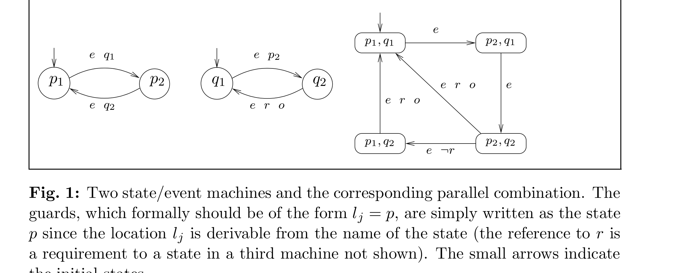
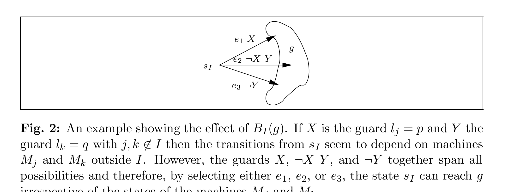
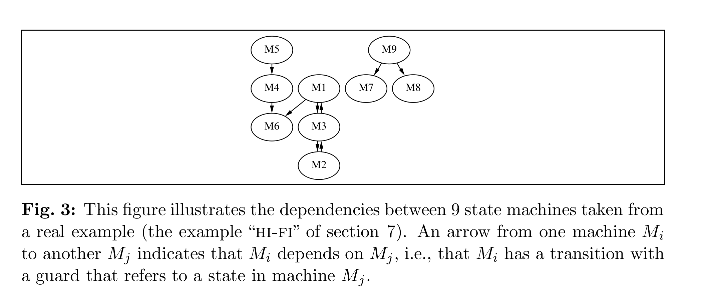
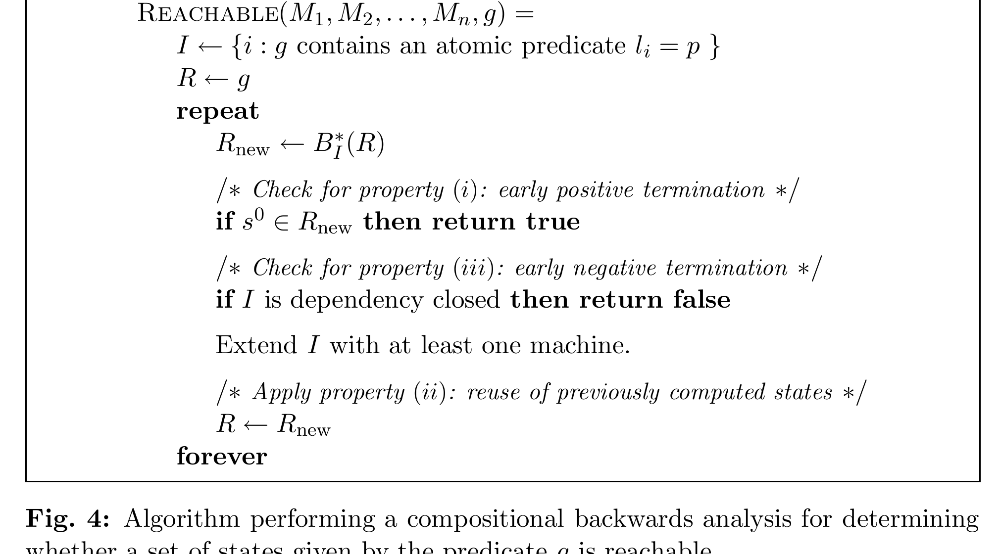
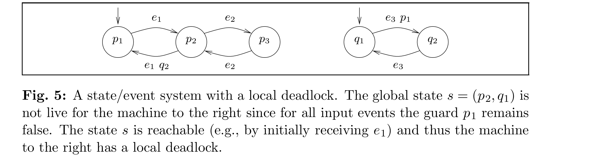
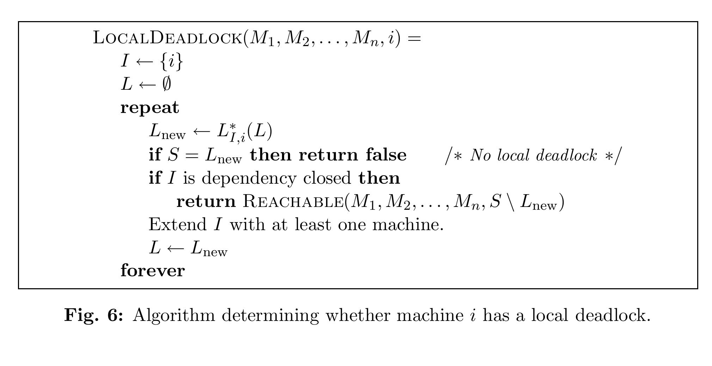
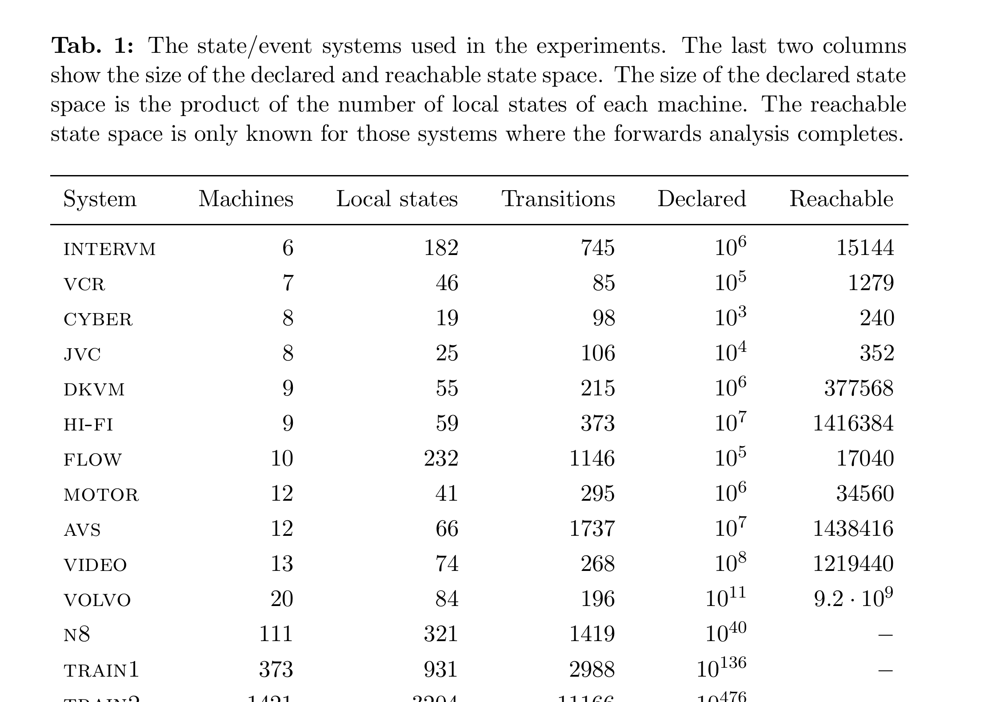
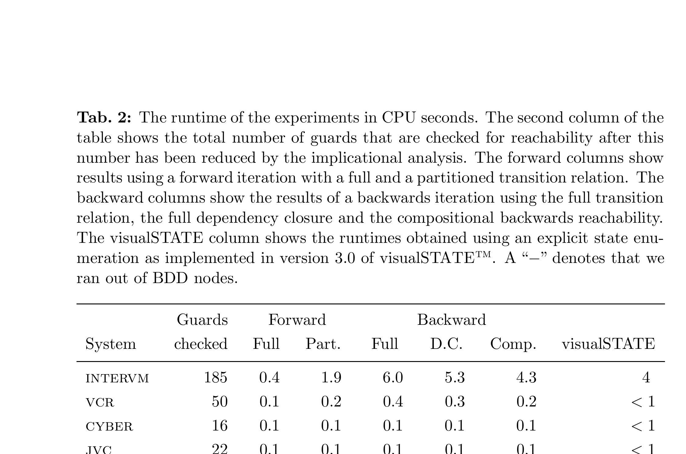
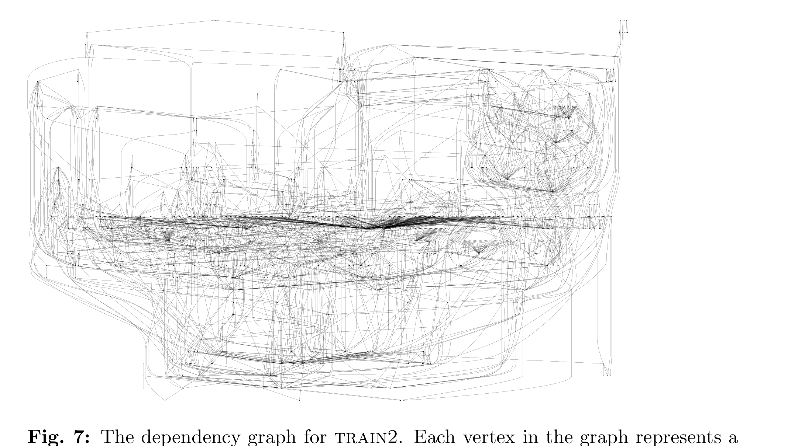
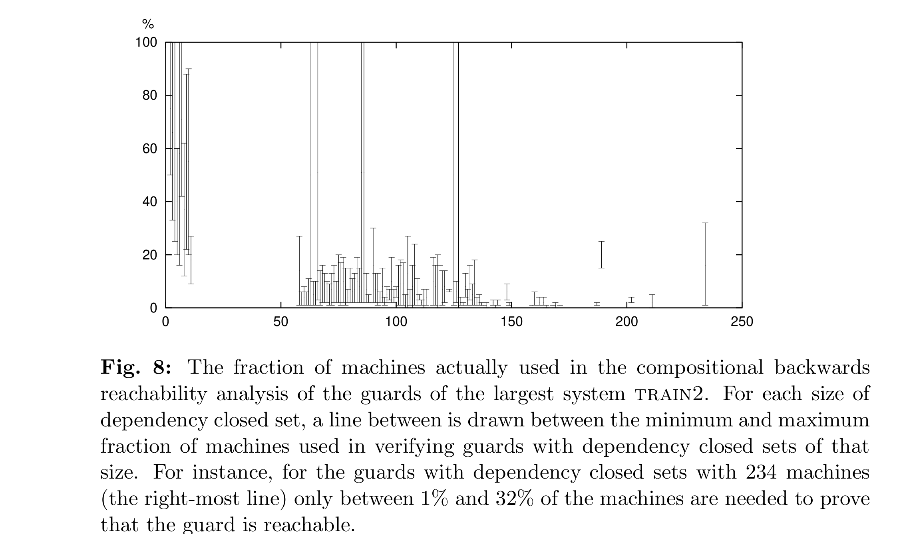

# Verification of Large State/Event Systems using Compositionality and Dependency Analysis

Jørn Lind-Nielsen, Henrik Reif Andersen, Henrik Hulgaard  
*The IT University of Copenhagen*

Gerd Behrmann, Kåre Kristoffersen, Kim G. Larsen  
*BRICS, Department of Computer Science, Aalborg University*

## Abstract

A *state/event model* is a concurrent version of Mealy machines used for describing embedded reactive systems. This paper introduces a technique that uses compositionality and dependency analysis to significantly improve the efficiency of symbolic model checking of state/event models. It makes possible automated verification of large industrial designs with the use of only modest resources (less than 5 minutes on a standard PC for a model with 1421 concurrent machines). The results of the paper are being implemented in the next version of the commercial tool visualSTATE(TM).

**Keywords:** Formal verification, symbolic model checking, backwards reachability, embedded software.

## 1 Introduction

Symbolic model checking is a powerful technique for formal verification of finite-state concurrent systems. The technique has proven very efficient for verifying hardware systems: circuits with an extremely large number of reachable states have been verified. However, it is not clear whether model checking is effective for other kinds of concurrent systems as, for example, software systems. One reason that symbolic model checking may not be as efficient is that software systems tend to be both larger and less regularly structured than hardware. For example, many of the results reported for verifying large hardware systems have been for linear structures like stacks or pipelines (see, e.g., [BCL+94]) for which it is known that the size of the transition relation (when represented as an ROBDD) grows linearly with the size of the system [McM93]. Only recently have the first experiments on larger realistic software systems been reported [ABB+96, SA96].

This paper presents a technique that significantly improves the performance of symbolic model checking of large embedded reactive systems modeled using a *state/event model*. The model can be viewed as a simplified version of StateCharts [Har87] or RSML [LHHR94]. The state/event model is a concurrent version of Mealy machines. It consists of a fixed number of concurrent finite state machines that have pairs of input events and output actions associated with the transitions of the machines. The model is synchronous: each input event is reacted upon by all machines in lock-step; the total output is the multi-set union of the output actions of the individual machines. Further synchronization between the machines is achieved by associating a guard with the transitions. Guards are Boolean combinations of conditions on the local states of the other machines. In this way, the firing of transitions in one machine can be made conditional on the local state of other machines. If a machine has no enabled transition for a particular input event, it simply does not perform any state change.

The state/event model is capable of modeling both synchronous and asynchronous systems. If two guards in different machines share an input event, the transitions fire simultaneously, i.e., synchronously, on that event. If two enabled transitions in different machines have different input events, they can fire in either order, i.e., asynchronously.

The state/event model is convenient for describing the control portion of embedded reactive systems, including smaller systems as cellular phones, hi-fi equipment, and cruise controls for cars, and large systems as train simulators, flight control systems, telephone and communication protocols. The model is used in the commercial tool visualSTATE(TM) [vA96]. This tool assists in developing embedded reactive software by allowing the designer to construct and manipulate a state/event model. The tool is used to simulate the model, check the consistency of the model, and from the model automatically generate code for the hardware of an embedded system. The consistency checker is in fact a verification tool that checks for a range of properties that any state/event model should have. Some of the checks must be passed for the generated code to be correct, for instance, it is crucial that the model is deterministic. Other checks are issued as warnings that might be design errors such as transitions that can never fire.

State/event models can be extremely large and, unlike in traditional model checking, the number of checks is at least linear in the size of the model. This paper reports results for models with up to 1421 concurrent state machines ($10^{476}$ states). For systems of this size, traditional symbolic model checking techniques fail, even when using a partitioned transition relation [BCL91] and backwards iteration. We present a compositional technique that initially considers only a few machines in determining satisfaction of the verification task and, if necessary, gradually increases the number of considered machines. The machines considered are determined using a dependency analysis of the structure of the system.

The results are encouraging. A number of large state/event models from industrial applications have been verified. Even the largest model with 1421 concurrent machines can be verified with modest resources (it takes less than 5 minutes on a standard PC). Compared with the current version of visualSTATE(TM), the results improve on the efficiency of checking smaller instances and dramatically increase the size of systems that can be verified.

### Related Work

The use of ROBDDs [Bry86] in model checking was introduced by Burch *et al.* [BCM+90] and Coudert *et al.* [CMB90]. Several improvements have been developed since, such as using a partitioned transition relation [BCL91, GB94] and simplifying the ROBDD representation during the fixed-point iteration [CBM89]. Many of these improvements are implemented in the tool SMV [McM93]. Other techniques like abstraction [CGL94] and compositional model checking [CLM89] further reduce the complexity of the verification task, but require human insight and interaction.

Our compositional technique is efficient because it only considers subsets of the model. Several other techniques attempt to improve the efficiency of the verification in this way. For example, [BSV93] presents a conservative technique for showing emptiness of L-processes based on including only a subset of the processes. The technique is based on analyzing an error trace from the verifier, and use this trace to modify the considered subset of L-processes. Pardo and Hachtel [PH97] utilizes the structure of a given formula in the propositional $\mu$-calculus to find appropriate abstractions whereas our technique depends on the structure of the model.

Another technique, based on ROBDDs, that also exploits the structure of the system is presented in [LPJ+96]. On the surface this technique is very close to the one presented here and thus we will discuss it in more detail. The technique in [LPJ+96] uses a partitioned transition relation and a greedy heuristic is used to select subsets of the transition relation. For each chosen subset, a complete fixed-point iteration is performed. If the formula cannot be proven after this iteration, a larger subset is chosen. In case of an invalid formula the algorithm only terminates when the full transition relation has been constructed (or memory or time has been exhausted). To compare this approach with the one presented here, we can consider a subset of the transition relation as being similar to a subset of the machines in the state/event model. The approach of [LPJ+96] differs from ours in several central aspects:

- In selecting a new machine to include in the transition relation, [LPJ+96] uses a greedy strategy involving a fixed-point iteration for each of the remaining machines. If the system only has a single initial state, as in state/event systems, the greedy strategy reduces to selecting an arbitrary machine. We chose a new machine based on an initial dependency analysis and thus avoid any extraneous fixed-point iterations.
- Due to a central monotonicity result (lemma 1), we can reuse the previously computed portion of the state space instead of having to start from scratch each time a new machine is added.
- In case the property to be verified is invalid, we only include those machines that are actually dependent on each other in the transition relation. In these cases, [LPJ+96] may have to include all machines to disprove the property.
- Even when all machines are needed, experiments have shown that our technique of including machines one at a time (exploiting the monotonicity property) is faster than performing a traditional fixed-point iteration using a partitioned transition relation and early variable quantification. The technique of [LPJ+96] does not have this property.

The compositional technique presented here shares ideas with partial model checking [ASM97, And95, KLL+97], but explicitly analyzes the structure of the system. Finally, experiments by Anderson *et al.* [ABB+96] and Sreemani and Atlee [SA96] verified large software systems using SMV. The technique presented here significantly improves on the results we have obtained using SMV and makes it possible to verify larger systems.

### Outline

The state/event model is formally described in section 2. Section 3 explains how the range of consistency checks performed by visualSTATE(TM) are reduced to two simple types of checks. Section 4 shows how state/event systems are encoded by ROBDDs. The compositional technique and the dependency analysis is introduced in section 5, and further developed in section 6. The technique is evaluated in section 7 and section 8 draws some conclusions.

## 2 State/Event Systems

A state/event system consists of $n$ machines $M_1, \ldots, M_n$ over an alphabet of input events $E$ and an output alphabet $O$. Each machine $M_i$ is a triple $(S_i, s_i^0, T_i)$ of local states, an initial state, and a set of transitions. The set of transitions is a relation

$$
T_i \subseteq S_i \times E \times G_i \times M(O) \times S_i,
$$

where $M(O)$ is a multi-set of outputs, and $G_i$ is the set of guards not containing references to machine $i$. These guards are generated from the following simple grammar for Boolean expressions:

$$
g ::= l_j = p \mid \neg g \mid g \land g \mid tt.
$$

The atomic predicate $l_j = p$ is read as "machine $j$ is at local state $p$" and $tt$ denotes a true guard. The global state set of the state/event system is the product of the local state sets: $S = S_1 \times S_2 \times \cdots \times S_n$. The guards are interpreted straightforwardly over $S$: for any $s \in S$, $s \models l_j = p$ holds exactly when the $j$'th component of $s$ is $p$, i.e., $s_j = p$. The notation $g[s_j/l_j]$ denotes that $s_j$ is substituted for $l_j$, with occurrences of atomic propositions of the form $s_j = p$ replaced by $tt$ or $\neg tt$ depending on whether $s_j$ is identical to $p$.

Considering a global state $s$, all guards in the transition relation can be evaluated. We define a version of the transition relation in which the guards have been evaluated. This relation is denoted $s \xrightarrow[e,o]{i} s_i'$ expressing that machine $i$ when receiving input event $e$ makes a transition from $s_i$ to $s_i'$ and generates output $o$. Formally,

$$
s \xrightarrow[e,o]{i} s_i' \Leftrightarrow \exists g.\ (s_i,e,g,o,s_i') \in T_i \text{ and } s \models g.
$$

Two machines can be combined into one. More generally if $M_I$ and $M_J$ are compositions of two disjoint sets of machines $I$ and $J$, $I, J \subseteq \{1, \ldots, n\}$, we can combine them into one $M_{IJ} = M_I \times M_J = (S_{IJ}, (s_{IJ}^0), T_{IJ})$, where $S_{IJ} = S_I \times S_J$ and $s_{IJ}^0 = (s_I^0, s_J^0)$. The transition relation $T_{IJ}$ is a subset of $S_{IJ} \times E \times G_{IJ} \times M(O) \times S_{IJ}$, where $G_{IJ}$ are the guards in the composite machine. By construction of $T_{IJ}$, the guards $G_{IJ}$ will not contain any references to machines in $I \cup J$. To define $T_{IJ}$, we introduce the predicate `idle`:

$$
idle(T_I, s_I, e) = \bigwedge \{\neg g \mid \exists o, s_I'.\ (s_I,e,g,o,s_I') \in T_I\},
$$

which holds for states in which no transitions in $M_I$ are enabled at state $s_I$ when receiving the input event $e$. The transition relation $T_{IJ}$ is defined by the following inference rules (the symbol $\uplus$ denotes multi-set union):

$$
\frac{(s_I,e,g_1,o_1,s_I') \in T_I \qquad (s_J,e,g_2,o_2,s_J') \in T_J}
{((s_I,s_J),e,g,o_1 \uplus o_2,(s_I',s_J')) \in T_{IJ}}
\qquad
g = g_1[s_J/l_J] \land g_2[s_I/l_I]
$$

$$
\frac{(s_I,e,g_1,o_1,s_I') \in T_I}
{((s_I,s_J),e,g,o_1,(s_I',s_J)) \in T_{IJ}}
\qquad
g = g_1[s_J/l_J] \land idle(T_J,s_J,e)[s_I/l_I]
$$

$$
\frac{(s_J,e,g_2,o_2,s_J') \in T_J}
{((s_I,s_J),e,g,o_2,(s_I,s_J')) \in T_{IJ}}
\qquad
g = idle(T_I,s_I,e)[s_J/l_J] \land g_2[s_I/l_I].
$$

The rules show the synchronous behavior of state/event systems. The first rule represents the case where there exists an enabled transition with input event $e$ in both $T_I$ and $T_J$ and the resulting transition in $T_{IJ}$ represents the synchronization on $e$. The other two cases occur if no enabled transition exists in either $T_I$ or $T_J$.

*Fig. 1: Two state/event machines and the corresponding parallel combination. The guards, which formally should be of the form $l_j = p$, are simply written as the state $p$ since the location $l_j$ is derivable from the name of the state (the reference to $r$ is a requirement to a state in a third machine not shown). The small arrows indicate the initial states.*

Figure 1 shows two machines and the parallel composition of them. Notice how the two machines synchronize on the common input event $e$.

The full combination of all $n$ machines, $T = \prod_{i=1}^n T_i$, yields a Mealy machine. We extend the transition relation of $T$ to a total relation $s \xrightarrow[e]{o} s'$ as follows: $s \xrightarrow[e]{o} s'$ if there exists a true guard $g$ such that $(s,e,g,o,s') \in T$. If no such guard exists, i.e., all machines idle on input event $e$, the relation contains an idling step, $s \xrightarrow[e]{\emptyset} s$.

## 3 Consistency Checks

The consistency checker in visualSTATE(TM) performs seven predefined types of checks, each of which can be reduced to verifying one of two types of properties. The first type is a reachability property. For instance, visualSTATE(TM) performs a check for "conflicting transitions" *i.e.*, it checks whether two or more transitions can become enabled in the same local state, leading to non-determinism. This can be reduced to questions of reachability by considering all pairs of guards $g_1$ and $g_2$ of transitions with the same local state $s_i$ and input event $e$. A conflict can occur if a global state is reachable in which $(l_j = s_i) \land g_1 \land g_2$ is satisfied.

In total, five of the seven types of checks reduce to reachability checks. Four of these, such as check for transitions that are never enabled and check for states that are never reached, generate a number of reachability checks which is linear in the number of transitions, $t$. In the worst-case the check for conflicting transitions gives rise to a number of reachability checks which is quadratic in the number of transitions. However, in practice very few transitions have the same starting local state and input event, thus in practice the number of checks generated is much smaller than $t$.

The remaining two types of consistency checks reduce to a check for absence of local deadlocks. A local deadlock occurs if the system can reach a state in which one of the machines idles forever on all input events. This check is made for each of the $n$ machines. In total at least $t + n$ checks have to be performed making the verification of state/event systems quite different from traditional model checking where typically only a few key properties are verified.

We attempt to reduce the number of reachability checks by performing an implicational analysis between the guards of the checks. If a guard $g_1$ implies another guard $g_2$ then clearly, if $g_1$ is reachable so is $g_2$. To use this information we start by sorting all the guards in ascending order of the size of their satisfying state space. In this way the most specific guards are checked first and for each new guard to be checked we compare it to all the already checked (and reachable) guards. If the new guard includes one of them, then we know that it is satisfiable. In our experiments, between 40% and 94% of the reachability checks are eliminated in this manner.

## 4 ROBDD Representation

This section describes how Reduced Ordered Binary Decision Diagrams (ROBDDs) [Bry86] are used to represent sets of states and the transition relation. We also show how to perform a traditional forward iteration to construct the set of reachable states from which it is straightforward to check each of the reachability checks.

To construct the ROBDD $\tilde T$ for the transition relation $T$, we first construct the local transition relations $\tilde T_i$ for each machine $M_i$. The variables of the ROBDD represent an encoding of the input events, the current states, and the next-states. The variables are ordered as follows: The first $\|E\|$ variables encode the input events $E$ ($\|X\|$ denotes $\lceil \log_2 X \rceil$) and are denoted $V_E$. Then follow $2\|S_i\|$ variables $V_{i,1}, V_{i,1}', \ldots, V_{i,\|S_i\|}, V_{i,\|S_i\|}'$ encoding the current- (unprimed variables) and the next-states (primed variables) for machine $i$. The machines are ordered in the same order in which they occur in the input, although other orders may exist which might improve performance.

The transition relation $\tilde t_i$ for machine $i$ is constructed as an ROBDD predicate over these variables. The ROBDD for a transition

$$
(s_i,e,g,o,s_i') \in T_i
$$

is constructed as the conjunction of the ROBDD encodings of $s_i$, $e$, $g$, and $s_i'$. (The outputs are not encoded as they have no influence on the reachable states of the system.) The encoding of $s_i$, $e$, and $s_i'$ is straightforward and the encoding of the guard $g$ is done by converting all atomic predicates $l_j = p$ to ROBDD predicates over the current-state variables for machine $M_j$ and then performing the Boolean operations in the guard. The encoding of all transitions of machine $i$ is obtained from the disjunction of the encoding of the individual transitions:

$$
\tilde t_i = \bigvee_{(s_i,e,g,o,s_i') \in T_i} \tilde s_i \land \tilde e \land \tilde g \land \tilde s_i',
$$

where $\tilde e$ is the ROBDD encoding of input event $e$ and $\tilde s_i$ and $\tilde s_i'$ are the ROBDD encodings of the current-state $s_i$ and next-state $s_i'$, respectively.

To properly encode the global transition relation $\tilde T$, we need to deal with situations where no transitions of $T_i$ are enabled. In those cases we want the machine $i$ to stay in its current state. We construct an ROBDD $neg_i$ representing that no transition is enabled by negating all guards in machine $i$ (including the input events):

$$
neg_i = \bigwedge_{(s_i,e,g,o,s_i') \in T_i} \neg(\tilde s_i \land \tilde g \land \tilde e).
$$

The ROBDD $equ_i$ encodes that machine $i$ does not change state by requiring that the next-state is identical to the current-state:

$$
equ_i = \bigwedge_{j=1}^{\|S_i\|} V_{i,j} \leftrightarrow V_{i,j}'.
$$

The local transition relation for machine $i$ is then:

$$
\tilde T_i = \tilde t_i \lor (neg_i \land equ_i).
$$

The ROBDD $\tilde T$ for the full transition relation is the conjunction of the local transition relations:

$$
\tilde T = \bigwedge_{i=1}^n \tilde T_i.
$$

One way to check whether a state $s$ is reachable is to construct the reachable state space $R$. The construction of $R$ can be done by a standard forward iteration of the transition relation, starting with the initial state $s^0$:

$$
R_0 = \tilde s^0
$$

$$
R_k = R_{k-1} \lor (\exists V, V_E.\ \tilde T \land R_{k-1})[V/V'].
$$

where $V$ is the set of current-state variables, $V'$ is the set of next-state variables, and $(\cdot)[V/V']$ denotes the result of replacing all the primed variables in $V'$ by their unprimed versions.

The construction of the full transition relation $\tilde T$ can be avoided by using a partitioned transition relation [BCL91] together with early variable quantification. This is done by identifying sets $I_j$ of transition relations that, when applied in the correct order, allows for early quantification of the state variables that no other transition relations depend on. If $V_{I_j}$ are these variables and we have $m$ sets, then we get:

$$
R_0 = \tilde s^0
$$

$$
R_k = R_{k-1} \lor \Bigl(\exists V_E.\exists V_{I_1}.\bigwedge_{i \in I_1}\tilde T_i \land \cdots \land (\exists V_{I_m}.\bigwedge_{i \in I_m}\tilde T_i \land R_{k-1})\Bigr)[V/V'].
$$

Both approaches have been implemented and tested on our examples as shown in section 7. Here we see that the calculation of the reachable state space using the full transition relation is both fast and efficient for the small examples. However, for models with more than approximately 30 machines, both approaches fail to complete.

## 5 Compositional Backwards Reachability

Backwards reachability analysis is an alternative to forward reachability analysis: The verification task is to determine whether a guard $g$ can be satisfied. Instead of computing the reachable state space and check that $g$ is valid somewhere in this set, we start with the set of states in which $g$ is valid and compute in a backwards iteration, states that can reach a state in which $g$ is satisfied. The goal is to determine whether the initial state is among these states. Our novel idea is to perform the backwards iteration in a compositional manner considering only a minimal number of machines. Initially, only machines mentioned in $g$ will be taken into account. Later also machines on which these depend will be included.

Notice that compared to the forwards iteration, this approach has an apparent drawback when performing a large number of reachability checks: instead of just one fixed-point iteration to construct the reachable state space $R$ (and then trivially verify each of the properties), a new fixed-point iteration is necessary for each property that is checked. However, our experiments clearly demonstrate that when using a compositional backwards iteration, each of the fixed-point iterations can be completed even for very large models whereas the forwards iteration fails to complete the construction of $R$ for even medium sized models.

To formalize the backwards compositional technique, we need a semantic version of the concept of dependency. For a subset of the machines $I \subseteq \{1, \ldots, n\}$, two states $s, s' \in S$ are *I-equivalent*, written $s =_I s'$, if for all $i \in I$, $s_i = s_i'$ (the primes are here used to denote another state and is not related to the next-states). For example, the equivalence $(p_1, q_2, r_1) =_I (p_1, q_2, r_2)$ holds for $I = \{1, 2\}$ but not for $I = \{2, 3\}$. If a subset $P$ of the global states $S$ only is constrained by components in some index set $I$ we can think of $P$ as having $I$ as a sort. This leads to the following definition: a subset $P$ of $S$ is *I-sorted* if for all $s, s' \in S$,

$$
s \in P \text{ and } s =_I s' \Rightarrow s' \in P.
$$

As an example, consider a guard $g$ which mentions only machines 1 and 3. The set of states defined by $g$ is $I$-sorted for any $I$ containing 1 and 3.[^1] Another understanding of the definition is that if a set $P$ is $I$-sorted, it only depends on machines in $I$.

From an $I$-sorted set defined by $g$ we perform a backwards reachability computation by including states which, irrespective of the states of the machines in $I$, can reach $g$. One backward step is given by the function $B_I(g)$ defined by:

$$
B_I(g) = \{s \in S \mid \forall s' \in S.\ s =_I s' \Rightarrow \exists e,o,s''.\ s' \xrightarrow[e,o]{} s'' \text{ and } s'' \in g\}. \tag{1}
$$

By definition $B_I(g)$ is $I$-sorted. The set $B_I(g)$ is the set of states which independently of machines in $I$, by some input event $e$, can reach a state in $g$. Observe that $B_I(g)$ is monotonic in both $g$ and $I$.

*Fig. 2: An example showing the effect of $B_I(g)$. If $X$ is the guard $l_j = p$ and $Y$ the guard $l_k = q$ with $j,k \notin I$ then the transitions from $s_I$ seem to depend on machines $M_j$ and $M_k$ outside $I$. However, the guards $X$, $\neg X\,Y$, and $\neg Y$ together span all possibilities and therefore, by selecting either $e_1$, $e_2$, or $e_3$, the state $s_I$ can reach $g$ irrespective of the states of the machines $M_j$ and $M_k$.*

Figure 2 shows how a state $s_I$ of a machine is included in $B_I(g)$ although it syntactically seems to depend on machines outside $I$.

By iterating the application of $B_I$, we can compute the minimum set of states containing $g$ and closed under application of $B_I$. This is the minimum fixed-point $\mu X.g \cup B_I(X)$, which we refer to as $B_I^*(g)$. Note that $B_{\{1,\ldots,n\}}^*(g)$ becomes the desired set of states which can reach $g$.

A set of indices $I$ is said to be *dependency closed* if none of the machines in $I$ depend on machines outside $I$. Formally, $I$ is dependency closed if for all $i \in I$, states $s', s$, $s_i$, input events $e$, and outputs $o$, $s \xrightarrow[e,o]{i} s_i$ and $s' =_I s$ implies $s' \xrightarrow[e,o]{i} s_i$. We say that one machine $M_i$ is dependent on another $M_j$ if $M_i$ has a transition with a guard that refers to a state in machine $M_j$. We use this syntactic notion of dependency to determine whether a set of indices $I$ is dependency closed. For example, from the dependency graph in Fig. 3 we observe that the set $I = \{1,2,3,6\}$ is dependency closed.

The basic properties of the sets $B_I^*(g)$ are captured by the following lemma:

**Lemma 1 (Compositional Reachability Lemma).** Assume $g$ is an $I$-sorted subset of $S$. For all subsets of machines $I$, $J$ with $I \subseteq J$ the following holds:

1. $B_I^*(g) \subseteq B_J^*(g)$
2. $B_J^*(g) = B_J^*(B_I^*(g))$
3. $I$ dependency closed $\Rightarrow B_I^*(g) = B_J^*(g)$

**Proof:** We first observe directly from the definition that $B_I(g)$ is monotonic in both $I$ and $g$, i.e., for any $J$ with $I \subseteq J$ and $g'$ with $g \subseteq g'$ we have:

$$
B_I(g) \subseteq B_J(g) \tag{2}
$$

$$
B_I(g) \subseteq B_I(g'). \tag{3}
$$

The operation of taking minimum fixed points is also monotonic, therefore for any $I$ and $J$ with $I \subseteq J$ we have from (2):

$$
B_I^*(g) = \mu X.g \cup B_I(X) \subseteq \mu X.g \cup B_J(X) = B_J^*(g)
$$

proving that $B_I^*(g)$ is monotonic in the index set of machines $I$, which is (i) of the lemma.

To prove (ii) of the lemma, first observe from the definition of $B_I^*(g)$ that $g \subseteq B_I^*(g)$, hence by monotonicity of $B_J(\cdot)$ and $B_J^*(\cdot)$ it follows that

$$
B_J^*(g) \subseteq B_J^*(B_I^*(g)) \subseteq B_J^*(B_J^*(g)) = B_J^*(g).
$$

The last equality follows from the fact that $B_J^*(g)$ is a fixed-point. We have proved (ii) of the lemma.

To prove (iii) we first observe that the inclusion $\subseteq$ holds by (i). We therefore concentrate on the other inclusion $\supseteq$. We employ the following fixed point induction principle (due to David Park):

$$
F(X) \subseteq X \text{ implies } \mu Y.F(Y) \subseteq X.
$$

Recalling that a set $X$ for which $F(X) \subseteq X$ is called a pre-fixed point of $X$ we can phrase this as: "If $\mu Y.F(Y)$ is the minimum pre-fixed point of $F$, therefore if $X$ is some other pre-fixed point of $F$, then it must include the minimum one." We must therefore just argue that

$$
g \cup B_J(B_I^*(g)) \subseteq B_I^*(g)
$$

in order to have proven (iii). A further simplification is obtained by observing that by definition $g \subseteq B_I^*(g)$ and we therefore only need to prove that

$$
B_J(B_I^*(g)) \setminus g \subseteq B_I^*(g).
$$

(If the sets $x$ and $y$ are contained in a third set $z$ then also their least upper bound $x \cup y$ is contained within $z$.) Assume now that $s$ is some state in $B_J(B_I^*(g)) \setminus g$. Then by definition of $B_J(\cdot)$ the following holds:

$$
\forall s' \in S.\ s =_J s' \Rightarrow \exists e,o,s''.\ s' \xrightarrow[e,o]{} s'' \text{ and } s'' \in B_I^*(g). \tag{4}
$$

To show that $s$ is in $B_I^*(g)$ we need to prove that the following holds:

$$
\forall s' \in S.\ s =_I s' \Rightarrow \exists e,o',s'''.\ s' \xrightarrow[e,o']{} s''' \text{ and } s''' \in B_I^*(g). \tag{5}
$$

*Fig. 3: This figure illustrates the dependencies between 9 state machines taken from a real example (the example "HI-FI" of section 7). An arrow from one machine $M_i$ to another $M_j$ indicates that $M_i$ depends on $M_j$, i.e., that $M_i$ has a transition with a guard that refers to a state in machine $M_j$.*

From (4), taking $s' = s$, it follows that

$$
\exists e,o,s''.\ s \xrightarrow[e,o]{} s'' \text{ and } s'' \in B_I^*(g). \tag{6}
$$

Consider a state $s'$ such that $s =_I s'$. Let $s''$ be the state reached by firing $e$ from $s$, $s \xrightarrow[e,o]{} s''$ and similarly, let $s'''$ be the state reached from $s'$, $s' \xrightarrow[e,o']{} s'''$ ($s''$ and $s'''$ are well-defined since the transition relation is total). Then from the definition of dependency closure of $I$, it follows that for all $i \in I$, $s_i'' = s_i'''$ and thus $s'' =_I s'''$. From (6), $s'' \in B_I^*(g)$ and $s'' =_I s'''$, it follows that $s''' \in B_I^*(g)$ since $B_I^*(g)$ is $I$-sorted. We have proved (5) and thus also (iii) of the lemma. $\blacksquare$

The results of the lemma are applied in the following manner. To check whether a guard $g$ is reachable, we first consider the set of machines $I_1$ syntactically mentioned in $g$. Clearly, $g$ is $I_1$-sorted. We then compute $B_{I_1}^*(g)$ by a standard fixed-point iteration. If the initial state $s^0$ belongs to $B_{I_1}^*(g)$, then by (i) $s^0 \in B_{\{1,\ldots,n\}}^*(g)$ and therefore $g$ is reachable from $s^0$ and we are done. If not, we extend $I_1$ to a larger set of machines $I_2$. We then reuse $B_{I_1}^*(g)$ to compute $B_{I_2}^*(g)$ as $B_{I_2}^*(B_{I_1}^*(g))$ which is correct by (ii). We continue like this until $s^0$ has been found in one of the sets or an index set $I_k$ is dependency closed. In the latter case we have by (iii) $B_{I_k}^*(g) = B_{\{1,\ldots,n\}}^*(g)$ and $g$ is unreachable unless $s^0 \in B_{I_k}^*(g)$. The algorithm for performing a compositional backwards analysis is shown in Fig. 4.

We extend $I$ by adding machines that are syntactically mentioned on guards in transitions of machines in $I$, i.e., machines are included in $I$ by traversing the dependency graph in a breadth-first manner. As an example, assume that we want to determine whether the guard $g = (l_1 = p \land l_3 = q)$ is reachable in the example of Fig. 3. The initial index set is $I_1 = \{1,3\}$. If this is not enough to show $g$ reachable, the second index set $I_2 = \{1,3,6,2\}$ is used. Since this set is dependency closed, $g$ is reachable if and only if the initial state belongs to $B_{I_2}^*(B_{I_1}^*(g))$.

The above construction is based on a backwards iteration. A dual version of $B_I$ for a forwards iteration could be defined. However, such a definition would not make use of the dependency information since $s^0$ is only $I$-sorted for $I = \{1,\ldots,n\}$. Therefore all machines would be considered in the first fixed-point iteration reducing it to the complete forwards iteration mentioned in the previous section.

*Fig. 4: Algorithm performing a compositional backwards analysis for determining whether a set of states given by the predicate $g$ is reachable.*

Seemingly, the definition of $B_I(g)$ requires knowledge of the global transition relation and therefore does not seem to yield any computational advantage. However, as explained below, using ROBDDs this can be avoided leading to an efficient computation of $B_I(g)$. The ROBDD $\widetilde{B_I}(\tilde g)$ representing one iteration backwards from the states represented by the ROBDD $\tilde g$ can be constructed immediately from the definition (1):

$$
\widetilde{B_I}(\tilde g) = \forall V_{\bar I}.\ \exists V_E, V'.\ \tilde T \land \tilde g[V'/V], \tag{7}
$$

where $\tilde g[V'/V]$ is equal to $\tilde g$ with all variables in $V$ replaced by their primed versions. It is essential to avoid building the global transition relation $\tilde T$. This is done by writing $\exists V' = \exists V_I' \exists V_{\bar I}'$ and $\tilde T = \tilde T_I \land \tilde T_{\bar I}$ where $\tilde T_I = \bigwedge_{i \in I}\tilde T_i$. This allows us to push the existential quantification of $V_{\bar I}'$ to $\tilde T_{\bar I}$ since $g$ is $I$-sorted and thus independent of the variables in $V_{\bar I}'$. As $\exists V_{\bar I}'.\tilde T_{\bar I}$ is a tautology (since the transition relation is total), equation (7) reduces to:

$$
\widetilde{B_I}(\tilde g) = \forall V_{\bar I}.\ \exists V_E, V_I'.\ \tilde T_I \land \tilde g[V'/V],
$$

which only uses the local transition relations for machines in $I$. Each $\tilde T_i$ refers only to primed variables in $V_i'$, allowing early variable quantification for each machine individually:

$$
\widetilde{B_I}(\tilde g) = \forall V_{\bar I}.\ \exists V_E.\ \exists V_{i_1}'.\tilde T_{i_1} \land (\exists V_{i_2}'.\tilde T_{i_2} \land \cdots \land (\exists V_{i_k}'.\tilde T_{i_k} \land \tilde g[V'/V])\cdots)
$$

for $I = \{i_1,i_2,\ldots,i_k\}$. This equation efficiently computes one step in the fixed-point iteration constructing $\widetilde{B_I^*}(\tilde g)$.

Notice, that the existential quantifications can be performed in any order. We have chosen the order in which the machines occur in the input, but other orders may exist which might improve performance.

## 6 Local Deadlock Detection

In checking for local deadlocks we use a construction similar to backwards reachability. To make the compositional backwards lemma applicable we work with the notion of a machine being *live* which is the exact dual of having a local deadlock. In words, a machine is live if it is always the case that there exists a way to make the machine move to a new local state. Formally, a global state $s$ is live for machine $i$ if there exists a sequence of states $s^1, s^2, \ldots, s^k$ with $s = s^1$ and $s^j \xrightarrow[e,o]{} s^{j+1}$ (for some $e$ and $o$) such that $s_i^k \ne s_i^1$. Machine $i$ is live if all reachable states are live for machine $i$. A simple example of a state/event system with a machine that is not live, i.e., contains a local deadlock, is shown in Fig. 5.

*Fig. 5: A state/event system with a local deadlock. The global state $s = (p_2,q_1)$ is not live for the machine to the right since for all input events the guard $p_1$ remains false. The state $s$ is reachable (e.g., by initially receiving $e_1$) and thus the machine to the right has a local deadlock.*

The check is divided into two parts. First, the set of all live states $L_i^*$ for machine $i$ is computed. Second, we check that all reachable states are in $L_i^*$. A straightforward but inefficient approach would be to compute the two sets and check for inclusion. However, we will take advantage of the compositional construction used in the backwards reachability in both parts of the check.

Similar to the definition of $B_I(g)$, we define $L_{I,i}(X)$ to be the set of states that are immediately live for machine $i \in I$ (independently of the machines outside $I$) or which leads to states in $X$ (i.e., states already assumed to be live for machine $i$):

$$
L_{I,i}(X) = \{s \in S \mid \forall s'.\ s =_I s' \Rightarrow \exists e,o,s''.\ s' \xrightarrow[e,o]{} s'' \text{ and } (s_i \ne s_i'' \text{ or } s'' \in X)\}. \tag{8}
$$

Compared to definition (1) the only difference is the extra possibility that the state is independently live, i.e., $s_i \ne s_i''$. The set of states that are live for machine $i$ independently of machines outside $I$ is then the set $L_{I,i}^*(\emptyset)$ where $L_{I,i}^*(Y)$ is the minimum fixed point defined by $L_{I,i}^*(Y) = \mu X.Y \cup L_{I,i}(X)$.

The three properties of the lemma also hold for $L_{I,i}^*(Y)$ when $Y$ is $I$-sorted. If $I$ is dependency closed it follows from property (iii) of the lemma that $L_{I,i}^*(\emptyset)$ equals $L_{\{1,\ldots,n\},i}^*(\emptyset)$ which is precisely the set of live states of machine $i$. This gives an efficient way to compute the sets $L_{I,i}^*(\emptyset)$ for different choices of $I$. We start with $I_1$ equal to $\{i\}$ and continue with larger $I_k$'s exactly as for the backwards reachability. The only difference is the termination conditions. One possible termination case is if $L_{I_k,i}^*(\emptyset)$ becomes equal to $S$ for some $k$. In that case the set of reachable states is contained in $L_{I_k,i}^*(\emptyset)$. From the monotonicity property (i) of the lemma it follows that machine $i$ is live and thus free of local deadlocks. The other termination case is when $I_k$ becomes dependency closed. Then we have to check whether there exists reachable states not in $L_{I_k,i}^*(\emptyset)$. This is done by a compositional backwards reachability check with $g = S \setminus L_{I_k,i}^*(\emptyset)$. The algorithm is shown in Fig. 6.

*Fig. 6: Algorithm determining whether machine $i$ has a local deadlock.*

## 7 Experimental Results

The technique presented above has been applied to a range of real industrial state/event systems and a set of systems constructed by students in a course on embedded systems. The examples are all constructed using visualSTATE(TM) [vA96]. They cover a large range of different applications and are structurally highly irregular.

The characteristics of the systems are shown in Tab. 1. The systems HI-FI, AVS, FLOW, MOTOR, INTERVM, DKVM, N8, TRAIN1 and TRAIN2 are industrial examples. HI-FI is the control part of an advanced compact hi-fi system, AVS is the control part of an audio-video system, FLOW is the control part of a flow meter, MOTOR is a motor control, INTERVM and DKVM are advanced vending machines, and TRAIN1 and TRAIN2 are both independent subsystems of a train simulator. The remaining examples are constructed by students. The VCR is a simulation of a video recorder, CYBER is an alarm clock, JVC is the control of a hi-fi system, VIDEO is a video player, and VOLVO is a simulation of the functionality of the dashboard of a car.

The experiments were carried out on a 350 MHz Pentium II PC with 64 MB RAM running Linux. To implement the ROBDD operations, we use the BuDDy package [LN99]. In all experiments we limit the total number of ROBDD nodes to three millions corresponding to 60 MB of memory. We check for each transition whether the guard is reachable and whether it is conflicting with other transitions. Furthermore, we check for each machine whether it has a local deadlock. The total runtime for these checks, including loadtime and the time to construct the dependency graphs, are shown in Tab. 2. The memory consumption is typically 3 MB and never more than 10 MB for the analyses that completes within the limits. The total number of checks is far from the quadratic worst-case, which supports the claim that in practice only very few checks are needed to check for conflicting rules (see section 3).

As expected, the forwards iteration with a full transition relation is efficient for smaller systems. It is remarkable that the ROBDD technique is superior to explicit state enumeration even for systems with a very small number of reachable states. Using the partitioned transition relation in the forwards iteration works poorly.

For the largest system, only the compositional backwards technique succeeds. In fact, for the three largest systems it is the most efficient and for the small examples it has performance comparable to the full forward technique. This is despite the fact that the number of checks is high and the backward iterations must be repeated for each check. From the experiments it seems that the compositional backwards technique is better than full forwards from somewhere around 30 machines.

*Tab. 1: The state/event systems used in the experiments. The last two columns show the size of the declared and reachable state space. The size of the declared state space is the product of the number of local states of each machine. The reachable state space is only known for those systems where the forwards analysis completes.*

| System | Machines | Local states | Transitions | Declared | Reachable |
| --- | ---: | ---: | ---: | ---: | ---: |
| INTERVM | 6 | 182 | 745 | $10^6$ | 15144 |
| VCR | 7 | 46 | 85 | $10^5$ | 1279 |
| CYBER | 8 | 19 | 98 | $10^3$ | 240 |
| JVC | 8 | 25 | 106 | $10^4$ | 352 |
| DKVM | 9 | 55 | 215 | $10^6$ | 377568 |
| HI-FI | 9 | 59 | 373 | $10^7$ | 1416384 |
| FLOW | 10 | 232 | 1146 | $10^5$ | 17040 |
| MOTOR | 12 | 41 | 295 | $10^6$ | 34560 |
| AVS | 12 | 66 | 1737 | $10^7$ | 1438416 |
| VIDEO | 13 | 74 | 268 | $10^8$ | 1219440 |
| VOLVO | 20 | 84 | 196 | $10^{11}$ | $9.2 \cdot 10^9$ |
| N8 | 111 | 321 | 1419 | $10^{40}$ | - |
| TRAIN1 | 373 | 931 | 2988 | $10^{136}$ | - |
| TRAIN2 | 1421 | 3204 | 11166 | $10^{476}$ | - |

*Tab. 2: The runtime of the experiments in CPU seconds. The second column of the table shows the total number of guards that are checked for reachability after this number has been reduced by the implicational analysis. The forward columns show results using a forward iteration with a full and a partitioned transition relation. The backward columns show the results of a backwards iteration using the full transition relation, the full dependency closure and the compositional backwards reachability. The visualSTATE column shows the runtimes obtained using an explicit state enumeration as implemented in version 3.0 of visualSTATE(TM). A "-" denotes that we ran out of BDD nodes.*

| System | Guards checked | Forward Full | Forward Part. | Backward Full | Backward D.C. | Backward Comp. | visualSTATE |
| --- | ---: | ---: | ---: | ---: | ---: | ---: | ---: |
| INTERVM | 185 | 0.4 | 1.9 | 6.0 | 5.3 | 4.3 | 4 |
| VCR | 50 | 0.1 | 0.2 | 0.4 | 0.3 | 0.2 | $< 1$ |
| CYBER | 16 | 0.1 | 0.1 | 0.1 | 0.1 | 0.1 | $< 1$ |
| JVC | 22 | 0.1 | 0.1 | 0.1 | 0.1 | 0.1 | $< 1$ |
| DKVM | 63 | 0.2 | 4.5 | 1.2 | 1.1 | 0.8 | 82 |
| HI-FI | 120 | 0.4 | 7.2 | 2.6 | 2.1 | 1.3 | 240 |
| FLOW | 230 | 0.4 | 1.2 | 2.4 | 1.7 | 1.6 | 5 |
| MOTOR | 123 | 0.3 | 3.3 | 3.2 | 3.1 | 0.7 | 6 |
| AVS | 173 | 2.4 | 37.4 | 4.1 | 2.9 | 2.0 | 679 |
| VIDEO | 122 | 0.5 | 11.0 | 1.3 | 0.8 | 0.5 | - |
| VOLVO | 83 | 1.4 | 355.0 | 1.9 | 0.6 | 0.6 | - |
| N8 | 710 | - | - | 673.5 | 207.1 | 37.8 | - |
| TRAIN1 | 1335 | - | - | 471.2 | 11.1 | 10.8 | - |
| TRAIN2 | 4708 | - | - | - | - | 273.0 | - |

*Fig. 7: The dependency graph for TRAIN2. Each vertex in the graph represents a state machine and an edge from vertex $i$ to $j$ indicates that machine $M_i$ depends on machine $M_j$, i.e., that $M_i$ has a transition with a guard that refers to a state in machine $M_j$.*

In order to understand why the compositional backwards technique is successful we have analyzed the largest system TRAIN2 in more detail. The dependency graph is shown in Fig. 7 to give an impression of the complexity and irregularity of the system. The largest dependency closed set contains 234 machines. For each guard we have computed the size of its smallest enclosing dependency closed set of machines, see Fig. 8. During the backwards iterations we have kept track of how many times the set of machines $I$ (used in $B_I^*(g)$) needed to be enlarged and how many machines were contained in the set $I$ when the iteration terminated. The dependency closed sets of cardinality 63, 66, 85, 86, 125, 127 all contain at least one machine with a guard that is unreachable. As is clearly seen from the figure, in these cases the iteration has to include the entire dependency closed set in order to prove that the initial state cannot reach the guard. But even then much is saved, as no more than 234 machines out of a possible 1421 are ever included. In fact, only in the case of unreachable guards are more than 32% of the machines in a dependency closed set ever needed (ignoring the small dependency closed sets with less than 12 machines). A reduction to 32% amounts to a potential reduction in runtime much larger than a third due to the potential exponential growth of the ROBDD representation in the number of transition relations $\tilde T_i$.

Our experience with the compositional backward technique is encouraging: It is generally efficient on industrial applications. It is implemented in the newer versions of visualSTATE(TM) and has drastically increased the size of models that the customers can verify.

*Fig. 8: The fraction of machines actually used in the compositional backwards reachability analysis of the guards of the largest system TRAIN2. For each size of dependency closed set, a line between is drawn between the minimum and maximum fraction of machines used in verifying guards with dependency closed sets of that size. For instance, for the guards with dependency closed sets with 234 machines (the right-most line) only between 1% and 32% of the machines are needed to prove that the guard is reachable.*

However, theory tells us to expect that there are examples where the execution time and memory requirement of any exhaustive verification algorithm will grow exponentially with the size of the design. Therefore, the quality of a verification technique must be judged on its ability to solve problems in real applications. As described above the compositional backwards technique has been very successful in this respect. However, we have encountered a problem with a state/event model of a compact zoom camera. Although it contains only 36 state machines, none of the techniques -- including the use of dynamic variable ordering -- are capable of fully verifying this application even using all the resources available to us. This points out that the exponentially growing examples can be encountered in practice and simply counting the number of machines is a bad measure of the complexity of the verification task. It is an active area of research to find better measures for predicting the difficulty of verifying a given design with a given technique.

## 8 Conclusion

We have presented a verification problem for state/event systems which is characterized by a large number of reachability checks. A compositional technique has been presented which significantly improves on the performance of symbolic model checking for large state/event systems. This has been demonstrated on a number of industrial systems of which the largest could not be verified using traditional symbolic model checking.

We have shown how the backward compositional technique is used to check for two types of properties, namely reachability and deadlocks. The check for local deadlock shows how some properties requiring nesting of fixed points can be checked efficiently with the compositional backwards analysis. Based on these ideas, we have recently shown how the compositional technique can be extended to handle full CTL [LNA99].

Other models of embedded control systems, such as StateCharts [Har87] and RSML [LHHR94], are often structured hierarchically, i.e., states may contain subcomponents. It is possible to extend the compositional backwards technique to not only handle hierarchical models but also to take advantage of the hierarchy to improve the efficiency of the verification [BLA+99].

In general, we believe that the compositional backwards technique works well when the model can be decomposed into independent components. On the other hand, if all components of the model are mutually dependent, the dependency closure will include all components and the compositional technique reduces to the standard model checking approaches. For example, in some models the components can communicate by using signals (or internal events). The signals are placed in a queue and only when this queue becomes empty can the components react on external events. In such a model, all components become mutually dependent due to synchronization with the centralized queue, resulting in a severe degradation in performance. In current research, we attempt to avoid the queue by using a difference semantics which allows the signals to be statically eliminated by turning them into state synchronizations. The goal is to allow the use of signals in the model without degrading the efficiency of the verification.

[^1]: If the guard is self-contradictory (always false), it will be $I$-sorted for any $I$. This reflects the fact that the semantic sortedness is more precise than syntactic occurrence.
