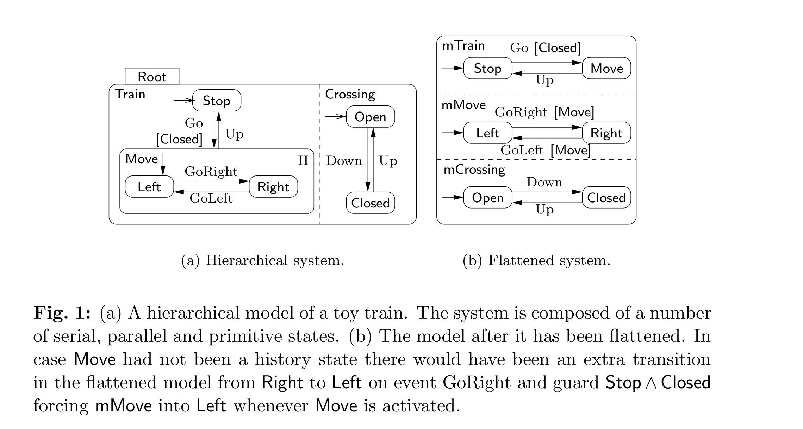
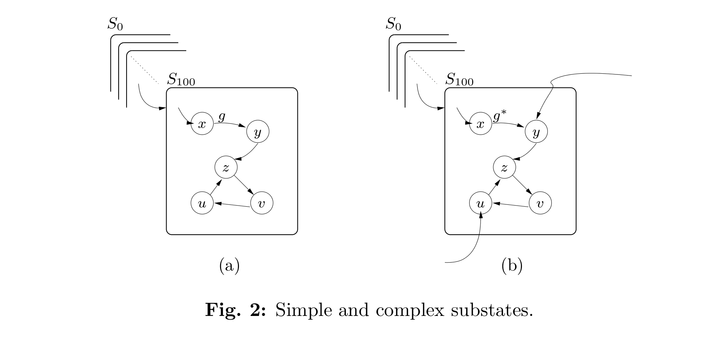
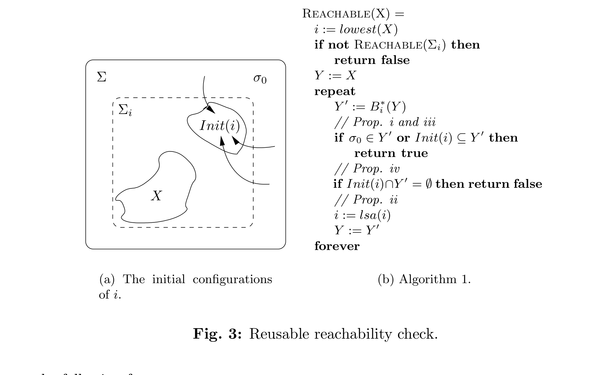
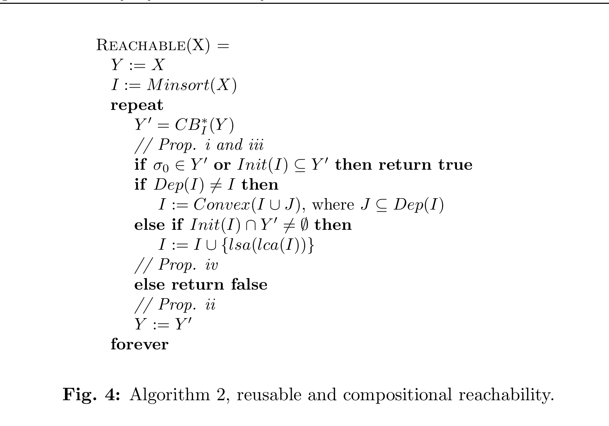
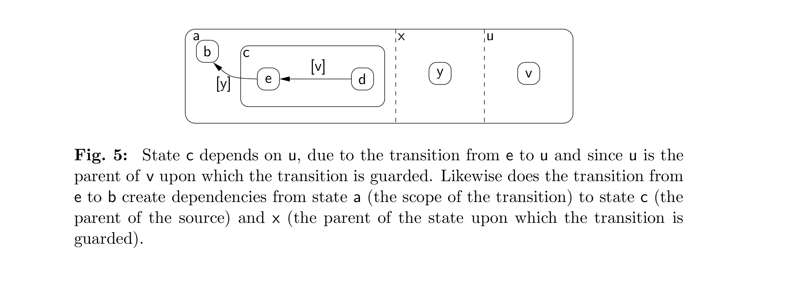
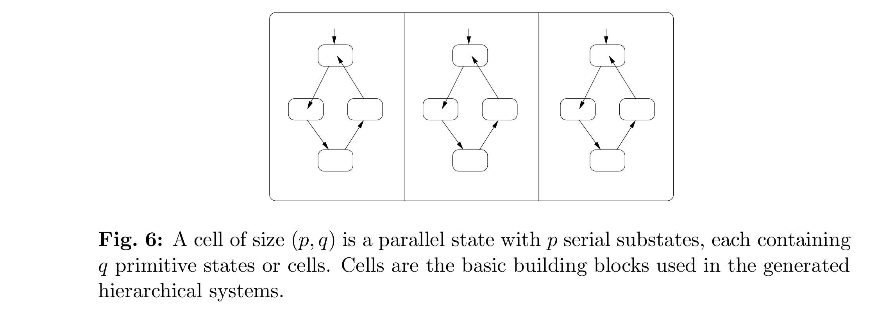
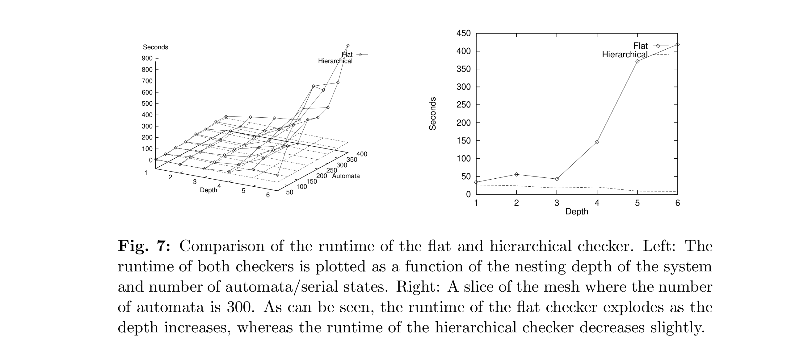
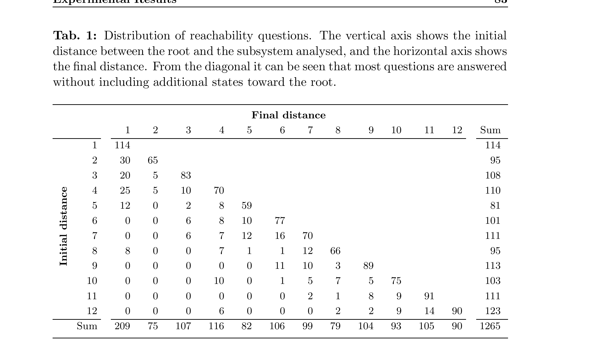

# Verification of Hierarchical State/Event Systems Using Reusability and Compositionality

G. Behrmann, K. G. Larsen  
*BRICS, Aalborg University, Denmark*

H. R. Andersen, H. Hulgaard, J. Lind-Nielsen  
*The IT University of Copenhagen, Denmark*

## Abstract

We investigate techniques for verifying hierarchical systems, i.e., finite-state systems with a nesting capability. The straightforward way of analysing a hierarchical system is to first flatten it into an equivalent non-hierarchical system and then apply existing finite-state system verification techniques. Though conceptually simple, flattening is severely punished by the hierarchical depth of a system. To alleviate this problem, we develop a technique that exploits the hierarchical structure to reuse earlier reachability checks of superstates to conclude reachability of substates. We combine the reusability technique with the successful compositional technique of [LNAB+98] and investigate the combination experimentally on industrial systems and hierarchical systems generated according to our expectations of real systems. The experimental results are very encouraging: whereas a flattening approach degrades in performance with an increase in the hierarchical depth (even when applying the technique of [LNAB+98]), the new approach proves not only insensitive to the hierarchical depth, but even leads to improved performance as the depth increases.

**Keywords:** Verification, hierarchy, state charts, compositionality.

## 1 Introduction

Finite-state machines provide a convenient model for describing the control-part (in contrast to the data-part) of embedded reactive systems including small systems such as cellular phones, HiFi equipment, cruise controls for cars, and large systems such as train simulators, flight control systems, telephone and communication protocols. We consider a version of finite-state machines called *state/event machines* (SEMs). The SEM model offers the designer a number of advantages including automatic generation of efficient and compact code and a platform for formal analysis such as model checking. In this paper we focus and contribute to the latter.

In practice, to describe complex systems using SEMs, a number of extensions are often useful. In particular, rather than modeling a complex control as a single SEM, it is often more convenient to use a concurrent composition of several component SEMs each typically dealing with a specific aspect of the control. Here we focus on an additional hierarchical extension of SEMs, in which states of component SEMs are either primitive or superstates which are themselves (compositions of) SEMs. Figure 1 illustrates a hierarchical description of a system with two components, a Train and a Crossing. Inside the Train, the state `Move` is a superstate with the two primitive states `Left` and `Right`. Transitions within one component may be guarded with conditions on the substates of other components. For example, the `Go` transition may only be fired when the superstate `Crossing` is in the substate `Closed`. The `Move` state is flagged as a history state indicated by the capital `H`. On deactivation, history states remember the last active substate and may reenter it when reactivated.

*Fig. 1: (a) A hierarchical model of a toy train. The system is composed of a number of serial, parallel and primitive states. (b) The model after it has been flattened. In case `Move` had not been a history state there would have been an extra transition in the flattened model from `Right` to `Left` on event `GoRight` and guard `Stop /\ Closed` forcing `mMove` into `Left` whenever `Move` is activated.*

The Statechart notation is the pioneer in hierarchical descriptions. Introduced in 1987 by David Harel [Har87], it has quickly been accepted as a compact and practical notation for reactive systems, as witnessed by a number of hierarchical specification formalisms such as Modecharts [JM87] and RSML [LHHR94]. Also, hierarchical descriptions play a central role in recent object-oriented software methodologies (for example OMT [RBP+91] and ROOM [SGW94]), most clearly demonstrated by the emerging UML standard [BJR97]. Finally, hierarchical notations are supported by a number of CASE tools, such as Statemate [sta], ObjecTime [obj], Rational Rose [rat], and visualSTATE(TM) version 4.0 [vis].

Our work has been performed in a context focusing on the commercial product visualSTATE(TM) and its hierarchical extension. This tool assists in developing embedded reactive software by allowing the designer to construct and manipulate SEM models. The tool is used to simulate the model, checking the consistency of the model, and from the model automatically generate code for the hardware of the embedded system. The *consistency checker* of visualSTATE(TM) is in fact a verification tool performing a number of generic checks, which when violated indicate likely design errors. The checks include checking for absence of deadlocks, checking that all transitions may fire in some execution, and similarly checking that all states can be entered.

In the presence of concurrency, SEM models may describe extremely large state spaces[^1] and, unlike in traditional model checking, the number of checks to be performed by visualSTATE(TM) is at least linear in the size of the model. In this setting, our previous work [LNAB+98] offers impressive results: a number of large SEM models from industrial applications have been verified. Even a model with 1421 concurrent SEMs (and $10^{476}$ states) has been verified with modest resources (less than 20 minutes on a standard PC). The technique underlying these results utilises the ROBDD data structure [Bry86] in a compositional analysis which initially considers only a few component-machines in determining satisfaction of the verification task and, if necessary, gradually includes more component-machines.

Now facing hierarchical SEMs, one can obtain an equivalent concurrent composition of ordinary SEMs by flattening it, that is, by recursively introducing for each superstate its associated SEM as a concurrent component. Figure 1(b) shows the flattening of the hierarchical SEM in Fig. 1(a) where the superstate `Move` has given rise to a new component `mMove`. Thus, verification of hierarchical systems may be carried out using a flattening preprocessing. For example, demonstrating that the primitive state `Left` is reachable in the hierarchical version, Fig. 1(a), amounts to showing that the flattened version, Fig. 1(b), may be brought into a system-state where the `mMove` component and the `mTrain` component are simultaneously in the states `Left` and `Move`.

Though conceptually simple, verification of hierarchical systems via flattening is, as we will argue below and later experimentally demonstrate, severely punished by the hierarchical depth of a system, even when combined with our successful compositional technique of [LNAB+98] for ordinary SEMs.

To alleviate this problem, we introduce in this paper a new verification technique that uses the hierarchical structure to reuse earlier reachability checks of superstates to conclude reachability of substates. We develop the reusability technique for a hierarchical SEM model inspired by Statechart and combine it with the compositionality technique of [LNAB+98]. We investigate the combination experimentally on hierarchical systems generated according to our expectations from real systems.[^2] The experimental results are very encouraging: whereas the flattening approach degrades in performance with an increase in the hierarchical depth, it is clearly demonstrated that our new approach is not only insensitive to the hierarchical depth, but even leads to improved performance as the depth increases. In addition, for non-hierarchical (flat) systems the new method is an instantiation of, and performs as well as, the compositional technique of [LNAB+98].

### Related Work

R. Alur and M. Yannakakis' work on hierarchical Kripke structures offers important worst-case complexity results for both LTL and CTL model checking [AY98]. However, their results are restricted to sequential hierarchical machines and use the fact that abstract superstates may appear in several instantiations. In contrast, we provide verification results for general hierarchical systems with both sequential and parallel superstates without depending on multiple instantiations of abstract superstates.

Park, Skakkebaek and Dill [PSD98] have found an algorithm for automatic generation of invariants for states in RSML specifications. Using these invariants it is possible to perform some of the same checks that we provide for hierarchical SEMs. Their algorithm works on an approximation of the specification, and uses the fact that RSML does allow internal events sent from one state to another.

## 2 Flattening and Reusability

To see why the simple flattening approach is vulnerable to the hierarchical depth, consider the schematic hierarchical system of Fig. 2(a). The flattened version of this system will contain at least a concurrent component `mS_i` for each of the superstates `S_i` for $0 \le i \le 100$. Assume that we want to check that the state `u` is reachable. As reachability of a state in a hierarchical system automatically implies reachability of all its superstates, we must demonstrate that the flattened system can reach a state satisfying the following condition:[^3]

$$
mS_{100}@u \land mS_{99}@S_{100} \land mS_{98}@S_{99} \land \cdots \land mS_0@S_1.
$$

Consequently, we are faced with a reachability question immediately involving a large number of component SEMs, which in turn means that poor performance of our compositional technique [LNAB+98] is to be expected. Even worse, realizing all the checks of visualSTATE(TM) means that we must in similarly costly manners demonstrate reachability of the states `x`, `y`, `z`, and `v`. All these checks contain

$$
mS_{99}@S_{100} \land mS_{98}@S_{99} \land \cdots \land mS_0@S_1
$$

as common part. Hence, we are in fact repeatedly establishing reachability of $S_{100}$ as part of checking reachability of `x`, `y`, `z`, `u`, and `v`. As this situation may occur at all 100 levels, the consequence may be an exponential explosion of our verification effort.

*Fig. 2: Simple and complex substates.*

Let us instead try to involve the hierarchical structure more actively and assume that we have already in some previous check demonstrated that $S_{100}$ is reachable, perhaps from an analysis of a more abstract version of the model in which $S_{100}$ was in fact a primitive state.

How can we reuse this fact to simplify reachability checking of, say, `u`? Assume first a simple setting, Fig. 2(a), where $S_{100}$ is only activated by transitions to $S_{100}$ itself and not to substates within $S_{100}$, and transitions in $S_{100}$ are only dependent, indicated by the guard $g$, on substates within $S_{100}$ itself. In this case we may settle the reachability question by simply analysing $S_{100}$ as a system of its own. In more complex situations, Fig. 2(b), $S_{100}$ may possibly be activated in several ways, including via transitions into some of its substates. Also, the transitions within $S_{100}$ may refer to states outside $S_{100}$, indicated by the guard $g^\ast$. In such cases, in analogy with our previous compositional technique [LNAB+98], we compute the set of states which regardless of behaviour outside $S_{100}$ may reach `u`. If this set contains all potential initial states of $S_{100}$, in Fig. 2(b) the states `x`, `y`, `u`, we may infer from the known reachability of $S_{100}$ that also `u` is reachable. Otherwise, we will simply extend the collection of superstates considered depending on the guards within $S_{100}$ and the transitions to $S_{100}$.

In the obvious way, transitions and their guards determine the pattern of dependencies between states in a hierarchical system. We believe that in good hierarchical designs, dependencies are more likely to exist between states close to each other in the hierarchy rather than states hierarchically far from each other. Thus, the simple scenario depicted in Fig. 2(a) should in many cases be encountered with only small extensions of the considered superstates. It is noteworthy that exception handling does not follow this pattern. An exception may result in a transition from a state `s` deep within the hierarchy to an exception state far away. However, this does not affect reachability of `s`, only that of the exception state.

## 3 The Hierarchical State/Event Model

A hierarchical state/event machine (HSEM) is a hierarchical automaton consisting of a number of nested primitive, serial, and parallel states. Transitions can be performed between any two states regardless of their type and level, and are labeled with a mandatory event, a guard, and a possibly empty multiset of outputs.

**Definition 1.** An HSEM is a 7-tuple

$$
M = \langle S, E, O, T, Sub, type, def \rangle
$$

of states $S$, events $E$, outputs $O$, transitions $T$, a function $Sub : S \rightarrow \mathcal{P}(S)$ associating states with their substates, a function $type : S \rightarrow \{pr, se, sh, pa\}$ mapping states to their type, indicating whether a state is primitive, serial, serial history, or parallel, and a partial function $def : S \rightharpoonup S$ mapping serial and history states to their default substate. The set of serial and history states in $S$ is referred to as $R$. The set of transitions is

$$
T \subseteq S \times E \times G \times M(O) \times S,
$$

where $M(O)$ is the set of all multisets of outputs, and $G$ is the set of guards derived from the grammar

$$
g ::= g_1 \land g_2 \mid \neg g_1 \mid tt \mid s.
$$

The atomic predicate $s$ is a state synchronisation on the state $s$, having the intuitive interpretation that $s$ is true whenever $s$ is active.

We use

$$
t = (s_t, e_t, g_t, o_t, s_t')
$$

to range over syntactic transitions, with source, event, guard, outputs, and target respectively.

**Example 1.** In Fig. 1(a) we have

$$
E = \{Go, GoRight, GoLeft, Down, Up\},
$$

$$
S = \{Root, Train, Stop, Move, Left, Right, Crossing, Open, Closed\},
$$

$$
O = \emptyset,
$$

$$
type(Root) = pa,
$$

$$
type(Train) = type(Crossing) = se,\quad type(Move) = sh,
$$

and

$$
type(Stop) = type(Left) = type(Right) = type(Open) = type(Closed) = pr.
$$

The transition $(Stop, Go, Closed, \emptyset, Move)$ is one of the six elements in $T$. The `Sub` relation defines the nesting structure of the states; for example, $Sub(Root) = \{Train, Crossing\}$. The function `def` is only defined for serial and history states; for example, $def(Move) = Left$, whereas $def(Root)$ is undefined.

For notational convenience we write $s \searrow s'$ whenever $s' \in Sub(s)$. Furthermore we define $\searrow^+$ to be the transitive closure, and $\searrow^\ast$ to be the transitive and reflexive closure of $\searrow$. If $s \searrow^+ s'$ we say that $s$ is above $s'$ and $s'$ is below $s$. The graph $(S,\searrow)$ is required to be a tree, where the leaves and only the leaves are primitive states, i.e.

$$
\forall s:\ type(s)=pr \Leftrightarrow Sub(s)=\emptyset.
$$

For a set of states $I$, $lca(I)$ denotes the least common ancestor of $I$ with respect to $\searrow$. For a state $s$, $lsa(s)$ denotes the least serial ancestor of $s$. The scope of a transition $t$ is denoted $\chi(t)$ and represents the least common serial ancestor of the states $s_t$ and $s_t'$. For those transitions in which such a state does not exist, we say that $\chi(t)=\$$, where $\$$ is a dummy state above all other states, i.e.

$$
\forall s \in S:\ \mathbin{\$} \searrow^+ s.
$$

**Example 2.** Let $t_1$ be the transition from `Open` to `Closed` and $t_2$ the transition from `Left` to `Right`. We then have $\chi(t_1)=Crossing$ and $\chi(t_2)=Move$. If we had a transition from `Move` to `Open`, the scope would have been $\$$.

A configuration of an HSEM is an $|R|$-tuple of states indexed by serial and history states. The configuration space $\Sigma$ of an HSEM is the product of the set of substates of each serial state,

$$
\Sigma = \prod_{s \in R} Sub(s).
$$

**Example 3.** Returning to the train example, we have that

$$
\Sigma = \{Stop, Move\} \times \{Left, Right\} \times \{Open, Closed\},
$$

i.e. the product of the substates of serial and history states.

The projection $\pi_s : \Sigma \rightarrow Sub(s)$ of a configuration $\sigma$ onto a serial or history state $s$ yields the value of $s$ in $\sigma$. The projection of a configuration onto a parallel or primitive state is undefined. A state $s$ is active in $\sigma$ if every serial or history ancestor of $s$ projects to a state above or equal to $s$. Formally, the infix operator `in` is defined as

$$
s\ \text{in}\ \sigma \Leftrightarrow \forall s' \searrow^+ s:\ s' \in R \Rightarrow \pi_{s'}(\sigma) \searrow^\ast s.
$$

We denote by $\Sigma_s = \{\sigma \mid s\ \text{in}\ \sigma\}$ the set of configurations in which $s$ is active.

**Example 4.** Let $\sigma = (Stop, Left, Open)$, i.e. the initial configuration. We have that $s\ \text{in}\ \sigma$ is true for $s \in \{Root, Train, Stop, Crossing, Open\}$. We do not have `Left in sigma`, since this would require `Move in sigma`.

**Definition 2.** Let $\sigma \models g$ whenever $\sigma$ satisfies $g$. The operator is defined on the structure of $g$ as

$$
\sigma \models tt
$$

$$
\sigma \models s \quad \text{iff } s\ \text{in}\ \sigma
$$

$$
\sigma \models g_1 \land g_2 \quad \text{iff } \sigma \models g_1 \text{ and } \sigma \models g_2
$$

$$
\sigma \models \neg g \quad \text{iff } \sigma \not\models g.
$$

A pair $(e,\sigma)$ is said to enable a transition $t$, written $(e,\sigma)\models t$, iff $e=e_t$, $s_t\ \text{in}\ \sigma$, and $\sigma \models g_t$.

Before introducing the formal semantics, we summarise the intuitive idea behind a computation step in HSEM. An HSEM is event driven, i.e. it only reacts when an event is received from the environment. When this happens, a maximal set of nonconflicting and enabled transitions is executed, where nonconflicting means that no transitions in the set have nested scope. This conforms to the idea that the scope defines the area affected by the transition. In fact, a transition is understood to leave the scope and immediately reactivate it. When a transition is executed, it forces a state change to the target. All implicitly activated serial states enter their default state and all history states the remembered last active substate. Notice that contrary to Statecharts, HSEMs do not include any notion of scope overriding. Scope overriding varies greatly between hierarchical specification languages, for instance between Statecharts and UML. For this reason we decided not to include this mechanism in HSEM. In fact, it is easy to translate an HSEM with Statechart-like scope overriding to an HSEM without it, for any given transition add the conjunction of negated guards of potentially enabled transitions with higher scope to the guard, although this adds additional dependencies between states.

Formally, a set $\Delta \subseteq T$ is enabled on $(e,\sigma)$ if every $t \in \Delta$ satisfies $(e,\sigma)\models t$, $\Delta$ is compatible if

$$
\forall t,t' \in \Delta:\ (t=t' \Rightarrow \chi(t) \not\searrow^\ast \chi(t')),
$$

and $\Delta$ is maximal if

$$
\forall \Delta' \subseteq T:\ \Delta \subset \Delta' \Rightarrow \Delta' \text{ is incompatible or disabled on } (e,\sigma).
$$

**Example 5.** Let $\sigma=(Stop, Left, Open)$ be the initial configuration, let $e=Down$, and let $\Delta=\{t_1\}$ where $t_1$ is again the transition from `Open` to `Closed`. The set $\Delta$ is compatible, enabled on $(e,\sigma)$, and maximal.

The semantics of an HSEM is in terms of a transition relation.

**Definition 3.** Let

$$
\xrightarrow{e/o}\ \subseteq \Sigma \times E \times M(O) \times \Sigma
$$

be such that $\sigma \xrightarrow{e/o} \sigma'$ iff there exists a set $\Delta \subseteq T$ such that:[^4]

1. $\Delta$ is compatible, enabled on $(e,\sigma)$, and maximal,
2. $o = \biguplus_{t \in \Delta} o_t$,
3. $\forall t \in \Delta:\ s_t' \ \text{in}\ \sigma'$,
4. $\forall t \in \Delta,\ s \in S:\ s\ \text{in}\ \sigma' \land type(s)=se \land (\chi(t)\searrow^+ s \not\searrow^+ s_t') \Rightarrow \pi_s(\sigma')=def(s)$,
5. $\forall t \in \Delta,\ s \in S:\ type(s)=sh \land (\chi(t)\searrow^+ s \not\searrow^+ s_t') \Rightarrow \pi_s(\sigma')=\pi_s(\sigma)$,
6. $\forall s \in R:\ (\forall t \in \Delta:\ \chi(t) \not\searrow^\ast s) \Rightarrow \pi_s(\sigma)=\pi_s(\sigma')$.

The second constraint defines the output of the transition, the third that all targets and consequences are active after the transition, the fourth that all implicitly activated serial states, those not on the path between the scope and the target of any transition, are recursively set to their default state, the fifth that all history states not explicitly forced to a new state by 3) remain unchanged, and the last that all states not under the scope of any transition remain unchanged. Notice that in 5) it does not matter if the history state is active or not. This is important, since it ensures that the last activated substate is remembered.

**Example 6.** Let $\Delta$ be the set from the previous example. It follows that

$$
(Stop, Left, Open) \xrightarrow{Down/\emptyset} (Stop, Left, Closed)
$$

is a valid transition. Continuing from this new configuration we obtain

$$
(Stop, Left, Closed) \xrightarrow{Go/\emptyset} (Move, Left, Closed) \xrightarrow{GoRight/\emptyset} (Move, Right, Closed) \xrightarrow{Up/\emptyset} (Stop, Right, Open)
$$

as a legal transition sequence.

## 4 Consistency Checks

The consistency checker of visualSTATE(TM) performs seven predefined types of checks such as checking absence of dead code in the sense that all transitions must be possibly enabled and all states must be possibly entered, and checking absence of deadlocks. Each check can be reduced to verifying one of two types of properties. The first property type is reachability. For instance, checking whether a transition $t$ will ever become enabled is equivalent to checking whether a configuration $\sigma$ can be reached such that $\exists e : (e,\sigma)\models t$. Similarly, checking whether a state $s$ may be entered amounts to checking whether the system can reach a configuration within $\Sigma_s$.

The remaining types of consistency checks reduce to a check for absence of local deadlocks. A local deadlock occurs if the system can reach a configuration in which one of the superstates will never change value nor be deactivated no matter what sequence of events is offered.

In the following two sections we present our novel technique exploiting reusability and compositionality through its application to reachability analysis. In [ABPV98] the applicability of the technique to local deadlock detection is demonstrated.

## 5 Reusable Reachability Checking

From a user's perspective visualSTATE(TM) detects dead code in the form of unused states and transitions, but the model checker will translate each such check to a set of goal configurations $X \subseteq \Sigma$. The question posed is really whether $X$ is reachable in the sense that there exists a sequence of events such that the system starting at the initial configuration $\sigma_0$ enters a configuration in $X$.

**Example 7.** Checking whether the transition from `Stop` to `Move` is not dead code reduces to checking whether some configuration in

$$
X_1 = \{\sigma \mid \sigma \models Stop \land Closed\} = \{(Stop, Left, Closed), (Stop, Right, Closed)\}
$$

is reachable. Similarly, checking whether `Right` is not dead code reduces to checking whether some configuration in

$$
X_2 = \Sigma_{Right} = \{(Move, Right, Open), (Move, Right, Closed)\}
$$

is reachable.

One classic approach to reachability checking is backwards exploration of the transition system starting at the goal configurations. We can do this in a breadth-first fashion using a simple backwards step function:[^5]

$$
B(X) = \{\sigma \mid \exists \sigma' \in X : \sigma \rightsquigarrow \sigma'\},
$$

i.e. given a set $X$ we compute the configurations that in one step can reach a configuration in $X$. By repeating the step until we reach the fixed point $B^\ast(X)=\mu Y.\, X \cup B(Y)$, we compute the set of configurations that in a number of steps can reach $X$. Although this approach is very simple it is infeasible for large systems.

To explain the idea of reusability, let $i$ be a state such that $X \subset \Sigma_i$, i.e. reachability of any configuration within $X$ implies reachability of the state $i$. Notice that such a state exists for all nontrivial reachability questions, e.g. the root will satisfy this condition for any $X \ne \Sigma$. The question we ask is how existing information about reachability of $i$ may be reused to simplify reachability checking of $X$. The simple case is clearly when $i$ is unreachable. In this case there is no way that $X$ can be reachable either, since $X$ only contains configurations where $i$ is active. Since we expect, or hope, most of the reachability questions issued by visualSTATE(TM) to be true, this only modestly reduces the number of computations. However, although it is more challenging, we can also make use of the information that $i$ is reachable.

Knowing $i$ is reachable still leaves open which of the configurations in $\Sigma_i$ are in fact reachable, and in particular whether any configuration in $X$ is reachable. However, any reachable configuration $\sigma$ in $\Sigma_i$ must necessarily be reachable through a sequence of the following form:

*Fig. 3: Reusable reachability check.*

$$
\sigma_0 \rightsquigarrow \sigma_1 \rightsquigarrow \cdots \rightsquigarrow \sigma_{n-1} \rightsquigarrow \sigma_n \rightsquigarrow \sigma_{n+1} \rightsquigarrow \cdots \rightsquigarrow \sigma_{n+k} \rightsquigarrow \sigma, \tag{1}
$$

where $\sigma_n \notin \Sigma_i$ and $\sigma_{n+1}, \ldots, \sigma_{n+k} \in \Sigma_i$.

Let the function $Init : R \rightarrow \Sigma$ be defined as

$$
Init(s) = \{\sigma \in \Sigma_s \mid \sigma=\sigma_0 \text{ or } \exists \sigma' \notin \Sigma_s:\ \sigma' \rightsquigarrow \sigma\}.
$$

That is, $Init(s)$ is the set of configurations for which $s$ is active and which are reachable in one step from a configuration in which $s$ is inactive; clearly $\sigma_{n+1}$ in (1) is in $Init(i)$, see Fig. 3(a). We call $Init(i)$ the initial configurations of $i$. Notice that for a configuration to be an initial configuration, all we require is that there is a predecessor which is not in $i$. In the presence of history states, the set of initial configurations of $i$ is larger than the set of configurations in $i$ terminating paths which are otherwise not in $i$. A path leading to an initial configuration might have entered and left $i$ several times.

**Example 8.** In the example from the introduction we have

$$
Init(Move) = \{(Stop, Left, Closed), (Stop, Right, Closed)\}.
$$

Notice that the second state can only be reached via paths containing the first state. Consider then the following backwards step computation:

$$
B_i(Y) = \{\sigma \in \Sigma_i \mid \exists \sigma' \in Y : \sigma \rightsquigarrow \sigma'\}. \tag{2}
$$

That is, $B_i(Y)$ is the set of configurations with $i$ active, which in one step may reach $Y$. The fixed point defined by

$$
B_i^\ast(X) = \mu Y.\, B_i(Y) \cup X
$$

can easily be found by applying $B_i$ iteratively. Notice that $B=B_i$ for $i$ being the root state. The following lemma states the crucial properties of this fixed point.

**Lemma 1.** Let $\sigma_0$ be the initial state. For states $j \searrow^\ast i$ and a set $X \subset \Sigma_i$, the following holds:

$$
\text{i)}\ B_i^\ast(X) \subseteq B_j^\ast(X),
$$

$$
\text{ii)}\ B_j^\ast(X) = B_j^\ast(B_i^\ast(X)),
$$

$$
\text{iii)}\ \sigma_0 \in B^\ast(\Sigma_i) \land Init(i) \subseteq B_i^\ast(X) \Rightarrow \sigma_0 \in B^\ast(X),
$$

$$
\text{iv)}\ B_i^\ast(X) \cap Init(i)=\emptyset \Rightarrow \sigma_0 \notin B^\ast(X).
$$

In fact, any over-approximation of $Init(i)$ contained in $\Sigma_i$ will suffice for the lemma to hold. This is very useful since an approximation of $Init$ may be obtained from a syntactic analysis of the system. We return to this point in Section 7.

Crucial to the efficiency of the approach is making a good choice of $i$. Although the root will satisfy the requirement $X \subset \Sigma_i$ for all nontrivial $X$, it is a nonoptimal choice since in this case $B_i$ is equal to $B$. A state as deep in the hierarchy as possible is typically a good choice since it reduces the size of the fixed point $B_i^\ast(X)$, but there might be several such states. One such state is offered by `lowest(X)`. Also, if $X=\Sigma_s$ any serial ancestor of $s$ will suffice. A good choice of $i$ will become obvious when we combine reusability with compositionality in Section 6.

**Example 9.** Given the two reachability questions from Example 7 we have $lowest(X_1) \in \{Stop, Closed\}$ and $lowest(X_2)=Right$.

To settle reachability of $X$, we iteratively apply $B_i^\ast$ according to Algorithm 1 in Fig. 3(b) until either property i), iii), or iv) can be applied. Reachability of $X$ may be confirmed if either the initial configuration is encountered, property i), or the backwards iteration reaches a stage with all initial configurations for $i$ included, property iii). Dually, reachability of $X$ can be rejected if no initial configuration for state $i$ has been encountered, property iv). If some but not all initial configurations for state $i$ have been encountered, the analysis does not allow us to conclude on the reachability of $X$ based on reachability of state $i$. Instead, the backwards iteration is continued with state $i$ substituted with its directly enclosing serial superstate. According to property ii) the previously obtained fixed point can be reused as the starting point of the new iteration.

As can be seen from the recursive call in the algorithm, reachability of $X$ depends on a previous reachability check of the lowest state strictly containing $X$. Since this is itself a reachability check, the above approach can be applied without the recursive call if we perform a preorder traversal of the state tree determining reachability of each state as we encounter them, reusing the previous checks. If a state turns out to be unreachable we can immediately conclude that all substates are unreachable. The following lemmas will be useful in the proof of iii) and iv) of Lemma 1.

**Lemma 2.** Let $\sigma_0$ be the initial configuration. For any superstate $s$:

$$
\sigma_0 \in B^\ast(\Sigma_s) \Leftrightarrow \sigma_0 \in B^\ast(Init(s)).
$$

*Proof.* The implication from right to left follows from monotonicity of $B$. For the converse, assume $\sigma_0 \in B^\ast(\Sigma_s)$. Observe that there must be a path $\sigma_0 \rightsquigarrow \cdots \rightsquigarrow \sigma_n$ such that $\sigma_n \in \Sigma_s$ and either $n=0$ or $\sigma_{n-1} \notin \Sigma_s$. In either case $\sigma_n \in Init(s)$ and $\sigma_0 \in B^\ast(\{\sigma_n\})$. The result again follows from monotonicity of $B$. $\blacksquare$

**Lemma 3.** For any two superstates $i$ and $j$ such that $j \searrow^\ast i$ and for any set of configurations $X \subset \Sigma_i$ the following holds:

$$
B_i^\ast(X) \cap Init(i)=\emptyset \Rightarrow B_i^\ast(X) = B_j^\ast(X).
$$

*Proof.* The proof is by contradiction. Assume $B_i^\ast(X)\cap Init(i)=\emptyset$ holds, but $B_i^\ast(X)\ne B_j^\ast(X)$. From Lemma 1 we know that $B_i^\ast(X)\subseteq B_j^\ast(X)$, hence there is a $\sigma \in B_j^\ast(X)$ such that $\sigma \notin B_i^\ast(X)$. There must be a path

$$
\sigma=\sigma_n \rightsquigarrow \cdots \rightsquigarrow \sigma_m \rightsquigarrow \cdots \rightsquigarrow \sigma_0 \in X,
$$

where $\sigma_k \in B_j^k(X)$, the $k$th iteration of $B_j$, such that for all $k \le m$ we have $\sigma_k \in \Sigma_i$ and $\sigma_{m+1} \notin \Sigma_i$. Obviously $\sigma_m \in B_i^m(X)\subseteq B_i^\ast(X)$ and $\sigma_m \in Init(i)$, but this contradicts $B_i^\ast(X)\cap Init(i)=\emptyset$. $\blacksquare$

### Lemma 1 (continued)

*Proof.* We first observe from the definition that $B_i(X)$ is monotonic in both $i$, with respect to $\searrow^\ast$, and $X$, with respect to $\subseteq$. Property i) of the lemma is a direct consequence.

For ii), observe that $X \subseteq B_i^\ast(X)$. It follows that

$$
B_j^\ast(X) \subseteq B_j^\ast(B_i^\ast(X)) \subseteq B_j^\ast(B_j^\ast(X)) = B_j^\ast(X).
$$

We have proven ii) of the lemma.

To prove iii), assume $\sigma_0 \in B^\ast(\Sigma_i)$ and $Init(i)\subseteq B_i^\ast(X)$. Since $B^\ast$ is monotonic, it follows that

$$
B^\ast(Init(i)) \subseteq B^\ast(B_i^\ast(X)) = B^\ast(X),
$$

where the equality follows from ii) of the lemma. Using Lemma 2 we conclude $\sigma_0 \in B^\ast(X)$.

Finally, for iv) assume the left-hand side of the implication holds. Observe that $\sigma_0 \in B_i^\ast(X)$ implies $\sigma_0 \in Init(i)$, but since we assume the intersection is empty we conclude $\sigma_0 \notin B_i^\ast(X)$. It follows from Lemma 3 that $B_i^\ast(X)=B^\ast(X)$, hence $\sigma_0 \notin B^\ast(X)$. $\blacksquare$

## 6 Compositional Reachability Checking

The reusable reachability analysis offered by the algorithm of Fig. 3(b) is based on the backward step function $B_i$. An obvious drawback is that computation of $B_i$ requires access to the global transition relation $\rightsquigarrow$. In this section we show how to incorporate the compositional technique of [LNAB+98] by replacing the use of $B_i$ with a backwards step function, $CB_I$, which only requires partial knowledge about the transition relation corresponding to a selected and minimal set of superstates. The selection is determined by a sort $I$ identifying the set of superstates currently considered. Initially, the sort $I$ only includes superstates directly relevant for the reachability question. Later, also superstates on which the initial sort behaviourally depends will be included.

A nonempty subset $I$ of $R$ defines a sort if it is convex in the sense that $u \in I$ whenever $lca(I)\searrow^\ast u \searrow^\ast y$ for some $y \in I$.[^6] For any nonempty set $A \subseteq R$, the set $Convex(A)$ denotes the minimal convex superset of $A$. For notational convenience we write $\Sigma_I = \Sigma_{lca(I)}$ and $Init(I)=Init(lca(I))$.

Two configurations $\sigma$ and $\sigma'$ are said to be $I$-equivalent, written $\sigma =_I \sigma'$, whenever they agree on all states in $I$. More formally

$$
\sigma =_I \sigma' \Leftrightarrow \forall s \in I:\ \pi_s(\sigma)=\pi_s(\sigma').
$$

A set of configurations $P \subseteq \Sigma_I$ is $I$-sorted in case

$$
\forall \sigma,\sigma' \in \Sigma_I:\ \sigma =_I \sigma' \Rightarrow (\sigma \in P \Leftrightarrow \sigma' \in P).
$$

Notice that we require $P \subseteq \Sigma_I$ for $P$ to be $I$-sorted. This follows the idea that the reusable reachability check restricts the analysis to $I$. Hence, in the following the least common ancestor of $I$ will play the role of state $i$ used in the reusable reachability algorithm. $P$ being $I$-sorted intuitively means that it only depends on states within $I$. Using ROBDDs allows for very compact representations of $I$-sorted sets as the parts of the configuration set outside the sort will be ignored.

Given a sort $I$, we define the behaviour of $I$ in terms of a transition relation $\rightsquigarrow_I \subseteq \Sigma_I \times \Sigma_I$. Intuitively, $\sigma \rightsquigarrow_I \sigma'$ if the transition does not depend on superstates not in $I$. This is the case exactly when all configurations $I$-equivalent to $\sigma$ can perform a similar transition to a configuration $I$-equivalent to $\sigma'$. Formally, $\rightsquigarrow_I \subseteq \Sigma_I \times \Sigma_I$ such that

$$
\sigma \rightsquigarrow_I \sigma' \Leftrightarrow \forall \sigma'' =_I \sigma:\ \exists \sigma''' =_I \sigma':\ \sigma'' \rightsquigarrow \sigma'''.
$$

It is now easy to define a compositional backwards step function similar to (2) based on $\rightsquigarrow_I$:

$$
CB_I(X) = \{\sigma \mid \exists \sigma' \in X:\ \sigma \rightsquigarrow_I \sigma'\}.
$$

Let $CB_I^\ast(X)$ be the minimum fixed point defined by $\mu Y.\, X \cup CB_I(Y)$. Observe that $CB_I$ is monotonic in both $X$ and $I$. In an ROBDD-based implementation, the global transition relation may be partitioned into conjunctive parts with contributions from each superstate. Crucial for our approach is the fact that $CB_I$ may be computed without involving the global transition relation directly, but only the parts of the partitioning relevant for the considered sort $I$. We refer to [LNAB+98] for a similar observation for SEMs.

If computing $CB_I^\ast(X)$ does not resolve the reachability question, we extend the sort $I$ with states the behaviour of the sort $I$ logically depends on. If $I$ only depends on states in $I$, we say $I$ is dependency closed. Formally, $I$ is dependency closed if

$$
\forall \sigma,\sigma' \in \Sigma_I,\ I' \supseteq I:\ \sigma \rightsquigarrow_I \sigma' \Leftrightarrow \sigma \rightsquigarrow_{I'} \sigma'.
$$

For $A \subseteq R$ let $Dep(A) \subseteq R$ be the smallest dependency-closed superset of $A$ satisfying the properties of a sort.

The following lemma is similar to Lemma 1.

**Lemma 4.** Let $X$ be an $I$-sorted subset of $\Sigma$. For all sorts $I$, $J$ with $I \subseteq J$ the following holds:

$$
\text{i)}\ CB_I^\ast(X) \subseteq CB_J^\ast(X),
$$

$$
\text{ii)}\ CB_J^\ast(X) = CB_J^\ast(CB_I^\ast(X)),
$$

$$
\text{iii)}\ \sigma_0 \in CB^\ast(\Sigma_i) \land Init(I) \subseteq CB_I^\ast(X) \Rightarrow \sigma_0 \in CB^\ast(X),
$$

$$
\text{iv)}\ I = Dep(I) \land Init(I) \cap CB_I^\ast(X)=\emptyset \Rightarrow \sigma_0 \notin B^\ast(X).
$$

*Proof.* The proofs of i), ii), and iii) are identical to the proofs of Lemma 1, substituting $CB$, $I$, and $J$ for $B$, $i$, and $j$. For iv) the proof is by contradiction. Assume the left-hand side of the implication holds, but $\sigma_0 \in B^\ast(X)$. There must be a path from $\sigma_0=\sigma_n \rightsquigarrow \cdots \rightsquigarrow \sigma_m \rightsquigarrow \cdots \rightsquigarrow \sigma_0 \in X$, where $\sigma_k \in B^k(X)$, $\sigma_{m+1} \notin \Sigma_I$ or $m=n$, and for all $k \le m$ we have $\sigma_k \in \Sigma_I$. Then $\sigma_m \in Init(I)$. Since $I$ is dependency closed we have that $\sigma_k \in CB_I^k(X)$ for $k \le m$, which contradicts $Init(I)\cap CB_I^\ast(X)=\emptyset$. $\blacksquare$

As before, any over-approximation of `Init` and `Dep` will suffice for the lemma to hold. We will return to this matter in Section 7. Lemma 4 is a generalisation of the compositional reachability lemma in [LNAB+98] to the hierarchical case.

Algorithm 2 in Fig. 4 is the result of using the compositional backward step $CB_I$ instead of $B_i$, with `Minsort(X)` offering a minimal sort for the set of configurations $X$. When the algorithm returns `false`, none of the configurations in $X$ are reachable. If `true` is returned, it means that at least one goal configuration is reachable under the assumption that $lca(I)$ is known to be reachable. The same optimisation as in Section 5 using a preorder traversal of the state tree can be applied.

*Fig. 4: Algorithm 2, reusable and compositional reachability.*

## 7 Approximation by Syntactic Analysis

The previous sections used the two functions `Init` and `Dep`. Both are defined in terms of the global transition relation, and hence too expensive to compute directly. As stated, any over-approximation of the functions will suffice. Fortunately, it is possible to approximate the functions using an analysis of the syntactic transitions of the system in question.

For $Init(s)$, we calculate the set of configurations where either $s$ is recursively in its default state or that can be reached by an activating syntactic transition.

**Definition 4.** Let $s$ be a superstate. The set $Init'(s)$ is the smallest set such that $\sigma \in Init'(s)$ whenever $s\ \text{in}\ \sigma$ and either

1. 
   $$
   \forall s':\ type(s')=se \land s'\ \text{in}\ \sigma \land s \searrow^\ast s' \Rightarrow \pi_{s'}(\sigma)=def(s'),
   $$

2. 
   $$
   \exists t \in T:\ \chi(t)\searrow^+ s \searrow^+ s_t' \land s_t'\ \text{in}\ \sigma \land \forall s':\ type(s')=se \land s'\ \text{in}\ \sigma \land s \searrow^\ast s' \not\searrow^+ s_t' \Rightarrow \pi_{s'}(\sigma)=def(s').
   $$

For history states any substate can potentially be activated by a transition to the edge of the history state, and thus history states are not restricted by the definition of $Init'$. A history state reduces the chance of termination using property iii) and iv) of Lemma 4, but if used moderately, history states do not dramatically increase the size of the set of initial configurations. We now have the following lemma.

**Lemma 5.** For all superstates $s$ we have $Init(s) \subseteq Init'(s)$.

*Proof.* Let $\sigma \in Init(s)$. We prove that $\sigma \in Init'(s)$. If $\sigma=\sigma_0$, then $s\ \text{in}\ \sigma_0$, and due to i), $\sigma_0 \in Init'(s)$. If on the other hand $\sigma \ne \sigma_0$, then there is an activating transition $\sigma' \rightsquigarrow \sigma$ such that $\sigma' \notin \Sigma_s$, hence there must exist a maximal, enabled, and compatible set of transitions $\Delta$ such that the conditions of Definition 3 are satisfied. Since the conditions of when $\sigma \in Init'(s)$ only restrict `se`-type states, all we need to prove is that the conditions of Definition 3 imply that the serial states have a value satisfying the conditions of Definition 4. From condition 6) and compatibility of $\Delta$ we can conclude that there must exist exactly one transition with scope above $s$. Call this transition $t$. We now have two cases: if the target of $t$ is below $s$, then conditions 3) and 4) imply ii). If the target is not below $s$, $s$ will be implicitly activated by conditions 4) and 5), implying that i) holds. $\blacksquare$

For dependency analysis we need to look at transitions with scope in or above $I$. All other transitions will by definition of scope not influence the behaviour of $I$. For transitions with scope in $I$, we require that the parent of the source and all parents to states in the guard are in $I$ for $I$ to be dependency closed. For transitions with scope above $I$ we basically require the same, but only if $\Sigma_I$ can potentially be active both before, defined by the pre-states, and after, defined by the post-states, the transition is executed.

**Definition 5.** Let $states : G \rightarrow R$ be a function from guards to states defined by

$$
states(tt)=\emptyset
$$

$$
states(s)=\{lsa(s)\}
$$

$$
states(g_1 \land g_2)=states(g_1)\cup states(g_2)
$$

$$
states(\neg g)=states(g).
$$

**Definition 6.** Let $pre : T \rightarrow \Sigma$ give the pre-configurations of a transition $t$ defined by

$$
pre(t)=\{\sigma \mid \sigma \models g_t \land \sigma \models s_t\}.
$$

**Definition 7.** Let $post : T \rightarrow \Sigma$ give the post-configurations of a transition $t$ defined by

$$
post(t)=\{\sigma \mid s_t' \in \sigma\}.
$$

**Lemma 6.** A sort $I$ is dependency closed if for all $t \in T$ we have

1. 
   $$
   \chi(t) \in I \Rightarrow lsa(s_t) \in I \land states(g_t) \subseteq I,
   $$

2. 
   $$
   \chi(t)\searrow^+ lca(I) \land pre(t)\cap \Sigma_I \ne \emptyset \land post(t)\cap \Sigma_I \ne \emptyset \Rightarrow lsa(s_t) \in I \land states(g_t) \subseteq I.
   $$

Figure 5 shows an example of extracting dependencies from syntactic transitions.

*Fig. 5: State `c` depends on `u`, due to the transition from `e` to `u` and since `u` is the parent of `v` upon which the transition is guarded. Likewise does the transition from `e` to `b` create dependencies from state `a`, the scope of the transition, to state `c`, the parent of the source, and `x`, the parent of the state upon which the transition is guarded.*

## 8 Experimental Results

To evaluate our approach, the runtime and memory usage of an experimental implementation using our method is compared to an implementation for flat systems. We will refer to the first as the *hierarchical checker* and the second as the *flat checker*. Both checkers utilise the compositional backwards analysis and use ROBDDs to represent sets of states and transition relations, but only the hierarchical checker uses the reusable reachability check. Only dead code detection for transitions is performed, i.e. whether the system for each transition is unable to reach a configuration such that the transition is enabled. The hierarchical checker additionally checks whether nonprimitive states are reachable since this is necessary in order to apply the reusable reachability check.

The two implementations were first compared on a number of flat industrial SEM systems ranging from 4 to 1421 parallel components used in [LNAB+98], HiFi and video control software, and two train simulators to name a few. Without going into details, adding the reusable reachability check did not degrade performance.

The lack of adequate examples has forced us to develop a method to generate scalable hierarchical systems. The basic structure of the generated systems is the cell structure seen in Figure 6. A cell is a parallel state with a number of serial substates, each containing a number of either primitive states or cells. The size $(p,q)$ of a cell is determined by the number of serial states $p$ contained in the parallel state and the number of states $q$ within each serial state. For instance, the cell in Figure 6 has size $(3,4)$. By varying the cell size and the maximum nesting depth, systems of any size can be generated. Notice that the cells do not generate a complete tree, i.e. different branches will not necessarily have the same length. For instance, a system with nesting depth 12 does have some branches of length 12, but most branches are shorter. If the generated system is not deep enough to accommodate the number of wanted states, the width of the root cell is expanded. For example, a system with 100 serial states and nesting depth 1 will have a parallel root with 100 substates.

As stated in the introduction, we believe that in good designs, dependencies are more likely to be local. The generated test cases reflect this by only including transitions between nearby states. The guards are created at random, but the probability that a guard synchronises with a given state is inverse exponential to the distance between the scope of the transition and the state. The number of transitions is proportional to the number of serial states. Transitions are arranged so that any state is potentially reachable, i.e. if the transitions were unguarded all states, though not necessarily all configurations, would be reachable. Events are distributed such that given a sequence of events the system is guaranteed to be deterministic. HSEMs do allow nondeterminism, but the flattening algorithm generates quite complex guards that cannot be handled by the SEM model checker of [LNAB+98]; in other words, this is a restriction of the implementation, not of our approach.

*Fig. 6: A cell of size $(p,q)$ is a parallel state with $p$ serial substates, each containing $q$ primitive states or cells. Cells are the basic building blocks used in the generated hierarchical systems.*

*Fig. 7: Comparison of the runtime of the flat and hierarchical checker. Left: The runtime of both checkers is plotted as a function of the nesting depth of the system and number of automata/serial states. Right: A slice of the mesh where the number of automata is 300. As can be seen, the runtime of the flat checker explodes as the depth increases, whereas the runtime of the hierarchical checker decreases slightly.*

Figure 7 shows the runtime of both the hierarchical and the flat checker for a cell size of $(4,3)$, but with varying nesting depth and number of serial states, which corresponds to the number of automata in the equivalent flat system. It is interesting to notice that the runtime of the hierarchical checker is much more consistent than that of the flat checker, i.e. the runtime of the flat checker does vary greatly for different systems generated with the same parameters as the depth is increased. Although each grid point of the figure shows the mean time of 20 measurements,[^7] it is still hard to achieve a smooth mesh for the flat checker.

While the flat checker suffers under the introduction of a hierarchy, the hierarchical checker actually benefits from it. How can it be that the addition of a hierarchy decreases the runtime of the hierarchical checker? As stated earlier, we believe that a good hierarchical design is modular in its nature. If a particular system cannot be easily described using a hierarchy, this is probably due to too many interdependencies in the system. Our test cases incorporate this idea: in a system with depth one, the distance between any two states in two different superstates will be constant. Hence the probability with which a guard refers to a state in another superstate is constant, i.e. it is likely that many superstates depend on each other.

It is worth noticing that our method allows us to drop reachability questions which result in an unreachable initial `lca` state, in this case the answer will be no. The number of questions dropped because of this is proportional to the number of unreachable states in the test case. This number varies, but is most of the time below 5-10% of the total number of checked states, primitive states are not checked, although 50% unreachable states have been observed. Testing whether the nonprimitive states are reachable is very fast compared to the time it takes to check the transitions. It is noteworthy that some test cases, even without any unreachable states, showed a difference in runtime with a factor of over 180 in favor of the hierarchical checker compared to the flat one.

Table 1 provides further information on the performance of the hierarchical checker on a single case with depth 12, 399 serial states and a cell size of $(3,4)$.[^8] This results in a total of 1596 transitions, although optimisations did allow the checker to verify 331 transitions without performing a reachability analysis, leaving 1265 checks, not counting reachability checking of nonprimitive states. The table shows the number of questions distributed over the initial and final depth of the `lca` state of the questions. For instance, we can see that 59 of the questions starting at depth 5 are verified without including additional states toward the root, but that 2 questions needed to expand the sort such that the final answer was found at depth 3. It is apparent that a large number of questions is verified in terms of a small subsystem. This illustrates why our method does scale as well as it does. This particular system is verified within 26 seconds using the hierarchical checker, whereas the flat checker uses 497 seconds.

*Table 1. Distribution of reachability questions. The vertical axis shows the initial distance between the root and the subsystem analysed, and the horizontal axis shows the final distance. From the diagonal it can be seen that most questions are answered without including additional states toward the root.*

For GitHub readability, Table 1 is also transcribed below.

| Initial distance | 1 | 2 | 3 | 4 | 5 | 6 | 7 | 8 | 9 | 10 | 11 | 12 | Sum |
| --- | ---: | ---: | ---: | ---: | ---: | ---: | ---: | ---: | ---: | ---: | ---: | ---: | ---: |
| 1 | 114 |  |  |  |  |  |  |  |  |  |  |  | 114 |
| 2 | 30 | 65 |  |  |  |  |  |  |  |  |  |  | 95 |
| 3 | 20 | 5 | 83 |  |  |  |  |  |  |  |  |  | 108 |
| 4 | 25 | 5 | 10 | 70 |  |  |  |  |  |  |  |  | 110 |
| 5 | 12 | 0 | 2 | 8 | 59 |  |  |  |  |  |  |  | 81 |
| 6 | 0 | 0 | 6 | 8 | 10 | 77 |  |  |  |  |  |  | 101 |
| 7 | 0 | 0 | 6 | 7 | 12 | 16 | 70 |  |  |  |  |  | 111 |
| 8 | 8 | 0 | 0 | 7 | 1 | 1 | 12 | 66 |  |  |  |  | 95 |
| 9 | 0 | 0 | 0 | 0 | 0 | 11 | 10 | 3 | 89 |  |  |  | 113 |
| 10 | 0 | 0 | 0 | 10 | 0 | 1 | 5 | 7 | 5 | 75 |  |  | 103 |
| 11 | 0 | 0 | 0 | 0 | 0 | 0 | 2 | 1 | 8 | 9 | 91 |  | 111 |
| 12 | 0 | 0 | 0 | 6 | 0 | 0 | 0 | 2 | 2 | 9 | 14 | 90 | 123 |
| Sum | 209 | 75 | 107 | 116 | 82 | 106 | 99 | 79 | 104 | 93 | 105 | 90 | 1265 |

## 9 Conclusion

In this paper we have presented a verification technique for hierarchical systems. The technique combines a new idea of reusability of reachability checks with a previously demonstrated successful compositional verification technique. The experimental results are encouraging: in contrast to a straightforward flattening approach the new technique proves not only insensitive to the hierarchical depth, but even leads to improved performance as the depth increases, given a fixed number of serial states. A topic for further research is how to extend the techniques to model checking of more general temporal properties and how to combine it with utilisation of multiple instantiations of abstract superstates.

[^1]: The so-called state-explosion problem.
[^2]: In short, we expect that transitions and dependencies between parts of a well-designed hierarchical system are more likely to occur between parts close to each other rather than far from each other in the hierarchy.
[^3]: Here `mS@T` denotes that the component `mS` is in state `T`.
[^4]: The symbol `\biguplus` denotes multiset union.
[^5]: Here `\sigma \rightsquigarrow \sigma'` abbreviates `\exists e,o:\ \sigma \xrightarrow{e/o} \sigma'`.
[^6]: Only if `lca(I)` is a serial state does this imply that `lca(I) \in I`.
[^7]: It took about two days to run the 1920 cases providing the basis of the 96 depicted grid points. The test was performed on a Sun UltraSparc 2 with two 300 MHz processors and 1 GB of RAM, although the enforced limit of $10^6$ nodes assured a maximal memory consumption below 20 MB.
[^8]: This corresponds to a state space of $10^{240}$ configurations.
