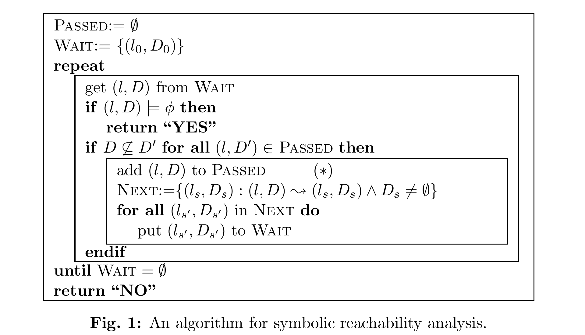
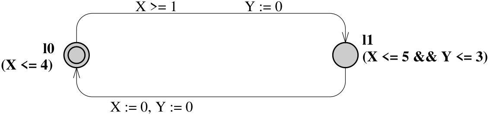
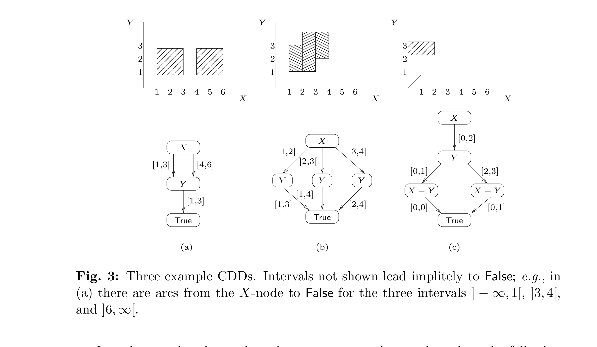
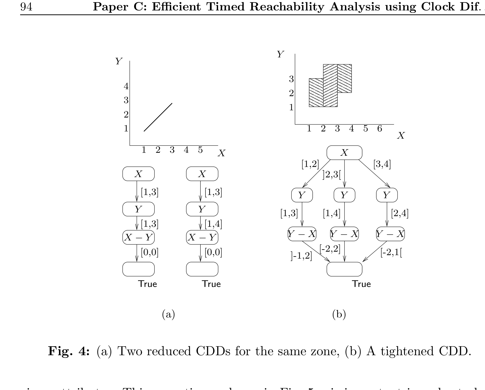
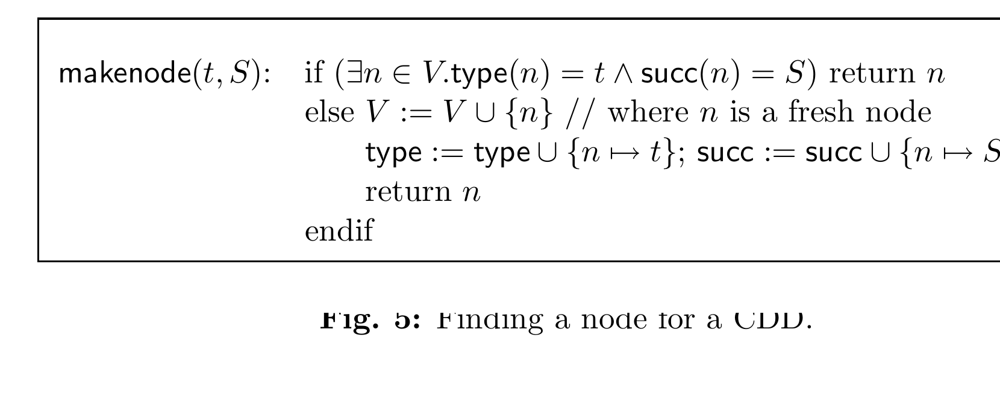
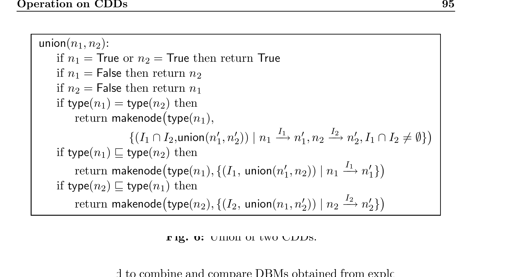
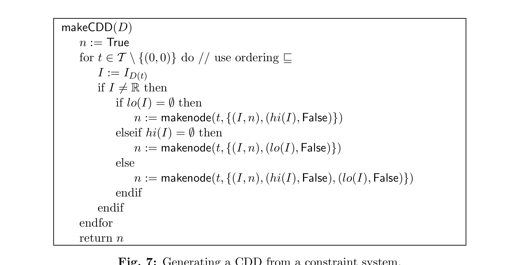
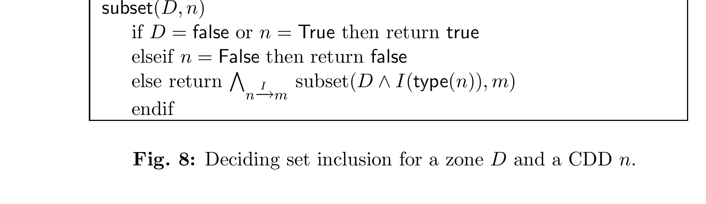
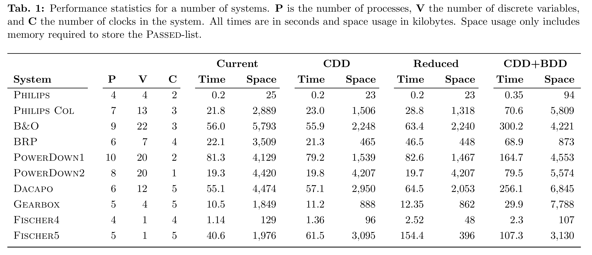

# Efficient Timed Reachability Analysis using Clock Difference Diagrams

Gerd Behrmann, Kim G. Larsen, Carsten Weise  
BRICS, Aalborg University, Denmark

Justin Pearson, Wang Yi  
Dept. of Computer Systems, Uppsala University, Sweden

> Note: the local `paper.pdf` contains the title page plus pages 87-99 of the paper body, with blank separator pages before and after. This local copy ends at the acknowledgement and does not include a bibliography section. The Markdown below is manually refined against the PDF page images. Numbered figures are normalized as `figure-1.png` through `figure-8.png`, and `Table 1` is kept both as an image and as a Markdown transcription for direct reading on GitHub.

## Abstract

One of the major problems in applying automatic verification tools to industrial-size systems is the excessive amount of memory required during the state-space exploration of a model. In the setting of real-time, this problem of state-explosion requires extra attention as information must be kept not only on the discrete control structure but also on the values of continuous clock variables.

In this paper, we present Clock Difference Diagrams, CDDs, a BDD-like data-structure for representing and effectively manipulating certain non-convex subsets of the Euclidean space, notably those encountered during verification of timed automata.

A version of the real-time verification tool UPPAAL using CDDs as a compact data-structure for storing explored symbolic states has been implemented. Our experimental results demonstrate significant space-savings: for 8 industrial examples, the savings are between 46% and 99% with moderate increase in runtime.

We further report on how the symbolic state-space exploration itself may be carried out using CDDs.

<!-- page: 87 -->

## 1 Motivation

In the last few years a number of verification tools have been developed for real-time systems (e.g., [HHWT95, DY95, BLL+96]). The verification engines of most tools in this category are based on reachability analysis of timed automata following the pioneering work of Alur and Dill [AD90]. A timed automaton is an extension of a finite automaton with a finite set of real-valued clock-variables. Whereas the initial decidability results are based on a partitioning of the infinite state-space of a timed automaton into finitely many equivalence classes (so-called regions), tools such as Kronos and UPPAAL are based on more efficient data structures and algorithms for representing and manipulating timing constraints over clock variables. The abstract reachability algorithm applied in these tools is shown in Figure 1. The algorithm checks whether a timed automaton may reach a state satisfying a given state formula $\phi$. It explores the state space of the automaton in terms of symbolic states of the form $(l, D)$, where $l$ is a control-node and $D$ is a constraint system over clock variables $\{X_1, \ldots, X_n\}$. More precisely, $D$ consists of a conjunction of simple clock constraints of the form $X_i \mathit{op}\, c$, $-X_i \mathit{op}\, c$ and $X_i - X_j \mathit{op}\, c$, where $c$ is an integer constant and $\mathit{op} \in \{<, \leq\}$. The subsets of $\mathbb{R}^n$ which may be described by clock constraint systems are called *zones*. Zones are convex polyhedra, where all edge-points are integer valued, and where border lines may or may not belong to the set (depending on a constraint being strict or not).

*Figure 1. An algorithm for symbolic reachability analysis.*

We observe that several operations of the algorithm are critical for efficient implementation. In particular the algorithm depends heavily on operations for checking set inclusion and emptiness. In the computation of the set `Next`, operations for intersection, forward time projection (future) and projection in one dimension (clock reset) are required. A well-known data-structure for representing clock constraint systems is that of *Difference Bounded Matrices*, DBM, [Dil89], giving for each pair of clocks[^1] the upper bound on their difference. All operations required in the reachability analysis in Figure 1 can be easily implemented on DBMs with satisfactory efficiency. In particular, the various operations may benefit from a canonical DBM representation with tightest bounds on all clock differences computed by solving a shortest path problem. However, computation of this canonical form should be postponed as much as possible, as it is the most costly operation on DBMs with time-complexity $O(n^3)$ ($n$ being the number of clocks).

DBMs obviously consume space of order $O(n^2)$. Alternatively, one may represent a clock constraint system by choosing a minimal subset from the constraints of the DBM in canonical form. This *minimal form* [LLPY97] is preferable when adding a symbolic state to the main global data-structure `PASSED` as in practice the space-requirement is only linear in the number of clocks.

Considering once again the reachability algorithm in Figure 1, we see that a symbolic state $(l, D)$ from the waiting-list `WAIT` is exempted from being explored (the inner box) provided some symbolic state $(l, D')$ already in `PASSED` covers it (i.e. $D \subseteq D'$). Though clearly a sound rule and provably sufficient for termination of the algorithm, exploration of $(l, D)$ may be avoided under less strict conditions. In particular, it suffices for $(l, D)$ to be covered collectively by the symbolic states in `PASSED` with location $l$, i.e.

$$
D \subseteq \bigcup \{\, D' \mid (l, D') \in \mathrm{PASSED} \,\}. \tag{1}
$$

However, this requires handling of unions of zones, which complicates things considerably. Using DBMs, finite unions of zones, which we will call *federations* in the following, may be represented by a list of all the DBMs of the union. However, the more non-convex the federation becomes, the more DBMs will be needed. In particular, this representation makes the inclusion-check of (1) computationally expensive.

In this paper, we introduce a more efficient BDD-like data-structure for federations, *Clock Difference Diagrams*, CDDs. A CDD is a directed acyclic graph, where inner nodes are associated with a given pair of clocks and outgoing arcs state bounds on their difference. This data-structure contains DBMs as a special case and offers simple boolean set-operations and easy inclusion- and emptiness-checking. Using CDDs, the `PASSED` list may be implemented as a collection of symbolic states of the form $(l, F)$, where $F$ is a CDD representing the union of all zones for which the location $l$ has been explored.[^2] Thus, the more liberal termination condition of (1) may be applied, potentially leading to faster termination of the reachability algorithm. As any BDD-like data-structure, CDDs eliminate redundancies via sharing of substructures. Thus, the CDD representation of $F$ is likely to be much smaller than the explicit DBM-list representation. Furthermore, sharing of identical substructures between CDDs from different symbolic states may be obtained for free, opening for even more efficient usage of storage.

Having implemented a CDD-package and used it in modifying UPPAAL, we report on some very encouraging experimental results. For 8 industrial examples found in the literature, significant space-savings are obtained: the savings are between 46% and 99% with moderate increase in run-time (in average an increase of 7%).

To make the reachability algorithm of Figure 1 fully symbolic, it remains to show how to compute the successor set `Next` based on CDDs. In particular, algorithms are needed for computing forward projection in time and clock-reset for this data-structure. Similar to the canonical form for DBMs these operations are obtained via a canonical CDD form, where bounds on all arcs are as tight as possible.

<!-- page: 89 -->

## Related Work

The work in [Bal96] and [WTD95] represent early attempts of applying BDD-technology to the verification of continuous real-time systems. In [Bal96], DBMs themselves are coded as BDDs. However, unions of DBMs are avoided and replaced by convex hulls leading to an approximation algorithm. In [WTD95], BDDs are applied to a symbolic representation of the discrete control part, whereas the continuous part is dealt with using DBMs.

The *Numerical Decision Diagrams* of [ABK+97, BMPY97] offer a canonical representation of unions of zones, essentially via a BDD-encoding of the collection of regions covered by the union. [CC95] offers a similar BDD-encoding in the simple case of one-clock automata. In both cases, the encodings are extremely sensitive to the size of the in-going constants. NDDs may be seen as degenerate CDDs requiring very fine granularity.

CDDs are in the spirit of *Interval Decision Diagrams* of [ST98]. In [Str98], IDDs are used for analysis in a discrete, one-clock setting. Whereas IDD nodes are associated with independent real-valued variables, CDD-nodes, being associated with differences, are highly dependent. Thus, the subset- and emptiness checking algorithms for CDDs are substantially different. Also, the canonical form requires additional attention, as bounds on different arcs along a path may interact.

The CDD data-structure was first introduced in [LWYP98], where a thorough study of various possible normal forms is given.

## 2 Timed Automata

Timed automata were first introduced in [AD90] and have since then established themselves as a standard model for real-time systems. We assume familiarity with this model and only give a brief review in order to fix the terminology and notation used in this paper.

Consider the timed automaton of Figure 2. It has two control nodes $l_0$ and $l_1$ and two real-valued clocks $X$ and $Y$. A state of the automaton is of the form $(l, s, t)$, where $l$ is a control node, and $s$ and $t$ are non-negative reals giving the value of the two clocks $X$ and $Y$. A control node is labelled with a condition (the invariant) on the clock values that must be satisfied for states involving this node. Assuming that the automaton starts to operate in the state $(l_0, 0, 0)$, it may stay in node $l_0$ as long as the invariant $X \leq 4$ of $l_0$ is satisfied. During this time the values of the clocks increase synchronously. Thus from the initial state, all states of the form $(l_0, t, t)$, where $t \leq 4$, are reachable. The edges of a timed automaton may be decorated with a condition (guard) on the clock values that must be satisfied in order to be enabled. Thus, only for the states $(l_0, t, t)$, where $1 \leq t \leq 4$, is the edge from $l_0$ to $l_1$ enabled. Additionally, edges may be labelled with simple assignments resetting clocks. E.g. when following the edge from $l_0$ to $l_1$ the clock $Y$ is reset to $0$ leading to states of the form $(l_1, t, 0)$, where $1 \leq t \leq 4$.

*Figure 2. A Timed Automaton.*

A timed automaton is a standard finite-state automaton extended with a finite collection of real-valued clocks $C = \{X_1, \ldots, X_n\}$. We use $B(C)$ ranged over by $g$ and $D$ to denote the set of clock constraint systems over $C$.

**Definition 1.** A timed automaton $A$ over clocks $C$ is a tuple $\langle N, l_0, E, Inv \rangle$ where $N$ is a finite set of nodes (control-nodes), $l_0$ is the initial node, $E \subseteq N \times B(C) \times 2^C \times N$ corresponds to the set of edges, and finally, $Inv : N \to B(C)$ assigns invariants to nodes. In the case $\langle l, g, r, l' \rangle \in E$, we write $l \xrightarrow{g,r} l'$.

Formally, we represent the values of clocks as functions (called clock assignments) from $C$ to the non-negative reals $\mathbb{R}_{\geq 0}$. We denote by $\mathcal{V}$ the set of clock assignments for $C$. A semantical state of an automaton $A$ is now a pair $(l, u)$, where $l$ is a node of $A$ and $u$ is a clock assignment for $C$, and the semantics of $A$ is given by a transition system with the following two types of transitions (corresponding to delay-transitions and edge-transitions):

- $(l, u) \longrightarrow (l, u + d)$ if $Inv(l)(u)$ and $Inv(l)(u + d)$.
- $(l, u) \longrightarrow (l', u')$ if there exist $g, r$ such that $l \xrightarrow{g,r} l'$, $g(u)$, $u' = [r \mapsto 0]u$, $Inv(l)(u)$ and $Inv(l')(u')$.

where for $d \in \mathbb{R}_{\geq 0}$, $u + d$ denotes the time assignment which maps each clock $X$ in $C$ to the value $u(X) + d$, and for $r \subseteq C$, $[r \mapsto 0]u$ denotes the assignment for $C$ which maps each clock in $r$ to the value $0$ and agrees with $u$ over $C \setminus r$. Given a clock constraint $g$ and a valuation $v$, by $g(v)$ we denote the application of $g$ to $v$, i.e. the boolean value derived from replacing the clocks in $g$ by the values given in $v$.

<!-- page: 91 -->

Clearly, the semantics of a timed automaton yields an infinite transition system, and is thus not an appropriate basis for decision algorithms. However, efficient algorithms may be obtained using a finite-state *symbolic semantics* based on symbolic states of the form $(l, D)$, where $D \in B(C)$ [HNSY94, YPD94]. The symbolic counterpart to the standard semantics is given by the following two (fairly obvious) types of symbolic transitions:

- $(l, D) \rightsquigarrow \bigl(l, (D \wedge Inv(l))^\uparrow \wedge Inv(l)\bigr)$
- $(l, D) \rightsquigarrow \bigl(l', r(g \wedge D \wedge Inv(l)) \wedge Inv(l')\bigr)$ if $l \xrightarrow{g,r} l'$

where time progress

$$
D^\uparrow = \{\, u + d \mid u \in D \land d \in \mathbb{R}_{\geq 0} \,\}
$$

and clock reset

$$
r(D) = \{\, [r \mapsto 0]u \mid u \in D \,\}.
$$

It may be shown that $B(C)$ (the set of constraint systems) is closed under these two operations ensuring the well-definedness of the semantics. Moreover, the symbolic semantics corresponds closely to the standard semantics in the sense that, whenever $u \in D$ and $(l, D) \rightsquigarrow (l', D')$ then $(l, u) \longrightarrow (l', u')$ for some $u' \in D'$.[^3]

## 3 Clock Difference Diagrams

While in principle DBMs are an efficient implementation for clock constraint systems, especially when using the canonical form only when necessary and the minimal form when suitable, they are not very good at handling unions of zones. In this section we will introduce a more efficient data structure for federations: *clock difference diagrams* or in short CDDs. A CDD is a directed acyclic graph with two kinds of nodes: inner nodes and terminal nodes. Terminal nodes represent the constants `true` and `false`, while inner nodes are associated with a type (i.e., a clock pair) and arcs labeled with intervals giving bounds on the clock pair's difference. Figure 3 shows examples of CDDs.

A CDD is a compact representation of a decision tree for federations: take a valuation, and follow the unique path along which the constraints given by type and interval are fulfilled by the valuation. If this process ends at a `true` node, the valuation belongs to the federation represented by this CDD, otherwise not. A CDD itself is not a tree, but a DAG due to sharing of isomorphic subtrees.

A type is a pair $(i, j)$ of clock indexes, where $1 \leq i < j \leq n$. The set of all types is written $\mathcal{T}$, with typical element $t$. We assume that $\mathcal{T}$ is equipped with a linear ordering $\sqsubseteq$ and a special bottom element $(0, 0) \in \mathcal{T}$, in the same way as BDDs assume a given ordering on the boolean variables. By $\mathcal{I}$ we denote the set of all non-empty, convex, integer-bounded subsets of the real line. Note that the integer bound may or may not be within the interval. A typical element of $\mathcal{I}$ is denoted $I$. We write $\mathcal{I}_\emptyset$ for the set $\mathcal{I} \cup \{\emptyset\}$.

*Figure 3. Three example CDDs.*

In order to relate intervals and types to constraint, we introduce the following notation: Given a type $(i, j)$ and an interval $I$ of the reals, by $I(i, j)$ we denote the clock constraint having type $(i, j)$ which restricts the value of $X_i - X_j$ to the interval $I$. Note that typically we will apply the resulting clock constraint to a clock assignment, i.e. $I(i, j)(v)$ expresses the fact that $v$ fulfils the constraint given by the interval $I$ and the type $(i, j)$.

This allows us to give the definition of a CDD:

**Definition 2 (Clock Difference Diagram).** A *Clock Difference Diagram* (CDD) is a directed acyclic graph consisting of a set of nodes $V$ and two functions $type : V \to \mathcal{T}$ and $succ : V \to 2^{\mathcal{I} \times V}$ such that:

- $V$ has exactly two terminal nodes called `True` and `False`, where $type(True) = type(False) = (0, 0)$ and $succ(True) = succ(False) = \emptyset$.
- All other nodes $n \in V$ are inner nodes, which have attributed a type $type(n) \in \mathcal{T}$ and a finite set of successors $succ(n) = \{(I_1, n_1), \ldots, (I_k, n_k)\}$, where $(I_i, n_i) \in \mathcal{I} \times V$.

We shall write $n \xrightarrow{I} m$ to indicate that $(I, m) \in succ(n)$. For each inner node $n$, the following must hold:

- The successors are disjoint: for $(I, m), (I', m') \in succ(n)$ either $(I, m) = (I', m')$ or $I \cap I' = \emptyset$.
- The successor set is an $\mathbb{R}$-cover: $\bigcup \{\, I \mid \exists m.\ n \xrightarrow{I} m \,\} = \mathbb{R}$.
- The CDD is ordered: for all $m$, whenever $n \xrightarrow{I} m$ then $type(m) \sqsubseteq type(n)$.

Further, the CDD is assumed to be reduced, i.e.

- It has maximal sharing: for all $n, m \in V$, $type(n) = type(m) \wedge succ(n) = succ(m)$ implies $n = m$.
- It has no trivial edges: whenever $n \xrightarrow{I} m$ then $I \neq \mathbb{R}$.
- All intervals are maximal: whenever $n \xrightarrow{I_1} m$, $n \xrightarrow{I_2} m$ then $I_1 = I_2$ or $I_1 \cup I_2 \notin \mathcal{I}$.

Note that we do not require a special root node. Instead each node can be chosen as the root node, and the sub-DAG underneath this node is interpreted as describing a (possibly non-convex) set of clock valuations. This allows for sharing not only within a representation of one set of valuations, but between all representations. Figure 3 gives some examples of CDDs. The following definition makes precise how to interpret such a DAG:

**Definition 3.** Given a CDD $(V, type, succ)$, each node $n \in V$ is assigned a semantics $\llbracket n \rrbracket \subseteq \mathcal{V}$, recursively defined by

- $\llbracket False \rrbracket := \emptyset$, $\llbracket True \rrbracket := \mathcal{V}$,
- $\llbracket n \rrbracket := \{\, v \in \mathcal{V} \mid \exists I, m : n \xrightarrow{I} m \land I(type(n))(v) \land v \in \llbracket m \rrbracket \,\}$ for $n$ being an inner node.

For BDDs and IDDs, testing for equality can be achieved easily due to their canonicity: the test is reduced to a pure syntactical comparison. However, in the case of CDDs canonicity is not achieved in the same straightforward manner.

To see this, we give an example of two reduced CDDs in Figure 4(a) describing the same set. The two CDDs are however not isomorphic. The problem with CDDs, in contrast to IDDs, is that the different types of constraints in the nodes are not independent, but influence each other. In the above example obviously $1 \leq X \leq 3$ and $X = Y$ already imply $1 \leq Y \leq 3$. The constraint on $Y$ in the CDD on the right hand side is simply too loose. Therefore a step towards an improved normal form is to require that on all paths, the constraints should be as tight as possible. We turn back to this issue in the final section.

<!-- page: 93 -->

## 4 Operation on CDDs

**Simple Operations.** Three important operations on CDDs, namely union, intersection and complement, can be defined analogously to IDDs. All use a function `makenode` which for a given type $t$ and a successor set $S = \{(I_1, n_1), \ldots, (I_k, n_k)\}$ will either return the unique node in the given CDD $C = (V, type, succ)$ having these attributes or, in case no such exists, add a new node to the CDD with the given attributes. This operation, shown in Figure 5, is important in order to keep reducedness of the CDD. Note that using a hashtable to identify nodes already in $V$, `makenode` can be implemented to run in time linear in $|S|$. Then union can be defined as in Figure 6. Intersection is computed by replacing `"union"` by `"intersect"` everywhere in Figure 6, and additionally adjusting the base cases. The complement is computed by swapping `True` and `False` nodes.[^4]

*Figure 4. (a) Two reduced CDDs for the same zone, (b) A tightened CDD.*

*Figure 5. Finding a node for a CDD.*

*Figure 6. Union of two CDDs.*

### 4.1 From Constraint Systems to CDDs

The reachability algorithm of UPPAAL currently works with constraint systems (represented either as canonical DBMs or in the minimal form). The desired reachability algorithm will need to combine and compare DBMs obtained from exploration of the timed automaton with CDDs used as a compact representation of the `PASSED` list.

For the following we assume that a constraint system $D$ holds at most one simple constraint for each pair of clocks $X_i, X_j$ (which is obviously true for DBMs and the minimal form). Let $D(i, j)$ be the set of all simple constraints of type $(i, j)$, i.e., those for $X_i - X_j$ and $X_j - X_i$. The constraint system $D(i, j)$ gives an upper and/or a lower bound for $X_i - X_j$. If not present, choose $-\infty$ as lower and $+\infty$ as upper bound. Denote the interval defined thus by $I_D(i,j)$.

Further, given an interval $I \in \mathcal{I}$, let

$$
lo(I) := \{\, r \in \mathbb{R} \mid \forall r' \in I.\ r < r' \,\}
$$

be the set of lower bounds and

$$
hi(I) := \{\, r \in \mathbb{R} \mid \forall r' \in I.\ r > r' \,\}
$$

the set of upper bounds. Note that always $lo(I), hi(I) \in \mathcal{I}_\emptyset$. Using this notation, a simple algorithm for constructing a CDD from a constraint system can be given as in Figure 7. Using this, we can easily union zones to a CDD as required in the modified reachability algorithm of UPPAAL (cf. footnote on page 88). Note that for this asymmetric union it is advisable to use the minimal form representation for the zone, as this will lead to a smaller CDD, and subsequently to a faster and less space-consuming union-operation.

*Figure 7. Generating a CDD from a constraint system.*

### 4.2 Crucial Operations

Testing for equality and set-inclusion of CDDs is not easy without utilizing a normal form. Looking at the test given in (1) it is however evident that all we need is to test for inclusion between a zone $Z$ and a CDD. Such an asymmetric test for a zone $D$ and a CDD $n$ can be implemented as shown in Figure 8 without need for canonicity.

Note that when testing for emptiness of a DBM as in the first `if`-statement, we need to compute its canonical form. If we know that the DBM is already in canonical form, the algorithm can be improved by passing $D \wedge I(type(n))$ in canonical form. As $D \wedge I(type(n))$ adds no more than two constraints to the zone, computation of the canonical form can be done faster than in the general case, which would be necessary in the test $D = true$.

The above algorithm can also be used to test for emptiness of a CDD using

$$
empty(n) := subset(true, complement(n))
$$

where `true` is the empty set of constraints, fulfilled by every valuation.

As testing for set inclusion $C_1 \subseteq C_2$ of two CDDs $C_1, C_2$ is equivalent to testing for emptiness of $C_1 \cap \overline{C_2}$, also this check can be done without needing canonicity.

*Figure 8. Deciding set inclusion for a zone $D$ and a CDD $n$.*

<!-- page: 96 -->

## 5 Implementation and Experimental Results

This section presents the results of an experiment where both the current[^5] and an experimental CDD-based version of UPPAAL were used to verify 8 industrial examples[^6] found in the literature as well as Fischer's protocol for mutual exclusion.

*Table 1. Performance statistics for a number of systems. `P` is the number of processes, `V` the number of discrete variables, and `C` the number of clocks in the system. All times are in seconds and space usage in kilobytes. Space usage only includes memory required to store the `PASSED` list.*

For direct reading on GitHub, Table 1 is also transcribed in Markdown:

| System | P | V | C | Current Time | Current Space | CDD Time | CDD Space | Reduced Time | Reduced Space | CDD+BDD Time | CDD+BDD Space |
| --- | ---: | ---: | ---: | ---: | ---: | ---: | ---: | ---: | ---: | ---: | ---: |
| Philips | 4 | 4 | 2 | 0.2 | 25 | 0.2 | 23 | 0.2 | 23 | 0.35 | 94 |
| Philips Col | 7 | 13 | 3 | 21.8 | 2,889 | 23.0 | 1,506 | 28.8 | 1,318 | 70.6 | 5,809 |
| B&O | 9 | 22 | 3 | 56.0 | 5,793 | 55.9 | 2,248 | 63.4 | 2,240 | 300.2 | 4,221 |
| BRP | 6 | 7 | 4 | 22.1 | 3,509 | 21.3 | 465 | 46.5 | 448 | 68.9 | 873 |
| PowerDown1 | 10 | 20 | 2 | 81.3 | 4,129 | 79.2 | 1,539 | 82.6 | 1,467 | 164.7 | 4,553 |
| PowerDown2 | 8 | 20 | 1 | 19.3 | 4,420 | 19.8 | 4,207 | 19.7 | 4,207 | 79.5 | 5,574 |
| Dacapo | 6 | 12 | 5 | 55.1 | 4,474 | 57.1 | 2,950 | 64.5 | 2,053 | 256.1 | 6,845 |
| Gearbox | 5 | 4 | 5 | 10.5 | 1,849 | 11.2 | 888 | 12.35 | 862 | 29.9 | 7,788 |
| Fischer4 | 4 | 1 | 4 | 1.14 | 129 | 1.36 | 96 | 2.52 | 48 | 2.3 | 107 |
| Fischer5 | 5 | 1 | 5 | 40.6 | 1,976 | 61.5 | 3,095 | 154.4 | 396 | 107.3 | 3,130 |

In Table 1 we present the space requirements and runtime of the examples on a Sun UltraSPARC 2 equipped with 512 MB of primary memory and two 170 MHz processors. Each example was verified using the current purely DBM-based algorithm of UPPAAL (`Current`), and three different CDD-based algorithms. The first (`CDD`) uses CDDs to represent the continuous part of the `PASSED` list, the second (`Reduced`) is identical to `CDD` except that all inconsistent paths are removed from the CDDs, and the third (`CDD+BDD`) extends CDDs with BDD nodes to achieve a fully symbolic representation of the passed list. As can be seen, our CDD-based modification of UPPAAL leads to truly significant space-savings (in average 42%) with only moderate increase in run-time (in average 7%). When inconsistent paths are eliminated the average space-saving increases to 55% at the cost of an average increase in run-time of 54%. If we only consider the industrial examples the average space-savings of `CDD` are 49% while the average increase in run-time is below 0.5%.

## 6 Towards a Fully Symbolic Timed Reachability Analysis

The presented CDD-version of UPPAAL uses CDDs to store the `PASSED` list, but zones (i.e., DBMs) in the exploration of the timed automata. The next goal is to use CDDs in the exploration as well, thus treating the continuous part fully symbolically. In combination with a BDD-based approach for the discrete part, this would result in a fully symbolic timed reachability analysis, saving even more space and time.

The central operations when exploring a timed automaton are time progress and clock reset. Using *tightened* CDDs, these operations can be defined along the same lines as for DBMs. A tightened CDD is one where along each path to `True` all constraints are the tightest possible. In [LWYP98] we have shown how to effectively transform any given CDD into an equivalent tightened one.

Figure 4(b) shows the tightened CDD-representation for example (b) from Figure 3. Given this tightened version, the time progress operation is obtained by simply removing all upper bounds on the individual clocks. In general, this gives a CDD with overlapping intervals, which however can easily be turned into a CDD obeying our definition. More details on these operations can be found in [LWYP98].

CDDs come equipped with an obvious notion of being *equally fine partitioned*. For equally fine partitioned CDDs we have the following normal form theorem [LWYP98]:

**Theorem 1.** Let $C_1, C_2$ be two CDDs which are tightened and equally fine partitioned. Then $\llbracket C_1 \rrbracket = \llbracket C_2 \rrbracket$ iff $C_1$ and $C_2$ are graph-isomorphic.

A drastical way of achieving equally fine partitioned CDDs is to allow only atomic integer-bounded intervals, i.e., intervals of the form $[n, n]$ or $(n, n+1)$. This approach has been taken in [ABK+97, BMPY97] demonstrating canonicity. However, this approach is extremely sensitive to the size of the constants in the analysed model.

<!-- page: 99 -->

In contrast, for models with large constants our notion of CDD allows for coarser, and hence more space-efficient, representations.

## 7 Conclusion

In this paper, we have presented Clock Difference Diagrams, CDDs, a BDD-like data-structure for effective representation and manipulation of finite unions of zones. A version of the real-time verification tool UPPAAL using CDDs to store explored symbolic states has been implemented. Our experimental results on 8 industrial examples found in the literature demonstrate significant space-savings (46%-99%) with a moderate increase in run-time (in average 7%). As future work, we want to experimentally pursue the fully symbolic state-space exploration of the last section and [LWYP98].

## Acknowledgement

The second author of this paper was introduced to the idea of developing a BDD-like structure with nodes labeled with bounds on clock-differences by Henrik Reif Andersen.

[^1]: For uniformity, we assume a special clock $X_0$ which is always zero. Thus $X_i \mathit{op}\, c$ and $-X_i \mathit{op}\, c$ can be rewritten as the differences $X_i - X_0 \mathit{op}\, c$ and $X_0 - X_i \mathit{op}\, c$.

[^2]: Thus $D$ is simply unioned with $F$, when a new symbolic state $(l, D)$ is added to the `PASSED` list (cf. Figure 1, line $(*)$).

[^3]: In fact, $\rightsquigarrow$ is not finite; to make it finite an abstraction function is needed, see [BBFL03, Bou03].

[^4]: As for the BDD `apply`-operator, using a hashed operation-cache is needed to avoid recomputation of the same operation for the same arguments.

[^5]: More precisely UPPAAL version 2.19.2, which is the most recent version of UPPAAL currently used in-house.

[^6]: The examples include a gearbox controller [LPY98], various communication protocols used in Philips audio equipment [BPV94, DKRT97, BGK+96], and in B&O audio/video equipment [HSLL97, HLS99], and the start-up algorithm of the DACAPO protocol [LP97].
