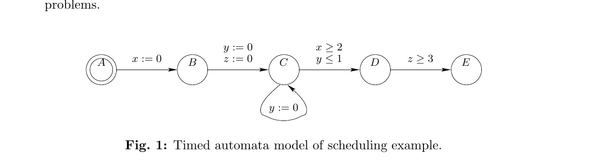
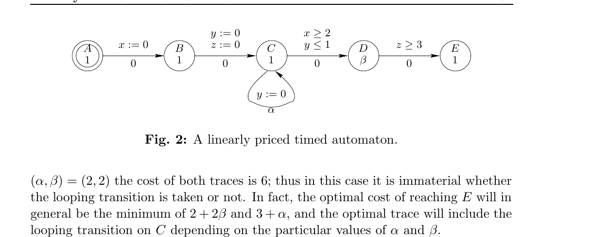
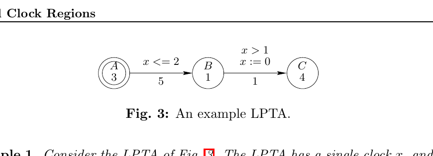
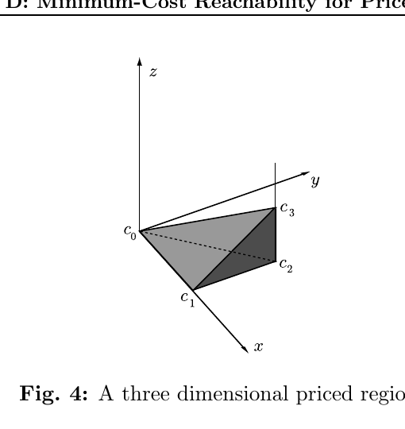
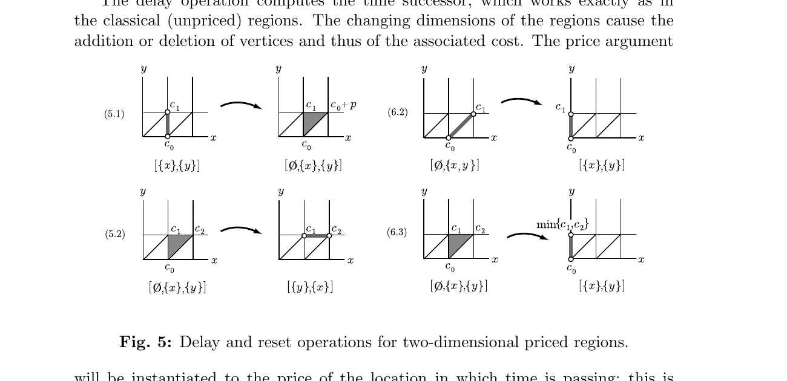
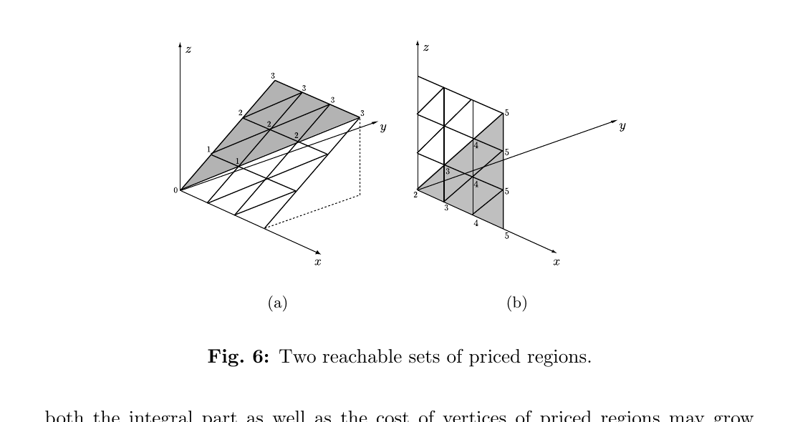
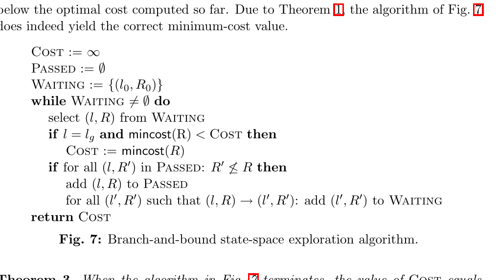
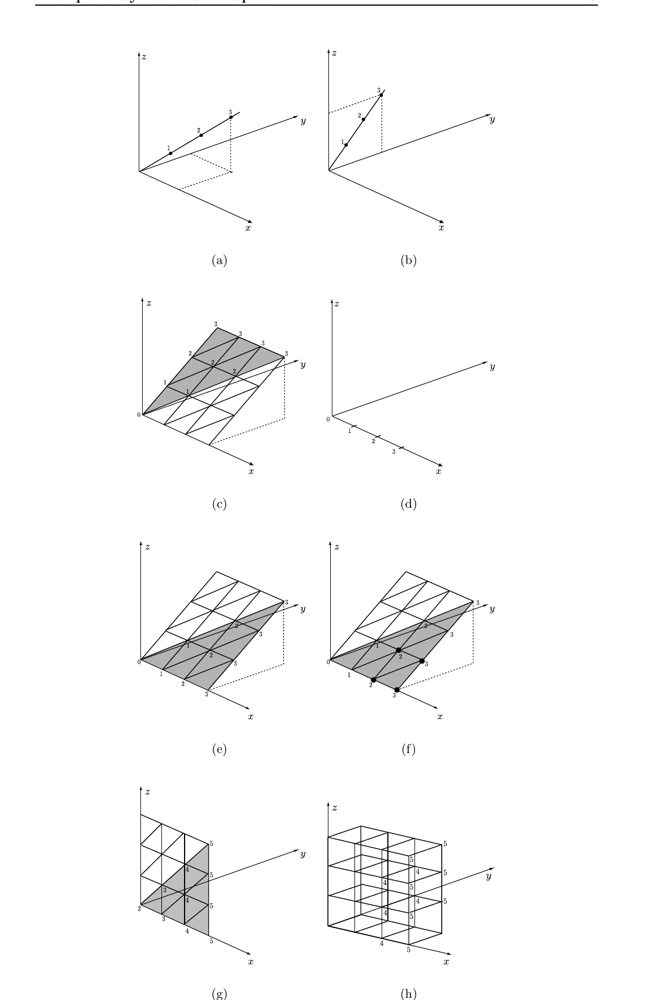

# Minimum-Cost Reachability for Priced Timed Automata

Gerd Behrmann, Kim Larsen  
BRICS, Aalborg University, Denmark

Ansgar Fehnker, Judi Romijn, Frits Vaandrager  
Computing Science Institute  
University of Nijmegen, The Netherlands

Thomas Hune  
BRICS, Aarhus University, Denmark

Paul Pettersson  
Department of Computer Systems, Information Technology,  
Uppsala University, Sweden

> Note: the local [paper.pdf](./paper.pdf) is the thesis-extracted Paper D from *Data Structures and Algorithms for the Analysis of Real Time Systems*. It contains the title page, a separate abstract page, two blank separator pages, and body pages 105-124 of the paper. The Markdown below was manually refined against the rendered PDF pages page by page, and all numbered figures have been normalized as `figure-1.png` through `figure-8.png`. This local copy ends after the appendix and does not include a bibliography section.

This work is partially supported by the European Community Esprit-LTR Project 26270 VHS (Verification of Hybrid systems). Research supported by Netherlands Organization for Scientific Research (NWO) under contract SION 612-14-004. Research partly sponsored by the AIT-WOODDES Project No IST-1999-10069.

## Abstract

This paper introduces the model of *linearly priced timed automata* as an extension of timed automata, with prices on both transitions and locations. For this model we consider the minimum-cost reachability problem: i.e. given a linearly priced timed automaton and a target state, determine the minimum cost of executions from the initial state to the target state. This problem generalizes the minimum-time reachability problem for ordinary timed automata. We prove decidability of this problem by offering an algorithmic solution, which is based on a combination of branch-and-bound techniques and a new notion of priced regions. The latter allows symbolic representation and manipulation of reachable states together with the cost of reaching them.

**Keywords:** Timed Automata, Verification, Data Structures, Algorithms, Optimization.

## 1 Introduction

Recently, real-time verification tools such as Uppaal [LPY97a], Kronos [BDM+98] and HyTech [HHWT97a], have been applied to synthesize feasible solutions to static job-shop scheduling problems [Feh99b, HLP00, NY99]. The basic common idea of these works is to reformulate the static scheduling problem as a reachability problem that can be solved by the verification tools. In this approach, the timed automata [AD94] based modeling languages of the verification tools serve as the basic input language in which the scheduling problem is described. These modeling languages have proven particularly well-suited in this respect, as they allow for easy and flexible modeling of systems, consisting of several parallel components that interact in a time-critical manner and constrain each other’s behavior in a multitude of ways.

In this paper we introduce the model of *linearly priced timed automata* and offer an algorithmic solution to the problem of determining the minimum cost of reaching a designated set of target states. This result generalizes previous results on computation of minimum-time reachability and accumulated delays in timed automata, and should be viewed as laying a theoretical foundation for algorithmic treatments of more general optimization problems as encountered in static scheduling problems.



*Figure 1. Timed automata model of scheduling example.*

As an example consider the very simple static scheduling problem represented by the timed automaton in Fig. 1 from [NTY00], which contains 5 "tasks" $\{A,B,C,D,E\}$. All tasks are to be performed precisely once, except task $C$, which should be performed at least once. The order of the tasks is given by the timed automaton, e.g. task $B$ must not commence before task $A$ has finished. In addition, the timed automaton specifies three timing requirements to be satisfied: the delay between the start of the first execution of task $C$ and the start of the execution of $E$ should be at least 3 time units; the delay between the start of the last execution of $C$ and the start of $D$ should be no more than 1 time unit; and, the delay between the start of $B$ and the start of $D$ should be at least 2 time units, each of these requirements are represented by a clock in the model. Using a standard timed model checker we are able to verify that location $E$ of the timed automaton is reachable. This can be demonstrated by a trace leading to the location:[^1]

$$
(A,0,0,0)\xrightarrow{\tau}\xrightarrow{\epsilon(1)}(B,1,1,1)\xrightarrow{\tau}\xrightarrow{\epsilon(1)}(C,2,1,1)\xrightarrow{\tau}\xrightarrow{\epsilon(2)}(D,4,3,3)\xrightarrow{\tau}(E,4,3,3) \tag{1}
$$

The above trace may be viewed as a feasible solution to the original static scheduling problem. However, given an optimization problem, one is often not satisfied with an arbitrary feasible solution but may insist on solutions which are optimal in some sense. When modeling a problem like this one using timed automata, an obvious notion of optimality is that of minimum accumulated time. For the timed automaton of Fig. 1 the trace of (1) has an accumulated time-duration of 4. This, however, is not optimal as witnessed by the following alternative trace, which by exploiting the looping transition on $C$ reaches $E$ within a total of 3 time-units:[^2]

$$
(A,0,0,0)\xrightarrow{\tau}\xrightarrow{\tau}\xrightarrow{\epsilon(2)}(C,2,2,2)\xrightarrow{\tau}(C,2,0,2)\xrightarrow{\tau}\xrightarrow{\epsilon(1)}(D,3,1,3)\xrightarrow{\tau}(E,3,1,3) \tag{2}
$$

In [AM99] algorithmic solutions to the minimum-time reachability problem and the more general problem of controller synthesis has been given using a backward fixpoint computation. In [NTY00] an alternative solution based on forward reachability analysis is given, and in [BFH+01b] an algorithmic solution is offered, which applies branch-and-bound techniques to prune parts of the symbolic state-space which are guaranteed not to contain optimal solutions. In particular, by introducing an additional clock for accumulating elapsed time, the minimum-time reachability problem may be dealt with using the existing efficient data structures (e.g. DBMs [Dil89], CDDs [LWYP99] and DDDs [MLAH99a]) already used in the real-time verification tools Uppaal and Kronos for reachability. The results of the present paper also extends the work in [ACH93] which provides an algorithm for computing the accumulated delay in a timed automata.

In this paper, we provide the basis for dealing with more general optimization problems. In particular, we introduce the model of linearly priced timed automata, as an extension of timed automata with prices on both transitions and locations: the price of a transition gives the cost for taking it and the price on a location specifies the cost per time-unit for staying in that location. This model can capture not only the passage of time, but also the way that, e.g. tasks with different prices for use per time unit, contribute to the total cost.



*Figure 2. A linearly priced timed automaton.*

Figure 2 gives a linearly priced extension of the timed automaton from Fig. 1. Here, the price of location $D$ is set to $\beta$ and the price on all other locations is set to 1 (thus simply accumulating time). The price of the looping transition on $C$ is set to $\alpha$, whereas all other transitions are free of cost (price 0). Now for $(\alpha,\beta)=(1,3)$ the costs of the traces (1) and (2) are 8 and 6, respectively. Thus it is cheaper to actually exploit the looping transition. For $(\alpha,\beta)=(2,2)$ the cost of both traces is 6; thus in this case it is immaterial whether the looping transition is taken or not. In fact, the optimal cost of reaching $E$ will in general be the minimum of $2+2\beta$ and $3+\alpha$, and the optimal trace will include the looping transition on $C$ depending on the particular values of $\alpha$ and $\beta$.

In this paper we deal with the problem of determining the minimum cost of reaching a given location for linearly priced timed automata. In particular, we offer an algorithmic solution to this problem.[^3] In contrast to minimum-time reachability for timed automata, the minimum-cost reachability problem for linearly priced timed automata requires the development of new data structures for symbolic representation and manipulation of sets of reachable states together with the cost of reaching them. In this paper we put forward one such data structure, namely a priced extension of the fundamental notion of clock regions for timed automata [AD94].

The remainder of the paper is structured as follows: Section 2 formally introduces the model of linearly priced timed automata together with its semantics. Section 3 develops the notion of priced clock regions, together with a number of useful operations on these. The priced clock regions are then used in Section 4 to give a symbolic semantics capturing (sufficiently) precisely the cost of executions and used as a basis for an algorithmic solution to the minimum-cost problem. Finally, in Section 5 we give some concluding remarks.

## 2 Linearly Priced Timed Automata

In this section, we introduce the model of linearly priced timed automata, which is an extension of timed automata [AD94] with prices on both locations and transitions. Dually, linearly priced timed automata may be seen as a special type of linear hybrid automata [Hen96] or multirectangular automata [Hen96] in which the accumulation of prices (i.e. the cost) is represented by a single continuous variable. However, in contrast to known undecidability results for these classes, minimum-cost reachability is computable for linearly priced timed automata. An intuitive explanation for this is that the additional (cost) variable does not influence the behavior of the automata.

Let $C$ be a finite set of clocks. Then $B(C)$ is the set of formulas obtained as conjunctions of atomic constraints of the form $x \mathbin{./} n$ where $x\in C$, $n$ is a natural number, and $\mathbin{./}\in\{<,\le,=,\ge,>\}$. Elements of $B(C)$ are called clock constraints over $C$. Note that for each timed automaton that has constraints of the form $x-y \mathbin{./} c$, there exists a strongly bisimilar timed automaton with only constraints of the form $x \mathbin{./} c$. Therefore, the results in this paper are applicable to automata having constraints of the type $x-y \mathbin{./} c$ as well.

**Definition 1 (Linearly Priced Timed Automaton).** A Linearly Priced Timed Automaton (LPTA) over clocks $C$ and actions $Act$ is a tuple $(L,l_0,E,I,P)$ where $L$ is a finite set of locations, $l_0$ is the initial location, $E \subseteq L\times B(C)\times Act\times P(C)\times L$ is the set of edges, $I:L\to B(C)$ assigns invariants to locations, and $P:(L\cup E)\to \mathbb{N}$ assigns prices to both locations and edges. In the case of $(l,g,a,r,l')\in E$, we write

$$
l \xrightarrow{g,a,r} l'.
$$

Formally, clock values are represented as functions called clock assignments from $C$ to the non-negative reals $\mathbb{R}_{\ge 0}$. We denote by $\mathbb{R}^C$ the set of clock assignments for $C$, ranged over by $u,u'$ etc. We define the operation $u'=[r\mapsto 0]u$ to be the assignment such that $u'(x)=0$ if $x\in r$ and $u(x)$ otherwise, and the operation $u'=u+d$ to be the assignment such that $u'(x)=u(x)+d$. Also, a clock valuation $u$ satisfies a clock constraint $g$, written $u\in g$, if $u(x)\mathbin{./}n$ for any atomic constraint $x \mathbin{./} n$ in $g$. Notice that the set of clock valuations satisfying a guard is always a convex set.

The semantics of a LPTA $A$ is defined as a transition system with the state-space $L\times \mathbb{R}^C$, with initial state $(l_0,u_0)$ (where $u_0$ assigns zero to all clocks in $C$), and with the following transition relation:

- $(l,u)\xrightarrow{\epsilon(d),p}(l,u+d)$ if $u+d\in I(l)$, and $p=P(l)\ast d$.
- $(l,u)\xrightarrow{a,p}(l',u')$ if there exists $g,r$ such that $l\xrightarrow{g,a,r} l'$, $u\in g$, $u'=[r\mapsto 0]u$, $u'\in I(l')$ and $p=P((l,g,a,r,l'))$.

Note that the transitions are decorated with two labels: a delay-quantity or an action, together with the cost of the particular transition. For determining the cost, the price of a location gives the cost rate of staying in that location (per time unit), and the price of a transition gives the cost of taking that transition. In the remainder, states and executions of the transition system for LPTA $A$ will be referred to as states and executions of $A$.

**Definition 2 (Cost).** Let

$$
\alpha=(l_0,u_0)\xrightarrow{a_1,p_1}(l_1,u_1)\cdots\xrightarrow{a_n,p_n}(l_n,u_n)
$$

be a finite execution of LPTA $A$. The cost of $\alpha$, $\mathrm{Cost}(\alpha)$, is the sum $\sum_{i\in\{1,\ldots,n\}} p_i$.

For a given state $(l,u)$, the minimal cost of reaching $(l,u)$, $\mathrm{mincost}((l,u))$, is the infimum of the costs of finite executions ending in $(l,u)$. Similarly, the minimal cost of reaching a location $l$ is the infimum of the costs of finite executions ending in a state of the form $(l,u)$:

$$
\mathrm{mincost}(l)=\inf\{\mathrm{Cost}(\alpha)\mid \alpha \text{ a run ending in location } l\}.
$$



*Figure 3. An example LPTA.*

**Example 1.** Consider the LPTA of Fig. 3. The LPTA has a single clock $x$, and the locations and transitions are decorated with guards and prices. A sample execution of this LPTA is for instance:

$$
(A,0)\xrightarrow{\epsilon(1.5),4.5}(A,1.5)\xrightarrow{\tau,5}(B,1.5)\xrightarrow{\tau,1}(C,1.5).
$$

The cost of this execution is 10.5. In fact, there are executions with cost arbitrarily close to the value 7, obtainable by avoiding delaying in location $A$, and delaying just long enough in location $B$. Due to the infimum definition of $\mathrm{mincost}$, it follows that $\mathrm{mincost}(C)=7$. However, note that because of the strict comparison in the guard of the second transition, no execution actually achieves this cost.

## 3 Priced Clock Regions

For ordinary timed automata, the key to decidability results has been the valuable notion of region [AD94]. In particular, regions provide a finite partitioning of the uncountable set of clock valuations, which is also stable with respect to the various operations needed for exploration of the behavior of timed automata (in particular the operations of delay and reset).

In the setting of linearly priced timed automata, we put forward a new extended notion of priced region. Besides providing a finite partitioning of the set of clock-valuations (as in the case of ordinary regions), priced regions also associate costs to each individual clock-valuation within the region. However, as we shall see in the following, priced regions may be presented and manipulated in a symbolic manner and are thus suitable as an algorithmic basis.

**Definition 3 (Priced Regions).** Given set $S$, let $\mathrm{Seq}(S)$ be the set of finite sequences of elements of $S$. A priced clock region over a finite set of clocks $C$

$$
R=(h,[r_0,\ldots,r_k],[c_0,\ldots,c_l])
$$

is an element of $(C\to \mathbb{N})\times \mathrm{Seq}(2^C)\times \mathrm{Seq}(\mathbb{N})$, with $k=l$, $C=\bigcup_{i\in\{0,\ldots,k\}} r_i$, $r_i\cap r_j=\emptyset$ when $i\ne j$, and $i>0$ implies that $r_i\ne \emptyset$.

Given a clock valuation $u\in \mathbb{R}^C$, and region $R=(h,[r_0,\ldots,r_k],[c_0,\ldots,c_k])$, $u\in R$ iff

1. $h$ and $u$ agree on the integer part of each clock in $C$,
2. $x\in r_0$ iff $\mathrm{frac}(u(x))=0$,
3. $x,y\in r_i \Rightarrow \mathrm{frac}(u(x))=\mathrm{frac}(u(y))$, and
4. $x\in r_i$, $y\in r_j$ and $i<j \Rightarrow \mathrm{frac}(u(x))<\mathrm{frac}(u(y))$.



*Figure 4. A three dimensional priced region.*

For a priced region $R=(h,[r_0,\ldots,r_k],[c_0,\ldots,c_k])$ the first two components of the triple constitute an ordinary (unpriced) region $\hat{R}=(h,[r_0,\ldots,r_k])$. The naturals $c_0,\ldots,c_k$ are the costs, which are associated with the vertices of the closure of the (unpriced) region, as follows. We start in the left-most lower vertex of the exterior of the region and associate cost $c_0$ with it, then move one time unit in the direction of set $r_k$ to the next vertex of the exterior, and associate cost $c_1$ with that vertex, then move one unit in the direction of $r_{k-1}$, etc. In this way, the costs $c_0,\ldots,c_k$ span a linear cost plane on the $k$-dimensional unpriced region.

The closure of the unpriced region $R$ is the convex hull of the vertices. Each clock valuation $u\in R$ is a (unique) convex combination[^4] of the vertices. Therefore the cost of $u$ can be defined as the same convex combination of the cost in the vertices. This gives the following definition:

**Definition 4 (Cost inside Regions).** Given priced region $R=(h,[r_0,\ldots,r_k],[c_0,\ldots,c_k])$ and clock valuation $u\in R$, the cost of $u$ in $R$ is defined as

$$
\mathrm{Cost}(u,R)=c_0+\sum_{i=0}^{k-1}\mathrm{frac}(u(x_{k-i}))\ast (c_{i+1}-c_i)
$$

where $x_j$ is some clock in $r_j$. The minimal cost associated with $R$ is $\mathrm{mincost}(R)=\min(\{c_0,\ldots,c_k\})$.

In the symbolic state-space, constructed with the priced regions, the costs will be computed such that for each concrete state in a symbolic state, the cost associated with it is the minimal cost for reaching that state by the symbolic path that was followed. In this way, we always have the minimal cost of all concrete paths represented by that symbolic path, but there may be more symbolic paths leading to a symbolic state in which the costs are different. Note that the cost of a clock valuation in the region is computed by adding fractions of costs for equivalence sets of clocks, rather than for each clock.

To prepare for the symbolic semantics, we define in the following a number of operations on priced regions. These operations are also the ones used in the algorithm for finding the optimal cost of reaching a location.

The delay operation computes the time successor, which works exactly as in the classical (unpriced) regions. The changing dimensions of the regions cause the addition or deletion of vertices and thus of the associated cost. The price argument will be instantiated to the price of the location in which time is passing; this is needed only when a vertex is added. The two cases in the operation are illustrated in Fig. 5 to the left (5.1) and (5.2).



*Figure 5. Delay and reset operations for two-dimensional priced regions.*

**Definition 5 (Delay).** Given a priced region $R=(h,[r_0,\ldots,r_k],[c_0,\ldots,c_k])$ and a price $p$, the function `delay` is defined as follows:

1. If $r_0$ is not empty, then

   $$
   \mathrm{delay}(R,p)=(h,[\emptyset,r_0,\ldots,r_k],[c_0,\ldots,c_k,c_0+p]).
   $$

2. If $r_0$ is empty, then

   $$
   \mathrm{delay}(R,p)=(h',[r_k,r_1,\ldots,r_{k-1}],[c_1,\ldots,c_k])
   $$

   where $h'$ is $h$ incremented for all clocks in $r_k$.

When resetting a clock, a priced region may lose a dimension. If so, the two costs, associated with the vertices that are collapsed, are compared and the minimum is taken for the new vertex. Two of the three cases in the operation are illustrated in Fig. 5 to the right (6.2) and (6.3).

**Definition 6 (Reset).** Given a priced region $R=(h,[r_0,\ldots,r_k],[c_0,\ldots,c_k])$ and a clock $x\in r_i$, the function `reset` is defined as follows:

1. If $i=0$ then

   $$
   \mathrm{reset}(x,R)=(h',[r_0,\ldots,r_k],[c_0,\ldots,c_k]),
   $$

   where $h'$ is $h$ with $x$ set to zero.

2. If $i>0$ and $r_i\ne \{x\}$, then

   $$
   \mathrm{reset}(x,R)=\bigl(h',[r_0\cup\{x\},\ldots,r_i\setminus\{x\},\ldots,r_k],[c_0,\ldots,c_k]\bigr),
   $$

   where $h'$ is $h$ with $x$ set to zero.

3. If $i>0$ and $r_i=\{x\}$, then

   $$
   \mathrm{reset}(x,R)=\bigl(h',[r_0\cup\{x\},\ldots,r_{i-1},r_{i+1},\ldots,r_k],[c_0,\ldots,c'_{k-i-1},c',c_{k-i+2},\ldots,c_k]\bigr),
   $$

   where $c'=\min(c_{k-i},c_{k-i+1})$ and $h'$ is $h$ with $x$ set to zero.

The `reset` operation on a set of clocks: $\mathrm{reset}(C\cup\{x\},R)=\mathrm{reset}(C,\mathrm{reset}(x,R))$, and $\mathrm{reset}(\emptyset,R)=R$.

The price argument in the increment operation will be instantiated to the price of the particular transition taken; all costs are updated accordingly.

**Definition 7 (Increment).** Given a priced region $R=(h,[r_0,\ldots,r_k],[c_0,\ldots,c_k])$ and a price $p$, the increment of $R$ with respect to $p$ is the priced region

$$
R\oplus p=(h,[r_0,\ldots,r_k],[c_0',\ldots,c_k'])
$$

where $c_i'=c_i+p$.

If in region $R$, no clock has fractional part 0, then time may pass in $R$, that is, each clock valuation in $R$ has a time successor and predecessor in $R$. When changing location with $R$, we must choose for each clock valuation $u$ in $R$ between delaying in the previous location until $u$ is reached, followed by the change of location, or changing location immediately and delaying to $u$ in the new location. This depends on the price of either location. For this the following operation `self` is useful.

**Definition 8 (Self).** Given a priced region $R=(h,[r_0,\ldots,r_k],[c_0,\ldots,c_k])$ and a price $p$, the function `self` is defined as follows:

1. If $r_0$ is not empty, then $\mathrm{self}(R,p)=R$.
2. If $r_0$ is empty, then

   $$
   \mathrm{self}(R,p)=(h,[r_0,\ldots,r_k],[c_0,\ldots,c_{k-1},c'])
   $$

   where $c'=\min(c_k,c_0+p)$.

**Definition 9 (Comparison).** Two priced regions may be compared only if their unpriced versions are equal:

$$
(h,[r_0,\ldots,r_k],[c_0,\ldots,c_k])\le (h',[r'_0,\ldots,r'_{k'}],[c'_0,\ldots,c'_{k'}])
$$

iff $h=h'$, $k=k'$, and for $0\le i\le k$: $r_i=r'_i$ and $c_i\le c'_i$.

**Proposition 1 (Interaction Properties).** The operations `delay` and `self` satisfy the following useful properties:

1. $\mathrm{self}(R,p)\le R$,
2. $\mathrm{self}(\mathrm{self}(R,p),p)=\mathrm{self}(R,p)$,
3. $\mathrm{delay}(\mathrm{self}(R,p),p)\le \mathrm{delay}(R,p)$,
4. $\mathrm{self}(\mathrm{delay}(R,p),p)=\mathrm{delay}(R,p)$,
5. $\mathrm{self}(R\oplus q,p)=\mathrm{self}(R,p)\oplus q$,
6. $\mathrm{delay}(R\oplus q,p)=\mathrm{delay}(R,p)\oplus q$,
7. For $g\in B(C)$, whenever $R\in g$ then $\mathrm{self}(R,p)\in g$.

*Proof.* Directly from the definitions of the operators and $\le$.

Stated in terms of the cost, $\mathrm{Cost}(u,R)$, of an individual clock valuation, $u$, of a priced region, $R$, the symbolic operations behave as follows:

**Proposition 2 (Cost Relations).**

1. Let $R=(h,[r_0,\ldots,r_k],[c_0,\ldots,c_k])$. If $u\in R$ and $u+d\in R$ then

   $$
   \mathrm{Cost}(u+d,R)=\mathrm{Cost}(u,R)+d\ast (c_k-c_0).
   $$

2. If $R=\mathrm{self}(R,p)$, $u\in R$ and $u+d\in \mathrm{delay}(R,p)$ then

   $$
   \mathrm{Cost}(u+d,\mathrm{delay}(R,p))=\mathrm{Cost}(u,R)+d\ast p.
   $$

3. 

   $$
   \mathrm{Cost}(u,\mathrm{reset}(x,R))=\inf\{\mathrm{Cost}(v,R)\mid [x\mapsto 0]v=u\}.
   $$

*Proof.* Directly from the definitions of the operators and Cost.

## 4 Symbolic Semantics and Algorithm

In this section, we provide a symbolic semantics for linearly priced timed automata based on the notion of priced regions and the associated operations presented in the previous section. As a main result we show that the cost of an execution of the underlying automaton is captured sufficiently accurately. Finally, we present an algorithm based on priced regions.

**Definition 10 (Symbolic Semantics).** The symbolic semantics of an LPTA $A$ is defined as a transition system with the states

$$
L\times ((C\to \mathbb{N})\times \mathrm{Seq}(2^C)\times \mathrm{Seq}(\mathbb{N})),
$$

with initial state $(l_0,(h_0,[C],[0]))$ (where $h_0$ assigns zero to the integer part of all clocks in $C$), and with the following transition relation:

- $(l,R)\to (l,\mathrm{delay}(R,P(l)))$ if $\mathrm{delay}(R,P(l))\in I(l)$.
- $(l,R)\to (l',R')$ if there exists $g,a,r$ such that $l\xrightarrow{g,a,r} l'$, $R\in g$, $R'=(R,r)\oplus P((l,g,a,r,l'))$ and $R'\in I(l')$.
- $(l,R)\to (l,\mathrm{self}(R,P(l)))$.

In the remainder, states and executions of the symbolic transition system for LPTA $A$ will be referred to as the symbolic states and executions of $A$.

**Lemma 1.** Given LPTA $A$, for each execution $\alpha$ of $A$ that ends in state $(l,u)$, there is a symbolic execution $\beta$ of $A$, that ends in symbolic state $(l,R)$, such that $u\in R$, and $\mathrm{Cost}(u,R)\le \mathrm{Cost}(\alpha)$.

*Proof.* For this proof we first observe that, given $g\in B(C)$, if $u\in R$ and $u\in g$, then $R\in g$.

We prove this by induction on the length of $\alpha$. Suppose $\alpha$ ends in state $(l,u)$. The base step concerns $\alpha$ with length 0, consisting of only the initial state $(l_0,u_0)$ where $u_0$ is the valuation assigning zero to all clocks. Clearly, $\mathrm{Cost}(\alpha)=0$. Since the initial state of the symbolic semantics is the state $(l_0,(h_0,[C],[0]))$, in which $h_0$ assigns zero to the integer part of all clocks, and the fractional part of all clocks is zero, we can take $\beta$ to be $(l_0,(h_0,[C],[0]))$. Clearly, there is only one valuation $u\in (h_0,[C],[0])$, namely the valuation $u$ that assigns zero to all clocks, which is exactly $u_0$, and by definition, $\mathrm{Cost}(u_0,(h_0,[C],[0]))=0$ and trivially $0\le 0$.

For the induction step, assume the following. We have an execution $\alpha'$ in the concrete semantics, ending in $(l',u')$, a corresponding execution $\beta'$ in the symbolic semantics, ending in $(l',R')$, such that $u'\in R'$, and $\mathrm{Cost}(u',R')\le \mathrm{Cost}(\alpha')$.

Suppose $(l',u')\xrightarrow{a,p}(l,u)$. Then there is a transition $l'\xrightarrow{g,a,r} l$ in the automaton $A$ such that $u'\in g$, $u=[r\mapsto 0]u'$, $u\in I(l)$ and $p=P((l',a,g,r,l))$. Now $u'\in g$ implies that $R'\in g$. Let $R=(R',r)\oplus p$. It is easy to show that $u=[r\mapsto 0]u'\in R$ and as $u\in R$ we then have that $R\in I(l)$. So $(l',R')\to (l,R)$ and

$$
\begin{aligned}
\mathrm{Cost}(u,R)
  &= \inf\{\mathrm{Cost}(v,R')\mid [r\mapsto 0]v=u\}+p \\
  &\le \mathrm{Cost}(u',R')+p \\
  &\le_{IH} \mathrm{Cost}(\alpha')+p \\
  &= \mathrm{Cost}(\alpha).
\end{aligned}
$$

Suppose $(l',u')\xrightarrow{\epsilon(d),p\ast d}(l,u)$, where $p=P(l)$, i.e. $l=l'$, $u=u'+d$, and $u\in I(l)$. Now there exist sequences $R_0,R_1,\ldots,R_m$ and $d_1,\ldots,d_m$ of price regions and delays such that $d=d_1+\cdots+d_m$, $R_0=R'$ and for $i\in\{1,\ldots,m\}$, $R_i=\mathrm{delay}(R_{i-1},p)$ with $u'+\sum_{k=1}^{i} d_k\in R_i$. This defines the sequence of regions visited without considering cost. To obtain the priced regions with the optimal cost we apply the `self` operation. Let $R'_0=\mathrm{self}(R_0,p)$ and for $i\in\{1,\ldots,m\}$ let $R'_i=\mathrm{delay}(R'_{i-1},p)$ (in fact, for $i\in\{1,\ldots,m\}$, $R'_i=\mathrm{self}(R'_i,p)$ due to Proposition 1.4 and $R'_i\le R_i$). Clearly we have the following symbolic extension of $\beta'$:

$$
\beta' \to (l',R'_0)\to \cdots \to (l',R'_m).
$$

Now by Proposition 2.2 (the condition of Proposition 2.2 is satisfied for all $R'_i$ $(i\ge 0)$ because of Proposition 1.4):

$$
\begin{aligned}
\mathrm{Cost}(u'+d,R'_m)
  &= \mathrm{Cost}(u',R'_0)+d\ast p \\
  &\le \mathrm{Cost}(u',R')+d\ast p \\
  &\le_{IH} \mathrm{Cost}(\alpha')+d\ast p \\
  &= \mathrm{Cost}(\alpha).
\end{aligned}
$$

**Lemma 2.** Whenever $(l,R)$ is a reachable symbolic state and $u\in R$, then

$$
\mathrm{mincost}((l,u)) \le \mathrm{Cost}(u,R).
$$

*Proof.* The proof is by induction on the length of the symbolic trace $\beta$ reaching $(l,R)$. In the base case, the length of $\beta$ is 0 and $(l,R)=(l_0,R_0)$, where $R_0$ is the initial price region $(h_0,[C],[0])$ in which $h_0$ associates 0 with all clocks. Clearly, there is only one valuation $u\in R_0$, namely the valuation which assigns 0 to all clocks. Obviously, $\mathrm{mincost}((l_0,u_0))=0\le \mathrm{Cost}(u_0,R_0)=0$.

For the induction step, assume that $(l,R)$ is reached by a trace $\beta$ with length greater than 0. In particular, let $(l',R')$ be the immediate predecessor of $(l,R)$ in $\beta$. Let $u\in R$. We consider three cases depending on the type of symbolic transition from $(l',R')$ to $(l,R)$.

Case 1: Suppose $(l',R')\to (l,R)$ is a symbolic delay transition. That is, $l=l'$, $R=\mathrm{delay}(R',p)$ with $p=P(l)$ and $R\in I(l)$. We consider two sub-cases depending on whether $R'$ is self-delayable or not.[^5]

Assume that $R'$ is not self-delayable, i.e. $R'=(h',[r'_0,\ldots,r'_k],[c'_0,\ldots,c'_k])$ with $r'_0\ne \emptyset$. Then $R=(h',[\emptyset,r'_0,\ldots,r'_k],[c'_0,\ldots,c'_k,c'_0+p])$. Let $x\in r'_0$ and let $u'=u-d$ where $d=\mathrm{frac}(u(x))$. Then $u'\in R'$ and $(l',u')\xrightarrow{\epsilon(d),q}(l,u)$ where $q=d\ast p$. Thus $\mathrm{mincost}((l,u))\le \mathrm{mincost}((l',u'))+d\ast p$. By induction hypothesis, $\mathrm{mincost}((l',u'))\le \mathrm{Cost}(u',R')$, and as $\mathrm{Cost}(u,R)=\mathrm{Cost}(u',R')+d\ast p$, we obtain, as desired, $\mathrm{mincost}((l,u))\le \mathrm{Cost}(u,R)$.

Assume that $R'$ is self-delayable. That is, $R'=(h',[r'_0,r'_1,\ldots,r'_k],[c'_0,\ldots,c'_k])$ with $r'_0=\emptyset$ and $R=(h'',[r'_k,r'_1,\ldots,r'_{k-1}],[c'_1,\ldots,c'_k])$. Now, let $x\in r'_1$. Then for any $d<\mathrm{frac}(u(x))$ we let $u_d=u-d$. Clearly, $u_d\in R'$ and $(l,u_d)\xrightarrow{\epsilon(d),p\ast d}(l,u)$. Now,

$$
\mathrm{mincost}((l,u)) \le \mathrm{mincost}((l,u_d))+p\ast d \le_{IH} \mathrm{Cost}(u_d,R')+p\ast d.
$$

Now $\mathrm{Cost}(u,R)=\mathrm{Cost}(u_d,R')+(c'_k-c'_0)\ast d$ so it is clear that $\mathrm{Cost}(u_d,R')+k\ast d\to \mathrm{Cost}(u,R)$ when $d\to 0$ for any $k$. In particular, $\mathrm{Cost}(u_d,R')+p\ast d\to \mathrm{Cost}(u,R)$ when $d\to 0$. Thus $\mathrm{mincost}((l,u))\le \mathrm{Cost}(u,R)$ as desired.

Case 2: Suppose $(l',R')\to (l,R)$ is a symbolic action transition. That is $R=(R',r)\oplus p$ for some transition $l'\xrightarrow{g,a,r} l$ of the automaton with $R'\in g$ and $p=P((l',g,a,r,l))$. Now let $v\in R'$ such that $[r\mapsto 0]v=u$. Then clearly $(l',v)\xrightarrow{a,p}(l,u)$. Thus:

$$
\begin{aligned}
\mathrm{mincost}((l,u))
  &\le \inf\{\mathrm{mincost}((l',v))\mid v\in R', [r\mapsto 0]v=u\} \\
  &\le_{IH} \inf\{\mathrm{Cost}(v,R')\mid [r\mapsto 0]v=u\} \\
  &= \mathrm{Cost}(u,R)
\end{aligned}
$$

by Proposition 2.3.

Case 3: Suppose $(l',R')\to (l,R)$ is a symbolic self-delay transition. Thus, in particular $l=l'$. If $R=R'$ the lemma follows immediately by applying the induction hypothesis to $(l',R')$. Otherwise, $R'$ is self-delayable and $R'$ and $R$ are identical except for the cost of the "last" vertex; i.e.

$$
R'=(h,[r_0,\ldots,r_k],[c_0,\ldots,c_{k-1},c_k])
$$

and

$$
R=(h,[r_0,\ldots,r_k],[c_0,\ldots,c_{k-1},c_0+p])
$$

with $r_0=\emptyset$, $c_0+p<c_k$ and $p=P(l)$. Now let $x\in r_1$. Then for any $d>u(x)$ we let $u_d=u-d$. Clearly, $u_d\in R$ (and $u_d\in R'$) and $(l,u_d)\xrightarrow{\epsilon(d),p\ast d}(l,u)$. Now:

$$
\mathrm{mincost}((l,u)) \le \mathrm{mincost}((l,u_d))+p\ast d \le_{IH} \mathrm{Cost}(u_d,R')+p\ast d.
$$

Now let $R''=(h,[r_1,\ldots,r_k],[c_0,\ldots,c_{k-1}])$. Then $R=\mathrm{delay}(R'',p)$ and $R'=\mathrm{delay}(R'',c_k-c_0)$. Now $\mathrm{Cost}(u_d,R')=\mathrm{Cost}(u_{u(x)},R'')+(c_k-c_0)\ast (d-u(x))$ which converges to $\mathrm{Cost}(u_{u(x)},R'')$ when $d\to u(x)$. Thus $\mathrm{Cost}(u_d,R')+p\ast d\to \mathrm{Cost}(u_{u(x)},R'')+p\ast d=\mathrm{Cost}(u,R)$ for $d\to u(x)$. Hence, as desired, $\mathrm{mincost}((l,u))\le \mathrm{Cost}(u,R)$.

Combining the two lemmas we obtain as a main theorem that the symbolic semantics captures (sufficiently) accurately the cost of reaching states and locations:

**Theorem 1.** Let $l$ be a location of a LPTA $A$. Then

$$
\mathrm{mincost}(l)=\min(\{\mathrm{mincost}(R)\mid (l,R)\text{ is reachable}\}).
$$

**Example 2.** We now return to the linearly priced timed automaton in Fig. 2 where the value of both $\alpha$ and $\beta$ is two, and look at its symbolic state-space. The shaded area in Fig. 6(a) including the lines in and around the shaded area represents some of the reachable priced regions in location $B$ after time has passed (a number of delay actions have been taken). Only priced regions with integer values up to 3 are shown. The numbers are the cost of the vertices. The shaded area in Fig. 6(b) represents in a similar way some of the reachable priced regions in location $C$ after time has passed. For a more elaborate explanation of the reachable state-space we refer to the appendix.



*Figure 6. Two reachable sets of priced regions.*

The introduction of priced regions provides a first step towards an algorithmic solution for the minimum-cost reachability problem. However, in the present form both the integral part as well as the cost of vertices of priced regions may grow beyond any given bound during symbolic exploration. In the unpriced case, the growth of integral parts is often dealt with by suitable abstractions of (unpriced) regions, taking the maximal constant of the given timed automaton into account. Here we have chosen a very similar approach exploiting the fact, that any LPTA $A$ may be transformed into an equivalent "bounded" LPTA $\tilde{A}$ in the sense that $A$ and $\tilde{A}$ reaches the same locations with the exact same cost.

**Theorem 2.** Let $A=(L,l_0,E,I,P)$ be a LPTA with maximal constant $\max$. Then there exists a bounded time equivalent of $A$, $\tilde{A}=(L,l_0,E',I',P')$, satisfying the following:

1. Whenever $(l,u)$ is reachable in $\tilde{A}$, then for all $x\in C$, $u(x)\le \max+2$.
2. For any location $l\in L$, $l$ is reachable with cost $c$ in $A$ if and only if $l$ is reachable with cost $c$ in $\tilde{A}$.

*Proof.* We construct $\tilde{A}=(L,l_0,E\cup E',I',P')$, as follows.

$$
E'=\{(l,\bigwedge_{x\in C} x=\max_A(x)+2,\tau,x:=\max_A(x)+1,l)\mid x\in C,\; l\in L\}.
$$

For $l\in L$,

$$
I'(l)=I(l)\wedge \bigwedge_{x\in C} x\le \max_A(x)+2,
$$

and $P'(l)=P(l)$. For $e\in (E\cup E')$, if $e\in E$ then $P'(e)=P(e)$ else $P'(e)=0$.

By definition, $\tilde{A}$ satisfies the first requirement.

As to the second requirement. Let $\mathcal{R}$ be a relation between states from $A$ and $\tilde{A}$ such that for $((l_1,u_1),(l_2,u_2))\in \mathcal{R}$ iff $l_2=l_1$, and for each $x\in C$, if $u_1(x)\le \max_A(x)$ then $u_2(x)=u_1(x)$, else $u_2(x)>\max_A(x)$. We show that for each state $(l_1,u_1)$ of $A$ which is reached with cost $c$, there is a state $(l_2,u_2)$ of $\tilde{A}$, such that $((l_1,u_1),(l_2,u_2))\in \mathcal{R}$ and $(l_2,u_2)$ is reached with cost $c$, and vice versa.

Let $(l_1,u_1)$, $(l_2,u_2)$ be states of $A$ and $\tilde{A}$, respectively. We use induction on the length of some execution leading to $(l_1,u_1)$ or $(l_2,u_2)$.

For the base step, the length of such an execution is 0. Trivially, the cost of such an execution is 0, and if $(l_1,u_1)$ and $(l_2,u_2)$ are initial states, clearly $((l_1,u_1),(l_2,u_2))\in \mathcal{R}$.

For the transition steps, we first observe that for each clock $x\in C$, $u_1(x)\sim c$ iff $u_2(x)\sim c$ with $\sim\in \{<,\le,>,\ge\}$ and $c\le \max_A(x)$ $(\ast)$. Assume $((l_1,u_1),(l_2,u_2))\in \mathcal{R}$, and $(l_1,u_1)$ and $(l_2,u_2)$ can both be reached with cost $c$. We make the following case distinction.

Case 1: Suppose $(l_1,u_1)\xrightarrow{\epsilon(d),p}_A (l_1,u_1+d)$. In order to let $d$ time pass in $(l_2,u_2)$, we have to alternatingly perform the added $\tau$ transition to reset those clocks that have reached the $\max_A(x)+2$ bound as many times as needed, and then let a bit of the time pass. Let $d_1\ldots d_m$ be a sequence of delays, such that $d=d_1+\cdots+d_m$, and for $x\in C$ and $i\in\{1,\ldots,m\}$, if $\max_A(x)+2-(u_1(x)+d_1+\cdots+d_{i-1})\ge 0$ then $d_i\le \max_A(x)+2-(u_1(x)+d_1+\cdots+d_{i-1})$, else $d_i\le 1-\mathrm{frac}(u_1(x)+d_1+\cdots+d_{i-1})$. It is easy to see that for some $u_2'$,

$$
(l_2,u_2)(\xrightarrow{\tau,0})^\ast \xrightarrow{\epsilon(d_1),p_1}\cdots (\xrightarrow{\tau,0})^\ast \xrightarrow{\epsilon(d_m),p_m} (l_2,u_2')
$$

where $p_i=d_i\ast P(l_2)$. The cost for reaching $(l_1,u_1+d)$ is $c+d\ast P_A(l_1)=c+d\ast P_{\tilde{A}}(l_2)=c+(d_1+\cdots+d_m)\ast P_{\tilde{A}}(l_2)$, which is the cost for reaching $(l_2,u_2')$. Now, $((l_1,u_1+d),(l_2,u_2'))\in \mathcal{R}$, because of the following. For each $x\in C$, if $u_1(x)>\max_A(x)$, then $u_2(x)>\max_A(x)$, and either $x$ is not reset to $\max_A(x)+1$ by any of the $\tau$ transitions, in which case still $u_2'(x)>\max_A(x)$, or $x$ is reset by some of the $\tau$ transitions, and then $\max_A(x)+1\le u_2'(x)\le \max_A(x)+2$, so $u_2'(x)>\max_A(x)$. If $u_1(x)\le \max_A(x)$, then by $u_1(x)=u_2(x)$, $u_2(x)\le \max_A(x)$. If $(u_1+d)(x)\le \max_A(x)$, then $x$ is not touched by any of the $\tau$ transitions leading to $(l_2,u_2')$, hence $u_2'(x)=u_2(x)+d_1+\cdots+d_m=u_2(x)+d=(u_1+d)(x)$. If $(u_1+d)(x)>\max_A(x)$, then $x$ may be reset by some of the $\tau$ transitions leading to $(l_2,u_2')$. If so, then $\max_A(x)+1\le u_2'(x)\le \max_A(x)+2$, so $u_2'(x)>\max_A(x)$. If not, then $u_2'(x)=u_2(x)+d_1+\cdots+d_m=u_2(x)+d=(u_1+d)(x)>\max_A(x)$.

Case 2: Suppose $(l_2,u_2)\xrightarrow{\epsilon(d),p}_{\tilde{A}} (l_2,u_2+d)$. Then trivially $((l_1,u_1+d),(l_2,u_2+d))\in \mathcal{R}$. Now we show $(l_1,u_1)\xrightarrow{\epsilon(d),p}_{A} (l_1,u_1+d)$. Since $(l_2,u_2+d)\in I_{\tilde{A}}$, since $I_{\tilde{A}}$ implies $I_A$ and since $((l_1,u_1+d),(l_2,u_2+d))\in \mathcal{R}$, from observation $(\ast)$ it follows that $(l_1,u_1+d)\in I_A$. So $(l_1,u_1)\xrightarrow{\epsilon(d),p}_A (l_1,u_1+d)$, and trivially, the cost of reaching $(l_2,u_2+d)$ is $c+d\ast P_{\tilde{A}}(l_2)=c+d\ast P_A(l_1)$, which is the cost of reaching $(l_1,u_1+d)$.

Case 3: Suppose $(l_1,u_1)\xrightarrow{a,p}_A (l_1',u_1')$. Let $(l,g,a,r,l')$ be a corresponding edge. Then $p=P_A((l,g,a,r,l'))$. By definition, $(l,g,a,r,l')\in E_{\tilde{A}}$ and $P_{\tilde{A}}((l,g,a,r,l'))=P_A((l,g,a,r,l'))$. From observation $(\ast)$ it follows that $u_1\in g$ implies $u_2\in g$. It is easy to see that for $x\in r$, $u_1'(x)=0=u_2[r\mapsto 0](x)$, and for $x\notin r$, $u_1'(x)=u_1(x)$ and $u_2(x)=u_2[r\mapsto 0](x)$, so $((l_1',u_1'),(l',u_2[r\mapsto 0]))\in \mathcal{R}$. Combining this with observation $(\ast)$ it follows that $u_1[r\mapsto 0]\in I_A(l')$ implies $u_2[r\mapsto 0]\in I_{\tilde{A}}(l')$, hence $(l_2,u_2)\xrightarrow{a,p}_{\tilde{A}} (l',u_2[r\mapsto 0])$. Clearly, the cost of reaching $(l_1,u_1')$ is $c+d\ast P_{\tilde{A}}((l,g,a,r,l'))=c+d\ast P_A((l,g,a,r,l'))$, which is the cost of reaching $(l_2,u_2[r\mapsto 0])$.

Case 4: Suppose $(l_2,u_2)\xrightarrow{a,p}_{\tilde{A}} (l_2',u_2')$. Let $(l,g,a,r,l')$ be a corresponding edge. If $(l,g,a,r,l')\in E_A$, then the argument goes exactly like in the previous case. If $(l,g,a,r,l')\notin E_A$, then $a=\tau$, $p=0$, $l_2'=l'=l=l_2$, and $x\in r$ implies $u_2'(x)=\max_A(x)+1$ and $u_2(x)=\max_A(x)+2$. Since the cost of reaching $(l_2',u_2')$ is $c+0=c$, it suffices to show $((l_1,u_1),(l_2',u_2'))\in \mathcal{R}$. For $x\notin r$, this follows trivially. For $x\in r$, $u_2(x)=\max_A(x)+2$, so $u_1(x)>\max_A(x)$ and by $u_2'(x)=\max_A(x)+1$ we have $u_2'(x)>\max_A(x)$.

Now, we suggest in Fig. 7 a branch-and-bound algorithm for determining the minimum-cost of reaching a given target location $l_g$ from the initial state of a LPTA. All encountered states are stored in the two data structures `Passed` and `Waiting`, divided into explored and unexplored states, respectively. The global variable `Cost` stores the lowest cost for reaching the target location found so far. In each iteration, a state is taken from `Waiting`. If it matches the target location $l_g$ and has a lower cost than the previously lowest cost `Cost`, then `Cost` is updated. Then, only if the state has not been previously explored with a lower cost do we add it to `Passed` and add the successors to `Waiting`. This bounding of the search in line 8 of Fig. 7 may be optimized even further by adding the constraint $\mathrm{mincost}(R)<\mathrm{Cost}$; i.e. we only need to continue exploration if the minimum cost of the current region is below the optimal cost computed so far. Due to Theorem 1, the algorithm of Fig. 7 does indeed yield the correct minimum-cost value.



*Figure 7. Branch-and-bound state-space exploration algorithm.*

For direct reading on GitHub, Fig. 7 is also transcribed below:

```text
Cost := ∞
Passed := ∅
Waiting := {(l0, R0)}
while Waiting ≠ ∅ do
   select (l, R) from Waiting
   if l = lg and mincost(R) < Cost then
      Cost := mincost(R)
   if for all (l, R') in Passed: R' ≰ R then
      add (l, R) to Passed
      for all (l', R') such that (l, R) → (l', R'): add (l', R') to Waiting
return Cost
```

**Theorem 3.** When the algorithm in Fig. 7 terminates, the value of `Cost` equals $\mathrm{mincost}(l_g)$.

*Proof.* First, notice that if $(l_1,R_1)$ can reach $(l_2,R_2)$, then a state $(l_1,R_1')$, where $R_1'\le R_1$, can reach a state $(l_2,R_2')$, such that $R_2'\le R_2$. We prove that `Cost` equals $\min\{\mathrm{mincost}(R)\mid (l_g,R)\text{ is reachable}\}$. Assume that this does not hold. Then there exists a reachable state $(l_g,R)$ where $\mathrm{mincost}(R)<\mathrm{Cost}$. Thus the algorithm must at some point have discarded a state $(l',R')$ on the path to $(l_g,R)$. This can only happen in line 8, but then there must exist a state $(l',R'')\in \mathrm{Passed}$, where $R''\le R'$, encountered in a prior iteration of the loop. Then, there must be a state $(l_g,R''')$ reachable from $(l',R'')$, and $\mathrm{Cost}\le \mathrm{mincost}(R''')\le \mathrm{mincost}(R)$, contradicting the assumption. The theorem now follows from Theorem 1.

For bounded LPTA, application of Higman's Lemma [Hig52] ensures termination. In short, Higman's Lemma says that under certain conditions the embedding order on strings is a well quasi-order.

**Theorem 4.** The algorithm in Fig. 7 terminates for any bounded LPTA.

*Proof.* Even if $A$ is bounded (and hence yields only finitely many unpriced regions), there are still infinitely many priced regions, due to the unboundedness of cost of vertices. However, since all costs are positive application of Higman's lemma ensures that one cannot have an infinite sequence $\langle(c_1^i,\ldots,c_m^i):0\le i<\infty\rangle$ of cost-vectors (for any fixed length $m$) without $c_l^j\le c_l^k$ for all $l=1,\ldots,m$ for some $j<k$. Consequently, due to the finiteness of the sets of locations and unpriced regions, it follows that one cannot have an infinite sequence $\langle(l_i,R_i):0\le i<\infty\rangle$ of symbolic states without $l_j=l_k$ and $R_j\le R_k$ for some $j<k$, thus ensuring termination of the algorithm.

Finally, combining Theorem 3 and 4, it follows, due to Theorem 2, that the minimum-cost reachability problem is decidable.

**Theorem 5.** The minimum-cost problem for LPTA is decidable.

## 5 Conclusion

In this paper, we have successfully extended the work on regions and their operations to a setting of timed automata with linear prices on both transitions and locations. We have given the principle basis of a branch-and-bound algorithm for the minimum-cost reachability problem, which is based on an accurate symbolic semantics of timed automata with linear prices, and thus showing the minimum-cost reachability problem to be decidable.

The algorithm is guaranteed to be rather inefficient and highly sensitive to the size of constants used in the guards of the automata, a characteristic inherited from the time regions used in the basic data-structure of the algorithm. An obvious continuation of this work is therefore to investigate if other more (in practice) efficient data structures can be found. Possible candidates include data structures used in reachability algorithms of timed automata, such as DBMs, extended with costs on the vertices of the represented zones (i.e. convex sets of clock assignments). In contrast to the priced extension of regions, operations on such a notion of priced zones[^6] can not be obtained as direct extensions of the corresponding operations on zones with suitable manipulation of cost of vertices.

The need for infimum in the definition of minimum cost executions arises from linearly priced timed automata with strict bounds in the guards, such as the one shown in Fig. 3 and discussed in Example 1. Due to the use of infimum, a linearly priced timed automaton is not always able to realize an execution with the exact minimum cost of the automata, but will be able to realize one with a cost (infinitesimally) close to the minimum value. If all guards include only non-strict bounds, the minimum cost trace can always be realized by the automaton. This fact can be shown by defining the minimum-cost problem for executions covered by a given symbolic trace as a linear programming problem.

In this paper we have presented an algorithm for computing minimum-costs for reachability of linearly priced timed automata, where prices are given as constants (natural numbers). However, a slight modification of our algorithm provides an extension to a parameterized setting, in which (some) prices may be parameters. In this setting, costs within priced regions will be finite collections, $C$, of linear expressions over the given parameters rather than simple natural numbers. Intuitively, $C$ denotes for any given instantiation of the parameters the minimum of the concrete values denoted by the linear expressions within $C$. Now, two cost-expressions may be compared simply by comparing the sizes of corresponding parameters, and two collections $C$ and $D$ (both denoting minimums) are related if for any element of $D$ there is a smaller element in $C$. In the modified version of algorithm Fig. 7, `Cost` will similarly be a collection of (linear) cost-expressions with which the goal-location has been reached (so far). From recent results in [AN00] (generalizing Higman's lemma) it follows that the ordering on (parameterized) symbolic states is again a well-quasi ordering, hence guaranteeing termination of our algorithm. Also, we are currently working on extending the algorithmic solution offered here to synthesis of minimum-cost controllers in the sense of [AM99]. In this extension, a priced region will be given by a conventional unpriced region together with a min-max expression over cost vectors for the vertices of the region. Also for this extension it follows from recent results in [AN00] (generalizing Higman's lemma) that the orderings on symbolic states are again well-quasi orderings, hence guaranteeing termination of our algorithms.

## Acknowledgements

The authors would like to thank Lone Juul Hansen for her great, creative effort in making the figures of this paper. Also, the authors would like to thank Parosh Abdulla for sharing with us some of his expertise and knowledge on the world beyond well-quasi orderings.

## Appendix A Example of Symbolic State-Space

In this appendix, we present part of the symbolic state-space of the linearly priced timed automaton in Fig. 2 where the value of both $\alpha$ and $\beta$ is two. Figures 8(a)-(h) show some of the priced regions reachable in a symbolic representation of the states space. We only show the priced regions with integer value less than or equal to three.

Initially all three clocks have value zero and when delaying the clocks keep on all having the same value. Therefore the priced regions reachable from the initial state are the ones on the line from $(0,0,0)$ through $(3,3,3)$ shown in Fig. 8(a). The numbers on the line are the costs of the vertices of the priced regions represented by the line. Since the cost of staying in location $A$ is one, the price of delay one time unit is one. Therefore the cost of reaching the point $(3,3,3)$ is three.

The priced regions presented in Fig. 8(b) are the ones reachable after taking the transition to location $B$, resetting the $x$ clock. Performing the reset does not change any of the costs, since the new priced regions are still one-dimensional and no vertices are collapsed. In Fig. 8(c) the reachable priced regions are marked by a shaded area, including the lines inside the area and on the boundary. These priced regions are reachable from the priced regions in Fig. 8(b).

Taking the transition from location $B$ to location $C$ causes clocks $y$ and $z$ to be reset. After resetting the priced regions in Fig. 8(c), the priced regions in Fig. 8(d) are reachable. Finding the cost of a state $s$ after the reset (projection) is done by taking the minimum of the cost of the states projecting to $s$. When delaying from these priced regions, the priced regions in Fig. 8(e) are reached (again represented by the shaded area and the lines in and surrounding it).

Now we are left with a choice; either we can take the transition to location $D$, or take the loop transition back to location $C$. Taking the transition to location $D$ is only possible if the guard $x\ge 2 \wedge y\le 1$ is satisfied. Some of the vertices in Fig. 8(f) are marked: only priced regions where all vertices are marked satisfy the guard. Before reaching location $E$ from $D$ with these priced regions, we must delay at least two time units to satisfy the guard $z\ge 3$ on the transition from location $D$ to location $E$ (this part of the symbolic state-space is not shown in the figure). The minimum cost of reaching location $E$ in this way is six.

The other possibility from location $C$ is to take the loop transition which resets the $y$ clock. After resetting $y$ in the priced regions in Fig. 8(e), the priced regions in Fig. 8(g) are reachable. From these priced regions we again can let time pass. However, a two dimensional picture of the three dimensional priced regions, reachable from the priced regions in Fig. 8(g), is very hard to understand. Therefore, we have chosen to focus on the priced regions which satisfy the guard on the transition to location $D$. These priced regions are displayed by stating the cost of their vertices in Fig. 8(h). The reachable priced regions satisfying the guard are the ones for which all vertices are marked with a cost in Fig. 8(h). Three of the priced regions satisfying the guard on the transition from location $C$ to location $D$, also satisfies the guard on the transition to location $E$. This is the two vertices where $z$ has the value three and the line between these two points. The cost of reaching these points is five, so it is also possible to reach location $E$ with this cost.

After taking the loop transition in location $C$ once we also had the choice of taking it again. Doing this would yield the same priced regions as displayed in Fig. 8(g) but now with two added to the cost. Therefore the new priced regions would be more costly than the priced regions already found and hence not explored by our algorithm.



*Figure 8. Sets of reachable priced regions.*

[^1]: Here a quadruple $(X,v_x,v_y,v_z)$ denotes the state of the automaton in which the control location is $X$ and where $v_x$, $v_y$ and $v_z$ give the values of the three clocks $x$, $y$ and $z$. The transitions labelled $\tau$ are actual transitions in the model, and the transitions labelled $\epsilon(d)$ represents a delay of $d$ time units.
[^2]: In fact, 3 is the minimum time for reaching $E$.
[^3]: Thus settling an open problem given in [AM99].
[^4]: A linear expression $\sum_i a_i v_i$ where $\sum_i a_i = 1$, and $a_i \ge 0$.
[^5]: A priced region $R=(h,[r_0,\ldots,r_k],[c_0,\ldots,c_k])$ is self-delayable whenever $r_0=\emptyset$.
[^6]: In particular, the reset-operation and the delay-operation.
