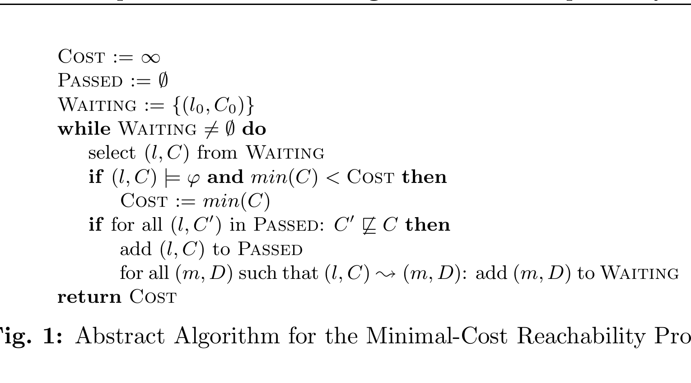
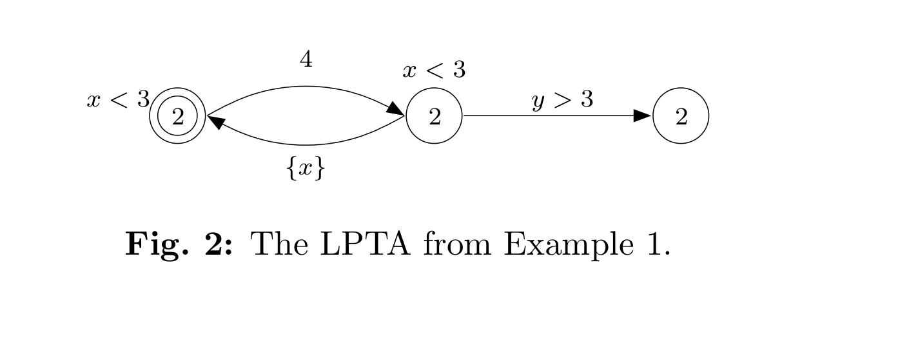
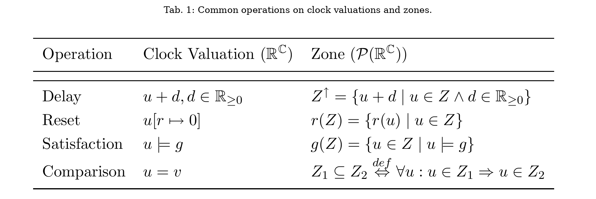
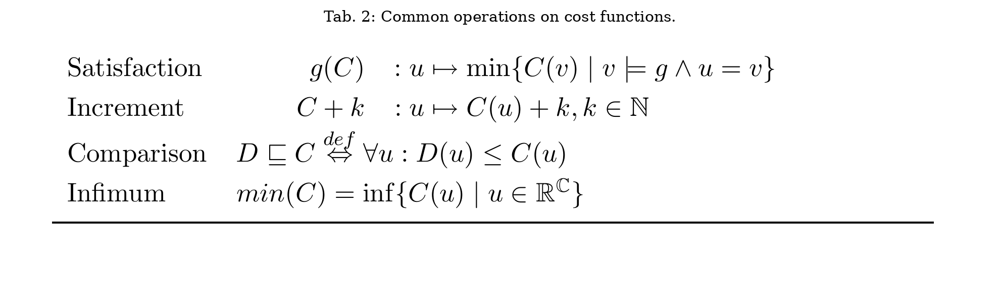
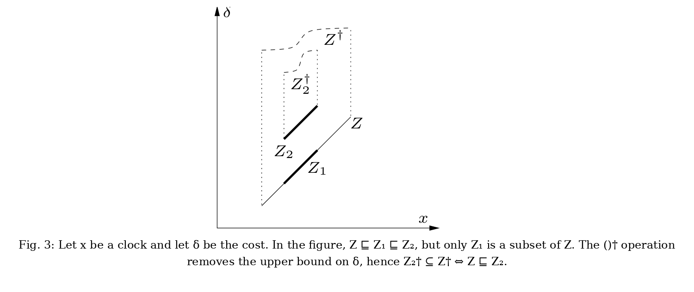
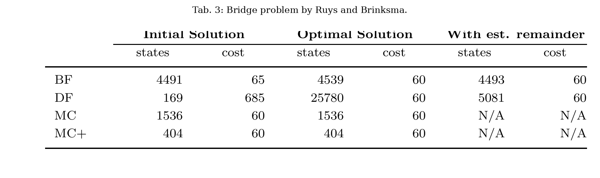
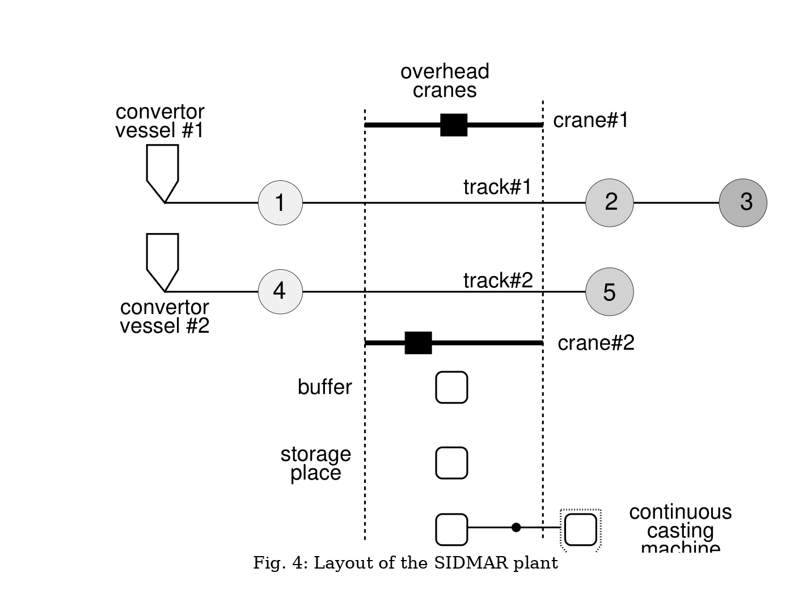
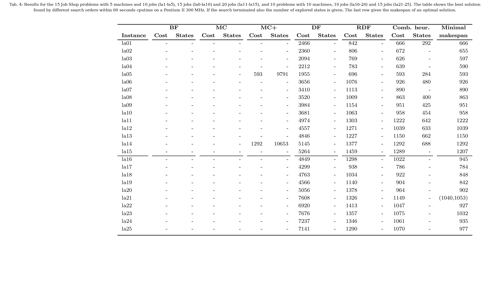
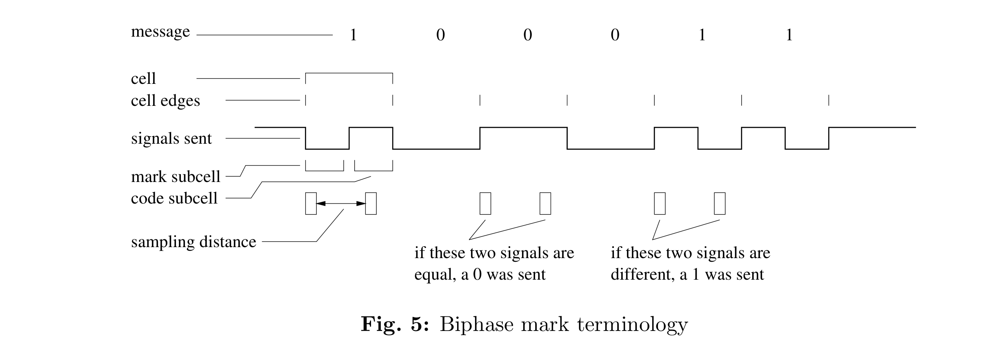
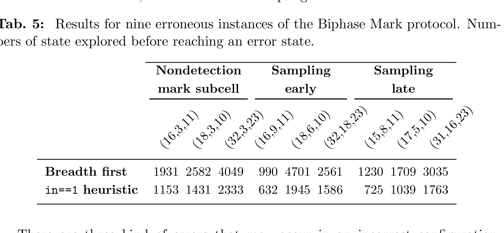

# Efficient Guiding Towards Cost-Optimality in Uppaal

Gerd Behrmann  
BRICS, Aalborg University, Denmark

Ansgar Fehnker, Judi Romijn  
Computing Science Institute, University of Nijmegen, The Netherlands

Thomas Hune  
BRICS, Aarhus University, Denmark

Kim Larsen  
Department of Computer Science, University of Twente, The Netherlands

Paul Pettersson  
Department of Computer Systems, Information Technology, Uppsala University, Sweden

> This work is partially supported by the European Community Esprit-LTR Project 26270 VHS (Verification of Hybrid systems).
>
> Research supported by Netherlands Organization for Scientific Research (NWO) under contract SION 612-14-004.
>
> On sabbatical from Basic Research in Computer Science, Aalborg University.
>
> Research partly sponsored by the AIT-WOODDES Project No IST-1999-10069.

> Note: the local `paper.pdf` contains the title page, a blank separator page, the abstract page, another blank separator page, and then the paper body on pages 129-148. This local copy ends at the conclusion and does not include a bibliography section. The Markdown below is manually refined against the PDF page images. Numbered figures are normalized as `figure-1.png` through `figure-5.png`, and `Table 1` through `Table 5` are kept both as visual assets and as Markdown transcriptions for direct reading on GitHub.

## Abstract

In this paper we present an algorithm for efficiently computing the minimum cost of reaching a goal state in the model of Uniformly Priced Timed Automata (UPTA). This model can be seen as a submodel of the recently suggested model of linearly priced timed automata, which extends timed automata with prices on both locations and transitions. The presented algorithm is based on a symbolic semantics of UTPA, and an efficient representation and operations based on difference bound matrices. In analogy with Dijkstra's shortest path algorithm, we show that the search order of the algorithm can be chosen such that the number of symbolic states explored by the algorithm is optimal, in the sense that the number of explored states cannot be reduced by any other search order based on the cost of states. We also present a number of techniques inspired by branch-and-bound algorithms which can be used for limiting the search space and for quickly finding near-optimal solutions.

The algorithm has been implemented in the verification tool Uppaal. When applied on a number of experiments the presented techniques reduced the explored state-space with up to 90%.

<!-- page: 129 -->

## 1 Introduction

Recently, formal verification tools for real-time and hybrid systems, such as Uppaal [LPY97a], Kronos [BDM+98] and HyTech [HHWT97a], have been applied to solve realistic scheduling problems [Feh99b, HLP00, NY99]. The basic common idea of these works is to reformulate a scheduling problem to a reachability problem that can be solved by verification tools. In this approach, the automata based modeling languages of the verification tools serve as the input language in which the scheduling problem is described. These modeling languages have been found to be very well-suited in this respect, as they allow for easy and flexible modeling of systems consisting of several parallel components that interact in a time-critical manner and constrain the behavior of each other in a multitude of ways.

A main difference between verification algorithms and dedicated scheduling algorithms is in the way they search a state-space to find solutions. Scheduling algorithms are often designed to find optimal (or near optimal) solutions and are therefore based on techniques such as branch-and-bound to identify and prune parts of the states-space that are guaranteed to not contain any optimal solutions. In contrast, verification algorithms normally do not support any notion of optimality and are designed to explore the entire state-space as efficiently as possible. The verification algorithms that do support notions of optimality are restricted to simple trace properties such as shortest trace [LPY95], or shortest accumulated delay in trace [NTY00].

In this paper we aim at reducing the gap between scheduling and verification algorithms by adopting a number of techniques used in scheduling algorithms in the verification tool Uppaal. In doing so, we study the problem of efficiently computing the minimal cost of reaching a goal state in the model of Uniformly Priced Timed Automata (UPTA). This model can be seen as a restricted version of the recently suggested model of Linearly Priced Timed Automata (LPTA) [BFH+01a], which extends the model of timed automata with prices on all transitions and locations. In these models, the cost of taking an action transition is the price associated with the transition, and the cost of delaying $d$ time units in a location is $d \cdot p$, where $p$ is the price associated with the location. The cost of a trace is simply the accumulated sum of costs of its delay and action transitions. The objective is to determine the minimum cost of traces ending in a goal state.

The infinite state-spaces of timed automata models necessitate the use of symbolic techniques in order to simultaneously handle sets of states (so-called symbolic states). For pure reachability analysis, tools like Uppaal and Kronos use symbolic states of the form $(l, Z)$, where $l$ is a location of the timed automaton and $Z \subseteq \mathbb{R}[C]$ is a convex set of clock valuations called a zone. For the computation of minimum costs of reaching goal states, we suggest the use of symbolic cost states of the form $(l, C)$, where $C : \mathbb{R}[C] \to (\mathbb{R}_{\geq 0} \cup \{\infty\})$ is a cost function mapping clock valuations to real valued costs or $\infty$.[^1] The intention is that, whenever $C(u) < \infty$, reachability of the symbolic cost state $(l, C)$ should ensure that the state $(l, u)$ is reachable with cost $C(u)$.

<!-- page: 130 -->

Using the above notion of symbolic cost states, an abstract algorithm for computing the minimum cost of reaching a goal state satisfying $\varphi$ of a uniformly priced timed automaton is shown in Fig. 1. The algorithm is similar to a standard state-space traversal algorithm that uses two data-structures `Wait` and `Passed` to store states waiting to be examined, and states already explored, respectively. Initially, `Passed` is empty and `Wait` holds an initial symbolic cost state. In each iteration, the algorithm proceeds by selecting a state $(l, C)$ from `Wait`, checking that none of the previously explored states $(l, C')$ has a "smaller" cost function, written $C' \sqsubseteq C$,[^2] and if this is the case, adds it to `Passed` and its successors to `Wait`. In addition the algorithm uses the global variable `Cost`, which is initially set to $\infty$ and updated whenever a goal state is found that can be reached with a lower cost than the current value of `Cost`. The algorithm terminates when `Wait` is empty, i.e. when no further states are left to be examined. Thus, the algorithm always searches the entire state-space of the analyzed automaton.

*Figure 1. Abstract Algorithm for the Minimal-Cost Reachability Problem.*

In [BFH+01a] an algorithm for computing the minimal cost of reaching designated goal states was given for the full model of LPTA. However, the algorithm is based on a cost-extended version of regions, and is thus guaranteed to be extremely inefficient and highly sensitive to the size of constants used in the models. As the first contribution of this paper, we give for the subclass of UPTA an efficient zone representation of symbolic cost states based on Difference Bound Matrices [Dil89], and give all the necessary symbolic operators needed to implement the algorithm. As the second contribution we show that, in analogy with Dijkstra's shortest path algorithm, if the algorithm is modified to always select from `Wait` the symbolic cost state with the smallest minimum cost, the state-space exploration may terminate as soon as a goal state is explored. This means that we can solve the minimum-cost reachability problem without necessarily searching the entire state-space of the analyzed automaton. In fact, it can even be shown that the resulting algorithm is optimal in the sense that choosing to search a symbolic cost state with non-minimal minimum cost can never reduce the number of symbolic cost states explored.

<!-- page: 131 -->

The third contribution of this paper is a number of techniques inspired by branch-and-bound algorithms [AC91] that have been adopted in making the algorithm even more useful. These techniques are particularly useful for limiting the search space and for quickly finding solutions near to the minimum cost of reaching a goal state. To support this claim, we have implemented the algorithm in an experimental version of the verification tool Uppaal and applied it to a wide variety of examples. Our experimental findings indicate that in some cases as much as 90% of the state-space searched in ordinary breadth-first order can be avoided by combining the techniques presented in this paper. Moreover, the techniques have allowed pure reachability analysis to be performed in cases which were previously unsuccessful.

The rest of this paper is organized as follows: In Section 2 we formally define the model of uniformly priced timed automata and give the symbolic semantics. In Section 3 we present the basic algorithm and the branch-and-bound inspired techniques. The experiments are presented in Section 4. We conclude the paper in Section 5.

## 2 Uniformly Priced Timed Automata

In this section linearly priced timed automata are formalized and their semantics are defined. The definitions given here resemble those of [BFH+01a], except that the symbolic semantics uses cost functions whereas [BFH+01a] uses priced regions. Zone-based data-structures for compact representation and efficient manipulation of cost functions are provided for the class of uniformly priced timed automata.

### 2.1 Linearly Priced Timed Automata

Formally, linearly priced timed automata (LPTA) are timed automata with prices on locations and transitions. We also denote prices on locations as rates. Let $C$ be a set of clocks. Then $B(C)$ is the set of formulas that are conjunctions of atomic constraints of the form $x \mathbin{\triangleright\!\!\triangleleft} n$ and $x - y \mathbin{\triangleright\!\!\triangleleft} n$ for $x, y \in C$, $\mathbin{\triangleright\!\!\triangleleft} \in \{<, \leq, =, \geq, >\}$ and $n$ being a natural number. Elements of $B(C)$ are called clock constraints over $C$. $P(C)$ denotes the power set of $C$.

**Definition 1 (Linearly Priced Timed Automata).** A linearly priced timed automaton $A$ over clocks $C$ and actions `Act` is a tuple $(L, l_0, E, I, P)$ where $L$ is a finite set of locations, $l_0$ is the initial location, $E \subseteq L \times B(C) \times \mathrm{Act} \times P(C) \times L$ is the set of edges, where an edge contains a source, a guard, an action, a set of clocks to be reset, and a target, $I : L \to B(C)$ assigns invariants to locations, and $P : (L \cup E) \to \mathbb{N}$ assigns prices to both locations and edges. In the case of $(l, g, a, r, l') \in E$, we write $l \xrightarrow{g,a,r} l'$.

Following the common approach to networks of timed automata, we extend LPTA to networks of LPTA by introducing a synchronization function $f : (\mathrm{Act} \cup \{0\}) \times (\mathrm{Act} \cup \{0\}) \rightharpoonup \mathrm{Act}$, where $0$ is a distinguished no-action symbol.[^3] In addition, two functions $h_L, h_E : \mathbb{N} \times \mathbb{N} \to \mathbb{N}$ for combining prices of transitions and locations respectively are introduced.

<!-- page: 132 -->

**Definition 2 (Parallel Composition).** Let $A_i = (L_i, l_{i,0}, E_i, I_i, P_i)$, $i = 1, 2$, be two LPTA. Then the parallel composition is defined as

$$
A_1 \mid^{h_L,h_E}_f A_2 = (L_1 \times L_2, (l_{1,0}, l_{2,0}), E, I, P),
$$

where, for $l = (l_1, l_2)$,

$$
I(l) = I_1(l_1) \wedge I_2(l_2), \qquad P(l) = h_L(P_1(l_1), P_2(l_2)),
$$

and $l \xrightarrow{g,a,r} l'$ iff there exist $g_i, a_i, r_i$ such that $f(a_1, a_2) = a$, $l_i \xrightarrow{g_i,a_i,r_i}_i l_i'$, $g = g_1 \wedge g_2$, $r = r_1 \cup r_2$, and

$$
P((l, g, a, r)) = h_E\bigl(P((l_1, g_1, a_1, r_1)), P((l_2, g_2, a_2, r_2))\bigr).
$$

Useful choices for $h_L$ and $h_E$ guaranteeing commutativity and associativity of parallel composition are summation, minimum and maximum.

Clock values are represented as functions called clock valuations from $C$ to the non-negative reals $\mathbb{R}_{\geq 0}$. We denote by $\mathbb{R}[C]$ the set of clock valuations for $C$.

**Definition 3 (Semantics).** The semantics of a linearly priced timed automaton $A$ is defined as a labeled transition system with the state-space $L \times \mathbb{R}[C]$ with initial state $(l_0, u_0)$, where $u_0$ assigns zero to all clocks in $C$, and with the following transition relation:

- $(l, u) \xrightarrow{\varepsilon(d), p} (l, u + d)$ if $\forall\, 0 \leq e \leq d : u + e \in I(l)$, and $p = d \cdot P(l)$.
- $(l, u) \xrightarrow{a,p} (l', u')$ if there exists $g, r$ such that $l \xrightarrow{g,a,r} l'$, $u \in g$, $u' = u[r \mapsto 0]$, $u' \in I(l')$, and $p = P((l, g, a, r, l'))$.

where for $d \in \mathbb{R}_{\geq 0}$, $u + d$ maps each clock $x$ in $C$ to the value $u(x) + d$, and $u[r \mapsto 0]$ denotes the clock valuation which maps each clock in $r$ to the value $0$ and agrees with $u$ over $C \setminus r$.

The transitions are decorated with a delay quantity or an action, together with the cost of the transition. The cost of an execution trace is simply the accumulated cost of all transitions in the trace.

**Definition 4 (Cost).** Let

$$
\alpha = (l_0, u_0) \xrightarrow{a_1, p_1} (l_1, u_1) \cdots \xrightarrow{a_n, p_n} (l_n, u_n)
$$

be a finite execution trace. The cost of $\alpha$, written $\mathrm{cost}(\alpha)$, is the sum $\sum_{i=1}^n p_i$. For a given state $(l, u)$ the minimum cost $\mathrm{mincost}(l, u)$ of reaching the state is the infimum of the costs of finite traces ending in $(l, u)$. For a given location $l$ the minimum cost $\mathrm{mincost}(l)$ of reaching the location is the infimum of the costs of finite traces ending in $(l, u)$ for some $u$:

$$
\mathrm{mincost}(l) = \inf\{\, \mathrm{cost}(\alpha) \mid \alpha \text{ ends in a state } (l, u) \,\}.
$$

Example 1. An example of a LPTA can be seen in Fig. 2. The LPTA has three locations and two clocks, $x$ and $y$. The number inside the locations is the rate of the location, and the number on the transition from the leftmost location is the cost of the transition.

<!-- page: 133 -->

*Figure 2. The LPTA from Example 1.*

The two other transitions have no cost. The initial location is the leftmost location.

Because of the invariants on the locations, a trace reaching the rightmost location must first visit the middle location and then go back to the initial location. The minimal cost of reaching the rightmost location is 14. Note that there is no trace actually realizing the minimum cost because of the strict inequality on the transition to the rightmost location. However, because of the infimum in the definition of minimum cost, we will say that the minimum cost of reaching the rightmost location is 14.

### 2.2 Cost Functions

The semantics of LPTA yields an uncountable state-space and is therefore not suited for state-space exploration algorithms. To overcome this problem, the algorithm in Fig. 1 uses symbolic cost states, quite similar to how timed automata model checkers like Uppaal use symbolic states.

Typically, symbolic states are pairs on the form $(l, Z)$, where $Z \subseteq \mathbb{R}[C]$ is a convex set of clock valuations, called a zone, representable by Difference Bound Matrices (DBMs) [Dil89]. The operations needed for forward state-space exploration can be efficiently implemented using the DBM data-structure. However, the operations might as well be defined in terms of characteristic functions, $\mathbb{R}[C] \to \{0, 1\}$. For example, let $\chi$ be the characteristic function of a zone $Z$. Then delay can be defined as

$$
\chi^\uparrow : u \mapsto \max\{\, \chi(v) \mid \exists d \in \mathbb{R}_{\geq 0} : v + d = u \,\},
$$

that is, $u$ is in $\chi^\uparrow$ if there is a clock valuation $v$ that can delay into $u$. Looking at zones in terms of their characteristic functions extends nicely to symbolic cost states, but here zones are replaced by mappings, called clock functions, from clock valuations to real valued costs.

In the priced setting we must in addition represent the costs with which individual states are reached. For this we suggest the use of symbolic cost states $(l, C)$, where $C$ is a cost function mapping clock valuations to real valued costs. Thus, within a symbolic cost state $(l, C)$, the cost of a state $(l, u)$ is given by $C(u)$.

**Definition 5 (Cost Function).** A cost function $C : \mathbb{R}[C] \to \mathbb{R}_{\geq 0} \cup \{\infty\}$ assigns to each clock valuation $u$ a positive real valued cost $c$, or infinity. The support

$$
\mathrm{sup}(C) = \{\, u \mid C(u) < \infty \,\}
$$

is the set of valuations mapped to a finite cost.

*Table 1. Common operations on clock valuations and zones.*

For direct reading on GitHub, Table 1 is also transcribed in Markdown:

| Operation | Clock valuation ($\mathbb{R}[C]$) | Zone ($\mathcal{P}(\mathbb{R}[C])$) |
| --- | --- | --- |
| Delay | $u + d$, $d \in \mathbb{R}_{\geq 0}$ | $Z^\uparrow = \{\, u + d \mid u \in Z \land d \in \mathbb{R}_{\geq 0} \,\}$ |
| Reset | $u[r \mapsto 0]$ | $r(Z) = \{\, r(u) \mid u \in Z \,\}$ |
| Satisfaction | $u \models g$ | $g(Z) = \{\, u \in Z \mid u \models g \,\}$ |
| Comparison | $u = v$ | $Z_1 \subseteq Z_2 \Leftrightarrow \forall u : u \in Z_1 \Rightarrow u \in Z_2$ |

*Table 2. Common operations on cost functions.*

For direct reading on GitHub, Table 2 is also transcribed in Markdown:

| Operation | Cost function ($\mathbb{R}[C] \to \mathbb{R}_{\geq 0}$) |
| --- | --- |
| Delay | $\mathrm{delay}(C, p) : u \mapsto \inf\{\, C(v) + p \cdot d \mid d \in \mathbb{R}_{\geq 0} \land v + d = u \,\}$ |
| Reset | $r(C) : u \mapsto \inf\{\, C(v) \mid u = r(v) \,\}$ |
| Satisfaction | $g(C) : u \mapsto \min\{\, C(v) \mid v \models g \land u = v \,\}$ |
| Increment | $C + k : u \mapsto C(u) + k$, $k \in \mathbb{N}$ |
| Comparison | $D \sqsubseteq C \Leftrightarrow \forall u : D(u) \leq C(u)$ |
| Infimum | $\min(C) = \inf\{\, C(u) \mid u \in \mathbb{R}[C] \,\}$ |

Table 2 summarizes several operations that are used by the symbolic semantics and the algorithm in Fig. 1. In terms of the support of a cost function, the operations behave exactly as on zones; e.g. $\mathrm{sup}(r(C)) = r(\mathrm{sup}(C))$. The operations' effect on the cost value reflects the intent to compute the minimum cost of reaching a state, e.g. $r(C)(u)$ is the infimum of $C(v)$ for all $v$ that reset to $u$.

### 2.3 Symbolic Semantics

The symbolic semantics for LPTA is very similar to the common zone based symbolic semantics used for timed automata.

<!-- page: 134 -->

**Definition 6 (Symbolic Semantics).** Let $A = (L, l_0, E, I, P)$ be a linearly priced timed automaton. The symbolic semantics is defined as a labelled transition system over symbolic cost states on the form $(l, C)$, $l$ being a location and $C$ a cost function, with the transition relation:

- $(l, C) \xrightarrow{\varepsilon} \left(l, I(l)\bigl(\mathrm{delay}(C, P(l))\bigr)\right)$,
- $(l, C) \xrightarrow{a} \left(l', I(l')\bigl(r(g(C))\bigr) + p\right)$ iff $l \xrightarrow{g,a,r} l'$, and $p = P((l, g, a, r, l'))$.

The initial state is $(l_0, I(l_0)(C_0))$ where $\mathrm{sup}(C_0) = \{u_0\}$ and $C_0(u_0) = 0$.

Notice that the support of any cost function reachable by the symbolic semantics is a zone.

**Lemma 1.** Given an LPTA $A$, for each trace $\alpha$ of $A$ that ends in state $(l, u)$, there exists a symbolic trace $\beta$ of $A$, that ends up in a symbolic cost state $(l, C)$, such that $C(u) \leq \mathrm{cost}(\alpha)$.

Proof: By induction in the length of the run $\alpha$. The base case, a run of length $0$, is trivial.

For the induction step assume we have a trace $\alpha$ ending in a state $(l, u)$ and a symbolic trace ending in a symbolic state $(l, C)$, such that $C(u) \leq \mathrm{cost}(\alpha)$. We look at two cases:

- The trace $\alpha$ is extended with a delay transition $(l, u) \xrightarrow{\varepsilon(d), p} (l, u + d)$ such that $\forall\, 0 \leq e \leq d : u + e \in I(l)$ where $p = d \cdot P(l)$. The cost of $u + d$ is $\mathrm{cost}(\alpha) + p$. This can be matched in the symbolic semantics by a delay transition $(l, C) \xrightarrow{\varepsilon} (l, C')$, where

  $$
  C' = I(l)\bigl(\mathrm{delay}(C, P(l))\bigr).
  $$

  We now get

  $$
  C'(u + d) \leq C(u) + d \cdot P(l) \leq \mathrm{cost}(\alpha) + d \cdot P(l) = \mathrm{cost}(\alpha) + p,
  $$

  where the first inequality follows from the definition of $\mathrm{delay}(C, p)$ in Table 2 and the second inequality follows from the induction hypothesis.

- The trace $\alpha$ is extended with an action transition $(l, u) \xrightarrow{a,p} (l', u')$ using a transition $l \xrightarrow{g,a,r} l'$ where $u \in g$, $u' = u[r]$, and $u' \in I(l')$. Let $p = P((l, g, a, r, l'))$ be the cost of the transition. The cost of $(l', u')$ is $\mathrm{cost}(\alpha) + p$. This can be matched in the symbolic semantics by an action transition $(l, C) \xrightarrow{a} (l', C')$, where

  $$
  C' = I(l')\bigl(r(g(C))\bigr) + p.
  $$

  Since $u$ satisfies the guard $g$, $u' = u[r]$, and $u'$ satisfies the invariant $I(l')$, it follows from the definition of the reset operation in Table 2 that $I(l')(r(g(C)))(u') \leq C(u)$. We conclude that $C'(u') \leq C(u) + p$. $\blacksquare$

<!-- page: 135 -->

**Lemma 2.** Given an LPTA $A$, for each symbolic trace $\beta$, ending in a symbolic state $(l, C)$, for each $u \in \mathrm{sup}(C)$, $\mathrm{mincost}(l, u) \leq C(u)$.

Proof: We prove this by induction in the length of the symbolic trace leading to $(l, C)$. The base case, a trace of length zero, is trivial.

For the induction we assume that there is a symbolic trace ending in $(l, C)$ and for each $u \in \mathrm{sup}(C)$, $\mathrm{mincost}(l, u) \leq C(u)$. We look at two cases:

- The symbolic trace $\beta$ is extended with a delay transition $(l, C) \xrightarrow{\varepsilon} (l, C')$ where

  $$
  C' = I(l)\bigl(\mathrm{delay}(C, P(l))\bigr).
  $$

  For all $u' \in \mathrm{sup}(C')$ we now have

  $$
  \begin{aligned}
  C'(u')
    &= \inf\{\, C(u) + d \cdot P(l) \mid d \in \mathbb{R}_{\geq 0} \land u + d = u' \land u' \models I(l) \,\} \\
    &\geq_{IH} \inf\{\, \mathrm{mincost}(l, u) + d \cdot P(l) \mid d \in \mathbb{R}_{\geq 0} \land u + d = u' \land u' \models I(l) \,\} \\
    &\geq^{*} \mathrm{mincost}(l, u'),
  \end{aligned}
  $$

  where $*$ follows from $P(l) \geq 0$ and the fact that any concrete trace to $(l, u)$ can be extended to reach $(l, u')$ by paying $d \cdot P(l)$.

- The symbolic trace $\beta$ is extended with an action transition $(l, C) \xrightarrow{a} (l', C')$ where $C' = I(l')(r(g(C))) + p$ using the transition $l \xrightarrow{g,a,r} l'$ with cost $p$. We get

  $$
  \begin{aligned}
  C'(u)
    &= \min \left\{\, \inf \left\{\, \min\{\, C(v) \mid v \models g \,\} \mid u = r(v) \,\right\} \mid u \models I(l') \,\right\} + p \\
    &\geq_{IH} \min \left\{\, \inf \left\{\, \min\{\, \mathrm{mincost}(l, v) \mid v \models g \,\} \mid u = r(v) \,\right\} \mid u \models I(l') \,\right\} + p \\
    &= \min \left\{\, \inf \left\{\, \min\{\, \mathrm{mincost}(l, v) + p \mid v \models g \,\} \mid u = r(v) \,\right\} \mid u \models I(l') \,\right\} \\
    &\geq^{*} \min \left\{\, \inf \left\{\, \min\{\, \mathrm{mincost}(l', u) \mid v \models g \,\} \mid u = r(v) \,\right\} \mid u \models I(l') \,\right\} \\
    &\geq \mathrm{mincost}(l', u),
  \end{aligned}
  $$

  where $*$ follows from the fact that every concrete trace ending in $(l, v)$ can be extended to $(l', u)$ with the same action transition used to extend the symbolic trace by paying $p$. $\blacksquare$

**Theorem 1.**

$$
\mathrm{mincost}(l) = \min\{\, \min(C) \mid (l, C) \text{ is reachable} \,\}.
$$

<!-- page: 136 -->

Theorem 1 ensures that the algorithm in Fig. 1 indeed does find the minimum cost, but since the state-space is still infinite there is no guarantee that the algorithm ever terminates. For zone based timed automata model checkers, termination is ensured by normalizing all zones with respect to a maximum constant $M$ [Rok93], but for LPTA ensuring termination also depends on the representation of cost functions.

### 2.4 Representing Cost Functions

As stated in the introduction, we provide an efficient implementation of cost functions for the class of Uniformly Priced Timed Automata (UPTA).

**Definition 7 (Uniformly Priced Timed Automata).** A uniformly priced timed automaton is an LPTA where all locations have the same rate. We refer to this rate as the rate of the UPTA.

<!-- page: 137 -->

**Lemma 3.** Any UPTA $A$ with positive rate can be translated into a UPTA $B$ with rate $1$ such that $\mathrm{mincost}(l)$ in $A$ is identical to $\mathrm{mincost}(l)$ in $B$.

Proof: [sketch] Let $A$ be a UPTA with positive rate $r$. Now, let $B$ be like $A$ except that all constants on guards and invariants are multiplied by $r$ and set the rate of $B$ to $1$. $\blacksquare$

Thus, in order to find the infimum cost of reaching a satisfying state in UPTA, we only need to be able to handle rate zero and rate one.

In case of rate zero, all symbolic states reachable by the symbolic semantics have very simple cost functions: the support is mapped to the same integer, because the cost is $0$ in the initial state and only modified by the increment operation. This means that a cost function $C$ can be represented as a pair $(Z, c)$, where $Z$ is a zone and $c$ an integer, such that $C(u) = c$ when $u \in Z$ and $\infty$ otherwise. Delay, reset and satisfaction are easily implementable for zones using DBMs. Increment is a matter of incrementing $c$ and a comparison $(Z_1, c_1) \sqsubseteq (Z_2, c_2)$ reduces to $Z_2 \subseteq Z_1 \land c_1 \leq c_2$. Termination is ensured by normalizing all zones with respect to a maximum constant $M$.

In case of rate one, the idea is to use zones over $C \cup \{\delta\}$, where $\delta$ is an additional clock keeping track of the cost, such that every clock valuation $u$ is associated with exactly one cost $Z(u)$ in zone $Z$.[^4] Then, $C(u) = c$ iff $u[\delta \mapsto c] \in Z$. This is possible because the continuous cost advances at the same rate as time. Delay, reset, satisfaction and infimum are supported directly by DBMs. Increment $C + k$ translates to

$$
Z[\delta \mapsto \delta + k] = \{\, u[\delta \mapsto u(\delta) + k] \mid u \in Z \,\}
$$

and is also realizable using DBMs. For comparison between symbolic cost states, notice that $Z_2 \subseteq Z_1 \Rightarrow Z_1 \sqsubseteq Z_2$, whereas the implication in the other direction does not hold in general, see Fig. 3. However, it follows from the following Lemma 4 that comparisons can still be reduced to set inclusion provided the zone is extended in the $\delta$ dimension, see Fig. 3.

*Figure 3. Let $x$ be a clock and let $\delta$ be the cost. In the figure, $Z \sqsubseteq Z_1 \sqsubseteq Z_2$, but only $Z_1$ is a subset of $Z$. The $(\cdot)^\dagger$ operation removes the upper bound on $\delta$, hence $Z_2^\dagger \subseteq Z^\dagger \Leftrightarrow Z \sqsubseteq Z_2$.*

**Lemma 4.** Let

$$
Z^\dagger = \{\, u[\delta \mapsto u(\delta) + d] \mid u \in Z \land d \in \mathbb{R}_{\geq 0} \,\}.
$$

Then $Z_1 \sqsubseteq Z_2 \Leftrightarrow Z_2^\dagger \subseteq Z_1^\dagger$.

<!-- page: 138 -->

Proof: By definition $Z_1 \sqsubseteq Z_2 \Leftrightarrow \forall u : Z_1(u) \leq Z_2(u)$. First, assume $Z_1 \sqsubseteq Z_2$ and let $u[\delta \mapsto c] \in Z_2^\dagger$. Then $Z_1(u) \leq Z_2(u) \leq c$ and by definition $u[\delta \mapsto Z_1(u) + d] \in Z_1^\dagger$ for $d \in \mathbb{R}_{\geq 0}$, implying $u[\delta \mapsto c] \in Z_1^\dagger$. This proves one direction of the lemma. Second, assume $Z_2^\dagger \subseteq Z_1^\dagger$. By definition $u[\delta \mapsto Z_2(u)] \in Z_2^\dagger \subseteq Z_1^\dagger$ and it follows that $Z_1(u) \leq Z_2(u)$. $\blacksquare$

It is straightforward to implement the $(\cdot)^\dagger$-operation on DBMs. However, a useful property of the $(\cdot)^\dagger$-operation is that its effect on zones can be obtained without implementing the operation. Let $(l_0, Z_0^\dagger)$, where $Z_0$ is the zone encoding $C_0$, be the initial symbolic state. Then $Z = Z^\dagger$ for any reachable state $(l, Z)$, intuitively because $\delta$ is never reset and no guards or invariants depend on $\delta$.

Termination is ensured if all clocks except for $\delta$ are normalized with respect to a maximum constant $M$. It is important that normalization never touches $\delta$. With this modification, the algorithm in Fig. 1 will essentially encounter the same states as the traditional forward state-space exploration algorithm for timed automata, except for the addition of $\delta$.

## 3 Improving the State-Space Exploration

As mentioned, the major drawback of using the algorithm in Fig. 1 to find the minimum cost of reaching a goal state is that the complete states space has to be searched. However, this can in most cases be improved in a number of ways. Realizing the connection between Dijkstra's shortest path algorithm and the Uppaal state-space search leads us to stop the search as soon as a goal state has been found. However, this is based on a kind of breadth first search which might not be possible for systems with very large state-spaces. In this case using techniques inspired by branch and bound algorithms can be helpful.

### 3.1 Minimum Cost Order

In realizing the algorithm of Fig. 1, and in analogy with Dijkstra's algorithm for finding the shortest path in a directed weighted graph, we may choose always to select a symbolic cost state $(l, C)$ from `Wait` for which $C$ has the smallest minimum cost. With this choice, we may terminate the algorithm as soon as a goal state is selected from `Wait`. We will refer to the search order arising from this strategy as the Minimum Cost order (MC order).

**Lemma 5.** Using the MC order, an optimal solution is found by the algorithm in Fig. 1 when a goal state is selected from `Wait` the first time.

Proof: When a state is taken from `Wait` using the MC order, no state with lower cost is reachable. Therefore, when the first goal state is taken from `Wait`, no goal states with lower cost are reachable, so the optimal solution has been found. $\blacksquare$

When applying the MC order, the algorithm in Fig. 1 can be simplified since the variable `Cost` is not needed any more.

<!-- page: 139 -->

Again in analogy with Dijkstra's shortest path algorithm, the MC ordering finds the minimum cost of reaching a goal state with guarantee of its optimality, in a manner which requires exploration of a minimum number of symbolic cost states.

**Lemma 6.** Finding the optimal cost of reaching a location and proving it to be optimal using the algorithm in Fig. 1, it can never reduce the number of explored states to prefer exploration of a symbolic cost state of `Wait` with non-minimal minimum cost.

Proof: Assume on the contrary that this would be the case. Then at some stage, the exploration of a symbolic cost state $(l, C)$ of `Wait` with non-minimal cost should be able to reduce the subsequent exploration of one of the symbolic cost states $(m, D)$ of `Wait` with smaller minimum cost. That is, some derivative of $(l, C)$ should be applicable in pruning the exploration of some derivative of $(m, D)$, or more precisely,

$$
(l, C) \; ;^* \; (l', C') \qquad \text{and} \qquad (m, D) \; ;^* \; (m', D')
$$

with $l' = m'$ and $C' \sqsubseteq D'$. By definition of $\sqsubseteq$ and since $;$ never decreases minimum cost, it follows that

$$
\min(C) \leq \min(C') \leq \min(D').
$$

But then, application of the MC order would also explore $(l, C)$ and $(l', C')$ before $(m', D')$ and hence lead to the same pruning of $(m', D')$, contradicting the assumed superiority of the non-MC search order. $\blacksquare$

In situations when `Wait` contains more than just one symbolic cost state with smallest minimum cost, the MC order does not offer any indication as to which one to explore first. In fact, for exploration of the symbolic state-space for timed automata without cost, we do not know of a definite strategy for choosing a state from `Wait` such that the fewest number of symbolic states are generated. However, any improvements gained with respect to the search-order strategy for the state-space exploration of timed automata will be directly applicable in our setting with respect to the strategy for choosing between symbolic cost states with same minimum cost.

### 3.2 Using Estimates of the Remaining Cost

From a given state one often has an idea about the cost remaining in order to reach a goal state. In branch-and-bound algorithms this information is used both to delete states and to search the most promising states first. Using information about the remaining cost can also decrease the number of states searched before an optimal solution is reached.

For a state $(l, u)$ let $\mathrm{rem}((l, u))$ be the minimum cost of reaching a goal state from that state. In general we cannot expect to know exactly what the remaining cost of a state is. We can instead use an estimate of the remaining cost as long as the estimate does not exceed the actual cost. For a symbolic cost state $(l, C)$ we require that $\mathrm{Rem}(l, C)$ satisfies

$$
\mathrm{Rem}(l, C) \leq \inf\{\, \mathrm{rem}((l, u)) \mid u \in \mathrm{sup}(C) \,\},
$$

i.e. $\mathrm{Rem}(l, C)$ offers a lower bound on the remaining cost of all the states with location $l$ and clock valuation within the support of $C$.

Combining the minimum cost $\min(C)$ of a symbolic cost state $(l, C)$ with the estimate of the remaining cost $\mathrm{Rem}(l, C)$, we can base the MC order on the sum of $\min(C)$ and $\mathrm{Rem}(l, C)$.

<!-- page: 140 -->

Since $\min(C) + \mathrm{Rem}(l, C)$ is smaller than the actual cost of reaching a goal state, the first goal state to be explored is guaranteed to have optimal cost. We call this the MC+ order, but it is also known as Least-Lower-Bound order. In Section 4 we will show that even simple estimates of the remaining cost can lead to large improvements in the number of states searched to find the minimum cost of reaching a goal state.

One way to obtain a lower bound is for the user to specify an initial estimate and annotate each transition with updates of the estimate. In this case it is the responsibility of the user to guarantee that the estimate is actually a lower bound in order to ensure that the optimal solution is not deleted. This also allows the user to apply her understanding and intuition about the system.

To obtain a lower bound of the remaining cost in an automatic and efficient manner, we suggest to replace one or more automata in the network with "more abstract" automata. The idea is that this should result in an abstract network which (1) contains at least all runs of the original one, and (2) with no larger costs. Thus computing the minimum cost of reaching a goal state in the abstract network will give the desired lower bound estimate of reaching a goal state in the original network. Moreover, the abstract network should (3) be substantially simpler to analyze than the original network, making it possible to obtain the estimate efficiently. We are currently working with different ideas of implementing this idea. In Section 4 we have used the idea when guiding systems manually.

### 3.3 Heuristics and Bounding

It is often useful to quickly obtain an upper bound on the cost instead of waiting for the minimum cost. In particular, this is the case when faced with a state-space too large for the MC order to handle. As will be shown in Section 4, the techniques described here for altering the search order using heuristics are very useful. In addition, techniques from branch-and-bound algorithms are useful for improving the upper bound once it has been found. Applying knowledge about the goal state has proven useful in improving the state-space exploration [RE99, HLP00], either by changing the search order from the standard depth or breadth-first, or by leaving out parts of the state-space.

To implement the MC order, a suitable data-structure for `Waiting` would be a priority queue where the priority is the minimum cost of a symbolic cost state. We can obviously generalize this by extending a symbolic cost state with a new field, `priority`, which is the priority of the state used by the priority queue. Allowing various ways of assigning values to `priority`, combined with choosing either to first select a state with large or small priority, opens for a large variety of search orders.

Annotating the model with assignments to `priority` on the transitions is one way of allowing the user to guide the search. Because of its flexibility it proves to be a very powerful way of guiding the search. The assignment works like a normal assignment to integer variables and allows for the same kind of expressions.

<!-- page: 141 -->

Example 2. An example of a strategy which we have used in Section 4 for the Biphase Mark protocol, is first to search a limited part of the state-space in a breadth-first manner. The sender of the protocol can either send the value 0 or 1. We are mainly interested in the part where a 1 is sent because we suspect that errors will occur in this case. Therefore, we want to search the part of the state-space where a 1 is sent before searching the part where 0 is sent, and we want to do this in a breadth-first manner.

Using guiding, a standard breadth-first search can be obtained by adding the assignment `priority := priority - 1` to each transition and selecting the symbolic state with the highest value from `Wait`. This can be done by adding a global assignment to the model. Giving very low priority to the part of the state-space where a 0 has been sent we will obtain the desired search order. The choice of what to send is made in one place in the model of the sender. On the transition choosing to send a 0 we add the assignment `priority := priority - 1000` which will give this state and all its successors very low priority and therefore these will be explored last. In this way we do not leave out any part of the state-space, but first search the part we consider to be interesting.

When searching for an error state in a system a random search order might be useful. We have chosen to implement what we call random depth-first order which, as the name suggests, is a variant of a depth-first search. The only difference between this and a standard depth-first search is that before pushing all the successors of a state onto `Waiting`, which is implemented as a stack, the successors are randomly permuted.

Once a reachable goal state has been found, an upper bound on the minimum cost of reaching a goal state has been obtained. If we choose to continue the search, a smaller upper bound might be obtained. During state-space exploration the cost never decreases; therefore states with cost bigger than the best cost found in a goal state cannot lead to an optimal solution, and can therefore be deleted. The estimate of the remaining cost defined in Section 3.2 can also be used for pruning exploration of states since whenever $\min(C) + \mathrm{Rem}(l, C)$ is larger than the best upper bound, no state covered by $(l, C)$ can lead to a better solution than the one already found.

All of the methods described in this section have been implemented in Uppaal. Section 4 reports on experiments using these new methods.

## 4 Experiments

In this section we illustrate the benefits of extending Uppaal with heuristics and costs through several verification and optimization problems. All of the examples have previously been studied in the literature.

### 4.1 The Bridge Problem

<!-- page: 142 -->

The following problem was proposed by Ruys and Brinksma [RB98]. A timed automaton model of this problem is included in the standard distribution of Uppaal.[^5]

Four persons want to cross a bridge in the dark. The bridge is damaged and can only carry two persons at the same time. To cross the bridge safely in the darkness, a torch must be carried along. The group has only one torch to share. Due to different physical abilities, the four cross the bridge at different speeds. The time they need per person is one-way 25, 20, 10 and 5 minutes, respectively. The problem is to find a schedule, if possible, such that all four cross the bridge within a given time. This can be done with standard Uppaal. With the proposed extension, it is also possible to find the fastest time for the four to cross the bridge, and a schedule achieving this.

We compare four different search orders: Breadth-First (BF), Depth-First (DF), Minimum Cost (MC) and an improved Minimum Cost (MC+). In this example we choose the lower bound on the remaining cost, $\mathrm{Rem}(C)$, to be the time needed by the slowest person who is still on the "wrong" side of the bridge.

For the different search orders, Table 3 shows the number of states explored to find the initial and the optimal time, and the values of the times. It can be seen that BF explores 4491 states to find an initial schedule and 4539 to prove what the optimal solution is. This number is reduced to 4493 explored states if we prune the state-space, based on the estimated remaining cost, third column. Thus, in this case only two additional states are explored after the initial solution is found. DF finds an initial solution with high costs quickly, but explores 25779 states to find an optimal schedule, which is much more than the other heuristics. Most likely, this is caused by encountering many small and incomparable zones during DF search. In any case, it appears that the depth-first strategy always explores many more states than any other heuristic.

*Table 3. Bridge problem by Ruys and Brinksma.*

For direct reading on GitHub, Table 3 is also transcribed in Markdown:

| Method | Initial solution states | Initial solution cost | Optimal solution states | Optimal solution cost | With est. remainder states | With est. remainder cost |
| --- | ---: | ---: | ---: | ---: | ---: | ---: |
| BF | 4491 | 65 | 4539 | 60 | 4493 | 60 |
| DF | 169 | 685 | 25780 | 60 | 5081 | 60 |
| MC | 1536 | 60 | 1536 | 60 | N/A | N/A |
| MC+ | 404 | 60 | 404 | 60 | N/A | N/A |

Searching with the MC order does indeed improve the results, compared to BF and DF. It is however outperformed by the MC+ heuristic that explores only 404 states to find an optimal schedule. Note that pruning based on the estimate of the remaining cost does not apply to MC and MC+ order, since the first explored goal state has the optimal value.

<!-- page: 143 -->

Without costs and heuristics, Uppaal can only show whether a schedule exists. The extension allows Uppaal to find the optimal schedule and explores with the MC+ heuristic only about 10% of the states that are needed to find an initial solution with the breadth-first heuristic.

### 4.2 Job Shop Scheduling

A well known class of scheduling problems are the Job Shop problems. The problem is to optimally schedule a set of jobs on a set of machines. Each job is a chain of operations, usually one on each machine, and the machines have a limited capacity, also limited to one in most cases. The purpose is to allocate starting times to the operations, such that the overall duration of the schedule, the makespan, is minimal. Many solution methods such as local search algorithms like simulated annealing [AvLLU94], shifting bottleneck [AC91], branch-and-bound [AC91] or even hybrid methods have been proposed [JM99].

We apply Uppaal to 25 of the smaller Lawrence Job Shop problems.[^6] Our models are based on the timed automata models in [Feh99a]. In order to estimate the lower bound on the remaining cost, we calculate for each job and each machine the duration of the remaining operations. These estimates may be seen as obtained by abstracting the model to one automaton as described in Section 3.2. The final estimate of the remaining cost is then estimated to be the maximum of these durations. Table 4 shows results obtained for the search orders BF, MC, MC+, DF, Random DF, and a combined heuristic. The latter is based on depth-first but also takes into account the remaining operation times and the lower bound on the cost, via a weighted sum which is assigned to the priority field of the symbolic states. The results show BF and MC order cannot complete a single instance in 60 seconds, but even when allowed to spend more than 30 minutes using more than 2Gb of memory no solution was found. It is important to notice that the combined heuristic used includes a clever choice between states with the same values of cost plus remaining cost. This is the reason it is able to outperform the MC+ order which is only able to find solution to two instances within the time limit of 60 seconds.

As can be seen from the table, Uppaal is handling the first 15 examples quite well, finding the optimal solution in 11 cases and in 10 of these showing that it is optimal. This is much more than without the added guiding features. For the 10 largest problems, `la16` to `la25`, with 10 machines we did not find optimal solutions though in some cases we were very close to the optimal solution. Since branch-and-bound algorithms generally do not scale too well when the number of machines and jobs increase, this is not surprising. The branch-and-bound algorithm of [AC91], which solves about 10 out of the 15 problems in the same setting, faces the same problem. Note that the results of this algorithm depend sensitively on the choice of an initial upper bound. Also the algorithm used in [BJS95], which combines a good heuristic with an efficient branch-and-bound algorithm and thus solves all of these 15 instances, does not find solutions for the larger instances with 15 jobs and 10 machines or larger.

### 4.3 The Sidmar Steel Plant

<!-- page: 144 -->

Proving schedulability of an industrial plant via a reachability analysis of a timed automaton model was firstly applied to the SIDMAR steel plant, which was included as case study of the Esprit-LTR Project 26270 VHS (Verification of Hybrid Systems). It deals with the part of the plant in-between the blast furnace and the hot rolling mill. The plant consists of five machines placed along two tracks and a casting machine where the finished steel leaves the system. The two tracks and the casting machine are connected via two overhead cranes on one track. Figure 4 depicts the layout of the plant. Each quantity of raw iron enters the system in a ladle and depending on the desired steel quality undergoes treatments in the different machines of different durations. The aim is to control the plant, in particular the movement of the ladles with steel between the different machines, taking the topology of the plant into consideration.

*Figure 4. Layout of the SIDMAR plant.*

We use a model based on the models and descriptions in [BS99, Feh99b, HLP99]. A full model of the plant that includes all possible behaviors was however not immediately suitable for verification. Its state space is very large since at each point in time many different possibilities are enabled. Consequently, depth-first and breadth-first search give either no answer within reasonable time or come up with a solution that is far from optimal. In this way we were only able to find schedules for models of the plant with two ladles.

Priorities can be used to influence the search order of the state space, and thus to improve the results. Based on a depth-first strategy, we reward transitions that are likely to serve in reaching the goal, whereas transitions that may spoil a partial solution result in lower priorities. For instance, when a batch of iron is being treated by a machine, it pays off to reward other scheduling activities rather than wait for the treatment to finish.

<!-- page: 145 -->

*Table 4. Results for the 15 Job Shop problems with 5 machines and 10 jobs (`la1-la5`), 15 jobs (`la6-la10`) and 20 jobs (`la11-la15`), and 10 problems with 10 machines, 10 jobs (`la16-la20`) and 15 jobs (`la21-la25`). The table shows the best solution found by different search orders within 60 seconds cputime on a Pentium II 300 MHz. If the search terminated also the number of explored states is given. The last row gives the makespan of an optimal solution.*

For direct reading on GitHub, Table 4 is also transcribed in Markdown:

| Instance | BF Cost | BF States | MC Cost | MC States | MC+ Cost | MC+ States | DF Cost | DF States | RDF Cost | RDF States | Comb. heur. Cost | Comb. heur. States | Minimal makespan |
| --- | ---: | ---: | ---: | ---: | ---: | ---: | ---: | ---: | ---: | ---: | ---: | ---: | ---: |
| la01 | - | - | - | - | - | - | 2466 | - | 842 | - | 666 | 292 | 666 |
| la02 | - | - | - | - | - | - | 2360 | - | 806 | - | 672 | - | 655 |
| la03 | - | - | - | - | - | - | 2094 | - | 769 | - | 626 | - | 597 |
| la04 | - | - | - | - | - | - | 2212 | - | 783 | - | 639 | - | 590 |
| la05 | - | - | - | - | 593 | 9791 | 1955 | - | 696 | - | 593 | 284 | 593 |
| la06 | - | - | - | - | - | - | 3656 | - | 1076 | - | 926 | 480 | 926 |
| la07 | - | - | - | - | - | - | 3410 | - | 1113 | - | 890 | - | 890 |
| la08 | - | - | - | - | - | - | 3520 | - | 1009 | - | 863 | 400 | 863 |
| la09 | - | - | - | - | - | - | 3984 | - | 1154 | - | 951 | 425 | 951 |
| la10 | - | - | - | - | - | - | 3681 | - | 1063 | - | 958 | 454 | 958 |
| la11 | - | - | - | - | - | - | 4974 | - | 1303 | - | 1222 | 642 | 1222 |
| la12 | - | - | - | - | - | - | 4557 | - | 1271 | - | 1039 | 633 | 1039 |
| la13 | - | - | - | - | - | - | 4846 | - | 1227 | - | 1150 | 662 | 1150 |
| la14 | - | - | - | - | 1292 | 10653 | 5145 | - | 1377 | - | 1292 | 688 | 1292 |
| la15 | - | - | - | - | - | - | 5264 | - | 1459 | - | 1289 | - | 1207 |
| la16 | - | - | - | - | - | - | 4849 | - | 1298 | - | 1022 | - | 945 |
| la17 | - | - | - | - | - | - | 4299 | - | 938 | - | 786 | - | 784 |
| la18 | - | - | - | - | - | - | 4763 | - | 1034 | - | 922 | - | 848 |
| la19 | - | - | - | - | - | - | 4566 | - | 1140 | - | 904 | - | 842 |
| la20 | - | - | - | - | - | - | 5056 | - | 1378 | - | 964 | - | 902 |
| la21 | - | - | - | - | - | - | 7608 | - | 1326 | - | 1149 | - | (1040,1053) |
| la22 | - | - | - | - | - | - | 6920 | - | 1413 | - | 1047 | - | 927 |
| la23 | - | - | - | - | - | - | 7676 | - | 1357 | - | 1075 | - | 1032 |
| la24 | - | - | - | - | - | - | 7237 | - | 1346 | - | 1061 | - | 935 |
| la25 | - | - | - | - | - | - | 7141 | - | 1290 | - | 1070 | - | 977 |

<!-- page: 146 -->

A schedule for three ladles was produced in [Feh99b] for a slightly simplified model using Uppaal. In [HLP99] schedules for up to 60 ladles were produced also using Uppaal. However, in order to do this, additional constraints were included that reduce the size of the state-space drastically, but also prune possibly sensible behavior. A similar reduced model was used by Stobbe in [Sto00], who uses constraint programming to schedule 30 ladles. All these works only consider ladles with the same quality of steel and the initial solutions cannot be improved.

A lower bound for the time duration of any feasible schedule is given by the time the first load needs for all treatments plus least the time one needs to cast all batches. Analogously, an upper bound is given by the maximal time during which the first batch is allowed to stay in the system, plus the maximal time needed to cast the ladles. For the instance with ten batches, these bounds are 291 and 425, respectively. With the sketched heuristic, our extended Uppaal is able to find a schedule with duration 355, within 60 seconds cputime on a Pentium II 300 MHz. The initial solution found is improved by 5% within the time limit. Importantly, in this approach we do not rule out optimal solutions. Allowing the search to go on for longer, models with more ladles can be handled.

### 4.4 Pure Heuristics: The Biphase Mark Protocol

The Biphase Mark protocol is a convention for transmitting strings of bit and clock pulses simultaneously as square waves. This protocol is widely used for communication in the ISO/OSI physical layer; for example, a version called "Manchester" is used in the Ethernet. The protocol ensures that strings of bits can be submitted and received correctly, in spite of clock drift, jitter and filtering by the channel. A formal parameterized timed automaton model of the Biphase Mark Protocol was given in [Vaa04], where also necessary and sufficient conditions on the correctness for a parametric model were derived. We will use the corresponding Uppaal models to investigate the benefits of heuristics in pure reachability analysis.

<!-- page: 147 -->

The model assumes that sender and receiver have both their own clock with drift and jitter. The sender encodes each bit in a cell of length $c$ clock cycles, see Fig. 5. At the beginning of each cell, the sender toggles the voltage. The sender then waits for $m$ clock cycles, where $m$ stands for the mark subcell. If the sender has to encode a "0", the voltage is held constant throughout the whole cell. If it encodes a "1" it will toggle the voltage at the end of the mark subcell. The signal is unreliable during a small interval after the sender generates an edge. Reading it during this interval may produce any value.

The receiver waits for an edge that signals the arrival of a cell. Upon detecting an edge, the receiver waits for a fixed number of clock cycles, the sampling distance $s$, and samples the signal. We adopt the notation $\mathrm{bpm}(c, m, s)$ for instances of the protocol with cell size $c$, mark size $m$ and sampling distance $s$.

*Figure 5. Biphase mark terminology.*

Table 5 gives results for nine erroneous instances of the Biphase Mark protocol.

*Table 5. Results for nine erroneous instances of the Biphase Mark protocol. Numbers of states explored before reaching an error state.*

For direct reading on GitHub, Table 5 is also transcribed in Markdown:

| Method | Nondetection mark subcell `(16,3,11)` | Nondetection mark subcell `(18,3,10)` | Nondetection mark subcell `(32,3,23)` | Sampling early `(16,9,11)` | Sampling early `(18,6,10)` | Sampling early `(32,18,23)` | Sampling late `(15,8,11)` | Sampling late `(17,5,10)` | Sampling late `(31,16,23)` |
| --- | ---: | ---: | ---: | ---: | ---: | ---: | ---: | ---: | ---: |
| Breadth first | 1931 | 2582 | 4049 | 990 | 4701 | 2561 | 1230 | 1709 | 3035 |
| `in==1` heuristic | 1153 | 1431 | 2333 | 632 | 1945 | 1586 | 725 | 1039 | 1763 |

There are three kinds of errors that may occur in an incorrect configuration. Firstly, the receiver may not detect the mark subcell. Secondly, the receiver may sample too early, before or right after the sender left the mark subcell. Finally, the receiver may also sample too late, i.e. the sender has already started to transmit the next cell. The first two errors can only occur if there is an edge after the mark subcell. This is only the case if input "1" is offered to the coder. The third error seems to be independent of the offered input.

Since two of the three errors occur only if input "1" is offered to the coder, and the third error can occur in any case, it seems worthwhile to choose a heuristic that searches for states with input "1" first, rather than exploring state-space for both possible inputs concurrently. We apply a heuristic which is a mixture of only choosing input 1 and the breadth-first order, see Example 2, to erroneous modifications of the correct instances `bpm(16, 6, 11)`, `bpm(18, 5, 10)` and `bpm(32, 16, 23)`. Table 5 gives the results. It turns out that a bit more than half of the complete state-space size is explored, which is due to the fact that for input "1", there is more activity in the protocol. The corresponding diagnostic traces show that the errors were found within the first cell or at the very beginning of the second cell, thus at a stage where only one bit was sent and received. An exception to this rule is the fifth instance `bpm(18, 6, 10)`, which produces an error after one and a half cell, and shows consequently a larger reduction when verified with the heuristic.

<!-- page: 148 -->

## 5 Conclusion

On the preceding pages, we have contributed (1) a cost function based symbolic semantics for the class of linearly priced timed automata; (2) an efficient, zone based implementation of cost functions for the class of uniformly priced timed automata; (3) an optimal search order for finding the minimum cost of reaching a goal state; and (4) experimental evidence that these techniques can lead to dramatic reductions in the number of explored states. In addition, we have shown that it is possible to quickly obtain upper bounds on the minimum cost of reaching a goal state by manually guiding the exploration algorithm using priorities.

[^1]: $C$ denotes the set of clocks of the timed automata, and $\mathbb{R}[C]$ denotes the set of functions from $C$ to $\mathbb{R}_{\geq 0}$.
[^2]: Formally $C' \sqsubseteq C$ iff $\forall u.\ C'(u) \leq C(u)$.
[^3]: We extend the edge set $E$ such that $l \xrightarrow{\mathrm{true}, 0, \emptyset, 0} l$ for any location $l$. This allows synchronization functions to implement internal $\tau$ actions.
[^4]: We define $Z(u)$ to be $\infty$ if $u$ is not in $Z$.
[^5]: The distribution can be obtained at <http://www.uppaal.com>.
[^6]: These and other benchmark problems for Job Shop scheduling can be found on <ftp://ftp.caam.rice.edu/pub/people/applegate/jobshop/>.
