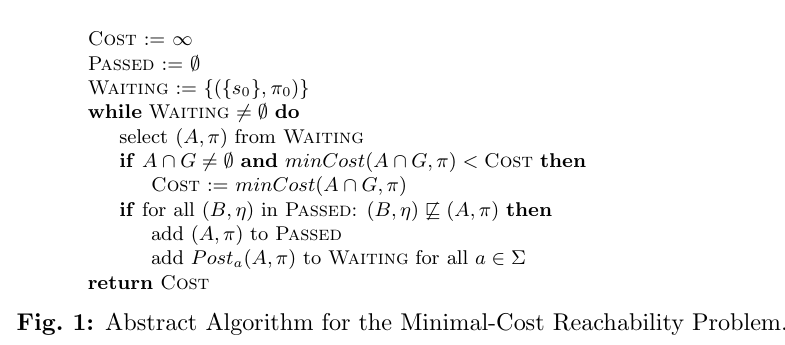
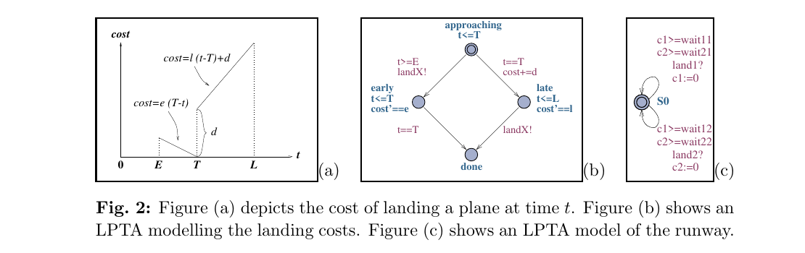
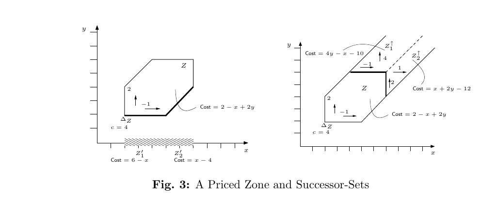
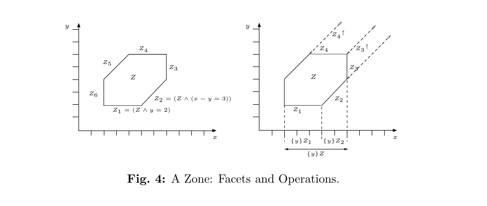
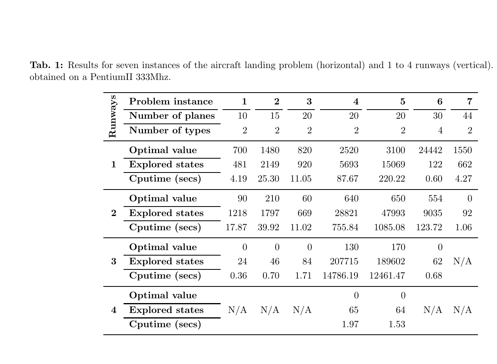

# As Cheap as Possible: Efficient Cost-Optimal Reachability for Priced Timed Automata

Kim Larsen, Gerd Behrmann  
BRICS, Aalborg University, Denmark

Ed Brinksma  
Department of Computer Science, University of Twente, The Netherlands

Ansgar Fehnker, Judi Romijn  
Computing Science Institute, University of Nijmegen, The Netherlands

Thomas Hune  
BRICS, Aarhus University, Denmark

Paul Pettersson  
Department of Computer Systems, Information Technology, Uppsala University, Sweden

> Note: the local `paper.pdf` is the thesis-extracted Paper F from *Data Structures and Algorithms for the Analysis of Real Time Systems*. It contains the title page, two blank separator pages, the abstract, and thesis pages 153-179 of the paper body. The Markdown below is a manually rebuilt and refined transcription checked against the local PDF page by page, with a second pass specifically re-checking image completeness, formulas, and bibliography coverage. The numbered assets have been normalized to `figure-1.png` through `figure-4.png` and `table-1.png`, and `Fig. 1` plus `Table 1` are also transcribed in Markdown for direct reading on GitHub.

## Abstract

In this paper we present an algorithm for efficiently computing optimal cost of reaching a goal state in the model of Linearly Priced Timed Automata (LPTA). The central contribution of this paper is a priced extension of so-called zones. This, together with a notion of facets of a zone, allows the entire machinery for symbolic reachability for timed automata in terms of zones to be lifted to cost-optimal reachability using priced zones. We report on experiments with a cost-optimizing extension of Uppaal on a number of examples.

<!-- page: 153 -->

## 1 Introduction

Well-known formal verification tools for real-time and hybrid systems, such as Uppaal [LPY97a], Kronos [BDM+98] and HyTech [HHWT97a], use symbolic techniques to deal with the infinite state spaces that are caused by the presence of continuous variables in the associated verification models. However, symbolic model checkers still share the "state space explosion problem" with their non-symbolic counterparts as the major obstacle for their application to non-trivial problems. A lot of research, therefore, is devoted to the containment of this problem.

An interesting idea for model checking of reachability properties that has received more attention recently is to "guide" the exploration of the (symbolic) state space such that "promising" sets of states are visited first. In a number of recent publications [Feh99b, HLP00, BFH+01b, NY99, BM00] model checkers have been used to solve a number of non-trivial scheduling problems, reformulated in terms of reachability, viz. as the (im)possibility to reach a state that improves on a given optimality criterion. Such criteria distinguish scheduling algorithms from classical, full state space exploration model checking algorithms. They are used together with, for example, branch-and-bound techniques [AC91] to prune parts of the search tree that are guaranteed not to contain optimal solutions. This observation motivates research into the extension of model checking algorithms with optimality criteria. They provide a basis for the (cost-)guided exploration of state spaces, and improve the potential of model checking techniques for solving scheduling problems. We believe that such extensions can be interesting for real-life applications of both model checking and scheduling.

Based on similar observations an extension of the timed automata model with a notion of cost, the Linearly Priced Timed Automata (LPTA), was already introduced in [BFH+01a]. This model allows for a reachability analysis in terms of accumulated cost of traces, i.e. the sum of the costs of the individual transitions in the trace. Each action transition has an associated price $p$ determining its cost. Likewise, each location has an associated rate $r$ and the cost of delaying $d$ time units is $d \cdot r$. In [BFH+01a], and independently in [ATP01], computability of minimal-cost reachability is demonstrated based on a cost-extension of the classical notion of regions.

Although ensuring computability, the region construction is known to be very inefficient. Tools like Uppaal and Kronos use symbolic states of the form $(l, Z)$, where $l$ is a location of the timed automaton and $Z$ is a zone, i.e. a convex set of clock valuations. The central contribution of this paper is the extension of this concept to that of priced zones, which are attributed with an (affine) linear function of clock valuations that defines the cost of reaching a valuation in the zone. We show that the entire machinery for symbolic reachability in terms of zones can be lifted to cost-optimal reachability for priced zones. It turns out that some of the operations on priced zones force us to split them into parts with different price attributes, giving rise to a new notion, viz. that of the facets of a zone.

The suitability of the LPTA model for scheduling problems was already illustrated in [BFH+01b], using the more restricted Uniformly Priced Timed Automata (UPTA) model, admitting an efficient priced zone implementation via Difference Bound Matrices [Dil89]. The model was used to consider traces for the time-optimal scheduling of a steel plant and a number of job shop problems. The greater expressivity of LPTA also supports other measures of cost, like idle time, weighted idle time, mean completion time, earliness, number of tardy jobs, tardiness, etc. We take an aircraft landing problem [BKA00] as the application example for this paper.

The structure of the rest of this paper is as follows. In Section 2 we give an abstract account of symbolic optimal reachability in terms of priced transition systems, including a generic algorithm for optimal reachability. In Section 3 we introduce the model of linearly priced timed automata (LPTA) as a special case of the framework of Section 2. We also introduce here our running application example, the aircraft landing problem. Section 4 contains the definition of the central concept of priced zones. The operations that we need on priced zones and facets are provided in Section 5. The implementation of the algorithm, and the results of experimentation with our examples are reported in Section 6. Our conclusions, finally, are presented in Section 7.

<!-- page: 154 -->

## 2 Symbolic Optimal Reachability

Analysis of infinite state systems require symbolic techniques in order to effectively represent and manipulate sets of states simultaneously (see [FS01, FS98, ACJYK96, AJ94, Cer94]). For analysis of cost-optimality, additional information of costs associated with individual states needs to be represented. In this section, we describe a general framework for symbolic analysis of cost-optimal reachability on the abstract level of priced transition systems.

A priced transition system is a structure $T = (S, s_0, \Sigma, \to)$, where $S$ is a (infinite) set of states, $s_0 \in S$ is the initial state, $\Sigma$ is a (finite) set of labels, and $\to$ is a partial function from $S \times \Sigma \times S$ into the non-negative reals $\mathbb{R}_{\ge 0}$, defining the possible transitions of the system as well as their associated costs. We write

$$
s \xrightarrow[a]{p} s'
$$

whenever $\to(s, a, s')$ is defined and equals $p$. Intuitively, $s \xrightarrow[a]{p} s'$ indicates that the system in state $s$ has an $a$-labeled transition to the state $s'$ with the cost $p$. We denote by $s \xrightarrow{a} s'$ that $\exists p \in \mathbb{R}_{\ge 0}.~ s \xrightarrow[a]{p} s'$, and by $s \to s'$ that $\exists a \in \Sigma.~ s \xrightarrow{a} s'$. Now, an execution of $T$ is a sequence

$$
\alpha = s_0 \xrightarrow[a_1]{p_1} s_1 \xrightarrow[a_2]{p_2} s_2 \cdots \xrightarrow[a_n]{p_n} s_n.
$$

The cost of $\alpha$, $cost(\alpha)$, is the sum $\sum_{i \in \{1,\ldots,n\}} p_i$. For a given state $s$, the minimal cost of reaching $s$, $mincost(s)$, is the infimum of the costs of finite executions starting in the initial state $s_0$ and ending in $s$. Similarly, the minimal cost of reaching a designated set of states $G \subseteq S$, $mincost(G)$, is the infimum of the costs of finite executions ending in a state of $G$.

To compute minimum-cost reachability, we suggest the use of priced symbolic states of the form $(A, \pi)$, where $A \subseteq S$ is a set of states, and $\pi : A \to \mathbb{R}_{\ge 0}$ assigns (non-negative) costs to all states of $A$. The intention is that reachability of the priced symbolic state $(A, \pi)$ should ensure that any state $s$ of $A$ is reachable with cost arbitrarily close to $\pi(s)$. As we are interested in minimum-cost reachability, $\pi$ should preferably return as small cost values as possible. This is obtained by the following extension of the post-operators to priced symbolic states: for $(A, \pi)$ a priced symbolic state and $a \in \Sigma$, $Post_a(A, \pi)$ is the priced symbolic state $(post_a(A), \eta)$, where

$$
post_a(A) = \{\, s' \mid \exists s \in A.~ s \xrightarrow{a} s' \,\}
$$

and $\eta$ is given by

$$
\eta(s) = \inf \{\, \pi(s') + p \mid s' \in A \land s' \xrightarrow[a]{p} s \,\}.
$$

That is, $\eta$ essentially gives the cheapest cost for reaching states of $B$ via states in $A$, assuming that these may be reached with costs according to $\pi$. A symbolic execution of a priced transition system $T$ is a sequence $\beta = (A_0, \pi_0), \ldots, (A_n, \pi_n)$, where for $i < n$, $(A_{i+1}, \pi_{i+1}) = Post_{a_i}(A_i, \pi_i)$ for some $a_i \in \Sigma$, and $A_0 = \{s_0\}$ and $\pi_0(s_0) = 0$. It is not difficult to see that there is a very close connection between executions and symbolic executions.

**Lemma 1.** Let $T$ be a priced transition system. Then for any execution $\alpha$ of $T$ ending in state $s$, there is a symbolic execution $\beta$ of $T$ that ends in a priced symbolic state $(A, \pi)$, such that $s \in A$ and $\pi(s) \le cost(\alpha)$.

*Proof.* We prove this by induction on the length of $\alpha$. The base case, $|\alpha| = 0$, is obvious. For the induction step consider the following execution of length $n + 1$:

$$
\alpha = s_0 \xrightarrow[a_1]{p_1} s_1 \xrightarrow[a_2]{p_2} s_2 \cdots \xrightarrow[a_n]{p_n} s_n \xrightarrow[a_{n+1}]{p_{n+1}} s_{n+1}.
$$

By the induction hypothesis, there exists a symbolic execution $\beta$ ending in a priced symbolic state $(A, \pi)$ such that $s_n \in A$ and $\pi(s_n) \le \sum_{i \le n} p_i$. Now, extend $\beta$ with $(B, \eta) = Post_{a_{n+1}}(A, \pi)$. Then clearly $s_{n+1} \in B$ and $\eta(s_{n+1}) \le \pi(s_n) + p_{n+1} \le cost(\alpha)$. $\square$

**Lemma 2.** Let $T$ be a priced transition system. Then, for any symbolic execution $\beta$ of $T$ ending in priced symbolic state $(A, \pi)$, whenever $s \in A$, then $mincost(s) \le \pi(s)$.

*Proof.* We prove this by induction on the length of $\beta$. The base case, $|\beta| = 0$, is obvious. For the induction step consider a symbolic execution of length $n + 1$,

$$
\beta = (A_0, \pi_0), \ldots, (A_n, \pi_n), (A_{n+1}, \pi_{n+1}),
$$

where for $i \le n$, $(A_{i+1}, \pi_{i+1}) = Post_{a_i}(A_i, \pi_i)$ for some $a_i \in \Sigma$, and $A_0 = \{s_0\}$ and $\pi_0(s_0) = 0$. Now, let $s_{n+1} \in A_{n+1}$. Completion of the induction step is obtained from the following:

$$
\begin{aligned}
\pi_{n+1}(s_{n+1})
  &= \inf \{\, \pi_n(s_n) + p_{n+1} \mid s_n \in A_n \land s_n \xrightarrow[a_{n+1}]{p_{n+1}} s_{n+1} \,\} \\
  &\ge_{IH} \inf \{\, mincost(s_n) + p_{n+1} \mid s_n \in A_n \land s_n \xrightarrow[a_{n+1}]{p_{n+1}} s_{n+1} \,\} \\
  &\ge_* mincost(s_{n+1}).
\end{aligned}
$$

where $*$ follows from

$$
\inf\{\, \inf(A_i) + p_i \mid i \in I \,\} = \inf\{\, A_i + p_i \mid i \in I \,\},
$$

whenever $A_i \subseteq \mathbb{R}_{\ge 0}$, $p_i \in \mathbb{R}_{\ge 0}$ for all $i \in I$, and $A + p$ is shorthand for the set $\{\, q + p \mid q \in A \,\}$. $\square$

For $(A, \pi)$ being a priced symbolic state, we denote by $minCost(A, \pi)$ the infimum costs in $A$ w.r.t. $\pi$, i.e. $\inf\{\pi(s) \mid s \in A\}$. We can now state the following correctness theorem about the symbolic semantics.



*Figure 1: Abstract Algorithm for the Minimal-Cost Reachability Problem.*

For direct reading on GitHub, Fig. 1 is also transcribed below:

```text
Cost := ∞
Passed := ∅
Waiting := {({s0}, π0)}
while Waiting ≠ ∅ do
    select (A, π) from Waiting
    if A ∩ G ≠ ∅ and minCost(A ∩ G, π) < Cost then
        Cost := minCost(A ∩ G, π)
    if for all (B, η) in Passed: (B, η) not⊑ (A, π) then
        add (A, π) to Passed
        add Post_a(A, π) to Waiting for all a ∈ Σ
return Cost
```

Here the comparison in the second `if` is the preorder $\sqsubseteq$ defined immediately below, i.e. the figure condition is `for all (B, η) in Passed: (B, η) \not\sqsubseteq (A, π)`.

**Theorem 1.** The symbolic semantics using priced symbolic states accurately captures minimum-cost reachability:

$$
mincost(G) = \inf\{\, minCost(A \cap G, \pi) : (A, \pi) \text{ is reachable} \,\}.
$$

*Proof.* Follows directly from Lemma 1 and Lemma 2. $\square$

Let $(A, \pi)$ and $(B, \eta)$ be priced symbolic states. We write $(A, \pi) \sqsubseteq (B, \eta)$ if $B \subseteq A$ and $\pi(s) \le \eta(s)$ for all $s \in B$, informally expressing that $(A, \pi)$ is "as big and cheap" as $(B, \eta)$. Now using the above notion of priced symbolic state and associated operations, an abstract algorithm for computing the minimum cost of reaching a designated set of goal states $G$ is shown in Fig. 1. It uses two data-structures `Wait` and `Passed` to store priced symbolic states waiting to be examined, and priced symbolic states already explored, respectively. In each iteration, the algorithm proceeds by selecting a priced symbolic state $(A, \pi)$ from `Wait`, checking that none of the previously explored states $(B, \eta)$ are bigger and cheaper, i.e. $(B, \eta) \not\sqsubseteq (A, \pi)$, and adds it to `Passed` and its successors to `Wait`. In addition, the algorithm uses the global variable `Cost`, which is initially set to $\infty$ and updated whenever a goal state is found that can be reached with lower cost than the current value of `Cost`. When the algorithm of Fig. 1 terminates, the value of `Cost` equals $mincost(G)$. Furthermore, termination of the algorithm will be guaranteed provided $\sqsubseteq$ is a well-quasi ordering on priced symbolic states.

Before we can prove this claim, we need the two lemmas. We denote by $(A, \pi) ; (B, \eta)$ that $(B, \eta) = Post_a(A, \pi)$ for some $a \in \Sigma$, and we say that $(A, \pi)$ can reach $(B, \eta)$ if $(A, \pi) ;^* (B, \eta)$. Now, $\sqsubseteq$ is a simulation preorder in the following sense:

**Lemma 3.** Whenever $(B_1, \eta_1) \sqsubseteq (A_1, \pi_1)$ and $(A_1, \pi_1) ; (A_2, \pi_2)$, then $(B_1, \eta_1) ; (B_2, \eta_2)$ for some $(B_2, \eta_2)$ such that $(B_2, \eta_2) \sqsubseteq (A_2, \pi_2)$.

Now, assume that the algorithm of Fig. 1 terminates. Let $W$ denote the total (finite) collection of priced symbolic states which will have been in the `Wait` list at some stage during the execution of the algorithm. $W$ is closed with respect to $;$ up to $\sqsubseteq$ in the following sense:

**Lemma 4.** Whenever $(A, \pi) \in W$ and $(A, \pi) ;^* (B, \eta)$, then $(C, \rho) \in W$ for some $(C, \rho) \sqsubseteq (B, \eta)$.

*Proof.* Due to Lemma 3 it suffices to consider the case when $(A, \pi) ; (B, \eta)$; the general lemma then follows as an easy induction exercise. At the moment when $(A, \pi)$ was selected from the `Wait` list two scenarios could have taken place: either $(A, \pi)$ was explored (i.e. all `Post` successors added to `Wait`), in which case the lemma holds trivially, or exploration of $(A, \pi)$ was discarded due to the fact that a better (in terms of $\sqsubseteq$) priced symbolic state $(D, \psi)$ already had been previously explored and was present in `Passed`. However, as $(D, \psi) \sqsubseteq (A, \pi)$, it follows from Lemma 3 that $(D, \psi) ; (C, \rho)$ for some $(C, \rho)$ with $(C, \rho) \sqsubseteq (B, \eta)$. As $(D, \psi)$ is explored, obviously $(C, \rho) \in W$. $\square$

We are now in a position where we can state and prove our main theorem.

**Theorem 2.** When the algorithm of Fig. 1 terminates, the value of `Cost` equals $mincost(G)$.

*Proof.* Using Theorem 1, we must prove that upon termination `Cost` equals

$$
\inf\{\, minCost(A \cap G, \pi) : (A, \pi) \text{ is reachable} \,\}.
$$

Assume that this does not hold. Then there exists a reachable priced symbolic state $(A, \pi)$ where $minCost(A \cap G, \pi) < Cost$ (since we approximate `Cost` from above). Thus, $(A, \pi)$ never appeared in the `Wait` list; rather, the algorithm must at some point have discarded a state $(A', \pi')$ on the path to $(A, \pi)$ due to the fact that a better (bigger and cheaper) priced symbolic state already had been explored and was present in `Passed`. However, as $(A_0, \pi_0) ;^* (A, \pi)$ and obviously $(A_0, \pi_0) \in W$, it follows from Lemma 4 that $(B, \eta) \sqsubseteq (A, \pi)$ for some $(B, \eta) \in W$. But then

$$
Cost \le minCost(B \cap G, \eta) \le minCost(A \cap G, \pi),
$$

contradicting our assumption. $\square$

The above framework may be instantiated by providing concrete syntax for priced transition systems, together with data-structures for priced symbolic states allowing for computation of the `Post` operations, `minCost`, as well as $\sqsubseteq$ (which should be well-quasi). In the following sections we provide such an instantiation for a priced extension of timed automata.

<!-- page: 157 -->

## 3 Priced Timed Automata

Linearly priced timed automata (LPTA) [BFH+01a, BFH+01b, ATP01] extend the model of timed automata [AD90] with prices on all edges and locations. In these models, the cost of taking an edge is the price associated with it, and the price of a location gives the cost-rate applied when delaying in that location.

Let $C$ be a set of clocks. Then $B(C)$ is the set of formulas that are conjunctions of atomic constraints of the form $x \mathbin{\triangleright\!\triangleleft} n$ and $x - y \mathbin{\triangleright\!\triangleleft} m$ for $x, y \in C$, $\mathbin{\triangleright\!\triangleleft} \in \{\le, =, \ge\}$,[^1] $n$ a natural number, and $m$ an integer. Elements of $B(C)$ are called clock constraints or zones over $C$. $P(C)$ denotes the power set of $C$. Clock values are represented as functions from $C$ to the non-negative reals $\mathbb{R}_{\ge 0}$, called clock valuations. We denote by $\mathbb{R}^C$ the set of clock valuations for $C$. For $u \in \mathbb{R}^C$ and $g \in B(C)$, we denote by $u \in g$ that $u$ satisfies all constraints of $g$.

**Definition 1 (Linearly Priced Timed Automata).** A linearly priced timed automaton $A$ over clocks $C$ is a tuple $(L, l_0, E, I, P)$, where $L$ is a finite set of locations, $l_0$ is the initial location, $E \subseteq L \times B(C) \times P(C) \times L$ is the set of edges, where an edge contains a source, a guard, a set of clocks to be reset, and a target, $I : L \to B(C)$ assigns invariants to locations, and $P : (L \cup E) \to \mathbb{N}$ assigns prices to both locations and edges. In the case of $(l, g, r, l') \in E$, we write $l \xrightarrow{g,r} l'$.



*Figure 2: Figure (a) depicts the cost of landing a plane at time $t$. Figure (b) shows an LPTA modelling the landing costs. Figure (c) shows an LPTA model of the runway.*

The semantics of a linearly priced timed automaton $A = (L, l_0, E, I, P)$ may now be given as a priced transition system with state-space $L \times \mathbb{R}^C$ with the initial state $(l_0, u_0)$ (where $u_0$ assigns zero to all clocks in $C$), and with the finite label-set $\Sigma = E \cup \{\delta\}$. Thus, transitions are labelled either with the symbol $\delta$ (indicating some delay) or with an edge $e$ (the one taken). More precisely, the priced transitions are given as follows:

- $(l, u) \xrightarrow[\delta]{p} (l, u + d)$ if $\forall 0 \le e \le d : u + e \in I(l)$, and $p = d \cdot P(l)$.
- $(l, u) \xrightarrow[e]{p} (l', u')$ if $e = (l, g, r, l') \in E$, $u \in g$, $u' = u[r \mapsto 0]$, and $p = P(e)$.

where for $d \in \mathbb{R}_{\ge 0}$, $u + d$ maps each clock $x$ in $C$ to the value $u(x) + d$, and $u[r \mapsto 0]$ denotes the clock valuation which maps each clock in $r$ to the value $0$ and agrees with $u$ over $C \setminus r$.

**Example 1 (Aircraft Landing Problem).** As an example of the use of LPTAs we consider the problem of scheduling aircraft landings at an airport, due to [BKA00]. For each aircraft there is a maximum speed and a most fuel efficient speed which determine an earliest and latest time the plane can land. In this interval, there is a preferred landing time called target time at which the plane lands with minimal cost. The target time and the interval are shown as $T$ and $[E, L]$ respectively in Fig. 2(a).

For each time unit the actual landing time deviates from the target time, the landing cost increases with rate $e$ for early landings and rate $l$ for late landings. In addition there is a fixed cost $d$ associated with late landings. In Fig. 2(b) the cost of landing an aircraft is modeled as an LPTA. The automaton starts in the initial location `approaching` and lands at the moment one of the two transitions labelled `landX!`[^2] are taken. In case the plane lands too early it enters location `early` in which it delays exactly $T - t$ time units. In case the plane is late the cost is measured in location `late` (i.e. the delay in location `late` is $0$ if the plane is on target time). After $L$ time units the automaton always ends in location `done`. Figure 2(c) models a runway ensuring that two consecutive landings take place with a minimum separation time. $\square$

<!-- page: 159 -->

## 4 Priced Zones

Typically, reachability of a (priced) timed automaton, $A = (L, l_0, E, I, P)$, is decided using symbolic states represented by pairs of the form $(l, Z)$, where $l$ is a location and $Z$ is a zone. Semantically, $(l, Z)$ represents the set of all states $(l, u)$, where $u \in Z$. Whenever $Z$ is a zone and $r$ a set of clocks, we denote by $Z^\uparrow$ and $\{r\}Z$ the set of clock valuations obtained by delaying and resetting (w.r.t. $r$) clock valuations from $Z$ respectively. That is,

$$
Z^\uparrow = \{\, u + d \mid u \in Z, d \in \mathbb{R}_{\ge 0} \,\}
\qquad\text{and}\qquad
\{r\}Z = \{\, u[r \mapsto 0] \mid u \in Z \,\}.
$$

It is well-known, using a canonical representation of zones as Difference Bound Matrices (DBMs) [Dil89], that in both cases the resulting set is again effectively representable as a zone. Using these operations together with the obvious fact that zones are closed under conjunction, the post-operations may now be effectively realised using the zone-based representation of symbolic states as follows:

$$
\begin{aligned}
post_\delta(l, Z) &= \bigl(l, (Z \land I(l))^\uparrow \land I(l)\bigr), \\
post_e(l, Z) &= \bigl(l', \{r\}(Z \land g)\bigr)
\qquad\text{whenever } e = (l, g, r, l').
\end{aligned}
$$

Now, the framework given in Section 2 for symbolic computation of minimum-cost reachability calls for an extension of our zone-based representation of symbolic states, which assigns costs to individual states. For this, we introduce the following notion of a priced zone, where the offset $\Delta_Z$ of a zone $Z$ is the unique clock valuation of $Z$ satisfying $\forall u \in Z.~ \forall x \in C.~ \Delta_Z(x) \le u(x)$.

**Definition 2 (Priced Zone).** A priced zone $\mathcal{Z}$ is a tuple $(Z, c, r)$, where $Z$ is a zone, $c \in \mathbb{N}$ describes the cost of the offset $\Delta_Z$ of $Z$, and $r : C \to \mathbb{Z}$ assigns a cost-rate $r(x)$ for any clock $x$. We write $u \in \mathcal{Z}$ whenever $u \in Z$. For any $u \in \mathcal{Z}$ the cost of $u$ in $\mathcal{Z}$, $Cost(u, \mathcal{Z})$, is defined as

$$
Cost(u, \mathcal{Z}) = c + \sum_{x \in C} r(x) \cdot (u(x) - \Delta_Z(x)).
$$



*Figure 3: A Priced Zone and Successor-Sets.*

Thus, the cost assignments of a priced zone define a linear plane over the underlying zone and may alternatively be described by a linear expression over the clocks. Figure 3 illustrates the priced zone $\mathcal{Z} = (Z, c, r)$ over the clocks $\{x, y\}$, where $Z$ is given by the six constraints $2 \le x \le 7$, $2 \le y \le 6$ and $-2 \le x-y \le 3$, the cost of the offset ($\Delta_Z = (2, 2)$) is $c = 4$, and the cost-rates are $r(x) = -1$ and $r(y) = 2$. Hence, the cost of the clock valuation $(5.1, 2.3)$ is given by $4 + (-1)\cdot(5.1-2) + 2\cdot(2.3-2) = 1.5$. In general the costs assigned by $\mathcal{Z}$ may be described by the linear expression $2 - x + 2y$.

Now, priced symbolic states are represented in the obvious way by pairs $(l, \mathcal{Z})$, where $l$ is a location and $\mathcal{Z}$ a priced zone. More precisely, $(l, \mathcal{Z})$ represents the priced symbolic state $(A, \pi)$, where $A = \{(l, u) \mid u \in \mathcal{Z}\}$ and $\pi(l, u) = Cost(u, \mathcal{Z})$.

Unfortunately, priced symbolic states are not directly closed under the post-operations. To see this, consider a timed automaton $A$ with two locations $l$ and $m$ and a single edge from $l$ to $m$ with trivial guard (`true`) and resetting the clock $y$. The cost-rate of $l$ is $3$ and the transition has zero cost. Now, let $\mathcal{Z} = (Z, c, r)$ be the priced zone depicted in Fig. 3 and consider the associated priced symbolic state $(l, \mathcal{Z})$. Assuming that the $e$-successor set, $Post_e(l, \mathcal{Z})$, was expressible as a single priced symbolic state $(l', \mathcal{Z}')$, this would obviously require $l' = m$ and $\mathcal{Z}' = (Z', c', r')$ with $Z' = \{y\}Z$. Furthermore, following our framework of Section 2, the cost assignment of $\mathcal{Z}'$ should be such that

$$
Cost(u', \mathcal{Z}') = \inf \{\, Cost(u, \mathcal{Z}) \mid u \in Z \land u[y \mapsto 0] = u' \,\}
$$

for all $u' \in \mathcal{Z}'$. Since $r(y) > 0$, it is obvious that these infima are obtained along the lower boundary of $Z$ with respect to $y$ (see Fig. 3 left). E.g. $Cost((2,0), \mathcal{Z}') = 4$, $Cost((4,0), \mathcal{Z}') = 2$, and $Cost((6,0), \mathcal{Z}') = 2$. In general $Cost((x,0), \mathcal{Z}') = Cost((x,2), \mathcal{Z}) = 6 - x$ for $2 \le x \le 5$ and $Cost((x,0), \mathcal{Z}') = Cost((x, x - 3), \mathcal{Z}) = x - 4$ for $5 \le x \le 7$. However, the disagreement w.r.t. the cost-rate of $x$ ($-1$ or $1$) makes it clear that the desired cost assignment is not linear and hence not obtainable from any single priced zone. On the other hand, it also shows that splitting $Z' = \{y\}Z$ into the sub-zones

$$
Z_1' = Z' \land 2 \le x \le 5
\qquad\text{and}\qquad
Z_2' = Z' \land 5 \le x \le 7
$$

allows the $e$-successor set $Post_e(l, \mathcal{Z})$ to be expressed using the union of two priced zones (with $r(x) = -1$ in $Z_1'$ and $r(x) = 1$ in $Z_2'$).



*Figure 4: A Zone: Facets and Operations.*

Similarly, priced symbolic states are not directly closed w.r.t. $Post_\delta$. To see this, consider again the LPTA $A$ from above and the priced zone $\mathcal{Z} = (Z, c, r)$ depicted in Fig. 3. Clearly, the set $Post_\delta(l, \mathcal{Z})$ must cover the zone $Z^\uparrow$ (see Fig. 3). It can be seen that, although $Post_\delta(l, \mathcal{Z})$ is not expressible as a single priced symbolic state, it may be expressed as a finite union by splitting the zone $Z^\uparrow$ into the three sub-zones

$$
Z,
\qquad
Z_1^\uparrow = (Z^\uparrow \setminus Z) \land (x-y \le 1),
\qquad
Z_2^\uparrow = (Z^\uparrow \setminus Z) \land (x-y \ge 1).
$$

<!-- page: 161 -->

## 5 Facets & Operations on Priced Zones

The universal key to expressing successor sets of priced symbolic states as finite unions is provided by the notion of facets of a zone $Z$. Formally, whenever $x \mathbin{\triangleright\!\triangleleft} n$ ($x-y \mathbin{\triangleright\!\triangleleft} m$) is a constraint of $Z$, the strengthened zone $Z \land (x = n)$ ($Z \land (x-y = m)$) is a facet of $Z$. Facets derived from lower bounds on individual clocks, $x \ge n$, are classified as lower facets, and we denote by $LF(Z)$ the collection of all lower facets of $Z$. Similarly, the collection of upper facets, $UF(Z)$, of a zone $Z$ is derived from upper bounds of $Z$. We refer to lower as well as upper facets as individual clock facets. Facets derived from lower bounds of the forms $x \ge n$ or $x-y \ge m$ are classified as lower relative facets w.r.t. $x$. The collection of lower relative facets of $Z$ w.r.t. $x$ is denoted $LF_x(Z)$. The collection of upper relative facets of $Z$ w.r.t. $x$, $UF_x(Z)$, is derived similarly. Figure 4(left) illustrates a zone $Z$ together with its six facets: e.g. $\{Z_1, Z_6\}$ constitutes the lower facets of $Z$, and $\{Z_1, Z_2\}$ constitutes the lower relative facets of $Z$ w.r.t. $y$.

The importance of facets comes from the fact that they allow for decompositions of the delay and reset operations on zones as follows.

**Lemma 5.** Let $Z$ be a zone and $y$ a clock. Then the following holds:

$$
\begin{aligned}
\text{i)}\quad & Z^\uparrow = \bigcup_{F \in LF(Z)} F^\uparrow, \\
\text{ii)}\quad & Z^\uparrow = Z \cup \bigcup_{F \in UF(Z)} F^\uparrow, \\
\text{iii)}\quad & \{y\}Z = \bigcup_{F \in LF_y(Z)} \{y\}F, \\
\text{iv)}\quad & \{y\}Z = \bigcup_{F \in UF_y(Z)} \{y\}F.
\end{aligned}
$$

Informally (see Fig. 4(right)) i) and ii) express that any valuation reachable by delay from $Z$ is reachable from one of the lower facets of $Z$, as well as reachable from one of the upper facets of $Z$ or within $Z$. iii) (and iv)) express that any valuation in the projection of a zone will be in the projection of the lower (upper) facets of the zone relative to the relevant clock.

*Proof.* As $F \subseteq Z$ whenever $F \in LF(Z)$, the $\supseteq$ direction of i) is trivial. For the $\subseteq$ direction of i), let $u \in Z^\uparrow$. Now let

$$
d = \min\{\, u(x) - l \mid (x \ge l) \in Z \,\}.
$$

We claim that $u - d \in F$ for some $F \in LF(Z)$. Since $u \in Z^\uparrow$ there is some $u' \in Z$ and some $e$ such that $u = u' + e$. Now $e \le d$ since otherwise $u'$ would violate one of the lower bounds of $Z$. Thus $u - d$ satisfies all upper bounds of $Z$ on individual clocks (since $u'$ does) and also all bounds on differences from $Z$ are satisfied. Clearly, by the choice of $d$, all lower bounds of $Z$ are satisfied by $u - d$. Thus $u - d \in Z$. However, it is also clear that $u - d \in F$ for some lower facet $F$.

As $F \subseteq Z$ whenever $F \in LF_y(Z)$, the $\supseteq$ direction of iii) is trivial. For the $\subseteq$ direction of iii) assume that $u \in \{y\}Z$. Now let

$$
d = \max\Bigl(\{\, u(x) - l \mid (y \ge x-l) \in Z \,\} \cup \{\, l \mid (y \ge l) \in Z \,\}\Bigr).
$$

We claim that $u[y \mapsto d] \in F$ for some $F \in LF_y(Z)$. Obviously, $\{y\}(u[y \mapsto d]) = u$. Obviously, all constraints of $Z$ not involving $y$ are satisfied. Since $u \in \{y\}Z$ there is $u' \in Z$ such that $u = u'[y \mapsto 0]$. Now, $u'(y) \ge d$ since otherwise $u'$ would violate some bound $(y \ge x-l) \in Z$ or $(y \ge l) \in Z$. It follows that $u[y \mapsto d]$ satisfies all upper bounds for $y$ (since $u'$ does). Clearly, by the choice of $d$, all lower bounds of $y$ are satisfied. $\square$

As a first step, the delay and reset operation may be extended in a straightforward manner to priced (relative) facets.

**Definition 3.** Let $\mathcal{Z} = (F, c, r)$ be a priced zone, where $F$ is a relative facet w.r.t. $y$ in the sense that $y - x = m$ is a constraint of $F$. Then $\{y\}\mathcal{Z} = (F', c', r')$, where $F' = \{y\}F$, $c' = c$, and $r'(x) = r(y) + r(x)$ and $r'(z) = r(z)$ for $z \ne x$. In case $y = n$ is a constraint of $F$, $\{y\}\mathcal{Z} = (F', c, r)$ with $F' = \{y\}F$.[^3]

**Definition 4.** Let $\mathcal{Z} = (F, c, r)$ be a priced zone, where $F$ is a lower or upper facet in the sense that $y = n$ is a constraint of $F$. Let $p \in \mathbb{N}$ be a cost-rate. Then

$$
\mathcal{Z}^{\uparrow p} = (F', c', r'),
$$

where $F' = F^\uparrow$, $c' = c$, and

$$
r'(y) = p - \sum_{z \ne y} r(z)
\qquad\text{and}\qquad
r'(z) = r(z) \text{ for } z \ne y.
$$

Conjunction of constraints may be lifted from zones to priced zones simply by taking into account the possible change of the offset. Formally, let $\mathcal{Z} = (Z, c, r)$ be a priced zone and let $g \in B(C)$. Then $\mathcal{Z} \land g$ is the priced zone $\mathcal{Z}' = (Z', c', r')$ with $Z' = Z \land g$, $r' = r$, and $c' = Cost(\Delta_{Z'}, \mathcal{Z})$. For $\mathcal{Z} = (Z, c, r)$ and $n \in \mathbb{N}$ we denote by $\mathcal{Z} + n$ the priced zone $(Z, c+n, r)$.

The constructs of Definitions 3 and 4 essentially provide the post-operations for priced facets. More precisely, it is easy to show that

$$
\begin{aligned}
Post_e(l, \mathcal{Z}_1) &= \bigl(l', \{y\}(\mathcal{Z}_1 \land g) + P(e)\bigr), \\
Post_\delta(l, \mathcal{Z}_2) &= \bigl(l, (\mathcal{Z}_2 \land I(l))^{\uparrow P(l)} \land I(l)\bigr),
\end{aligned}
$$

if $e = (l, g, \{y\}, l')$, $\mathcal{Z}_1$ is a priced relative facet w.r.t. $y$ and $\mathcal{Z}_2$ is an individual clock facet. Now, the following extension of Lemma 5 to priced symbolic states provides the basis for the effective realisation of post-operations in general.

**Theorem 3.** Let $A = (L, l_0, E, I, P)$ be an LPTA. Let $e = (l, g, \{y\}, l') \in E$[^4] with $P(e) = q$, $P(l) = p$, $I(l) = J$ and let $\mathcal{Z} = (Z, c, r)$ be a priced zone. Then:

$$
Post_e((l, \mathcal{Z})) =
\begin{cases}
\{\, (l', \{y\}Q + q) \mid Q \in LF_y(Z \land g) \,\} & \text{if } r(y) \ge 0, \\
\{\, (l', \{y\}Q + q) \mid Q \in UF_y(Z \land g) \,\} & \text{if } r(y) \le 0,
\end{cases}
$$

and

$$
Post_\delta((l, \mathcal{Z})) =
\begin{cases}
\{(l, \mathcal{Z})\} \cup \{\, (l, Q^{\uparrow p} \land J) \mid Q \in UF(Z \land J) \,\}
  & \text{if } p \ge \sum_{x \in C} r(x), \\
\{\, (l, Q^{\uparrow p} \land J) \mid Q \in LF(Z \land J) \,\}
  & \text{if } p \le \sum_{x \in C} r(x).
\end{cases}
$$

In the definition of $Post_e$ the successor set is described as a union of either lower or upper relative facets w.r.t. the clock $y$ being reset, depending on the rate of $y$ (as this will determine whether the minimum is obtained at the lower or upper boundary). For similar reason, in the definition of $Post_\delta$, the successor set is expressed as a union over either lower or upper (individual clock) facets depending on the rate of the location compared to the sum of clock cost-rates.

To complete the instantiation of the framework of Section 2, it remains to indicate how to compute $minCost$ and $\sqsubseteq$ on priced symbolic states. Let $\mathcal{Z} = (Z, c, r)$ and $\mathcal{Z}' = (Z', c', r')$ be priced zones and let $(l, \mathcal{Z})$ and $(l', \mathcal{Z}')$ be corresponding priced symbolic states. Then $minCost(l, \mathcal{Z})$ is obtained by minimizing the linear expression

$$
c + \sum_{x \in C} r(x)\cdot (x - \Delta_Z(x))
$$

under the (linear) constraints expressed by $Z$. Thus, computing $minCost$ reduces to solving a simple Linear Programming problem. Now let $\mathcal{Z}' \setminus \mathcal{Z}$ be the priced zone $(Z^*, c^*, r^*)$ with $Z^* = Z'$, $c^* = c' - Cost(\Delta_{Z'}, \mathcal{Z})$ and $r^*(x) = r'(x) - r(x)$ for all $x \in C$. It is easy to see that $Cost(u, \mathcal{Z}' \setminus \mathcal{Z}) = Cost(u, \mathcal{Z}') - Cost(u, \mathcal{Z})$ for all $u \in Z'$, and hence that $(l, \mathcal{Z}) \sqsubseteq (l', \mathcal{Z}')$ iff $l = l'$, $Z' \subseteq Z$ and $minCost(\mathcal{Z}' \setminus \mathcal{Z}) \ge 0$. Thus, deciding $\sqsubseteq$ also reduces to a Linear Programming problem.

In exploring LPTAs using the algorithm of Fig. 1, we will only need to consider priced zones $\mathcal{Z}$ with non-negative cost assignments in the sense that $Cost(u, \mathcal{Z}) \ge 0$ for all $u \in \mathcal{Z}$. Now, application of Higman's Lemma [Hig52] ensures that $\sqsubseteq$ is a well-quasi ordering on priced symbolic states for bounded LPTA. We refer to [BFH+01a] for more detailed arguments.

<!-- page: 163 -->

## 6 Implementation & Experiments

In this section we give further details on a prototype implementation within the tool Uppaal [LPY97a] of priced zones, formally defined in the previous sections, and report on experiments on the aircraft landing problem.

The prototype implements the $Post_e$ (reset), $Post_\delta$ (delay), $minCost$, and $\sqsubseteq$ operations, using extensions of the DBM algorithms outlined in [Rok93]. To minimize the number of facets considered and reduce the size of the LP problems needed to be solved, we make heavy use of the canonical representation of zones in terms of a minimal set of constraints given in [LLPY97]. For dealing with LP problems, our prototype currently uses a free available implementation of the simplex algorithm.[^5] Many of the techniques for pruning and guiding the state space search described in [BFH+01b] have been used extensively in modelling and verification.

We return now to the aircraft landing problem partially described in Example 1. An LPTA model of the costs associated with landing a single aircraft is shown in Fig. 2(b). When landing several planes the schedule has to take into account the separation times between planes to prevent the turbulence of one plane from affecting another. The separation times depend on the types of the planes that are involved. Large aircrafts for example generate more turbulence than small ones, and successive planes should consequently keep a larger distance. To model the separation times between two types of planes we introduce an LPTA of the kind shown in Fig. 2(c).

Table 1 presents the results of an experiment where the prototype was applied to seven instances of the aircraft landing problem taken from [BKA00].[^6] For each instance, which varies in the number of planes and plane types, we compute the cost of the optimal schedule. In cases the cost is non-zero we increase the number of runways until a schedule of cost $0$ is found.[^7] In all instances, the state space is explored in minimal cost order, i.e. we select from the waiting list the priced zone $(l, Z)$ with lowest $minCost(l, Z)$. Equal values are distinguished by selecting first the zone which results from the largest number of transitions, and secondly by selecting the zone which involves the plane with the shortest target time. As can be seen from the table, our current prototype implementation is able to deal with all the tested instances. Beasley et al. [BKA00] solve all problem instances with a linear-programming-based tree search algorithm, in cases that the initial solution, obtained with a heuristic, is not zero. In 7 of the 15 benchmarks (with optimal solution greater than zero) the time performance of our method is better than theirs. These are the instances 4 to 7 with less than 3 runways. This result also holds if we take into account that our computer is about 50% faster (according to the Dongarra Linpack benchmarks [Don01]). It should be noted, however, that our solution-times are quite incomparable to those of Beasley's approach. For some instances our approach is up to 25 times slower, while for others it is up to 50 times faster than the approach in [BKA00].

The cost-extended version of Uppaal has additionally been, and is currently being, applied to other examples, including a cost-extended version of the Bridge Problem [RB98], an optimal broadcast problem and a testing problem.



*Table 1: Results for seven instances of the aircraft landing problem (horizontal) and 1 to 4 runways (vertical). Results were obtained on a PentiumII 333Mhz.*

For direct reading on GitHub, Table 1 is also transcribed in Markdown:

| Runways | Metric | 1 (10 planes, 2 types) | 2 (15 planes, 2 types) | 3 (20 planes, 2 types) | 4 (20 planes, 2 types) | 5 (20 planes, 2 types) | 6 (30 planes, 4 types) | 7 (44 planes, 2 types) |
|---|---|---:|---:|---:|---:|---:|---:|---:|
| 1 | Optimal value | 700 | 1480 | 820 | 2520 | 3100 | 24442 | 1550 |
| 1 | Explored states | 481 | 2149 | 920 | 5693 | 15069 | 122 | 662 |
| 1 | Cputime (secs) | 4.19 | 25.30 | 11.05 | 87.67 | 220.22 | 0.60 | 4.27 |
| 2 | Optimal value | 90 | 210 | 60 | 640 | 650 | 554 | 0 |
| 2 | Explored states | 1218 | 1797 | 669 | 28821 | 47993 | 9035 | 92 |
| 2 | Cputime (secs) | 17.87 | 39.92 | 11.02 | 755.84 | 1085.08 | 123.72 | 1.06 |
| 3 | Optimal value | 0 | 0 | 0 | 130 | 170 | 0 |  |
| 3 | Explored states | 24 | 46 | 84 | 207715 | 189602 | 62 | N/A |
| 3 | Cputime (secs) | 0.36 | 0.70 | 1.71 | 14786.19 | 12461.47 | 0.68 |  |
| 4 | Optimal value |  |  |  | 0 | 0 |  |  |
| 4 | Explored states | N/A | N/A | N/A | 65 | 64 | N/A | N/A |
| 4 | Cputime (secs) |  |  |  | 1.97 | 1.53 |  |  |

<!-- page: 166 -->

## 7 Conclusion

In this paper we have considered the minimum-cost reachability problem for LPTAs. The notions of priced zones, and facets of a zone are central contributions of the paper underlying our extension of the tool Uppaal. Our initial experimental investigations based on a number of examples are quite encouraging.

Compared with the existing special-purpose, time-optimizing version of Uppaal [BFH+01b], the presented general cost-minimizing implementation does only marginally downgrade performance. In particular, the theoretical possibility of uncontrolled splitting of zones does not occur in practice. In addition, the consideration of non-uniform cost seems to significantly reduce the number of symbolic states explored.

The single, most important question, which calls for future research, is how to exploit the simple structure of the LP-problems considered. We may benefit significantly from replacing the currently used LP package with some package more tailored towards small-size problems.

## Bibliography

- `[ABB+96]` R. Anderson, P. Beame, S. M. Burns, W. Chan, F. Modugno, D. Notkin, and J. Reese. Model checking large software specifications. In D. Garlan, editor, *SIGSOFT '96. Proceedings of the Fourth ACM SIGSOFT Symposium on the Foundations of Software Engineering*, pages 156-166, San Francisco, 1996.

- `[ABK+97]` E. Asarain, M. Bozga, A. Kerbrat, O. Maler, A. Pnueli, and A. Rasse. Data-structures for the verification of timed automata. In *Proc. HART'97*, volume 1201 of *Lecture Notes in Computer Science*, pages 346-360. Springer-Verlag, 1997.

- `[ABPV98]` Steffen Braa Andersen, Gerd Behrmann, Claus Krogholm Pedersen, and Peter Smed Vestergaard. *Reuseability and Compositionality applied to Verification of Hierarchical Systems*. Master's thesis, Aalborg University, June 1998.

- `[AC91]` D. Applegate and W. Cook. A Computational Study of the Job-Shop Scheduling Problem. *OSRA Journal on Computing* 3, pages 149-156, 1991.

- `[ACD93]` Rajeev Alur, Costas Courcoubetis, and David L. Dill. Model-checking in dense real-time. *Information and Computation*, 104(1):2-34, 1993.

- `[ACH93]` R. Alur, C. Courcoubetis, and T. A. Henzinger. Computing accumulated delays in real-time systems. In *Proc. of the 5th Int. Conf. on Computer Aided Verification*, number 697 in *Lecture Notes in Computer Science*, pages 181-193, 1993.

- `[ACJYK96]` P. Abdulla, K. Cerans, B. Jonsson, and T. Yih-Kuen. General decidability theorems for infinite-state systems, 1996.

- `[AD90]` R. Alur and D. Dill. Automata for Modelling Real-Time Systems. In *Proc. of ICALP'90*, volume 443 of *Lecture Notes in Computer Science*, 1990.

- `[AD94]` R. Alur and D. L. Dill. A theory of timed automata. *Theoretical Computer Science*, 126:183-235, 1994.

- `[ADY00]` Tobias Amnell, Alexandre David, and Wang Yi. A real time animator for hybrid systems. In *Proceedings of the 6th ACM SIGPLAN Workshop on Languages, Compilers, and Tools for Embedded Systems (LCTES'2000)*, Vancouver, Canada, June 2000.

- `[AFM+03]` Tobias Amnell, Elena Fersman, Leonid Mokrushin, Paul Pettersson, and Wang Yi. Times - a tool for modelling and implementation of embedded systems. In *Proc. of 8th International Conference, TACAS 2002*, number 2280 in *Lecture Notes in Computer Science*, pages 460-464, 2003.

- `[AJ94]` P. Abdulla and B. Jonsson. Undecidability of verifying programs with unreliable channels. In *Proc. 21st Int. Coll. Automata, Languages, and Programming (ICALP'94)*, volume 820 of *Lecture Notes in Computer Science*, pages 316-327. Springer-Verlag, 1994.

- `[ALP01]` Rajeev Alur, Salvatore La Torre, and George J. Pappas. Optimal paths in weighted timed automata. In *Proc. of Fourth International Workshop on Hybrid Systems: Computation and Control*, volume 2034 of *Lecture Notes in Computer Science*, pages 49-62. Springer-Verlag, 2001.

- `[AM99]` E. Asarin and O. Maler. As soon as possible: Time optimal control for timed automata. In F. Vaandrager and J. van Schuppen, editors, *Hybrid Systems: Computation and Control*, number 1569 in *Lecture Notes in Computer Science*, pages 19-30. Springer-Verlag, March 1999.

- `[AN00]` Parosh Aziz Abdulla and Aletta Nylén. Better is better than well: On efficient verification of infinite-state systems. In *Proc. of the 14th IEEE Symp. on Logic in Computer Science*. IEEE, 2000.

- `[And95]` H. Andersen. Partial model checking (extended abstract). In *Proceedings of the Tenth Annual IEEE Symposium on Logic in Computer Science*, pages 398-407, La Jolla, San Diego, 1995.

- `[ASM97]` H. R. Andersen, J. Staunstrup, and N. Maretti. Partial model checking with ROBDDs. In E. Brinksma, editor, *Proceedings of TACAS'97*, volume 1217 of *Lecture Notes in Computer Science*, pages 35-49. Springer-Verlag, 1997.

- `[ATP01]` Rajeev Alur, Salvatore La Torre, and George J. Pappas. Optimal paths in weighted timed automata. In *Fourth International Workshop on Hybrid Systems: Computation and Control*, volume 2034 of *Lecture Notes in Computer Science*, pages 49-62. Springer-Verlag, 2001.

- `[AvLLU94]` E.H.L. Aarts, P.J.M. van Laarhoven, J.K. Lenstra, and N.L.J. Ulder. A Computational Study of Local Search Algorithms for Job-Shop Scheduling. *OSRA Journal on Computing*, 6(2):118-125, Spring 1994.

- `[AY98]` Rajeev Alur and Mihalis Yannakakis. Model Checking of Hierarchical State Machines. In *Proceedings of the 6th ACM Symposium on Foundations*, 1998.

- `[Bal96]` Felice Balarin. Approximate reachability analysis of timed automata. In *Proc. Real-Time Systems Symposium*, pages 52-61, Washington, DC, December 1996.

- `[BBFL03]` Gerd Behrmann, Patricia Bouyer, Emmanuel Fleury, and Kim Guldstrand Larsen. Static guard analysis in timed automata verification. In *Proc. of the 9th Workshop on Tools and Algorithms for the Construction and Analysis of Systems*, volume 2619 of *Lecture Notes in Computer Science*, pages 254-277, Warsaw, Poland, Apr 2003. Springer-Verlag.

- `[BCCZ99]` Armin Biere, Alessandro Cimatti, Edmund Clarke, and Yunshan Zhu. Symbolic model checking without BDDs. *Lecture Notes in Computer Science*, 1579:193-207, 1999.

- `[BCL91]` J. R. Burch, E. M. Clarke, and D. E. Long. Symbolic model checking with partitioned transition relations. In A. Halaas and P. B. Denyer, editors, *Proc. 1991 Int. Conf. on VLSI*, 1991.

- `[BCL+94]` J. Burch, E. Clarke, D. Long, K. McMillan, and D. Dill. Symbolic model checking for sequential circuit verification. *IEEE Transactions on Computer-Aided Design of Integrated Circuits and Systems*, 13(4):401-424, 1994.

- `[BCM+90]` J. R. Burch, E. M. Clarke, K. L. McMillan, D. L. Dill, and L. J. Hwang. Symbolic model checking: 1020 states and beyond. In *Proceedings, Fifth Annual IEEE Symposium on Logic in Computer Science*, pages 428-439, 1990.

- `[BDM+98]` M. Bozga, C. Daws, O. Maler, A. Olivero, S. Tripakis, and S. Yovine. Kronos: A Model-Checking Tool for Real-Time Systems. In *Proc. of the 10th Int. Conf. on Computer Aided Verification*, number 1427 in *Lecture Notes in Computer Science*, pages 546-550. Springer-Verlag, 1998.

- `[Beh02]` Gerd Behrmann. A performance study of distributed timed automata reachability analysis. In *Electronic Notes in Theoretical Computer Science*, volume 68:4, Brno, 2002. Presented at PDMC02.

- `[Beh03]` Gerd Behrmann. Distributed reachability analysis in timed automata. *Software Tools for Technology Transfer*, 2003. Available online at `http://www.springerlink.com/`.

- `[Bel58]` Richard Bellman. On a routing problem. *Quarterly of Applied Mathematics*, 16(1):87-90, 1958.

- `[BFG+99]` Marius Bozga, Jean-Claude Fernandez, Lucian Ghirvu, Susanne Graf, Jean-Pierre Krimm, and Laurent Mounier. IF: An intermediate representation and validation environment for timed asynchronous systems. In *World Congress on Formal Methods (1)*, pages 307-327, 1999.

- `[BFH+01a]` G. Behrmann, A. Fehnker, T. Hune, K. G. Larsen, P. Pettersson, J. Romijn, and F. Vaandrager. *Minimum-Cost Reachability for Priced Timed Automata*. Accepted for *Hybrid Systems: Computation and Control*, 2001.

- `[BFH+01b]` Gerd Behrmann, Ansgar Fehnker, Thomas S. Hune, Kim Larsen, Paul Petterson, and Judi Romijn. Efficient guiding towards cost-optimality in Uppaal. In *Proc. of TACAS'2001, Lecture Notes in Computer Science*. Springer-Verlag, 2001.

- `[BGK+96]` Johan Bengtsson, David Griffioen, Kåre Kristoffersen, Kim G. Larsen, Fredrik Larsson, Paul Pettersson, and Wang Yi. Verification of an Audio Protocol with Bus Collision Using Uppaal. Accepted for presentation at the 8th Int. Conf. on Computer Aided Verification, 1996.

- `[BHV00]` Gerd Behrmann, Thomas Hune, and Frits Vaandrager. Distributed timed model checking - How the search order matters. In *Proc. of 12th International Conference on Computer Aided Verification, Lecture Notes in Computer Science*, Chicago, July 2000. Springer-Verlag.

- `[BJR97]` G. Booch, I. Jacobsen, and J. Rumbaugh. *Unified Modelling Language User Guide*. Addison Wesley, 1997.

- `[BJS95]` P. Brucker, B. Jurisch, and B. Sievers. *Code of a Branch & Bound Algorithm for the Job Shop Problem*. Available at `http://www.mathematik.uni-osnabrueck.de/research/OR/`, 1995.

- `[BKA00]` J.E. Beasley, M. Krishnamoorthy, and D. Abramson. Scheduling Aircraft Landings-The Static Case. *Transportation Science*, 34(2):180-197, 2000.

- `[BLA+99]` G. Behrmann, K. G. Larsen, H. R. Andersen, H. Hulgaard, and J. Lind-Nielsen. Verification of hierarchical state/event systems using reusability and compositionality. In *TACAS: Tools and Algorithms for the Construction and Analysis of Systems*, 1999.

- `[BLL+96]` Johan Bengtsson, Kim G. Larsen, Fredrik Larsson, Paul Pettersson, and Wang Yi. Uppaal in 1995. In *Proc. of the 2nd Workshop on Tools and Algorithms for the Construction and Analysis of Systems*, number 1055 in *Lecture Notes in Computer Science*, pages 431-434. Springer-Verlag, March 1996.

- `[BLN03]` Dirk Beyer, Claus Lewerentz, and Andreas Noack. Rabbit: A tool for BDD-based verification of real-time systems. In *CAV03, Lecture Notes in Computer Science*. Springer-Verlag, 2003.

- `[BLP+99]` Gerd Behrmann, Kim G. Larsen, Justin Pearson, Carsten Weise, and Wang Yi. Efficient timed reachability analysis using clock difference diagrams. In *Proceedings of the 12th Int. Conf. on Computer Aided Verification, Lecture Notes in Computer Science*. Springer-Verlag, 1999.

- `[BM00]` Ed Brinksma and Angelika Mader. Verification and optimization of a PLC control schedule. In *Proceedings of the 7th SPIN Workshop*, volume 1885 of *Lecture Notes in Computer Science*. Springer-Verlag, 2000.

- `[BMPY97]` M. Bozga, O. Maler, A. Pnueli, and S. Yovine. Some progress in the symbolic verification of timed automata. In *Proceedings of CAV'97*, volume 1254 of *Lecture Notes in Computer Science*, pages 179-190. Springer-Verlag, 1997.

- `[Bou03]` Patricia Bouyer. Untamable timed automata! In *Proc. 20th Ann. Symp. Theoretical Aspects of Computer Science (STACS'2003)*, volume 2607 of *Lecture Notes in Computer Science*, pages 620-631, Berlin, Feb 2003. Springer-Verlag.

- `[BPV94]` D. Bosscher, I. Polak, and F. Vaandrager. Verification of an Audio-control Protocol. In *Proceedings of Formal Techniques in Real-Time and Fault-Tolerant Systems*, volume 863 of *Lecture Notes in Computer Science*. Springer-Verlag, 1994.

- `[BRS00]` Roderick Bloem, Kavita Ravi, and Fabio Somenzi. Symbolic guided search for CTL model checking. In *Design Automation Conference*, pages 29-34, 2000.

- `[Bry86]` R. Bryant. Graph-based algorithms for Boolean function manipulation. *IEEE Transactions on Computers*, 8(C-35):677-691, 1986.

- `[BS99]` R. Boel and G. Stremersch. Report for VHS: Timed Petri Net Model of Steel Plant at SIDMAR. Technical report, SYSTeMS Group, University Ghent, 1999.

- `[BSV93]` F. Balarin and A. Sangiovanni-Vincentelli. An iterative approach to language containment. In C. Courcoubetis, editor, *CAV'93. 5th International Conference on Computer Aided Verification*, volume 697 of *Lecture Notes in Computer Science*, pages 29-40, Berlin, 1993. Springer-Verlag.

- `[CBM89]` O. Coudert, C. Berthet, and J. C. Madre. Verification of synchronous sequential machines based on symbolic execution. In J. Sifakis, editor, *Automatic Verification Methods for Finite State Systems. Proceedings*, volume 407 of *Lecture Notes in Computer Science*, pages 365-373. Springer-Verlag, 1989.

- `[CC95]` S.V. Campos and E.M. Clarke. Real-time symbolic model checking for discrete time models. In C. Rattray T. Rus, editor, *AMAST Series in Computing: Theories and Experiences for Real-Time System Development*, 1995.

- `[Cer94]` K. Cerans. Deciding properties of integral relational automata. In *Proceedings of ICALP 94*, volume 820 of *Lecture Notes in Computer Science*, pages 35-46. Springer-Verlag, 1994.

- `[CGL94]` E. Clarke, O. Grumberg, and D. Long. Model checking and abstraction. *ACM Transactions on Programming Languages and Systems*, 1994.

- `[CL00]` Franck Cassez and Kim Guldstrand Larsen. The impressive power of stopwatches. In Catuscia Palamidesi, editor, *11th International Conference on Concurrency Theory (CONCUR'2000)*, number 1877 in *Lecture Notes in Computer Science*, pages 138-152, University Park, P.A., USA, July 2000. Springer-Verlag.

- `[CLM89]` E. Clarke, D. Long, and K. McMillan. Compositional model checking. In *Proceedings, Fourth Annual Symposium on Logic in Computer Science*, pages 353-362, Asilomar Conference Center, Pacific Grove, California, 1989.

- `[CMB90]` O. Coudert, J. C. Madre, and C. Berthet. Verifying temporal properties of sequential machines without building their state diagrams. In E. Clarke and R. Kurshan, editors, *CAV'90. Workshop on Computer-Aided Verification*, pages 75-84, Rutgers, New Jersey, 1990.

- `[CS96]` C. Daws and S. Yovine. Reducing the number of clock variables of timed automata. In *Proceedings of the 1996 IEEE Real-Time Systems Symposium, RTSS'96*. IEEE Computer Society Press, 1996.

- `[DBLY03]` Alexandre David, Gerd Behrmann, Kim G. Larsen, and Wang Yi. Unification & sharing in timed automata verification. In *Proc. of SPIN 2003*, volume 2648 of *Lecture Notes in Computer Science*, pages 225-229. Springer-Verlag, 2003.

- `[Dil89]` D.L. Dill. Timing assumptions and verification of finite-state concurrent systems. In J. Sifakis, editor, *Proc. of Automatic Verification Methods for Finite State Systems*, volume 407 of *Lecture Notes in Computer Science*, pages 197-212, Berlin, 1989. Springer-Verlag.

- `[DKRT97]` D'Arginio, Katoen, Ruys, and Tretmans. Bounded retransmission protocol must be on time! In *Proceedings of TACAS'97*, volume 1217, 1997.

- `[DM01]` Alexandre David and M. Oliver Möller. From HUppaal to Uppaal: A translation from hierarchical timed automata to flat timed automata. *Research Series RS-01-11*, BRICS, Department of Computer Science, University of Aarhus, March 2001.

- `[Don01]` Jack J. Dongarra. *Performance of Various Computers Using Standard Linear Equations Software*. Technical Report CS-89-85, Computer Science Department, University of Tennessee, 2001. An up-to-date version of this report can be found at `http://www.netlib.org/benchmark/performance.ps`.

- `[DOTY95]` C. Daws, A. Olivero, S. Tripakis, and S. Yovine. The tool KRONOS. In *Hybrid Systems III: Verification and Control*, volume 1066, pages 208-219, Rutgers University, New Brunswick, NJ, USA, 22-25 October 1995. Springer.

- `[DY95]` C. Daws and S. Yovine. Two examples of verification of multirate timed automata with kronos. In *Proc. of the 16th IEEE Real-Time Systems Symposium*, pages 66-75, December 1995.

- `[ES96]` F. Allen Emerson and A. Prasad Sistla. Symmetry and model checking. *Formal Methods in System Design: An International Journal*, 9(1/2):105-131, August 1996.

- `[Feh99a]` A. Fehnker. Bounding and heuristics in forward reachability algorithms. Technical Report CSI-R0002, Computing Science Institute Nijmegen, 1999.

- `[Feh99b]` A. Fehnker. Scheduling a steel plant with timed automata. In *Proceedings of the 6th International Conference on Real-Time Computing Systems and Applications (RTCSA99)*, pages 280-286. IEEE Computer Society, 1999.

- `[FS98]` A. Finkel and P. Schnoebelen. Fundamental structures in well-structured infinite transition systems. In *Proc. 3rd Latin American Theoretical Informatics Symposium (LATIN'98)*, volume 1380 of *Lecture Notes in Computer Science*. Springer-Verlag, April 1998.

- `[FS01]` A. Finkel and Ph. Schnoebelen. Well structured transition systems everywhere. *Theoretical Computer Science*, 256(1-2):64-92, 2001.

- `[GB94]` D. Geist and I. Beer. Efficient model checking by automated ordering of transition relation partitions. In *CAV'94. 6th International Conference on Computer Aided Verification*, volume 818 of *Lecture Notes in Computer Science*, pages 299-310, Stanford, 1994. Springer-Verlag.

- `[GW91]` Patrice Godefroid and Pierre Wolper. A partial approach to model checking. In *Logic in Computer Science*, pages 406-415, 1991.

- `[Har87]` David Harel. Statecharts: A visual formalism for complex systems. *Science of Computer Programming*, 8:231-274, 1987.

- `[HBL+03]` Martijn Hendriks, Gerd Behrmann, Kim G. Larsen, Peter Niebert, and Frits Vaandrager. Adding symmetry reduction to Uppaal. In *Proceedings First International Workshop on Formal Modeling and Analysis of Timed Systems (FORMATS 2003), Lecture Notes in Computer Science*, Marseille, France, September 2003.

- `[Hen96]` T. A. Henzinger. The theory of hybrid automata. In *Proc. of 11th Annual Symp. on Logic in Computer Science (LICS 96)*, pages 278-292. IEEE Computer Society Press, 1996.

- `[HHWT95]` Thomas A. Henzinger, Pei-Hsin Ho, and Howard Wong-Toi. *A Users Guide to HyTech*. Technical report, Department of Computer Science, Cornell University, 1995.

- `[HHWT97a]` T. A. Henzinger, P.-H. Ho, and H. Wong-Toi. HyTech: A Model Checker for Hybrid Systems. In Orna Grumberg, editor, *Proc. of the 9th Int. Conf. on Computer Aided Verification*, number 1254 in *Lecture Notes in Computer Science*, pages 460-463. Springer-Verlag, 1997.

- `[HHWT97b]` Thomas A. Henzinger, Pei-Hsin Ho, and Howard Wong-Toi. HYTECH: A model checker for hybrid systems. *International Journal on Software Tools for Technology Transfer*, 1(1-2):110-122, 1997.

- `[Hig52]` G. Higman. Ordering by divisibility in abstract algebras. *Proc. of the London Math. Soc.*, 2:326-336, 1952.

- `[HL02]` Martijn Hendriks and Kim G. Larsen. Exact acceleration of real-time model checking. In E. Asarin, O. Maler, and S. Yovine, editors, *ENTCS*, volume 65(6). Elsevier Science Publishers, April 2002.

- `[HLP99]` T. Hune, K. G. Larsen, and P. Pettersson. Guided synthesis of control programs using Uppaal for VHS case study 5. VHS deliverable, 1999.

- `[HLP00]` T. Hune, K. G. Larsen, and P. Pettersson. Guided Synthesis of Control Programs Using Uppaal. In Ten H. Lai, editor, *Proc. of the IEEE ICDCS International Workshop on Distributed Systems Verification and Validation*, pages E15-E22. IEEE Computer Society Press, April 2000.

- `[HLS99]` K. Havelund, K. Larsen, and A. Skou. Formal verification of a power controller using the real-time model checker Uppaal. In Joost-Pieter Katoen, editor, *Formal Methods for Real-Time and Probabilistic Systems, 5th International AMAST Workshop, ARTS'99*, volume 1601 of *Lecture Notes in Computer Science*, pages 277-298. Springer-Verlag, 1999.

- `[HNSY94]` Thomas. A. Henzinger, Xavier Nicollin, Joseph Sifakis, and Sergio Yovine. Symbolic Model Checking for Real-Time Systems. *Information and Computation*, 111(2):193-244, 1994.

- `[HRSV02]` T.S. Hune, J.M.T. Romijn, M.I.A. Stoelinga, and F.W. Vaandrager. Linear parametric model checking of timed automata. *Journal of Logic and Algebraic Programming*, 52-53:183-220, 2002.

- `[HSLL97]` K. Havelund, A. Skou, K. G. Larsen, and K. Lund. Formal modelling and analysis of an audio/video protocol: An industrial case study using Uppaal. In *Proc. of the 18th IEEE Real-Time Systems Symposium*, pages 2-13, December 1997. San Francisco, California, USA.

- `[JM87]` F. Jahanian and A.K. Mok. A graphtheoretic approach for timing analysis and its implementation. *IEEE Transactions on Computers*, C-36(8):961-975, 1987.

- `[JM99]` A. S. Jain and S. Meeran. Deterministic job-shop scheduling; past, present and future. *European Journal of Operational Research*, 113(2):390-434, March 1999.

- `[KLL+97]` K. J. Kristoffersen, F. Laroussinie, K. G. Larsen, P. Patterson, and W. Yi. A compositional proof of a read-time mutual exclusion protocol. In M. Bidoit and M. Dauchet, editors, *Proceedings of TAPSOFT '97: Theory and Practice of Software Development*, volume 1214 of *Lecture Notes in Computer Science*, pages 565-579. Springer-Verlag, 1997.

- `[Lar02]` Ulrik Larsen. *Compositional backwards reachability of timed automata*. Master's thesis, Aalborg University, June 2002. `http://www.cs.auc.dk/library/cgi-bin/detail.cgi?id=1024571846`.

- `[LHHR94]` N. G. Leveson, M. P. E. Heimdahl, H. Hildreth, and J. D. Reese. Requirement specification for process-control systems. *IEEE Transactions on Software Engineering*, 20(9), 1994.

- `[LLPY97]` Fredrik Larsson, Kim G. Larsen, Paul Pettersson, and Wang Yi. Efficient Verification of Real-Time Systems: Compact Data Structures and State-Space Reduction. In *Proc. of the 18th IEEE Real-Time Systems Symposium*, pages 14-24. IEEE Computer Society Press, December 1997.

- `[LN99]` J. Lind-Nielsen. *BuDDy: Binary decision diagram package*, 1999. `www.itu.dk/research/buddy`.

- `[LNA99]` J. Lind-Nielsen and H. R. Andersen. Stepwise CTL model checking of state/event systems. In *CAV'99. 11th International Conference on Computer Aided Verification*, volume 1633 of *Lecture Notes in Computer Science*, pages 316-327. Springer-Verlag, 1999.

- `[LNAB+98]` Jørn Lind-Nielsen, Henrik Reif Andersen, Gerd Behrmann, Henrik Hulgaard, Kåre Kristoffersen, and Kim G. Larsen. Verification of Large State/Event Systems using Compositionality and Dependency Analysis. In *Tools and Algorithms for the Construction and Analysis of Systems*, volume 1384 of *Lecture Notes in Computer Science*, pages 201-216. Springer-Verlag, March/April 1998.

- `[LP97]` H. Lönn and P. Pettersson. Formal verification of a TDMA protocol startup mechanism. In *Proc. of the Pacific Rim Int. Symp. on Fault-Tolerant Systems*, pages 235-242, December 1997.

- `[LPJ+96]` W. Lee, A. Pardo, J.-Y. Jang, G. Hachtel, and F. Somenzi. Tearing based automatic abstraction for CTL model checking. In *1996 IEEE/ACM International Conference on Computer-Aided Design*, pages 76-81, San Jose, CA, 1996.

- `[LPY95]` K. G. Larsen, P. Pettersson, and W. Yi. Diagnostic Model-Checking for Real-Time Systems. In *Proc. of Workshop on Verification and Control of Hybrid Systems III*, number 1066 in *Lecture Notes in Computer Science*, pages 575-586. Springer-Verlag, October 1995.

- `[LPY97a]` K. G. Larsen, P. Pettersson, and W. Yi. Uppaal in a Nutshell. *Int. Journal on Software Tools for Technology Transfer*, 1(1-2):134-152, October 1997.

- `[LPY97b]` Kim G. Larsen, Paul Pettersson, and Wang Yi. Uppaal: Status and developments. In Orna Grumberg, editor, *Proc. of the 9th Int. Conf. on Computer Aided Verification*, number 1254 in *Lecture Notes in Computer Science*, pages 456-459. Springer-Verlag, June 1997.

- `[LPY98]` M. Lindahl, P. Pettersson, and W. Yi. Formal design and analysis of a gear controller. *Lecture Notes in Computer Science*, 1384:281-297, 1998.

- `[LWYP98]` K.G. Larsen, C. Weise, W. Yi, and J. Pearson. *Clock difference diagrams*. DoCS Technical Report 98/99, Uppsala University, Sweden, 1998. Presented at the Nordic Workshop on Programming Theory, Turku, Finland, November 1998.

- `[LWYP99]` Kim G. Larsen, Carsten Weise, Wang Yi, and Justin Pearson. Clock difference diagrams. *Nordic Journal of Computing*, 6(3):271-298, 1999.

- `[McM93]` K. McMillan. *Symbolic Model Checking*. Kluwer Academic Publishers, Norwell Massachusetts, 1993.

- `[McM03]` Kenneth L. McMillan. Automatic abstraction without counterexamples. In H. Garavel and J. Hatcliff, editors, *Proc. of the 9th Workshop on Tools and Algorithms for the Construction and Analysis of Systems*, Warsaw, Poland, April 2003. Springer-Verlag.

- `[Mil89]` R. Milner. *Communication and Concurrency*. Prentice Hall, Englewood Cliffs, 1989.

- `[MLAH99a]` J. Møller, J. Lichtenberg, H. R. Andersen, and H. Hulgaard. Difference decision diagrams. Technical Report IT-TR-1999-023, Department of Information Technology, Technical University of Denmark, February 1999.

- `[MLAH99b]` J. Møller, J. Lichtenberg, H. R. Andersen, and H. Hulgaard. Fully symbolic model checking of timed systems using difference decision diagrams. In *Workshop on Symbolic Model Checking*, volume 23, The IT University of Copenhagen, Denmark, June 1999.

- `[NTY00]` P. Niebert, S. Tripakis, and S. Yovine. Minimum-time reachability for timed automata. In *8th IEEE Mediteranean Control Conference on Control & Automation*, July 2000.

- `[NY99]` P. Niebert and S. Yovine. Computing optimal operation schemes for multi batch operation of chemical plants. VHS deliverable, May 1999. Draft.

- `[obj]` ObjecTime Limited. `http://www.objectime.on.ca`.

- `[PH97]` A. Pardo and G. D. Hachtel. Automatic abstraction techniques for propositional $\mu$-calculus model checking. In O. Grumberg, editor, *CAV'97. 9th International Conference on Computer Aided Verification*, volume 1254 of *Lecture Notes in Computer Science*, pages 12-23, 1997.

- `[PSD98]` David Y.W. Park, Jens U. Skakkebæk, and David L. Dill. Static Analysis to Identify Invariants in RSML Specifications. In *Formal Techniques in Real-Time and Fault-Tolerant Systems*, volume 1486 of *Lecture Notes in Computer Science*, pages 133-142. Springer-Verlag, September 1998.

- `[rat]` Rational Software Corporation. `http://www.rational.com`.

- `[RB98]` T. C. Ruys and E. Brinksma. Experience with Literate Programming in the Modelling and Validation of Systems. In Bernhard Steffen, editor, *Proceedings of the Fourth International Conference on Tools and Algorithms for the Construction and Analysis of Systems (TACAS'98)*, number 1384 in *Lecture Notes in Computer Science (LNCS)*, pages 393-408, Lisbon, Portugal, April 1998. Springer-Verlag, Berlin.

- `[RBP+91]` J. Rumbaugh, M. Blaha, W. Premerlani, F. Eddy, and W. Lorensen. *Object-oriented modeling and design*. Prentice-Hall, 1991.

- `[RE99]` F. Reffel and S. Edelkamp. Error Detection with Directed Symbolic Model Checking. In *Proc. of Formal Methods*, volume 1708 of *Lecture Notes in Computer Science*, pages 195-211. Springer-Verlag, 1999.

- `[Rok93]` T. G. Rokicki. *Representing and Modeling Digital Circuits*. PhD thesis, Stanford University, 1993.

- `[SA96]` T. Sreemani and J. Atlee. Feasibility of model checking software requirements: a case study. In *COMPASS '96. Proceedings of the Eleventh Annual Conference on Computer Assurance*, pages 77-88, New York, USA, 1996.

- `[SD97]` U. Stern and D. L. Dill. Parallelizing the Mur$\phi$ verifier. In Orna Grumberg, editor, *Computer Aided Verification, 9th International Conference*, volume 1254 of LNCS, pages 256-67. Springer-Verlag, June 1997. Haifa, Israel, June 22-25.

- `[SGW94]` B. Selic, G. Gullekson, and P. T. Ward. *Real-time object oriented modeling and design*. J. Wiley, 1994.

- `[ST98]` Karsten Strehl and Lothar Thiele. Symbolic model checking of process networks using interval diagram techniques. In *Proceedings of the IEEE/ACM International Conference on Computer-Aided Design (ICCAD-98)*, pages 686-692, San Jose, California, 1998.

- `[sta]` I-Logix Inc. `http://www.ilogix.com`.

- `[Sto00]` M. Stobbe. Results on scheduling the SIDMAR steel plant using constraint programming. Internal report, 2000.

- `[Str98]` Karsten Strehl. Using interval diagram techniques for the symbolic verification of timed automata. Technical report, Institut für Technische Informatik und Kommunikationsnetze (TIK), ETH Zürich, July 1998.

- `[TD98]` J. Tapken and H. Dierks. MOBY/PLC - Graphical Development of PLC-Automata. In *FTRTFT'98*, volume 1486 of *Lecture Notes in Computer Science*, pages 311-314. Springer-Verlag, 1998.

- `[vA96]` Baan visualSTATE A/S. *visualSTATE tm 3.0 User's Guide*. Beologicr A/S, 1996.

- `[Vaa04]` F. Vaandrager. *Analysis of a biphase mark protocol with Uppaal*. Technical Report NIII-R04XX, Computing Science Institute Nijmegen, 2004. In preparation.

- `[vis]` IAR VisualState A/S. `http://www.iar.com`.

- `[Wan00]` Farn Wang. Efficient data structure for fully symbolic verification of real-time software systems. In *Tools and Algorithms for Construction and Analysis of Systems*, pages 157-171, 2000.

- `[Wan01]` Farn Wang. Symbolic verification of complex real-time systems with clock-restriction diagram. In Myungchul Kim, Byoungmoon Chin, Sungwon Kang, and Danhyung Lee, editors, *FORTE 2001*, volume 197 of *IFIP Conference Proceedings*, pages 285-300. Kluwer, 2001.

- `[WTD95]` Howard Wong-Toi and David L. Dill. Verification of real-time systems by successive over and under approximation. In *International Conference on Computer-Aided Verification*, July 1995.

- `[YPD94]` Wang Yi, Paul Pettersson, and Mats Daniels. Automatic Verification of Real-Time Communicating Systems By Constraint-Solving. In *Proc. of the 7th International Conference on Formal Description Techniques*, 1994.

[^1]: For simplicity we do not deal with strict inequalities in this short version.
[^2]: In the example we assume that several automata $A_1, \ldots, A_n$ can be composed in parallel with a CCS-like parallel composition operator [Mil89] to a network $(A_1, \ldots, A_n)\setminus Act$, with all actions $Act$ being restricted. We further assume that the cost of delaying in the network is the sum of the cost of delaying in the individual automata.
[^3]: This "definition" of $\{y\}(\mathcal{Z})$ is somewhat ambiguous since it depends on which constraint involving $y$ is chosen. However, the `Cost` function determined will be independent of this choice.
[^4]: For the case with a general reset-set $r$, the notion of relative facets may be generalized to sets of clocks.
[^5]: `lp_solve 3.1a` by Michel Berkelaar, `ftp://ftp.es.ele.tue.nl/pub/lp_solve`.
[^6]: These and other benchmarks are available at `ftp://mscmga.ms.ic.ac.uk/pub/`.
[^7]: This is always possible as the cost of landing on target time is $0$ and the number of runways can be increased until all planes arrive at target time.
