# Introduction

> Note: the local `paper.pdf` is a 40-page extraction of the introduction part of the parent thesis. The Markdown below is a manually refined transcription checked page by page against the PDF, and the figure/table assets have been re-cropped from the rendered pages.

## 1 Motivation

Software crashes. Software contains bugs. Software is complex. These statements are almost axioms – anybody with a PC can agree that this is how software behaves. These assertions are independent of the software type, e.g. your operating system, your typical office application, or special purpose software for managing the flow of goods in your company all crash from time to time. Platform does not matter either: Although some people might try to convince you otherwise, Linux and Mac software is just as buggy as software for Windows.

Not all software is as buggy as your typical PC application. Nowadays, most devices more complex than a light bulb actually contain software – this is what is called embedded software – and most of this software is working flawlessly. As does most software used in avionics and space exploration (or at least we hope so; in recent years a number of losses in space missions were caused by software failures). Think about it: Your car (engine, brakes, airbags, etc.), your microwave oven, your dishwasher, your washing machine, your phone, your cell phone, your house alarm, your HiFi equipment and much more all contain software. And if the vision about pervasive computing becomes true then your light bulbs, your shoes, your door, even the goods in the local grocery store will contain small computers containing software.

For software embedded in small devices, simplicity probably plays a major role in ensuring correctness, i.e., compared to your typical PC application, the functionality and complexity of embedded software is lower – at least this was the case some years ago. In recent years, the functionality and hence the complexity of embedded software has been going up. As a result the failure rate increases. Take a good look at a modern cell phone. It contains over one megabyte of RAM and has a more powerful processor than a PC 10 years ago. Consequently, software failures are quite common. Consumers are already getting used to the fact that a cell phone can crash, forcing them to remove the battery in order to reboot the phone.

There are many approaches towards fighting this problem. None of them are restricted to embedded software, although the higher cost of bugs in embedded software and mission-critical software has a tendency to make people in those areas more receptive to techniques for increasing software quality. The whole area of software process improvement tries to avoid the errors in the first place by avoiding the ad-hoc development style used in many software development projects. It boils down to better management, better documentation, better planning, and more discipline. On the other hand, techniques like triple modular redundancy are based on the assumption that faults do occur and that any system must be fault tolerant. In triple modular redundancy, all systems consist of three functionally equivalent modules which vote about each operation. Each module is developed from the same requirement specification by an independent team. Whenever one of the modules does not agree with the other two, the module is overruled assuming that the two agreeing modules have the correct result. This approach triples the development costs and thus is only used for life-critical missions, e.g., in avionics.

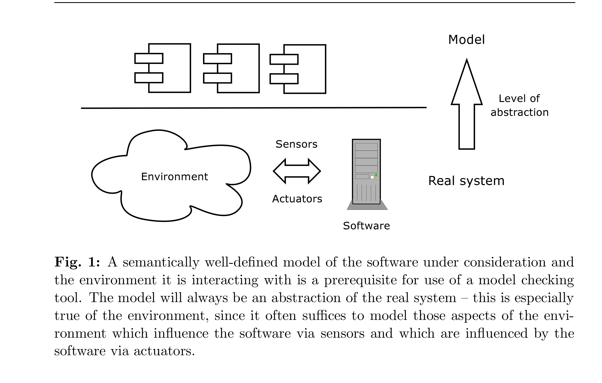


Fig. 1: A semantically well-defined model of the software under consideration and the environment it is interacting with is a prerequisite for use of a model checking tool. The model will always be an abstraction of the real system – this is especially true of the environment, since it often suffices to model those aspects of the environment which influence the software via sensors and which are influenced by the software via actuators.

Model checking is an orthogonal technique from the world of formal verification. Formal verification of software attempts to prove its correctness by proving a mathematical theorem. Thus, given a piece of software and its requirement specification, we attempt to prove that this piece of software adheres to the requirement specification. In model checking, the developer creates a semantically well-defined model of the system under consideration, e.g., the software together with the environment with which the software is interacting, see Fig. 1. To be of any use, the requirement specification also needs to be formalised. The model and the requirement specification are then fed to a tool called model checker, which verifies that the model is behaving according to specification, see Fig. 2. If not, some debugging information is produced which aids the developer in improving the software and/or the model.

Often the model is created by hand, which might look like extra work for the developer. This does not need to be the case. Models are becoming an integral part of modern software development methodologies – the widespread acceptance of the unified modeling language (UML) [BJR97] is proof of this trend. With a bit of planning, model checking techniques could be integrated into the development cycle and be used at the very first stages of the design phase. I.e., when the first models of the design are produced, so are simple models of the environment. These can then be fed into a model checker to verify that the early design satisfies the requirements. As the design is refined during development, the model checker can be used to continuously verify correctness. Once the model is sufficiently refined, one could in principle automatically generate the final source code.

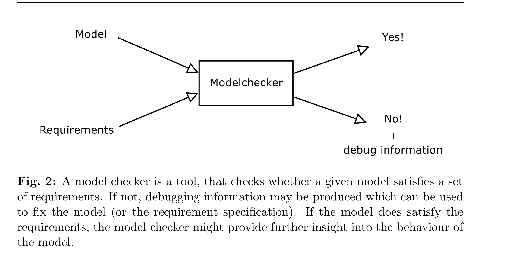


Fig. 2: A model checker is a tool, that checks whether a given model satisfies a set of requirements. If not, debugging information may be produced which can be used to fix the model (or the requirement specification). If the model does satisfy the requirements, the model checker might provide further insight into the behaviour of the model.

It is an old result from the field of philosophy of science that we can never prove anything about the real world. Any axiom we state about the real world is based on what we observe and there is no way of guaranteeing that the world is actually behaving as assumed or predicted. On the other hand, it is easy to disprove statements, since all we need is a counter example: An experiment which clearly demonstrates that the world is not behaving according to our prediction. When this line of thought is applied to formal verification of software, we must conclude that we can never prove the correctness of software. At most, we can prove the correctness of software as a mathematical object (the model), but never as a part of a real system. In model checking, the model of the software and the environment it is interacting with is always an abstraction of the software running on a real processor and interacting with the real environment. The more detailed the model, the more we can trust it in the sense that errors in the real system are preserved in the model. Therefore, in case we cannot find any errors, this might increase our confidence in the real system. However, the only thing we can do with certainty is to disprove the correctness, i.e. to find bugs.[1] Model checking should always be considered orthogonal to other techniques of fault prevention. It is just another addition to the arsenal of tools available to developers for fighting bugs.

Model checking is sometimes referred to as push-button verification, implying it is so easy that one can verify the correctness of programs by pressing a single button – nothing could be further from the truth. It is correct that once the model has been created and the requirement specification has been written, proving the correctness is done by the model checking tool. However, model checking tools suffer from the so called state space explosion problem: The complexity of the system under consideration grows exponentially in the number of concurrent components in the model. From a purely theoretical point of view, model checking seems futile: The worst-case complexity of the problem dooms the approach for anything but

> 1 There is no guarantee that an error in the model is actually an error in the real system, but if we can reproduce the error in the real system, then we can be certain.

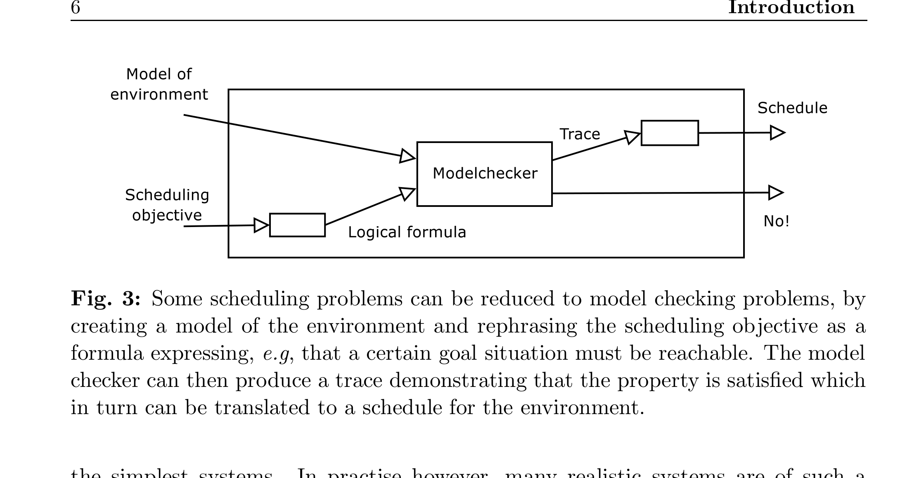


Fig. 3: Some scheduling problems can be reduced to model checking problems, by creating a model of the environment and rephrasing the scheduling objective as a formula expressing, e.g, that a certain goal situation must be reachable. The model checker can then produce a trace demonstrating that the property is satisfied which in turn can be translated to a schedule for the environment.

the simplest systems. In practise however, many realistic systems are of such a structured nature that model checking is of practical use. A good modeling language allows the developer to express the structure of the problem. Much research is invested in finding techniques that can utilise the structure to allow model checking of realistic systems despite the complexity of the general problem. For the moment, model checking tools still require a firm understanding of the modeling language and at least rudimentary knowledge about the techniques used in the tool. In time, modeling languages, model checking techniques and the ever increasing amount of computer power available will hopefully turn the approach into a viable complement to traditional quality assurance techniques.

Model checkers differentiate themselves from the competition by using different modeling languages and different languages for the requirement specification. Common to all model checkers is that the modeling language essentially describes a directed graph, which is exhaustively explored by the model checker. They might use more or less clever ways of representing and exploring this state space. For some modeling languages the state space can even be infinite. Nonetheless, state space exploration is a characteristic feature of a model checker.

Formal verification is not the only application of model checking tools. If the model is only a partial description of the problem, model checkers can be (mis)used to synthesize some of the remaining components. In particular, as illustrated in Fig. 3, if only a model of the uncontrolled environment is available, a model checker can be used to answer questions like “Is there a way to bring the system into this and that state?” or “Is there an infinite path such that something particularly bad never happens?”. Answering these questions by themselves does not give us any clue as to how to actually realise the behaviour, but most model checkers can produce traces which demonstrate that the properties actually do hold. These traces are in fact schedules. Hence, model checkers can be used as alternative scheduling tools. The two scheduling questions mentioned before are of a particularly simple nature, as they assume that we are in control of all transitions of the environment. However,

it is not unlikely that we can only control some transitions whereas the others are taken non-deterministically. For those familiar with game theory, this is like the difference between one player games (e.g. Solitair, where the player is in control of all moves) and two player games (e.g. Chess, where players move in turns).

This thesis is a collection of six selected papers. These six papers do not provide all answers to all remaining problems in model checking. Each paper advances the state-of-the-art in its own area. The papers deal with different modeling languages, different ways of representing and exploring the state space, and techniques that are used in different tools. The common theme for all papers is simply reachability analysis; maybe with a twist towards embedded software, although this is never explicitly stated in any of the papers.

The techniques presented in this thesis are evaluated using two tools: visualSTATE  and Uppaal. The former is a commercial tool by visualSTATE  A/S. The tool is used in development of embedded software and provides a graphical Statechart based language, supports code generation, simulation, and prototyping. Finally, the tool contains a verification component which can detect common mistakes like dead code and deadlocks. The first two papers of this thesis deal with model checking of visualSTATE  models – in fact, the current version of visualSTATE  uses the patented techniques proposed in the first paper. The latter tool – Uppaal – is an academic tool for model checking real time systems. The folklore definition of a real time system is:

“Any system whose correctness does not only depend on the correct order of events, but also the timing between events.”

For instance, the airbag release system in a car is a real time system: It does not suffice that the air bag will eventually be released after the car has crashed; to be of any use it must be released within a certain maximum amount of time after the impact. The third paper considers alternative data structures for representing the state space of a real time system. The remaining three papers deal with how real time model checking techniques like those used in Uppaal, can be used to answer static scheduling problems and in particular, how one can specify and find optimal schedules.

Outline Table 1 gives an overview of the various tools used in the thesis, the modeling formalisms they support, and the techniques and data structures used. There are two interesting axes in this table, namely the formalisms and the data structures, and the remainder of this introductory chapter gives an overview of these two dimensions.

Section 2 gives a short introduction to explicit state and symbolic reachability analysis. Section 3 gives an overview of the various formalisms, and section 4 discusses the data structures. Section 5 gives an overview of Uppaal, its architecture and various sub-projects. Finally, section 6 gives a summary of the six papers of this thesis.

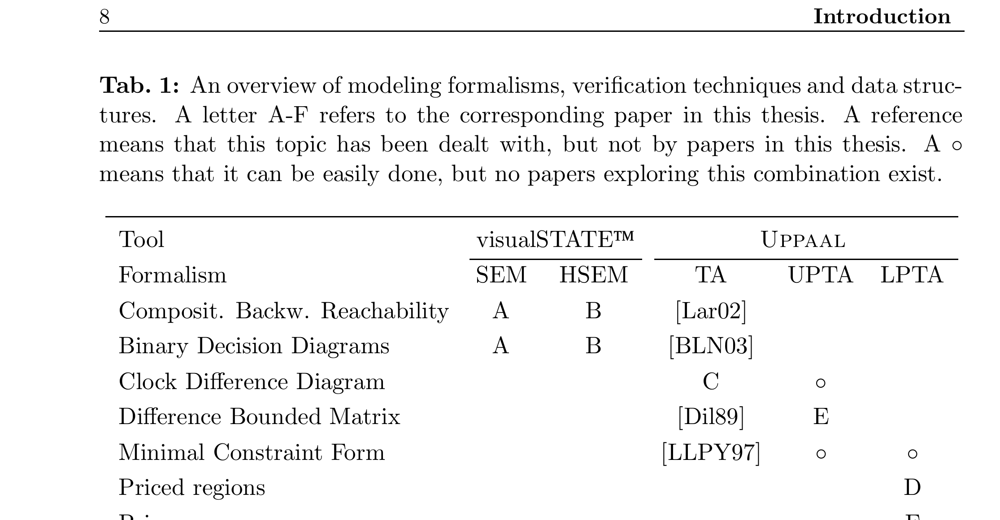

Tab. 1: An overview of modeling formalisms, verification techniques and data structures. A letter A-F refers to the corresponding paper in this thesis. A reference means that this topic has been dealt with, but not by papers in this thesis. A ◦ means that it can be easily done, but no papers exploring this combination exist.

|Tool|visualSTATE|visualSTATE|Uppaal|Uppaal||
|---|---|---|---|---|---|
|Formalism|SEM|HSEM|TA|UPTA|LPTA|
|Composit. Backw. Reachability|A|B|[Lar02]|||
|Binary Decision Diagrams|A|B|[BLN03]|||
|Clock Difference Diagram|||C|◦||
|Difference Bounded Matrix|||[Dil89]|E||
|Minimal Constraint Form|||[LLPY97]|◦|◦|
|Priced regions|||||D|
|Prices zones|||||F|


## 2 Reachability Analysis

The reachability problem is in many ways fundamental in model checking. Although reachability analysis is not as powerful as, for instance, full CTL model checking, many interesting problems can be reduced to that of checking reachability of certain states. In this section we will look at various approaches to solving the reachability problem.

Let us first define the reachability problem. A transition system is a tuple $M = (S, S_0, R)$ where $S$ is a set of states, $S_0 \subseteq S$ is a set of initial states, and $R \subseteq S \times S$ is a set of transitions. Let $G \subseteq S$ be a set of goal states. We say $G$ is reachable from $S_0$ iff there exists a sequence of states $s_0, s_1, \ldots, s_n$ such that $s_0 \in S_0$, $s_n \in G$, and $(s_i, s_{i+1}) \in R$ for all $0 \le i < n$. This is illustrated in Fig. 4.

For finite transition systems, deciding the reachability problem is easy. Either perform a breadth first or depth first traversal of the transition system starting at the set of initial states and see if any of the states of G can be reached; alternatively reverse all transitions and start with the set of goal states and see if any states in S0 can reach a goal state. This is shown in Fig. 5. The problem is that most modeling languages use parallel composition and thus the size of S (the state-space) is exponential in the size of the input model. This is often referred to as the state explosion problem. Researches have attacked the state explosion problem from numerous angles; for instance, symmetry reduction [ES96] and partial order reduction [GW91] techniques take advantage of the regularity of the model.

An alternative (and to some extent orthogonal) approach is to use symbolic model checking techniques. Two approaches are predominant: Symbolic data structures (such as ROBDDs, see section 4.1) can be used to represent the transition relation and sets of states and perform a breadth first search of $M$ [BCM[+] 90], see

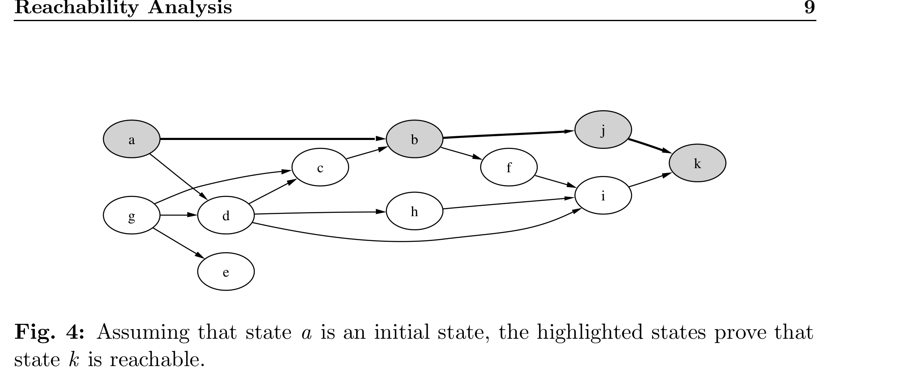


Fig. 4: Assuming that state a is an initial state, the highlighted states prove that state k is reachable.

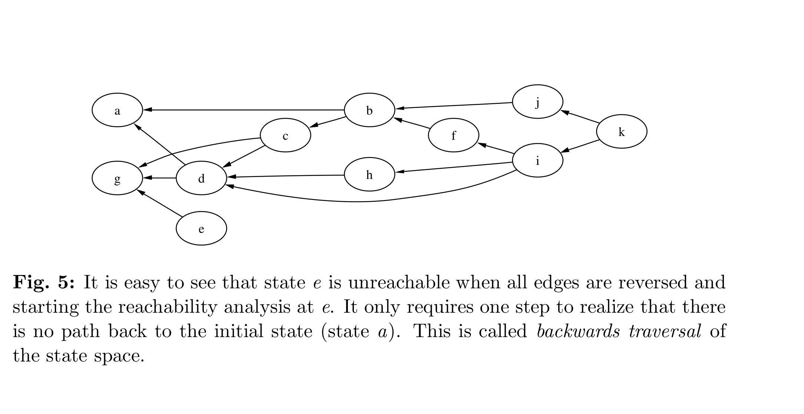


Fig. 5: It is easy to see that state e is unreachable when all edges are reversed and starting the reachability analysis at e. It only requires one step to realize that there is no path back to the initial state (state a). This is called backwards traversal of the state space.

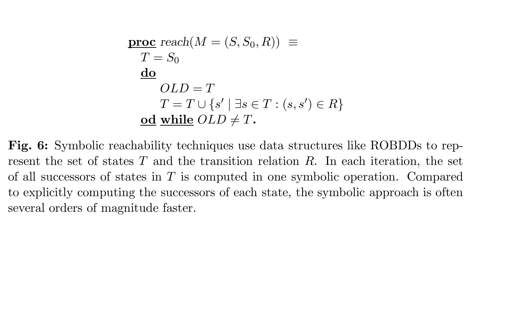


Fig. 6: Symbolic reachability techniques use data structures like ROBDDs to represent the set of states T and the transition relation R. In each iteration, the set of all successors of states in T is computed in one symbolic operation. Compared to explicitly computing the successors of each state, the symbolic approach is often several orders of magnitude faster.

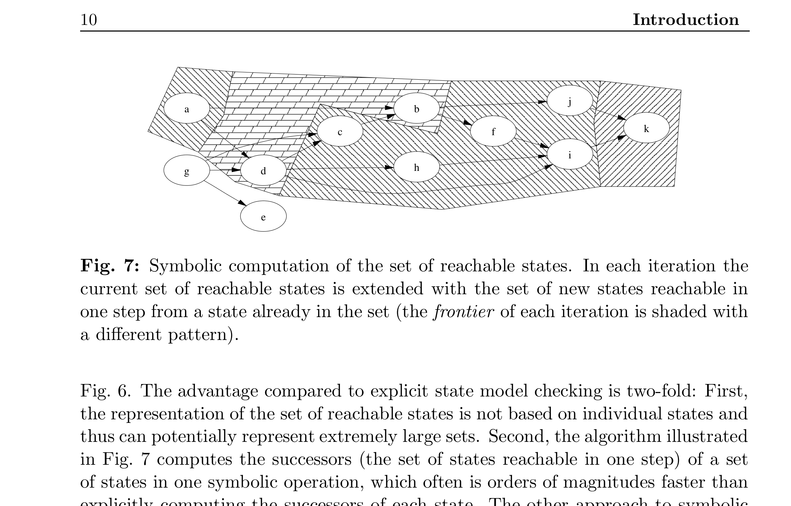


Fig. 7: Symbolic computation of the set of reachable states. In each iteration the current set of reachable states is extended with the set of new states reachable in one step from a state already in the set (the frontier of each iteration is shaded with a different pattern).

Fig. 6. The advantage compared to explicit state model checking is two-fold: First, the representation of the set of reachable states is not based on individual states and thus can potentially represent extremely large sets. Second, the algorithm illustrated in Fig. 7 computes the successors (the set of states reachable in one step) of a set of states in one symbolic operation, which often is orders of magnitudes faster than explicitly computing the successors of each state. The other approach to symbolic model checking is referred to as bounded model checking [BCCZ99] which reduces the reachability problem to a satisfiability problem. This is done by representing the transition relation R as a formula in propositional logic and then unfolding the transition relation n times in such a way that the resulting formula is satisfiable if and only if a goal state can be reached with n or less transitions. One can then use a SAT-solver to decide the resulting satisfiability problem. Bounded model checking is often very efficient at finding a path to a goal state if such a path exists; the drawback is that the model is only analysed up to depth n, which might be unknown. In [McM03] bounded and unbounded model checking has been successfully combined.

For general infinite transition systems, the reachability problem is undecidable, but for certain models finite abstractions preserving interesting properties do exist. We will return to such models in section 3.3.

## 3 Modeling Formalisms

### 3.1 State/Event Machines

The VVS project was a CIT[2] sponsored collaboration between Baan visualSTATE A/S (now IAR visualSTATE A/S), BRICS at Aalborg University, and the computer systems section at the Technical University of Denmark. The problem under consideration was that of verifying large State/Event Machines (a.k.a. state/event models), the native modeling formalism of the commercial visualSTATE  tool.

> 2 Danish National Centre for IT Research

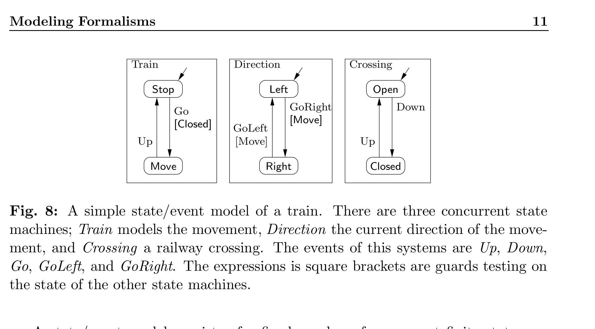


Fig. 8: A simple state/event model of a train. There are three concurrent state machines; Train models the movement, Direction the current direction of the movement, and Crossing a railway crossing. The events of this systems are Up, Down, Go, GoLeft, and GoRight. The expressions is square brackets are guards testing on the state of the other state machines.

A state/event model consists of a fixed number of concurrent finite state machines, annotated with guards, and input and output events on the transitions. Guards are boolean combinations of conditions on the state of other machines in the model. Each input is reacted upon by all machines in lock-step. If a machine has no enabled transitions for a particular input event, it does not perform any state change.

Figure 8 shows an example of a simple state/event model of a train. If the event Up is received in state (Move, Right, Closed), then the system goes to the state (Stop, Right, Open) since both components react synchronously to the same event. If on the other hand the event Up is received in state (Stop, Right, Closed), then the system goes to (Stop, Right, Open), since the right most component is the only one being able to react upon this event in the given state.

visualSTATE  is an integrated tool for developing embedded software and the state/event model is used to implement the control part of this software. As such, the state/event model was designed to be used in the context of a C runtime environment that provides input events and consumes output events, see Fig. 9. When verifying a state/event model, the runtime environment is ignored. It is assumed that any event can be generated at any time. This is clearly an over-approximation, but the relation between output events and input events is hidden in the C code, which was not considered in the VVS project.

The main contribution of the project was the Compositional Backwards Reachability analysis (CBR) technique described in Paper A of this thesis. In short, reachability of a set of goal states is determined by exploring the state space in a backwards fashion. Initially, only a few machines of the model are considered and only transitions which are independent of the state and behaviour of the other machines are taken. If the analysis fails to establish a path to the initial state, the set of machines under consideration is extended. One strength of the technique is that the analysis done so far can be reused as the starting point of the new analysis.

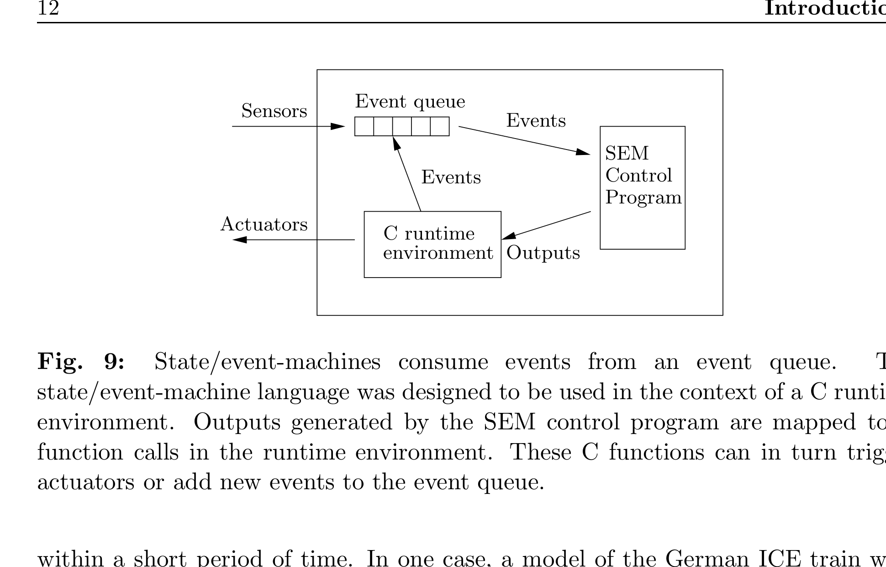


Fig. 9: State/event-machines consume events from an event queue. The state/event-machine language was designed to be used in the context of a C runtime environment. Outputs generated by the SEM control program are mapped to C function calls in the runtime environment. These C functions can in turn trigger actuators or add new events to the event queue.

Using the CBR technique, it was possible to analyse extremely large models within a short period of time. In one case, a model of the German ICE train with a declared state space of $10^{476}$ was verified within 5 minutes.

### 3.2 Hierarchical State/Event Machines

Since the introduction of Statecharts by David Harel in 1987 [Har87], hierarchical state machines have become very popular. Most notably, hierarchical state machines have been included in the UML standard.

The hierarchical state/event model is an extension of the state/event model with concepts borrowed from Statecharts. A hierarchical state/event machine is a structure consisting of primitive states, super-states and transitions between those states. A super-state can itself contain a hierarchical state/event machine or a parallel composition of hierarchical state/event machines, but the submachine is only active when the super-state in which it is embedded is active. Transitions are labelled with guards, and input and output events similar to the state/event model. Figure 10 shows a hierarchical version of the train model from Fig. 8. The main difference between the two models is that the Direction state machine is now placed as a state (the Move state) inside the Train state machine.

A hierarchical state/event machine can be transformed to a state/event machine by a process known as flattening. Not surprisingly, the flattened model contains strong dependencies between nested state machines, and thus the CBR technique performs relatively poorly. Paper B of this thesis describes how this problem can be avoided by dividing the reachability problem into a number of smaller problems. Instead of establishing reachability to a set of goal states by backwards explorations all the way back to the initial state s0, we start by identifying potential initial states Is of each super-state s. Now, it is enough to establish reachability of the goal states from the Is and reachability of the Is from the s0. This leads to a recursive procedure. Each of these problems involves fewer components and is therefore better

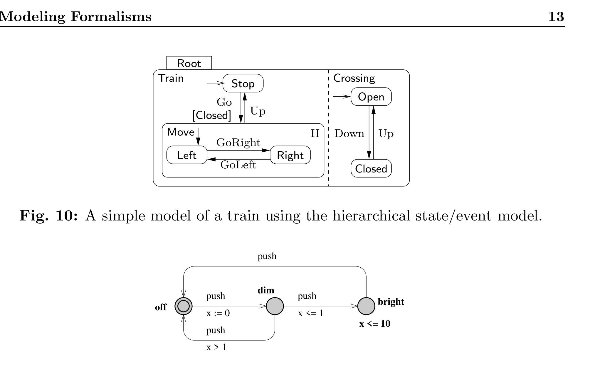


Fig. 10: A simple model of a train using the hierarchical state/event model.

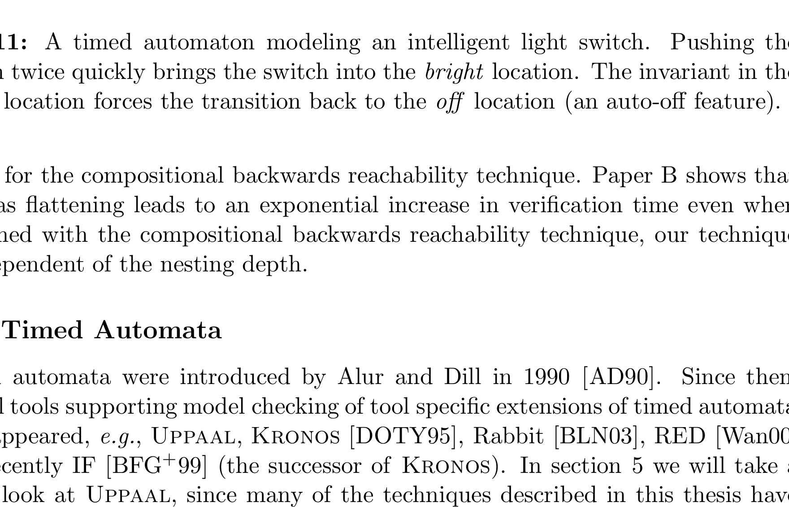


Fig. 11: A timed automaton modeling an intelligent light switch. Pushing the button twice quickly brings the switch into the bright location. The invariant in the bright location forces the transition back to the off location (an auto-off feature).

suited for the compositional backwards reachability technique. Paper B shows that whereas flattening leads to an exponential increase in verification time even when combined with the compositional backwards reachability technique, our technique is independent of the nesting depth.

### 3.3 Timed Automata

Timed automata were introduced by Alur and Dill in 1990 [AD90]. Since then, several tools supporting model checking of tool specific extensions of timed automata have appeared, e.g., Uppaal, Kronos [DOTY95], Rabbit [BLN03], RED [Wan00] and recently IF [BFG[+] 99] (the successor of Kronos). In section 5 we will take a closer look at Uppaal, since many of the techniques described in this thesis have been implemented in this particular tool.

In short, a timed automaton is a directed graph structure with a finite number of non-negative real valued auxiliary variables called clocks. Vertices of the graph, which are called locations, are annotated with invariants; edges are annotated with guards and resets of clocks. Invariants and guards are boolean combinations of simple conditions on clocks and differences between clocks. Figure 11 shows a simple timed automaton modeling an “intelligent” light switch. The switch has three locations: off, dim and bright, where off is the initial location. The idea is that when the button is pressed once, the switch moves to the dim location; if the button is pressed two times in quick succession, the switch moves to the bright location. A final press on the button will turn the light off.

Notice that the terms location and edge refer to the syntactic elements of a timed automaton. A concrete state of a timed automaton is a semantic element and is defined as a pair containing a location and a valuation of the clocks. The initial state of the timed automaton in the example is $(off, x = 0)$.

There are two types of transitions between concrete states: Whenever allowed by the invariant of the current location, time can pass. The resulting delay transitions do not change the locations, but all clocks are incremented by the exact same delay. In the initial state of the example we have $(off, x = 0) \to (off, x = d)$ for any positive real $d$. Alternatively, if the guard of an edge is satisfied, we might trigger an edge transition. Edge transitions do not take time, i.e. the clock valuation is not changed except to reflect updates directly specified on the edge involved. Thus in the example we have $(off, x = \sqrt{2}) \to (dim, x = 0)$. For the sake of argument, we could introduce another clock $y$, which is not used by the automaton. In that case the following sequence of transitions would be valid: $(off, x = 0, y = 0) \to (off, x = \pi, y = \pi) \to (dim, x = 0, y = \pi)$.

Since clocks are continuous variables, it is not surprising that the state space of a timed automaton is uncountably infinite. It was proven in [ACD93] that model checking of TCTL, a timed extension of CTL, is decidable for timed automata. At the core of this result is the region construction for timed automata [AD90]. Since guards of a timed automaton are restricted to comparing clocks and differences of clocks to integers, it becomes impossible to distinguish certain clock valuations in a timed automaton. These clock valuations form equivalence classes called regions, see Fig. 12. It was proven that the resulting structure is bisimilar to the original timed automaton.

In practice, verification tools for timed automata use zones rather than regions for exploring the state space. A zone is a set of clock valuations definable by a conjunction of constraints on the form $x \mathrel{\triangleright\!\triangleleft} c$ or $x - y \mathrel{\triangleright\!\triangleleft} c$, where $x$ and $y$ are clocks, $c$ is a constant, and $\mathrel{\triangleright\!\triangleleft}$ is one of the relational operators in $\{<, \le, \ge, >\}$. A zone describes a union of several regions, and is thus a coarser representation of the state space. If we restrict the set of guards and invariants by disallowing negations, then we can easily restate the semantics of a timed automaton in terms of zones rather than clock valuations: A symbolic state is a pair $(l, Z)$, where $l$ is a location and $Z$ is a zone. When computing the successor of a symbolic state we first compute the effect of an edge by applying the guard of the edge and then projecting the zone according to the updates on the edge. Second we compute the future of the zone, i.e. the set of states which can be reached by delaying, and apply the invariant of the target location. Figure 13 shows the first steps of a symbolic exploration of the example in Fig. 11.

Using zones, we obtain a countable representation of the state space. Here it becomes important to distinguish between diagonal-free and non-diagonal-free timed automata. The first class is the subset of timed automata where guards and invariants are limited to conjunctions of the form $x \mathrel{\triangleright\!\triangleleft} c$, where $\mathrel{\triangleright\!\triangleleft} \in \{<, \le, \ge, >\}$, i.e. conditions on differences of clocks are not allowed. In [BBFL03, Bou03] it was proven that for diagonal-free timed automata, we can construct abstractions $a$, i.e., functions from zones to zones, such that $Z \subseteq a(Z)$ and the resulting abstract symbolic transition system is finite and bisimilar to the original timed automaton. Such abstractions exist and are inspired by a similar abstraction in the region representation: Intuitively, if a clock $x$ is never compared to any constant bigger than $c_x$ in any guard or invariant of the timed automaton, then once $x$ is bigger than $c_x$, the exact value of $x$ does not matter (it has no influence on the behaviour of the automaton); only the fact that it is bigger than $c_x$ is important.

Timed Automata: Let $X$ be a set of clocks, and let $G(X)$ be the set of expressions formed by the syntax

$$
e ::= x < c \mid x \le c \mid x - y < c \mid x - y \le c \mid e_1 \land e_2 \mid \neg e_1,
$$

where $x, y \in X$, $c$ is a constant, and $e_1$ and $e_2$ are expressions. A clock valuation is a function $\sigma : X \to \mathbb{R}_{\ge 0}$. For $e \in G(X)$, $e \models \sigma$ is true if and only if $e$ is satisfied by $\sigma$ (defined in the natural way).

A timed automaton over a set of clocks $X$ is a tuple $(L, l_0, E, I, g, u)$ where $L$ is a finite set of locations, $l_0 \in L$ is the initial location, $E \subseteq L \times L$ is a set of edges, $I : L \to G(X)$ assigns invariants to locations, $g : E \to G(X)$ assigns guards to edges, and $u : E \to 2^X$ assigns sets of clocks to edges.

Concrete Semantics of Timed Automata: The semantics of a timed automaton $(L, l_0, E, I, g, u)$ over $X$ can be given as a timed transition system $(S, s_0, \to)$. The set of states is $S = L \times \mathbb{R}[X]$, where $\mathbb{R}[X]$ is the set of all clock valuations over $X$. The initial state is $(l_0, \sigma_0)$, where $\sigma_0(x) = 0$ for all $x \in X$. The transition relation $\to$ is a subset of $S \times S$ such that $(l, \sigma) \to (l', \sigma')$ if and only if $((l, \sigma), (l', \sigma'))$ is a delay transition or an edge transition. Delay transitions are on the form $((l, \sigma), (l, \sigma'))$ such that

$$
\exists d \in \mathbb{R}_{\ge 0} : \sigma' = \sigma + d \land \forall 0 \le d' \le d : I(l) \models \sigma + d',
$$

where $(\sigma + d)(x) = \sigma(x) + d$. Edge transitions are on the form $((l, \sigma), (l', \sigma'))$ such that

$$
(l, l') \in E \land g(l, l') \models \sigma \land \sigma' = \sigma[u(l, l') \mapsto 0] \land I(l') \models \sigma',
$$

where

$$
\sigma[r \mapsto 0](x) =
\begin{cases}
0 & \text{if } x \in r, \\
\sigma(x) & \text{otherwise.}
\end{cases}
$$

Symbolic Semantics of Timed Automata: For the symbolic semantics, we first define the set of zones $B(X)$ over a set of clocks $X$ as the set of conjunctions of constraints on the form $x \mathrel{\triangleright\!\triangleleft} c$ or $x - y \mathrel{\triangleright\!\triangleleft} c$, where $x, y \in X$, $c$ is a constant, and $\mathrel{\triangleright\!\triangleleft}$ is one of the relational operators in $\{<, \le, \ge, >\}$. The symbolic state-space of a timed automaton is $L \times B(X)$. The initial symbolic state is $(l_0, Z_0)$ where $Z_0 = \{\sigma \mid \sigma \models I(l_0) \land \forall x, y \in X : \sigma(x) = \sigma(y)\}$. The symbolic transition relation $\Longrightarrow$ is a relation between symbolic states such that $(l, Z) \Longrightarrow (l', Z')$ if and only if $(l, l') \in E$ and

$$
Z' = reset(u(l, l'), Z \land g(l, l'))[\uparrow] \land I(l'),
$$

where $reset(r, Z) = \{\sigma[r \mapsto 0] \mid \sigma \in Z\}$ and $Z[\uparrow] = \{\sigma + d \mid \sigma \in Z \land d \in \mathbb{R}_{\ge 0}\}$.

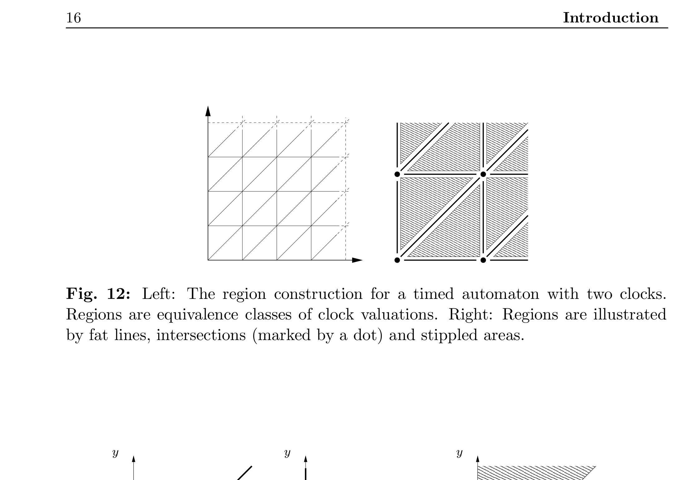

Fig. 12: Left: The region construction for a timed automaton with two clocks. Regions are equivalence classes of clock valuations. Right: Regions are illustrated by fat lines, intersections (marked by a dot) and stippled areas.

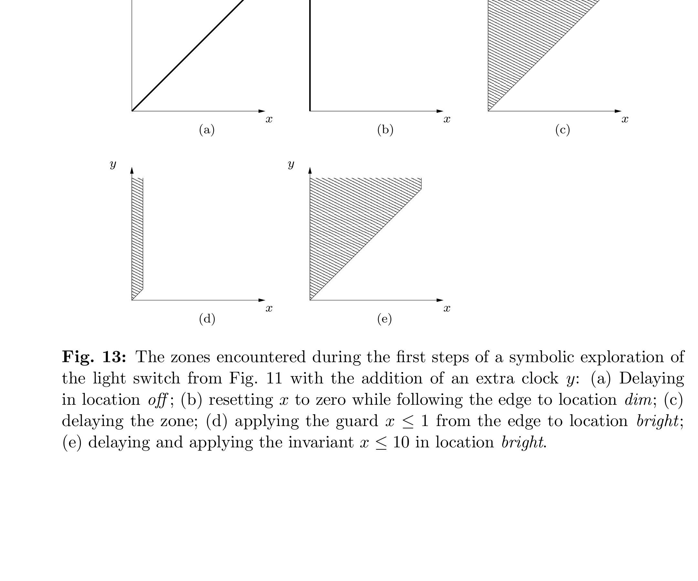

Fig. 13: The zones encountered during the first steps of a symbolic exploration of the light switch from Fig. 11 with the addition of an extra clock $y$: (a) delaying in location off; (b) resetting $x$ to zero while following the edge to location dim; (c) delaying the zone; (d) applying the guard $x \le 1$ from the edge to location bright; (e) delaying and applying the invariant $x \le 10$ in location bright.

It was shown in [Bou03] that for non-diagonal-free timed automata such an abstraction does not exist for zones, although it does at the region level. For most practical purposes the class of diagonal-free timed automata suffices and zones are the preferred representation of the state-space of timed automata.

Notice that in the worst case the region representation is actually better than the zone representation since the set of all zones is not a partitioning of the set of clock valuations and hence there are more zones than regions. In practice, however, zones are much more effective than regions. Also, the region representation is sensitive to the size of the constants used in the timed automaton, e.g. if all constants are multiplied by a factor, then this has a profound impact on the number of regions, whereas the zone representation has the same size.

Timed automata can be composed to form networks of concurrent and communicating timed automata. A state then consists of a location vector and a clock valuation. In this thesis, the difference between a network of timed automata and a timed automaton is often not that important. Whenever possible, the discussion is limited to a single timed automaton.

There is an alternative to the continuous time interpretation of timed automata, namely, the discrete time interpretation. In this interpretation, clocks have the nonnegative integers as their domain and time passes in discrete steps causing all clocks to be incremented by one. If guards and invariants are restricted to non-strict bounds on clocks (so called closed timed automata), then the problem of location reachability is equivalent in the continuous time interpretation and the discrete time interpretation. The benefit of the discrete time interpretation is that symbolic model checking techniques like the use of ROBDDs are directly applicable. The downside is that direct application of these techniques suffers from the size of the maximum constants to which clocks are compared; the region construction suffers from the same effect, but the zone construction is (at least to some extent) immune to this problem.

### 3.4 Priced Timed Automata

During the Verification of Hybrid Systems[3] (VHS) project, a now concluded EU project with several partners from academia[4] and industry throughout Europe, it was discovered that most of the cases provided by the industrial partners were actually scheduling problems rather than verification problems.

> 3 http://www-verimag.imag.fr/VHS/main.html

> 4 Many of the VHS partners now participate in the AMETIST project, see http://ametist.cs.utwente.nl/

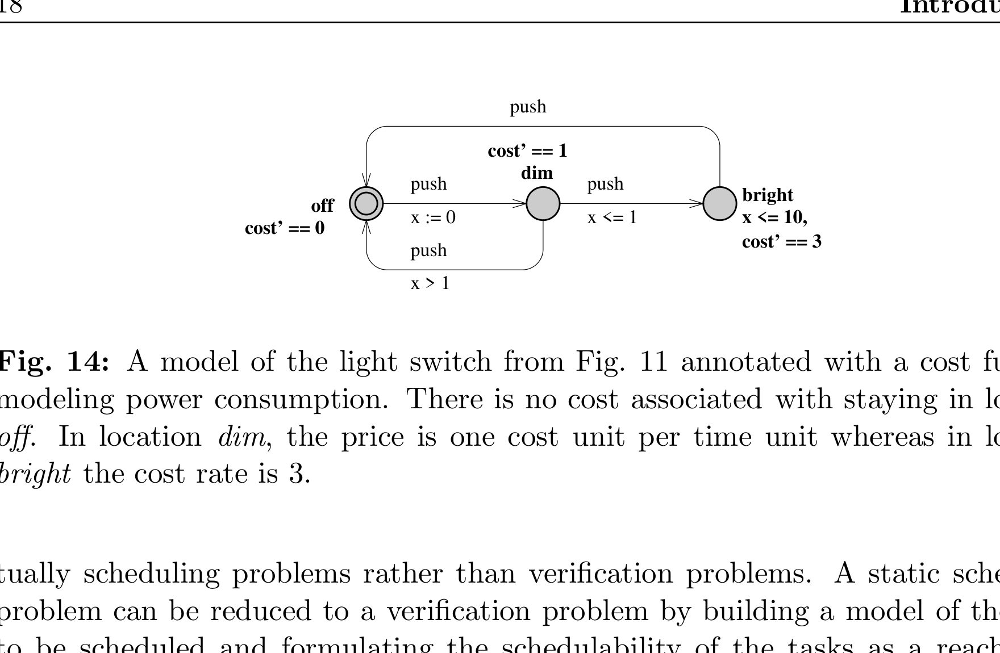


Fig. 14: A model of the light switch from Fig. 11 annotated with a cost function modeling power consumption. There is no cost associated with staying in location off. In location dim, the price is one cost unit per time unit whereas in location bright the cost rate is 3.

A static scheduling problem can be reduced to a verification problem by building a model of the tasks to be scheduled and formulating the schedulability of the tasks as a reachability property or in general a model checking problem. This can be done with any model checking tool. The result is typically a trace containing information about how the tasks should be scheduled. The downside of this approach is that the model checker will only find a schedule, and there is no guarantee that this is the best schedule or even a good schedule.

Before we can find optimal schedules, we must be able to express what optimality means. Papers D and E of this thesis address this problem by introducing Linearly Priced Timed Automata and Uniformly Priced Timed Automata, respectively. A Priced Timed Automaton is a timed automaton with the addition of a single continuous non-negative monotonously growing cost variable. The cost variable can be incremented by both continuous and discrete state changes in the timed automaton, but cannot be tested upon by guards or restricted by invariants. The cost variable is really a property of the path by which a given state has been reached, and the aim is to find the path to some goal state with the lowest possible cost. Figure 14 shows a priced timed automaton of the light switch example in Fig. 11, where the cost is intended to model power consumption.

In Uniformly Priced Timed Automata (UPTA) the rate of the cost variable (i.e. the cost of delaying one time unit) is fixed. UPTA have the nice property that existing data structures used for model checking timed automata can be reused, see paper E. Paper D shows that the optimal reachability problem for the class of Linearly Priced Timed Automata, where the rate of the cost is determined by the location, is in fact decidable. This is not at all obvious, since the reachability problem for constant slope timed automata, which are similar to timed automata except that the rate of the continuous variables is determined by the location, is not decidable. Paper F addresses the problem of efficiently representing and manipulating states of an LPTA.

In [ALP01], Alur et al. independently introduced the class of weighted timed automata which is essentially the same as our class of linearly priced timed automata, although the algorithm for finding optimal paths described in [ALP01] is different from ours.

## 4 Data Structures

Much research is invested in finding good data structures for representing individual states, sets of states or transition relations for various modeling formalisms. A good data structure must not only allow for compact representation of the state-space, but must also support the necessary operations for performing reachability analysis or model checking. In the following, we will take a brief look at the data structures used in the papers of this thesis.

### 4.1 Reduced Ordered Binary Decision Diagrams

A Reduced Ordered Binary Decision Diagram (ROBDD) (often referred to as simply Binary Decision Diagram (BDD)) is a data structure for representing Boolean functions, see Fig. 15 for an example. Given an ordering on the variables of the Boolean function, the representation is canonical. Most compositions of Boolean functions like conjunction and disjunction can be efficiently implemented using ROBDDs (linear runtime in the number of nodes of the ROBDDs involved). Even first order existential and universal quantification can be efficiently implemented on ROBDDs. See the boxed material for a precise definition of ROBDDs.

ROBDDs were discovered by Randal Bryant in 1986 [Bry86]. They quickly became the data structure of choice in hardware verification. The idea is to represent the relation between input and output signals by encoding the characteristic function of the relation as an ROBDD. Due to the canonicity property of ROBDDs, it is easy to see if two digital circuits have the same functional behaviour. One weakness of ROBDDs is the dependency on the variable ordering: The size of the ROBDD heavily depends on the variable ordering, and some functions do not have a compact ROBDD representation no matter which variable ordering is chosen: Multiplication is known not to have any polynomial size ROBDD representation.

In model checking, ROBDDs are used to represent transition relations and sets of states. Typical operations like computing the set of successors of a set of states are directly implementable using ROBDDs. Papers A and B use ROBDDs to implement the aforementioned CBR technique. The compositional nature of CBR fits well within the world of ROBDDs, since the small set of components which are included in the analysis at the beginning only depend on a subset of the ROBDD variables, thus resulting in a smaller ROBDD representation. Even in the case where we end up including all components into the analysis, we might still have gained something: Typically, the ROBDD representation of the set of states that can reach a goal state is small at the beginning (when it only contains the goal states), grows in size as more states are added, and becomes smaller again as we get closer to the fixed point. By not including all predecessors at once, we avoid the peak in the ROBDD size. This is a side effect of CBR, but there exists plenty of work trying to achieve this effect with special image computation operators (this is often referred to as guided model checking, see e.g. [BRS00], and is not the same as the guiding techniques discussed in paper D, E and F).

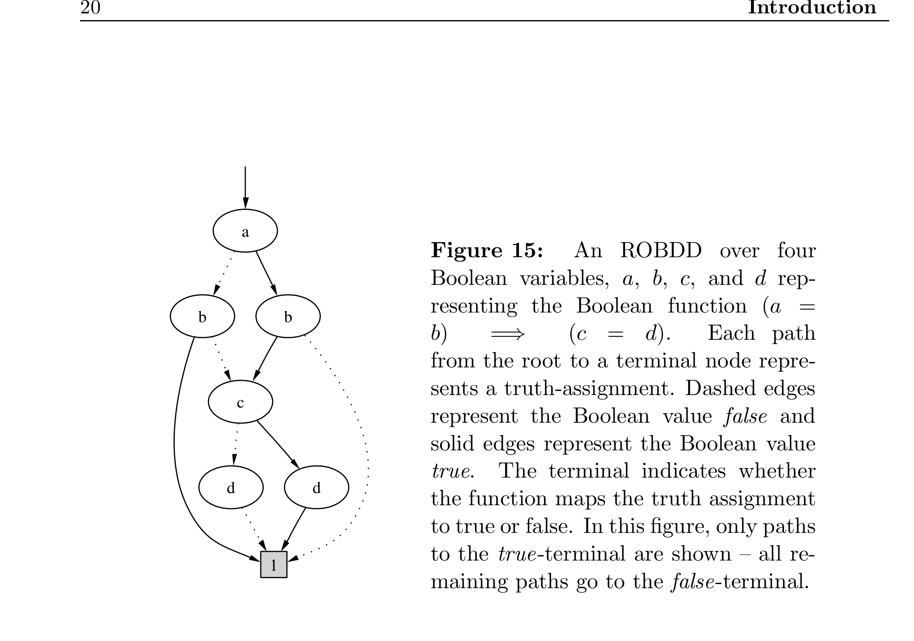

Figure 15: An ROBDD over four Boolean variables, $a$, $b$, $c$, and $d$ representing the Boolean function $(a = b) \Longrightarrow (c = d)$. Each path from the root to a terminal node represents a truth-assignment. Dashed edges represent the Boolean value false and solid edges represent the Boolean value true. The terminal indicates whether the function maps the truth assignment to true or false. In this figure, only paths to the true-terminal are shown; all remaining paths go to the false-terminal.

Reduced Ordered Binary Decision Diagrams, ROBDDs for short, are collapsed binary decision trees, with an enforced ordering on the nodes and a number of reduction rules applied. A BDD over $k$ Boolean variables can be viewed as representing a Boolean function $\mathbb{B}^k \to \mathbb{B}$.

More precisely, let $V$ be a set of Boolean variables. A Binary Decision Diagram over $V$ is a DAG with one or two terminals, true and false, one root, and nonterminals $n = (var(n), left(n), right(n))$ where $var(n) \in V$ and there are two edges from $n$ to $left(n)$ and $right(n)$ (representing the true and false interpretation of $v$). An Ordered Binary Decision Diagram (OBDD) over $V$ and total order $\succ \subseteq V \times V$ is a BDD over $V$ where all paths from the root to a terminal respect $\succ$, i.e. for all non-terminals $n$ and $m$, where $m$ is a child of $n$, we have $var(n) \succ var(m)$. A Reduced Ordered Binary Decision Diagram over $V$ and $\succ$ is an OBDD satisfying the following conditions:

1. The left and right child of a non-terminal are not the same, i.e. for all non-terminals $n$ we have $left(n) \ne right(n)$.

2. No two nodes are equal, i.e. $\forall n_1, n_2 : var(n_1) = var(n_2) \land left(n_1) = left(n_2) \land right(n_1) = right(n_2) \Longrightarrow n_1 = n_2$.

### 4.2 Difference Bound Matrices

Recall that a zone of a timed automaton is a set of clock valuations definable by a conjunction of constraints on the form $x \mathrel{\triangleright\!\triangleleft} c$ or $x - y \mathrel{\triangleright\!\triangleleft} c$, where $x$ and $y$ are clocks, $c$ is a constant, and $\mathrel{\triangleright\!\triangleleft}$ is one of the relational operators in $\{<, \le, \ge, >\}$.

There are several representations of zones. The best known is the difference bound matrix or DBM for short [Dil89, Bel58]. A DBM is a square matrix $M = \langle m_{i,j}, \prec_{i,j}\rangle_{0 \le i,j \le n}$ such that $m_{i,j} \in \mathbb{Z}$ and $\prec_{i,j} \in \{<, \le\}$, or $m_{i,j} = \infty$ and $\prec_{i,j} = <$. $M$ represents the zone $\llbracket M \rrbracket$ which is defined by

$$
\llbracket M \rrbracket = \{\sigma \mid \forall 0 \le i,j \le n : \sigma(x_i) - \sigma(x_j) \prec_{i,j} m_{i,j}\},
$$

where $\{x_i \mid 1 \le i \le n\}$ is the set of clocks, and $x_0$ is a clock which by definition is $0$ for all valuations. DBMs are not canonical representations of zones, but a normal form can be computed by considering the DBM as an adjacency matrix of a weighted directed graph (the constraint graph) and computing its all-pairs shortest path closure. In particular, if $M = \langle m_{i,j}, \prec_{i,j}\rangle_{0 \le i,j \le n}$ is a DBM in normal form, then it satisfies the triangular inequality, that is, for every $0 \le i,j,k \le n$, we have that $(m_{i,j}, \prec_{i,j}) \le (m_{i,k}, \prec_{i,k}) + (m_{k,j}, \prec_{k,j})$ where comparisons and additions are as:

$$
(m, \prec) \le (m', \prec') \iff m < m' \vee m = m' \land (\prec = < \vee \prec' = \le)
$$

and

$$
(m_1, \prec_1) + (m_2, \prec_2) =
\begin{cases}
(m_1 + m_2, \le) & \text{if } \prec_1 = \le \text{ and } \prec_2 = \le, \\
(m_1 + m_2, <) & \text{otherwise.}
\end{cases}
$$


Any DBM can be brought into its normal form in $O(n^3)$ time using the well-known Floyd-Warshall algorithm for the all-pairs shortest path problem. Given a DBM in normal form, all operations needed to compute a successor according to the abstract symbolic transition relation of a timed automaton can be efficiently implemented, see Tab. 2. Instead of recomputing the normal form after each operation, it is often more efficient to use a specialised version of the various operations which maintain the normal form of the DBM [Rok93]. For instance, it is possible to compute the conjunction of a DBM in normal form and a guard in $O(m \cdot n^2)$ time for $m \le n$, where $m$ is the number of clocks in the guard. This should be compared to the $O(n^3)$ runtime of first applying the guard and then recomputing the normal form. Using DBMs and the symbolic semantics given in section 3.3, the reachability question for timed automata can be efficiently settled using the algorithm in Fig. 16.

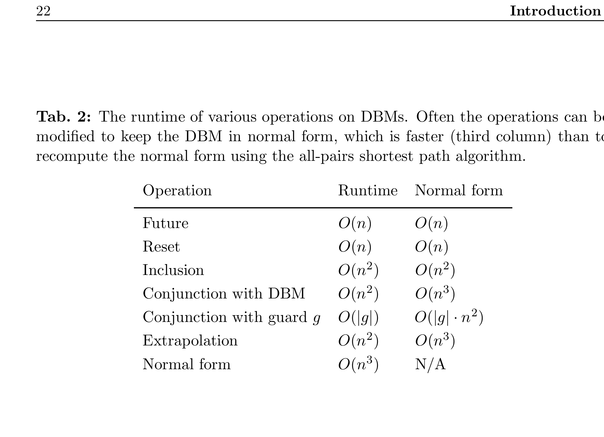

Tab. 2: The runtime of various operations on DBMs. Often the operations can be modified to keep the DBM in normal form, which is faster (third column) than to recompute the normal form using the all-pairs shortest path algorithm.

|Operation|Runtime|Normal form|
|---|---|---|
|Future|O(n)|O(n)|
|Reset|O(n)|O(n)|
|Inclusion|$O(n^2)$|$O(n^2)$|
|Conjunction with DBM|$O(n^2)$|$O(n^3)$|
|Conjunction with guard $g$|$O(|g|)$|$O(|g| \cdot n^2)$|
|Extrapolation|$O(n^2)$|$O(n^3)$|
|Normal form|$O(n^3)$|N/A|


```text
proc reach(L, l0, E, I, g, u) ≡
    wait = {(l0, Z0)}                     Z0 is the initial zone
    passed = ∅
    while wait ≠ ∅ do
        select and remove a state (l, Z) from wait
        if ¬∃(l', Z') ∈ passed : l = l' ∧ Z ⊆ Z' then
            passed = passed ∪ {(l, Z)}
            wait = wait ∪ {(l'', Z'') : (l, Z) =⇒ (l'', Z'')}
        fi
```

where $\Longrightarrow$ is the symbolic transition relation.

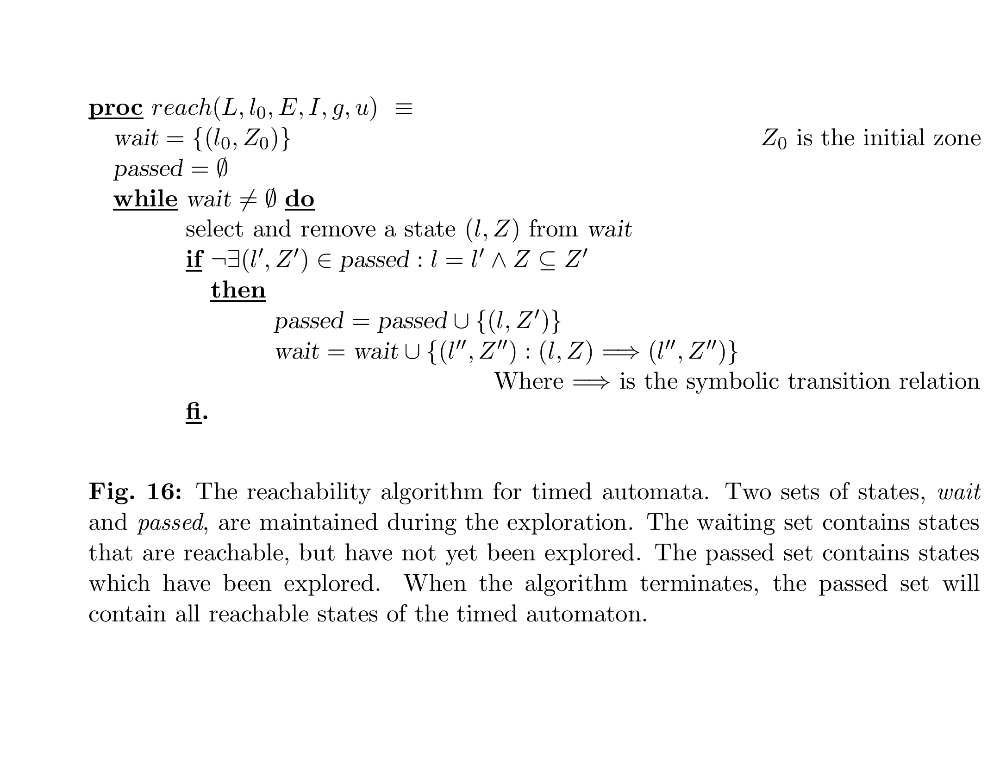

Fig. 16: The reachability algorithm for timed automata. Two sets of states, wait and passed, are maintained during the exploration. The waiting set contains states that are reachable, but have not yet been explored. The passed set contains states which have been explored. When the algorithm terminates, the passed set will contain all reachable states of the timed automaton.

### 4.3 Clock Difference Diagrams

In recent years, several approaches to fully symbolic model checking of timed automata have been investigated. Most of these try to apply ROBDDs or similar data structures and thus copy the approach which has proven to be so successful in the untimed case. Rabbit [BLN03] uses a discrete time interpretation of timed automata and can thus encode the transition relation directly using ROBDDs. NDDs [ABK[+] 97] are regular BDDs used to encode the region graph of a dense-time timed automaton. CDDs [BLP[+] 99], DDDs [MLAH99b] and CDRs [Wan01] are all variations of the same idea (discovered at roughly the same time by several research groups around the world). In paper C of this thesis the clock difference diagram, or CDD for short, is introduced.

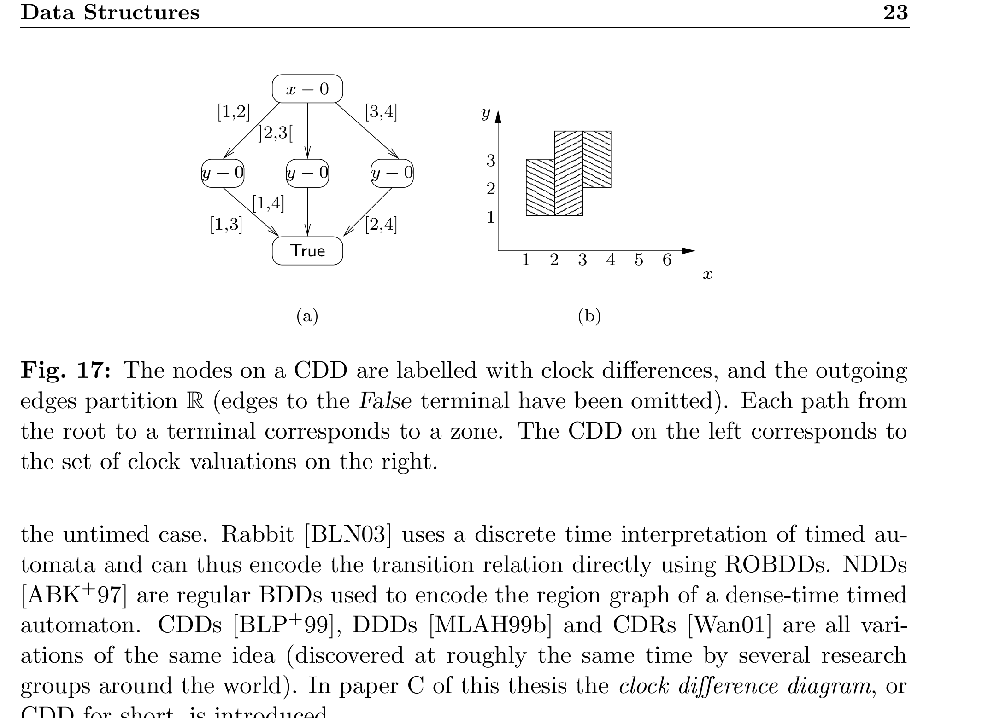


Fig. 17: The nodes on a CDD are labelled with clock differences, and the outgoing edges partition R (edges to the False terminal have been omitted). Each path from the root to a terminal corresponds to a zone. The CDD on the left corresponds to the set of clock valuations on the right.

Structurally, a CDD is very similar to a BDD, see Fig. 17. The two main differences are that:

- The nodes of the DAG are labelled with pairs of clocks which are interpreted as clock differences, rather than Boolean variables. I.e. elements in X × (X ∪ {x0}), where x0 is a clock which is zero in all valuations.

- Any intermediate node can have two or more out-edges, each labelled with a non-empty, convex, integer-bounded subset of the real line, which together form a partitioning of R.

Like for BDDs, we say that a CDD is ordered if there exist a total order of X × (X ∪{x0}) such that all paths from the root to a terminal respect this ordering. A CDD is reduced if:

- There are no duplicate nodes.

- There are no trivial edges, i.e. nodes with only one outgoing edge.

- The intervals on the edges are maximal, i.e. for two edges between the same two nodes, either the intervals are the same or the union is not an interval.

Semantically, we might view a CDD as a function $f : \mathbb{R}[X] \to \mathbb{B}$, which could be the characteristic function of a set of clock valuations. Contrary to DBMs (which are limited to convex unions of regions), CDDs can represent arbitrary unions of regions. Implementing common operations like negation, set union, set intersection, etc. is easy and can be achieved in time polynomial to the size of the argument CDDs. Contrary to ROBDDs, a reduced and ordered CDD is not a canonical representation. The literature contains a few conjectures of normal forms for CDDs and DDDs, but these are very expensive to compute and do not have practical value. A CDD can be brought into a semi-canonical form by eliminating infeasible paths (paths for which there are no clock valuations satisfying all constraints of the path) from the CDD. In this form, a tautology is uniquely represented by the true terminal and an unsatisfiable function by the false terminal. By combining CDDs and BDDs into one data structure, one can perform fully symbolic model checking of timed automata. Unfortunately, existential quantification takes exponential time in the size of the CDD (whereas it is polynomial for ROBDDs). Existential quantification is essential for computing the future of a CDD (i.e. the delay transitions).

In paper C of this thesis we focus on an alternative use of CDDs, namely as a replacement for DBMs when storing the set of visited symbolic states.

### 4.4 Priced Zones

In section 3.4 we introduced the class of Priced Timed Automata and the two subclasses Uniformly Priced Timed Automata and Linearly Priced Timed Automata. In this section we will take a brief look at data structures needed to represent symbolic states (sets of concrete states encountered during reachability analysis) of these two subclasses. What is needed is a way to represent and manipulate priced symbolic states (A, cost), where A ⊆ L × R[X] is a set of concrete states and cost : A → R is a function assigning costs to the concrete states of A. Remembering that the aim is to find the optimal or cheapest path to any goal state, the cost function should return the lowest cost of reaching any particular concrete state in A via the path at which end we found A. To exemplify, Fig. 18 shows cost for various symbolic states encountered during the analysis of the cost annotated version of the light switch in Fig. 14.

Uniformly Priced Timed Automata have the nice property that existing data structures can be reused to represent any priced symbolic state encountered during the analysis: Let the cost rate be $r$. If $r = 0$, then cost is simply an integer and a symbolic state is then a triple $(l, c, Z)$ with location $l$, cost $c$ and zone $Z$. If $r = 1$, then cost is just another clock $u$ and a symbolic state is of the form $(l, Z)$, where $Z$ is a zone over $X \cup \{u\}$, i.e. $A = \{(l, \sigma) \mid \exists c : \sigma[u \mapsto c] \in Z\}$ and $cost(l, \sigma) = \inf\{c \mid \sigma[u \mapsto c] \in Z\}$. If $r > 1$, then the UPTA can be translated to an equivalent UPTA with cost rate $1$ by increasing all constants with which clocks are compared by a factor of $r$ (see paper E of this thesis for further details).

For Linearly Priced Timed Automata the cost cannot be represented using regular zones. Therefore we introduce priced zones being zones with the addition of a linear plan over the zone representing the cost. Unfortunately, priced zones are not closed under delay and reset operations and the zone must sometimes be split into several smaller zones.

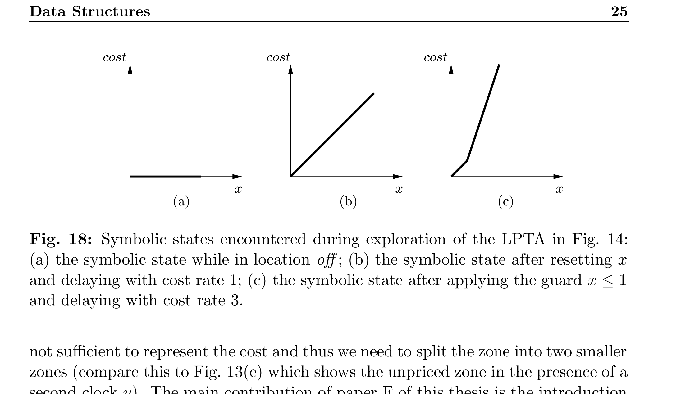


Fig. 18: Symbolic states encountered during exploration of the LPTA in Fig. 14: (a) the symbolic state while in location off ; (b) the symbolic state after resetting x and delaying with cost rate 1; (c) the symbolic state after applying the guard x ≤ 1 and delaying with cost rate 3.

Figure 18(c) shows an example of a zone where a single linear plan is not sufficient to represent the cost and thus we need to split the zone into two smaller zones (compare this to Fig. 13(e) which shows the unpriced zone in the presence of a second clock y). The main contribution of paper F of this thesis is the introduction of priced zones and operations on priced zones which are essential for an effective algorithm for finding cost optimal paths in linearly priced timed automata.

### 4.5 Minimal Constraint Form

For a model with $n$ clocks, the size of DBMs representing zones in this model is $(n + 1)^2$. In [LLPY97], an alternative representation of zones is given, which rather than storing constraints between any pair of clocks, only stores a provably minimal number of constraints such that the complete DBM can still be reconstructed by using the all-pairs shortest path closure operation.

The idea is based on the triangular inequality of the closed form of DBMs, that is, for every 0 ≤ i, j, k ≤ n, we have that (mi,j, ≺i,j) ≤ (mi,k, ≺i,k) + (mk,j, ≺k,j). If for a particular DBM and particular values of i, j and k this is an equality rather than an inequality, then (mi,j, ≺i,j) follows from (mi,k, ≺i,k) and (mk,j, ≺k,j), and hence there is no need to store the former. In fact, this is only true as long as all cycles in the DBM have positive length, i.e., there is no sequence of indices i1, i2, . . . il s.t. (mi1,i2, ≺i1,i2) + (mi2,i3, ≺i2,i3) + · · · + (mil,i1, ≺il,i1) ≤ (0, ≤).

If there are zero-cycles in the DBM, then we can have a situation like the one depicted in Fig. 19. Let $(m_{b,i}, \prec_{b,i}) = (m_{b,a}, \prec_{b,a}) + (m_{a,i}, \prec_{a,i})$ and $(m_{a,i}, \prec_{a,i}) = (m_{a,b}, \prec_{a,b}) + (m_{b,i}, \prec_{b,i})$. Clearly, both the constraints on $x_b - x_i$ and on $x_a - x_i$ are redundant, but removing both will make it impossible to recompute either of them. Clearly, this particular situation requires that $(m_{a,b}, \prec_{a,b}) + (m_{b,a}, \prec_{b,a}) = (0, \le)$, i.e. we have a zero-cycle. The solution is to form classes of clocks which happen to be on a common zero-cycle (in this particular case we have two classes: $\{x_a, x_b\}$ and $\{x_i\}$). A zero-cycle free graph can be formed by removing all clocks from the graph except a single clock from each class (the representative). It is safe to remove redundant edges from the resulting graph.

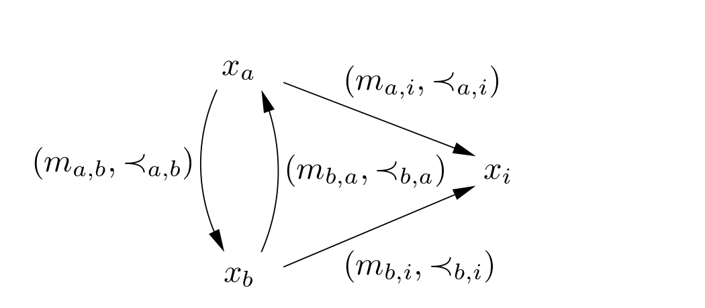


Fig. 19: A constraint graph illustrating a zone over three clocks xa, xb, and xi. An edge from a node v to a node u labelled with (c, ≺) corresponds to a constraints v − u ≺ c.

A minimal constraint form can be obtained for the original graph by adding the constraints from a single zero-cycle from each class. Given an ordering on the clocks, this representation is also a canonical representation of the zone.

In paper C, zones are first brought into the minimal constraint form before they are encoded as CDDs, thus reducing the size of the resulting CDD. In paper F, the problem of finding the infimum cost in a priced zone is reduced to an LP problem. In this translation, one wants to reduce the size of the LP problem by using the smallest number of constraints possible to describe the zone. This is exactly the minimal constraint form of the zone.

## 5 The Making of Uppaal

Uppaal is an integrated tool environment for modeling, validation and verification of real-time systems modeled as networks of timed automata, extended with data types (bounded integers, arrays, etc.). From the Uppaal web page.

Uppaal is jointly developed by the Department of Computer Science at Uppsala University and Basic Research in Computer Science at Aalborg University. Over time, many people have asked how Uppaal has been developed, what data structures are used, and how it works. Since the author of this thesis has been heavily involved in the development of this tool, the reader is hereby invited to take a short look behind the curtains.

Almost from the beginning in 1994/1995, the development of Uppaal has been case study driven. Many of the features of Uppaal have been implemented as a direct result of certain case studies, e.g. committed locations [BGK[+] 96], urgent locations [LPY97b], integer arrays, and broadcast synchronisation.[5]

A milestone in the history of Uppaal is the modeling and analysis of an audio/video protocol used by the company Bang & Olufsen [HSLL97]. This protocol was known to have a bug (messages were lost in the communication), but due to the complexity of the implementation the bug could not be located with traditional methods. Uppaal was used to analyse a model of the protocol, and an error trace of almost 2000 steps was found. With the error trace in hand, it was possible to consistently reproduce the error in the laboratory, thus making it much easier to fix the problem.

> 5 http://ametist.cs.utwente.nl/RESEARCH/CS2-TERMA.html

### 5.1 The Tool

#### Goals

The goal of Uppaal has always been to serve as a platform for research in timed automata technology. As such, it is important for the tool to provide a flexible architecture that allows experimentation. It should allow orthogonal features to be integrated in an orthogonal manner to evaluate various techniques within a single framework and investigate how they influence each other.

At the same time we are committed to provide a useful and efficient tool to academia. A tool which can be used in education and for practical verification purposes. There are several tools (e.g. TIMES [AFM[+] 03] and Moby/PLC [TD98]) which use the verification back-end of Uppaal, and provide alternative modeling languages or functionality to the user. In the future we hope to make it easier for third party developers to reuse the engine in their tools.

We neither claim nor expect Uppaal to support each and every technique in existence. For instance, the choice of supporting rich data types in the input language (e.g. bounded integer variables and arrays) makes explicit backwards reachability analysis difficult and ineffective, which is one of the reasons this technique is not supported.[6]

#### Architecture

As can be seen in Fig. 20, Uppaal is based on a client-server architecture where the graphical user interface (GUI) is acting as the client. The GUI provides an easy to use editor to draw extended timed automata, a simulator, and an interface to interact with the model checker. The interesting parts of Uppaal are in the server which takes care of parsing the model, interpreting it, and provides model checking functionality. The client and the server might run on the same physical machine or on different machines in which case they communicate via a TCP/IP connection. Experienced users can also use a command line interface (CLI) to interact directly with the model checker. In the following we will take a closer look at the architecture of the server.

The seemingly simple zone based reachability algorithm for timed automata shown in Fig. 16 turns out to be rather complicated when implemented. It has been extended and optimised to reduce the runtime and memory usage of the tool.

> 6 In fact, the 1.x versions of Uppaal from 1995 did use backwards reachability analysis, but this approach was abandoned in the 2.x series in favor of more operations on the bounded integer variables.

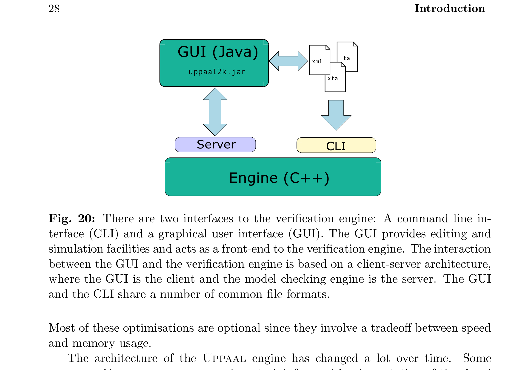

Fig. 20: There are two interfaces to the verification engine: A command line interface (CLI) and a graphical user interface (GUI). The GUI provides editing and simulation facilities and acts as a front-end to the verification engine. The interaction between the GUI and the verification engine is based on a client-server architecture, where the GUI is the client and the model checking engine is the server. The GUI and the CLI share a number of common formats.

Most of these optimisations are optional since they involve a tradeoff between speed and memory usage.

The architecture of the Uppaal engine has changed a lot over time. Some years ago Uppaal was a more or less straightforward implementation of the timed automaton reachability algorithm annotated with conditional tests on features or options. Although it was simple, it had several disadvantages:

- The core reachability algorithm became more and more complicated as new options were added.
- There was an overhead involved in checking if an option was enabled. This might not seem like much, but when this is done inside the exploration loop the overhead adds up.
- Some experimental designs and extensions required major changes due to new algorithms. Thus certain parts of the code were duplicated, which in turn complicated maintenance.

The internals of Uppaal are constantly refactored in order to facilitate new designs and algorithms, see Fig. 21 for the latest incarnation. The main goals of the design are speed and flexibility. The bottom layer providing the system and symbolic state representations has only seen minimal architectural changes over the years. In fact, the code where most options are implemented is in the state manipulation and state space representation components.

The state manipulation components implement fundamental operations on symbolic states such as evaluating a state property or computing the delay successors. All state manipulation components implement a common interface (called `Filter`) which allows them to be chained together to form more advanced operations. State space representation components are used to represent sets of symbolic states. Again, there is a common interface (called `Buffer`) which all state space representation components implement. Figure 22 shows the UML class diagram for these interfaces.

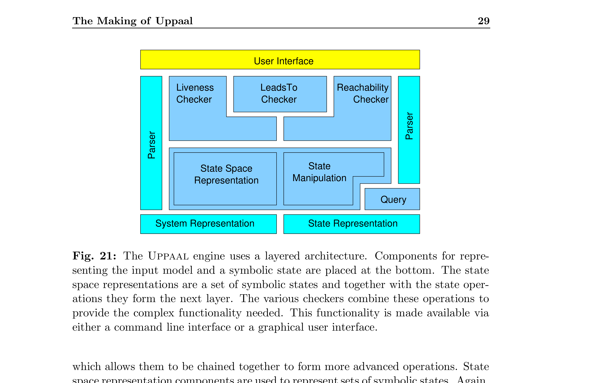

Fig. 21: The Uppaal engine uses a layered architecture. Components for representing the input model and a symbolic state are placed at the bottom. The state space representations are a set of symbolic states and together with the state operations they form the next layer. The various checkers combine these operations to provide the complex functionality needed. This functionality is made available via either a command line interface or a graphical user interface.

The verification components, such as the reachability checker, are compound filters that take the initial state as input and generate counter examples. For instance, the reachability checker is implemented by composing a number of filters into a graph structure resembling a flow-chart, see Fig. 23. The compound filter implements the zone based reachability algorithm for timed automata. It consists of filters computing the edge successors (Transition and Successor), the delay successors (Delay and Normalisation), and the unified passed and waiting list buffer (PWList). Additional components include a filter for generating progress information (e.g. throughput and number of states explored), a filter implementing active clock reduction [CS96], and a filter storing information needed to generate diagnostic traces. Notice that some of the components are optional. If disabled, a filter can be bypassed completely and does not incur any overhead.

The details of the passed and waiting list interaction are abstracted by a single buffer component, the PWList. To summarise, the passed list keeps a list of explored reachable states whereas the waiting list contains unexplored reachable states. Both are hash tables to facilitate identification of duplicate states. Traditionally, successors were added to the waiting list as they were computed and then later removed from the waiting list, compared to, and, if not previously explored, added to the passed list and explored.

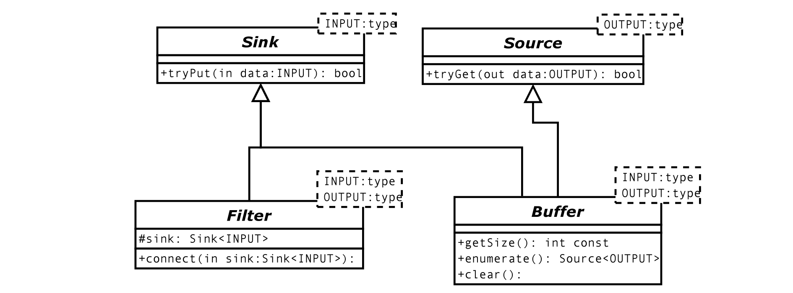

Fig. 22: Class diagram of parameterised interfaces for filters and buffers. The return value of `tryPut` and `tryGet` is used to indicate whether the operation succeeded, using whatever definition of success is appropriate for the operation.

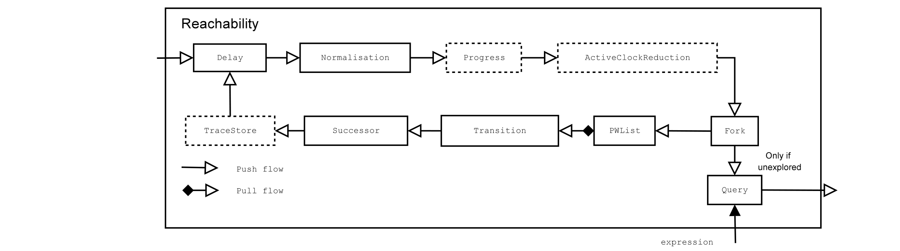

Fig. 23: The reachability checker is actually a compound object consisting of a pipeline of filters. Optional elements are dotted.

In the presence of actual implementations of the waiting list and the passed list, an implementation of a PWList component could look something like this (the Boolean return value indicates whether the operation succeeded; `tryGet` succeeds if the buffer is not empty, whereas `tryPut` succeeds if the state was not already in the buffer):

```cpp
bool tryPut(SymbolicState state)
{
    return waiting->tryPut(state);
}

bool tryGet(SymbolicState &state)
{
    do {
        if (!waiting->tryGet(state))
            return false;
    } while (!passed->tryPut(state));
    return true;
}
```

The downside of this implementation is that many of the states on the waiting list might have been explored already, but this is not discovered until they are removed from the waiting list and compared to the passed list, thus wasting memory and increasing the pressure on the waiting list hash table. On the other hand, adding them to the waiting list and the passed list at the same time also wastes memory. One of the recent changes is the introduction of a shared passed and waiting list implementation [DBLY03] merging the two hash tables and letting the passed list and the waiting list contain references to the entries in the hash table.

The number of unnecessary copy operations during exploration has been reduced as much as possible. In fact, a symbolic state is only copied twice during exploration. The first time is when it is inserted into the PWList, since the PWList might use alternative and more compact representations than the rest of the pipeline. The original state is then used for evaluating the state property using the Query filter. This is destructive as the zone is modified by this operation and the state is discarded after this step. The second is when constructing the successor. In fact, one does not retrieve a state from the PWList directly but rather a reference to a state. The state can then be copied directly from the internal representation used in the PWList to the memory reserved for the successor.

The benefits of using a common filter and buffer interface are flexibility, code reuse, and acceptable efficiency. Any component can be replaced at runtime with an alternate implementation providing different tradeoffs. Stages in the pipeline can be skipped completely with no overhead. The same components can be used and combined for different purposes. For instance, the Successor filter is used by both the reachability checker, the liveness checker, the deadlock checker, and the trace generator.

### 5.2 The Umbrella

Today, Uppaal is more than just a tool. Uppaal is an umbrella for various real-time related projects. Some of these projects are covered by this thesis, others are not. In the following we will briefly look at some of the projects which for one reason or another have not yet been included in the official version of Uppaal.

The main Uppaal code base is fairly stable. Most of the interesting work happens in branches with minimal coordination and often as joint work with visitors. Sometimes these branches bear fruit and sometimes they do not. If they do, they will be integrated when ready by refactoring the stable code base to facilitate the additions from the branch.

#### Distributed Uppaal

Real time model checking is a time and memory consuming task, quite often reaching the limits of both computers and the patience of users. An increasingly common solution to this situation is to use the combined power of normal computers connected in a cluster. Good results were achieved for Uppaal by distributing both the reachability algorithm and the main data structures. Most of this work was done in the fall of 1999 when Thomas S. Hune, who was a Ph.D. student at Arhus University at that time, and Gerd Behrmann visited Frits Vaandrager’s group in Nijmegen, see [BHV00, Beh02, Beh03].

At the core of Uppaal we find the state-space exploration algorithm for timed automata. To summarise, we might think of this as a variation of searching the states (nodes) of an oriented graph. The waiting list contains the states that have been encountered by the algorithm, but have not been explored yet, i.e. the successors have not been determined. The passed list contains all states that have been explored. The algorithm takes a state from the waiting list, compares it with the passed list, and in case it has not been explored, the state itself is added to the passed list while the successors are added to the waiting list. The one data structure responsible for the potentially huge memory consumption is the hash table used to implement both the passed list and the waiting list.

The distributed version of this algorithm is similar. Each node (processing unit) in the cluster will hold fragments of both the waiting list and the passed list according to a distribution function mapping states to nodes. In the beginning, the distributed waiting list will only hold the initial state. Whichever node hosts the initial state will compare it to its empty passed list fragment and then explore it. Now, the successors are distributed according to the distribution function and put into the waiting list fragment on the respective nodes. This process will be repeated, but now several nodes contain states in their fragment of the waiting list and quickly all nodes become busy exploring their part of the state space. The algorithm terminates when all waiting list fragments are empty and no states are in the process of being transferred between nodes.

The distribution function is in fact a hash function. It distributes states uniformly over its range and hence implements what is called random load balancing. Since states are equally likely to be mapped to any node, all nodes will receive approximately the same number of states and hence the load will be equally distributed.

This approach is very similar to the one taken by [SD97]. The difference is that Uppaal uses symbolic states, each covering (infinitely) many concrete states. In order to achieve optimal performance, the lookup performed on the passed list is actually an inclusion check. An unexplored symbolic state taken from the waiting list is compared with all the explored symbolic states on the passed list, and only if none of those states cover (include) the unexplored symbolic state it is explored. For this to work in the distributed case, the distribution function needs to guarantee that potentially overlapping symbolic states are mapped to the same node in the cluster.

A symbolic state can actually be divided into a discrete part and a continuous part. By only basing the distribution on the discrete part, the above is ensured.

Depending on the search order, building the complete reachable state-space can result in varying number of states being explored. For instance, let $s$ and $t$ be two symbolic states such that $s$ includes $t$. Thus, if $s$ is encountered before $t$, $t$ will not be explored because $s$ is already on the passed list and hence covers $t$. On the other hand, if we encounter $t$ first, both states will be explored. Experiments have shown that breadth first order is close to optimal when building the complete reachable state-space. Unfortunately, ensuring strict breadth first order in a distributed setting requires synchronising the nodes, which is undesirable. Instead, we order the states in each waiting list fragment according to their distance from the initial state, exploring those with the smallest distance first. This results in an approximation of the breadth first order. Experiments have shown that this order drastically reduces the number of explored states compared to simply using a FIFO order.

This version of Uppaal has been used on a Sun Enterprise 10000 with 24 CPUs and on a Linux Beowulf cluster with 10 nodes. Good speedups have been observed on both platforms when verifying large systems (around 80% of optimal at 23 CPUs on the Enterprise 10000).

Although the approach taken is orthogonal to most of the existing techniques used in Uppaal, no official release has been made. The current implementation can be used for little more than benchmarking. The main obstacle in releasing a distributed version is the dependency on libraries. The implementation relies on the Message Passing Interface (MPI), a standard interface to message passing libraries. Although Uppaal can be used with any MPI library, it needs to be linked with the library at compile time. This makes it difficult to release, as Uppaal is only released in binary form.

#### Stopwatches in Uppaal

Stopwatch automata are very similar to timed automata, except that the rate of each clock can be set to either 0 or 1, depending on the current state. In fact, the two models look so similar that one could be tempted to implement stopwatch automata in Uppaal. Unfortunately, the reachability problem for stopwatch automata is undecidable. In fact, in [CL00] it was shown that stopwatch automata have the same expressive power as linear hybrid automata. Of course, this did not stop us from implementing them.

The approach taken is to use a new delay operation on DBMs. The resulting DBM is an over-approximation of the actual set of delay successors, hence the computed reachable state-space is an over-approximation of the reachable state-space. Anyway, using this approach it was possible to show a number of interesting properties of linear hybrid systems previously checked using HyTech [HHWT97b], but at a fraction of the time.

Although stopwatch automata in principle could be integrated into the regular version of Uppaal, this version has been dormant for some time.

#### Priced Timed Automata in Uppaal

The terms guided Uppaal and priced Uppaal have both been used to describe versions of Uppaal related to scheduling and optimal paths. In principle, the term guided refers to the use of branch and bound techniques to select which state to explore next, and priced refers to the fact that the input model is some version of priced timed automata. In practice, guided Uppaal is the UPTA version and priced Uppaal is the LPTA version.

UPTA support in Uppaal is relatively easy, since the zone of a state of a UPTA can be represented as a regular DBM with an extra clock, which keeps track of the time. The main contribution in the UPTA implementation is the use of branch and bound techniques to efficiently find the optimal path, and the use of various heuristics to speed up the process. It should be relatively easy to integrate this into the regular version of Uppaal.

LPTA support in Uppaal is based on priced zones. Although an extension of DBMs, the use of priced zones changes a fundamental data structure in Uppaal. At the moment it is unlikely that this feature will be integrated into the rest of Uppaal.

#### Other Projects

There are many other Uppaal related projects, such as parameterised Uppaal [HRSV02], Lego Mindstorm integration, C in Uppaal, hierarchical TA [DM01], animation [ADY00], symmetries [HBL[+] 03], acceleration [HL02], etc. The tool has also been used in numerous case studies. The reader is referred to the Uppaal website at http://www.uppaal.com/ for a complete list of publications.

Of special interest to this thesis is the use of the compositional backwards reachability (CBR) technique in Uppaal [Lar02]. The main idea is to use a semi-symbolic representation of sets of location vectors of a network of timed automata. The set is represented by a vector with wildcards in some of the entries that might be substituted by any location of that component. When computing the set of predecessors, only transitions that can be taken regardless of the “unknown” components, i.e. the components for which the vector contains a wildcard, will be considered. The main obstacle in this approach is that time is a global phenomenon in a network of timed automata and any automaton might cause time-locks. Thus, it becomes difficult to reason about the behaviour of one component while not considering the behaviour of the other components.

CDDs are currently used to represent non-convex sets of regions of the timed automaton. This is the case during deadlock detection. An experimental version of a passed list implementation using CDDs exists, which might be integrated into the regular version. In principle, CDDs can represent the transition relation of the timed automaton and one could use all the existing symbolic model checking techniques based on ROBDDs to model check timed automata. The main obstacle is that existential quantification on CDDs is very expensive. Without this operation, most ROBDD-based algorithms cannot be applied.

## 6 Thesis Summary

### Paper A: Verification of Large State/Event Systems using Compositionality and Dependency Analysis

A state/event model is a concurrent version of Mealy machines used for describing embedded reactive systems. It is supported by the commercial tool visualSTATE . A number of predefined properties such as deadlock freeness and absence of dead code can effectively be reduced to reachability checking. This paper introduces the compositional backwards reachability technique that uses compositionality and dependency analysis to significantly improve the efficiency of symbolic ROBDD based model checking of state/event models.

The compositionality is exploited to effectively compute an under approximation of the set of states which can reach a goal state by including a minimal number of components in the analysis. If necessary, the dependency analysis is exploited to include more components in the analysis, while a monotonicity result allows the previous analysis to be reused.

It makes possible automated verification of large industrial designs with the use of only modest resources (less than 5 minutes on a standard PC for a model with 1421 concurrent machines). The results of the paper have been patented and are now implemented in visualSTATE .

#### Contributions

- A formal definition of the state/event model used in visualSTATE .
- A formal definition of the seven consistency checks supported by visualSTATE .
- An ROBDD encoding of state/event models.
- A symbolic and compositional technique based on dependency analysis and backwards reachability analysis.
- Experimental results demonstrating the effectiveness of the technique compared to traditional ROBDD based model checking techniques.

**Publication History.** An early version of the paper was presented at the fourth International Conference on Tools and Algorithms for the Construction and Analysis of Systems (TACAS'98) and published in LNCS volume 1385, Springer-Verlag. The present version has been published in the internal journal *Formal Methods in System Design* (FMSD) volume 18, number 1, January 2001.

### Paper B: Verification of Hierarchical State/Event Systems using Reusability and Compositionality

The hierarchical state/event model, a hierarchical version of the state/event model used in paper A, is introduced, borrowing concepts from Statecharts and UML state machines. The straightforward way of analysing a hierarchical system is to first flatten it into an equivalent non-hierarchical system and then apply existing finite state system verification techniques such as the compositional backwards reachability technique presented in paper A. Though conceptually simple, flattening is severely punished by the hierarchical depth of a system.

To alleviate this problem, we develop a technique that exploits the hierarchical structure to reuse earlier reachability checks of superstates to conclude reachability of substates, thus decomposing the reachability problem into simpler problems.

The reusability technique is combined with the compositional technique of paper A and the combination is investigated experimentally on industrial systems and hierarchical systems generated according to our expectations of real systems. The experimental results are very encouraging: whereas a flattening approach degrades in performance with an increase in the hierarchical depth (even when applying the technique of paper A), the new approach proves not only insensitive to the hierarchical depth, but even leads to improved performance as the depth increases.

#### Contributions

- A hierarchical extension of the state/event model.
- A technique for decomposing the system into superstates and substates and reducing the reachability problem to reachability problems in the components.
- A technique for reusing reachability of superstates to conclude upon the reachability of substates.
- Application of the compositional technique of paper A to a hierarchical model.
- Experimental results showing an exponential speedup compared to flattening the model and using the techniques of paper A.

**Publication History.** The initial results presented in the paper are taken from my master's thesis [ABPV98]. An early version of the paper was presented at the fifth International Conference on Tools and Algorithms for the Construction and Analysis of Systems (TACAS'99) and published in LNCS volume 1579, Springer-Verlag. The present version has been published in the internal journal *Formal Methods in System Design* (FMSD) volume 21, number 2, September 2002. A less formal presentation of the topics of papers A and B was given in a paper "Practical Verification of Embedded Software", in *IEEE Computer*, volume 33, number 5, May 2000.

### Paper C: Efficient Timed Reachability Analysis using Clock Difference Diagrams

A key element in the results of paper A and paper B was the symbolic representation of state sets and transition relations using ROBDDs. In the setting of dense time models, representing state sets requires extra attention as information must be kept not only on the discrete control structure but also on the values of continuous clock variables.

Paper C is a step towards transferring the results of paper A and paper B to model checking of real-time systems. In this paper, we present Clock Difference Diagrams, CDDs, a ROBDD-like data structure for representing and effectively manipulating certain non-convex subsets of the Euclidean space, notably those encountered during verification of timed automata.

A version of Uppaal using CDDs as a compact data structure for storing explored symbolic states has been implemented. Our experimental results demonstrate significant space savings: for 8 industrial examples, the savings are between 46% and 99% with moderate increase in runtime.

We further report on how the symbolic state-space exploration itself may be carried out using CDDs.

#### Contributions

- Formal definition of the clock difference diagram data structure.
- Algorithms for computing the union and intersection of clock difference diagrams, encoding zones with clock difference diagrams, and checking whether a zone is included in a clock difference diagram.
- Experimental results on the use of clock difference diagrams to represent the passed set used during reachability analysis of timed automata.

**Publication History.** The paper appears in the BRICS Report Series, RS-98-47, December 1998. It was presented at the 11th International Conference on Computer Aided Verification (CAV'99) and published in LNCS 1633, Springer-Verlag.

### Paper D: Minimum-Cost Reachability for Priced Timed Automata

This paper introduces the model of linearly priced timed automata as an extension of timed automata, with prices on both transitions and locations. For this model we consider the minimum-cost reachability problem: given a linearly priced timed automaton and a target state, determine the minimum cost of executions from the initial state to the target state. This problem generalises the minimum-time reachability problem for ordinary timed automata. We prove decidability of this problem by offering an algorithmic solution, which is based on a combination of branch-and-bound techniques and a new notion of priced regions. The latter allows symbolic representation and manipulation of reachable states together with the cost of reaching them.

#### Contributions

- A formal definition of linearly priced timed automata.
- A formal definition of priced regions.
- Operations on priced regions.
- A symbolic semantics based on priced regions for linearly priced timed automata.
- An algorithm based on priced regions for finding optimal paths in linearly priced timed automata.

**Publication History.** A shorter version of this paper was presented at the Fourth International Workshop, HSCC '01, and published in LNCS 2034, Springer-Verlag. The full version given here appears in the BRICS Report Series as RS-01-3.

### Paper E: Efficient Guiding Towards Cost-Optimality in Uppaal

In paper E an algorithm is presented for efficiently computing the minimum cost of reaching a goal state in the model of Uniformly Priced Timed Automata (UPTA). The algorithm is based on a symbolic semantics of UPTA, and an efficient representation and operations based on difference bound matrices. In analogy with Dijkstra's shortest path algorithm, we show that the search order of the algorithm can be chosen such that the number of symbolic states explored by the algorithm is optimal, in the sense that the number of explored states cannot be reduced by any other search order based on the cost of states. We also present a number of techniques inspired by branch-and-bound algorithms which can be used for limiting the search space and for quickly finding near-optimal solutions.

The algorithm has been implemented in Uppaal. When applied on a number of experiments the presented techniques reduced the explored state-space by up to 90%.

#### Contributions

- A zone based representation of the priced symbolic states encountered during the exploration of a uniformly priced timed automaton, including necessary operations on these priced symbolic states.
- An algorithm similar to A* for finding optimal paths to goal states in a uniformly priced timed automaton.
- An optimal search order of the symbolic state space of a uniformly priced timed automaton.
- Experimental results on the efficiency of the approach.

**Publication History.** A short version of this paper was presented at the 7th International Conference on Tools and Algorithms for the Construction and Analysis of Systems (TACAS'01) and published in LNCS 2031, Springer-Verlag. The full version was published in the BRICS Report Series under RS-01-4.

### Paper F: As Cheap as Possible: Efficient Cost-Optimal Reachability for Priced Timed Automata

In paper F an algorithm is presented for efficiently computing optimal cost of reaching a goal state in the model of Linearly Priced Timed Automata (LPTA). The algorithm is based on priced zones. This, together with a notion of facets of a zone, allows the entire machinery for symbolic reachability for timed automata in terms of zones to be lifted to cost-optimal reachability using priced zones. We report on experiments with a cost-optimising extension of Uppaal on a number of examples.

#### Contributions

- A formal definition of priced zones.
- Formal definitions of operations on priced zones needed to implement a symbolic reachability algorithm for linearly priced timed automata. For this the notion of facets of a zone is introduced.
- Experimental results demonstrating the effectiveness of priced zones for finding optimal path in linearly priced timed automata.

**Publication History.** A short version of the paper was presented at the 13th International Conference on Computer Aided Verification (CAV'01) and published in LNCS 2102, Springer-Verlag.
