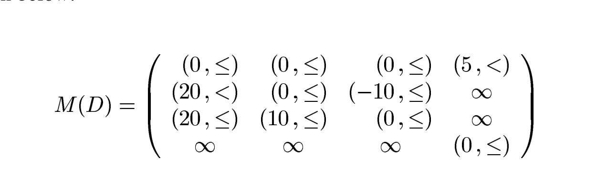
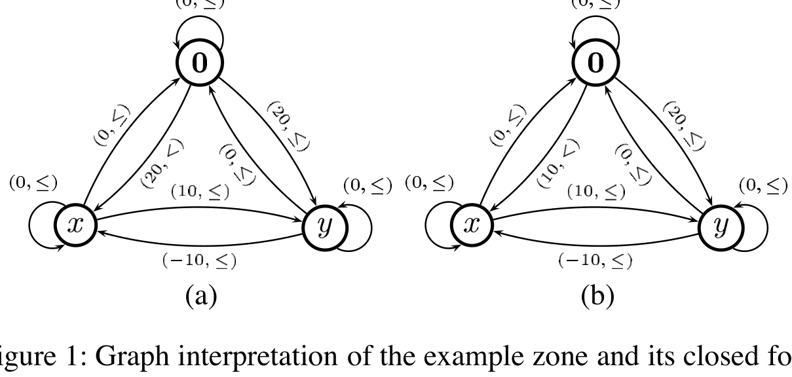
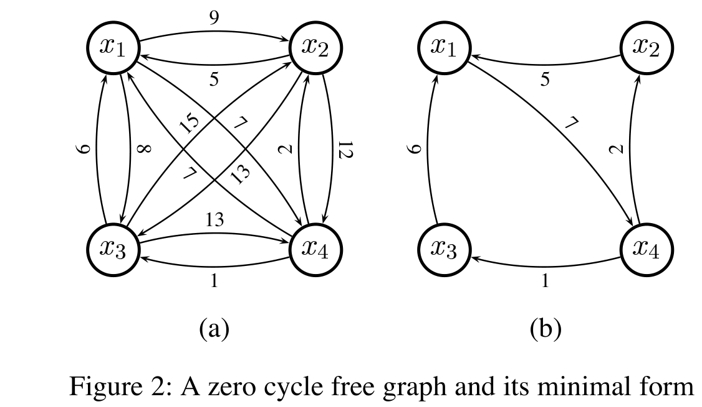
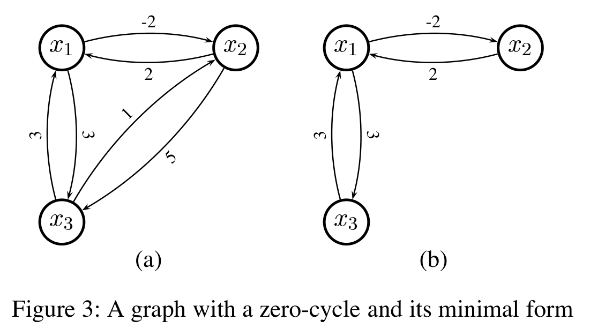
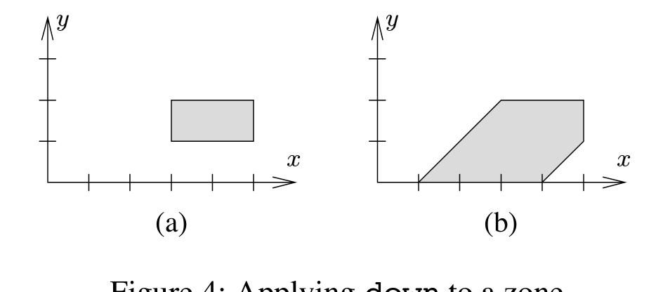
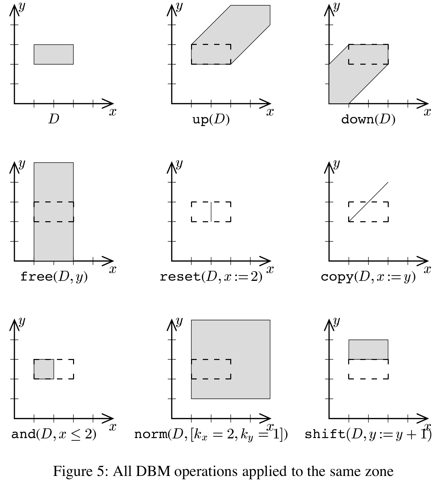
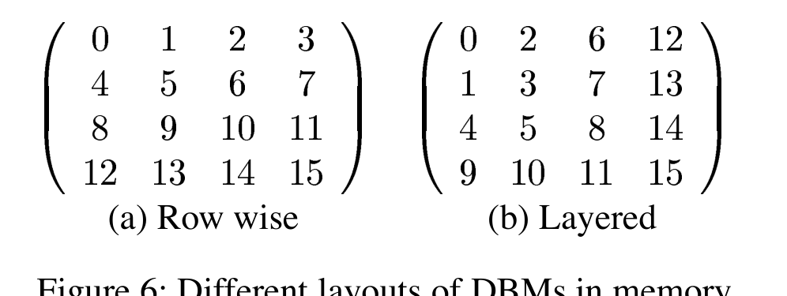

# DBM: Structures, Operations and Implementation

Johan Bengtsson

> Note: the local `paper.pdf` is the extracted Paper A from the thesis *Clocks, DBMs and States in Timed Systems*. The Markdown below is a manually refined reading version aligned against that local PDF. Numbered figures are kept as local assets from `paper-a/paper.pdf`, and the unnumbered example DBM matrix from the paper is also preserved as an asset.

## Abstract

A key issue when building a verification tool for timed systems is how to handle timing constraints arising in state-space exploration. Difference Bound Matrices (DBMs) is a well-studied technique for representing and manipulating timing constraints. The goal of this paper is to provide a cook-book and a software package for the development of verification tools using DBMs. We present all operations on DBMs needed in symbolic state-space exploration for timed automata, as well as data-structures and techniques for efficient implementation.

## 1 Introduction

During the last ten years, timed automata [AD90, AD94] has evolved as a common model for timed systems and one of the reasons behind its success is the availability of verification tools, such as UPPAAL [LPY97, ABB 01] and Kronos [DOTY95, Yov97], that can verify industrial-size applications modelled as timed automata. The major problem in automatic verification is the large number of states induced by the state explosion. For timed systems this problem has an even larger impact since both the number of states and the size of a single state are significantly larger than in the untimed case due to timing constraints. This makes devising data-structures for states and timing constraints one of the key challenges in developing verification tools for timed systems.

In this paper we describe a software package for representing timing constraints, arising from state space exploration of timed systems, as difference bound matrices [Dil89]. The package is based on the DBM implementation of [BL96] but it has been significantly improved using implementation experiences gained from developing the current version of UPPAAL. The paper is intended as a cook-book for developers of verification tools and the goal is to provide a basis for the implementation of state-of-the-art verification tools.

The paper is organised as follows: In Section 2 we introduce the DBM structure and its canonical form; we also describe how to find the minimal number of constraints needed to represent the same set of clock assignments as a given DBM. Section 3 lists all DBM operations needed to implement a verification tool such as UPPAAL together with efficient algorithms for these operations. Some suggestions on how to store the structures in memory are given in Section 4 and finally Section 5 concludes the paper.

## 2 DBM basics

The key objects for representing timing information in symbolic state-space exploration for timed systems are a special class of constraint systems referred to as difference-bound constraint-systems or, more commonly, zones. A zone for a set of clocks $C$ is a conjunction of atomic constraints of the form $x \sim n$ and $x - y \sim n$ where $x, y \in C$, $\sim \in \{\le, <, =, >, \ge\}$ and $n \in \mathbb{N}$. What makes zones so important is their simple structure and that the set of zones is closed with respect to the strongest postcondition of all operations needed in state-space generation.

Since zones are frequently used objects, their representation is a major issue when building a verification tool for timed automata. In this section we describe the basic concepts behind Difference Bound Matrices (DBM) [Dil89], which is one of the most effective data structures for zones.

To have a unified form for clock constraints we introduce a reference clock $0$ with constant value $0$. Let

$$
C_0 = C \cup \{0\}.
$$

Then any zone $D \in B(C)$ can be rewritten as a conjunction of constraints of the form

$$
x - y \preceq n
$$

for $x, y \in C_0$, $\preceq \in \{<, \le\}$ and $n \in \mathbb{Z}$.

Naturally, if the rewritten zone has two constraints on the same pair of variables only the tightest of them is significant. Thus, a zone can be represented using at most $|C_0|^2$ atomic constraints of the form $x - y \preceq n$ such that each pair of clocks $x - y$ is mentioned only once. We can then store zones using $|C_0| \times |C_0|$ matrices where each element in the matrix corresponds to an atomic constraint. Since each element in such a matrix represents a bound on the difference between two clocks, we call them *Difference Bound Matrices* (DBMs). In the following presentation we let $D_{ij}$ denote element $(i, j)$ in the DBM representing the zone $D$.

To compute the DBM representation for a zone $D$, we start by numbering all clocks in $C_0$ to assign one row and one column in the matrix to each clock. The row is used for storing lower bounds on the difference between the clock and all other clocks while the column is used for upper bounds. The elements in the matrix are then computed in three steps:

- For each bound in $x_i - x_j \preceq n$, in $D$, let $D_{ij} = (n, \preceq)$.
- For each clock difference $x_i - x_j$ that is unbounded in $D$, let $D_{ij} = \infty$. Here $\infty$ is a special value denoting that no bound is present.
- Finally add the implicit constraints that all clocks are positive, i.e. $0 - x_i \le 0$, and that the difference between a clock and itself is always $0$, i.e. $x_i - x_i \le 0$.

As an example, consider the zone

$$
D = x - 0 < 20 \wedge y - 0 \le 20 \wedge y - x \le 10 \wedge x - y \le -10 \wedge 0 - z < 5.
$$

To construct the matrix representation of $D$, we number the clocks in the order $0, x, y, z$. The resulting matrix representation is shown below:



*Unnumbered example DBM matrix shown in Paper A after the introductory construction.*

Equivalently, the matrix is

$$
M(D) =
\begin{pmatrix}
(0, \le) & (0, \le) & (0, \le) & (5, <) \\
(20, <) & (0, \le) & (-10, \le) & \infty \\
(20, \le) & (10, \le) & (0, \le) & \infty \\
\infty & \infty & \infty & (0, \le)
\end{pmatrix}.
$$

To manipulate DBMs efficiently we need two operations on bounds: comparison and addition. We define that $(n, \preceq) < \infty$, $(n_1, \preceq_1) < (n_2, \preceq_2)$ if $n_1 < n_2$, and $(n, <) < (n, \le)$. Further we define addition as $b_1 + \infty = \infty$, $(m, \le) + (n, \le) = (m + n, \le)$ and $(m, <) + (n, \le) = (m + n, <)$.

### 2.1 Canonical DBMs

Usually there are an infinite number of zones sharing the same solution set. However, for each family of zones with the same solution set there is a unique constraint system where no atomic constraint can be strengthened without losing solutions. We say that such a zone is *closed under entailment* or just *closed*. Since there is a unique closed zone for each solution set we use closed zones as canonical representation of entire families of zones.

To compute the closed representative of a given zone we need to derive the tightest constraint on each clock difference. To solve this problem, we use a graph-interpretation of zones. If we see zones as weighted graphs where the clocks in $C_0$ are nodes and the atomic constraints are edges, deriving bounds corresponds to adding weights along paths in the graph. Note that DBMs form adjacency matrices for this graph-interpretation.



*Figure 1: Graph interpretation of the example zone and its closed form.*

As an example, consider the zone

$$
x - 0 < 20 \wedge y - 0 \le 20 \wedge y - x \le 10 \wedge x - y \le -10.
$$

By combining the atomic constraints $y - 0 < 20$ and $x - y \le -10$ we derive that $x - 0 < 10$, i.e. the bound on $x - 0$ can be strengthened. Consider the graph interpretation of this zone, presented in Figure 1(a). The tighter bound on $x - 0$ can be derived from the graph, using the path $0 \rightarrow y \rightarrow x$, giving the graph in Figure 1(b). Thus, deriving the tightest constraint on a pair of clocks in a zone is equivalent to finding the shortest path between their nodes in the graph interpretation of the zone. The conclusion is that a canonical, i.e. closed, version of a zone can be computed using a shortest path algorithm. Many verifiers for timed automata use the Floyd-Warshall algorithm [Flo62] (Algorithm 1) to transform zones to canonical form. However, since this algorithm is quite expensive (cubic in the number of clocks), it is desirable to make all frequently used operations preserve the canonical form, i.e. the result of performing an operation on a canonical zone should also be canonical.

**Algorithm 1 Floyds algorithm for computing shortest path**

```text
for k := 0 to n do
  for i := 0 to n do
    for j := 0 to n do
      D_ij := min(D_ij, D_ik + D_kj)
    end for
  end for
end for
```

### 2.2 Minimal Constraint Systems

A zone may contain redundant constraints. Obviously, it is desirable to remove such constraints to store only the minimal number of constraints. Consider, for instance, the zone

$$
x - y \le 0 \wedge y - z \le 0 \wedge z - x \le 0 \wedge 2 \le x - 0 \le 3,
$$

which is in minimal form. This zone is completely defined by only five constraints. However, the closed form contains no less than 12 constraints. It is known, e.g. from [LLPY97], that for each zone there is a minimal constraint system with the same solution set. By computing this minimal form for all zones and storing them in memory using a sparse representation we might reduce the memory consumption for state-space exploration. This problem has been thoroughly investigated in [LLPY97, Pet99, Lar00] and this presentation is a summary of the work presented there.

The goal is to find an algorithm that computes the minimal form of a closed DBM. However, closing a DBM corresponds to computing the shortest path between all clocks. Thus, we want to find an algorithm that computes the minimal set of bounds with a given shortest path closure. For clarity, the algorithm is presented in terms of directed weighted graphs. However, the results are directly applicable to the graph interpretation of DBMs.

First we introduce some notation: we say that a cycle in a graph is a *zero cycle* if the sum of weights along the cycle is $0$, and an edge $x_i \xrightarrow{n_{ij}} x_j$ is *redundant* if there is another path between $x_i$ and $x_j$ where the sum of weights is no larger than $n_{ij}$.

In graphs without zero cycles we can remove all redundant edges without affecting the shortest path closure [Pet99]. Further, if the input graph is in shortest path form (as for closed DBMs) all redundant edges can be located by considering alternative paths of length two.

As an example, consider Figure 2. The figure shows the shortest path closure for a zero-cycle free graph (a) and its minimal form (b). In the graph we find that $x_1 \rightarrow x_2$ is made redundant by the path $x_1 \rightarrow x_4 \rightarrow x_2$ and can thus be removed. Further, the edge $x_3 \rightarrow x_2$ is redundant due to the path $x_3 \rightarrow x_1 \rightarrow x_2$. Note that we consider edges marked as redundant when searching for new redundant edges. The reason is that we let the redundant edges represent the path making them redundant, thus allowing all redundant edges to be located using only alternative paths of length two. This procedure is repeated until no more redundant edges can be found.



*Figure 2: A zero cycle free graph and its minimal form.*

This gives the $O(n^3)$ procedure for removing redundant edges presented in Algorithm 2. The algorithm can be directly applied to zero-cycle free DBMs to compute the minimal number of constraints needed to represent a given zone.

**Algorithm 2 Reduction of Zero-Cycle Free Graph $G$ with $n$ nodes**

```text
for i := 1 to n do
  for j := 1 to n do
    for k := 1 to n do
      if G_ik + G_kj <= G_ij then
        Mark edge i -> j as redundant
      end if
    end for
  end for
end for
Remove all edges marked as redundant.
```

However, this algorithm will not work if there are zero-cycles in the graph. The reason is that the set of redundant edges in a graph with zero-cycles is not unique. As an example, consider the graph in Figure 3(a). Applying the above reasoning on this graph would remove the edge $x_1 \xrightarrow{3} x_3$ based on the path $x_1 \xrightarrow{-2} x_2 \xrightarrow{5} x_3$. It would also remove the edge $x_2 \xrightarrow{5} x_3$ based on the path $x_2 \xrightarrow{2} x_1 \xrightarrow{3} x_3$. But if both these edges are removed it is no longer possible to construct paths leading into $x_3$. In this example there is a dependence between the edges $x_1 \xrightarrow{3} x_3$ and $x_2 \xrightarrow{5} x_3$ such that only one of them can be considered redundant.

The solution to this problem is to partition the nodes according to zero-cycles and build a super-graph where each node is a partition. The graph from Figure 3(a) has two partitions, one containing $x_1$ and $x_2$ and the other containing $x_3$. To compute the edges in the super-graph we pick one representative for each partition and let the edges between the partitions inherit the weights from edges between the representatives. In our example, we choose $x_1$ and $x_3$ as representatives for their equivalence classes. The edges in the graph are then $\{x_1, x_2\} \xrightarrow{3} \{x_3\}$ and $\{x_3\} \xrightarrow{3} \{x_1, x_2\}$. The super-graph is clearly zero-cycle free and can be reduced using Algorithm 2. This small graph can not be reduced further. The relation between the nodes within a partition is uniquely defined by the zero-cycle and all other edges may be removed. In our example all edges within each equivalence class are part of the zero-cycle and thus none of them can be removed. Finally the reduced super-graph is connected to the reduced partitions. In our example we end up with the graph in Figure 3(b). Pseudo-code for the reduction-procedure is shown in Algorithm 3.



*Figure 3: A graph with a zero-cycle and its minimal form.*

Now we have an algorithm for computing the minimum number of edges to represent a given shortest path closure that can be used to compute the minimum number of constraints needed to represent a given zone.

**Algorithm 3 Reduction of negative-cycle free graph $G$ with $n$ nodes**

```text
for i := 1 to n do
  if Node_i is not in a partition then
    Eq_i := empty
    for j := i to n do
      if G_ij + G_ji = 0 then
        Eq_i := Eq_i union {Node_j}
      end if
    end for
  end if
end for
Let G' be a graph without nodes.
for each Eq_i do
  Pick one representative Node_i in Eq_i
  Add Node_i to G'
  Connect Node_i to all nodes in G' using weights from G.
end for
Reduce G'
for each Eq_i do
  Add one zero cycle containing all nodes in Eq_i to G'
end for
```

## 3 Operations on DBMs

This section presents all operations on DBMs needed in symbolic state space exploration of timed automata, both for forwards and backwards analysis. Note that even if a verification tool only explores the state space in one direction all operations are still useful for other purposes, e.g. for generating diagnostic traces. The effects of the operations are shown graphically in Figure 5.

In the following section we do not distinguish between DBMs and zones, and the terms are used alternately. To simplify the presentation we assume that the clocks in $C_0$ are numbered $0, \ldots, n$ and the index for $0$ is $0$. We assume that the input zones are consistent and in canonical form.

The operations on DBMs can be divided into three different classes:

1. *Property-Checking*: Operations in this class include checking if a DBM is consistent, checking inclusion between zones, and checking whether a zone satisfies a given atomic constraint.
2. *Transformation*: This is the largest class containing operations for transforming zones according to guards, delay and reset.
3. *Normalisation*: They are used to normalise zones in order to obtain a finite zone-graph. In this paper we only describe one operation in this class, the so called $k$-normalisation. For more normalisation operations we refer to [BY01].

### 3.1 Checking Properties of DBMs

#### `consistent(D)`

The most basic operation on a DBM is to check if it is consistent, i.e. if the solution set is non-empty. In state-space exploration this operation is used to remove inconsistent states from exploration.

For a zone to be inconsistent there must be at least one pair of clocks where the upper bound on their difference is smaller than the lower bound. For DBMs this can be checked by searching for negative cost cycles in the graph interpretation. However, the most efficient way to implement a consistency check is to detect when an upper bound is set to lower value than the corresponding lower bound and mark the zone as inconsistent by setting $D_{00}$ to a negative value. For a zone in canonical form this test can be performed locally. To check if a zone is inconsistent it will then be enough to check whether $D_{00}$ is negative.

#### `relation(D, D')`

Another key operation in state space exploration is inclusion checking for the solution sets of two zones. For DBMs in canonical form, the condition that

$$
D_{ij} \le D'_{ij}
$$

for all clocks $i, j \in C_0$ is necessary and sufficient to conclude that $D \subseteq D'$. Naturally the opposite condition applies to checking if $D' \subseteq D$. This allows for the combined inclusion check described in Algorithm 5.

#### `satisfied(D, x_i - x_j \preceq m)`

Sometimes it is desirable to non-destructively check if a zone satisfies a constraint, i.e. to check if the zone

$$
D \wedge x_i - x_j \preceq m
$$

is consistent without altering $D$. From the definition of the `consistent` operation we know that a zone is consistent if it has no negative-cost cycles. Thus, checking if $D \wedge x_i - x_j \preceq m$ is non-empty can be done by checking if adding the guard to the zone would introduce a negative-cost cycle. For a DBM on canonical form this test can be performed locally by checking if $(m, \preceq) + D_{ji}$ is negative.

### 3.2 Transformations

#### `up(D)`

The `up` operation computes the strongest post condition of a zone with respect to delay, i.e. `up(D)` contains the time assignments that can be reached from $D$ by delay. Formally, this operation is defined as

$$
\operatorname{up}(D) = \{u + d \mid u \in D, d \in \mathbb{R}_+\}.
$$

Algorithmically, `up` is computed by removing the upper bounds on all individual clocks (in a DBM all elements $D_{i0}$ are set to $\infty$). This is the same as saying that any time assignment in a given zone may delay an arbitrary amount of time. The property that all clocks proceed at the same speed is ensured by the fact that constraints on the differences between clocks are not altered by the operation.

This operation preserves the canonical form, i.e. applying `up` to a canonical DBM will result in a new canonical DBM. The reason is that to derive an upper bound on a single clock we need at least an upper bound on another clock and the relation between $x$ and $y$, and all upper bounds have been removed by the operation. The `up` operation is also presented in Algorithm 6.

#### `down(D)`

This operation computes the weakest precondition of $D$ with respect to delay. Formally

$$
\operatorname{down}(D) = \{u \mid u + d \in D, d \in \mathbb{R}_+\},
$$

i.e. the set of time assignments that can reach $D$ by some delay $d$. Algorithmically, `down` is computed by setting the lower bound on all individual clocks to $(0, \le)$. However due to constraints on clock differences this algorithm may produce non-canonical DBMs. As an example, consider the zone in Figure 4(a). When `down` is applied to this zone (Figure 4(b)), the lower bound on $x$ is $1$ and not $0$, due to constraints on clock differences. Thus, to obtain an algorithm that produces canonical DBMs the difference constraints have to be taken into account when computing the new lower bounds.



*Figure 4: Applying down to a zone.*

To compute the lower bound for a clock $x$, start by assuming that all other clocks $y_i$ have the value $0$. Then examine all difference constraints $y_i - x$ and compute a new lower bound for $x$ under this assumption. The new bound on $0 - x$ will be the minimum bound on $y_i - x$ found in the DBM. Pseudo-code for `down` is presented in Algorithm 7.

#### `and(D, x_i - x_j \preceq b)`

The most useful operation in state-space exploration is conjunction, i.e. adding a constraint to a zone. The basic step of the `and` operation is to check if $(b, \preceq) < D_{ij}$ and in this case set the bound $D_{ij}$ to $(b, \preceq)$. If the bound has been altered, i.e. if adding the guard affected the solution set, the DBM has to be put back on canonical form. One way to do this would be to use the generic shortest path algorithm, however for this particular case it is possible to derive a specialisation of the algorithm allowing re-canonicalisation in $O(n^2)$ instead of $O(n^3)$.

The specialised algorithm takes advantage of the fact that $D_{ij}$ is the only bound that has been changed. Since the Floyd-Warshall algorithm is insensitive to how the nodes in the graph are ordered, we may decide to treat $x_i$ and $x_j$ last. The outer loop of Algorithm 1 will then only affect the DBM twice, for $k = i$ and $k = j$. This allows the canonicalisation algorithm to be reduced to checking, for all pairs of clocks in the DBM, if the path via either $x_i$ or $x_j$ is shorter than the direct connection. The pseudo code for this is presented in Algorithm 8.

#### `free(D, x)`

The `free` operation removes all constraints on a given clock, i.e. the clock may take any positive value. Formally this is expressed as

$$
\operatorname{free}(D, x) = \{u[x = d] \mid u \in D, d \in \mathbb{R}_+\}.
$$

In state-space exploration this operation is used in combination with conjunction, to implement reset operations on clocks. It can be used in both forwards and backwards exploration, but since forwards exploration allows other more efficient implementations of reset, `free` is only used when exploring the state-space backwards.

A simple algorithm for this operation is to remove all bounds on $x$ in the DBM and set $D_{0x} = (0, \le)$. However, the result may not be on canonical form. To obtain an algorithm preserving the canonical form, we change how new difference constraints regarding $x$ are derived. We note that the constraint $0 - x \le 0$ can be combined with constraints of the form $y_i - 0 \preceq m$ to compute new bounds for $y_i - x$. For instance, if $y_i - 0 \le 5$ we can derive that $y_i - x \le 5$. To obtain a DBM on canonical form we derive bounds for $D_{ix}$ based on $D_{i0}$ instead of setting $D_{ix} = \infty$. In Algorithm 9 this is presented as pseudo code.

#### `reset(D, x := m)`

In forwards exploration this operation is used to set clocks to specific values, i.e.

$$
\operatorname{reset}(D, x := m) = \{u[x = m] \mid u \in D\}.
$$

Without the requirement that output should be on canonical form, `reset` can be implemented by setting $D_{x0} = (m, \le)$, $D_{0x} = (-m, \le)$ and remove all other bounds on $x$. However, if we instead of removing the difference constraints compute new values using constraints on the other clocks, like in the implementation of `free`, we obtain an implementation that preserves the canonical form. Such an implementation is presented in Algorithm 10.

#### `copy(D, x := y)`

This is another operation used in forwards state-space exploration. It copies the value of one clock to another. Formally, we define

$$
\operatorname{copy}(D, x := y) = \{u[x = u(y)] \mid u \in D\}.
$$

Analogous with `reset`, `copy` can be implemented by assigning $D_{xy} = (0, \le)$, $D_{yx} = (0, \le)$, removing all other bounds on $x$ and re-canonicalise the zone. However, a more efficient implementation is obtained by assigning $D_{xy} = (0, \le)$, $D_{yx} = (0, \le)$ and then copy the rest of the bounds on $x$ from $y$. For pseudo code, see Algorithm 11.

#### `shift(D, x := x + m)`

The last reset operation is shifting a clock, i.e. adding or subtracting a clock with an integer value, i.e.

$$
\operatorname{shift}(D, x := x + m) = \{u[x = u(x) + m] \mid u \in D\}.
$$

The definition gives a hint on how to implement the operation. We can view the shift operation as a substitution of $x - m$ for $x$ in the zone. With this reasoning $m$ is added to the upper and lower bounds of $x$. However, since lower bounds on $x$ are represented by constraints on $y_i - x$, $m$ is subtracted from all those bounds. This operation is presented in pseudo-code in Algorithm 12.

### 3.3 Normalisation Operations

#### `norm_k(D, [k_0, k_1, ..., k_n])`

To obtain a finite zone graph most verifiers use some kind of normalisation of zones. One of the key steps in most normalisation algorithms is the so called $k$-normalisation, i.e. the zone is normalised with respect to the maximum constant each clock is compared to in the automaton.

The procedure to obtain the $k$-normalisation of a given zone is to remove all bounds $x - y \preceq m$ such that $(m, \preceq) > (k_x, \le)$ and to set all bounds $x - y \preceq m$ such that $(m, \preceq) < (-k_y, <)$ to $(-k_y, <)$. This corresponds to removing all upper bounds higher than the maximum constant and lowering all lower bounds higher than the maximum constant down to the maximum constant.

The $k$-normalisation operation will not preserve the canonical form of the DBM, and in this case the best way to put the result back on canonical form is to use Algorithm 1. Pseudo-code for $k$-normalisation is given in Algorithm 13.



*Figure 5: All DBM operations applied to the same zone.*

## 4 Zones in Memory

This section describes a number of techniques for storing zones in computer memory. The section starts by describing how to map DBM elements on machine words. It continues by discussing how to place two-dimensional DBMs in one-dimensional memory and ends by describing how to store zones using a sparse representation.

### 4.1 Storing DBM Elements

To store a DBM element in memory we need to keep track of the integer limit and whether it is strict or not. The range of the integer limit is typically much lower than the maximum value of a machine word and the strictness can be stored using just one bit. Thus, it is possible to store both the limit and the strictness in different parts of the same machine word. Since comparing and adding DBM elements are frequently used operations it is crucial for the performance of a DBM package that they can be efficiently implemented for the chosen encoding. Fortunately, it is possible to construct an encoding of bounds in machine words, where checking if $b_1$ is less than $b_2$ can be done by checking if the encoded $b_1$ is smaller than the encoded $b_2$.

The encoding we propose is to use the least significant bit (LSB) of the machine word to store whether the bound is strict or not. Since strict bounds are smaller than non-strict we let a set (1) bit denote that the bound is non-strict while an unset (0) bit denote that the bound is strict. The rest of the bits in the machine word are used to store the integer bound. To encode $\infty$ we use the largest positive number that fit in a machine word (denoted `MAX_INT`).

For good performance we also need an efficient implementation of addition of bounds. For the proposed encoding Algorithm 4 adds two encoded bounds $b_1$ and $b_2$. The symbols `&` and `|` in the algorithm are used to denote bitwise-and and bitwise-or, respectively.

**Algorithm 4 Algorithm for adding encoded bounds**

```text
if b1 = MAX_INT or b2 = MAX_INT then
  return MAX_INT
else
  return b1 + b2 - ((b1 & 1) | (b2 & 1))
end if
```

### 4.2 Placing DBMs in Memory

Another implementation issue is how to store two-dimensional DBMs in linear memory. In this section we present two different techniques and give a brief comparison between them. The natural way to put matrices in linear memory is to store the elements by row (or by column), i.e. each row of the matrix is stored consequently in memory. This layout has one big advantage, its good performance. This advantage is mainly due to the simple function for computing the location of a given element in the matrix:

$$
\operatorname{loc}(x, y) = x \cdot (n + 1) + y.
$$

This function can (on most computers) be computed in only two instructions. This is important since all accesses to DBM elements use this function. How the different DBM elements are placed in memory with this layout is presented in Figure 6(a).

The second way to store a DBM in linear memory is based on a layered model where each layer consists of the bounds between a clock and the clocks with lower index in the DBM. In this representation it is cheap to implement local clocks, since all information about the local clocks are localised at the end of the DBM. The drawback with this layout is the more complicated function from DBM indices to memory locations. For this layout we have:

$$
\operatorname{loc}(x, y) =
\begin{cases}
y \cdot (y + 1) + x & \text{if } x \le y, \\
x \cdot x + y & \text{otherwise.}
\end{cases}
$$

This adds at least two instructions (one comparison and one conditional jump) to the transformation. This may not seem such a huge overhead, but it is clearly noticeable. The cache performance is also worse when using this layout than when storing the DBMs row-wise. This layout is illustrated in Figure 6(b).

The conclusion is that unless the tool under construction supports adding and removing clocks dynamically the row-wise mapping should be used. On the other hand, if the tool supports local clocks the layered mapping may be preferable since no reordering of the DBM is needed when entering or leaving a clock scope.



*Figure 6: Different layouts of DBMs in memory.*

### 4.3 Storing Sparse Zones

In most verification tools, the majority of the zones are kept in the set of states already visited during verification. They are used as a reference to ensure termination by preventing states from being explored more than once. For the states in this set we may benefit from storing only the minimal number of constraints using a sparse representation.

A straightforward implementation is to store a sparse zone as a vector of constraints of the form $(x, y, b)$. We may save additional memory by omitting implicit constraints, such as $0 - x \le 0$. A downside with using sparse zones is that each constraint requires twice the amount of memory needed for a constraint in a full DBM, since the sparse representation must store clock indices explicitly. Thus, unless half of the constraints in a DBM are redundant we do not gain from using sparse zones.

A good feature of the sparse representation is that checking whether a zone $D_f$ represented as a full DBM is included in a sparse zone $D_s$ may be implemented without computing the full DBM for $D_s$. It suffices to check for all constraints in $D_s$ that the corresponding bound in $D_f$ is tighter. However, to check if $D_s \subseteq D_f$ we have to compute the full DBM for $D_s$.

## 5 Conclusions

In this paper we have reviewed Difference Bound Matrices as a data-structure for timing constraints. We have presented the basics of the data-structure and all operations needed in symbolic state-space exploration of timed automata. We have also discussed how to save space by computing the minimum number of constraints defining a given zone and saving them using a sparse representation.

## References

`[ABB 01]` Tobias Amnell, Gerd Behrmann, Johan Bengtsson, Pedro R. D'Argenio, Alexandre David, Ansgar Fehnker, Thomas Hune, Bertrand Jeannet, Kim G. Larsen, M. Oliver Moller, Paul Pettersson, Carsten Weise, and Wang Yi. *UPPAAL - Now, Next, and Future*. In *Modelling and Verification of Parallel Processes*, volume 2067 of Lecture Notes in Computer Science, pages 100-125. Springer-Verlag, 2001.

`[AD90]` Rajeev Alur and David L. Dill. *Automata for modeling real-time systems*. In *Proceedings, Seventeenth International Colloquium on Automata, Languages and Programming*, volume 443 of Lecture Notes in Computer Science, pages 322-335. Springer-Verlag, 1990.

`[AD94]` Rajeev Alur and David L. Dill. *A theory of timed automata*. *Theoretical Computer Science*, 126(2):183-235, 1994.

`[BL96]` Johan Bengtsson and Fredrik Larsson. *UPPAAL a tool for automatic verification of real-time systems*. Technical Report 96/67, Department of Computer Systems, Uppsala University, 1996.

`[BY01]` Johan Bengtsson and Wang Yi. *Reachability analysis of timed automata containing constraints on clock differences*. Submitted for publication, 2001.

`[Dil89]` David L. Dill. *Timing assumptions and verification of finite-state concurrent systems*. In *Proceedings, Automatic Verification Methods for Finite State Systems*, volume 407 of Lecture Notes in Computer Science, pages 197-212. Springer-Verlag, 1989.

`[DOTY95]` Conrado Daws, Alfredo Olivero, Stavros Tripakis, and Sergio Yovine. *The tool Kronos*. In *Proceedings, Hybrid Systems III: Verification and Control*, volume 1066 of Lecture Notes in Computer Science. Springer-Verlag, 1995.

`[Flo62]` Robert W. Floyd. *Acm algorithm 97: Shortest path*. *Communications of the ACM*, 5(6):345, June 1962.

`[Lar00]` Fredrik Larsson. *Efficient implementation of model-checkers for networks of timed automata*. Licentiate Thesis 2000-003, Department of Information Technology, Uppsala University, 2000.

`[LLPY97]` Kim G. Larsen, Fredrik Larsson, Paul Pettersson, and Wang Yi. *Efficient verification of real-time systems: Compact data structure and state space reduction*. In *Proceedings, 18th IEEE Real-Time Systems Symposium*, pages 14-24. IEEE Computer Society Press, 1997.

`[LPY97]` Kim G. Larsen, Paul Petterson, and Wang Yi. *UPPAAL in a nutshell*. *Journal on Software Tools for Technology Transfer*, 1997.

`[Pet99]` Paul Pettersson. *Modelling and Verification of Real-Time Systems Using Timed Automata: Theory and Practice*. PhD thesis, Uppsala University, 1999.

`[Yov97]` Sergio Yovine. *Kronos: a verification tool for real-time systems*. *Journal on Software Tools for Technology Transfer*, 1, October 1997.

## Appendix: Pseudo-Code

### Algorithm 5 `relation(D, D')`

```text
fDsubsetD' := tt
fDsupsetD' := tt
for i := 0 to n do
  for j := 0 to n do
    fDsubsetD' := fDsubsetD' /\ (D_ij <= D'_ij)
    fDsupsetD' := fDsupsetD' /\ (D_ij >= D'_ij)
  end for
end for
return <fDsubsetD', fDsupsetD'>
```

### Algorithm 6 `up(D)`

```text
for i := 1 to n do
  D_i0 := infinity
end for
```

### Algorithm 7 `down(D)`

```text
for i := 1 to n do
  D_0i := (0, <=)
  for j := 1 to n do
    if D_ji < D_0i then
      D_0i := D_ji
    end if
  end for
end for
```

### Algorithm 8 `and(D, g)`

```text
if D_yx + (m, <=) < 0 then
  D_00 := (-1, <=)
else if (m, <=) < D_xy then
  D_xy := (m, <=)
  for i := 0 to n do
    for j := 0 to n do
      if D_ix + D_xj < D_ij then
        D_ij := D_ix + D_xj
      end if
      if D_iy + D_yj < D_ij then
        D_ij := D_iy + D_yj
      end if
    end for
  end for
end if
```

### Algorithm 9 `free(D, x)`

```text
for i := 0 to n do
  if i != x then
    D_xi := infinity
    D_ix := D_i0
  end if
end for
```

### Algorithm 10 `reset(D, x := m)`

```text
for i := 0 to n do
  D_xi := (m, <=) + D_0i
  D_ix := D_i0 + (-m, <=)
end for
```

### Algorithm 11 `copy(D, x := y)`

```text
for i := 0 to n do
  if i != x then
    D_xi := D_yi
    D_ix := D_iy
  end if
end for
D_xy := (0, <=)
D_yx := (0, <=)
```

### Algorithm 12 `shift(D, x := x + m)`

```text
for i := 0 to n do
  if i != x then
    D_xi := D_xi + (m, <=)
    D_ix := D_ix + (-m, <=)
  end if
end for
D_x0 := max(D_x0, (0, <=))
D_0x := min(D_0x, (0, <=))
```

### Algorithm 13 `norm_k(D, [k_0, k_1, ..., k_n])`

```text
for i := 0 to n do
  for j := 0 to n do
    if D_ij != infinity and D_ij > (k_i, <=) then
      D_ij := infinity
    else if D_ij != infinity and D_ij < (-k_j, <) then
      D_ij := (-k_j, <)
    end if
  end for
end for
close(D)
```
