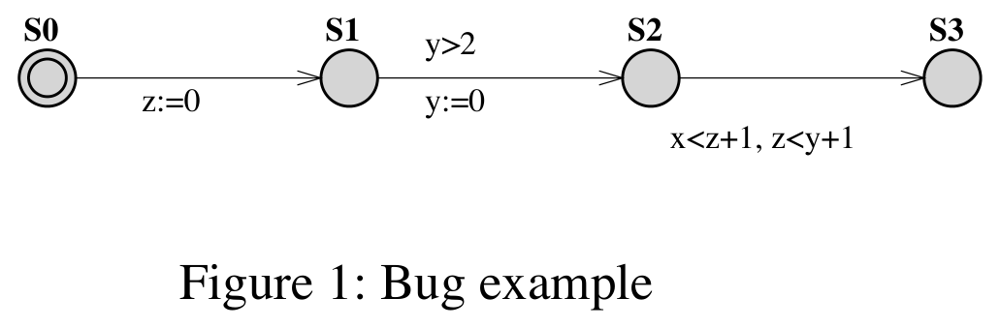
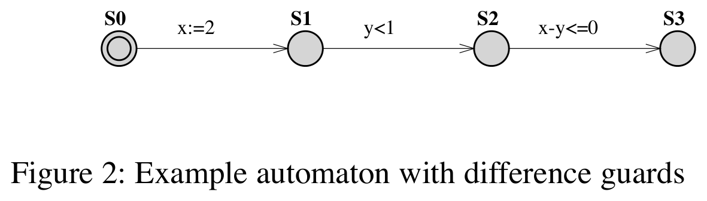
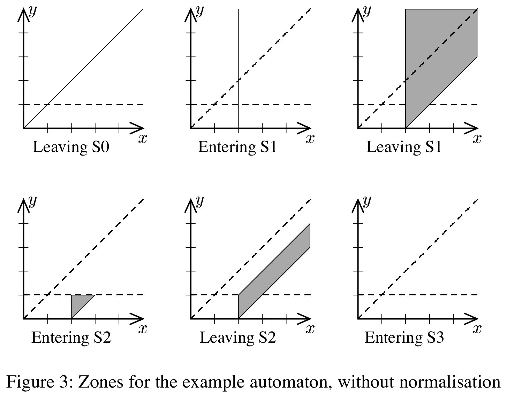
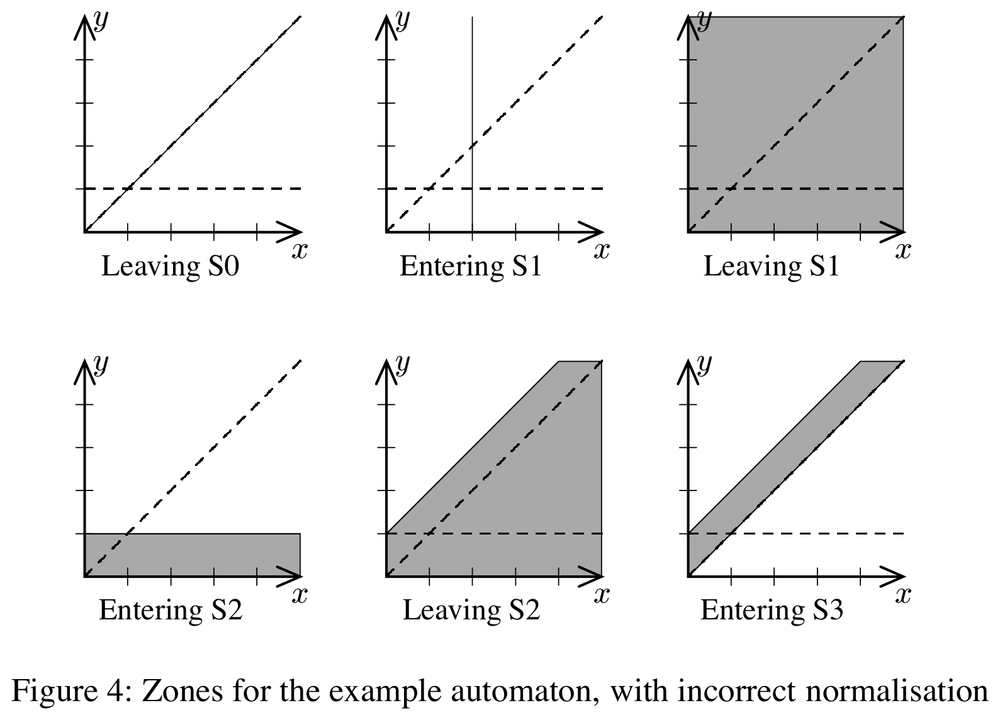
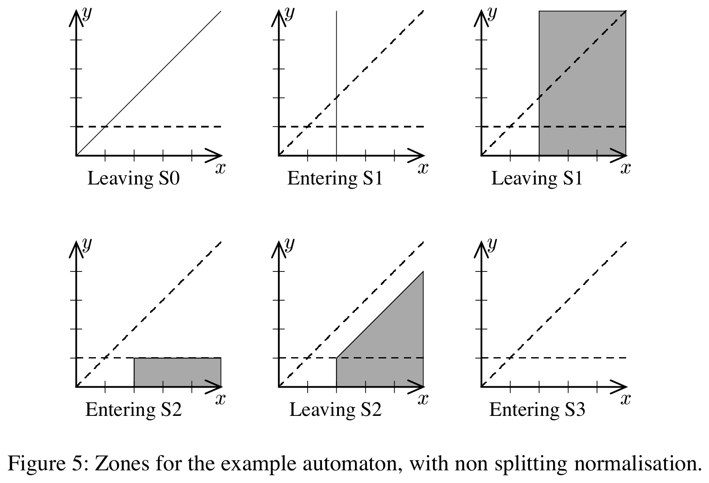
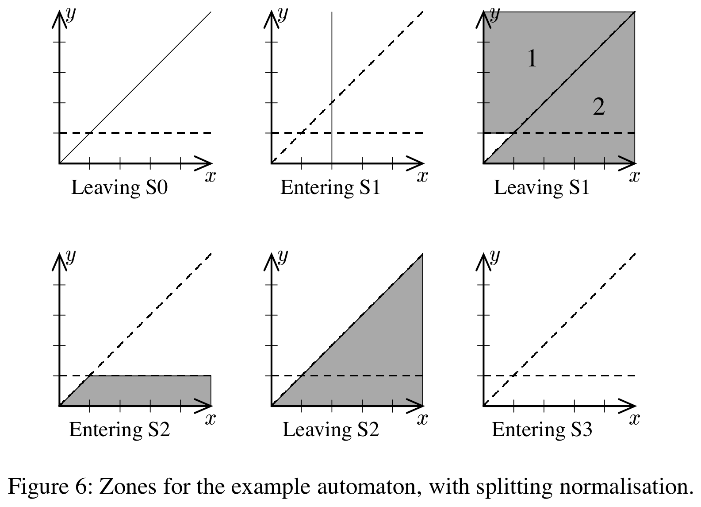

# Reachability Analysis of Timed Automata Containing Constraints on Clock Differences

Johan Bengtsson and Wang Yi

Department of Computer Systems, Uppsala University, Sweden  
E-mail: `{johanb,yi}@docs.uu.se`

<!-- page: 47 -->

## Abstract

The key step to guarantee termination of reachability analysis for timed automata is the normalisation algorithms for clock constraints, that is, symbolic states represented as DBM's. A normalisation algorithm transforms DBM's that may contain arbitrary constants into equivalent constraints bounded by the maximal constants appearing in an automaton. A restriction of the existing algorithms is that clock constraints in timed automata must be in the form [AD94] of $x \sim n$, where $x$ is a clock, $\sim \in \{\le,<,=,>,\ge\}$, and $n$ is a natural number.

It was discovered recently that the existing tools were either providing incorrect answers or not terminating when they were used to verify automata containing difference constraints of the form $x - y \sim n$, which are indeed needed in many applications, for example in scheduling problems. In this paper, we present new normalisation algorithms that transform DBM's according to not only maximal constants of clocks but also difference constraints appearing in an automaton. To our knowledge, they are the first published normalisation algorithms for timed automata containing difference constraints. The algorithms have been implemented in UPPAAL, demonstrating that little extra overhead is needed to deal with difference constraints.

## 1 Introduction

Following the work of Alur and Dill on timed automata [AD94], a number of model checkers have been developed for modelling and verification of timed systems with timed automata as the core of their input languages [DOTY95, Yov97, LPY97, ABB+01], based on reachability analysis. The foundation for decidability of reachability problems for timed automata is Alur and Dill's region technique, by which the infinite state space of a timed automaton, due to the density of time, may be partitioned into finitely many equivalence classes, that is, regions, in such a way that states within each class always evolve to states within the same classes. However, analysis based on the region technique is practically infeasible due to the large number of equivalence classes [LPY95], which is highly exponential in the number of clocks and their maximal constants.

<!-- page: 48 -->

One of the major advances in the area after the pioneering work of Alur and Dill is the symbolic technique [Dil89, YL93, HNSY94, YPD94, LPY95], which transforms the reachability problem to that of solving simple constraints. It adopts the idea from symbolic model checking for untimed systems, which uses logical formulas to represent sets of states and operations on formulas to represent state transitions. It is proven that the infinite state-space of timed automata can be finitely partitioned into symbolic states represented and manipulated using a class of linear constraints known as zones and represented as Difference Bound Matrices (DBM) [Bel57, Dil89]. The reachability relation over symbolic states can be represented and computed by a few efficient operations on zones. From now on, we shall not distinguish the terms constraint, zone, and DBM.

The technique can be simply formulated in an abstract reachability algorithm[^alg1] as shown in Algorithm 1. The algorithm is to check whether a timed automaton may reach a final location $l_f$. It explores the state space of the automaton in terms of symbolic states in the form $\langle l, D \rangle$, where $l$ is a location and $D$ is a zone represented as a DBM.

**Algorithm 1. Symbolic reachability analysis**

```text
PASSED := ∅
WAIT := {⟨l0, D0⟩}
while WAIT ≠ ∅ do
  take ⟨l, D⟩ from WAIT
  if l = lf ∧ D ∩ Df ≠ ∅ then
    return "YES"
  end if
  if D ⊄ D' for all ⟨l, D'⟩ ∈ PASSED then
    add ⟨l, D⟩ to PASSED
    for all ⟨l', D'⟩ such that ⟨l, D⟩ ↝ ⟨l', D'⟩ do
      add ⟨l', D'⟩ to WAIT
    end for
  end if
end while
return "NO"
```

Having a closer look at the algorithm, one will realize that termination is not guaranteed unless the number of constraints generated is finite or the constraints form a well quasi-ordering with respect to set inclusion over solution sets for clock constraints [Hig52]. There have been several normalisation algorithms for clock constraints represented as DBMs, for example [Rok93, Pet99], that are the key step in guaranteeing termination for the existing tools. They transform DBMs that may contain arbitrary constants into equivalent constraints bounded by maximal constants appearing in clock constraints. The transformation respects region equivalence and therefore makes the number of explored DBMs finite.

<!-- page: 49 -->

However, a restriction of the existing normalisation algorithms is that clock constraints in the syntax of timed automata must be in the form [AD94] of $x \sim n$, where $x$ is a clock variable, $\sim$ is a relational operator, and $n$ is a natural number. It was discovered recently that the existing tools were either providing incorrect answers or not terminating when they were used to verify automata containing difference constraints of the form $x - y \sim n$, which are indeed needed in many applications, for example in solving scheduling problems.

A normalisation algorithm based on region equivalence treats clock values above a certain constant as equivalent. This is correct only when no guard of the form $x - y \sim n$ is allowed in an automaton. Otherwise the normalisation operation may enlarge a zone so that the guard, that is, a difference constraint, labelled on a transition is made true and thus incorrectly enables the transition. For automata containing difference constraints as guards, we need a finer partitioning, since the difference constraints introduce diagonal lines that split the entire clock space, even above the maximum constants for clocks. The partitioning and related normalisation operation based on region construction is too crude.

We demonstrate this by an example. Consider the example shown in Figure 1. The final location of the automaton is not reachable according to the semantics. This is because in location $S_2$, the clock zone is $(x > 1 \land z < y)$, where the guard is $(x - z < 1 \land z - y < 1)$, which is equivalent to $(x - z < 1 \land z - y < 1 \land x - y < 2)$, and can never be true. Thus the last transition is disabled.

However, because the maximal constant for clock $x$ is $1$ and for $y$ is $2$, the zone in location $S_2$, namely $(x > 1 \land z < y)$, will be normalised to $(x > 1)$ by the maximal constant for $x$, which enables the guard $(x - z < 1 \land z - y < 1)$ leading to the final location. Thus symbolic reachability analysis based on a standard normalisation algorithm would incorrectly conclude that the last location is reachable.

In [BDGP98], it has been proved that a timed automaton with constraints on clock differences can be transformed to an equivalent automaton without constraints on differences. However, this approach is impractical in the existing tools that support debugging of models because the transformation changes the syntax of the original automaton.

<!-- page: 50 -->



*Figure 1. Bug example.*

In this paper, we present two normalisation algorithms that allow not only clock comparison with naturals but also comparison between clocks, that is, constraints on clock differences. The algorithms transform DBMs according to not only the maximal constants of clocks but also difference constraints appearing in an automaton. To our knowledge, they are the first published normalisation algorithms for timed automata containing difference constraints. The algorithms have been implemented in UPPAAL. Our experiments demonstrate that almost no extra overhead is added to deal with difference constraints.

The paper is organised as follows. Section 2 reviews timed automata and reachability analysis. Section 3 introduces the problem in normalising symbolic states for timed automata with constraints over clock differences. Section 4 presents two new normalisation algorithms. Section 5 concludes the paper.

## 2 Preliminaries

In this section we briefly review the notation for timed automata and their semantics. More extensive descriptions can be found in, for example, [AD94, Yov98, Pet99].

### 2.1 Timed Automata Model

Let $\Sigma$ be a finite set of labels, ranged over by $a$, $b$, and so on. A timed automaton is a finite-state automaton over alphabet $\Sigma$ extended with a set of real-valued clocks to model time-dependent behaviour. Let $C$ denote a set of clocks, ranged over by $x$, $y$, $z$, and define $B(C)$ as the set of conjunctions of atomic constraints of the form $x \sim n$ and $x - y \sim n$ for $\sim \in \{\le,<,=,>,\ge\}$ and $n \in \mathbb{N}$. We use $\overline{B}(C)$ for the subset of $B(C)$ where all atomic constraints are of the form $x \sim n$, and let $g$ range over this set.

<!-- page: 51 -->

**Definition 1 (Timed Automaton).** A timed automaton $A$ is a tuple $(N, l_0, \to, I)$ where $N$ is a set of control nodes, $l_0 \in N$ is the initial node, $\to \subseteq N \times \overline{B}(C) \times \Sigma \times (C \to \mathbb{N}) \times N$ is the set of edges, and $I : N \to B(C)$ assigns invariants to locations. As a simplification we will use $l \xrightarrow{g,a,r} l'$ to denote $(l, g, a, r, l') \in \to$.

The clock values are formally represented as functions, called *clock assignments*, mapping $C$ to the non-negative reals $\mathbb{R}_+$. We let $u, v$ denote such functions, and use $u \in g$ to denote that the clock assignment $u$ satisfies the formula $g$. For $d \in \mathbb{R}_+$ we use $u + d$ for the clock assignment that maps all clocks $x \in C$ to the value $u(x) + d$, and for a reset map $r : C \to \mathbb{N}$ we let $[r]u$ denote the clock assignment that maps all clocks in the domain of $r$ to the corresponding reset value and agrees with $u$ for the other clocks in $C$.

The semantics of a timed automaton is a timed transition system where states are pairs $\langle l, u \rangle$, with two types of transitions, corresponding to delay transitions and discrete action transitions respectively:

$$
\langle l, u \rangle \to \langle l, u + t \rangle
\quad \text{if } u \in I(l) \text{ and } (u+t) \in I(l),
$$

and

$$
\langle l, u \rangle \to \langle l', u' \rangle
\quad \text{if } l \xrightarrow{g,a,r} l',\; u \in g,\; u' = [r]u,\; u' \in I(l').
$$

It is easy to see that the state space for such a transition system is infinite and thus not adequate for algorithmic verification. However, efficient algorithms may be obtained using a symbolic semantics based on symbolic states of the form $\langle l, D \rangle$, where $D \in B(C)$ [HNSY92, YPD94]. The symbolic counterpart of the transitions is given by

$$
\langle l, D \rangle \leadsto \langle l, D^\uparrow \wedge I(l) \rangle
$$

and

$$
\langle l, D \rangle \leadsto \langle l', r(D \wedge g) \wedge I(l') \rangle
\quad \text{if } l \xrightarrow{g,a,r} l'.
$$

Here,

$$
D^\uparrow = \{\, u + d \mid u \in D \land d \in \mathbb{R}_+ \,\}
\quad \text{and} \quad
r(D) = \{\, [r]u \mid u \in D \,\}.
$$

It can be shown that the set of constraint systems is closed under these operations, in the sense that the result of the operations can be expressed by elements of $B(C)$. Moreover, the symbolic semantics corresponds closely to the standard semantics in the sense that if $\langle l, D \rangle \leadsto \langle l', D' \rangle$, then for all $u' \in D'$ there is some $u \in D$ such that $\langle l, u \rangle \to \langle l', u' \rangle$.

### 2.2 Reachability Analysis

Given a timed automaton with symbolic initial state $\langle l_0, D_0 \rangle$ and a symbolic state $\langle l, D \rangle$, the state $\langle l, D \rangle$ is said to be reachable if $\langle l_0, D_0 \rangle \leadsto^\ast \langle l, D_n \rangle$ and $D \cap D_n \ne \emptyset$ for some $D_n$. This problem may be solved using a standard reachability algorithm for graphs. However, unbounded clock values may yield an infinite zone graph and the reachability algorithm might not terminate. The solution is to obtain a finite symbolic semantics by normalising states with respect to the maximum constant each clock is compared to in the automaton.

<!-- page: 52 -->

To describe this, we first introduce the notion of *closed* constraint systems. A constraint system $D$ is *closed under entailment*, or simply *closed*, if no constraint in $D$ can be strengthened without reducing the solution set.

**Proposition 1.** For each constraint system $D \in B(C)$ there is a unique constraint system $D' \in B(C)$ such that $D$ and $D'$ have exactly the same solution set and $D'$ is closed under entailment.

From this proposition we conclude that a closed constraint system can be used as a canonical representation of a zone.

Given a zone $D$ and a set of maximal constants $k = \{k_x, k_y, \ldots\}$, where $k_x$ denotes the maximal constant for clock $x$, the normalisation of $D$, denoted $\operatorname{norm}_k(D)$, is computed from the closed representation of $D$ by:

1. removing all constraints of the form $x < m$, $x \le m$, $x - y < m$, and $x - y \le m$ where $m > k_x$, and
2. replacing all constraints of the form $x > m$, $x \ge m$, $x - y > m$, and $x - y \ge m$ where $m > k_x$ by $x > k_x$ and $x - y > k_x$, respectively.

This can then be used to define a notion of normalised symbolic transitions, denoted $\leadsto_k$, by modifying the transitions of the standard symbolic semantics to preserve normalisation. The discrete action transition already preserves this, so there is no need to modify it, but the delay transition should be modified to

$$
\langle l, D \rangle \leadsto_k \langle l, \operatorname{norm}_k(D^\uparrow \wedge I(l)) \rangle.
$$

**Proposition 2.** Assume a timed automaton $A$ with initial state $\langle l_0, D_0 \rangle$, and let $k$ be the set of maximal constants used to compare with the respective clocks in $A$. Then $\langle l, D \rangle$ is reachable from $\langle l_0, D_0 \rangle$ if and only if there is a sequence of normalised transitions $\langle l_0, D_0 \rangle \leadsto_k^\ast \langle l, D_n \rangle$ such that $D \cap D_n \ne \emptyset$.

Using this, we get a finite symbolic state-space where we can apply a standard reachability algorithm for graphs, such as the one in Algorithm 1, with the symbolic transition relation $\leadsto$ replaced by the normalised version $\leadsto_k$.

## 3 Constraints on Clock Differences and Normalisation

Timed automata can easily be extended to allow guards where the difference between two clocks is compared, that is, allowing guards to be taken from the full set $B(C)$ and not only from $\overline{B}(C)$. However, this extension does not give more expressive power; it has been shown, for example in [BDGP98], that a timed automaton with difference constraints can be transformed into an equivalent automaton without difference constraints.

From now on, we call the timed automata described in Section 2 *diagonal-free timed automata* and widen the term timed automata to include automata with difference constraints.

For diagonal-free timed automata the normalisation algorithm described earlier is based on the so-called *region equivalence*.

<!-- page: 53 -->

**Definition 2 (Region Equivalence).** For a clock $x \in C$, let $k_x$ be a constant, the ceiling of clock $x$. For a real number $t$, let $\{t\}$ denote the fractional part of $t$, and let $\lfloor t \rfloor$ denote its integer part. Two clock assignments $u, v$ are region-equivalent, denoted $u \sim v$, iff:

1. for each clock $x$, either $\lfloor u(x) \rfloor = \lfloor v(x) \rfloor$ or both $u(x) > k_x$ and $v(x) > k_x$, and
2. for all clocks $x, y$, if $u(x) \le k_x$ and $u(y) \le k_y$ then:
   - $\{u(x)\} = 0$ iff $\{v(x)\} = 0$, and
   - $\{u(x)\} \le \{u(y)\}$ iff $\{v(x)\} \le \{v(y)\}$.

For the extended version we need a finer partitioning, since the difference constraints in the guards introduce diagonal lines that split the entire clock space, even above the maximum constants for the clocks. The partitioning used for diagonal-free automata, and the connected normalisation operation $\operatorname{norm}_k$, is too crude.

We demonstrate this by an example. Consider the timed automaton in Figure 2. The automaton has two clocks, $x$ with maximum constant $0$ and $y$ with maximum constant $1$. The only difference constraint in the example is $x \le y$. This will be used as a running example throughout the paper since the small number of clocks makes it possible to show the zones graphically.

The problem is easily detected by comparing the clock zones of the unnormalised symbolic semantics, presented in Figure 3, with the corresponding clock zones in the normalised symbolic semantics, presented in Figure 4. To highlight the cause of the problem even further, we show borders between equivalence classes in the clock space, namely $y = 1$ from the maximum constant for $y$ and $x = y$ from the difference constraint, as dashed lines.

<!-- page: 54 -->



*Figure 2. Example automaton with difference guards.*

The initial state of the automaton is $\langle S_0, x = y \rangle$. After performing the first action step it will reach the state $\langle S_1, x = 2 \rangle$. Idling in location $S_1$ leads to the state $\langle S_1, x \ge 2 \land x - y \le 2 \rangle$. Since this is above the maximum constant of $x$, the corresponding state in the normalised semantics will be $\langle S_1, x > 0 \rangle$. Thus the normalised state will, erroneously, contain time assignments from the triangle $y \le 1 \land x \le y$, even though no state in the real semantics has a time assignment in this equivalence class.

Performing the next action step will take the automaton to the state $\langle S_2, y < 1 \land x \ge 2 \land x - y \le 2 \rangle$. The next state in the normalised semantics is $\langle S_2, y < 1 \land x > 0 \rangle$. The automaton may now idle to the state $\langle S_2, x > 2 \land 1 < x - y \le 2 \rangle$. The corresponding state in the normalised semantics is $\langle S_2, y - x < 1 \rangle$. In the real semantics no further step is possible since the guard $x - y \le 0$ is not satisfied, while the normalised semantics may proceed to location $S_3$ since the time assignments satisfying $0 \le y - x < 1$ are present in the normalised states.

The conclusion is that the normalisation procedure has to be adapted to handle timed automata with difference constraints.

## 4 New Normalisation Algorithms

In this section we present how to normalise symbolic states for timed automata with difference constraints, together with two slightly different algorithms to do this. The first algorithm is simpler, and may still yield an infinite zone graph. However, the zones form a well quasi-order with respect to inclusion checking and thus the reachability algorithm is guaranteed to terminate, see for example [ACJT00]. The second algorithm is more complex and does not suffer from this problem, but it may require splitting of symbolic states.

<!-- page: 55 -->



*Figure 3. Zones for the example automaton, without normalisation.*



*Figure 4. Zones for the example automaton, with incorrect normalisation.*

### 4.1 Region Equivalence Refined by Difference Constraints

The key issue for the extended normalisation algorithms is to honour the equivalence classes introduced by difference constraints in the guards. Difference constraints may introduce equivalence classes in the clock space that extend beyond any maximum constant. Thus we need to refine the region equivalence from Definition 2 to take difference constraints into account.

<!-- page: 56 -->

**Definition 3 (Refined Region Equivalence).** Let $G$ be a finite set of constraints of the form $x - y \sim n$ for $x, y \in C$, $\sim \in \{\le,<,=,>,\ge\}$, and $n \in \mathbb{N}$. Two clock assignments $u, v$ are equivalent, denoted $u \sim_G v$, iff $u \sim v$ and for every $g \in G$ we have $u \in g$ iff $v \in g$.

Since the number of regions defined by $\sim$ is finite and there are only finitely many constraints in $G$, this refined region equivalence defines finitely many regions.

### 4.2 The Core of Normalisation

We can now use the refined region equivalence from Definition 3 to obtain the core of a normalisation algorithm. From the region equivalence we get the need to ensure that if a difference constraint is not satisfied by any point in the unnormalised zone $D$, then it should not be satisfied by any point in the normalised zone $\operatorname{norm}_A(D)$; and if all points in $D$ satisfy a difference constraint, then so should all points in $\operatorname{norm}_A(D)$. This leads to a core normalisation algorithm consisting of three stages:

1. collect all difference constraints from $A$ that are not satisfied by any point in the zone, together with the negation of all difference constraints that are satisfied by all points in the zone,
2. perform normalisation with respect to the maximum constants of $A$, and
3. apply the negation of all the collected constraints to the normalised zone to make sure that none of the collected constraints are satisfied after normalisation.

In Algorithm 2 this core normalisation is given as pseudo-code. The set $G_d$ referred to in the algorithm is the set of difference constraints in $A$, and the operation $\operatorname{norm}_k$ refers to normalisation with respect to the maximum constants of $A$.

<!-- page: 57 -->

**Algorithm 2. Core normalisation algorithm**

```text
G_unsat := ∅
for all g such that g ∈ G_d or ¬g ∈ G_d do
  if D ∧ g = ∅ then
    G_unsat := G_unsat ∪ {g}
  end if
end for
D := norm_k(D)
for all g ∈ G_unsat do
  D := D ∧ ¬g
end for
return D
```

However, there are cases where this algorithm is incorrect with respect to the equivalence classes. For some cases when a difference constraint splits the zone to be normalised, the perfect normalisation may not be representable using a single zone. One instance of such a zone is the "Leaving S1" zone in our running example. If this zone were extended to contain the set of equivalence classes from which it contains points, it would be the whole clock space except for the small triangle defined by $y \le 1 \land x \le y$. The main difference between the two proposed algorithms is how this is resolved.

### 4.3 Algorithm: Normalisation without Zone Splitting

The first normalisation algorithm is based on the observation that, due to the geometry of the equivalence classes, the problem only occurs when the zone is stretched downwards, that is, when the lower bound of the zone is lowered down to the maximum constant. Thus, if the zones are not stretched downwards when normalising, the problem can be avoided. This gives an algorithm that is similar to the core normalisation in Algorithm 2, with the only exception that the step of replacing constraints of the form $x > m$, $x \ge m$, $x - y > m$, and $x - y \ge m$ for $m > k_x$ is removed from the $\operatorname{norm}_k$ operation.

The problem with this solution is that the normalised zone graph is no longer finite, since delay may cause the lower bound of the zone to increase unboundedly. However, the normalised zones are well quasi-ordered with respect to zone inclusion and thus termination of the reachability algorithm can still be guaranteed [ACJT00].

<!-- page: 58 -->

Using this normalisation procedure for our example automaton yields the zones presented in Figure 5. We note from the figure that the normalised zones no longer contain time assignments from equivalence classes not in the corresponding unnormalised zone. Further, the zones are not expanded to fill all the equivalence classes where they have points.



*Figure 5. Zones for the example automaton, with non splitting normalisation.*

### 4.4 Algorithm: Normalisation with Zone Splitting

The second normalisation procedure is based on the observation that the problem only occurs when a difference constraint divides the unnormalised zone, that is, when some of the time assignments in the zone satisfy the difference constraint and some do not. Thus, if all such zones are split along dividing difference constraints, for example by Algorithm 3, before normalisation, the problem can be avoided.

**Algorithm 3. Zone splitting algorithm**

```text
Q := {D}, Q' := ∅
for all g ∈ G_d do
  for all D' ∈ Q do
    if D' ∧ g ≠ ∅ and D' ∧ ¬g ≠ ∅ then
      Q' := Q' ∪ {D' ∧ g, D' ∧ ¬g}
    else
      Q' := Q' ∪ {D'}
    end if
  end for
  Q := Q'
  Q' := ∅
end for
return Q
```

The full normalisation procedure is presented in Algorithm 4. The splitting, denoted by `split` in the description, is used as a preprocessing step and then the basic normalisation algorithm $\operatorname{norm}_k$ is applied to all resulting zones. We use $\operatorname{norm}_s$ to denote this normalisation operation and use it to define a normalised symbolic transition relation.

**Definition 4.** Let $A$ be a timed automaton with symbolic semantics $\leadsto$. The $s$-normalised version of $\leadsto$, denoted $\leadsto_s$, for $A$ is defined by: whenever $\langle l, D \rangle \leadsto \langle l', D'' \rangle$, then $\langle l, D \rangle \leadsto_s \langle l', D' \rangle$ for all $D' \in \operatorname{norm}_s(D'')$.

<!-- page: 59 -->

**Algorithm 4. Splitting normalisation algorithm**

```text
Q := ∅
for all D' ∈ split(D) do
  Q := Q ∪ {norm_k(D')}
end for
return Q
```

To demonstrate the normalisation procedure, we apply it to our running example. In Figure 6 we see the zones from the $s$-normalised transition relation. The first two states are not affected by normalisation, so they are the same as in the unnormalised semantics. The zone for the next state, the "Leaving S1" state, contains both time assignments satisfying the constraint $x \le y$ and time assignments satisfying $x > y$. Thus we have to split the state before normalisation. The two resulting states are

$$
\langle S_1, x \ge 2 \land y \ge x \rangle
\quad \text{and} \quad
\langle S_1, x \ge 2 \land 0 < x - y \le 2 \rangle.
$$

When normalising these states we get

$$
\langle S_1, x > 0 \land y > 1 \land y \ge x \rangle
\quad \text{and} \quad
\langle S_1, x > 0 \land x > y \rangle,
$$

respectively. After the next step only one of the states remains; the other does not satisfy the guard on the transition. The surviving state is then

$$
\langle S_2, x > 0 \land y < 1 \land x > y \rangle.
$$

After idling in $S_2$ the state is

$$
\langle S_2, x > 0 \land x > y \rangle.
$$

This state does not satisfy the constraint $x \le y$, and thus location $S_3$ is not reachable.

Before proving the correctness of the $s$-normalised transition relation, we need to establish some properties of the $\operatorname{norm}_s$ operator.

**Lemma 1.** Assume a timed automaton $A$, with associated $\operatorname{norm}_s$ operator. For any zone $D$ the following holds:

1. for all constraints $g$ mentioned in $A$,
   $$
   \operatorname{norm}_s(D \wedge g) = \{\, D' \wedge g \mid D' \in \operatorname{norm}_s(D) \,\},
   $$
2. 
   $$
   \operatorname{norm}_s(D^\uparrow) = \{\, (D')^\uparrow \mid D' \in \operatorname{norm}_s(D) \,\},
   $$
3. if $D' \in \operatorname{norm}_s(D)$, then
   $$
   \operatorname{norm}_s(r(D')) \subseteq \operatorname{norm}_s(r(D)).
   $$

*Proof sketch.* These properties are proved by reasoning about how the $\wedge$, $\uparrow$, and $r$ operations modify zones with respect to the two types of constraints that affect normalisation, namely non-difference constraints with bounds above the maximum constants and difference constraints.

For (1), adding a guard of the form $x - y \sim n$ cuts the zone along one of the normalisation split lines. If this is done before normalisation, the result is that normalisation produces a subset of the zones it would otherwise have produced. If the guard is added after normalisation, a number of entire zones from the normalisation are removed, giving the same final result. Adding a guard of the form $x \sim n$ instead cuts away a part of the zone that is not affected by normalisation since, by definition, $n \le k_x$.

For (2), difference constraints are not affected at all by the $\uparrow$ operation. Further, $\uparrow$ does not introduce any new non-difference constraints.

For (3), the operations $r(D)$ are projections of a zone $D$ on a hyperplane defined by $r$. This projection has the property that points added by normalisation are mapped to points that would also be added by re-normalisation.

<!-- page: 60 -->

Finally we prove that the $s$-normalised transition relation is correct.

**Theorem 1.** Let $A$ be a timed automaton and for each clock $x_i \in C$ let $k_i$ be the largest number $x_i$ is compared to in $A$.

- *(Soundness).* Whenever $\langle l_0, \{u_0\} \rangle \leadsto_s^\ast \langle l_f, D_f \rangle$, then $(l_0, u_0) \to^\ast (l_f, u_f)$ for all $u_f \in D_f$ such that $u_f(x_i) \le k_i$.
- *(Completeness).* Whenever $(l_0, u_0) \to^\ast (l_f, u_f)$, then $\langle l_0, \{u_0\} \rangle \leadsto_s^\ast \langle l_f, D_f \rangle$ for some $D_f$ such that $u_f \in D_f$.

*Proof.* Both soundness and completeness are proved by induction on the length of the transition sequences.

*(Soundness).* As induction hypothesis, assume $\langle l_0, \{u_0\} \rangle \leadsto_s^n \langle l_n, D_n \rangle$ and $D \in \operatorname{norm}_s(D_n)$. Further assume $\langle l_n, D \rangle \leadsto_s \langle l_{n+1}, D_{n+1} \rangle$. We need to prove that there exists a zone $D_n'$ such that $D \in \operatorname{norm}_s(D_n')$, $\langle l_n, D_n' \rangle \leadsto \langle l_{n+1}, D_{n+1}' \rangle$, and $D_{n+1} \in \operatorname{norm}_s(D_{n+1}')$. There are two cases: delay transitions and action transitions.

For delay transitions, by the assumption $\langle l_n, D_n' \rangle \leadsto_s \langle l_n, D_{n+1} \rangle$ by delay, and by the definition of $\leadsto_s$, we get

$$
D_{n+1} \in \operatorname{norm}_s(D^\uparrow \wedge I(l_n)).
$$

Combining this with Lemma 1(1) and Lemma 1(2) yields the expected correspondence between the concrete delayed successor and the delayed successors of the normalised split zones. Since $D$ is already normalised, the resulting zone is exactly the delayed and invariant-constrained successor of $D$.

For action transitions, by assumption we have $\langle l_n, D \rangle \leadsto_s \langle l_{n+1}, D_{n+1} \rangle$ by some edge $l_n \xrightarrow{g,a,r} l_{n+1}$. From the definitions of $\operatorname{norm}_s$ and $\leadsto$ we derive that

$$
D_{n+1} \in \operatorname{norm}_s(r(D \wedge g) \wedge I(l_{n+1})).
$$

Expanding this by Lemma 1(1) and using Lemma 1(3), we obtain the required action successor $D_{n+1}'$ such that $D_{n+1} \in \operatorname{norm}_s(D_{n+1}')$.

<!-- page: 61 -->

*(Completeness).* As induction hypothesis, assume $(l_0, u_0) \to^n (l_n, u_n)$ and that there exists $D_n$ such that $\langle l_0, \{u_0\} \rangle \leadsto_s^n \langle l_n, D_n \rangle$ and $u_n \in D_n$. Further assume $(l_n, u_n) \to (l_{n+1}, u_{n+1})$. We need to prove that there exists $D_{n+1}$ such that $u_{n+1} \in D_{n+1}$ and $\langle l_n, D_n \rangle \leadsto_s \langle l_{n+1}, D_{n+1} \rangle$.

If the last step is a delay transition, then $u_n + d \in I(l_n)$ for the relevant delay $d$, hence

$$
u_{n+1} \in \{\, u + d \mid u \in D_n \land u + d \in I(l_n) \,\}.
$$

By definition of $\leadsto_s$, any zone in $\operatorname{norm}_s(D_n^\uparrow \wedge I(l_n))$ that contains $u_{n+1}$ may be chosen as $D_{n+1}$.

If the last step is an action transition along some $l_n \xrightarrow{g,a,r} l_{n+1}$, then $u_n \in g$ and $[r]u_n \in I(l_{n+1})$. Hence

$$
u_{n+1} \in \{\, [r]u \mid u \in D_n \land u \in g \land [r]u \in I(l_{n+1}) \,\}.
$$

Again by the definition of $\leadsto_s$, there exists some zone $D_{n+1} \in \operatorname{norm}_s(r(D_n \wedge g) \wedge I(l_{n+1}))$ such that $u_{n+1} \in D_{n+1}$.

Therefore both soundness and completeness follow.



*Figure 6. Zones for the example automaton, with splitting normalisation.*

## 5 Conclusion

<!-- page: 63 -->

In modelling and verifying timed systems using timed automata, constraints over clock differences are useful and needed in many applications, for example in solving scheduling problems. In this paper we have reported a problem in the existing published symbolic reachability algorithms for timed automata. The problem is that the existing normalisation algorithms, implemented by several verification tools for timed automata such as UPPAAL, are based on region equivalence and are incorrect in the sense that they may provide wrong answers when verifying timed automata containing constraints on clock differences.

The reason is that the normalisation operations may enlarge a zone so that a guard, namely a difference constraint labelled on a transition, is made true and thus incorrectly enables the transition. Hence the normalisation operation should be based on a finer equivalence relation than region equivalence. We propose to use region equivalence further refined by difference constraints. Based on this, we develop two normalisation algorithms that allow not only clock comparison with naturals but also comparison between clocks, that is, constraints on clock differences. The algorithms transform DBM's according to not only maximal constants of clocks but also difference constraints appearing in an automaton. To our knowledge, they are the first published normalisation algorithms for timed automata containing difference constraints. The algorithms have been implemented in UPPAAL, showing that almost no extra overhead is added to deal with difference constraints.

## References

<!-- page: 63-65 -->

- `[ABB+01]` Tobias Amnell, Gerd Behrmann, Johan Bengtsson, Pedro R. D'Argenio, Alexandre David, Ansgar Fehnker, Thomas Hune, Bertrand Jeannet, Kim G. Larsen, M. Oliver Möller, Paul Pettersson, Carsten Weise, and Wang Yi. *UPPAAL - Now, Next, and Future.* In *Modelling and Verification of Parallel Processes*, number 2067 in Lecture Notes in Computer Science, pages 100-125. Springer-Verlag, 2001.
- `[ACJT00]` Parosh Aziz Abdulla, Kārlis Čerāns, Bengt Johnsson, and Yih-Kuen Tsay. *Algorithmic analysis of programs with well quasi-ordered domains.* Journal of Information and Computation, 160:109-127, 2000.
- `[AD94]` Rajeev Alur and David L. Dill. *A theory of timed automata.* Theoretical Computer Science, 126(2):183-235, 1994.
- `[BDGP98]` Beatrice Bérard, Volker Diekert, Paul Gastin, and Antoine Petit. *Characterization of the expressive power of silent transitions in timed automata.* Fundamenta Informaticae, 36:145-182, 1998.
- `[Bel57]` Richard Bellman. *Dynamic Programming.* Princeton University Press, 1957.
- `[BLL+96]` Johan Bengtsson, Kim G. Larsen, Fredrik Larsson, Paul Pettersson, and Wang Yi. *UPPAAL in 1995.* In *Proceedings of the 2nd Workshop on Tools and Algorithms for the Construction and Analysis of Systems*, number 1055 in Lecture Notes in Computer Science, pages 431-434. Springer-Verlag, March 1996.
- `[Dil89]` David L. Dill. *Timing assumptions and verification of finite-state concurrent systems.* In *Proceedings, Automatic Verification Methods for Finite State Systems*, volume 407 of Lecture Notes in Computer Science, pages 197-212. Springer-Verlag, 1989.
- `[DOTY95]` Conrado Daws, Alfredo Olivero, Stavros Tripakis, and Sergio Yovine. *The tool Kronos.* In *Proceedings, Hybrid Systems III: Verification and Control*, volume 1066 of Lecture Notes in Computer Science. Springer-Verlag, 1995.
- `[Hig52]` Graham Higman. *Ordering by divisibility in abstract algebras.* Proceedings of the London Mathematical Society, Ser. 3, 2:326-336, 1952.
- `[HNSY92]` Thomas A. Henzinger, Xavier Nicollin, Joseph Sifakis, and Sergio Yovine. *Symbolic model checking for real-time systems.* In *Proceedings, Seventh Annual IEEE Symposium on Logic in Computer Science*, pages 394-406, 1992.
- `[HNSY94]` Thomas A. Henzinger, Xavier Nicollin, Joseph Sifakis, and Sergio Yovine. *Symbolic model checking for real-time systems.* Technical Report TR94-1404, Cornell Computer Science Technical Report Collection, 1994.
- `[LPY95]` Kim G. Larsen, Paul Pettersson, and Wang Yi. *Compositional and Symbolic Model-Checking of Real-Time Systems.* In *Proceedings of the 16th IEEE Real-Time Systems Symposium*, pages 76-87. IEEE Computer Society Press, December 1995.
- `[LPY97]` Kim G. Larsen, Paul Petterson, and Wang Yi. *Uppaal in a nutshell.* Journal on Software Tools for Technology Transfer, 1997.
- `[Pet99]` Paul Pettersson. *Modelling and Verification of Real-Time Systems Using Timed Automata: Theory and Practice.* PhD thesis, Uppsala University, 1999.
- `[Rok93]` Tomas Gerhard Rokicki. *Representing and Modeling Digital Circuits.* PhD thesis, Stanford University, 1993.
- `[YL93]` Mihalis Yannakakis and David Lee. *An efficient algorithm for minimizing real-time transition systems.* In *Proceedings, Fifth International Conference on Computer Aided Verification*, volume 697 of Lecture Notes in Computer Science, pages 210-224. Springer-Verlag, 1993.
- `[Yov97]` Sergio Yovine. *Kronos: A verification tool for real-time systems.* Journal on Software Tools for Technology Transfer, 1, October 1997.
- `[Yov98]` Sergio Yovine. *Model checking timed automata.* In *European Educational Forum: School on Embedded Systems*, volume 1494 of Lecture Notes in Computer Science, pages 114-152. Springer-Verlag, 1998.
- `[YPD94]` Wang Yi, Paul Pettersson, and Mats Daniels. *Automatic verification of real-time communicating systems by constraint-solving.* In *Proceedings, Seventh International Conference on Formal Description Techniques*, pages 223-238, 1994.

[^alg1]: Several verification tools for timed systems, for example UPPAAL [BLL+96], have been implemented based on this algorithm.
