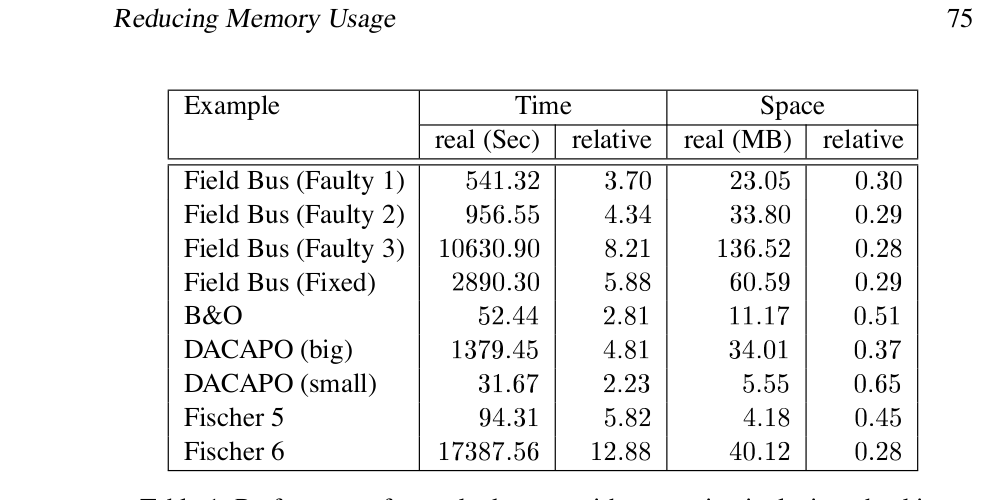
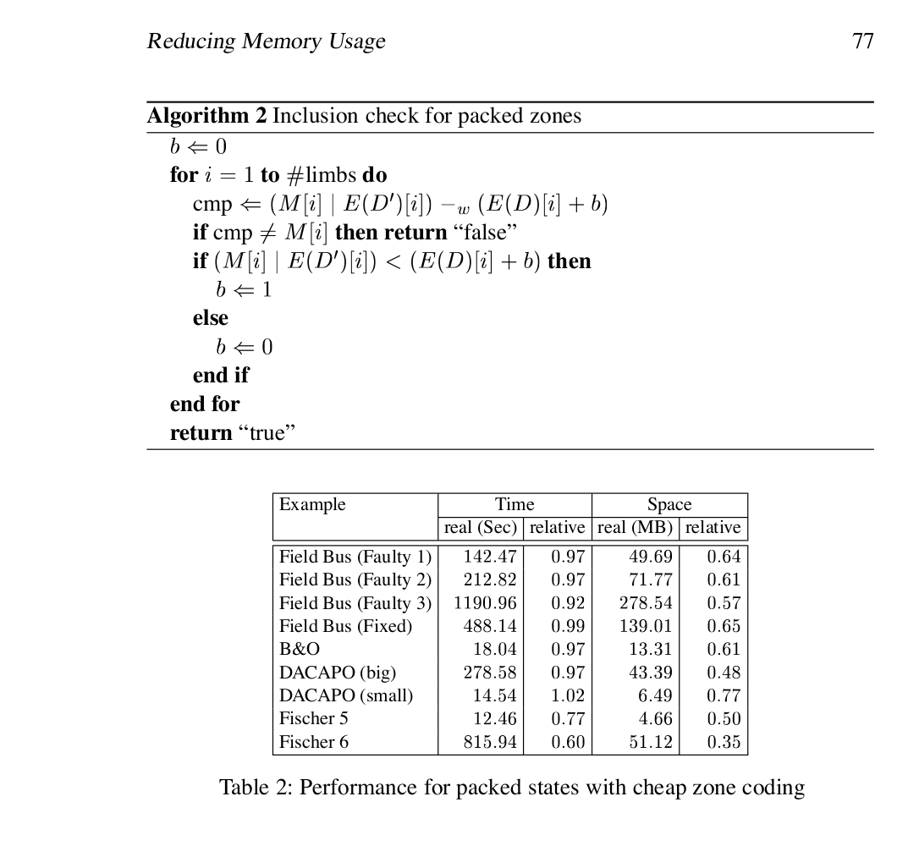
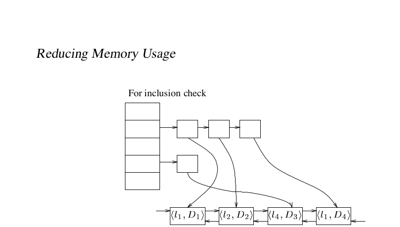
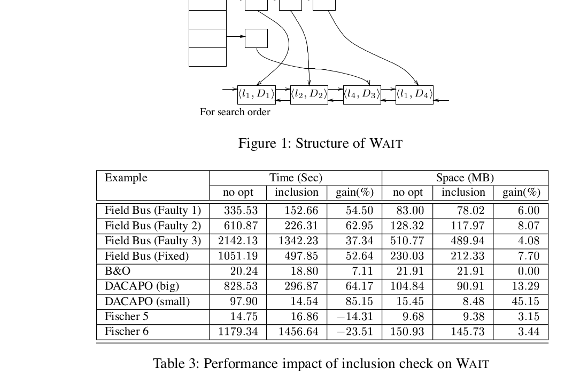
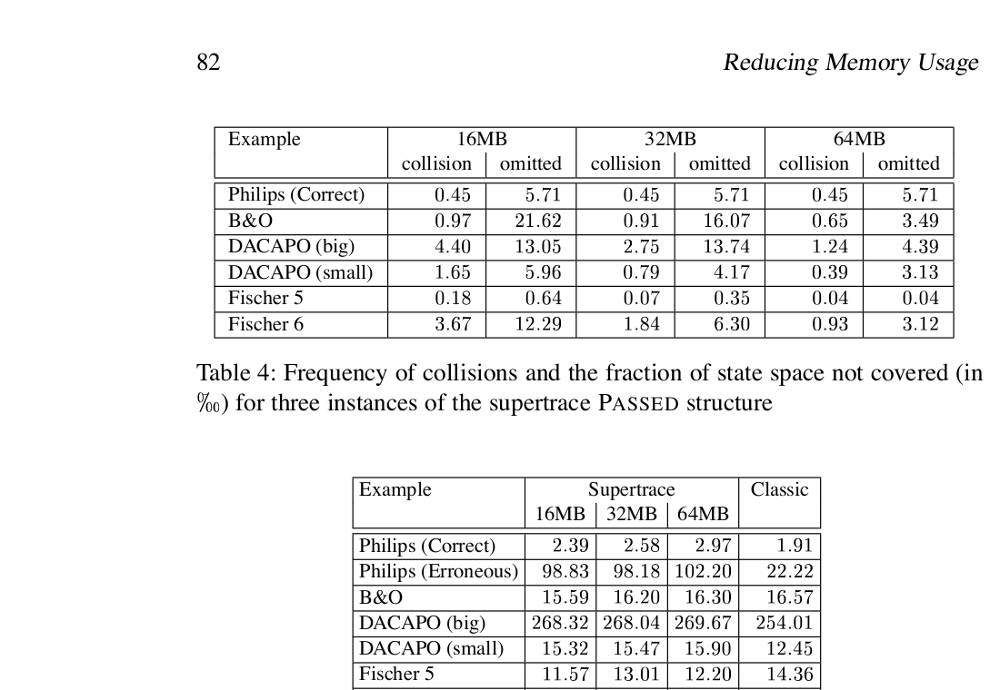
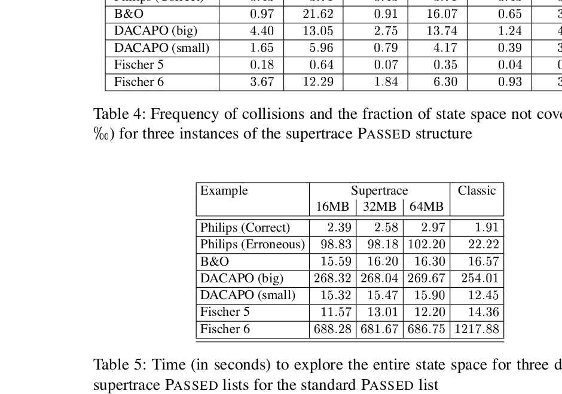
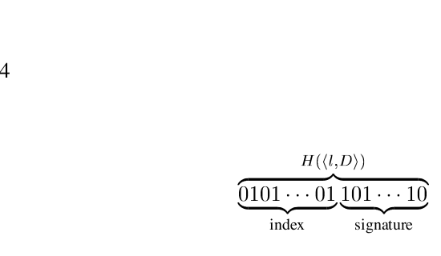
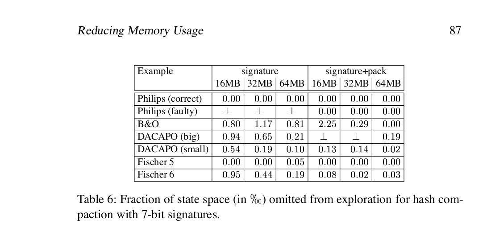
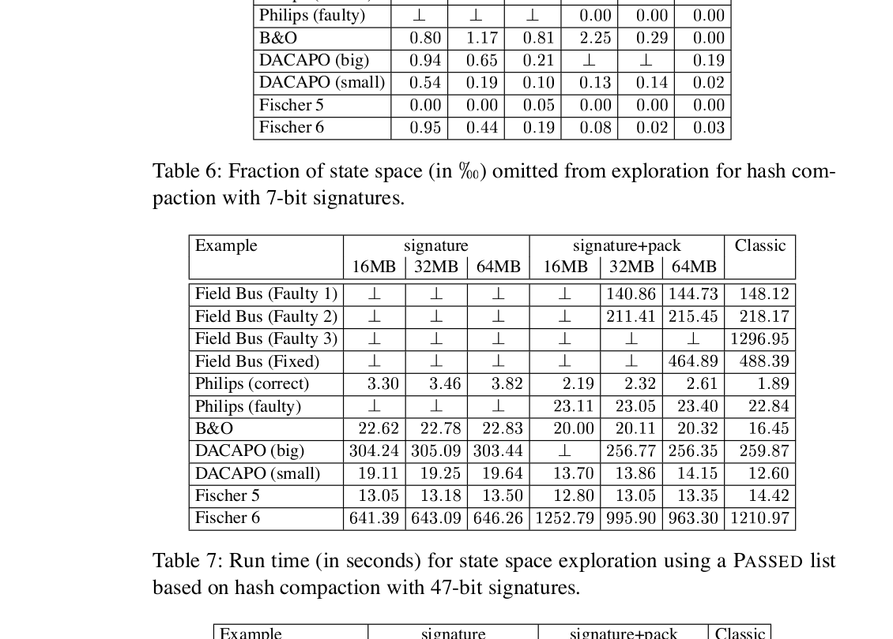
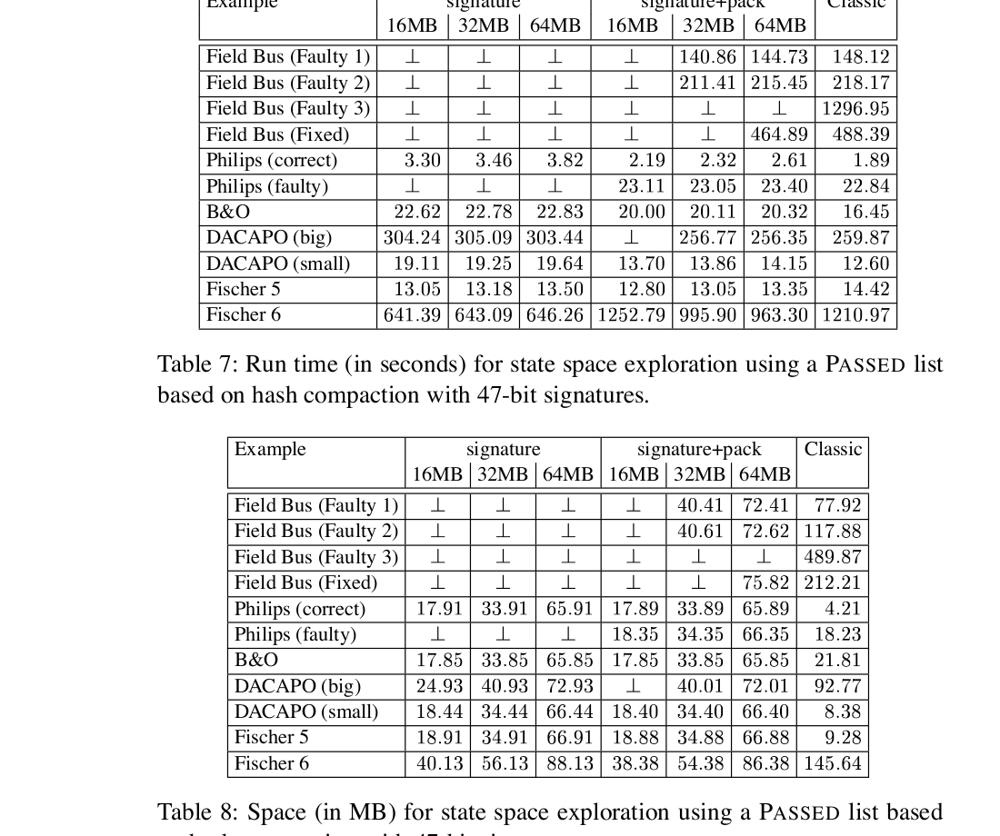

# Reducing Memory Usage in Symbolic State-Space Exploration for Timed Systems

Johan Bengtsson and Wang Yi

Department of Computer Systems, Uppsala University, Sweden  
Email: `{johanb,yi}@docs.uu.se`

> Note: the local `paper.pdf` is the extracted Paper C from the thesis *Clocks, DBMs and States in Timed Systems*. The Markdown below is a manually refined reading version aligned against that local PDF. Numbered figures and tables are kept as local assets, and tables are also transcribed in Markdown for direct reading on GitHub.

<!-- page: 69 -->

## Abstract

One of the major problems in scaling up model checking techniques to the size of industrial systems is memory consumption. This paper studies the problem in the context of verifiers for timed automata. We present a number of techniques that reduce the amount of memory used in symbolic reachability analysis. We address the memory consumption problem on two fronts. First, we reduce the size of internal representations for each symbolic state (clock constraints) by means of compression methods. Second, we reduce the explored state space (list of symbolic states) by early-inclusion checking between states and by probabilistic methods. These techniques have been implemented in the UPPAAL tool. Their strengths and weaknesses are evaluated and compared in experiments using real-life examples. Note that though these techniques are developed for timed systems, they are of general interests for verification tool development, in particular to handle large symbolic states based on constraint representation and manipulation.

## 1 Introduction

During the last ten years timed automata [AD90, AD94] have evolved as a common model to describe timed systems. This process has gone hand in hand with the development of verification tools for timed automata, such as Kronos [DOTY95, Yov97] and UPPAAL [LPY97, ABB+01]. One of the major problems in applying these tools to industrial-size systems is the large memory consumption (e.g. [BGK+96]) when exploring the state space of a network of timed automata. The reason is that the exploration not only suffers from the large number of states to be explored, but also from the large size of each state. In this paper we address both these problems.

We will present techniques to reduce memory usage for internal representations of symbolic states by means of compaction. We use two different methods for packing states. First, we code the entire state as one large number using a multiply-and-add algorithm. This method yields a representation that is canonical and minimal in terms of memory usage but the performance for inclusion checking between states is poor. The second method is mainly intended to be used for the timing part of the state and it is based on concatenation of bit strings. Using a special concatenation of the bit string representation of the constraints in a zone, ideas from [PS80] can be used to implement fast inclusion checking between packed zones.

<!-- page: 70 -->

Furthermore, we attack the problem with large state spaces in two different ways. First, to get rid of states that do not need to be explored, as early as possible, we introduce inclusion checking already in the data structure holding the states waiting to be explored. We also describe how this can be implemented without slowing down the verification process. Second, we investigate how supertrace [Hol91] and hash compaction [WL93, SD95] methods can be applied to timed systems. We also present a variant of the hash compaction method, that allows termination of branches in the search tree based on probable inclusion checking between states.

The rest of the paper is organised as follows: In section 2 we introduce timed automata and describe briefly how to check reachability properties for timed automata. In section 3 we present methods to represent the key objects used in checking timed automata, namely the symbolic states. We also give a comparison between them. Section 4 addresses issues on the whole state space of an automaton. We describe how the wait and past lists are handled efficiently. We also describe an approximation method of the past list that can be used when the complete state space of an automaton is too big to be stored in memory. Finally, section 5 wraps up the paper by summarising the most important results and suggests some directions for future work.

## 2 Preliminaries

In this section we briefly review background materials including timed automata and reachability analysis based on clock constraints. A more extensive description can be found in e.g. [AD94, Pet99].

Let $\Sigma$ be a finite set of labels, ranged over by $a, b$ etc. A timed automaton is a finite state automaton over alphabet $\Sigma$ extended with a set of real valued clocks, to model time dependent behaviour. Let $C$ denote a set of clocks, ranged over by $x, y, z$. Let $B(C)$ denote the set of conjunctions of atomic constraints of the form $x \sim n$ or $x - y \sim n$ for $x, y \in C$, $\sim \in \{\le, <, =, >, \ge\}$ and $n \in \mathbb{N}$. We use $g$ and later $D$ to range over this set.

<!-- page: 71 -->

**Definition 5 (Timed Automaton).** A timed automaton $A$ is a tuple $(N, l_0, \to, I)$ where $N$ is a set of control nodes, $l_0$ is the initial node, $\to \subseteq N \times B(C) \times \Sigma \times 2^C \times N$ is the set of edges and $I : N \to B(C)$ assign invariants to locations. As a convention we will use $l \xrightarrow{g,a,r} l'$ to denote $(l, g, a, r, l') \in \to$.

The clock values are formally represented as functions, called clock assignments, mapping $C$ to the non-negative reals $\mathbb{R}_+$. We let $u, v$ denote such functions, and use $u \models g$ to denote that the clock assignment $u$ satisfy the formula $g$. For $d \in \mathbb{R}_+$ we let $u + d$ denote the clock assignment that map all clocks $x$ in $C$ to the value $u(x) + d$, and for $r \subseteq C$ we let $[r \mapsto 0]u$ denote the clock assignment that map all clocks in $r$ to $0$ and agree with $u$ for all clocks in $C \setminus r$.

The semantics of a timed automaton is a timed transition-system where the states are pairs $\langle l, u \rangle$, with two types of transitions, corresponding to delay transitions and discrete action transitions respectively:

- $\langle l, u \rangle \xrightarrow{\epsilon(t)} \langle l, u + t \rangle$ if $u \in I(l)$ and $(u + t) \in I(l)$
- $\langle l, u \rangle \xrightarrow{a} \langle l', u' \rangle$ if $l \xrightarrow{g,a,r} l'$, $u \models g$, $u' = [r \mapsto 0]u$ and $u' \in I(l')$

It is easy to see that the state space is infinite and thus not a good base for algorithmic verification. However, efficient algorithms may be obtained using a symbolic semantics based on symbolic states of the form $\langle l, D \rangle$ [HNSY92, YPD94] where $l$ is the location vector of an automaton and $D \in B(C)$ is a clock constraint (zone) specifying the clock values. They are symbolic in the sense that the clock zone represents a set of concrete states of the automaton with the same control location vector. The symbolic counterpart of the transitions are given by:

- $\langle l, D \rangle \leadsto \langle l, D^\uparrow \wedge I(l) \rangle$
- $\langle l, D \rangle \leadsto \langle l', r(D \wedge g) \rangle$ if $l \xrightarrow{g,a,r} l'$

where

$$
D^\uparrow = \{u + d \mid u \in D \land d \in \mathbb{R}_+\}
\qquad\text{and}\qquad
r(D) = \{[r \mapsto 0]u \mid u \in D\}.
$$

It can be shown that the set of constraint systems is closed under these operations. Moreover the symbolic semantics correspond closely to the standard semantics in the sense that if $\langle l, D \rangle \leadsto \langle l', D' \rangle$ then, for all $u' \in D'$ there is $u \in D$ such that $\langle l, u \rangle \to \langle l', u' \rangle$.

Given a timed automaton with an initial symbolic state $\langle l_0, D_0 \rangle$ and a final symbolic state $\langle l_f, D_f \rangle$, $\langle l_f, D_f \rangle$ is said to be reachable if $\langle l_0, D_0 \rangle \leadsto^\ast \langle l_f, D_n \rangle$ and $D_f \cap D_n \neq \emptyset$ for some $D_n$.

<!-- page: 72 -->

The reachability problem can be solved using a standard reachability algorithm as shown in Algorithm 1 for graphs with a proper normalisation algorithm for clock constraints [Pet99, Rok93] (to guarantee termination).

The algorithm uses two important data structures: WAIT and PASSED. WAIT is a list of states waiting to be explored and PASSED is the set of states already explored. Due to the size of the state space, these structures may consume a considerable amount of main memory. The main objective of this paper is to present techniques to reduce the memory usage of these two structures.

**Algorithm 1. Symbolic reachability analysis**

```text
PASSED = ∅, WAIT = {<l0, D0>}
while WAIT ≠ ∅ do
  take <l, D> from WAIT
  if l = lf ∧ D ∩ Df ≠ ∅ then return "YES"
  if D ⊄ D' for all <l, D'> ∈ PASSED then
    add <l, D> to PASSED
    for all <l', D'> such that <l, D> \leadsto_k <l', D'> do
      add <l', D'> to WAIT
    end for
  end if
end while
return "NO"
```

The core of the above reachability algorithm is manipulation and representation of symbolic states. So symbolic states are the core objects of state space search, and one of the key issues in implementing an efficient model checker is how to represent them. The desired properties of the representation also differ in parts of the verifier, and there are potential gains in using different representations in different places.

The encoding of the location vector and the integer assignment is straight forward. For the location vector we number the locations in each process, to get a vector of location numbers. Representing the clock zone is a bit trickier but starting from the constraint system representation of a zone it is possible to obtain an efficient intermediate representation. We start with the following observation: Let $0$ be a dummy clock with the constant value $0$. Then for each constraint system $D \in B(C)$ there is a constraint system $D' \in B(C \cup \{0\})$ with the same solution set as $D$, and where all constraints are of the form $x - y < n$ or $x - y \le n$, for $x, y \in C \cup \{0\}$, $n \in \mathbb{Z}$.

<!-- page: 73 -->

We also note that to represent any clock zone we need at most $|C \cup \{0\}|^2$ atomic constraints. One of the most compact ways to represent this is to use a matrix where each element represent a bound on the difference between two clocks. Each element in the matrix is a pair $(n, \sim)$ where $n$ is an integer and $\sim$ tells whether the bound is strict or not. Such a matrix is called a *Difference Bounds Matrix*, or DBM for short. More detailed information about DBMs can be found in [Dil89].

## 3 Representing Symbolic States

Recall that symbolic states are pairs in the form $\langle l, D \rangle$ where $l$ is the location vector of an automaton represented as a vector of integers and $D$ is a clock constraint (zone), represented as a matrix of integers (DBM). Logically such a state is a vector of integers representing the control locations and clock bounds. In the following, we study how to represent the vectors physically in the main memory for efficient storage and manipulation.

### 3.1 Normal Representation

The simplest way to physically represent a symbolic state is to use a machine word for each control location, integer value or clock bound. The implementation is straight forward, but a practical tip is that if the standard library functions for memory management are used all the memory needed for one state should, if possible, be allocated in the same chunk, to minimise the allocation overhead.

The strength of this representation is its simplicity and the speed of accessing an individual control location, integer value, or clock bound. In this representation the maximum time needed to reach any individual entity is the time needed to fetch a word from the memory. This makes the representation ideal to use when we have to do operations on individual entities, e.g. when calculating the successors of a state. The weakness is the amount of wasted space. Here a whole machine word, typically 32-bit wide, is used to store entities where all possible values may fit in many fewer bits.

However this is a good base representation for states. It is ideal for states that will be modified in the near future, such as intermediate states or states in WAIT. It also works reasonably well for states in PASSED, specially for small and medium sized examples.

<!-- page: 74 -->

This representation is used for both WAIT and PASSED in the current version of UPPAAL.

### 3.2 Packed States

The second representation is on the opposite side of the spectrum compared to the previous one and it can be used for the discrete part of the state, for the clock zone and for both together. The encoding builds on a simple multiply and add scheme, similar to the position system for numbers, and it is very compact. In the description we will focus on encoding an entire symbolic state, but the parts can also be encoded separately.

First, consider the state as a vector $v_1, \ldots, v_n$, where each element represents a control location, the value of a variable, or a clock bound. For each element $v_i$ we can compute the number of possible values, $|v_i|$. For the location vector $|v_i|$ is the number of control locations in the corresponding process, for the integer assignment $|v_i|$ is the size of the domain of the corresponding variable and for the clock zone then $|v_i|$ can be computed using the maximum constants.

Now consider the vector as a number written down in a position system with a variable base, i.e. each element $v_i$ is a digit and the product $\prod_{j=0}^{i-1} |v_i|$ is its position value. Represent the state as the value of this number, i.e. encode the state as follows:

$$
E(\langle l, D \rangle) = \sum_{i=0}^{n} \left(v_i \cdot \prod_{j=0}^{i-1} |v_i|\right).
$$

Note that the representation of states using multiply-and-add encoding is canonical and minimal in terms of space usage. Note also that in this context $\langle l, D \rangle$ is a sequence of numbers. The encoding $E(\langle l, D \rangle)$ is a number. The resulted numbers are often too big to fit in a machine word and they have to be in fixed precision; thus we need some kind of arbitrary precision numbers for the encoding. In our prototype implementation we used the GMP package [Gra00].

The strength of this representation is the effective use of space and the weakness is that to access an individual integer value or clock bound a number of division and modulo operations must be performed. This results in small states that are expensive to handle.

<!-- page: 75 -->



*Table 1: Performance for packed states with expensive inclusion checking.*

For direct reading on GitHub, the table is also transcribed in Markdown:

| Example | Time real (Sec) | Time relative | Space real (MB) | Space relative |
| --- | ---: | ---: | ---: | ---: |
| Field Bus (Faulty 1) | 541.32 | 3.70 | 23.05 | 0.30 |
| Field Bus (Faulty 2) | 956.55 | 4.34 | 33.80 | 0.29 |
| Field Bus (Faulty 3) | 10630.90 | 8.21 | 136.52 | 0.28 |
| Field Bus (Fixed) | 2890.30 | 5.88 | 60.59 | 0.29 |
| B&O | 52.44 | 2.81 | 11.17 | 0.51 |
| DACAPO (big) | 1379.45 | 4.81 | 34.01 | 0.37 |
| DACAPO (small) | 31.67 | 2.23 | 5.55 | 0.65 |
| Fischer 5 | 94.31 | 5.82 | 4.18 | 0.45 |
| Fischer 6 | 17387.56 | 12.88 | 40.12 | 0.28 |

In order to test the performance of this representation, it is implemented in the PASSED structure in UPPAAL. The implementation is straight forward, however expensive division and modulo operations have to be used, in order to compare the DBMs bound by bound.

The result of the experiment is presented in Table 1 (as absolute figures and in relation to the current PASSED implementation in UPPAAL). We note that with this representation the space performance is very good, with reductions of up to 70% compared to the current PASSED implementation. However the time performance is poor, for one instance of Fischers protocol we notice a slowdown of almost 13 times and for one instance of the Field Bus protocol the slowdown is 8 times. The conclusion is that this representation should only be used in cases where main memory is a severe restriction.

### 3.3 Packed Zones with Cheap Inclusion Check

The main drawback of representing states using the number encoding given in section 3.2 is expensive inclusion checking. In this section we present a compact way of representing zones overcoming this drawback. The heart of this representation builds on an observation due to [PS80] that one subtraction can be used to perform multiple comparisons in parallel.

Let $m$ denote the minimum number of bits needed to store all possible values for one clock bound. The DBM is then encoded as a long bit string, where each bound is assigned a $m + 1$ bit wide slot. The value of the clock bound is put in the $m$ least significant bits in the slot and the extra, most significant bit, is used as a *test bit*.

<!-- page: 76 -->

Since a zone $D$ is included in another zone $D'$ if and only if each bound in the DBM representing $D$ is as tight as the same bound in the DBM representation of $D'$, inclusion checking is to check if all elements in one vector is less than or equal to the same bound in another vector. Using the new bit-string encoding of zones this can be checked using only simple operations like bitwise-and (`&`), bitwise-or (`|`), subtraction and test for equality.

Given two packed zones $E(D)$ and $E(D')$, to check if $D \subseteq D'$ first set all the test bits in $E(D)$ to zero and all the test bits in $E(D')$ to one. In an implementation the test bits are usually zero in the stored states and setting them to one is done using a prefabricated mask $M$. The test is then performed by calculating $E(D') - E(D)$. The result is read out of the test bits. If a test bit is one the corresponding bound in $D$ is at least as tight as in $D'$ and if a test bit is zero the corresponding bound is tighter in $D'$ than in $D$. Thus, if all test bits are one we can conclude that $D \subseteq D'$ and if all the test bits are zero $D \supseteq D'$. It is worth noting that "all test bits are one" is both necessary and sufficient to conclude $D \subseteq D'$ while "all test bits are zero" is only sufficient to conclude $D \supseteq D'$.

In an implementation of this scheme the main issue is how to handle the bit strings. The easiest way is to let a bignum package handle everything. However, this may give a considerable overhead, specially in connection with memory allocation, since the bignum packages are often tailored towards other types of applications. In UPPAAL we share the memory layout of the bignum packages, but to reduce the overhead we have implemented our own operations on top of it.

In the physical representation, i.e. how the bit-string is stored in memory, the bit-string is chopped up into machine-word sized chunks, or limbs. The limbs are then packed in big-endian order, i.e. the least significant limb first, in an array. If the bit string does not fill an even number of machine words the last limb is padded with zero bits.

Noting that the effect of all operations needed for the inclusion check, except subtraction, is local within the limb and that subtraction only passes one borrow bit to the next more significant limb, we can implement the inclusion check in one pass through the array of limbs instead of one pass for each operation. The one pass inclusion check is shown in Algorithm 2. In the description we use $E(D)[i]$ to denote the limb with index $i$ in $E(D)$ and $-_w$ to denote a binary subtraction of machine word size.

<!-- page: 77 -->

**Algorithm 2. Inclusion check for packed zones**

```text
b <- 0
for i = 1 to #limbs do
  cmp <- (M[i] | E(D')[i]) -_w (E(D)[i] + b)
  if cmp != M[i] then return "false"
  if (M[i] | E(D')[i]) < (E(D)[i] + b) then
    b <- 1
  else
    b <- 0
  end if
end for
return "true"
```



*Table 2: Performance for packed states with cheap zone coding.*

For direct reading on GitHub, the table is also transcribed in Markdown:

| Example | Time real (Sec) | Time relative | Space real (MB) | Space relative |
| --- | ---: | ---: | ---: | ---: |
| Field Bus (Faulty 1) | 142.47 | 0.97 | 49.69 | 0.64 |
| Field Bus (Faulty 2) | 212.82 | 0.97 | 71.77 | 0.61 |
| Field Bus (Faulty 3) | 1190.96 | 0.92 | 278.54 | 0.57 |
| Field Bus (Fixed) | 488.14 | 0.99 | 139.01 | 0.65 |
| B&O | 18.04 | 0.97 | 13.31 | 0.61 |
| DACAPO (big) | 278.58 | 0.97 | 43.39 | 0.48 |
| DACAPO (small) | 14.54 | 1.02 | 6.49 | 0.77 |
| Fischer 5 | 12.46 | 0.77 | 4.66 | 0.50 |
| Fischer 6 | 815.94 | 0.60 | 51.12 | 0.35 |

To evaluate the performance of this technique, it was implemented in the PASSED structure in UPPAAL. In the experiment the discrete part of each state is stored in PASSED using the compact representation from the previous section and the zone is stored using this technique. The results are presented in Table 2, both as absolute figures and compared to the standard state representation. We note that using this method the space usage is typically reduced by about 40%, without increased verification time. The verification time is actually reduced a little using this scheme, even though the number of operations is increased. The reason for this is most certainly that the number of memory operations are reduced by the smaller memory footprint of the states[^1].

<!-- page: 78 -->

## 4 Representing the Symbolic State-Space

The two key data structures in a model checker are, as mentioned before, WAIT, that keeps track of states not yet explored, and PASSED, that keeps track of states already visited. Both these data structures tend to be large, and how to represent them is an important issue for performance. In this section we describe how to implement WAIT and how to improve its performance by adding inclusion checking. We also describe a standard implementation of PASSED as well as an implementation where space is saved at the price of possibly inconclusive answers.

### 4.1 Representing WAIT

In its most simple form WAIT is implemented as a linked list. This is easy to implement and it is easy to control the search order by adding unexplored states at the end, for breadth first search, or adding states at the beginning, for depth first search.

An optimisation in terms of both time and space is to check whether a state already occurs in WAIT before adding it. For a verifier based on explicit states this will only give minor improvements, mainly by keeping down the length of WAIT, but for a verifier based on symbolic states this may actually prevent revisiting parts of the state space.

We know, e.g. from [Pet99], that if $\langle l, D \rangle \subseteq \langle l, D' \rangle$ then all states reachable from $\langle l, D \rangle$ are also reachable from $\langle l, D' \rangle$ and thus we only have to explore $\langle l, D' \rangle$. So before adding a new state $\langle l, D \rangle$ to WAIT we check all states already in WAIT. If we find any state including $\langle l, D \rangle$ we stop searching and throw away $\langle l, D \rangle$ since all states reachable from it are also reachable from a state already scheduled for exploration. If no such state is found we add $\langle l, D \rangle$ to WAIT. During the search through WAIT we also delete all states included in $\langle l, D \rangle$ in order to prevent revisiting parts of the state space.

There are some implementation issues that need consideration. The main issue is how to find all states in WAIT with same discrete part. The simplest way to do this is to do a linear search through WAIT every time a state is added. However, using this solution it will be expensive to add states, even for examples where WAIT is short. One solution to this is to implement WAIT using a structure where searching is cheap, e.g. a hash table. The problem with this solution is that picking up states from WAIT will be expensive, at least for search strategies like breadth first and depth first, where the exploration order depends on the order in which the states were added to WAIT.

<!-- page: 79 -->



*Figure 1: Structure of WAIT.*



*Table 3: Performance impact of inclusion check on WAIT.*

For direct reading on GitHub, the table is also transcribed in Markdown:

| Example | Time no opt | Time inclusion | Time gain(%) | Space no opt (MB) | Space inclusion (MB) | Space gain(%) |
| --- | ---: | ---: | ---: | ---: | ---: | ---: |
| Field Bus (Faulty 1) | 335.53 | 152.66 | 54.50 | 83.00 | 78.02 | 6.00 |
| Field Bus (Faulty 2) | 610.87 | 226.31 | 62.95 | 128.32 | 117.97 | 8.07 |
| Field Bus (Faulty 3) | 2142.13 | 1342.23 | 37.34 | 510.77 | 489.94 | 4.08 |
| Field Bus (Fixed) | 1051.19 | 497.85 | 52.64 | 230.03 | 212.33 | 7.70 |
| B&O | 20.24 | 18.80 | 7.11 | 21.91 | 21.91 | 0.00 |
| DACAPO (big) | 828.53 | 296.87 | 64.17 | 104.84 | 90.91 | 13.29 |
| DACAPO (small) | 97.90 | 14.54 | 85.15 | 15.45 | 8.48 | 45.15 |
| Fischer 5 | 14.75 | 16.86 | -14.31 | 9.68 | 9.38 | 3.15 |
| Fischer 6 | 1179.34 | 1456.64 | -23.51 | 150.93 | 145.73 | 3.44 |

In the implemented solution, each state in WAIT is indexed using both a list and a hash table. The list part is used to keep the depth or breadth first ordering of states and to make it cheap to pick up states to explore. The hash table part is used to index the states in WAIT based on their location vector, in order to speed up inclusion checking. A picture of this structure is shown in Figure 1.

To test the performance of this solution we compared the space and time needed to explore the state space of nine examples, for one version of UPPAAL without inclusion checking on WAIT and one version with the combined scheme. The result is shown in Table 3. It is worth noting that the version with inclusion checking is both significantly faster and less memory consuming than the version without inclusion checking, for all examples except Fischers protocol which is, as mentioned in the appendix, not typical.

<!-- page: 80 -->

### 4.2 Representing PASSED

The key feature needed by a representation of PASSED is that searching should be cheap. For a symbolic verifier it is also crucial, at least performance wise, that finding states which includes a given state is possible and cheap. In UPPAAL the standard PASSED is implemented as a hash table, where the key is computed from the discrete part of the state and collisions are handled by chaining. The reason for basing the hash key only on the discrete part is to simplify checking for inclusion between states by making all related states end up in the same hash bucket. It is easy to see that hashing only on the discrete part is as good as we can do if we want this property. The reason for using chaining instead of open addressing to resolve conflicts is, apart from keeping related states together, mainly simplicity and eliminating the need for expensive rehashing. Judging by performance the choice could go either way, at least if rehashing is not taken into account. More about this can be read in [Lar00].

For some models the memory needed for exact verification may exceed the amount of memory installed in the system where the verification takes place. This often occurs within the modelling phase before most bugs are removed from the model. During this phase the verification engine is often used as a tool to find the cause of unwanted behaviour and not primarily to prove the absence of such behaviour. Under these premises it is desirable to use a method that can handle larger systems but sometimes miss unwanted behaviour. Here we will describe two such methods. The first method is an application of the supertrace algorithm from [Hol91] on networks of timed automata. The second method is based on the hash compaction method from [WL93, SD95].

### 4.3 Supertrace PASSED for Timed Automata

The main idea behind supertrace PASSED is from the following observation: The purpose of PASSED is only to keep track of whether a state have been visited or not, i.e. for each state we only need one bit of information. Thus, PASSED for a system of $n$ states can be implemented as an $n$-bit wide bit vector. However, if $n$ is sufficiently large, even such a compact representation will be too large to fit the memory of the system running the verifier. A way to tackle this problem is to loosen the demand that the verification should be exact and allow false hits to be indicated, i.e. a previously unvisited state may, with some probability, be reported as already visited. Such a false hit will be called an omission, as it causes a part of the state space to be omitted from the state space search. This affects the reachability search such that if a state is reported to be not reachable we can not conclude that it can not be reached since it might have been excluded by an omission.

<!-- page: 81 -->

The natural way to implement such a PASSED structure is to allocate a bit-vector of size $k$, where $k < n$, and hash each state to a value in $\{1, \ldots, k\}$. In the UPPAAL implementation of the supertrace algorithm the hash function is similar to the first packing technique described in Section 3:

$$
H(\langle l, D \rangle) = \left(v_0 + \sum_{i=1}^{n} \left(v_i \cdot \prod_{j=0}^{i-1} |v_i|\right)\right) \mod k
$$

Note that a variation of this hash function (applied only to the location vector and the integer assignment) is used in both the normal PASSED implementation and the cross-reference table of the WAIT list. It is also possible to enhance the supertrace algorithm by implementing a way to change the hash function between runs, in order to lower the probability that a part of the state space is omitted. A simple way to do this is to implement a generator of universal hash functions [CW79] and provide the user with a way to choose among the functions in the class.

The main drawback of the supertrace algorithm, when applied to timed automata, is that inclusion between time zones can not be detected. The effect of this is that the number of explored states increases. This leads to longer verification times and more states to enter in PASSED, with an increased omission probability as result.

To investigate the performance of this algorithm we have implemented it in UPPAAL. In the experiment we test the supertrace PASSED structure for three different sizes: 16MB, 32MB and 64MB and compare it to the standard PASSED implementation of UPPAAL, to estimate the impact of collisions. The results of the experiment are presented in Table 4. For each of the examples the table shows the collision frequency and an estimation on the fraction of the state space not covered due to collisions.

In the table there are several interesting observations. First, for the Philips example the coverage is totally independent of the size of the PASSED structure. We get exactly the same collision frequency and coverage for all three runs. This is an indication that the hash function is far from optimal on this example.

<!-- page: 82 -->



*Table 4: Frequency of collisions and the fraction of state space not covered (in per mille) for three instances of the supertrace PASSED structure.*

For direct reading on GitHub, the table is also transcribed in Markdown:

| Example | 16MB collision | 16MB omitted | 32MB collision | 32MB omitted | 64MB collision | 64MB omitted |
| --- | ---: | ---: | ---: | ---: | ---: | ---: |
| Philips (Correct) | 0.45 | 5.71 | 0.45 | 5.71 | 0.45 | 5.71 |
| B&O | 0.97 | 21.62 | 0.91 | 16.07 | 0.65 | 3.49 |
| DACAPO (big) | 4.40 | 13.05 | 2.75 | 13.74 | 1.24 | 4.39 |
| DACAPO (small) | 1.65 | 5.96 | 0.79 | 4.17 | 0.39 | 3.13 |
| Fischer 5 | 0.18 | 0.64 | 0.07 | 0.35 | 0.04 | 0.04 |
| Fischer 6 | 3.67 | 12.29 | 1.84 | 6.30 | 0.93 | 3.12 |



*Table 5: Time (in seconds) to explore the entire state space for three different supertrace PASSED lists for the standard PASSED list.*

For direct reading on GitHub, the table is also transcribed in Markdown:

| Example | Supertrace 16MB | Supertrace 32MB | Supertrace 64MB | Classic |
| --- | ---: | ---: | ---: | ---: |
| Philips (Correct) | 2.39 | 2.58 | 2.97 | 1.91 |
| Philips (Erroneous) | 98.83 | 98.18 | 102.20 | 22.22 |
| B&O | 15.59 | 16.20 | 16.30 | 16.57 |
| DACAPO (big) | 268.32 | 268.04 | 269.67 | 254.01 |
| DACAPO (small) | 15.32 | 15.47 | 15.90 | 12.45 |
| Fischer 5 | 11.57 | 13.01 | 12.20 | 14.36 |
| Fischer 6 | 688.28 | 681.67 | 686.75 | 1217.88 |

We also note, when studying the big DACAPO example, that even though the collision frequency is decreased the fraction of the state space not covered in the search may increase. The reason for this may be that the collisions occur for different states in the different runs and that the number of children for these states differ. (If a state with many children is omitted the coverage will be less than if a state with few children is omitted.)

To see how the supertrace algorithm behaves time-wise we made an experiment where the verification time was measured and compared to the standard PASSED implementation in UPPAAL. The setting of this experiment is a little different from the previous one. For this example we used inclusion checking on WAIT, to speed up verification. This is the most likely setting when using the tool in practice. The result of this experiment is presented in Table 5. As we see in the table the times for the supertrace is in the same order of magnitude as the standard PASSED implementation.

<!-- page: 83 -->

### 4.4 Hash Compaction for Timed Automata

Hash compaction evolved from the supertrace ideas as a way to lower the probability of omissions in the verification process. It was first investigated in [WL93] and then further developed in [SD95].

The key observation for hash compaction is that the supertrace PASSED list can be seen as a representation of a set of hash values, where a set bit (1) in the table represents that this hash value is in the set; while an unset bit (0) in the table represent that it is not. Under the assumption that the set is sparse, i.e. the number of elements in the set is small compared to the number of elements not in it, a table of the elements might be a more compact representation of the set. With this solution the number of possible hash values is no longer bounded by the number of bits in the main memory.

In the work presented in [WL93] a normal hash table is used to store the elements and the key into this table is computed from the elements themselves. In [SD95] the technique is developed further. As a way to decrease the probability of false collisions the key into the table is computed from the state itself, instead of from the hash signature, using a different hash function. Since the hash signature and its entry in the table are computed using different hash functions two states have to collide in both the hash functions for a false collision to occur.

There is an alternative way to view this second variation of hash compaction. Start with the supertrace PASSED list. To lower the probability of classifying an unvisited state as already visited we increase the number of bits in each entry of the hash table. (Given a fixed amount of memory this is done at the expense of the number of entries in the table.) To separate different states that end up at the same position in table we build a signature, e.g. a checksum, of the states and store this. To compute the checksum we choose a function with a low probability that two different states have the same signature, i.e.

$$
P\bigl(H(\langle l_1, D_1 \rangle) = H(\langle l_2, D_2 \rangle) \mid \langle l_1, D_1 \rangle \neq \langle l_2, D_2 \rangle\bigr)
$$

should be as small as possible. For this we use a hash function. If we take this one step further the combination of the signature and the index into the hash table can be seen as different parts of the same hash value. Some bits of this value are used to index into the hash table and some bits are stored in the table. A sketch of this is shown in Figure 2.

<!-- page: 84 -->



*Figure 2: The table index and the signature as one hash value.*

Given a fixed amount of memory there is a tradeoff where to put the border between the index part and the signature part. For each bit we take away from the index part we may double the number of bits in the signature, but at the price of less entries in PASSED.

So far we have not mentioned how to handle collisions within the hash table. Since there are now several possible values for the entries in the hash table, it is possible to get collisions in the hash table. Since the main priority of this solution is space, collisions are resolved using open addressing instead of chaining. This will save one pointer for each state entered into PASSED, and since the signatures are, more or less, as big as a pointer we may fit twice as many states in the same amount of memory with open addressing than with chaining. The price we pay for this choice is that the hash table might get full. Normally this would only lead to an expensive rehashing but in our case the information needed to rehash an entry in the hash table is no longer available. This leaves us with two choices, we can either stop the verification and say that PASSED is full and advice the user to try with a larger PASSED, or we can just skip adding the state to PASSED and hope that the search will terminate anyway. In the prototype implementation we have chosen the first alternative.

To evaluate hash compaction for timed automata, we used two slightly different PASSED implementations. The difference between them lies in what we store in the hash table. In the first implementation we store signatures of entire symbolic states. This solution gives a very compact representation of each state in PASSED, but it has the drawback that inclusion between states in PASSED can not be detected. This leads to potentially larger state spaces resulting in a higher pressure on the PASSED structure.

In the second PASSED implementation we try to get around this problem by separating the discrete part and the clock zone. In this implementation we apply the hash function only to the discrete part of the state. The clock zone is compressed using the method from Section 3.3 and stored in the hash table together with the signature. With this solution we aim at minimising the number of states stored in PASSED. However, storing the full zone has a big drawback. The entries in PASSED are much bigger than for the other type. For a fixed memory-size this will give less entries in PASSED. A way around this would be to compress the zones further using a method that, with some probability, might report false inclusions. However this has not been investigated in this paper.

<!-- page: 85 -->

As an introductory experiment all the examples are run with 47-bit signatures[^2] for three different sizes of the hash table (16MB, 32MB and 64MB), and an estimate of the covered part of the state space is computed. In order to prevent interference from the inclusion check on WAIT, this feature is turned off. In this experiment we experienced no omissions, but for some examples the verification procedure did not terminate correctly.

The faulty Philips example can not be handled at all by PASSED implementation based only on signatures; while it can be handled by the combined scheme when the size of the passed list is at least 32MB. The reason is that large parts of the state space of this example is revisited since the first PASSED implementation only can detect equal states and not inclusion between states. In contrast to this example, the large instance of the DACAPO example terminates for all sizes using the first PASSED implementation, while it fails to do so for 16MB and 32MB using the second. This is because, for each state, the zone information is an order of magnitude larger than the size of the hash signature. This, in combination with the fact that (for this example) the number of explored states are almost the same in both variations, lead to that 16MB is large enough using signatures only while 64MB is needed for the combined scheme.

To study what the impact of the signature length on the fraction of the state space that is omitted from exploration we perform an experiment with 7-bit signatures[^3]. The result of this experiment can be seen in Table 6. As we see in the table there are still problem instances where no omissions occur. We also note that where omissions occur, in all cases except one, less than one per mille of the state space is omitted from exploration.

As a final experiment we measure the run time and memory use for state space exploration with a PASSED structure based on hash compaction with 47-bit signatures and compare it to the run time for state space exploration using the classic PASSED implementation in UPPAAL. To get as close as possible to a normal use situation, inclusion checking for WAIT is enabled in this experiment. The measured run times are listed in Table 7. We note from the table that the combined scheme is somewhat slower than the classic PASSED implementation (for all examples except Fischers protocol). This is partly due to the extra work needed to compute the signatures and partly due to that the hash compaction implementation within UPPAAL is a prototype.

The measured memory use for the different examples is listed in Table 8. From this table we note that for the large examples, i.e. Field Bus, the large DACAPO instance and Fischer 6, there are significant memory usage reductions. We also note that for some of the smaller examples the classic PASSED implementation use less memory than the hash compaction. This suggests that the chosen size of the hash compaction is too large, and that these examples can be verified using much smaller PASSED. A further observation is that the measured numbers for hash compaction are larger than the requested size for PASSED. The reason for this is that the listed values are the total memory used in the verification, i.e. the numbers also include WAIT, temporary storage and the binary code. In a real application, this should be taken into account when deciding how much memory to reserve for PASSED.

<!-- page: 86 -->

## 5 Conclusions

This paper describes and evaluates three different ways to physically represent symbolic states in PASSED, in implementing verifiers for timed automata. The evaluation shows that if space consumption is a main issue rather than time consumption then the multiply-and-add scheme can be used. For the evaluated examples this optimisation reduces the memory usage by up to 70% compared to the current representation used in UPPAAL, at the price of 3-13 times slowdown due to expensive inclusion checking between states. In all other cases the state should be represented using a mixed representation where the discrete part is represented using the multiply-and-add scheme and the zone is represented by concatenated bit strings separated by test bits. This packing scheme reduces the memory usage with 35%-65% compared to the current version of UPPAAL. In most cases this representation also gives a minor speedup (1%-3%) compared to the current UPPAAL implementation.

Further the paper describes how to improve performance by checking for already visited states not only on PASSED, but also on WAIT. For the evaluated examples this optimisation reduces the verification time by up to 85% and the memory usage with up to 45%.

<!-- page: 87 -->



*Table 6: Fraction of state space (in per mille) omitted from exploration for hash compaction with 7-bit signatures.*

For direct reading on GitHub, the table is also transcribed in Markdown:

| Example | signature 16MB | signature 32MB | signature 64MB | signature+pack 16MB | signature+pack 32MB | signature+pack 64MB |
| --- | ---: | ---: | ---: | ---: | ---: | ---: |
| Philips (correct) | 0.00 | 0.00 | 0.00 | 0.00 | 0.00 | 0.00 |
| Philips (faulty) | $\bot$ | $\bot$ | $\bot$ | 0.00 | 0.00 | 0.00 |
| B&O | 0.80 | 1.17 | 0.81 | 2.25 | 0.29 | 0.00 |
| DACAPO (big) | 0.94 | 0.65 | 0.21 | $\bot$ | $\bot$ | 0.19 |
| DACAPO (small) | 0.54 | 0.19 | 0.10 | 0.13 | 0.14 | 0.02 |
| Fischer 5 | 0.00 | 0.00 | 0.05 | 0.00 | 0.00 | 0.00 |
| Fischer 6 | 0.95 | 0.44 | 0.19 | 0.08 | 0.02 | 0.03 |



*Table 7: Run time (in seconds) for state space exploration using a PASSED list based on hash compaction with 47-bit signatures.*

For direct reading on GitHub, the table is also transcribed in Markdown:

| Example | signature 16MB | signature 32MB | signature 64MB | signature+pack 16MB | signature+pack 32MB | signature+pack 64MB | Classic |
| --- | ---: | ---: | ---: | ---: | ---: | ---: | ---: |
| Field Bus (Faulty 1) | $\bot$ | $\bot$ | $\bot$ | $\bot$ | 140.86 | 144.73 | 148.12 |
| Field Bus (Faulty 2) | $\bot$ | $\bot$ | $\bot$ | $\bot$ | 211.41 | 215.45 | 218.17 |
| Field Bus (Faulty 3) | $\bot$ | $\bot$ | $\bot$ | $\bot$ | $\bot$ | $\bot$ | 1296.95 |
| Field Bus (Fixed) | $\bot$ | $\bot$ | $\bot$ | $\bot$ | $\bot$ | 464.89 | 488.39 |
| Philips (correct) | 3.30 | 3.46 | 3.82 | 2.19 | 2.32 | 2.61 | 1.89 |
| Philips (faulty) | $\bot$ | $\bot$ | $\bot$ | 23.11 | 23.05 | 23.40 | 22.84 |
| B&O | 22.62 | 22.78 | 22.83 | 20.00 | 20.11 | 20.32 | 16.45 |
| DACAPO (big) | 304.24 | 305.09 | 303.44 | $\bot$ | 256.77 | 256.35 | 259.87 |
| DACAPO (small) | 19.11 | 19.25 | 19.64 | 13.70 | 13.86 | 14.15 | 12.60 |
| Fischer 5 | 13.05 | 13.18 | 13.50 | 12.80 | 13.05 | 13.35 | 14.42 |
| Fischer 6 | 641.39 | 643.09 | 646.26 | 1252.79 | 995.90 | 963.30 | 1210.97 |



*Table 8: Space (in MB) for state space exploration using a PASSED list based on hash compaction with 47-bit signatures.*

For direct reading on GitHub, the table is also transcribed in Markdown:

| Example | signature 16MB | signature 32MB | signature 64MB | signature+pack 16MB | signature+pack 32MB | signature+pack 64MB | Classic |
| --- | ---: | ---: | ---: | ---: | ---: | ---: | ---: |
| Field Bus (Faulty 1) | $\bot$ | $\bot$ | $\bot$ | $\bot$ | 40.41 | 72.41 | 77.92 |
| Field Bus (Faulty 2) | $\bot$ | $\bot$ | $\bot$ | $\bot$ | 40.61 | 72.62 | 117.88 |
| Field Bus (Faulty 3) | $\bot$ | $\bot$ | $\bot$ | $\bot$ | $\bot$ | $\bot$ | 489.87 |
| Field Bus (Fixed) | $\bot$ | $\bot$ | $\bot$ | $\bot$ | $\bot$ | 75.82 | 212.21 |
| Philips (correct) | 17.91 | 33.91 | 65.91 | 17.89 | 33.89 | 65.89 | 4.21 |
| Philips (faulty) | $\bot$ | $\bot$ | $\bot$ | 18.35 | 34.35 | 66.35 | 18.23 |
| B&O | 17.85 | 33.85 | 65.85 | 17.85 | 33.85 | 65.85 | 21.81 |
| DACAPO (big) | 24.93 | 40.93 | 72.93 | $\bot$ | 40.01 | 72.01 | 92.77 |
| DACAPO (small) | 18.44 | 34.44 | 66.44 | 18.40 | 34.40 | 66.40 | 8.38 |
| Fischer 5 | 18.91 | 34.91 | 66.91 | 18.88 | 34.88 | 66.88 | 9.28 |
| Fischer 6 | 40.13 | 56.13 | 88.13 | 38.38 | 54.38 | 86.38 | 145.64 |

Finally we study PASSED representations based on supertrace and hash compaction effect the performance of UPPAAL. The gain from this technique is significantly reduced memory usage for large examples, but at the price of possibly omitting parts of the state space from exploration. For the evaluated examples a supertrace PASSED cause between 22 per mille and 0.04 per mille of the state space to be omitted from the exploration. The evaluation show also that supertrace PASSED representations only work for examples where the number of revisited states (that cannot be detected without inclusion checking) is small.

For hash compaction we evaluate two, slightly different, methods. One method where a hash key, signature and probe sequence is computed using both the discrete part of the states and the time zone, and one method where the hash key, signature and probe sequence is computed only from the discrete part of the states while the time zone is compressed and stored together with the signature. The evaluation shows that in terms of coverage both these methods outperform the supertrace method. For 47-bit signatures there are no omissions at all (in the evaluated examples) and for 7-bit signatures the number of omissions are less than one tenth of the number of omissions in the supertrace PASSED representation.

A future extension of this part of the work is to investigate how the size of timing region can be reduced while still maintaining the possibility of inclusion checking between states.

<!-- page: 88-90 -->

## References

- `[ABB+01]` Tobias Amnell, Gerd Behrmann, Johan Bengtsson, Pedro R. D'Argenio, Alexandre David, Ansgar Fehnker, Thomas Hune, Bertrand Jeannet, Kim G. Larsen, M. Oliver Moller, Paul Pettersson, Carsten Weise, and Wang Yi. *UPPAAL - Now, Next, and Future.* In *Modelling and Verification of Parallel Processes*, number 2067 in *Lecture Notes in Computer Science*, pages 100-125. Springer-Verlag, 2001.
- `[AD90]` Rajeev Alur and David L. Dill. *Automata for modeling real-time systems.* In *Proceedings, Seventeenth International Colloquium on Automata, Languages and Programming*, volume 443 of *Lecture Notes in Computer Science*, pages 322-335. Springer-Verlag, 1990.
- `[AD94]` Rajeev Alur and David L. Dill. *A theory of timed automata.* *Journal of Theoretical Computer Science*, 126(2):183-235, 1994.
- `[BGK+96]` Johan Bengtsson, W. O. David Griffioen, Kare J. Kristoffersen, Kim G. Larsen, Fredrik Larsson, Paul Petterson, and Wang Yi. *Verification of an audio protocol with bus collision using UPPAAL.* In *Proceedings, Eighth International Conference on Computer Aided Verification*, volume 1102 of *Lecture Notes in Computer Science*. Springer-Verlag, 1996.
- `[CW79]` J. Lawrence Carter and Mark N. Wegman. *Universal classes of hash functions.* *Journal of Computer and System Sciences*, 18(2):143-154, 1979.
- `[Dil89]` David L. Dill. *Timing assumptions and verification of finite-state concurrent systems.* In *Proceedings, Automatic Verification Methods for Finite State Systems*, volume 407 of *Lecture Notes in Computer Science*, pages 197-212. Springer-Verlag, 1989.
- `[DOTY95]` Conrado Daws, Alfredo Olivero, Stavros Tripakis, and Sergio Yovine. *The tool kronos.* In *Proceedings, Hybrid Systems III: Verification and Control*, volume 1066 of *Lecture Notes in Computer Science*. Springer-Verlag, 1995.
- `[DY00]` Alexandre David and Wang Yi. *Modelling and analysis of a commercial field bus protocol.* In *Proceedings, Twelfth Euromicro Conference on Real Time Systems*, pages 165-174. IEEE Computer Society Press, 2000.
- `[Gra00]` Torbjorn Granlund. *The GNU Multiple Precision Arithmetic Library*, 3.0.1 edition, 2000.
- `[HNSY92]` Thomas A. Henzinger, Xavier Nicollin, Joseph Sifakis, and Sergio Yovine. *Symbolic model checking for real-time systems.* In *Proceedings, Seventh Annual IEEE Symposium on Logic in Computer Science*, pages 394-406, 1992.
- `[Hol91]` Gerard J. Holzmann. *Design and Validation of Computer Protocols.* Prentice-Hall, 1991.
- `[HSLL97]` Klaus Havelund, Arne Skou, Kim G. Larsen, and Kristian Lund. *Formal modelling and analysis of an audio/video protocol: An industrial case study using uppaal.* In *Proceedings, 18th IEEE Real-Time Systems Symposium*, pages 2-13. IEEE Computer Society Press, 1997.
- `[Lam87]` Leslie Lamport. *A fast mutual exclusion algorithm.* *ACM Transactions on Computer Systems*, 5(1):1-11, 1987.
- `[Lar00]` Fredrik Larsson. *Efficient implementation of model-checkers for networks of timed automata.* Licentiate Thesis 2000-003, Department of Information Technology, Uppsala University, 2000.
- `[LP97]` Henrik Lonn and Paul Pettersson. *Formal verification of a tdma protocol startup mechanism.* In *Proceedings of 1997 IEEE Pacific Rim International Symposium on Fault-Tolerant Systems*, pages 235-242. IEEE Computer Society Press, 1997.
- `[LPY97]` Kim G. Larsen, Paul Petterson, and Wang Yi. *Uppaal in a nutshell.* *Journal on Software Tools for Technology Transfer*, 1997.
- `[Pet99]` Paul Pettersson. *Modelling and Verification of Real-Time Systems Using Timed Automata: Theory and Practice.* PhD thesis, Uppsala University, 1999.
- `[PS80]` Wolfgang J. Paul and Janos Simon. *Decision trees and random access machines.* In *Logic and Algorithmic*, volume 30 of *Monographie de L'Enseignement Mathematique*, pages 331-340. L'Enseignement Mathematique, Universite de Geneve, 1980.
- `[Rok93]` Tomas Gerhard Rokicki. *Representing and Modeling Digital Circuits.* PhD thesis, Stanford University, 1993.
- `[SD95]` Ulrich Stern and David L. Dill. *Improved probabilistic verification by hash compaction.* In *Correct Hardware Design and Verification Methods: IFIP WG10.5 Advanced Research Working Conference Proceedings*, 1995.
- `[WL93]` Pierre Wolper and Dennis Leroy. *Reliable hashing without collision detection.* In *Proceedings, Fifth International Conference on Computer Aided Verification*, volume 697 of *Lecture Notes in Computer Science*, pages 59-70. Springer-Verlag, 1993.
- `[Yov97]` Sergio Yovine. *Kronos: A verification tool for real-time systems.* *Journal on Software Tools for Technology Transfer*, 1, October 1997.
- `[YPD94]` Wang Yi, Paul Petterson, and Mats Daniels. *Automatic verification of real-time communicating systems by constraint-solving.* In *Proceedings, Seventh International Conference on Formal Description Techniques*, pages 223-238, 1994.

<!-- page: 91 -->

## Appendix A Examples and Experiment Environment

The experiments are run on a Sun Ultra Enterprise 450 with four[^4] 400MHz CPUs and 4GB of main memory. The operating system on the machine was Solaris 7.

All the ideas have been implemented on top of the current development version of UPPAAL (3.1.26), and to measure the performance we used five different applications: Field Bus, B&O, DACAPO, Philips and Fischer. During all the experiments the memory limit for the run is set to 1GB which is at least twice the amount of memory needed for UPPAAL 3.1.26 to check any of the examples, using the standard representation of states. If any run exceeds this limit the run is marked as unsuccessful ($\bot$).

The Field Bus application is a model of the data link layer of a commercial field bus protocol. The protocol and the models we use (three erroneous and one corrected version) are described in [DY00].

B&O is a highly time-sensitive protocol developed by Bang & Olufsen to transmit control messages between audio/video components. The model used in the experiments is described in [HSLL97].

DACAPO is a model of the start-up algorithm of the so-called DACAPO protocol. The DACAPO protocol is TDMA (time division multiple access) based and intended for local area networks inside modern vehicles. For a more thorough description of this application, see [LP97]. In these experiments we use two different models: a small one with three stations and drifting clocks, and larger one with four stations and perfect clocks.

The Philips example is a model of the physical layer of a protocol used by Philips to connect different parts of stereo equipment. This model was one of the first larger case studies made with UPPAAL. The model is thoroughly described in [BGK+96]. This example is only used in the experiments with probabilistic passed lists. Two versions of this protocol are used in the experiments, the correct model and one faulty model.

The last application is Fischers protocol for mutual exclusion [Lam87]. This simple protocol for mutual exclusion has, unfortunately, become a standard benchmark for verification tools for timed systems, since the state space grows rapidly with the number of processes. The reason that this example is not a good benchmark example is that it is not very realistic and it behaves differently, verification-wise, from examples based on real case studies.

<!-- page: 92 -->

In the experiments we have used two different sizes of this problem, one with five processes and one with six processes.

[^1]: Memory operations are expensive compared to arithmetic operations, specially since there is no temporal locality in verifiers.
[^2]: The size of the signature may seem a little odd, but in the implementation one bit is sacrificed to ensure that no used slot in the hash table can be mistaken for an empty.
[^3]: This is the smallest possible signature size in the current implementation.
[^4]: The version of UPPAAL used in the experiments is not multi threaded, so we only use one CPU for each run.
