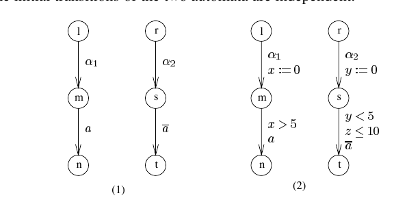
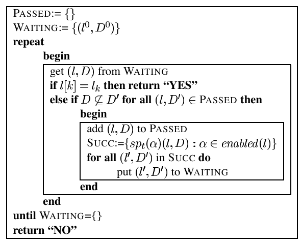

# Partial Order Reductions for Timed Systems

Johan Bengtsson, Bengt Jonsson, Johan Lilius, and Wang Yi

Department of Computer Systems, Uppsala University, Sweden.  
Email: `{bengt,johanb,yi}@docs.uu.se`

Department of Computer Science, TUCS, Abo Akademi University, Finland.  
Email: `Johan.Lilius@abo.fi`

> Note: the local `paper.pdf` is the thesis-extracted Paper D from *Clocks, DBMs and States in Timed Systems*. The Markdown below is a manually refined transcription that has been rechecked against the local PDF page by page. This second-pass revision specifically fixes a number of text/PDF misalignments from the earlier draft and restores several formulas and symbolic notations that were dropped by the local text layer. Figure 1 is kept as a crop from the local PDF because its in-figure labels are not reliably recoverable from the text extraction.

## Abstract

In this paper, we present a partial-order reduction method for timed systems based on a local-time semantics for networks of timed automata. The main idea is to remove the implicit clock synchronisation between processes in a network by letting local clocks in each process advance independently of clocks in other processes, and by requiring that two processes resynchronise their local time scales whenever they communicate. A symbolic version of this new semantics is developed in terms of predicate transformers, which enjoys the desired property that two predicate transformers are independent if they correspond to disjoint transitions in different processes. Thus we can apply standard partial order reduction techniques to the problem of checking reachability for timed systems, which avoid exploration of unnecessary interleavings of independent transitions. The price is that we must introduce extra machinery to perform the resynchronisation operations on local clocks. Finally, we present a variant of DBM representation of symbolic states in the local time semantics for efficient implementation of our method.

## 1 Motivation

During the past few years, a number of verification tools have been developed for timed systems in the framework of timed automata, for example KRONOS and UPPAAL [HH95, DOTY95, BLL+96]. One of the major problems in applying these tools to industrial-size systems is the huge memory usage needed to explore the state space of a network, or product, of timed automata, since the verification tools must keep information not only on the control structure of the automata but also on the clock values specified by clock constraints.

Partial-order reduction [God96, GW90, HP94, Pel93, Val90, Val93] is a well-developed technique whose purpose is to reduce the usage of time and memory in state-space exploration by avoiding exploration of unnecessary interleavings of independent transitions. It has been successfully applied to finite-state systems. However, for timed systems there has been less progress. Perhaps the major obstacle is the assumption that all clocks advance at the same speed, meaning that all clocks are implicitly synchronised. If each process contains at least one local clock, then advancement of the local clock of a process is not independent of time advancement in other processes. Therefore, different interleavings of a set of independent transitions will produce different combinations of clock values, even if there is no explicit synchronisation between the processes or their clocks.

A simple illustration of this problem is given in Figure 1. In part `(1)` of the figure there is a system with two automata, each of which can perform one internal local transition, labelled `\alpha_1` and `\alpha_2` respectively, from an initial local state to a synchronisation state, where the automata may synchronise on label `a` in the CCS synchronisation model. The two sequences

$$
\alpha_1\alpha_2
\qquad\text{and}\qquad
\alpha_2\alpha_1
$$

are different interleavings of two independent transitions, both leading to the same control state from which a synchronisation on `a` is possible. A partial-order reduction technique will therefore explore only one of these two interleavings after determining that the initial transitions of the two automata are independent.



*Figure 1: Illustration of partial-order reduction.*

Now add timing constraints to obtain the system in part `(2)` of Figure 1, with clocks `x` and `y`. The left automaton can initially move to node `m`, thereby resetting `x`, after waiting an arbitrary time. Thereafter it can move to node `n` after more than `2` time units. The right automaton can initially move to node `s`, thereby resetting `y`, after waiting an arbitrary time. Thereafter it can move to node `t` within `1` time unit, but within `10` time units of system initialisation.

The initial transitions of the two automata are still logically independent. However, if we naively analyse the possible values of the clocks after a certain sequence of actions, we find that the sequence

$$
\alpha_1\alpha_2
$$

may result in clock values satisfying

$$
x \ge y,
$$

because `x` is reset before `y`, and the later synchronisation on `a` is then possible. By contrast, the sequence

$$
\alpha_2\alpha_1
$$

may result in clock values satisfying

$$
x \le y,
$$

because `x` is reset after `y`, and the synchronisation on `a` is then impossible. Thus it is in general not sufficient to explore only one interleaving of independent transitions.

In this paper, we present a new method for partial-order reduction for timed systems based on a new local-time semantics for networks of timed automata. The main idea is to overcome the problem above by removing the implicit clock synchronisation between processes, that is, by letting clocks advance independently of each other. In other words, we desynchronise local clocks. The benefit is that different interleavings of independent transitions no longer remember the order in which the transitions were explored. In the specific example of Figure 1, the interleaving no longer remembers the order in which the clocks were reset, so the two initial transitions become independent again. We can then import standard partial-order techniques and expect to obtain the same reductions as in the untimed case.

Suppose that in state `(m,s)` all clocks are initialised to `0`. In the standard semantics, the possible clock values when the system is in state `(m,s)` are those satisfying

$$
x = y.
$$

In the desynchronised semantics of this paper, any combination of clock values is possible in state `(m,s)`. After both the sequence `\alpha_1\alpha_2` and the sequence `\alpha_2\alpha_1`, the possible clock values satisfy only

$$
x \ge 0 \wedge y \ge 0.
$$

Note that desynchronisation gives rise to many new global states in which automata have executed for different amounts of time. The hope is that this larger set of states can be represented symbolically more compactly than the original state space. For example, in system `(2)` our desynchronised semantics gives rise to the single constraint

$$
x \ge 0 \wedge y \ge 0
$$

at state `(m,s)`, whereas the standard semantics gives rise to the two constraints

$$
x = y \wedge x \ge 0
\qquad\text{and}\qquad
x = y \wedge y \ge 0.
$$

However, once the synchronisation between local time scales has been removed completely, we also lose timing information required for synchronisation between automata. Consider again system `(2)` and the clock `y` of the right automaton. Since `y = 0` initially, the constraint `y \le 10` requires that the synchronisation on `a` take place within `10` time units of system initialisation. Implicitly this becomes a requirement on the left automaton too. A naive desynchronisation of local clocks, including `y`, would allow the left process to wait more than `10` time units in its own local time scale before synchronising.

Therefore, before exploring the effect of a synchronising transition, we must explicitly resynchronise the local time scales of the participating automata. For this purpose, we add to each automaton a local reference clock, which measures how far its local time has advanced while performing local transitions. For each synchronisation between two automata, we add the condition that their reference clocks agree. In the running example, we add `c_1` as a reference clock to the left automaton and `c_2` as a reference clock to the right automaton. We require

$$
c_1 = c_2
$$

at system initialisation. After any interleaving of the first two independent transitions, the clock values may satisfy

$$
x \ge 0 \wedge c_1 \ge 0
\qquad\text{and}\qquad
y \ge 0 \wedge c_2 \ge 0.
$$

To synchronise on `a`, they must additionally satisfy

$$
c_1 = c_2
$$

as well as the ordinary constraints

$$
x > 2,\qquad y < 1,\qquad y \le 10.
$$

This implies that

$$
x < 10
$$

when the synchronisation occurs. Without the reference clocks, that condition could not be derived.

The idea of introducing local time is related to the treatment of local time in parallel simulation [Fuj90]. There, a simulation step involves local computation together with a corresponding update of local time. In our setting, the goal is verification rather than simulation, so we must represent sets of such states symbolically. We therefore develop a symbolic version of local-time semantics in terms of predicate transformers, in analogy with the ordinary symbolic semantics for timed automata used in reachability tools. This symbolic semantics allows a finite partitioning of the state space of a network and enjoys the desired property that two predicate transformers are independent if they correspond to disjoint transitions in different component automata. Thus we can apply standard partial-order reduction techniques to timed reachability without disturbance from implicit synchronisation of clocks.

The paper is organised as follows. Section 2 gives a brief introduction to timed automata and their standard, global-time semantics. Section 3 develops a local-time semantics for networks of timed automata and a finite symbolic version of that semantics, analogous to the region graph for timed automata. Section 4 presents a partial-order search algorithm for reachability analysis based on the symbolic local-time semantics, together with operations for representing and manipulating distributed symbolic states. Section 5 concludes with related work, a summary of the contribution, and future work.

## 2 Preliminaries

### 2.1 Networks of Timed Automata

Timed automata were first introduced in [AD90] and have since become a standard model for timed systems. In this paper, the model is a network of timed automata [YPD94, LPY95].

Let `Act` be a finite set of labels, ranged over by `a`, `b`, and so on. Each label is either local or synchronising. If `a` is a synchronising label, then it has a complement, denoted `\overline a`, which is also a synchronising label and satisfies `\overline{\overline a} = a`.

A timed automaton is a standard finite-state automaton over `Act`, extended with a finite set of real-valued clocks. We use `x`, `y`, and so on to range over clocks, `r`, `r'`, and so on to range over finite sets of clocks, and `\mathbb{R}_{\ge 0}` for the set of non-negative real numbers.

A clock assignment for a set of clocks `C` is a function from `C` to `\mathbb{R}_{\ge 0}`. For `d \in \mathbb{R}_{\ge 0}`, we use `u + d` to denote the clock assignment that maps each clock in `C` to its old value plus `d`, and for `r \subseteq C`, we use `r(u)` to denote the assignment that maps each clock in `r` to `0` and agrees with `u` on `C \setminus r`.

We use `B(C)`, ranged over by `D` and later by `\widehat D`, to stand for the set of conjunctions of atomic constraints of the form

$$
x \sim c
\qquad\text{or}\qquad
x - y \sim c,
$$

for `x, y \in C`, `\sim \in \{<,\le,\ge,>\}`, and `c` a natural number. Elements of `B(C)` are called *clock constraints* or *clock constraint systems* over `C`. We write

$$
u \models D
$$

to denote that the clock assignment `u` satisfies the clock constraint `D`.

A network of timed automata is the parallel composition

$$
A = A_1 \parallel \cdots \parallel A_n
$$

of a collection `A_1, \ldots, A_n` of timed automata. Each `A_i` is a timed automaton over the clocks `C_i`, represented as a tuple

$$
A_i = (L_i, \ell_i^0, E_i, I_i),
$$

where `L_i` is a finite set of control nodes, `\ell_i^0` is the initial node, and `E_i` is a set of edges. Each edge

$$
(\ell, g, a, r, \ell') \in E_i
$$

means that the automaton can move from node `\ell` to node `\ell'` if the clock constraint `g`, also called the enabling condition of the edge, is satisfied, thereby performing label `a` and resetting the clocks in `r`. We write

$$
\ell \xrightarrow{g,a,r} \ell'
$$

for such an edge.

A *local action* is an edge of some automaton `A_i` whose label is local. A *synchronising action* is a pair of matching edges, written

$$
\bigl(
\ell_i \xrightarrow{g_i,a,r_i} \ell_i',
\ell_j \xrightarrow{g_j,\overline a,r_j} \ell_j'
\bigr),
$$

where `a` is a synchronising label and the two edges belong to different automata.

The invariant map `I_i` assigns to each node an invariant condition that must be satisfied by the system clocks whenever the system is in that node. For simplicity, the paper assumes that invariants are conjunctions of constraints of the form `x \le c`, where `x` is a clock and `c` is a natural number. It is also assumed that the clock sets `C_i` are pairwise disjoint, so that each automaton references only local clocks, and that the node sets `L_i` are pairwise disjoint.

**Global-Time Semantics.**

A state of the network `A` is a pair `(l, u)`, where `l`, called a *control vector*, is a vector of control nodes of the component automata and `u` is a clock assignment for `C_1 \cup \cdots \cup C_n`. We use `l_i` to stand for the `i`-th element of `l` and `l[\ell_i'/\ell_i]` for the control vector in which the `i`-th element has been replaced by `\ell_i'`. We define

$$
I(l) = \bigwedge_{i=1}^n I_i(l_i).
$$

The initial state of `A` is `(l^0, u^0)`, where `l^0_i = \ell_i^0` for each `i` and `u^0` maps all clocks to `0`.

A network may change its state by performing the following three types of transitions:

Delay transition:

$$
(l, u) \xrightarrow{d} (l, u + d)
\qquad\text{if } I(l)(u + d).
$$

Local transition:

$$
(l, u) \xrightarrow{a_i}
\bigl(l[\ell_i'/\ell_i], r_i(u)\bigr)
$$

if there exists a local action `\ell_i \xrightarrow{g_i,a_i,r_i} \ell_i'` such that

$$
g_i(u)
\qquad\text{and}\qquad
I\bigl(l[\ell_i'/\ell_i]\bigr)\bigl(r_i(u)\bigr).
$$

Synchronising transition:

$$
(l, u) \xrightarrow{a,\overline a}
\bigl(l[\ell_i'/\ell_i][\ell_j'/\ell_j], (r_i \cup r_j)(u)\bigr)
$$

if there exists a synchronising action

$$
\bigl(
\ell_i \xrightarrow{g_i,a,r_i} \ell_i',
\ell_j \xrightarrow{g_j,\overline a,r_j} \ell_j'
\bigr)
$$

such that

$$
g_i(u),\qquad
g_j(u),\qquad
I\bigl(l[\ell_i'/\ell_i][\ell_j'/\ell_j]\bigr)\bigl((r_i \cup r_j)(u)\bigr).
$$

We say that a state `(l, u)` is reachable, denoted

$$
(l^0, u^0) \to^* (l, u),
$$

if there exists a sequence of delay or discrete transitions leading from the initial state to `(l, u)`.

### 2.2 Symbolic Global-Time Semantics

Clearly, the semantics above yields an infinite transition system and is therefore not directly suitable for verification algorithms. Efficient algorithms are obtained using a symbolic semantics based on symbolic states of the form `(l, D)`, where `D \in B(C)` represents the set of states `(l, u)` such that `u \models D`. We write

$$
(l, u) \models (l', D)
$$

to denote that `l = l'` and `u \models D`.

We perform symbolic state-space exploration by repeatedly taking the strongest postcondition with respect to an action or time advancement. For a constraint `D` and a set of clocks `r`, define the constraints `D^\uparrow` and `r(D)` by:

$$
\forall u \in \mathbb{R}_{\ge 0}^C :
\quad
u \models D^\uparrow
\iff
\exists d \in \mathbb{R}_{\ge 0} : u - d \models D,
$$

and

$$
\forall u \in \mathbb{R}_{\ge 0}^C :
\quad
u \models r(D)
\iff
\exists u' : u = r(u') \wedge u' \models D.
$$

It can be shown that `D^\uparrow` and `r(D)` can be expressed as clock constraints whenever `D` is a clock constraint.

We now define predicate transformers corresponding to strongest postconditions of the three types of transitions.

For global delay,

$$
sp(\delta)(l, D) = \bigl(l, D^\uparrow \wedge I(l)\bigr).
$$

For a local action `\alpha_i = \ell_i \xrightarrow{g_i,a_i,r_i} \ell_i'`,

$$
sp(\alpha_i)(l, D)
=
\bigl(l[\ell_i'/\ell_i], r_i(g_i \wedge D) \wedge I(l[\ell_i'/\ell_i])\bigr).
$$

For a synchronising action

$$
\alpha_{ij}
=
\bigl(
\ell_i \xrightarrow{g_i,a,r_i} \ell_i',
\ell_j \xrightarrow{g_j,\overline a,r_j} \ell_j'
\bigr),
$$

$$
sp(\alpha_{ij})(l, D)
=
\bigl(
  l[\ell_i'/\ell_i][\ell_j'/\ell_j],
  (r_i \cup r_j)(g_i \wedge g_j \wedge D)
  \wedge
  I(l[\ell_i'/\ell_i][\ell_j'/\ell_j])
\bigr).
$$

It turns out to be convenient to use predicate transformers that correspond to first executing a discrete action and then executing a delay. For predicate transformers `sp` and `sp'`, we use `sp ; sp'` to denote composition. For a local or synchronising action `\alpha`, we define

$$
\overrightarrow{sp}(\alpha) = sp(\alpha) ; sp(\delta).
$$

We use

$$
(l^0, D^0)
$$

to denote the initial symbolic global-time state for networks, where

$$
D^0 = \{u^0\}^\uparrow \wedge I(l^0).
$$

We write

$$
(l, D) \Rightarrow (l', D')
$$

if

$$
(l', D') = \overrightarrow{sp}(\alpha)(l, D)
$$

for some action `\alpha`.

It can be shown [YPD94] that the symbolic semantics characterises the concrete semantics as follows.

**Theorem 1.** A state `(l, u)` of a network is reachable if and only if

$$
(l^0, D^0) \Rightarrow^* (l, D)
$$

for some `D` such that

$$
(l, u) \models (l, D).
$$

The theorem can be used to construct a symbolic algorithm for reachability analysis. To keep the presentation simple, the paper considers a special form of local reachability: given a control node `\ell_q` of some automaton `A_i`, check whether there is a reachable state `(l, u)` such that `l_i = \ell_q`.

The symbolic algorithm is shown in Figure 2.



*Figure 2: An algorithm for symbolic reachability analysis.*

```text
PASSED := {}
WAITING := {(l^0, D^0)}
repeat
  begin
    get (l, D) from WAITING
    if l_i = l_q then return "YES"
    else if D ⊄ D' for all (l, D') ∈ PASSED then
      begin
        add (l, D) to PASSED
        SUCC := { overrightarrow{sp}(α)(l, D) | α ∈ enabled(l) }
        for all (l', D') in SUCC do
          put (l', D') into WAITING
      end
  end
until WAITING = {}
return "NO"
```

Here `enabled(l)` denotes the set of all actions whose source node or nodes are in the control vector `l`. A local action `\alpha_i` is enabled at `l` if its source is `l_i`, and a synchronising action `\alpha_{ij}` is enabled at `l` if its two source nodes are `l_i` and `l_j`.

## 3 Partial Order Reduction and Local-Time Semantics

The purpose of partial-order techniques is to avoid exploring several interleavings of independent transitions, that is, transitions whose order of execution is irrelevant because they are performed by different processes and do not affect each other.

Assume for instance that for some control vector `l`, the set `enabled(l)` consists of a local action `\alpha_i` of automaton `A_i` and a local action `\alpha_j` of automaton `A_j`. Since executions of local actions do not affect each other in the untimed setting, one would like to explore only `\alpha_i` and defer exploration of `\alpha_j` until later. The justification is that any symbolic state reached by first exploring `\alpha_i` and then `\alpha_j` can also be reached by exploring the actions in the reverse order.

Let `sp` and `sp'` be two predicate transformers. We say that `sp` and `sp'` are independent if

$$
sp(sp'(l, D)) = sp'(sp(l, D))
$$

for any symbolic state `(l, D)`.

In the absence of time, local actions of different processes are independent, in the sense that `sp(\alpha_i)` and `sp(\alpha_j)` are independent. In the presence of time, however, we generally do not have independence: `\overrightarrow{sp}(\alpha_i)` and `\overrightarrow{sp}(\alpha_j)` need not commute, as Figure 1 illustrates.

If timed predicate transformers commute only to a very limited extent, then partial-order reduction is less likely to be successful for timed systems than for untimed ones. The paper therefore presents a method for symbolic state-space exploration of timed systems in which predicate transformers commute to the same extent as in the untimed case.

The main obstacle to commutativity is that time advancement is modelled by globally synchronous transitions, which implicitly synchronise all local clocks, and hence all processes. The proposal is to replace global time advancement by *local-time advancement*. Each automaton gets its own local time scale, and its local clocks advance independently of those of other automata.

When exploring local actions, the corresponding predicate transformer affects only the clocks of that automaton in its own local-time scale; clocks of other automata are unaffected. In this way, any relation between local time scales is removed. However, before exploring synchronising actions, we must also be able to resynchronise the local-time scales of the participating automata. For this purpose, we add a local reference clock to each automaton. The reference clock of automaton `A_i` represents how far the local time of `A_i` has advanced, measured on a global time scale. In a totally unsynchronised state, reference clocks of different automata may differ greatly. Before a synchronisation between `A_i` and `A_j`, we must add the condition

$$
c_i = c_j.
$$

To formalise these ideas, we now define a local-time semantics for networks of timed automata.

Consider a network

$$
A = A_1 \parallel \cdots \parallel A_n.
$$

We add to the set `C_i` of clocks of each `A_i` a reference clock, denoted `c_i`. Let `u^0_i` denote the time assignment that maps each clock in `C_i`, including `c_i`, to `0` and every clock outside `C_i` to the value already given by the global initial assignment. In the rest of the paper we assume that the clocks of the network include the reference clocks and that the initial state is the all-zero state, both in the global and local time semantics.

### Local-Time Semantics

The following rules define how networks may change state locally and globally:

Local delay transition:

$$
(l, u) \rightsquigarrow_i^d (l, u +_i d)
\qquad\text{if } I_i(l_i)(u +_i d).
$$

Local discrete transition:

$$
(l, u) \rightsquigarrow_i^{\alpha_i}
\bigl(l[\ell_i'/\ell_i], r_i(u)\bigr)
$$

if there exists a local action `\alpha_i = \ell_i \xrightarrow{g_i,a_i,r_i} \ell_i'` such that

$$
g_i(u)
\qquad\text{and}\qquad
I\bigl(l[\ell_i'/\ell_i]\bigr)\bigl(r_i(u)\bigr).
$$

Synchronising transition:

$$
(l, u) \rightsquigarrow^{\alpha_{ij}}
\bigl(l[\ell_i'/\ell_i][\ell_j'/\ell_j], (r_i \cup r_j)(u)\bigr)
$$

if there exists a synchronising action

$$
\alpha_{ij}
=
\bigl(
\ell_i \xrightarrow{g_i,a,r_i} \ell_i',
\ell_j \xrightarrow{g_j,\overline a,r_j} \ell_j'
\bigr)
$$

such that

$$
g_i(u),\qquad
g_j(u),\qquad
I\bigl(l[\ell_i'/\ell_i][\ell_j'/\ell_j]\bigr)\bigl((r_i \cup r_j)(u)\bigr),
$$

and

$$
c_i(u) = c_j(u).
$$

Intuitively, the first rule says that a component may advance its local clocks, that is, execute locally, as long as its local invariant holds. The second rule is the standard interleaving rule for discrete transitions. When two components need to synchronise, it must be checked that they have executed for the same amount of time; this is the purpose of the last condition of the third rule.

We call `(l, u)` a *local time state*. According to the rules above, the network may reach many local time states in which the reference clocks have different values. The states of real interest are those in which all reference clocks agree.

**Definition 1.** A local time state `(l, u)` with reference clocks `c_1, \ldots, c_n` is *synchronised* if

$$
c_1(u) = \cdots = c_n(u).
$$

Now we claim that the local-time semantics simulates the standard global-time semantics, in the sense that they generate precisely the same reachable states whenever the local-time state is synchronised.

**Theorem 2.** For any synchronised local time state `(l, u)`,

$$
(l^0, u^0) \to^* (l, u)
\qquad\text{iff}\qquad
(l^0, u^0) \rightsquigarrow^* (l, u).
$$

### 3.1 Symbolic Local-Time Semantics

We now define a local-time analogue of the symbolic semantics from Section 2.2 in order to develop a symbolic reachability algorithm with partial-order reduction. Let `\widehat D` range over a class of constraints for denoting symbolic local time states.

We use

$$
\widehat D^\uparrow_i
$$

to denote the clock constraint such that for all `u \in \mathbb{R}_{\ge 0}^C` we have

$$
u \models \widehat D^\uparrow_i
\iff
\exists d \in \mathbb{R}_{\ge 0} : u -_i d \models \widehat D,
$$

where only the clocks of automaton `A_i`, including `c_i`, are shifted back by `d`.

For local-time advance we define a local-time predicate transformer, denoted `sp_t^c(\delta_i)`, which allows only the local clocks, including the reference clock, of automaton `A_i` to advance:

$$
sp_t^c(\delta_i)(l, \widehat D)
=
\bigl(l, \widehat D^\uparrow_i \wedge I_i(l_i)\bigr).
$$

For each local and synchronising action `\alpha`, we define a local-time predicate transformer `sp_t^c(\alpha)` as follows.

If `\alpha` is a local action `\alpha_i`, then

$$
sp_t^c(\alpha_i)
=
sp(\alpha_i) ; sp_t^c(\delta_i).
$$

If `\alpha` is a synchronising action `\alpha_{ij}`, then

$$
sp_t^c(\alpha_{ij})
=
(c_i = c_j) ; sp(\alpha_{ij}) ; sp_t^c(\delta_i) ; sp_t^c(\delta_j).
$$

Here the constraint `(c_i = c_j)` is treated as a predicate transformer in the natural way by intersecting with the resynchronisation condition.

We use

$$
(l^0, \widehat D^0)
$$

to denote the initial symbolic local-time state of networks, where

$$
\widehat D^0
=
sp_t^c(\delta_1) ; \cdots ; sp_t^c(\delta_n)(\{u^0\}).
$$

We write

$$
(l, \widehat D) \models\!\Rightarrow (l', \widehat D')
$$

if

$$
(l', \widehat D') = sp_t^c(\alpha)(l, \widehat D)
$$

for some action `\alpha`.

Then we have the following characterisation theorem.

**Theorem 3.** For all networks, a synchronised state `(l, u)` is reachable iff

$$
(l^0, \widehat D^0) (\models\!\Rightarrow)^* (l, \widehat D)
$$

for a symbolic local-time state `(l, \widehat D)` such that

$$
(l, u) \models (l, \widehat D).
$$

The theorem shows that symbolic local-time semantics fully characterises global-time semantics in terms of reachable states. However, reachability analysis would still require us to search for a symbolic local-time state that is synchronised in the sense that it contains synchronised states. The paper therefore relaxes this condition for a useful class of networks.

**Definition 2.** A network is *local time-stop free* if for all local time states `(l, u)`,

$$
(l^0, u^0) \rightsquigarrow^* (l, u)
\implies
\exists (l', u') \text{ synchronised such that } (l, u) \rightsquigarrow^* (l', u').
$$

Local time-stop freeness can be guaranteed by syntactic restrictions on component automata. For example, one may require that at each control node of an automaton there be a local edge whose guard is weaker than the local invariant. This is exactly the pattern used to model timeout handling when the invariant is about to become false.

The following theorem allows us to perform reachability analysis in terms of symbolic local-time semantics for local time-stop free networks without searching explicitly for synchronised symbolic states.

**Theorem 4.** Assume a local time-stop free network and a local control node `\ell_q` of `A_i`. Then

$$
\exists u : (l^0, u^0) \to^* (l, u) \text{ with } l_i = \ell_q
$$

iff

$$
\exists \widehat D : (l^0, \widehat D^0) (\models\!\Rightarrow)^* (l, \widehat D)
\text{ with } l_i = \ell_q.
$$

We now state the main commutativity result.

**Theorem 5.** Let `\alpha` and `\beta` be two actions of a network of timed automata. If the sets of component automata involved in `\alpha` and `\beta` are disjoint, then `sp_t^c(\alpha)` and `sp_t^c(\beta)` are independent.

### 3.2 Finiteness of the Symbolic Local-Time Semantics

We shall use the symbolic local-time semantics as the basis for a partial-order search algorithm in the next section. To guarantee termination, we must establish finiteness, that is, that the number of relevant equivalence classes of symbolic local-time states is finite.

Observe first that the number of symbolic local-time states is in general infinite. However, as in the standard timed-automata theory, we can still obtain a finite graph based on a suitable notion of regions.

We first extend the standard region equivalence to synchronised states. In the following, `C_r` denotes the set of reference clocks.

**Definition 3.** Two synchronised local time states, with the same control vector, `(l, u)` and `(l, u')` are *synchronised-equivalent* if

$$
[C_r \mapsto 0]u \sim [C_r \mapsto 0]u',
$$

where `\sim` is the standard region equivalence for timed automata.

That is, only the non-reference clock values are required to be region-equivalent. The corresponding equivalence classes are called *synchronised regions*.

Now we extend the relation to local-time states that are not synchronised. Intuitively, two unsynchronised states should be classified as equivalent if they can reach sets of equivalent synchronised states simply by letting those automata with smaller reference-clock values advance in order to catch up with the automaton that currently has the greatest reference-clock value.

**Definition 4.** A local delay transition

$$
(l, u) \rightsquigarrow_i^d (l, u')
$$

of a network is a *catch-up transition* if

$$
\max(u(C_r)) \le \max(u'(C_r)).
$$

Intuitively, a catch-up transition corresponds to running one of the automata that lags behind, and thus making the system more synchronised in time.

**Definition 5.** Let `(l, u)` be a local time state of a network of timed automata. We use `\mathcal{R}(l, u)` to denote the set of synchronised regions reachable from `(l, u)` using only discrete transitions or catch-up transitions.

We can now define the main equivalence relation between local-time states.

**Definition 6.** Two local time states `(l, u)` and `(l, u')` are *catch-up equivalent*, denoted

$$
(l, u) \sim_c (l, u'),
$$

if

$$
\mathcal{R}(l, u) = \mathcal{R}(l, u').
$$

We write `[(l, u)]_{\sim_c}` for the equivalence class of `(l, u)` with respect to `\sim_c`.

Intuitively, two catch-up equivalent local-time states can reach the same set of synchronised states, that is, states in which all automata of the network have been synchronised in time.

The number of synchronised regions is finite, and therefore the number of catch-up classes is also finite. On the other hand, there is no way to put a fixed upper bound on the reference clocks `c_i`, since that would imply that each process eventually stops evolving, which is generally not the case. Hence the region graph must become periodic after some initial part. Nevertheless, we still have a finiteness theorem.

**Theorem 6.** For any network of timed automata, the number of catch-up equivalence classes `[(l, u)]_{\sim_c}` for each control vector `l` is bounded by a function of the number of regions in the standard region-graph construction for timed automata.

As the number of control vectors of a network is finite, the theorem demonstrates finiteness of the symbolic local-time semantics.

## 4 Partial Order Reduction in Reachability Analysis

The preceding sections provide the machinery needed for a partial-order reduction method inside a symbolic reachability algorithm. Such an algorithm can be obtained from the algorithm in Figure 2 by:

1. replacing the initial symbolic global-time state `(l^0, D^0)` by the initial symbolic local-time state `(l^0, \widehat D^0)` from Theorem 4;
2. replacing the statement `SUCC := ...` by a reduced successor computation in which only a selected subset of enabled actions is explored;
3. replacing the inclusion check between constraints by an inclusion test that also takes `\sim_c` into account.

The reduction is based on selecting, for each control vector `l`, a subset of automata `ample(l)`, and then letting the reduced successor set contain all enabled actions in which some automaton in `ample(l)` participates. The choice of `ample(l)` may depend on the target node `\ell_q`.

The set `ample(l)` must satisfy the following criteria.

`C0`

$$
ample(l) = \varnothing
\quad\text{iff}\quad
enabled(l) = \varnothing.
$$

`C1`

If an automaton `A_i` from its current node `l_i` can possibly synchronise with another process `A_j`, then `A_i \in ample(l)`, regardless of whether that synchronisation is enabled or not.

`C2`

From `l`, the network cannot reach a control vector with `l_i = \ell_q` without performing an action in which some process in `ample(l)` participates.

Criteria `C0` and `C2` are obviously necessary to preserve correctness. Criterion `C1` is motivated as follows: if an automaton `A_i` can possibly synchronise with another automaton `A_j`, then we must explore actions by `A_i` to allow it to catch up to a possible synchronisation with `A_j`. Otherwise we may miss the part of the state space reachable after that synchronisation.

A final necessary criterion is fairness. Otherwise we might indefinitely neglect actions of some automaton and get stuck exploring cyclic behaviour of only a subset of the automata. In terms of the global control graph of the network, fairness is formulated as:

`C3`

In each cycle of the global control graph, there must be at least one control vector `l` at which

$$
ample(l) = \{A_1, \ldots, A_n\}.
$$

The correctness theorem is then:

**Theorem 7.** A partial-order reduction of the symbolic reachability algorithm in Figure 2, obtained by:

1. replacing the initial symbolic global-time state `(l^0, D^0)` with the initial symbolic local-time state `(l^0, \widehat D^0)`;
2. replacing the full successor computation by a reduced successor computation based on a function `ample` satisfying `C0`-`C3`;
3. replacing ordinary inclusion checking between constraints with an inclusion checking that also takes `\sim_c` into account,

is a correct and complete decision procedure for determining whether a local state in `A_i` is reachable in a local time-stop free network.

The proof follows standard proofs of correctness for partial-order algorithms; see [God96]. The paper notes that the modified inclusion check is needed only to guarantee termination, not soundness. It also notes that the paper proves only that there exists a finite partition of the local-time state space according to `\sim_c`, but not yet how to compute that partition effectively; that is left as future work.

### 4.1 Operations on Constraint Systems

To obtain an efficient implementation of the search algorithm above, it is important to design efficient data structures and algorithms for representing and manipulating symbolic distributed states, that is, constraints over local clocks including the reference clocks.

In the standard approach to verification of timed systems, a well-known data structure is the Difference Bound Matrix (DBM), due to Bellman [Bel57], which offers a canonical representation for clock constraints. Efficient algorithms for manipulating and analysing DBMs have been developed; see for example [LLPY97].

However, when we introduce operations of the form `\widehat D^\uparrow_i`, standard clock constraints are no longer adequate for describing possible sets of clock assignments, because it is not possible there to let only a subset of clocks grow. This problem can be circumvented as follows.

Instead of considering clock values themselves as the basic entities in a constraint, we work with the *relative offset* of a clock from the local reference clock. For a clock `x_i` of automaton `A_i`, this offset is represented by the difference

$$
\widehat{x}_i = x_i - c_i.
$$

By analogy, we also introduce the constant offset

$$
\widehat{0}_i = 0 - c_i.
$$

An *offset constraint* is then a conjunction of inequalities of the form

$$
\widehat{x}_i \sim n
\qquad\text{or}\qquad
\widehat{x}_i - \widehat{x}_j \sim n
$$

for `\widehat{x}_i, \widehat{x}_j` in the set of offsets, where `\sim \in \{<,\le,\ge,>\}`. Note that an inequality of the form `x_i \sim n` is also an offset constraint, since it is the same as

$$
\widehat{x}_i - \widehat{0}_i \sim n.
$$

It is important to observe that, given an offset constraint `\widehat D`, we can always recover the corresponding absolute constraint by setting

$$
\widehat{0}_i = -c_i.
$$

The nice feature of these constraints is that they can still be represented by DBMs, provided we change the interpretation of a matrix variable from an absolute clock value to a local offset. Thus, given a set of offset constraints over a network, we construct a DBM `M` as follows. We number the clocks in each local component by `0, 1, \ldots, m_i`. An offset of the form `x_i - c_i` is denoted `\widehat{x}_i`, and a constant offset `0 - c_i` is denoted `\widehat{0}_i`. The index set of the matrix is then the set of offsets, and for all offsets `\widehat{x}, \widehat{y}`, an entry in `M` is defined by

$$
M_{\widehat{x}\widehat{y}} = (n,\sim)
$$

if the constraint `\widehat{x} - \widehat{y} \sim n` occurs, and `\infty` otherwise.

We say that a clock assignment `u` is a solution of a DBM `M`, written `u \models M`, iff all offset inequalities represented by `M` hold under the assignment induced by `u` together with the reference clocks.

The operation `\widehat D^\uparrow_i` now corresponds to deletion of all constraints of the form

$$
\widehat{x} - \widehat{0}_i \sim n.
$$

The intuition is that when we let the clocks in automaton `A_i` grow, we keep their relative offsets to `c_i` constant, and only the offset from `0` to `c_i` changes. In the corresponding DBM `M`, this yields an operation `up_i(M)` defined by:

$$
up_i(M)_{\widehat{x}\widehat{y}}
=
\begin{cases}
\infty, & \text{if } \widehat{y} = \widehat{0}_i, \\
M_{\widehat{x}\widehat{y}}, & \text{otherwise.}
\end{cases}
$$

It is then easy to see that

$$
u \models up_i(M)
\qquad\text{iff}\qquad
u \models \widehat D^\uparrow_i.
$$

Resetting a clock `x_i` corresponds to deleting all constraints involving `\widehat{x}_i` and then setting

$$
\widehat{x}_i = \widehat{0}_i.
$$

This can be implemented by an operation `reset_i(M)` on the DBM:

$$
reset_i(M)_{\widehat{x}\widehat{y}}
=
\begin{cases}
M_{\widehat{0}_i\widehat{y}}, & \text{if } \widehat{x} = \widehat{x}_i, \\
M_{\widehat{x}\widehat{0}_i}, & \text{if } \widehat{y} = \widehat{x}_i, \\
M_{\widehat{x}\widehat{y}}, & \text{otherwise.}
\end{cases}
$$

Again it is easy to see that

$$
u \models reset_i(M)
\qquad\text{iff}\qquad
u \models reset_i(\widehat D).
$$

## 5 Conclusion and Related Work

In this paper, we have presented a partial-order reduction method for timed systems based on a local-time semantics for networks of timed automata. We have developed a symbolic version of this local-time semantics in terms of predicate transformers, in analogy with the ordinary symbolic semantics for timed automata used in current reachability tools. The symbolic local-time semantics enjoys the desired property that two predicate transformers are independent if they correspond to disjoint transitions in different processes. This allows us to apply standard partial-order reduction techniques to the problem of checking reachability for timed systems without disturbance from implicit synchronisation of clocks.

The advantage of the approach is that it avoids exploration of unnecessary interleavings of independent transitions. The price is the extra machinery needed to perform resynchronisation operations on local clocks. Along the way, the paper establishes a finiteness theorem analogous to the region graph for ordinary timed automata and presents a variant of DBM representation suited to symbolic states in the local-time semantics.

The results can be extended to shared variables by modifying the predicate transformer for clock resynchronisation, of the form `(c_i = c_j)`, to an appropriate form for read and write operations. Natural future work includes implementation of the method and experiments with case studies to determine its practical significance.

### Related Work

At the time of writing, the authors identify only two other proposals for partial-order reduction for real-time systems: Pagani's approach for timed automata [Pag96], and the approach of Yoneda et al. for time Petri nets [YSSC93, YS97].

In Pagani's approach, independence between transitions is defined directly on the global-time semantics of timed automata. Intuitively, two transitions are independent if they can fire in either order and the resulting states have the same control vectors and clock assignments. Lifted to symbolic semantics, this means that two transitions can be independent only if they can happen in the same global time interval. The difference from the present paper is therefore clear: Pagani's notion of independence requires the comparison of clocks, whereas the notion here does not.

Yoneda et al. present a partial-order technique for model checking timed LTL over time Petri nets [BD91]. Their symbolic semantics consists of constraints on the differences between possible firing times of enabled transitions rather than on clock values. Although they do not give an explicit independence definition like Theorem 5 here, their notion of independence is structural, since the persistent sets, or ready sets, are calculated from the structure of the net. The main difference is in next-state calculation. Yoneda et al. store the relative firing order of enabled transitions in the clock constraints, so a state implicitly remembers the history of the system, which leads to branching. A second source of branching is synchronisation: since a state contains only information about relative differences of firing times, it is not possible there to synchronise clocks in the sense used here.

### Acknowledgement

The authors thank Paul Gastin, Florence Pagani, and Stavros Tripakis for valuable comments and discussions.

## References

`[AD90]` R. Alur and D. Dill. *Automata for Modelling Real-Time Systems.* In *Proceedings of International Colloquium on Algorithms, Languages and Programming*, volume 443 of *Lecture Notes in Computer Science*, pages 322-335. Springer-Verlag, 1990.

`[BD91]` B. Berthomieu and M. Diaz. *Modelling and verification of time dependent systems using time Petri nets.* *IEEE Transactions on Software Engineering*, 17(3):259-273, 1991.

`[Bel57]` R. Bellman. *Dynamic Programming.* Princeton University Press, 1957.

`[BGK+96]` J. Bengtsson, D. Griffioen, K. Kristoffersen, K. G. Larsen, F. Larsson, P. Pettersson, and W. Yi. *Verification of an Audio Protocol with Bus Collision Using UPPAAL.* In *Proceedings of the 9th International Conference on Computer Aided Verification*, volume 1102 of *Lecture Notes in Computer Science*, pages 244-256. Springer-Verlag, 1996.

`[BLL+96]` J. Bengtsson, K. G. Larsen, F. Larsson, P. Pettersson, and W. Yi. *UPPAAL in 1995.* In *Proceedings of the 2nd Workshop on Tools and Algorithms for the Construction and Analysis of Systems*, volume 1055 of *Lecture Notes in Computer Science*, pages 431-434. Springer-Verlag, 1996.

`[DOTY95]` C. Daws, A. Olivero, S. Tripakis, and S. Yovine. *The tool KRONOS.* In *Proceedings of Workshop on Verification and Control of Hybrid Systems III*, volume 1066 of *Lecture Notes in Computer Science*, pages 208-219. Springer-Verlag, 1995.

`[Fuj90]` R. M. Fujimoto. *Parallel discrete event simulation.* *Communications of the ACM*, 33(10):30-53, October 1990.

`[God96]` P. Godefroid. *Partial-Order Methods for the Verification of Concurrent Systems: An Approach to the State-Explosion Problem*, volume 1032 of *Lecture Notes in Computer Science*. Springer-Verlag, 1996.

`[GW90]` P. Godefroid and P. Wolper. *Using partial orders to improve automatic verification methods.* In *Proceedings of Workshop on Computer Aided Verification*, 1990.

`[HH95]` T. A. Henzinger and P.-H. Ho. *HyTech: The Cornell HYbrid TECHnology Tool.* In *Proceedings of Workshop on Tools and Algorithms for the Construction and Analysis of Systems*, 1995. BRICS report series NS-95-2.

`[HP94]` G. J. Holzmann and D. A. Peled. *An improvement in formal verification.* In *Proceedings of the 7th International Conference on Formal Description Techniques*, pages 197-211, 1994.

`[LLPY97]` F. Larsson, K. G. Larsen, P. Pettersson, and W. Yi. *Efficient Verification of Real-Time Systems: Compact Data Structures and State-Space Reduction.* In *Proceedings of the 18th IEEE Real-Time Systems Symposium*, pages 14-24, December 1997.

`[LPY95]` K. G. Larsen, P. Pettersson, and W. Yi. *Compositional and Symbolic Model-Checking of Real-Time Systems.* In *Proceedings of the 16th IEEE Real-Time Systems Symposium*, pages 76-87, December 1995.

`[Ove81]` W. Overman. *Verification of Concurrent Systems: Function and Timing.* PhD thesis, UCLA, August 1981.

`[Pag96]` F. Pagani. *Partial orders and verification of real-time systems.* In *Proceedings of Formal Techniques in Real-Time and Fault-Tolerant Systems*, volume 1135 of *Lecture Notes in Computer Science*, pages 327-346. Springer-Verlag, 1996.

`[Pel93]` D. Peled. *All from one, one for all, on model-checking using representatives.* In *Proceedings of the 5th International Conference on Computer Aided Verification*, volume 697 of *Lecture Notes in Computer Science*, pages 409-423. Springer-Verlag, 1993.

`[Val90]` A. Valmari. *Stubborn sets for reduced state space generation.* In *Advances in Petri Nets*, volume 483 of *Lecture Notes in Computer Science*, pages 491-515. Springer-Verlag, 1990.

`[Val93]` A. Valmari. *On-the-fly verification with stubborn sets.* In *Proceedings of the 5th International Conference on Computer Aided Verification*, volume 697 of *Lecture Notes in Computer Science*, pages 59-70, 1993.

`[YPD94]` W. Yi, P. Pettersson, and M. Daniels. *Automatic Verification of Real-Time Communicating Systems By Constraint-Solving.* In *Proceedings of the 7th International Conference on Formal Description Techniques*, 1994.

`[YS97]` T. Yoneda and H. Schlingloff. *Efficient verification of parallel real-time systems.* *Formal Methods in System Design*, 11(2):187-215, 1997.

`[YSSC93]` T. Yoneda, A. Shibayama, B.-H. Schlingloff, and E. M. Clarke. *Efficient verification of parallel real-time systems.* In *Proceedings of the 5th International Conference on Computer Aided Verification*, volume 697 of *Lecture Notes in Computer Science*, pages 321-332. Springer-Verlag, 1993.
