# Automated Verification of an Audio-Control Protocol using UPPAAL

Johan Bengtsson, W. O. David Griffioen, Kåre J. Kristoffersen, Kim G. Larsen, Fredrik Larsson, Paul Pettersson, and Wang Yi

Department of Computer Systems, Uppsala University, Sweden.  
Email: `{johanb, fredrikl, paupet, yi}@docs.uu.se`

CWI, Amsterdam, The Netherlands.  
Email: `griffoe@cwi.nl`

BRICS, Aalborg University, Denmark.  
Email: `{jelling, kgl}@cs.auc.dk`

> Note: the local `paper.pdf` is the thesis-extracted Paper E from *Clocks, DBMs and States in Timed Systems*. The Markdown below is a manually rebuilt and refined transcription checked against the local PDF page by page. This second-pass proofreading specifically revisits the already rebuilt draft, tightens several text/PDF alignments, restores additional symbolic notation, and keeps the original protocol/automaton diagrams as cropped figure assets because the vector graphics are not faithfully recoverable from the text layer alone.

## Abstract

In this paper we present a case-study in which the tool UPPAAL is extended and applied to verify an Audio-Control Protocol developed by Philips. The size of the protocol studied in this paper is significantly larger than case studies, including various abstract versions of the same protocol without bus-collision handling, reported previously in the community of real-time verification. We have checked that the protocol will function correctly if the timing error of its components is bound to $\pm 5\%$, and incorrectly if the error is $\pm 6\%$. In addition, using UPPAAL's ability of generating diagnostic traces, we have studied an erroneous version of the protocol actually implemented by Philips, and constructed a possible execution sequence explaining the error.

During the case-study, UPPAAL was extended with the notion of *committed locations*. It allows for accurate modelling of atomic behaviours, and more importantly, it is utilised to guide the state-space exploration of the model checker to avoid exploring unnecessary interleavings of independent transitions. Our experimental results demonstrate considerable time and space-savings of the modified model checking algorithm. In fact, due to the huge time and memory-requirement, it was impossible to check a simple reachability property of the protocol before the introduction of committed locations, and now it takes only seconds.

## 1 Introduction

In the past decade a number of tools for automatic verification of hybrid and real-time systems have emerged, e.g. HYTECH [HHWT97], KRONOS [Yov97], PMC [ST01], RT-Cospan [AK95] and UPPAAL [LPY97a]. These tools have by now reached a state where they are mature enough for industrial applications.

In this paper, we substantiate the claim by reporting on an industry-size case study where the tool UPPAAL is applied.

We analyse an audio control protocol developed by Philips for the physical layer of an interface bus connecting the various devices, e.g. CD-players, amplifier etc. in audio equipments. It uses Manchester encoding to transmit bit sequences of arbitrary length between the components, whose timing errors are bound. A simplified version of the protocol is studied by Bosscher et al. [BPV94]. It is showed that the protocol is incorrect if the timing error of the components is $\pm \frac{1}{17}$ or greater. The proof is carried out without tool support. The first automatic analysis of the protocol is reported in [HWT95] where HYTECH is applied to check an abstract version of the protocol and automatically synthesise the upper bound on the timing error. Similar versions of the protocol have been analysed by other tools, e.g. UPPAAL [LPY97a] and KRONOS [Yov97]. However, all the proofs are based on a simplification on the protocol, introduced by Bosscher et al. in 1994, that only one sender is transmitting on the bus so that no bus collisions can occur. In many applications the bus will have more than one sender, and the full version of the protocol by Philips therefore handles bus collisions. The protocol with bus collision handling was manually verified in [Gri94] without tool support. Since 1994, it has been a challenge for the verification tool developers to automate the analysis on the full version of the protocol.

The first automated proof of the protocol with bus collision handling was presented in 1996 in the conference version of this paper [BGK+96]. It was the largest case study, reported in the literature on verification of timed systems, which has been considered as a primary example in the area (see [CW96, LSW97]). The size of the protocol studied is significantly larger than various simplified versions of the same protocol studied previously in the community, e.g. the discrete part of the state space (the node-space) is $10^3$ times larger than in the case without bus collision handling and the number of clocks, variables and channels in the model is also increased considerably.

The major problem in applying automatic verification tools to industrial-size systems is the huge time and memory-usage needed to explore the state-space of a network (or product) of timed automata, since the verification tools must keep information not only on the control structure of the automata but also on the clock values specified by clock constraints. It is known as the state-space explosion problem. We experienced the problem right on the first attempt in checking a simple reachability property of the protocol using UPPAAL, which did not terminate in hours though it was installed on a super computer with gigabytes of main memory. We observed that in addition to the size and complexity of the problem itself, one of the main causes to the explosion was the inaccurate modelling of atomic behaviours and inefficient search of the unnecessary interleavings of atomic behaviours by the tool. As a simple solution, during the case-study, UPPAAL was extended with the notion of committed locations. It allows for accurate modelling of atomic behaviours, and more importantly, it is utilised in the state-space exploration of the model checker to avoid exploring unnecessary interleavings of independent transitions. Our experimental results demonstrate that the modified model-checking algorithm consume less time and space than the original algorithm. In fact, due to the huge time and memory-requirement, it was impossible to check certain properties of the protocol before the introduction of committed locations, and now it takes only seconds.

The automated analysis was originally carried out using an UPPAAL version extended with the notion of committed location installed on a super computer, a SGI ONYX machine [BGK+96]. To make a comparison, in this paper we present an application of the current version (version 3.2) of UPPAAL, also supporting committed location, installed on an ordinary Pentium II 375 MHz PC machine, to the protocol. We have checked that the protocol will function correctly if the timing error of its components is bound to $\pm 5\%$, and incorrectly if the error is $\pm 6\%$. In addition, using UPPAAL's ability of generating diagnostic traces, we have studied an erroneous version of the protocol actually implemented by Philips in their audio products, and constructed a possible execution sequence explaining a known error.

The paper is organised as follows: In the next two sections we present the UPPAAL model with committed location and describe its implementation in the tool. In Section 4 and Section 5 the Philips Audio-Control Protocol with Bus Collision is informally and formally described. The analysis of the protocol is presented in Section 6 where we also compare the performance of the current UPPAAL version with the one used in [BGK+96]. Section 7 concludes the paper. Finally, formal descriptions of the protocol components are enclosed in the appendix.

## 2 Committed Locations

The basis of the UPPAAL model for real-time systems is networks of timed automata extended with data variables [AD90, HNSY94, YPD94]. However, to meet requirements arising from various case-studies, the UPPAAL model has been extended with various new features such as urgent transitions [BLL+95] etc. The present case-study indicates that we need to further extend the UPPAAL model with committed locations to model atomic behaviours such as multiway synchronisations and atomic broadcasting in real-time systems. Our experiences with UPPAAL show that the notion of committed locations introduced in UPPAAL is not only useful in modelling but also yields significant improvements in performance.

We assume that a real-time system consists of a fixed number of sequential processes communicating with each other via channels. We further assume that each communication synchronises two processes as in CCS [Mil89]. Broadcasting communication can be implemented in such systems by repeatedly sending the same message to all the receivers. To ensure atomicity of such "broadcast" sequences we mark the intermediate locations of the sender, which are to be executed immediately, as so-called committed locations.

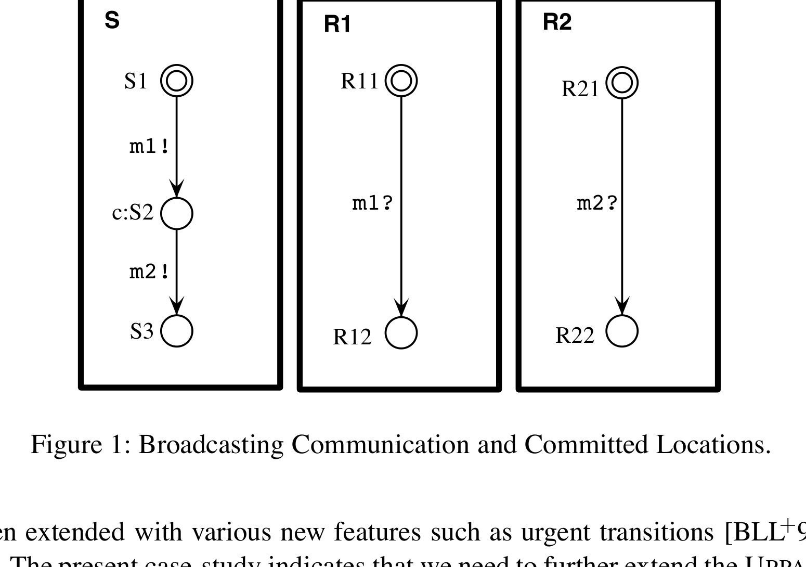

*Figure 1: Broadcasting Communication and Committed Locations.*

### 2.1 An Example

To introduce the notion of committed locations in timed automata, consider the scenario shown in Figure 1. A sender `S` is to broadcast a message `m` to two receivers `R_1` and `R_2`. As this requires synchronisation between three processes this can not directly be expressed in the UPPAAL model, where synchronisation is between two processes with complementary actions. As an initial attempt we may model the broadcast as a sequence of two two-process synchronisations, where first `S` synchronises with `R_1` on `m_1` and then with `R_2` on `m_2`. However, this is not an accurate model as the intended atomicity of the broadcast is not preserved, i.e. other processes may interfere during the broadcast sequence.

To ensure atomicity, we mark the intermediate location `S_2` of the sender `S` as a committed location, indicated by the `c:`-prefix. The atomicity of the action sequence `m_1!m_2!` is now achieved by insisting that committed sequences must be left immediately. This behaviour is similar to what has been called "urgent transitions" [HHWT95, DY95, BLL+95], which insists that the next transition taken must be an action and not a delay, but the essential difference is that no other actions should be performed in between such an atomic sequence. The precise semantics of committed locations will be formalised in the transition rules for networks of timed automata with data variables in Section 2.3.

### 2.2 Syntax

We assume a finite set of clock variables `C` ranged over by `x, y, z` and a finite set of data variables `D` ranged over by `i, j`. We use `\mathcal{B}(C)` to stand for the set of *clock constraints* that are conjunctive formulas of simple constraints in the form

$$
x \sim n
\qquad\text{or}\qquad
x - y \sim n,
$$

where `\sim \in \{<,\le,=,\ge,>\}` and `n` is a natural number. Similarly, we use `\mathcal{B}(D)` to stand for the set of *non-clock constraints* that are conjunctive formulas of

$$
i \sim j
\qquad\text{or}\qquad
i \sim k,
$$

where `\sim \in \{<,\le,=,\neq,\ge,>\}` and `k` is an integer number. We use `\mathcal{B}(C,D)`, ranged over by `g`, to denote the set of formulas that are conjunctions of clock constraints and non-clock constraints. The elements of `\mathcal{B}(C,D)` are called *constraints* or *guards*.

To manipulate clock and data variables, we use reset-sets, which are finite sets of reset-operations. A reset-operation on a clock variable is of the form

$$
x := n,
$$

where `n` is a natural number. A reset-operation on a data variable is of the form

$$
i := k * j + k',
$$

where `k, k'` are integers. A reset-set is a *proper* reset-set when variables are assigned a value at most once. We use `\mathcal{R}` to denote the set of all proper reset-sets.

We assume that processes synchronise with each other via complementary actions. Let `\mathcal{A}` be a set of action names with a subset `\mathcal{U}` of urgent actions on which processes should synchronise whenever possible. We use

$$
Act = \{\alpha? \mid \alpha \in \mathcal{A}\} \cup \{\alpha! \mid \alpha \in \mathcal{A}\} \cup \{\tau\}
$$

to denote the set of actions that processes can perform to synchronise with each other, where `\tau` is a distinct symbol representing internal actions. We use `name(a)` to denote the action name of `a`, defined by

$$
name(\alpha?) = name(\alpha!) = \alpha.
$$

An automaton `A` over actions `Act`, clock variables `C` and data variables `D` is a tuple

$$
\langle N, l_0, \longrightarrow, I, N_C \rangle,
$$

where `N` is a finite set of locations (control-locations) with a subset `N_C \subseteq N` being the set of committed locations, `l_0` is the initial location,

$$
\longrightarrow \;\subseteq\; N \times \mathcal{B}(C,D) \times Act \times \mathcal{R} \times N
$$

corresponds to the set of edges, and

$$
I : N \mapsto \mathcal{B}(C)
$$

is the invariant assignment function. To model urgency, we require that the guard of an edge with an urgent action is a non-clock constraint, i.e. if `name(a) \in \mathcal{U}` and `\langle l, g, a, r, l' \rangle \in \longrightarrow`, then `g \in \mathcal{B}(D)`.

In that case we shall write

$$
l \xrightarrow{g\,a\,r} l'
$$

to represent a transition from location `l` to location `l'` with guard `g`, action `a` to be performed, and reset-operations `r` to update the variables. Furthermore, we shall write `C(l)` whenever `l \in N_C`.

To model networks of processes, we introduce a CCS-like parallel composition operator for automata. Assume that `A_1, \ldots, A_n` are automata. We use `\bar{A}` to denote their parallel composition. The intuitive meaning of `\bar{A}` is similar to the CCS parallel composition of `A_1, \ldots, A_n` with all actions being restricted, that is,

$$
\bar{A} = (A_1 \mid \cdots \mid A_n)\setminus Act.
$$

Thus only synchronisation between the components `A_i` is possible. We call `\bar{A}` a *network of automata*. We simply view `\bar{A}` as a vector and use `A_i` to denote its `i`th component.

### 2.3 Semantics

Informally, a process modelled by an automaton starts at location `l_0` with all its variables initialised to `0`. The values of the clocks may increase synchronously with time at location `l` as long as the invariant condition `I(l)` is satisfied. At any time, the process can change location by following an edge

$$
l \xrightarrow{g\,a\,r} l'
$$

provided the current values of the variables satisfy the enabling condition `g`. With this transition, the variables are updated by `r`.

To formalise the semantics we shall use variable assignments. A *variable assignment* is a mapping which maps clock variables `C` to the non-negative reals and data variables `D` to integers. For a variable assignment `u` and a delay `d`, `u \oplus d` denotes the variable assignment such that

$$
(u \oplus d)(x) = u(x) + d
$$

for a clock variable `x`, and

$$
(u \oplus d)(i) = u(i)
$$

for any data variable `i`. This definition of `\oplus` reflects that all clocks proceed at the same speed and that data variables are time-insensitive.

For a reset-set `r` (a proper set of reset-operations), we use `r[u]` to denote the variable assignment `u'` with

$$
u'(v) = Value(e)_u
$$

whenever `(v := e) \in r`, and

$$
u'(v') = u(v')
$$

otherwise, where `Value(e)_u` denotes the value of `e` in `u`. Given a constraint `g \in \mathcal{B}(C,D)` and a variable assignment `u`, `g(u)` is a boolean value describing whether `g` is satisfied by `u` or not.

A control vector of a network `\bar{A}` is a vector of locations where `l_i` is a location of `A_i`. We write `\bar{l}[l_i'/l_i]` to denote the vector where the `i`th element of `\bar{l}` is replaced by `l_i'`. Furthermore, we shall write `C(\bar{l})` whenever `C(l_i)` for some `i`.

A state of a network is a configuration `(\bar{l}, u)` where `\bar{l}` is a control vector of `\bar{A}` and `u` is a variable assignment. The initial state of `\bar{A}` is `(\bar{l}^{\,0}, u^0)`, where `\bar{l}^{\,0}` is the initial control vector whose elements are the initial locations of the `A_i`'s and `u^0` is the initial variable assignment that maps all variables to `0`.

The *semantics of a network of automata* `\bar{A}` is given in terms of a transition system with the set of states being the configurations. The transition relation is defined by the following three rules, which are standard except that each rule has been augmented with conditions handling control-vectors with committed locations:

- Local internal transition:

  $$
  (\bar{l}, u) \leadsto \left(\bar{l}[l_i'/l_i], r_i[u]\right)
  $$

  if

  $$
  l_i \xrightarrow{g_i\,\tau\,r_i} l_i'
  $$

  and `g_i(u)` for some `l_i, g_i, r_i`, and for all `k`, if `C(l_k)` then `C(l_i)`.

- Synchronisation transition:

  $$
  (\bar{l}, u) \leadsto \left(\bar{l}[l_i'/l_i, l_j'/l_j], (r_j \cup r_i)[u]\right)
  $$

  if

  $$
  l_i \xrightarrow{g_i\,\alpha!\,r_i} l_i',
  \qquad
  l_j \xrightarrow{g_j\,\alpha?\,r_j} l_j',
  $$

  `g_i(u)`, `g_j(u)`, and `i \neq j`, for some `l_i, l_j, g_i, g_j, \alpha, r_i, r_j`, and for all `k`, if `C(l_k)` then `C(l_i)` or `C(l_j)`.

- Delay transition:

  $$
  (\bar{l}, u) \leadsto (\bar{l}, u \oplus d)
  $$

  if `I(\bar{l})(u)`, `I(\bar{l})(u \oplus d)`, `\neg C(\bar{l})`, and there are no

  $$
  l_i \xrightarrow{g_i\,\alpha?\,r_i},
  \qquad
  l_j \xrightarrow{g_j\,\alpha!\,r_j}
  $$

  such that `g_i(u)`, `g_j(u)`, `\alpha \in \mathcal{U}`, `i \neq j`, and the corresponding `l_i, l_j, r_i, r_j` exist.

where

$$
I(\bar{l}) = \bigwedge_i I(l_i).
$$

Intuitively, the first rule describes a local internal action transition in a component, and possibly the resetting of variables. An internal transition can occur if the current variable assignment satisfies the transition guard and if the control-location of any component is committed, only components in committed locations may take local transitions. Thus, only internal transitions of components in committed location may interrupt other components operating in committed locations.

The second rule describes synchronisation transitions that synchronise two components. If the control-location of any of the components is committed it is required that at least one of the synchronising components starts in a committed location. This requirement prevents transitions starting in non-committed locations from interfering with atomic, i.e. committed, transition sequences. However, two independent committed sequences may interfere with each other.

The third rule describes delay transitions, i.e. when all clocks increase synchronously with time. Delay transitions are permitted only while the location invariants of all components are satisfied. Delays are not permitted if the control-location of a component in the network is committed, or if an urgent transition, i.e. a synchronisation transition with urgent action, is possible. Note that the guards on urgent transitions are non-clock constraints whose truth-values are not affected by delays.

Finally, we note that the three rules give a semantics where transition sequences marked as committed are *instantaneous* in the sense that they happen without duration, and without interference from components operating in non-committed locations.

## 3 Committed Locations in UPPAAL

In this section we present a modified version of the model-checking algorithm of UPPAAL for networks of automata with committed locations.

### 3.1 The Model-Checking Algorithm

The model-checking algorithm performs reachability analysis to check for invariance properties $\forall\Box\beta$, and reachability properties $\exists\Diamond\beta$, with respect to a local property $\beta$ of the control locations and the values of the clock and data variables[^1]. It combines symbolic techniques with on-the-fly generation of the state-space in order to avoid explicit construction of the product automaton and the immediately caused memory problems. The algorithm is based on a partitioning of the otherwise infinite state-space into finitely many symbolic states of the form $(\bar{l}, D)$, where $D$ is a constraint system, i.e. a conjunction of clock constraints and non-clock constraints. It checks if any part of a symbolic state $(\bar{l}^{\,f}, D^f)$, i.e. a state $(\bar{l}^{\,f}, u_f)$ with $u_f \models D^f$, is reachable from the initial symbolic state $(\bar{l}^{\,0}, D^0)$, where $D^0$ expresses that all clock and data variables are initialised to $0$ [YPD94]. Throughout the rest of this paper we shall simply call $(\bar{l}, D)$ a *state* instead of symbolic state.

The algorithm essentially performs a forwards search of the state-space. The search is guided and pruned by two buffers: `WAITING`, holding states waiting to be explored, and `PASSED`, holding states already explored. Initially, `PASSED` is empty and `WAITING` holds the single state `(\bar{l}^{\,0}, D^0)`. The algorithm then repeats the following steps:

1. `S1.` Pick a state `(\bar{l}, D)` from the `WAITING` buffer.
2. `S2.` If `\bar{l} = \bar{l}^{\,f}` and `D \wedge D^f \neq \emptyset`, return the answer `yes`.
3. `S3.a.` If `\bar{l} = \bar{l}'` and `D \subseteq D'`, for some `(\bar{l}', D')` in the `PASSED` buffer, drop `(\bar{l}, D)` and go to step `S1`.
4. `S3.b.` Otherwise, save `(\bar{l}, D)` in the `PASSED` buffer.
5. `S4.` Find all successor states `(\bar{l}_s, D_s)` reachable from `(\bar{l}, D)` in one step and store them in the `WAITING` buffer.
6. `S5.` If the `WAITING` buffer is not empty, then go to step `S1`; otherwise return the answer `no`.

We will not treat the algorithm in detail here, but refer the reader to [YPD94, BL96].

Note that in step `S3.b` all explored states are stored in the `PASSED` buffer to ensure termination of the algorithm. In many cases, it will store the whole state-space of the analysed system which grows exponentially both in the number of clocks and components [YPD94]. The algorithm is therefore bound to run into space problems for large systems. The key question is how to reduce the growth of the `PASSED` buffer.

When committed locations are used to model atomic behaviours there are two potential possibilities to reduce the size of the `PASSED` buffer. First, as atomic sequences in general restrict the amount of interleaving that is allowed in a system [Hol91], the state-space of the system is reduced, and consequently also the number of states stored in the `PASSED` buffer. Secondly, as a sequence of committed locations semantically is instantaneous and non-interleaved with other components, it suffices to save only the non-committed control-location at the beginning of the sequence in the `PASSED` buffer to ensure termination. Hence, our proposed solution is simply *not* to save states in the `PASSED` buffer which involve committed locations. We modify step `S3` of the algorithm in the following way:

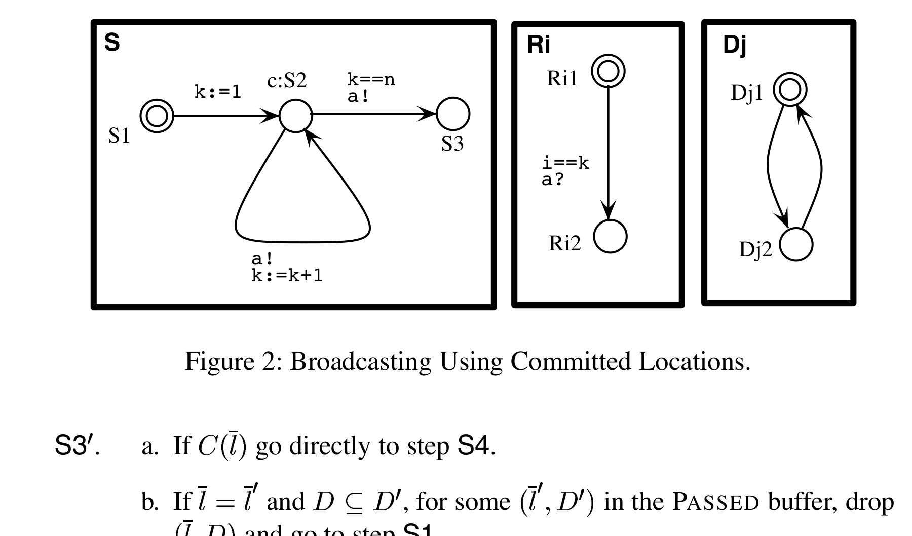

*Figure 2: Broadcasting Using Committed Locations.*

1. `S3'.a.` If `C(\bar{l})`, go directly to step `S4`.
2. `S3'.b.` If `\bar{l} = \bar{l}'` and `D \subseteq D'`, for some `(\bar{l}', D')` in the `PASSED` buffer, drop `(\bar{l}, D)` and go to step `S1`.
3. `S3'.c.` If neither of the above steps are applicable, save `(\bar{l}, D)` in the `PASSED` buffer.

So, for a given state `(\bar{l}, D)`, if `\bar{l}` is committed the algorithm proceeds directly from step `S3'.a` to step `S4`, thereby omitting the time-consuming step `S3'.b` and the space-consuming step `S3'.c`. Clearly, this will reduce the growth of the `PASSED` buffer and the total amount of time spent on step `S3`. In the following step `S4` more reductions are made as interleavings are not allowed when `\bar{l}` is committed. In fact, the next transition must be an action transition and it must involve an `l_i` which is committed in `\bar{l}` according to the transition rules in the previous section. This reduces the time spent on generating successor states of `(\bar{l}, D)` in `S4` as well as the total number of states in the system. Finally, we note that reducing the `PASSED` buffer size also yields potential time-savings in step `S3'.b` when `\bar{l}` is *not* committed, as it involves a search through the `PASSED` buffer.

It should be noticed that the algorithm presented in this section is not guaranteed to terminate if the notion of committed locations is used in an unintended way[^2]. For the modified algorithm to terminate, it is assumed that committed locations are used to model atomic behaviours. In particular this means that any sequence of committed control-locations must be of finite length.

### 3.2 Space and Time Performance Improvements

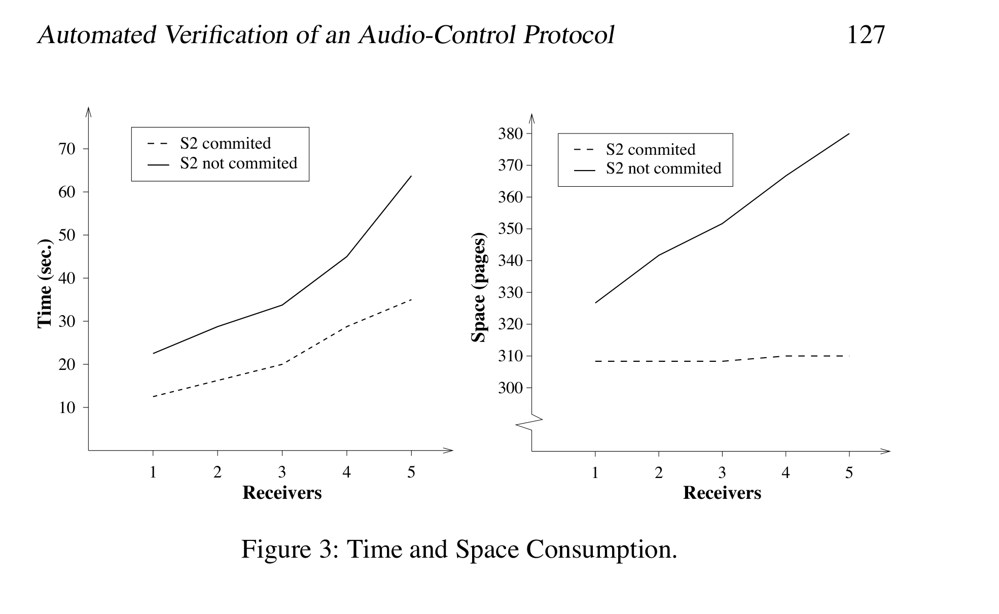

*Figure 3: Time and Space Consumption.*

To investigate the practical benefits from the usage of committed locations and its implementation in UPPAAL we perform an experiment with a parameterisable scenario, where a sender `S` wants to broadcast a message to `n` receivers `R_1, \ldots, R_n`. The sender `S` simply performs `n` `a!`-transitions and then terminates, whereas the receivers are all willing to perform a single `a?`-transition, thereby synchronising with the sender. The data variable `k` ensures that the `i`th receiver participates in the `i`th handshake. Additionally, there are `m` auxiliary automata `D_1, \ldots, D_m`, simply oscillating between two states. Consider Figure 2, where the control node `S_2` is committed, indicated by the `c:`-prefix.

We may now use UPPAAL to verify that the sender succeeds in broadcasting the message, i.e. it forces all the receivers to terminate. More precisely we verify that

$$
SYS_{n,m} = (S_n \mid R_1 \mid \cdots \mid R_n \mid D_1 \mid \cdots \mid D_m)
$$

satisfies the formula

$$
\exists\Diamond\Bigl(at(S,S_3) \wedge \bigwedge_{i=1}^{n} at(R_i,R_{i2})\Bigr),
$$

where we assume that the proposition `at(A,l)` is implicitly assigned to each location `l` of the automaton `A`, meaning that the component `A` is operating in location `l`. We perform two verifications, one with `S_2` declared as committed, and one with `S_2` being non-committed but with a location invariant $x \le 0$, where `x` is a clock which is reset on the transition from `S_1` to `S_2`, preventing the automaton from delaying in location `S_2`. The result is shown in Figure 3. In both test sequences the number of disturbing automata was fixed to eight. Time is measured in seconds and space is measured in pages (`4KB`). The general observation is that use of committed locations in broadcasting saves time as well as space. The most important observation is that in the committed scenario the space consumption behaves as a constant function in the number of receivers.

## 4 The Audio Control Protocol with Bus Collision

In this section an informal introduction to the audio protocol with bus collision is given. The audio control protocol is a bus protocol, all messages are received by all components on the bus. If a component receives a message not addressed to it, the message is just ignored. Philips allows up to 10 components.

Messages are transmitted using Manchester encoding. Time is divided into bit-slots of equal length, a bit "`0`" is transmitted by a down-going edge halfway a bit-slot, a bit "`1`" by an up-going edge halfway a bit-slot. If the same bit is transmitted twice in a row the voltage must of course change at the end of the first bit-slot. Note that only a single wire is used to connect the components, no extra clock wire is needed. This is one of the properties that makes it a useful protocol.

The protocol has to cope with some problems: `(a)` the sender and the receiver must agree on the beginning of the first bit-slot, `(b)` the length of the message is not known in advance by the receiver, `(c)` the down-going edges are not detected by the receiver. To resolve these problems the following is required: Messages must start with a bit "`1`" and messages must end with a down-going edge. This ensures that the voltage on the wire is low between messages. Furthermore the senders must respect a so-called "radio silence" between the end of a message and the beginning of the next one. The radio silence marks the end of a message and the receiver knows that the next up-going edge is the first edge of a new message. It is almost possible, and actually mandated in the Philips documentation, to decode a Manchester encoded message by only looking to the up-going edges, problem `(c)`; only the last zero bit of a message can not be detected, consider messages "`10`" and "`1`". To resolve this, it is required that all messages are of odd length.

It is possible that two or more components start transmitting at the same time. The behaviour of the electric circuit is such that the voltage on the wire will be high as long as one of the senders pulls it high. In other words: The wire implements the `or`-function. This makes it possible for a sender to notice that someone else is also transmitting. If the wire is high while it is transmitting a low, a sender can detect a bus collision. This collision detection happens at certain points in time: just before each up-going transition, and at one and three quarters of a bit-slot after a down-going edge, if it is still transmitting a low. When a sender detects a collision it will stop transmitting and will try to retransmit its message later.

If two messages are transmitted at the same time and one is a prefix of the other, the receiver will not notice the prefix message. To ensure collision detection it is not allowed that a message is a prefix of another message in transit. In the Philips environment this restriction is met by embedding the source address in each message and assigning each component a unique source address.

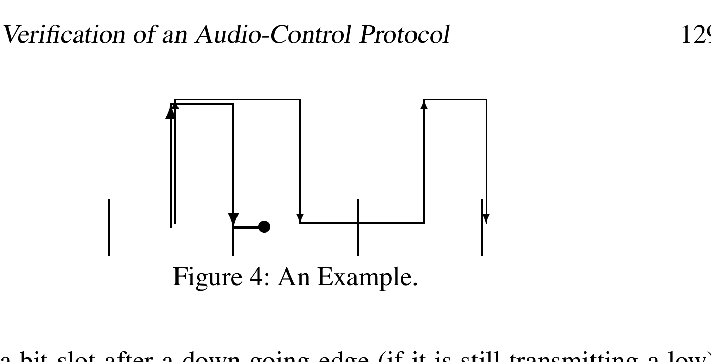

*Figure 4: An Example.*

In Figure 4 an example is depicted. Assume two senders, named `A` and `B`, that start transmitting at exactly the same time. Because two lines on top of each other are hard to distinguish from one line, in the picture they are shifted slightly. The sender `A`, depicted with thick lines, starts transmitting "`11...`" and sender `B`, depicted with thin lines, "`101...`". At the end of the first bit-slot sender `A` changes from high to low voltage, to prepare for the next up-going edge. But one quarter after this down it detects a collision and stops transmitting. Sender `B` did not notice the other sender and continues transmitting. Note that the receiver will decode the message of sender `B` correctly.

The protocol has to cope with one more thing: timing uncertainty. Because the protocol is implemented on a processor that also has to execute a number of other time critical tasks, a quite large timing uncertainty is allowed. A bit-slot is `888` microseconds, so the ideal time between two edges is `888` or `444` microseconds. On the generation of edges a timing uncertainty of $\pm 5\%$ is allowed. That is, between `844` and `932` for one bit-slot and between `422` and `466` for half a bit-slot. The collision detection just before an up-going edge and the actual generation of the same up-going edge should be separated by at most `20` microseconds according to the protocol specification. The timing uncertainty on the collision detection appearing at the first and third quarters after a down-going edge is $\pm 22$ microseconds. Also the receiver has a timing uncertainty of $\pm 5\%$. To complete the timing information, the distance between the end of one message and the beginning of the next must be at least `8000` microseconds, i.e. `8` milliseconds.

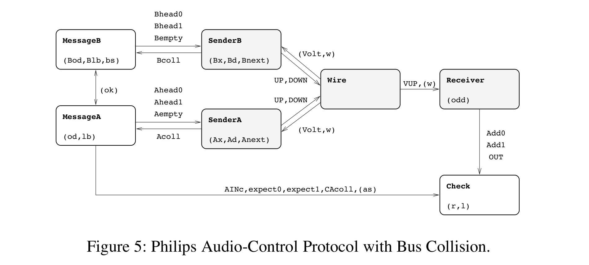

*Figure 5: Philips Audio-Control Protocol with Bus Collision.*

## 5 A Formal Model of the Protocol

To analyse the behaviour of the protocol we model the system as a network of seven timed automata. The network consists of two parts: a *core part* and a *testing environment*. The core part models the components of the protocol to be implemented: two senders, a wire and a receiver. The testing environment, consisting of two message generators, one for each sender, and an output checker, is used to model assumptions about the environment of the protocol and for testing the behaviour of the core part. Figure 5 shows a flow-graph of the network where nodes represent timed automata and edges represent synchronisation channels or shared variables, the latter enclosed within parentheses.

The general idea of the model is as follows. The two automata `MessageA` and `MessageB` are designed to non-deterministically generate possible valid messages for both senders as described in Section 4. In addition, `MessageA` informs the `Check` automaton on the bits it generated for `SenderA`. The senders transmit the messages via the wire to the receiver. We have chosen to model the wire as an automaton to separate its behaviour from the two senders and the receiver. The receiver communicates the bits it decoded to the checker. Thus the `Check` automaton is able to compare the bits generated by `MessageA` and the bits received by `Receiver`. If this matches, the protocol is correct.

The senders `A` and `B` are, modulo renaming, exactly the same. Because of the symmetry, it is enough to check that the messages transmitted by sender `A` are received correctly. If a scenario exists in which a message of sender `B` is received incorrectly, the same scenario, modulo renaming, exists for sender `A`. We will proceed with a short description of each automaton. The definition of these uses a number of constants that are declared in Table 1 in Appendix 8.

### The Senders

`SenderA` is depicted in Figure 10. It takes input actions `Ahead0?`, `Ahead1?` and `Aempty?`. The output actions `UP!` and `DOWN!` will be the Manchester encoding of the message. The clock `Ax` is used to measure the time between `UP!` and `DOWN!` actions. The idea behind the model, taken from [DY95], is that the sender changes location each half of a bit-slot. The locations `HS`, wire is High in Second half of the bit-slot, and `HF`, High in First half of the bit-slot, refer to this idea. Extra locations are needed because of the collision detection.

The clock `Ad` is used to measure the time elapsed between the detection just before `UP!` action and the corresponding `UP!` action. The system is in the locations `ar_Qfirst` and `ar_Qlast` when the next thing to do is the collision test at one or three quarters of a bit-slot. When `Volt` is greater than zero at that moment, the sender detects a collision, stops transmitting and returns to the idle location. The clock `w` is used to ensure the radio silence between messages. This variable is checked on the transition from `idle` to `ar_first_up`.

### The Wire

This small automaton keeps track of the voltage on the wire and generates `VUP!` actions when appropriate, that is when a `UP?` action is received when the voltage is low. The automaton is shown in Figure 9.

### The Receiver

`Receiver`, shown in Figure 8, decodes the bit sequence using the up-going, modelled as `VUP?`, changes of the wire. Decoded bits are signalled to the environment using output actions `Add0!`, `Add1!` and `OUT!`, where `OUT!` is used for signalling the end of a decoded message. The decoding algorithm of the receiver is a direct translation of the algorithm in the Philips documentation of the protocol. In the automaton each `VUP?` transition is followed by a transition modelling the decoding. This decoding happens at once, therefore the intermediate locations are modelled as committed locations. The automaton has two important locations, `L1` and `L0`. When the last received bit is a bit "`1`" the receiver is in location `L1`; after receiving a bit "`0`" it will be in location `L0`. The error location is entered when a `VUP?` is received much too early. In the complete model the error location is not reachable, see Section 6. The receiver keeps track of the parity of the received message using the integer variable `odd`. When the last received bit is a bit "`1`" and the message is even, a bit "`0`" is added to make the complete message of odd length.

### The Message Generators

The message generators `MessageA` and `MessageB`, shown in Figure 11, generate valid messages, i.e. any message for which the protocol should behave correctly according to the specification, for sender `A` and `B`. In addition, the messages generated for sender `A` are communicated to the checker. The start of a message is signalled to the checker by `AINc!`, bits by `expect0!` and `expect1!`. When a collision is detected by sender `A` this is communicated to `MessageA` via `Acoll?`. The message generator will communicate this on its turn to the `Check` automaton via `CAcoll!`.

Generating messages of odd length is quite simple. The only problem is that it is not allowed that a message for one sender is a prefix of the message for the other sender. To be more precise: if only one sender is transmitting there is no prefix restriction. Only when the two senders start transmitting at the same time, it is not allowed that one sender transmits a prefix of the message transmitted by the other. As mentioned before, the reason for this restriction is that the prefix message is not received by the receiver and it is possible that the senders do not notice the collision. In other words, the prefix message can be lost. To ensure that the two generated bit-streams differ on at least one position, the generator always compares the last generated bit-values stored in the variables `lb` and `Blb` on the edge from locations `sending0` or `sending1` to location `sending`. If the bits differ, the variable `ok` is set to `1`, which is a requirement for the message generation to end normally on the transition from `sending` to `idle` in the two automata.

### The Checker

This automaton is shown in Figure 7. It keeps track of the bits "in transit", i.e. the bits that are generated by the message generators but not yet decoded by the receiver. These bits are encoded using the two variables `l`, which stores the length of the bit-stream, and `r`, which stores the actual bit-stream in transit. Whenever a bit is decoded or the end of the message is detected not conforming to the generated message, the checker enters location `error`. Furthermore, when sender `A` detects a collision the checker returns to its initial location.

## 6 Verification in UPPAAL

In this section we present the results of analysing the Philips audio-control protocol formally described in the previous section. We will use $A.l$ to denote the implicit proposition $at(A,l)$ introduced in Section 3.2. Also, note that invariance properties in UPPAAL are on the form $\forall\Box\beta$, where $\beta$ is a local property.

### Correctness Criteria

The main correctness criterion of the protocol is to ensure that the bit sequence received by the `Receiver` matches the bit sequence sent by `SenderA`. Moreover, the *entire* bit sequence should be received by `Receiver` and communicated to `Check`. From the description of the `Check` automaton it follows that this behaviour is ensured if `Check` is always operating in location `start` or `normal`:

$$
\forall\Box(\text{Check.start} \lor \text{Check.normal})
$$

(1)

When the `Receiver` automaton observes changes of the wire too early it changes control to location `error`. If the rest of the components behave normally this should not happen. Therefore, the `Receiver` automaton is required to never reach the location `error`:

$$
\forall\Box(\neg \text{Receiver.error})
$$

(2)

### Incorrectness

Unfortunately the protocol described in this paper is not the protocol that Philips has implemented. The original sender checked less often for a bus collision. The "just before the up going edge" collision detection was only performed before the first `UP`. In the UPPAAL model this corresponds to deleting outgoing transitions of `ar_Qlast_ok` and using the outgoing transitions of `ar_up_ok` instead. This incorrect version is shown in Figure 12. In general the problem is that if both senders are transmitting and one is slow and the other fast, the distance can cumulate to a high value that can confuse the receiver. UPPAAL generated a counter-example trace to Property 1. The trace is depicted in Figure 6. The scenario is as follows: sender `A`, depicted with thick lines, tries to transmit "`111...`" and sender `B`, depicted with thin lines, "`1100...`". Sender `A` is fast and the other slow. This causes the distance between the second `UP`'s to be very big, `77` microseconds. In the third bit-slot sender `A` detects the collision. The result of all this is that the time elapsed between the `VUP` actions is $6.65Q$ instead of the ideal $6Q$.

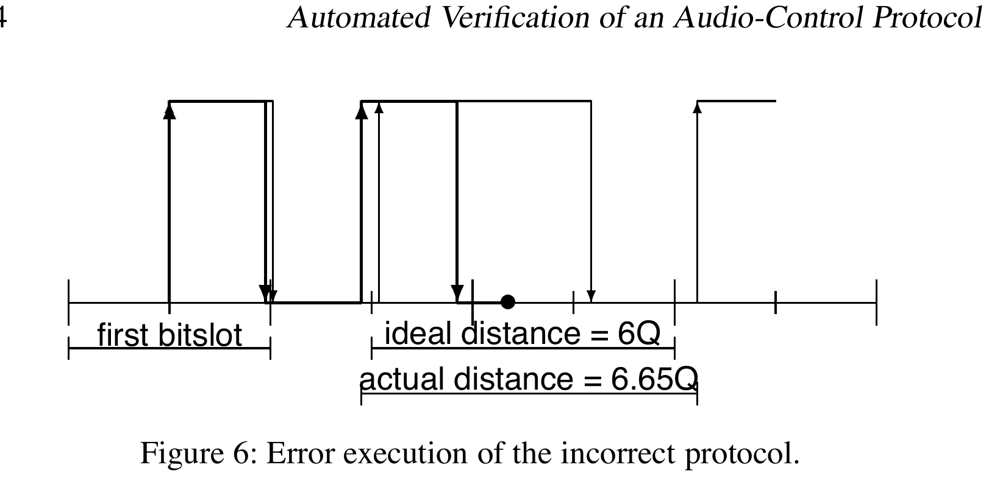

*Figure 6: Error execution of the incorrect protocol.*

Because of the timing uncertainty in the receiver this can be interpreted as $7Q$, since $7 * 0.95 = 6.65$, and $7Q$ is just enough to decode "`01`" instead of the transmitted "`0`". Thus, it is possible that the sent and received message differ with this version of the protocol.

In the correct version this scenario is impossible, because if collision detection happens before *every* `UP` action, the distance between the `UP`'s in the second bit-slot can not be that high, at most `20` microseconds.

It is not likely that these kind of errors happen in the actual implementation. First, it is not likely that two senders do start at sufficiently close time-points. Secondly, the timing uncertainty is at most $2\%$ instead of $5\%$, and the "average" timing uncertainty is even less. For more details, see [Gri94].

Although this problem was known by Philips it is interesting to see how powerful the diagnostic traces can be. It enables us not only to find mistakes in the *model* of a protocol, but also to find design mistakes in real-life protocols.

### Verification Results

UPPAAL successfully verifies the correctness properties 1 and 2 for an error tolerance of $5\%$ on the timing. Recall that `SenderA` and `SenderB` are, modulo renaming, exactly the same, implying that the verified properties for `SenderA` also apply to the symmetric case for `SenderB`. The verification of Property 1 and 2 was performed in `0.5` sec using `2.5 MB` of memory.

The analysis of the incorrect version of the protocol with less collision detection discussed above uses UPPAAL's ability to generate diagnostic traces whenever an invariant property is not satisfied by the system. The trace, consisting of `46` transitions, was generated in `0.4` sec using `2.5 MB` of memory. Also, verification of Property 1 for the protocol with full collision detection and an error tolerance of $6\%$ on all the timing produces an error trace as well. The scenario is similar to the one found by Bosscher et al. in [BPV94] for the one sender protocol.

The properties were verified using UPPAAL version `3.2` [LPY97a, BLL98, ABB01] that implements the verification algorithm handling committed locations described in Section 3. It was installed on a Pentium II `375 MHz` PC running Debian Linux `2.2`. In the conference version of this paper [BGK+96] we reported that the same protocol was verified using UPPAAL version `0.96`[^3] installed on a SGI ONYX machine. The verification of the two correctness properties then consumed `7.5 hrs` using `527.4 MB` and `1.32 hrs` using `227.9 MB`, whereas a diagnostic trace for the incorrect version was generated in `13.0 min` using `290.4 MB` of memory. Hence, both the time- and space-consumption of the verifier for this particular model have been reduced with over $99\%$. These improvements of the UPPAAL verifier are due to a number of developments in the last years that will not be discussed further here. It should also be noticed that the older version uses backwards analysis whereas the newer performs forwards analysis. For more information on the developments of UPPAAL we refer the reader to [LPY97b, BLL98, ABB01].

## 7 Conclusions

In this paper we have presented a case-study where the verification tool UPPAAL is used to verify an industrial audio-control protocol with bus-collision handling by Philips. The protocol has received a lot of attention in the formal methods research community, see e.g. [BPV94, HWT95, CW96], and simplified versions of the protocol without the handling of bus collisions have previously been analysed by several research teams, with and without support from automatic tools.

As verification results we have shown that the protocol behaves correctly if the error on all timing is bound to $5\%$, and incorrectly if the error is $6\%$. Furthermore, using UPPAAL's ability to generate diagnostic traces we have been able to study error scenarios in an incorrect version of the protocol actually implemented by Philips.

In this paper we have also introduced the notion of so-called committed locations which allows for more accurate modelling of atomic behaviours. More importantly, it is also utilised to guide the state-space exploration of the model checker to avoid exploring unnecessary interleavings of independent transitions. Our experimental results demonstrate considerable time and space-savings of the modified model checking algorithm. In fact, due to the huge time and memory-requirement, it was impossible to check certain properties of the protocol before the introduction of committed locations, and now it takes only seconds.

## References

- `[ABB 01]` Tobias Amnell, Gerd Behrmann, Johan Bengtsson, Pedro R. D'Argenio, Alexandre David, Ansgar Fehnker, Thomas Hune, Bertrand Jeannet, Kim G. Larsen, M. Oliver Möller, Paul Pettersson, Carsten Weise, and Wang Yi. *UPPAAL - Now, Next, and Future*. In F. Cassez, C. Jard, B. Rozoy, and M. Ryan, editors, *Modelling and Verification of Parallel Processes*, number 2067 in Lecture Notes in Computer Science, pages 100-125. Springer-Verlag, 2001.
- `[AD90]` Rajeev Alur and David Dill. *Automata for Modelling Real-Time Systems*. In Proceedings of the International Colloquium on Algorithms, Languages and Programming, number 443 in Lecture Notes in Computer Science, pages 322-335, July 1990.
- `[AK95]` Rajeev Alur and Robert P. Kurshan. *Timing Analysis in COSPAN*. In Rajeev Alur, Thomas A. Henzinger, and Eduardo D. Sontag, editors, *Proceedings of Workshop on Verification and Control of Hybrid Systems III*, number 1066 in Lecture Notes in Computer Science, pages 220-231. Springer-Verlag, October 1995.
- `[BGK+96]` Johan Bengtsson, W. O. David Griffioen, Kåre J. Kristoffersen, Kim G. Larsen, Fredrik Larsson, Paul Pettersson, and Wang Yi. *Verification of an Audio Protocol with Bus Collision Using UPPAAL*. In Rajeev Alur and Thomas A. Henzinger, editors, *Proceedings of the 8th International Conference on Computer Aided Verification*, number 1102 in Lecture Notes in Computer Science, pages 244-256. Springer-Verlag, July 1996.
- `[BL96]` Johan Bengtsson and Fredrik Larsson. *UPPAAL a Tool for Automatic Verification of Real-time Systems*. Master's thesis, Uppsala University, 1996. Available as `http://www.docs.uu.se/docs/rtmv/bl-report.pdf`.
- `[BLL+95]` Johan Bengtsson, Kim G. Larsen, Fredrik Larsson, Paul Pettersson, and Wang Yi. *UPPAAL - a Tool Suite for Automatic Verification of Real-Time Systems*. In *Proceedings of Workshop on Verification and Control of Hybrid Systems III*, number 1066 in Lecture Notes in Computer Science, pages 232-243. Springer-Verlag, October 1995.
- `[BLL98]` Johan Bengtsson, Kim G. Larsen, Fredrik Larsson, Paul Pettersson, Wang Yi, and Carsten Weise. *New Generation of UPPAAL*. In *International Workshop on Software Tools for Technology Transfer*, June 1998.
- `[BPV94]` D. Bosscher, I. Polak, and F. Vaandrager. *Verification of an Audio-Control Protocol*. In *Proceedings of Formal Techniques in Real-Time and Fault-Tolerant Systems*, number 863 in Lecture Notes in Computer Science, 1994.
- `[CW96]` Edmund M. Clarke and Jeanette M. Wing. Formal Methods: State of the Art and Future Directions. *ACM Computing Surveys*, 28(4):626-643, December 1996.
- `[DY95]` C. Daws and S. Yovine. *Two examples of verification of multirate timed automata with KRONOS*. In *Proceedings of the 16th IEEE Real-Time Systems Symposium*, pages 66-75. IEEE Computer Society Press, December 1995.
- `[Gri94]` W. O. David Griffioen. *Analysis of an Audio Control Protocol with Bus Collision*. Master's thesis, University of Amsterdam, Programming Research Group, 1994.
- `[HHWT95]` Thomas A. Henzinger, Pei-Hsin Ho, and Howard Wong-Toi. *HYTECH: The Next Generation*. In *Proceedings of the 16th IEEE Real-Time Systems Symposium*, pages 56-65. IEEE Computer Society Press, December 1995.
- `[HHWT97]` Thomas A. Henzinger, Pei-Hsin Ho, and Howard Wong-Toi. HYTECH: A Model Checker for Hybrid Systems. *International Journal on Software Tools for Technology Transfer*, 1(1-2):134-152, October 1997.
- `[HNSY94]` Thomas A. Henzinger, Xavier Nicollin, Joseph Sifakis, and Sergio Yovine. Symbolic Model Checking for Real-Time Systems. *Information and Computation*, 111(2):193-244, 1994.
- `[Hol91]` Gerard Holzmann. *The Design and Validation of Computer Protocols*. Prentice Hall, 1991.
- `[HWT95]` Pei-Hsin Ho and Howard Wong-Toi. *Automated Analysis of an Audio Control Protocol*. In *Proceedings of the 7th International Conference on Computer Aided Verification*, number 939 in Lecture Notes in Computer Science. Springer-Verlag, 1995.
- `[LLPY97]` Fredrik Larsson, Kim G. Larsen, Paul Pettersson, and Wang Yi. Efficient Verification of Real-Time Systems: Compact Data Structures and State-Space Reduction. In *Proceedings of the 18th IEEE Real-Time Systems Symposium*, pages 14-24. IEEE Computer Society Press, December 1997.
- `[LPY97a]` Kim G. Larsen, Paul Pettersson, and Wang Yi. UPPAAL in a Nutshell. *International Journal on Software Tools for Technology Transfer*, 1(1-2):134-152, October 1997.
- `[LPY97b]` Kim G. Larsen, Paul Pettersson, and Wang Yi. UPPAAL: Status and Developments. In Orna Grumberg, editor, *Proceedings of the 9th International Conference on Computer Aided Verification*, number 1254 in Lecture Notes in Computer Science, pages 456-459. Springer-Verlag, June 1997.
- `[LSW97]` Kim G. Larsen, Bernard Steffen, and Carsten Weise. Continuous modeling of real-time and hybrid systems: from concepts to tools. *International Journal on Software Tools for Technology Transfer*, 1(1-2):64-85, December 1997.
- `[Mil89]` R. Milner. *Communication and Concurrency*. Prentice Hall, Englewood Cliffs, 1989.
- `[ST01]` R. F. Lutje Spelberg and W. J. Toetenel. Parametric real-time model checking using splitting trees. *Nordic Journal*, 8(1):88-120, 2001.
- `[Yov97]` Sergio Yovine. A Verification Tool for Real Time Systems. *International Journal on Software Tools for Technology Transfer*, 1(1-2):134-152, October 1997.
- `[YPD94]` Wang Yi, Paul Pettersson, and Mats Daniels. *Automatic Verification of Real-Time Communicating Systems By Constraint-Solving*. In Dieter Hogrefe and Stefan Leue, editors, *Proceedings of the 7th International Conference on Formal Description Techniques*, pages 223-238. North-Holland, 1994.

## 8 Appendix

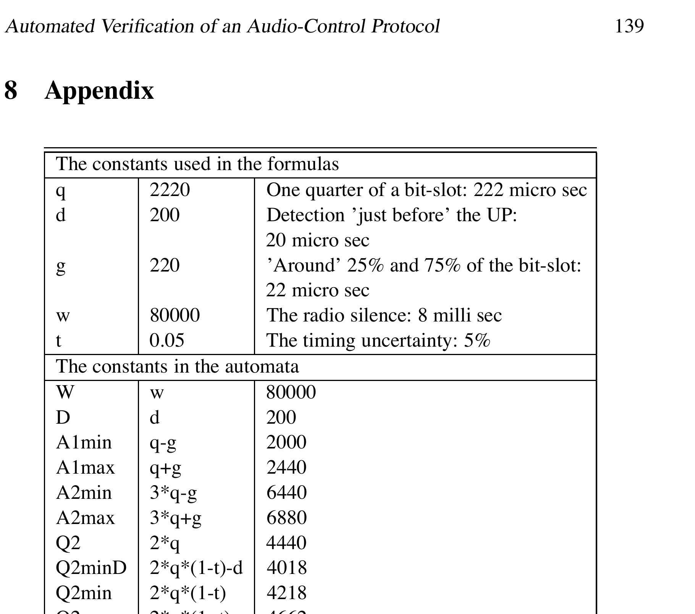

*Table 1: Declaration of Constants.*

### The Constants Used in the Formulas

| Name | Value | Meaning |
| --- | ---: | --- |
| `q` | `2220` | One quarter of a bit-slot: `222` micro sec |
| `d` | `200` | Detection "just before" the `UP`: `20` micro sec |
| `g` | `220` | "Around" `25%` and `75%` of the bit-slot: `22` micro sec |
| `w` | `80000` | The radio silence: `8` milli sec |
| `t` | `0.05` | The timing uncertainty: `5%` |

### The Constants in the Automata

| Name | Definition | Value |
| --- | --- | ---: |
| `W` | `w` | `80000` |
| `D` | `d` | `200` |
| `A1min` | `q - g` | `2000` |
| `A1max` | `q + g` | `2440` |
| `A2min` | `3*q - g` | `6440` |
| `A2max` | `3*q + g` | `6880` |
| `Q2` | `2*q` | `4440` |
| `Q2minD` | `2*q*(1-t)-d` | `4018` |
| `Q2min` | `2*q*(1-t)` | `4218` |
| `Q2max` | `2*q*(1+t)` | `4662` |
| `Q3min` | `3*q*(1-t)` | `6327` |
| `Q3max` | `3*q*(1+t)` | `6993` |
| `Q5min` | `5*q*(1-t)` | `10545` |
| `Q5max` | `5*q*(1+t)` | `11655` |
| `Q7min` | `7*q*(1-t)` | `14763` |
| `Q7max` | `7*q*(1+t)` | `16317` |
| `Q9min` | `9*q*(1-t)` | `18981` |
| `Q9max` | `9*q*(1+t)` | `20979` |

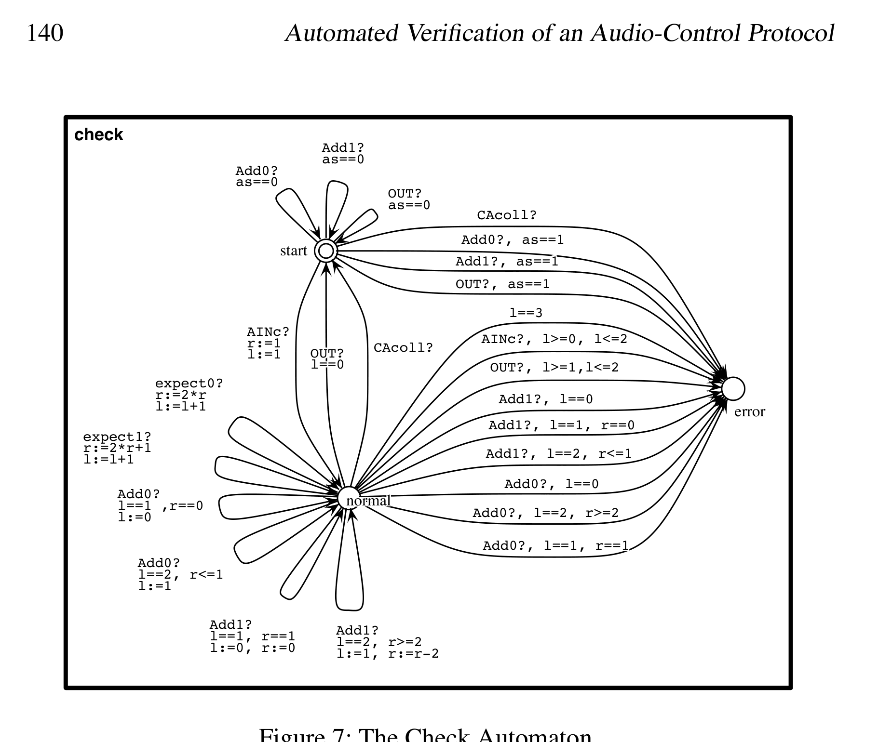

*Figure 7: The Check Automaton.*

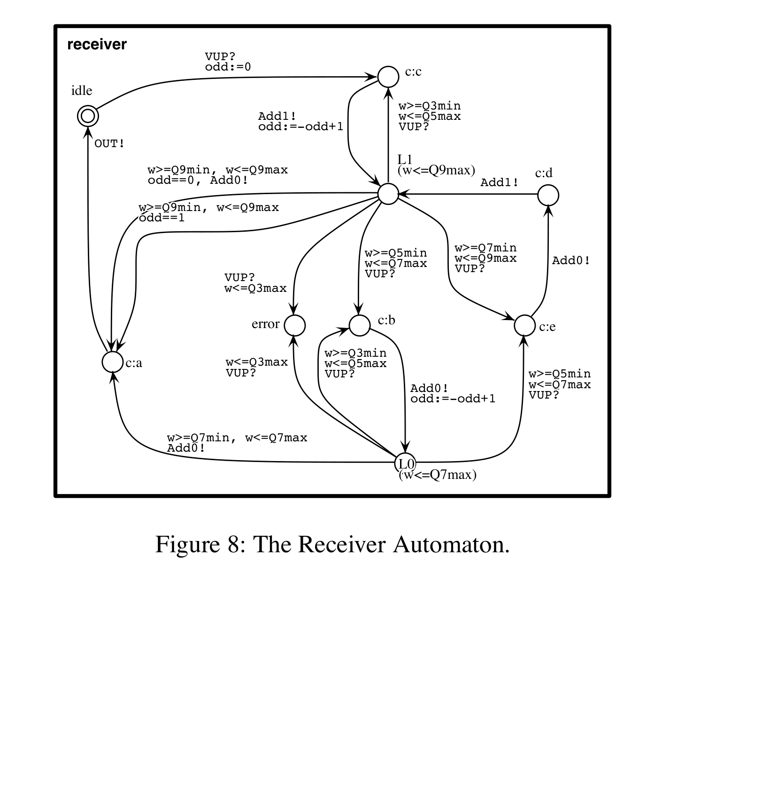

*Figure 8: The Receiver Automaton.*

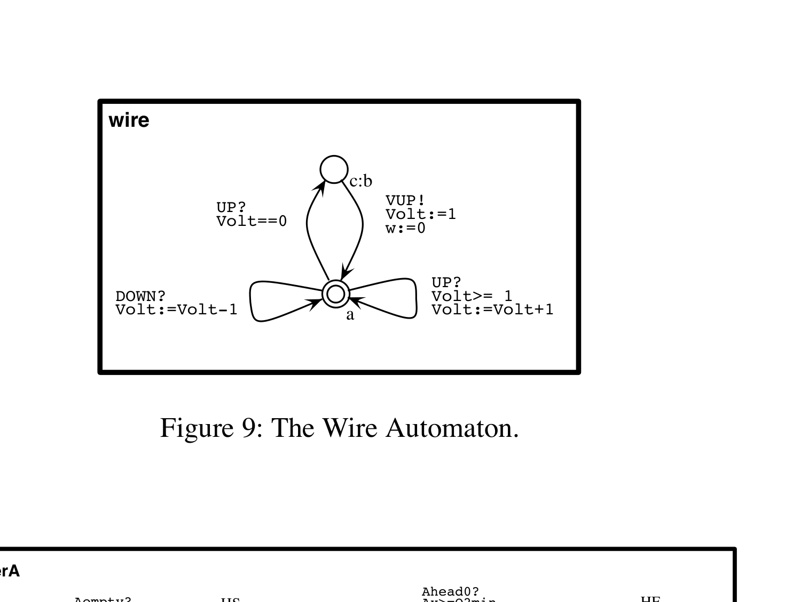

*Figure 9: The Wire Automaton.*

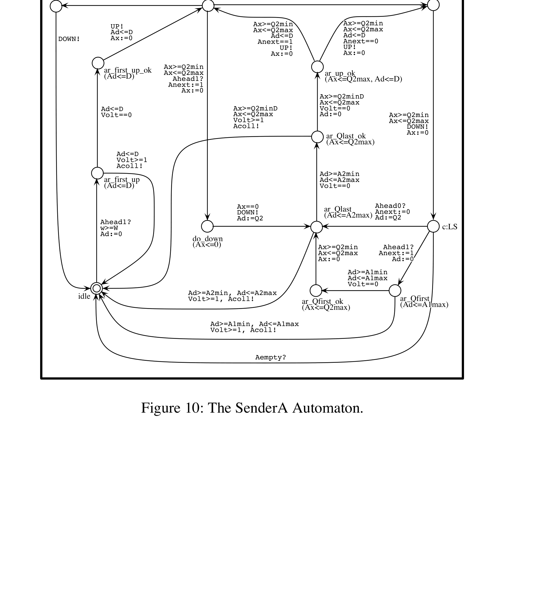

*Figure 10: The SenderA Automaton.*

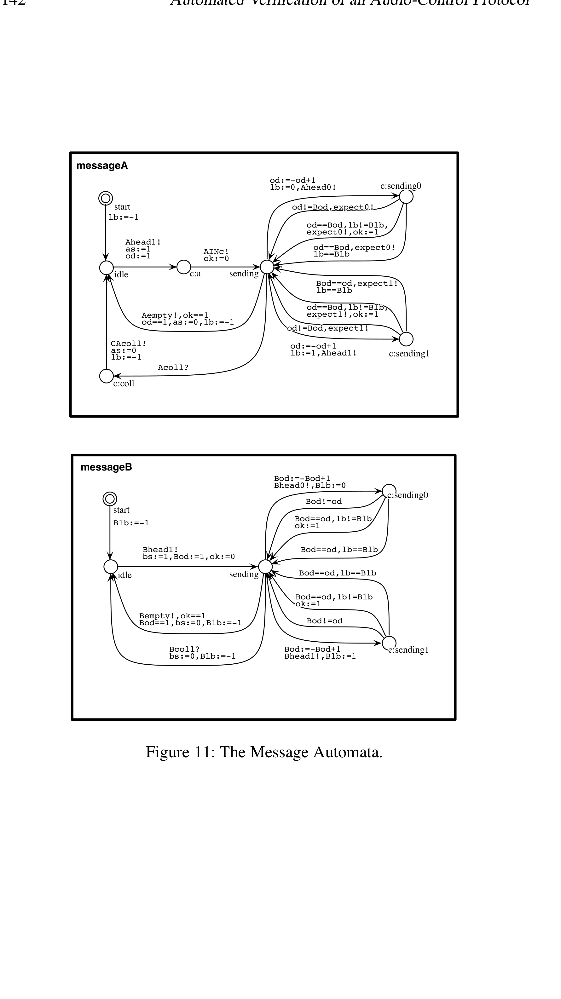

*Figure 11: The Message Automata.*

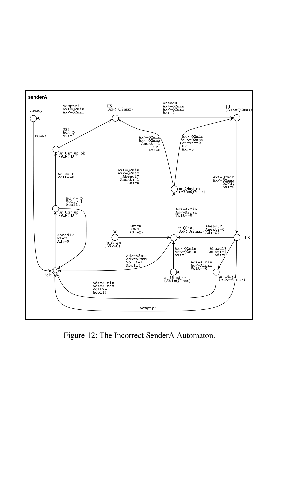

*Figure 12: The Incorrect SenderA Automaton.*

[^1]: From version 3.2 released in 2001, the model-checking algorithm in UPPAAL also supports liveness properties of the kind $\forall\Diamond\beta$ and $\exists\Box\beta$.
[^2]: In the current implementation of UPPAAL, the algorithm uses a technique presented in [LLPY97] to identify and store at least one so-called *covering state* in each *dynamic loop* to guarantee termination for all input models.
[^3]: The two UPPAAL versions `0.96` and `2.17` are dated November 1995 and March 1998 respectively.
