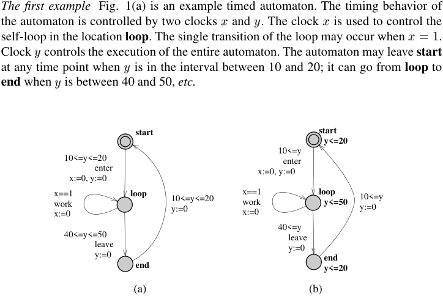
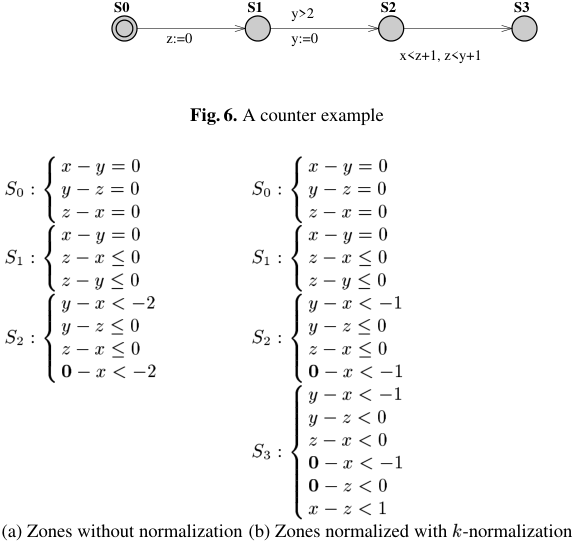
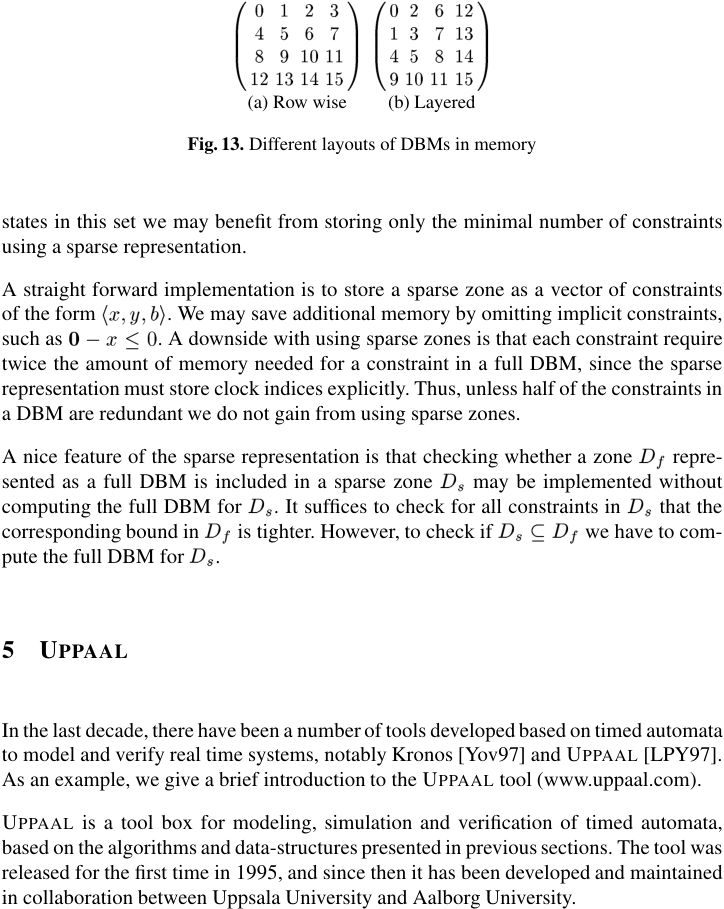
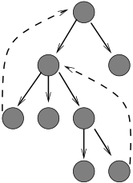

<!-- page: 1 -->

Timed Automata: Semantics, Algorithms and Tools
Johan Bengtsson and Wang Yi
Uppsala University
Email: {johanb,yi}@it.uu.se

## Abstract

This chapter is to provide a tutorial and pointers to results and related 1 Introduction Timed automata is a theory for modeling and verification of real time systems. Examples of other formalisms with the same purpose, are timed Petri Nets, timed process algebras, and real time logics [BD91,RR88,Yi91,NS94,AH94,Cha99]. Following the work of Alur and Dill [AD90,AD94], several model checkers have been developed with timed automata being the core of their input languages e.g. [Yov97,LPY97]. It is fair to say that they have been the driving force for the application and development of the theory. The goal of this chapter is to provide a tutorial on timed automata with a focus on the semantics and algorithms based on which these tools are developed. In the original theory of timed automata [AD90,AD94], a timed automaton is a finite-state Büchi automaton extended with a set of real-valued variables modeling clocks. Constraints on the clock variables are used to restrict the behavior of an automaton, and Büchi accepting conditions are used to enforce progress properties. A simplified version, namely Timed Safety Automata is introduced in [HNSY94] to specify progress properties using local invariant conditions. Due to its simplicity, Timed Safety Automata has been adopted in several verification tools for timed automata e.g. UPPAAL [LPY97] and Kronos [Yov97]. In this presentation, we shall focus on Timed Safety Automata, and following the literature, refer them as Timed Automata or simply automata when it is understood from the context. The rest of the chapter is organized as follows: In the next section, we describe the syntax and operational semantics of timed automata. The section also addresses decision problems relevant to automatic verification. In the literature, the decidability and undecidability of such problems are often considered to be the fundamental properties of a computation model. Section 3 presents the abstract version of the operational semantics based on regions and zones. Section 4 describes the data structure DBM (Difference

<!-- page: 2 -->

Bound Matrices) for the efficient representation and manipulation of zones, and operations on zones, needed for symbolic verification. Section 5 gives a brief introduction to the verification tool UPPAAL. Finally, as an appendix, we list the pseudo-code for the presented DBM algorithms. 2 Timed Automata A timed automaton is essentially a finite automaton (that is a graph containing a finite set of nodes or locations and a finite set of labeled edges) extended with real-valued variables. Such an automaton may be considered as an abstract model of a timed system. The variables model the logical clocks in the system, that are initialized with zero when the system is started, and then increase synchronously with the same rate. Clock constraints i.e. guards on edges are used to restrict the behavior of the automaton. A transition represented by an edge can be taken when the clocks values satisfy the guard labeled on the edge. Clocks may be reset to zero when a transition is taken. The first example Fig. 1(a) is an example timed automaton. The timing behavior of the automaton is controlled by two clocks x and y . The clock x is used to control the self-loop in the location loop. The single transition of the loop may occur when $x = 1$. Clock y controls the execution of the entire automaton. The automaton may leave start at any time point when y is in the interval between 10 and 20; it can go from loop to end when y is between 40 and 50, etc. start $y \le 20$ start $10 \le y$ enter $x := 0$, $y := 0$ $10 \le y \le 20$ enter $x := 0$, $y := 0$ loop $x = 1$ work $x := 0$ $10 \le y \le 20$ $y := 0$ loop $y \le 50$ $x = 1$ work $x := 0$ $10 \le y$ $y := 0$ $40 \le y$ leave $y := 0$ $40 \le y \le 50$ leave $y := 0$ end $y \le 20$ end (a) (b)

*Figure 1. Timed Automata and Location Invariants*

Timed Büchi Automata A guard on an edge of an automaton is only an enabling condition of the transition represented by the edge; but it can not force the transition to be taken. For instance, the example automaton may stay forever in any location, just

<!-- page: 3 -->

idling. In the initial work by Alur and Dill [AD90], the problem is solved by introducing Büchi-acceptance conditions; a subset of the locations in the automaton are marked as accepting, and only those executions passing through an accepting location infinitely often are considered valid behaviors of the automaton. As an example, consider again the automaton in Fig. 1(a) and assume that end is marked as accepting. This implies that all executions of the automaton must visit end infinitely many times. This imposes implicit conditions on start and loop. The location start must be left when the value of y is at most 20, otherwise the automaton will get stuck in start and never be able to enter end. Likewise, the automaton must leave loop when y is at most 50 to be able to enter end. Timed Safety Automata A more intuitive notion of progress is introduced in timed safety automata [HNSY94]. Instead of accepting conditions, in timed safety automata, locations may be put local timing constraints called location invariants. An automaton may remain in a location as long as the clocks values satisfy the invariant condition of the location. For example, consider the timed safety automaton in Fig. 1(b), which corresponds to the Büchi automaton in Fig. 1(a) with end marked as an accepting location. The invariant specifies a local condition that start and end must be left when y is at most 20 and loop must be left when y is at most 50. This gives a local view of the timing behavior of the automaton in each location. In the rest of this chapter, we shall focus on timed safety automata and refer such automata as Timed Automata or simply automata without confusion. 2.1 Formal Syntax Assume a finite set of real-valued variables C ranged over by x; y etc.standing for clocks and a finite alphabet \Sigma ranged over by a; b etc.standing for actions. Clock Constraints A clock constraint is a conjunctive formula of atomic constraints of the form x \sigma n or x y \sigma n for x; y 2 C; \sigma2 f\le; <; =; >; \geg and n 2 N . Clock constraints will be used as guards for timed automata. We use B (C ) to denote the set of clock constraints, ranged over by g and also by D later. Definition 1 (Timed Automaton) A timed automaton A is a tuple hN; l0 ; E; Ii where N is a finite set of locations (or nodes), – l 2 N is the initial location, – E \subseteq N × B C × \Sigma × C × N is the set of edges and – I N ! B C assigns invariants to locations g;a;r 0 ! l when hl; g; a; r; l0i 2 E . We shall write l – ( : ( ) )

<!-- page: 4 -->

As in verification tools e.g. UPPAAL [LPY97], we restrict location invariants to constraints that are downwards closed, in the form: $x \le n$ or $x < n$ where n is a natural number. Concurrency and Communication To model concurrent systems, timed automata can be extended with parallel composition. In process algebras, various parallel composition operators have been proposed to model different aspects of concurrency (see e.g. CCS and CSP [Mil89,Hoa78]). These algebraic operators can be adopted in timed automata. In the UPPAAL modeling language [LPY97], the CCS parallel composition operator [Mil89] is used, which allows interleaving of actions as well as hand-shake synchronization. The precise definition of this operator is given in Section 5. Essentially the parallel composition of a set of automata is the product of the automata. Building the product automaton is an entirely syntactical but computationally expensive operation. In UPPAAL, the product automaton is computed on-the-fly during verification. 2.2 Operational Semantics The semantics of a timed automaton is defined as a transition system where a state or configuration consists of the current location and the current values of clocks. There are two types of transitions between states. The automaton may either delay for some time (a delay transition), or follow an enabled edge (an action transition). To keep track of the changes of clock values, we use functions known as clock assignments mapping C to the non-negative reals + . Let u; v denote such functions, and use u 2 g to mean that the clock values denoted by u satisfy the guard g. For d 2 +, let u + d denote the clock assignment that maps all x 2 C to u(x) + d, and for r \subseteq C , let [r 7! 0℄u denote the clock assignment that maps all clocks in r to 0 and agree with u for the other clocks in C n r. R R Definition 2 (Operational Semantics) The semantics of a timed automaton is a transition system (also known as a timed transition system) where states are pairs hl; ui, and transitions are defined by the rules: – – d hl; ui ! hl; u di if u 2 I l and u d 2 I l for a non-negative real d 2 R a hl; ui ! hl0 ; u0i if l g;a;r! l0 ; u 2 g; u0 r 7! u and u0 2 I l0 + ( ) ( + ) = [ ( ) 0℄ ( + ) 2.3 Verification Problems The operational semantics is the basis for verification of timed automata. In the following, we formalize decision problems in timed automata based on transition systems.

<!-- page: 5 -->

Language Inclusion A timed action is a pair (t; a), where a 2 \Sigma is an action taken by an automaton A after t 2 + time units since A has been started. The absolute time t is called a time-stamp of the action a. A timed trace is a (possibly infinite) sequence of timed actions \sigma = (t1 ; a1 )(t2 ; a2 ):::(ti ; ai )::: where $ti \le ti$+1 for all $i \ge 1$. R Definition 3 A run of a timed automaton $A = hN$; l0 ; E; Ii with initial state over a timed trace \sigma = (t1 ; a1 )(t2 ; a2 )(t3 ; a3 )::: is a sequence of transitions: hl ; u i 0 hl ; u i d! a! hl ; u i d! a! hl ; u i d! a! hl ; u i : : : 2 satisfying the condition $ti = ti$ + di for all i \ge . The timed language L(A) is the set of all timed traces \sigma for which there exists a run of A over \sigma . Undecidability The negative result on timed automata as a computation model is that the language inclusion checking problem i.e. to check L(A) \subseteq L(B ) is undecidable [AD94,ACH94]. Unlike finite state automata, timed automata is not determinizable in general. Timed automata can not be complemented either, that is, the complement of the timed language of a timed automaton may not be described as a timed automaton. The inclusion checking problem will be decidable if B in checking L(A) \subseteq L(B ) is restricted to the deterministic class of timed automata. Research effort has been made to characterize interesting classes of determinizable timed systems e.g. event-clock automata [AFH99] and timed communicating sequential processes [YJ94]. Essentially, the undecidability of language inclusion problem is due to the arbitrary clock reset. If all the edges labeled with the same action symbol in a timed automaton, are also labeled with the same set of clocks to reset, the automaton will be determinizable. This covers the class of event-clock automata [AFH99]. We may abstract away from the time-stamps appearing in timed traces and define the untimed language Luntimed (A) as the set of all traces in the form a1 a2 a3 : : : for which there exists a timed trace \sigma = (t1 ; a1 )(t2 ; a2 )(t3 ; a3 )::: in the timed language of A. The inclusion checking problem for untimed languages is decidable. This is one of the classic results for timed automata [AD94]. Bisimulation Another classic result on timed systems is the decidability of timed bisimulation [Cer92]. Timed bisimulation is introduced for timed process algebras [Yi91]. However, it can be easily extended to timed automata. Definition 4 A bisimulation R over the states of timed transition systems and the alphabet \Sigma [ + , is a symmetrical binary relation satisfying the following condition: R for all \alpha s0 s ; s 2 R, if s ! ( 1 2) 0 0 0 (s ; s ) 2 R for some s . 1 for some \alpha 2 \Sigma[R + and \alpha s0 s0 , then s ! 1 and

<!-- page: 6 -->

Two automata are timed bisimilar iff there is a bisimulation containing the initial states of the automata. Intuitively, two automata are timed bisimilar iff they perform the same action transition at the same time and reach bisimilar states. In [Cer92], it is shown that timed bisimulation is decidable. We may abstract away from timing information to establish bisimulation between automata based actions performed only. This is captured by the notion of untimed bisim d ulation. We define s ! s0 if s ! s0 for some real number d. Untimed bisimulation is defined by by replacing the alphabet with \Sigma [ f g in Definition 4. As timed bisimulation, untimed bisimulation is decidable [LW97]. Reachability Analysis Perhaps, the most useful question to ask about a timed automaton is the reachability of a given final state or a set of final states. Such final states may be used to characterize safety properties of a system. R Definition 5 We shall write hl; ui ! hl0 ; u0 i if hl; ui ! hl0 ; u0 i for some \alpha 2 \Sigma [ + . For an automaton with initial state hl0 ; u0 i, hl; ui, is reachable iff hl0 ; u0 i!\to^{*} hl; ui. More generally, given a constraint \varphi 2 B (C ) we say that the configuration hl; \varphii is reachable if hl; ui is reachable for some u satisfying \varphi. \alpha The notion of reachability is more expressive than it appears to be. We may specify invariant properties using the negation of reachability properties, and bounded liveness properties using clock constraints in combination with local properties on locations [LPY01] (see Section 5 for an example). The reachability problem is decidable. In fact, one of the major advances in verification of timed systems is the symbolic technique [Dil89,YL93,HNSY94,YPD94,LPY95], developed in connection with verification tools. It adopts the idea from symbolic model checking for untimed systems, which uses boolean formulas to represent sets of states and operations on formulas to represent sets of state transitions. It is proven that the infinite state-space of timed automata can be finitely partitioned into symbolic states using clock constraints known as zones [Bel57,Dil89]. A detailed description on this is given in Section 3 and 4. 3 Symbolic Semantics and Verification As clocks are real-valued, the transition system of a timed automaton is infinite, which is not an adequate model for automated verification. 3.1 Regions, Zones and Symbolic Semantics The foundation for the decidability results in timed automata is based on the notion of region equivalence over clock assignments [AD94,ACD93].

<!-- page: 7 -->

Definition 6 (Region Equivalence) Let k be a function, called a clock ceiling, mapping each clock x 2 C to a natural number k (x) (i.e. the ceiling of x). For a real number d, let fdg denote the fractional part of d, and bd denote its integer part. Two : clock assignments u; v are region-equivalent, denoted u \sigmak v , iff 1. for all x, either bu(x) bv x or both u $x > k$ x and v $x > k$ x , 2. for all x, if u $x \le k$ x then fu x g iff fv x g and 3. for all x; y if u $x \le k$ x and u $y \le k$ y then fu x $g \le fu$ y g iff fv x $g \le fv$ y g Note that the region equivalence is indexed with a clock ceiling k . When the clock ceil( ) ( ( ) = ( ) ( ) ( ( ) ) ( ) = 0 ) ( ( ( ) ) ) ( ) ( ) = 0 ( ) ( ) ( ) ( ) ing is given by the maximal clock constants of a timed automaton under consideration, : : we shall omit the index and write \sigma instead. An equivalence class [u℄ induced by \sigma is called a region, where [u℄ denotes the set of clock assignments region-equivalent to u. The basis for a finite partitioning of the state-space of a timed automaton is the following facts. First, for a fixed number of clocks each of which has a maximal constant, the : number of regions is finite. Second, u \sigma v implies (l; u) and (l; v ) are bisimilar w.r.t. the untimed bisimulation for any locaton l of a timed automaton. We use the equivalence classes induced by the untimed bisimulation as symbolic (or abstract) states to construct a finite-state model called the region graph or region automaton of the original timed automaton. The transition relation between symbolic states is defined as follows: y x

*Figure 2. Regions for a System with Two Clocks*

– [ ℄ [ ℄ [ ℄ [ ℄ is finite. Several verification problems such as reachability analysis, untimed language inclusion, language emptiness [AD94] as well as timed bisimulation [Cer92] can be solved by techniques based on the region construction. However, the problem with region graphs is the potential explosion in the number of regions. In fact, it is exponential in the number of clocks as well as the maximal constants

<!-- page: 8 -->

appearing in the guards of an automaton. As an example, consider Fig. 2. The figure shows the possible regions in each location of an automaton with two clocks x and y . The largest number compared to x is 3, and the largest number compared to y is 2. In the figure, all corner points (intersections), line segments, and open areas are regions. Thus, the number of possible regions in each location of this example is 60. A more efficient representation of the state-space for timed automata is based on the notion of zone and zone-graphs [Dil89,HNSY92,YL93,YPD94,HNSY94]. In a zone graph, instead of regions, zones are used to denote symbolic states. This in practice gives a coarser and thus more compact representation of the state-space. The basic operations and algorithms for zones to construct zone-graphs are described in Section 4. As an example, a timed automaton and the corresponding zone graph (or reachability graph) is shown in Fig. 3. We note that for this automaton the zone graph has only 8 states. The region-graph for the same example has over 50 states. off; x off $x>10$ press? dim h press? h $x := 0$ h h h h $h \le i$ i $i \ge i$ $i \le i \ge i$ hbright; x ;$x = 0$ ;x 0 ; $x > 10$ ;$x = 0$ ;x 0 ;$x = 0$ ;press? x 10 ;x 0 $x \le 10$ press? = 0 hoff; $x \ge i$ 0 hdim; $x = 0 = 0$ i i hdim; $x \ge i$ 0 hoff; $x > i$ 10 hbright; $x \le i$ 10 hbright; $x \ge i$ bright

*Figure 3. A Timed Automaton and its Zone Graph*

A zone is a clock constraint. Strictly speaking, a zone is the solution set of a clock constraint, that is the maximal set of clock assignments satisfying the constraint. It is well-known that such sets can be efficiently represented and stored in memory as DBMs (Difference Bound Matrices) [Bel57]. For a clock constraint D, let [D℄ denote the maximal set of clock assignments satisfying D. In the following, to save notation, we shall use D to stand for [D℄ without confusion. Then B (C ) denotes the set of zones. A symbolic state of a timed automaton is a pair hl; Di representing a set of states of the automaton, where l is a location and D is a zone. A symbolic transition describes all the possible concrete transitions from the set of states. Definition 7 Let D be a zone and r a set of clocks. We define D" = fu + dju 2 D; d 2 denote the symbolic transition relation + g and r (D ) = f[r 7! 0℄u j u 2 Dg. Let over symbolic states defined by the following rules: R – hl; Di l; D" ^ I l ( )

<!-- page: 9 -->

– hl; Di hl0; r D ^ g ^ I l0 i if l ( ) ( ) ! l0 g;a;r We shall study these operations in details in Section 4 where D" is written as up(D) and r(D) as reset(D; $r := 0$). It will be shown that the set of zones B (C ) is closed under these operations, in the sense that the result of the operations is also a zone. Another important property of zones is that a zone has a canonical form. A zone D is closed under entailment or just closed for short, if no constraint in D can be strengthened without reducing the solution set. The canonicity of zones means that for each zone D 2 B (C ), there is a unique zone D0 2 B (C ) such that D and D0 have exactly the same solution set and D0 is closed under entailment. Section 4 describes how to compute and represent the canonical form of a zone. It is the key structure for the efficient implementation of state-space exploration using the symbolic semantics. The symbolic semantics corresponds closely to the operational semantics in the sense hl0 ; D0 i implies for all u0 2 D0 , hl; ui ! hl0 ; u0 i for some u 2 D. More that hl; Di generally, the symbolic semantics is a correct and full characterization of the operational semantics given in Definition 2. Theorem 1 Assume a timed automaton with initial state hl0 ; u0 i. 1. (soundness) hl0 ; fu0 gi 2. (Completeness) hl0 ; u0 such that uf 2 Df \to^{*} hlf ; Df i implies hl ; u i !\to^{*} hlf ; uf i for all uf 2 Df . i !\to^{*} hlf ; uf i implies hl ; fu gi \to^{*} hlf ; Df i for some Df 0 The soundness means that if the initial symbolic state hl0 ; fu0 gi may lead to a set of final states hlf ; Df i according to , all the final states should be reachable according to the concrete operational semantics. The completeness means that if a state is reachable according to the concrete operational semantics, it should be possible to conclude this using the symbolic transition relation. Unfortunately, the relation is infinite, and thus the zone-graph of a timed automaton may be infinite, which can be a problem to guarantee termination in a verification procedure. As an example, consider the automaton in Fig. 4. The value of clock y drifts away unboundedly, inducing an infinite zone-graph. The solution is to transform (i.e. normalize) zones that may contain arbitrarily large constants to their representatives in a class of zones whose constants are bounded by fixed constants e.g. the maximal clock constants appearing in the automaton, using an abstraction technique similar to the widening operation [Hal93]. The intuition is that once the value of a clock is larger than the maximal constant in the automaton, it is no longer important to know the precise value of the clock, but only the fact that it is above the constant. 3.2 Zone-Normalization for Automata without Difference Constraints In the original theory of timed automata [AD94], difference constraints are not allowed to appear in the guards. Such automata (whose guards contain only atomic constraints in

<!-- page: 10 -->

start; x $start = y$ hloop; x \le ^ x 10 $x := 0$, $y := 0$ loop $x \le 10$ hloop; x \le ^ y \le ^ y 10 $x = 10$ $x := 0$ hloop; x \le ^ y \le ^ y 10 x hloop; x \le ^ y \le ^ y $y \ge 20$ $x := 0$, $y := 0$ x y i $i = 10$ $i = 20$ $i = 30$ . . . end $x = hend$; $x = y$ i

*Figure 4. A Timed Automaton with an Infinite Zone-Graph*

the form x \sigma n) are known as diagonal-free automata in the literature in [BDGP98]. For diagonal-free automata, a well-studied zone-normalization procedure is the so-called k-normalization operation on zones [Rok93,Pet99]. It is implemented in several verification tools for timed automata e.g. UPPAAL to guarantee termination. Definition 8 (k -Normalization) Let D be a zone and k a clock ceiling. The semantics of the k -normalization operation on zones is defined as follows: normk (D) = fuju \sigmak : v; v 2 Dg Note that the normalization operation is indexed by a clock ceiling k . According to [Rok93,Pet99], normk (D) can be computed from the canonical representation of D by 1. removing all constraints of the form x where $m > k$ (x), < m, $x \le m$, x $y < m$ and x $y \le m$ 2. replacing all constraints of the form $x > m$, $x \ge m$, x $y > m$ and x where $m > k$ (x) with $x > k$ (x) and x $y > k$ (x) respectively. $y\gem$ Let [D℄k denote the resulted zone by the above transformation. This is exactly the nor: malized zone as defined in Definition 8, that is, [D℄$k = fuju$ \sigmak v; v 2 Dg As an example, the normalized zone-graph of the automaton in Fig. 4 is shown in Fig. 5 where the clock ceiling is given by the maximal clock constants appearing in the automaton. Note that for a fixed number of clocks with a clock ceiling k , there can be only finitely many normalized zones. The intuition is that if the constants allowed to use are bounded, one can write down only finitely many clock constraints. This gives rise to a finite characterization for !. Definition 9 hl; Di k hl0; normk D0 i if hl; Di hl0 ; D0 i. ( )

<!-- page: 11 -->

start; $x = hloop$; x \le ^ x 10 hloop; x \le ^ y \le ^ y 10 hloop; x \le ^ y x hloop; x \le ^ y > ^ y 10 $x = y$ i $i = 10$ $i = 20$ $x> y$ i hend; $x = y$ i

*Figure 5. Normalized Zone Graph for the Automaton in Fig. 4*

For the class of diagonal-free timed automata following sense. k is sound, complete and finite in the Theorem 2 Assume a timed automaton with initial state hl0 ; u0 i, whose maximal clock constants are bounded by a clock ceiling k . Assume that the automaton has no guards containing difference constraints in the form of x y \sigma n. 1. (soundness) hl0 ; fu0 gi \to^{*}k hlf ; Df i implies hl0 ; u0 i such that uf (x) \le k (x) for all x. !\to^{*} hlf ; uf i for all uf 2 Df 2. (Completeness) hl0 ; u0 i !\to^{*} hlf ; uf i with uf (x) \le k (x) for all x, implies hl0 ; fu0 gi \to^{*} hlf ; Df i for some Df such that uf 2 Df k 3. (Finiteness) The transition relation k is finite. Unfortunately the soundness will not hold for timed automata whose guards contain difference constraints. We demonstrate this by an example. Consider the automaton shown in Fig. 6. The final location of the automaton is not reachable according to the operational semantics. This is because in location S2 , the clock zone is (x $y > 2$ and $x > 2$) and the guard on the outgoing edge is $x < z$ + 1 ^$z < y$ + 1 which is equivalent to x $z < 1$ ^ z $y < 1$ ^ x $y < 2$. Obviously the zone at S2 can never enable the guard, and thus the last transition will never be possible. However, because the maximal constants for clock x is 1 (and 2 for y ), the zone in location S2 : x $y > 2$ ^ $x > 2$ will be normalized to x $y > 1$ ^ $x > 1$ by the maximal constant 1 for x, which enables the guard x $z < 1$ ^ z $y < 1$ and thus the symbolic reachability analysis based on the above normalization algorithm would incorrectly conclude that the last location is reachable. The zones in canonical forms, generated in exploring the state-space of the counter example are given in Fig. 7. The implicit constraints that all clocks are non-negative are not shown.

<!-- page: 12 -->

S0 S1 $z := 0$ $y>2$ S2 S3 $y := 0$ $x<z$+1, $z<y$+1 $8 <x$ S0 : y :z $8 <x$ S1 : z :z 8 > < yy S2 : z > :0

*Figure 6. A counter example*

$y=0$ $z=0$ $x=0$ $y=0$ $x\le0$ $y\le0$ $x< 2$ $z\le0$ $x\le0$ $x< 2$ $8 <x$ S0 : y :z $8 <x$ S1 : z :z 8 > < yy S2 : z > : 8 y0 > > > < yz S3 : 0 > > > : x0 $y=0$ $z=0$ $x=0$ $y=0$ $x\le0$ $y\le0$ $x< 1$ $z\le0$ $x\le0$ $x< 1$ $x< 1$ $z<0$ $x<0$ $x< 1$ $z<0$ $z<1$ (a) Zones without normalization (b) Zones normalized with k-normalization

*Figure 7. Zones for the counter example in Fig. 6*

Note that at S0 and S1 , the normalized and un-normalized zones are identical. The problem is at S2 where the intersection of the guard (on the only outgoing edge) with the un-normalized zone is empty and non-empty with the normalized zone. 3.3 Zone-Normalization for Automata with Difference Constraints Our definition of timed automata (Definition 1) allows any clock constraint to appear in a guard, which may be a difference constraint in the form of x y \sigma n. Such automata are indeed needed in many applications e.g. to model scheduling problems [FPY02]. It is shown that an automaton containing difference constraints can be transformed to an equivalent diagonal-free automaton [BDGP98]. However, the transformation is not applicable since it is based on the region construction. Besides, it is impractical to implement such an approach in a tool. Since the transformation modifies the model before analysis, it is difficult to trace debugging information provided by the tool back to the original model.

<!-- page: 13 -->

In [Ben02,BY03], a refined normalization algorithm is presented for automata that may have guards containing difference constraints. The algorithm transforms DBMs according to not only the maximal constants of clocks but also difference constraints appearing in the automaton under consideration. Note that the difference constraints correspond to the diagonal lines which split the entire space of clock assignments. A finer partitioning is needed. We present the semantical characterization for the refined normalization operation based on a refined version of the region equivalence from Definition 6. Definition 10 (Normalization Using Difference Constraints) Let G stand for a finite set of difference constraints of the form x y \sigma n for x; y 2 C , \sigma2 f\le; <; =; >; \geg and n 2: N , and k for a clock ceiling. Two clock assignments u; v are equivalent, denoted u \sigmak;G v if the following holds: u \sigma: k v and – for all g 2 G , u 2 g iff v 2 g . The semantics of the refined k -normalization operation on zones is defined as follows: normk;G D fuju \sigma: k;G v; v 2 Dg – ( ) = Note that the refined region equivalence is indexed by both a clock ceiling k and a finite set of difference constraints G , and so is the normalization operation. Since the number of regions induced by \sigmak is finite and there are only finitely many : constraints in G , \sigmak;G induces finitely many equivalence classes. Thus for any given zone D, normk;G (D) is well-defined in the sense that it contains only a finite set of equivalence classes though the set may not be a convex zone, and it can be computed effectively according to the refined regions. In general, normk;G (D) is a non-convex zone, which can be implemented as the union of a finite list of convex zones. The next section will show how to compute this efficiently. : The refined zone-normalization gives rise to a finite characterization for !. Definition 11 hl; Di G hl0 ; normk;G (D0 )i if hl; Di hl0 ; D0 i. k; The following states the correctness and finiteness of G. k; Theorem 3 Assume a timed automaton with initial state hl0 ; u0 i, whose maximal clock constants are bounded by a clock ceiling k , and whose guards contain only a finite set of difference constraints denoted G . 1. (soundness) hl0 ; fu0 gi ( k;G )\to^{*} hlf ; Df i implies hl0 ; u0 i !\to^{*} Df such that uf (x) \le k(x) for all x. hlf ; uf i for all uf 2 2. (Completeness) hl0 ; u0 i !\to^{*} hlf ; uf i with uf (x) \le k (x) for all x implies hl0 ; fu0 gi \to^{*} ( k;G ) hlf ; Df i for some Df such that uf 2 Df 3. (Finiteness) The transition relation G is finite. k;

<!-- page: 14 -->

### 3.4 Symbolic Reachability Analysis

Model-checking concerns two types of properties liveness and safety. The essential algorithm of checking liveness properties is loop detection, which is computationally expensive. The main effort on verification of timed systems has been put on safety properties that can be checked using reachability analysis by traversing the state-space of timed automata. Algorithm 1 Reachability analysis =; = fh $ig =6$ ; h i = ^ \ 6= ; 6\subseteq h i2 h i h i h i h i PASSED ; WAIT l0 ; D0 while WAIT do take l; D from WAIT then return “YES” if l lf D \varphif if D D0 for all l; D0 PASSED then add l; D to PASSED for all l0 ; D0 such that l; D k; l0 ; D0 do 0 0 add l ; D to WAIT end for end if end while return “NO” Gh i Reachability analysis can be used to check properties on states. It consists of two basic steps, computing the state-space of an automaton under consideration, and searching for states that satisfy or contradict given properties. The first step can either be performed prior to the search, or done on-the-fly during the search process. Computing the statespace on-the-fly has an obvious advantage over pre-computing, in that only the part of the state-space needed to prove the property is generated. It should be noted though, that even on-the-fly methods will generate the entire state-space to prove certain properties, e.g. invariant properties. Several model-checkers for timed systems are designed and optimized for reachability analysis based on the symbolic semantics and the zone-representation (see Section 4). As an example, we present the core of the verification engine of UPPAAL (see Algorithm 1). Assume a timed automaton A with a set of initial states and a set of final states (e.g. the bad states) characterized as hl0 ; D0 i and hlf ; \varphif i respectively. Assume that k is the clock ceiling defined by the maximal constants appearing in A and \varphif , and G denotes the set of difference constraints appearing in A and \varphif . Algorithm 1 can be used to check if the initial states may evolve to any state whose location is lf and whose clock assignment satisfies \varphif . It computes the normalized zone-graph of the automaton onthe-fly, in search for symbolic states containing location lf and zones intersecting with \varphif .

<!-- page: 15 -->

The algorithm computes the transitive closure of k;G step by step, and at each step, checks if the reached zones intersect with \varphif . From Theorem 2, it follows that the algorithm will return with a correct answer. It is also guaranteed to terminate because k;G is finite. As mentioned earlier, for a given timed automaton with a fixed set of clocks whose maximal constants are bounded by a clock ceiling k , and a fixed set of diagonal constraints contained in the guards, the number of all possible normalized zones is bounded because a normalized zone can not contain arbitrarily large or arbitrarily small constants. In fact the smallest possible zones are the refined regions. Thus the whole state-space of a timed automaton can only be partitioned into finitely many symbolic states and the worst case is the size of the region graph of the automaton, induced by the refined region equivalence. Therefore, the algorithm is working on a finite structure and it will terminate. Algorithm 1 also highlights some of the issues in developing a model-checker for timed automata. Firstly, the representation and manipulation of states, primarily zones, is crucial to the performance of a model-checker. Note that in addition to the operations to compute the successors of a zone according to k;G , the algorithm uses two more operations to check the emptiness of a zone as well as the inclusion between two zones. Thus, designing efficient algorithms and data-structures for zones is a major issue in developing a verification tool for timed automata, which is addressed in Section 4. Secondly, PASSED holds all encountered states and its size puts a limit on the size of systems we can verify. This raises the research challenges e.g. state compression [Ben02], state-space reduction [BJLY98] and approximate techniques [Bal96]. 4 DBM: Algorithms and Data Structures The preceding section presents the key elements needed in symbolic reachability analysis. Recall that the operations on zones are all defined in terms of sets of clock assignments. It is not clear how to compute the result of such an operation. In this section, we describe how to represent zones, compute the operations and check properties on zones. Pseudo code for the operations is given in the appendix. 4.1 DBM basics Recall that a clock constraint over C is a conjunction of atomic constraints of the form x \sigma m and x y \sigma n where x; y 2 C , \sigma2 f\le; <; =; >; \geg and m; n 2 N . A zone denoted by a clock constraint D is the maximal set of clock assignments satisfying D. The most important property of zones is that they can can be represented as matrices i.e. DBMs (Difference Bound Matrices) [Bel57,Dil89], which have a canonical representation. In the following, we describe the basic structure and properties of DBMs. To have a unified form for clock constraints we introduce a reference clock 0 with the constant value 0. Let $C0 = C$ [ f0g. Then any zone D 2 B (C ) can be rewritten as a conjunction of constraints of the form x y \preceq n for x; y 2 C0 , \preceq2 f<; \leg and n 2 . Z

<!-- page: 16 -->

Naturally, if the rewritten zone has two constraints on the same pair of variables only the intersection of the two is significant. Thus, a zone can be represented using at most jC0 j2 atomic constraints of the form x y \preceq n such that each pair of clocks x y is mentioned only once. We can then store zones using jC0 j × jC0 j matrices where each element in the matrix corresponds to an atomic constraint. Since each element in such a matrix represents a bound on the difference between two clocks, they are named Difference Bound Matrices (DBMs). In the following presentation, we use Dij to denote element (i; j ) in the DBM representing the zone D . To construct the DBM representation for a zone D, we start by numbering all clocks in C0 as 0; : : : ; n and the index for 0 is 0. Let each clock be denoted by one row in the matrix. The row is used for storing lower bounds on the difference between the clock and all other clocks, and thus the corresponding column is used for upper bounds. The elements in the matrix are then computed in three steps. – For each constraint xi – xj \preceq n of D, let Dij n; \preceq . For each clock difference xi xj that is unbounded in D, let Dij 1. Where 1 = ( ) = is a special value denoting that no bound is present. xi \le , and \le . As an example, consider the zone D x 0 < ^y 0 \le ^y x \le ^x y \le ^ 0 z < . To construct the matrix representation of D, we number the clocks in the order 0; x; y; z . The resulting matrix representation is shown below: – Finally add the implicit constraints that all clocks are positive, i.e. 0 that the difference between a clock and itself is always 0, i.e. xi $xi = MD$ ( ) = ;\le ;< ;\le 1 (0 B (20 B (20 ;\le ;\le ;\le 1 ) (0 ) (0 ) (10 ; \le ;< ;\le 1 ;\le 1 1 ;\le ) (0 ) (5 ) ( ) ) (0 ) (0 ) 1 C C A ) To manipulate DBMs efficiently we need two operations on bounds: comparison and addition. We define that (n; \preceq) < 1, (n1 ; \preceq1 ) < (n2 ; \preceq2 ) if $n1 < n2$ and (n; <) < (n; \le). Further we define addition as b1 + $1 = 1$, (m; \le) +(n; \le) = (m + n; \le) and (m; <) + (n; \preceq) = (m + n; <). Canonical DBMs Usually there are an infinite number of zones sharing the same solution set. However, for each family of zones with the same solution set there is a unique constraint where no atomic constraint can be strengthened without losing solutions. To compute the canonical form of a given zone we need to derive the tightest constraint on each clock difference. To solve this problem, we use a graph-interpretation of zones. A zone may be transformed to a weighted graph where the clocks in C0 are nodes and the atomic constraints are edges labeled with bounds. A constraint in the form of x y \preceq n will be converted to an edge from node y to node x labeled with (n; \preceq), namely the distance from y to x is bounded by n.

<!-- page: 17 -->

(0; \le) (0; \le) ) (0 ; (1 0; ) < < \le) (0 ; (2 0; \le) x ( \le) (a) y (0; (10; \le) \le) \le) ; 10; (0; (0 \le) \le) 0; 0; \le) ( (10; (2 (2 x ; \le) (0 (0; \le) \le) 10; \le) (0; \le) y (b)

*Figure 8. Graph interpretation of the example zone and its closed form*

As an example, consider the zone x $0 < 20$ ^ y $0 \le 20$ ^ y $x \le 10$^ x $y \le 0 \le 20$ and x $y \le 10$ we derive 10. By combining the atomic constraints y that x $0 \le 10$, i.e. the bound on x 0 can be strengthened. Consider the graph interpretation of this zone, presented in Fig. 8(a). The tighter bound on x 0 can be derived from the graph, using the path 0 ! y ! x, giving the graph in Fig. 8(b). Thus, deriving the tightest constraint on a pair of clocks in a zone is equivalent to finding the shortest path between their nodes in the graph interpretation of the zone. The conclusion is that a canonical, i.e. closed, version of a zone can be computed using a shortest path algorithm. Floyd-Warshall algorithm [Flo62] (Algorithm 2) is often used to transform zones to canonical form. However, since this algorithm is quite expensive (cubic in the number of clocks), it is desirable to make all frequently used operations preserve the canonical form, i.e. the result of performing an operation on a canonical zone should also be canonical. Minimal Constraint Systems A zone may contain redundant constraints. For example, a zone contains constraints x $y < 2$; y $z < 5$ and x $z < 7$. The constraint x $z < 7$ is obviously redundant because it may be derived from the first two. It is desirable to remove such constraints to store only the minimal number of constraints. Consider, for instance, the zone x $y \le 0$ ^ y $z \le 0$ ^ z $x \le 0$ ^ $2 \le x$ $0 \le 3$. This is a zone in a minimal form containing only five constraints. The closed form of this zone contains more than 12 constraints. It is known, e.g. from [LLPY97], that for each zone there is a minimal constraint system with the same solution set. By computing this minimal form for all zones and storing them in memory using a sparse representation we might reduce the memory consumption for state-space exploration. This problem has been thoroughly investigated in [LLPY97,Pet99,Lar00]. The following is a summary of the published work on the minimal representation of zones. We present an algorithm that computes the minimal form of a closed DBM. Closing a DBM corresponds to computing the shortest path between all clocks. Our goal is to compute the minimal set of bounds for a given shortest path closure. For clarity, the algorithm is presented in terms of directed weighted graphs. However, the results are directly applicable to the graph interpretation of DBMs.

<!-- page: 18 -->

First we introduce some notation: we say that a cycle in a graph is a zero cycle if the nij sum of weights along the cycle is 0, and an edge xi ! xj is redundant if there is another path between xi and xj where the sum of weights is no larger than nij . In graphs without zero cycles we can remove all redundant edges without affecting the shortest path closure [LLPY97]. Further, if the input graph is in shortest path form (as for closed DBMs) all redundant edges can be located by considering alternative paths of length two. As an example, consider Fig. 9. The figure shows the shortest path closure for a zero9 cycle free graph (a) and its minimal form (b). In the graph we find that x1 ! x2 is 2 7 made redundant by the path x1 ! x4 ! x2 and can thus be removed. Further, the edge x3 15! x2 is redundant due to x3 !5 x1 !9 x2 . Note that we consider edges marked as redundant when searching for new redundant edges. The reason is that we let the redundant edges represent the path making them redundant, thus allowing all redundant edges to be located using only alternative paths of length two. This procedure is repeated until no more redundant edges can be found. 9 x1 x2 x1 x3 x2 5 x4 x3 x4 (a) (b)

*Figure 9. A zero cycle free graph and its minimal form*

This gives the O(n3 ) procedure for removing redundant edges presented in Algorithm 3. The algorithm can be directly applied to zero-cycle free DBMs to compute the minimal number of constraints needed to represent a given zone. However, this algorithm will not work if there are zero-cycles in the graph. The reason is that the set of redundant edges in a graph with zero-cycles is not unique. As an example, consider the graph in Fig. 10(a). Applying the above reasoning on this graph 5 3 2 would remove x1 ! x3 based on the path x1 ! x2 ! x3 . It would also remove the 3 5 2 edge x2 ! x3 based on the path x2 ! x1 ! x3 . But if both these edges are removed it is no longer possible to construct paths leading into x3 . In this example there is a 3 5 dependence between the edges x1 ! x3 and x2 ! x3 such that only one of them can be considered redundant.

<!-- page: 19 -->

-2 x1 x2 -2 x1 x2 3 5 x3 x3 (a) (b)

*Figure 10. A graph with a zero-cycle and its minimal form*

The solution to this problem is to partition the nodes according to zero-cycles and build a super-graph where each node is a partition. The graph from Fig. 10(a) has two partitions, one containing x1 and x2 and the other containing x3 . To compute the edges in the super-graph we pick one representative for each partition and let the edges between the partitions inherit the weights from edges between the representatives. In our example, we choose x1 and x3 as representatives for their equivalence classes. The edges in 3 3 the graph are then fx1 ; x2 g ! fx3 g and fx3 g ! fx1 ; x2 g. The super-graph is clearly zero-cycle free and can be reduced using Algorithm 3. This small graph can not be reduced further. The relation between the nodes within a partition is uniquely defined by the zero-cycle and all other edges may be removed. In our example all edges within each equivalence class are part of the zero-cycle and thus none of them can be removed. Finally the reduced super-graph is connected to the reduced partitions. In our example we end up with the graph in Fig. 10(b). Pseudo-code for the reduction-procedure is shown in Algorithm 4. Now we have an algorithm for computing the minimal number of edges to represent a given shortest path closure that can be used to compute the minimal number of constraints needed to represent a given zone. 4.2 Basic Operations on DBMs This subsection presents all the basic operations on DBMs except the ones for zonenormalization, needed in symbolic state space exploration of timed automata, both for forwards and backwards analysis. The two operations for zone-normalization are presented in the next subsection. First note that even if a verification tool only explores the state space in one direction all operations are still useful for other purposes, e.g. for generating diagnostic traces. The operations are illustrated graphically in Fig. 11. To simplify the presentation we assume that the input zones are consistent and in canonical form. The basic operations on DBMs can be divided into two classes:

<!-- page: 20 -->

y y D x y free(D; y ) up(D) x down(D) y x y and(D; $x \le 2$) y reset(D; $x := 2$) y x copy(D; $x := y$ ) y x normk (D) x y x x shift(D; $y := y$ + 1)

*Figure 11. DBM operations applied to the same zone where for normk*

## 2 and k(y) = 1

x (D), k is defined by k(x) =

<!-- page: 21 -->

1. Property-Checking: This class includes operations to check the consistency of a DBM, the inclusion between zones, and whether a zone satisfies a given atomic constraint. 2. Transformation: This class includes operations to compute the strongest postcondition and weakest precondition of a zone according to conjunction with guards, time delay and clock reset. Property-Checking consistent(D ) The most basic operation on a DBM is to check if it is consistent, i.e. if the solution set is non-empty. In state-space exploration this operation is used to remove inconsistent states from the exploration. For a zone to be inconsistent there must be at least one pair of clocks where the upper bound on their difference is smaller than the lower bound. For DBMs this can be checked by searching for negative cycles in the graph interpretation. However, the most efficient way to implement a consistency check is to detect when an upper bound is set to lower value than the corresponding lower bound and mark the zone as inconsistent by setting D00 to a negative value. For a zone in canonical form this test can be performed locally. To check if a zone is inconsistent it will then be enough to check whether D00 is negative. relation(D; D 0 ) Another key operation in state space exploration is inclusion checking for the solution sets of two zones. For DBMs in canonical form, the condition that $Dij \le Dij0$ for all clocks i; j 2 C0 is necessary and sufficient to conclude that D \subseteq D0 . Naturally the opposite condition applies to checking if D0 \subseteq D. This allows for the combined inclusion check described in Algorithm 5. \preceq satisfied(D; xi xj m) Sometimes it is desirable to non-destructively check if a zone satisfies a constraint, i.e. to check if the zone D ^ xi xj \preceq m is consistent without altering D. From the definition of the consistent-operation we know that a zone is consistent if it has no negative cycles. Thus, checking if D ^ xi xj \preceq m is non-empty can be done by checking if adding the guard to the zone would introduce a negative cycle. For a DBM on canonical form this test can be performed locally by checking if (m; \preceq) + Dji is negative. Transformations

<!-- page: 22 -->

up(D ) The up operation computes the strongest postcondition of a zone with respect to delay, i.e. up(D) contains the clock assignments that can be reached from D by delay. Formally, this operation is defined as up(D) = fu + d j u 2 D; d 2 + g. R Algorithmically, up is computed by removing the upper bounds on all individual clocks (In a DBM all elements Di0 are set to 1). This is the same as saying that any clock assignment in a given zone may delay an arbitrary amount of time. The property that all clocks proceed at the same speed is ensured by the fact that constraints on the differences between clocks are not altered by the operation. This operation preserves the canonical form, i.e. applying up to a canonical DBM will result in a new canonical DBM. The up operation is also presented in Algorithm 6. down(D ) This operation computes the weakest precondition of D with respect to delay. Formally down(D) = fuju + d 2 D; d 2 + g, i.e. the set of clock assignments that can reach D by some delay d. Algorithmically, down is computed by setting the lower bound on all individual clocks to (0; \le). However due to constraints on clock differences this algorithm may produce non-canonical DBMs. As an example, consider the zone in Fig. 12(a). When down is applied to this zone (Fig. 12(b)), the lower bound on x is 1 and not 0, due to constraints on clock differences. Thus, to obtain an algorithm that produce canonical DBMs the difference constraints have to be taken into account when computing the new lower bounds. R y y x (a) x (b)

*Figure 12. Applying down to a zone.*

To compute the lower bound for a clock x, start by assuming that all other clocks yi have the value 0. Then examine all difference constraints yi x and compute a new lower bound for x under this assumption. The new bound on 0 x will be the minimum bound on yi x found in the DBM. Pseudo-code for down is presented in Algorithm 7. \preceq and(D; xi yj b) The most used operation in state-space exploration is conjunction, i.e. adding a constraint to a zone. The basic step of the and operation is to check if (b; \preceq) < Dij and in this case set the bound Dij to (b; \preceq). If the bound has been altered, i.e. if adding the guard affected the solution set, the DBM has to be put back on canonical form. One way to do this would be to use the generic shortest path algorithm,

<!-- page: 23 -->

however for this particular case it is possible to derive a specialization of the algorithm allowing re-canonicalization in O(n2 ) instead of O(n3 ). The specialized algorithm takes the advantage that Dij is the only bound that has been changed. Since the Floyd-Warshall algorithm is insensitive to how the nodes in the graph are ordered, we may decide to treat xi and xj last. The outer loop of Algorithm 2 will then only affect the DBM twice, for $k = i$ and $k = j$ . This allows the canonicalisation algorithm to be reduced to checking, for all pairs of clocks in the DBM, if the path via either xi or xj is shorter than the direct connection. The pseudo code for this is presented in Algorithm 8. free(D; x) The free operation removes all constraints on a given clock, i.e. the clock may take any positive value. Formally this is expressed as free(D; x) = fu[$x = d$℄ j u 2 D; d 2 + g. In state-space exploration this operation is used in combination with conjunction, to implement reset operations on clocks. It can be used in both forwards and backwards exploration, but since forwards exploration allows other more efficient implementations of reset, free is only used when exploring the state-space backwards. R A simple algorithm for this operation is to remove all bounds on x in the DBM and set D0x = (0; \le). However, the result may not be on canonical form. To obtain an algorithm preserving the canonical form, we change how new difference constraints regarding x are derived. We note that the constraint 0 $x \le 0$ can be combined with constraints of the form y 0 \preceq m to compute new bounds for y x. For instance, if y $0 \le 5$ we can derive that y $x \le 5$. To obtain a DBM on canonical form we derive bounds for Dyx based on Dy0 instead of setting $Dyx = 1$.In Algorithm 9 this is presented as pseudo code. reset(D; $x := m$) In forwards exploration this operation is used to set clocks to specific values, i.e. reset(D; $x := m$) = fu[$x = m$℄ j u 2 Dg. Without the requirement that output should be on canonical form, reset can be implemented by setting Dx0 = (m; \le), D0x = ( m; \le) and remove all other bounds on x. However, if we instead of removing the difference constraints compute new values using constraints on the other clocks, like in the implementation of free, we obtain an implementation that preserve the canonical form. Such an implementation is presented in Algorithm 10. copy(D; $x := y$ ) This is another operation used in forwards state-space exploration. It copies the value of one clock to another. Formally, we define copy(D; $x := y$ ) as fu[$x = u$(y)℄ j u 2 Dg. As reset, copy can be implemented by assigning Dxy = (0; \le), Dyx = (0; \le), removing all other bounds on x and re-canonicalize the zone. However, a more efficient implementation is obtained by assigning Dxy = (0; \le), Dyx = (0; \le) and then copy the rest of the bounds on x from y. For pseudo code, see Algorithm 11

<!-- page: 24 -->

shift(D; $x := x$ + m) The last reset operation is shifting a clock, i.e. adding or subtracting a clock with an integer value, i.e. shift(D; $x := x$ + m) = fu[$x = u$(x) + m℄ j u 2 Dg. The definition gives a hint on how to implement the operation. We can view the shift operation as a substitution of x m for x in the zone. With this reasoning m is added to the upper and lower bounds of x. However, since lower bounds on x are represented by constraints on y x, m is subtracted from all those bounds. This operation is presented in pseudo-code in Algorithm 12 4.3 Zone-Normalization The operations for zone-normalization are to transform zones which may contain arbitrarily large constants to zones containing only bounded constants in order to obtain a finite zone-graph. normk (D ) For a timed automaton and a safety property to be checked, that contain no difference constraints, the k -normalization normk (D) is needed, and it can be computed based on the canonical form of D (see Section 3). It is to remove all upper bounds higher than the maximal constants and lower all lower bounds higher than the maximal constants down to the maximal constants. The result of normk (D) is illustrated graphically in Fig. 11. In the canonical DBM representation of a zone, the operation consists of two steps: first, remove all bounds x y \preceq m such that (m; \preceq) > (k (x); \le) and second, set all bounds x y \preceq m such that (m; \preceq) < ( k (y ); <) to ( k (y ); <). Pseudo-code for k-normalization is given in Algorithm 13 where ki denotes k(xi ). The k -normalization will not preserve the canonical form of a DBM, and the best way to put the result back on canonical form is to use Algorithm 2. normk;G (D ) For automata containing difference constraints in the guards, it is more complicated and expensive to compute the normalized zones. Assume an automataon A containing the set of difference constraints G and the maximal clock constants bounded by a clock ceiling k . Assume a zone D of A to be normalized. According to the semantical characterization for normk;G (D) in Definition 10 we know that if a difference constraint is not satisfied by any assignment in the zone D, it should not be satisfied by any assignment in the normalized one, normk;G (D), and if all assignments in D satisfy a difference constraint then so should all assignments in normk;G (D). This leads to a core normalization algorithm consisting of three steps. 1. Collect all difference constraints g used as guards in A such that g ^ D is empty. This is the case when g is outside of D. (b) :g ^ D is empty. That is the case when g contains D completely. fgjg ^ D ;g [ f:gj:g ^ D ;g Let G (a) unsat = = =

<!-- page: 25 -->

2. Compute normk (D), that is, to run the k -normalization without considering the difference constraints. 3. Subtract (or cut) the k -normalized zone of D by all difference constraints in Gunsat , that is to compute normk (D) ^ :Gunsat . The last step is to make sure that none of the collected difference constraints are satisfied after the k -normalization. In Algorithm 14, the core normalization is given as pseudo code. The set Gd used in the algorithm is the set of difference constraints appearing in the automaton under consideration with the maximal clock constants bounded by a given clock ceiling k as input. It appears to be the case that normk (D) ^:Gunsat is the normalized zone we are looking for. Unfortunately this is not. The core normalization does not handle the third case when a difference constraint splits the zone D to be normalized. That is, there is a guard g such that g ^ D 6= ; and :g ^ D 6= ;. In this case, we need to split D by g using Algorithm 15, and then apply the core normalization algorithm to the parts of D separately, which are the sub-zones of D resulted from the splitting. Each of the subzone Di should satisfy either Di ^ g = ; or Di ^ $g = Di$ for all g 2 G . The union of the normalized sub-zones using the above core normalization algorithm is what we are looking for, that is normk;G (D). The complete normalization procedure is presented in Algorithm 16. The splitting, denoted by split in the description, is used as a preprocessing step and then the core normalization algorithm (i.e. Algorithm 14) is applied to all the resulted sub-zones resulted from the splitting. Finally, the symbolic transition relation hl0 ; D0 i, hl; Di k;G hl0 ; D00 i for all D00 for normk;G (D0 ). k;G can be computed as follows: If hl; Di

## 2 Q used in Algorithm 16, i.e. the algorithm

To demonstrate the normalization procedure we apply it to the zone for location S2 in our counter example. The difference constraints in the example are g1 x $z < 1$ and g2 z $y < 1$. The zone contains both clock assignments satisfying g1 and assignments satisfying its negation, and thus we have to split the zone with respect to this constraint prior to normalization, giving the zones below. 8 > > > > > > < y $x< y$ $z< z$ $x\le 0$ x< > > > > 0 z< > > : x $z< 2$ 1 0 2 1 8 > > < y $x< y$ $z\le 0$ x< > > : z $x\le 2$ 0 2 1 (a) satisfying g1 (b) satisfying :g1 Zone (a) above does not contain any clock assignments satisfying g2 and thus it will not be split further. Zone (b) however needs to be split into two parts satisfying g2 and :g2 . This gives us the following zones to normalize by the core normalization procedure.

<!-- page: 26 -->

8 > > > > > > < y $x< y$ $z< z$ $x\le 0$ x< > > > > 0 z< > > : x z< (a) g and :g 8 > > > > < y $x< y$ $z\le z$ x\le > > 0 x< > > : 0 z\le (b) :g and g (c) :g and :g 8 > > < y $x< y$ $z\le 0$ x< > > : z $x\le The$ sets of difference constraints not satisfied by the zones (a), (b) and (c) shown above (a) (b) ( ) are: $Gunsat = f$:g1 ; g2 g; $Gunsat = fg1$ ; :g2 g; $Gunsat = fg1$ ; g2 g respectively. We apply k -normalization to each of them, giving: 8 > > > > > > < y $x< y$ $z< z$ $x\le 0$ x< > > > > 0 z< > > : x z< (A) g and :g 8 > > > > < y $x< y$ $z\le z$ x\le > > 0 x< > > : 0 z\le (B) :g and g (C) :g and :g 8 > > < y $x< y$ $z\le 0$ x< > > : x $z\ge 1$ Since the k -normalized zones (A), (B) and (C) shown above do not enable any constraint in Gunsat , we need not to subtract the corresponding difference constraints from the zones. Finally, we note that, as the un-normalized zones (a), (b) and (c), none of the normalized zones (A), (B) and (C) intersects with g1 ^ g2 ; the transition from S2 to S3 is not enabled by the normalization procedure. 4.4 Zones in Memory This section describes a number of techniques for storing zones in computer memory. The section starts by describing how to map DBM elements on machine words. It continues by discussing how to place two-dimensional DBMs in linear memory and ends by describing how to store zones using a sparse representation. Storing DBM Elements To store a DBM element in memory we need to keep track of the integer limit and whether it is strict or not. The range of the integer limit is typically much lower than the maximum value of a machine word and the strictness can be stored using just one bit. Thus, it is possible to store both the limit and the strictness in different parts of the same machine word. Since comparing and adding DBM elements are frequently used operations it is crucial for the performance of a DBM package that they can be efficiently implemented for the chosen encoding. Fortunately, it is possible to construct an encoding of bounds in machine words, where checking if b1 is less than b2 can be performed by checking if the encoded b1 is smaller than the encoded b2 .

<!-- page: 27 -->

The encoding we propose is to use the least significant bit (LSB) of the machine word to store whether the bound is strict or not. Since strict bounds are smaller than nonstrict we let a set (1) bit denote that the bound is non-strict while an unset (0) bit denote that the bound is strict. The rest of the bits in the machine word are used to store the integer bound. To encode 1 we use the largest positive number that fit in a machine word (denoted MAX_INT). For good performance we also need an efficient implementation of addition of bounds. For the proposed encoding Algorithm 17 adds two encoded bounds b1 and b2 . The symbols & and j in the algorithm are used to denote bitwise-and and bitwise-or, respectively. Placing DBMs in Memory Another issue is how to store two-dimensional DBMs in linear memory. In this section we present two different techniques and give a brief comparison between them. The natural way to put matrices in linear memory is to store the elements by row (or by column), i.e. each row of the matrix is stored consequently in memory. This layout has one big advantage, its good performance. This advantage is mainly due to the simple function for computing the location of a given element in the matrix: lo (x; y ) = x\to^{*} (n + 1) + y . This function can (on most computers) be computed in only two instructions. This is important since all accesses to DBM elements use this function. How the different DBM elements are place in memory with this layout if presented in Fig. 13(a). The second way to store a DBM in linear memory is based on a layered model where each layer consists of the bounds between a clock and the clocks with lower index in the DBM. In this representation it is cheap to implement local clocks, since all information about the local clocks are localised at the end of the DBM. The drawback with this layout is the more complicated function from DBM indices to memory locations. For this layout we have: lo x; y ( ) = y\to^{*} y x\to^{*}x y ( + 1) + + x if $x \le y$ otherwise This adds at least two instructions (one comparison and one conditional jump) to the transformation. This may not seem such a huge overhead, but it is clearly noticeable. The cache performance is also worse when using this layout than when storing the DBMs row-wise. This layout is illustrated in Fig. 13(b). The conclusion is that unless the tool under construction supports adding and removing clocks dynamically the row-wise mapping should be used. On the other hand, if the tool supports local clocks the layered mapping may be preferable since no reordering of the DBM is needed when entering or leaving a clock scope. Storing Sparse Zones In most verification tools, the majority of the zones are kept in the set of states already visited during verification. They are used as a reference to ensure termination by preventing states from being explored more than once. For the

<!-- page: 28 -->

0 0 1 2 3 1 0 0 2 6 12 1 B 1 3 7 13 C BB 4 5 6 7 C A 4 5 8 14 C AB

## 8 9 10 11 C

## 12 13 14 15

(a) Row wise

## 9 10 11 15

(b) Layered

*Figure 13. Different layouts of DBMs in memory*

states in this set we may benefit from storing only the minimal number of constraints using a sparse representation. A straight forward implementation is to store a sparse zone as a vector of constraints of the form hx; y; bi. We may save additional memory by omitting implicit constraints, such as 0 $x \le 0$. A downside with using sparse zones is that each constraint require twice the amount of memory needed for a constraint in a full DBM, since the sparse representation must store clock indices explicitly. Thus, unless half of the constraints in a DBM are redundant we do not gain from using sparse zones. A nice feature of the sparse representation is that checking whether a zone Df represented as a full DBM is included in a sparse zone Ds may be implemented without computing the full DBM for Ds . It suffices to check for all constraints in Ds that the corresponding bound in Df is tighter. However, to check if Ds \subseteq Df we have to compute the full DBM for Ds . UPPAAL In the last decade, there have been a number of tools developed based on timed automata to model and verify real time systems, notably Kronos [Yov97] and UPPAAL [LPY97]. As an example, we give a brief introduction to the UPPAAL tool (www.uppaal.com). UPPAAL is a tool box for modeling, simulation and verification of timed automata, based on the algorithms and data-structures presented in previous sections. The tool was released for the first time in 1995, and since then it has been developed and maintained in collaboration between Uppsala University and Aalborg University. 5.1 Modeling with UPPAAL The core of the UPPAAL modeling language is networks of timed automata. In addition, the language has been further extended with features to ease the modeling task and to guide the verifier in state space exploration. The most important of these are shared integer variables, urgent channels and committed locations.

<!-- page: 29 -->

Networks of Timed Automata A network of timed automata is the parallel composition A1 j jAn of a set of timed automata A1 ; : : :; An , called processes, combined into a single system by the CCS parallel composition operator with all external actions hidden. Synchronous communication between the processes is by hand-shake synchronization using input and output actions; asynchronous communication is by shared variables as described later. To model hand-shake synchronization, the action alphabet \Sigma is assumed to consist of symbols for input actions denoted a?, output actions denoted a!, and internal actions represented by the distinct symbol . An example system composed of two timed automata is shown in Fig. 14. The network models a time-dependent light-switch (to the left) and its user (to the right). The user and the switch communicate using the label press. The user can press the switch (press!) and the switch waits to be pressed (press?). The product automaton, i.e. the automaton describing the combined system is shown in Fig. 15. t off $x>10$ press? press! study $y<5$ press? $x := 0$ dim press! $y := 0$ press! idle press? $x \le 10$ press? press! $y := 0$ bright $y>10$ press! relax

*Figure 14. Network of Timed Automata*

The semantics of networks is given as for single timed automata in terms of transition systems. A state of a network is a pair hl; ui where l denotes a vector of current locations of the network, one for each process, and u is as usual a clock assignment remembering the current values of the clocks in the system. A network may perform two types of transitions, delay transitions and discrete transitions. The rule for delay transitions is similar to the case of single timed automata where the invariant of a location vector is the conjunction of the location invariants of the processes. There are two rules for discrete transitions defining local actions where one of the processes makes a move on its own, and synchronizing actions where two processes synchronize on a channel and move simultaneously. Let li stand for the ith element of a location vector l and l[$li0 =li$ ℄ for the vector l with li being substituted with li0 . The transition rules are as follows: – – d hl; ui ! hl; u ti if u 2 I l and u d 2 I l , where I l V I li 7 u, u0 2 I l $li0 =li$ hl; ui ! hl $li0 =li$ ; u0 i if li g; ;r! li0 ; u 2 g; u0 r ! + [ ( ) ℄ ( + ) ( ) = [ ( ) = 0℄ ( ( [ ) ℄)

<!-- page: 30 -->

bright, study off,idle dim,relax $x := 0$, $y := 0$ $x \le 10$,$y>10$ $x \le 10$ dim,t $x>10$, $y>10$ $x := 0$, $y := 0$ $y<5$ $x>10$ $x>10$ $x>10$ off,study bright,relax $x := 0$ $x<10$ $y := 0$ bright,t $x \le 10$ off,t dim,idle $x \le 10$ $y<5$ dim,study $y := 0$ $x>10$ $y := 0$ bright, idle $y := 0$ $y<5$ $x>10$ $y := 0$ $y>10$ $x := 0$ off,relax $y := 0$

*Figure 15. Product Automaton for the Network in Fig. 14*

– hl; ui ! l $li0 =li$ $lj0 =lj$ ; u0 [ 1. 2. ℄[ if there exist i $6= j$ such that ℄ li g ;a ;r! li0 , lj g ;a ;r! lj0 and u 2 gi ^ gj , and u0 ri [ rj 7! u and u0 2 I l $li0 =li$ $lj0 =lj$ . i = [ ? i j 0℄ ! j ( [ ℄[ ℄) Note that a network is a closed system which may not perform any external action. In fact, the CCS hiding operator is embedded in the above rules. Shared Integer Variables Clocks may be considered as typed variables with type clock. In UPPAAL, one may also use integer variables and arrays of integers, each with a bounded domain and an initial value. Predicates over the integer variables can be used as guards on the edges of an automaton process and the integer variables may be updated using resets on the edges. In the current version of UPPAAL, the syntax related to integer variables resembles the standard C syntax. Both integer guards and integer resets are standard C expressions with the restriction that guards can not have side-effects. The semantics of networks can be defined accordingly. The clock assignment u in the state configuration hl; ui can be extended to store the values of integer variables in addition to clocks. Since delay does not affect the integer variables, the delay transitions are the same as for networks without integer variables. The action transitions are extended in the natural way, i.e. for an action transition to be enabled the extended clock assignment must also satisfy all integer guards on the corresponding edges and when a transition is taken the assignment is updated according to the integer and clock resets.

<!-- page: 31 -->

There is a problem with variable updating in a synchronizing transition where one of the processes participating in the transition updates a variable used by the other. In UPPAAL, for a synchronization transition, the resets on the edge with an output-label is performed before the resets on the edge with an input-label. This destroys the symmetry of input and output actions. But it gives a natural and clear semantics for variable updating. The transition rule for synchronization is modified accordingly: – hl; ui ! l $li0 =li$ $lj0 =lj$ ; u0 [ 1. 2. ℄[ if there exist i $6= j$ such that ℄ li g ;a ;r! li0 , lj g ;a ;r! lj0 and u 2 gi ^ gj , and u0 ri 7! rj 7! u and u0 2 I l $li0 =li$ $lj0 =lj$ ? i = [ j i 0℄([ ! j 0℄ ) ( [ ℄[ ℄) Urgent Channels To model urgent synchronizing transitions, which should be taken as soon as they are enabled, UPPAAL supports a notion of urgent channels. An urgent channel works much like an ordinary channel, but with the exception that if a synchronization on an urgent channel is possible the system may not delay. Interleaving with other enabled action transitions, however, is still allowed. In order to keep clock constraints representable using convex zones, clock guards are not allowed on edges synchronizing on urgent channels. To illustrate why this restriction is necessary, consider the network shown in Fig. 16. Both processes may independently go from their first state to their second state. In the second state, the first process must delay for at least 10 time units before it is allowed to synchronize on the urgent channel u. In the second state, the other process must delay for at least 5 time units before it is allowed to synchronize on the urgent channel u. As soon as both processes have spent the minimal time periods required in their second state, they should synchronize and move to their third state. The problem is in [S2,T2℄ where the zone may be for example ($x \ge 10$ ^ $y = 5$) _ ($y \ge 5$ ^ $x = 10$) which is a non-convex zone. S0 $x := 0$ S1 $x \ge 10$ S2 u! T0 $y := 0$ T1 $y \ge 5$ T2 u?

*Figure 16. An example of a network with non convex timing regions.*

For this example, the problem can be solved by splitting the non-convex zone into two convex ones. But in general, the splitting is a computationally expensive operation. In UPPAAL, we decided to avoid such operations for the sake of efficiency. So only integer guards are allowed on edges involving synchronizations on urgent channels.

<!-- page: 32 -->

Committed Locations To model atomic sequences of actions, e.g. atomic broadcast or multicast, UPPAAL supports a notion of committed locations. A committed location is a location where no delay is allowed. In a network, if any process is in a committed location then only action transitions starting from such a committed location are allowed. Thus, processes in committed locations may be interleaved only with processes in a committed location. Syntactically, each process Ai in a network may have a subset NiC \subseteq Ni of locations marked as committed locations. Let C (l) denote the set of locations in l, that are committed. For the same reason as in the case of urgent channels, as a syntactical restriction, no clock constraints but predicates over integer variables are allowed to appear in a guard on an outgoing edge from a committed location. The transition rules are given in the following, where ! denotes the transition relation for a network with committed locations and ! denotes the transition relation for the same network without considering the committed locations. – – d d hl; ui ! hl; u di if hl; ui ! hl; u di and C l hl; ui ! hl $li0 =li$ ; u0 i if 1. hl; ui ! hl $li0 =li$ ; u0 i, and 2. Either li 2 C l or C l ; l $li0 =li$ $lj0 =lj$ ; u0 if hl; ui ! 1. hl; ui ! l $li0 =li$ $lj0 =lj$ ; u0 , and ; 2. Either li 2 C l , lj 2 C l or C l + [ + ; ℄ [ ℄ ( ) – ( ) = [ ( ) = ℄[ [ ℄ ℄[ ( ) ℄ ( ) ( ) = 5.2 Verifying with UPPAAL The model checking engine of UPPAAL is designed to check a subset of TCTL formula [ACD90] for networks of timed automata. The formulas should be one of the following forms: – A[] \varphi — Invariantly \varphi. – E<> \varphi — Possibly \varphi. – A<> \varphi — Always Eventually \varphi. – E[] \varphi — Potentially Always \varphi. \varphi - -> — \varphi always leads to . This is the shorthand for A[] (\varphi ) A<> . where \varphi; are local properties that can be checked locally on a state, i.e. boolean ex– ) pressions over predicates on locations and integer variables, and clock constraints in BC. ( )

<!-- page: 33 -->

(a) A[]\varphi (b) E<>\varphi (c) A<>\varphi (c) E[]\varphi

*Figure 17. (T)CTL-formulae*

The transition system of a network may be unfolded into an infinite tree containing states and transitions. The semantics of the formulas are defined over such a tree. The letters A and E are used to quantify over paths. A is used to denote that the given property should hold for all paths of the tree while E denotes that there should be at least one path of the tree where the property holds. The symbols [] and <> are used to quantify over states within a path. [] denotes that all states on the path should satisfy the property, while <> denotes that at least one state in the execution satisfies the property. In Fig. 17 the four basic property types are illustrated using execution trees, where the dashed arrows are used to denote repetitions in the trees. The states satisfying \varphi are denoted by filled nodes and edges corresponding to the paths are highlighted using bold arrows. The two types of properties most commonly used in verification of timed systems are E<>\varphi and A[] . They are dual in the sense that E<>\varphi is satisfied if and only if A[]:\varphi is not satisfied. This type of properties are often classified as safety properties, i.e. meaning that the system is safe in the sense that a specified hazard can not occur. It is also possible to transform so called bounded liveness properties, i.e. properties stating that some desired state will be reached within a given time, into safety properties using observer automata [ABL98] or by annotating the model [LPY98]. For example, to check if an automaton will surely reach a location l within 10 time units, we use one clock x (set to 0 initially) and introduce a boolean variable lb (set to false initially). For each

<!-- page: 34 -->

incoming edge to l in the automaton, set lb to true. Then if the automaton satisfies the invariant property "$x \le 10$ _lb ", it will surely reach l within 10 time units provided that the automaton contains no zeno loops which stop time to progress. The other three types of properties are commonly classified as unbounded liveness properties, i.e. they are used to express and check for global progress. These properties are not commonly used in UPPAAL case-studies. It seems to be the case that bounded liveness properties are more important for timed systems.

### 5.3 The UPPAAL Architecture

*Figure 18. Schematic view of the reachability pipeline in UPPAAL .*

To provide a system that is both efficient, easy to use and portable, UPPAAL is split into two components, a graphical user interface written in Java and a verification engine written in C++. The engine and the GUI communicate using a protocol, allowing the verification to be performed either on the local workstation or on a powerful server in a network. To implement the reachability analysis algorithm 1, the UPPAAL verification engine is organized as a pipeline that incarnates the natural data flow in the algorithm. A sketch of this pipeline is shown in Fig. 18. This architecture simplifies both activating and deactivating optimizations at runtime by inserting and removing stages dynamically, and introducing new optimizations and features in the tool by implementing new or changing existing stages. In addition to the zone-manipulation algorithms described in Section 4 and the pipeline architecture, in UPPAAL a number of optimizations have been implemented: – Minimal constraint systems [LLPY97] and CDDs [LPWY99,BLP+ 99], to reduce memory consumption by removing redundant information in zones before storing them. – Selective storing of states in PASSED [LLPY97], where static analysis is used to detect states that can be omitted safely from PASSED without losing termination.

<!-- page: 35 -->

– Compression [Ben01] and sharing [BDLY03,DBLY03] of state data, to reduce the memory consumption of PASSED and WAIT. – Active clock reduction [DY96], that use live-range analysis to determine when the value of a clock is irrelevant. This does not only reduce the size of individual states but also the perceived state-space. – Supertrace [Hol91] and Hash Compaction [WL93,SD95] where already visited states are stored only as hash signatures, and Convex-hull approximation [Bal96] where convex hulls are used to approximate unions of zones, for reducing memory consumption at a risk of inconclusive results. Acknowledgements: We would like to thank Pavel Krcal for pointing out an error in an early version of this document. Appendix: Pseudo-Code for Operations on DBMs Algorithm 2 close(D): Floyds algorithm for computing shortest path for $k := 0$ to n do for $i := 0$ to n do for $j := 0$ to n do $Dij := min$( end for end for end for Dij ; Dik Dkj + ) Algorithm 3 Reduction of Zero-Cycle Free Graph G with n nodes for $i := 1$ to n do for $j := 1$ to n do for $k := 1$ to n do if Gik + $Gkj \le Gij$ then Mark edge i ! j as redundant end if end for end for end for Remove all edges marked as redundant.

<!-- page: 36 -->

Algorithm 4 Reduction of negative-cycle free graph G with n nodes for $i := 1$ to n do if Nodei is not in a partition then Eqi ; for j i to n do if Gij Gji then Eqi Eqi [ fNodei g = := + = $0 := end$ if end for end if end for Let G0 be a graph without nodes. for each Eqi do Pick one representative Nodei 2 Eqi Add Nodei to G0 Connect Nodei to all nodes in G0 using weights from G. end for Reduce G0 for each Eqi do Add one zero cycle containing all nodes in Eqi to G0 end for Algorithm 5 relation(D; D0) fD\subseteqD0 tt fD\supseteqD0 tt to n do for i for j to n do fD\subseteqD0 fD\subseteqD0 ^ $Dij \le Dij0$ fD\supseteqD0 fD\supseteqD0 ^ $Dij \ge Dij0$ := := := $0 := 0$ := ( ) := ( ) end for end for return hfD\subseteqD0 ; fD\supseteqD0 i Algorithm 6 up(D) for $i := 1$ to n do $Di := end$ for

<!-- page: 37 -->

Algorithm 7 down(D) for $i := 1$ to n do D i ;\le for j to n do if $Dji < D$ i then D i Dji 0 = (0 ) := $1 = end$ if end for end for Algorithm 8 and(D; g ) if Dyx + (m; \preceq) < 0 then D = ( ;\le ) else if (m; \preceq) < Dxy then 00 Dxy for i m; \preceq to n do to n do for j if Dix $Dxj < Dij$ then Dij Dix Dxj = ( ) := $0 := 0$ + = + end if if Diy + $Dyj < Dij$ then Dij Diy Dyj = + end if end for end for end if Algorithm 9 free(D; x) for $i := 0$ to n do if i $6= x$ then Dxi 1 Dix Di = = end if end for

<!-- page: 38 -->

Algorithm 10 reset(D; $x := m$ for $i := 0$ to n do Dxi Dix m; \le D i Di m; \le := ( := end for )+ +( ) Algorithm 11 copy(D; $x := y$ ) for $i := 0$ to n do if i $6= x$ then Dxi Dix := := end if end for Dxy Dyx := (0 := (0 Dyi Diy ;\le ;\le ) ) Algorithm 12 shift(D; $x := x$ + m) for $i := 0$ to n do if i $6= x$ then Dxi Dix := := end if end for Dx Dx 0 := := Dxi Dix m; \le m; \le +( ) +( ) max Dx ; ; \le min D x ; ; \le ( ( (0 )) (0 )) Algorithm 13 normk (D)) for $i := 0$ to n do for $j := 0$ to n do if Dij $6= 1$ and $Dij > ki$ ; \le then Dij 1 else if Dij 6 1 and $Dij < kj$ ; < then Dij kj ; < ( ) ) = = = ( end if end for end for close(D) ( ) )

<!-- page: 39 -->

Algorithm 14 Core normalization: Core-Normk (D) Gunsat := ; for all g 2 Gd do if D ^ g = ; then $Gunsat := Gunsat$ [ fgg end if if D ^ :g = ; then $Gunsat := Gunsat$ [ f:gg end if end for D normk D for all g unsat do ( ) 2G $D := D$ ^ :$g := end$ for return D Algorithm 15 Zone splitting: split(D) $Q := fDg$; Q := ; for all g 2 Gd do for all D 2 Q do if D ^ g and D ^ :g then $Q := Q$ [ fD ^ g; D ^ :g g 0 else $Q := Q$ [ fD g 0 end if end for $Q := Q$ ; Q 0 end for return Q := ; Algorithm 16 Normalization: normk;G (D) Q := ; for all D 2 split(D) do $Q := Q$ [ fCore-Normk (D )g 0 end for return Q Algorithm 17 Algorithm for adding encoded bounds = = if b1 MAX_INT or b2 MAX_INT then return MAX_INT else return b1 b2 b1 b end if + (( &1)j( 2&1))

<!-- page: 40 -->

References [ABL98] Luca Aceto, Augusto Bergueno, and Kim G. Larsen. Model checking via reachability testing for timed automata. In Proceedings, Fourth Workshop on Tools and Algorithms for the Construction and Analysis of Systems, volume 1384 of Lecture Notes in Computer Science. Springer-Verlag, 1998. [ACD90] Rajeev Alur, Costas Courcoubetis, and David L. Dill. Model-checking for real-time systems. In Proceedings, Seventh Annual IEEE Symposium on Logic in Computer Science, pages 414–425. IEEE Computer Society Press, 1990. [ACD93] Rajeev Alur, Costas Courcoubetis, and David L. Dill. Model-checking in dense realtime. Journal of Information and Computation, 104(1):2–34, 1993. [ACH94] Rajeev Alur, Costas Courcoubetis, and Thomas A. Henzinger. The observational power of clocks. In International Conference on Concurrency Theory, pages 162– 177, 1994. [AD90] Rajeev Alur and David L. Dill. Automata for modeling real-time systems. In Proceedings, Seventeenth International Colloquium on Automata, Languages and Programming, volume 443 of Lecture Notes in Computer Science, pages 322–335. SpringerVerlag, 1990. [AD94] Rajeev Alur and David L. Dill. A theory of timed automata. Journal of Theoretical Computer Science, 126(2):183–235, 1994. [AFH99] Rajeev Alur, Limor Fix, and Thomas A. Henzinger. Event-clock automata: a determinizable class of timed automata. Theoretical Computer Science, 211(1–2):253– 273, 1999. [AH94] Rajeev Alur and Thomas A. Henzinger. A really temporal logic. Journal of the ACM, 41(1):181–204, 1994. [Bal96] Felice Balarin. Approximate reachability analysis of timed automata. In Proceedings, 17th IEEE Real-Time Systems Symposium. IEEE Computer Society Press, 1996. [BD91] Bernard Berthomieu and Michel Diaz. Modeling and verification of timed dependent systems using timed petri nets. IEEE Transactions on Software Engineering, 17(3):259–273, 1991. [BDGP98] Beatrice Bérard, Volker Diekert, Paul Gastin, and Antoine Petit. Characterization of the expressive power of silent transitions in timed automata. Fundamenta Informaticae, 36:145–182, 1998. [BDLY03] Gerd Behrmann, Alexandre David, Kim G. Larsen, and Wang Yi. Unification & sharing in timed automata verification. In Proceedings, Tenth International SPIN Workshop, volume 2648 of Lecture Notes in Computer Science. Springer-Verlag, 2003. [Bel57] Richard Bellman. Dynamic Programming. Princeton University Press, 1957. [Ben01] Johan Bengtsson. Reducing memory usage in symbolic state-space exploration for timed systems. Technical Report 2001-009, Department of Information Technology, Uppsala University, 2001. [Ben02] Johan Bengtsson. Clocks, dbms and states in timed systems. Ph.D. Thesis, ACTA Universitatis Upsaliensis 39, Uppsala University, 2002. [BJLY98] Johan Bengtsson, Bengt Jonsson, Johan Lilius, and Wang Yi. Partial order reductions for timed systems. In Proceedings, Ninth International Conference on Concurrency Theory, volume 1466 of Lecture Notes in Computer Science, pages 485–500. Springer-Verlag, 1998. [BLP+ 99] Gerd Behrmann, Kim G. Larsen, Justin Pearson, Carsten Weise, and Wang Yi. Efficient timed reachability analysis using clock difference diagrams. In Proceedings, Eleventh International Conference on Computer Aided Verification, volume 1633 of Lecture Notes in Computer Science, pages 341–353. Springer-Verlag, 1999.

<!-- page: 41 -->

[BY03] Johan Bentsson and Wang Yi. On clock difference constraints and termination in reachability analysis of timed automata. In Formal Methods and Software Engineering, 5th International Conference on Formal Engineering Methods, ICFEM 2003, Singapore, November 5-7, 2003, Proceedings, volume 2885 of Lecture Notes in Computer Science. Springer, 2003. [Cer92] Karlis Cerans. Decidability of bisimulation equivalences for parallel timer processes. In Computer Aided Verification, volume 663 of LNCS. Springer, 1992. [Cha99] Zhou Chaochen. Duration calculus, a logical approach to real-time systems. Lecture Notes in Computer Science, 1548:1–7, 1999. [DBLY03] Alexandre David, Gerd Behrmann, Kim G. Larsen, and Wang Yi. A tool architecture for the next genreation of UPPAAL . Technical Report 2003-011, Department of Information Technology, Uppsala University, 2003. [Dil89] David L. Dill. Timing assumptions and verification of finite-state concurrent systems. In Proceedings, Automatic Verification Methods for Finite State Systems, volume 407 of Lecture Notes in Computer Science, pages 197–212. Springer-Verlag, 1989. [DY96] Conrado Daws and Sergio Yovine. Reducing the number of clock variables of timed automata. In Proceedings, 17th IEEE Real-Time Systems Symposium. IEEE Computer Society Press, 1996. [Flo62] Robert W. Floyd. Acm algorithm 97: Shortest path. Communications of the ACM, 5(6):345, June 1962. [FPY02] Elena Fersman, Paul Pettersson, and Wang Yi. Timed automata with asynchronous processes: Schedulability and decidability. In J.-P. Katoen and P. Stevens, editors, Proc. of the 8th International Conference on Tools and Algorithms for the Construction and Analysis of Systems, number 2280 in Lecture Notes in Computer Science, pages 67–82. Springer–Verlag, 2002. [Hal93] N. Halbwachs. Delay analysis in synchronous programs. In Fifth Conference on Computer-Aided Verification, Elounda (Greece), July 1993. LNCS 697, Springer Verlag. [HNSY92] Thomas A. Henzinger, Xavier Nicollin, Joseph Sifakis, and Sergio Yovine. Symbolic model checking for real-time systems. In Proceedings, Seventh Annual IEEE Symposium on Logic in Computer Science, pages 394–406, 1992. [HNSY94] Thomas A. Henzinger, Xavier Nicollin, Joseph Sifakis, and Sergio Yovine. Symbolic model checking for real-time systems. Journal of Information and Computation, 111(2):193–244, 1994. [Hoa78] C.A.R. Hoare. Communicating sequential processes. Communications of the ACM, 21(8):666–676, August 1978. [Hol91] Gerard J. Holzmann. Design and Validation of Computer Protocols. Prentice-Hall, 1991. [Lar00] Fredrik Larsson. Efficient implementation of model-checkers for networks of timed automata. Licentiate Thesis 2000-003, Department of Information Technology, Uppsala University, 2000. [LLPY97] Kim G. Larsen, Fredrik Larsson, Paul Pettersson, and Wang Yi. Efficient verification of real-time systems: Compact data structure and state space reduction. In Proceedings, 18th IEEE Real-Time Systems Symposium, pages 14–24. IEEE Computer Society Press, 1997. [LPWY99] Kim G. Larsen, Justin Pearson, Carsten Weise, and Wang Yi. Clock difference diagrams. Nordic Journal of Computing, 1999. [LPY95] Kim G. Larsen, Paul Pettersson, and Wang Yi. Compositional and Symbolic ModelChecking of Real-Time Systems. In Proc. of the 16th IEEE Real-Time Systems Symposium, pages 76–87. IEEE Computer Society Press, December 1995.

<!-- page: 42 -->

[LPY97] Kim G. Larsen, Paul Petterson, and Wang Yi. UPPAAL in a nutshell. Journal on Software Tools for Technology Transfer, 1997. [LPY98] Magnus Lindahl, Paul Pettersson, and Wang Yi. Formal Design and Analysis of a Gear-Box Controller. In Proceedings, Fourth Workshop on Tools and Algorithms for the Construction and Analysis of Systems, number 1384 in Lecture Notes in Computer Science, pages 281–297. Springer-Verlag, 1998. [LPY01] Magnus Lindahl, Paul Pettersson, and Wang Yi. Formal Design and Analysis of a Gearbox Controller. Springer International Journal of Software Tools for Technology Transfer (STTT), 3(3):353–368, 2001. [LW97] Kim Guldstrand Larsen and Yi Wang. Time-abstracted bisimulation: Implicit specifications and decidability. Information and Computation, 134(2):75–101, 1997. [Mil89] Robin Milner. Communication and Concurrency. Prentice Hall, 1989. [NS94] Xavier Nicollin and Joseph Sifakis. The algebra of timed processes, ATP: Theory and application. Journal of Information and Computation, 114(1):131–178, 1994. [Pet99] Paul Pettersson. Modelling and Verification of Real-Time Systems Using Timed Automata: Theory and Practice. PhD thesis, Uppsala University, 1999. [Rok93] Tomas Gerhard Rokicki. Representing and Modeling Digital Circuits. PhD thesis, Stanford University, 1993. [RR88] G. M. Reed and A. W. Roscoe. A timed model for communicating sequential processes. Theoretical Computer Science, 58(1-3):249–261, 1988. [SD95] Ulrich Stern and David L. Dill. Improved probabilistic verification by hash compaction. In Correct Hardware Design and Verification Methods: IFIP WG10.5 Advanced Research Working Conference Proceedings, 1995. [WL93] Pierre Wolper and Dennis Leroy. Reliable hashing without collision detection. In Proceedings, Fifth International Conference on Computer Aided Verification, volume 697 of Lecture Notes in Computer Science, pages 59–70. Springer-Verlag, 1993. [Yi91] Wang Yi. CCS + $time = an$ interleaving model for real time systems. In Proceedings, Eighteenth International Colloquium on Automata, Languages and Programming, volume 510 of Lecture Notes in Computer Science. Springer-Verlag, 1991. [YJ94] Wang Yi and B. Jonsson. Decidability of timed language-inclusion for networks of real-time communicating sequen tial processes. In Proc. th Conf. on Foundations of Software Technology and Theoretical Computer Science, volume 880 of Lecture Notes in Computer Science. Springer-Verlag, 1994. [YL93] Mihalis Yannakakis and David Lee. An efficient algorithm for minimizing real-time transition systems. In Proceedings, Fifth International Conference on Computer Aided Verification, volume 697 of Lecture Notes in Computer Science, pages 210– 224. Springer-Verlag, 1993. [Yov97] Sergio Yovine. Kronos: a verification tool for real-time systems. Journal on Software Tools for Technology Transfer, 1, October 1997. [YPD94] Wang Yi, Paul Petterson, and Mats Daniels. Automatic verification of real-time communicating systems by constraint-solving. In Proceedings, Seventh International Conference on Formal Description Techniques, pages 223–238, 1994.
