<!-- page: 1 -->

# Timed Automata: Semantics, Algorithms and Tools

Johan Bengtsson and Wang Yi  
Uppsala University  
Email: `{johanb,yi}@it.uu.se`

## Abstract

This chapter provides a tutorial and pointers to results and related work on timed automata, with a focus on the semantic and algorithmic aspects needed for verification tools. We present the concrete and abstract semantics of timed automata, including transition rules, regions, and zones; decision problems; and algorithms for verification. A detailed description of the DBM (Difference Bound Matrices) data structure, which is the central data structure behind several verification tools for timed systems, is included. As an example, we also give a brief introduction to the tool UPPAAL.

## 1 Introduction

Timed automata is a theory for modeling and verification of real-time systems. Examples of other formalisms with the same purpose are timed Petri nets, timed process algebras, and real-time logics [BD91, RR88, Yi91, NS94, AH94, Cha99]. Following the work of Alur and Dill [AD90, AD94], several model checkers have been developed with timed automata being the core of their input languages, for example [Yov97, LPY97]. It is fair to say that they have been the driving force for the application and development of the theory. The goal of this chapter is to provide a tutorial on timed automata with a focus on the semantics and algorithms on which these tools are developed.

In the original theory of timed automata [AD90, AD94], a timed automaton is a finite-state Buchi automaton extended with a set of real-valued variables modeling clocks. Constraints on the clock variables are used to restrict the behavior of an automaton, and Buchi accepting conditions are used to enforce progress properties. A simplified version, namely *Timed Safety Automata*, is introduced in [HNSY94] to specify progress properties using local invariant conditions. Due to its simplicity, Timed Safety Automata has been adopted in several verification tools for timed automata, for example UPPAAL [LPY97] and Kronos [Yov97]. In this presentation, we focus on Timed Safety Automata and, following the literature, refer to them simply as *Timed Automata* when the context is clear.

The rest of the chapter is organized as follows. Section 2 describes the syntax and operational semantics of timed automata, and also addresses decision problems relevant to automatic verification. Section 3 presents the abstract version of the operational semantics based on regions and zones. Section 4 describes the data structure DBM (Difference Bound Matrices) for efficient representation and manipulation of zones, and operations on zones needed for symbolic verification. Section 5 gives a brief introduction to the verification tool UPPAAL. Finally, an appendix lists pseudo-code for the presented DBM algorithms.

<!-- page: 2 -->

## 2 Timed Automata

A timed automaton is essentially a finite automaton, that is, a graph containing a finite set of nodes or locations and a finite set of labeled edges, extended with real-valued variables. Such an automaton may be considered an abstract model of a timed system. The variables model the logical clocks in the system, which are initialized to zero when the system is started, and then increase synchronously with the same rate. Clock constraints, that is, guards on edges, are used to restrict the behavior of the automaton. A transition represented by an edge can be taken when the clock values satisfy the guard labeled on the edge. Clocks may be reset to zero when a transition is taken.

The first example in Fig. 1(a) is a timed automaton. The timing behavior of the automaton is controlled by two clocks, `x` and `y`. The clock `x` is used to control the self-loop in location `loop`. The single transition of the loop may occur when $x = 1$. Clock `y` controls the execution of the entire automaton. The automaton may leave `start` at any time point when $y$ is in the interval between 10 and 20; it can go from `loop` to `end` when $y$ is between 40 and 50; and so on.

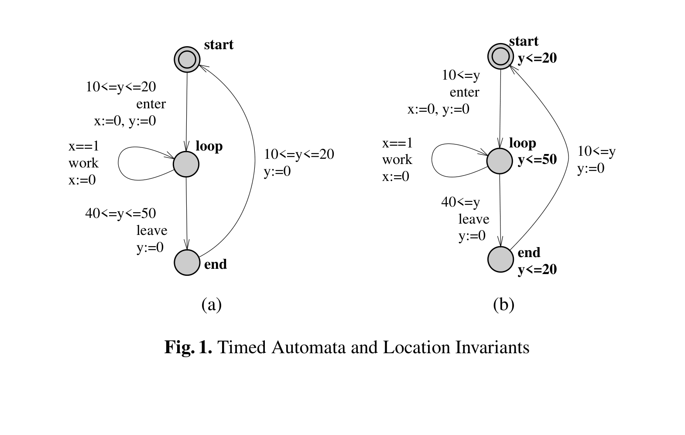

*Figure 1. Timed automata and location invariants.*

*Timed Buchi Automata.* A guard on an edge of an automaton is only an enabling condition of the transition represented by the edge; it cannot force the transition to be taken. For instance, the example automaton may stay forever in any location, just idling. In the initial work by Alur and Dill [AD90], this problem is solved by introducing Buchi-acceptance conditions: a subset of the locations in the automaton are marked as accepting, and only those executions passing through an accepting location infinitely often are considered valid behaviors of the automaton. As an example, consider again the automaton in Fig. 1(a) and assume that `end` is marked as accepting. This implies that all executions of the automaton must visit `end` infinitely many times. This imposes implicit conditions on `start` and `loop`. The location `start` must be left when the value of `y` is at most 20, otherwise the automaton will get stuck in `start` and never be able to enter `end`. Likewise, the automaton must leave `loop` when `y` is at most 50 to be able to enter `end`.

<!-- page: 3 -->

*Timed Safety Automata.* A more intuitive notion of progress is introduced in timed safety automata [HNSY94]. Instead of accepting conditions, locations may be equipped with local timing constraints called *location invariants*. An automaton may remain in a location as long as the clock values satisfy the invariant condition of the location. For example, the timed safety automaton in Fig. 1(b) corresponds to the Buchi automaton in Fig. 1(a) with `end` marked as an accepting location. The invariant specifies a local condition that `start` and `end` must be left when `y` is at most 20, and `loop` must be left when `y` is at most 50. This gives a local view of the timing behavior of the automaton in each location.

### 2.1 Formal Syntax

Assume a finite set of real-valued variables $C$, ranged over by $x$, $y$, and so on, standing for clocks, and a finite alphabet $\Sigma$, ranged over by $a$, $b$, and so on, standing for actions.

*Clock Constraints.* A clock constraint is a conjunctive formula of atomic constraints of the form $x \sim n$ or $x - y \sim n$ for $x, y \in C$, $\sim \in \{\le, <, =, >, \ge\}$, and $n \in \mathbb{N}$. Clock constraints are used as guards for timed automata. We use $B(C)$ to denote the set of clock constraints, ranged over by $g$, and later also by $D$.

**Definition 1 (Timed Automaton).** A timed automaton $A$ is a tuple $(N, l_0, E, I)$ where:

- $N$ is a finite set of locations (or nodes),
- $l_0 \in N$ is the initial location,
- $E \subseteq N \times B(C) \times \Sigma \times 2^C \times N$ is the set of edges, and
- $I : N \to B(C)$ assigns invariants to locations.

We write $l \xrightarrow{g,a,r} l'$ when $(l, g, a, r, l') \in E$.

<!-- page: 4 -->

As in verification tools such as UPPAAL [LPY97], we restrict location invariants to constraints that are downward closed, in the form $x \le n$ or $x < n$, where $n$ is a natural number.

*Concurrency and Communication.* To model concurrent systems, timed automata can be extended with parallel composition. In process algebras, various parallel composition operators have been proposed to model different aspects of concurrency, for example CCS and CSP [Mil89, Hoa78]. These algebraic operators can be adopted in timed automata. In the UPPAAL modeling language [LPY97], the CCS parallel composition operator [Mil89] is used, allowing interleaving of actions as well as handshake synchronization. The precise definition of this operator is given in Section 5. Essentially, the parallel composition of a set of automata is the product of the automata. Building the product automaton is an entirely syntactical but computationally expensive operation. In UPPAAL, the product automaton is computed on-the-fly during verification.

### 2.2 Operational Semantics

The semantics of a timed automaton is defined as a transition system where a state, or configuration, consists of the current location and the current values of clocks. There are two types of transitions between states. The automaton may either delay for some time, a *delay transition*, or follow an enabled edge, an *action transition*.

To keep track of the changes of clock values, we use functions known as *clock assignments*, mapping $C$ to the non-negative reals $\mathbb{R}_+$. Let $u, v$ denote such functions, and use $u \in g$ to mean that the clock values denoted by $u$ satisfy the guard $g$. For $d \in \mathbb{R}_+$, let $u + d$ denote the clock assignment that maps every $x \in C$ to $u(x) + d$, and for $r \subseteq C$, let $[r \mapsto 0]u$ denote the clock assignment that maps all clocks in $r$ to 0 and agrees with $u$ for the other clocks in $C \setminus r$.

**Definition 2 (Operational Semantics).** The semantics of a timed automaton is a transition system, also known as a timed transition system, where states are pairs $(l, u)$ and transitions are defined by the rules

$$
(l, u) \xrightarrow{d} (l, u + d)
\quad \text{if } u \in I(l) \text{ and } u + d \in I(l)
$$

for a non-negative real $d \in \mathbb{R}_+$, and

$$
(l, u) \xrightarrow{a} (l', u')
\quad \text{if } l \xrightarrow{g,a,r} l',\; u \in g,\; u' = [r \mapsto 0]u,\; \text{and } u' \in I(l').
$$

### 2.3 Verification Problems

The operational semantics is the basis for verification of timed automata. We now formalize several decision problems in terms of transition systems.

<!-- page: 5 -->

*Language Inclusion.* A timed action is a pair $(t, a)$, where $a \in \Sigma$ is an action taken by an automaton $A$ after $t \in \mathbb{R}_+$ time units since $A$ has been started. The absolute time $t$ is called a *time-stamp* of the action $a$. A timed trace is a possibly infinite sequence of timed actions

$$
\sigma = (t_1, a_1)(t_2, a_2)\cdots(t_i, a_i)\cdots
$$

where $t_i \le t_{i+1}$ for all $i \ge 1$.

**Definition 3.** A run of a timed automaton $A = (N, l_0, E, I)$ with initial state $(l_0, u_0)$ over a timed trace $\sigma = (t_1, a_1)(t_2, a_2)(t_3, a_3)\cdots$ is a sequence of transitions

$$
(l_0, u_0) \xrightarrow{d_1} \xrightarrow{a_1} (l_1, u_1)
\xrightarrow{d_2} \xrightarrow{a_2} (l_2, u_2)
\xrightarrow{d_3} \xrightarrow{a_3} (l_3, u_3)\cdots
$$

satisfying the condition $t_i = t_{i-1} + d_i$ for all $i \ge 1$. The timed language $L(A)$ is the set of all timed traces $\sigma$ for which there exists a run of $A$ over $\sigma$.

*Undecidability.* The negative result for timed automata as a computation model is that language inclusion, that is, checking $L(A) \subseteq L(B)$, is undecidable [AD94, ACH94]. Unlike finite-state automata, timed automata are not determinizable in general. Timed automata cannot be complemented either, so the complement of the timed language of a timed automaton may not itself be described as a timed automaton.

The inclusion problem becomes decidable if $B$ is restricted to the deterministic class of timed automata. Considerable effort has gone into characterizing interesting classes of determinizable timed systems, for example event-clock automata [AFH99] and timed communicating sequential processes [YJ94]. Essentially, the undecidability of language inclusion is due to arbitrary clock reset. If all edges labeled with the same action symbol in a timed automaton are also labeled with the same set of clocks to reset, then the automaton is determinizable. This covers the class of event-clock automata [AFH99].

We may also abstract away from the time-stamps appearing in timed traces and define the untimed language $L_{\text{untimed}}(A)$ as the set of all traces of the form $a_1 a_2 a_3 \cdots$ for which there exists a timed trace $\sigma = (t_1, a_1)(t_2, a_2)(t_3, a_3)\cdots$ in the timed language of $A$. The inclusion checking problem for untimed languages is decidable. This is one of the classic results for timed automata [AD94].

<!-- page: 6 -->

*Bisimulation.* Another classic result on timed systems is the decidability of timed bisimulation [Cer92]. Timed bisimulation was introduced for timed process algebras [Yi91], but extends naturally to timed automata.

**Definition 4.** A bisimulation $R$ over the states of timed transition systems and the alphabet $\Sigma \cup \mathbb{R}_+$ is a symmetrical binary relation satisfying the following condition: for all $(s_1, s_2) \in R$, if $s_1 \xrightarrow{\alpha} s_1'$ for some $\alpha \in \Sigma \cup \mathbb{R}_+$ and some $s_1'$, then $s_2 \xrightarrow{\alpha} s_2'$ for some $s_2'$ such that $(s_1', s_2') \in R$.

Two automata are timed bisimilar if there is a bisimulation containing the initial states of the automata. Intuitively, two automata are timed bisimilar if they perform the same action transition at the same time and reach bisimilar states. In [Cer92], timed bisimulation is shown decidable.

We may abstract away from timing information to establish bisimulation between automata based only on the actions performed. This is captured by *untimed bisimulation*. We define $s \Rightarrow s'$ if $s \xrightarrow{d} s'$ for some real number $d$. Untimed bisimulation is obtained by replacing the alphabet with $\Sigma \cup \{\epsilon\}$ in Definition 4. As with timed bisimulation, untimed bisimulation is decidable [LW97].

*Reachability Analysis.* Perhaps the most useful question to ask about a timed automaton is whether a given final state, or a set of final states, is reachable. Such final states may be used to characterize safety properties of a system.

**Definition 5.** We write $(l, u) \rightarrow (l', u')$ if $(l, u) \xrightarrow{\alpha} (l', u')$ for some $\alpha \in \Sigma \cup \mathbb{R}_+$. For an automaton with initial state $(l_0, u_0)$, the state $(l, u)$ is *reachable* if $(l_0, u_0) \rightarrow^* (l, u)$. More generally, given a constraint $\varphi \in B(C)$, we say that the configuration $(l, \varphi)$ is reachable if $(l, u)$ is reachable for some $u$ satisfying $\varphi$.

The notion of reachability is more expressive than it first appears. We may specify invariant properties using the negation of reachability properties, and bounded liveness properties using clock constraints in combination with local properties on locations [LPY01]. The reachability problem is decidable.

One of the major advances in verification of timed systems is the symbolic technique [Dil89, YL93, HNSY94, YPD94, LPY95], developed in connection with verification tools. It adopts the idea from symbolic model checking for untimed systems, using formulas to represent sets of states and operations on formulas to represent sets of state transitions. It is proven that the infinite state-space of timed automata can be finitely partitioned into symbolic states using clock constraints known as *zones* [Bel57, Dil89]. We now turn to that construction.

## 3 Symbolic Semantics and Verification

As clocks are real-valued, the transition system of a timed automaton is infinite, which is not an adequate model for automated verification.

### 3.1 Regions, Zones and Symbolic Semantics

The foundation for the decidability results in timed automata is based on the notion of region equivalence over clock assignments [AD94, ACD93].

<!-- page: 7 -->

**Definition 6 (Region Equivalence).** Let $k$ be a function, called a *clock ceiling*, mapping each clock $x \in C$ to a natural number $k(x)$, that is, the ceiling of $x$. For a real number $d$, let $\{d\}$ denote the fractional part of $d$, and $\lfloor d \rfloor$ denote its integer part. Two clock assignments $u, v$ are region-equivalent, denoted $u \sim_k v$, iff:

1. for all $x$, either $\lfloor u(x) \rfloor = \lfloor v(x) \rfloor$ or both $u(x) > k(x)$ and $v(x) > k(x)$,
2. for all $x$, if $u(x) \le k(x)$ then $\{u(x)\} = 0$ iff $\{v(x)\} = 0$, and
3. for all $x, y$, if $u(x) \le k(x)$ and $u(y) \le k(y)$ then $\{u(x)\} \le \{u(y)\}$ iff $\{v(x)\} \le \{v(y)\}$.

Note that region equivalence is indexed by the clock ceiling $k$. When the ceiling is given by the maximal clock constants of a timed automaton under consideration, we omit the index and write $\sim$ instead. An equivalence class induced by $\sim$ is called a *region*.

The basis for a finite partitioning of the state-space of a timed automaton is the following pair of facts. First, for a fixed number of clocks, each with a maximal constant, the number of regions is finite. Second, $u \sim v$ implies that $(l, u)$ and $(l, v)$ are bisimilar with respect to untimed bisimulation for any location $l$ of a timed automaton. We use the equivalence classes induced by untimed bisimulation as symbolic, or abstract, states to construct a finite-state model called the *region graph* or *region automaton* of the original timed automaton. The transition relation between symbolic states is defined as follows:

- $[(l, u)] \xrightarrow{d} [(l, u')]$ if $(l, u) \xrightarrow{d} (l, u')$ for a positive real number $d$, and
- $[(l, u)] \xrightarrow{a} [(l', v)]$ if $(l, u) \xrightarrow{a} (l', v)$ for an action $a$.

*Figure 2* in the original paper illustrates the regions for a system with two clocks.

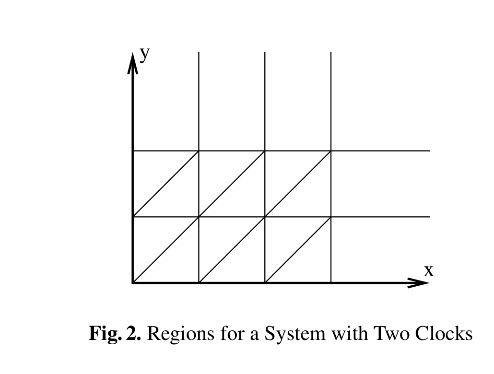

*Figure 2. Regions for a system with two clocks.*

Several verification problems, such as reachability analysis, untimed language inclusion, language emptiness [AD94], and timed bisimulation [Cer92], can be solved by techniques based on the region construction. However, the problem with region graphs is the potential explosion in the number of regions. In fact, the number of regions is exponential in both the number of clocks and the maximal constants appearing in the guards of an automaton.

<!-- page: 8 -->

As an example, consider Fig. 2. The figure shows the possible regions in each location of an automaton with two clocks $x$ and $y$. The largest number compared to $x$ is 3, and the largest number compared to $y$ is 2. In the figure, all corner points, line segments, and open areas are regions. Thus, the number of possible regions in each location of this example is 60.

A more efficient representation of the state-space for timed automata is based on the notion of *zone* and *zone graphs* [Dil89, HNSY92, YL93, YPD94, HNSY94]. In a zone graph, instead of regions, zones are used to denote symbolic states. This gives, in practice, a coarser and thus more compact representation of the state-space. The basic operations and algorithms for zones used to construct zone graphs are described in Section 4.

As an example, Fig. 3 in the original paper shows a timed automaton and the corresponding zone graph, or reachability graph. For this automaton the zone graph has only 8 states, whereas the region graph for the same example has over 50 states.

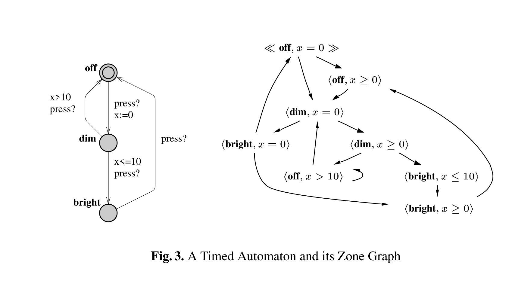

*Figure 3. A timed automaton and its zone graph.*

A zone is a clock constraint. Strictly speaking, a zone is the solution set of a clock constraint, that is, the maximal set of clock assignments satisfying the constraint. Such sets can be efficiently represented and stored in memory as DBMs (Difference Bound Matrices) [Bel57]. For a clock constraint $D$, let $[D]$ denote the maximal set of clock assignments satisfying $D$. In the following, to save notation, we use $D$ to stand for $[D]$ when no confusion can arise. Then $B(C)$ denotes the set of zones.

A symbolic state of a timed automaton is a pair $(l, D)$ representing a set of states of the automaton, where $l$ is a location and $D$ is a zone. A symbolic transition describes all possible concrete transitions from the represented set of states.

**Definition 7.** Let $D$ be a zone and $r$ a set of clocks. We define

$$
D^\uparrow = \{u + d \mid u \in D,\; d \in \mathbb{R}_+\}
$$

and

$$
r(D) = \{[r \mapsto 0]u \mid u \in D\}.
$$

Let $\rightsquigarrow$ denote the symbolic transition relation over symbolic states, defined by the rules

$$
(l, D) \rightsquigarrow (l, D^\uparrow \wedge I(l))
$$

and

$$
(l, D) \rightsquigarrow (l', r(D) \wedge g \wedge I(l'))
\quad \text{if } l \xrightarrow{g,a,r} l'.
$$

<!-- page: 9 -->

In Section 4, $D^\uparrow$ is written as `up(D)` and $r(D)$ as `reset(D, r := 0)`. The set of zones $B(C)$ is closed under these operations, in the sense that the result is again a zone.

Another important property of zones is that a zone has a *canonical form*. A zone $D$ is *closed under entailment*, or simply *closed*, if no constraint in $D$ can be strengthened without reducing the solution set. The canonicity of zones means that for each zone $D \in B(C)$ there is a unique zone $D' \in B(C)$ such that $D$ and $D'$ have exactly the same solution set and $D'$ is closed under entailment. Section 4 describes how to compute and represent the canonical form of a zone. It is the key structure for efficient implementation of state-space exploration using symbolic semantics.

The symbolic semantics corresponds closely to the operational semantics in the sense that if $(l, D) \rightsquigarrow (l', D')$, then for every $u' \in D'$ there exists some $u \in D$ such that $(l, u) \rightarrow (l', u')$. More generally, symbolic semantics gives a correct and complete characterization of the operational semantics.

**Theorem 1.** Assume a timed automaton with initial state $(l_0, u_0)$.

1. *(Soundness)* $(l_0, \{u_0\}) \rightsquigarrow^* (l_f, D_f)$ implies $(l_0, u_0) \rightarrow^* (l_f, u_f)$ for all $u_f \in D_f$.
2. *(Completeness)* $(l_0, u_0) \rightarrow^* (l_f, u_f)$ implies $(l_0, \{u_0\}) \rightsquigarrow^* (l_f, D_f)$ for some $D_f$ such that $u_f \in D_f$.

Soundness means that if the initial symbolic state $(l_0, \{u_0\})$ may lead to a set of final states $(l_f, D_f)$ according to $\rightsquigarrow$, then all those final states should be reachable according to the concrete operational semantics. Completeness means that if a state is reachable according to the concrete operational semantics, then this should be provable using symbolic transitions.

Unfortunately, the relation $\rightsquigarrow$ is infinite, and thus the zone graph of a timed automaton may also be infinite, which is a problem if we need a terminating verification procedure. The solution is to transform, that is, normalize, zones that may contain arbitrarily large constants to representatives in a class of zones whose constants are bounded by fixed constants, for example the maximal clock constants appearing in the automaton. The intuition is that once the value of a clock is larger than the maximal constant in the automaton, its precise value no longer matters; only the fact that it is above the constant does.

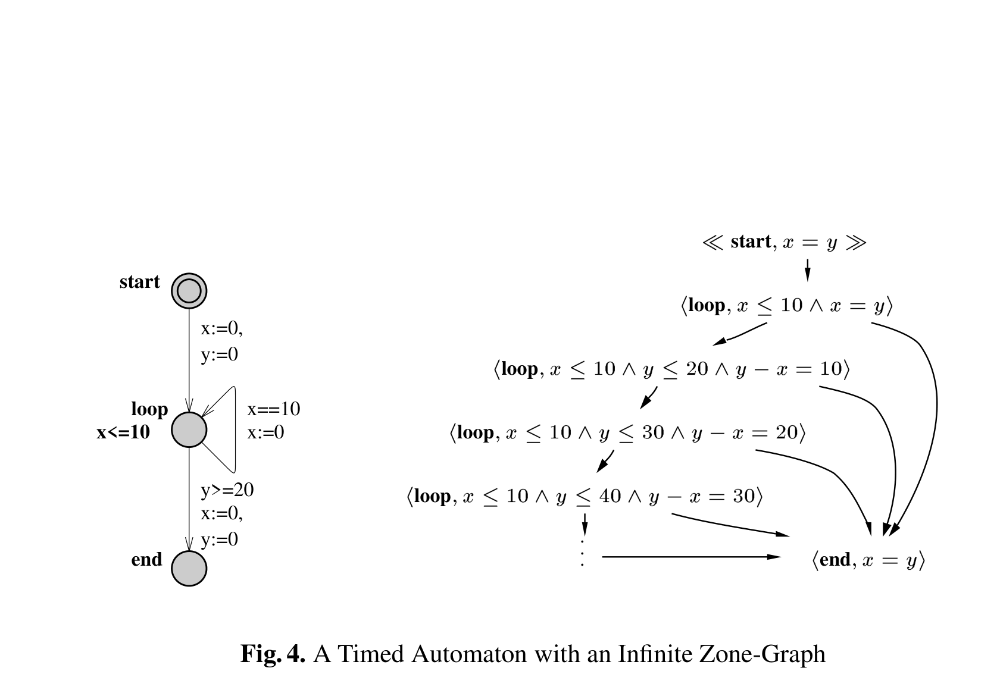

*Figure 4. A timed automaton with an infinite zone-graph.*

### 3.2 Zone-Normalization for Automata without Difference Constraints

In the original theory of timed automata [AD94], difference constraints are not allowed in guards. Such automata, whose guards contain only atomic constraints of the form $x \sim n$, are known in the literature as *diagonal-free automata* [BDGP98].

<!-- page: 10 -->

For diagonal-free automata, a well-studied zone-normalization procedure is the so-called $k$-normalization operation on zones [Rok93, Pet99]. It is implemented in several verification tools for timed automata, for example UPPAAL, to guarantee termination.

**Definition 8 ($k$-Normalization).** Let $D$ be a zone and $k$ a clock ceiling. The semantics of the $k$-normalization operation on zones is defined as follows:

$$
\operatorname{norm}_k(D) = \{u \mid u \sim_k v,\; v \in D\}.
$$

Note that normalization is indexed by the clock ceiling $k$. According to [Rok93, Pet99], $\operatorname{norm}_k(D)$ can be computed from the canonical representation of $D$ by:

1. removing all constraints of the form $x < m$, $x \le m$, $x - y < m$, and $x - y \le m$ where $m > k(x)$, and
2. replacing all constraints of the form $x > m$, $x \ge m$, $x - y > m$, and $x - y \ge m$ where $m > k(x)$ by $x > k(x)$ and $x - y > k(x)$, respectively.

Let $[D]_k$ denote the resulting zone by the above transformation. This is exactly the normalized zone in the sense of Definition 8, that is,

$$
[D]_k = \{u \mid u \sim_k v,\; v \in D\}.
$$

As an example, the normalized zone graph of the automaton in Fig. 4 is shown in Fig. 5, where the clock ceiling is given by the maximal clock constants appearing in the automaton.

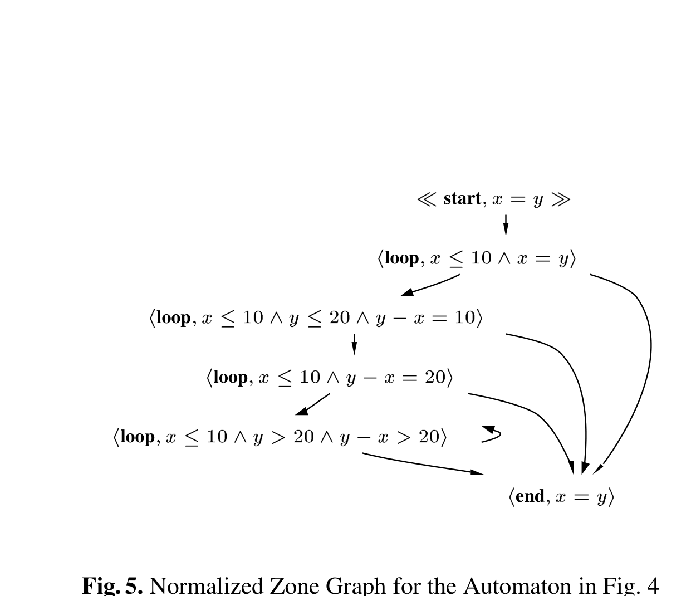

*Figure 5. Normalized zone graph for the automaton in Fig. 4.*

Note that for a fixed number of clocks with clock ceiling $k$, there can be only finitely many normalized zones. The intuition is that if the constraints allowed to use are bounded, then only finitely many clock constraints can arise. This gives a finite characterization for $\rightsquigarrow$.

**Definition 9.** $(l, D) \rightsquigarrow_k (l', \operatorname{norm}_k(D'))$ if $(l, D) \rightsquigarrow (l', D')$.

<!-- page: 11 -->

For the class of diagonal-free timed automata, $\rightsquigarrow_k$ is sound, complete, and finite:

**Theorem 2.** Assume a timed automaton with initial state $(l_0, u_0)$, whose maximal clock constants are bounded by a clock ceiling $k$, and which has no guards containing difference constraints of the form $x - y \sim n$.

1. *(Soundness)* $(l_0, \{u_0\}) \rightsquigarrow_k^* (l_f, D_f)$ implies $(l_0, u_0) \rightarrow^* (l_f, u_f)$ for all $u_f \in D_f$ such that $u_f(x) \le k(x)$ for all $x$.
2. *(Completeness)* $(l_0, u_0) \rightarrow^* (l_f, u_f)$ with $u_f(x) \le k(x)$ for all $x$ implies $(l_0, \{u_0\}) \rightsquigarrow_k^* (l_f, D_f)$ for some $D_f$ such that $u_f \in D_f$.
3. *(Finiteness)* The transition relation $\rightsquigarrow_k$ is finite.

Unfortunately, this soundness result no longer holds for timed automata whose guards contain difference constraints. The paper demonstrates this by a counterexample.

<!-- page: 12 -->

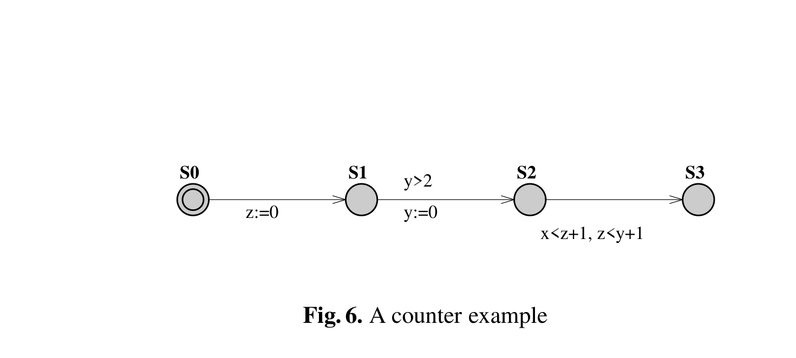

*Figure 6. A counter example.*

The final location of the automaton in Fig. 6 is not reachable according to the operational semantics. This is because in location $S_2$, the only clock zone is

$$
x - z + 1 < z - y \le 2
$$

and there is no valuation satisfying both $x - z < 1$ and $z - y < 1$. However, when the zone is normalized with respect to a maximal constant of 1 for $z$, the normalized constraint $z - y > 1$ becomes $z - y > 1$ and enables the guard $x - z < 1 \wedge z - y < 1$. Hence the symbolic reachability analysis based on naive normalization would incorrectly conclude that the last location is reachable.

The zones in canonical form generated while exploring the counterexample are shown in Fig. 7. The implicit constraints that all clocks are non-negative are omitted.

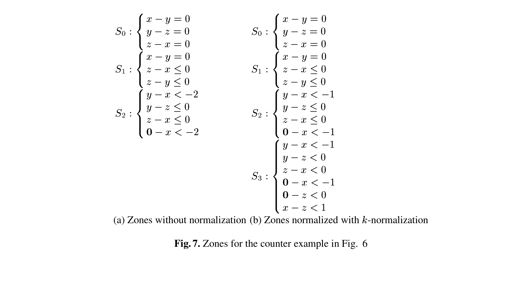

*Figure 7. Zones for the counter example in Fig. 6.*

### 3.3 Zone-Normalization for Automata with Difference Constraints

Our informal definition of timed automata allows any clock constraint to appear in a guard, including difference constraints of the form $x - y \sim n$. Such automata are indeed needed in many applications, for example to model scheduling problems [FPY02]. It is shown that an automaton containing difference constraints can be transformed to an equivalent diagonal-free automaton [BDGP98]. However, that transformation is not applicable in practice for verification tools: it is impractical to implement and, more importantly, it modifies the model before analysis, making it difficult to trace debugging information back to the original model.

<!-- page: 13 -->

In [Ben02, BY03], a refined normalization algorithm is presented for automata that may have guards containing difference constraints. The algorithm transforms DBMs according not only to maximal constants of clocks but also to difference constraints appearing in the automaton under consideration. Note that the difference constraints corresponding to the diagonal lines which split the entire space of clock assignments into regions impose a finer partitioning than the plain clock ceilings alone.

We now present the semantic characterization for refined normalization based on a refined version of region equivalence.

**Definition 10 (Normalization Using Difference Constraints).** Let $G$ stand for a finite set of difference constraints of the form $x - y \sim n$, for $x, y \in C$, $\sim \in \{\le, <, =, >, \ge\}$, and $n \in \mathbb{N}$, and let $k$ be a clock ceiling. Two clock assignments $u, v$ are equivalent, denoted $u \sim_{k,G} v$, if the following holds:

- $u \sim_k v$, and
- for all $g \in G$, $u \in g$ iff $v \in g$.

The semantics of the refined $k$-normalization operation on zones is defined as follows:

$$
\operatorname{norm}_{k,G}(D) = \{u \mid u \sim_{k,G} v,\; v \in D\}.
$$

Since the number of regions induced by $\sim_{k,G}$ is finite and there are only finitely many constraints in $G$, this induces finitely many equivalence classes. Thus for any given zone $D$, $\operatorname{norm}_{k,G}(D)$ is well-defined in the sense that it contains only a finite set of equivalence classes; it may not be convex, but it can be computed effectively according to the refined regions. In general, $\operatorname{norm}_{k,G}(D)$ is a non-convex zone, which can be implemented as a finite list of convex zones.

This refined zone-normalization gives rise to a finite characterization of symbolic reachability.

**Definition 11.** $(l, D) \rightsquigarrow_{k,G} (l', \operatorname{norm}_{k,G}(D'))$ if $(l, D) \rightsquigarrow (l', D')$.

**Theorem 3.** Assume a timed automaton with initial state $(l_0, u_0)$, whose maximal clock constants are bounded by a clock ceiling $k$, and whose guards contain only a finite set of difference constraints denoted $G$.

1. *(Soundness)* $(l_0, \{u_0\}) \rightsquigarrow_{k,G}^* (l_f, D_f)$ implies $(l_0, u_0) \rightarrow^* (l_f, u_f)$ for all $u_f \in D_f$ such that $u_f(x) \le k(x)$ for all $x$.
2. *(Completeness)* $(l_0, u_0) \rightarrow^* (l_f, u_f)$ with $u_f(x) \le k(x)$ for all $x$ implies $(l_0, \{u_0\}) \rightsquigarrow_{k,G}^* (l_f, D_f)$ for some $D_f$ such that $u_f \in D_f$.
3. *(Finiteness)* The transition relation $\rightsquigarrow_{k,G}$ is finite.

<!-- page: 14 -->

### 3.4 Symbolic Reachability Analysis

Model checking concerns two main types of properties: *liveness* and *safety*. The essential algorithm for checking liveness properties is loop detection, which is computationally expensive. The main effort on verification of timed systems has therefore been put on safety properties, which can be checked using reachability analysis by traversing the state-space of timed automata.

**Algorithm 1. Reachability analysis**

```text
PASSED := {}
WAIT := {(l0, D0)}
while WAIT != {} do
  take (l, D) from WAIT
  if l = lf and D /\ phif != empty then return "YES"
  if D not subset of D' for all (l, D') in PASSED then
    add (l, D) to PASSED
    for all (l', D') such that (l, D) ->k,G (l', D') do
      add (l', D') to WAIT
    end for
  end if
end while
return "NO"
```

Reachability analysis can be used to check properties on states. It consists of two basic steps: computing the state-space of an automaton under consideration, and searching for states that satisfy or contradict given properties. The first step can either be performed prior to the search, or be done on-the-fly during the search process. Computing the state-space on-the-fly has the obvious advantage that only the part of the space needed to prove the property is generated.

Several model checkers for timed systems are designed and optimized for reachability analysis based on symbolic semantics and zone representation. UPPAAL is a well-known example.

<!-- page: 15 -->

Assume a timed automaton $A$ with a set of initial states and a set of final states, for example the bad states characterized by a location $l_f$ and a property $\varphi_f$ on clock and data values. Let $k$ be the clock ceiling defined by the maximal constants appearing in $A$, and let $G$ denote the set of difference constraints appearing in $A$. Algorithm 1 can then be used to check if the initial states may evolve to any state whose location is $l_f$ and whose clock assignment satisfies $\varphi_f$. It computes the normalized zone graph of the automaton on-the-fly, in search of symbolic states containing location $l_f$ and zones intersecting with $\varphi_f$.

The algorithm computes the transitive closure of $\rightsquigarrow_{k,G}$ step by step and, at each step, checks whether the reached zones intersect with $\varphi_f$. From Theorem 3, it follows that the algorithm returns "YES" if there is some guaranteed-to-terminate reachability path, and returns "NO" if there is none. Since $\rightsquigarrow_{k,G}$ is finite, the algorithm terminates.

Algorithmically, the major challenge is the representation and manipulation of states, primarily zones, which is crucial to performance. In addition to the operations needed to compute successors of a zone according to $\rightsquigarrow_{k,G}$, the algorithm uses two more operations to check emptiness of a zone and inclusion between two zones. Designing efficient algorithms and data structures for zones is therefore a major issue in timed-automata verification.

## 4 DBM: Algorithms and Data Structures

The preceding section presented the key elements needed in symbolic reachability analysis. Recall that the operations on zones are all defined in terms of sets of clock assignments. It is not clear how to compute the result of such an operation directly on sets. In this section we describe how to represent zones, compute the operations, and check properties on zones. Pseudo-code for the operations is given in the appendix.

### 4.1 DBM Basics

Recall that a clock constraint over $C$ is a conjunction of atomic constraints of the form $x \sim n$ and $x - y \sim n$ where $x, y \in C$, $\sim \in \{\le, <, =, >, \ge\}$, and $n \in \mathbb{N}$. A zone denoted by a clock constraint $D$ is the maximal set of clock assignments satisfying $D$.

The most important property of zones is that they can be represented as matrices, that is, as DBMs (Difference Bound Matrices) [Bel57, Dil89], which have a canonical representation. To have a uniform form for clock constraints, we introduce a reference clock 0 with constant value 0. Let $C_0 = C \cup \{0\}$. Then any zone $D \in B(C)$ can be rewritten as a conjunction of constraints of the form $x - y \preceq n$ for $x, y \in C_0$, $\preceq \in \{\le, <\}$, and $n \in \mathbb{Z}$.

<!-- page: 16 -->

Naturally, if the rewritten zone has two constraints on the same pair of variables, only their intersection is significant. Thus a zone can be represented as a matrix $M$ of atomic constraints of the form $x - y \preceq n$, such that each pair of clocks $x - y$ is mentioned only once. We can then store zones using a matrix representation where each matrix element corresponds to an atomic constraint.

**Difference Bound Matrices (DBMs).** In the following presentation, we use $D_{ij}$ to denote element $(i, j)$ in the DBM representing zone $D$.

To construct the DBM representation for a zone $D$, we start by numbering all clocks in $C_0$ as $0, \ldots, n$, with the index for 0 itself being 0. Let each clock be one row in the matrix. The row is used for storing lower bounds on the difference between the clock and all other clocks, and the corresponding column is used for upper bounds. The elements are then computed in three steps:

1. For each constraint $x_i - x_j \preceq n$ of $D$, let $D_{ij} = (n, \preceq)$.
2. For each clock difference $x_i - x_j$ that is unbounded in $D$, let $D_{ij} = \infty$.
3. Finally, add the implicit constraints that all clocks are positive, that is, $0 - x_i \le 0$, and that no difference between a clock and itself is greater than 0, that is, $x_i - x_i \le 0$.

As an example, consider the zone

$$
x - z \le 0 \wedge y - z \le 0 \wedge x - y \le 10 \wedge x - y \le -10 \wedge 0 - z < 5
$$

whose matrix representation is shown in the paper.

To manipulate DBMs efficiently we need two operations on bounds: comparison and addition. We define that $(n_1, \preceq_1) < (n_2, \preceq_2)$ iff $n_1 < n_2$ and $(n_1, \preceq_1) < (n_1, \preceq_2)$ when strictness differs, and define addition on bounds in the obvious way, with $\infty + b = b + \infty = \infty$.

*Canonical DBMs.* Usually there are infinitely many zones sharing the same solution set. However, for each family of zones with the same solution set there is a unique constraint where no atomic constraint can be strengthened without losing a solution. To compute canonical form we need to derive the tightest constraint on each clock difference. This is naturally expressed with a graph interpretation of zones.

<!-- page: 17 -->

A zone may be transformed into a weighted graph where the clocks in $C_0$ are the nodes and the atomic constraints are edges labeled by bounds. A constraint of the form $x - y \preceq n$ is converted into an edge from node $y$ to node $x$ labeled with $(n, \preceq)$, namely the distance from $y$ to $x$ is bounded by $n$.

The paper's Fig. 8 shows the graph interpretation of a sample zone and its closed form. As an example, consider the zone

$$
x - 0 < 20 \wedge y - 0 < 20 \wedge x - y \le -10 \wedge y - z \le 5.
$$

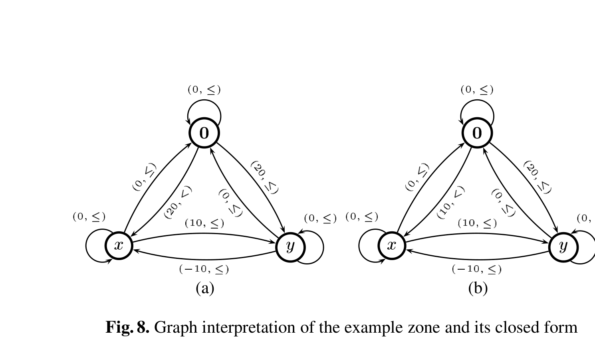

*Figure 8. Graph interpretation of the example zone and its closed form.*

For a closed zone, every direct constraint is at least as tight as the indirect constraint implied by any path in the graph. This is exactly the shortest-path property, and the conclusion is that a canonical, that is, closed, version of a zone can be computed using a shortest-path algorithm. Floyd-Warshall [Flo62] computes this closure in cubic time in the number of clocks.

*Minimal Constraint Systems.* A zone may contain redundant constraints. For example, a zone containing constraints $x - y < 2$, $y - z < 5$, and $x - z < 7$ has the last constraint redundant because it follows from the first two. In many zones it is therefore possible to derive a minimal constraint system still representing the same solution set. This is useful for reducing memory consumption in state-space exploration [LLPY97, Pet99, Lar00].

<!-- page: 18 -->

To discuss minimal constraint systems, the paper introduces the notion of a *zero cycle*. A cycle in a graph is a zero cycle if the sum of weights along the cycle is 0, and an edge $x_i \to x_j$ is redundant if there exists another path between $x_i$ and $x_j$ whose total weight is no larger than the weight of the direct edge. In graphs without zero cycles we can remove all redundant edges without affecting the represented shortest-path closure [LLPY97].

For closed DBMs this gives a direct way to compute a minimal number of constraints needed to represent the zone. The paper's Fig. 9 illustrates a zero-cycle-free graph and its minimal form. The resulting reduction procedure is given in Algorithm 3.

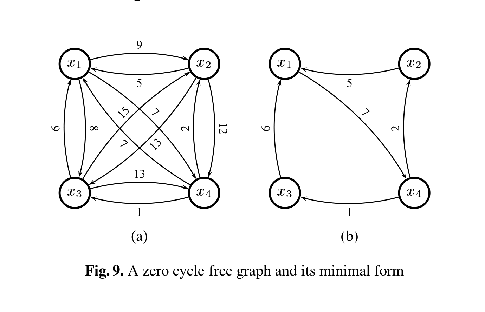

*Figure 9. A zero cycle free graph and its minimal form.*

However, this algorithm does not work if there are zero cycles in the graph. The reason is that the set of redundant edges in a graph with zero cycles is not unique. A robust solution is to partition the nodes according to zero cycles and build a super-graph in which each node represents an entire partition.

<!-- page: 19 -->

The paper's Fig. 10 presents such a graph with a zero cycle and the corresponding minimal form. To compute the edges in the super-graph we pick one representative for each partition and use the edge weights between representatives. The edges inside a zero-cycle partition are then reduced using Algorithm 3. This small graph can then be reduced further. Finally, the reduced super-graph is connected to the reduced partitions. The pseudo-code for this reduction procedure is shown in Algorithm 4.

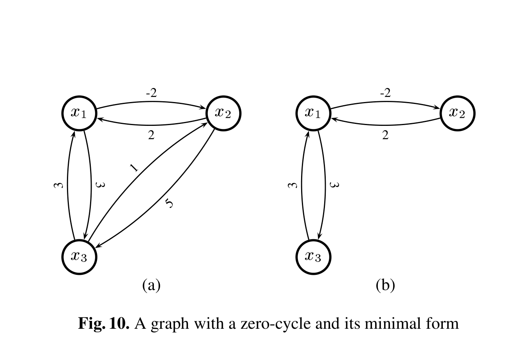

*Figure 10. A graph with a zero-cycle and its minimal form.*

We now have an algorithm for computing the minimal number of edges needed to represent a shortest-path closure, and thus the minimal number of constraints needed to represent a given zone.

### 4.2 Basic Operations on DBMs

This subsection presents the basic operations on DBMs except for the zone-normalization operations used in symbolic state-space exploration. These operations are useful both in forwards and backwards analysis, and also for purposes such as generating diagnostic traces. The paper divides them into two classes:

1. *Property checking*: operations used to check consistency, inclusion, and whether a zone satisfies a given atomic constraint.
2. *Transformations*: operations used to compute strongest postconditions and weakest preconditions under guards, time delay, and clock reset.

<!-- page: 20 -->

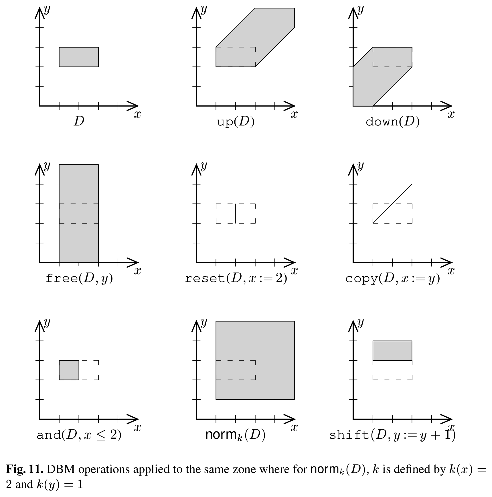

*Figure 11. DBM operations applied to the same zone, where for $\operatorname{norm}_k(D)$, $k(x)=2$ and $k(y)=1$.*

#### Property Checking

`consistent(D)`. The most basic operation on a DBM is to check if it is consistent, that is, whether the solution set is non-empty. In state-space exploration this operation is used to remove inconsistent states from exploration.

For a zone to be inconsistent there must be at least one pair of clocks where the upper bound on their difference is smaller than the lower bound. For DBMs this can be checked by searching for negative cycles in the graph interpretation. However, the test is efficient to implement as a local check once the zone is canonical: to check whether a zone is inconsistent it is enough to test whether $D_{00}$ is negative.

`relation(D, D')`. Another key operation is inclusion checking between DBMs. For DBMs in canonical form, the condition that $D_{ij} \le D'_{ij}$ for all clocks $i, j \in C_0$ is necessary and sufficient to conclude that $D \subseteq D'$. Naturally, the opposite condition checks whether $D' \subseteq D$. This allows a combined inclusion check, as described in Algorithm 5.

`satisfied(D, x_i - x_j \preceq m)`. Sometimes it is desirable to non-destructively check if a zone satisfies a constraint, that is, whether the zone $D \wedge x_i - x_j \preceq m$ is consistent without altering $D$. From the definition of consistency, this is equivalent to checking whether adding the guard introduces a negative cycle. For a DBM in canonical form, this test is local: we only need to check whether $(m, \preceq) + D_{ji}$ is negative.

<!-- page: 21 -->

#### Transformations

`up(D)`. The `up` operation computes the strongest postcondition of a zone with respect to delay, that is, $\operatorname{up}(D)$ contains the clock assignments that can be reached from $D$ by delaying. Formally,

$$
\operatorname{up}(D) = \{u + d \mid u \in D,\; d \in \mathbb{R}_+\}.
$$

Algorithmically, `up` is computed by removing the upper bounds on all individual clocks in a DBM: all elements $D_{i0}$ are set to $\infty$. This is the same as saying that any clock assignment in a given zone may delay by an arbitrary amount of time. Since all clocks proceed at the same speed, constraints on clock differences are unaffected. The operation preserves canonical form.

`down(D)`. This operation computes the weakest precondition of $D$ with respect to delay:

$$
\operatorname{down}(D) = \{u \mid u + d \in D,\; d \in \mathbb{R}_+\}.
$$

Intuitively, it is the set of clock valuations that can reach $D$ by delaying. A naive implementation sets the lower bound on all individual clocks to $(0, \le)$, but because difference constraints induce further bounds, that may produce a non-canonical DBM.

<!-- page: 22 -->

To compute the lower bound for a clock $x$, start by assuming that all other clocks have value 0. Then examine all difference constraints $y_i - x$ and compute a new lower bound for $x$ under this assumption. The new bound on $0 - x$ is the minimum bound on $y_i - x$ found in the DBM. Pseudo-code for `down` is given in Algorithm 7.

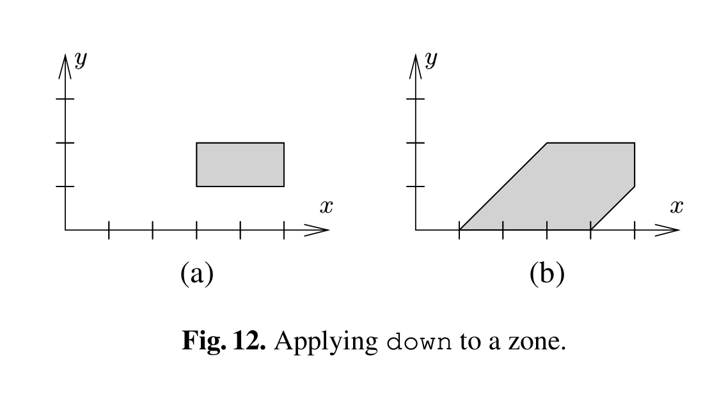

*Figure 12. Applying down to a zone.*

`and(D, x_i - x_j \preceq b)`. The most-used operation in state-space exploration is conjunction, that is, adding a constraint to a zone. The basic step is to check whether $(b, \preceq) < D_{ij}$ and, if so, replace $D_{ij}$ by $(b, \preceq)$. If the bound has changed, the DBM must be put back into canonical form. In this particular case there is a specialized re-canonicalization algorithm of complexity $O(n^2)$ rather than a full $O(n^3)$ shortest-path recomputation.

`free(D, x)`. The `free` operation removes all constraints on a given clock:

$$
\operatorname{free}(D, x) = \{u[x = d] \mid u \in D,\; d \in \mathbb{R}_+\}.
$$

In state-space exploration this is used together with conjunction to implement reset operations on clocks. In forward exploration, more efficient reset implementations exist; in backward exploration, `free` is particularly useful.

<!-- page: 23 -->

A simple implementation of `free` removes all bounds on $x$ in the DBM and sets $D_{0x} = (0, \le)$. However, the result may not be canonical. To obtain a canonical algorithm, the new difference constraints regarding $x$ are derived from the constraints on the other clocks. For instance, if $y - 0 \le 5$, then from $0 - x \le 0$ we may derive $y - x \le 5$. Algorithm 9 gives the pseudo-code.

`reset(D, x := m)`. In forward exploration this operation sets a clock to a specific value:

$$
\operatorname{reset}(D, x := m) = \{u[x = m] \mid u \in D\}.
$$

Without requiring the result to be canonical, reset can be implemented by assigning $D_{x0} = (m, \le)$, $D_{0x} = (-m, \le)$, and removing all other bounds on $x$. A more efficient canonical implementation computes new values using constraints on the other clocks, analogous to `free`. This is presented in Algorithm 10.

`copy(D, x := y)`. This copies the value of one clock to another:

$$
\operatorname{copy}(D, x := y) = \{u[x = u(y)] \mid u \in D\}.
$$

As with reset, a straightforward but inefficient implementation would delete all bounds on $x$ and re-canonicalize. A more efficient one sets $D_{xy} = (0, \le)$ and $D_{yx} = (0, \le)$ and then copies the remaining bounds on $x$ from $y$. See Algorithm 11.

<!-- page: 24 -->

`shift(D, x := x + m)`. The last reset-like operation shifts a clock by an integer amount:

$$
\operatorname{shift}(D, x := x + m) = \{u[x = u(x) + m] \mid u \in D\}.
$$

This can be viewed as substituting $x - m$ for $x$ in the zone. Thus $m$ is added to the upper and lower bounds of $x$. Since lower bounds on $x$ are represented by constraints on $y - x$, $m$ is subtracted from all such bounds. The pseudo-code is given in Algorithm 12.

### 4.3 Zone-Normalization

The operations for zone-normalization are used to transform zones that may contain arbitrarily large constants into zones containing only bounded constants, in order to obtain a finite zone graph.

`norm_k(D)`. For a timed automaton and a safety property that contain no difference constraints, the normalization $\operatorname{norm}_k(D)$ can be computed based on the canonical form of $D$. Operationally it removes all upper bounds higher than the maximal constants and lowers all lower bounds that exceed the maximal constants down to the maximal constants. In the canonical DBM representation this consists of two steps:

1. remove all bounds $x - y \preceq m$ such that $(m, \preceq) > (k(x), \le)$, and
2. set all bounds $x - y \preceq m$ such that $(m, \preceq) < (-k(y), <)$ to $(-k(y), <)$.

Pseudo-code for $k$-normalization is given in Algorithm 13.

`norm_{k,G}(D)`. For automata containing difference constraints in guards, it is more complicated and expensive to compute the normalized zones. Assume an automaton $A$ containing a set of difference constraints $G$ and maximal clock constants bounded by a clock ceiling $k$.

<!-- page: 25 -->

According to Definition 10, if a difference constraint is not satisfied by any assignment in the zone $D$, then it should not be satisfied by any assignment in the normalized one $\operatorname{norm}_{k,G}(D)$; and if all assignments in $D$ satisfy a difference constraint, then so should all assignments in $\operatorname{norm}_{k,G}(D)$. This leads to a core normalization algorithm consisting of three steps:

1. Collect all difference constraints $g$ used as guards in $A$ such that either $g \wedge D = \emptyset$ or $\neg g \wedge D = \emptyset$. Let
   $$
   G_{\text{unsat}} = \{g \mid g \wedge D = \emptyset\} \cup \{\neg g \mid \neg g \wedge D = \emptyset\}.
   $$
2. Compute $\operatorname{norm}_k(D)$, that is, run $k$-normalization without considering difference constraints.
3. Subtract, or cut, the $k$-normalized zone by all difference constraints in $G_{\text{unsat}}$, that is, compute $\operatorname{norm}_k(D) \wedge \neg G_{\text{unsat}}$.

This is the *core normalization* algorithm described in Algorithm 14.

Unfortunately, that is still not sufficient. The core normalization does not handle the third case, where a difference constraint splits the zone $D$ to be normalized, meaning there is a guard $g$ such that both $g \wedge D \ne \emptyset$ and $\neg g \wedge D \ne \emptyset$. In this case we must split $D$ by $g$ using Algorithm 15, and then apply the core normalization algorithm to each resulting sub-zone separately.

<!-- page: 26 -->

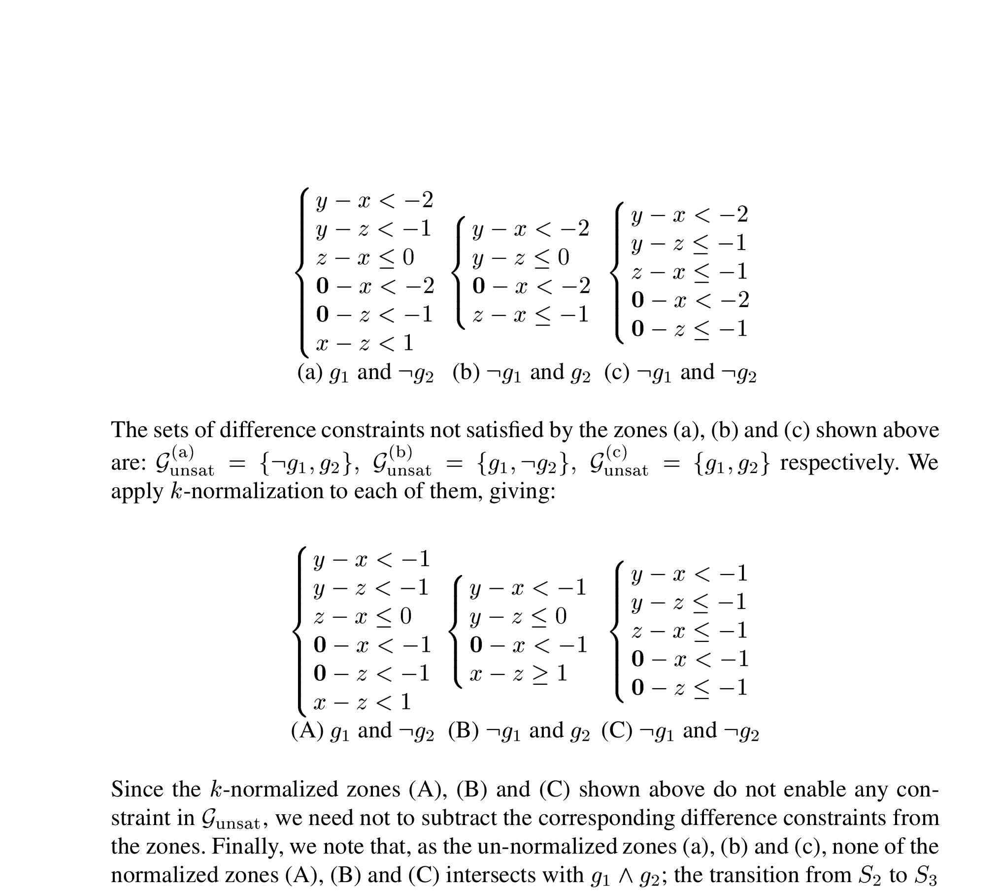

*Page 26 normalization example excerpt. Unsatisfied difference constraints before and after applying $k$-normalization to the split sub-zones.*

The complete normalization procedure is presented in Algorithm 16. The splitting is used as a preprocessing step; then the core normalization algorithm is applied to all sub-zones produced by the split. Finally, the symbolic transition relation with refined normalization can be computed as follows: if $(l, D) \rightsquigarrow (l', D')$, then $(l, D) \rightsquigarrow_{k,G} (l', D'')$ for all $D'' \in \operatorname{norm}_{k,G}(D')$.

The paper demonstrates this procedure on the counterexample from Section 3. The difference constraints are

$$
g_1 \equiv x - z < 1
\qquad\text{and}\qquad
g_2 \equiv z - y < 1.
$$

The zone contains both clock assignments satisfying $g_1$ and assignments satisfying its negation, so the zone must first be split with respect to $g_1$. One of the resulting zones still contains assignments satisfying both $g_2$ and $\neg g_2$, and must be split once more. After $k$-normalization of the sub-zones, none of the normalized zones enable any constraint in $G_{\text{unsat}}$, and none intersects with $g_1 \wedge g_2$. Hence the transition from $S_2$ to $S_3$ is still not enabled after normalization.

### 4.4 Zones in Memory

This section describes several techniques for storing zones in computer memory. It begins by discussing how to map DBM elements to machine words, continues with two layouts for storing two-dimensional DBMs in linear memory, and ends with a sparse representation for zones.

<!-- page: 27 -->

*Storing DBM Elements.* To store a DBM element in memory we need to keep track of the integer limit and whether it is strict or not. The range of the integer limit is typically much lower than the maximum value of a machine word, and the strictness can be stored using just one bit. Thus it is possible to store both the limit and the strictness in different parts of the same machine word. Since comparing and adding DBM elements are frequently used operations, it is crucial that they can be efficiently implemented.

The proposed encoding uses the least significant bit (LSB) of the machine word to store whether the bound is strict or not. Since strict bounds are smaller than non-strict ones, a set bit denotes that the bound is non-strict, while an unset bit denotes that the bound is strict. The rest of the bits store the integer bound. To encode $\infty$, the implementation uses the largest positive number that fits in a machine word, denoted `MAX_INT`. For good performance, we also need an efficient implementation of addition of bounds; Algorithm 17 adds two encoded bounds $b_1$ and $b_2$, using bitwise-and and bitwise-or.

*Placing DBMs in Memory.* Another issue is how to store two-dimensional DBMs in linear memory. The paper presents two different techniques.

The natural way is to store elements by row, or by column, so that each row of the matrix is stored consecutively in memory. The main advantage is performance, due to the simple location function

$$
\operatorname{loc}(x, y) = x \cdot (n + 1) + y.
$$

This can be computed very cheaply and all accesses to DBM elements use it.

<!-- page: 28 -->

The second layout is based on a layered model, where each layer consists of the bounds between a clock and the clocks with lower index in the DBM. In this representation it is cheap to implement local clocks, since all information about them is localized at the end of the DBM. The drawback is the more complicated mapping from DBM indices to memory locations:

$$
\operatorname{loc}(x, y) =
\begin{cases}
y \cdot (y + 1) + x & \text{if } x \le y, \\
x \cdot x + y & \text{otherwise.}
\end{cases}
$$

This introduces at least one comparison and one conditional branch, and cache performance is also worse than for the row-wise mapping.

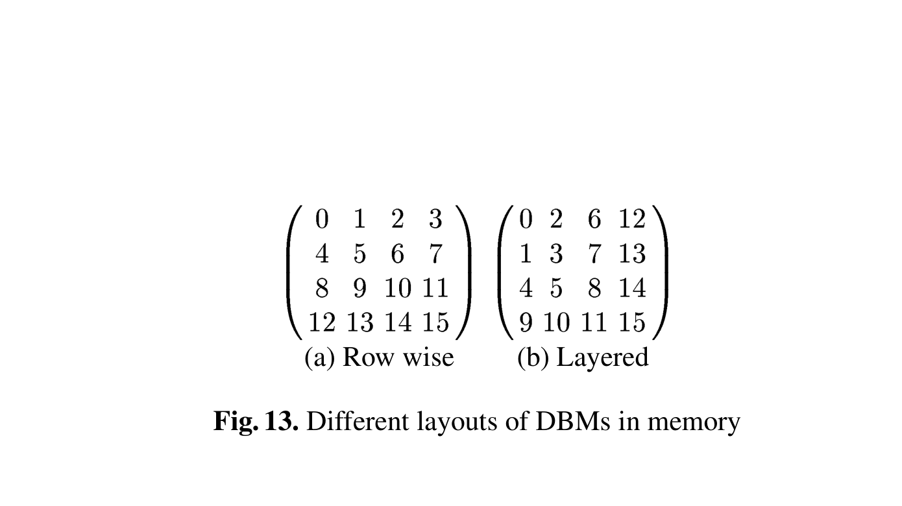

*Figure 13. Different layouts of DBMs in memory.*

The conclusion is that unless the tool supports adding and removing clocks dynamically, the row-wise mapping should be used. If the tool supports local clocks, the layered mapping may be preferable because no reordering of the DBM is needed when entering or leaving a clock scope.

*Storing Sparse Zones.* In most verification tools, the majority of the zones are kept in the set of states already visited during verification. They are used as a reference to ensure termination by preventing states from being explored more than once. For these states we may benefit from storing only the minimal number of constraints using a sparse representation.

A straightforward implementation stores a sparse zone as a vector of constraints of the form $(x, y, b)$. We may save additional memory by omitting implicit constraints such as $0 - x \le 0$. A downside is that each constraint requires twice the amount of memory needed for a constraint in a full DBM, since the sparse representation must store clock indices explicitly. Thus, unless half of the constraints in a DBM are redundant, sparse zones do not save memory.

An attractive feature of the sparse representation is that checking whether a full DBM $D_f$ is included in a sparse zone $D_s$ can be implemented without computing the full DBM for $D_s$: it suffices to check that every bound in $D_s$ is at least as loose as the corresponding bound in $D_f$. However, to check if $D_s \subseteq D_f$, the full DBM for $D_s$ must still be computed.

## 5 UPPAAL

In the last decade there have been several tools developed based on timed automata to model and verify real-time systems, notably Kronos [Yov97] and UPPAAL [LPY97]. As an example, this chapter gives a brief introduction to UPPAAL.

UPPAAL is a toolbox for modeling, simulation, and verification of timed automata, based on the algorithms and data structures presented in the previous sections. The tool was released for the first time in 1995, and since then it has been developed and maintained in collaboration between Uppsala University and Aalborg University.

<!-- page: 29 -->

### 5.1 Modeling with UPPAAL

The core of the UPPAAL modeling language is networks of timed automata. In addition, the language has been extended with features to ease modeling and guide the verifier in state-space exploration. The most important of these are shared integer variables, urgent channels, and committed locations.

*Networks of Timed Automata.* A network of timed automata is the parallel composition

$$
A_1 \parallel \cdots \parallel A_n
$$

of a set of timed automata $A_1, \ldots, A_n$, called *processes*, combined into a single system by the CCS parallel composition operator with all external actions hidden. Synchronous communication between processes is by handshake synchronization using input and output actions; asynchronous communication is described later via shared variables. The action alphabet $\Sigma$ is assumed to consist of symbols for input actions denoted $a?$, output actions denoted $a!$, and internal actions represented by the distinct symbol $\tau$.

The paper's Fig. 14 shows an example system composed of two timed automata. The network models a time-dependent light switch on the left and its user on the right. The user can press the switch (`press!`) and the switch waits to be pressed (`press?`). The corresponding product automaton is shown in Fig. 15.

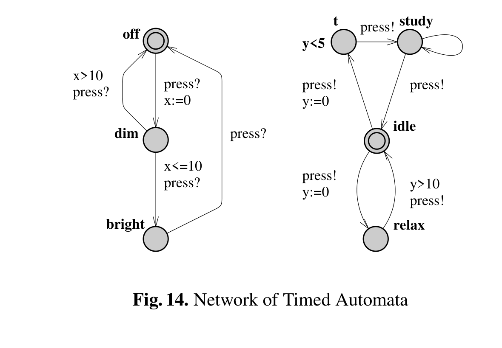

*Figure 14. Network of timed automata.*

<!-- page: 30 -->

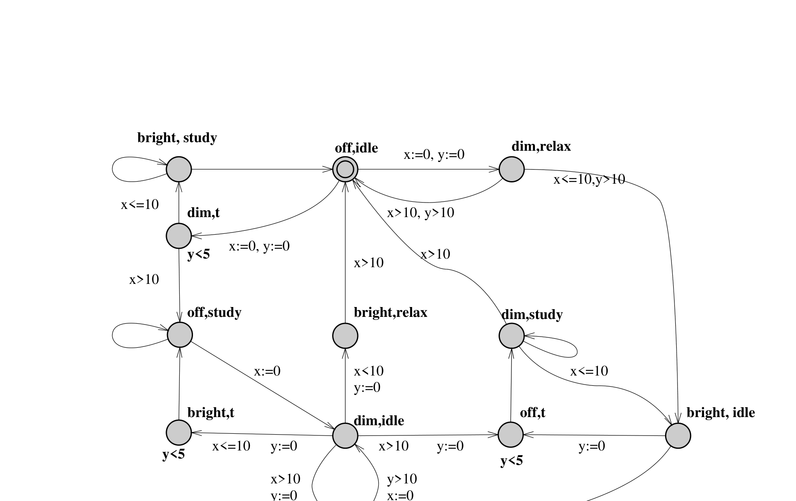

*Figure 15. Product automaton for the network in Fig. 14.*

The semantics of networks is given, as for single timed automata, in terms of transition systems. A state of a network is a pair $(l, u)$ where $l$ denotes a vector of current locations, one for each process, and $u$ is a clock assignment remembering the current values of clocks in the system. The network may perform delay transitions and discrete transitions.

The invariant of a location vector is the conjunction of the location invariants of its components. Let $l_i$ stand for the $i$th element of a location vector $l$, and let $l[l_i' / l_i]$ denote the vector obtained by replacing $l_i$ with $l_i'$.

The transition rules are:

$$
(l, u) \xrightarrow{d} (l, u + d)
\quad \text{if } u \in I(l) \text{ and } u + d \in I(l),
$$

where $I(l) = \bigwedge I(l_i)$, and

$$
(l, u) \xrightarrow{\tau} (l[l_i' / l_i], u')
$$

if $l_i \xrightarrow{g_i, \tau, r_i} l_i'$, $u \in g_i$, $u' = [r_i \mapsto 0]u$, and $u' \in I(l[l_i' / l_i])$.

The synchronization rule is:

$$
(l, u) \xrightarrow{\tau} (l[l_i' / l_i][l_j' / l_j], u')
$$

if there exist $i \ne j$ such that

1. $l_i \xrightarrow{g_i, a?, r_i} l_i'$ and $l_j \xrightarrow{g_j, a!, r_j} l_j'$,
2. $u \in g_i \wedge g_j$, and
3. $u' = [r_i \cup r_j \mapsto 0]u$ and $u' \in I(l[l_i' / l_i][l_j' / l_j])$.

A network is a closed system and may not perform any external action. In effect, the CCS hiding operator is built into the transition rules.

*Shared Integer Variables.* Clocks may be considered as typed variables with type `clock`. In UPPAAL, one may also use integer variables and arrays of integers, each with a bounded domain and an initial value. Predicates over the integer variables can be used as guards on edges, and integer variables may be updated on transitions. In the current version of UPPAAL, the syntax related to integer variables resembles standard C syntax.

<!-- page: 31 -->

The semantics of networks can be extended accordingly. The assignment $u$ in the state configuration $(l, u)$ stores values of integer variables in addition to clocks. Since delay does not affect integer variables, delay transitions are unchanged. The action transitions are extended in the natural way: for an action transition to be enabled, the extended assignment must satisfy all integer guards, and when the transition is taken the assignment is updated according to the integer and clock resets.

There is a subtle issue with variable updating in synchronizing transitions where one of the participating processes updates a variable used by the other. In UPPAAL, resets on the edge with an output label are performed before resets on the edge with an input label. This destroys the symmetry of input and output actions, but gives a natural and clear semantics for variable updating. The synchronization rule is therefore modified so that

$$
u' = [r_j \mapsto 0]([r_i \mapsto 0]u),
$$

with the output side performed first.

*Urgent Channels.* To model urgent synchronizing transitions, which should be taken as soon as they are enabled, UPPAAL supports *urgent channels*. An urgent channel works much like an ordinary channel, except that if a synchronization on an urgent channel is possible, then the system may not delay. Interleaving with other enabled action transitions is still allowed.

To keep clock constraints representable using convex zones, clock guards are not allowed on edges synchronizing on urgent channels. The paper illustrates this with a network where one process must wait at least 10 time units and another at least 5 time units before synchronizing urgently. The resulting reachable set in the joint state may be

$$
(x \ge 10 \wedge y = 5) \;\vee\; (y \ge 5 \wedge x = 10),
$$

which is a non-convex zone.

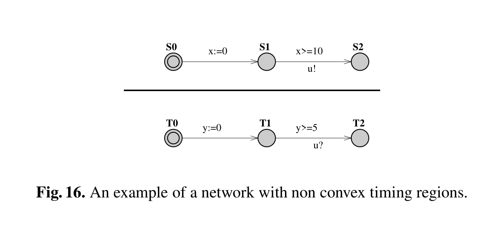

*Figure 16. An example of a network with non convex timing regions.*

<!-- page: 32 -->

For the example above, the problem can be solved by splitting the non-convex zone into two convex ones. But in general, splitting is computationally expensive. UPPAAL avoids this cost by allowing only integer guards on edges involving synchronizations on urgent channels.

*Committed Locations.* To model atomic sequences of actions, such as atomic broadcast or multicast, UPPAAL supports *committed locations*. A committed location is a location where no delay is allowed. In a network, if any process is in a committed location, then only transitions starting from such a location are allowed. Thus, processes in committed locations may be interleaved only with processes in committed locations.

Syntactically, each process $A_i$ in a network may have a subset $N_i^C \subseteq N_i$ of locations marked as committed. Let $C(l)$ denote the set of committed locations in a location vector $l$. For the same reason as in the case of urgent channels, no clock constraints but only predicates over integer variables are allowed in a guard on an outgoing edge from a committed location.

The transition rules are defined in terms of a transition relation $\rightarrow_c$ for the network with committed locations, and the ordinary relation $\rightarrow$ for the same network without considering them:

$$
(l, u) \xrightarrow{d}_c (l, u + d)
\quad \text{if } (l, u) \xrightarrow{d} (l, u + d) \text{ and } C(l) = \emptyset,
$$

and an action transition is allowed only if the corresponding ordinary action transition exists and either it starts from a committed location or there are no committed locations at all.

### 5.2 Verifying with UPPAAL

The model-checking engine of UPPAAL is designed to check a subset of TCTL formulae [ACD90] for networks of timed automata. The formulas should be one of the following forms:

- $A[]\,\varphi$ — invariantly $\varphi$,
- $E\langle\rangle\,\varphi$ — possibly $\varphi$,
- $A\langle\rangle\,\varphi$ — always eventually $\varphi$,
- $E[]\,\varphi$ — potentially always $\varphi$,
- $\varphi \leadsto \psi$ — $\varphi$ always leads to $\psi$, shorthand for $A[](\varphi \Rightarrow A\langle\rangle \psi)$.

Here $\varphi$ and $\psi$ are local properties that can be checked locally on a state, that is, Boolean expressions over predicates on locations and integer variables, and clock constraints in $B(C)$.

<!-- page: 33 -->

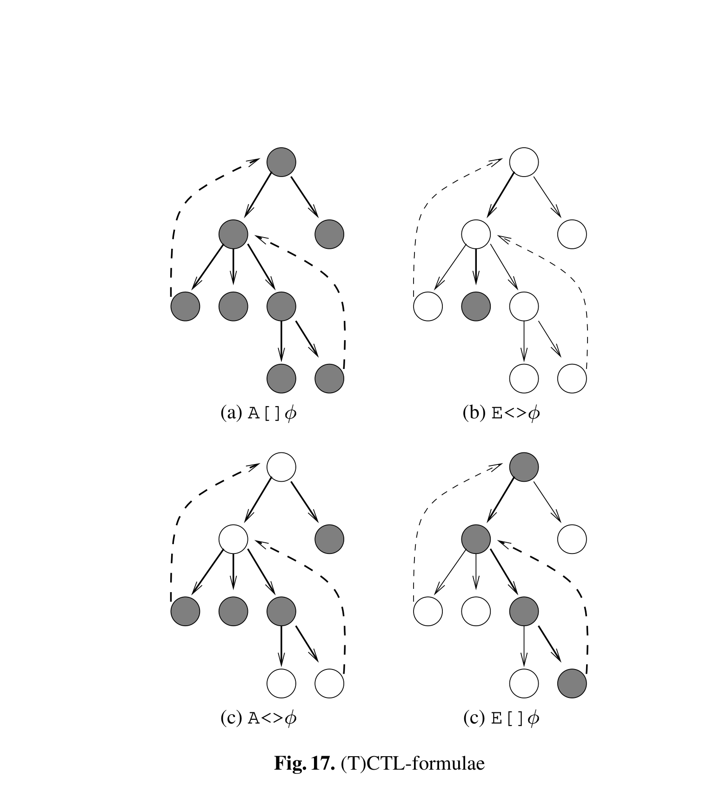

*Figure 17. (T)CTL formulae.*

The transition system of a network may be unfolded into an infinite tree containing states and transitions. The semantics of the formulas are defined over such a tree. The letters $A$ and $E$ quantify over paths: $A$ means that the property should hold for all paths, while $E$ means that there exists at least one path where it holds. The symbols $[]$ and $\langle\rangle$ quantify over states within a path: $[]$ denotes that all states on the path should satisfy the property, while $\langle\rangle$ denotes that at least one state in the execution satisfies it.

The paper's Fig. 17 illustrates these four basic property types using execution trees. Dashed arrows denote repetitions in the tree. States satisfying $\varphi$ are shown as filled nodes, and the edges corresponding to the relevant paths are highlighted.

The two types of properties most commonly used in verification of timed systems are $E\langle\rangle \varphi$ and $A[]\,\varphi$. They are dual in the sense that $E\langle\rangle \varphi$ is satisfied iff $A[]\,\neg \varphi$ is not satisfied. These are often classified as safety properties.

It is also possible to transform bounded liveness properties, that is, properties stating that some desired state will be reached within a given time, into safety properties by using observer automata [ABL98] or by annotating the model [LPY98]. For example, to check whether an automaton will surely reach a location $l$ within 10 time units, we use one clock $x$ initialized to 0 and introduce a Boolean variable $l_b$ initialized to false. For each incoming edge to $l$, set $l_b$ to true. Then if the automaton satisfies the invariant property $(x \le 10) \vee l_b$, it will surely reach $l$ within 10 time units, provided the automaton contains no Zeno loops that stop time from progressing.

<!-- page: 34 -->

The other three property types are commonly classified as unbounded liveness properties, that is, properties used to express and check global progress. These properties are not commonly used in UPPAAL case studies. It seems that bounded liveness properties are often more important for timed systems.

### 5.3 The UPPAAL Architecture

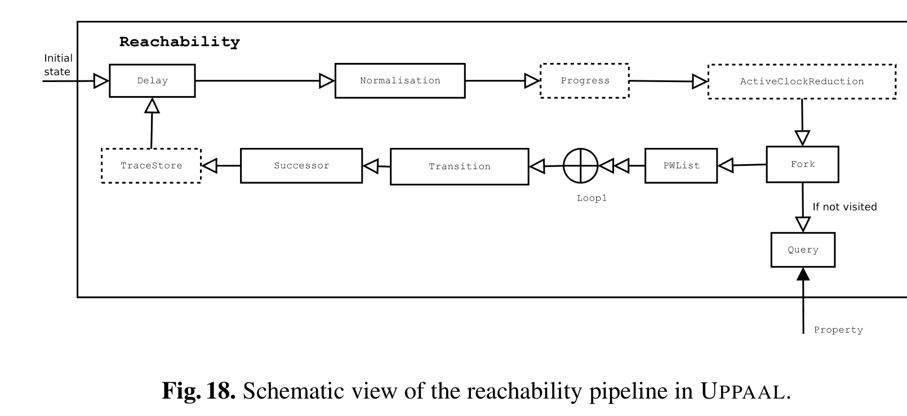

*Figure 18. Schematic view of the reachability pipeline in UPPAAL.*

To provide a system that is both efficient, easy to use, and portable, UPPAAL is split into two components: a graphical user interface written in Java and a verification engine written in C++. The engine and the GUI communicate using a protocol, allowing verification to be performed either on the local workstation or on a powerful server in a network.

To implement the reachability analysis algorithm, the UPPAAL verification engine is organized as a pipeline that mirrors the natural data flow in the algorithm. This architecture simplifies both activating and deactivating optimizations at runtime by inserting and removing stages dynamically, and introducing new optimizations and features by implementing new or changing existing stages.

In addition to the zone-manipulation algorithms from Section 4 and the pipeline architecture, UPPAAL includes several further optimizations:

- minimal constraint systems [LLPY97] and CDDs [LPWY99, BLP+99], to reduce memory consumption by removing redundant information in zones before storing them;
- selective storing of states in `PASSED` [LLPY97], using static analysis to detect states that can be omitted safely without losing termination;
- compression [Ben01] and sharing [BDLY03, DBLY03] of state data, to reduce the memory consumption of `PASSED` and `WAIT`;
- active clock reduction [DY96], using live-range analysis to determine when the value of a clock is irrelevant; and
- supertrace [Hol91], hash compaction [WL93, SD95], and convex-hull approximation [Bal96], which further reduce memory usage, sometimes at the risk of inconclusive results.

<!-- page: 35 -->

## Acknowledgements

We would like to thank Pavel Krcal for pointing out an error in an early version of this document.

## Appendix: Pseudo-Code for Operations on DBMs

### Algorithm 2 `close(D)`

Floyd's algorithm for computing shortest paths.

```text
for k := 0 to n do
  for i := 0 to n do
    for j := 0 to n do
      Dij := min(Dij, Dik + Dkj)
    end for
  end for
end for
```

### Algorithm 3 Reduction of a zero-cycle-free graph `G` with `n` nodes

```text
for i := 1 to n do
  for j := 1 to n do
    for k := 1 to n do
      if Gik + Gkj <= Gij then
        mark edge i -> j as redundant
      end if
    end for
  end for
end for
remove all edges marked as redundant
```

### Algorithm 4 Reduction of a negative-cycle-free graph `G` with `n` nodes

<!-- page: 36 -->

```text
for i := 1 to n do
  if Nodei is not in a partition then
    Eqi := empty
    for j := i to n do
      if Gij + Gji = 0 then
        Eqi := Eqi union {Nodej}
      end if
    end for
  end if
end for

let G' be a graph without nodes
for each Eqi do
  pick one representative Nodei in Eqi
  add Nodei to G'
  connect Nodei to all nodes in G' using weights from G
end for
reduce G'
for each Eqi do
  add one zero cycle containing all nodes in Eqi to G'
end for
```

### Algorithm 5 `relation(D, D')`

```text
fDsubsetD' := true
fDsupsetD' := true
for i := 0 to n do
  for j := 0 to n do
    fDsubsetD' := fDsubsetD' and (Dij <= D'ij)
    fDsupsetD' := fDsupsetD' and (Dij >= D'ij)
  end for
end for
return <fDsubsetD', fDsupsetD'>
```

### Algorithm 6 `up(D)`

```text
for i := 1 to n do
  Di0 := infinity
end for
```

### Algorithm 7 `down(D)`

<!-- page: 37 -->

```text
for i := 1 to n do
  D0i := (0, <=)
  for j := 1 to n do
    if Dji < D0i then
      D0i := Dji
    end if
  end for
end for
```

### Algorithm 8 `and(D, g)`

```text
if Dyx + (m, <=) < 0 then
  D00 := (-1, <=)
else if (m, <=) < Dxy then
  Dxy := (m, <=)
  for i := 0 to n do
    for j := 0 to n do
      if Dix + Dxj < Dij then
        Dij := Dix + Dxj
      end if
      if Diy + Dyj < Dij then
        Dij := Diy + Dyj
      end if
    end for
  end for
end if
```

### Algorithm 9 `free(D, x)`

```text
for i := 0 to n do
  if i != x then
    Dxi := infinity
    Dix := Di0
  end if
end for
```

### Algorithm 10 `reset(D, x := m)`

<!-- page: 38 -->

```text
for i := 0 to n do
  Dxi := (m, <=) + D0i
  Dix := Di0 + (-m, <=)
end for
```

### Algorithm 11 `copy(D, x := y)`

```text
for i := 0 to n do
  if i != x then
    Dxi := Dyi
    Dix := Diy
  end if
end for
Dxy := (0, <=)
Dyx := (0, <=)
```

### Algorithm 12 `shift(D, x := x + m)`

```text
for i := 0 to n do
  if i != x then
    Dxi := Dxi + (m, <=)
    Dix := Dix + (-m, <=)
  end if
end for
D0x := max(D0x, (0, <=))
Dx0 := min(Dx0, (0, <=))
```

### Algorithm 13 `norm_k(D)`

```text
for i := 0 to n do
  for j := 0 to n do
    if Dij != infinity and Dij > (ki, <=) then
      Dij := infinity
    else if Dij != infinity and Dij < (-kj, <) then
      Dij := (-kj, <)
    end if
  end for
end for
close(D)
```

### Algorithm 14 Core normalization `Core-Normk(D)`

<!-- page: 39 -->

```text
Gunsat := empty
for all g in Gd do
  if D /\ g = empty then
    Gunsat := Gunsat union {g}
  end if
  if D /\ not g = empty then
    Gunsat := Gunsat union {not g}
  end if
end for
D := normk(D)
for all g in Gunsat do
  D := D /\ not g
end for
return D
```

### Algorithm 15 Zone splitting `split(D)`

```text
Q := {D}
Q' := empty
for all g in Gd do
  for all D' in Q do
    if D' /\ g and D' /\ not g then
      Q' := Q' union {D' /\ g, D' /\ not g}
    else
      Q' := Q' union {D'}
    end if
  end for
  Q := Q'
  Q' := empty
end for
return Q
```

### Algorithm 16 Normalization `normk,G(D)`

```text
Q := empty
for all D' in split(D) do
  Q := Q union {Core-Normk(D')}
end for
return Q
```

### Algorithm 17 Adding encoded bounds

```text
if b1 = MAX_INT or b2 = MAX_INT then
  return MAX_INT
else
  return b1 + b2 - ((b1 & 1) | (b2 & 1))
end if
```

## References

<!-- page: 40 -->

- `[ABL98]` Luca Aceto, Augusto Bergueno, and Kim G. Larsen. *Model checking via reachability testing for timed automata*. In *Proceedings, Fourth Workshop on Tools and Algorithms for the Construction and Analysis of Systems*, volume 1384 of Lecture Notes in Computer Science. Springer-Verlag, 1998.
- `[ACD90]` Rajeev Alur, Costas Courcoubetis, and David L. Dill. *Model-checking for real-time systems*. In *Proceedings, Seventh Annual IEEE Symposium on Logic in Computer Science*, pages 414-425. IEEE Computer Society Press, 1990.
- `[ACD93]` Rajeev Alur, Costas Courcoubetis, and David L. Dill. *Model-checking in dense real time*. *Information and Computation*, 104(1):2-34, 1993.
- `[ACH94]` Rajeev Alur, Costas Courcoubetis, and Thomas A. Henzinger. *The observational power of clocks*. In *International Conference on Concurrency Theory*, pages 162-177, 1994.
- `[AD90]` Rajeev Alur and David L. Dill. *Automata for modeling real-time systems*. In *Proceedings, Seventeenth International Colloquium on Automata, Languages and Programming*, volume 443 of Lecture Notes in Computer Science, pages 322-335. Springer-Verlag, 1990.
- `[AD94]` Rajeev Alur and David L. Dill. *A theory of timed automata*. *Journal of Theoretical Computer Science*, 126(2):183-235, 1994.
- `[AFH99]` Rajeev Alur, Limor Fix, and Thomas A. Henzinger. *Event-clock automata: a determinizable class of timed automata*. *Theoretical Computer Science*, 211(1-2):253-273, 1999.
- `[AH94]` Rajeev Alur and Thomas A. Henzinger. *A really temporal logic*. *Journal of the ACM*, 41(1):181-204, 1994.
- `[Bal96]` Felice Balarin. *Approximate reachability analysis of timed automata*. In *Proceedings, 17th IEEE Real-Time Systems Symposium*. IEEE Computer Society Press, 1996.
- `[BD91]` Bernard Berthomieu and Michel Diaz. *Modeling and verification of timed dependent systems using timed Petri nets*. *IEEE Transactions on Software Engineering*, 17(3):259-273, 1991.
- `[BDGP98]` Beatrice Berard, Volker Diekert, Paul Gastin, and Antoine Petit. *Characterization of the expressive power of silent transitions in timed automata*. *Fundamenta Informaticae*, 36:145-182, 1998.
- `[BDLY03]` Gerd Behrmann, Alexandre David, Kim G. Larsen, and Wang Yi. *Unification and sharing in timed automata verification*. In *Proceedings, Tenth International SPIN Workshop*, volume 2648 of Lecture Notes in Computer Science. Springer-Verlag, 2003.
- `[Bel57]` Richard Bellman. *Dynamic Programming*. Princeton University Press, 1957.
- `[Ben01]` Johan Bengtsson. *Reducing memory usage in symbolic state-space exploration for timed systems*. Technical Report 2001-009, Department of Information Technology, Uppsala University, 2001.
- `[Ben02]` Johan Bengtsson. *Clocks, DBMs and states in timed systems*. PhD thesis, ACTA Universitatis Upsaliensis 39, Uppsala University, 2002.
- `[BJLY98]` Johan Bengtsson, Bengt Jonsson, Johan Lilius, and Wang Yi. *Partial order reductions for timed systems*. In *Proceedings, Ninth International Conference on Concurrency Theory*, volume 1466 of Lecture Notes in Computer Science, pages 485-500. Springer-Verlag, 1998.
- `[BLP+99]` Gerd Behrmann, Kim G. Larsen, Justin Pearson, Carsten Weise, and Wang Yi. *Efficient timed reachability analysis using clock difference diagrams*. In *Proceedings, Eleventh International Conference on Computer Aided Verification*, volume 1633 of Lecture Notes in Computer Science, pages 341-353. Springer-Verlag, 1999.

<!-- page: 41 -->

- `[BY03]` Johan Bengtsson and Wang Yi. *On clock difference constraints and termination in reachability analysis of timed automata*. In *Formal Methods and Software Engineering, ICFEM 2003*, volume 2885 of Lecture Notes in Computer Science. Springer, 2003.
- `[Cer92]` Karlis Cerans. *Decidability of bisimulation equivalences for parallel timer processes*. In *Computer Aided Verification*, volume 663 of LNCS. Springer, 1992.
- `[Cha99]` Zhou Chaochen. *Duration calculus, a logical approach to real-time systems*. *Lecture Notes in Computer Science*, 1548:1-7, 1999.
- `[DBLY03]` Alexandre David, Gerd Behrmann, Kim G. Larsen, and Wang Yi. *A tool architecture for the next generation of UPPAAL*. Technical Report 2003-011, Department of Information Technology, Uppsala University, 2003.
- `[Dil89]` David L. Dill. *Timing assumptions and verification of finite-state concurrent systems*. In *Automatic Verification Methods for Finite State Systems*, volume 407 of Lecture Notes in Computer Science, pages 197-212. Springer-Verlag, 1989.
- `[DY96]` Conrado Daws and Sergio Yovine. *Reducing the number of clock variables of timed automata*. In *Proceedings, 17th IEEE Real-Time Systems Symposium*. IEEE Computer Society Press, 1996.
- `[Flo62]` Robert W. Floyd. *ACM algorithm 97: shortest path*. *Communications of the ACM*, 5(6):345, 1962.
- `[FPY02]` Elena Fersman, Paul Pettersson, and Wang Yi. *Timed automata with asynchronous processes: Schedulability and decidability*. In *TACAS 2002*, volume 2280 of Lecture Notes in Computer Science, pages 67-82. Springer-Verlag, 2002.
- `[Hal93]` N. Halbwachs. *Delay analysis in synchronous programs*. In *Fifth Conference on Computer-Aided Verification*, Elounda, Greece, 1993.
- `[HNSY92]` Thomas A. Henzinger, Xavier Nicollin, Joseph Sifakis, and Sergio Yovine. *Symbolic model checking for real-time systems*. In *Proceedings, Seventh Annual IEEE Symposium on Logic in Computer Science*, pages 394-406, 1992.
- `[HNSY94]` Thomas A. Henzinger, Xavier Nicollin, Joseph Sifakis, and Sergio Yovine. *Symbolic model checking for real-time systems*. *Journal of Information and Computation*, 111(2):193-244, 1994.
- `[Hoa78]` C. A. R. Hoare. *Communicating sequential processes*. *Communications of the ACM*, 21(8):666-676, 1978.
- `[Hol91]` Gerard J. Holzmann. *Design and Validation of Computer Protocols*. Prentice-Hall, 1991.
- `[Lar00]` Fredrik Larsson. *Efficient implementation of model-checkers for networks of timed automata*. Licentiate thesis 2000-003, Department of Information Technology, Uppsala University, 2000.
- `[LLPY97]` Kim G. Larsen, Fredrik Larsson, Paul Pettersson, and Wang Yi. *Efficient verification of real-time systems: Compact data structure and state-space reduction*. In *Proceedings, 18th IEEE Real-Time Systems Symposium*, pages 14-24. IEEE Computer Society Press, 1997.
- `[LPWY99]` Kim G. Larsen, Justin Pearson, Carsten Weise, and Wang Yi. *Clock difference diagrams*. *Nordic Journal of Computing*, 1999.
- `[LPY95]` Kim G. Larsen, Paul Pettersson, and Wang Yi. *Compositional and symbolic model-checking of real-time systems*. In *Proceedings, 16th IEEE Real-Time Systems Symposium*, pages 76-87. IEEE Computer Society Press, 1995.

<!-- page: 42 -->

- `[LPY97]` Kim G. Larsen, Paul Pettersson, and Wang Yi. *UPPAAL in a nutshell*. *Journal on Software Tools for Technology Transfer*, 1997.
- `[LPY98]` Magnus Lindahl, Paul Pettersson, and Wang Yi. *Formal design and analysis of a Gear-Box Controller*. In *Proceedings, Fourth Workshop on Tools and Algorithms for the Construction and Analysis of Systems*, volume 1384 of Lecture Notes in Computer Science. Springer-Verlag, 1998.
- `[LPY01]` Magnus Lindahl, Paul Pettersson, and Wang Yi. *Formal design and analysis of a Gearbox Controller*. *International Journal of Software Tools for Technology Transfer*, 3(3):353-368, 2001.
- `[LW97]` Kim Guldstrand Larsen and Yi Wang. *Time-abstracted bisimulation: Implicit specifications and decidability*. *Information and Computation*, 134(2):75-101, 1997.
- `[Mil89]` Robin Milner. *Communication and Concurrency*. Prentice Hall, 1989.
- `[NS94]` Xavier Nicollin and Joseph Sifakis. *The algebra of timed processes, ATP: Theory and application*. *Journal of Information and Computation*, 114(1):131-178, 1994.
- `[Pet99]` Paul Pettersson. *Modelling and Verification of Real-Time Systems Using Timed Automata: Theory and Practice*. PhD thesis, Uppsala University, 1999.
- `[Rok93]` Tomas Gerhard Rokicki. *Representing and Modeling Digital Circuits*. PhD thesis, Stanford University, 1993.
- `[RR88]` G. M. Reed and A. W. Roscoe. *A timed model for communicating sequential processes*. *Theoretical Computer Science*, 58(1-3):249-261, 1988.
- `[SD95]` Ulrich Stern and David L. Dill. *Improved probabilistic verification by hash compaction*. In *Correct Hardware Design and Verification Methods*, IFIP WG10.5 Proceedings, 1995.
- `[WL93]` Pierre Wolper and Dennis Leroy. *Reliable hashing without collision detection*. In *Proceedings, Fifth International Conference on Computer Aided Verification*, volume 697 of Lecture Notes in Computer Science, pages 59-70. Springer-Verlag, 1993.
- `[Yi91]` Wang Yi. *CCS + time = an interleaving model for real-time systems*. In *Proceedings, Eighteenth International Colloquium on Automata, Languages and Programming*, volume 510 of Lecture Notes in Computer Science. Springer-Verlag, 1991.
- `[YJ94]` Wang Yi and B. Jonsson. *Decidability of timed language-inclusion for networks of real-time communicating sequential processes*. In *Proceedings, Foundations of Software Technology and Theoretical Computer Science*, volume 880 of Lecture Notes in Computer Science. Springer-Verlag, 1994.
- `[YL93]` Mihalis Yannakakis and David Lee. *An efficient algorithm for minimizing real-time transition systems*. In *Proceedings, Fifth International Conference on Computer Aided Verification*, volume 697 of Lecture Notes in Computer Science, pages 210-224. Springer-Verlag, 1993.
- `[Yov97]` Sergio Yovine. *Kronos: a verification tool for real-time systems*. *Journal on Software Tools for Technology Transfer*, 1, 1997.
- `[YPD94]` Wang Yi, Paul Pettersson, and Mats Daniels. *Automatic verification of real-time communicating systems by constraint-solving*. In *Proceedings, Seventh International Conference on Formal Description Techniques*, pages 223-238, 1994.
