## Model Checking Timed Automata with Priorities using DBM Subtraction

Alexandre David<sup>1</sup>, John Hakansson<sup>2</sup>, Kim G. Larsen<sup>1</sup>, and Paul Pettersson<sup>2</sup>  
<sup>1</sup> Department of Computer Science, Aalborg University, Denmark. `{adavid,kgl}@cs.aau.dk`  
<sup>2</sup> Department of Information Technology, Uppsala University, Sweden. `{johnh,paupet}@it.uu.se`

## Abstract

In this paper we describe an extension of timed automata with priorities, and efficient algorithms to compute subtraction on DBMs (difference bound matrices), needed in symbolic model-checking of timed automata with priorities. Subtraction is one of the few operations on DBMs that yields a non-convex set and therefore requires a representation as a set of DBMs. Our subtraction algorithms are efficient in the sense that the number of generated DBMs is significantly reduced compared to a naive algorithm. The overhead in running time is compensated by the gain obtained from reducing the number of resulting DBMs, since that number directly affects the performance of symbolic model-checking. The use of DBM subtraction extends beyond timed automata with priorities; it is also useful for guards on transitions with urgent actions, deadlock checking, and timed games.

## 1 Introduction

Since the introduction of timed automata [2] in 1990, the theory has proven its capability for specifying and analysing timed systems in many case studies, e.g. [4, 23]. To support such studies, tools such as Kronos [7], Uppaal [18], and RED [24] have been developed to offer modelling, simulation, model-checking, and testing for real-time systems specified as timed automata.

In implementations of real-time systems, priorities are often used to structure and control the usage of shared resources. Priorities are often associated with processes or tasks to control their access to resources such as CPU time or shared memory. Consequently, programming languages such as Ada [3, 12], and scheduling policies used in real-time operating systems such as rate-monotonic scheduling [9], are often based on a notion of priorities on tasks. At lower levels, closer to hardware, priorities are often associated with interrupts and with access to shared communication buses.

Priorities have been studied in process algebras, e.g. [11, 8], and can be modelled using timed automata [12, 14]. However, doing so can be cumbersome and error-prone. Consider the simple example shown in Figure 1, and assume that the location $l$ can be reached with any time assignment satisfying the constraint


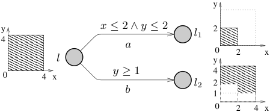

*Figure 1. A timed automaton with priorities on actions.*

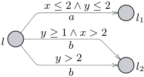

*Figure 2. Encoding of the priorities in Figure 1.*

x \le 4 \land y \le 4.

Further assume that the edge labelled with `a` has priority over the edge labelled with `b`. We see that $l_1$ can be reached with any time assignment satisfying the constraint $x \le 2 \land y \le 2$. The location $l_2$ is reachable under the constraint

$$
(y \ge 1 \land x \le 4 \land y \le 4) \land \neg(x \le 2 \land y \le 2),
$$

which is a non-convex set of clock valuations and thus cannot be represented as a conjunction of simple constraints. This makes symbolic state-space exploration potentially costly, since the set of clock valuations reachable in one step over a low-priority transition, such as transitions derived from the `b`-edge, will in general have to be represented by a set of convex constraint systems. Figure 2 shows a timed automaton in which the priorities of the automaton in Figure 1 have been encoded. Note that the `b`-edge has been split into two edges in order to encode the disjunctive constraints on the clock valuations reaching $l_2$.

Model-checking tools for timed automata typically use DBMs (difference bound matrices) [13, 22] to represent convex constraints on clock variables. However, as illustrated above, analysis of timed automata with priorities requires the model-checking engine to handle disjunctive constraints efficiently. As a second contribution of this paper, we present a variety of techniques for performing subtraction on DBMs, that is, for computing $D - D'$ defined as $D \land \neg D'$ for two DBMs $D$ and $D'$. Guided by the goal of minimising the set of DBMs resulting from subtraction, and of keeping them disjoint, we give a heuristic algorithm with good performance. To support this claim, we present experimental evidence obtained by applying a version of Uppaal extended with priorities to a set of examples. We note that DBM subtraction is already needed for backward model-checking of full TCTL or scheduler synthesis [23], controller synthesis [10], and support for urgent guards.

The rest of this paper is organised as follows. Timed automata with priorities are described in Section 3, and the required DBM subtraction operation in Section 4. In Section 5 we present subtraction algorithms that reduce the set of resulting DBMs. We show experimentally in Section 6 that our algorithm improves DBM subtraction significantly.

Related work: Priorities in process algebras are described in [11], where priorities on actions are defined in two levels. A process algebra of communicating shared processes is described in [8], where priorities are described as real numbers on events and timed actions. Preservation of congruence is a major concern in these papers.

In [6] priorities are introduced for live systems (time-lock and deadlock free with no indefinite waiting), with the purpose to preserve liveness in the composition of such systems. In our work we have focused on introducing priorities for existing timed automata models, and developing efficient algorithms for DBM subtraction.

In [16] a notion of priorities for timed automata based on total orderings and an algorithm for computing DBM subtractions have been proposed. In this paper, we introduce a more general notion of priorities for timed automata where the priority ordering is allowed to be partial, and allowing the priority ordering to be defined both on the level of synchronisation actions as well as the individual automata. We believe that both these two suggestions will be useful when modelling real-time systems with priorities. The subtraction of [16] is claimed to be optimal, i.e., it generates the fewest possible number of DBMs as a result. However, the ordering of constraining operations needed for subtraction is not mentioned. We argue in this paper that ordering is important and optimality of subtraction w.r.t. reachability is more difficult than just having the minimal number of DBMs from subtractions.

## 2 Preliminaries

## 2.1 Clock Constraints

Model-checking of timed automata involves exploring a state-space of symbolic states, where each symbolic state represents a set of clock valuations. For a set $C$ of $n$ clocks, a clock valuation is a map $v : C \to \mathbb{R}_{\ge 0}$. We denote by $B(C)$ the set of conjunctions of atomic constraints of the form $x_i \sim m$ or $x_i - x_j \sim m$, where $m$ is a natural number, $x_i$ and $x_j$ are the valuations of clocks $i$ and $j$, and $\sim \in \{<, \le, =, \ge, >\}$. Although it is possible to represent sets of clock valuations as regions [2], using zones is much more efficient in practice [5]. A zone corresponds to the set of clock valuations satisfying a conjunction of constraints in $B(C)$. By definition, a zone is convex, and we represent it as a difference bound matrix (DBM).

## 2.2 Difference Bound Matrices

A DBM is a conjunction

$$
D = \bigwedge_{1 \le i,j \le n} (x_i - x_j \sim b_{ij}),
\qquad \sim \in \{<, \le\},
$$

written as $D = [d_{ij}]$. We use $d_{ij}$ (or $e_{ij}$) to denote the constraints of a DBM $D$ (or $E$).

The bound of a constraint $d_{ij}$ is denoted $|d_{ij}|$. We define a complement operation over $\sim$ such that $\overline{\le} = <$ and $\overline{<} = \le$.

A DBM is canonical if it is closed under entailment, e.g. by Floyd's shortest-path algorithm [15]. We consider all DBMs to be canonical.

**Definition 1 (Operations on constraints).** For constraints $d_{ij}$ and $e_{ij}$:

- $d_{ij} \le e_{ij} \Leftrightarrow d_{ij} \Rightarrow e_{ij}$.
- $d_{ij} < e_{ij} \Leftrightarrow d_{ij} \ne e_{ij} \land d_{ij} \le e_{ij}$.
- $\neg d_{ij} = \neg(x_i - x_j \sim b_{ij}) = x_j - x_i \,\overline{\sim}\, (-b_{ij})$. Note that $\neg d_{ij}$ is a new constraint $d'_{ji}$ comparable with other constraints $e_{ji}$.
- $d_{ik} + d_{kj} = (x_i - x_k \sim b_{ik}) + (x_k - x_j \sim' b_{kj}) = x_i - x_j \sim'' (b_{ik} + b_{kj})$, where $\sim''$ is `<` if either $\sim$ or $\sim'$ is `<`, and `<=` otherwise.
- $d_{ik} - d_{jk} = d_{ik} + \neg d_{jk}$.

We write $v \models g$ to denote that a constraint $g \in B(C)$ is satisfied by a clock valuation $v$. The notation $v \oplus d$ represents a valuation where all clocks have advanced by the real-valued delay $d$ from their value in $v$. For a set of clocks $r$, we denote by $[r \mapsto 0]v$ the valuation that maps clocks in $r$ to zero and agrees with $v$ for all other clocks. We write

$$
D = \{\, v \mid v \models x_i - x_j \sim b_{ij} \,\}
$$

for the set of clock valuations that satisfy the constraints of $D$.

**Definition 2 (Operations on zones).** For a zone $D$ and a clock constraint $g$:

- conjunction: $D \land g = \{\, v \mid v \in D,\ v \models g \,\}$,
- delay: $D^{\uparrow} = \{\, v \oplus t \mid v \in D,\ t \in \mathbb{R}_{\ge 0} \,\}$,
- reset: $r(D) = \{\, [r \mapsto 0]v \mid v \in D \,\}$,
- free: $\operatorname{free}(D, r) = \{\, [r \mapsto t]v \mid v \in D,\ t \in \mathbb{R}_{\ge 0} \,\}$,
- negation: $\neg D = \{\, v \mid v \notin D \,\}$.

**Subtraction.** Given two DBMs $D$ and $E$, we want to subtract $E$ from $D$. The resulting set $S$ is defined as the set satisfying the constraints of $D$ and $\neg E$. The result is not necessarily a zone. The subtraction $S = D \land \neg E$, denoted $D - E$, is written as:


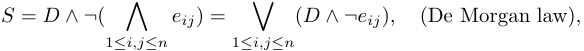


This is a union of copies of $D$ constrained by the negated constraints of $E$. It yields a straightforward basic algorithm for subtraction. Figure 3 illustrates this algorithm for two clocks. The result $S = D - E$ is represented by the union of the six smaller zones on the right in the figure. The number of zones in $S$ is bounded by $n^2$, and creating each of these zones costs $O(n^2)$, so the overall complexity is $O(n^4)$ in both time and space, where $n$ is the number of clocks.


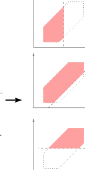

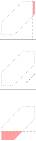

*Figure 3. Basic subtraction algorithm. The result of $D - E$ is the union of all six zones on the right.*

## 3 Timed Automata with Priorities

We denote by `Act` a set of actions, including the internal action $\tau$ and synchronising actions $a$. A synchronising action $a$ has a complement $\overline{a} \in \mathrm{Act}$ such that $\overline{\overline{a}} = a$. A timed automaton $A_i = \langle N_i, l_i^0, E_i, I_i \rangle$ is a finite-state automaton with a set $N_i$ of locations $l_i$, a set $E_i$ of edges, and an initial location $l_i^0$. The function $I_i : N_i \to B(C)$ maps each location to an invariant condition. An edge of automaton $A_i$ from location $l_i$ to $l_i'$ is denoted

$$
l_i \xrightarrow{g, a, r} l_i',
$$

where the labels consist of a clock guard $g \in B(C)$, an action $a \in \mathrm{Act}$, and a set of clocks $r \subseteq C$.

We define a network of timed automata as the parallel composition $A_1 \mid \cdots \mid A_n$ communicating on a set of actions `Act`, and extend it with priority orders on actions or automata. A priority order on actions is a partial order $\prec_a$. We write $a \prec_a a'$ to denote that $a'$ has higher priority than $a$. Similarly, for automata we write $A_i \prec_A A_j$ to denote that automaton $A_j$ has higher priority than $A_i$.

## 3.1 Semantics

A state of a network of timed automata is a pair $\langle l, v \rangle$, where $l$ is a vector of locations $l_i$ for each automaton, and $v$ is a clock valuation. The initial state $\langle l_0, v_0 \rangle$ places all automata in their initial locations $l_i^0$ and maps all clocks to zero.

The invariant $I(l)$ is defined as the conjunction of the terms $I_i(l_i)$ for each automaton $A_i$. An update of the location vector for automaton $A_i$ is denoted by $l[l_i' / l_i]$, meaning that $l_i$ is replaced by $l_i'$. For a transition $t$ we denote by $g_t$ the conjunction of the guards on the edges participating in that transition. Similarly, $r_t$ denotes the union of the corresponding reset sets, and $l_t$ denotes the location vector of the state generated by $t$.

Using a priority order $\prec$ on transitions, a transition can block another if it has higher priority. From a state $\langle l, v \rangle$, a transition $t$ is blocked according to the predicate

$$
\operatorname{block}(t) = \exists t'.\ t \prec t' \land v \models g_{t'} \land [r_{t'} \mapsto 0]v \models I(l_{t'}).
$$

The transitions between states can be delay transitions, internal transitions, or synchronising transitions:

- **Delay transition.** $\langle l, v \rangle \xrightarrow{d} \langle l, v \oplus d \rangle$ if $v \oplus d' \models I(l)$ for all $0 \le d' \le d$.
- **Internal transition.** $\langle l, v \rangle \xrightarrow{a} \langle l[l_i' / l_i], v' \rangle$ if there is an edge $l_i \xrightarrow{g, a, r} l_i'$ with a local action $a$, such that $v' = [r \mapsto 0]v$, $v \models g$, $v' \models I_i(l_i')$, and $\neg \operatorname{block}(t)$.
- **Synchronising transition.** $\langle l, v \rangle \xrightarrow{a} \langle l[l_i' / l_i,\, l_j' / l_j], v' \rangle$ if there are two edges $l_i \xrightarrow{g_i, a, r_i} l_i'$ and $l_j \xrightarrow{g_j, \overline{a}, r_j} l_j'$ with $i \ne j$, such that $v' = [r_i \mapsto 0,\, r_j \mapsto 0]v$, $v \models g_i$, $v \models g_j$, $v' \models I_i(l_i')$, $v' \models I_j(l_j')$, and $\neg \operatorname{block}(t)$.

With these semantics, a delay transitions can never be blocked, and no transition can be blocked by a delay transition. In Section 3.3 we show how a priority order ≺ over internal and synchronising transitions can be derived from the orders ≺a or ≺A.

## 3.2 Symbolic Semantics

We use zones to define a symbolic, finite semantics for networks of timed automata with priorities. A symbolic state is a pair $\langle l, D \rangle$ with a location vector $l$ and a zone $D$. A symbolic transition is denoted

$$
\langle l, D \rangle \Longrightarrow \langle l', \widehat{D}' \rangle,
$$

where $\widehat{D}'$ is a disjunction of zones, and $\langle l', \widehat{D}' \rangle$ stands for all symbolic states $\langle l', D' \rangle$ such that $D' \in \widehat{D}'$. The set of zones that block a transition $t$ is described by the predicate

$$
\operatorname{Block}(t) = \bigvee_{t \prec t'} \operatorname{free}(I(l_{t'}), r_{t'}) \land g_{t'}.
$$

The symbolic transition rules are:

- **Symbolic delay transition.** $\langle l, D \rangle \Longrightarrow \langle l, D^{\uparrow} \land I(l) \rangle$.
- **Symbolic internal transition.** $\langle l, D \rangle \Longrightarrow \langle l[l_i' / l_i], \widehat{D}' \rangle$ if there is an edge $l_i \xrightarrow{g, a, r} l_i'$ with a local action $a$, and
  $$
  \widehat{D}' = r(D \land g - \operatorname{Block}(t)) \land I_i(l_i').
  $$
- **Symbolic synchronising transition.** $\langle l, D \rangle \Longrightarrow \langle l[l_i' / l_i,\, l_j' / l_j], \widehat{D}' \rangle$ if there are two edges $l_i \xrightarrow{g_i, a, r_i} l_i'$ and $l_j \xrightarrow{g_j, \overline{a}, r_j} l_j'$ with $i \ne j$, and
  $$
  \widehat{D}' = (r_i \cup r_j)\bigl(D \land g_i \land g_j - \operatorname{Block}(t)\bigr) \land I_i(l_i') \land I_j(l_j').
  $$

**Theorem 1 (Correctness of Symbolic Semantics).** Assume location vectors $l_0$, $l_f$, clock assignments $u_0$, $u_f$, and a set of zones $\widehat{D}_f$. Let $\{u_0\}$ denote the clock constraint with the single solution $u_0$.

- **Soundness.** Whenever $\langle l_0, \{u_0\} \rangle \Longrightarrow^* \langle l_f, \widehat{D}_f \rangle$, then $\langle l_0, u_0 \rangle \to^* \langle l_f, u_f \rangle$ for all $u_f \in \widehat{D}_f$.
- **Completeness.** Whenever $\langle l_0, u_0 \rangle \to^* \langle l_f, u_f \rangle$, then $\langle l_0, \{u_0\} \rangle \Longrightarrow^* \langle l_f, \widehat{D}_f \rangle$ for some $\widehat{D}_f$ such that $u_f \in \widehat{D}_f$.

*Proof.* By induction on the length of transition sequences. Using the zone operations of Definition 2, it can be shown that `block(t)` and `Block(t)` characterise the same sets of clock valuations.

## 3.3 Priorities in UPPAAL

The priority order $\prec$ over transitions can be derived from the priority orders $\prec_a$ on actions and $\prec_A$ on automata. We describe here the order used in Uppaal [18]. For transitions $t$ and $t'$ with actions $a$ and $a'$, we derive a priority order from $\prec_a$ by defining $t \prec t'$ whenever $a \prec_a a'$.

Deriving a priority order on transitions from $\prec_A$ is less straightforward, because two automata with different priorities may be involved in a synchronising transition. For two transitions $t$ and $t'$, where $t$ is a synchronisation between $A_i$ and $A_j$ such that $\neg(A_j \prec_A A_i)$, and $t'$ is a synchronisation between $A_i'$ and $A_j'$ such that $\neg(A_j' \prec_A A_i')$, we define $t \prec t'$ by the rule shown below:


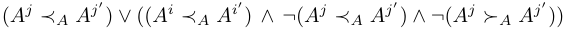


Intuitively, the weakly higher-priority processes $A_j$ and $A_j'$ are compared first. If they are related, they define the relation between $t$ and $t'$; otherwise, the relation is defined by the relation between $A_i$ and $A_i'$.

In a model with priorities on both actions and automata, priorities are resolved by comparing priorities on actions first. Only if they are equal is the priority order on automata used.

## 4 DBM Subtraction

## 4.1 Improved Subtraction

The first observation from the basic algorithm in Section 2.2 is that some splits may be avoided by considering only the constraints that are not redundant in the DBM. It is possible to compute the set of minimal constraints of a DBM [19] in $O(n^3)$ time, and this set is unique with respect to a given clock ordering. Since that minimal set is semantically equivalent to the original set $E$, we use it instead and compute $D - E = D - E_m$. In the experiments, this algorithm serves as the baseline for comparing the other improvements, since it obviously reduces splitting. Figure 4 shows the reduced subtraction obtained by using the minimal set of constraints. The extra time spent on computing that set is worthwhile because reducing the number of resulting DBMs is more important. The overall complexity remains $O(n^4)$.

## 4.2 Disjoint Subtraction

The improved algorithm gives $D - E$ as a union of DBMs that may overlap, which means there are redundant points. These points would duplicate later operations unnecessarily, so a second improvement is to ensure that the result is a union of disjoint DBMs. The downside is that inclusion checking may become worse for later generated DBMs. This issue exists even without subtraction, and it is not obvious whether the trade-off is always beneficial. The ordering of the splits affects the result, but the result is still guaranteed to be disjoint. The complexity remains $O(n^4)$.


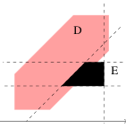

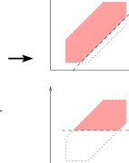

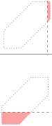

*Figure 4. Subtraction using the minimal set of constraints.*


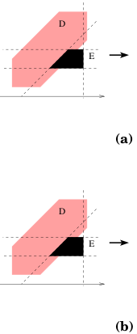

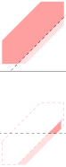

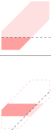

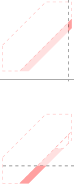

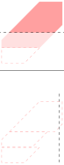

*Figure 5. Subtraction with disjoint result, with two orderings `(a)` and `(b)` for splitting.*


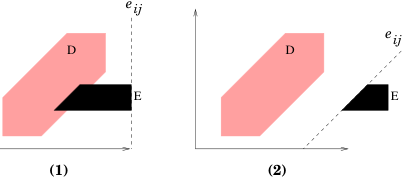

*Figure 6. Particular cases that simplify subtraction: `(1)` ignore $e_{ij}$ and `(2)` $D - E = D$.*

**Disjoint subtraction algorithm.** We compute the subtraction $D - E$ with the minimal set of constraints $E_m \subseteq E$ as follows:

1. Compute $E_m$.
2. Set $S = \mathrm{false}$ and $R = D$.
3. For each $e_{ij} \in E_m$ with $i \ne j$:
4. Set $S = S \lor (R \land \neg e_{ij})$.
5. Set $R = R \land e_{ij}$.
6. Return $S$.

$R$ is the remainder of the subtraction and is used to compute consecutive splits. The ordering of the splits affects the resulting number of DBMs, as shown in Figure 5. The resulting DBMs are disjoint and the result is correct in both cases, but in `(a)` we have four splits and a remainder that is discarded, whereas in `(b)` we have three splits and no remainder.

**Lemma 1 (Soundness and completeness of disjoint subtraction).** The algorithm still computes the same subtraction $D - E$, and $S$ is a union of disjoint DBMs:

$$
\forall s_1, s_2 \in S.\ s_1 \ne s_2 \Rightarrow s_1 \cap s_2 = \varnothing.
$$

## 4.3 Simple Improvements

There are two obvious cases, illustrated in Figure 6, that can be detected before starting to compute $D - E$:

1. The negated constraint $\neg e_{ij}$ reduces $D$ to an empty zone, which corresponds to a disjunct with `false`; in that case we ignore the constraint $e_{ij}$.

2. The negated constraint $\neg e_{ij}$ has no effect on $D$, which means that $E \land D = \mathrm{false}$ because DBMs are convex; therefore we stop and the result is $D$. We ignore the whole subtraction.

## 5 Reducing DBM Subtractions

Reducing subtraction means reducing the number of splits performed by the operation, but it is not obvious how to define an optimal split. For a subtraction $D - E$, different combinations may yield the same minimal number of splits, yet the resulting DBMs will be used in later computations, and different combinations may lead to different future splitting behaviour. The problem of computing a truly minimal split is interesting, but it is not obvious whether it can be done without worsening the original $O(n^4)$ complexity of subtraction. In this section we propose a heuristic that addresses both concerns by choosing a good ordering that tends to reduce the total number of splits.

## 5.1 Heuristic

The idea is to use a good ordering of the constraints of $E$ so that the earliest splits cut the original DBM $D$ into DBMs that are as large as possible, thereby cancelling later splits as soon as possible. We use the values $|e_{ij}| - |d_{ij}|$ to order the constraints $e_{ij}$, taking the smallest values first. This measures, in one dimension, how much the corresponding facet of $E$ lies "inside" $D$. The important trick is to always re-evaluate the smallest value after every split, because the DBM changes after each step. Complexity-wise, this corresponds to repeated selection in $O(n^4)$ time for $n^2$ constraints, instead of a single $O(n^2 \log n^2)$ sort, but it gives better results because the previous scores lose meaning after every split.

**Algorithm.** The algorithm splits $D$ by choosing the current best $e_{ij}$ as the one with the smallest

$$
H_{E,R}(i, j) = |e_{ij}| - |r_{ij}|.
$$

1. If there exist $i, j$ with $i \ne j$ and $d_{ij} \le \neg e_{ji}$, then return $D$.
2. Compute the minimal set of constraints $E_m$.
3. Initialise $R = D$ and $S = \mathrm{false}$.
4. While $R \ne \mathrm{false}$:
5. Choose $e_{ij} \in E_m$ with $i \ne j$ such that $H_{E,R}(i, j)$ is minimal.
6. If $r_{ij} \le \neg e_{ji}$, return $S \lor R$.
7. Else if $e_{ij} \ge r_{ij}$, skip.
8. Else set $S = S \lor (R \land \neg e_{ij})$.
9. Set $R = R \land e_{ij}$.
10. Return $S$.

Step 1 corresponds to case 2 from the preliminaries. It may seem redundant with step 6, but it avoids computing the minimal set of constraints in step 2 when the result is already trivial.

**Lemma 2 (Soundness of heuristic subtraction).** The algorithm computes the subtraction $D - E$ correctly.

*Proof.* The algorithm is equivalent to the disjoint subtraction of Section 4.2, except for the ordering of the constraints and the two trivial-case optimisations from Section 4.3.

## 5.2 Expensive Heuristic

The idea is to ignore (in addition to the previous heuristic) facets of E that do not intersect D. A facet of E corresponding to a constraint eij (of the form xi − xj ∼ bij) is the hyper-plane xi − xj = bij bounded by the other constraints of E. The intuition is to use the convexity of our DBMs and the fact D − E = D − (D ∩ E): If D ∩ E = ∅ and a facet of E is not in D ∩ E, i.e., it does not intersect D, then we can ignore it.

In practice there are several cases to consider: whether the constraints are strict, and different configurations of corner intersections. Exact intersection detection costs $O(n^3)$, and it is not obvious whether this idea is compatible with the minimal set of constraints. In practice, the simple idea therefore raises difficulties.

To simplify matters, we define a new heuristic function $H_{E,R}$ that returns $\infty$ if $\overline{E} \land (x_i - x_j = b_{ij}) \cap D = \varnothing$, and otherwise returns the previous value $|e_{ij} - r_{ij}|$. The condition means that we make the constraints of $E$ non-strict and then constrain them to the facet used for intersection testing. The intersection detection is partial and based on case 2 of Section 4.3. The new heuristic function is:

```text
H'_{E,R}(i, j):
  for all k with k != i and k != j:
    if |eij - ekj - rik| >= 0 or |eij - eik - rkj| >= 0:
      return +inf
  return |eij| - |rij|
```

We use two tricks. First, we tighten $e_{ji}$ with $\neg e_{ij}$ in order to compute the facet as a DBM; a specialization of Floyd's shortest-path algorithm [15] can do this in $O(n^2)$ time [22]. Second, we do not need all constraints, but only $e_{ki}$ and $e_{jk}$, which is exactly what the condition above checks. If the function returns $\infty$, then the facet corresponding to $e_{ij}$ does not intersect $D$; otherwise we fall back to the previous heuristic value.

The function has complexity $O(n)$, which is worse than before, but it may reduce splitting further. The global complexity is unfortunately $O(n^5)$. It is possible to move the detection outside the loop and get back to $O(n^4)$, but doing so is more complex in practice; the point here is to investigate whether the idea is worth the additional effort.

## 6 Experiments

We first experiment<sup>1</sup> with the impact of priorities in our model-checker. In practice, moderate splitting occurs, so we focus on subtraction separately in order to understand what happens in applications that cause much heavier splitting.

<sup>1</sup> All experiments were carried out on a dual-Xeon 2.8GHz machine with 4GB of RAM running Linux 2.6.9.


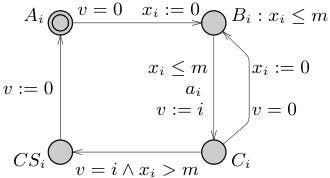

*Figure 7. A process $P_i$ in Fischer's mutual exclusion protocol.*

| N | Original (s) | Original (MB) | Priority (s) | Priority (MB) | Encoded (s) | Encoded (MB) |
|---|---:|---:|---:|---:|---:|---:|
| 5 | 0.85 | 6.9 | 0.21 | 6.6 | 0.21 | 6.6 |
| 6 | 17.90 | 10.2 | 3.02 | 6.8 | 3.46 | 7.0 |
| 7 | 780.60 | 40.6 | 131.57 | 9.1 | 144.90 | 9.8 |

*Table 1. Measurements when model-checking $N$ processes of the Fischer protocol.*

## 6.1 Experimenting with Priorities

We describe an experiment where we compare and evaluate models using priorities and models where priorities are manually encoded using guards and possibly extra edges. For every edge of the original automaton, the encoding is done by restricting the existing guards by removing all parts overlapping with higher priority transitions.

**Experiment 1.** We introduce priorities on actions in a model of the Fischer protocol [17] for mutual exclusion (Figure 7). The action $a_i$ of the model is used to introduce priorities so that $a_i \prec a_j$ when $i < j$, and $a_i \prec \tau$ for all processes $P_1 \cdots P_N$. Since $\tau$-actions get the highest priority, all $N$ processes will enter location $B_i$, in contrast to the original model where at most $N$ are in location $B_i$ simultaneously. Also, the same process $P_1$ will always enter the critical section because it will be the last process to reach location $C_i$. The encoded model is created by adding guards to edges from $B_i$ to $C_i$ that evaluate to false whenever a higher-priority transition $\tau$ or $a_j \succ a_i$ is enabled.

Table 1 shows measurements of model-checking various models of the Fischer protocol, to verify that there are no deadlocks and that mutual exclusion holds. The column N is the number of processes, Original are the time and memory requirements for model-checking the original model without priorities, Priority are the corresponding numbers for the model with priorities, and Encoded are the numbers for a model encoding the same behaviour as the model with priorities. The results for the Priority and Encoded models are comparable, and the overhead of the priority extension is small at worst. This is encouraging since tool support for priorities makes modelling easier.

| Algorithm | tgame12 | tgame12 + reduce | jobshop | jobshop + reduce | jobshop + strategy | jobshop + strategy + reduce |
|---|---:|---:|---:|---:|---:|---:|
| basic | 343314 / 124s / 319M | 283334 / 10.9s / 39.6M | 55514 / 9.9s / 35.2M | 91849 / 10.8s / 38.8M | 45970 / 3.0s / 18.7M | 73018 / 3.6s / 22.6M |
| reorder | 351615 / 165s / 320M | 291627 / 10.9s / 39.7M | 54996 / 12.3s / 31.9M | 89763 / 13.4s / 35.6M | 47073 / 3.0s / 18.7M | 73730 / 3.5s / 22.6M |
| disjoint | 396053 / 120s / 320M | 356322 / 12.0s / 40.6M | 39776 / 11.7s / 37.1M | 64195 / 12.8s / 40.8M | 31592 / 3.2s / 18.6M | 51531 / 3.7s / 22.6M |
| efficient | 323097 / 121s / 319M | 275991 / 10.7s / 39.7M | 24105 / 5.3s / 45.1M | 47705 / 6.8s / 48.6M | 20360 / 2.2s / 18.5M | 37854 / 2.5s / 22.0M |
| expensive | 320668 / 121s / 319M | 272788 / 11.0s / 39.7M | 23905 / 7.5s / 45.4M | 45428 / 8.9s / 48.8M | 20248 / 2.1s / 18.5M | 37653 / 2.6s / 22.0M |

*Table 2. Results of the timed-game experiments (`tgame`) with 12 plates, with and without `expensiveReduce` (`reduce`), and the job-shop experiments (`jobshop`) with or without strategy and with or without `expensiveReduce`. Each cell reports splits / time / memory.*

## 6.2 Experimenting with DBM Subtractions

**Experiment 2.** We implemented a timed-game reachability engine whose purpose is to find winning strategies [10], and we made a variant of it to solve job-shop scheduling problems formulated as games. The timed-game test example (`tgame`) is the production cell [20, 21] with 12 plates. The job-shop example (`jobshop`) is modelled from [1], where we find a schedule for 4 jobs using 6 resources. We run variants of the prototype both with and without strategy storage (`+strategy`). In addition, for both experiments the main loop can reduce federations (`+reduce`) or leave them unreduced, using inclusion checking based on subtraction. Table 2 shows the results. As in the previous experiments, we report the total number of split operations together with time in seconds and memory consumption in megabytes.

Comparing “basic” and “reorder” shows that it is not easy to find a good ordering. Results from “disjoint” show as we claimed that reducing the size of the symbolic states may actually interfere with inclusion checking. The “expensive” heuristic gives a marginal gain considering its cost. The “efficient” heuristic is the best choice. The reduction of federations gives significant gains both in time and memory, which means it is possible to contain the splits to some extent. Still this reduction operation needs a good subtraction. Indeed, experiment 2 shows how bad it may go. Concerning memory consumption it is difficult to draw conclusions. The behaviour of the “efficient” implementation may seem an anomaly but it is explained by the fact that the prototype is using sharing of

DBMs between states. The effect here is that DBMs are less shared since we know we have fewer of them.

These experiments confirm that our heuristic has an overhead but it is compensated by the reduction in splits, in particular for our “efficient” heuristic. We speculate that our priority implementation will behave reasonably well with models that generate more splitting thanks to our subtraction algorithm. Furthermore, we have implemented different reduction algorithms to merge DBMs based on subtraction. Our implementation scales well with good merging algorithms thanks to efficient subtractions. However, this is out of scope of this paper.

## 7 Conclusion

We have shown that our priority extension is useful for modelling and can also be used to reduce the search state-space. Furthermore, its overhead in our modelchecker is reasonable. We have also shown that it is worth the extra effort for a DBM subtraction algorithm to produce fewer zones and to avoid redundancy by making the zones disjoint. The priority extension opens the door to more compact models and the support for subtraction allows us to add support for wanted features in Uppaal such as urgent transitions with clock guards. In addition, we are improving on reduction techniques to make our model-checker more robust against splitting of DBMs.

## References

1. Yasmina Abdedda¨ım, Eugene Asarin, and Oded Maler. Scheduling with timed automata. Theoretical Computer Science, 354(2):272–300, march 2006.

2. Rajeev Alur and David L. Dill. Automata for modeling real-time systems. In Proc. of Int. Colloquium on Algorithms, Languages, and Programming, volume 443 of LNCS, pages 322–335, 1990.

3. J.G.P Barnes. Programming in Ada, Plus and Overview of Ada 9X. Addison– Wesley, 1994.

4. Johan Bengtsson, W. O. David Griffioen, Kre J. Kristoffersen, Kim G. Larsen, Fredrik Larsson, Paul Pettersson, and Wang Yi. Automated analysis of an audio control protocol using uppaal. Journal of Logic and Algebraic Programming, 52– 53:163–181, July-August 2002.

5. Johan Bengtsson and Wang Yi. Timed automata: Semantics, algorithms and tools. In W. Reisig and G. Rozenberg, editors, Lecture Notes on Concurrency and Petri Nets, volume 3098 of Lecture Notes in Computer Science. Springer-Verlag, 2004.

6. S. Bornot, G. Goessler, and J. Sifakis. On the construction of live timed systems. In S. Graf and M. Schwartzbach, editors, Proc. of the 6th International Conference on Tools and Algorithms for the Construction and Analysis of Systems, volume 1785 of LNCS, pages 109–126. SPRINGER, 2000.

7. Marius Bozga, Conrado Daws, Oded Maler, Alfredo Olivero, Stavros Tripakis, and Sergio Yovine. Kronos: A Model-Checking Tool for Real-Time Systems. In Proc. of the 10th Int. Conf. on Computer Aided Verification, number 1427 in Lecture Notes in Computer Science, pages 546–550. Springer–Verlag, 1998.

8. Patrice Br´emond-Gr´egoire and Insup Lee. A process algebra of communicating shared resources with dense time and priorities. Theoretical Computer Science, 189(1–2):179–219, 1997.

9. G. C. Buttazzo. Hard Real-Time Computing Systems. Predictable Scheduling Algorithms and Applications. Kulwer Academic Publishers, 1997.

10. Franck Cassez, Alexandre David, Emmanuel Fleury, Kim G. Larsen, and Didier Lime. Efficient on-the-fly algorithms for the analysis of timed games. In To appear in CONCUR’05, LNCS, 2005.

11. Rance Cleaveland and Matthew Hennessy. Priorities in process algebras. Inf. Comput., 87(1-2):58–77, 1990.

12. J. Corbett. Modeling and analysis of real-time ada tasking programs. In Proceedings of 15th IEEE Real-Time Systems Symposium, San Juan, P uerto Rico, USA, pages 132–141. IEEE Computer Society Press, 1994.

13. David L. Dill. Timing assumptions and verification of finite-state concurrent systems. volume 407 of LNCS, pages 197–212. Springer, 1989.

14. Elena Fersman, Paul Pettersson, and Wang Yi. Timed automata with asynchronous processes: Schedulability and decidability. In J.-P. Katoen and P. Stevens, editors, Proc. of the 8th International Conference on Tools and Algorithms for the Construction and Analysis of Systems, number 2280 in Lecture Notes in Computer Science, pages 67–82. Springer–Verlag, 2002.

15. Robert W. Floyd. Acm algorithm 97: Shortest path. Communications of the ACM, 5(6):345, 1962.

16. Pao-Ann Hsiung and Shang-Wei Lin. Model checking timed systems with priorities. In RTCSA, pages 539–544, 2005.

17. Leslie Lamport. A fast mutual exclusion algorithm. ACM Transactions on Computer Systems, 5(1):1–11, 1987.

18. Kim G. Larsen, Paul Pettersson, and Wang Yi. Uppaal in a Nutshell. Int. Journal on Software Tools for Technology Transfer, 1(1–2):134–152, October 1997.

19. Fredrik Larsson, Kim G. Larsen, Paul Pettersson, and Wang Yi. Efficient verification of real-time systems: Compact data structures and state-space reduction. In Proc. of the 18th IEEE Real-Time Systems Symposium, pages 14–24. IEEE Computer Society Press, December 1997.

20. Claus Lewerentz and Thomas Lindner. “production cell”: A comparative study in formal specification and verification. In KORSO – Methods, Languages, and Tools for the Construction of Correct Software, volume 1009 of LNCS, pages 388–416. Springer-Verlag, 1995.

21. Helmut Melcher and Klaus Winkelmann. Controller synthesis for the “production cell” case study. In Proceedings of the second workshop on Formal methods in software practice, pages 24–36. ACM Press, 1998.

22. Tomas Gerhard Rokicki. Representing and Modeling Digital Circuits. PhD thesis, Stanford University, 1993.

23. Stavros Tripakis and Sergio Yovine. Verification of the Fast Reservation Protocol with Delayed Transmission using the tool Kronos. In Proc. of the 4th IEEE RealTime Technology and Applications Symposium. IEEE Computer Society Press, June 1998.

24. Farn Wang. RED: Model-checker for timed automata with clock-restriction diagram. In Paul Pettersson and Sergio Yovine, editors, Workshop on Real-Time Tools, Aalborg University Denmark, number 2001-014 in Technical Report. Uppsala University, 2001.
