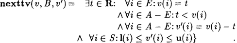
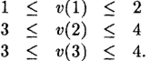
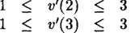
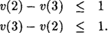
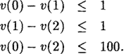
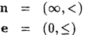
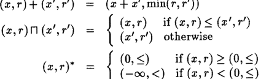
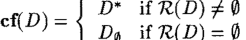
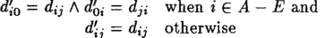

## **Timing Assumptions and Verification of Finite-State Concurrent Systems***

David L. Dill Computer Systems Laboratory Stanford University Stanford, CA 94061 Dill@cs.Stanford.EDU

## **1 Introduction**

This paper presents a method for using timing assumptions to prove, automatically, that an implementation meets a speed-independent specification. Most verification methods for concurrent systems assume that the system must meet a specification regardless of the speeds of its component processes. However, it is often the case that knowledge about the relative speeds of processes can be used to design a system more efficiently. Programmers and engineers chafe at the constraints of speed-independence. Usually, _something_ is known about the delays in a system, and this knowledge can be used to develop a more efficient system. It is therefore important to develop verification methods that can take into account timing knowledge.

We describe a method for using delay information in state-graph verification of finite-state concurrent systems. The timing assumptions are given as constant upper and lower bounds on delays between events. The approach is based on a _continuous_ model of time -- times are real numbers, not integers. The method is an extension of speed-independent methods based on finite automata on infinite sequences [2, 17], so it can handle tiveness properties, indeterminate computations, and so on. A formal framework is constructed so that the soundness

and completeness of the method can be proved. The fundamental idea behind the solution is to associate with each state a convex linear region describing the states of individual _timers_ in the system, which are fictitious components that keep track of the possible times at which events can occur. This automaton can be used to winnow out computation sequences that violate the timing assumptions, so an implementation that would violate a specification in a purely speed-independent model may satisfy it under particular timing assumptions. The cost of the method is a single exponential in the number of timers and the size of the automaton for the specification.

There have been many proposals for frameworks for verifying timing properties. In our view, these can be grouped into three major categories according to their underlying models of time. The first group are based on _discrete time models,_ in which time is isomorphic to the integers or natural numbers [7, 8, 10]. These models axe not much different from the traditional models of concurrency. For example, in linear temporal logic, specifications involving time can be written using repetition of the "next time" operator.

A limitation of discrete-time models for modeling systems that are not inherently synchronous is that they require _an a priori_ commitment to a time quantum. Once the quantum

*This research was supported by the National Science Foundation under grant number MIP-8858807

--- end of page.page_number=1 ---

198

has been chosen, interactions that require finer resolution will be overlooked (e.g. a bug that arises only when one process executes five or more actions between two actions of another process). This can be resolved in practice by setting the quantum "small enough", but this would probably blow up the state space.

Another class of timing models assumes that systems work in continuous time, but timing assertions are made by comparing with a fictitious "global clock" that ticks at some known, fixed rate [1, 4, 12]. A limitation of this model is that the timing information is not exact. It is impossible to express exactly "event b occurs no more than two seconds after event a." If we say "there are no more than n clock ticks between a and b", either n = 1 in which case we have ruled out time(a) = 1.9 and time(b) = 3.1, which are separated by only 1.2, or n = 2 in which case we allow time(a) = 1.1 and time(b) = 3.9, separated by 2.8.

The third model is (integer-bounded) continuous time. This model has not been explored as much as the others. The only other work of which we are aware is a method by Lewis for analyzing asynchronous circuits [11]. Our method is similar to that of Lewis, but simpler (the author believes). Additionally, we allow a more flexible coupling between system events and timing, as well as verification of general linear-time temporal properties, such as unbounded liveness and fairness.

## **2 Speed-independent Verification**

This section presents a framework for verification in the _speed-independent_ case, which is a major component of the more general model presented later. Sets of (linear) _traces_ are used to represent the possible histories of the system. If the system is finite-state, the traces can be represented as the language of a finite automaton. A _property_ (or _specification)_ of a system is also a trace set. A system _satisfies a_ property if the set of traces of the system is a subset of the property.

## 2.1 Trace sets

In more detail, every process has an associated finite set E of _events_ (which depend on the process). In our model, it is possible for several events to occur at once. Thus, a trace (history) of the execution of a process is a sequence of _event sets._ These sequences are infinite (a history in which nothing happensd will have a~ infinite sequence of empty event sets). Formally, we define a trace structure to be a pair (E, X) where £ is a finite event set and X is a subset of [2c] ~. We assume that all the behavioral aspects of a process can be summarized by the set of its traces.

We define a _projection_ operation on traces: if x is a member of [2c] ~ and E I C_ E, then x r~, is defined to be the sequence x' in [2c'] ~ such that _x'(i) = x(i) n E'_ for all i E w. Projection can be extended to sets of traces by defining _(E,X)[c,_ when E' _C E to be _(E',X')_ where _X' = {xr¢, I x E x}._ Using projection, a _conjunction_ operation is defined on trace structures. (E, X)A (E', X') = (£ U E', {x E [2cuE']~ I x rce x A x r¢,E Xl}). (E, X)is an implementation of _(£', X')_ if £ = E I and X C X'.

The framework is similar to other trace models of concurrent systems if regarded as a model of concurrency (notably, that of Hoare [9]). The primary difference is that it models the occurrence of _simultaneous_ events instead of the usual interleaved model of concurrency.

It is also similar to linear temporal logic (LTL). The primary difference is that formulas in LTL do not have explicit alphabets. Also, it is conventional to regard LTL formulas as assertions about states or conditions, not events. In particular, it has been noted that conjunction of LTL formulas corresponds to parallel composition of processes, if the sets of variables written by the

--- end of page.page_number=2 ---

199

processes are disjoint (this is called the _distributed variables assumption_ [13]). This is true in our framework, as well: if trace sets (E,X) and (E~,X') represent processes P axLd P' which have disjoint sets of output variables, (g, X)A (g', X') represents their parallel behavior.

## 2.2 Finite-state concurrency

The trace sets of a _finite-state_ system can be represented by finite automata on infinite strings. Of several available alternatives, we shall use Biichi automata, which are as expressive as Wolper's extended temporal logic. A Bfichi automaton is a nondeterministic finite automaton _(~,Q,n, Qo, F),_ where ~ is the alphabet (here ~ = 2c), Q is the state set, n:Q x ~ --* 2 Q is the transition function, Q0 is a set of start states, and F C Q is the set of _accepting states._ However, unlike more conventional automata on finite strings, the automaton reads _infinite_ input strings.

If p: w --* ~ is an infinite string of alphabetic symbols (w is the set of natural numbers), a _run_ of the automaton on p is an infinite sequence of states r:w --* Q such that ;r(0) E Q0 and ~(l + 1) e n(~(l),p(1)).

It is an _accepting run_ if an some member of F appears _infinitely often_ on the run. In a _deterministic_ Biichi automaton, Q0 is a singleton set, as is n(q, a) for every q E Q and a E ~. In a deterministic automaton, an alphabetic string determines a unique run.

The language of an automaton is a pair (E,X), where ~ is the alphabet of the automaton and X is the set of strings over E that have accepting runs. There is a theory of _w-regular sets_ that parallels the theory of regular sets in many ways. The reader interested in an in-depth discussion should consult the references [5, 6].

Concurrent systems can be analyzed automatically by manipulating B/ichi automata. In particular, given Biichi automata f14 and J~d' accepting languages (~,X) and (~',X J, it is possible to find an automaton A//" accepting (E, X) A (E', X'). This can be done by an obvious generalization of the product construction for finding the intersection of the languages of two automata with identical alphabets [14].

If A4 and .~ff are Biichi automata accepting languages X and X', it is possible to test whether X C_ X ~, by checking whether the intersection of X and the complement of X ' is empty. If the alphabets of f14 and A4' are different, each alphabet can be extended to include the other by a simple transformation on the automata. There are algorithms for complementing an automaton [15, 16]. It is easy to check for emptiness by searching for cycles containing an accepting state that are reachable from one of the start states.

## **3** Timing Constraints

The speed-independent model can be extended to include real-time constraints by adding a set of _timers,_ which are fictitious "alarm clocks" that can be _set_ to an arbitrary real value (within specified bounds). A timer _expires_ when this time has elapsed. The model does not allow the system to control the value to which timers are set, except that the value is guaranteed to be within certain bounds.

To verify that an implementation satisfies a speed-independent specification, the specification is represented as a Biichi automaton. A Biichi automaton representing all of the time-constrained behaviors of the implementation is also constructed, then it is checked whether language of the implementation automaton is a subset of the language of the specification automaton.

To derive the automaton for the implementation, we first extract a Biichi automaton representing the _speed-independent_ behavior of the implementation. One event starts some process which culminates in a second event. The delay assumptions are that the second event occurs

--- end of page.page_number=3 ---

`200`

within some constant interval of time after the first event. To model this using timers, the first event _sets_ the timer and the second event occurs when the timer _expires._ The speed-indendent automaton is modified so that the set and expire events happen _simultaneously_ with the "first" and "second" events associated with each delay constraint. This can be done by including timer events in some of the event sets of the automaton representing the speed-independent behavior.

This modified automaton is then conjoined with a Biichi automaton that constrains the relative orders of set and expire events, based on user-supplied delay bounds. The conjunction repres.ents exactly those behaviors that can occur in the implementation.

One advantage of this approach is that delays can be associated with other system events in very flexible ways. For example, it is possible to model "the event a always causes b within two seconds or after ten seconds" by having two a transitions in the speed-independent automaton and associating each with a different timer. It is even possible to express "the event a always causes b within two seconds or after ten seconds and eventually causes b within two seconds" by choosing the accepting states of the B(ichi automaton appropriately.

## 3.1 Timers

In order to deal uniformly with finite and infinite bounds and with strict and non-strict inequalities, we define the domain B of _bounds,_ which are ordered pairs Z × {<, <) U {(~, <), (-oc, <:)) (Z is the set of integers). The symbols < and _< are totally ordered: < is taken to be strictly less than <_. A partial order is defined by (x,r)_ (x ~,r')ifx < x Iorifx = x'and r < r' (lexicographic order).

For notational convenience, we mix bounds and reals in comparisons and arithmetic. When comparing a real and a bound, we use either the explicit comparison relation or the second component of the bound, whichever is more strict. For example, when b = (x, <) and _b' = (x, <)_ andyisarealnumber:b<ymeans x<y,y~ bmeans y< x,b ~<ymeansx <y, andb ~< y means x < y. We apply the arithmetic operations to the real numbers and first component of the bound, and either re-attach the second component of the bound to the result or not, depending on whether the context seems to demand a bound or a real number as the result. For example, -b means (-x, <) or -x, and _b' + y_ means (x 4- y, _<) or x ÷ y, depending on context.

_A timer system_ is defined to be a quadruple (T, l, u, A0), where T is a finite set of _timers,_ l: T --* B represents constant lower bounds on timer values, u: T ~ B represents constant upper bounds (when u(i) = (0o, <), there is no finite upper bound), and A0 is a set of timers to be set at the beginning of system operation. We require that (0, <) < l(i) < u(i) ~ (0o, <) for all i E T. The timer system is assumed to be fixed throughout the rest of the paper.

There are two events, set(i) and explre(i), associated with every timer i E T. Timer events appear in traces, like other events. A timer is _active_ if it has been set and has not expired. When set(i) and expire(i) are in the same event set, it means that the timer first expires and is then instantaneously set again; when this occurs, the timer is active. A trace containing timer actions is _well-formed_ if the first set of active timers is A0, active timers are not set unless they expire in the same event set, timers expire only when they are active, and every active timer eventually expires.

The times at which the events in a trace occur can be recorded in a sequence of real numbers, called a _time sequence._ A time sequence r is a member of [w ~ It] that begins at 0 and increases monotonically without bound (R is the set of real numbers).

_A timed trace_ is a pair (p, r), where p is a trace and r is a time sequence. A timed trace is said to be _timing-consistent_ ifp is well-formed and 1(i) < v(m) - r(/) < u(i) whenever set(i) e _p(1),_ explre(i) e _p(m),_ and m is the first point after I containing explre(i).

A trace p is said to be timing~consistent with a timer system if there exists a time sequence r such that (p, r) is timing-consistent.

--- end of page.page_number=4 ---

201

## **3.2 Automata**

It is possible to define a deterministic Biichi automaton that accepts exactly the timing-consistent traces. The automaton is the conjunction of several automata defining simpler conditions. The well-formedness conditions axe standard temporal conditions that can be expressed without difficulty as the conjunction of a collection of small deterministic Biichi automata, one for each timer. We call the conjunction the _ivell-formedness automaton_ (it is deterministic because conjunction preserves determinism).

The second and more interesting part of the construction is the _timer region automaton,_ which enforces ordering constraints between the expirations of different timers. Intuitively, whenever a timer event occurs, a "snapshot" is recorded of the possible values of the timers. This snapshot is a convex linear region; ever), point in the region is vector of timer settings (called a _timer valuation)._ These regions are the states of the automaton.

Formally, a timer valuation v is a function that assigns a real value to each of a set A _C T (v: A --* It). A _timer region_ is a set of valuations with a common domain: V C_ [A --* R], for some A C T. The set of all timer regions that have some subset of T as their domain is denoted by Iteglons(T). The alphabet of the timer region automaton is the power set of _{set(i),expire(i) l i E T}._

For the moment, let us say that Q = Regions(T) is the set of states of the automaton (even though this set is infinite). The accepting states are the non-empty regions. The initial state of the automaton is the timer region {v: A0 ~ R I Vi E A0: 1(i) __ v(i) <__ u(i)}. This represents the possible valuations of the timers in A0 when set simultaneously at time 0 to values between 1 and u.

Suppose that v: A --* R is the timer valuation either initially or immediately after some event set, and the next event set is B. Let the set of expiring timers in B be E and the newly set timers be S. The resulting valuation (at the instant after the event set occurs) can be vf: A ~ --~ It, where A ~ = (A - E) U S, when the expiring timers all have the same value in v (since they expire simultaneously), the expiring timers have smaller values than the non-expiring timers (because they expire first), the values of the remaining (non-expiring) timers axe reduced by the value of the expiring timers, and the newly set timers have arbitrary values within the bounds established by the timer system. Formally,

To define the transition function n, first let V be any timer region and B be any set of timer events. Let E be the timers that expire and let S be timers that are set in B. Then the definition is n(V, B) = {v ~ E [(A - E) U S -~ R] I 3v E V: nexttv(v, B, v~)}

This completes the definition of the timer region automaton, except that we have defined the states to be the infinite set of regions. This problem is easily fixed, however, because the set of regions _reachable_ from the initial region is finite. This result is proved later.

The _timing automaton_ of a timer system is the conjunction of the well-formedness automaton (which accepts all well-formed traces) and the timer region automaton (which accepts all traces whose set and expire events occur in an order allowed by the timing constraints).

--- end of page.page_number=5 ---

202

## 3.3 Language of the timing automaton

The following theorem states that the behaviors allowed by a timer system are captured precisely by the timing automaton:

Theorem 1 _The timing automaton accepts exactly the set of timing-consistent traces._

For notational convenience henceforth, in the context of a particular timer event trace p, we use El to denote the set of expiring timers and S~ to denote the timers that are set in _p(i)._ Also, A~, the set of active timers, is defined recursively by A~+I = (Al - Et) U Sz (Ao is given as part of the timer system).

For proving the theorem, it is helpful to convert a timed trace (p, r) to an alternative representation which replaces the time sequence r by a _timer valuation sequence ~, -= vo, Vl,... (p, v)_ is timing-consistent if the domain of vz is AI (defined as above), v0 satisfies Vi C A0: l(i) < v~ _< u(i), and vt+l satisfies nexttv(vz, _p(l), vi+l)._ The next lemma asserts that these two representations of timed traces are interchangeable.

Lemma 1 _There exists a mapping ¢ between the two representations of timed sequences such that (p, r) is timing-consistent iff_ ¢(p, r) _is timing consistent._

proof. We supply ¢. The proof that it preserves timing consistency follows directly from the definitions. Let (p, r) be any timing-consistent timed trace. Define ¢(p, r) valuation sequence as follows: for each l E w and i E Al, set _vl(i)_ = r(m) - r(l) where m is the least number greater than I such that _i E Era. m_ always exists because (p, r) must be well-formed to be timing-consistent. []

Lemma 2 _Every timing-consistent trace is accepted by the timing automaton._

proof. It should be obvious that every well-formed trace is accepted by the well-formedness automaton. We prove that it is accepted by the timer region automaton by constructing an accepting run.

Let ~r be the run of the timer region automaton on p (~r is unique because the timer region automaton is deterministic). To prove that 7r is an accepting run, we need only demonstrate that 7r(i) is non-empty for all i, which we do by exhibiting a point in each region of r.

Since p is timing-consistent, there exists a time sequence r such that (p,r) is timingconsistent. By the previous lemma, we can convert r to a timer valuation sequence v0, vl,... It is easy to see (by inspecting the definitions) that v0 E 7r(0) and that if vl C 7r(1) for any l E w, then vt+l E ~r(l + 1). Hence, by induction, there is at least one timer valuation in every region along r, so it is an accepting run. []

This completes the proof of half of the theorem. The second half, that every trace accepted by the automaton is timing-consistent, is more difficult. Let p be any well-formed timer event sequence. Then there exists a run ~r of the timer region automaton on p. We would like to construct a timer valuation sequence (hence a time sequence) from 7r by choosing an appropriate timer valuation vt from each region lr(1). It is very easy to do this _up to some finite m_ by working "backwards" from r(m): choose any valuation _Vm_ in ~r(m). By the definition of n, there exists a valuation vm_~ in 7r(m - 1) that is properly related to _Vm._ This process can be carried on inductively to generate the finite timer valuation sequence _vo,vl,...,Vm._ Unfortunately, the idea of finding an infinite sequence by repeating this construction for progressively larger m does not work, because prefixes of the short sequences may not be valid as prefixes of the longer sequences.

--- end of page.page_number=6 ---

203

The solution to this problem is to define for any g~ven m the subregion of ~r(I) (I < m) containing exactly the valuations that can serve as the l'th element of a finite timer valuation sequence ending at m. This region shrinks as m grows, but it eventually converges to some non-empty limit region.

First, we need to generalize the definition of tlming-consistency to finite traces (we want these to be substrings of infinite timing-consistent traces, so they do not necessarily start at 0 and certainly stop before w). If p is a finite timer event sequence, it is welt-formed if set and expire events alternate. This allows for the possibility that the first event for some timers will be an expire and the last will be a set. A finite timed trace is a pair (p,r), where r is a monotonic increasing sequence of real numbers that is of the same length as p. It is not necessary that r(0) = 0. A finite timed trace (p,,) (where, is a finite timer valuation sequence) is timing-consistent if for every l > 0, vl+l satisfies nexttv(vt, p(l), vt+l).

We define leadsto(p, l, m) recursivety so that leadsto(p, l, l) = 7r(1) and leadsto(p, l, m) = {vl I 3vt+l E leadsto(p,/+ _1,m):nexttv(vl,p(l),vz+l)}_ when 1 < m. Let p' be the finite sequence _p(l),p(l+_ 1),..., _p(m)._ We claim that leadsto(p, l, m) consists of the region of valuations that can be the first element of a timer valuation sequence v (of length m - l + 1) where _(p', ~)_ is timing-consistent.

If p is timing-consistent, every finite subsequence p' is, also, so leadsto(p, I, m) is non-empty for all m > l. What we would like to show is that the _intersection_ of all of these regions is non-empty, also. The following lemma gives the necessary convergence property. It is proved in the next section, where a more is known about timer regions.

Lemma 3 _If p is a finite consistent timer event sequence, then .for every 1 there exists an Pl > l such that for every 192 > Pl:_ leadsto(p,l,p2) = leadsto(p, _l,pl) ~ 9._

Assuming this lemma, we can construct the desired timer valuation sequence ~, inductively. For every l, let leadsto(p, _l,w)_ be the region to which leadsto(p, I, m) converges as m increases, and let _p, ---_ p(0),p(1),...,p(1). Choose any v0 e leadsto(p, 0,w). Now suppose we have chosen ul = v0,...,vl so that (pt, vz) is a timing-consistent finite sequence. Then, by the definition of leadsto and non-emptiness of leadsto(p, l,~v), there exists some Vl+l E leadsto(p, t + 1,¢v)such that _nexttv(vl,p(1),vl+])._ Define ul+l so that -l+l(P) = tJz(p) for p < l and _pl+l(l +_ 1) = vz+l. Then (Pl+l, vl+l) is timing-consistent by the definition of leadsto. Now define ~ so ,(I) = ~l(l) for all I E w. Obviously, the infinite timed trace (p, ~,) is timing consistent, also.

## **4** Representing Timer **Regions**

This section gives a finite representation of timer regions using square matrices of bounds. Here is an example that illustrates the major points of this section. Consider a timer system with three timers: T = {1, 2, 3}. The lower bounds are 1(1) = (1, ~), 1(2) = (3, <), and 1(3) = (3, <:). The upper bounds are u(1) = (2, <), u(2) = (4, <), and u(3) = (4, <). Initially, all of the timers are set: A0 = {1,2,3}.

The initial state of the timing automaton should be the region consisting of the set of all timer valuations v satisfying

Note that this region can be described completely by upper and lower bounds on individual timer values. It is tempting to believe that all of the states of the automaton have this form. For example, consider the successor region for the event set {expire(i)}. This event happens

--- end of page.page_number=7 ---

204

between 1 and 2 time units after initialization, so every timer valuation v ~ in the next state should satisfy

since v'(2) is at least one (since no more than 2 time units have elapsed) and at most 3 (since at least 1 time unit has elapsed).

It is indeed true that these inequalities are satisfied. However, the bounds are not "tight"; it is also true that

These additional constraints were true in the original region (by implication) and continue to hold. So, _if precise results are desired, constraints on the_ differences _between timers must be represented in the timer regions, in addition to bounds on individual timers._

It may now be tempting to assume that in subsequent states relations between triples of timers (or larger multiples) wilt need to be represented. This temptation should also be resisted. _Every region in the timing automaton can be represented precisely by bounds on individual timers and on the differences between pairs of timers._

Systems of bounds on the difference between variables can be represented conveniently using square matrices _D:A 2 -+ B,_ where the (i,j)th entry gives the upper bound on _v(i)- v(j)._ Such matrices can be used to represent bounds on individual timers by adding a fictitious timer 0 whose value is always 0, so, for example _v(i) = v(i) - v(O) < d~o._ The set of all valuations v: A -+ tt satisfying the bounds of D is called _the region of D._

One problem with this representation is that there axe, in general, many different matrices with the same region. This makes it difficult to compare representations for equality and to test for emptyness of regions. Multiple representations are possible because of _implied constraints_ in a matrix. For example, suppose a system has the constraints:

Clearly, it is true that any v satisfying these constraints also satisfies v(0) - v(2) < 2. There are many different matrices for this region, which can be generated by substituting any integer greater than 2 for 100.

_It is possible to obtain a unique representation for each region by minimizing the bounds in the matrix. This is achieved by solving an_ all-pairs shortest path problem.

## 4.1 Difference Bounds Matrices.

With the addition of a few simple operations, bounds form a _regular algebra_ [3]. A regular algebra is a set with multiplication (usually., but + here to reduce confusion), addition (usually +, but 71 here), Kleene star (*), and constants n and e. The algebra must satisfy a set of axioms that hold for regular sets (if the algebra is a regular set, the operations are concatenation, union, and Kleene closure, and the constants are the empty set and the empty string, respectively). In more detail, constants and operations can be defined to make B into a regular algebra:

--- end of page.page_number=8 ---

205

It is straightforward to show that the operations above satisfy the axioms of regular algebra. The n × n matrices over a regular algebra form a regular algebra, also, in which rq is matrix addition and + is matrix multiplication (defined over the scalar operations rl and +). In this case, the zero element N of the regular algebra of matrices has (oo, <) in all its entries. The unit matrix E has has _eii=_ (0, <) and _eij_ = (c% <), otherwise. Finally, M* is defined to be M 0 V1M 1 VI... Note that the diagonal elements of M* are all less than or equal to (0, _<), since M°=E.

There is a partial order on matrices defined by _D < D' iffdij < d~j_ for all i and j. Note that D R D' = D if and only if D _< D'.

The region of a matrix D: A 2 --~ B (written 7-¢(D)) is the set of timer v'duations v: A --~ l:t such that _Vi,j E A: v(i)- v(j) < dij_ (note that _< is a comparison between (x, r) pairs, so, by our notational convention, if _d~j = (x,_ <), this means v(i) - _v(j) < dij)._ We call these _difference bounds matrices,_ or DB matrices. Clearly, _D < D'_ implies that ~(D) C _7¢(D')._ Moreover, if **TC(D n D') = n(D) n Te(D').**

Since all empty regions are identical, we must choose a particular matrix to be the canonical representative of all matrices with empty regions. Our choice is De, the matrix in [0 2 ~ B] which has d0o = (-oo, <), as the canonical matrix for an empty region. For non-empty regions, the canonical matrix should be D*, the result of solving the shortest-paths problem. In general, if D is any matrix, the canonical form of D, written ef(D), is defined so that

We call a sequence of timers kl, _ks,..., kn_ in A a _path._ The _cost_ of the path in D is _dklk2 + dk:k3 + ... + dk,_lk,._ If D' = cf(D), then d~j is the cost of the least-cost path in D from i to j. Clearly, if there is a cycle of cost less than (0, <), the matrix is not satisfiable (its region is empty), because then _v(i) - v(i)_ < 0. In such a case, a path of arbitrarily small cost can be obtained by repeating the negative cost cycle, so, if _D' =_ cf(D), d~i = (-co, <). There is a simple way to decide whether a given non-cartonical matrix has an empty region: it is empty iff a negative-cost cycle appears during the computation of the shortest-path matrix using the Floyd-Warshall algorithm. We call the following the _direct constraint property:_

Observation _1 D = D* iffVi, j_ E A U {0}:dij < _dik + dkj._

On occasion, it will be useful to project a timer region onto fewer dimensions. If V C [A ~ It] and A' C__ A, the projection of V onto A', written _VIA,,_ is defined to be _{VIA, I v e V}._ One advantage of the canonical-form representation of a DB matrix is that it is easy to find the matrix representing a projection, simply by deleting the rows and columns that are projected away. We call the following result the _projection property:_

Lemma 4 _lf A t C_ A and D: A x A -+ B is a canonical D B matrix, then ?'¢( D IA,xA, ) = Td( D ) [ A"_

proof. It is obvious that ~(D)[A,C TC(DIA, xA, )._

--- end of page.page_number=9 ---

206

We prove inclusion in the other direction by induction on IAI - IAq. The basis is when _A = A',_ in which case the lemma is obvious. Now suppose that ]A[ - _IA"t >_ t, ]A" ! ~ 0_ and let A' = A" - {k}, where k is any member of _A"._ Let D" = _DIA,,×A,,_ and let V" = T~(D)[A,,. By the induction hypothesis, 7~(D') C V'. Now let _v'_ be any member of _~(D')._ By definition, _Vi, j • Aqv'(i) - v'(j) < d~j = d~._ We need to extend v' to some _v":A"_ --* R by finding a suitable value for _v"(k), v"(k)_ must satisfy _Vj • A': v"(k) - v'(j) <_ dJk~j_ or, equivalently, _Vj • A': v"(k) < dgj + v"(j)._ Similarly, it must also satisfy Vi • A': _-v't(k) < d~ - v"(i)._ A real value for _v"(k)_ exists iff _(0, <__) < d~k - v"(i)_ **-** ,, _L d" **~** kj _+ v"(j)_ for all _i,j • A'._ This inequality holds by the direct constraint property (clearly, _D"_ is canonical), since _v"(i) -_ v"(j) = _v'(i) -_ v'(j) _< _d~j = d~} < dik + kj" II dlt_ Hence, _v t • VtqA ,. []_

The remainder of this section is a proof of the following theorem:

Theorem 2 ef _maps every DB matrix to an equivalent and unique DB matrix._

The proof of the theorem is given as a sequence of lemmas. The first asserts that cf(D) is equivalent to D.

Lemma 5 _For every DB matrix D,_ 7Z[ef(D)] = 7~(D).

proof. Let D be any DB matrix and let D' = ef(D). If 7~(D) = 0, then, by definition, T~(D') = 0. So suppose ~(D) ~ 0, in which case D' = D*. It is immediate that 7~(D*) < n(D), since D* _< D. To see that T~(D) C 7~(D*), let v be any member of 7~(D), so that for every i and j in A U {0}, _v(i) - v(j) <_ dlj._ There is some non-empty path of timers i = k0, kl,..., kl = j such that _d~j = dko~:l-bdklk2+...+dk,_~k~._ But then _v(i)-v(j) = [v(ko)-v(kl)]+...+[v(kl-1)-v(k~)] <__ d~j, so v • 7~(D'), also. [] The following lemma shows that D* is the _minimum_ matrix representing the same region as D (but only if 7~(D) # 0, in general).

Lemma 6 _IfT~(D) = Ti(D') 7~ O and D = D* then D <_ Dq_

proof. The proof strategy is to assume the contrary, then find a valuation in 7~(D) that is not in T~(D~), contradicting the premise that D and D ~ are equivalent.

Suppose that D /~ Dq Then for some _i,j E A,_ we have _d~j < dij._ Furthermore, i and j must be distinct, because dil = (0, {_<}) < d~i, since both D and D ~ are satisfiable. Set x = [max(d~j,-djl) _+ dij]/2._

There are no negative cycles in D, so (0, _<) < _dlj + dji,_ so either _-dji < dij_ or _-dji = dij --_ (0, _<). If _-djl < dij,_ we have max(d~j, _-dji) < x < dij;_ otherwise, _-dji_ = d~j = (0, <) and we have x = 0. In either case, _x <_ dij_ and _-x < dsi,_ but x ~ d~j.

x can be used to construct a valuation contained in 7~(D) but not in 7~(D'). Let v:: _{i,j}_ tt be defined by v2(i) = x and _v2(j) = O. v2_ can be extended to a valuation v E 7~(D), by the projection property. But v • 7~(D'), so n(D) ¢ ~(D'), which contradicts a premise. Hence, _D < D'. []_

It is now simple to prove the "uniqueness" half of theorem 2.

Lemma ? _For every DB matrices D and D', A = A' and T~(D) = 7~(D ~) implies_ cf(D) = ef(D').

proof. Let D and D' be any DB matrices. If T~(D) = _Tt(D')_ = O, then of(D) = cf(D') by definition. Otherwise, by temma 5, 7~[cf(D)] = •[cf(D')]. of(D)* = ef(D), so by the previous lemma, el(D) _< cf(D'). By symmetry, cf(D') _ of(D), also, so el(D) = cf(D'). [] The theorem is the conjunction of lemmas 5 and 7.

--- end of page.page_number=10 ---

207

## 4.2 Bounds on individual timer values

In a timer region, there are bounds on individual timer values in addition to bounds on the differences between timer values. It is very easy to use difference bound matrices for this by adding an artificial timer, which we call 0, the value of which is always 0. The result is that di0 becomes the upper bound on _v(i)_ (because _v(i)- v(O) = v(i) < dio)_ and d0i becomes the negative of the lower bound (because _-v(i) < dol)._ It is sometimes convenient to take 1(0) = u(0) = (0, <).

We define the _timer region_ of a matrix D: A U {0} --* B to be

{v: A --* tt I v(0) = 0 A _Vi,j • A: v(i) - v(j) <_ dlj}_

## • The timer region of D is written 7"(D).

The following theorem shows that regions and timer regions of a matrix are isomorphic.

Theorem _3 TO(D)= Ti(D') iff T(P)=_ T(D') _and TO(D)= O iff ~F(D) = O._

proof. Everything is obvious except perhaps that T(D) = T(D r) implies _TO(D) = 7~(Dr)._ Suppose that TO(D) ~ TC(D'). Then, without loss of generality, we may assume that there is a valuation v • n(D) - n(D'). Then v' defined by _Vi • A: v'(i) = v(i) - v(O)_ is in _T(D) -_ T(D'), so T(D) ~ T(D'). (::]

## 4.3 The transition function

The transition function n of the Biichi automaton constructed in the previous section was defined on regions (sets of vMuations). In this subsection it is defined on matrices.

We define n(D, B), where D is a timer matrix and B is a set of timer events. The definition consists of several steps. For notational convenience, let E = {i I expire(i) e B} and S = {i I set(i) 6 B}.

The first step is to characterize exactly the subregion of timer valuations in D that permit B to occur. The function rte(D,B) ("restrict to event set") transforms D to a new matrix representing exactly this subregion. For B to occur, all of the expiring timers in B must have the same value (since they expire simultaneously) and the value of each expiring timer must be less than the value of each non-expiring timer. The newly set timers do not affect rte. A matrix D' reflecting these constraints can be defined:

_d~j_ = min(dlj,(0,_<)) when _i,j E E d~j_ = min(dij, (0, <)) when i e E and j E A - E _d~j = d~j_ otherwise.

D t may not be in canonical form, so rte must then apply cf to it. The resulting matrix may be unsatisfiable. This means that the set of events cannot appear at that point in a timingconsistent trace. Note that if the results are to be satisfiable, _d~j_ -- (0, <:) when _i,j E E --_ otherwise, _d~j_ + d~i < (0, <).

If the result of rte is a satisfiable matrix, the next step is to decrement the value of each non-expiring timer by the value of the expiring timers (all equal as a result of the previous step).

The next step is to manifest the effects of decrementing each non-expiring timer by the value of the expiring timers. This function is elapse(D, B). If D r is the result, it is defined by:

--- end of page.page_number=11 ---

208

One way to look at this transformation is that it makes the vMue of the expiring timers equal to 0, while preserving the differences between the timers.

The next step is to delete the expiring timers from A. This is a projection operation that can be accomplished by deleting the rows and columns corresponding to the expiring timers: _D ~= D[[(A_E)u{O)]x[(A_E)u{O} ] ._

The final step is to deal with the newly set timers. If i • S, we set _dio_ to u(i), d0i to -1(i) and _dij = djl_ = (~, <) for all j E A - E, then apply ef. It is not difficult to see that ef has the effect of setting _dlj = dio -}- doj_ whenever i or j is in S.

## 4.4 Convergence lemma

DB matrices are used in the proof of lemma 3 (the convergence lemma). First, we need the following result:

Lemma 8 _Let_ (p,v) _be any finite timed trace that satisfies T. For each l > 1 and i • At that is set and expires in p, let mi be the latest point less than l at which i was most recently set and let ni >_ l be the next point at which it expires. Then for any e > O, there exists a timed trace_ (p,v') _that also satisfies T and for all l either v'(l)_ < r'(l- 1)T e _or there exists an i • At such that_ r'(ni) - _v'(ml)_ < 1(i) + e.

proof. Let k be the number of distinct values of l such that (p, v) violates the lemma (i.e. _r(l +_ 1) > _v(1) + e_ and for every _i 6 Al, r(ni) - T(mi) )_ 1(i) + e).

We can construct a time sequence r' that has no more than k - 1 such points. Let l be the least point violating the lemma, and let _~ -: minleA;[V(1)-_ r(l- 1),v(nl) - _r(mi) -_ 1(i)] and define v' so that v'(p) = _r(p)_ for p < l and _v'(p) = v(p) - ~_ for p > 1.

We claim that v' has no more than k - 1 violations of the condition. The duration of the timer will only change if it is set before 1 and expires at 1 or later, so we need only check those timers in _At._ The duration of the timer is reduced (6 is positive if (p, r) is timing-consistent), so we need only worry about violating the lower bound on some timer. But, by the definition of 6, Vi • Al: 6 _< r(ni) - _r(ml) -_ l(i), so 1(i) _< r'(ni) - _r'(mi)._

Note that v' remains monotonic increasing because ~f _< v(l) - _r(l -_ 1), also. []

Let _A = maxieT(l(i) + e)._ Since every timer in Al must be set at 1 - 1 or before and must expire at l or after, it is a simple corollary of this lemma that whenever there is a finite timingconsistent (p, v), there is another (p, r') such that r'(l) _ I. A for every I less than the length of p.

This enables us to prove the convergence lemma itself:

proof. (of lemma 3) First, if 1 _< m < n, leadsto(p, l, m) C_ leadsto(p,l,n), so the sequence of regions formed by considering progressively greater values of m is a descending chain under the subset ordering. Moreover, it should be clear from the definition that the region defined by leadsto can always be described exactly by a DB matrix, which can be made canonical. Canonical DB matrices have the property that D _< D' (under the pointwise ordering) iff _T(D) <_ T(D'),_ so there is a descending chain of DB matrices describing the chain of nested regions.

If this chain fails to converge, the entry in at least one position of the matrix, say the (i, j)th, must decrease without bound. But this cannot occur.

Let _ni_ and _nj_ be the earliest expire events for times i and j at or after I and let n = max(nl, _nj)._ Consider the set of finite timed traces corresponding to prefixes of p of length n or greater that satisfy T. For each timed trace, there is a timer valuation vl • leadsto(p, _l,n)_ such that _vl(i) =_ r(ni) - v(1) and _vl(j) =_ r(nj) - r(l). Then by the previous lemma, there exist timing-consistent timed traces in which _v~(j) - vt(i) < (n - l). A._ Let D be any DB matrix

--- end of page.page_number=12 ---

209

such that _vl • T(D)._ Then _vl(j) - vl(i) < djl_ by definition, and since the region is non-empty, _-(n - l). A <_ -dji <_ dlj,_ which gives a finite lower bound to the values that _dij_ can assume. []

## **5 The number of regions**

We need to show that the number of states in the timer region automaton is finite. This would almost be trivial except for the possibility of infinite upper bounds. Since timer values decay monotonically from when they are set to when they expire, the value of a timer i is bounded above by u(i) and below by 0 in every region. The vertices of the polytope surrounding a timer region are always on integer points, of which there are a finite number if u(i) is always finite. Hence, the number of regions is bounded by 1-LeT u(i).

Infinite upper bounds complicate the argument a bit, however. Let reachable be the set of all matrices that are reachable from the start state of the automaton. The following lemma is helpful:

## Lemma 9 _For every D •_ reachable _and every i,j • A U_ {0), -l(j) _< _dij <__ u(i).

proofi We prove by induction on the minimum number of applications of n needed to derive D from the initial region. First, note that whenever D is in canonical form, we must have _dlj ~ dio Jr doj_ and _doj <_ doi + dij._ If i or j is a newly-set timer, _doj_ = -l(j) and di0 = u(i). Hence, _dlj <__ u(i) (sinced0j _ (0, _<)) and -l(j) _< dij (since d01 ~ (0, <)). This proves the basis of the induction, since in the first region all of the timers are newly set.

For the induction, suppose that D is satisfiable and satisfies the induction hypothesis. Let us consider each step of n(D, B).

Let D' be the result of the first step of rte(D, B) and D" = cf(D') (so D" = rte(D, B)).

We claim that _Vi, j E A-E:_ -l(j) _< _dij <_ u(i). D' satisfies this by the induction hypothesis, since the only entries that change become (0, <) or (0, <). D" satisfies d~ < u(i) because cf never increases an entry. If D '~ is not satisfiable, the lemma is immediate, so what remains to be shown is _Vi,j E A - E:-l(j)_ < d~ when D" is satisfiable.

Let i and j be any members of A - E. d~ is equal to the cost of the minimum-cost path from i to j in D ~. This is a simple path since there are no negative cycles in D ~. Let i = _kl,k2,...,kn-l,k,~ = j_ be a minimum-cost path in D ~. If the cost of the path is the same as in D, then the result follows from the induction hypothesis and the direct constraint property. dk, k~+l changes only if kl E E, so let us assume that there is at least one expiring timer kz on the path, and that the value of _dlklk~+l_ is different from dktk~+l.

The path may then be divided into three consecutive segments: (i) a prefix starting with i = kl and ending with kl E E (ii) an edge k~, kl+l where kl • E and kl+l • (A - E) U {0) for which _d~k,k,+~_ = (0, <) and (iii) a path kl+l,..., k~ = j whose cost is the same as in D. We claim that the combined cost of these paths is greater than -l(j).

Consider the prefix kl,.., kl, first. By the definition of rte, d ~ **,** klkl **--** < (0, <), so the cost of **kl,...,kl** in D t must be no less than (1, <) to avoid a negative cost cycle. So the sum of the first and second segments is no less than (1, <). The cost of the third segment is the same as in D, so its cost is not less than than -l(j). Hence, the sum of the costs of the segments is greater than -l(j).

The remaining steps are simple, elapse[rte(D, B), B] sets _doj_ to _dij_ and _djo_ to _dji_ when _i E E andj e A-E;_ since nothing else changes, we haveVi,j • (A-E)U{0}:-l(j) < _dij <__ u(i). Restricting the result to (A - E) U {0) obviously does not change this.

--- end of page.page_number=13 ---

**210**

The final step is the setting of new timers, ef only changes _dlj_ to _dio + doj_ in this case. For both the existing timers and newly set timers, l(0) = (0,_<) < di0 ___ u(i) and -l(j) < _doj <_ u(0) = (0, <), so their sum must be between -l(j) and u(i), also. Hence, after cf, the lemma holds for all _i,j E (A - E) U S U_ {0}. D

Lemma 10 _For every reachable D: (A U_ {0}) 2 --+ 1~ _and every i,j E A U_ {0), _if_ u(i) = (co, <) _then dlj_ = (oo, <).

proof. We prove by induction on the minimum number of applications of n needed to derive D from the initial region. First, note that cf preserves the property: every path of timers from i must have infinite cost, since dlk = (co, <) for all k E A t5 {0}. Hence, _d~j_ = (oc, <). Once this has been determined, the rest of the proof is simply a verification that the definitions of the initial region and n do not directly introduce non-infinite values for _dlj_ when **u(i) =** (~¢, <). **[]**

## Theorem 4 reachable _is finite._

proof. We show that there can only be a finite number of distinct values in any entry of the matrix, depending on its position. It is convenient to imagine that entries in the rows and columns of inactive timers have a special "undefined" value. First, if u(i) = (co, <), every entry in row i is either infinite or undefined (two values). Otherwise, the value is either undefined or falls in the finite range -l(j) ... u(i), (about twice the difference in the magnitudes of 1(i) and u(i) because of the two types of inequalities). Hence, there are no more than [2(maxi[l(i)] + maxi[u(i)]) + 1]IT? members of reachable. []

## **6 Conclusions**

We have described a scheme that allows timing assumptions to be incorporated into automatic proofs of arbitrary finite-state temporal properties. The obvious extension is to be able to _prove_ timing properties, not just assume them. This would provide a verification framework for finitestate hard real-time systems. We conjecture that the method presented can, in fact, be extended in this way.

Another major question is practicality. We believe that, with some simple program optimizations, the proposed method can be useful for certain small but tricky systems, such as asynchronous control circuits. For larger systems, approximate and heuristic methods will be needed.

## **Acknowledgements**

I am grateful to Rajeev Ahr for reading several drafts of this and contributing many helpful suggestions and corrections. Jim Saxe contributed the trick of using the 0 timer for upper and lower bounds.

--- end of page.page_number=14 ---

211

## **References**

- [1] S. Aggarwal and R.P. Kurshan. Modelling elapsed time in protocol specification. In g. Rudin and C.H. West, editors, _Protocol Specification, Testing and Verification, fII,_ pages 51-62. Elsevier Science Publisers B.V., 1983.

- [2] S. Aggarwal, R.P. Kurshan, and K. Sabnani. A calculus for protocol specification and validation. In _Protocol Specification, Testing, and Verification, III,_ pages 19-34. Elsevier Science Publishers B.V. (North-Holland), 1983.

- [3] R.C. Backhouse and B.A.Carre. Regular algebra applied to path-finding problems. _Journal of the Institute of Mathematics and its Applications,_ 15:161-186, 1975.

- [4] J. R. Butch. Combining ctl, trace theory, and timing models. In _Proceedings of the Workshop on Automatic Verification Methods for Finite State Systems (participants version),_ June 1989.

- [5] Yaacov Choueka. Theories of automata on w-tapes: A simplified approach. _Journal of Computer and System Sciences,_ 8(2):117-141, April 1974.

- [6] Samuel Eilenberg. _Automata, Languages, and Machines, Vol. A._ Academic Press, 1974.

- [7] E. Allen Emerson, A.K. Mok, A.P.Sistla, and Jai Srinivasan. Quantitative temporal reasoning. In _Proceedings of the Workshop on Automatic Verification Methods for Finite State Systems (participants version),_ June 1989.

- [8] N. Halbwachs, D. Pitaud, F. Ouabodessalam, and A-C. Glory. Specifying, programming and verifying real-time systems using a synchronous declarative language. In _Proceedings of the Workshop on Automatic Verification Methods for Finite State Systems (participants version),_ June 1989.

- [9] C.A.R. Hoare. A model for conmmnicating sequential processes. Technical Report PRG-22, Programming Research Group, Oxford University Computing Laboratory, 1981.

- [10] Ron Koymans, Jan Vytopit, and Willem P. de Roever. Real-time programming and asynchronous message passing. In _Proceedings of the 2nd A CM Symposium on Principles of Distributed Computing,_ pages 187-197, 1983.

- [11] Harry R. Lewis. Finite-state analysis of asynchronous circuits with bounded temporal uncertainty. Technical Report TR-15-89, Aiken Computation Laboratory, Harvard University, July 1989.

- [12] J.S. Ostroff. Automatic verification of timed transition models. In _Proceedings of the Workshop on Automatic Verification Methods for Finite State Systems (participants version),_ June 1989.

- [13] Amir Pnueli. In transition from global to modular temporal reasoning about programs. In Kzysztof Apt, editor, _Logics and Models of Concurrent Systems,_ volume 13 of _NATO ASI Series F: Computer and System Sciences,_ pages 123-144. Springer-Verlag, 1985.

--- end of page.page_number=15 ---

212

- [14] Michael O. Rabin. Weakly definable relations and special automata. In Yehoshua Bar-Hillel, editor, _Mathematical Logic and Foundations of Set Theory,_ pages 1-23. North-Holland Publishing Company, 1970.

- [15] Shmuel Safra. On the complexity of w-automata. In ??, editor, _Proceedings of the 29th IEEE Symposium on Foundations of Computer Science,_ pages 319-327. IEEE ??, October 1988.

- [16] A.P. Sistla, M.Y. Vardi, and P. Wolper. The complementation problem for buchi automata with applications to temporal logic. In W. Brauer, editor, _Automata, Languages, and Programming,_ volume 194 of _Lecture Notes in Computer Science,_ pages 465-474. SpringerVerlag, 1985.

- [17] M.Y. Vardi and P. Wolper. Automata theoretic techniques for modal logics of programs. Technical report, IBM Research, October 1984.

--- end of page.page_number=16 ---
