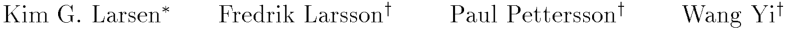
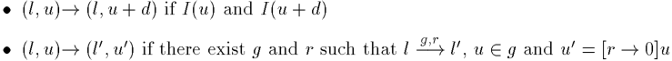
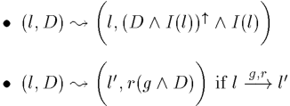
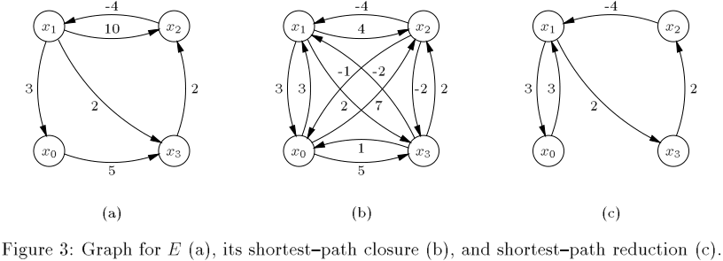
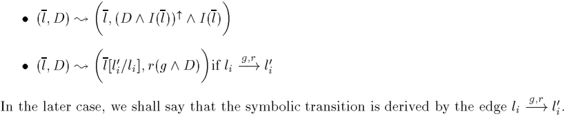
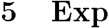

E�cient Veri�cation of Real-Time Systems: Compact Data Structure and State{Space Reduction

Abstract During the past few years, a numb er of veri�cation to ols have b een develop ed for real-time systems in the framework of timed automata (e.g. Kronos and Uppaal). One of the ma jor problems in applying these to ols to industrial-si ze systems is the huge memory-usage for the exploration of the state-space of a network (or pro duct) of timed automata, as the mo delcheckers must keep information on not only the control structure of the automata but also the clo ck values sp eci�ed by clo ck constraints. In this pap er, we present a compact data structure for representing clo ck constraints. The data structure is based on an O (n ) algorithm which, given a constraint system over realvalued variables consisting of b ounds on di�erences, constructs an equivalent system with a minimal numb er of constraints. In addition, we have develop ed an on-the-�y reduction technique to minimize the space-usage. Based on static analysis of the control structure of a network of timed automata, we are able to compute a set of symb olic states that cover all the dynamic lo ops of the network in an on-the-�y searching algorithm, and thus ensure termination in reachability analysis. The two techniques and their combination have b een implemented in the to ol Uppaal. Our exp erimental results demonstrate that the techniques result in truly signi�cant spacereductions: for six examples from the literature, the space saving is b etween % and %, and in (nearly) all examples time-p erformance is improved. Also noteworthy is the observation that the two techniques are completely orthogonal.

## Intro duction

Reachability analysis has b een one of the most successful metho ds for automated analysis of concurrent systems. Many veri�cation problems e.g. trace{inclusion and invariant checking can b e solved by means of reachability analysis. It can in many cases also b e used for checking whether a system describ ed as an automaton satis�es a requirement sp eci�cation formulated e.g. in linear temp oral logic, by converting the requirement to an automaton and thereafter checking whether the parallel comp osition of the system and requirement automata can reach certain annotated states [, 0]. However, the ma jor problem in applying reachability analysis is the p otential combinatorial explosion of state spaces. To attack this problem, various symb olic and reduction techniques have b een put forward over the last decade to e�ciently represent state space and to avoid exhaustive state space exploration (e.g. [0, , 0, , , , ]); such techniques have played a crucial role for the successful development of veri�cation to ols for �nite{state systems. In the last few years, new veri�cation to ols have b een develop ed, for the class of in�nite{state systems known as timed systems [, , ]. Notably the veri�cation engines of most to ols in this category are based on reachability analysis on timed automata following the pioneering work of Alur and Dill []. A timed automaton is an extension of a �nite automaton with a �nite set

> � BRICS (Basic Research in Computer Science, Centre of the Danish National Research Foundation), Department of Computer Science and Mathematics, Aalb org University, Denmark. E-mail: kgl@cs.auc.dk. y Department of Computer Systems, Uppsala University, Sweden. E-mail: ffredrikl,paupet,yig@docs.uu.se.

--- end of page.page_number=1 ---

of real-valued clo ck-variables. The foundation for decidability of reachability problems for timed automata is Alur and Dill's region technique, by which the in�nite state space of a timed automaton due to the density of time, may e�ectively b e partitioned into �nitely many equivalence classes i.e. regions in such a way that states within each class will always evolve to states within the same classes. However, reachability analysis based on the region technique is practically infeasible due to the p otential state explosions arising from not only the control-structure (as for �nite{state systems) but also the region space []. E�cient data structures and algorithms have b een sought to represent and manipulate timing constraints over clo ck variables (e.g. by Di�erence Bounded Matrices [, , ], or Binary Decision Diagrams [0, ]) and to avoid exhaustive state space exploration (e.g. by application of partial order reductions [, 0, ] or comp ositional metho ds [, ]). One of the main achievements in these studies is the symb olic technique [, , , , ], that converts the reachability problem to that of solving simple constraints systems. The technique can b e simply formulated in an abstract reachability algorithm as shown in Figure . The algorithm is to check whether a timed automaton may reach a state satisfying a given state formula '. It explores the state space of the automaton in terms of symb olic states in the form (l ; D ) where l is a control{no de and D is a constraint system over clo cks variables. We observe that several op erations of the algorithm are critical for e�cient implementations. Firstly, the algorithm dep ends heavily on the test op erations for checking the inclusion D � D 0 (i.e. the inclusion b etween the solution sets of D ; D 0 ) and the emptiness of Ds in constructing the successor set Succ of (l ; D ) . Clearly, it is imp ortant to design e�cient data structures and algorithms for the representation and manipulation of clo ck constraints. One such well{known data structure is that of DBM (Di�erence Bounded Matrix), which o�ers a canonical representation for constraint systems. It has b een successfully employed by several real{time veri�cation to ols, e.g. Uppaal [] and Kronos []. A DBM representation is in fact a weighted directed graph where the vertices corresp ond to clo cks (including a zero-clo ck) and the weights on the edges stand for the b ounds on the di�erences b etween pairs of clo cks [, , ]. As it gives an explicit b ound for the di�erence b etween each pair of clo cks, its space{usage is in the order of O (n ) where n is the numb er of clo cks. However, in practice it often turns out that most of these b ounds are redundant. In this pap er, we present a compact data structure for DBM, which provides minimal and canonical representations of clo ck constraints and also allows for e�cient inclusion checks. We Several veri�cation to ols for timed systems (e.g. Uppaal []) have b een implemented based on this algorithm.

--- end of page.page_number=2 ---

x � y := 0 x � x � ^ y � x := 0; y := 0 l0 l Figure : A Timed Automaton. have develop ed an O (n ) algorithm that given a DBM constructs a minimal numb er of constraints equivalent to the original constraints represented by the DBM (i.e. with the same solution set). The algorithm is essentially a minimization algorithm for weighted directed graphs, and hence solves a problem of indep endent interest. Note that the main global datastructure of the algorithm in Figure is the passed list (i.e. Passed) holding the explored states. In many cases, it will store all the reachable symb olic states of the automaton. Thus, it is desirable that when saving a (symb olic) state in the passed list, we save the (often substantially smaller) minimal constraint system. Also, the minimal representation makes the inclusion{checking of the algorithm more e�cient. Our exp erimental results demonstrate truly signi�cant space{savings as well as b etter time{p erformance (see statistics in section ). In addition to the lo cal reduction technique ab ove, which is to minimize the space{usage of each individual symb olic state, as the second contribution of this pap er, we have develop ed a global reduction technique to reduce the total numb er of states to save in the global datastructure, i.e. the passed list. It is completely orthogonal to the lo cal technique. In the abstract algorithm of Figure , we notice the step of saving the new encountered state (l ; D ) in the passed list when the inclusion{ 0 0 checking for D � D fails (i.e. D � D ). Its purp ose is �rst of all to guarantee termination but also to avoid rep eated exploration of states that have several predecessors. However, this is not necessary if all the predecessors of (l ; D ) are already present in the passed list. In fact, to ensure termination, it su�ces to save only one state for each dynamic lo op. An improved on{ the{�y reachability algorithm acco ding to the global reduction strategy has b een implemented in Uppaal [] based on statical analysis of the control structure of timed automata. Our exp erimental results demonstrate signi�cant space{savings and also b etter time{p erformance (see statistics in section ).

The outline of this pap er is as follows: In the next section we review the semantics of timed automata and the notion of Di�erence Bounded Matrix (DBM) for clo ck constraints. Section presents the compact datastructure for DBM and the lo cal reduction technique (i.e. the minimization algorithm for weigthed directed graphs). Section is devoted to develop the global reduction technique based on control structure analysis. Section presents our exp erimental results for b oth techniques and their combination. Section concludes the pap er.

## . Timed Automata

Timed automata was �rst intro duced in [] and has since then established itself as a standard mo del for real{time systems. For the reader not familiar with the notion of timed automata we give a short informal description. Consider the timed automaton of Figure . It has two control no des l0 and l and two real{ valued clo cks x and y . A state of the automaton is of the form (l ; s; t), where l is a control no de, and s and t are non{negative reals giving the value of the two clo cks x and y . A control no de is lab elled with a condition (the invariant) on the clo ck values that must b e satis�ed for states involving this no de. Assuming that the automaton starts to op erate in the state (l0 ; 0; 0), it may stay in no de l0 as long as the invariant x � of l0 is satis�ed. During this time the values of the clo cks increase synchronously. Thus from the initial state, all states of the form (l0 ; t; t), where

--- end of page.page_number=3 ---

t � , are reachable. The edges of a timed automaton may b e decorated with a condition (guard) on the clo ck values that must b e satis�ed in order to b e enabled. Thus, only for the states (l0 ; t; t), where � t � , is the edge from l0 to l enabled. Additionally, edges may b e lab elled with simple assignments reseting clo cks. E.g. when following the edge from l0 to l the clo ck y is reset to 0 leading to states of the form (l ; t; 0), where � t � . Thus, a timed automaton is a standard �nite{state automaton extended with a �nite collection of real{valued clo cks ranged over by x; y etc. We use B (C ) ranged over by g (and latter D ), to stand for the set of formulas that can b e an atomic constraint of the form: x � n or x � y � n for x; y C , � f�; �g and n b eing a natural numb er, or a conjunction of such formulas. Elements of B (C ) are called clo ck constraints or clo ck constraint systems over C .

De�nition A timed automaton A over clo cks C is a tuple hN ; l0 ; E ; I i where N is a �nite set of no des (control-no des), l0 is the initial no de, E � N � B (C ) � C � N corresp onds to the set of edges, and �nally, I : N ! B (C ) assigns invariants to no des. In the case, hl ; g ; r; l 0i E , we write l �g!;r l 0 .

Formally, we represent the values of clo cks as functions (called clo ck assignments) from C to C the non{negative reals R. We denote by R the set of clo ck assignments for C . A semantical state of an automaton A is now a pair (l ; u), where l is a no de of A and u is a clo ck assignment for C , and the semantics of A is given by a transition system with the following two typ es of transitions (corresp onding to delay{transitions and edge{transitions):

where for d R, u + d denotes the time assignment which maps each clo ck x in C to the value u(x) + d, and for r � C , [r ! 0]u denotes the assignment for C which maps each clo ck in r to the value 0 and agrees with u over C nr . By u g we denote that the clo ck assignment u satis�es the constraint g (in the obvious manner). Clearly, the semantics of a timed automaton yields an in�nite transition system, and is thus not an appropriate basis for decision algorithms. However, e�cient algorithms may b e obtained using a �nite{state symb olic semantics based on symb olic states of the form (l ; D ), where D B (C ) [ , ]. The symb olic counterpart to the standard semantics is given by the following two (fairly obvious) typ es of symb olic transitions:

where D " = fu + d j u D ^ d Rg and r (D ) = f[r ! 0]u j u D g. It may b e shown that B (C ) (the set of constraint systems) is closed under these two op erations ensuring the well{de�nedness of the semantics. Moreover, the symb olic semantics corresp onds closely to the standard semantics 0 0 0 0 0 0 in the sense that, whenever u D and (l ; D ) ; (l ; D ) then (l ; u) ! (l ; u ) for some u D . Finally, we intro duce the notion of networks of timed automata [, ]. A network is the parallel comp osition of a �nite set of automata for a given synchronization function. However, to illustrate the on{the{�y veri�cation technique, we only need to study the case dealing with interleaving, that is, the network of automata A : : : An , is the cartesian pro duct of Ai 's. Assume a vector l of control no des. We shall use l [i] to stand for the ith element of l and l [li0 =li ] for the 0 vector where the ith element li of l is replaced by li . A control no de (i.e. control vector) l of a network Ai 's is a vector where l [i] is a no de of Ai and the invariant I (l ) of l is the conjuction of I (l []) : : : I (l [n]). The symb olic semantics of networks is given in terms of control vectors []. For reasons of simplicity and clarity in presentation we have chosen only to consider the non{strict orderings. However, the techniques given extends easily to strict orderings.

--- end of page.page_number=4 ---

. Di�erence Bounded Matrices & Shortest{Path Closure To utilize the ab ove symb olic semantics algorithmically, as for example in the reachability algorithm of Figure , it is imp ortant to design e�cient data structures and algorithms for the representation and manipulation of clo ck constraints. One such well{known data structure is that of di�erence b ounded matrices (DBM, see [, ]), which o�ers a canonical representation for constraint systems. A DBM representation of a constraint system D is simply a weighted, directed graph, where the vertices corresp ond to the clo cks of C and an additional zero{vertex 0. The graph has an edge from x to y with weight m provided x � y � m is a constraint of D . Similarly, there is an edge from 0 to x (from x to 0) with weight m, whenever x � m (x � �m) is a constraint of D . As an example, consider the constraint system E over fx0 ; x ; x ; x g b eing a conjunction of the atomic constraints x0 � x � , x � x0 � , x � x � , x � x � , x � x � 0, and x � x � �. The graph representing E is given in Figure (a). In general, the same set of clo ck assignments may b e describ ed by several constraint systems (and hence graphs). To test for inclusion b etween constraint systems D and D 0 , which we recall is essential for the termination of the reachability algorithm of Figure , it is advantageous, that D is closed under entailment in the sense that no constraint of D can b e strengthened without reducing the solution set. In particular, for D a closed constraint system, D � D 0 holds if and only if for any constraint in D 0 there is a constraint in D at least as tight; i.e. whenever (x � y � m) D 0 then (x � y � m0 ) D for some m0 � m. Thus, closedness provides a canonical representation, as two closed constraint systems describ e the same solution set precisely when they are identical. To close a constraint system D simply amounts to derive the shortest{path closure for its graph and can thus b e computed in time O (n ), where n is the numb er of clo cks of D . The graph representation of the closure of the constraint system E from Figure (a) is given in Figure (b). The emptiness-check of a constraint system D simply amounts to checking for negative{weight cycles in its graph representation. Finally, given a closed constraint system D the op erations D " and r (D ) may b e p erformed in time O (n).

We assume that D has b een simpli�ed to contain at most one upp er and lower b ound for each clo ck and clo ck{di�erence. 0 To b e precise, it is the inclusion b etween the solution sets for D and D .

--- end of page.page_number=5 ---

Minimal Constraint Systems & Shortest Path Reductions For the reasons stated ab ove a matrix representation of constraint systems in closed form is an attractive data structure, which has b een successfully employed by a numb er of real{time veri�cation to ols, e.g. Uppaal [] and Kronos []. As it gives an explicit (tightest) b ound for the di�erence b etween each pair of clo cks (and each individual clo ck), its space{usage is of the order O (n ). However, in practice it often turns out that most of these b ounds are redundant, and the reachability algorithm of Figure is consequently hamp ered in two ways by this representation. Firstly, the main{data structure Passed, will in many cases store all the reachable symb olic states of the automaton. Thus, it is desirable, that when saving a symb olic state in the Passed-list, we save a representation of the constraint{system with as few constraints as p ossible. Secondly, a constraint system D added to the Passed-list is subsequently only used in checking inclusions 0 of the form D � D . Recalling the metho d for inclusion{check from the previous section, we note that (given D 0 is closed) the time{complexity of the inclusion{check is linear in the numb er of constraints of D . Thus, again it is advantageous for D to have as few constraints as p ossible. In the following subsections we shall present an O (n ) algorithm, which given a constraint system constructs an equivalent reduced system with the minimal numb er of constraints. The reduced constraint system is canonical in the sense that two constrain systems with the same solution set give rise to identical reduced systems. The algorithm is essentially a minimization algorithm for weighted directed graphs. Given a weighted, directed graph with n vertices, it constructs in time O (n ) a reduced graph with the minimal numb er of edges having the same shortest path closure as the original graph. Figure (c) shows the minimal graph of the graphs in Figure (a) and (b), which is computed by the algorithm.

## . Reduction of Zero{Cycle

## Free

## Graphs

A weighted, directed graph G is a structure (V ; EG ), where V is a �nite set of vertices and EG ; is a partial function from V � V to Z (the integers). The domain of EG constitutes the edges of G, and when de�ned, EG (x; y ) gives the weight of the edge b etween x and y . We assume that EG (x; x) = 0 for all vertices x, and that G has no cycles with negative weight . C Given a graph G, we denote by G the shortest{path closure of G, i.e. EGC (x; y ) is the length R of the shortest path from x to y in G. A shortest{path reduction of a graph G is a graph G with the minimal numb er of edges such that (GR )C = GC . The key to reduce a graph is obviously to remove redundant edges, where an edge (x; y ) is redundant if there exist an alternative path from x to y whose (accumulated) weight do es not exceed the weight of the edge itself. E.g. in the graph of Figure (a), the edge (x ; x ) is clearly redundant as the accumulated weight of path (x ; x0 ); (x0 ; x ); (x ; x ) has a weight (0) not exceeding the weight of the edge itself (also 0). Also, the path (x ; x ); (x ; x ) makes the edge (x ; x ) redundant. Being redundant, the edge (x ; x ) may b e removed without changing the shortest{path closure. Now, consider the edge (x ; x ) in the graph of Figure (b). Clearly, the edge is redundant as the path (x ; x ); (x ; x ) has equal weight. Similarly, the edge (x ; x ) is redundant as the path (x ; x ); (x ; x ) has equal weight. However, though redundant, we cannot just remove the two edges (x ; x ) and (x ; x ) as removal of one clearly requires the presence of the other. In fact, all edges b etween the vertices x ; x and x are redundant, but obviously we cannot remove them all simultaneously. The key explanation of this complicating phenomena is that x ; x ; x constitutes a cycle with length zero (a zero{cycle). However, for zero{cycle free graphs the situation is the simplest p ossible:

C C Lemma Let G and G b e zero{cycle free graphs such that G = G . If there is an edge C C C (x; y ) G such that (x; y ) G , then (G nf(x; y )g) = G = G .

Pro of See App endix A. This would corresp ond to constraint systems with empty solution set.

--- end of page.page_number=6 ---

From the ab ove Lemma it follows immediately that all redundant edges of a zero{cycle free graph may b e removed without a�ecting the closure. On the other hand, removal of an edge which is not redundant will of course change the closure of the graph, and must b e present in any graph with the same closure. Thus the following Theorem follows: Theorem Let G b e a zero{cycle free graph, and let f� ; : : : ; � g b e the set of redundant edges R C of G. Then G := G nf� ; : : : ; �k g.

From an algorithmic p oint of view, redundancy of edges is easily determined given the closure GC of a graph G as only path of length needs to b e considered: an edge (x; y ) is redundant precisely when there is a vertex z (= x; y ) such that EGC (x; y ) � EGC (x; z ) + EGC (z ; y ). Thus for zero{cycle free graphs the reduction can clearly b e computed in time O (n ). . Reduction of Negative{Cycle Free Graphs For general graphs (without negative cycles) our reduction construct relies on a partitioning of the vertices according to zero{cycles. We say that two vertices x and y are equivalent or zero{ equivalent, if there is a zero{cycle containing them b oth. We write x � y in this case. Given the closure GC of a graph G, it is extremely easy to check for zero{equivalence: x � y holds precisely when EGC (x; y ) = �EGC (y ; x). Thus, in the graphs of Figure (a) and (b), � partitions the vertices into the two classes fx0 g and fx ; x ; x g. To obtain a canonical reduction, we assume that the vertices of G are ordered by assigning them indices as x ; x ; : : : ; xn . The equivalence � now induces a natural transformation on the graph G:

De�nition Given a graph G, the vertices of the graph G� are vertex equivalence classes, denoted Ek , of G with resp ect to �. There is an edge b etween the classes Ei and Ej (i = j ) if for some x Ei and y Ej there is an edge in G b etween x and y . The weight of this edge is EGC (min Ei ; min Ej ), where min E is the vertex in E with the smallest index.

Thus, the distance b etween Ei and Ej in G� is the weight of the shortest path in G b etween the elements of Ei and Ej with smallest index. It is obvious that G� is a zero{cycle free graph. C C Also, it is easy to see that G � = G � if G = G . Let H b e the graph of Figure (a). Then H� will have vertices E0 = fx0 g and E = fx ; x ; x g. The two vertices are connected by two edges b oth having weight . The following provides a dual to the op erator of De�nition :

De�nition Let F b e a graph with vertices b eing �{equivalence classes with resp ect to a graph G = (V ; EG ). Then the expansion of F is a graph F + with vertices V and with weight satisfying:

- For any multi-memb er equivalence class fz < z < � � � < zk g of F , F + contains a single cycle z ; z ; : : : ; zk ; z , with the weight of the edge (zi ; zi+ ) b eing the weight of the shortest path from zi to zi+ in G.

- Whenever (Ei ; Ej ) is an edge in F with weight m, then F + will have an edge from min Ei to min Ej with weight m.

We are now ready to state the Main Theorem giving the shortest{path reduction construct for arbitrary negative{cycle free graphs:

Theorem Let G b e negative{cycle free graph. Then the shortest{path reduction of G is given by the graph: + R R G := G� � � < refers to the assumed ordering on the vertices of G.

--- end of page.page_number=7 ---

start A D B E C Figure : Illustration of Space{Reduction. Pro of See App endix A. First, note that the ab ove de�nition is well{de�ned as G� is a zero{cycle free graph and the reduction construction of Theorem thus applies. Given the closure GC of G the constructions of De�nitions and are easily seen to b e computable in O (n ); it follows that GR can b e constructed in O (n ). Now applying the ab ove construction to the graph H of Figure (a), we R �rst note that H� = H� as H� has no redundant edges. Now expanding H� with resp ect to the vertex ordering x0 < x < x < x gives the graph of Figure (c), which according to Theorem ab ove is the shortest{path reduction of H . Exp erimental results show that the use of minimal constrain systems (obtained by the ab ove shortest{path reduction algorithm) as a compact data structure leads to truly signi�cant space{ savings in practical reachability analysis of timed systems: the space{savings are in the range 0{%. We refer to section for more details.

## Reductions

## and Control Structure

## Analysis

The preceding section is ab out lo cal reductions in reachability analysis in the sense that the technique develop ed is for each individual symb olic state. In this section, we shall develop a global reduction technique to reduce the total numb er of symb olic states to save in the global data structure i.e. the passed list.

## . Potential

## Space{Reductions

We recall the standard reachability analysis algorithm for �nite graphs (see e.g. []). It is similar to the one in Figure , but simpler as no constraints but only control no des are involved. The algorithm rep eats three main op erations: examining every new encountered no de (to see if it is in the passed list), exploring the new encountered no des (computing all their successors for further analysis) and saving the explored no des in the passed list until all reachable no des are present in the list (that is, all new encountered no des are already in the passed list). Note that the saving of an explored no de is to ensure termination and also to avoid rep eated exploration of no des with more than one incoming edges. However it is not necessary to save all reachable no des. Consider for example, the simple graph in Figure . Clearly, there is no need to save no de C ; D or E as they will b e visited only once if B is present in the passed list. In fact, to guarantee termination on a �nite graph, it is su�cient to save only one no de for each cycle in the graph. For example, as B covers the two cycles of the graph in Figure , in addition to C ; D ; and E , it is not necessary to save A either. In general, for a �nite graph, there is a minimal numb er of no des to save in the passed list in order to guarantee termination. However

--- end of page.page_number=8 ---

the trade{o� of the space-saving strategy may b e increased time{consumption. Consider the same graph of Figure . If no de A is not present in the passed list, it will b e explored again whenever D is explored. This can b e avoided by saving A when it is �rst visited. But the di�erence from saving B is that saving A is for e�ciency and B for termination. More generally, the following is true of �nite graphs:

Prop osition For a �nite graph, there is a minimal numb er of no des to save in order to guarantee termination as well as that every reachable no de will b e explored only once in reachability analysis.

Now we recall the abstract reachability algorithm in Figure for timed systems. To ensure termination and also to avoid rep eated exploration of states (that have more than one predecessors), it saves every new encountered state (l ; D ) in the passed list when the inclusion{checking for D � D 0 fails (i.e. D � D 0 ). Obviously this is not necessary if all the predecessors of (l ; D ) already exist in the Passed {list. Similar to the case for �nite graphs, for termination, we need to save only one state for every dynamic lo op of a timed automaton. De�nition (Dynamic Loops) A set Ld of symb olic states (l ; D ) : : : (ln ; Dn ) of a timed automa0 ton is a dynamic lo op if (l ; D ) ; (l ; D ) : : : (ln� ; Dn� ) ; (ln ; Dn ) and (ln ; Dn ) ; (l ; D ) 0 with D � D . A symb olic state is said to cover a dynamic lo op if it is a memb er of the lo op.

We claim that to ensure termination, it is su�cient (but not necessary) to save a set of symb olic states that cover all the dynamic lo ops. Now, the problem is how to compute e�ciently such a set.

. Control Structure Analysis and Application We shall utilize the statical structure of an automaton to identify p otential candidates of states to cover dynamic lo ops.

De�nition (Statical Loops and Entry Nodes) A set L of no des l ; :::; ln of a timed automaton is a statical lo op if there is a sequence of edges l ! l : : : ln� ! ln and ln ! l where li ! lj denotes that li �g!;r lj for some g ; r is an edge of the automaton. A no de li of a statical lo op L is an entry no de of L if it is an initial no de or there exists a no de l L (outside of the lo op) and an edge l ! li . Further, we say that a vector of no des (i.e. a no de of a network) is an entry no de if any of its comp onents is. For example, no des A; B ; C and D in Figure constitute a statical lo op with entry no des A and B ; another statical lo op is no des B and E with entry no de B . In general, since the sets of control no des and edges of a timed automaton are �nite, the numb er of statical lo ops is �nite and so is the set of entry no des of all statical lo ops. In fact the set of entry no des of a timed automaton can b e easily computed by statical analysis using a stack or a slightly mo di�ed lo op detecting algorithm (e.g. []). Now note that according to De�nition , a dynamic lo op (a set of symb olic states) must contain a subset of symb olic states whose control no des constitute a statical lo op. As a statical lo op always contains an entry no de, we have the following fact. Prop osition Every dynamic lo op of a timed automaton contains at least one symb olic state (l ; D ) where l is an entry no de.

Following Prop osition , to cover all the dynamic lo ops, we may simply save all the states whose control{no des are an entry no de, and ignore the others. Obviously, this will not give much reduction when dynamic lo ops include mostly entry no des, which is the case when a network of automata contains a comp onent whose no des are mostly entry no des e.g. a testing automaton. For networks of automata, we adopt the strategy of saving the �rst derived states whose control no des are an entry no de, known as covering states in the following sense.

Note that a state is explored means that all its successors are generated for further analysis.

--- end of page.page_number=9 ---

Current CDSC CSR CDSC & CSR space time space time space time space time Audio 0: 0: 0: 0 0: Audio w. Coll. 0  : 0: 0 00 : : B & O 0: : : 0 : Box Sorter 0:0 0: 0: 0: M. Plant : 0 : 0 0 : : Mutex 0: 0: 0: 0: Mutex :0 0: 0 0: 0 0: Mutex 0: : : : Mutex 0  0: : : 0 : Train Crossing 0: 0 0: 0:0 0: Table : Performance Statistics. De�nition Assume a network of timed automata with an initial state (l 0 ; D0 ) and a given symb olic state (l ; D ). We say that (l ; D ) is a covering state of the network if it is reachable in the sense that there exists a sequence of symb olic transitions (l 0 ; D0 ) ; (l ; D ) : : : (l n ; Dn ) ; (l ; D ) and an i (standing for the ith comp onent of the network) such that l [i] is an entry no de and (l n ; Dn ) ; (l ; D ) is derived by an edge l n [i] �g!;r l [i] for some g and r .

From the ab ove de�nition, it should b e obvious that we can easily decide whether a reachable symb olic state is a covering state by an on{the{�y algorithm when the entry no des of all the comp onent automata are known through statical analysis as discussed earlier. Finally, we claim that the set of covering states of a network covers all its dynamic lo ops and therefore it su�ces to keep them in the passed list for the sake of termination in reachability analysis . Theorem Every dynamic lo op of a network of timed automata contains at least one covering state.

Pro of See App endix A. An improved reachability algorithm according to the saving strategy induced from Theorem (i.e. saving only the covering sates in the passed list) has b een implemented in Uppaal. Our exp erimental results show signi�cant space{reductions and also b etter time{p erformance (see Table in section ).

## erimental

## Results

The techniques develop ed in preceding sections have b een implemented and added to the to ol Uppaal []. In this section we present the results of an exp eriment where b oth the original version of Uppaal and its extensions were applied to verify six well-studied examples from the literature.

- Philips Audio Proto col (Audio) The proto col was develop ed and implemented by Philips to exchange control information b etween comp onents in audio equipment using Manchester enco ding. The correctness of the enco ding relies on timing delays b etween signals. It is �rstly studied and manually veri�ed in [ ]. We have veri�ed using Uppaal that the main correctness prop erty holds of the proto col, i.e. all bit streams sent by the sender are correctly deco ded by the receiver [], if the timing error is �%.

Note that this is only a su�cient condition but not necessary.

--- end of page.page_number=10 ---

- Philips Audio Proto col with Bus Collision (Audio w. Coll.) This is an extended variant of Philips audio control proto col with bus collision detection []. It is signi�cantly larger than the version ab ove since several new comp onents (and variables) are intro duced, and existing comp onents are mo di�ed to deal with bus collisions. In this exp eriment we veri�ed that correct bit sequences are received by the receiver (i.e. Prop erty of []), using the error tolerances set by Philips.

- Bang & Olufsen Audio/Video Proto col (B&O) This is an audio control proto col highly dep endent on real-time. The proto col is develop ed by Bang & Olufsen, to transmit messages b etween audio/video comp onents over a single bus, and further studied in []. Though it was known to b e faulty, the error was not found using conventional testing metho ds. Using Uppaal, an error-trace is automatically pro duced, which reviled the error. Furthermore, a correction is suggested and automatically proved using Uppaal. In this exp eriment we have veri�ed that the proto col is correct.

- Box Sorter (Box Sorter) The example of [] is a mo del of a sorter unit that sorts red and blue b oxes. When the b oxes moves down a lane they pass a censor and a piston. The sorter reads the information from the censor and sorts out the red b oxes by controlling the p osition of the piston. We have veri�ed that the sorter is correct.

- Manufacturing Plant (M. Plant) The example is a mo del of the manufacturing plant of [, ]. It is a pro duction cell with: a 0 feets b elt moving from left to right, two b oxes, two rob ots and a service station. Rob ot A moves b oxes o� the rightmost extreme of the b elt to the service station. Rob ot B moves b oxes from the service station to the left-most extreme of the b elt. Assuming an initial distance b etween the b oxes on the b elt we veri�ed that no b ox will fall o� the b elt.

- Mutual Exclusion Proto col (Mutex { Mutex ) It is the so-called Fischers proto col that has b een studied previously in many exp eriments, e.g. [, ]. The proto col is to ensure mutual exclusion among several pro cesses comp eting for a critical section using timing constraints and a shared variable. In the exp eriment we use the full version of the proto col where a pro cess may recover from failed attempts to enter the critical section, and also eventually leave the critical section []. The proto col is veri�ed to enjoy the invariant prop erty: there is never more than one pro cess existing in the critical section. The results for to pro cesses are shown in Table .

- Train Crossing Controller (Train Crossing) It is a variant of the train gate controller []. An approaching train signals to the controller which reacts by closing the gate. When the train have passed the controller op ens the crossing. We have veri�ed that the gate is closed whenever a train is close to the crossing.

In Table we present the space (in numb er of timing constraints stored on the Passed-bu�er) and time requirements (in seconds) of the examples on a Sun SPARCstation equipp ed with MB of primary memory. Each example was veri�ed using the current algorithm of Uppaal (Current), and using mo di�ed algorithms for: Compact Data Structures for Constraints (CDSC), Control Structure Reduction (CSR), and their combination (CDSC & CSR). As shown in Table b oth techniques give truly signi�cant space savings: CDSC saves { % of the original consumed space, CSR demonstrates more variation saving {%, and b oth metho ds (nearly) uniformly result in b etter time-p erformance. Most signi�cant is that the two techniques are completely orthogonal, witnessed by the numb ers for the combined technique which shows a space-saving b etween % and %.

--- end of page.page_number=11 ---

Conclusion In this pap er, we have two contributions to the development of e�cient data structure and algorithms for the automated analysis of timed systems. Firstly, we have presented a compact data structure, for representing the subsets of Euclidean space that arise during veri�cation of timed automata, which provides minimal and canonical representations for clo ck constraints, and also allows for e�cient inclusion checks b etween constraint systems. The data structure is based on an O (n ) algorithm which, given a constraint systems over real{valued variables consisting of b ounds on di�erences, constructs an equivalent system with a minimal numb er of constraints. It is essentially a minimization algorithm for weighted directed graphs, that extends the transitive reduction algorithm of [] to weighted graphs. Given a weighted, directed graph with n vertices, it constructs in time O (n ) a reduced graph with the minimal numb er of edges having the same shortest path closure as the original graph. In addition, we have develop ed an on{the{�y reduction technique to minimize the space{usage by reducing the total numb er of symb olic states to save in reachability analysis for timed systems. The technique is based on the observation that to ensure termination in reachability analysis, it is not necessary to save all the explored states in memory, but certain critical states. Based on static analysis of the control structure of timed automata, we are able to compute a set of covering states that cover all the dynamic lo ops of a system. The covering set may not b e minimal but su�cient to guarantee termination in an on{the{�y reachability algorithm. The two techniques and their combination have b een implemented in the to ol Uppaal. Our exp erimental results demonstrate that the techniques result in truly signi�cant space{reductions: for a numb er of well{studied examples in the literature the space saving is b etween % and %, and in (nearly) all examples time{p erformance is improved. Also noteworthy is the observation that the two techniques are completely orthogonal. As future work, we wish to further study the global on{the{�y reduction technique to identify the minimal sets of covering states that ensure termination and also avoid rep eated explorations in reachability analysis for timed systems.

- References [] M. Abadi and L. Lamp ort. An Old-Fashioned Recip e for Real Time. In Pro c. of REX Workshop \Real-Time: Theory in Practice", volume 00 of Lecture Notes in Computer Science,   .

- [] A. Aho, M. Garey, and J. Ullman. The Transitive Reduction of a Directed Graph. SIAM Journal of Computing, ():{, June  .

- [] R. Alur and D. Dill. Automata for Mo delling Real-Time Systems. In Pro c. of ICALP' 0, volume of Lecture Notes in Computer Science,   0.

- [] H. R. Andersen. Partial Mo del Checking. In Pro c. of Symp. on Logic in Computer Science,   . [] E. Asarin, O. Maler, and A. Pnueli. Data{structures for the veri�cation of timed automata. Accepted for presentation at HART ,   .

- [] R. Bellman. Dynamic Programming. Princeton University Press,  . [] J. Bengtsson, D. Gri�o en, K. Kristo�ersen, K. G. Larsen, F. Larsson, P. Pettersson, and W. Yi. Veri�cation of an Audio Proto col with Bus Collision Using Uppaal. In R. Alur and T. A. Henzinger, editors, Pro c. of th Int. Conf. on Computer Aided Veri�cation, numb er 0 in Lecture Notes in Computer Science, pages {. Springer{Verlag, July   .

- [] J. Bengtsson, K. G. Larsen, F. Larsson, P. Pettersson, and W. Yi. Uppaal in   . In Pro c. of the nd Workshop on To ols and Algorithms for the Construction and Analysis of Systems, numb er 0 in Lecture Notes in Computer Science, pages {. Springer{Verlag, Mars   .

- [ ] D. Bosscher, I. Polak, and F. Vaandrager. Veri�cation of an Audio-Control Proto col. In Pro c. of Formal Techniques in Real-Time and Fault-Tolerant Systems, volume of Lecture Notes in Computer Science,   .

- [0] J. R. Burch, E. M. Clarke, K. L. McMillan, D. L. Dill, and L. J. Hwang. Symb olic Mo del Checking: 00 states and b eyond. Logic in Computer Science,   0.

- [] E. M. Clarke, T. Filkorn, and S. Jha. Exploiting Symmetry in Temp oral Logic Mo del Checking. In Pro c. of th Int. Conf. on Computer Aided Veri�cation, volume of Lecture Notes in Computer

- [] ScienceE. M. ,Clark  .e, O. Grum� b erg, and D. E. Long. Mo del Checking and Abstraction. Principles of Programming Languages,   .

--- end of page.page_number=12 ---

- [] C. Daws and S. Yovine. Two examples of veri�cation of multirate timed automata with Kronos. In Pro c. of the th IEEE Real-Time Systems Symp osium, pages {, Dec.   .

- [] D. Dill. Timing assumptions and veri�cation of �nite-state concurrent systems. In J. Sifakis, editor, Pro c. of Automatic Veri�cation Metho ds for Finite State Systems, numb er 0 in Lecture Notes in Computer Science, pages  {. Springer{Verlag,   .

- [] E. A. Emerson and C. S. Jutla. Symmetry and Mo del Checking. In Pro c. of th Int. Conf. on Computer Aided Veri�cation, volume of Lecture Notes in Computer Science,   .

- [] P. Go defroid and P. Wolp er. A Partial Approach to Mo del Checking. Logic in Computer Science,   .

- [] K. Havelund, A. Skou, K. G. Larsen, and K. Lund. Formal Mo deling and Analysis of an Audio/Video Proto col: An Industrial Case Study Using Uppaal. This volume,   .

- [] T. A. Henzinger, P.-H. Ho, and H. Wong-Toi. A Users Guide to HyTech. Technical rep ort, Department of Computer Science, Cornell University,   .

- [ ] T. A. Henzinger, X. Nicollin, J. Sifakis, and S. Yovine. Symb olic Mo del Checking for Real-Time Systems. Information and Computation, (): {,   .

- [0] G. Holzmann. The Design and Validation of Computer Proto cols. Prentice Hall,   . [] K. J. Kristo�ersen, F. Larroussinie, K. G. Larsen, P. Pettersson, and W. Yi. A comp ositional pro of of a real-time mutual exclusion proto col. In Pro c. of the th International Joint Conference on the Theory and Practice of Software Development, Apr.   .

- [] K. G. Larsen, P. Pettersson, and W. Yi. Comp ositional and Symb olic Mo del-Checking of Real-Time Systems. In Pro c. of the th IEEE Real-Time Systems Symp osium, pages {, Dec.   .

- [] K. G. Larsen, P. Pettersson, and W. Yi. Diagnostic Mo del-Checking for Real-Time Systems. In Pro c. of Workshop on Veri�cation and Control of Hybrid Systems I I I, volume 0 of Lecture Notes in Computer Science, pages {. Springer{Verlag, Oct.   .

- [] K. G. Larsen, P. Pettersson, and W. Yi. Uppaal in a Nutshell. To app ear in International Journal on Software To ols for Technology Transfer,   .

- [] F. Pagani. Partial orders and veri�cation of real-time systems. In B. Jonsson and J. Parrow, editors, Pro c. of Formal Techniques in Real-Time and Fault-Tolerant Systems, numb er in Lecture Notes in Computer Science, pages {. Springer{Verlag,   .

- [] C. H. Papadimitriou . Computational Complexity. Addison-Wesley,   . [] A. Puri and P. Varaiya. Veri�cation of hybrid systems using abstractions. In Hybrid Systems Workshop, numb er in Lecture Notes in Computer Science. Springer{Verlag, Oct.   .

- [] R. Sedgewick. Algorithms. Addison-Wesley, nd edition,  . [ ] N. Shankar. Veri�cation of Real-Time Systems Using PVS. In Pro c. of th Int. Conf. on Computer Aided Veri�cation, volume of Lecture Notes in Computer Science. Springer{Verlag,   .

- [0] A. Valmari. A Stubb orn Attack on State Explosion. Theoretical Computer Science, ,   0. [] M. Vardi and P. Wolp er. An automata-theoretic approach to automatic program veri�cation. In Pro c. of Symp. on Logic in Computer Science, pages {,  .

- [] M. Yannakakis and D. Lee. An e�cient algorithm for minimizing real{time transition systems. In Pro c. of th Int. Conf. on Computer Aided Veri�cation, volume of Lecture Notes in Computer Science, pages 0{,   .

- [] W. Yi, P. Pettersson, and M. Daniels. Automatic Veri�cation of Real-Time Communicating Systems By Constraint-Solving. In Pro c. of the th International Conference on Formal Description Techniques,   .

--- end of page.page_number=13 ---

A Pro ofs of Lemma , Theorem and C C Lemma Let G and G b e zero{cycle free graphs such that G = G . If there is an edge C C C (x; y ) G such that (x; y ) G , then (G nf(x; y )g) = G = G .

Pro of Let � denote the edge (x; y ) and let m b e the weight of � in G . We will show that there is an alternative path in G not using � with weight no more than m. From this fact the Lemma obviously follows. C C As G = G , the shortest path from x to y in G has weight no more than m. As � G , this path must visit some vertex z di�erent from x and y . Now let m b e the shortest path{weight from x to z and let m b e the shortest path{weight from z to y ; note that G and G agrees on m and m , as they have the same shortest{path closure. Then clearly, m � m + m . Now assume that the shortest path in G from x to z uses � = (x; y ). Then, as a sub{path, G will b e a path from y to z . Since G also has a path from z to y , it follows that G will have a cycle from y via z back to y . The weight of this cycle can b e argued to b e no more than (m � m) + m . However, as m � m + m and there are no negative cycles, this cycle must have weight 0 contradicting the assumption that G is zero{cycle free. Similarly, a contradiction with the zero{cycle free assumption of G is obtained, if the shortest path in G from z to y uses �. thus we can conclude that there is an path from x to y not using � with length no greater than m.

Theorem Let G b e negative{cycle free graph. Then the shortest{path reduction of G is given by the graph: + R R G := G� � �

Pro of We only prove that GR is a candidate for a shortest{path reduction of G in the sense that (GR )C = GC . The pro of that GR has minimal numb er of edges is left for the full version. As all edges (x; y ) of GR have weight of the form EGC (x; y ), it is clear that for any path in GR there is a path in G with same weight. R Now consider an edge (x; y ) of G. We will demonstrate that there is a path in G with no greater weight. If x = min Ei and y = min Ej for two �{classes Ei and Ej , it follows that EG� (Ei ; Ej ) � EG (x; y ). Also, due to the prop erty of reduction construction, there is a path in G� R b etween Ei and Ej with weight no greater than EG� (Ei ; Ej ). The same path, but now b etween min 's of R + R �{classes, can b e found in (G� ) . Thus, there is a path in G with weight no greater than EG (x; y ). If x; y Ei for some �{class Ei , an easy argument gives that EGR (x; y ) = EGC (x; y ) � EG (x; y ). Finally, consider the case when x Ei and y Ej for two di�erent �{classes, and assume that EG (x; y ) = m. Now let m = EGR (x; min Ei ), m = EGR (min Ei ; min Ej ), and m = EGR (min Ej ; y ). Note that by the reduction construction m � EGC (min Ei ; min Ej ). Then R there is a path in G from x to y via min Ei and min Ej with weight m + m + m . Now, if m < m + m + m , there is a path in G from min Ei to min Ej of weight m � m � m < m contradicting that m is the weight of the shortest path in G b etween min Ei and min Ej . Thus R the path x, min Ei , min Ej , y in G has weight no greater than the edge (x; y ) in G.

Theorem Every dynamic lo op of a network of timed automata contains at least one covering state.

--- end of page.page_number=14 ---

Pro of Assume a dynamic lo op Ld = (l ; D ) ; : : : ; (l k ; Dk ) with no covering states. However according to Prop osition , Ld contains at least one entry no de. Further, assume (without loss of generality) that the symb olic state (l ; D ) Ld is an entry no de and the comp onents l []; : : : ; l [m] of l are all in an entry no de, and all the other comp onents of l , i.e. l [m + ]; : : : ; l [n], are not. Now, we claim that if Ld contains no covering states, the set of comp onents l i []; : : : ; l i [m] will remain in an entry no de in all symb olic states (l i ; Di ) Ld . Otherwise, if the set of lo cal entry no des changes, either grows or reduces, it will intro duce a covering state. The case of growing is obvious due to the de�nition for covering states. The argument for the case of reducing is the same as the control no des of all the comp onents will reach l again by the end of Ld , meaning that the set will so oner or later grow again. In fact, the assumption that Ld contains no covering states, implies an even stronger prop erty, that is, all symb olic transitions in Ld are derived by comp onents in l i [m + ]; : : : ; l i [n]. A transition is derived by a lo cal transition of a comp onent in l []; : : : ; l [m], means that the set of lo cal entry no des will either grow or reduce (discussed ab ove) or the lo cal transition leaves the current entry no de and enters an another entry no de. The later case implies that the new entry no de is a covering state. 0 Now we construct Ld by removing l i []; : : : ; l i [m] from all symb olic states (l i ; Di ) Ld , that is, L0d contains only the comp onents that are not in an entry no des. Obviously, all the symb olic 0 0 0 transitions of Ld are also in Ld ; thus Ld must b e a lo op by de�nition. However, Ld contains no comp onents that are in an entry no de. This contradicts Prop osition .

--- end of page.page_number=15 ---
