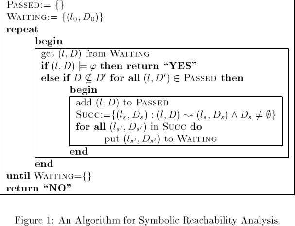
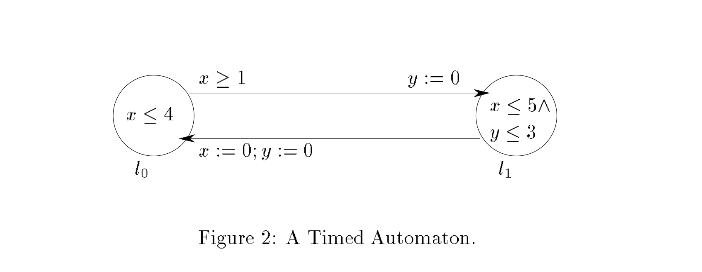
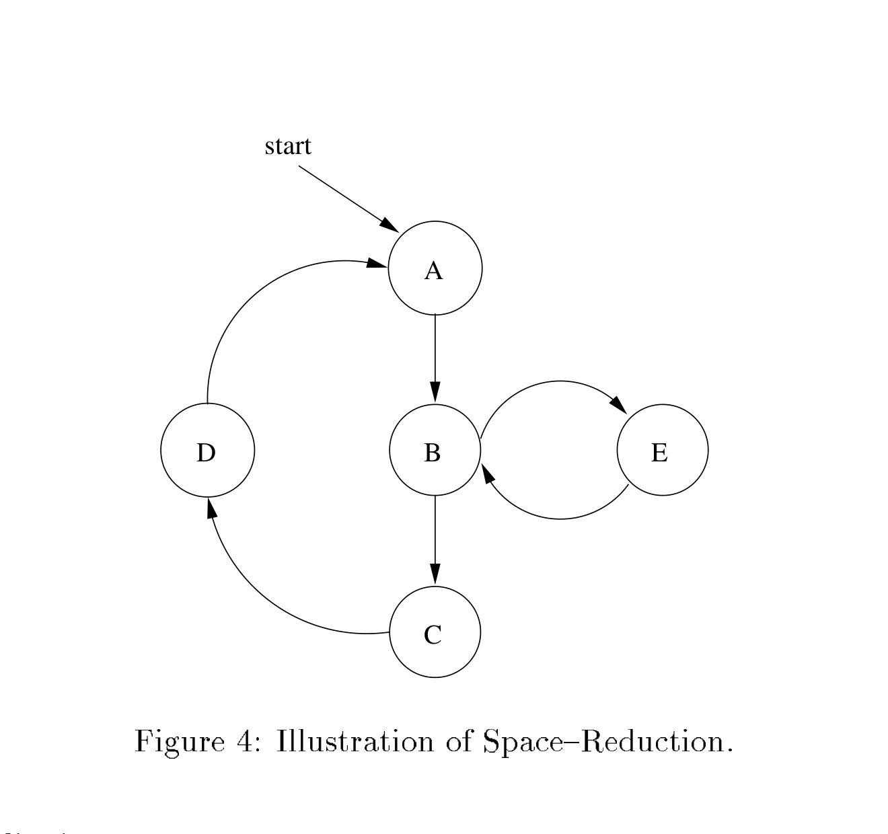
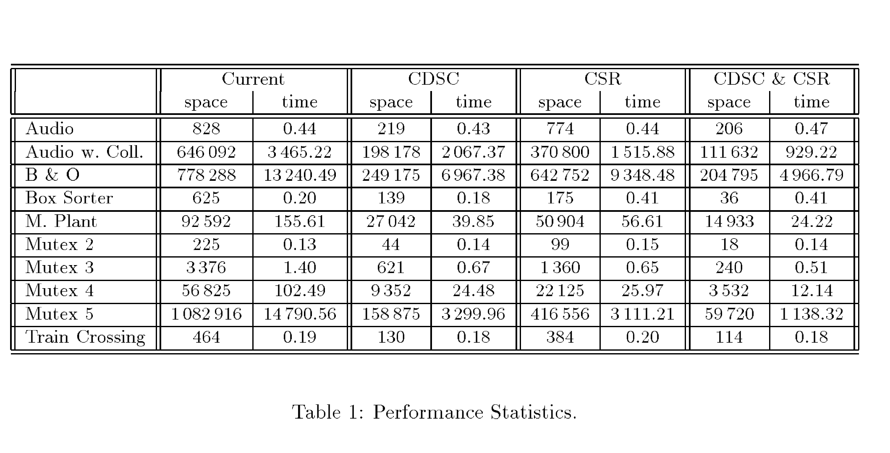

# Efficient Verification of Real-Time Systems: Compact Data Structure and State-Space Reduction

Kim G. Larsen, Fredrik Larsson, Paul Pettersson, and Wang Yi

Kim G. Larsen: BRICS (Basic Research in Computer Science, Centre of the Danish National Research Foundation), Department of Computer Science and Mathematics, Aalborg University, Denmark. E-mail: `kgl@cs.auc.dk`.

Fredrik Larsson, Paul Pettersson, and Wang Yi: Department of Computer Systems, Uppsala University, Sweden. E-mail: `{fredrikl,paupet,yi}@docs.uu.se`.

## Abstract

During the past few years, a number of verification tools have been developed for real-time systems in the framework of timed automata, for example Kronos and Uppaal. One of the major obstacles in applying these tools to industrial-size systems is the high memory cost of exploring the state space of a network, or product, of timed automata: the model checker must keep track of both the control structure of the automata and the clock valuations represented by clock constraints.

This paper presents a compact data structure for representing clock constraints. The data structure is based on an $O(n^3)$ algorithm which, given a constraint system over real-valued variables consisting of bounds on differences, constructs an equivalent system with a minimal number of constraints. In addition, the paper develops an on-the-fly reduction technique for minimizing total space usage. Based on static analysis of the control structure of a network of timed automata, the method computes a set of symbolic states that cover all dynamic loops of the network in an on-the-fly search algorithm and thus ensure termination in reachability analysis.

Both techniques, and their combination, have been implemented in Uppaal. The experiments reported in the paper show substantial space reductions: for six examples from the literature, the total saving ranges from 75% to 94%, and in nearly all cases the running time also improves. An additional observation is that the two techniques are essentially orthogonal.

## 1 Introduction

Reachability analysis has been one of the most successful methods for automated analysis of concurrent systems. Many verification problems, including trace inclusion and invariant checking, can be solved through reachability analysis. It can also be used to check whether a system described as an automaton satisfies a requirement specification formulated, for example, in linear temporal logic, by converting the requirement into an automaton and then checking whether the parallel composition of the system and requirement automata can reach certain annotated states [31, 20]. The practical difficulty is the potential combinatorial explosion of the state space.

To attack this problem, a variety of symbolic and reduction techniques have been developed to represent large state spaces efficiently and to avoid exhaustive exploration, especially for finite-state systems [10, 16, 30, 11, 12, 15, 4]. During the last few years, new verification tools have also been developed for infinite-state timed systems [18, 13, 8]. Most of these engines are based on reachability analysis for timed automata following the pioneering work of Alur and Dill [3].

A timed automaton extends a finite automaton with a finite set of real-valued clocks. The decidability of reachability for timed automata rests on Alur and Dill's region technique, which partitions the infinite state space induced by dense time into finitely many equivalence classes. In practice, however, region-based reachability is infeasible because state explosion arises both from the control structure and from the region space itself [22].

Efficient data structures and algorithms are therefore needed for timing constraints over clocks. Difference Bound Matrices (DBMs) [6, 14, 32] provide one well-known canonical representation and have been used successfully in tools such as Uppaal and Kronos. A DBM can be seen as a weighted directed graph whose vertices correspond to clocks, including a zero-clock, and whose edges record bounds on clock differences. This representation exposes all pairwise differences explicitly, so its storage cost is $O(n^2)$ for $n$ clocks, even though many of those bounds are redundant in practice.

The paper addresses that redundancy in two different but complementary ways. First, it presents an $O(n^3)$ algorithm that takes a DBM and computes an equivalent constraint system with a minimal number of constraints. The resulting minimal representation is both compact and useful for inclusion checking, since the global `Passed` list in a reachability algorithm may end up storing most or all reachable symbolic states. Second, it develops a global reduction strategy: instead of saving every explored symbolic state, the algorithm saves only a subset that is sufficient to guarantee termination.

The abstract reachability algorithm used throughout the paper is shown in Figure 1.

*Figure 1. An Algorithm for Symbolic Reachability Analysis.*

The algorithm explores symbolic states of the form $(l, D)$, where $l$ is a control node and $D$ is a clock-constraint system. It repeatedly removes a symbolic state from `Waiting`, checks whether the target formula has been reached, and, if the state is not already covered by `Passed`, adds it to `Passed` and generates all symbolic successors. The later sections of the paper focus on reducing the memory footprint of exactly this workflow.

The second contribution, the global reduction, is orthogonal to the minimal-constraint representation: the local reduction makes each stored symbolic state smaller, whereas the global reduction makes fewer symbolic states need to be stored at all. The rest of the paper is organized as follows. Section 2 reviews timed automata and DBMs. Section 3 presents the compact DBM data structure and the shortest-path reduction algorithm for weighted graphs. Section 4 develops the global reduction strategy based on control-structure analysis. Section 5 reports experimental results, and Section 6 concludes.

## 2 Preliminaries

### 2.1 Timed Automata

Timed automata were introduced in [3] and have since become a standard model for real-time systems. The paper begins with a small example, reproduced as Figure 2.

*Figure 2. A Timed Automaton.*

The automaton has two control nodes, $l_0$ and $l_1$, and two real-valued clocks, $x$ and $y$. A state is of the form $(l, s, t)$, where $l$ is the control node and $s$ and $t$ are the current values of $x$ and $y$. A control node carries an invariant that must hold while the automaton remains there. Starting from $(l_0, 0, 0)$, the automaton may stay in $l_0$ as long as the invariant $x \le 4$ is satisfied. During this delay both clocks advance synchronously, so states $(l_0, t, t)$ are reachable for $0 \le t \le 4$.

Edges may carry guards and reset assignments. In the example, the transition from $l_0$ to $l_1$ is enabled only for states with $1 \le t \le 4$, and taking that edge resets $y$ to $0$, producing states of the form $(l_1, t, 0)$ with $1 \le t \le 4$.

Let $B(C)$ denote the set of clock-constraint systems over a finite clock set $C$. Atomic constraints have the form $x \sim n$ or $x - y \sim n$, where $x, y \in C$, $\sim \in \{\le, <\}$ in the simplified presentation used later, and $n$ is a natural number. Conjunctions of such constraints are also elements of $B(C)$.

**Definition 1.** A timed automaton $A$ over clocks $C$ is a tuple $\langle N, l_0, E, I \rangle$, where:

- $N$ is a finite set of control nodes,
- $l_0 \in N$ is the initial node,
- $E \subseteq N \times B(C) \times 2^C \times N$ is the set of edges,
- $I : N \to B(C)$ assigns invariants to nodes.

When $\langle l, g, r, l' \rangle \in E$, the paper writes $l \xrightarrow{g,r} l'$.

Clock valuations are represented as functions from $C$ to the non-negative reals. If $u$ is a valuation and $d \in \mathbb{R}_{\ge 0}$, then $u + d$ is the valuation obtained by advancing every clock by $d$. If $r \subseteq C$, then $[r \mapsto 0]u$ resets the clocks in $r$ to zero and leaves all others unchanged.

The standard semantics of a timed automaton is given by two kinds of transitions:

- delay transitions: $(l, u) \to (l, u + d)$ if both $I(l)$ and $I(l)$ after delay remain satisfied;
- edge transitions: $(l, u) \to (l', u')$ if there exists $l \xrightarrow{g,r} l'$ such that $u \models g$ and $u' = [r \mapsto 0]u$.

This semantics yields an infinite transition system, so the paper turns to a finite symbolic semantics. A symbolic state is a pair $(l, D)$ where $D \in B(C)$. The symbolic counterpart of the two transitions above is:

- delay:

$$
(l, D) \rightsquigarrow \bigl(l, (D \land I(l))^\uparrow \land I(l)\bigr),
$$

- edge:

$$
(l, D) \rightsquigarrow \bigl(l', r(g \land D) \land I(l')\bigr)
\quad \text{if } l \xrightarrow{g,r} l'.
$$

Here,

$$
D^\uparrow = \{\, u + d \mid u \in D,\ d \in \mathbb{R}_{\ge 0} \,\},
\qquad
r(D) = \{\, [r \mapsto 0]u \mid u \in D \,\}.
$$

The paper notes that $B(C)$ is closed under these operations, so the symbolic semantics is well defined. Moreover, it corresponds closely to the concrete semantics: if $u \in D$ and $(l, D) \rightsquigarrow (l', D')$, then there exists some $u' \in D'$ such that $(l, u) \to (l', u')$.

The paper also recalls networks of timed automata [33, 22]. A network is the parallel composition of finitely many automata. For the purposes of this paper, interleaving is enough. A network state uses a control vector $\bar l$, where $\bar l[i]$ denotes the local control node of automaton $A_i$, and $\bar l[\bar l_i' / \bar l_i]$ denotes the vector obtained by replacing component $i$. The invariant $I(\bar l)$ is the conjunction of all local invariants. For simplicity, only non-strict orderings are considered in the presentation, though the constructions extend to strict orderings as well.

### 2.2 Difference Bounded Matrices and Shortest-Path Closure

To implement the symbolic semantics algorithmically, the paper uses Difference Bound Matrices. A DBM for a constraint system $D$ is a weighted directed graph whose vertices are the clocks in $C$ plus a zero vertex $0$. An edge from $x$ to $y$ with weight $m$ represents the constraint $x - y \le m$. Likewise, an edge from $0$ to $x$ represents an upper bound on $x$, and an edge from $x$ to $0$ represents a lower bound.

The paper uses the following example constraint system over $\{x_0, x_1, x_2, x_3\}$:

- $x_0 - x_1 \le 3$,
- $x_1 - x_0 \le 5$,
- $x_1 - x_3 \le 2$,
- $x_2 - x_1 \le 2$,
- $x_1 - x_2 \le 10$,
- $x_3 - x_2 \le -4$.

Its graph, its shortest-path closure, and the final shortest-path reduction are shown in Figure 3.

*Figure 3. Graph for $E$ `(a)`, its shortest-path closure `(b)`, and shortest-path reduction `(c)`.*

Different constraint systems may describe the same set of clock valuations. For inclusion checking in reachability analysis, it is therefore advantageous to work with closed constraint systems: no constraint can be tightened without changing the solution set. In graph terms, closure is simply shortest-path closure. A closed DBM is canonical, in the sense that two closed DBMs describe the same solution set if and only if they are identical.

Given a closed constraint system $D$, inclusion $D \subseteq D'$ can be checked by comparing every constraint in $D'$ against the corresponding bound in $D$. Closure can be computed in $O(n^3)$ time using shortest-path algorithms, and emptiness checking reduces to testing whether the graph contains a negative-weight cycle. Once the DBM is closed, the operations $D^\uparrow$ and $r(D)$ can be performed in $O(n)$ time.

The paper assumes that each constraint system has already been simplified so that there is at most one upper bound and one lower bound for each clock and clock difference. It also emphasizes that the inclusion tests discussed here are inclusion tests between the solution sets of the corresponding constraint systems.

## 3 Minimal Constraint Systems and Shortest Path Reductions

The preceding section motivates DBMs as a canonical representation, but the canonical closed form still stores a bound for every relevant pair of clocks. In practice, many of those bounds are redundant. This is bad for memory consumption and also for inclusion checking, since a symbolic state inserted into the `Passed` list is later used primarily to answer inclusion queries.

The goal of Section 3 is therefore to construct, from any constraint system, an equivalent reduced system with the minimal number of constraints. The reduced system is canonical: two systems with the same solution set lead to the same reduced form. The graph-theoretic version is the following problem: given a weighted directed graph with $n$ vertices, construct in $O(n^3)$ time a graph with the minimal number of edges that has the same shortest-path closure.

### 3.1 Reduction of Zero-Cycle Free Graphs

Let $G = (V, E_G)$ be a weighted directed graph, where $E_G$ is a partial function from $V \times V$ to the integers. The domain of $E_G$ is the edge set, and if $E_G(x, y)$ is defined, it is the weight of the edge from $x$ to $y$. The paper assumes that $E_G(x, x) = 0$ for every vertex and that $G$ contains no negative-weight cycles. A graph with no negative cycles corresponds to a non-empty constraint system.

The shortest-path closure of $G$ is denoted $G^C$; the weight $E_{G^C}(x, y)$ is the length of the shortest path from $x$ to $y$ in $G$. A shortest-path reduction of $G$ is a graph $G^R$ with the minimal number of edges such that $(G^R)^C = G^C$.

An edge $(x, y)$ is redundant if there is an alternative path from $x$ to $y$ whose accumulated weight is no larger than the edge weight itself. In Figure 3(a), for example, the edge $(x_1, x_2)$ is redundant because there is an alternative path with the same accumulated weight. In zero-cycle free graphs, all redundant edges can be removed independently.

**Lemma 1.** Let $G_1$ and $G_2$ be zero-cycle free graphs such that $G_1^C = G_2^C$. If there is an edge $(x, y)$ in $G_1$ that is not present in $G_2$, then removing $(x, y)$ from $G_1$ does not change the shortest-path closure.

**Theorem 1.** Let $G$ be a zero-cycle free graph, and let $\{\alpha_1, \ldots, \alpha_k\}$ be the redundant edges of $G$. Then the shortest-path reduction is obtained simply by deleting all of them:

$$
G^R = G \setminus \{\alpha_1, \ldots, \alpha_k\}.
$$

Algorithmically, redundancy is easy to detect once the closure is known. It is enough to consider paths of length $2$: an edge $(x, y)$ is redundant exactly when there exists a vertex $z \ne x, y$ such that

$$
E_{G^C}(x, y) \ge E_{G^C}(x, z) + E_{G^C}(z, y).
$$

This yields an $O(n^3)$ reduction algorithm for zero-cycle free graphs.

### 3.2 Reduction of Negative-Cycle Free Graphs

General negative-cycle free graphs may contain zero-cycles, and those cycles complicate redundancy elimination because a set of mutually supporting redundant edges cannot simply be removed all at once. The paper therefore partitions the graph according to zero-cycles.

Two vertices $x$ and $y$ are said to be zero-equivalent if they lie on a zero-cycle together. The paper writes $x \equiv y$ for this relation. Given the closure, zero-equivalence is easy to test:

$$
x \equiv y
\quad \Longleftrightarrow \quad
E_{G^C}(x, y) = -E_{G^C}(y, x).
$$

In Figure 3(a) and Figure 3(b), this partitions the vertices into two classes, namely $\{x_0\}$ and $\{x_1, x_2, x_3\}$.

**Definition 2.** Given a graph $G$, let $G / {\equiv}$ be the graph whose vertices are the zero-equivalence classes $E_k$ of $G$. There is an edge from $E_i$ to $E_j$ with $i \ne j$ if some edge of $G$ connects a vertex in $E_i$ to a vertex in $E_j$. Its weight is the shortest-path distance in $G$ between the minimum-index representatives of the two classes.

The quotient graph $G / {\equiv}$ is zero-cycle free. If two graphs have the same closure, then their quotient graphs also have the same closure.

**Definition 3.** Let $F$ be a graph whose vertices are zero-equivalence classes of a graph $G$. The expansion $F^+$ is the graph over the original vertex set of $G$ obtained by:

- inserting a single cycle inside every multi-vertex equivalence class, using the original shortest-path distances between consecutive representatives in the class ordering;
- translating each inter-class edge $(E_i, E_j)$ in $F$ into an edge from `min E_i` to `min E_j` with the same weight.

With these two operators in place, the main result of the section is the following.

**Theorem 2.** If $G$ is negative-cycle free, then its shortest-path reduction is obtained by:

1. quotienting $G$ by zero-equivalence,
2. reducing the quotient graph using Theorem 1,
3. expanding the result back to the original vertex set.

Equivalently, using the quotient notation above,

$$
G^R = \bigl((G / {\equiv})^R\bigr)^+.
$$

The paper proves the correctness of this construction in Appendix A. It also notes that, once the closure is known, both the quotient and expansion operators are computable in $O(n^3)$ time, so the whole reduction remains cubic.

At the end of the section, the paper reports that minimal constraint systems built in this way lead to large practical savings in reachability analysis for timed systems, in the range of roughly 70% to 86%. Section 5 returns to those measurements in detail.

## 4 Global Reductions and Control Structure Analysis

Section 3 reduces the size of each individual symbolic state. Section 4 addresses a different question: how many symbolic states actually need to be saved in the global `Passed` list?

### 4.1 Potential Space Reductions

The paper first recalls ordinary reachability for finite graphs. In that simpler setting, the algorithm repeatedly checks whether a node is already present in the passed list, explores newly encountered nodes, and saves explored nodes until all reachable nodes have been accounted for.

The key observation is that not every reachable node needs to be saved. The finite graph used as the running example is shown in Figure 4.

*Figure 4. Illustration of Space-Reduction.*

In that graph, there is no need to save nodes `C`, `D`, or `E`, because they are visited only once if `B` is already present in the passed list. In fact, for termination on a finite graph it is enough to save one node per cycle. In Figure 4, saving `B` alone covers both cycles, so saving `A` is useful only for efficiency, not for termination.

This motivates the following statement.

**Proposition 1.** For a finite graph, there exists a minimal number of nodes that must be saved in order to guarantee both termination and the property that every reachable node is explored only once in reachability analysis.

Returning to timed systems, the symbolic reachability algorithm in Figure 1 saves every new state $(l, D)$ whose symbolic zone is not included in any already saved state at the same control location. That guarantees termination, but it is often stronger than necessary. It is enough to save one symbolic state for every dynamic loop.

**Definition 4 (Dynamic loops).** A set

$$
L_d = \{(l_1, D_1), \ldots, (l_n, D_n)\}
$$

is a dynamic loop of a timed automaton if

$$
(l_1, D_1) \rightsquigarrow (l_2, D_2) \rightsquigarrow \cdots
\rightsquigarrow (l_n, D_n) \rightsquigarrow (l_1, D_1')
$$

with $D_1 \subseteq D_1'$. A symbolic state is said to cover a dynamic loop if it is a member of that loop.

The rest of the section explains how to compute a set of symbolic states that covers all dynamic loops.

### 4.2 Control Structure Analysis and Application

The paper uses the static control structure of the automaton to approximate where loop-covering states must appear.

**Definition 5 (Statical loops and entry nodes).** A set of control nodes $L = \{l_1, \ldots, l_n\}$ is a statical loop if there is a sequence of edges

$$
l_1 \to l_2 \to \cdots \to l_n \to l_1.
$$

A node $l_i$ in such a loop is an entry node if it is either:

- an initial node, or
- reachable by an edge from a node outside the loop.

For a network, a control vector is called an entry node if any of its components is an entry node.

In Figure 4, the nodes `A`, `B`, `C`, and `D` form one statical loop with entry nodes `A` and `B`, while `B` and `E` form another statical loop with entry node `B`. Because every dynamic loop must project to a statical loop, every dynamic loop contains at least one symbolic state whose control vector is an entry node.

This yields the next proposition.

**Proposition 2.** Every dynamic loop of a timed automaton contains at least one symbolic state $(l, D)$ whose control node $l$ is an entry node.

Saving all states whose control nodes are entry nodes is sufficient, but for networks it may still save too many states. The paper therefore introduces a more selective notion.

**Definition 6 (Covering states).** Assume a network of timed automata with initial symbolic state $(l_0, D_0)$ and a reachable symbolic state $(l, D)$. The state $(l, D)$ is a covering state if there exists a sequence of symbolic transitions

$$
(l_0, D_0) \rightsquigarrow (l_1, D_1) \rightsquigarrow \cdots
\rightsquigarrow (l_n, D_n) \rightsquigarrow (l, D)
$$

and some component index $i$ such that:

- $l[i]$ is an entry node, and
- the last transition is derived by an edge

$$
l_n[i] \xrightarrow{g,r} l[i]
$$

for some guard $g$ and reset set $r$.

In other words, a covering state is the first reached symbolic state whose control vector enters an entry node through an actual transition. Once the entry nodes of each component automaton are known from static analysis, whether a reachable symbolic state is a covering state can be determined on the fly.

The main result of the section is then:

**Theorem 3.** Every dynamic loop of a network of timed automata contains at least one covering state.

The proof is deferred to Appendix A. The practical consequence is immediate: to guarantee termination, it is enough to save only covering states in the `Passed` list. The paper reports that this strategy has been implemented in Uppaal and, together with the compact data structure of Section 3, yields substantial space savings and typically improved time performance.

## 5 Experimental Results

The techniques from Sections 3 and 4 were implemented in Uppaal and evaluated on six examples from the literature:

- **Philips Audio Protocol (Audio).** The protocol exchanges control information between audio components using Manchester encoding. The verified property is that all bit streams sent by the sender are correctly decoded by the receiver, assuming a timing error of at most 5%.
- **Philips Audio Protocol with Bus Collision (Audio w. Coll.).** An extended variant of the audio protocol with collision detection. The experiment verifies that correct bit sequences are received using the error tolerances chosen by Philips.
- **Bang & Olufsen Audio/Video Protocol (B&O).** A real-time bus protocol for audio/video components. Uppaal automatically produces an error trace for the original faulty design; the corrected version is then automatically proved correct.
- **Box Sorter.** A model of a sorter that uses a sensor and a piston to separate red and blue boxes.
- **Manufacturing Plant (M. Plant).** A production-cell style example with a moving belt, two boxes, two robots, and a service station; the verified property is that no box falls off the belt.
- **Mutual Exclusion Protocol (Mutex 2-5).** Fischer's protocol with recovery from failed attempts and eventual exit from the critical section.
- **Train Crossing Controller.** A train-gate controller where the verified property is that the gate is closed whenever a train is near the crossing.

The visual form of the results table is reproduced below.

*Table 1. Performance Statistics.*

For direct reading on GitHub, the table is also transcribed in Markdown:

| Example | Current space | Current time | CDSC space | CDSC time | CSR space | CSR time | CDSC & CSR space | CDSC & CSR time |
| --- | ---: | ---: | ---: | ---: | ---: | ---: | ---: | ---: |
| Audio | 828 | 0.44 | 219 | 0.43 | 774 | 0.44 | 206 | 0.47 |
| Audio w. Coll. | 646092 | 3465.22 | 198178 | 2067.37 | 370800 | 1515.88 | 111632 | 929.22 |
| B & O | 778288 | 13240.49 | 249175 | 6967.38 | 642752 | 9348.48 | 204795 | 4966.79 |
| Box Sorter | 625 | 0.20 | 139 | 0.18 | 175 | 0.41 | 36 | 0.41 |
| M. Plant | 92592 | 155.61 | 27042 | 39.85 | 50904 | 56.61 | 14933 | 24.22 |
| Mutex 2 | 225 | 0.13 | 44 | 0.14 | 99 | 0.15 | 18 | 0.14 |
| Mutex 3 | 3376 | 1.40 | 621 | 0.67 | 1360 | 0.65 | 240 | 0.51 |
| Mutex 4 | 56825 | 102.49 | 9352 | 24.48 | 22125 | 25.97 | 3532 | 12.14 |
| Mutex 5 | 1082916 | 14790.56 | 158875 | 3299.96 | 416556 | 3111.21 | 59720 | 1138.32 |
| Train Crossing | 464 | 0.19 | 130 | 0.18 | 384 | 0.20 | 114 | 0.18 |

The experiments were run on a Sun SPARCstation 4 with 64 MB of primary memory. Each example was checked with the original Uppaal algorithm (`Current`) and with three modified variants:

- `CDSC`: Compact Data Structures for Constraints,
- `CSR`: Control Structure Reduction,
- `CDSC & CSR`: the combination of the two.

The paper reports that `CDSC` saves between 68% and 85% of the original space consumption, while `CSR` shows a wider range, between 13% and 72%. In nearly all cases, both techniques also improve running time. The combined method is especially striking: its space saving ranges from 75% to 94%, confirming that the local and global reductions are largely orthogonal.

## 6 Conclusion

The paper presents two complementary contributions to the efficient analysis of timed systems.

First, it introduces a compact data structure for the subsets of Euclidean space that arise during verification of timed automata. This structure provides minimal and canonical representations for clock constraints and supports efficient inclusion checks. Algorithmically, it is based on an $O(n^3)$ minimization procedure for weighted directed graphs: given a graph with $n$ vertices, the algorithm constructs a graph with the minimal number of edges that has the same shortest-path closure as the original graph.

Second, it develops an on-the-fly global reduction technique that reduces the total number of symbolic states that need to be saved during reachability analysis. The method relies on the observation that termination requires only certain critical states, not all explored states. Static control-structure analysis identifies a set of covering states that is sufficient for termination, even though it is not necessarily minimal.

Both techniques, and their combination, were implemented in Uppaal. The experiments demonstrate large space reductions and, in nearly all cases, better time performance as well. As future work, the authors propose to study how to compute smaller covering sets that still guarantee both termination and the avoidance of repeated explorations.

## References

1. M. Abadi and L. Lamport. *An Old-Fashioned Recipe for Real Time*. In Proc. of REX Workshop "Real-Time: Theory in Practice", volume 600 of Lecture Notes in Computer Science, 1993.
2. A. Aho, M. Garey, and J. Ullman. *The Transitive Reduction of a Directed Graph*. *SIAM Journal of Computing*, 1(2):131-137, June 1972.
3. R. Alur and D. Dill. *Automata for Modelling Real-Time Systems*. In Proc. of ICALP'90, volume 443 of Lecture Notes in Computer Science, 1990.
4. H. R. Andersen. *Partial Model Checking*. In Proc. of Symp. on Logic in Computer Science, 1995.
5. E. Asarin, O. Maler, and A. Pnueli. *Data-structures for the verification of timed automata*. Accepted for presentation at HART'97, 1997.
6. R. Bellman. *Dynamic Programming*. Princeton University Press, 1957.
7. J. Bengtsson, D. Griffioen, K. Kristoffersen, K. G. Larsen, F. Larsson, P. Pettersson, and W. Yi. *Verification of an Audio Protocol with Bus Collision Using Uppaal*. In R. Alur and T. A. Henzinger, editors, Proc. of 8th Int. Conf. on Computer Aided Verification, number 1102 in Lecture Notes in Computer Science, pages 244-256. Springer-Verlag, July 1996.
8. J. Bengtsson, K. G. Larsen, F. Larsson, P. Pettersson, and W. Yi. *Uppaal in 1995*. In Proc. of the 2nd Workshop on Tools and Algorithms for the Construction and Analysis of Systems, number 1055 in Lecture Notes in Computer Science, pages 431-434. Springer-Verlag, March 1996.
9. D. Bosscher, I. Polak, and F. Vaandrager. *Verification of an Audio-Control Protocol*. In Proc. of Formal Techniques in Real-Time and Fault-Tolerant Systems, volume 863 of Lecture Notes in Computer Science, 1994.
10. J. R. Burch, E. M. Clarke, K. L. McMillan, D. L. Dill, and L. J. Hwang. *Symbolic Model Checking: $10^{20}$ states and beyond*. In *Logic in Computer Science*, 1990.
11. E. M. Clarke, T. Filkorn, and S. Jha. *Exploiting Symmetry in Temporal Logic Model Checking*. In Proc. of 5th Int. Conf. on Computer Aided Verification, volume 697 of Lecture Notes in Computer Science, 1993.
12. E. M. Clarke, O. Grumberg, and D. E. Long. *Model Checking and Abstraction*. In *Principles of Programming Languages*, 1992.
13. C. Daws and S. Yovine. *Two examples of verification of multirate timed automata with Kronos*. In Proc. of the 16th IEEE Real-Time Systems Symposium, pages 66-75, December 1995.
14. D. Dill. *Timing assumptions and verification of finite-state concurrent systems*. In J. Sifakis, editor, Proc. of Automatic Verification Methods for Finite State Systems, number 407 in Lecture Notes in Computer Science, pages 197-212. Springer-Verlag, 1989.
15. E. A. Emerson and C. S. Jutla. *Symmetry and Model Checking*. In Proc. of 5th Int. Conf. on Computer Aided Verification, volume 697 of Lecture Notes in Computer Science, 1993.
16. P. Godefroid and P. Wolper. *A Partial Approach to Model Checking*. In *Logic in Computer Science*, 1991.
17. K. Havelund, A. Skou, K. G. Larsen, and K. Lund. *Formal Modeling and Analysis of an Audio/Video Protocol: An Industrial Case Study Using Uppaal*. This volume, 1997.
18. T. A. Henzinger, P.-H. Ho, and H. Wong-Toi. *A Users Guide to HyTech*. Technical report, Department of Computer Science, Cornell University, 1995.
19. T. A. Henzinger, X. Nicollin, J. Sifakis, and S. Yovine. *Symbolic Model Checking for Real-Time Systems*. *Information and Computation*, 111(2):193-244, 1994.
20. G. Holzmann. *The Design and Validation of Computer Protocols*. Prentice Hall, 1991.
21. K. J. Kristoffersen, F. Larroussinie, K. G. Larsen, P. Pettersson, and W. Yi. *A compositional proof of a real-time mutual exclusion protocol*. In Proc. of the 7th International Joint Conference on the Theory and Practice of Software Development, April 1997.
22. K. G. Larsen, P. Pettersson, and W. Yi. *Compositional and Symbolic Model-Checking of Real-Time Systems*. In Proc. of the 16th IEEE Real-Time Systems Symposium, pages 76-87, December 1995.
23. K. G. Larsen, P. Pettersson, and W. Yi. *Diagnostic Model-Checking for Real-Time Systems*. In Proc. of Workshop on Verification and Control of Hybrid Systems III, volume 1066 of Lecture Notes in Computer Science, pages 575-586. Springer-Verlag, October 1995.
24. K. G. Larsen, P. Pettersson, and W. Yi. *Uppaal in a Nutshell*. To appear in *International Journal on Software Tools for Technology Transfer*, 1997.
25. F. Pagani. *Partial orders and verification of real-time systems*. In B. Jonsson and J. Parrow, editors, Proc. of Formal Techniques in Real-Time and Fault-Tolerant Systems, number 1135 in Lecture Notes in Computer Science, pages 327-346. Springer-Verlag, 1996.
26. C. H. Papadimitriou. *Computational Complexity*. Addison-Wesley, 1994.
27. A. Puri and P. Varaiya. *Verification of hybrid systems using abstractions*. In *Hybrid Systems Workshop*, number 818 in Lecture Notes in Computer Science. Springer-Verlag, October 1994.
28. R. Sedgewick. *Algorithms*. Addison-Wesley, 2nd edition, 1988.
29. N. Shankar. *Verification of Real-Time Systems Using PVS*. In Proc. of 5th Int. Conf. on Computer Aided Verification, volume 697 of Lecture Notes in Computer Science. Springer-Verlag, 1993.
30. A. Valmari. *A Stubborn Attack on State Explosion*. *Theoretical Computer Science*, 3, 1990.
31. M. Vardi and P. Wolper. *An automata-theoretic approach to automatic program verification*. In Proc. of Symp. on Logic in Computer Science, pages 322-331, 1986.
32. M. Yannakakis and D. Lee. *An efficient algorithm for minimizing real-time transition systems*. In Proc. of 5th Int. Conf. on Computer Aided Verification, volume 697 of Lecture Notes in Computer Science, pages 210-224, 1993.
33. W. Yi, P. Pettersson, and M. Daniels. *Automatic Verification of Real-Time Communicating Systems By Constraint-Solving*. In Proc. of the 7th International Conference on Formal Description Techniques, 1994.

## Appendix A Proofs of Lemma 1, Theorem 2, and 3

### Proof of Lemma 1

Let $\alpha = (x, y)$ be the edge in $G_1$ with weight $m$. We show that there is an alternative path in $G_1$ from $x$ to $y$ that does not use $\alpha$ and has weight at most $m$.

Because $G_1^C = G_2^C$, the shortest path from $x$ to $y$ in $G_2$ has weight at most $m$. Since $\alpha$ is not present in $G_2$, that shortest path must pass through some vertex $z \ne x, y$. Let $m_1$ be the shortest-path weight from $x$ to $z$, and let $m_2$ be the shortest-path weight from $z$ to $y$. Since $G_1$ and $G_2$ have the same closure, they agree on $m_1$ and $m_2$, and therefore

$$
m \ge m_1 + m_2.
$$

Now suppose the shortest path in $G_1$ from $x$ to $z$ uses $\alpha$. Then that path contains a subpath from $y$ to $z$. Together with a shortest path from $z$ to $y$, this yields a cycle through $y$ of weight at most $(m_1 - m) + m_2 \le 0$. Since the graph has no negative cycles, that cycle must have weight $0$, contradicting the assumption that $G_1$ is zero-cycle free. A symmetric contradiction arises if the shortest path from $z$ to $y$ uses $\alpha$. Hence there must exist a path from $x$ to $y$ in $G_1$ that avoids $\alpha$ and has weight no more than $m$.

### Proof of Theorem 2

The paper proves only that the construction yields a candidate shortest-path reduction; minimality is deferred to the full version. Let

$$
G^R = \bigl((G / {\equiv})^R\bigr)^+.
$$

Every edge of $G^R$ has weight of the form $E_{G^C}(x, y)$, so every path in $G^R$ corresponds to a path in $G$ with the same weight.

It remains to show that every edge $(x, y)$ of $G$ can be replaced by a path in $G^R$ of no greater weight.

If $x = \min E_i$ and $y = \min E_j$ for two distinct zero-equivalence classes $E_i$ and $E_j$, then the quotient graph contains an edge of weight at most the original edge weight, and the reduced quotient graph still provides a path between those classes with no greater weight. Expanding back to the original vertex set yields a path in $G^R$ with no greater weight than $(x, y)$.

If $x$ and $y$ belong to the same zero-equivalence class, then by construction the expansion restores a cycle inside that class that realizes the exact shortest-path distances, so again the edge weight is preserved or improved.

Finally, if $x \in E_i$ and $y \in E_j$ for distinct classes but neither endpoint is the minimum representative of its class, then the path

$$
x \to \min E_i \to \min E_j \to y
$$

exists in $G^R$. Writing the corresponding path weights as $m_1$, $m_2$, and $m_3$, the construction guarantees $m_2 \le E_{G^C}(\min E_i, \min E_j)$. If the total weight $m_1 + m_2 + m_3$ were larger than the original edge weight $m$, then one would obtain a path between $\min E_i$ and $\min E_j$ in $G$ shorter than $m_2$, contradicting the definition of $m_2$. Therefore the path in $G^R$ is no heavier than the original edge.

This proves that $(G^R)^C = G^C$.

### Proof of Theorem 3

Assume for contradiction that there exists a dynamic loop

$$
L_d = (l_1, D_1), \ldots, (l_k, D_k)
$$

with no covering states. By Proposition 2, $L_d$ contains at least one entry node. Without loss of generality, suppose $(l, D) \in L_d$ is such a symbolic state, and suppose that the components $l[1], \ldots, l[m]$ are entry nodes while $l[m+1], \ldots, l[n]$ are not.

The crucial claim is that, if $L_d$ contains no covering state, then the set of components $l_i[1], \ldots, l_i[m]$ remains in entry nodes throughout the whole loop. If that set grew, a covering state would be introduced immediately by definition. If it shrank, then because the loop eventually returns to $l$, the same set would have to grow again later, which would again introduce a covering state.

In fact, under the assumption that $L_d$ contains no covering states, every symbolic transition in $L_d$ must be derived only by components among $l_i[m+1], \ldots, l_i[n]$. If some transition were derived by a component among $l_i[1], \ldots, l_i[m]$, then the local set of entry nodes would either grow, shrink, or move from one entry node to another. Each of those cases would create a covering state.

Now remove the components $l_i[1], \ldots, l_i[m]$ from every symbolic state in $L_d$, yielding a smaller loop $L_d'$. All symbolic transitions of $L_d$ remain valid in $L_d'$, so $L_d'$ is still a loop. But by construction, $L_d'$ contains no entry-node components at all, contradicting Proposition 2. Therefore every dynamic loop must contain at least one covering state.
