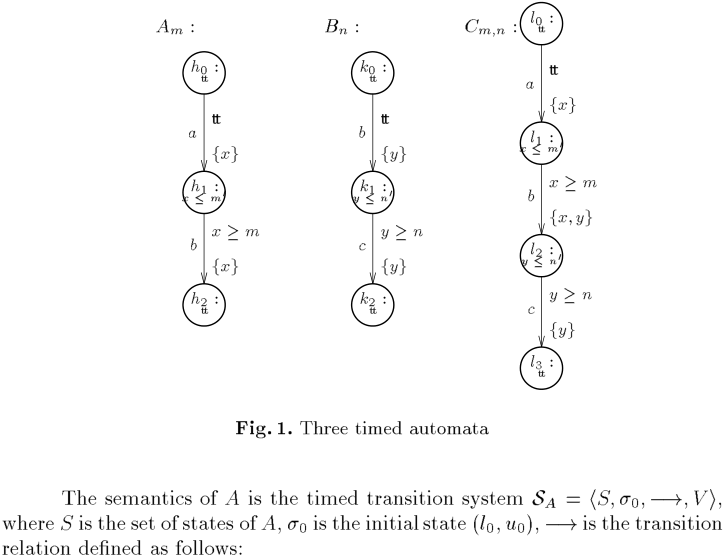
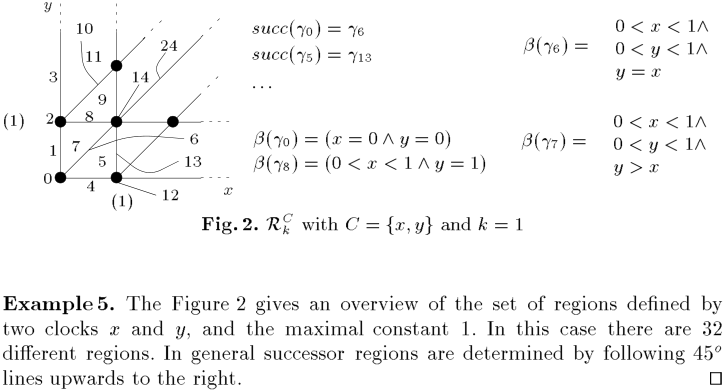
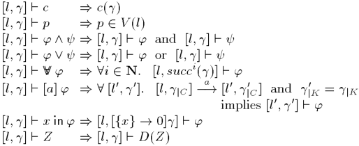
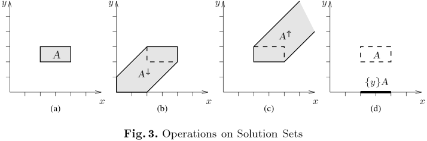
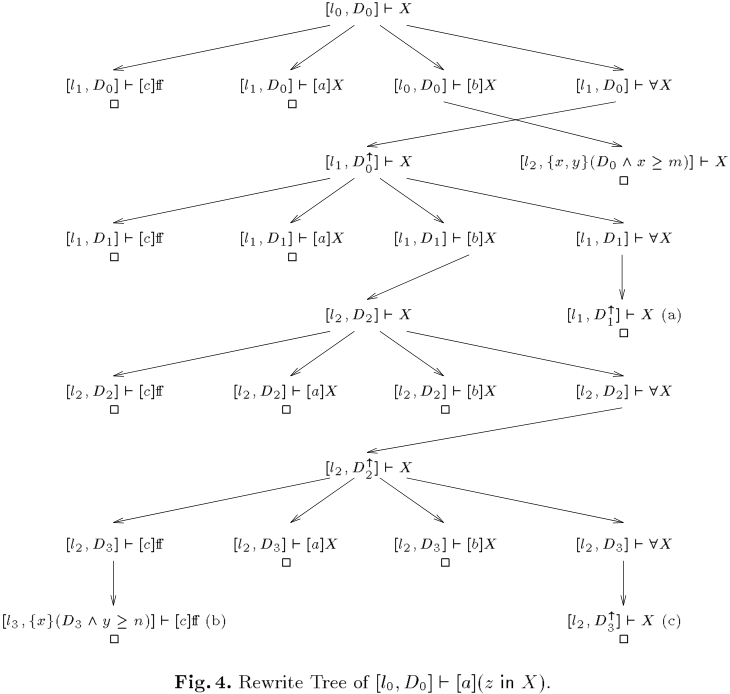
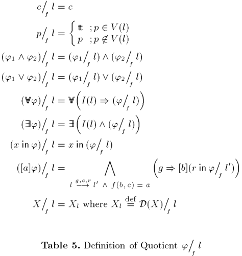
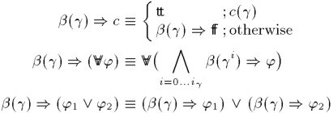
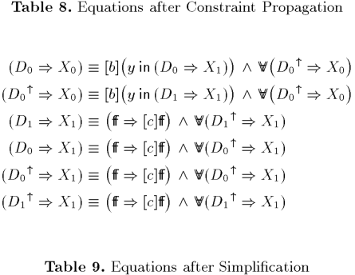
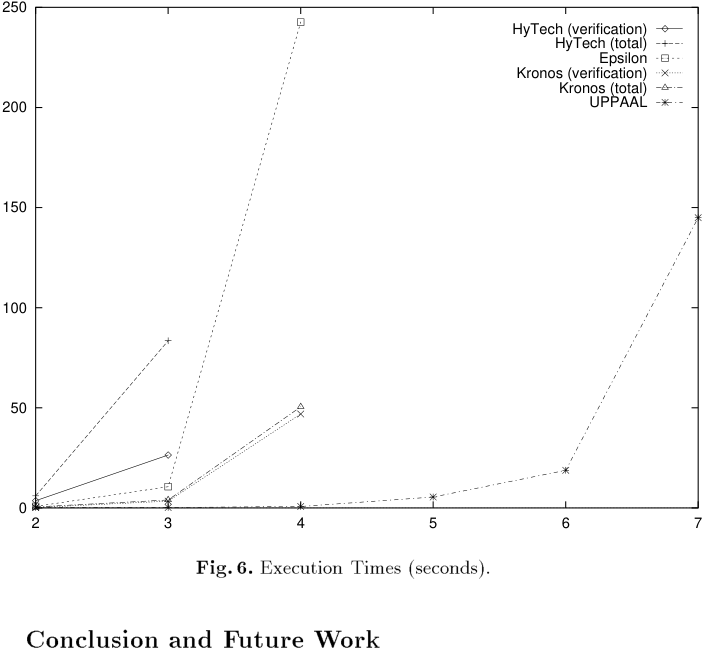
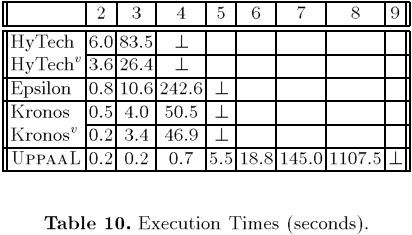

<!-- page: 1 -->

Model-Checking for Real-Time Systems ?
Kim G. Larsen1
1

Paul Pettersson2 Wang Yi2 BRICS??? , Aalborg University, DENMARK 2 Uppsala University, SWEDEN

## Abstract

Efficient automatic model-checking algorithms for real-time systems have been obtained in recent years based on the state-region graph technique of Alur, Courcoubetis and Dill. However, these algorithms are faced with two potential types of explosion arising from parallel composition: explosion in the space of control nodes, and explosion in the region space over clock-variables. This paper reports on work attacking these explosion problems by developing and combining compositional and symbolic model-checking techniques. The presented techniques provide the foundation for a new automatic verification tool Uppaal . Experimental results show that Uppaal is not only substantially faster than other real-time verification tools but also able to handle much larger systems. 1 Introduction Within the last decade model-checking has turned out to be a useful technique for verifying temporal properties of nite-state systems. Efficient model{ checking algorithms for nite-state systems have been obtained with respect to a number of logics. However, the major problem in applying model-checking even to moderate-size systems is the potential combinatorial explosion of the state space arising from parallel composition. In order to avoid this problem, algorithms have been sought that avoid exhaustive state space exploration, either by symbolic representation of the states space using Binary Decision Diagrams [5], by application of partial order methods [11, 21] which suppresses unnecessary interleavings of transitions, or by application of abstractions and symmetries [7, 8, 10]. In the last few years, model-checking has been extended to real-time systems, with time considered to be a dense linear order. A timed extension of nite automata through addition of a nite set of real-valued clock-variables has been put forward [3] (so called timed automata), and the corresponding model-checking problem has been proven decidable for a number of timed logics including timed extensions of CTL (TCTL) [2] and timed \mu-calculus (T\mu ) [14]. ? This work has been supported by the European Communieties under CONCUR2, BRA 7166, NUTEK (Swedish Board for Technical Development) and TFR (Swedish Technical Research Council) ??? Basic Research in Computer Science, Centre of the Danish National Research Foundation.

<!-- page: 2 -->

A state of a timed automaton is of the form (l; u), where l is a control-node and u is a clock-assignment holding the current values of the clock-variables. The crucial observation made by Alur, Courcoubetis and Dill and the foundation for decidability of model-checking is that the (in nite) set of clock-assignments may effectively be partitioned into nitely many regions in such a way that clock{ assignments within the same region induce states satisfying the same logical properties. Model-checking of real-time systems based on the region technique suffers two potential types of explosion arising from parallel composition: Explosion in the region space, and Explosion in the space of control-nodes. We report on attacks on these problems by development and combination of two new verification techniques: 1. A symbolic technique reducing the verification problem to that of solving simple constraint systems (on clock-variables), and 2. A compositional quotient construction, which allows components of a real{ time system to be gradually moved from the system into the speci cation. The intermediate speci cations are kept small using minimization heuristics. The property-independent nature of regions leads to an extremely ne (and large) partitioning of the set of clock-assignments. Our symbolic technique allows the partitioning to take account of the particular property to be veri ed and will thus in practice be considerably coarser (and smaller). For the explosion on control-nodes, recent work by Andersen [4] on (untimed) nite-state systems gives experimental evidence that the quotient technique improves results obtained using Binary Decision Diagrams [5]. The aim of the work reported is to make this new successful compositional model-checking technique applicable to real-time systems. For example, consider the following typical model-checking problem A1 j : : : j An j= ' where the Ai 's are timed automata. We want to verify that the parallel composition of these satis es the formula ' without having to construct the complete control-node space of (A1 j : : : j An). We will avoid this complete construction by removing the components Ai one by one while simultaneously transforming the formula accordingly. Thus, when removing the component An we will transform the formula ' into the quotient formula ' = An such that A1 j : : : j An j= ' if and only if A1 j : : : j An,1 j= ' = An (1) Now clearly, if the quotient is not much larger than the original formula we have succeeded in simplifying the problem. Repeated application of quotienting yields A1 j : : : j An j= ' if and only if 1 j= ' = $An =An$,1 = : : : = A1 (2) where 1 is the unit with respect to parallel composition. However, these ideas alone are clearly not enough as the explosion may now occur in the size of the

<!-- page: 3 -->

nal formula instead. The crucial and experimentally \veri ed" observation by Andersen was that each quotienting should be followed by a minimization of the formula based on a small collection of efficiently implementable strategies. In our setting, Andersen's collection is extended to include strategies for propagating and simplifying timing constraints. We report on a new symbolic and compositional verification technique developed for the real-time logics L\nu [17] and a fragment Ls designed speci cally for expressing safety and bounded liveness properties. Comparatively less expressive than TCTL and T\mu , the fragment Ls is still sufficiently expressive for practical purposes allowing a number of operators of other logics to be derived. Most importantly, the somewhat restrictive expressive power of Ls allows for extremely efficient model-checking as demonstrated by our experimental results, which includes a comparison with other existing automatic verification tools for real-time systems (HyTech, Kronos and Epsilon). For the logics TCTL and T\mu , [14] o ers a symbolic verification technique. However, due to the high expressive power of these logics the partitioning employed in [14] is signi cantly ner (and larger) and implementation-wise more complicated than ours. An initial e ort in applying the compositional quotienting technique to real-time systems has been given in [18]. The outline of this paper is as follows: In the next section we give a short presentation of the notions of timed automata and network. In section 3, the logic L\nu and its fragment Ls are presented and their expressive power illustrated. Section 4 reviews region-based model-checking for L\nu , whereas Section 5 reports on a symbolic verification technique for the fragment Ls based on constraint solving. Section 6 describes the compositional quotienting technique. Finally, in Section 7 we report on our experimental results, which shows that Uppaal is not only substantially faster than other real-time verification tools but also able to handle much larger systems. 2 Real-Time Systems We shall use timed transition systems as a basic semantical model for real{ time systems. The type of systems we are studying will be a particular class of timed transition systems that are syntactically described by networks of timed automata [22, 18]. 2.1 Timed Transition Systems A timed transition system is a labelled transition system with two types of labels: atomic actions and delay actions (i.e. positive reals), representing discrete and continuous changes of real-time systems. Let Act be a nite set of actions ranged over by a; b etc, and P be a set of atomic propositions ranged over by p; q etc. We use R to stand for the set of non-negative real numbers, D for the set of delay actions f\tau(d) j d 2 Rg, and L for the union Act [ D.

<!-- page: 4 -->

De nition1. A timed transition system over actions Act and atomic propositions P is a tuple $S = hS$; s ; ,!; V i, where S is a set of states, s is the initial state, ,!\subseteq S × L × S is a transition relation, and V : S ! 2P is a proposition assignment function. ut 0 Note that the above de nition is standard for labelled transition systems except that we introduced a proposition assignment function V , which for each state s 2 S assigns a set of atomic propositions V (s) that hold in s. In order to study compositionality problems we introduce a parallel composition between timed transition systems. Following [16] we suggest a composition parameterized with a synchronization function generalizing a large range of existing notions of parallel compositions. A synchronization function f is a partial function (Act [ f0g) × (Act [ f0g) ,! Act, where 0 denotes a distinguished no-action symbol 4 . Now, let $Si = hSi$ ; si;0 ; ,!i ; Vii, $i = 1$; 2, be two timed transition systems and let f be a synchronization function. Then the parallel composition S1 jf S2 is the timed transition system hS; s0 ; ,!; V i, where s1 jf s2 2 S whenever s1 2 S1 and s2 2 S2 , $s0 = s1$;0 jf s2;0, ,! is inductively de ned as follows: c s0 j s0 if s ,! a s0 , s ,! b s0 and f(a; b) = c { s1 jf s2 ,! 1 1 1 2

## 2 2

1 f 2 \tau(d) 0 0 \tau(d) 0 \tau(d) 0 { s1 jf s2 ,! s1 jf s2 if s1 ,!1 s1 and s2 ,! 2 s2 and nally, the proposition assignment function V is de ned by V (s1 jf s2 ) = V1 (s1 ) [ V2 (s2 ). Note also that the set of states and the transition relation of a timed transition system may be in nite. We shall use networks of timed automata as a nite syntactical representation to describe timed transition systems.

### 2.2 Networks of Timed Automata

A timed automaton [3] is a standard nite-state automaton extended with a nite collection of real-valued clocks 5 . Conceptually, the clocks may be considered as the system clocks of a concurrent system. They are assumed to proceed at the same rate and measure the amount of time that has been elapsed since they were reset. The clocks values may be tested (compared with natural numbers) and reset (assigned to 0). De nition2. (Clock Constraints) Let C be a set of real-valued clocks ranged over by x; y etc. We use B(C) to stand for the set of formulas ranged over by g, generated by the following syntax: g ::= c j g ^ g, where c is an atomic constraint of the form: x \varphi n or x , y \varphi n for x; y 2 C, \varphi2 f\le; \ge; =; <; >g and n being a natural number. We shall call B(C) clock constraints or clock constraint systems over C. Moreover, BM (C) denotes the subset of B(C) with no constant greater than M. ut We extend the transition relation of a timed transition system such that s ,! s0 i 0 4 5 $s=s$. Timed transition systems may alternatively be described using timed process calculi.

<!-- page: 5 -->

We shall use tt to stand for a constraint like $x \ge 0$ which is always true, and ff for a constraint $x < 0$ which is always false as clocks can only have non-negative values. De nition3. A timed automaton A over actions Act, atomic propositions P and clocks C is a tuple hN; l ; E; I; V i. N is a nite set of nodes (control-nodes), l is the initial node, and E \subseteq N × B(C) × Act × 2C × N corresponds to the set of edges. In the case, hl; g; a; r; l0i 2 E we shall write, l g;a;r ,! l0 which represents 0 an edge from the node l to the node l0 with clock constraint g (also called the enabling condition of the edge), action a to be performed and the set of clocks r to be reset. I : N ! B(C) is a function, which for each node assigns a clock constraint (also called the invariant condition of the node), and nally, V : N ! 2P is a proposition assignment function which for each node gives a set of atomic propositions true in the node. ut Note that for each node l, there is an invariant condition I(l) which is a clock constraint. Intuitively, this constraint must be satisfied by the system clocks whenever the system is operating in that particular control-node. Informally, the system starts at node l0 with all its clocks initialized to 0. The values of the clocks increase synchronously with time at node l as long as they satisfy the invariant condition I(l). At any time, the automaton can change node by following an edge l g;a;r ,! l0 provided the current values of the clocks satisfy the enabling condition g. With this transition the clocks in r get reset to 0. Example 1. Consider the automata Am , Bn and Cm;n in Figure 1 where m, n, m0 and n0 are natural numbers used as parameters. The automaton Cm;n has four nodes, l0 , l1 , l2 and l3 , two clocks x and y, and three edges. The edge between l1 and l2 has b as action, fx; yg as reset set and the enabling condition for the edge is $x > m$. The invariant conditions for nodes l1 and l2 are $x \le m0$ and $y \le n0$ respectively. ut Now we introduce the notion of a clock assignment. Formally, a clock assignment u for C is a function from C to R. We denote by RC the set of clock assignments for C. For u 2 RC , x 2 C and d 2 R, u + d denotes the time assignment which maps each clock x in C to the value u(x) + d. For C 0 \subseteq C, [C 0 7! 0]u denotes the assignment for C which maps each clock in C 0 to the value 0 and agrees with u over C nC 0. Whenever u 2 RC , v 2 RK and C and K are disjoint, we use uv to denote the clock assignment over C [ K such that (uv)(x) = u(x) if x 2 C and (uv)(x) = v(x) if x 2 K. Given a clock constraint g 2 B(C) and a clock assignment u 2 RC , g(u) is a boolean value describing whether g is satisfied by u or not. When g(u) is true, we shall say that u is a solution og g. A state of an automaton A is a pair (l; u) where l is a node of A and u a clock assignment for C. The initial state of A is (l0 ; u0) where u0 is the initial clock assignment mapping all clocks in C to 0.

<!-- page: 6 -->

Am : Cm;n : l0 : Bn : tt h0tt : k0tt : tt tt a b fxg x $h\le1$ m: 0 b a c h2tt : fxg x $l\le1$ m: 0 fy g $yk\le1$ n: 0 $x\gem$ fxg tt b $y\gen$ fy g k2tt : $x\gem$ fx;yg y $l\le2$ n: 0 c $y\gen$ fy g l3tt :

*Figure 1. Three timed automata*

( ) ( ) ( ) Note that we need to assume that $m \le e \le m0$ and $n \le f \le n0$ because of the invariant conditions on l1 and l2 . ut Parallel composition may now be extended to timed automata in the obvious way: for two timed automata A and B and a synchronization function f, the parallel composition A jf B denotes the timed transition system SA jf SB . Note that the timed transition system SA jf SB can also be represented nitely as a timed automaton. In fact, one may effectively construct the product automaton A f B such that its timed transition system SA f B is bisimilar to SA jf SB . The nodes of A f B is simply the product of A's and B's nodes, the invariant conditions on the nodes of A f B are the conjunctions of the conditions on respective A's and B's nodes, the set of clocks is the (disjoint) union of A's

<!-- page: 7 -->

and B's clocks, and the edges are based on synchronizable A and B edges with enabling conditions conjuncted and reset-sets unioned. Example 3. Let f be the synchronization function de ned by f(a; 0) = a, f(b; b) = b and f(0; c) = c. Then the automaton Cm;n in Figure 1 is timed bisimilar to the part of Am f Bn which is reachable from (h ; k ). ut 0 3 Timed Logics We rst introduce the syntax and semantics of the dense-time logic L\nu presented in [17]. For the practical goal of verification of real-time systems, we nd that it suffices to consider a certain fragment Ls especially designed to express safety and bounded liveness properties. Most importantly, as we shall show in subsequent sections, the rectriction to Ls allows for extremely efficient model-checking algorithms.

### 3.1 Syntax and Semantics

We rst consider a dense-time logic L\nu with clocks and recursion. This logic may be seen as a certain fragment 6 of the \mu-calculus T\mu presented in [14]. In [17] it has been shown that this logic is sufficiently expressive that for any timed automaton one may construct a single characteristic formula uniquely characterizing the automaton up to timed bisimilarity. Also, decidability of a satis ability 7 problem is demonstrated. De nition4. Let K be a nite set of clocks. We shall call K formula clocks. Let Id be a set of identi ers. The set L\nu of formulae over K, Id, Act, and P is generated by the abstract syntax with ' and ranging over L\nu : ' ::= c j p j ' ^ j ' _ j 9 ' j 8 ' j hai ' j [a] ' j x in ' j x + n \varphi y + m j Z where c is an atomic clock constraint in the form of x \varphi n or x , y \varphi n for x; y 2 K and natural number n, p 2 P is an atomic predicate, a 2 Act is an action, z 2 K and Z 2 Id is an identi er. ut The meaning of the identi ers is speci ed by a declaration D assigning a formula of L\nu to each identi er. When D is understood we write Z = ' for D(Z) = '. Given a timed transition system $S = hS$; s ; ,!; V i described by a network of timed automata, we interpret the L\nu formulas over an extended state hs; ui where s 2 S is a state of S , and u is a clock assignment for K. A formula def 6 7 allowing only maximal recursion and using a slightly di erent notion of model Bounded in the number of clocks and maximal constant allowed in the satisfying automata.

<!-- page: 8 -->

hs; ui $j= c$ ) c(u) hs; ui $j= p$ ) p 2 V (s) hs; ui j= ' _ ) hs;ui j= ' or hs; ui $j= hs$; ui j= ' ^ ) hs;ui j= ' and hs; ui j= \taud 0 hs; ui $j= 8$ ' ) 8d; s0 : sa,! s ) hs0 ; u + di j= ' 0 0 hs; ui j= [a] ' ) 8s : s ,! s ) hs0 ; ui j= ' hs; ui $j= x$ in ' ) hs;v0 i j= ' where v0 = [fxg ! 0]v hs; ui $j= Z$ ) hs;ui $j= D$(Z ) ( )

*Table 1. De nition of satis ability.*

o def $F = Xi$ = [a] z in Zi ; Zi def = (at(l3 ) _ $z < i$ ^ [a]Zi ^ [b]Zi ^ [c]Zi ^88Zi Assume that at(l3 ) is an atomic proposition meaning that the system is operating in control-node l3 . Then, Xi expresses the property that after an a-transition, the system must reach node l3 within i time units. Now, reconsider the automata Am , Bn and Cm;n of Figure 1 and Examples 1 and 2. Then it may be argued that Cm;n $j= Xm0$ +n0 and (consequently), that Am jf Bn $j= Xm0$ +n0 . ut

<!-- page: 9 -->

INV(') X where X def = ' ^ 8 X ^ [Act]X ' UNTIL X where X def = _ ' ^ 8 X ^ [Act]X ' $UNTIL<n$ z in (' ^ $z < n$) UNTIL BEFORE n tt $UNTIL<n$

*Table 2. Derived Operators*

3.2 Derived Operators The property Zi described in Example 3 is an attempt to specify bounded liveness properties: namely that a certain proposition must be satisfied within a given time bound. We shall use the more informative notation at(l3 ) BEFORE i to denote Zi . In the following, we shall present several such intuitive operators that are de nable in our logic. For simplicity, we shall assume that the set of actions Act is a nite set fa1:::amg, and use [Act]' to denote the formula [a1]' ^ ::: ^ [am ]'. Now, let ' and be a general formulas and n be a natural number. A collection of derived operators are given in Table 2. The intuitive meanings of these operators are the following: INV(') is satisfied by a timed automaton provided ' holds in any reachable state; i.e. ' is an invariant property of the automaton. ' UNTIL is satisfied by a timed automaton provided ' holds until the property becomes true. Due to the maximal xedpoint semantics this derived operator is the weak UNTIL-operator in that there is no guarantee that ever becomes true. The bounded version of the UNTIL-construct ' $UNTIL<n$ is similar to ' UNTIL except that must be true within n time units. A simpler version of this operator is BEFORE n meaning that property must be true within n time units. 3.3 A Logic for Safety and Bounded Liveness Properties It has been pointed out [13, 22], that the practical goal of verification of real{ time systems, is to verify simple safety properties such as deadlock-freeness and mutual exlusion. Similarly, we have found that for practical purposses it (often) suffices to use only a fragment of L\nu . Formally, the logic for Safety and Bounded Liveness Properties, Ls, is the fragment of L\nu obtained by eliminating the use of the existential quanti ers 9 (over delay transitions) and hai (over a-transitions), and restricting the use of disjunction to formulas of the forms c _ ' (an atomic clock constrain) and p _ ' (an atomic proposition). The logic Ls is sufficiently expressive that we may specify a number of safety and bounded liveness properties. In particular, restricting to c and p in Table 2 yields (restricted) derived operators expressible

<!-- page: 10 -->

in Ls . Consequently the formulas of Example 4 are in Ls. Most importantly, the restriction to Ls allows for extremely efficient automatic verification. 4 Region-Based Model-Checking We have presented a model to describe real-time systems, i.e. networks of timed automata, and logics to specify properties of such systems. The next question is how to check whether a given logical formula is satisfied by a given network of automata. This is the so-called model-checking problem. The model-checking problem for L\nu consists in deciding if a given timed automaton A satis es a given speci cation ' in L\nu . This problem is decidable using the region technique of Alur, Courcoubetis and Dill [3, 2], which provides an abstract semantics of timed automata in the form of nite labelled transition systems with the truth value of L\nu formulas being maintained. The basic idea is that, given a timed automaton A, two states (l; u1) and (l; u2) which are close enough with respect to their clocks values (we will say that u1 and u2 are in the same region) can perform the same actions, and two extended states h(l; u1); v1i and h(l; u2 ); v2i where u1 v1 and u2 v2 are in the same region, satisfy the same L\nu:{formulas. In fact the regions are de ned as equivalence classes of a $relation = over$ time :assignments [14]. Formally, given C a set of clocks and k an integer, we say $v = u$ if and only if v and u satisfy the same conditions of Bk (C). [v] denotes the region which contains the time assignment v. RCk denotes the set of all regions for a set C of clocks and the maximal constant k. From a decision point of view it is important to note that RCk is nite. For a region 2 RCk , we can de ne b( ) as the truth value of b(v) for any v in . Conversely given a region , we can easily build a formula of B(C), called ( ), such that ( )(v) = tt i v 2 . Thus, given a region 0 , ( )( 0 ) is mapped to the value tt precisely $when = 0$ . Finally, note that ( ) itself can be viewed as a L\nu formula. Given a region [v] in RCk and C 0 \subseteq C we de ne the followingreset operator: 0 [C ! 0][v] = [[C 0 ! 0]v]. Moreover, for a region [v], we de ne the successor region (denoted by succ([v])) as the region [v0 ], where: + f 8x 2 C: v(x) > k _ fv(x)$g = 6$ 0 v0 (x) = v(x) v(x) + $f=2$ 9x 2 C: v(x) \le k ^ fv(x)$g = 0$ where $f = minf1$ , fv(x)g j v(x) \le kg 8 . Informally the change from to succ( ) correspond to the minimal elapse of time which can modify the enabled actions of the current state. We denote by i the ith successor region of (i.e. $i = succi$ ( )). From each region , it is possible to reach a region 0 s.t. succ( 0 ) = 0 , and we denote by i the required number of step s.t. $i = succ$( i ). 8 if this set is empty, then $f = 0$

<!-- page: 11 -->

y 10 11 3 (1) ::: 14 8 9 6 1 7 0 succ( 0 ) = succ( 5 ) = 5 4 (1) x 6 13 ( 0 ) = ($x = 0$ ^ $y = 0$) ( 8 ) = ($0 < x < 1$ ^ $y = 1$) $0 < x < 1$^ ( 6 ) = $0 < y < 1$^ $y=x$ $0 < x < 1$^ ( 7 ) = $0 < y < 1$^ $y>x$

*Figure 2. RCk with C = fx; yg and k = 1*

Example 5. The Figure 2 gives an overview of the set of regions de ned by two clocks x and y, and the maximal constant 1. In this case there are 32 di erent regions. In general successor regions are determined by following 45o lines upwards to the right. ut Let $A = hN$; l0 ; E; I; V i be a timed automaton over actions Act, atomic propostions P and clocks C. Let kA denotes the maximal constant occurring in the enabling condition of the edges E. Then for any $k \ge kA$ we can now de ne a region-based semantics of A over region-states [l; ] where l 2 N and 2 RCk a [l0 ; 0] i 9 v 2 ; (l; v) ,! a (l0 ; v0) as follows: for any [l; ] we have [l; ] ,! 0 0 and v 2 . Consider now L\nu with respect to formula clock set K and maximal constant kL (assuming that K and C are disjoint). Then an extended region-state is a pair [l; ] where l 2 N and 2 RCk [K with $k = max$(kA ; kL). We dene now the region-based semantics for L\nu , i.e. the truth value of L\nu formulas over extended region-states. Formally, `D is the largest relation satisfying the implications of Table 39. We have left out the cases for 9 and hai as they are immediate duals. Also, when no confusion can occur we omit the subscript and write ` instead of `D . This symbolic interpretation of L\nu is closely related to the standard interpretation as stated by the following important result: Let ' be a formula of L\nu , and let h(l; u); vi be an extended state over some timed automaton A, then we have h(l; u); vi j= ' if and only if [l; [uv]] ` ' It follows that the model checking problem for L\nu is decidable since it suffices to check the truth value of any given L\nu formula ' with respect to the nite transition system corresponding to the extended region-state semantics of A. 9 restricted to the automata jC (resp. jK ) denotes the set of time-assignments in (resp. formula) clocks.

<!-- page: 12 -->

[l; [l; [l; [l; [l; [l; ]`c ]`p ]` '^ ]` '_ ]`8' ] ` [a] ' ) c( ) ) p 2 V (l) ) [l; ] ` ' and [l; ] ` ) [l; ] ` ' or [l; ] ` ) 8i 2 N: [l; succi( a)] ` ' ) 8 [l0 ; 0 ]: [l; jC ] ,! [l0 ; j0C ] and [l; ] ` x in ' ) [l; [fxg ! 0] ] ` ' [l; ] ` Z ) [l; ] ` D(Z ) 0 jK implies [l0 ; 0 ] ` ' = jK

*Table 3. De nition of region-based satis ablity.*

5 Symbolic Model-Checking The region-graph technique applied in the previous section allows the state space of a real time system to be partitioned into nitely many regions in such a way that states within the same region satisfy the same properties. However, as the notion of region is essentially property-independent and the number of such regions depends highly on the constants used in the clock constraints of an automaton, the region partitioning is extremely ne (and large). In this section we shall o er a much coarser (and smaller) partitioning of the state space yielding extremely efficient model-checking for the safety logic Ls. Recall that a semantical state of a network of timed automata is a pair (l; u) where l is a control-node and u 2 RC is a clock assignment. The modelchecking problem is in general to check whether an extended state in the form h(l; u); vi satisfy a given formula ', that is, h(l; u); vi j= ' Note that u is a clock assignment for the automata clocks and v is a clock assignment for the formula clocks. Now, the problem is that we have too many (in fact, in nitely many) such assignments to check in order to conclude h(l; u); vi j= '. In this section, we shall use clock constraints B(C [ K) for automata clocks C and formula clocks K, as de ned in section 2 to symbolically represent clock assignments. We shall use D to range over B(C [ K). For safety formulas ' 2 Ls we develop an algorithm to simultaneously check [l; D] j= ' which means that for each u and v such that uv is a solution to the constraint system D, we have h(l; u); vi j= '. Thus the space RC [K is partitioned in terms of clock constraints. As for a given network and a given formula, we have only nite many such constraints to check, the problem becomes decidable, and in fact as the partitioning

<!-- page: 13 -->

takes account of the particular property, the number of partitions is in practice considerably smaller compared with the region-technique.

### 5.1 Operations on Clock Constraints

To develop the model-checking algorithm, we need a few operations to manipulate clock constraints. Given a clock constraint D, we shall call the set of clock assignments satisfying D, the solution set of D. De nition5. Let A and A0 be the solution sets of clock constraints D; D0 2 B(C [ K). We de ne A" = fw + d j w 2 A and d 2 Rg A# = fw j9d 2 R : w + d 2 Ag $fxgA = f$[fxg 7! 0]w j w 2 Ag A ^ $A0 = fw$ j w 2 A and w 2 A0 g ut First, note that A ^ A0 is simply the intersection of the two sets. Consider the set A for the case of two clocks, shown in (a) of Figure 3. The three operations A" , A# and fxgA are illustrated in (b), (c) and (d) respectively of Figure 3. Intuitively, A" is the largest set of time assignments that will eventually reach A after some delay; whereas A# is the dual of A" : namely that it is the largest set of time assignments that can be reached by some delay from A. Finally, fygA is the projection of A down to the x-axis. We extend the projection operator to sets of clocks. Let $r = fx1$:::xng be a set of clocks. We de ne r(A) recursively by fg(A) = A and fx1:::xng(A) = fx1g(fx2:::xngA). y y y A" A (a) y A x A # (b) x (c) x fygA (d) x

*Figure 3. Operations on Solution Sets*

B(C [ K) is closed under the four operations de ned above. Proposition6. Let D; D0 2 B(C [ K) with solution sets A and A0 , and x 2 C [ K. Then there exist D1 ; D2; D3 ; D4 2 B(C [ K) with solution sets A" , A# , fxgA and A ^ A0 respectively. ut

<!-- page: 14 -->

In fact, the resulted constraints Di 's can be effectively constructed from D and D0 , as shown in section 4.3. In order to save notation, from now on, we shall simply use D" , D# , fxgD and D ^ D0 to denote the clock constraints which are guaranteed to exist due to the above proposition. We will also need a few predicates over clock constraints for the model-checking procedure. We write D \subseteq D0 to mean that the solution set of D is included in the solution set of D0 and D = ; to mean that the solution set of D is empty. 5.2 Model-Checking by Constraint Solving Given a network of timed automaton A over clocks C, we shall interprete formulas of Ls over clocks K with respect to symbolic states of the form [l; D] where l is a control-node of A and D is a clock constraint of B(C [ K). Let D be a declaration. The symbolic satisfaction relation `D between symbolic states and formulas of Ls is de ned as the largest relation satisfying the implications in Table 4. We call a relation satisfying the implications in Table 4 a symbolic D=; [l; D] ` [l; D] ` [l; D] ` [l; D] ` [l; D] ` [l; D] ` [l; D] ` [l; D] ` [l; D] ` ) [l; D] ` ' c )D\subseteqc p ) p 2 V (s) c _ ' ) [l; D] ` [l; D ^ :c] ` ' p _ ' ) [l; D] ` p or [l; D] ` ' '1 ^ '2 ) [l; D] ` '1 and [l; D] ` '2 g;a;r [a] ' ) [l0 ; r(D ^ g)] ` ' whenever l ,! l0

*Table 4. De nition of symbolic satis ability.*

Note that Theorem cannot be extended to a logic with general disjunction (or existential quanti cations): the obvious requirement that [l; D] j= '1 _ '2 should imply either [l; D] j= '1 or [l;D] j= '2 will fail to satisfy the Theorem.

<!-- page: 15 -->

l ; D0 ] ` [a](z in X ) [0 l ; D0 ] ` X [0 l ; D0 ] ` [c]ff 2 l ; D0 ] ` [a]X 2 [1 l ; D0 ] ` [b]X [1 l ; D0" ] ` X l ; D1 ] ` [c]ff 2 l ; D1 ] ` [a]X 2 [1 l ; fx; yg(D0 ^ $x \ge m$)] ` X 2 [1 [1 l ; D0 ] ` 8X [0 [2 l ; D1 ] ` [b]X [1 [1 l ; D1" ] ` X (a) 2 l ; D2 ] ` X [2 l ; D2 ] ` [c]ff 2 l ; D2 ] ` [a]X 2 [2 [1 l ; D2 ] ` [b]X 2 [2 l ; D1 ] ` 8X [1 [2 l ; D2 ] ` 8X [2 l ; D2" ] ` X [2 l ; D3 ] ` [c]ff l ; D3 ] ` [a]X 2 [2 l ; D3 ] ` [b]X 2 [2 [2 l ; D3 ] ` 8X [2 l ; D3" ] ` X (c) 2 l ; fxg(D3 ^ $y \ge n$)] ` [c]ff (b) 2 [3 [2

*Figure 4. Rewrite Tree of [l ; D ] ` [a](z in X ).*

Theorem7. Let A be a timed automaton over clock set C and ' a formula of Ls over K. Then the following holds: A j= ' if and only if [l ; D ] ` ' where l is the initial node of A and D is the linear constraint system $fx = 0$ j x 2 C [ K g. ut Given a symbolic satisfaction problem [l; D] ` ' we may determine its validity by using the implications of Table 4 as rewrite rules. Due to the maximal xed point property of `, rewriting may be terminated successfully in case cycles are encountered. As the rewrite graph of any given problem [l; D] ` ' can be 0 shown to be nite this yields a decision procedure for model checking.

<!-- page: 16 -->

Example 6. Reconsider the automaton Cm;n in Figure 1 assuming that $m0 = n0$ = +1 (making the invariants of l and l true). Consider the property (z in X) 1 where X is de ned as follows: X def = ($z \ge i$) _ ([c]ff ^ [a]X ^ [b]X ^ 8X) The property (z in X) expresses that the accumulated time between an initial a-action and a following c-action must exceed i. We want to show that Cm;n satis es this property provided the sum of the delays m and n exceeds the required delay i. That is, we must show [l0 ; D0] ` [a](z in X) provided n + $m \ge i$. The generated rewrite tree (i.e. execution tree of our model checking procedure) is illustrated in Figure 4. The constraints used are the following: $D0 = fx = y = z = 0$g D0" = $fx = y = z$ g $D1 = D0$" ^ ($z < i$) $fx = y = z$;$z < ig$ D1" = D0" $D2 = fx$; yg(D1 ^ $x \ge m$) $fx = y = 0$; $m \le z < ig$ D2" = $fx = y$; $m \le z$ , $x < ig$ $D3 = D2$" ^ $z < i = fx = y$; $m \le z$ , $x < i$; $z < ig$ D3" = D2" In the rewrite tree a node (i.e. a problem) is related to its sons by application of the appropriate rewrite rule of Table 4: i.e. the sons represent the conjuncts of the right-hand side of the applied rule 11. The leaves of the tree are either obviously valid problems or reoccurrences. The leaf-problem labeled (b) is valid as (D3 ^ $y \ge n$) = ; holds under the assumption that n + $m \ge i$. Thus (b) is an instance of the rst rule of Table 4. The problem labeled (a) is a reoccurrence of the earlier problem [l1; D0 " ] as it can be shown that D0 " = D1 " . Similarly, (c) is a reoccurrence. 2 5.3 Implementation Issues The operations and predicates on clock constraint systems discussed in Section 5.1 can be efficiently implemented by representing constraint systems as weighted directed graphs. The basic idea is to use a shortest-path algorithm to close a constraint system under entailment so that operations and predicates can be easily computed. Given a clock constraint system D over a clock set C, we represent D as a weighted directed graph with vertices C [ f0g. The graph will have an edge from x to y with weight m provided x , $y \le m$ is a constraint of D. Similarly, there will be an edge from 0 to x (from x to 0) with weight m whenever $x \le m$ (x \ge ,m) is a constraint of D 12. A clock constraint system D is closed under entailment if no constraint of D can be strengthened without reducing the solution set. For closed constraint systems D and D0 the inclusion and emptiness predicates are easy to decide: 11 12 For problems involving an identi er, the tree re ects two successive rule applications starting with the unfolding of the identi er. In this presentation we have made the simplifying assumption that D does not contain any strict constraints, i.e. constraints of the form x , $y < n$.

<!-- page: 17 -->

D \subseteq D0 holds i for any constraint in D0 there is a tighter constraint in D (e.g. whenever (x , $y \le m$) 2 D0 then (x , $y \le m0$ ) 2 D for some $m0 \le m$); D = ; holds if D contains two contradicting constraints (e.g. x , $y \le m$ and x , $y \ge n$ where $m < n$). To close a clock constraint system D amounts to solve the shortest-path problem for its graph and can thus be computed in O(n3) (which is also the complexity for the inclusion and emptiness predicates), where n is the number of clocks. Given constraint systems D and D0 the operations D" , D# , fxgD and 0 D ^ D can be computed in O(n2 ). The complexity of the operation c ^ D, where c is an atomic constraint, is O (1). 6 Compositional Model-Checking The symbolic model-checking presented in the previous section provides an efficient way to deal with the potential explosion caused by the addition of clocks. However, a potential explosion in the node-space due to parallel composition still remains. In this section we attack this problem by development of a quotient construction, which allows components to be gradually moved from the parallel system into the speci cation, thus avoiding explicit construction of the global node space. The intermediate speci cations are kept small using minimization heuristics. Recent experimental work by Andersen [4] demonstrates that for (untimed) nite-state systems the quotient technique improves results obtained using Binary Decision Diagrams. Also, an initial experimental investigation of the quotient technique to real-time systems in [18] has indicated that these promising results will carry over to the setting of real-time systems. In this section we shall provide a new (and compared with [18] simple) quotient construction and show how to integrate it with the symbolic technique of the previous section. 6.1 Quotient Construction Given a formula ' of L\nu , and two timed ffiautomata A and B, we aim at constructing a formula (called the quotient) ' f B such that ffi A jf B j= ' if and only if A j= ' f B (3) The bi-implication indicates that we are moving parts of the parallel system into the formula. Clearly, if the quotient is not much larger than the original formula, we have simpli ed the task of model-checking, as the (symbolic) semantics of A is signi cantly smaller than that of A jf B. More precisely, whenever ' is a formula over K, B is a timed automaton over C and l is a node of B, we de ne

<!-- page: 18 -->

ffi $cfl=c$ ffi p f $l = ttp$ ;; pp 262 VV ((ll)) ffi ffi ffi ('1 ^ '2 ) f l = ('1 f l) ^ ('2 f l) ffi ffi ffi ('1 _ '2 ) f l = ('1 f l) _ ('2 f l) ffi ffi ffi (8 ') f $l = 8$ I (l) ) (' f l) ffi (9 ') f $l = 9$ I (l) ^ (' f l) ffi ffi (x in ') f $l = x$ in (' f l) ffi ([a]') f $l = ffi$ ^ l g;c;r ,! l0 ^ f (b; c) = a ffi g ) [b](r in ' f l0 ) ffi X f $l = Xl$ where Xl $def = D$(X ) f l

*Table 5. De nition of Quotient 'ffif l*

the quotient formula ' f l over C [ K in Table 5 on the structure of ' 13 14. We have left out the case ffifor hai as it is dual to that of [a]. The quotient ' f l expresses the sufficient and necessary requirement to a timed automaton A in order that the parallel composition A jf B with B at node l satis es '. In most cases quotienting simply distributes with respect to the formula construction. The quotient construction for 8 ' re ects that A jf B can only delay provided I(l) is satisfied. The quotient construction for [a]' must quantify over all actions of A which can possibly lead to an a-transition of A jf B: according to the semantics of parallel composition, b is such an action provided B (at node l) can perform a synchronizable action c (according to some edge l g;c;r ,! l0 ) such that f(b; c) = a. The guard as well as the reset set of the involved A-edge l g;c;r ,! l0 is re ected in the quotient formula. Note that the quotient construction for identi ers introduces new identiers of the form Xl . These new identi ers and their de nitions are collected in the (quotient) declaration D B . ffi For l0 the initial node of a timed automaton B, the quotient ' f l0 ex13 For $g = c1$ ^ : : : cn a clock constraint we write g ) ' as an abbreviation for the formula :c1 _ : : : _ :cn _ '. This is an Ls {formula as atomic constraint are closed under negation. In the rule for [a]', we assume that all nodes l of a timed automaton are extended ;0;; with a 0{edge l tt,! l.

<!-- page: 19 -->

presses the sufficient and necessary requirement to a timed automaton A in order that the parallel composition A jf B satis es '. More precisely: Theorem8. Let A and B be two timed automata and let l be the initial node 0 of B. Then A jf B $j=D$ ' if and only if ffi A $j=DB$ ' f l0 ut Example 7. Reconsider the network, synchronization function and property from Examples 1, 2, 3 and 6. We want to establish that the network Am jf Bn satis es the following property Y provided n + $m \ge i$: Y = [a] z in X X = ($z \ge i$) _ [c]ff ^ [a]X ^ [b]X ^ 8 X def def From Theorem 8 it follows that the sufficient and necessary requirement to Am ffi in order that Am jf Bn satis es Y is that Am satis es Y f k0. Using the quotient de nition from Table 5 we get: ffi ffi Y f k0 $def = z$ in (X f k0) ffi ffi ffi X f k0 def = ($z \ge i$) _ [b](y in X f k1) ^ 8 (X f k0 ) ffi ffi X f k1 def = ($z \ge i$) _ ($y \ge n$ ) [c]ff) ^ 8 (X f k1) ut 6.2 Minimizations It is obvious that repeated quotienting leads to an explosion in the formula. The crucial observation made by Andersen in the (untimed) nite-state case is that simple and effective transformations of the formulas in practice may lead to signi cant reductions. In presence of real-time we need, in addition to the minimization strategies of Andersen, heuristics for propagating and eliminating constraints on clocks in formulas and declarations. Below we describe the transformations considered: ffi Reachability: When considering an initial quotient formula ' f l0 not all identi ers in DB may be reachable. In Uppaal an \on-the-fly" technique insures that only the reachable part of DB is generated. Boolean Simpli cation Formulas may be simpli ed using the following simple boolean equations and their duals: ff^' ff, tt ^' ', haiff ff, 9ff ff, xinff f , hai' ^ [a]ff ff. Constraint Propagation: Constraints on formula clocks may be propagated using various distribution laws (see Table 6). In some cases, propagation will

<!-- page: 20 -->

; ) ' tt D ) c tt ; if D \subseteq c D ) ([a]') [a](D ) ') D ) (' ^ ' ) (D ) ' ) ^ (D ) ' ) D ) (x in ') x in (fxgD ) ') D ) (p _ ') p _ (D ) ') D ) (c _ ') (D ^ :c) ) ' D ) (8 ') 8 (D" ) ') ; if D# \subseteq D D ) X D ) D(X ) 1

*Table 6. Constraint Propagation*

( ) ( ) ) c tt ( ) ) f ;; cotherwise , ^ D ( ) ) (8 ') 8 ( i) ) ' $i=0$:::i ( ) ) ('1 _ '2 ) ( ( ) ) '1 ) _ ( ( ) ) '2 )

*Table 7. Region Propagation*

'[$tt=S$ ] is the formula obtained by substituting all occurrences of identi ers from S in ' with the formula tt.

<!-- page: 21 -->

Equivalence Reduction: If two identi ers X and Y are semantically equiv- alent (i.e. are satisfied by the same timed transition systems) we may collapse them into a single identi er and thus obtain reduction. However, semantical equivalence is computationally very hard 16. To obtain a cost effective strategy we approximate semantical equivalence of identi ers as follows: Let R be an equivalence relation on identi ers. R may be extended homomorphically to formulas in the obvious manner: i.e. ('1 ^ '2)R(#1 ^ #2) if '1R#1 and '2 R#2, (x in ')R(x in #) and [a]'R[a]# if 'R# and so on. Now let \$varphi = be$ the maximal \varphi equivalence relation on identi ers such that whenever $X = Y$ , X def = ' and \varphi Y def = # then ' \varphi #. Then provides the desired cost e ective approximation: = = whenever X \$varphi = Y$ then X and Y are indeed semantically equivalent. Moreover, \$varphi = may$ be efficiently computed using standard xed point computation algorithms. In the following Examples we apply the above transformation strategies to the quotient formula obtained in Example 7. In particular, the strategies will nd the quotient formula to be trivially true in certain cases. ffi Example 8. Reconsider Example 7 with Y , X and X abbreviating Y f k , ffi ffi 0 X f k0 and X f k1. Now Y0 is the sufficient and necessary requirement to Am in order that Am jf Bn satis es Y . From the de nition of satis ability for timed automata we see that: Am $j= Y0$ if and only if Am $j= tt$ ) y in Y0 This provides an initial basis for constraint propagation. Using the propagation laws from Table 6 we get: tt ) y in Y0 tt ) fy; z g in X0 fy; z g in D0 ) X0 where D0 = ($y = 0$ ^ $z = 0$). This makes the implication D0 ) X0 applicable to constraint propagation as follows: h (D0 ) X0 ) D0 ) ($z \ge i$) _ [b](y in X1 ) ^ 8 X0 i D0 ) [b](y in X1 ) ^ D0 ) 8 X0 [b] y in (D0 ) X1 ) ^ 8 D0 " ) X0 as ($z < i$ ^ D0 ) = D0 Continuing constraint propagation yields the equations in Table 8, where D1 = ($y = 0$ ^ $z < i$). ut Example 9. (Example 8 Continued) Now consider the case when $n \ge i$. That is the delay n of the component Bn exceeds the delay i required as a minimum by the property Y . Thus the component Bn ensures on its own the satis ability of Y ; i.e. for any choice of A the system A jf Bn will satisfy Y . In 16 For the full logic T\mu the equivalence problem is undecidable.

<!-- page: 22 -->

, D D ,

*Table 8. Equations after Constraint Propagation*

D , D

*Table 9. Equations after Simpli cation*

7 Experimental Results The techniques presented in previous sections have been implemented in our verification tool Uppaal in C++ . We have tested Uppaal by various examples. We

<!-- page: 23 -->

also perform experiments on three existing real-time verification tools: HyTech (Cornell), Kronos (Grenoble), and Epsilon (Aalborg). Though the compositional model-checking technique is still under implementation,our experimental results show that Uppaal is not only substantially faster than the other tools but also able to handle much larger systems. In particular, we have used Fisher's mutual exclusion protocol in our experiments on the tools. The reason for choosing this example is that it is well{ known and well-studied by researchers in the context of real-time verification. More importantly, the size of the example can be easily scaled up by simply increasing the number of processes in the protocol, thus increasing the number of control-nodes | causing state-space explosion | and the number of clocks | causing region-space explosion.

### 7.1 Fischer's Mutual Exclusion Protocol

The protocol is to guarantee mutual exclusion in a concurrent system consisting of a number of processes, using clock constraints and a shared variable. We shall model each of the processes as a timed automaton, and the protocol as a network of timed automata. Assume a concurrent system with n processes P1:::Pn. Each process Pi with i being its identi er, has a clock xi. We model the shared variable as a timed automaton V over the set of atomic actions: $Av = fv := i$ j $i = 0$:::ng [ $fv = i$ j $i = 0$:::ng, and $V = hN$; h0 ; E; I; V i where $N = fV0$:::Vng, $h0 = V0$, $E = fhVi$ ; tt; $v := j$; ;; Vj i j i; $j = 0$:::ng [ fhVi ; tt; $v = i$; ;; Vii j $i = 0$:::ng, I is de ned by I(Vi ) = tt for all $i \le n$ and we simply assume V is de ned by V (Vi ) = ; for all $i \le n$. The automaton for a typical process Pi is shown in Fig 5. We assume that the invariant conditions on nodes are all tt in this particular example. Moreover, we assume that the proposition assignment function is de ned in such a way that at(l0 ) 2 V (l) if $l0 = l$ and :at(l0 ) 2 V (l) if l0 $6= l$ for all nodes l and l0 . Note that in the clock constraints $xi < m1$ and $xi > m2$ , we have used two parameters. They can be any natural numbers satisfying the condition $m1 \le m2$ . Now, the whole protocol is described as the following network: FISCHERn (P1jP2j:::jPn)jjV where j and jj are the full interleaving and full syncronization operators, induced by synchronization functions f and g respectively, de ned by f(0; a) = a, f(a; 0) = a, and g(a; a) = a. This is a simpli ed version of the original protocol and has been studied in e.g. [1, 19], which permits only one process to enter the critical section and never exits it. Recovery actions from failure to enter the critical section are omitted. However, it can be easily extended to model the full version of the protocol. Intuitively, the protocol behaves as follows: The constraints on the shared variable V ensure that a process must reach B-node before any process reaches C-node; otherwise, it will never move from A-node to B-node. The timing constraints on the clocks ensure that all processes in C-nodes must wait until all

<!-- page: 24 -->

Ai fxi g tt $v=0$ Bi $xi < m1$ fxi g $xi > m$ 2 Ci $v := i$ $v=i$ fg CSi Fig.5. Fischer's Mutual Exclusion Protocol processes in B-nodes reach C-nodes. The last process that reaches C-node and sets V to its own identi er gets the right to enter its critical section. We need to verify that there will never be more than one process in its critical section. An instance of this general requirement can be formalized as an invariant property: MUTEX1;2 INV :at(CS1) _ :at(CS2) So we need to prove the theorem FISCHERn $j= MUTEX1$;2 7.2 Performance Evaluation Using the current version of our tool Uppaal , installed on a SparcStation 10 running SunOS 4.1.2 with 64MB of primary memory and 64MB of swap memory, we have veri ed the mutual exclusion property of Fischers protocol for the cases 17 $n = 2$; : : :; 8. The time-performance of this experiment can be found in Table 10 and Figure 6. Execution times have been measured in seconds with the standard UNIX program time. We have also attempted to verify Fischers protocol using three other existing real-time verification tools: HyTech 0.6 [15], Kronos 1.1c [9], Epsilon 3.0 [6] using the same machine as for the Uppaal experiment. As illustrated in Table 10 and Figure 6 the experiment showed that UppaaL is signi cantly faster than all these tools (50{100 times) and able to deal with much larger systems; all the other tools failed 18 to verify Fischers protocol for more than 4 processes (indicated by ? in the Table). The four tools can be devided into two categories: HyTech and Kronos both produce the product of the automata network before the verification is carried out, whereas Epsilon and UppaaL veri es properties on-the{ y without ever explicitly producing the product automaton. A potential advantage of the rst strategy is the reusability of the product automaton. The obvious advantage of the second strategy is that only the necessary part of product automaton needs to be examined saving not only time but also (more importantly) space. For HyTech and Kronos we have measured both the total time as well as the part spent on the actual verification (marked v in Table 10), i.e. not measuring the time for producing the product automaton. 17 18 In fact we have veri ed the case of 9 processes, but on a di erent machine. Failure occured either because the verification ran out of memory, never terminated or did not accept the produced product automaton.

<!-- page: 25 -->

## 2 3 4 5 6 7

8 9 HyTech 6.0 83.5 ? HyTechv 3.6 26.4 ? Epsilon 0.8 10.6 242.6 ? Kronos 0.5 4.0 50.5 ? Kronosv 0.2 3.4 46.9 ? UppaaL 0.2 0.2 0.7 5.5 18.8 145.0 1107.5 ?

*Table 10. Execution Times (seconds).*

0 2

*Figure 6. Execution Times (seconds).*

8 Conclusion and Future Work In developing automatic verification algorithms for real-time systems, we need to deal with two potential types of explosion arising from parallel composition: explosion in the space of control nodes, and explosion in the region space over clock-variables. To attack these explosion problems, we have developed and combined compositional and symbolic model-checking techniques. These techniques have been implemented in a new automatic verification tool Uppaal . Experimental results show that Uppaal is not only substantially faster than other

<!-- page: 26 -->

real-time verification tools but also able to handle much larger systems. We should point out that the safety logic we designed in this paper enables the presented techniques to be implemented in a very efficient way. Though the logic is less expressive than the full version of the timed \mu-calculus T\mu , it is expressive enough to specify safety properties as well as bounded liveness properties. As future work, we shall study the practical applicability of this logic and Uppaal by further examples. Our experience shows that the practical limits of Uppaal is caused by the space-complexity rather than the time-complexity of the model-checking algorithms. Thus, future work includes development of more space-efficient methods for representation and manipulation of clock constraints. For a verification tool to be of practical use in a design process it is of out most importance that the tool o ers some sort of diagnostic information in case of erroneous. Based on the synthesis technique presented in [12] we intend to extend Uppaal with the ability to generate diagnostic information.Finally, more sophisticated minimization heuristics are sought to yield further improvement of our compositional technique. Acknowledgment The Uppaal tool has been implemented in large parts by Johan Bengtsson and Fredrik Larsson. The authors would like to thank them for their excellent work. The rst author would also like to thank Francois Laroussinie for several interesting discussions on the subject of compositional model-checking. The last two authors want to thank the Steering Committee members of NUTEK, Bengt Asker and Ulf Olsson, for useful feedback on practical issues. References 1. Martin Abadi and Leslie Lamport. An Old-Fashioned Recipe for Real Time. Lecture Notes in Computer Science, 600, 1993. 2. R. Alur, C. Courcoubetis, and D. Dill. Model-checking for Real-Time Systems. In Proceedings of Logic in Computer Science, pages 414{425. IEEE Computer Society Press, 1990. 3. R. Alur and D. Dill. Automata for Modelling Real-Time Systems. Theoretical Computer Science, 126(2):183{236, April 1994. 4. H. R. Andersen. Partial Model Checking. To appear in Proceedings of LICS'95, 1995. 5. J. R. Burch, E. M. Clarke, K. L. McMillan, D. L. Dill, and L. J. Hwang. Symbolic Model Checking: 1020 states and beyond. Logic in Computer Science, 1990. 6. K. Cerans, J. C. Godskesen, and K. G. Larsen. Timed modal speci cations | theory and tools. Lecture Notes in Computer Science, 697, 1993. In Proceedings of CAV'93. 7. E. M. Clarke, T. Filkorn, and S. Jha. Exploiting Symmetry in Temporal Logic Model Checking. Lecture Notes in Computer Science, 697, 1993. In Proceedings of CAV'93.

<!-- page: 27 -->

8. E. M. Clarke, O. Grumberg, and D. E. Long. Model Checking and Abstraction. Principles of Programming Languages, 1992. 9. C. Daws, A. Olivero, and S. Yovine. Verifying ET-LOTOS programs with KRONOS. In Proceedings of 7th International Conference on Formal Description Techniques, 1994. 10. E. A. Emerson and C. S. Jutla. Symmetry and Model Checking. Lecture Notes in Computer Science, 697, 1993. In Proceedings of CAV'93. 11. P. Godefroid and P. Wolper. A Partial Approach to Model Checking. Logic in Computer Science, 1991. 12. J.C. Godskesen and K.G. Larsen. Synthesizing Distinghuishing Formulae for Real Time Systems | Extended Abstract. Lecture Notes in Computer Science, 1995. To occur in Proceedings of MFCS'95. Also BRICS report series RS{94{48. 13. Nicolas Halbwachs. Delay Analysis in Synchronous Programs. Lecture Notes in Computer Science, 697, 1993. In Proceedings of CAV'93. 14. T. A. Henzinger, Z. Nicollin, J. Sifakis, and S. Yovine. Symbolic model checking for real-time systems. In Logic in Computer Science, 1992. 15. Thomas A. Henzinger and Pei-Hsin Ho. HyTech: The Cornell HYbrid TECHnology Tool. To appear in the Proceedings of TACAS, Workshop on Tools and Algorithms for the Construction and Analysis of Systems, 1995. 16. H. Huttel and K. G. Larsen. The use of static constructs in a modal process logic. Lecture Notes in Computer Science, Springer Verlag, 363, 1989. 17. F. Laroussinie, K. G. Larsen, and C. Weise. From Timed Automata to Logic | and Back. Lecture Notes in Computer Science, 1995. To occur in Proceedings of MFCS. Also BRICS report series RS{95{2. 18. F. Laroussinie and K.G. Larsen. Compositional Model Checking of Real Time Systems. Lecture Notes in Computer Science, 1995. To appear in Proceedings of CONCUR'95. Also BRICS report series RS{95{19. 19. N. Shankar. Veri cation of REal-Time Systems Using PVS. Lecture Notes in Computer Science, 697, 1993. In Proceedings of CAV'93. 20. A. Tarski. A lattice-theoretical xpoint theorem and its applications. Paci c Journal of Math., 5, 1955. 21. A. Valmari. A Stubborn Attack on State Explosion. Theoretical Computer Science, 3, 1990. 22. Wang Yi, Paul Pettersson, and Mats Daniels. Automatic Veri cation of Real{ Time Systems By Constraint-Solving. In the Proceedings of the 7th International Conference on Formal Description Techniques, 1994. This article was processed using the LaTEX macro package with LLNCS style
