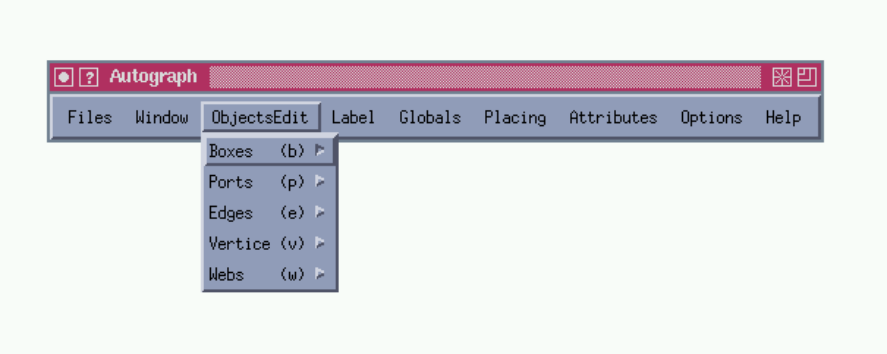

<!-- page: 1 -->

Software Tools for Technology Transfer Manuscript-Nr.
(will be inserted by hand later)

UPPAAL in a Nutshell Kim G. Larsen1, Paul Pettersson2, and Wang Yi2 Department of Computer Science and Mathematics, Aalborg University, Denmark. Email: kgl@cs.auc.dk Department of Computer Systems, Uppsala University, Sweden. Email: fpaupet,yig@docs.uu.se

## Abstract

This paper presents the overall structure, the design criteria, and the main features of the tool box Uppaal. It gives a detailed user guide which describes how to use the various tools of Uppaal version 2.02 to construct abstract models of a real-time system, to simulate its dynamical behavior, to specify and verify its safety and bounded liveness properties in terms of its model. In addition, the paper also provides a short review on case-studies where Uppaal is applied, as well as references to its theoretical foundation. 1 Introduction Uppaal is a tool box for modeling, simulation and veri - cation of real-time systems, based on constraint-solving and on-the-fly techniques, developed jointly by Uppsala University and Aalborg University. It is appropriate for systems that can be modeled as a collection of nondeterministic processes with nite control structure and real-valued clocks, communicating through channels and (or) shared variables [34, 26]. Typical application areas include real-time controllers and communication protocols in particular, those where timing aspects are critical. It is designed mainly to check invariant and reachability properties by exploring the state-space of a system, i.e. reachability analysis in terms of symbolic states represented by constraints. The two main design criteria for Uppaal have been efficiency and ease of usage. The restriction to reachability analysis has been crucial to the efficiency of the Uppaal model-checker. Another important key to efficiency is the application of on-the-fly searching technique combined with the symbolic technique that reduces verification problems to that of manipulating and solving simple constraints [34, 26]. To facilitate modeling and debugging, the Uppaal model-checker may automatically generate a diagnostic trace that explains why a property is (or is not) satisfied by a system description. The diagnostic traces generated by the model-checker may be graphically visualized using the simulator. Since its rst release in 1995, Uppaal has been applied in a number of case studies (see Section 6 for a summary). To meet requirements arising from the case studies, It has been extended with various features. The current version of Uppaal is implemented in C++, XForms and Motif. This paper is devoted to an informal presentation of Uppaal. We present the semantics model implemented in Uppaal, its various features, review and provide references on the theoretical foundation and applications to case-studies. We also provide a detailed user guide. The paper is organized as follows: Section 2 describes the overall structure and the main components of Uppaal. Section 3 is an informal presentation of the syntax and semantics of the Uppaal model. Section 3 presents the logic and the kernel of the model-checking algorithm of the Uppaal model-checker. Section 5 serves as a user guide, describing in details how to use the various tools of Uppaal. Section 7 concludes the paper with a brief description on recent and possible future development of Uppaal. 2 Overview of UPPAAL An overview of Uppaal is shown in Figure 1. In this section we briefly describe the main features of Uppaal. Uppaal consists of three main parts: a description language, a simulator and a model-checker. The description language is a non-deterministic guarded command language with data types1 . It serves as a modeling or design language to describe system behavior as networks of 1 Currently, only integer and operations are implemented. clock with restricted forms of

<!-- page: 2 -->

Kim G. Larsen et al.: UPPAAL in a Nutshell Autograph verifyta .atg .ta checkta atg2ta atg2hy

*Figure 1.*

HyTech graphical display forward analysis ‘‘no’’ graphic animator .q diagnostic trace random simulator execution trace Overview of Uppaal timed automata extended with data variables. The simulator and the model-checker are designed for interactive and automated analysis of system behavior by manipulating and solving constraints that represent the state{ space of a system description. They have a common basis, i.e. constraint-solvers. The simulator enables examination of possible dynamic executions of a system during early modeling (or design) stages and thus provides an inexpensive mean of fault detection prior to verification by the model-checker which covers the exhaustive dynamic behavior of the system.

### 2.1 Modeling

To facilitate modeling, Uppaal provides both graphical and textual formats for the description language. One can use either the textual format or the Autographbased graphical user interface [11] to de ne system descriptions, namely networks of timed automata. As an example, the textual representation of the graphical system description in Figure 3 is shown in Figure 2. The textual format (i.e. .ta) provides a basic programming language for timed automata. In certain cases, the textual format can be more convenient (and faster) to work with than the graphical interface. The compiler atg2ta automatically transforms system description in the graphical .atg-format into the textual .ta-format, thus supporting the important principle WYSIWYV2 . The Uppaal description language also supports modeling of simple linear hybrid automata, that is, timed automata with clocks whose rates may vary in a certain interval [31]. This extension of timed automata is useful for modeling of hybrid systems where the behavior of the system variables can be described or approximated using lower and upper bounds on their rates. Using abstraction techniques, this class of linear hybrid system can be transformed into timed automata and thus be veri ed 2 ‘‘yes’’ trace generator hs2ta simta constraint solvers What You See Is What You Verify. using the techniques available for timed automata, implemented in Uppaal. Uppaal allows linear hybrid automata where the rates of clocks are given by an interval. Philips Audio-Control Protocol of [10] is an example of such a linear hybrid systems.

### 2.2 Analysis

Model-Checking. The model-checker is designed to check for invariant and reachability properties, in particular whether certain combinations of control-nodes and constraints on clocks and integer variables are reachable from an initial con guration. Other properties such as bounded liveness properties can be checked by reasoning about the system in the context of testing automata or simply decorating the system description with debugging information and then checking reachability properties. Model-checking is performed by the module verifyta which takes as input a network of automata in the textualformat (i.e. .ta) and a formula. In checking a property, a diagnostic trace can be automatically reported by verifyta [25], that explains why the property is satisfied or not. Such a trace may be considered as diagnostic information of a system error, useful during the subsequent debugging of the system. Simulation. The simulator allows the user to examine in an interactive and graphical fashion the dynamic behavior of a system. In contrast to the model-checker which explores the whole reachable state-space of a system | examining all the behavior of the system, the simulator explores only a particular execution trace i.e. a sequence of states of the system. This will in early stages of modeling (or design) provide an inexpensive mean of fault detection. In comparison the model-checker is obviously more expensive as it amounts to an exhaustive simulation covering all behavior of the system. Another useful application of the simulator is to visualize a diagnostic trace generated by the model-checker; thus the user can in an interactive and graphical fashion examines the execution trace that may result in a system error.

<!-- page: 3 -->

Kim G. Larsen et al.: UPPAAL in a Nutshell // // Global declaration section // clock int chan x, y; n; a; // // Component description section // process A { state A0 { $y \le 6$ }, A1, A2, A3; init A0; trans A0 -> A1 { guard $y \ge 3$; sync a!; assign $y := 0$; }, A1 -> A2 { guard $y \ge 4$; }, A2 -> A3 { guard $n = 5$; }; } process B { state B0 { $x \le 4$ }, B1, B2, B3; commit B1; init B0; trans B0 -> B1 { guard $x \ge 2$; sync a?; assign $n := 5$,$x := 0$; }, B1 -> B2 { assign $n := n$+1; }, B2 -> B3 { }; } // // System description section // state automata extended with clock and data variables to describe processes and networks of such automata to describe real-time systems.

### 3.1 Syntax

The basis of the Uppaal model is the notion of timed automata [3] developed by Alur and Dill as an extension of classical nite-state automata with clock variables. To provide a more expressive model and to ease the modeling task, we further extend timed automata with more general types of data variables such as boolean and integer variables. Our nal goal is to develop a modeling (or design) language which is as close as possible to a high{ level real-time programming language with various data types. Clearly, this will create problems for decidability of model-checking. However, we can always require that the value domains of the data variables should be nite in order to guarantee the termination of a verification procedure (as in Mur' [17]). In the current implementation of Uppaal a system description (or model) consists of a collection of timed automata extended with integer variables in addition to clock variables. Consider the Uppaal model of Figure 3. The model consists of two components A and B with control nodes fA0 ; A1 ; A2 ; A3 g and fB0 ; B1 ; B2 ; B3 g respectively. In addition to these discrete control structures, the model uses two clocks x and y, one integer variable n and one channel a. The edges of the automata are decorated with three types of labels: a guard, expressing a condition on the values of clocks and integer variables that must be satisfied in order for the edge to be taken; a synchronization action which is performed when the edge is taken and nally a number of clock resets and assignments to integer variables. All three types of labels are optional. In addition, control nodes may be decorated with so{ called invariants, which are conditions expressing constraints on the clock values in order for control to remain in a particular node. system A, B;

*Figure 2.*

Textual description. 3 The Bolts of UPPAAL | Modelling In this section, we present the basic ingredienses of the Uppaal model based on small examples. For a precise semantical treatment we refer the reader to [5]. We assume that a typical real-time system is a network of non-deterministic sequential processes communicating with each other over channels. In Uppaal we use nite{ 3.1.1 Guards Guards express conditions on the values of clocks and integer variables that must be satisfied in order for the edge to be taken. In Figure 3 the edge between A0 and A1 can only be taken, when the value of the clock y is greater than or equal to 3. Similarly the edge between A2 and A3 can only be taken when the value of the integer variable n equals 5. Formally, guards are conjunctions of timing and data constraints; a timing constraint is of the form: x n or x y n, where n is a natural number

<!-- page: 4 -->

Kim G. Larsen et al.: UPPAAL in a Nutshell A A Config Config $y \ge 3$, $y \ge 3$, a!, a!, $y := 0$ $y := 0$ A0 A0 $y \le 6$ )) (( $y \le 6$ B B

*Figure 3.*

A1 A1 $n := 5$ $n := 5$ $x \ge 2$, $x \ge 2$, a?, a?, $x := 0$ $x := 0$ B0 B0 $x \le 4$ )) (( $x \le 4$ $n = 5$ $n = 5$ $y \ge 4$ $y \ge 4$ A2 A2 A3 A3 B2 B2 B3 B3 clock clock int int chan chan system system x, x, y; y; n; n; a; a; A, A, B; B; $n := n$+1 $n := n$+1 c:B1 c:B1 An example Uppaal model. and 2 f ; ; =; >; <g; a data constraint is of a similar form i j or i j k but with k being an arbitrary integer. The default guard of an edge is true. 3.1.4 Committed Locations To introduce the notion of committed locations in timed automata, consider the scenario shown in Figure 4: 3.1.2 Reset-Operations When taking an edge clock and data variables may be subject to simple manipulations in terms of resets being assignments of the form $w := e$, where w is a clock or data variable and e is an expression. In the current version of Uppaal reset-operations on clock variables must be of the simple form $x := n$, where n is a natural number, and reset-operations on integer variables should be in the form $i := c$ i + c0 , where c; c0 are integer constants (note that c; c0 may be zero or negative). As examples reconsider Figure 3. Here the clock y is reset to 0 when the edge between A0 and A1 is taken. Similarly the integer variable n is incremented when the edge from B1 to B2 is taken. 3.1.3 Channels, Synchronization and Urgency A Uppaal model consists of a network of (extended) timed automata. Automata may communicate either via integer variables (which in Uppaal are global) or using communication channels. As in CCS [30] communication on channels occur as two-process synchronizations. In Figure 3 the two processes may communicate via the channel a. To denote the actions that processes can perform when synchronizing with each other we use the notation a! and a? (denoting the complementary actions of sending and receiving on channel a). Absence of synchronization action indicates an internal (non-synchronizing) edge similar to {transitions in CCS. In Figure 3, the edge between A1 and A2 is an example of an internal edge of the process A. To prevent a network from delaying in a situation where two components are already able to synchronize, a channel may be declared as being urgent. For efficiency reasons edges labelled with synchronization actions on urgent channels may not have guards on clocks. S S R1 R1 S1 S1 R11 R11 R2 R2 R21 R21 m1! m1! m1? m1? c:S2 c:S2 m2? m2?

*Figure 4.*

R12 R12 R22 R22 Broadcasting Communication and Committed Locations. A sender S is to broadcast a message m to two receivers R1 and R2 . As this requires synchronization between three processes this can not directly be expressed in Uppaal where synchronization, as in CCS, is between two processes based on complementarity of actions. However, as an initial attempt we may model the broadcast as a sequence of two two-process synchronizations, where rst S synchronizes with R1 on m1 and then with R2 on m2 . However, this is not an accurate modeling as the intended atomicity of the broadcast is not preserved (i.e. other processes may interfere during the 'broadcast' sequence). To ensure atomicity, we mark the intermediate location S2 of the sender S as a so-called committed location (indicated by the c:-pre x). The atomicity of the action sequence m1 !m2 ! is now achieved by insisting that a committed location must be left immediately! This behavior is quite similar to what has been called \urgent transitions" [19, 15, 7] which insists that the next transition taken must be an action (and not a delay). The precise semantics of committed locations will be formalized in the transition rules for networks of timed automata with data variables in the following.

<!-- page: 5 -->

Kim G. Larsen et al.: UPPAAL in a Nutshell 3.1.5 Invariants To enforce progress in a system, control nodes may be decorated with so-called invariants, which express constraints on the clock values in order for control to remain in a particular node. The default of a location invariant is true. Thus, in Figure 3, control can only remain in A0 as long as the value of y is no more than 6.

### 3.2 Semantics

Formally, states of a Uppaal model are of the form (l; v), where l is a control vector indicating the current control node for each component of the network and v is an assignment given the current value for each clock and integer variable. A Uppaal model determines the following two types of transitions between states: Delay transitions As long as none of the invariants of the control nodes in the current state are violated time may progress without a ecting the control node vector and with all clock values incremented with the elapsed duration of time. In Figure 3, from the initial state ((A0 ; B0 ); $x = 0$; $y = 0$; $n = 0$) time may elapse 3:5 time units leading to the state ((A0 ; B0 ); $x = 3$:5; $y = 3$:5; $n = 0$). However, time cannot elapse 5 time units as this would violate the invariant of B0 . Action transitions If two complementary labelled edges of two di erent components are enabled in a state then they can synchronize. Thus in state ((A0 ; B0 ); $x = 3$:5; $y = 3$:5; $n = 0$) the two components can synchronize on a leading to the new state ((A1 ; B1 ); $x = 0$; $y = 0$; $n = 5$) (note that x; y; n have been appropriately updated). If a component has an internal edge enabled, the edge can be taken without any synchronization. Thus in state ((A1 ; B1 ); $x = 0$; $y = 0$; $n = 5$), the B-component can perform without synchronizing with A, leading to the state ((A1 ; B2 ); $x = 0$; $y = 0$; $n = 6$). The above two types of transitions may be overruled by presence of urgent channels and committed locations in the following ways: Urgent Channels In a state where two components may synchronize on an urgent channel no further delay is allowed. Thus, in Figure 3 if channel a is urgent3, time may not elapse 3:5 units from the initial state ((A0 ; B0 ); $x = 0$; $y = 0$; $n = 0$) as synchronization on a is already possible in the state ((A0 ; B0 ); $x = 3$; $y = 3$; $n = 0$). 3 Note, that strictly speaking, this would violate the syntactic restriction that the guard of edges labelled with urgent actions must be empty. Committed Locations If in a state one of the components is in a control node labelled as being committed, no delay is allowed to occur and any action transition (synchronization or not) must involve the particular component (the component is so-to-speak committed to continue). In the state ((A1 ; B1 ); $x = 0$; $y = 0$; $n = 5$) B1 is committed; thus without any delay the next transition must involve the B-component; i.e. the next state of the network is ((A1 ; B2 ); $x = 0$; $y = 0$; $n = 6$). Hence the two rst transitions of B are guaranteed to be performed atomically. 4 The Nuts of UPPAAL | Specifying The Uppaal model-checker is designed to check for simple invariant and reachability properties. A number of other properties, including bounded reachability properties, may be checked by reasoning about the system in the context of testing automata. We give an informal presentation of the Uppaal logic and an example use of testing automata in the next two sections. Hereafter, we give a short review of the model-checking technique used in Uppaal and point out some recent developed and implemented space-saving improvements.

### 4.1 UPPAAL Speci cations

In the current version, Uppaal is able to check for reachability properties, in particular whether certain combinations of control-nodes and constraints on clock and data variables are reachable from an initial con guration. The properties that can be analyzed are of the forms: ' ::= 82 j 93 ::= a j ^ 2j: Where a is an atomic formula being either an atomic clock (or data) constraint or a component location (Ai at l). Atomic clock (data) constraints are either integer bounds on individual clock (data) variables (e.g. 1 x 5) or integer bounds on di erences of two clock (data) variables (e.g. 3 x y 7). Intuitively, for 82 to be satisfied all reachable states must satisfy . Dually, for 93 to be satisfied some reachable state must satisfy . Formally let ; denote the transitive closure of the delay- and action-transition relations between states. Then the satisfaction relation $j= between$ states and formulas are de ned as follows: hl; vi $j= 93$ () 9hl0 ; v0 i:hl; vi ; hl0 ; v0 i ^ hl0 ; v0 i $j= hl$; vi $j= 82$ () 8hl0; v0 i:hl; vi ; hl0 ; v0 i ) hl0 ; v0 i $j= Satisfaction$ with respect to a boolean combination of atomic formulas is de ned inductively on the structure

<!-- page: 6 -->

Kim G. Larsen et al.: UPPAAL in a Nutshell $Passed := fg$ $Waiting := f$(l0 ; D0 )g $x := 0$ T $x \le t$ $x=t$ bad $x<t$ ’a’ add (l; D) to Passed $Succ := f$(ls ; Ds ) : (l; D) ; (ls ; Ds ) ^ Ds 6= ;g for all (ls ; Ds ) in Succ do put (ls ; Ds ) to Waiting T’

*Figure 5.*

repeat begin get (l; D) from Waiting if (l; D) $j= then$ return \YES" else if D 6 D for all (l; D ) 2 Passed then begin Test Automata for $Until<t$ a of (behaving as usual with respect to the boolean connectives). Satisfaction with respect to an atomic formula is given by the following de nitions: hl; vi $j= c$ () v 2 c hl; vi $j= Ai$ at l () $li = l$

### 4.2 Test Automata | Beyond Reachability

Our (simple and efficient) model-checking technique extends to the logic presented in [25], which also allows for bounded liveness properties to be speci ed. Currently, bounded liveness properties must be obtained by reachability analysis of the system in the context of testing (and time-sensitive) automata. Consider the following real-time $property = Until<t$ a stating that the (atomic) property a must hold before t time units and that must hold until then. Here we assume that a is of the form Ai at l. Now to verify that a system S satis es the formulae we extend it with the test automata T of Figure 5 as a component. Here T 0 is assumed to be an already constructed test automata for the sub-property , and 'a' is a (urgent) probe action inserting into the component Ai at location l. Now, it may be shown that our original system S will satisfy $Until<t$ a if and only if S j T satis es the invariance property 82:(T at bad). We conjecture that all bounded liveness properties of the logic in [25] can be translated into reachability problems in this manner, and in a forthcoming version of Uppaal we intend to provide automatic support for generation of test automata from logical formulas (as has been done end end until $Waiting=fg$ return \NO"

*Figure 6.*

An Algorithm for Symbolic Reachability Analysis. in the tool SPIN, where \never-claims" are directly generated from Linear Temporal Logic properties). For an initial investigation we refer the reader to [20].

### 4.3 Model Checking

The model-checking procedure implemented in Uppaal is based on an interpretation using a nite-state symbolic semantics of networks. More precisely, we interpret the logic with respect to symbolic states of the form (l; D), where D is a constraint system (i.e. a conjunction of atomic clock and data constraints) and l a controlvector. Thus, a symbolic state (l; D) represents all the states (l; v) where v satis es the constraint D. Based on this notion of symbolic state, the heart of the Uppaal model-checking procedure is the abstract reachability algorithm shown in Figure 64, which reduces the reachability problem to that of solving simple constraint systems. The algorithm is to check whether a timed automaton may reach a state satisfying a given state formula . We observe that several operations of the algorithm are critical for efficient implementations. First, the algorithm depends heavily on the test operations for checking the inclusion D D0 (i.e. the inclusion between constraints D and D0 ) and the emptiness of Ds in constructing the successor set Succ of (l; D). Clearly, it is important to design efficient data structures and algorithms for the representation and manipulation of clock constraints. One such well-known data structure is that of Di erence Bounded Matrices [4, 16, 33], Dbm, which o ers a canonical representation for constraint systems. It has been successfully employed by several real-time verification tools, e.g. Uppaal [8] and Kronos [15]. 4 The relation ; has been extended to symbolic states in the obvious fashion.

<!-- page: 7 -->

Kim G. Larsen et al.: UPPAAL in a Nutshell Piston Boxes eject Black Boxes remove Belt 0 18 red black Sensor Red Boxes Controller

*Figure 7.*

The Box-Sorter Unit. In the Uppaal-implementation the reachability algorithm of Figure 6 is extended so that a diagnostic trace is automatically generated as a side-e ect in case reachability is established. If the symbolic state-space is examined in a breadth- rst manner (corresponding to organizing the waiting set as a queue) the trace is guaranteed to be the shortest possible.

### 4.4 Optimizations

A Dbm representation is in fact a weighted directed graph where the vertices correspond to clocks (including a zeroclock) and the weights on the edges stand for the bounds on the di erences between pairs of clocks [4, 16, 33]. As it gives an explicit bound for the di erence between each pair of clocks, its space-usage is in the order of O(n2 ) where n is the number of clocks. However, in practice it often turns out that most of these bounds are redundant. In [27], we have presented a new compact data structure for Dbm, which provides minimal and canonical representations of clock constraints and also allows for efficient inclusion checks. The representation is obtained by a minimization of the weighted directed graph representing the constraint system, and our experimental results demonstrate truly signi cant space-savings as well as better time-performance. In addition to the local reduction technique above, which is to minimize the space-usage of each individual symbolic state, we have developed a global reduction technique to reduce the total number of symbolic states to save in the global data structure, i.e. the passed list. It is completely orthogonal to the local technique and is based on static analysis of the control structure of the system. Again our experimental results demonstrate signi cant space-savings and improved time-performance. Finally, it is possible to save the symbolic state-space generated during checking of a property and re-use it in the checking of other properties. In cases where several correctness properties have to be examined this leads to signi cant time-savings. 5 How to Use UPPAAL | a User Guide This section describes how to model, simulate and verify real-time systems using Uppaal. We will focus on the graphical interface and the graphical modeling language of Uppaal. However, it should be noticed that the tool also has a text-based interface and a textual representation of the modeling language. As a running example throughout this section we will use the box-sorting unit of [23]. Example 1 (The Box-Sorter Unit). The box-sorter shown in Figure 7 is made in LEGO5 . It sorts red and black boxes. The sorter is built around a belt that transports boxes in the unit, which consists of four components: a color-sensor, a piston, a controller, and an observer. A box starts at the leftmost extreme of the belt, represented by position 0. At some position from 9 to 18 its color is sensed by the color-sensor which is attached to the controller. The controller reacts if the color is red by sending an eject request to the piston, after a certain delay. The piston ejects within one time unit after the arrival of a request. When the piston is ejected it is guaranteed to remove the box if it is positioned in the interval 81 to 90. If the box is not removed (i.e. if the box is black), it proceeds to position 99, representing the rightmost extreme of the belt, where it falls o the belt. The observer is not participating in the sorting of boxes. Its only task is to observe that no red boxes appears on the rightmost extreme of the belt. As the observer is not 5 Information about LEGO can be found on World Wide Web at: http://www.lego.com/.

<!-- page: 8 -->

Kim G. Larsen et al.: UPPAAL in a Nutshell part of the sorting mechanism, we have not shown him in Figure 7 but he can be imagined to sit at the far right end. For simplicity we regard the system as being correct if the observer sees no red boxes (i.e. only black boxes) at the rightmost extreme of the belt. ut

### 5.1 XUPPAAL

XUppaal is to provide a user-friendly graphical interface to the tools in Uppaal. It o ers support to the user by managing the working le names, by providing an easy way to give optional setting, and to execute the various tools of the tool-box. The application is implemented in C and the Forms Library for X6 . In the following we give a short overview of the tool. The description continues in Section 5.4 which explains how to verify and generate diagnostic traces with XUppaal. A more detailed description of XUppaal can be found in [5]. 5.1.1 The Files During an XUppaal session the user works with three di erent kind of les: a system description, a requirement speci cation, and a trace le. The system description le contains the system description. It is assumed to be given in the textual format (called .ta) or on the graphical format (called .atg) used by Autograph and the simulator. Section 5.2 provides a guide for de nition of system descriptions using Autograph. Once the le have been created its syntax can be checked by invoking Syntax Check in the Run menu of XUppaal. The requirement speci cation le holds a set of formulae in a textual representation (called .q). The le can be created using a simple editor invoked in the Run (item Req. Spec. Editor) menu of XUppaal or using an external text editor. The trace le is used to store information about diagnostic traces generated by the veri er. A trace is a sequence of (symbolic) states and transitions, that represents an (symbolic) execution of the system. It is often useful for discovering why a property is (or is not) satisfied by a system description. The trace le can be input to the simulator which is able to display traces graphically (see Section 5.3). 6 Information about the Forms Library for X is available on World Wide Web: http://www.uwm.edu/~zhao and on anonymous ftp: ftp://bloch.phys.uwm.edu/pub/xforms.

*Figure 8.*

The Graphical Interface of XUppaal. 5.1.2 Getting Started XUppaal is activated from the command line with the command xuppaal. On startup, XUppaal shows the user with its main window as shown in Figure 8. The main window consists of four parts: the menu bar, the two input elds that displays the name of the currently speci ed system description le (labeled Model) and requirement speci cation le (labeled Req. Spec.), and the output browser (labeled Output). 5.1.3 The Menu Bar The menu bar has four sub-menus: Files, Options, Run and Help. Each sub-menu is invoked by clicking the menu label or using snap-keys. The snap-keys are given below enclosed in parenthesis (where C denotes the Ctrlbutton). The File menu (C-x) contains entries for selecting the les to work with, and for exiting XUppaal. The Help menu (C-h) provides online help on the six topics: General (C-g), Files (C-f), Options (C-o), Run (C-r), Problems (C-p) and Version (C-v). When an entry is selected, the help text is displayed in the output browser. The output

<!-- page: 9 -->

Kim G. Larsen et al.: UPPAAL in a Nutshell Syntax Check (C-c): Perform syntactical check on the textual format of the system description. Start the simulator with the speci ed system description le. Req. Spec. Editor (C-e): Open the requirement speci cation editor shown in Figure 9. Verification (C-v): Check if the system description satis es the requirement speci cation by model-checking. Show Model (C-f): Display the system description in textual representation7 . Show Req. Spec. (C-r): Show the contents of the requirement speci cation le. Clear Output (C-o): Clear the output browser (i.e. erase the contents of the browser). Example 2 (Specifying the File Names). As a preliminary step when working with the box-sorter example we de ne the le names for XUppaal to work with. We do this by typing in the system description le name \boxes.atg" in the eld labeled System and the requirement speci cation le name \boxes.q" in the eld labeled Req. Spec. The trace le is speci ed by selecting Set Trace File from the Files menu. We use the le name boxes.tr. The resulting XUppaal input elds are shown in Figure 8. ut Simulation (C-s):

*Figure 9.*

The Requirement Speci cation Editor. generated by selecting the menu item Version is shown on the rst seven lines of text in the browser in Figure 8. We proceed by giving a more detailed description of the two sub-menus: Options and Run. The Options Menu (C-o) provides a list of choices that mainly a ect the verification session. Each entry in the menu can be toggled on or o (which is visualized in the menu by a lled or empty check-box to the left of each menu item): Auto Check Syntax (C-a): Automatically perform syn- tax check before simulation and verification sessions. Diagnostic Info (C-i): Generate diagnostic traces in textual format and present the result in the output browser. Diagnostic File (C-f): Produce diagnostic traces on the speci ed trace le. Breadth-First (C-b): Explore the state-space of the system by breadth- rst search7. Depth-First (C-d): Explore the state-space of the system by depth- rst search. Local Reduction (C-l): Use compact data-structures to represent constraints (instead of Dbm, see Section 4.4). Global Reduction (C-s): Perform Control Structure Analysis (see Section 4.4). Re-use State-Space (C-r): Re-use the generated portion of the state-space when verifying several reachability properties (see Section 4.4). 5.2 How to Model Uppaal allows for systems descriptions to be de ned textually or by drawing using Autograph. In this section we describe how to de ne a system using Autograph. For a description of the textual representation of systems used in Uppaal we refer the reader to [5].

#### 5.2.1 Systems Descriptions in Autograph

Autograph is a graphical tool for drawing automatabased system descriptions. It is very general though it was developed for the Fc2tools set [11]. This section will explain the subset of features of Autograph, that are needed to de ne Uppaal system descriptions. To de ne network of timed automata in Autograph it is necessary to de ne a mapping from the elements of timed automata to graphical objects in Autograph. Here we summarize the mapping of the components that a The Run Menu (C-c) contains commands that are as- system description should consist of. sociated with the various tool programs of Uppaal. The A location is denoted by a vertex labeled with its name outputs produced by the programs are always displayed (required) and its invariant (which is optional). By in the output browser. default, the invariant is true. A transition is denoted by an edge connecting two verAutograph (C-a): Start the graphical editor Autograph. tices. The transition may be labeled with a guard 7 This option generates a shortest diagnostic trace when used in which is true by default, a synchronization action combination with one of the two trace options above. (which is by default), and a list of assignments.

<!-- page: 10 -->

*Figure 10.*

Kim G. Larsen et al.: UPPAAL in a Nutshell The menu bar with the ObjectEdit menu selected. A timed automaton is denoted by a box containing the locations and transitions of the automaton with the initial location being denoted by an initial vertex. The box should be labeled with the name of the automaton. A declaration for the variables, clocks and channels, both normal and urgent, used in the network of timed automata are placed in a box which must be labelled with Config. A network of timed automata is represented by a set of set of automata boxes and the Config box. If a graph is created according to these de nitions and to the small set of rules that will be introduced in the remainder of this section, it can be used directly in the Uppaal toolkit. 5.2.2 Getting Started Autograph can be activated from the Run menu of XUppaal. On startup the program displays a menu bar which is depicted in Figure 10 with the ObjectsEdit menu selected. All menus mentioned in the remainder of this section are parts of this menu bar. Note that all items inside a menu bar, can also be selected by a snap-key given below in parenthesis, and a selection will be active until another selection is made. To get started it is necessary to open a window to draw in. This is done by selecting Create from the Window menu. It is possible to resize and reposition the window. 5.2.3 Creating Locations Locations of a timed automata are created by choosing Create (v) from the Vertice sub-menu in the ObjectsEdit menu. To instantiate a location just nd the wanted position and click the left mouse button to place it. If the vertex is supposed to model an initial location, select Initial (i) from the Vertice sub-menu of the ObjectsEdit menu and click at the chosen vertex. To create the name and the invariant of the location, a label must be attached to the vertex. The actual creation of labels will be described in the next section. There is a set of rules concerning location labels that must be followed to avoid errors when using the drawing in Uppaal: { Every location must have a name associated. { All names are speci ed by the regular expression [azA-Z][a-zA-Z0-9 ]*. If the location is committed, its name must be pre xed with C: or c:. { Location names are local to a process and can be reused in other processes. { An invariant is a conjunction of inequalities. It is written as a list of inequalities separated by commas and surrounded by a pair of parentheses, e.g. ( $clock1 \le 42$, $clock2 \le 117$ ). { The invariant can be put either on the same line as the location name or on a line for itself. 5.2.4 Creating Labels In Autograph there are four kinds of labels: Struct, Behav, Logic and Hook. The di erent kinds of labels may have di erent meanings depending on the kind of component they are attached to. In Uppaal the notion of di erent labels has been avoided as much as possible. Therefore, the default label (automatically selected by Autograph) is always used for components with only one label. To label a component with its default label select Create/Edit Default (a) from the Label menu, then click on the component to label. This opens an editor window for typing in text for the label. The only component type with more than one label is the Con g box described in Section 5.2.8.

<!-- page: 11 -->

Kim G. Larsen et al.: UPPAAL in a Nutshell

*Figure 11.*

Locations and transitions of the piston. Labels can be re-edited by selecting Reedit (R) from the menu. After the label has been clicked an editor for editing (the four kinds of) labels will appear.

*Figure 12.*

An automaton de ning the piston of the box-sorter unit. A model of the piston is shown in Figure 11. The two locations idle and wait are used to model the two operational modes of the piston. Initially the piston is idle. The piston will enter location wait when the signal eject is received. In location wait the piston is ready to remove a box (by synchronizing on remove) for 1 time unit af5.2.5 Creating Edges ter which the piston will return to the location idle. The clock variable y is used to model the timing behavior of The next step in de ning a network of automata is to the piston. ut connect locations with transitions, denoted by edges. Edges can only be drawn between two vertices belonging to the same automaton. The start and end vertices can be the same. 5.2.6 Creating Automata To create an edge, rst select Create (e) from the Edges sub-menu under ObjectsEdit and then select the start and end vertex. One can create curved edges. The sim- An automaton is represented by a box containing its loplest way is to drag the mouse from the start of the edge cations and transitions. Boxes are created by choosing Create (b) from the Boxes sub-menu in the ObjectsEdit to a point and then continue to the end of the edge. menu. The box is drawn by picking the position of its The optionals that can belong to a transition are put in a upper left corner and dragging the mouse until the box label attached to the edge. An edge can have more than has the wanted size (i.e. the position of the lower right one set of labels; whereas all other components can only corner). have one. Every automaton must be labeled with a name that is As for location labels, there is a set of rules for transition written according to the regular expression [a-zA-Z][alabels: zA-Z0-9 ]*. { If a transition is synchronizing, its label should have Example 4. We now nish the piston automaton by adding a line containing the name of the channel it is syn- a bounding box around its locations and transitions. We chronizing on. name the automaton Piston by adding a label to the box. { Guards are written as lists of comma-separated con- The resulting automaton is shown in Figure 12. straints. { Assignments are written as lists of comma-separated To create an automaton, one can also start with drawing assignments on the form: <name> := <expression>, the box and then the vertices, edges etc. ut where expressions follow the syntax de ned in Section 3. 5.2.7 Creating a Network of Automata Example 3. To start modeling the box-sorter unit we draw the locations and the transitions of the piston automaton. The piston waits for the controller to send an A network of automata is denoted by a collection of automata boxes representing the component automata and eject-signal. It then ejects within one second, possibly a distinct box, labeled with Con g, for declarations. resulting the removal of a box from the belt. Label

<!-- page: 12 -->

Kim G. Larsen et al.: UPPAAL in a Nutshell

*Figure 13.*

The complete system description of the box sorter unit. 5.2.8 Creating Declarations Declarations of objects in the network, i.e. variables, clocks and channels are placed in the Con g box. In addition, comments for documentation can be put in this box. Declarations should be created according to the following rules. { Declarations are written as lists of comma-separated { { { { { { object names preceded by the type of the entities declared and ended with a semi-colon. The type of a variable declaration is int. The type of a clock declaration is clock. The type of a declaration of normal channels is chan and for urgent channels it is urgent chan. There can be zero or more declarations of each type. Names of objects are speci ed by the regular expression [a-zA-Z][a-zA-Z0-9 ]*. Comments are prepended with //. Except for this, there are no rules concerning the syntax of comments. In addition to the object declarations the Con g box also holds the de nition of which automata the system consists of. This de nition is written using the same syntax as above with the type of the declaration being system. Only the automata mentioned in the system de nition are considered when the system is veri ed or simulated. There must be exactly one system de nition. There are also some rules concerning the Con g box and other boxes with comments: { There must be exactly one Con g box. { The Con g box cannot contain any components. It is only allowed to have a label attached. { Other boxes than the components and Con g box are ignored by Uppaal. Example 5. The complete system description of the boxsorter unit is shown in Figure 13. It consists of four automata: Piston, Controller, Box, and Observer. In this example we describe the two automata Box and Controller. The Piston automaton was described in Example 4 and the Observer will be described in Example 6. The Box automaton models the behavior of a box. It uses the integer variable color to represent the color of the box (where 1 is black and 2 is red) and the clock variable pos to represent its position on the belt. In the initial location idle is the box not yet placed on the belt (even if pos 0). On the outgoing transitions from idle to movea the box is put on the belt and assigned a color. The two locations sayblack and sayred model the behavior of a box when it passes the color-sensor. It o ers the signals black1! or red1! to the sensor until position 18 is reached, where it enters location moveb. The location atpiston models the situation when the box passes the piston, therefore the box o ers synchronization on the channel remove to model the possibility of getting removed. If not removed, the box proceeds to location saycolor where it returns to its initial location by synchronizing on channel black2 or red2, which are synchronized with the observer. The Controller automaton models the controller and its integrated color-sensor. It stays in its initial location idle

<!-- page: 13 -->

Kim G. Larsen et al.: UPPAAL in a Nutshell

*Figure 14.*

A System window. as long as only black boxes appear, modeled by a black1synchronizing self-loop. When a red box appears, it delays for 63 time units in location wait and there after requests a reject from the piston by synchronization on the eject-channel as soon as possible. To model that the color-sensor and the piston react immediately on input, the four channels black1, red1, eject, and remove are declared as urgent. ut 5.2.9 Saving the System Description File To save a le, select either Save atg (s) or Save atg as (S) from the Files menu and click on the drawing to be saved. This leads to the opening of a le selector window, where the path and name of the le can be entered. When ready press the OK button. The saved .atg les can then be used in Uppaal.

### 5.3 How to Simulate

The symbolic simulator enables the user to simulate and debug the dynamical executions of a network of timed automata given its statical structure i.e. a system description. This section provides a guide for the interface of the simulator and show how to use it. 5.3.1 Getting Started The simulator can be activated from the Run menu in XUppaal. The system description le (an .atg- le) speci ed in the Model eld of XUppaal will be loaded into the simulator on startup. The graphical interface to the simulator consists of two windows: the System window to show the system description to simulate, and the Main window to control the simulator. The interface uses the standard X notions for mouse and keyboard control meaning that e.g. double-clicking the mouse and using tab-key to switch between groups in windows can be used. 5.3.2 The System Window The System window holds the Autograph drawing of the system being simulated. Figure 14 shows an example of a System window containing the de nition of the box sorter unit. During a simulation, the current location vector and one of the currently available transitions are depicted in the window. For the location vector this is accomplished by marking the current location of each of the automata, e.g. in the gure, Box is in location idle. A possible transition is depicted as a highlighted arrow going from the source location of the transition to its destination. If the transition is a synchronization, an arrow will be shown

<!-- page: 14 -->

Kim G. Larsen et al.: UPPAAL in a Nutshell Run: Open the Run window which is used for controlling the automatic mode, where the simulator itself randomly selects transitions. Reset: Set the automata in the system to their initial locations and clears the trace. Show Regions: Open the Regions window showing the regions valid for the current con guration of the simulated system. Exit: Exit the simulator. + (plus): Open the lower half of the Simulate Main window, which displays the trace generated so far. In the list of possible steps, the elements are written in one of the forms listed below. The rst is used if the transition of the step is a synchronization between two processes and the second is used if the transition is nonsynchronizing. It is possible to take a step directly from the list by double-clicking it.

*Figure 15.*

The Main window. for each of the two synchronizing transitions, otherwise only one. In the gure a transition from idle to movea in Box is shown. It is not possible to manipulate the contents of the System window directly as its only purpose is to display the structure of the current system and to show how simulations progress. All changes to the System window are performed indirectly through the Main window described below. 5.3.3 The Main Window The simulator is controlled from the Main window which is split up into two parts: one containing the basic simulation control, and the other containing the more advanced control mechanisms concerned with traces. Figure 15 shows the Main window with the trace so far and the possible step for the system depicted in Figure 14. The upper part of the window has six buttons and a eld holding a list of steps possible in the current state of the system. The lower part also has six buttons and a eld containing the trace of the current simulation. When the simulator is activated only the upper half of this window is opened. The upper six buttons are used for controlling the most basic functionality of the simulator. The semantics of the buttons is as follows: Take Step: Take the step selected in the list of possible steps. A step is selected if it is highlighted in the list. { { <channel> (<sender> -> <receiver>) tau (<process>) A trace is a list whose elements alternate between location vectors and transitions. Location vectors are simply written as a list of location names where the names are ordered the same way as the list of automata given in the header of the lower half of the Simulate Main window. The order of the automata in the Simulate Main window shown in Figure 15 is: Controller, Piston, Box and Observer. Transitions are written in the same form as the possible steps. Selecting an element in the trace changes the System window so that instead of re ecting the current state of the system it will show the selected transition or location. The six buttons in the lower part of the Main window are all used for controlling the trace functionality. Their semantics is given in the following: - (minus): Close this half of the window. Previous: Highlight the element immediately preceding the current selection in the trace. If no element is selected, nothing happens. Next: Highlight the element immediately following the current selection in the trace. If no element is selected, nothing happens. Restart: Restart the simulation from the current selection in the trace. Load: Open a le selector window for loading a trace. Save: Open a le selector window for saving the current trace. 5.3.4 The Run Window Instead of creating traces manually, by taking one step at a time, it is possible to let the simulator proceed automatically by randomly selecting enabled steps and show

<!-- page: 15 -->

Kim G. Larsen et al.: UPPAAL in a Nutshell in the right where the adjusted counterparts of the two above mentioned types of regions are displayed.

### 5.4 How to Verify

*Figure 16.*

The Run window. The verification of a system description w.r.t. its requirement speci cation is conducted entirely from the XUppaal window. It is often the case that the verification will not succeed immediately even if the system has been carefully validated in the simulator. More likely, a number of problems, usually in the system description, will have to be resolved before the verification nally succeeds. In this section we describe how XUppaal supports the work by allowing diagnostic traces, generated by the verification procedure, to be loaded and graphically displayed in the simulator. We begin by describing how to verify in Uppaal, using XUppaal. the progress of the simulation in the System window. This can be done from the Run window as shown in Figure 16. The window shows two text input elds, Number Of Steps and Speed, plus three buttons. The eld Number Of Steps decides how many steps the simulator should take when generating the random trace and the Speed eld decides how fast the screen should be updated during the run, with 1 being the highest speed. The meaning of the three buttons is as follow: Close: Stop the run if it is currently executing, and close the Run window. Stop: Stop the run. If the simulator is not running, nothing happens. 5.4.1 Veri cation Go: Start or restart the execution of a run. 5.3.5 The Regions Window In doing a simulation the user can watch the changes of the regions in the Regions window. Figure 17 shows the Regions window corresponding to the system state and transition selection of Figures 14 and 15. The window is split up into four parts each holding one particular kind of region. The regions are represented as sets of equations and inequalities on the variables, clocks and di erences between clocks in the system. Inequalities are written as intervals that the clock or clock di erence must be in (see the gure). The upper left quarter of the Regions window shows the state entry region. It is the region valid immediately after the last step, i.e. the step that took the system to the current state. The lower left quarter holds the transition exit region. For any of the possible steps that can take the system out of the current state, the transition exit region is the region where the system is able to take that particular step. The next state entry region will then be the same as the transition exit region of the possible step which is taken next, except that it has been updated by the assignments of the transition. The constraints of the latest step taken can put additional constraints on the regions for previous steps. This is not taken into account in the calculations of the regions in the left half of the window, but it is considered To verify with XUppaal is very simple. When the le names have been speci ed, the next step is to select the optional settings that a ect the verification method, and then it is ready for the start of a verification session. The menu of verification options has been described in Section 5.1.3. The veri er (called verifyta) is activated by clicking Verification in the Run menu. XUppaal then rst transforms the options, selected in the Options menu, to a list of ags to be accepted by the veri er. It then proceeds by compiling the graphical system description to its textual format. Finally, it spawns a child process running the veri er with the required parameters, i.e.: the list of ags, the system description le, the requirement speci cation and (optionally) the speci ed trace le. All output8 produced in the child process is displayed in the output browser of XUppaal. In particular, answers to whether each property of the requirement speci cation is satisfied or not are displayed. Each answer is numbered in order of appearance in the requirement speci cation le and with line numbers in parenthesis (see Figure 8). If an answer line is double-clicked in the output browser of XUppaal, the requirement speci cation editor (if open) will display the corresponding line of the requirement speci cation le in its output browser (labeled Req. Spec. File). This is useful when working with large speci cations. 8 The output which normally appears on standard output and standard error (i.e. stdout and stderr).

<!-- page: 16 -->

*Figure 17.*

Kim G. Larsen et al.: UPPAAL in a Nutshell The Regions window. Example 6 (Verifying the Box-Sorter). Now we show how to verify the correctness of the box-sorter unit. Since the sorter is considered correct if the observer sees no red boxes, we formalize the correctness in terms of reachable locations of the observer. We begin by describing the automaton Observer which models the observer. The Observer automaton, which can be found in Figure 13, has two locations: happy and sad. It is initially in location happy and stays there as long as it sees only black boxes at the rightmost extreme of the belt. If a red box appears, it enters the location sad where it stays forever. To prove the box-sorter correct, it suffices to show that it is impossible for the observer to reach location sad, i.e. 82: Observer:sad. We phrase the property in the Uppaal syntax, A[]not Observer.sad, and put the resulting formula in the requirement speci cation le, named boxes.q. This can be done using the requirement speci cation editor which is activated in the Run menu of XUppaal. Finally, we start the actual verification (Verification in the Run menu). The veri er outputs the text lines 13 and 14 in the output browser of Figure 8, telling that the property is not satisfied. ut 5.4.2 Visualizing Diagnostic Traces The simulator generates traces and allows for traces to be displayed, reexamined, replayed and reset from any intermediate point. Traces may also be reused using the save and load facilities. In particular, diagnostic traces generated by the veri er may be loaded for examination. To use this facility, the rst step is to specify the trace le name (see Section 5.1.1), and then instruct the veri er to generate traces on le. This is done by selecting item Diagnostic File in the Options menu of XUppaal. As a result, all succeeding verifications will output traces in the speci ed le until the Diagnostic File option is toggled o . It should be noticed that it is possible to generate a shortest diagnostic trace, simply by instructing the veri er to explore the state space by breath- rst search. When the verification is nished, the trace le is loaded in the simulator by clicking the Load button in the Main window of the simulator (see Section 5.3.3). Example 7 (Correcting the Box-Sorter). To nd out why the requirement speci cation is not satisfied by the system description we generate a diagnostic trace. As an exercise, we rst produce a textual representation of a shortest diagnostic trace. To do so, we rst select the options Diagnostic Info and Breadth-First in the Options menu and then initiate a new verification. The resulting trace is shown in Figure 189. We can also try to debug graphically using the simulator. Recall that we have speci ed the trace le name in Example 2. A trace will be produced in that le if we select the option Diagnostic File and then verify the system again. Next, we load the trace into the simulator using button Load in the main window of the simulator. 9 Normally, the trace would have been displayed in the output browser of XUppaal.

<!-- page: 17 -->

Kim G. Larsen et al.: UPPAAL in a Nutshell (Controller.idle Piston.idle Box.idle Observer.happy ) { $x=0$ $y=0$ $pos=0$ $color=0$ } (Controller.idle Piston.wait Box.moveb Observer.happy ) { $x=63$ $y=0$ $pos=72$ $color=2$ } (Controller.idle Piston.idle Box.movea Observer.happy ) { $x=0$ $y=0$ $pos=0$ $color=2$ } delay(1) delay(9) (Controller.idle Piston.wait Box.moveb Observer.happy ) {$x=64$ $y=1$ $pos=73$ $color=2$ } (Controller.idle Piston.idle Box.movea Observer.happy ) {$x=9$ $y=9$ $pos=9$ $color=2$ } (Controller.idle Piston.idle Box.moveb Observer.happy ) { $x=64$ $y=1$ $pos=73$ $color=2$ } (Controller.idle Piston.idle Box.sayred Observer.happy ) { $x=9$ $y=9$ $pos=9$ $color=2$ } delay(8) Urgent sync: red1 (Controller.idle Piston.idle Box.moveb Observer.happy ) {$x=72$ $y=9$ $pos=81$ $color=2$ } (Controller.wait Piston.idle Box.moveb Observer.happy ) { $x=0$ $y=9$ $pos=9$ $color=2$ } (Controller.idle Piston.idle Box.atpiston Observer.happy ) { $x=72$ $y=9$ $pos=81$ $color=2$ } delay(63) delay(9) (Controller.wait Piston.idle Box.moveb Observer.happy ) {$x=63$ $y=72$ $pos=72$ $color=2$ } (Controller.idle Piston.idle Box.atpiston Observer.happy ) {$x=81$ $y=18$ $pos=90$ $color=2$ } (Controller.go Piston.idle Box.moveb Observer.happy ) { $x=63$ $y=72$ $pos=72$ $color=2$ } (Controller.idle Piston.idle Box.saycolor Observer.happy ) { $x=81$ $y=18$ $pos=90$ $color=2$ } Urgent sync: eject Sync: red2 (Controller.idle Piston.idle Box.idle Observer.sad ) { $x=81$ $y=18$ $pos=90$ $color=2$ }

*Figure 18.*

A diagnostic trace. The windows of the simulator now look exactly like in Figure 14, Figure 15 and Figure 17. It can be deduced that there is an error in the Controller automaton. After the controller has sensed a red box, it will miss the box if it waits too short time before ejecting the piston. If it waits another 9 time units before the eject signal is sent, the piston will hit the box. The error can be corrected simply by modifying the time bound from 63 to 72 in the invariant and the guard on the edge outgoing from location wait in the Controller. It can be veri ed that the modi ed system is correct. ut 6 Case Studies Uppaal has been applied in a number of (industrial) case-studies. In this section we briefly review some of them. Audio/Video Protocol: This is an audio control protocol highly dependent on real-time. The protocol is developed by Bang & Olufsen, to transmit messages between audio/video components over a single bus, and further studied in [1]. Though it was known to be faulty, the error was not found using conventional testing methods. Using Uppaal, an error-trace is automatically produced, which reviled the error. Furthermore, a correction is suggested and automatically proved using Uppaal. Bounded Retransmission Protocol: The protocol is proposed and studied at COST 247, International Workshop on Applied Formal Methods in System Design. It is based on the alternating bit protocol over a lossy communication channel, but allows for a bounded number of retransmissions. In [13, 14], it is reported that a number of properties of the protocol is automatically checked with Uppaal. In particular, it is shown that the correctness of the protocol is dependent on correctly chosen time-out values. Collision Avoidance Protocol: The protocol in [20] is implemented on top of an Ethernet-like medium such as the CSMA/CD protocol. It is to ensure an upper bound on the communication delay between the network nodes. It was designed and proved correct using Uppaal. The two main properties established show that the protocol is collision-free, and it does ensure an upper bound on the user-to-user communication delay (assuming a perfect medium). Gear-Box Controller: In this industrial case-study, Uppaal is applied to the design and analysis of a prototype gear-box controller for vehicles by Mecel AB10 [28]. The gear-box controller is a component in the real-time distributed system that controls a modern car. The gear-requests from the driver are delivered via the man/machine interface over a communication network to the gear-box controller. The controller im10 Mecel AB is a Swedish company developing control systems for vehicle industries.

<!-- page: 18 -->

Kim G. Larsen et al.: UPPAAL in a Nutshell plements the actual gear change by actuating the lower level components of the system (such as the clutch, the engine and the gear-box). In the design of the controller, the symbolic simulator of Uppaal is applied to validate the system behavior. The correctness of the gear-box controller design is established by automatic proofs of 46 properties derived from requirements speci ed by Mecel AB. Philips Audio Protocol: The protocol is developed and implemented by Philips to exchange control information between components in audio equipment using Manchester encoding. The correctness of the encoding relies on timing delays between signals. It is rstly studied and manually veri ed in [10]. In [25] the protocol is modeled and veri ed using Uppaal. Philips Audio Protocol with Bus Collision: This is an extended variant of Philips audio control protocol with bus collision detection. It is signi cantly larger than the version above since several new components (and variables) are introduced, and existing components are modi ed to deal with bus collisions. Its correctness is originally proved by hand in [18], and by modelchecking for the rst time using Uppaal in [6]. Mutual Exclusion Protocol: The so-called Fischers protocol has been studied previously in many experiments, e.g. [2, 32]. The protocol is to ensure mutual exclusion among several processes competing for a critical section using timing constraints and a shared variable. Di erent versions of the protocol have been veri ed using Uppaal, c.f. [34, 24, 22]. TDMA Protocol Start-Up Mechanism: In [29], a formal verification of the start-up algorithm of a TDMA (Time Division Multiple Access) protocol is reported. It was proved using Uppaal that an ensemble of three communicating stations becomes synchronized and operational within a bounded time from an arbitrary initial state, given a clock-drift corresponding to 10 3. Furthermore, an upper time-bound for the start-up to complete was derived. 7 Conclusions In this paper, we have presented the overall structure, the design criteria, and the main features of Uppaal. It is intended to be an informal but reasonably \complete" description of the syntax and semantics of the Uppaal modelling and speci cation languages as well as the kernel of its model-checking algorithm. It contains neither de nitions nor theorems, but mainly examples. The intended readers are engineers working with development and analysis of embedded systems in particular, real-time protocols and controllers. A user guide is given, which describes in details how to use the various tools of Uppaal to construct abstract models of a system, to simulate its dynamical behavior, to specify and verify its safety and bounded liveness properties in terms of its model. In addition, we also provide a short review on case-studies where Uppaal is applied, as well as references to its theoretical foundation. However the document is by no means complete as Uppaal is still under development. In fact, during the time when this paper is written, a new version of Uppaal has been implemented, which is currently under internal test and evaluation. Future versions of Uppaal will extend the current description language with data types such as arrays, records, lists etc. as well as various primitive operations on data types. In the near future, a new graphical interface will be available, which provides graphical supports for not only system descriptions at process level as the current version does but also hierarchical design and modularization. But that is all for now. Acknowledgements. The authors wish to thank the people involved in the development of Uppaal, including: Johan Bengtsson, Palle Christensen, Jesper Jensen, Per Jensen, K are Kristo ersen, Fredrik Larsson, and Thomas S rensen. References 1. Formal Modeling and Analysis of an Audio/Video Protocol: An Industrial Case Study Using Uppaal, 1997. 2. Martin Abadi and Leslie Lamport. An Old-Fashioned Recipe for Real Time. In Proc. of REX Workshop \RealTime: Theory in Practice", volume 600 of Lecture Notes in Computer Science, 1993. 3. R. Alur and D. Dill. Automata for Modelling Real-Time Systems. Theoretical Computer Science, 126(2):183{236, April 1994. 4. Richard Bellman. Dynamic Programming. Princeton University Press, 1957. 5. Johan Bengtsson, Palle Christensen, Per Jensen, Kim G. Larsen, Fredrik Larsson, Paul Pettersson, Thomas S rensen, and Wang Yi. Uppaal: a Tool Suite for Validation and Veri cation of RealTime Systems. http://www.docs.uu.se/rtmv/uppaal/uppaal-guide.ps.gz, 1996. 6. Johan Bengtsson, David Griffioen, K are Kristo ersen, Kim G. Larsen, Fredrik Larsson, Paul Pettersson, and Wang Yi. Veri cation of an Audio Protocol with Bus Collision Using Uppaal. In Rajeev Alur and Thomas A. Henzinger, editors, Proc. of 8th Int. Conf. on Computer Aided Veri cation, number 1102 in Lecture Notes in Computer Science, pages 244{256. Springer-Verlag, July 1996. 7. Johan Bengtsson, Kim G. Larsen, Fredrik Larsson, Paul Pettersson, and Wang Yi. Uppaal | a Tool Suite for Automatic Veri cation of Real-Time Systems. In Proc. of Workshop on Veri cation and Control of Hybrid Systems III, volume 1066 of Lecture Notes in Computer Science, pages 232{243. Springer-Verlag, October 1995. 8. Johan Bengtsson, Kim G. Larsen, Fredrik Larsson, Paul Pettersson, and Wang Yi. Uppaal in 1995. In Proc. of the 2nd Workshop on Tools and Algorithms for the Construction and Analysis of Systems, number 1055 in Lecture

<!-- page: 19 -->

Kim G. Larsen et al.: UPPAAL in a Nutshell 9. 10. 11. 12. 13. 14. 15. 16. 17. 18. 19. 20. 21. 22. Notes in Computer Science, pages 431{434. Springer{ Verlag, Mars 1996. Johan Bengtsson and Fredrik Larsson. Uppaal a Tool for Automatic Veri cation of Real-time Systems. Master's thesis, Uppsala University, 1996. D. Bosscher, I. Polak, and F. Vaandrager. Veri cation of an Audio-Control Protocol. In Proc. of Formal Techniques in Real-Time and Fault-Tolerant Systems, volume 863 of Lecture Notes in Computer Science, 1994. Amar Bouali, Annie Ressouche, Val erie Roy, and Robert de Simone. The fc2tools set. In Rajeev Alur and Thomas A. Henzinger, editors, Proc. of 8th Int. Conf. on Computer Aided Veri cation, number 1102 in Lecture Notes in Computer Science, pages 441{445. Springer{ Verlag, 1996. Palle Christensen and Thomas Mark S rensen. void. Master's thesis, Aalborg University, 1997. P.R. D'Argenio, J.-P., Katoen, T. Ruys, and J. Tretmans. Modeling and Verifying a Bounded Retransmission Protocol. In Proc. of COST 247, International Workshop on Applied Formal Methods in System Design, 1996. Also available as Technical Report CTIT 96-22, University of Twente, July 1996. P.R. D'Argenio, J.-P. Katoen, T.C. Ruys, and J. Tretmans. The bounded retransmission protocol must be on time! In Proc. of the 3rd Workshop on Tools and Algorithms for the Construction and Analysis of Systems, number 1217 in Lecture Notes in Computer Science, pages 416{431. Springer-Verlag, April 1997. C. Daws and S. Yovine. Two examples of verification of multirate timed automata with Kronos. In Proc. of the 16th IEEE Real-Time Systems Symposium, pages 66{75, December 1995. David Dill. Timing assumptions and verification of nitestate concurrent systems. In J. Sifakis, editor, Proc. of Automatic Veri cation Methods for Finite State Systems, number 407 in Lecture Notes in Computer Science, pages 197{212. Springer-Verlag, 1989. David Dill. The Mur' Veri cation System. In Rajeev Alur and Thomas A. Henzinger, editors, Proc. of 8th Int. Conf. on Computer Aided Veri cation, number 1102 in Lecture Notes in Computer Science, pages 390{393. Springer-Verlag, 1996. W.O.D. Griffioen. Analysis of an Audio Control Protocol with Bus Collision. Master's thesis, University of Amsterdam, Programming Research Group, 1994. Thomas A. Henzinger, Pei-Hsin Ho, and Howard WongToi. HyTech: The Next Generation. In Proc. of the 16th IEEE Real-Time Systems Symposium, pages 56{65, December 1995. H.E. Jensen, K.G. Larsen, and A. Skou. Modelling and Analysis of a Collision Avoidance Protocol Using SPIN and Uppaal. In Proc. of 2nd International Workshop on the SPIN Veri cation System, pages 1{20, August 1996. Jesper Gravgaard Jensen and Per Sto er Jensen. Design and Implementation of NewPaal | a modelling language for real-time systems. Master's thesis, Aalborg University, 1997. K are J. Kristo ersen, Francois Larroussinie, Kim G. Larsen, Paul Pettersson, and Wang Yi. A compositional proof of a real-time mutual exclusion protocol. In Proc. of the 7th International Joint Conference on the Theory and Practice of Software Development, April 1997. 23. Kim G. Larsen and Hans Huttel. Uppaal | An Automatic Tool for Veri cation of Real Time and Hybrid Systems. Seminar slides from Livslang Uddannelse 96, 1996. Email: fkgl,hansg@cs.auc.dk. 24. Kim G. Larsen, Paul Pettersson, and Wang Yi. Compositional and Symbolic Model-Checking of Real-Time Systems. In Proc. of the 16th IEEE Real-Time Systems Symposium, pages 76{87, December 1995. 25. Kim G. Larsen, Paul Pettersson, and Wang Yi. Diagnostic Model-Checking for Real-Time Systems. In Proc. of Workshop on Veri cation and Control of Hybrid Systems III, volume 1066 of Lecture Notes in Computer Science, pages 575{586. Springer-Verlag, October 1995. 26. Kim G. Larsen, Paul Pettersson, and Wang Yi. ModelChecking for Real-Time Systems. In Proc. of Fundamentals of Computation Theory, volume 965 of Lecture Notes in Computer Science, pages 62{88, August 1995. 27. Fredrik Larsson, Kim G. Larsen, Paul Pettersson, and Wang Yi. Efficient Veri cation of Real-Time Systems: Compact Data Structures and State-Space Reduction. In In Proc. of the 18th IEEE Real-Time Systems Symposium, pages 14{24, December 1997. 28. Magnus Lindahl, Paul Pettersson, and Wang Yi. Formal Design and Analysis of a Gear-Box Controller: an Industrial Case Study using Uppaal. Technical Report ASTEC 09/97, Dept. of Computer Systems, Uppsala University, August 1997. Available at http://www.docs.uu.se/docs/rtmv/papers/lpw-astec97.ps.gz. 29. Henrik Lonn and Paul Pettersson. Formal Veri cation of a TDMA Protocol Startup Mechanism. Accepted for presentation at the Paci c Rim International Symposium on Fault-Tolerant Systems, December 1997. 30. R. Milner. Communication and Concurrency. Prentice Hall, Englewood Cli s, 1989. 31. A. Olivero, J. Sifakis, and S. Yovine. Using Abstractions for the Veri cation of Linear Hybrids Systems. In Proc. of 7th Int. Conf. on Computer Aided Veri cation, volume 818 of Lecture Notes in Computer Science, 1994. 32. N. Shankar. Veri cation of Real-Time Systems Using PVS. In Proc. of 5th Int. Conf. on Computer Aided Veri cation, volume 697 of Lecture Notes in Computer Science. Springer-Verlag, 1993. 33. Mihalis Yannakakis and David Lee. An efficient algorithm for minimizing real-time transition systems. In Proc. of 5th Int. Conf. on Computer Aided Veri cation, volume 697 of Lecture Notes in Computer Science, pages 210{224, 1993. 34. Wang Yi, Paul Pettersson, and Mats Daniels. Automatic Veri cation of Real-Time Communicating Systems By Constraint-Solving. In Proc. of the 7th International Conference on Formal Description Techniques, 1994.

<!-- page: 20 -->

Kim G. Larsen et al.: UPPAAL in a Nutshell Appendix A: BNF for ta-format ! VarList ProcList Globals ! j Channel VarList j Var VarList ! Proc j Proc ProcList ! system IdList ; ! urgent chan IdList ; j chan IdList ; Var ! Type IdList ; Proc ! process Id f ProcBody g IdList ! Id j Id , IdList ProcBody ! StateDecls TransDecls StateDecls ! state IdList ; commit IdList ; init Id ; j state IdList ; init Id ; Transdecls ! trans TransList ; TransList ! Trans j Trans , TransList Trans ! Id SInv -> Id f OpG OpS OpA g j -> Id f OpG OpS OpA g SInv ! j f InvList g InvList ! Inv j Inv , InvList Inv ! $Id \le Nat$ j $Id < Nat$ OpG ! j guard GuardList ; OpS ! j Id! j Id? OpA ! j assign AssignList ; GuardList ! Guard j Guard , GuardList AssignList ! Assign j Assign , AssignList Type ! clock j int Assign ! ClockAssign j IntAssign Guard ! Id RelOp Nat j Id RelOp Id Op Nat ClockAssign ! $Id := Nat$ IntAssign ! $Id := IntExpr$ IntExpr ! Int * Id Op Nat j Id Op Nat j Id j Int RelOp ! < $j \le j \ge j > j = Op$ ! +jId ! Alpha j Id AlphaNum Nat ! Num j Num Nat Int ! Nat j -Nat Alpha ! A j ... j Z j a j ... j z Num ! 0 j ... j 9 AlphaNum ! Alpha j Num j Ita VarList ProcList Globals Channel Appendix B: BNF for q-format ! E<> StateProp j A[] StateProp ! AtomicProp j ( StateProp ) j not StateProp j StateProp or StateProp j StateProp and StateProp j StateProp imply StateProp AtomicProp ! Id.Id j Id RelOp Nat j Id RelOp Id Op Nat RelOp ! < $j \le j \ge j > j = Op$ ! +jId ! Alpha j Id AlphaNum Nat ! Num j Num Nat Alpha ! A j ... j Z j a j ... j z Num ! 0 j ... j 9 AlphaNum ! Alpha j Num j Prop StateProp
